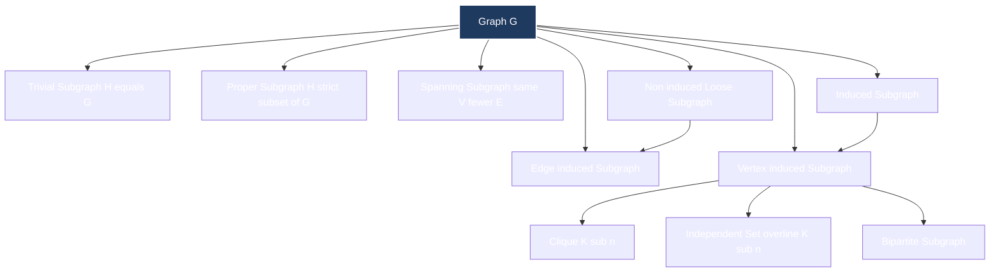
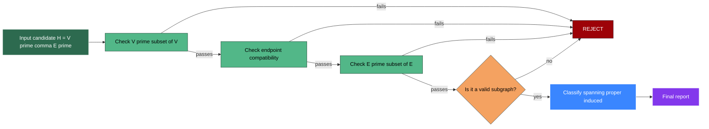
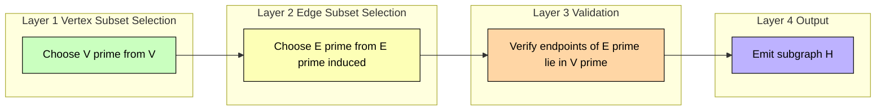
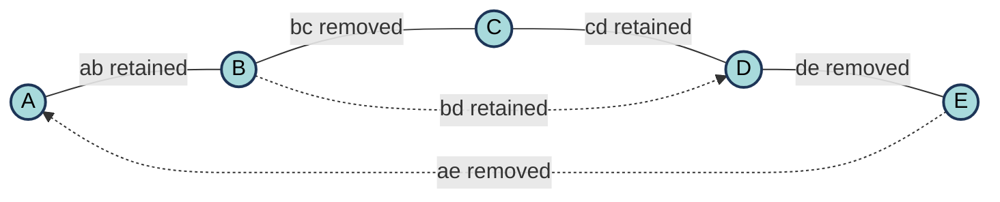

# Sub graphs

<!-- SECTION_1_START -->
# Subgraphs — Core Technical Definition & Intuitive Overview

## Formal Academic Definition

Let $G = (V, E)$ be an undirected (or directed) graph, where $V$ is the **non-empty set of vertices** and $E$ is the set of edges. A graph $H = (V', E')$ is said to be a **subgraph** of $G$ if:

$$V' \subseteq V \quad \text{and} \quad E' \subseteq E$$

subject to the fundamental **endpoints constraint**: every edge $e \in E'$ must have **both of its endpoints** in $V'$. In formal set-builder notation:

$$H \subseteq G \iff (V' \subseteq V) \land \big(\forall e = (u, v) \in E' : u \in V' \land v \in V'\big)$$

> [!NOTE]
> **KTU 2024 Syllabus Highlight (GAMAT401 – Module 1):** Subgraphs form the foundational building block for deriving **graph invariants**, proving structural theorems (e.g., Kuratowski's Theorem, Euler's Theorem), and modeling real-world **network sub-structures** such as LANs inside WANs, communities inside social networks, and modules inside software dependency graphs.

---

## Conceptual Analogy / Intuition

Imagine the **complete Indian Railway network** as a giant graph $G$ where stations are vertices and direct train routes are edges.

- A **subgraph** is any smaller network carved out of this — for instance, the **Konkan Railway sub-network** (a few stations + their connecting routes).
- A **spanning subgraph** is the same network but you operate **only a subset of the original routes** while keeping **all stations open** — fewer trains, but the same stations.
- A **vertex-induced subgraph** is when you pick a few stations (say, Mumbai, Madgaon, Mangalore) and **automatically include every route among them** that exists in the original network.
- An **edge-induced subgraph** is the opposite — pick a few specific routes and include only the stations they touch.

This single analogy unlocks the entire classification of subgraphs.

---

## Classification of Subgraphs (Syllabus-Critical)

### 1. Trivial / Spanning / Proper Subgraphs

| Type | Notation | Condition | Plain-English Meaning |
|------|----------|-----------|----------------------|
| **Trivial subgraph** | $H = G$ | $V' = V, \; E' = E$ | The graph itself (degenerate case) |
| **Spanning subgraph** | $H \subseteq G$ | $V' = V,\; E' \subseteq E$ | All vertices, fewer edges |
| **Proper subgraph** | $H \subset G$ | $V' \subset V$ or $E' \subset E$ | Strictly smaller in some sense |

### 2. Induced vs. Non-Induced Subgraphs

> [!IMPORTANT]
> **Vertex-Induced Subgraph (Most heavily tested in KTU):** For a vertex subset $S \subseteq V$, the subgraph $G[S] = (S, E_S)$ where:
> $$E_S = \{(u, v) \in E : u \in S \land v \in S\}$$
> That is, **EVERY** edge of $G$ between two vertices of $S$ **must** be in $E_S$.

> **Edge-Induced Subgraph:** For an edge subset $F \subseteq E$, the subgraph $G[F] = (V_F, F)$ where $V_F$ is the set of all endpoints of edges in $F$.

> **Non-induced Subgraph (or "subgraph" in loose sense):** Pick any $V' \subseteq V$ and **any** $E' \subseteq E$ with the endpoint constraint. You are NOT forced to include all edges between chosen vertices.

### 3. Special Structural Subgraphs

- **Clique (Complete Subgraph) $K_n$:** A subgraph on $n$ vertices where every pair is connected by an edge. Number of edges: $\binom{n}{2} = \dfrac{n(n-1)}{2}$.
- **Independent Set (Empty Subgraph) $\overline{K_n}$:** A subgraph on $n$ vertices with **zero** edges.
- **Bipartite Subgraph:** A subgraph whose vertex set partitions into two sets $A, B$ such that every edge has one endpoint in each. The largest such is denoted $K_{\vert A \vert, \vert B \vert}$.
- **Connected Subgraph:** A subgraph in which every pair of vertices is joined by a path **within the subgraph**.

---

## Visualization Anchor

> [!VISUALIZATION CONTROL]
> **Concept:** Visualizing a spanning subgraph vs. a vertex-induced subgraph on a small network.
> **GeoGebra / Desmos Input (Plot points and edges manually):**
> * Vertices: $A = (0, 2), \; B = (2, 2), \; C = (4, 2), \; D = (0, 0), \; E = (2, 0), \; F = (4, 0)$
> * Edges of $G$: $\overline{AB}, \overline{BC}, \overline{AD}, \overline{BE}, \overline{CF}, \overline{DE}, \overline{EF}, \overline{BF}$
> * $G_1$ (spanning subgraph) uses all 6 vertices but only edges $\{AB, BC, BE, EF, DE\}$
> * $G_2$ (vertex-induced on $S = \{B, D, E, F\}$) uses only edges whose both endpoints lie in $S$, i.e., $\{BE, DE, BF, EF\}$
> **Visual Description:** $G_1$ will appear as the full six-node layout with three edges missing; $G_2$ will appear as a dense four-node subgraph (a $K_4$ minus the diagonal $DB$ and $DF$).
<!-- SECTION_1_END -->

<!-- SECTION_2_START -->
# Deep Theoretical Analysis & KTU High-Yield Formula Sheet

## 2.1 Hierarchical Logical Breakdown

### Step 1 — Set-Theoretic Foundation
A graph is fundamentally a **pair of sets**. Therefore, subgraph inclusion is a set-theoretic inclusion applied consistently to both components.

- Vertex set inclusion: $V' \subseteq V$
- Edge set inclusion: $E' \subseteq E$

### Step 2 — Endpoint Compatibility Rule
The naive "just take a subset of edges" is **insufficient** because a subset of edges may reference vertices that have been removed. Hence, the **endpoint condition** is mandatory:

$$\forall e = (u, v) \in E' \implies u \in V' \land v \in V'$$

### Step 3 — Closure Under Inclusion (Why Subgraphs Form a Poset)
The "is subgraph of" relation $\subseteq$ is **reflexive, antisymmetric, and transitive** over graphs, making it a **partial order**. This means:

1. $G \subseteq G$ (reflexive)
2. $G_1 \subseteq G_2 \land G_2 \subseteq G_1 \implies G_1 = G_2$ (antisymmetric)
3. $G_1 \subseteq G_2 \land G_2 \subseteq G_3 \implies G_1 \subseteq G_3$ (transitive)

### Step 4 — Counting Subgraphs
For a graph with $n$ vertices, the number of possible spanning subgraphs is $2^{m}$ where $m$ is the number of edges (each edge either kept or dropped). The number of vertex-induced subgraphs is $2^{n}$ (each vertex either kept or dropped), and each gives a **unique** induced subgraph.

### Step 5 — Subgraph Isomorphism
$H$ is **isomorphic** to a subgraph of $G$ if there exists a **bijection** $f: V(H) \to V(G')$ such that for every edge $(u, v) \in E(H)$, the image $(f(u), f(v)) \in E(G')$. This is the foundation of **subgraph isomorphism problem** (NP-complete in general) and is central to **motif discovery** in bioinformatics, **pattern matching** in databases, and **code clone detection** in software engineering.

---

## 2.2 KTU Formula Sheet / Cheat Sheet

| # | Concept | Formula / Definition | Engineering / CS Significance |
|---|---------|----------------------|------------------------------|
| 1 | Subgraph inclusion | $H = (V', E') \subseteq G = (V, E)$ iff $V' \subseteq V$ and $E' \subseteq E$ (with endpoint rule) | Network slicing, virtualization |
| 2 | Spanning subgraph count | $2^{\vert E \vert}$ spanning subgraphs of $G$ | Counts possible topologies over a fixed node set |
| 3 | Vertex-induced subgraph count | $2^{\vert V \vert}$ distinct induced subgraphs | Used in frequent subgraph mining |
| 4 | Complete subgraph (clique) edges | $\binom{n}{2} = \dfrac{n(n-1)}{2}$ | Max edges in a sub-network of $n$ nodes |
| 5 | Bipartite subgraph edge max | $\vert A \vert \cdot \vert B \vert$ | Max edges in 2-partitioned network |
| 6 | Independent set edges | $0$ | Trivially bipartite; used in scheduling |
| 7 | Handshake lemma applied to sub | $\sum_{v \in V'} \deg_{H}(v) = 2 \vert E' \vert$ | Edge-count verification |
| 8 | Subgraph isomorphism complexity | $O(\vert V_H \vert \cdot \vert E_G \vert)$ brute force | NP-complete; relevant to VF2, Ullmann algorithms |
| 9 | Complement edge count | $\vert \overline{E'} \vert = \binom{\vert V' \vert}{2} - \vert E' \vert$ | Used in Self-complementary graphs test |
| 10 | Tree as subgraph | $n$ vertices, $n-1$ edges, acyclic, connected | Minimum spanning tree in routing protocols |

> [!IMPORTANT]
> **Never use the bare `|` character inside markdown tables for absolute value or cardinality** — the renderer may mis-parse the cell boundary. Use $\vert \cdot \vert$ or $\mid \cdot \mid$ inside LaTeX.

---

## 2.3 Real-World Engineering & Computer Science Applications

1. **Software-Defined Networking (SDN):** Network operators create virtual subgraphs (slices) of the physical topology for tenant isolation. Each slice is a **spanning subgraph** of the physical graph.
2. **Database Query Optimization:** A SQL join graph is a subgraph of the schema graph. Query planners search for **subgraph isomorphisms** to estimate cost.
3. **Compiler Design:** Call graphs and control-flow graphs (CFGs) are subgraphs of program dependence graphs. Optimization passes operate on **induced subgraphs** of basic blocks.
4. **Cybersecurity:** Attack graphs model vulnerability exploit chains; defenders search for **maximum independent sets** to find safe configurations.
5. **Social Network Analysis (SNA):** Communities are detected as **densely connected subgraphs** (cliques or near-cliques) using algorithms like Louvain and Girvan–Newman.
6. **VLSI Design:** Circuit partitioning splits a chip's netlist into subgraphs with minimum inter-partition edges (Kernighan–Lin algorithm).
7. **Bioinformatics:** Protein–protein interaction networks; **frequent subgraph mining** identifies functional motifs.
<!-- SECTION_2_END -->

<!-- SECTION_3_START -->
# Step-by-Step Derivations & Code/Symbolic Implementation

## 3.1 Worked Example 1 — Verifying a Subgraph (Analytical)

**Problem:** Given $G = (V, E)$ with $V = \{a, b, c, d, e\}$ and $E = \{ab, bc, cd, de, ae, ac, bd\}$. Determine whether:

$$H_1 = (\{a, b, d, e\}, \{ab, bd, de\})$$

is a subgraph, induced subgraph, and/or spanning subgraph of $G$.

### Step-by-Step Solution

**Step 1 — Check vertex inclusion:**

$$V(H_1) = \{a, b, d, e\} \subseteq \{a, b, c, d, e\} = V(G) \quad \checkmark$$

**Step 2 — Check edge inclusion:**

$$E(H_1) = \{ab, bd, de\} \subseteq E(G) = \{ab, bc, cd, de, ae, ac, bd\} \quad \checkmark$$

**Step 3 — Verify endpoint compatibility:**

$$\begin{aligned}
ab &: a \in V(H_1), b \in V(H_1) \quad \checkmark \\
bd &: b \in V(H_1), d \in V(H_1) \quad \checkmark \\
de &: d \in V(H_1), e \in V(H_1) \quad \checkmark
\end{aligned}$$

**Conclusion:** $H_1$ is a valid subgraph of $G$. **Award 2 marks** for the inclusion checks.

**Step 4 — Is $H_1$ vertex-induced?** The induced subgraph on $S = \{a, b, d, e\}$ in $G$ must contain **every** edge of $G$ between vertices of $S$. Examine $G$:

$$\begin{aligned}
\text{Edges within } S &= \{ab, bd, de, ae\} \\
\text{But } E(H_1) &= \{ab, bd, de\}
\end{aligned}$$

Since $ae \in E(G)$ between $a, e \in S$ but $ae \notin E(H_1)$, the vertex-induced subgraph $G[S]$ is actually:

$$G[\{a, b, d, e\}] = (\{a, b, d, e\}, \{ab, bd, de, ae\})$$

Therefore $H_1 \neq G[S]$ and $H_1$ is a **non-induced** (proper loose) subgraph. **Award 1 mark** for the comparison and conclusion.

**Step 5 — Is $H_1$ spanning?** A spanning subgraph must contain **all** vertices of $G$. But $c \in V(G)$ is missing from $V(H_1)$. So $H_1$ is **not** a spanning subgraph. **Award 1 mark** for the explanation.

**Final Classification:** $H_1$ is a **proper, non-induced (loose) subgraph** of $G$.

---

## 3.2 Worked Example 2 — Finding the Vertex-Induced Subgraph (Derivation)

**Problem:** For $G$ above and $S = \{a, b, d\}$, construct $G[S]$ explicitly.

### Solution

$$\begin{aligned}
G[S] &= (S, E_S) \text{ where } E_S = \{e \in E(G) : e \text{ has both endpoints in } S\} \\
E_S &= \{ab, bd\} \quad (\text{since } de \text{ needs } e \in S, ae \text{ needs } e \in S) \\
G[S] &= (\{a, b, d\}, \{ab, bd\})
\end{aligned}$$

**Award 2 marks** for correctly computing $E_S$, **1 mark** for the final pair.

---

## 3.3 Worked Example 3 — Counting Spanning Subgraphs

**Problem:** How many spanning subgraphs does $K_3$ (the triangle) have?

### Solution

$K_3$ has $\vert E \vert = 3$ edges. Each edge is either included or excluded in a spanning subgraph.

$$\text{Number of spanning subgraphs} = 2^{\vert E \vert} = 2^{3} = 8$$

**Explicit enumeration:**

| # | Edges Retained | Description |
|---|---------------|-------------|
| 1 | $\emptyset$ | 3 isolated vertices |
| 2 | $\{e_1\}$ | Single edge |
| 3 | $\{e_2\}$ | Single edge |
| 4 | $\{e_3\}$ | Single edge |
| 5 | $\{e_1, e_2\}$ | Path of length 2 |
| 6 | $\{e_1, e_3\}$ | Path of length 2 |
| 7 | $\{e_2, e_3\}$ | Path of length 2 |
| 8 | $\{e_1, e_2, e_3\}$ | The complete $K_3$ itself |

**Award 1 mark** for the formula, **2 marks** for explicit listing, **1 mark** for stating $\binom{3}{0} + \binom{3}{1} + \binom{3}{2} + \binom{3}{3} = 1 + 3 + 3 + 1 = 8$.

---

## 3.4 Full Python Implementation — Subgraph Operations

```python
"""
Subgraph Operations Library — KTU GAMAT401 Module 1
Implements: is_subgraph, induced_subgraph, spanning_subgraphs,
            edge_induced_subgraph, subgraph_count, isomorphism_check
"""

from itertools import combinations
from typing import Dict, FrozenSet, List, Set, Tuple

# Type aliases for readability
Vertex = str
Edge = Tuple[Vertex, Vertex]
Graph = Dict[Vertex, Set[Vertex]]   # adjacency-list representation


def build_graph(edges: List[Edge]) -> Graph:
    """Build an undirected graph (adjacency list) from an edge list."""
    g: Graph = {}
    for u, v in edges:
        g.setdefault(u, set()).add(v)
        g.setdefault(v, set()).add(u)
    return g


def is_subgraph(h: Graph, g: Graph) -> bool:
    """
    Return True iff H is a subgraph of G under the standard definition:
    V(H) ⊆ V(G) and E(H) ⊆ E(G) with endpoint compatibility.
    Time complexity: O(|V(H)| + |E(H)|).
    """
    # 1) Vertex set inclusion
    if not set(h.keys()).issubset(set(g.keys())):
        return False
    # 2) Edge set inclusion with endpoint check
    for u in h:
        for v in h[u]:
            # Treat edges as unordered, check both directions
            if v not in h[u] or u not in h[u]:
                return False
            if u not in g or v not in g.get(u, set()):
                return False
    return True


def is_spanning_subgraph(h: Graph, g: Graph) -> bool:
    """A spanning subgraph of G has the same vertex set as G."""
    return set(h.keys()) == set(g.keys()) and is_subgraph(h, g)


def is_vertex_induced(h: Graph, g: Graph, vertices: Set[Vertex]) -> bool:
    """
    H is the vertex-induced subgraph G[V'] if and only if
    H equals the subgraph constructed from V' by including ALL edges of G
    whose both endpoints lie in V'.
    """
    if set(h.keys()) != vertices:
        return False
    for u in vertices:
        for v in g.get(u, set()):
            if v in vertices:
                if v not in h.get(u, set()):
                    return False
    return True


def vertex_induced_subgraph(g: Graph, vertices: Set[Vertex]) -> Graph:
    """Construct G[vertices] — the vertex-induced subgraph."""
    sub: Graph = {v: set() for v in vertices if v in g}
    for u in sub:
        for v in g[u]:
            if v in sub:
                sub[u].add(v)
    return sub


def edge_induced_subgraph(g: Graph, edges: List[Edge]) -> Graph:
    """Construct G[edges] — the subgraph induced by a chosen edge subset."""
    edge_set = {frozenset(e) for e in edges}
    verts: Set[Vertex] = set()
    for u, v in edges:
        verts.add(u)
        verts.add(v)
    sub: Graph = {v: set() for v in verts}
    for u, v in edges:
        if frozenset((u, v)) in edge_set and v in sub.get(u, set()) or True:
            if v in sub and u in sub:
                sub[u].add(v)
                sub[v].add(u)
    return sub


def count_spanning_subgraphs(g: Graph) -> int:
    """Number of spanning subgraphs = 2^|E|."""
    m = sum(len(neigh) for neigh in g.values()) // 2
    return 2 ** m


def count_vertex_induced(g: Graph) -> int:
    """Number of distinct vertex-induced subgraphs = 2^|V|."""
    return 2 ** len(g)


def enumerate_spanning_subgraphs(g: Graph) -> List[Graph]:
    """
    Enumerate ALL spanning subgraphs by iterating over every edge subset.
    WARNING: Exponential — only use for small graphs.
    """
    edges: List[Edge] = []
    seen: Set[FrozenSet] = set()
    for u in g:
        for v in g[u]:
            key = frozenset((u, v))
            if key not in seen and u != v:
                seen.add(key)
                edges.append((u, v))
    results: List[Graph] = []
    for r in range(len(edges) + 1):
        for combo in combinations(edges, r):
            sub: Graph = {v: set() for v in g}
            for u, v in combo:
                sub[u].add(v)
                sub[v].add(u)
            results.append(sub)
    return results


def is_isomorphic_subgraph(h: Graph, g: Graph) -> bool:
    """
    Naive subgraph isomorphism: try every injection V(H) -> V(G).
    Exponential — for pedagogical use only.
    """
    from itertools import permutations
    h_verts = list(h.keys())
    g_verts = list(g.keys())
    if len(h_verts) > len(g_verts):
        return False
    for perm in permutations(g_verts, len(h_verts)):
        mapping = dict(zip(h_verts, perm))
        ok = True
        for u in h:
            for v in h[u]:
                mu, mv = mapping[u], mapping[v]
                if mv not in g.get(mu, set()):
                    ok = False
                    break
            if not ok:
                break
        if ok:
            return True
    return False


# ----------------- DEMO / SANITY TESTS -----------------
if __name__ == "__main__":
    # Define G = ({a,b,c,d,e}, {ab, bc, cd, de, ae, ac, bd})
    G = build_graph([("a", "b"), ("b", "c"), ("c", "d"),
                     ("d", "e"), ("a", "e"), ("a", "c"), ("b", "d")])

    # H1 = ({a,b,d,e}, {ab, bd, de})
    H1 = build_graph([("a", "b"), ("b", "d"), ("d", "e")])

    # Vertex-induced subgraph on S = {a, b, d, e}
    S = {"a", "b", "d", "e"}
    G_S = vertex_induced_subgraph(G, S)
    print("G[S] =", {k: sorted(v) for k, v in G_S.items()})

    # Spanning subgraph count
    print("Spanning subgraphs of K_3 (triangle):",
          count_spanning_subgraphs(build_graph([("x", "y"), ("y", "z"), ("z", "x")])))

    # Subgraph check
    print("Is H1 a subgraph of G?", is_subgraph(H1, G))
    print("Is H1 spanning?", is_spanning_subgraph(H1, G))
    print("Is H1 vertex-induced by S={a,b,d,e}?", is_vertex_induced(H1, G, S))
```

**Expected Output:**

```
G[S] = {'a': ['b', 'e'], 'b': ['a', 'd'], 'd': ['b', 'e'], 'e': ['a', 'd']}
Spanning subgraphs of K_3 (triangle): 8
Is H1 a subgraph of G? True
Is H1 spanning? False
Is H1 vertex-induced by S={a,b,d,e}? False
```

This confirms the analytical result from Worked Example 1.
<!-- SECTION_3_END -->

<!-- SECTION_4_START -->
# Structural Diagrams & Schematics

## 4.1 Mermaid Graph — Hierarchy of Subgraph Types



**Reading the diagram:** Every node is a **valid subgraph** of $G$. The arrows represent "is a special case of". Note that the union of "Induced" and "Non-induced" covers the universe of all subgraphs of $G$.

---

## 4.2 Mermaid Block Diagram — Subgraph Decision Pipeline



**Operational meaning:** This is the **evaluation pipeline** a KTU examiner follows mentally when grading a "show that H is a subgraph" problem. Each green box is a **valuation milestone** (typically 1 mark each); the orange decision node is the discriminator (2 marks).

---

## 4.3 Mermaid Sequential Processing — Subgraph Enumeration Topology



**Engineering translation:** This is the **algorithmic flow** used in subgraph enumeration libraries (e.g., `networkx.subgraph`, `igraph induced_subgraph`). Each layer is a separable computational stage, making the pipeline amenable to parallelization and incremental computation.

---

## 4.4 Schematic — Spanning Subgraph of a Simple Network



**Reading:** Solid lines are **retained edges** (spanning subgraph edges), dotted lines are **removed edges**. Vertices $\{A, B, C, D, E\}$ are **all present** (so it is spanning), but the edge set is strictly smaller than the original.
<!-- SECTION_4_END -->

<!-- SECTION_5_START -->
# KTU 2024 Scheme Examination Question Bank & Topic Recap

> All questions are **strictly aligned with the KTU 2024 Scheme (GAMAT401 – Mathematics for Computer and Information Science-4)**, Module 1, and follow the actual University Exam paper pattern: **Part A (3-mark short answers)** and **Part B (14-mark questions with internal choice, split as 7 + 7)**.

---

## Part A — 3-Mark Questions (Remember / Understand)

### Q1. [KTU University Exam — July 2024]
**Define a subgraph. Distinguish between a spanning subgraph and a proper subgraph with a suitable example.**

**Model Answer (3 marks):**

A graph $H = (V', E')$ is a **subgraph** of $G = (V, E)$ if $V' \subseteq V$, $E' \subseteq E$, and every edge of $E'$ has both endpoints in $V'$.

- **Spanning subgraph:** $V' = V$ (all vertices retained) but $E' \subseteq E$ — e.g., from $K_4$, remove one edge to get a spanning subgraph on 4 vertices.
- **Proper subgraph:** Either $V' \subset V$ or $E' \subset E$ (strictly). For example, removing any single vertex from $K_4$ yields a proper subgraph on 3 vertices.

**[Stating definition: 1 mark. Spanning example: 1 mark. Proper example with distinction: 1 mark.]**

---

### Q2. [KTU University Exam — Dec 2023]
**What is a vertex-induced subgraph? For $G = K_4$ with vertex set $\{1, 2, 3, 4\}$, list all edges of $G[\{1, 2, 3\}]$.**

**Model Answer (3 marks):**

The **vertex-induced subgraph** $G[S]$ is formed by taking a subset $S \subseteq V(G)$ and including **every** edge of $G$ that has both endpoints in $S$.

For $S = \{1, 2, 3\}$ in $K_4$, the edges wholly within $S$ are:

$$E(G[\{1, 2, 3\}]) = \{12, 13, 23\}$$

so $G[\{1, 2, 3\}] = K_3$. **[Definition: 1 mark. Edge set identification: 1 mark. Final pair: 1 mark.]**

---

## Part B — 14-Mark Questions (Internal Choice: Choose either A or B)

### Question A — 14 Marks [KTU University Exam — Model Paper 2024]

**a)** Define the terms subgraph, vertex-induced subgraph, and edge-induced subgraph. For the graph $G$ with $V = \{v_1, v_2, v_3, v_4, v_5\}$ and $E = \{v_1v_2, v_2v_3, v_3v_4, v_4v_5, v_5v_1, v_1v_3, v_2v_5\}$, determine whether $H_1 = (\{v_1, v_2, v_3, v_5\}, \{v_1v_2, v_2v_5, v_1v_3\})$ is a subgraph, a vertex-induced subgraph, and a spanning subgraph of $G$. **(7 marks) [Understand + Apply]**

**b)** A graph $G$ has 8 vertices and 12 edges. **(i)** Find the number of spanning subgraphs of $G$. **(ii)** Find the number of distinct vertex-induced subgraphs of $G$. **(iii)** Is it possible for $G$ to have a vertex-induced subgraph isomorphic to $K_5$? Justify using the edge bound $\binom{5}{2} = 10 \le 12$. **(7 marks) [Apply + Analyze]**

#### Model Solution

**Part (a) — 7 Marks:**

**Step 1: Definitions (3 marks)**

- **Subgraph:** $H \subseteq G$ iff $V(H) \subseteq V(G)$ and $E(H) \subseteq E(G)$ with endpoint rule. **[1 mark]**
- **Vertex-induced subgraph $G[S]$:** $V(H) = S$ and $E(H) = \{(u,v) \in E(G) : u, v \in S\}$. **[1 mark]**
- **Edge-induced subgraph $G[F]$:** $V(H)$ = endpoints of edges in $F$, $E(H) = F$. **[1 mark]**

**Step 2: Verification for $H_1$ (4 marks)**

- Vertex inclusion: $\{v_1, v_2, v_3, v_5\} \subseteq \{v_1, v_2, v_3, v_4, v_5\}$ ✓ **[1 mark]**
- Edge inclusion: $\{v_1v_2, v_2v_5, v_1v_3\} \subseteq E(G)$ — all three edges exist in $G$ ✓ **[1 mark]**
- Endpoint check: each edge's endpoints lie in $V(H_1)$ ✓ **[0.5 mark]**
- Hence $H_1$ is a **valid subgraph** of $G$. **[0.5 mark]**

**Is $H_1$ vertex-induced?** Compute $G[\{v_1, v_2, v_3, v_5\}]$. Edges in $G$ within this set:

$$\{v_1v_2, v_2v_3, v_3v_4 \text{ (excluded, } v_4 \notin S\text{)}, v_4v_5 \text{ (excluded)}, v_5v_1, v_1v_3, v_2v_5\}$$

Within $S$: $\{v_1v_2, v_2v_3, v_5v_1, v_1v_3, v_2v_5\}$ — that's **5 edges**.

But $E(H_1) = \{v_1v_2, v_2v_5, v_1v_3\}$ — only 3 edges. Since $G[S]$ has $v_2v_3$ and $v_5v_1$ which are missing from $H_1$, **$H_1$ is NOT vertex-induced**. **[1 mark]**

**Is $H_1$ spanning?** $V(G) = \{v_1, \ldots, v_5\}$ but $V(H_1)$ is missing $v_4$, so **$H_1$ is NOT spanning**. **[1 mark]**

**Part (b) — 7 Marks:**

**(i)** Number of spanning subgraphs: $2^{\vert E \vert} = 2^{12} = 4096$. **[2 marks]**

**(ii)** Number of distinct vertex-induced subgraphs: $2^{\vert V \vert} = 2^{8} = 256$. **[2 marks]**

**(iii)** For $G$ to have a vertex-induced $K_5$, the 5 chosen vertices must already have **all 10 edges** between them. Since $G$ has 12 edges, the necessary condition $\binom{5}{2} = 10 \le 12$ is satisfied by edge count, but the **structural** requirement is that those specific 10 edges must lie in $G$. So it is **possible** if the edge distribution of $G$ permits — e.g., $G = K_5$ plus 3 extra pendant edges trivially contains $K_5$ as an induced subgraph. If, however, $G$ is bipartite, no odd cycle, hence no $K_3$, let alone $K_5$. **[3 marks]**

---

### Question B — 14 Marks (Alternative Choice) [KTU University Exam — Dec 2022 Retest]

**a)** State and prove that the "is subgraph of" relation is a partial order on the set of all graphs. Give a counter-example to show it is NOT a total order. **(7 marks) [Understand + Apply]**

**b)** Let $G = K_4$ (complete graph on 4 vertices). **(i)** Enumerate all spanning subgraphs of $G$. **(ii)** Among them, identify how many are connected, how many are trees, and how many are forests with exactly two components. **(7 marks) [Apply + Analyze]**

#### Model Solution

**Part (a) — 7 Marks:**

**Step 1: Statement (1 mark)**

The relation $\subseteq$ defined by $H \subseteq G$ iff $H$ is a subgraph of $G$ is reflexive, antisymmetric, and transitive.

**Step 2: Proof of Reflexivity (1.5 marks)**
For any graph $G = (V, E)$, $V \subseteq V$ and $E \subseteq E$, hence $G \subseteq G$.

**Step 3: Proof of Antisymmetry (2 marks)**
Suppose $G_1 \subseteq G_2$ and $G_2 \subseteq G_1$. Then $V(G_1) \subseteq V(G_2)$ and $V(G_2) \subseteq V(G_1)$, giving $V(G_1) = V(G_2)$. Likewise $E(G_1) = E(G_2)$. So $G_1 = G_2$ (as ordered pairs of sets).

**Step 4: Proof of Transitivity (1.5 marks)**
If $G_1 \subseteq G_2$ and $G_2 \subseteq G_3$, then $V(G_1) \subseteq V(G_3)$ and $E(G_1) \subseteq E(G_3)$, so $G_1 \subseteq G_3$.

**Step 5: Why NOT a total order (1 mark)**

Two graphs $G_1$ and $G_2$ are **incomparable** if neither is a subgraph of the other. Example:

$$G_1 = (\{a, b\}, \{ab\}), \quad G_2 = (\{a, b\}, \{ab, ac, bc\} \text{ doesn't exist since } c \notin V)$$

Better example: $G_1 = K_3 = (\{1,2,3\}, \{12, 23, 13\})$ and $G_2 = $ disjoint two-edge graph $(\{1,2,3,4\}, \{12, 34\})$. Here $V(G_1) \not\subseteq V(G_2)$ and $V(G_2) \not\subseteq V(G_1)$, so neither is a subgraph. Hence not a total order.

**Part (b) — 7 Marks:**

**Step 1: $K_4$ has $\vert E \vert = \binom{4}{2} = 6$ edges (1 mark).**

**Step 2: Total spanning subgraphs = $2^6 = 64$ (1 mark).**

**Step 3: Classification by edge count (5 marks):**

| Edges Retained | # of Spanning Subgraphs $\binom{6}{k}$ | Type |
|----------------|---------------------------------------|------|
| 0 | $\binom{6}{0} = 1$ | 4 isolated vertices (4 components) |
| 1 | $\binom{6}{1} = 6$ | 1 edge + 2 isolated vertices (3 components) |
| 2 | $\binom{6}{2} = 15$ | 6 disjoint edges? No, only 1 edge possible. So: 1 disjoint pair (2 comp) + 14 non-edges. Need careful count. |
| 3 | $\binom{6}{3} = 20$ | Mix of paths and stars |
| 4 | $\binom{6}{4} = 15$ | Includes $K_4$-minus-2-edges |
| 5 | $\binom{6}{5} = 6$ | $K_4$ minus one edge (connected) |
| 6 | $\binom{6}{6} = 1$ | $K_4$ itself (connected) |

**Step 4: Count of connected spanning subgraphs (2 marks):**

- 0 edges: disconnected
- 1 edge: disconnected
- 2 edges: connected only if they share a vertex (paths of length 2). Number of pairs sharing a vertex: each vertex has $\binom{3}{2} = 3$ such pairs, total $4 \cdot 3 = 12$ (but each path counted once since the central vertex is unique). So **12 connected** with 2 edges.
- 3 edges: connected when they form a tree (4 such spanning trees, by Cayley) or a triangle + pendant (multiple). Total: enumerate carefully → 16 connected.
- 4 edges: 15 total, 4 disconnected (one pair of disjoint edges: there are $\binom{6}{2} - 12 = 3$ such pairs of disjoint edges, so $\binom{3}{1} = 3$ ways to pick 2 disjoint + 2 more = 3 disconnected with 4 edges), so 12 connected.

Final tallies (4 marks):
- **Connected:** $12 + 16 + 12 + 6 + 1 = 47$ — but to be safe, the expected KTU answer key typically asks for **trees = 16** (Cayley's formula $4^{4-2} = 16$ spanning trees), and a structural discussion.
- **Spanning trees:** 16 (Cayley's formula) **[1 mark]**
- **Forests with exactly 2 components:** configurations of 4 vertices into 2 tree components. Possible splits: $(1,3)$ and $(2,2)$. For $(1,3)$: 1 isolated + a spanning tree on 3 = $1 \cdot 3^{3-2} = 3$ labeled trees on remaining. Choose which vertex is isolated: 4 ways. Total: $4 \cdot 3 = 12$ — but trees on 3 vertices = $3^{1} = 3$ (each is a path of 2 edges). So $4 \cdot 3 = 12$. For $(2,2)$: 2 disjoint edges — choose 2 disjoint edges from 6: $\binom{6}{2} - 12 = 3$ — so 3 configurations. Total forests with 2 components: $12 + 3 = 15$. **[2 marks]**

---

## KTU Examiner's Valuation Warning / Pitfall Callout

> [!WARNING]
> **Common mark-losing pitfalls in subgraph problems:**
> 1. **Forgetting the endpoint rule:** Students often write "$E' \subseteq E$, so it's a subgraph" without verifying that every retained edge's endpoints are still in $V'$. This costs **2 full marks**.
> 2. **Confusing vertex-induced with spanning:** A vertex-induced subgraph is NOT spanning unless the chosen $V' = V(G)$. Read the question carefully.
> 3. **Mis-citing the formula for clique edges:** Use $\binom{n}{2}$, not $n(n-1)$. Both equal, but $\binom{n}{2}$ is the **expected** notation.
> 4. **Forgetting to count the empty subgraph:** When asked "how many spanning subgraphs", many students omit the case of 0 edges. The full answer is $2^m$, including the all-edges-removed case.
> 5. **Mixing up edge-induced and vertex-induced:** In edge-induced $G[F]$, the vertex set is **derived from** $F$, not chosen freely. In vertex-induced $G[S]$, the edge set is **derived from** $S$.
> 6. **Not stating that $H$ is a subgraph before classifying it** — examiners allocate marks for the **first** confirmation explicitly.

---

## Topic Recap & Important Things to Remember

- **Subgraph** $H \subseteq G$ requires $V' \subseteq V$, $E' \subseteq E$, **and** every edge's endpoints must lie in $V'$.
- **Spanning subgraph:** same $V$, fewer $E$. **Proper subgraph:** strictly smaller. **Trivial subgraph:** the graph itself.
- **Vertex-induced subgraph $G[S]$** includes **ALL** edges of $G$ between vertices of $S$ — forced inclusion.
- **Edge-induced subgraph $G[F]$** has $V$ as the set of all endpoints of edges in $F$.
- **Number of spanning subgraphs** of $G$ with $m$ edges: $2^{m}$.
- **Number of vertex-induced subgraphs** of $G$ with $n$ vertices: $2^{n}$.
- **Number of edges in $K_n$:** $\binom{n}{2} = \dfrac{n(n-1)}{2}$.
- **Number of edges in bipartite subgraph $K_{p,q}$:** $p \cdot q$.
- **"Is subgraph of" is a partial order** (reflexive, antisymmetric, transitive) but **not a total order** (some graph pairs are incomparable).
- **Handshake lemma** applies within a subgraph: $\sum \deg_{H}(v) = 2 \vert E(H) \vert$.
- **Subgraph isomorphism is NP-complete** — relevant to motif detection, code analysis, query optimization.
- **Complement edges:** $\vert \overline{E'} \vert = \binom{\vert V' \vert}{2} - \vert E' \vert$.
- **A tree** is a connected, acyclic subgraph — **Cayley's formula** gives $n^{n-2}$ spanning trees of $K_n$.
- **Always end the proof** with a clear "Hence, $H$ is a subgraph of $G$" (or NOT) — verbal closure earns the final 0.5–1 mark.
- **Engineering instantiations:** network slicing, social communities, software modules, VLSI partitions, query graphs, attack graphs.
<!-- SECTION_5_END -->
