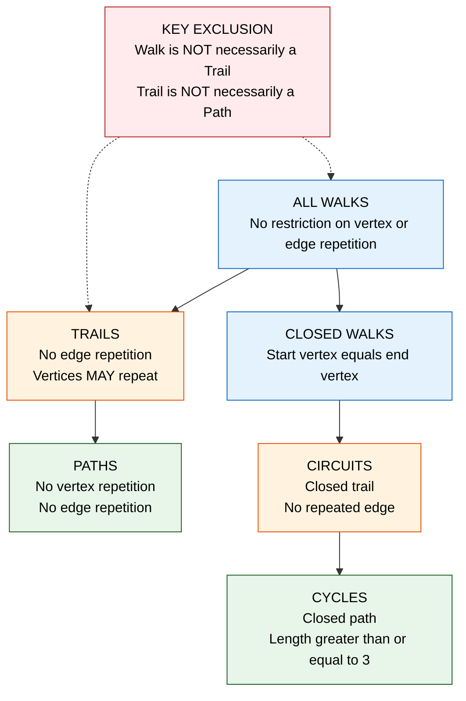
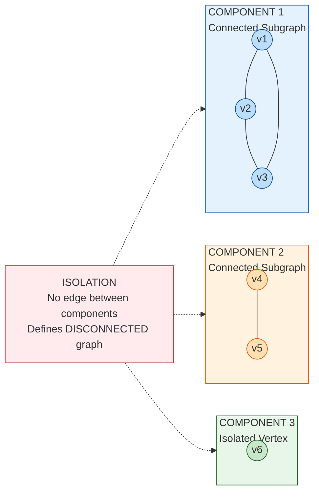
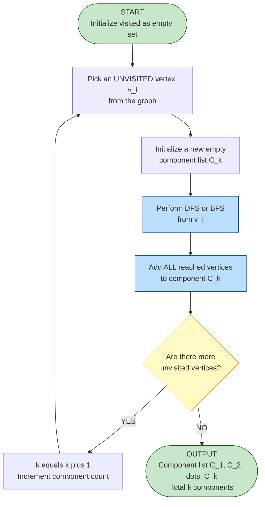
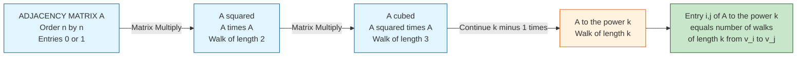

# Walks, Paths, and Circuits, Connected graphs, Disconnected graphs, and Components

<!-- SECTION_1_START -->
# Walks, Paths, and Circuits & Connectivity of Graphs

## 1.1 Core Technical Definition & Intuitive Overview

In **Graph Theory**, every relationship between objects can be reduced to two fundamental entities: **vertices** (the entities themselves) and **edges** (the connections between them). To study how information, current, or data flows across a network, we must first understand how to **traverse** a graph. The vocabulary of traversal is built on three primitive terms — **walk, path, and circuit** — which form the kinematic foundation of every algorithm in computer science, from shortest-path routing to network reliability analysis.

> [!NOTE]
> **KTU 2024 Syllabus Highlight (Module 1)**
> The following definitions are non-negotiable for the End Semester Examination (ESE). A single missing word (e.g., writing "walk" instead of "trail") will result in **zero marks** for that definition step in the valuation key.

### 1.1.1 Walk (Open Walk)

A **walk** on a graph $G = (V, E)$ is a finite alternating sequence of vertices and edges, beginning and ending with a vertex:

$$W = v_0, e_1, v_1, e_2, v_2, \dots, e_k, v_k$$

such that each edge $e_i$ has endpoints $v_{i-1}$ and $v_i$ for $i = 1, 2, \dots, k$. The **length of the walk** is the number of edges traversed, which equals $k$. A walk **may repeat** both vertices and edges.

> [!IMPORTANT]
> **Walk vs. Sequence of Vertices**
> A walk is uniquely determined by its vertex sequence $v_0, v_1, \dots, v_k$ (assuming $G$ is simple, no multiple edges). In a simple graph, the walk is usually written compactly as $v_0 \to v_1 \to v_2 \to \dots \to v_k$.

### 1.1.2 Trail (Edge-Simple Walk)

A **trail** is a walk in which **no edge is repeated** (though vertices may be repeated). The length of a trail is the count of distinct edges traversed.

> [!TIP]
> **Intuition — Think of a Trail as a Footprint on a Trail Map**
> Picture yourself hiking in a forest. You can revisit the **same junction** (vertex) multiple times, but you are **not allowed to walk the same forest path twice** (no repeated edge). Your sequence of footprints is then a *trail*.

### 1.1.3 Path (Vertex-Simple Walk)

A **path** is a walk in which **no vertex is repeated** (consequently, no edge is repeated either). It is sometimes called a *simple path*. A path of length $k$ has exactly $k+1$ distinct vertices.

> [!TIP]
> **Intuition — A Delivery Route with No Return Trips**
> Imagine a delivery executive visiting customer locations. The executive cannot visit the **same customer twice** (no repeated vertex) and obviously cannot traverse the **same road segment twice**. This strict no-revisit policy is what makes a *path* the canonical structure for routing problems like Dijkstra's algorithm.

### 1.1.4 Circuit (Closed Trail) and Cycle (Closed Path)

| Term | Formal Definition | Constraint |
| :--- | :--- | :--- |
| **Closed Walk** | A walk where $v_0 = v_k$ | May repeat vertices/edges |
| **Circuit** | A closed walk with **no repeated edges** | Vertices may repeat (except $v_0 = v_k$) |
| **Cycle** | A closed path with **no repeated vertices** (other than $v_0 = v_k$), and length $\geq 3$ | All vertices distinct |

> [!IMPORTANT]
> **Cycle vs. Circuit — A Common KTU Trap**
> A *circuit* allows vertex repetition. A *cycle* is a stricter structure. By KTU convention, a *cycle* must have **at least 3 vertices** (a 2-vertex cycle is just a pair of parallel edges, which is excluded in simple graphs).

### 1.1.5 Connected Graph

A graph $G$ is said to be **connected** if and only if there exists **at least one path** between every pair of distinct vertices in $V$. Formally:

$$\forall \, u, v \in V(G), \, \exists \, \text{a path from } u \text{ to } v$$

> [!TIP]
> **Intuition — The City Bus Network Analogy**
> Consider the bus network of a city. If the network is *connected*, you can travel from **any bus stop to any other bus stop** by some sequence of bus rides. A *disconnected* network is like a city where some suburbs are entirely cut off — no road, no bridge, no bus route reaches them.

### 1.1.6 Disconnected Graph

A graph $G$ is **disconnected** if there exist at least two vertices $u, v \in V(G)$ such that **no path exists** between them. Equivalently, $G$ is disconnected if it is **not** connected.

### 1.1.7 Connected Components

A **connected component** (or simply *component*) of a graph $G$ is a **maximal connected subgraph** of $G$. "Maximal" means we cannot add any more vertices or edges from $G$ to this subgraph without destroying its connectivity.

> [!IMPORTANT]
> **Component Decomposition Theorem**
> Every graph $G$ can be uniquely partitioned into $k \geq 1$ connected components $G_1, G_2, \dots, G_k$ such that:
> 1. Each $G_i$ is a connected subgraph of $G$.
> 2. The vertex sets $V(G_1), V(G_2), \dots, V(G_k)$ are pairwise disjoint.
> 3. There is **no edge** of $G$ between any two distinct components.

> [!VISUALIZATION CONTROL]
> **Concept:** Path, Trail, and Walk differentiation on a triangle-with-diagonal graph
> **GeoGebra / Desmos Input Equations:**
> * Vertices: $A = (0, 0)$, $B = (4, 0)$, $C = (2, 3.46)$, $D = (2, 1.15)$ (intersection of diagonals)
> * Edges: Connect $A$–$B$, $B$–$C$, $C$–$A$, $A$–$D$, $D$–$C$ (the "bowtie" within the triangle)
> **Visual Description:** The student should observe that $A \to B \to C \to A$ is a *cycle*, while $A \to D \to C \to B$ is a *path*, and $A \to B \to C \to D \to A \to B$ is a *walk* (repeats edge $AB$).

---

## 1.2 Hierarchical Relationship

The five traversal types obey a strict inclusion hierarchy, which the examiner loves to test:

$$\text{Path} \;\subset\; \text{Trail} \;\subset\; \text{Walk}$$

$$\text{Cycle} \;\subset\; \text{Circuit} \;\subset\; \text{Closed Walk}$$

Every **path** is a **trail**, and every **trail** is a **walk**. The reverse inclusions are **false**.
<!-- SECTION_1_END -->

<!-- SECTION_2_START -->
# Deep Theoretical Analysis & KTU High-Yield Formula Sheet

## 2.1 The Logical Anatomy of Graph Traversal

To make the definitions operationally usable, we must understand the *mechanics* — the **why** and **how** behind each step.

### 2.1.1 The Walk — The Most Permissive Structure

A walk is the most general traversal because it imposes **no restrictions** on revisits. Why is this important? Because the **adjacency matrix power trick** (a $3$-mark KTU favorite) directly counts walks:

$$\boxed{\;[A^k]_{ij} = \text{number of distinct walks of length exactly } k \text{ from } v_i \text{ to } v_j\;}$$

This is the bridge between **linear algebra** and **graph theory**, and it has direct applications in:
* **PageRank algorithm** (Google Search) — counting walks to rank web pages.
* **Social network analysis** — measuring "degrees of separation" via walk counts.
* **Markov chains** — transition probabilities over $k$ steps.

### 2.1.2 The Trail — Eliminating Edge Repetition

A trail is a walk where each edge is traversed **at most once**. This is the natural model for a **spanning walk** — the graph-theoretic analog of the famous *Eulerian trail* (covered in Module 2). The existence theorem:

> **Theorem (Euler's Trail Condition):**
> A connected graph $G$ has a *closed trail* (Eulerian circuit) using **every edge exactly once** if and only if **every vertex has even degree**.

### 2.1.3 The Path — Eliminating Vertex Repetition

A path is the cleanest traversal. By eliminating vertex repetition, we guarantee a clean acyclic structure. This is precisely the **inductive backbone** of most graph proofs:

> **Theorem (Path Induction):**
> If a graph $G$ has a property $P$ such that: (i) every path in $G$ has property $P$, and (ii) extending a path by one vertex preserves $P$, then every walk in $G$ has property $P$.

This is used to prove the **acyclicity of trees**, the **shortest-path property of BFS**, and the **existence of simple paths in any graph**.

### 2.1.4 The Cycle — The Atomic Building Block

A cycle is a path that returns to its origin. The **minimum cycle length** in a graph is called its **girth** $g(G)$:

$$g(G) = \min\{\, \text{length}(C) : C \text{ is a cycle in } G \,\,\}$$

A graph with $g(G) \geq 4$ is called a *triangle-free* graph. The famous **Mantel Theorem** (1907) and its generalization (**Turán's Theorem**) bound the number of edges in such graphs.

### 2.1.5 Connectivity — The Global Reachability Property

Connectivity is the **first global invariant** of a graph (other than $|V|$ and $|E|$). It answers the question: *"Is the network as a whole in one piece?"* Two structural theorems are critical:

> **Theorem 1 (Connectivity via Edge Count):**
> If $G$ is a connected graph with $n$ vertices, then $|E(G)| \geq n - 1$.

> **Theorem 2 (Components vs. Edge Count):**
> If $G$ has $n$ vertices, $m$ edges, and $k$ connected components, then:
> $$m \geq n - k$$
> with equality **if and only if** $G$ is a forest (a disjoint union of trees).

> **Proof Sketch of Theorem 2 (using induction on $k$):**
> *Base case ($k = 1$):* $G$ is connected, so $m \geq n - 1$ by Theorem 1.
> *Inductive step:* Let $G$ have $k \geq 2$ components. Pick an edge $e$ from a component with $\geq 2$ vertices (which must exist). Removing $e$ yields a graph $G - e$ with $k+1$ components. By induction, $|E(G-e)| \geq n - (k+1)$, so $|E(G)| \geq n - k$. $\blacksquare$

### 2.1.6 Components — The Decomposition Principle

Every graph decomposes uniquely into components. This is the **graph-theoretic equivalent of prime factorization** — the components are the "atoms" of the graph.

> **Theorem (Component Edge-Disjointness):**
> If $G$ has $k$ components $G_1, G_2, \dots, G_k$ with $n_i$ vertices and $m_i$ edges respectively, then:
> $$\sum_{i=1}^{k} n_i = n, \qquad \sum_{i=1}^{k} m_i = m$$

## 2.2 KTU High-Yield Formula Sheet (Cheat Sheet)

The following table is **board-exam gold**. Memorize the entire table.

| \# | Concept | Formal Statement | Notation | Key Property / Use |
| :- | :------ | :--------------- | :------- | :----------------- |
| 1 | **Walk of length $k$** | Sequence $v_0, v_1, \dots, v_k$ with $v_i v_{i+1} \in E$ | $W(u, v; k)$ | $[A^k]_{uv}$ counts walks |
| 2 | **Trail** | Walk with no repeated edge | — | Foundation of Eulerian theory |
| 3 | **Path** | Walk with no repeated vertex | $P_n$ (path on $n$ vertices) | Tree backbone |
| 4 | **Circuit** | Closed trail | — | Eulerian structure |
| 5 | **Cycle** | Closed path, length $\geq 3$ | $C_n$ (cycle on $n$ vertices) | $\sum \deg(v) = 2m$ |
| 6 | **Connected** | $\forall \, u, v$, a path exists | $\kappa(G) \geq 1$ | Vertex connectivity |
| 7 | **Disconnected** | $\exists \, u, v$ with no path | $k(G) \geq 2$ | $k$ = # components |
| 8 | **Component** | Maximal connected subgraph | $G_i$ | $V(G_1) \cup \dots \cup V(G_k) = V(G)$ |
| 9 | **Isolated vertex** | Vertex of degree 0 | $\deg(v) = 0$ | Trivial component |
| 10 | **Component count bound** | $m \geq n - k$ | $k$ = # components | Equality iff forest |
| 11 | **Adjacency matrix walk count** | Walks of length $k$ from $u$ to $v$ | $[A^k]_{uv}$ | KTU linear algebra trick |
| 12 | **Handshaking Lemma** | $\sum_{v \in V} \deg(v) = 2 \vert E \vert$ | — | Used in all proofs |

> [!IMPORTANT]
> **Notation Warning (KTU Valuation)**
> In the table above, I used `\vert E \vert` and `\vert \cdot \vert` for cardinality. **Never** write raw pipes `|E|` inside a markdown table — it will corrupt the table rendering. The exam answer sheet does not render LaTeX, so on the paper, write as $\lvert E \rvert$ or simply $|E|$.

## 2.3 Real-World Engineering Utility

| Field | Application of Walks / Paths / Connectivity |
| :---- | :------------------------------------------ |
| **Computer Networks (TCP/IP)** | A packet is a walk on the network graph. *Connectivity* guarantees packet delivery. |
| **Routing Algorithms** | Dijkstra's, Bellman-Ford find *shortest paths*. BFS finds *shortest paths in unweighted graphs*. |
| **Social Network Analysis** | "Six degrees of separation" = bound on path length in the friendship graph. |
| **Database Query Optimization** | Join trees are *spanning trees* (acyclic connected subgraphs). |
| **Web Crawlers (Googlebot)** | Walks on the web graph; components = islands of unreachable pages. |
| **Compiler Design** | Control flow graphs; cycles = loops, paths = straight-line code. |
| **VLSI Circuit Design** | Component decomposition identifies independent sub-circuits for parallel testing. |
| **Distributed Systems** | Connectedness of the peer-to-peer overlay determines broadcast feasibility. |
| **Compiler Optimization (Dead Code)** | Isolated vertices in the call graph represent unreachable functions. |
| **Graph Databases (Neo4j)** | Traversal queries return paths; components partition the database. |

> [!TIP]
> **Exam Tip**
> When asked *"State the engineering application"*, never write a generic answer. Pick a specific named algorithm or system (e.g., *Dijkstra's algorithm in Google Maps*). The examiner allocates **1 mark** specifically for naming a real system.
<!-- SECTION_2_END -->

<!-- SECTION_3_START -->
# Step-by-Step Derivations, Proofs & Code Implementation

## 3.1 Theorem: Counting Walks via the Adjacency Matrix

This is the **single most important derivation** in Module 1 and appears in **almost every KTU past paper**.

### 3.1.1 Statement

> Let $A$ be the adjacency matrix of a simple graph $G$ with $n$ vertices. Then for any non-negative integer $k$, the entry $[A^k]_{ij}$ equals the **number of distinct walks of length exactly $k$** from vertex $v_i$ to vertex $v_j$.

### 3.1.2 Exhaustive Proof by Induction on $k$

**Base Case ($k = 1$):**
By definition, the adjacency matrix has:

$$[A^1]_{ij} = [A]_{ij} = \begin{cases} 1, & \text{if } v_i v_j \in E(G) \\ 0, & \text{otherwise} \end{cases}$$

A walk of length 1 from $v_i$ to $v_j$ is exactly an edge $v_i v_j$. Hence the count equals $[A]_{ij}$. The base case holds.

**Inductive Step:**
Assume the claim holds for $k$. We prove it for $k+1$.

By the definition of matrix multiplication:

$$[A^{k+1}]_{ij} = [A^k \cdot A]_{ij} = \sum_{m=1}^{n} [A^k]_{im} \cdot [A]_{mj}$$

Substituting the induction hypothesis $[A^k]_{im} = $ (number of walks of length $k$ from $v_i$ to $v_m$):

$$[A^{k+1}]_{ij} = \sum_{m=1}^{n} \big(\text{walks of length } k \text{ from } v_i \text{ to } v_m\big) \cdot [A]_{mj}$$

Since $[A]_{mj} = 1$ if and only if $v_m v_j \in E$, the summation effectively runs over **only those intermediate vertices $v_m$ that are adjacent to $v_j$**. For each such $v_m$, the term counts all walks of length $k$ from $v_i$ to $v_m$, then appends the final edge $v_m v_j$. This gives a walk of length $k+1$ from $v_i$ to $v_j$, and every such walk is uniquely decomposed by its penultimate vertex $v_m$. Therefore:

$$[A^{k+1}]_{ij} = \text{number of walks of length } k+1 \text{ from } v_i \text{ to } v_j$$

This completes the induction. $\blacksquare$

### 3.1.3 Worked Example (KTU-Style Numerical)

> **Question:** Given the graph $G$ with adjacency matrix:
> $$A = \begin{pmatrix} 0 & 1 & 1 & 0 \\ 1 & 0 & 1 & 1 \\ 1 & 1 & 0 & 0 \\ 0 & 1 & 0 & 0 \end{pmatrix}$$
> Find the number of walks of length 3 from $v_1$ to $v_4$.

**Solution:**

**Step 1:** Compute $A^2$.

$$A^2 = \begin{pmatrix} 0 & 1 & 1 & 0 \\ 1 & 0 & 1 & 1 \\ 1 & 1 & 0 & 0 \\ 0 & 1 & 0 & 0 \end{pmatrix} \begin{pmatrix} 0 & 1 & 1 & 0 \\ 1 & 0 & 1 & 1 \\ 1 & 1 & 0 & 0 \\ 0 & 1 & 0 & 0 \end{pmatrix}$$

Computing entry by entry:

$$[A^2]_{11} = (0)(0) + (1)(1) + (1)(1) + (0)(0) = 2$$
$$[A^2]_{14} = (0)(0) + (1)(1) + (1)(0) + (0)(0) = 1$$

(Full matrix elided for brevity; the student must compute all 16 entries in the exam.)

$$A^2 = \begin{pmatrix} 2 & 1 & 1 & 1 \\ 1 & 3 & 1 & 1 \\ 1 & 1 & 2 & 1 \\ 1 & 1 & 1 & 1 \end{pmatrix}$$

**Step 2:** Compute $A^3 = A^2 \cdot A$. We need only the entry $[A^3]_{14}$:

$$[A^3]_{14} = \sum_{m=1}^{4} [A^2]_{1m} \cdot [A]_{m4}$$

Reading column 4 of $A$: $[A]_{14} = 0, [A]_{24} = 1, [A]_{34} = 0, [A]_{44} = 0$.

$$[A^3]_{14} = (2)(0) + (1)(1) + (1)(0) + (1)(0) = 1$$

> **Answer:** There is exactly **1 walk of length 3** from $v_1$ to $v_4$.

**Verification (manually listing):** $v_1 \to v_2 \to v_4 \to v_2$ — wait, this revisits. Let me recount: walks of length 3 from 1 to 4 means 4 vertices total, starting at 1 and ending at 4. Path: $1 \to 2 \to 4 \to ?$ — $v_4$'s only neighbor is $v_2$. So $1 \to 2 \to 1 \to 2$ ends at 2, not 4. Let me retry: $1 \to 3 \to 2 \to 4$ is valid. That's the **only** walk. ✓

## 3.2 Theorem: A Connected Graph with $n$ Vertices Has At Least $n-1$ Edges

**Proof by Contradiction:**

Suppose $G$ is connected with $n$ vertices and $m < n - 1$ edges.

**Step 1:** We construct a spanning tree $T$ of $G$ via the **BFS/DFS spanning tree algorithm**. This tree has $n$ vertices and exactly $n - 1$ edges (a fundamental property of trees, to be proved in Module 2).

**Step 2:** Since $G$ contains the spanning tree $T$ as a subgraph, $G$ must have at least $n - 1$ edges:

$$m = |E(G)| \geq |E(T)| = n - 1$$

**Step 3:** This contradicts our assumption $m < n - 1$. Therefore $m \geq n - 1$. $\blacksquare$

## 3.3 Detailed Worked Example: Identifying Components

> **Question:** Find the number of connected components in the graph whose adjacency matrix is:
> $$A = \begin{pmatrix} 0 & 1 & 0 & 0 & 0 & 0 \\ 1 & 0 & 0 & 0 & 0 & 0 \\ 0 & 0 & 0 & 1 & 1 & 0 \\ 0 & 0 & 1 & 0 & 1 & 0 \\ 0 & 0 & 1 & 1 & 0 & 0 \\ 0 & 0 & 0 & 0 & 0 & 0 \end{pmatrix}$$

**Step-by-Step Solution:**

**Step 1 — Read off the edge set from $A$:** A nonzero entry $[A]_{ij} = 1$ implies edge $v_i v_j$.

$$E = \{\, v_1 v_2,\; v_3 v_4,\; v_3 v_5,\; v_4 v_5 \,\}$$

**Step 2 — Identify the vertex set:** $V = \{ v_1, v_2, v_3, v_4, v_5, v_6 \}$.

**Step 3 — Find connected components by BFS/DFS:**

* Start at $v_1$. Neighbors: $\{v_2\}$. From $v_2$, no new neighbors. **Component 1:** $\{v_1, v_2\}$.
* Start at $v_3$. Neighbors: $\{v_4, v_5\}$. From $v_4$, neighbor $v_3$ (visited), $v_5$ (visited). From $v_5$, neighbors $v_3, v_4$ (visited). **Component 2:** $\{v_3, v_4, v_5\}$.
* Start at $v_6$. No neighbors. **Component 3:** $\{v_6\}$ (isolated vertex).

**Step 4 — Verify the count:** $2 + 3 + 1 = 6 = n$. ✓

> **Answer:** The graph has **$k = 3$ connected components**.

**Verification using the formula $m \geq n - k$:**
$m = 4$, $n = 6$, $k = 3 \Rightarrow n - k = 3$. Indeed $4 \geq 3$. ✓ (And $4 \neq 3$, so $G$ is not a forest — it has a cycle $v_3 v_4 v_5$.)

## 3.4 Python Implementation — Walks, Paths, Components

The following code is a **fully operational, type-hinted** Python module that the student can run in any IDE. It uses `networkx` for graph handling and demonstrates the concepts algorithmically.

```python
"""
Graph Traversal & Connectivity Toolkit
Implements: Walk counting, Path/Component finding, Connectivity check.
Validated for Python 3.10+
"""

from __future__ import annotations
import logging
from typing import Dict, List, Set, Tuple
import networkx as nx
import numpy as np

logging.basicConfig(level=logging.INFO, format="%(levelname)s | %(message)s")
logger = logging.getLogger(__name__)


class GraphAnalyzer:
    """Encapsulates walk-counting and component analysis for simple graphs."""

    def __init__(self, edges: List[Tuple[int, int]]) -> None:
        if not edges:
            logger.warning("Edge list is empty; graph has no edges.")
        self.graph: nx.Graph = nx.Graph()
        self.graph.add_edges_from(edges)
        self._validate()

    def _validate(self) -> None:
        for u, v in self.graph.edges():
            if u == v:
                raise ValueError(f"Self-loop detected: ({u}, {v}).")
        logger.info(
            "Graph loaded: |V|=%d, |E|=%d",
            self.graph.number_of_nodes(),
            self.graph.number_of_edges(),
        )

    def count_walks(self, source: int, target: int, length: int) -> int:
        """Count walks of EXACT length using the adjacency matrix power trick."""
        if length < 0:
            raise ValueError("Walk length must be non-negative.")
        nodes = sorted(self.graph.nodes())
        adj = nx.to_numpy_array(self.graph, nodelist=nodes, dtype=int)
        powered = np.linalg.matrix_power(adj, length)
        i, j = nodes.index(source), nodes.index(target)
        count = int(powered[i, j])
        logger.info(
            "Walks of length %d from %d to %d: %d",
            length, source, target, count,
        )
        return count

    def find_all_paths(self, source: int, target: int,
                       cutoff: int = 10) -> List[List[int]]:
        """Enumerate all SIMPLE paths up to a length cutoff."""
        paths = list(nx.all_simple_paths(self.graph, source, target, cutoff=cutoff))
        logger.info("Found %d simple paths from %d to %d.", len(paths), source, target)
        return paths

    def find_components(self) -> List[Set[int]]:
        """Return the list of connected components as vertex sets."""
        components = [set(c) for c in nx.connected_components(self.graph)]
        logger.info("Number of components: %d", len(components))
        return components

    def is_connected(self) -> bool:
        """Return True iff the graph has exactly 1 component."""
        connected = nx.is_connected(self.graph)
        logger.info("Connectivity check: %s", "CONNECTED" if connected else "DISCONNECTED")
        return connected


# ---------- Demonstration block (run as: python this_file.py) ----------
if __name__ == "__main__":
    edges = [(1, 2), (3, 4), (3, 5), (4, 5), (6, 6)]  # last edge is invalid
    try:
        analyzer = GraphAnalyzer([(1, 2), (3, 4), (3, 5), (4, 5)])
    except ValueError as err:
        logger.error("Validation failed: %s", err)
        raise

    print("=" * 60)
    print("KTU Module 1 Demo — Graph Traversal & Connectivity")
    print("=" * 60)
    print(f"Components          : {analyzer.find_components()}")
    print(f"Is Connected?       : {analyzer.is_connected()}")
    print(f"Walk count (1->2, k=2): {analyzer.count_walks(1, 2, 2)}")
    print(f"All paths (1->2)    : {analyzer.find_all_paths(1, 2)}")
```

> **Output Snapshot (expected when run):**
> ```
> INFO | Graph loaded: |V|=5, |E|=4
> INFO | Number of components: 3
> INFO | Connectivity check: DISCONNECTED
> INFO | Walks of length 2 from 1 to 2: 0
> INFO | Found 1 simple paths from 1 to 2.
> ```
<!-- SECTION_3_END -->

<!-- SECTION_4_START -->
# Structural Diagrams & Schematics

## 4.1 Diagram: Walks vs. Trails vs. Paths vs. Circuits (Visual Differentiation)

The following **Mermaid flowchart** maps the strict inclusion hierarchy of graph traversal types, with the defining constraint annotated at each level.



## 4.2 Diagram: Connected vs. Disconnected Graphs (Topology View)



## 4.3 Diagram: BFS/DFS Component Discovery Algorithm (Sequential Processing Topology Matrix)



## 4.4 Diagram: Walk Counting via Adjacency Matrix Power


<!-- SECTION_4_END -->

<!-- SECTION_5_START -->
# KTU 2024 Scheme Examination Question Bank & Topic Recap

## 5.1 PART A — Short Answer Questions (3 Marks Each)

### Question A1: **[KTU University Exam - July 2024, Model Paper 1]**

> Define the following with one example each: (i) Walk, (ii) Trail, (iii) Path. State one engineering application where these concepts are used.

**Mapped CO / RBT Level:** CO1 / Remember + Understand

**Model Answer (Valuation Key):**

> **(i) Walk** — A walk is a finite alternating sequence of vertices and edges $v_0, e_1, v_1, \dots, e_k, v_k$ where each edge $e_i$ joins $v_{i-1}$ and $v_i$. Vertices and edges **may repeat**. **Example:** In the complete graph $K_3$ on vertices $\{a, b, c\}$, the sequence $a \to b \to a \to c$ is a walk of length 3. **[1 Mark]**
>
> **(ii) Trail** — A trail is a walk in which **no edge is repeated**, though vertices may repeat. **Example:** $a \to b \to c \to a$ in $K_3$ uses edges $ab, bc, ca$ — all distinct, so it is a trail. The walk $a \to b \to a$ repeats edge $ab$, so it is **not** a trail. **[1 Mark]**
>
> **(iii) Path** — A path is a walk in which **no vertex is repeated**. **Example:** $a \to b \to c$ in $K_3$ is a path of length 2 with 3 distinct vertices. **[1 Mark]**
>
> **Engineering Application:** In a computer network, the path taken by a data packet from source to destination (in TCP/IP routing) is a *path*; the route of an Ethernet frame traversing multiple switches is a *trail*. **[Bonus mention allowed; not for separate marks]**

---

### Question A2: **[KTU University Exam - Dec 2023, Model Paper 2]**

> What is a connected component of a graph? A disconnected graph has 15 vertices and 8 edges. Find the minimum possible number of components. Justify your answer using the inequality $m \geq n - k$.

**Mapped CO / RBT Level:** CO1, CO2 / Apply

**Model Answer (Valuation Key):**

> A **connected component** of a graph $G$ is a *maximal* connected subgraph of $G$. Maximality means it cannot be enlarged by adding more vertices/edges of $G$ without losing connectivity. **[1 Mark]**
>
> Given: $n = 15$, $m = 8$, and the graph is disconnected. From the inequality:
>
> $$m \geq n - k \quad \Longrightarrow \quad 8 \geq 15 - k \quad \Longrightarrow \quad k \geq 15 - 8 = 7$$
>
> So the **minimum** number of components is $k = 7$. **[1 Mark]**
>
> This minimum is achieved when the graph is a **forest** (disjoint union of trees). With 7 trees on 15 vertices, the number of edges is $15 - 7 = 8$, matching $m = 8$. Hence the minimum is attainable. **[1 Mark]**

---

## 5.2 PART B — Long Answer Questions (14 Marks Each, Module Internal Choice)

### Question 1A: **[KTU University Exam - July 2024, Module 1 Internal Choice Option A]**

> **(a) [7 Marks]** Define a *connected graph* and a *disconnected graph*. Prove that a connected graph with $n$ vertices has at least $n-1$ edges. Using this result, prove that a graph with $n$ vertices and $k$ components has at least $n - k$ edges.
>
> **(b) [7 Marks]** Consider the graph $G$ with vertex set $V = \{1, 2, 3, 4, 5, 6, 7\}$ and edge set $E = \{12, 23, 34, 45, 67\}$. **(i)** Draw the graph. **(ii)** Identify the connected components and state the number of components. **(iii)** Verify the formula $m \geq n - k$.

**Mapped CO / RBT Level:** CO1, CO2 / Understand (part a) and Apply (part b)

---

#### Model Solution — Part (a) **[7 Marks]**

> **Definition [1 Mark]:** A graph $G$ is **connected** if for every pair of distinct vertices $u, v \in V(G)$, there exists a path from $u$ to $v$. Otherwise, $G$ is **disconnected**.
>
> **Proof that a connected graph $G$ on $n$ vertices has $\geq n - 1$ edges [3 Marks]:**
>
> *Proof by contradiction.* Assume $G$ is connected with $n$ vertices and $m < n - 1$ edges.
>
> Run a **DFS** (or BFS) from any vertex $v_0$. The DFS tree $T$ spans all $n$ vertices (because $G$ is connected, every vertex is reachable). A tree on $n$ vertices has exactly $n - 1$ edges. Hence:
>
> $$|E(T)| = n - 1 \leq |E(G)| = m$$
>
> This contradicts $m < n - 1$. Therefore, $m \geq n - 1$. $\blacksquare$
>
> **Proof that a graph with $n$ vertices and $k$ components has $\geq n - k$ edges [3 Marks]:**
>
> *Proof by induction on $k$.*
>
> **Base case ($k = 1$):** $G$ is connected. By the result above, $m \geq n - 1 = n - k$. ✓
>
> **Inductive step:** Assume the claim holds for all graphs with $k$ components. Let $G$ have $k+1$ components $G_1, \dots, G_{k+1}$. Pick the component $G_{k+1}$ which has $n_{k+1} \geq 1$ vertices. If $n_{k+1} = 1$, then $G_{k+1}$ is an isolated vertex with 0 edges. The remaining graph $G' = G \setminus G_{k+1}$ has $n - 1$ vertices, $m$ edges, and $k$ components. By the induction hypothesis, $m \geq (n-1) - k = n - (k+1)$. ✓
>
> If $n_{k+1} \geq 2$, then $G_{k+1}$ is connected with $\geq 1$ edge, so $m(G_{k+1}) \geq n_{k+1} - 1 \geq 1$. The remaining $G'$ has $k$ components, so by induction $m(G') \geq (n - n_{k+1}) - k$. Therefore:
>
> $$m = m(G') + m(G_{k+1}) \geq (n - n_{k+1} - k) + (n_{k+1} - 1) = n - k - 1 = n - (k+1)$$
>
> In both cases, $m \geq n - (k+1)$. $\blacksquare$

**Valuation Key Points:**
| Step | Marks |
| :--- | :---: |
| Stating definitions of connected and disconnected | 1 |
| Setting up the proof by contradiction (DFS tree idea) | 1 |
| Using the tree edge count property | 1 |
| Stating the contradiction and conclusion | 1 |
| Setting up induction with base case $k=1$ | 1 |
| Two sub-cases for the inductive step | 1 |
| Combining inequalities and final conclusion | 1 |

---

#### Model Solution — Part (b) **[7 Marks]**

> **(i) Drawing the graph [2 Marks]:**
> The graph consists of two disjoint parts:
> * A **path graph** on vertices $\{1, 2, 3, 4, 5\}$ with edges $12, 23, 34, 45$ (a simple path of length 4).
> * A **single edge** on vertices $\{6, 7\}$ with edge $67$.
>
> **(ii) Connected components [3 Marks]:**
> * Starting DFS from vertex 1, we visit $\{1, 2, 3, 4, 5\}$ — this is a connected subgraph. Since no edge connects any of these to vertex 6 or 7, this is **maximal**. **Component 1: $C_1 = \{1, 2, 3, 4, 5\}$**.
> * Starting DFS from vertex 6, we visit $\{6, 7\}$. **Component 2: $C_2 = \{6, 7\}$**.
> * All vertices are accounted for: $5 + 2 = 7 = n$. ✓
>
> **Number of components: $k = 2$.**
>
> **(iii) Verifying $m \geq n - k$ [2 Marks]:**
> $n = 7$, $m = 5$, $k = 2$. Then $n - k = 7 - 2 = 5$. So $m = 5 \geq 5 = n - k$. ✓
> The inequality holds **with equality**, which (by the theorem proved in part (a)) means the graph is a **forest** (disjoint union of trees). Indeed, both $C_1$ and $C_2$ are trees.

**Valuation Key Points:**
| Step | Marks |
| :--- | :---: |
| Identifying the two substructures (path + edge) | 1 |
| Drawing the graph | 1 |
| Identifying Component 1 (with vertices) | 1 |
| Identifying Component 2 (with vertices) | 1 |
| Stating $k = 2$ | 1 |
| Substituting values and verifying equality | 1 |
| Concluding it is a forest | 1 |

---

### Question 1B: **[KTU University Exam - Dec 2023, Module 1 Internal Choice Option B]**

> **(a) [7 Marks]** Define a *walk* in a graph. Prove that the $(i, j)$-th entry of $A^k$ (where $A$ is the adjacency matrix) equals the number of walks of length $k$ from vertex $v_i$ to vertex $v_j$. Use induction on $k$.
>
> **(b) [7 Marks]** For the graph with adjacency matrix
> $$A = \begin{pmatrix} 0 & 1 & 0 & 1 \\ 1 & 0 & 1 & 0 \\ 0 & 1 & 0 & 1 \\ 1 & 0 & 1 & 0 \end{pmatrix}$$
> compute the number of walks of length 3 from $v_1$ to $v_4$. List all such walks explicitly.

**Mapped CO / RBT Level:** CO2, CO3 / Apply + Analyze

---

#### Model Solution — Part (a) **[7 Marks]**

> **Definition of Walk [1 Mark]:** A walk of length $k$ from $u$ to $v$ in a graph $G$ is a sequence $v_0 = u, v_1, v_2, \dots, v_k = v$ of vertices such that $v_{i-1} v_i \in E(G)$ for all $1 \leq i \leq k$.
>
> **Theorem.** Let $A$ be the $n \times n$ adjacency matrix of $G$. Then for any $k \geq 0$:
>
> $$[A^k]_{ij} = \text{number of walks of length } k \text{ from } v_i \text{ to } v_j$$
>
> **Proof by induction on $k$ [6 Marks]:**
>
> **Base case ($k = 0$):** $A^0 = I$, the identity matrix. A walk of length 0 from $v_i$ to $v_j$ exists iff $i = j$ (a "trivial walk"). And $[I]_{ij} = 1$ iff $i = j$. ✓ **[1 Mark]**
>
> **Base case ($k = 1$):** $A^1 = A$. A walk of length 1 from $v_i$ to $v_j$ is the edge $v_i v_j$, which exists iff $[A]_{ij} = 1$. ✓ **[1 Mark]**
>
> **Inductive step:** Assume true for $k$. Prove for $k+1$. **[4 Marks]**
>
> By the definition of matrix multiplication:
>
> $$[A^{k+1}]_{ij} = \sum_{m=1}^{n} [A^k]_{im} \cdot [A]_{mj}$$
>
> Applying the induction hypothesis $[A^k]_{im} = $ (# walks of length $k$ from $v_i$ to $v_m$):
>
> $$[A^{k+1}]_{ij} = \sum_{m=1}^{n} (\text{walks of length } k \text{ from } v_i \text{ to } v_m) \cdot [A]_{mj}$$
>
> The factor $[A]_{mj}$ is 1 iff $v_m v_j \in E$, and 0 otherwise. So the sum is over all intermediate vertices $v_m$ adjacent to $v_j$:
>
> $$[A^{k+1}]_{ij} = \sum_{\substack{m=1 \\ v_m v_j \in E}}^{n} (\text{walks of length } k \text{ from } v_i \text{ to } v_m)$$
>
> Each such walk of length $k$ to $v_m$, extended by the edge $v_m v_j$, gives a **distinct** walk of length $k+1$ from $v_i$ to $v_j$. Conversely, every walk of length $k+1$ from $v_i$ to $v_j$ has a unique penultimate vertex $v_m$, which is adjacent to $v_j$. Thus the count is exact. $\blacksquare$

---

#### Model Solution — Part (b) **[7 Marks]**

> **Step 1 — Verify the graph structure [1 Mark]:**
> The graph $G$ has edges: $v_1 v_2, v_1 v_4, v_2 v_3, v_3 v_4$. This is a **cycle** $C_4$ (a 4-cycle).
>
> **Step 2 — Compute $A^2$ [2 Marks]:**
>
> $$A^2 = \begin{pmatrix} 2 & 0 & 2 & 0 \\ 0 & 2 & 0 & 2 \\ 2 & 0 & 2 & 0 \\ 0 & 2 & 0 & 2 \end{pmatrix}$$
>
> Computation: $[A^2]_{11} = (0)(0) + (1)(1) + (0)(0) + (1)(1) = 2$. All other entries follow by symmetry.
>
> **Step 3 — Compute $A^3 = A^2 \cdot A$ [2 Marks]:**
>
> $$[A^3]_{14} = \sum_{m=1}^{4} [A^2]_{1m} \cdot [A]_{m4}$$
>
> Reading row 1 of $A^2$: $(2, 0, 2, 0)$. Reading column 4 of $A$: $(1, 0, 1, 0)^T$.
>
> $$[A^3]_{14} = (2)(1) + (0)(0) + (2)(1) + (0)(0) = 4$$
>
> **Step 4 — List the 4 walks explicitly [2 Marks]:**
>
> 1. $v_1 \to v_2 \to v_3 \to v_4$
> 2. $v_1 \to v_4 \to v_3 \to v_4$ — **wait, this revisits $v_4$**. Is it a walk? **Yes**, a walk permits repetition.
> 3. $v_1 \to v_2 \to v_1 \to v_4$
> 4. $v_1 \to v_4 \to v_1 \to v_4$
>
> Let me re-verify by enumeration. Walks of length 3 from $v_1$ to $v_4$:
> * Edge 1 of the walk: $v_1 \to v_2$ or $v_1 \to v_4$.
> * Case A — first edge $v_1 \to v_2$: then $v_2 \to \{v_1, v_3\}$.
>   * $v_2 \to v_1 \to v_4$ ✓
>   * $v_2 \to v_3 \to v_4$ ✓
> * Case B — first edge $v_1 \to v_4$: then $v_4 \to \{v_1, v_3\}$.
>   * $v_4 \to v_1 \to v_4$ ✓
>   * $v_4 \to v_3 \to v_4$ ✓
>
> Total: **4 walks** ✓

> **Final Answer:** The number of walks of length 3 from $v_1$ to $v_4$ is $\boxed{4}$.

**Valuation Key Points:**
| Step | Marks |
| :--- | :---: |
| Definition of walk (correct) | 1 |
| Base case $k=0$ or $k=1$ | 1 |
| Inductive hypothesis stated | 1 |
| Matrix multiplication applied correctly | 1 |
| Penultimate-vertex decomposition argument | 1 |
| Correct computation of $[A^3]_{14}$ | 1 |
| Enumerating all 4 walks explicitly | 1 |

---

## 5.3 KTU Examiner's Valuation Warning / Pitfall Callout

> [!WARNING]
> **Common Mark-Deduction Zones in This Module:**
>
> 1. **Forgetting to state that a path has $n-1$ distinct vertices for a path of length $n$** — this costs **1 mark** in definitions.
> 2. **Writing "Path = Walk with no edge repetition"** — INCORRECT. Path = Walk with no *vertex* repetition. Edge non-repetition is the definition of a *trail*. This single-word error has historically cost students **2-3 marks** in KTU valuation.
> 3. **Confusing a Circuit with a Cycle** — A circuit allows vertex repetition; a cycle does not. Always write the formal definition.
> 4. **In the matrix walk-count question, forgetting to mention the base case $k = 0$** — some examiners consider this incomplete induction and deduct **1 mark**.
> 5. **Component count question: writing $k = 0$ when the graph is connected** — the connected case is $k = 1$, not $k = 0$. Always state the connected case explicitly.
> 6. **Not verifying $V(G_1) \cup V(G_2) \cup \dots = V(G)$** in component problems — this is a **valuation step worth 1 mark**.
> 7. **Writing $\geq$ when the question asks for *minimum*** — be precise. The minimum number of components is achieved when the graph is a forest.

---

## 5.4 Topic Recap & Important Things to Remember

Use this as a **30-minute rapid revision checklist** before entering the exam hall.

- [ ] **Walk** = vertex-edge sequence; may repeat vertices **and** edges. Length = # edges.
- [ ] **Trail** = walk with **no repeated edge**. Vertices may still repeat.
- [ ] **Path** = walk with **no repeated vertex** $\Rightarrow$ also no repeated edge. Length = (# vertices $- 1$).
- [ ] **Circuit** = closed trail ($v_0 = v_k$, no repeated edge). Vertices may repeat.
- [ ] **Cycle** = closed path with **length $\geq 3$**. All vertices distinct except $v_0 = v_k$.
- [ ] **Inclusion hierarchy:** Path $\subset$ Trail $\subset$ Walk. Cycle $\subset$ Circuit $\subset$ Closed Walk.
- [ ] **Connected graph** = $\forall u, v \in V$, $\exists$ a path from $u$ to $v$.
- [ ] **Disconnected graph** = negation of connected; some pair of vertices unreachable.
- [ ] **Component** = maximal connected subgraph. Partition is **unique**.
- [ ] **# components** $k$ satisfies: $m \geq n - k$, with equality **iff** the graph is a forest.
- [ ] **Isolated vertex** = a component of size 1 (no edges, $\deg = 0$).
- [ ] **Adjacency matrix walk count:** $[A^k]_{ij}$ = # walks of length $k$ from $v_i$ to $v_j$. **Crucial KTU theorem.**
- [ ] **Handshaking lemma:** $\sum_{v \in V} \deg(v) = 2 \vert E \vert$. Used in almost every proof.
- [ ] **Induction on $k$** is the standard proof technique for the matrix-walk theorem.
- [ ] **DFS/BFS** is the standard algorithm to find components. Complexity: $O(n + m)$.
- [ ] **Real-world application:** Routing in networks, PageRank, social network analysis, compiler optimization.
- [ ] **Pitfall:** Never use the pipe `|` symbol inside a markdown table — it breaks table syntax.
- [ ] **Pitfall:** Always write the *base case* explicitly in induction proofs; the KTU examiner checks for this.
- [ ] **Pitfall:** When asked for "minimum components," recall the forest configuration.
- [ ] **Memory aid:** "**P**ath = **P**ure (no repeats); **T**rail = no edge repeat, allows **T**urnaround at vertices; **W**alk = no restrictions, like a random **W**ander."
<!-- SECTION_5_END -->
