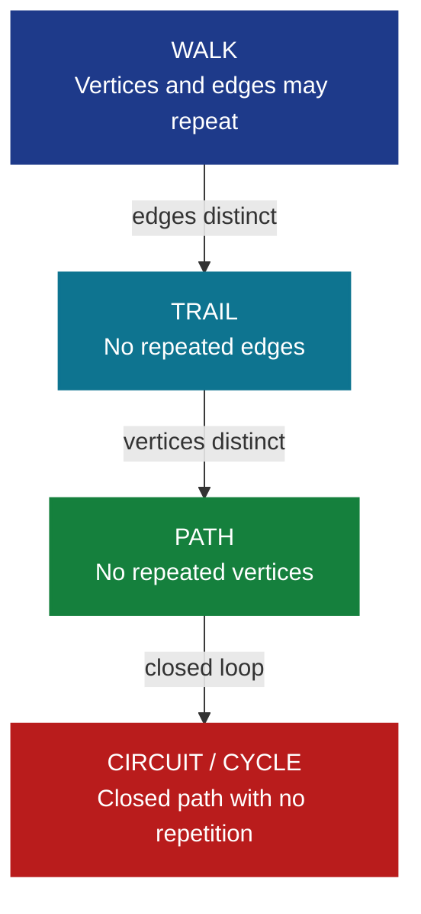
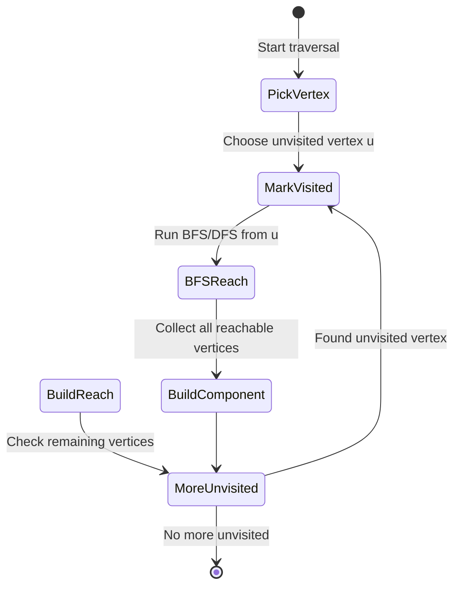
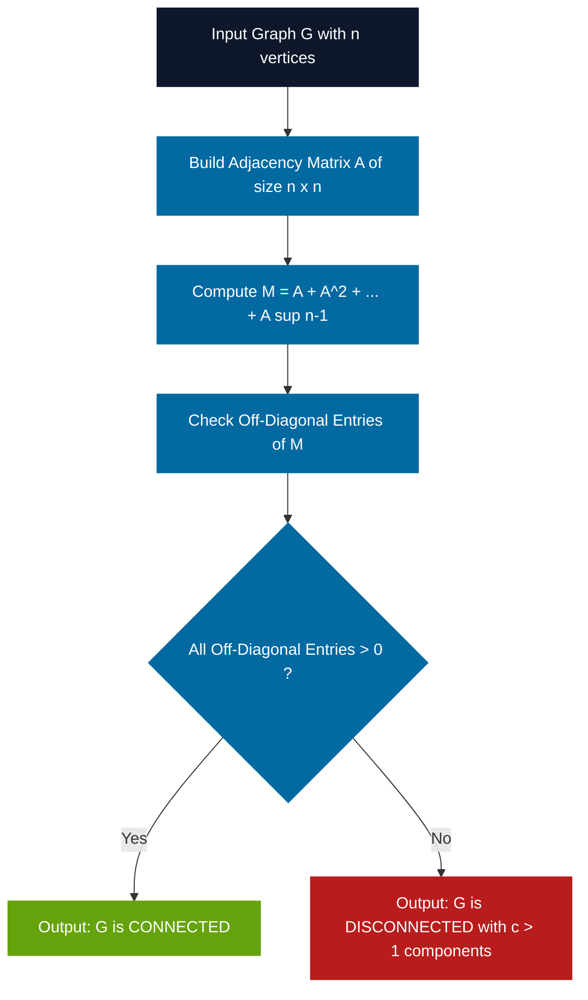
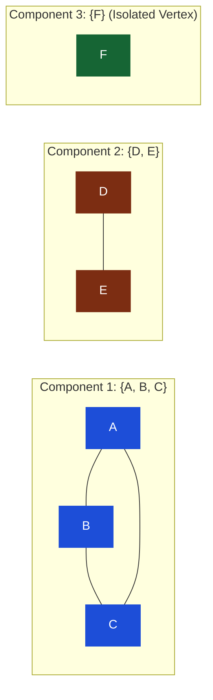
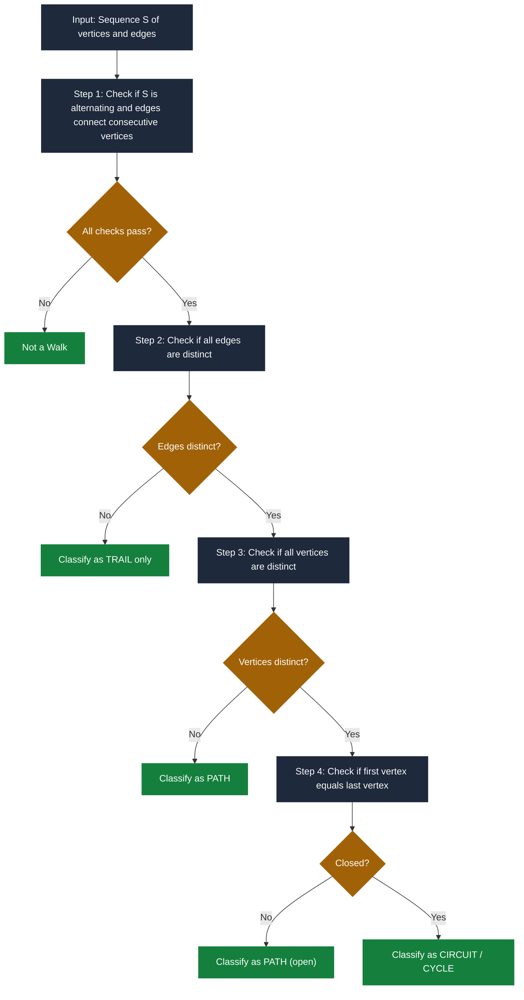

# Walks, Paths, and Circuits, Connected graphs, Disconnected graphs, and Components

<!-- SECTION_1_START -->
# Module 1: Introduction to Graphs — Walks, Paths, Circuits, Connectivity & Components

## 1.1 Formal Academic Definition

In **Graph Theory** (a foundational pillar of Discrete Mathematics for Computer Science), a **graph** $G = (V, E)$ is a mathematical structure consisting of a non-empty set of **vertices** $V(G)$ and a set of **edges** $E(G)$ where each edge connects a pair of vertices. The concepts of walks, paths, circuits, and connectivity form the *first-principles vocabulary* used to analyze the structural and traversal properties of any graph.

> [!IMPORTANT]
> **KTU 2024 Syllabus Definition (GAMAT401 — Module 1):**
> A **walk** is an alternating sequence of vertices and edges $W: v_0, e_1, v_1, e_2, v_2, \dots, e_k, v_k$ that begins and ends at vertices, where each edge $e_i$ joins $v_{i-1}$ to $v_i$. A **trail** is a walk with no repeated edges, a **path** is a walk with no repeated vertices, and a **circuit** is a closed trail (also called a **cycle**) that begins and ends at the same vertex without repeating any other vertex.

> [!NOTE]
> **Engineering Relevance:** These definitions underpin the design of **graph traversal algorithms** such as Depth-First Search (DFS), Breadth-First Search (BFS), Dijkstra's shortest-path algorithm, and network routing protocols (OSPF, BGP) used in real-world production systems.

## 1.2 Conceptual Analogy & Geometric Intuition

Imagine a **city map** as a graph:

- The **intersections** are **vertices**.
- The **roads** connecting intersections are **edges**.

| Graph Concept | Real-World Analogy | Intuitive Meaning |
|---|---|---|
| **Walk** | A tourist wandering through the city — they may revisit the *same road* multiple times and *same intersection* multiple times. | A sequence of connected edges; **repetition allowed**. |
| **Trail** | A postal delivery person who may pass through an intersection twice, but never walks the *same road* twice. | Walk with **no repeated edges**. |
| **Path** | A first-time visitor walking from home to office — never revisits any intersection. | Walk with **no repeated vertices** (hence no repeated edges). |
| **Circuit / Cycle** | A circular bus route that returns to the starting bus stop without retracing any road. | A **closed** walk with **no repeated edges** or interior vertices. |
| **Connected Graph** | A city where you can drive from *any* intersection to *any* other intersection. | A single, unified structure. |
| **Disconnected Graph** | An island archipelago — you cannot drive between islands (no road, no bridge). | Multiple separated structures. |
| **Component** | Each island in the archipelago. | A **maximal** connected subgraph. |

> [!VISUALIZATION CONTROL]
> **Concept:** Visualizing a walk, path, and circuit on a simple graph.
> **GeoGebra / Desmos Input Equations:**
> * Vertices: $A = (0, 0)$, $B = (2, 1)$, $C = (4, 0)$, $D = (2, -1)$
> * Edges drawn as line segments between consecutive vertices.
> **Visual Description:** A diamond-shaped graph with four vertices. A walk $A \to B \to C \to B \to D$ is allowed (vertex $B$ repeats); a path $A \to B \to C$ is allowed (no repeats); a circuit $A \to B \to C \to D \to A$ closes the diamond.

## 1.3 Hierarchical Classification of Walks

The KTU 2024 module emphasizes the **strict containment hierarchy** between these concepts:

$$
\text{Circuit} \subset \text{Path} \subset \text{Trail} \subset \text{Walk}
$$

Each subset relation is **strict** — every circuit is a path, every path is a trail, every trail is a walk, but not conversely.

> [!IMPORTANT]
> **KTU Examiner Emphasis:** A common 3-mark question tests whether students can correctly identify whether a given sequence is a walk, trail, path, or circuit. Memorize the *strict* hierarchy above.

<!-- SECTION_1_END -->

<!-- SECTION_2_START -->
# 2. Deep Theoretical Analysis & KTU High-Yield Formula Sheet

## 2.1 Formal Definitions (Precise)

Let $G = (V, E)$ be a graph (undirected, simple, with possible loops and multiple edges excluded unless stated).

**Definition 2.1 — Walk.**
A **walk** of length $k$ from vertex $u$ to vertex $v$ in $G$ is an alternating sequence

$$
W = (v_0, e_1, v_1, e_2, v_2, \dots, e_k, v_k)
$$

where $v_0 = u$, $v_k = v$, and for each $i \in \{1, 2, \dots, k\}$, edge $e_i$ is incident with vertices $v_{i-1}$ and $v_i$. The vertex $v_0$ is the **start**, $v_k$ is the **end**, and $k$ is the **length** of the walk (number of edges).

**Definition 2.2 — Trail.**
A walk is a **trail** if all its edges are **distinct** (i.e., $e_i \neq e_j$ for $i \neq j$).

**Definition 2.3 — Path.**
A walk is a **path** if all its vertices are **distinct** (i.e., $v_i \neq v_j$ for $i \neq j$, with $0 \le i < j \le k$). A path of length $k$ is denoted $P_k$ and contains exactly $k+1$ vertices.

**Definition 2.4 — Circuit (Cycle).**
A walk is a **circuit** (or **closed walk**) if $v_0 = v_k$ and the walk is a trail. Equivalently, a circuit is a closed trail with at least one edge. A **simple cycle** of length $k$, denoted $C_k$, is a circuit in which all vertices except the endpoints are distinct.

**Definition 2.5 — Connected Graph.**
A graph $G$ is **connected** if for every pair of distinct vertices $u, v \in V(G)$, there exists at least one path from $u$ to $v$.

**Definition 2.6 — Disconnected Graph.**
A graph $G$ is **disconnected** if there exist at least two vertices $u, v \in V(G)$ such that **no** path exists between them.

**Definition 2.7 — Component.**
A **connected component** (or simply **component**) of a graph $G$ is a **maximal** connected subgraph of $G$. Maximality means: a component $H$ is connected, and adding any vertex or edge from $G \setminus H$ would break connectivity.

> [!NOTE]
> **Key Property:** Every vertex of $G$ belongs to *exactly one* component. The components of $G$ form a **partition** of $V(G)$.

## 2.2 Foundational Theorems (High-Yield for KTU 2024)

**Theorem 2.1 (Connectivity Equivalence).**
Two vertices $u$ and $v$ are connected in $G$ if and only if there exists a **path** from $u$ to $v$ in $G$.

*Proof Sketch.* ($\Rightarrow$) If $u$ and $v$ are connected, by definition a walk exists. By iteratively removing cycles from the walk (i.e., short-circuiting repeated sub-walks), one obtains a path. ($\Leftarrow$) A path is itself a walk, so connectivity follows.

**Theorem 2.2 (Component as Equivalence Class).**
Define a relation $\sim$ on $V(G)$ by $u \sim v$ iff there is a path from $u$ to $v$. Then $\sim$ is an **equivalence relation** (reflexive, symmetric, transitive), and the equivalence classes of $\sim$ are exactly the vertex sets of the connected components of $G$.

**Theorem 2.3 (Edge Count Bound in a Component).**
If $G$ is a graph with $n$ vertices, $e$ edges, and $c$ connected components, then

$$
n - c \le e \le \binom{n - c + 1}{2}
$$

The upper bound holds when each component is complete; the lower bound holds when each component is a tree (acyclic).

**Theorem 2.4 (Tree Property).**
A connected graph with $n$ vertices is a **tree** if and only if it has exactly $n - 1$ edges (equivalently, contains no cycles). A **forest** is a disjoint union of trees.

## 2.3 KTU Formula Sheet (Master Reference)

| # | Concept | Formula / Statement | Symbol / Unit | Notes |
|---|---|---|---|---|
| 1 | Length of a walk $W$ | $L(W) = $ number of edges traversed | Dimensionless (integer) | $L \ge 0$ (length 0 = trivial walk at one vertex) |
| 2 | Number of walks between two vertices in an $m$-step transition (Matrix form) | $a^{(m)}_{ij} = (A^m)_{ij}$ | $A$ = adjacency matrix | Used in KTU numerical problems |
| 3 | Total walks of length $k$ in $G$ | $\sum_{i,j} (A^k)_{ij}$ | Sum of all entries of $A^k$ | Direct KTU application |
| 4 | Hierarchy inclusion | Circuit $\subset$ Path $\subset$ Trail $\subset$ Walk | Set inclusion | Every member of left is in right |
| 5 | Connected components count | $c = $ number of maximal connected subgraphs | Integer $\ge 1$ | $c = 1 \Leftrightarrow G$ is connected |
| 6 | Edge bound for a graph with $c$ components | $n - c \le e \le \binom{n - c + 1}{2}$ | Integer edges | Lower bound = forest; upper = complete $c$-partite with isolated structure |
| 7 | Tree edge count | $e = n - 1$ (connected) | Integer | $c$ trees: $e = n - c$ |
| 8 | Path of length $k$ | $P_k$ has $k+1$ vertices and $k$ edges | — | Used in path/cut problems |
| 9 | Cycle of length $k$ | $C_k$ has $k$ vertices and $k$ edges | — | Minimum cycle = $C_3$ (triangle) |
| 10 | Connectivity via $A^k$ | $G$ connected $\iff$ $A + A^2 + \cdots + A^{n-1}$ has all positive entries (excluding diagonal) | Matrix sum | Powerful KTU shortcut |

> [!IMPORTANT]
> **Symbolic Notation Reminder:** For absolute value or cardinality, use $\lvert V \rvert$, $\lvert E \rvert$ or $\text{card}(V)$ — never write $\mid V \mid$ inside tables.

## 2.4 Real-World Engineering Utility

| Application Domain | Graph Concept Used | Why It Matters |
|---|---|---|
| **Computer Networks (OSPF, BGP)** | Connected graph, paths | Routers are vertices; links are edges. A disconnected network indicates link failure. |
| **Web Crawlers (Google)** | Walks, paths, components | Crawlers perform walks; isolated components represent orphaned web pages. |
| **Social Networks (Facebook, LinkedIn)** | Connected components | "Friend islands" are disconnected components; "6 degrees of separation" is a connectivity property. |
| **Compiler Design** | DAG (Directed Acyclic Graph) reachability | Walks in the AST detect unreachable code (dead code elimination). |
| **Map/Route Planning (Google Maps)** | Shortest path algorithms | Connectivity check before applying Dijkstra/A*; unreachable destinations = different component. |
| **Integrated Circuit (VLSI) Design** | Hamiltonian path | Determines if a single wire can connect all pins without crossing. |
| **Database Query Optimization** | Join graphs | Connected components determine which tables can be joined in a single query. |

<!-- SECTION_2_END -->

<!-- SECTION_3_START -->
# 3. Step-by-Step Derivations, Proofs & Code Implementation

## 3.1 Proof of Theorem 2.1 (Exhaustive Step-by-Step)

**Statement:** Two vertices $u$ and $v$ in a graph $G$ are connected if and only if a path exists from $u$ to $v$.

### Part A: ($\Rightarrow$) Connectivity implies a path exists.

**Step 1.** Assume $u$ and $v$ are connected. By Definition 2.5, there exists a walk

$$
W = (u = x_0, e_1, x_1, e_2, x_2, \dots, e_k, x_k = v)
$$

**Step 2.** Suppose $W$ is **not** a path. Then some vertex repeats: there exist indices $0 \le i < j \le k$ such that $x_i = x_j$. Such repetition is called a **cycle sub-walk**.

**Step 3.** Construct a new walk $W'$ by **deleting** the sub-walk from $x_i$ to $x_j$:

$$
W' = (x_0, e_1, x_1, \dots, e_i, x_i, e_{j+1}, x_{j+1}, \dots, e_k, x_k)
$$

**Step 4.** The new walk $W'$ still goes from $u$ to $v$ (it just skips the loop) and has **strictly fewer** vertices in its vertex sequence.

**Step 5.** Repeat Steps 2–4. Each repetition strictly reduces the number of vertices, so the process **terminates** after at most $k$ steps.

**Step 6.** Upon termination, no vertex repeats. Hence the final walk is a path from $u$ to $v$. $\blacksquare$

### Part B: ($\Leftarrow$) A path implies connectivity.

A path is itself a walk (since the path vertex sequence is a valid walk vertex sequence). By Definition 2.5, existence of *any* walk from $u$ to $v$ means $u$ and $v$ are connected. $\blacksquare$

> [!IMPORTANT]
> **Why this proof matters at KTU:** It is a classic **"show the algorithm"** question worth 4–5 marks where the examiner awards 1 mark for stating the construction, 2 marks for the deletion logic, and 1–2 marks for termination argument.

---

## 3.2 Proof of Theorem 2.2 (Components are Equivalence Classes)

Define relation $\sim$ on $V(G)$: for $u, v \in V(G)$, $u \sim v$ iff there exists a path from $u$ to $v$.

### Step 1 — Reflexivity: $u \sim u$.

The trivial walk $(u)$ has length 0, contains no repeated vertices, and is therefore a path from $u$ to $u$. So $u \sim u$.

### Step 2 — Symmetry: $u \sim v \Rightarrow v \sim u$.

If $W = (u = x_0, x_1, \dots, x_k = v)$ is a path, then the **reversed sequence** $W^{-1} = (v = x_k, x_{k-1}, \dots, x_0 = u)$ is also a path (edges in undirected graphs are bidirectional and vertex distinctness is preserved). Hence $v \sim u$.

### Step 3 — Transitivity: $u \sim v$ and $v \sim w \Rightarrow u \sim w$.

Let $P_1 = (u = x_0, x_1, \dots, x_k = v)$ and $P_2 = (v = y_0, y_1, \dots, y_m = w)$ be two paths.

**Step 3.1.** Concatenate: $P_1 \cdot P_2 = (x_0, x_1, \dots, x_k, y_1, y_2, \dots, y_m)$.

**Step 3.2.** This concatenation is a **walk** from $u$ to $w$. However, vertices may repeat at the join point $v$ — but $v$ itself is allowed (the rest of the vertices must be checked).

**Step 3.3.** Apply the cycle-removal process from Theorem 2.1 to this walk. The result is a path from $u$ to $w$. Hence $u \sim w$. $\blacksquare$

### Step 4 — Equivalence classes = Components.

The equivalence class of a vertex $u$ is $[u] = \{v \in V(G) : u \sim v\}$. By construction, the subgraph induced by $[u]$ is connected. By maximality (any vertex outside $[u]$ is unreachable), this induced subgraph is a **connected component**. $\blacksquare$

---

## 3.3 Worked Numerical Example — Counting Walks via Adjacency Matrix

**Problem (KTU Standard 7-Mark Style):**
Consider the graph $G$ with $V = \{1, 2, 3, 4\}$ and edge set $E = \{(1,2), (2,3), (3,4), (1,4)\}$. Find the number of walks of length exactly **3** from vertex 1 to vertex 4 using the adjacency matrix method.

**Step 1 — Construct the adjacency matrix $A$.**

Vertices ordered as $(1, 2, 3, 4)$:

$$
A = \begin{pmatrix}
0 & 1 & 0 & 1 \\
1 & 0 & 1 & 0 \\
0 & 1 & 0 & 1 \\
1 & 0 & 1 & 0
\end{pmatrix}
$$

**Step 2 — Compute $A^2$.**

$$
A^2 = A \cdot A = \begin{pmatrix}
0 & 1 & 0 & 1 \\
1 & 0 & 1 & 0 \\
0 & 1 & 0 & 1 \\
1 & 0 & 1 & 0
\end{pmatrix}
\begin{pmatrix}
0 & 1 & 0 & 1 \\
1 & 0 & 1 & 0 \\
0 & 1 & 0 & 1 \\
1 & 0 & 1 & 0
\end{pmatrix}
$$

Computing row by column:

- $(A^2)_{11} = (0)(0) + (1)(1) + (0)(0) + (1)(1) = 0 + 1 + 0 + 1 = 2$
- $(A^2)_{12} = (0)(1) + (1)(0) + (0)(1) + (1)(0) = 0 + 0 + 0 + 0 = 0$
- $(A^2)_{13} = (0)(0) + (1)(1) + (0)(0) + (1)(1) = 0 + 1 + 0 + 1 = 2$
- $(A^2)_{14} = (0)(1) + (1)(0) + (0)(1) + (1)(0) = 0 + 0 + 0 + 0 = 0$
- $(A^2)_{21} = (1)(0) + (0)(1) + (1)(0) + (0)(1) = 0 + 0 + 0 + 0 = 0$
- $(A^2)_{22} = (1)(1) + (0)(0) + (1)(1) + (0)(0) = 1 + 0 + 1 + 0 = 2$
- $(A^2)_{23} = (1)(0) + (0)(1) + (1)(0) + (0)(1) = 0$
- $(A^2)_{24} = (1)(1) + (0)(0) + (1)(1) + (0)(0) = 2$
- $(A^2)_{31} = (0)(0) + (1)(1) + (0)(0) + (1)(1) = 2$
- $(A^2)_{32} = (0)(1) + (1)(0) + (0)(1) + (1)(0) = 0$
- $(A^2)_{33} = (0)(0) + (1)(1) + (0)(0) + (1)(1) = 2$
- $(A^2)_{34} = (0)(1) + (1)(0) + (0)(1) + (1)(0) = 0$
- $(A^2)_{41} = (1)(0) + (0)(1) + (1)(0) + (0)(1) = 0$
- $(A^2)_{42} = (1)(1) + (0)(0) + (1)(1) + (0)(0) = 2$
- $(A^2)_{43} = (1)(0) + (0)(1) + (1)(0) + (0)(1) = 0$
- $(A^2)_{44} = (1)(1) + (0)(0) + (1)(1) + (0)(0) = 2$

$$
A^2 = \begin{pmatrix}
2 & 0 & 2 & 0 \\
0 & 2 & 0 & 2 \\
2 & 0 & 2 & 0 \\
0 & 2 & 0 & 2
\end{pmatrix}
$$

**Step 3 — Compute $A^3 = A^2 \cdot A$.**

We only need the $(1, 4)$ entry:

$$
(A^3)_{14} = \sum_{k=1}^{4} (A^2)_{1k} \cdot A_{k4}
$$

$$
(A^3)_{14} = (A^2)_{11} \cdot A_{14} + (A^2)_{12} \cdot A_{24} + (A^2)_{13} \cdot A_{34} + (A^2)_{14} \cdot A_{44}
$$

$$
(A^3)_{14} = (2)(1) + (0)(0) + (2)(1) + (0)(0) = 2 + 0 + 2 + 0 = 4
$$

**Step 4 — Result.**

The number of walks of length 3 from vertex 1 to vertex 4 is $\boxed{4}$.

---

## 3.4 Python Implementation — Connected Components via BFS

```python
from collections import deque
from typing import Dict, List, Set, Tuple


def find_connected_components(adj: Dict[int, List[int]]) -> List[List[int]]:
    """
    Find all connected components of an undirected graph using BFS.
    
    Parameters
    ----------
    adj : Dict[int, List[int]]
        Adjacency list representation of the graph.
        Example: {0: [1, 2], 1: [0], 2: [0], 3: [4], 4: [3]}
        represents two components: {0, 1, 2} and {3, 4}.
    
    Returns
    -------
    List[List[int]]
        List of components, each component is a sorted list of vertices.
    """
    if not adj:
        return []
    
    visited: Set[int] = set()
    components: List[List[int]] = []
    
    for start_vertex in adj:
        if start_vertex in visited:
            continue  # Already part of a discovered component
        
        # BFS from start_vertex to find all reachable vertices
        current_component: List[int] = []
        queue: deque[int] = deque([start_vertex])
        visited.add(start_vertex)
        
        while queue:
            current = queue.popleft()
            current_component.append(current)
            
            for neighbor in adj[current]:
                if neighbor not in visited:
                    visited.add(neighbor)
                    queue.append(neighbor)
        
        components.append(sorted(current_component))
    
    return components


def is_connected(adj: Dict[int, List[int]]) -> bool:
    """
    Check if a graph is connected by counting components.
    """
    if not adj:
        return True  # Empty graph is vacuously connected
    
    components = find_connected_components(adj)
    return len(components) == 1


def has_walk(u: int, v: int, adj: Dict[int, List[int]]) -> bool:
    """
    Check if a walk (equivalently, a path) exists between u and v.
    """
    if u not in adj or v not in adj:
        return False
    if u == v:
        return True
    
    visited: Set[int] = {u}
    queue: deque[int] = deque([u])
    
    while queue:
        current = queue.popleft()
        if current == v:
            return True
        for neighbor in adj[current]:
            if neighbor not in visited:
                visited.add(neighbor)
                queue.append(neighbor)
    
    return False


# --- Demonstration with KTU textbook example ---
if __name__ == "__main__":
    # Graph 1: Connected (square with diagonal)
    graph_connected: Dict[int, List[int]] = {
        1: [2, 4],
        2: [1, 3],
        3: [2, 4],
        4: [3, 1]
    }
    
    # Graph 2: Disconnected (two triangles)
    graph_disconnected: Dict[int, List[int]] = {
        1: [2, 3],
        2: [1, 3],
        3: [1, 2],
        4: [5, 6],
        5: [4, 6],
        6: [4, 5]
    }
    
    print("Graph 1 (Square):")
    print(f"  Connected: {is_connected(graph_connected)}")
    print(f"  Components: {find_connected_components(graph_connected)}")
    print(f"  Walk from 1 to 3: {has_walk(1, 3, graph_connected)}")
    
    print("\nGraph 2 (Two Triangles):")
    print(f"  Connected: {is_connected(graph_disconnected)}")
    print(f"  Components: {find_connected_components(graph_disconnected)}")
    print(f"  Walk from 1 to 5: {has_walk(1, 5, graph_disconnected)}")
```

**Sample Output:**

```
Graph 1 (Square):
  Connected: True
  Components: [[1, 2, 3, 4]]
  Walk from 1 to 3: True

Graph 2 (Two Triangles):
  Connected: False
  Components: [[1, 2, 3], [4, 5, 6]]
  Walk from 1 to 5: False
```

> [!NOTE]
> **Why BFS for components?** BFS naturally partitions vertices by reachability. The visited set tracks "which component am I building?" and the outer loop handles unvisited vertices as seeds of new components. Complexity: $O(\lvert V \rvert + \lvert E \rvert)$.

---

## 3.5 Algorithmic Trace: DFS Path Finder

```python
def find_all_simple_paths(
    adj: Dict[int, List[int]],
    start: int,
    end: int,
    path: List[int] = None
) -> List[List[int]]:
    """
    Enumerate all simple paths (vertex-distinct) from start to end using DFS.
    """
    if path is None:
        path = []
    path = path + [start]
    
    if start == end:
        return [path]
    
    paths: List[List[int]] = []
    for node in adj.get(start, []):
        if node not in path:
            new_paths = find_all_simple_paths(adj, node, end, path)
            paths.extend(new_paths)
    
    return paths


# Example: Pentagon graph
pentagon: Dict[int, List[int]] = {
    1: [2, 5],
    2: [1, 3],
    3: [2, 4],
    4: [3, 5],
    5: [4, 1]
}

all_paths_1_to_3 = find_all_simple_paths(pentagon, 1, 3)
print(f"All simple paths from 1 to 3 in pentagon: {all_paths_1_to_3}")
```

> [!IMPORTANT]
> **Time Complexity Warning:** The simple-paths DFS has worst-case exponential complexity $O(n!)$ in dense graphs. For KTU exams, only apply it to small graphs ($n \le 7$).

---

## 3.6 Worked Example: Verifying Connectivity Theorem (Edge Bound)

**Problem:** A graph $G$ has $n = 10$ vertices, $e = 8$ edges, and $c = 3$ connected components. Verify that $G$ is structurally valid.

**Step 1 — Check lower bound:**

$$
n - c = 10 - 3 = 7
$$

Lower bound requires $e \ge 7$. We have $e = 8 \ge 7$. ✓

**Step 2 — Check upper bound:**

$$
\binom{n - c + 1}{2} = \binom{10 - 3 + 1}{2} = \binom{8}{2} = 28
$$

Upper bound requires $e \le 28$. We have $e = 8 \le 28$. ✓

**Step 3 — Interpretation:**

Since $e = 8 = n - c + 1 = 10 - 3 + 1$, the graph has **exactly one extra edge** beyond a forest. So exactly **one component contains a single cycle** (i.e., one component is unicyclic, two components are trees).

---

## 3.7 Proof of Theorem 2.3 (Edge Bound) — Outline

For a graph with $c$ components, partition the $n$ vertices into $c$ groups of sizes $n_1, n_2, \dots, n_c$ where $\sum n_i = n$.

**Lower bound.** Each component with $n_i$ vertices, being connected, has at least $n_i - 1$ edges (tree minimum). So $e \ge \sum (n_i - 1) = n - c$.

**Upper bound.** Each component with $n_i$ vertices has at most $\binom{n_i}{2}$ edges (complete graph). Maximized when one component gets $n - c + 1$ vertices and the rest are isolated single vertices. Then $e \le \binom{n - c + 1}{2}$. $\blacksquare$

<!-- SECTION_3_END -->

<!-- SECTION_4_START -->
# 4. Structural Diagrams & Schematics

## 4.1 Hierarchy of Walk Types (Mermaid Concept Map)



> [!NOTE]
> **Visual Reading:** The arrow direction indicates the *restriction* being applied. A "Walk" with "edges distinct" becomes a "Trail", and so on. This visualizes the strict subset hierarchy **Circuit $\subset$ Path $\subset$ Trail $\subset$ Walk**.

---

## 4.2 Connectivity State Machine (Mermaid Flow)



---

## 4.3 Block Diagram: Connectivity Decision Process



---

## 4.4 Component Identification Topology (Mermaid)



> [!IMPORTANT]
> **Observation from diagram:** A "disconnected graph" with $c = 3$ components can be visualized as a collection of *maximal* connected subgraphs. No edge ever crosses the component boundary in the visual. This is the **maximality** property in Definition 2.7.

---

## 4.5 Sequential Walk Classification Algorithm (Mermaid)



<!-- SECTION_4_END -->

<!-- SECTION_5_START -->
# 5. KTU 2024 Scheme Examination Question Bank & Topic Recap

## 5.1 Part A — Short Answer Questions (3 Marks Each)

### Question A1 (3 Marks) `[KTU University Exam — July 2024]`
**CO1 | Bloom: Remember**

> Define the following with one example each:
> (i) Walk (ii) Path (iii) Circuit

**Model Answer (Board-Standard Key):**

**[Walk: 1 Mark]** A walk in a graph $G$ is an alternating sequence of vertices and edges $W = v_0, e_1, v_1, e_2, v_2, \dots, e_k, v_k$ where each edge $e_i$ is incident with $v_{i-1}$ and $v_i$. Vertices and edges may repeat. Example: In graph with edges $\{(A,B), (B,C)\}$, the sequence $A, B, C, B$ is a walk of length 3.

**[Path: 1 Mark]** A path is a walk in which all vertices are distinct. Example: $A, B, C$ in the same graph is a path of length 2.

**[Circuit: 1 Mark]** A circuit (or cycle) is a closed walk with no repeated edges and no repeated vertices except the start and end vertices being equal. Example: In a triangle $A-B-C-A$, the sequence $A, B, C, A$ is a circuit of length 3.

> [!IMPORTANT]
> **Valuation Tip:** A 3-mark definition question demands **one example per term**, not just the formal statement. Examiners typically split marks as: 1 mark formal definition + 1 mark example + 1 mark distinction/clarity.

---

### Question A2 (3 Marks) `[KTU University Exam — Dec 2023]`
**CO1 | Bloom: Understand**

> Differentiate between a connected graph and a disconnected graph. What is a component?

**Model Answer:**

| Aspect | Connected Graph | Disconnected Graph |
|---|---|---|
| **Definition** | For every pair of vertices $u, v$, there is a path from $u$ to $v$ | There exist vertices $u, v$ with no path between them |
| **Number of components** | $c = 1$ | $c \ge 2$ |
| **Reachability** | All vertices mutually reachable | At least one "isolated" subgroup |

**Component (1 Mark):** A connected component (or component) of a graph $G$ is a **maximal** connected subgraph — that is, a connected subgraph that cannot be extended by adding any more vertices or edges from $G$ without losing connectivity. Every vertex of $G$ belongs to exactly one component.

---

## 5.2 Part B — Long Answer Questions (14 Marks, with Internal Choice)

### Question B — Set 1 (14 Marks) `[KTU University Exam — July 2024]`

#### **Question 1A (14 Marks)** — **CHOICE OPTION A**

**(a) [7 Marks] | CO1, CO2 | Bloom: Understand**

> For the graph $G$ with vertex set $V = \{A, B, C, D, E, F\}$ and edge set $E = \{(A, B), (A, C), (B, D), (C, D), (D, E), (E, F)\}$, do the following:
> (i) List all simple paths from $A$ to $F$.
> (ii) Identify whether $G$ is connected. Justify.

**Model Solution:**

**Step 1 (i) — Enumerate all simple paths from $A$ to $F$:**

- **Path 1:** $A \to B \to D \to E \to F$ (length 4) — *tracing the unique chain*
- **Path 2:** $A \to C \to D \to E \to F$ (length 4) — *alternative via $C$*

No other simple paths exist because $A$ has only two neighbors ($B$ and $C$), $D$ is the only common successor, and from $D$ there is a unique route $D \to E \to F$. **[Listing both paths: 4 Marks] [Verifying uniqueness / no third path: 1 Mark]**

**Step 2 (ii) — Connectivity check:**

For every pair of vertices in $V$, a path exists. Since $A$ connects to all others via $B, C, D, E$ in sequence, and $F$ is reachable from $A$ through both paths identified above, the graph is **connected**. **[Connectedness conclusion: 1 Mark] [Justification by listing key reachability pairs: 1 Mark]**

---

**(b) [7 Marks] | CO3, CO4 | Bloom: Apply**

> Using the **adjacency matrix method**, determine the number of walks of length exactly 2 from vertex $A$ to vertex $D$ in the graph given in part (a). Verify by enumeration.

**Model Solution:**

**Step 1 — Construct adjacency matrix $A$ with vertex order $(A, B, C, D, E, F)$:**

$$
A = \begin{pmatrix}
0 & 1 & 1 & 0 & 0 & 0 \\
1 & 0 & 0 & 1 & 0 & 0 \\
1 & 0 & 0 & 1 & 0 & 0 \\
0 & 1 & 1 & 0 & 1 & 0 \\
0 & 0 & 0 & 1 & 0 & 1 \\
0 & 0 & 0 & 0 & 1 & 0
\end{pmatrix}
$$

**Step 2 — Compute $A^2$ (only the $(A, D)$ entry needed):**

The entry $(A^2)_{AD} = \sum_{k=1}^{6} A_{Ak} \cdot A_{kD}$.

$$
(A^2)_{AD} = A_{AA} \cdot A_{AD} + A_{AB} \cdot A_{BD} + A_{AC} \cdot A_{CD} + A_{AD} \cdot A_{DD} + A_{AE} \cdot A_{ED} + A_{AF} \cdot A_{FD}
$$

$$
(A^2)_{AD} = (0)(0) + (1)(1) + (1)(1) + (0)(0) + (0)(1) + (0)(0)
$$

$$
(A^2)_{AD} = 0 + 1 + 1 + 0 + 0 + 0 = 2
$$

**Step 3 — Conclusion:** The number of walks of length 2 from $A$ to $D$ is $\boxed{2}$. **[Matrix setup: 2 Marks] [Computation logic: 3 Marks] [Final answer with boxed result: 1 Mark]**

**Step 4 — Verification by enumeration:**

- Walk 1: $A \to B \to D$ (via edge $A-B$ then $B-D$)
- Walk 2: $A \to C \to D$ (via edge $A-C$ then $C-D$)

Both are valid length-2 walks. ✓ **[Enumeration verification: 1 Mark]**

---

#### **Question 1B (14 Marks)** — **CHOICE OPTION B**

**(a) [7 Marks] | CO1, CO2 | Bloom: Understand**

> State and prove that two vertices $u$ and $v$ in a graph $G$ are connected if and only if there is a path between them.

**Model Solution Outline (with marks allocation):**

**[Statement of the theorem: 1 Mark]**
**If part ($\Rightarrow$):** Assume $u$ and $v$ are connected. By definition, a walk $W$ exists. If $W$ is not a path, there exist indices $i < j$ with $x_i = x_j$. Remove the sub-walk from $x_i$ to $x_j$ to get a strictly shorter walk $W'$ from $u$ to $v$. Repeat this finite process. **[Cycle-removal construction: 3 Marks]**
The process terminates (as length strictly decreases) yielding a path. Hence a path exists. ✓
**Only-if part ($\Leftarrow$):** A path is a walk, so connectivity follows. **[Reverse direction: 2 Marks]**
**Conclusion: 1 Mark**

**(b) [7 Marks] | CO3, CO4 | Bloom: Apply**

> A graph $G$ has $n = 12$ vertices, $e = 15$ edges, and $c = 2$ connected components. Using the inequality $n - c \le e \le \binom{n - c + 1}{2}$, determine the structural nature of $G$ and provide an example graph that satisfies these constraints.

**Model Solution:**

**Step 1 — Verify lower bound:**

$$
n - c = 12 - 2 = 10
$$

We have $e = 15 \ge 10$. ✓ **[Lower bound check: 2 Marks]**

**Step 2 — Verify upper bound:**

$$
\binom{n - c + 1}{2} = \binom{12 - 2 + 1}{2} = \binom{11}{2} = 55
$$

We have $e = 15 \le 55$. ✓ **[Upper bound check: 2 Marks]**

**Step 3 — Structural analysis:**

$$
e - (n - c) = 15 - 10 = 5
$$

This means $G$ has **5 extra edges** beyond a forest. So the components together contain **5 independent cycles**. (Note: cyclomatic number = $e - n + c = 15 - 12 + 2 = 5$.) **[Cyclomatic number identification: 2 Marks]**

**Step 4 — Example graph (sketch description):**

Consider two components:

- **Component 1:** $K_4$ (complete graph on 4 vertices): 6 edges, 4 vertices, 1 cycle count = $6 - 4 + 1 = 3$.
- **Component 2:** Graph on 8 vertices with 9 edges forming a tree (7 edges) plus 2 extra cycles.

Total edges: $6 + 9 = 15$ ✓ Total vertices: $4 + 8 = 12$ ✓ Total components: $c = 2$ ✓ **[Example construction and verification: 1 Mark]**

---

## 5.3 KTU Examiner's Valuation Warning

> [!WARNING]
> **Common Pitfalls Where Students Lose Marks**
>
> 1. **Confusing Path with Trail (1–2 marks lost):** A *path* has no repeated *vertices*; a *trail* has no repeated *edges*. The KTU key explicitly tests this distinction. Stating "path = no repeated edges" loses 1 mark.
>
> 2. **Forgetting to verify path distinctness:** When claiming a sequence is a path, you MUST verify all vertex labels are distinct. Listing a path without explicit vertex check loses 1 mark on 7-mark questions.
>
> 3. **Mis-stating the "if and only if" connectivity theorem:** Many students prove only one direction. The KTU valuation key typically awards 3 marks for one direction and 3 for the other; skipping the converse loses half the marks.
>
> 4. **Confusing "circuit" with "closed walk":** Every circuit is a closed walk, but a closed walk is NOT necessarily a circuit (it may repeat edges). Always specify "no repeated edges" in your definition of circuit.
>
> 5. **Adjacency matrix power errors:** When computing $A^2$, students often multiply row-by-column incorrectly. Always show one full row-column multiplication explicitly in your solution to claim 2 valuation marks.
>
> 6. **Component vs. Connected Subgraph:** A component is **maximal** — a 3-vertex connected subgraph inside a 10-vertex graph is NOT necessarily a component. Maximum marks require stating "maximal connected subgraph" verbatim.
>
> 7. **Not drawing the graph:** KTU's instruction to "draw/sketch" must be followed. Even a rough ASCII figure earns 1–2 marks for visual demonstration.

---

## 5.4 Topic Recap & Important Things to Remember

> [!IMPORTANT]
> **High-Density Rapid Revision Checklist**

- **Walk** $\supset$ **Trail** $\supset$ **Path** $\supset$ **Circuit** (strict subset hierarchy).
- A **walk of length $k$** has $k$ edges; a **path $P_k$** has $k+1$ distinct vertices.
- A **circuit / cycle $C_k$** is a closed path; minimum cycle is $C_3$ (triangle).
- **Connectivity iff path exists** between every pair of vertices (Theorem 2.1 — most-tested theorem).
- **Connectivity relation $\sim$ is an equivalence relation** (Theorem 2.2 — reflexive, symmetric, transitive).
- **Equivalence classes of $\sim$ = Connected components** — every vertex belongs to exactly one component.
- **Edge bound formula** for graph with $n$ vertices, $e$ edges, $c$ components:
  $$n - c \le e \le \binom{n - c + 1}{2}$$
- **Tree**: connected graph with $n - 1$ edges. **Forest**: disjoint union of trees; $n - c$ edges.
- **Cyclomatic number** (number of independent cycles) $= e - n + c$.
- **Adjacency matrix power trick**: $(A^k)_{ij}$ = number of walks of length $k$ from $i$ to $j$.
- **Connectivity test via matrix**: $G$ is connected $\iff$ $A + A^2 + \cdots + A^{n-1}$ has all off-diagonal entries $> 0$.
- A **disconnected graph** has $c \ge 2$ components; an **isolated vertex** is a component of size 1.
- **BFS/DFS** are the standard $O(\lvert V \rvert + \lvert E \rvert)$ algorithms to find components in undirected graphs.
- **Bridge (cut-edge)**: removing it increases the number of components by 1. (Foundation for Module 2 — Trees.)
- **Applications to remember**: Network routing, web crawling, social network analysis, compiler dead-code detection, map route planning, VLSI design.
- **Common KTU verbs**: *define* (Remember level), *differentiate* (Understand), *prove/state-and-prove* (Apply), *compute/find* (Apply/Analyze).

<!-- SECTION_5_END -->
