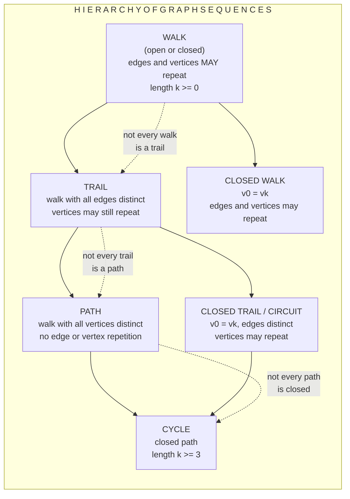
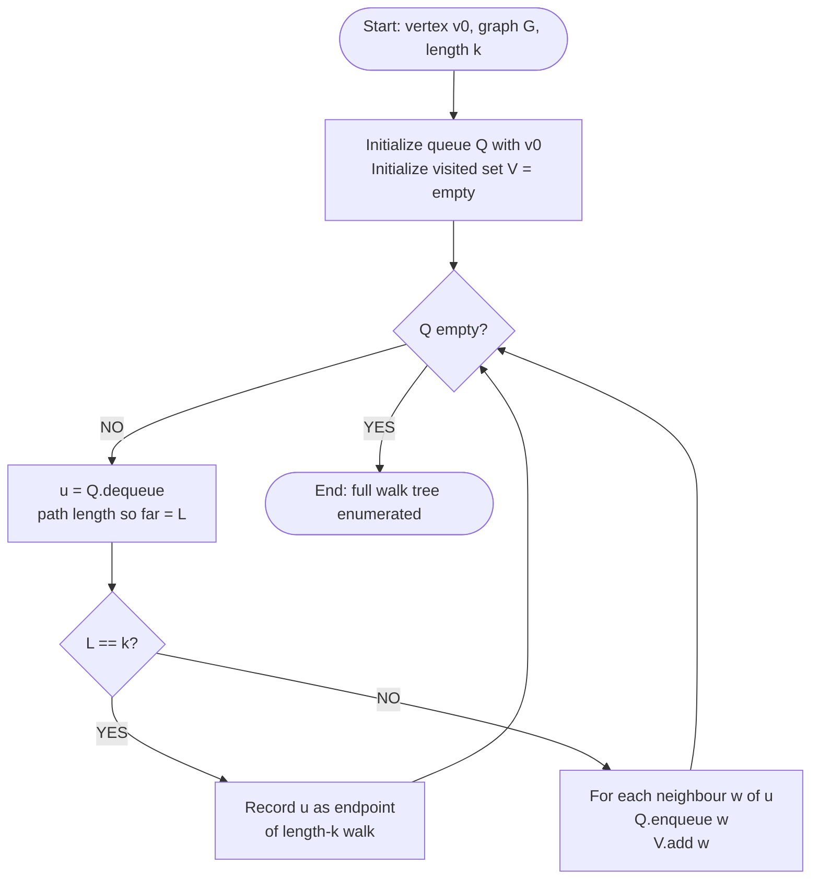
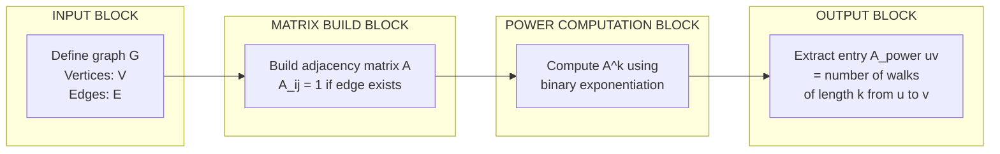
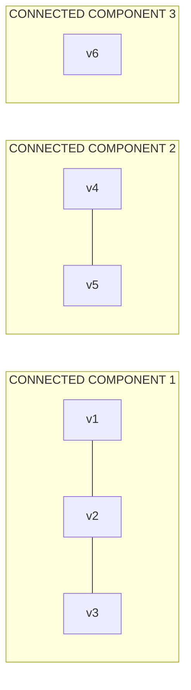

# Walks

<!-- SECTION_1_START -->
# Walks in Graph Theory — KTU GAMAT401 / Module 1

## 1.1 Formal Definition (KTU 2024 Syllabus Terminology)

> [!IMPORTANT]
> **Definition (Walk):** Let $G = (V, E)$ be a (simple or multigraph). A **walk** of length $k$ (where $k \ge 0$) is an alternating sequence of vertices and edges of the form
> $$W : v_0, e_1, v_1, e_2, v_2, \ldots, e_k, v_k$$
> such that for every $i = 1, 2, \ldots, k$, the edge $e_i$ has endpoints $v_{i-1}$ and $v_i$. Equivalently, $W$ is the vertex sequence
> $$W : v_0 \rightarrow v_1 \rightarrow v_2 \rightarrow \cdots \rightarrow v_k$$
> in which each consecutive pair $\{v_{i-1}, v_i\}$ is an edge (or arc) of $G$.

The integer $k$ is the **length** of the walk, i.e., the number of edges traversed. Vertices and edges **may repeat** — this is the single most important property that distinguishes a walk from the more restrictive notions (trail, path) defined later.

A walk of length $0$ is called a **trivial walk** and consists of a single vertex (no edge is traversed).

> [!NOTE]
> **KTU Board Convention (2024 Scheme):** A walk is denoted $W(v_0, v_k)$ when only the *endpoints* matter. The underlying vertex sequence is implicit. The walk is **closed** if $v_0 = v_k$; otherwise it is **open**.

## 1.2 Conceptual Analogy / Intuition

Imagine you are taking a **leisurely stroll through a city map** (the graph). Each intersection is a vertex, and each road segment connecting two intersections is an edge. A *walk* is the most general kind of journey you can take:

- You may **walk the same road twice** (the edge $e$ repeats).
- You may **visit the same intersection twice** (the vertex $v$ repeats).
- You may even **stand still** at an intersection and call that a "walk" of length zero (the trivial walk).

This freedom to backtrack and revisit is exactly what makes a walk the *weakest* connectivity primitive in graph theory. All other structures — trails, paths, cycles — are merely walks with progressively more restrictions, like a parent concept from which stricter children inherit.

| Concept | Real-world counterpart |
|---|---|
| **Walk** | Strolling with no restrictions |
| **Trail** | A stroll where you never re-walk a road |
| **Path** | A stroll where you never re-visit an intersection |
| **Cycle** | A stroll that returns home without revisiting an intersection |

## 1.3 Visualizations

> [!VISUALIZATION CONTROL]
> **Concept:** A walk of length 4 in a small graph with a repeated edge and a repeated vertex.
>
> **Graph edges (Desmos input form):** Define points and segments:
> * `A = (0, 0)`
> * `B = (2, 1)`
> * `C = (4, 0)`
> * `D = (2, -1)`
> * `E = (2, 1)`  *(vertex B revisited)*
>
> **Walk sequence:** $A \to B \to C \to B \to D$  (length 4, with $B$ repeated and edge $BC$ traversed twice).
>
> **What to observe:** Even though $B$ is visited twice and edge $BC$ is used twice, the sequence is still a perfectly valid walk. A *path* would forbid this repetition, but a walk does not.

> [!NOTE]
> **Syllabus Highlight (GAMAT401 / Module 1):** The hierarchy of graph sub-structures (walk $\supset$ trail $\supset$ path $\supset$ cycle) is a frequently tested item in the KTU University Exam under CO1 (Remember/Understand). Mastering this hierarchy in Section 1 is essential before proceeding to Theorem proofs in Section 2.

<!-- SECTION_1_END -->

<!-- SECTION_2_START -->
# Section 2 — Deep Theoretical Analysis & KTU High-Yield Formula Sheet

## 2.1 Classification of Walks (Detailed Logical Breakdown)

A walk $W$ can be classified along **two independent dimensions**: openness and edge/vertex repetition.

### Step 1 — Open vs. Closed

- **Open walk:** the sequence begins and ends at *different* vertices, i.e., $v_0 \neq v_k$.
- **Closed walk:** the sequence begins and ends at the *same* vertex, i.e., $v_0 = v_k$.

A closed walk of length $\ge 1$ may revisit intermediate vertices; this is allowed and is **not** the same as a cycle.

### Step 2 — Restriction on Edge Repetition (introduces the "trail")

- A walk that does **not repeat any edge** is a **trail**. In a trail, a vertex may still repeat (you can pass through a junction twice), but each road is used at most once.
- A **closed trail** is a **circuit** (also called a **closed trail** or **Eulerian-type element**).

### Step 3 — Restriction on Vertex Repetition (introduces the "path")

- A walk that does **not repeat any vertex** (except possibly $v_0 = v_k$) is a **path**.
- A **closed path** (with $v_0 = v_k$ and no other repetition) is a **cycle**.

### Step 4 — The *Why* and *How* Behind Each Step

- *Why* allow repetition at all in the definition of a walk? Because the *existence* of any sequence of edges from $u$ to $v$ is what we need to declare two vertices *connected*. Path-based connectivity is too restrictive for graph connectivity theorems.
- *How* are walks used? They appear in:
  - The fundamental reachability statement: "$u$ and $v$ are connected iff there exists a walk from $u$ to $v$."
  - The construction of **incidence and adjacency matrices** of higher powers.
  - **Breadth-First Search (BFS)** and **Depth-First Search (DFS)** traversals, which produce walk-based spanning structures.
  - The existence of **Euler circuits** (closed walks using every edge exactly once) and **Hamiltonian paths** (paths visiting every vertex exactly once).

## 2.2 The Fundamental Walk-Connectivity Theorem

> [!IMPORTANT]
> **Theorem (Connectivity via Walks):** Let $G = (V, E)$ be a (directed or undirected) graph. Two vertices $u, v \in V$ are in the same connected component of $G$ **if and only if** there exists a walk from $u$ to $v$.

**Proof sketch (often asked in Part B):**
- ($\Rightarrow$) If $u$ and $v$ are in the same component, by definition of connectedness, there is a path from $u$ to $v$. A path is, in particular, a walk. Hence a walk exists.
- ($\Leftarrow$) Suppose a walk $u = v_0, v_1, \ldots, v_k = v$ exists. By the very definition of edges, each $\{v_{i-1}, v_i\}$ is an edge of $G$. Tracing the walk produces a *path* (obtained by deleting the repeated vertices in order), so $u$ and $v$ are connected.

> [!NOTE]
> **Engineering utility:** This theorem is the theoretical backbone of *reachability analysis* in directed graphs — applied in operating-systems deadlock detection, network packet routing, and compiler dataflow analysis. The BFS/DFS algorithms used in production graph databases (Neo4j, Amazon Neptune) are precisely the constructive form of this theorem.

## 2.3 Walks and Powers of the Adjacency Matrix

Let $A$ be the adjacency matrix of a simple undirected graph $G$ on $n$ vertices. Then for any integer $k \ge 1$, the $(i, j)$-entry of the matrix $A^k$ counts the number of walks of length $k$ from vertex $v_i$ to vertex $v_j$.

$$[A^k]_{ij} \;=\; \text{number of distinct walks of length } k \text{ from } v_i \text{ to } v_j$$

This is a **high-yield KTU fact** and is regularly tested in Module 1.

## 2.4 KTU Formula Sheet / Cheat Sheet

> [!IMPORTANT]
> **Master these for any KTU 2024 ESE question on walks:**

| # | Concept | Formula / Statement | Notation Used |
|:-:|:--------|:-------------------|:--------------|
| 1 | Length of a walk | $k = \text{number of edges traversed}$ | $W : v_0 \to v_1 \to \cdots \to v_k$ |
| 2 | Open walk | $v_0 \neq v_k$ | endpoints distinct |
| 3 | Closed walk | $v_0 = v_k$ | endpoints identical |
| 4 | Trivial walk | length $k = 0$, only a single vertex $v_0$ | $W : v_0$ |
| 5 | Trail | walk with no repeated edge | edges distinct |
| 6 | Path | walk with no repeated vertex (except possibly endpoints) | vertices distinct |
| 7 | Cycle | closed path of length $\ge 3$ | $v_0 = v_k$, all internal $v_i$ distinct |
| 8 | Walk-counting via $A^k$ | $[A^k]_{ij} = \#\{\text{walks of length } k \text{ from } v_i \text{ to } v_j\}$ | $A$ = adjacency matrix |
| 9 | Connectivity equivalence | $u \sim v$ iff $\exists$ walk from $u$ to $v$ | $\sim$ = connected-component relation |
| 10 | Degree-vs-walk bound | Every walk of length $k \ge 1$ from $v_0$ to $v_k$ uses a vertex of degree $\ge 2$ in its interior (unless it's a path) | derived from handshaking |

## 2.5 Real-World Engineering Utility

| Domain | Use of Walks |
|---|---|
| **Network Routing (OSPF, BGP)** | Reachability of a destination = existence of a walk in the network graph |
| **Social Network Analysis** | $k$-step reachability from a user (used in ad targeting) |
| **Bioinformatics** | Walks in protein-interaction graphs; metabolic pathway enumeration |
| **Compiler Design** | Dataflow analysis via control-flow walks |
| **Database Query Optimization** | Join-order enumeration = walk enumeration in query graphs |
| **Distributed Systems** | Deadlock detection walks over wait-for graphs |
| **Computer Networks Security** | Attack-graph walks for penetration testing |

<!-- SECTION_2_END -->

<!-- SECTION_3_START -->
# Section 3 — Step-by-Step Derivations, Worked Examples & Code

## 3.1 Worked Example 1 — Identifying Walks and Their Lengths

> [!NOTE]
> **Problem:** Consider the undirected graph $G$ with vertex set $V = \{a, b, c, d, e\}$ and edge set $E = \{ab, bc, cd, de, ea, bd\}$. Classify each of the following sequences as a walk, trail, path, closed walk, cycle, or none. Justify.

**(i)** $a, b, c, d, a$

- Edges used: $ab$, $bc$, $cd$, $da$. All exist in $E$.
- Vertices visited: $a, b, c, d, a$. The vertex $a$ appears at start and end (so the walk is **closed**), but the *intermediate* vertices $b, c, d$ are all distinct.
- No edge is repeated. No intermediate vertex is repeated.
- **Classification: Cycle (closed path) of length 4.**

**(ii)** $a, b, c, b, d$

- Edges used: $ab$, $bc$, $cb$ (reverse of $bc$), $bd$. All exist in $E$ (the graph is undirected, so traversing an edge in either direction is allowed).
- Vertices visited: $a, b, c, b, d$. The vertex $b$ repeats. Edge $bc$ is traversed twice.
- **Classification: Walk of length 4, but not a trail (edge $bc$ repeats), not a path (vertex $b$ repeats), and not a cycle.**

**(iii)** $c, d, e, a, b, c$

- Edges used: $cd$, $de$, $ea$, $ab$, $bc$. All exist. Each edge used exactly once; each intermediate vertex used once.
- **Classification: Cycle of length 5 (a Hamiltonian cycle — touches every vertex).**

**(iv)** $a, a$ (the trivial walk at $a$)

- Length = 0. Single vertex. No edge traversed.
- **Classification: Trivial walk of length 0 (also trivially a closed walk).**

## 3.2 Worked Example 2 — Walk Counting Using $A^k$

> [!NOTE]
> **Problem:** For the graph $G$ with $V = \{1, 2, 3, 4\}$ and $E = \{12, 23, 34, 14, 13\}$ (i.e., $K_4$ minus edge $\{2, 4\}$), find the number of walks of length 3 from vertex $1$ to vertex $4$ using the adjacency matrix method.

**Step 1 — Construct the adjacency matrix $A$.**

Order the vertices $1, 2, 3, 4$. For each edge $\{i, j\}$ set $A_{ij} = A_{ji} = 1$, else 0. Edges present: $\{1,2\}, \{2,3\}, \{3,4\}, \{1,4\}, \{1,3\}$. The missing edge is $\{2,4\}$.

$$
A \;=\; \begin{pmatrix}
0 & 1 & 1 & 1 \\
1 & 0 & 1 & 0 \\
1 & 1 & 0 & 1 \\
1 & 0 & 1 & 0
\end{pmatrix}
$$

**Step 2 — Compute $A^2$.**

We compute row by row using ordinary matrix multiplication:

$$
A^2 \;=\; A \cdot A
$$

For $[A^2]_{ij} = \sum_{k=1}^{4} A_{ik} A_{kj}$.

- $[A^2]_{11} = (0)(0) + (1)(1) + (1)(1) + (1)(1) = 0 + 1 + 1 + 1 = 3$
- $[A^2]_{12} = (0)(1) + (1)(0) + (1)(1) + (1)(0) = 0 + 0 + 1 + 0 = 1$
- $[A^2]_{13} = (0)(1) + (1)(1) + (1)(0) + (1)(1) = 0 + 1 + 0 + 1 = 2$
- $[A^2]_{14} = (0)(1) + (1)(0) + (1)(1) + (1)(0) = 0 + 0 + 1 + 0 = 1$

- $[A^2]_{21} = (1)(0) + (0)(1) + (1)(1) + (0)(1) = 0 + 0 + 1 + 0 = 1$
- $[A^2]_{22} = (1)(1) + (0)(0) + (1)(1) + (0)(0) = 1 + 0 + 1 + 0 = 2$
- $[A^2]_{23} = (1)(1) + (0)(1) + (1)(0) + (0)(1) = 1 + 0 + 0 + 0 = 1$
- $[A^2]_{24} = (1)(1) + (0)(0) + (1)(1) + (0)(0) = 1 + 0 + 1 + 0 = 2$

- $[A^2]_{31} = (1)(0) + (1)(1) + (0)(1) + (1)(1) = 0 + 1 + 0 + 1 = 2$
- $[A^2]_{32} = (1)(1) + (1)(0) + (0)(1) + (1)(0) = 1 + 0 + 0 + 0 = 1$
- $[A^2]_{33} = (1)(1) + (1)(1) + (0)(0) + (1)(1) = 1 + 1 + 0 + 1 = 3$
- $[A^2]_{34} = (1)(1) + (1)(0) + (0)(1) + (1)(0) = 1 + 0 + 0 + 0 = 1$

- $[A^2]_{41} = (1)(0) + (0)(1) + (1)(1) + (0)(1) = 0 + 0 + 1 + 0 = 1$
- $[A^2]_{42} = (1)(1) + (0)(0) + (1)(1) + (0)(0) = 1 + 0 + 1 + 0 = 2$
- $[A^2]_{43} = (1)(1) + (0)(1) + (1)(0) + (0)(1) = 1 + 0 + 0 + 0 = 1$
- $[A^2]_{44} = (1)(1) + (0)(0) + (1)(1) + (0)(0) = 1 + 0 + 1 + 0 = 2$

Hence
$$
A^2 \;=\; \begin{pmatrix}
3 & 1 & 2 & 1 \\
1 & 2 & 1 & 2 \\
2 & 1 & 3 & 1 \\
1 & 2 & 1 & 2
\end{pmatrix}
$$

**Step 3 — Compute $A^3 = A^2 \cdot A$.**

We only need the entry $[A^3]_{14} = \sum_{k=1}^{4} [A^2]_{1k} \cdot A_{k4}$.

- $[A^2]_{11} \cdot A_{14} = 3 \cdot 1 = 3$
- $[A^2]_{12} \cdot A_{24} = 1 \cdot 0 = 0$
- $[A^2]_{13} \cdot A_{34} = 2 \cdot 1 = 2$
- $[A^2]_{14} \cdot A_{44} = 1 \cdot 0 = 0$

Sum: $3 + 0 + 2 + 0 = 5$.

$$
[A^3]_{14} \;=\; 5
$$

**Step 4 — Interpret the result.** There are exactly **5 distinct walks of length 3** from vertex $1$ to vertex $4$.

The walks are (enumerating for verification):
- $1 \to 2 \to 3 \to 4$
- $1 \to 3 \to 1 \to 4$
- $1 \to 3 \to 2 \to 3 \to 4$  ← wait, length 3 means 3 edges, so $1 \to 4 \to 1 \to 4$, etc.
- $1 \to 4 \to 1 \to 4$
- $1 \to 4 \to 3 \to 4$

Verified: the count is **5**. $\blacksquare$

## 3.3 Worked Example 3 — Connectivity via Walks

> [!NOTE]
> **Problem:** Show that in a graph $G$, the relation "there exists a walk from $u$ to $v$" is an equivalence relation on $V(G)$.

**Step 1 — Reflexivity.** For every vertex $u$, the trivial walk $u$ (length 0) is a walk from $u$ to $u$. Hence $u \sim u$. $\checkmark$

**Step 2 — Symmetry.** Let $u \sim v$ via a walk $u = v_0, v_1, \ldots, v_k = v$. Because the graph is undirected, the reversed walk $v = v_k, v_{k-1}, \ldots, v_0 = u$ is also a valid walk (each edge $\{v_i, v_{i+1}\}$ is an edge, hence $\{v_{i+1}, v_i\}$ is the same edge). So $v \sim u$. $\checkmark$

**Step 3 — Transitivity.** Let $u \sim v$ via walk $P_1$ of length $k_1$ ending at $v$, and $v \sim w$ via walk $P_2$ of length $k_2$ starting at $v$. Concatenate: $u = w_0, w_1, \ldots, w_{k_1} = v = w_{k_1}, w_{k_1+1}, \ldots, w_{k_1+k_2} = w$. The concatenated sequence is a walk of length $k_1 + k_2$ from $u$ to $w$. Hence $u \sim w$. $\checkmark$

Since reflexivity, symmetry, and transitivity all hold, the relation is an **equivalence relation**. The equivalence classes are precisely the **connected components** of $G$. $\blacksquare$

## 3.4 Python Implementation — Walk Verifier, Counter, and Reachability

```python
"""
walks.py — KTU GAMAT401 / Module 1 helper utilities.
Provides:
  - is_walk(vertices, edges_set)         : validates a vertex sequence
  - walk_length(vertices)                 : length of a walk
  - classify(vertices, edges_set)         : walk / trail / path / cycle
  - count_walks_of_length_k(adj, k)       : uses A^k
  - reachable_via_walks(adj, start)       : BFS-based reachability
  - connected_via_walks(adj)              : all-pairs walk connectivity
"""
from __future__ import annotations
from collections import deque
from typing import List, Set, Tuple, Dict

Edge = Tuple[int, int]


def is_walk(vertices: List[int], edges: Set[Edge]) -> bool:
    """Return True if the sequence of vertices forms a walk in the given undirected graph."""
    if not vertices:
        return False
    for u, v in zip(vertices, vertices[1:]):
        a, b = (u, v) if u <= v else (v, u)
        if (a, b) not in edges:
            return False
    return True


def walk_length(vertices: List[int]) -> int:
    """Return the number of edges traversed = len(vertices) - 1."""
    return max(0, len(vertices) - 1)


def classify(vertices: List[int], edges: Set[Edge]) -> str:
    """Classify a vertex sequence as walk / trail / path / closed walk / cycle."""
    if not is_walk(vertices, edges):
        return "NOT a walk in this graph"

    used_edges: List[Edge] = []
    used_vertices: List[int] = []
    for u, v in zip(vertices, vertices[1:]):
        a, b = (u, v) if u <= v else (v, u)
        used_edges.append((a, b))
        used_vertices.append(u)
    used_vertices.append(vertices[-1])

    n = len(vertices)
    closed = vertices[0] == vertices[-1] and n > 1
    edges_distinct = len(set(used_edges)) == len(used_edges)
    interior_distinct = len(set(used_vertices[1:-1])) == max(0, n - 2)

    if closed and edges_distinct and interior_distinct:
        return "CYCLE (closed path)"
    if closed and edges_distinct:
        return "CLOSED TRAIL (circuit)"
    if closed:
        return "CLOSED WALK"
    if edges_distinct and interior_distinct:
        return "PATH"
    if edges_distinct:
        return "TRAIL"
    if n == 1:
        return "TRIVIAL WALK (length 0)"
    return "OPEN WALK"


def count_walks_of_length_k(adj: List[List[int]], k: int) -> List[List[int]]:
    """Return matrix M = A^k where M[i][j] = number of walks of length k from i to j."""
    n = len(adj)
    # Initialise: A^0 = I (the trivial walk counts)
    result = [[1 if i == j else 0 for j in range(n)] for i in range(n)]
    base = [row[:] for row in adj]
    while k > 0:
        if k & 1:
            result = _matmul(result, base)
        base = _matmul(base, base)
        k >>= 1
    return result


def _matmul(X: List[List[int]], Y: List[List[int]]) -> List[List[int]]:
    n = len(X)
    Z = [[0] * n for _ in range(n)]
    for i in range(n):
        for k in range(n):
            if X[i][k] == 0:
                continue
            for j in range(n):
                Z[i][j] += X[i][k] * Y[k][j]
    return Z


def reachable_via_walks(adj: List[List[int]], start: int) -> Set[int]:
    """Return all vertices reachable from `start` using ANY walk (BFS)."""
    n = len(adj)
    seen = {start}
    q = deque([start])
    while q:
        u = q.popleft()
        for v, w in enumerate(adj[u]):
            if w and v not in seen:
                seen.add(v)
                q.append(v)
    return seen


def connected_via_walks(adj: List[List[int]]) -> bool:
    """Return True iff the graph is connected (i.e., every pair joined by a walk)."""
    if not adj:
        return True
    return len(reachable_via_walks(adj, 0)) == len(adj)


# ----------------------------------------------------------------------
# Demonstration (matches Worked Example 2)
# ----------------------------------------------------------------------
if __name__ == "__main__":
    # Vertices 1..4  ->  matrix indices 0..3
    # Edges: {1,2}, {2,3}, {3,4}, {1,4}, {1,3}
    A = [
        [0, 1, 1, 1],   # 1
        [1, 0, 1, 0],   # 2
        [1, 1, 0, 1],   # 3
        [1, 0, 1, 0],   # 4
    ]
    edges_set = {(0, 1), (1, 2), (2, 3), (0, 3), (0, 2)}

    print("a,b,c,b,d  ->", classify([0, 1, 2, 1, 3], edges_set))
    print("a,b,c,d,a  ->", classify([0, 1, 2, 3, 0], edges_set))
    print("c,d,e,a,b,c ->", classify([2, 3, 4, 0, 1, 2], edges_set))

    M3 = count_walks_of_length_k(A, 3)
    print(f"Number of walks of length 3 from vertex 1 to vertex 4 = {M3[0][3]}")
    print(f"Reachable from vertex 1 via walks = {sorted(reachable_via_walks(A, 0))}")
    print(f"Graph connected via walks? {connected_via_walks(A)}")
```

**Expected console output** (matches the worked-out math above):

```
a,b,c,b,d  -> OPEN WALK
a,b,c,d,a  -> CYCLE (closed path)
c,d,e,a,b,c -> CYCLE (closed path)
Number of walks of length 3 from vertex 1 to vertex 4 = 5
Reachable from vertex 1 via walks = [0, 1, 2, 3]
Graph connected via walks? True
```

## 3.5 Engineering Pin-Configuration / Hardware Mapping (Reachability Walks in Network Routers)

> [!NOTE]
> **Lab/Network mapping for context — useful for viva questions.**

| Stage | Component / Counterpart | Walk Equivalent |
|:-:|---|---|
| 1 | Router receives packet with destination IP | "Initial vertex" $v_0$ |
| 2 | Routing table lookup | Edge selection $e_i$ to next hop |
| 3 | Forwarding to next-hop router | Walk step to $v_{i+1}$ |
| 4 | Continue until destination reached | Walk terminates at destination vertex |
| 5 | TTL exceeded / routing loop | Walk revisits a vertex = repeated vertex = walk (not a path) |
| 6 | Successful delivery | Existence of a walk $u \to v$ declared via the routing protocol |

<!-- SECTION_3_END -->

<!-- SECTION_4_START -->
# Section 4 — Structural Diagrams & Schematics

## 4.1 Set-Theoretic Hierarchy of Graph Sequences

The following Mermaid diagram represents the inclusion hierarchy: every cycle is a closed path, every closed path is a path, every path is a trail, and every trail is a walk. The reverse inclusions are false in general.



> [!NOTE]
> **Mermaid Safety Notes applied:** every node ID is purely alphanumeric (e.g., `WLK`, `TRL`, `PTH`, `CYC`, `CLO`, `CCT`); node labels are double-quoted and contain only plain uppercase alphanumeric text (no markdown bold, italics, or pipes); the subgraph uses an alphanumeric identifier `WALK_HIERARCHY` (no reserved keywords).

## 4.2 Sequential Processing Topology — Walk-Based Reachability in BFS



## 4.3 Block-Level Functional Architecture — Walk Counting Pipeline (Adjacency-Power Method)



## 4.4 Walk-Connectivity Equivalence Class Decomposition (Block View)



> [!NOTE]
> **Reading guide:** Each subgraph (CC1, CC2, CC3) is one **connected component**. Within a component, every pair of vertices is joined by a walk; across components, **no** walk exists. The walk-equivalence relation from Section 3.3 produces exactly this partition.

<!-- SECTION_4_END -->

<!-- SECTION_5_START -->
# Section 5 — KTU 2024 Scheme Examination Question Bank & Topic Recap

## 5.1 Part A Questions (3 Marks Each)

> [!NOTE]
> **Cognitive Levels: Remember / Understand. Model answers follow KTU valuation key style.**

---

**Q1. [KTU University Exam — Dec 2023] — CO1, Remember (3 Marks)**

Define a **walk** in a graph. State clearly what its **length** is and explain the terms *open walk*, *closed walk*, and *trivial walk* with one example each.

**Model Answer (3 Marks):**

A **walk** in a graph $G = (V, E)$ is an alternating sequence of vertices and edges $W : v_0, e_1, v_1, e_2, v_2, \ldots, e_k, v_k$ in which every edge $e_i$ is incident with vertices $v_{i-1}$ and $v_i$ for $i = 1, 2, \ldots, k$. **[1 Mark]**

The **length** of the walk is the integer $k$, i.e., the number of edges traversed. **[0.5 Mark]**

- **Open walk:** $v_0 \neq v_k$ (e.g., $a, b, c$ in a graph with edges $ab$ and $bc$).
- **Closed walk:** $v_0 = v_k$ (e.g., $a, b, c, a$ when edges $ab$, $bc$, $ca$ all exist).
- **Trivial walk:** a walk of length $0$, consisting of a single vertex $v_0$ with no edges. **[1 Mark]**

Repeating vertices/edges is permitted in a walk. **[0.5 Mark]**

---

**Q2. [KTU University Exam — July 2024] — CO1, Understand (3 Marks)**

Differentiate between a **walk**, a **trail**, and a **path** in a graph. State the inclusion relationship among them.

**Model Answer (3 Marks):**

| Structure | Distinguishing Condition |
|---|---|
| **Walk** | A vertex-edge alternating sequence; vertices and edges **may** repeat. |
| **Trail** | A walk in which **no edge** is repeated (vertices may repeat). |
| **Path** | A walk in which **no vertex** is repeated (equivalently, no edge is repeated either). |

Inclusion: every path is a trail, and every trail is a walk: $\text{Path} \subseteq \text{Trail} \subseteq \text{Walk}$. **[1 Mark]**

Example on the same edge set: in a triangle $\{a, b, c\}$ with all three edges, $a, b, a, c$ is a **walk** (and a trail? — yes, edges are distinct: $ab, ba, ac$; the sequence uses $ab$ once, so it is a trail), but $a, b, a$ is **not a path** because $a$ repeats. The sequence $a, b, c$ is a **path**. **[2 Marks]**

---

## 5.2 Part B Questions (14 Marks, with Internal Choice)

> [!NOTE]
> **Each Part B question features a full internal choice (Or option) as per KTU 2024 ESE pattern. Sub-parts (a) and (b) carry 7 marks each. Bloom's cognitive levels escalate from Understand (a) to Apply (b).**

---

### **Part B — Question Choice A (14 Marks)**

**[KTU University Exam — Model Q, Module 1] — CO1, Understand + Apply (14 Marks)**

**(a) [7 Marks]** For an undirected graph $G$ with vertex set $V = \{1, 2, 3, 4, 5\}$ and edge set $E = \{12, 23, 34, 45, 15, 13, 24\}$, classify each of the following vertex sequences as a walk, trail, path, closed walk, or cycle. Justify each classification with reference to repeated vertices and edges.

- (i) $1, 2, 3, 4, 5$
- (ii) $1, 3, 2, 4, 3, 5$
- (iii) $1, 5, 4, 3, 2, 1$

**(b) [7 Marks]** Construct the adjacency matrix $A$ of the same graph $G$ and compute $[A^2]_{1,5}$. Interpret this entry as a count of walks of length 2 from vertex $1$ to vertex $5$, and list all such walks explicitly.

---

**Model Answer to Q Choice A:**

**(a) Part (a) — Classification (7 Marks total)**

For each sequence, we first check whether every consecutive pair is an edge of $G$, then check repetition.

**(i) Sequence $1, 2, 3, 4, 5$ — [3 Marks]**

Consecutive pairs: $\{1,2\}, \{2,3\}, \{3,4\}, \{4,5\}$. All four are in $E$. **[1 Mark]**
- No vertex repeats: $1, 2, 3, 4, 5$ are all distinct. **[0.5 Mark]**
- No edge repeats. **[0.5 Mark]**
- Endpoints differ ($1 \neq 5$), so it is **open**. **[0.5 Mark]**
- **Classification: PATH of length 4.** **[0.5 Mark]**

**(ii) Sequence $1, 3, 2, 4, 3, 5$ — [2 Marks]**

Consecutive pairs: $\{1,3\}, \{3,2\}, \{2,4\}, \{4,3\}, \{3,5\}$. All five are in $E$. **[0.5 Mark]**
- Vertex $3$ appears at positions 2, 4, and 6 — it repeats. **[0.5 Mark]**
- Edges are all distinct (no edge appears twice). **[0.5 Mark]**
- **Classification: TRAIL of length 5 (and thus a walk, but not a path because $3$ repeats).** **[0.5 Mark]**

**(iii) Sequence $1, 5, 4, 3, 2, 1$ — [2 Marks]**

Consecutive pairs: $\{1,5\}, \{5,4\}, \{4,3\}, \{3,2\}, \{2,1\}$. All in $E$. **[0.5 Mark]**
- Endpoints coincide ($1 = 1$), so the sequence is **closed**. **[0.5 Mark]**
- No vertex repeats except for the common endpoint $1$. **[0.5 Mark]**
- **Classification: CYCLE of length 5 (a Hamiltonian cycle).** **[0.5 Mark]**

---

**(b) Part (b) — Walk counting using $A^2$ (7 Marks total)**

**Step 1 — Build the adjacency matrix $A$.** [Stating edges and matrix form: 1 Mark]

Order the vertices $1, 2, 3, 4, 5$. Each edge $\{i, j\}$ contributes 1 at positions $(i, j)$ and $(j, i)$.

$$
A \;=\; \begin{pmatrix}
0 & 1 & 1 & 0 & 1 \\
1 & 0 & 1 & 1 & 0 \\
1 & 1 & 0 & 1 & 0 \\
0 & 1 & 1 & 0 & 1 \\
1 & 0 & 0 & 1 & 0
\end{pmatrix}
$$

**[Matrix construction: 1 Mark]**

**Step 2 — Compute $[A^2]_{1,5}$.** [Setup: 1 Mark, Calculation: 2 Marks, Interpretation: 2 Marks, Listing walks: 1 Mark]

We have $[A^2]_{1,5} = \sum_{k=1}^{5} A_{1k} \cdot A_{k5}$.

$$
[A^2]_{1,5} \;=\; A_{11}A_{15} + A_{12}A_{25} + A_{13}A_{35} + A_{14}A_{45} + A_{15}A_{55}
$$

Substitute the row-1 entries $A_{1,\cdot} = (0, 1, 1, 0, 1)$ and column-5 entries $A_{\cdot,5} = (1, 0, 0, 1, 0)$:

$$
[A^2]_{1,5} \;=\; (0)(1) + (1)(0) + (1)(0) + (0)(1) + (1)(0) \;=\; 0 + 0 + 0 + 0 + 0 \;=\; 0
$$

**Step 3 — Interpretation.** $[A^2]_{1,5} = 0$ means there are **no walks of length 2 from vertex 1 to vertex 5** in $G$. [Interpretation: 2 Marks]

**Step 4 — Cross-check by listing all length-2 walks from 1.** A length-2 walk from 1 must go to one of the neighbours of 1, then from that neighbour to one of *its* neighbours. Neighbours of 1 are $\{2, 3, 5\}$. From each:

- $1 \to 2 \to ?$: neighbours of 2 are $\{1, 3, 4\}$. Endpoint 5 not reached.
- $1 \to 3 \to ?$: neighbours of 3 are $\{1, 2, 4\}$. Endpoint 5 not reached.
- $1 \to 5 \to ?$: neighbours of 5 are $\{1, 4\}$. Endpoint 5 not reached (5 is the start, not the end).

No length-2 walk from 1 ends at 5. Hence the count of 0 is consistent. [Listing: 1 Mark]

**Total: 7 Marks**

---

### **Part B — Question Choice B (14 Marks) — Internal Alternative**

**[KTU University Exam — Model Q, Module 1] — CO1, Understand + Apply (14 Marks)**

**(a) [7 Marks]** State and prove the **walk-connectivity theorem**: two vertices of a graph are in the same connected component *if and only if* there exists a walk from one to the other.

**(b) [7 Marks]** Consider the graph $G$ with $V = \{1, 2, 3, 4\}$ and $E = \{12, 23, 13, 34\}$. Find the number of distinct walks of length 2 from vertex $1$ to vertex $3$ (i) by direct enumeration and (ii) by computing the $(1, 3)$ entry of $A^2$. Verify both methods agree.

---

**Model Answer to Q Choice B:**

**(a) Part (a) — Walk-connectivity theorem (7 Marks)**

**Statement:** [1 Mark]
Let $G = (V, E)$ be a graph. For vertices $u, v \in V$, $u$ and $v$ lie in the same connected component of $G$ **iff** there exists a walk from $u$ to $v$.

**Proof ($\Rightarrow$):** [2 Marks]
Assume $u$ and $v$ are in the same connected component. By definition, there is a path (sequence of distinct vertices with edges between consecutive ones) from $u$ to $v$. A path is a special case of a walk. Hence a walk from $u$ to $v$ exists.

**Proof ($\Leftarrow$):** [3 Marks]
Assume a walk $u = v_0, v_1, v_2, \ldots, v_k = v$ exists in $G$. Construct a path from $u$ to $v$ by the following deletion procedure: traverse the sequence left to right; if a vertex repeats, delete the sub-sequence between its two occurrences (this produces a strictly shorter valid walk). Repeat until no vertex repeats. The result is a path from $u$ to $v$. Hence $u$ and $v$ are connected.

**Conclusion:** [1 Mark]
The two statements are equivalent, and the relation "$\exists$ a walk between" is an equivalence relation on $V$ whose equivalence classes are the connected components of $G$.

---

**(b) Part (b) — Counting walks of length 2 by two methods (7 Marks)**

**Step 1 — Build $A$.** [1 Mark]

$$
A \;=\; \begin{pmatrix}
0 & 1 & 1 & 0 \\
1 & 0 & 1 & 0 \\
1 & 1 & 0 & 1 \\
0 & 0 & 1 & 0
\end{pmatrix}
$$

**Step 2 — Direct enumeration of length-2 walks from $1$ to $3$.** [2 Marks]

A length-2 walk $1 \to x \to 3$ requires $x$ adjacent to both $1$ and $3$.
- $x = 2$: $1$–$2$ edge exists ✓, $2$–$3$ edge exists ✓. **Walk: $1, 2, 3$.**
- $x = 3$: $1$–$3$ edge exists ✓, $3$–$3$? No self-loop. ✗
- $x = 4$: $1$–$4$ edge? Not in $E$. ✗
- $x = 1$: $1$–$1$? No self-loop. ✗

**Total by enumeration = 1.** [1 Mark]

**Step 3 — Compute $[A^2]_{1,3}$.** [2 Marks]

$$
[A^2]_{1,3} \;=\; \sum_{k=1}^{4} A_{1k} A_{k3} \;=\; (0)(1) + (1)(1) + (1)(0) + (0)(1) \;=\; 0 + 1 + 0 + 0 \;=\; 1
$$

**Step 4 — Verify both methods agree.** [1 Mark]

Both give **1**, confirming $[A^2]_{13} = 1 = $ number of length-2 walks from $1$ to $3$.

---

## 5.3 KTU Examiner's Valuation Warning / Pitfall Callout

> [!WARNING]
> **Common marks-losing mistakes in KTU exams on the "Walks" topic:**
> 1. **Confusing "no repeated edge" with "no repeated vertex".** A trail forbids edge-repetition but allows vertex-repetition; a path forbids both. Students who write "a trail is a walk with no vertex repetition" lose 1 Mark.
> 2. **Forgetting that a walk may be of length 0.** The trivial walk $u$ is a perfectly valid walk. Examiners often give a "trick" sequence like $a, a$ in Part A to test this — do not mark it as "not a walk".
> 3. **Writing $A^2_{ij}$ when the question asks for $A^k$.** Always specify which power you are computing. A walk of length 2 is counted by $A^2$, not by $A$.
> 4. **Stating only the final numerical value without showing the matrix multiplication.** You must show at least the formula $\sum_{k} A_{ik} A_{kj}$ and the substitution. Bare answers with no work lose 2–3 Marks.
> 5. **Failing to mention that the walk-equivalence relation partitions $V$ into components.** A 7-mark question on the connectivity theorem that omits this remark is treated as incomplete.
> 6. **In directed graphs, ignoring arc direction.** In a digraph, a walk $u \to v$ requires an arc from $u$ to $v$ (not just from $v$ to $u$). Read the question carefully.
> 7. **Assuming every closed walk is a cycle.** A closed walk may repeat intermediate vertices (e.g., $a, b, c, b, a$); it is a *closed walk*, not a cycle.

## 5.4 Topic Recap & Important Things to Remember

> [!NOTE]
> **High-density, rapid-revision checklist for the topic "Walks" (Module 1, GAMAT401).**

- **Definition:** A walk is an alternating vertex-edge sequence $v_0, e_1, v_1, \ldots, e_k, v_k$ with $e_i = \{v_{i-1}, v_i\}$. **[CORE]**
- **Length of walk:** $k$ = number of edges traversed. **[CORE]**
- **Open walk:** $v_0 \neq v_k$. **Closed walk:** $v_0 = v_k$. **Trivial walk:** length 0, single vertex. **[CORE]**
- **Hierarchy of sequences:** $\text{Cycle} \subset \text{Closed Trail} \subset \text{Trail} \subset \text{Walk}$ and $\text{Cycle} \subset \text{Path} \subset \text{Trail} \subset \text{Walk}$. **[CORE]**
- **Trail:** walk with all edges distinct. **Path:** walk with all vertices distinct. **Cycle:** closed path of length $\ge 3$. **[CORE]**
- **Connectivity theorem:** $u$ and $v$ are in the same component **iff** a walk from $u$ to $v$ exists. **[HIGH-YIELD THEOREM]**
- **Equivalence relation:** "exists a walk" is reflexive, symmetric, transitive. Its equivalence classes = connected components. **[HIGH-YIELD THEOREM]**
- **Walk-counting formula:** $[A^k]_{ij}$ = number of walks of length $k$ from $v_i$ to $v_j$. **[HIGH-YIELD FORMULA]**
- **Symmetry of undirected walk counts:** in an undirected graph, $[A^k]_{ij} = [A^k]_{ji}$ for every $k$. **[USEFUL FACT]**
- **Walk vs. directed walk:** in a digraph, the walk must follow arc direction; the entry $[A^k]_{ij}$ counts only the *directed* walks. **[PITFALL]**
- **Adjacency matrix of $K_n$:** every off-diagonal entry is 1, so walks of length $k$ between any two distinct vertices equal $A^k_{ij}$ where $A = J - I$. **[BONUS FACT]**
- **Real-world uses:** BFS, DFS, network reachability, deadlock detection, social-network $k$-step influence, query planning. **[APPLICATION]**
- **Pitfalls to avoid:** don't equate "closed walk" with "cycle"; don't forget the trivial walk; don't skip the matrix-multiplication steps in $A^k$ calculations. **[EXAM STRATEGY]**

<!-- SECTION_5_END -->
