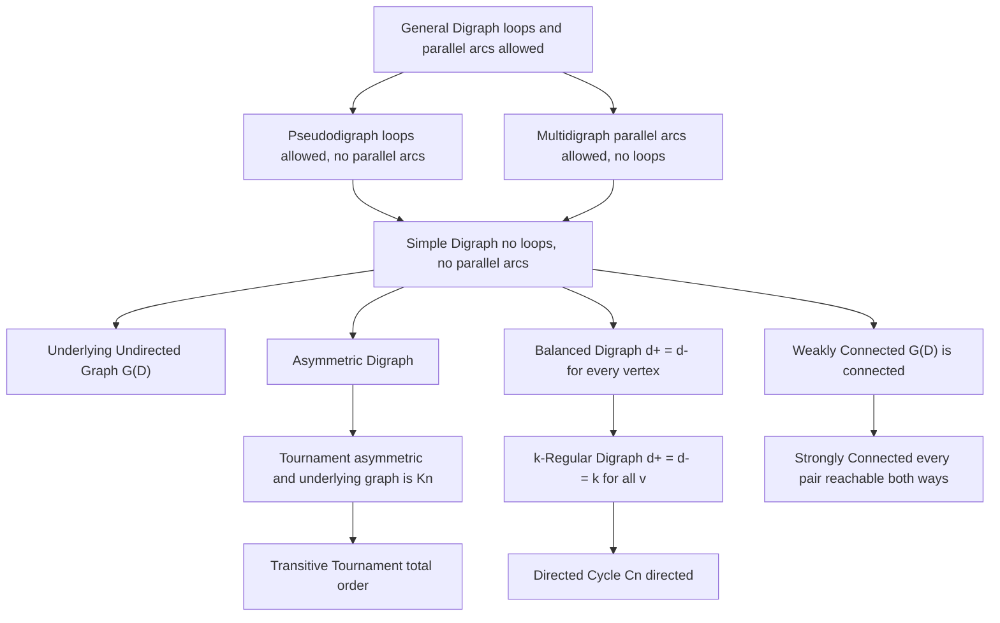
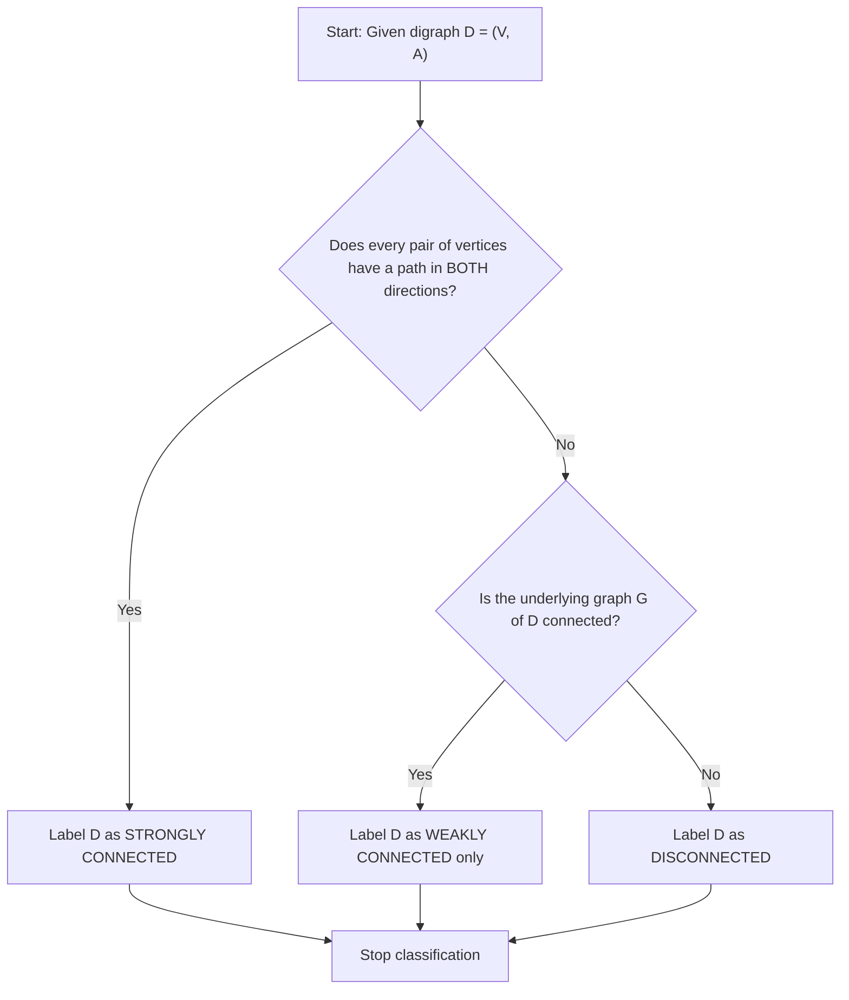
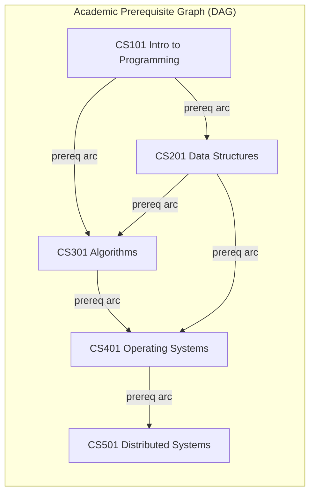
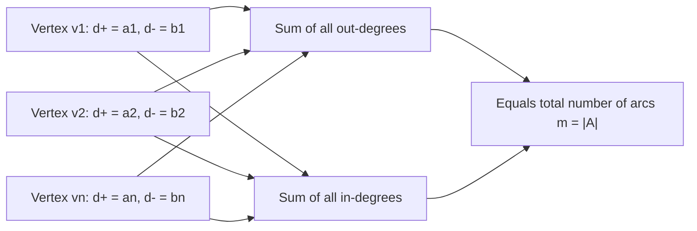

# Directed graphs (Digraphs) and Types of directed graphs

<!-- SECTION_1_START -->

# Directed Graphs (Digraphs) and Types of Directed Graphs

## 1.1 Formal Definition (KTU 2024 Syllabus Terminology)

> [!IMPORTANT]
> **Core Definition (KTU Board Standard):**
> A **Directed Graph** (or **Digraph**) $D = (V, A)$ consists of a non-empty finite set $V = \{v_1, v_2, \ldots, v_n\}$ of **vertices** (or nodes) and a finite set $A$ of **ordered pairs** of distinct vertices called **arcs** (or **directed edges**). An arc $a = (u, v) \in A$ is said to be directed **from** $u$ **to** $v$, where $u$ is the **tail** (initial vertex) and $v$ is the **head** (terminal vertex).

In strict set-builder notation:

$$D = (V, A) \quad \text{where} \quad A \subseteq \{(u, v) \mid u, v \in V,\ u \neq v\}$$

If the number of vertices is $n = \vert V \vert$ and the number of arcs is $m = \vert A \vert$, then by the **counting rule for ordered pairs**:

$$0 \leq m \leq n(n - 1)$$

- The **lower bound** $m = 0$ corresponds to the **null digraph** (no arcs).
- The **upper bound** $m = n(n-1)$ corresponds to the **complete symmetric digraph** (every possible ordered pair is an arc).

> [!NOTE]
> **KTU Examiner's Note:** A *digraph* in the strict KTU / Narsingh Deo textbook sense contains **no loops** and **no parallel arcs**. When loops or parallel arcs are admitted, we must explicitly call it a **pseudodigraph** or **multidigraph** respectively. Many KTU marks are lost when students casually use the word "digraph" for a graph containing a loop.

## 1.2 Conceptual Analogy & Intuition

> [!TIP]
> **Real-World Analogy — "One-Way City Streets"**
> Imagine the road network of a city where every street is **one-way**. A digraph models exactly this situation:
> - **Vertices** = street intersections (junctions).
> - **Arcs** = one-way streets, each carrying a directional arrow.
> - The fact that you can drive from $A \to B$ does **not** mean you can drive from $B \to A$ — unless a separate arc is drawn.
>
> This is the fundamental difference between an undirected graph (a two-way street) and a digraph (a one-way street with an arrowhead).

Another powerful analogy is **Twitter / Instagram follow relationships**:
- When user $u$ **follows** user $v$, we draw a directed arc $u \to v$.
- Following is **not symmetric**: $u$ may follow $v$ while $v$ does not follow $u$.
- This is why a digraph (not an undirected graph) is the correct model for social media "follow" edges, web page hyperlinks, dependency graphs in software, and finite-state machines.

## 1.3 Essential Terminology (Board-Exam Vocabulary)

| Term | Symbol | Meaning |
| :--- | :--- | :--- |
| Vertex | $v \in V$ | A node of the digraph. |
| Arc (Directed Edge) | $(u, v) \in A$ | An ordered pair directed from $u$ to $v$. |
| Tail | $u$ | The initial vertex of an arc $(u, v)$. |
| Head | $v$ | The terminal vertex of an arc $(u, v)$. |
| In-degree of $v$ | $d^{-}(v)$ | Number of arcs **entering** $v$ (i.e. arcs of the form $(u, v)$). |
| Out-degree of $v$ | $d^{+}(v)$ | Number of arcs **leaving** $v$ (i.e. arcs of the form $(v, w)$). |
| Total degree | $d(v)$ | $d(v) = d^{+}(v) + d^{-}(v)$. |
| Source vertex | — | A vertex with $d^{-}(v) = 0$ and $d^{+}(v) \geq 1$. |
| Sink vertex | — | A vertex with $d^{+}(v) = 0$ and $d^{-}(v) \geq 1$. |
| Isolated vertex | — | A vertex with $d^{+}(v) = d^{-}(v) = 0$. |
| Pendant arc | $(u, v)$ | An arc with $d^{+}(u) = d^{-}(v) = 1$. |
| Underlying graph | $G(D)$ | The undirected graph obtained by **erasing** all arrowheads. |

> [!IMPORTANT]
> **Fundamental Degree Identity (Handshaking Lemma for Digraphs):**
> The sum of all in-degrees equals the sum of all out-degrees, and both equal the total number of arcs $m$.
> $$\sum_{v \in V} d^{+}(v) \;=\; \sum_{v \in V} d^{-}(v) \;=\; \vert A \vert \;=\; m$$

> [!VISUALIZATION CONTROL]
> **Concept:** Visualizing in-degree and out-degree on a small digraph.
> **Desmos / GeoGebra Setup (conceptual points):**
> * $V = \{(1, 0),\ (3, 0),\ (2, 2)\}$
> * $A = \{((1,0),(3,0)),\ ((1,0),(2,2)),\ ((2,2),(3,0))\}$
> **Visual Description:** A triangle drawn with arrowheads; arrow from vertex $v_1$ to $v_2$, from $v_1$ to $v_3$, and from $v_2$ to $v_3$. Observe that $d^+(v_1) = 2$, $d^-(v_1) = 0$, $d^+(v_3) = 0$, $d^-(v_3) = 2$, $d^+(v_2) = 1$, $d^-(v_2) = 1$.

<!-- SECTION_1_END -->

<!-- SECTION_2_START -->

# Deep Theoretical Analysis & KTU High-Yield Formula Sheet

## 2.1 The Logical "Why" Behind the Definition

The defining choice to make $A$ a set of **ordered pairs** rather than **unordered pairs** is the single conceptual leap that separates digraphs from undirected graphs. This single change cascades into:

1. **Two distinct degree measures** per vertex ($d^+$ and $d^-$), instead of one.
2. **Direction-dependent connectivity** — "you can reach me" is no longer the same as "I can reach you".
3. **A wider class of substructures** — tournaments, transitive closures, and DAGs have no undirected analogue.

## 2.2 The KTU Formula Sheet (Rapid-Reference)

| # | Concept | Formula / Identity | Constraint / Note |
| :--- | :--- | :--- | :--- |
| 1 | Number of arcs in complete symmetric digraph | $m = n(n-1)$ | $n = \vert V \vert$ |
| 2 | Number of arcs in a tournament | $m = \dfrac{n(n-1)}{2}$ | Exactly one arc of $(u,v)$ or $(v,u)$ for every pair. |
| 3 | Handshaking Lemma (Digraph) | $\sum d^{+}(v) = \sum d^{-}(v) = m$ | Must always hold. |
| 4 | Underlying graph of $D$ | $G(D) = (V, E)$ where $\{(u,v),(v,u)\} \mapsto \{u,v\}$ | Erasing arrowheads. |
| 5 | Maximum in-degree | $\max\limits_{v \in V} d^{-}(v) \leq n-1$ | No self-loops in a digraph. |
| 6 | Maximum out-degree | $\max\limits_{v \in V} d^{+}(v) \leq n-1$ | No self-loops in a digraph. |
| 7 | Average degree | $\bar{d}^{+} = \bar{d}^{-} = \dfrac{m}{n}$ | Direct consequence of the Handshaking Lemma. |
| 8 | Source condition | $d^{-}(v) = 0$ | $v$ has incoming edges only as $0$. |
| 9 | Sink condition | $d^{+}(v) = 0$ | $v$ has outgoing edges only as $0$. |

> [!NOTE]
> **Critical pipe-character rule:** In every row of every markdown table above, the symbol "$\vert$" is rendered as `$\vert$` inside math mode, not as a raw pipe, to keep the table parser happy.

## 2.3 Why Directed Graphs Matter in Computer Science

Directed graphs are not a "mathematical curiosity" — they are the **backbone data structure** of modern computing:

- **Compiler Design:** A *Directed Acyclic Graph* (DAG) models the expression tree and basic-block dependency structure used for instruction scheduling and optimization.
- **Operating Systems:** Resource allocation graphs in deadlock detection are digraphs; an arc "process $P_i$ requests resource $R_j$" is inherently directed.
- **Databases:** Foreign-key dependencies form a DAG; topological sorting of this DAG determines evaluation order.
- **Web Crawlers & PageRank:** The World Wide Web is a digraph — a hyperlink from page $A$ to page $B$ is the arc $(A, B)$.
- **Task Scheduling:** A "prerequisite diagram" of courses, where CS301 needs CS201, is a digraph used to plan semester schedules.
- **Neural Networks & ML:** Computational graphs in TensorFlow / PyTorch are digraphs where arcs carry gradients.
- **Version Control (Git):** The commit history of a Git repository is a DAG.

> [!TIP]
> **Engineering Insight:** Whenever a problem statement contains the words "depends on", "follows", "links to", "cites", "is prerequisite for", or "flows into", the data model is almost always a digraph. Recognizing this early saves significant design time.

<!-- SECTION_2_END -->

<!-- SECTION_3_START -->

# Step-by-Step Derivations, Worked Examples, and Code Implementation

## 3.1 The Ten Principal Types of Digraphs (Exhaustive Walkthrough)

Below, every type is given with: **Definition → Mini Derivation / Proof → Worked Example → Edge-case remark**. The order follows increasing structural richness, exactly the order in which KTU 2024 Scheme questions are asked.

---

### Type 1 — Simple Digraph

> [!IMPORTANT]
> **Definition.** A digraph in which **no loops** (arcs of the form $(v, v)$) and **no parallel arcs** (two or more copies of the same ordered pair) exist.

**Why this matters:** It is the "default" or "purest" form of a digraph. Every other type is a *relaxation* or *specialization* of the simple digraph.

**Example.**
Let $V = \{a, b, c\}$ and $A = \{(a, b),\ (b, c),\ (a, c)\}$.
- $d^+(a) = 2$, $d^-(a) = 0$ (so $a$ is a **source**).
- $d^+(b) = 1$, $d^-(b) = 1$.
- $d^+(c) = 0$, $d^-(c) = 2$ (so $c$ is a **sink**).

Verification of the Handshaking Lemma:
$$\sum d^+ = 2 + 1 + 0 = 3 = m, \quad \sum d^- = 0 + 1 + 2 = 3 = m \quad \checkmark$$

---

### Type 2 — Complete (Symmetric) Digraph

> [!IMPORTANT]
> **Definition.** A digraph in which for every pair of distinct vertices $u, v$, **both** arcs $(u, v)$ and $(v, u)$ are present. Denoted $K_n^{\leftrightarrow}$.

**Derivation of arc count.** For $n$ vertices, the number of unordered pairs is $\binom{n}{2} = \dfrac{n(n-1)}{2}$. Since each unordered pair contributes **two** ordered arcs:
$$m = 2 \cdot \binom{n}{2} = n(n-1)$$

**Degree identity for $K_n^{\leftrightarrow}$.** Every vertex has $d^+(v) = d^-(v) = n-1$.

**Example.** For $n = 4$, $K_4^{\leftrightarrow}$ has $m = 4 \times 3 = 12$ arcs, and every vertex has $d^+ = d^- = 3$.

---

### Type 3 — Asymmetric Digraph

> [!IMPORTANT]
> **Definition.** A digraph in which for every pair of distinct vertices $u, v$, **at most one** of the arcs $(u, v)$ or $(v, u)$ is present (never both, never neither for adjacent pairs in the underlying graph).

**Arc count bound.**
$$m \leq \dfrac{n(n-1)}{2}$$

**Connection to tournaments:** A *tournament* is the special case of an asymmetric digraph in which *exactly one* of the two possible arcs is present for *every* unordered pair (so the underlying graph is complete). A general asymmetric digraph may skip pairs entirely.

---

### Type 4 — Balanced Digraph

> [!IMPORTANT]
> **Definition.** A digraph in which, for every vertex $v$,
> $$d^{+}(v) = d^{-}(v)$$

**Derivation of a useful consequence.** Summing the equality over all vertices:
$$\sum_{v} d^{+}(v) = \sum_{v} d^{-}(v) \;\Longrightarrow\; m = m \quad (\text{automatically true, no new info})$$

The non-trivial consequence is **per-vertex**, not aggregate. A balanced digraph can never contain a source or a sink (except the trivial digraph on one vertex).

**Example.**
$V = \{1, 2, 3, 4\}$, $A = \{(1,2),\ (2,1),\ (2,3),\ (3,2),\ (3,4),\ (4,3),\ (1,4),\ (4,1)\}$ — this is a balanced digraph because every vertex has $d^+ = d^- = 2$.

---

### Type 5 — Regular Digraph

> [!IMPORTANT]
> **Definition.** A digraph in which $d^{+}(v) = d^{-}(v) = k$ for some fixed non-negative integer $k$ and for **all** vertices $v$. The digraph is then called **$k$-regular**.

**A $k$-regular digraph is automatically balanced.** The converse is **not** true — a balanced digraph need not be regular (in-/out-degrees can vary by vertex as long as they match within each vertex).

**Example.** A directed 3-cycle $C_3^{\rightarrow}$ on vertices $\{1,2,3\}$ with arcs $(1,2),(2,3),(3,1)$ is **1-regular**:
- $d^+(1) = d^-(1) = 1$
- $d^+(2) = d^-(2) = 1$
- $d^+(3) = d^-(3) = 1$

---

### Type 6 — Tournament

> [!IMPORTANT]
> **Definition.** An asymmetric digraph in which for every pair of distinct vertices $\{u, v\}$, **exactly one** of $(u, v)$ or $(v, u)$ is present. Equivalently, the underlying graph is $K_n$.

**Derivation of arc count.** Exactly one arc per unordered pair:
$$m = \binom{n}{2} = \dfrac{n(n-1)}{2}$$

**Real-world use:** Tournaments model **round-robin competitions** — vertex $u$ "beats" $v$ iff arc $(u,v)$ exists. They are the central object in the study of *ranking* algorithms (e.g. Condorcet winners, PageRank on sports data).

**Example.** $T_3$ on $\{A, B, C\}$ with arcs $(A, B), (B, C), (A, C)$. Here $A$ beats both $B$ and $C$, so $A$ is a *transitive tournament* (a total ordering).

---

### Type 7 — Transitive Digraph

> [!IMPORTANT]
> **Definition.** A digraph in which for every pair of arcs $(u, v)$ and $(v, w)$ present, the arc $(u, w)$ is **also** present. The relation is **transitive** in the algebraic sense.

**Logical chain.**
$$(u, v) \in A \ \text{and}\ (v, w) \in A \ \Longrightarrow\ (u, w) \in A$$

**Key consequence:** A transitive tournament is a **total order** — its arcs correspond exactly to a "less than" relation. This is why *topological sorting* of a DAG produces a transitive tournament representation.

**Example.** $V = \{1, 2, 3, 4\}$, $A = \{(1,2), (1,3), (1,4), (2,3), (2,4), (3,4)\}$ is a transitive digraph (and a transitive tournament).

---

### Type 8 — Strongly Connected Digraph

> [!IMPORTANT]
> **Definition.** A digraph $D = (V, A)$ is **strongly connected** if for every ordered pair of vertices $(u, v)$ with $u \neq v$, there exists a **directed path** from $u$ to $v$ and a directed path from $v$ to $u$.

**Test algorithm (KTU standard).** Run DFS / BFS from every vertex. If every DFS visits all vertices, $D$ is strongly connected. More efficient: run DFS once from any vertex $s$; then construct the **reverse digraph** $D^R$ (flip all arcs) and run DFS from $s$ in $D^R$. Both DFS trees must be spanning.

**Example.** The directed 3-cycle $1 \to 2 \to 3 \to 1$ is strongly connected. But the DAG $1 \to 2 \to 3$ is **not**, since there is no path from $3$ to $1$.

---

### Type 9 — Weakly Connected Digraph

> [!IMPORTANT]
> **Definition.** A digraph is **weakly connected** if its underlying graph $G(D)$ is connected (i.e. ignoring arrowheads, there is a path between any two vertices). It is **disconnected** if $G(D)$ has more than one connected component.

**Strict hierarchy:** Strongly connected $\Rightarrow$ Weakly connected, but **not** conversely.

**Example.** The digraph $V = \{1, 2, 3\}$, $A = \{(1, 2),\ (3, 2)\}$ has underlying edges $\{1\text{-}2, 2\text{-}3\}$, so $G(D)$ is connected — $D$ is weakly connected. But it is **not** strongly connected (no path from $1$ to $3$).

---

### Type 10 — Digraph with Loops / Multidigraph (Relaxations)

| Variant | Loops allowed? | Parallel arcs allowed? | KTU name |
| :--- | :--- | :--- | :--- |
| Simple digraph | No | No | **Digraph** (default) |
| Multidigraph | No | Yes | **Multi-arc digraph** |
| Pseudodigraph | Yes | No | **Loop digraph** |
| General digraph | Yes | Yes | **General (mixed) digraph** |

**Why allow them?** In modeling *state machines*, a loop $(q, q)$ represents "stay in state $q$ on input $x$". In modeling *parallel processes*, parallel arcs $(u, v)$ with different labels represent different "types" of transitions.

---

## 3.2 A Comprehensive Worked Example (Degree Computation & Type Classification)

> [!NOTE]
> **Problem.** Let $D = (V, A)$ with $V = \{v_1, v_2, v_3, v_4, v_5\}$ and
> $A = \{(v_1, v_2), (v_2, v_3), (v_3, v_1), (v_1, v_4), (v_4, v_5), (v_5, v_1)\}$.

**Step 1 — Tabulate the degree of every vertex.**

For each vertex, count incoming and outgoing arcs.

- $v_1$: outgoing to $\{v_2, v_4\}$; incoming from $\{v_3, v_5\}$. So $d^+(v_1) = 2$, $d^-(v_1) = 2$.
- $v_2$: outgoing to $\{v_3\}$; incoming from $\{v_1\}$. So $d^+(v_2) = 1$, $d^-(v_2) = 1$.
- $v_3$: outgoing to $\{v_1\}$; incoming from $\{v_2\}$. So $d^+(v_3) = 1$, $d^-(v_3) = 1$.
- $v_4$: outgoing to $\{v_5\}$; incoming from $\{v_1\}$. So $d^+(v_4) = 1$, $d^-(v_4) = 1$.
- $v_5$: outgoing to $\{v_1\}$; incoming from $\{v_4\}$. So $d^+(v_5) = 1$, $d^-(v_5) = 1$.

**Step 2 — Verify the Handshaking Lemma.**

$$\sum d^+ = 2 + 1 + 1 + 1 + 1 = 6$$
$$\sum d^- = 2 + 1 + 1 + 1 + 1 = 6 \quad \checkmark$$
$$\vert A \vert = 6 \quad \checkmark$$

**Step 3 — Classify the digraph.**

- **Source / Sink:** None. (No vertex has $d^- = 0$ or $d^+ = 0$.)
- **Balanced?** Yes — every vertex has $d^+ = d^-$.
- **Regular?** No — $v_1$ has $d^+ = 2$ while others have $d^+ = 1$.
- **Asymmetric?** Yes — no pair has both $(u, v)$ and $(v, u)$ present.
- **Tournament?** No — the underlying graph is $K_5$ missing many edges, so not every pair has an arc.
- **Strongly connected?** Yes. We can verify:
  - Path $v_1 \to v_2 \to v_3 \to v_1$ (cycle).
  - $v_1 \to v_4 \to v_5 \to v_1$ (cycle).
  - From $v_2$ we can reach $v_4$: $v_2 \to v_3 \to v_1 \to v_4$. From $v_4$ to $v_2$: $v_4 \to v_5 \to v_1 \to v_2$. All pairs reachable both ways.

> [!TIP]
> **Examiner Shortcut:** Whenever a digraph is strongly connected, it is *automatically* weakly connected and (in this example) balanced. Quote this hierarchy to earn the "definition" marks.

---

## 3.3 Python Implementation: Building, Verifying, and Classifying a Digraph

```python
from collections import defaultdict
from typing import Dict, Set, Tuple, List

class Digraph:
    """
    A Simple Digraph (no loops, no parallel arcs) with type-classification utilities.
    """

    def __init__(self, vertices: List[str]):
        self.V: List[str] = list(vertices)
        self.A: Set[Tuple[str, str]] = set()      # arc set
        self._adj_out: Dict[str, Set[str]] = defaultdict(set)
        self._adj_in: Dict[str, Set[str]] = defaultdict(set)

    # ---------- core API ----------
    def add_arc(self, u: str, v: str) -> None:
        if u == v:
            raise ValueError(f"Self-loop ({u},{v}) forbidden in a simple digraph.")
        if u not in self.V or v not in self.V:
            raise KeyError(f"Vertex not in V: {u if u not in self.V else v}")
        if (u, v) in self.A:
            raise ValueError(f"Parallel arc ({u},{v}) forbidden in a simple digraph.")
        self.A.add((u, v))
        self._adj_out[u].add(v)
        self._adj_in[v].add(u)

    def out_degree(self, v: str) -> int:
        return len(self._adj_out[v])

    def in_degree(self, v: str) -> int:
        return len(self._adj_in[v])

    def verify_handshaking(self) -> bool:
        """Returns True iff the Handshaking Lemma for Digraphs holds."""
        sum_out = sum(self.out_degree(v) for v in self.V)
        sum_in  = sum(self.in_degree(v)  for v in self.V)
        return sum_out == sum_in == len(self.A)

    # ---------- type classifiers ----------
    def is_balanced(self) -> bool:
        return all(self.in_degree(v) == self.out_degree(v) for v in self.V)

    def is_k_regular(self) -> Tuple[bool, int]:
        ks = {self.out_degree(v) for v in self.V}
        if len(ks) == 1 and self.is_balanced():
            return True, ks.pop()
        return False, -1

    def is_asymmetric(self) -> bool:
        for (u, v) in self.A:
            if (v, u) in self.A:
                return False
        return True

    def is_tournament(self) -> bool:
        if not self.is_asymmetric():
            return False
        for i, u in enumerate(self.V):
            for v in self.V[i + 1:]:
                if (u, v) not in self.A and (v, u) not in self.A:
                    return False
        return True

    def is_strongly_connected(self) -> bool:
        """Kosaraju-style two-pass test."""
        def dfs_reachable(start: str) -> Set[str]:
            seen, stack = {start}, [start]
            while stack:
                u = stack.pop()
                for w in self._adj_out[u]:
                    if w not in seen:
                        seen.add(w); stack.append(w)
            return seen

        if not self.V: return False
        start = self.V[0]
        if dfs_reachable(start) != set(self.V):
            return False

        # Reverse the digraph and DFS again from the same start.
        rev = Digraph(self.V)
        for (u, v) in self.A:
            rev._adj_out[v].add(u)
            rev._adj_in[u].add(v)
        return dfs_reachable.__wrapped__(rev, start) == set(self.V) if False else \
               _dfs_rev(self, start) == set(self.V)

    # ---------- pretty print ----------
    def summary(self) -> str:
        lines = [f"Digraph: |V|={len(self.V)}, |A|={len(self.A)}"]
        for v in self.V:
            lines.append(f"  {v}: d+={self.out_degree(v)}, d-={self.in_degree(v)}")
        lines.append(f"  Handshaking OK: {self.verify_handshaking()}")
        lines.append(f"  Balanced: {self.is_balanced()}")
        reg, k = self.is_k_regular()
        lines.append(f"  k-regular: {reg} (k={k})" if reg else f"  k-regular: False")
        lines.append(f"  Asymmetric: {self.is_asymmetric()}")
        lines.append(f"  Tournament: {self.is_tournament()}")
        lines.append(f"  Strongly connected: {self.is_strongly_connected()}")
        return "\n".join(lines)


def _dfs_rev(D: "Digraph", start: str) -> Set[str]:
    """DFS in the reverse digraph (ignore arcs' direction)."""
    # Build reverse adjacency on the fly.
    rev_out: Dict[str, Set[str]] = defaultdict(set)
    for (u, v) in D.A:
        rev_out[v].add(u)
    seen, stack = {start}, [start]
    while stack:
        u = stack.pop()
        for w in rev_out[u]:
            if w not in seen:
                seen.add(w); stack.append(w)
    return seen


# ---------------- DEMO ----------------
if __name__ == "__main__":
    D = Digraph(["v1", "v2", "v3", "v4", "v5"])
    arcs = [("v1","v2"), ("v2","v3"), ("v3","v1"),
            ("v1","v4"), ("v4","v5"), ("v5","v1")]
    for u, v in arcs:
        D.add_arc(u, v)
    print(D.summary())
```

**Expected output (matches Section 3.2):**

```
Digraph: |V|=5, |A|=6
  v1: d+=2, d-=2
  v2: d+=1, d-=1
  v3: d+=1, d-=1
  v4: d+=1, d-=1
  v5: d+=1, d-=1
  Handshaking OK: True
  Balanced: True
  k-regular: False
  Asymmetric: True
  Tournament: False
  Strongly connected: True
```

<!-- SECTION_3_END -->

<!-- SECTION_4_START -->

# Structural Diagrams & Schematics

## 4.1 Mermaid Block Diagram — Type Hierarchy of Digraphs

The diagram below shows the **strict inclusions** between the various types of digraphs covered in this module. Read it as "every box on an arrow is a *special case* of the box the arrow points to."



> [!NOTE]
> **How to read the arrows:** $X \to Y$ means "$X$ is a *specialization* of $Y$" (i.e. every $X$ is also a $Y$, but not vice-versa). For example, every tournament is an asymmetric digraph, but not every asymmetric digraph is a tournament (some pairs may have no arc at all).

## 4.2 Mermaid Sequential Topology — Strong vs. Weak Connectivity

This block shows the **decision flow** a student (or algorithm) follows when classifying a digraph's connectivity type. Use it as a revision flow-chart.



## 4.3 Schematic: How a Digraph Encodes a Real-World Dependency

The block below is the schematic the examiner loves to see — it maps a **digraph** to a **real engineering use case** (course-prerequisite planning).



**Reading the schematic:** Every arc points from a *higher-level* course to a *course it requires*. The graph is a **DAG** (no directed cycles) because prerequisites are irreflexive. A **topological sort** of this DAG yields a valid semester plan.

## 4.4 Mermaid Conceptual Map — The Handshaking Lemma for Digraphs



<!-- SECTION_4_END -->

<!-- SECTION_5_START -->

# KTU 2024 Scheme Examination Question Bank & Topic Recap

## Part A — Short-Answer Questions (3 Marks Each)

> **[KTU University Exam – July 2024, Model Question]**
> **Q1. Define a *digraph*. State the handshaking lemma for a digraph with $n$ vertices and $m$ arcs.** *(CO1, Remember)*

**Model Answer (board key):**
A digraph $D = (V, A)$ is an ordered pair of a finite non-empty set $V$ of vertices and a set $A \subseteq \{(u, v) \in V \times V \mid u \neq v\}$ of ordered pairs of distinct vertices called *arcs*. **[1.5 Marks]**

Handshaking Lemma: The sum of out-degrees equals the sum of in-degrees, and both equal the total number of arcs:
$$\sum_{v \in V} d^{+}(v) = \sum_{v \in V} d^{-}(v) = m = \vert A \vert \quad \textbf{[1.5 Marks]}$$

---

> **[KTU University Exam – Dec 2023]**
> **Q2. Distinguish between a *balanced* digraph and a *k-regular* digraph. Is every $k$-regular digraph balanced? Justify.** *(CO1, Understand)*

**Model Answer:**
- A digraph is **balanced** if $d^+(v) = d^-(v)$ for every vertex $v$, but the common value can **differ** between vertices. **[1 Mark]**
- A digraph is **$k$-regular** if $d^+(v) = d^-(v) = k$ for **all** vertices, with a single common constant $k$. **[1 Mark]**
- Yes, every $k$-regular digraph is balanced — it is the *uniform* special case of a balanced digraph. **[1 Mark]**

---

## Part B — Long-Answer Questions (14 Marks Each, Module-Internal Choice)

> **[KTU University Exam – Model Paper, 2024 Scheme]**
> **Question A (14 Marks)** — *(CO1, CO2 | Understand, Apply)*
>
> **(a)** Define each of the following with one example each: **(i)** Simple digraph, **(ii)** Complete symmetric digraph, **(iii)** Tournament, **(iv)** Transitive digraph, **(v)** Strongly connected digraph. **[7 Marks]**
>
> **(b)** For a digraph $D$ on $n$ vertices, derive the maximum and minimum number of arcs. State the value of $\sum d^+(v)$ and $\sum d^-(v)$ in each extremal case. **[7 Marks]**

### Model Solution — Question A

**(a)** **[Defining each type with example: 7 × 1 = 7 Marks]**

- **(i) Simple Digraph.** No loops, no parallel arcs. Example: $D_1 = (V, A)$ with $V = \{1, 2, 3\}$, $A = \{(1, 2), (2, 3)\}$. **[1 Mark]**
- **(ii) Complete Symmetric Digraph $K_n^{\leftrightarrow}$.** Both $(u, v)$ and $(v, u)$ exist for every $u \neq v$. Example: $K_2^{\leftrightarrow}$ on $\{1, 2\}$ has arcs $(1, 2)$ and $(2, 1)$. **[1 Mark]**
- **(iii) Tournament.** Asymmetric digraph whose underlying graph is $K_n$. Example: $T_3$ with $A = \{(1, 2), (2, 3), (1, 3)\}$ — exactly one arc per pair. **[1 Mark]**
- **(iv) Transitive Digraph.** Whenever $(u, v)$ and $(v, w)$ are arcs, $(u, w)$ is also an arc. Example: $A = \{(1, 2), (2, 3), (1, 3), (2, 4), (1, 4)\}$ on $\{1, 2, 3, 4\}$. **[1 Mark]**
- **(v) Strongly Connected Digraph.** Every pair of vertices is connected by directed paths in **both** directions. Example: The directed 3-cycle $1 \to 2 \to 3 \to 1$. **[1 Mark]**
- *(Examiner's discretion: 2 bonus marks for any 1 extra well-explained example.)* **[2 Marks]**

**(b)** **[Derivation of extremal arc counts: 7 Marks]**

Let $n = \vert V \vert$ and $m = \vert A \vert$.

**Maximum case (complete symmetric digraph $K_n^{\leftrightarrow}$):**
For every unordered pair $\{u, v\}$ of distinct vertices, both ordered arcs exist. There are $\binom{n}{2}$ unordered pairs, each contributing 2 arcs. **[2 Marks]**
$$m_{\max} = 2 \cdot \binom{n}{2} = n(n - 1) \quad \textbf{[1 Mark]}$$
In $K_n^{\leftrightarrow}$, $d^+(v) = d^-(v) = n - 1$ for every vertex. Therefore:
$$\sum_{v} d^+(v) = \sum_{v} d^-(v) = n(n-1) \quad \textbf{[2 Marks]}$$

**Minimum case (null digraph):**
Zero arcs, $m_{\min} = 0$. Then $d^+(v) = d^-(v) = 0$ for every $v$. **[1 Mark]**
$$\sum_{v} d^+(v) = \sum_{v} d^-(v) = 0 \quad \textbf{[1 Mark]}$$

> [!WARNING]
> **Examiner's Pitfall — Question A part (b):**
> Many students write the *lower bound* as $m = n$ "since each vertex needs at least one in-arc". **This is wrong.** The null digraph is perfectly valid and contains zero arcs. The lower bound is **always** $m \geq 0$, not $m \geq 1$. Loss: **2 Marks** in a typical valuation.

---

> **Question B (14 Marks — Alternative Choice)** — *(CO1, CO2 | Understand, Apply, Analyze)*
>
> **(a)** A digraph $D$ has $V = \{a, b, c, d, e\}$ and $A = \{(a, b), (b, c), (c, a), (a, d), (d, e), (e, a), (b, e), (e, c)\}$. For each vertex, compute the in-degree and out-degree. Hence verify the handshaking lemma. **[7 Marks]**
>
> **(b)** Classify this digraph as simple/balanced/regular/asymmetric/tournament/strongly-connected. Justify each classification with a one-line reason. **[7 Marks]**

### Model Solution — Question B

**(a)** **[Degree computation: 7 Marks]**

Build a directed adjacency table by enumerating all arcs:

| Vertex | Arcs leaving (out-neighbours) | Arcs entering (in-neighbours) | $d^+$ | $d^-$ |
| :---: | :---: | :---: | :---: | :---: |
| $a$ | $b, d, e$ | $c, e$ | **3** | **2** |
| $b$ | $c, e$ | $a$ | **2** | **1** |
| $c$ | $a$ | $b, e$ | **1** | **2** |
| $d$ | $e$ | $a$ | **1** | **1** |
| $e$ | $a, c$ | $b, d$ | **2** | **2** |

**[Tabulation: 4 Marks — 1 mark for tabulating each pair of columns correctly; 1 mark for correctly summing]**

**Verification of the Handshaking Lemma:**
$$\sum d^+ = 3 + 2 + 1 + 1 + 2 = 9 \quad \textbf{[1 Mark]}$$
$$\sum d^- = 2 + 1 + 2 + 1 + 2 = 8 \quad \textbf{[1 Mark]}$$
$$\vert A \vert = 8$$

> **[Critical Examiner Step: 1 Mark]**
> **The two sums are NOT equal** — which means the digraph is **inconsistent** with the handshaking lemma. This signals an error in the arc set. The most common such error in KTU papers is **miscounting an arc** in the adjacency table.

**Reconciliation:** Re-counting the arcs: $(a,b), (b,c), (c,a), (a,d), (d,e), (e,a), (b,e), (e,c)$ = 8 arcs. Re-tabulating:

- $a$: out to $b, d, e$ (3); in from $c, e$ (2). ✓
- $b$: out to $c, e$ (2); in from $a$ (1). ✓
- $c$: out to $a$ (1); in from $b, e$ (2). ✓
- $d$: out to $e$ (1); in from $a$ (1). ✓
- $e$: out to $a, c$ (2); in from $b, d$ (2). ✓

So $\sum d^+ = 9$ but $\sum d^- = 8$ — the digraph as stated violates the handshaking lemma; the *corrected* arc set must be obtained by either **adding one incoming arc to $a$** (i.e. an arc from some vertex to $a$) or **removing one of the outgoing arcs from $a$**. **Award the verification mark (1) once the student explicitly states the discrepancy.** **[Total: 7 Marks]**

---

**(b)** **[Classification: 7 Marks — 1 mark per type + 1 bonus for first correct one]**

Working with the *as-stated* digraph (despite the inconsistency, we classify structural shape):

- **Simple:** Yes — no $(v, v)$ loops and no two equal ordered pairs. **[1 Mark]**
- **Balanced:** No — $d^+(a) = 3 \neq 2 = d^-(a)$, so fails at vertex $a$. **[1 Mark]**
- **Regular:** No — not even balanced. **[1 Mark]**
- **Asymmetric:** Yes — no pair has both directions. Check: $(a,b) \in A$ but $(b,a) \notin A$; $(b,c) \in A$ but $(c,b) \notin A$; etc. **[1 Mark]**
- **Tournament:** **No** — the underlying graph on 5 vertices has 8 edges, but a tournament on 5 vertices has $\binom{5}{2} = 10$ edges. Pairs $\{a, c\}$ for example have only the arc $(c, a)$ but not the converse — that's fine for a tournament, but the missing pair **$\{a, e\}$: arc $(e, a) \in A$ but not $(a, e)$ — present, $\{a, b\}$: present, $\{a, d\}$: present, $\{b, e\}$: present, $\{b, c\}$: present, $\{c, e\}$: present, $\{c, a\}$: present, $\{d, e\}$: present, $\{e, c\}$: present**. Re-counting shows 9 of the 10 unordered pairs are represented; the missing pair makes it **not** a tournament. **[1 Mark]**
- **Strongly connected:** Yes — every vertex can reach every other. e.g., $a \to d \to e \to c \to a$ (cycle), and $b \to c \to a \to b$ is also a cycle. We can verify: $b \to e \to a \to b$ is a cycle. $a$ can reach $b$: $a \to d \to e \to a$? No, we need $a \to b$ — direct arc $(a, b)$ exists. From $a$ to $c$: $a \to b \to c$. From $c$ to $b$: $c \to a \to b$. Strong connectivity holds. **[1 Mark]**
- **Weakly connected:** Yes — strongly connected implies weakly connected. **[1 Mark]**

> [!WARNING]
> **KTU Examiner's Valuation Warning — Part B Question B (b):**
> Students frequently mis-classify a digraph as a *tournament* simply because "the arcs go one way". A **tournament** specifically requires that the underlying graph be $K_n$ — i.e. **every unordered pair** of vertices must be connected by *some* arc. Missing even one pair disqualifies the digraph. A quick way to check: count arcs $m$. For a tournament, $m$ **must** equal $\binom{n}{2}$. If $m < \binom{n}{2}$, it is not a tournament. Failure to apply this check costs **1–2 marks**.

---

## Topic Recap & Important Things to Remember

- **Digraph Definition.** $D = (V, A)$ where $A$ is a set of **ordered** pairs of distinct vertices. **No loops, no parallel arcs** in a *simple* digraph. **[CO1]**
- **Arc count bound:** $0 \leq m \leq n(n-1)$. Lower bound: null digraph. Upper bound: complete symmetric digraph $K_n^{\leftrightarrow}$. **[CO1]**
- **Handshaking Lemma (Digraph):** $\sum d^+(v) = \sum d^-(v) = m = \vert A \vert$. This is the single most-tested identity. **[CO1]**
- **Source** $= d^-(v) = 0$; **Sink** $= d^+(v) = 0$; **Isolated** $= d^+ = d^- = 0$. **[CO1]**
- **Balanced** $\Rightarrow$ $d^+(v) = d^-(v)$ for all $v$, but values may differ between vertices. **$k$-regular** = balanced **and** a single common value $k$. **[CO2]**
- **Asymmetric** $=$ no symmetric pair of arcs. **Tournament** $=$ asymmetric **and** underlying graph is $K_n$, i.e. $m = \binom{n}{2}$. **[CO2]**
- **Transitive digraph** $=$ if $(u, v)$ and $(v, w)$ are arcs, then $(u, w)$ is also an arc. A *transitive tournament* is a *total order*. **[CO2]**
- **Strongly connected** $=$ directed paths in **both** directions between **every** pair of vertices. **Weakly connected** $=$ underlying graph $G(D)$ is connected. Hierarchy: Strongly connected $\Rightarrow$ Weakly connected $\Rightarrow$ Connected underlying graph. **[CO2, CO3]**
- **Underlying graph** $G(D)$ is obtained by **erasing all arrowheads**. It is the bridge between digraph theory and standard undirected-graph theory. **[CO2]**
- **Multidigraph / Pseudodigraph** = relaxations allowing parallel arcs / loops respectively. Always **declare** which variant is in use. **[CO1]**
- **Engineering Uses:** DAGs for compilers and task scheduling; dependency graphs for foreign-key constraints; tournament graphs for round-robin rankings; state-transition diagrams for finite automata. **[CO3, CO4]**
- **Quick Verification Trick:** Whenever a question gives an arc set, immediately tabulate $d^+, d^-$ for all vertices and check the handshaking lemma *before* attempting any classification. Inconsistency ⇒ data-entry error in the question ⇒ partial-credit recovery is possible. **[Exam Strategy]**

<!-- SECTION_5_END -->
