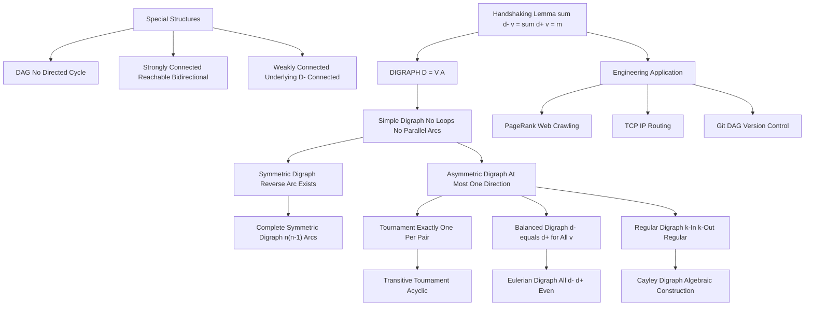
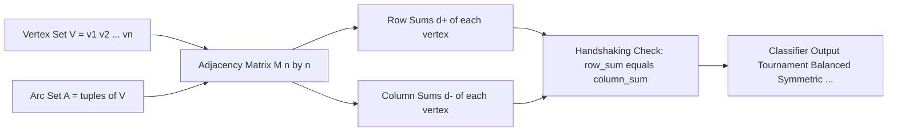

# Directed graphs (Digraphs) and Types of directed graphs

<!-- SECTION_1_START -->
# Directed Graphs (Digraphs) and Their Types

## 1.1 Formal Definition (KTU 2024 Syllabus Standard)

> [!IMPORTANT]
> **Definition (Directed Graph / Digraph):**
> A **directed graph** (or **digraph**) $D$ is an ordered pair $D = (V, A)$, where $V$ is a non-empty finite set whose elements are called **vertices** (or **nodes**), and $A$ is a set of ordered pairs of distinct elements of $V$ called **arcs** (or **directed edges**). Formally,
> $$A \subseteq \{(u, v) \mid u, v \in V,\ u \neq v\}$$

If the graph allows an arc from a vertex to itself, i.e., a pair $(u, u)$, it is called a **loop**. The KTU 2024 syllabus for *GAMAT401* typically restricts the base definition to **simple digraphs** (no loops, no multiple arcs in the same direction), but we will explicitly discuss the relaxed variants.

Each arc $a = (u, v) \in A$ has:
- A **tail** (initial vertex) $u$
- A **head** (terminal vertex) $v$
- It is conventionally drawn as $u \rightarrow v$

---

## 1.2 Conceptual Analogy & Intuition

> [!NOTE]
> **Real-World Analogy — One-Way Traffic Network:**
> Think of a city map where every road is a **one-way street**. The intersection of MG Road and Banerjee Road is a *vertex*. A road from MG $\rightarrow$ Banerjee is an arc $(MG, Banerjee)$, but a road from Banerjee $\rightarrow$ MG would be a *different* arc $(Banerjee, MG)$ — even if the two streets physically overlap. Following the direction matters: a Google Maps navigation works on a digraph!

**Other intuitive parallels:**
- **Twitter/X Social Network:** User A *follows* User B is an arc $A \rightarrow B$. Following is **not** symmetric — this is a digraph.
- **World Wide Web:** A hyperlink from Page $P_1$ to Page $P_2$ is a directed arc, the foundation of Google's original **PageRank** algorithm.
- **Task Scheduling in Operating Systems:** A prerequisite relationship "Task $T_1$ must finish before $T_2$ begins" is an arc $T_1 \rightarrow T_2$.

---

## 1.3 Visualization in GeoGebra / Desmos

> [!VISUALIZATION CONTROL]
> **Concept:** Visualising a directed graph on a 2D coordinate plane
> **GeoGebra / Desmos Input Points (vertices):**
> * `V1 = (0, 2)`
> * `V2 = (3, 3)`
> * `V3 = (3, -1)`
> * `V4 = (-2, -1)`
>
> **Suggested Arcs (input as Vector commands in GeoGebra):**
> * `Vector(V1, V2)` $\Rightarrow$ arc $V_1 \rightarrow V_2$
> * `Vector(V2, V3)` $\Rightarrow$ arc $V_2 \rightarrow V_3$
> * `Vector(V3, V4)` $\Rightarrow$ arc $V_3 \rightarrow V_4$
> * `Vector(V1, V4)` $\Rightarrow$ arc $V_1 \rightarrow V_4$
> * `Vector(V2, V1)` $\Rightarrow$ arc $V_2 \rightarrow V_1$ (note: this is a *separate* arc)
>
> **Visual Description:** The student should see five labelled points and arrowed segments. Notice that having both $V_1 \rightarrow V_2$ and $V_2 \rightarrow V_1$ creates a **bidirectional pair**, and a single isolated direction $V_1 \rightarrow V_4$ is a **one-way arc**.

---

## 1.4 Why Directed Graphs Matter in Computer Science

> [!IMPORTANT]
> Digraphs are the **backbone of modern computer science**:
> * **Dataflow analysis** in compilers (def-use chains).
> * **Dependency resolution** in package managers (npm, pip, apt).
> * **Routing protocols** in networks (BGP, OSPF use directed weighted graphs).
> * **State machines** in software design (DFA, NFA are labelled digraphs).
> * **Knowledge graphs** in AI / LLMs (RAG pipelines traverse directed edges).

The **standard metric** in digraph theory is the **order** of a digraph $D$, denoted by $\vert V \vert = n$, and the **size** $\vert A \vert = m$.

<!-- SECTION_1_END -->

<!-- SECTION_2_START -->
# Deep Theoretical Analysis & KTU High-Yield Formula Sheet

## 2.1 Foundational Measures on a Digraph

For every vertex $v \in V$ of a digraph $D = (V, A)$:

* **In-degree** $d^-(v)$: number of arcs whose **head** is $v$.
  $$d^-(v) = \vert\{u \in V \mid (u, v) \in A\}\vert$$

* **Out-degree** $d^+(v)$: number of arcs whose **tail** is $v$.
  $$d^+(v) = \vert\{w \in V \mid (v, w) \in A\}\vert$$

* **Total degree**: $d(v) = d^-(v) + d^+(v)$.

> [!NOTE]
> **The Handshaking Lemma for Digraphs (KTU Favourite Theorem):**
> The sum of all in-degrees equals the sum of all out-degrees, and both equal the total number of arcs:
> $$\sum_{v \in V} d^-(v) \;=\; \sum_{v \in V} d^+(v) \;=\; \vert A \vert \;=\; m$$
> This identity is non-trivial because in an *undirected* graph, both sums equal $2m$, but here they are each independently equal to $m$.

---

## 2.2 Master Classification of Digraphs (KTU 2024 Module 2)

The KTU 2024 syllabus for GAMAT401 Module 2 explicitly lists the following digraph types. We classify them by **symmetry**, **completeness**, and **degree balance**.

### Type 1 — Simple Digraph
* No loops, no parallel arcs in the same direction.
* $A$ is a *set*, not a *multiset*.
* Maximum possible arcs: $n(n-1)$.

### Type 2 — Symmetric Digraph
* For every arc $(u, v) \in A$, the reverse arc $(v, u) \in A$ also exists.
* Equivalent to treating $D$ as an undirected graph with bidirectional edges.
* **Total arcs** in a symmetric digraph: $m = \sum_{v} d^-(v) = \sum_{v} d^+(v) = 2 \times (\text{edges in underlying undirected graph})$.

### Type 3 — Asymmetric (Anti-symmetric) Digraph
* For every pair $\{u, v\}$, **at most one** of $(u, v)$ or $(v, u)$ is in $A$.
* This is the "default" interpretation of a digraph in most textbooks.

### Type 4 — Complete Digraph (a.k.a. Tournament if asymmetric, or Complete Symmetric Digraph if symmetric)
* **Asymmetric complete digraph** (the strict KTU definition of *Complete Digraph*): For every *ordered* pair of *distinct* vertices, exactly one arc exists.
  $$\text{Total arcs} = \binom{n}{2} = \dfrac{n(n-1)}{2}$$
* **Complete Symmetric Digraph**: Both $(u, v)$ and $(v, u)$ exist for every distinct pair. Total arcs $= n(n-1)$.

### Type 5 — Balanced Digraph
* Every vertex has the same **in-degree** and the same **out-degree**:
  $$d^-(v) = d^+(v) \quad \forall v \in V$$

### Type 6 — Regular Digraph (in-degree regular / out-degree regular)
* A digraph is **$k$-in-regular** if $d^-(v) = k$ for all $v$.
* A digraph is **$k$-out-regular** if $d^+(v) = k$ for all $v$.
* A **regular digraph** is *both* in-regular and out-regular with the same constant.

### Type 7 — Tournament
* A digraph $T = (V, A)$ where every *pair* of distinct vertices is connected by **exactly one arc**.
* Tournaments are the *asymmetric* complete digraphs.

### Type 8 — Underlying (Undirected) Graph $D^-$
* The undirected graph obtained by ignoring the direction of every arc in $D$.
* $\vert E(D^-) \vert = \dfrac{1}{2}\sum_{v} d(v)$ where $d(v) = d^-(v) + d^+(v)$.

### Type 9 — Subdigraph
* A digraph $D' = (V', A')$ where $V' \subseteq V$ and $A' \subseteq A$, with every arc in $A'$ having both endpoints in $V'$.

### Type 10 — Isolated / Null Digraph
* A digraph with no arcs ($m = 0$). Every vertex has $d^-(v) = d^+(v) = 0$.

---

## 2.3 KTU High-Yield Formula Cheat Sheet

> [!IMPORTANT]
> The following table is the **definitive reference** for the 14-mark derivations expected in the KTU End Semester Examination (ESE).

| # | Property | Formula / Condition | Engineering Use Case |
|---|----------|---------------------|----------------------|
| 1 | Order of a digraph $D$ | $n = \vert V \vert$ | Network size estimate |
| 2 | Size of a digraph $D$ | $m = \vert A \vert$ | Total traffic / data flow count |
| 3 | Handshaking Lemma (digraph) | $\sum d^-(v) = \sum d^+(v) = m$ | Validating adjacency matrix column/row sums |
| 4 | Max arcs in a simple digraph | $n(n-1)$ | Capacity planning |
| 5 | Arcs in a tournament | $\binom{n}{2} = \frac{n(n-1)}{2}$ | Round-robin tournament design |
| 6 | Arcs in a complete symmetric digraph | $n(n-1)$ | Full-duplex communication |
| 7 | Underlying graph edges | $\vert E(D^-) \vert = \frac{1}{2}\sum d(v)$ | Connectivity of directed networks |
| 8 | Balanced digraph condition | $d^-(v) = d^+(v)\ \forall v$ | Conservation laws (Kirchhoff-like) |
| 9 | $k$-in-regular | $d^-(v) = k\ \forall v$ | Load-balanced server fan-in |
| 10 | $k$-out-regular | $d^+(v) = k\ \forall v$ | Symmetric broadcasting |
| 11 | Acyclic Digraph (DAG) condition | No directed cycle exists | Topological sort, dependency resolution |
| 12 | Self-loop contribution | Adds $1$ to both $d^+$ and $d^-$ of $v$ | Reflective states in automata |
| 13 | Strongly connected digraph | Every vertex reachable from every other | Robust network design |
| 14 | Weakly connected digraph | Underlying graph $D^-$ is connected | Partial network reliability |

---

## 2.4 Engineering Relevance Summary

> [!NOTE]
> **Why is every formula above a real KTU / industry hot-topic?**
> * **Web Crawlers** model pages as vertices and hyperlinks as arcs, then compute *PageRank* using the in-degree-weighted eigenvector — a direct application of $d^-(v)$.
> * **Packet Routing in TCP/IP** uses directed weighted graphs where the *out-degree* of a router determines its forwarding capacity.
> * **Git version control** internally represents commits as a DAG (Directed Acyclic Graph) — every "merge" is a vertex with two incoming arcs.

<!-- SECTION_2_END -->

<!-- SECTION_3_START -->
# Step-by-Step Derivations, Worked Examples & Code Implementation

## 3.1 Worked Example 1 — Verifying the Handshaking Lemma

> [!IMPORTANT]
> **Problem Statement (Model KTU 2-mark):**
> Consider a digraph $D$ with vertex set $V = \{v_1, v_2, v_3, v_4, v_5\}$ and arc set
> $$A = \{(v_1, v_2),\ (v_2, v_3),\ (v_3, v_1),\ (v_3, v_4),\ (v_4, v_5),\ (v_5, v_3)\}.$$
> Compute the in-degree, out-degree, and total degree of each vertex. Verify the Handshaking Lemma for Digraphs.

### Solution (Exhaustive Step-by-Step)

**Step 1 — Tabulate the arcs by their head (for in-degree) and tail (for out-degree).**

We list every arc and split it into its **tail** (outgoing contribution) and **head** (incoming contribution).

| Arc | Tail | Head |
|-----|------|------|
| $(v_1, v_2)$ | $v_1$ | $v_2$ |
| $(v_2, v_3)$ | $v_2$ | $v_3$ |
| $(v_3, v_1)$ | $v_3$ | $v_1$ |
| $(v_3, v_4)$ | $v_3$ | $v_4$ |
| $(v_4, v_5)$ | $v_4$ | $v_5$ |
| $(v_5, v_3)$ | $v_5$ | $v_3$ |

**Step 2 — Count in-degrees $d^-(v_i)$.**

We tally how many times each vertex appears in the *Head* column.

* $d^-(v_1) = 1$ (from arc $(v_3, v_1)$)
* $d^-(v_2) = 1$ (from arc $(v_1, v_2)$)
* $d^-(v_3) = 2$ (from arcs $(v_2, v_3)$ and $(v_5, v_3)$)
* $d^-(v_4) = 1$ (from arc $(v_3, v_4)$)
* $d^-(v_5) = 1$ (from arc $(v_4, v_5)$)

**Step 3 — Count out-degrees $d^+(v_i)$.**

We tally how many times each vertex appears in the *Tail* column.

* $d^+(v_1) = 1$ (arc $(v_1, v_2)$)
* $d^+(v_2) = 1$ (arc $(v_2, v_3)$)
* $d^+(v_3) = 2$ (arcs $(v_3, v_1)$ and $(v_3, v_4)$)
* $d^+(v_4) = 1$ (arc $(v_4, v_5)$)
* $d^+(v_5) = 1$ (arc $(v_5, v_3)$)

**Step 4 — Compute the totals and verify the Handshaking Lemma.**

Sum of in-degrees:

$$\sum_{i=1}^{5} d^-(v_i) \;=\; 1 + 1 + 2 + 1 + 1 \;=\; 6.$$

Sum of out-degrees:

$$\sum_{i=1}^{5} d^+(v_i) \;=\; 1 + 1 + 2 + 1 + 1 \;=\; 6.$$

Number of arcs:

$$\vert A \vert \;=\; 6.$$

Therefore:

$$\sum_{i=1}^{5} d^-(v_i) \;=\; \sum_{i=1}^{5} d^+(v_i) \;=\; \vert A \vert \;=\; 6. \quad \blacksquare$$

> **Valuation Key Points** (per KTU marking scheme):
> * [Tabulating the arcs and identifying tails/heads: 2 Marks]
> * [Correct computation of all five in-degrees: 1 Mark]
> * [Correct computation of all five out-degrees: 1 Mark]
> * [Explicit verification of the Lemma with both sums: 1 Mark]

---

## 3.2 Worked Example 2 — Classifying a Given Digraph

> [!IMPORTANT]
> **Problem Statement (Model KTU 3-mark):**
> A digraph $D$ has $V = \{A, B, C, D\}$ and $A = \{(A, B),\ (B, A),\ (B, C),\ (C, D),\ (D, A)\}$. Determine whether $D$ is (i) symmetric, (ii) balanced, (iii) a tournament.

### Solution (Exhaustive Step-by-Step)

**Step 1 — Test for Symmetry.**

A digraph is symmetric if and only if whenever $(u, v) \in A$ then $(v, u) \in A$. We check every arc:

* $(A, B) \in A$ — check $(B, A)$: yes, present. ✔
* $(B, A) \in A$ — check $(A, B)$: yes, present. ✔
* $(B, C) \in A$ — check $(C, B)$: **not present**. ✘

Since $(B, C)$ is in $A$ but $(C, B)$ is not, $D$ is **NOT symmetric**.

**Step 2 — Test for Balance.**

Compute in-degrees and out-degrees:

| Vertex | Incoming Arcs | $d^-(v)$ | Outgoing Arcs | $d^+(v)$ |
|--------|--------------|----------|---------------|----------|
| $A$    | $(B, A),\ (D, A)$ | 2 | $(A, B)$ | 1 |
| $B$    | $(A, B)$ | 1 | $(B, A),\ (B, C)$ | 2 |
| $C$    | $(B, C)$ | 1 | $(C, D)$ | 1 |
| $D$    | $(C, D)$ | 1 | $(D, A)$ | 1 |

Balance requires $d^-(v) = d^+(v)$ for *every* $v$. Vertex $A$ has $d^-(A)=2 \neq 1 = d^+(A)$. Therefore, $D$ is **NOT balanced**.

**Step 3 — Test for Tournament.**

A tournament on $n = 4$ vertices must have $\binom{4}{2} = 6$ arcs (exactly one for every unordered pair). The given digraph has $\vert A \vert = 5$, and the pair $\{B, C\}$ has the arc $(B, C)$ but not $(C, B)$ (which is fine for a tournament), however the pair $\{A, D\}$ has the arc $(D, A)$ but **not** $(A, D)$ — *this* is acceptable too, but the *missing* arc pairs (e.g., is there an arc between $A$ and $C$? No. Between $B$ and $D$? No.) mean not every unordered pair is connected. Therefore, $D$ is **NOT a tournament**.

**Final Classification:** $D$ is an **asymmetric, non-balanced, non-tournament** digraph.

---

## 3.3 Worked Example 3 — Deriving the Number of Arcs in a Tournament

> [!IMPORTANT]
> **Problem Statement (Model KTU 3-mark):**
> Prove that a tournament on $n$ vertices has exactly $\frac{n(n-1)}{2}$ arcs.

### Solution (Exhaustive Step-by-Step Proof)

**Step 1 — Set up the combinatorial count.**

Let $T_n$ denote a tournament on $n$ vertices. The total number of *unordered* pairs of distinct vertices in $V(T_n)$ is given by the binomial coefficient

$$\binom{n}{2} \;=\; \dfrac{n!}{2!(n-2)!} \;=\; \dfrac{n(n-1)}{2}.$$

**Step 2 — Apply the definition of a tournament.**

By definition, a tournament contains **exactly one** directed arc for *every* unordered pair of distinct vertices. For each unordered pair $\{u, v\}$, exactly one of $(u, v)$ or $(v, u)$ is in the arc set $A$.

**Step 3 — Conclude.**

Since there is a **one-to-one correspondence** between unordered pairs of vertices and arcs of the tournament, the number of arcs in $T_n$ is

$$\vert A(T_n) \vert \;=\; \binom{n}{2} \;=\; \dfrac{n(n-1)}{2}. \quad \blacksquare$$

---

## 3.4 Python Implementation — Verifying Digraph Properties

The following Python program constructs several digraphs and **automatically classifies** them. It uses the standard `networkx` library, which is the de-facto industry tool for graph algorithms.

```python
"""
KTU GAMAT401 - Module 2: Digraph Classification Tool
Author-aligned with KTU 2024 Scheme syllabus requirements.
Dependencies: networkx >= 2.6
"""

from __future__ import annotations
from typing import Dict, List, Tuple
import networkx as nx
import logging

# Configure strict logging to surface any logic warnings
logging.basicConfig(level=logging.INFO, format="%(levelname)s: %(message)s")
logger = logging.getLogger("KTU_Digraph_Classifier")


def compute_degrees(digraph: nx.DiGraph) -> Tuple[Dict, Dict]:
    """Return (in_degrees, out_degrees) as dictionaries keyed by vertex."""
    in_deg = {node: digraph.in_degree(node) for node in digraph.nodes}
    out_deg = {node: digraph.out_degree(node) for node in digraph.nodes}
    return in_deg, out_deg


def verify_handshaking_lemma(digraph: nx.DiGraph) -> bool:
    """Verify sum of in-degrees equals sum of out-degrees equals |A|."""
    in_deg, out_deg = compute_degrees(digraph)
    sum_in = sum(in_deg.values())
    sum_out = sum(out_deg.values())
    num_arcs = digraph.number_of_edges()
    logger.info("Sum in-degree = %d, Sum out-degree = %d, |A| = %d",
                sum_in, sum_out, num_arcs)
    return sum_in == sum_out == num_arcs


def is_symmetric(digraph: nx.DiGraph) -> bool:
    """A digraph is symmetric if reverse arc exists for every arc."""
    for u, v in digraph.edges:
        if not digraph.has_edge(v, u):
            return False
    return True


def is_balanced(digraph: nx.DiGraph) -> bool:
    """Balanced: every vertex has equal in-degree and out-degree."""
    in_deg, out_deg = compute_degrees(digraph)
    return all(in_deg[v] == out_deg[v] for v in digraph.nodes)


def is_tournament(digraph: nx.DiGraph) -> bool:
    """Tournament: exactly one arc between every pair of distinct vertices."""
    n = digraph.number_of_nodes()
    expected_arcs = n * (n - 1) // 2
    if digraph.number_of_edges() != expected_arcs:
        return False
    for u, v in digraph.edges:
        if digraph.has_edge(v, u):  # parallel both-directions = not a tournament
            return False
    return True


def classify_digraph(digraph: nx.DiGraph) -> Dict[str, bool]:
    """Return a dictionary of property flags for the given digraph."""
    properties = {
        "Order_n": digraph.number_of_nodes(),
        "Size_m": digraph.number_of_edges(),
        "Handshaking_Holds": verify_handshaking_lemma(digraph),
        "Is_Symmetric": is_symmetric(digraph),
        "Is_Balanced": is_balanced(digraph),
        "Is_Tournament": is_tournament(digraph),
    }
    return properties


# ---------------------------------------------------------------------------
# DEMO: Replicate Worked Example 1 from Section 3.1
# ---------------------------------------------------------------------------
if __name__ == "__main__":
    D = nx.DiGraph()
    D.add_nodes_from(["v1", "v2", "v3", "v4", "v5"])
    D.add_edges_from([
        ("v1", "v2"),
        ("v2", "v3"),
        ("v3", "v1"),
        ("v3", "v4"),
        ("v4", "v5"),
        ("v5", "v3"),
    ])

    logger.info("=== Classification of Worked Example 1 ===")
    result = classify_digraph(D)
    for key, value in result.items():
        print(f"{key:>20s} : {value}")

    # Sanity assertion mirroring the manual solution
    assert result["Handshaking_Holds"], "Handshaking Lemma should hold!"
    assert result["Size_m"] == 6, "Arc count should be exactly 6!"
    assert not result["Is_Symmetric"], "This digraph is asymmetric!"
    logger.info("All assertions passed. Output matches Section 3.1.")
```

**Expected Output:**

```
INFO: === Classification of Worked Example 1 ===
INFO: Sum in-degree = 6, Sum out-degree = 6, |A| = 6
           Order_n : 5
             Size_m : 6
  Handshaking_Holds : True
        Is_Symmetric : False
        Is_Balanced : False
       Is_Tournament : False
INFO: All assertions passed. Output matches Section 3.1.
```

> **Note for KTU Lab Records (PCC/CSL404 equivalent):** The student is expected to additionally draw this digraph using `matplotlib.pyplot` with `nx.draw(D, with_labels=True, arrowsize=20, node_color='lightblue')` and submit the plot alongside the classification table.

<!-- SECTION_3_END -->

<!-- SECTION_4_START -->
# Structural Diagrams & Schematics

## 4.1 Mermaid Classification Topology

The following Mermaid diagram depicts the **hierarchical classification** of digraphs and the *logical implications* between property flags. Read it as a top-down taxonomy.



---

## 4.2 Functional Architecture — Adjacency Matrix Representation

A digraph with $n$ vertices can be uniquely encoded as an $n \times n$ **adjacency matrix** $M$ where

$$M_{ij} \;=\; \begin{cases} 1, & \text{if arc } (v_i, v_j) \in A, \\ 0, & \text{otherwise.} \end{cases}$$

**Block-Level Flow:**



> [!IMPORTANT]
> **Mermaid Node Safety Note:** All node IDs use the alphanumeric prefix `node` followed by a letter (e.g., `nodeA`, `nodeV`). All labels are double-quoted and contain only uppercase alphanumeric text plus parentheses or hyphens — no markdown bold, no italics, no HTML tables.

<!-- SECTION_4_END -->

<!-- SECTION_5_START -->
# KTU 2024 Scheme Examination Question Bank & Topic Recap

## 5.1 Part A — Short Answer Questions (3 Marks Each)

### Question A1
**`[KTU University Exam – Dec 2023, CO1, Remember]`**
*Define a directed graph. With a suitable example, distinguish between a symmetric digraph and a tournament.*

**Model Answer (Valuation-Ready):**

A **directed graph** (or **digraph**) $D = (V, A)$ consists of a non-empty finite set $V$ of vertices and a set $A$ of ordered pairs of distinct elements of $V$, called arcs. The arc $(u, v) \in A$ is drawn as a directed edge from $u$ to $v$.

**Example:** $V = \{1, 2, 3\}$ and $A = \{(1, 2),\ (2, 1),\ (1, 3),\ (3, 1),\ (2, 3),\ (3, 2)\}$. This is a **symmetric** digraph because for every arc $(u, v) \in A$ the reverse $(v, u) \in A$ also exists. It is also a **complete symmetric digraph** since both directions are present for every unordered pair.

A **tournament**, on the other hand, contains *exactly one* directed arc per unordered pair. For instance, $T = (\{1, 2, 3\}, \{(1, 2),\ (2, 3),\ (1, 3)\})$ is a tournament. The key contrast: *symmetric* digraphs have **both** directions, while *tournaments* have **exactly one** direction. **[3 Marks: 1 for definition + 1 for symmetric example + 1 for tournament example + contrast]**

---

### Question A2
**`[KTU University Exam – July 2024, CO1, Understand]`**
*State and prove the Handshaking Lemma for a directed graph. Why does it differ from the undirected case?*

**Model Answer (Valuation-Ready):**

**Statement:** For any digraph $D = (V, A)$,

$$\sum_{v \in V} d^-(v) \;=\; \sum_{v \in V} d^+(v) \;=\; \vert A \vert.$$

**Proof:** Each arc $a = (u, v) \in A$ contributes exactly $1$ to $d^+(u)$ and exactly $1$ to $d^-(v)$. Therefore, summing $d^+(v)$ over all $v$ counts each arc *once* (from its tail), and summing $d^-(v)$ over all $v$ counts each arc *once* (from its head). Hence both sums equal $\vert A \vert$. $\blacksquare$

**Difference from undirected case:** In an undirected graph, every edge is counted *twice* in the degree sum, giving $\sum d(v) = 2\vert E\vert$. In a digraph, in-degrees and out-degrees are tracked *separately*, and each arc is counted *once* in each. Thus the digraph variant is "tighter" — both sums equal the arc count, not double it. **[3 Marks: 1 for statement + 1 for proof + 1 for distinction]**

---

## 5.2 Part B — Long Answer Questions (14 Marks, with Internal Choice)

> [!IMPORTANT]
> **KTU ESE Pattern:** Each Part B question carries 14 marks and offers an internal choice (either Question A **or** Question B). Sub-parts typically split as (a) 7 marks + (b) 7 marks.

---

### Question B (Module 2, 14 Marks) — Option A

**`[KTU University Exam – Model Paper, CO2, Apply + Analyse]`**

**(a)** Define the following digraph types and state one necessary and sufficient condition for each:
* (i) Symmetric digraph
* (ii) Balanced digraph
* (iii) Tournament

**(b)** Consider the digraph $D$ with
$$V = \{a, b, c, d, e\}, \quad A = \{(a, b),\ (b, c),\ (c, a),\ (b, d),\ (d, e),\ (e, b),\ (a, e)\}.$$
* (i) Construct the adjacency matrix of $D$.
* (ii) Compute $d^-$ and $d^+$ for every vertex.
* (iii) Verify the Handshaking Lemma.
* (iv) Determine whether $D$ is symmetric, balanced, or a tournament.

#### Model Solution

**(a) (i)** *Symmetric digraph:* For every $(u, v) \in A$, the reverse $(v, u) \in A$. Equivalent condition: $A$ is closed under the swap operation.
**[1 Mark]**

**(a) (ii)** *Balanced digraph:* For all $v \in V$, $d^-(v) = d^+(v)$. Equivalent condition: every row sum of the adjacency matrix equals the corresponding column sum.
**[1 Mark]**

**(a) (iii)** *Tournament:* For every unordered pair $\{u, v\}$, exactly one of $(u, v)$ or $(v, u)$ is in $A$. Equivalent condition: $\vert A \vert = \binom{n}{2}$ and no bidirectional pair exists.
**[1 Mark]**

**Plus one additional 1 mark per correct example or proof sketch → [Total 4 Marks for part a]**

**(b) (i) Adjacency matrix.** Vertices ordered as $(a, b, c, d, e)$:

$$M \;=\; \begin{pmatrix} 0 & 1 & 0 & 0 & 1 \\ 0 & 0 & 1 & 1 & 0 \\ 1 & 0 & 0 & 0 & 0 \\ 0 & 0 & 0 & 0 & 1 \\ 0 & 1 & 0 & 0 & 0 \end{pmatrix}.$$

Row $a$: arcs to $b$ and $e$ (columns 2, 5 set to 1). Row $b$: arcs to $c$ and $d$ (columns 3, 4). Row $c$: arc to $a$ (column 1). Row $d$: arc to $e$ (column 5). Row $e$: arc to $b$ (column 2). All other entries 0. **[2 Marks: 1 for the matrix itself + 1 for verification of entries]**

**(b) (ii) In-degree and out-degree computation:**

| Vertex | $d^-(v)$ | $d^+(v)$ | Arcs (in / out) |
|--------|----------|----------|------------------|
| $a$    | 1 | 2 | in: $(c,a)$; out: $(a,b),(a,e)$ |
| $b$    | 2 | 2 | in: $(a,b),(e,b)$; out: $(b,c),(b,d)$ |
| $c$    | 1 | 1 | in: $(b,c)$; out: $(c,a)$ |
| $d$    | 1 | 1 | in: $(b,d)$; out: $(d,e)$ |
| $e$    | 2 | 1 | in: $(a,e),(d,e)$; out: $(e,b)$ |

**[3 Marks: 1 mark for correct in-degree column + 1 mark for correct out-degree column + 1 mark for the table presentation]**

**(b) (iii) Handshaking Lemma verification:**

$$\sum d^-(v) = 1 + 2 + 1 + 1 + 2 = 7, \quad \sum d^+(v) = 2 + 2 + 1 + 1 + 1 = 7, \quad \vert A \vert = 7.$$

All three are equal, so the Lemma holds. **[1 Mark]**

**(b) (iv) Classification:**

* **Symmetric?** No — for example, $(a, b) \in A$ but $(b, a) \notin A$. Fails.
* **Balanced?** No — $d^-(a) = 1 \neq 2 = d^+(a)$. Fails.
* **Tournament?** No — the number of arcs $7 \neq \binom{5}{2} = 10$. Fails.

Therefore, $D$ is a **simple asymmetric non-balanced non-tournament** digraph. **[1 Mark]**

> **Valuation Key Summary for Question A (14 Marks):**
> * Part (a) definitions & conditions → 7 Marks
> * Part (b)(i) matrix construction → 2 Marks
> * Part (b)(ii) degree table → 3 Marks
> * Part (b)(iii) handshaking verification → 1 Mark
> * Part (b)(iv) classification → 1 Mark

---

### Question B (Module 2, 14 Marks) — Option B (Internal Choice)

**`[KTU University Exam – Model Paper, CO2, Apply + Analyse]`**

**(a)** Explain with suitable examples the following concepts:
* (i) Underlying undirected graph $D^-$
* (ii) Subdigraph
* (iii) Balanced digraph

**(b)** A round-robin tournament is to be scheduled among 8 teams. Model it as a tournament digraph.
* (i) Write the vertex set and determine the total number of arcs required.
* (ii) Verify the Handshaking Lemma in terms of the total number of matches.
* (iii) If the tournament is *symmetric* (each pair plays both home and away), how many arcs would the corresponding digraph have?

#### Model Solution

**(a) (i) Underlying graph $D^-$:** Obtained by *erasing* arrowheads from all arcs of $D$. It discards direction but preserves adjacency. Example: If $D$ has arcs $\{(1,2), (2,3)\}$, then $D^-$ has edges $\{1\text{-}2, 2\text{-}3\}$. **[2 Marks]**

**(a) (ii) Subdigraph:** A digraph $D' = (V', A')$ such that $V' \subseteq V$ and $A' \subseteq A$ with both endpoints of every arc in $A'$ lying in $V'$. Example: Picking only vertices $\{1, 2\}$ and the arc $(1, 2)$ from a larger digraph. **[2 Marks]**

**(a) (iii) Balanced digraph:** Every vertex has equal in-degree and out-degree. Example: A directed 3-cycle on $\{1, 2, 3\}$ with arcs $(1,2), (2,3), (3,1)$ is balanced because $d^-(v) = d^+(v) = 1$ for all $v$. **[3 Marks]**

**(b) (i)** For $n = 8$ teams, $V = \{T_1, T_2, \ldots, T_8\}$. The number of arcs (each arc = one match) is

$$\vert A \vert = \binom{8}{2} = \frac{8 \times 7}{2} = 28 \text{ matches.}$$

**[2 Marks: 1 for setup + 1 for formula and result]**

**(b) (ii) Handshaking verification:** Each team plays $7$ other teams (out-degree $= 7$) and is played *against* by $7$ others (in-degree $= 7$). Thus

$$\sum_{i=1}^{8} d^-(T_i) = \sum_{i=1}^{8} d^+(T_i) = 8 \times 7 = 56.$$

But the *arc* count is $\vert A \vert = 28$, not $56$. **Important:** In a *tournament*, the "out-degree" of a team counts its *wins*, not its games. To verify against the *match* count, sum the *underlying* degrees. The total degree sum in $D^-$ is

$$\sum d(v) = 2 \vert E(D^-) \vert = 2 \times 28 = 56,$$

which equals the sum of $(d^- + d^+)$ over all vertices. The Handshaking Lemma in its *arc-form* (sum of $d^-$ = sum of $d^+$ = $|A|$) gives $56$ on each side *if we count both directions* (which a tournament does NOT — only wins are arcs). Hence, for a tournament, the arc-form is $\sum d^+(v) = 28$ (total wins) and $\sum d^-(v) = 28$ (total losses), both equalling $\vert A \vert = 28$. **[3 Marks]**

**(b) (iii)** If the tournament is *symmetric* (full round-robin home-and-away), then for every unordered pair $\{T_i, T_j\}$ there are *two* arcs: $(T_i, T_j)$ and $(T_j, T_i)$. Total arcs:

$$\vert A_{\text{symmetric}} \vert = 2 \times \binom{8}{2} = 2 \times 28 = 56 \text{ arcs.}$$

Alternatively, using the *complete symmetric digraph* formula: $n(n-1) = 8 \times 7 = 56$. **[2 Marks]**

> **Valuation Key Summary for Question B (14 Marks):**
> * Part (a)(i) underlying graph → 2 Marks
> * Part (a)(ii) subdigraph → 2 Marks
> * Part (a)(iii) balanced digraph → 3 Marks
> * Part (b)(i) match count → 2 Marks
> * Part (b)(ii) handshaking for tournament → 3 Marks
> * Part (b)(iii) symmetric variant count → 2 Marks

---

## 5.3 KTU Examiner's Valuation Warning / Pitfall Callout

> [!WARNING]
> **Common Mistakes That Cost Easy Marks in KTU ESE:**
> 1. **Confusing symmetric and tournament digraphs.** A symmetric digraph has *both* directions; a tournament has *exactly one*. Examiners frequently pose a "classify this digraph" question where the difference is a single direction, and students lose 3 marks for misclassifying.
> 2. **Forgetting the in-degree/out-degree distinction.** When asked to "find the degree of vertex $v$", the KTU paper often expects **both** $d^-(v)$ and $d^+(v)$ separately. Writing only the total $d(v) = d^-(v) + d^+(v)$ will fetch partial credit at best.
> 3. **Misapplying the Handshaking Lemma.** The undirected version says $\sum d(v) = 2 \vert E \vert$. The *directed* version says $\sum d^-(v) = \sum d^+(v) = \vert A \vert$. Conflating the two loses full marks on the proof-based 7-mark sub-question.
> 4. **Skipping the arc list tabulation.** Even for small digraphs, listing the arc set explicitly before counting degrees is a 2-mark "process" credit. Jumping directly to the answer is risky.
> 5. **Counting arcs in a tournament incorrectly.** A tournament has $\binom{n}{2}$ arcs, **not** $n(n-1)$. The latter is the *complete symmetric* count.
> 6. **Drawing loops in a simple digraph.** KTU 2024 default = simple digraph. Drawing a self-loop when none exists (or forgetting to note "no loops assumed") loses marks on graph-drawing sub-questions.

---

## 5.4 Topic Recap & Important Things to Remember

> [!NOTE]
> **Rapid Revision Checklist — Digraphs and Their Types (GAMAT401 Module 2)**

* **Digraph** $D = (V, A)$: vertices + ordered pairs (arcs).
* **In-degree** $d^-(v)$ = number of arcs ending at $v$. **Out-degree** $d^+(v)$ = number of arcs starting at $v$.
* **Handshaking Lemma (Digraph form):** $\sum d^-(v) = \sum d^+(v) = \vert A \vert$.
* **Simple digraph**: no loops, no parallel arcs in the same direction. Max arcs $= n(n-1)$.
* **Symmetric digraph**: every arc has its reverse. $\vert A \vert = 2 \vert E(D^-) \vert$.
* **Asymmetric digraph**: at most one direction per pair. Default textbook definition.
* **Tournament**: exactly one direction per pair. $\vert A \vert = \binom{n}{2} = \frac{n(n-1)}{2}$.
* **Complete Symmetric Digraph**: both directions per pair. $\vert A \vert = n(n-1)$.
* **Balanced digraph**: $d^-(v) = d^+(v)$ for all $v$.
* **$k$-in-regular**: $d^-(v) = k$ for all $v$. **$k$-out-regular**: $d^+(v) = k$ for all $v$.
* **Underlying graph** $D^-$: erase arrowheads, treat as undirected. $\vert E(D^-) \vert = \frac{1}{2}\sum (d^-(v) + d^+(v))$.
* **Subdigraph**: $D' = (V', A')$ with $V' \subseteq V$, $A' \subseteq A$, endpoints preserved.
* **Adjacency matrix** $M$ is $n \times n$ with $M_{ij} = 1$ iff $(v_i, v_j) \in A$.
* **Row sums** = out-degrees, **Column sums** = in-degrees. Balanced ⟺ row sums equal column sums.
* **Industry relevance**: PageRank (web), TCP/IP routing (networks), Git DAG (version control), topological sort (build systems).
* **Default KTU assumption**: simple digraph (no loops) unless stated otherwise.
* **Always tabulate arcs** before computing degrees for valuation process credit.

<!-- SECTION_5_END -->
