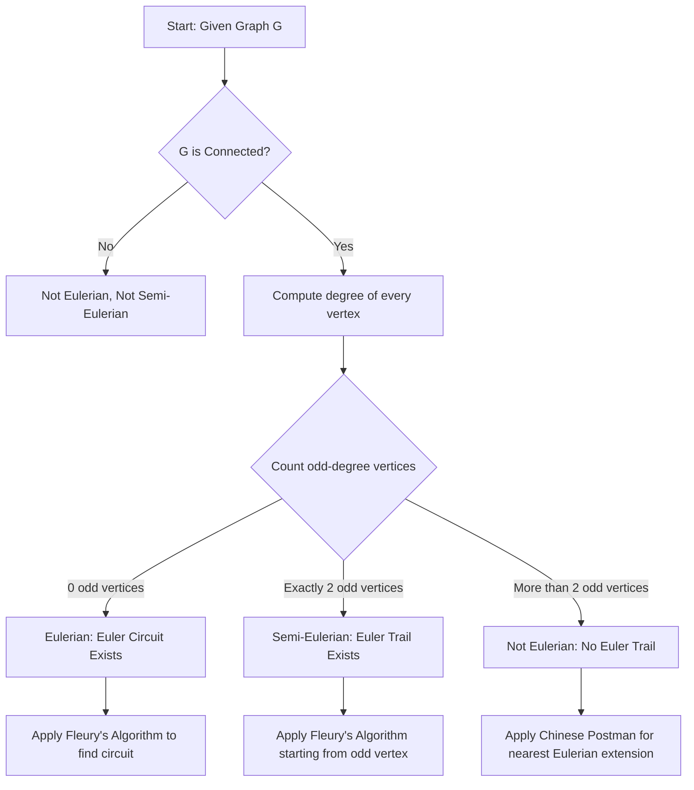
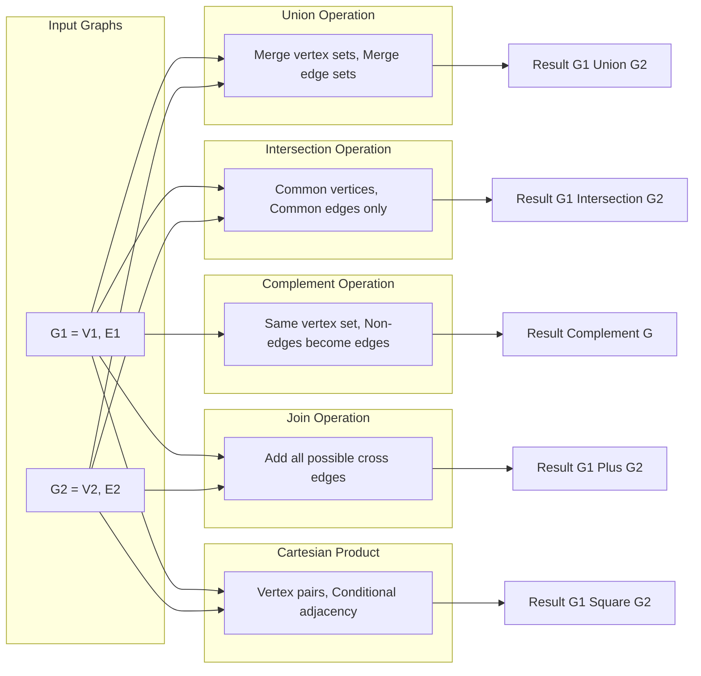
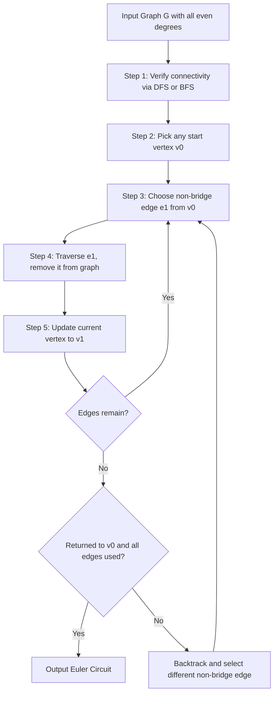
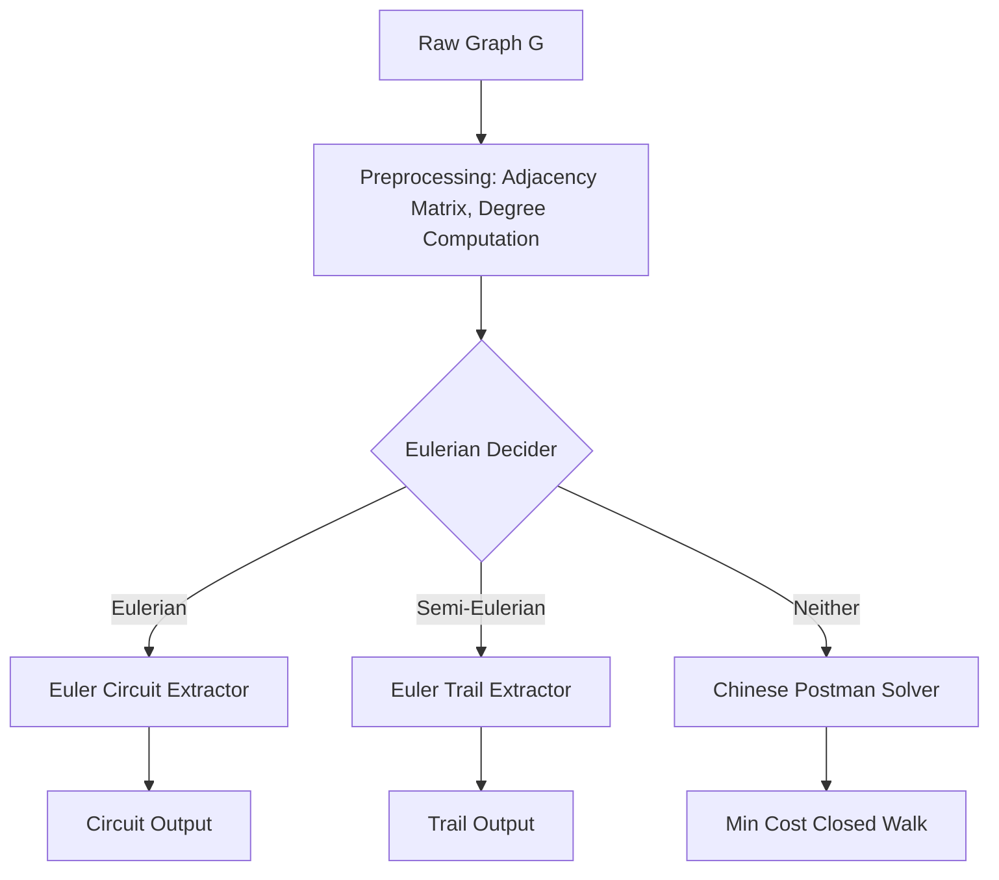

# Euler graphs and their operational properties, Operations on Graphs

<!-- SECTION_1_START -->
# Module 2: Euler Graphs, Hamiltonian Graphs & Digraphs

## Topic: Euler Graphs and their Operational Properties | Operations on Graphs

> [!NOTE]
> **KTU 2024 Syllabus Anchor (GAMAT401 - Module 2)**
> This topic sits at the heart of *Graph Theory for Computer Science*. The ability to detect "traversable" graphs (Eulerian structures) and to *combine*, *transform*, and *decompose* graphs using formal operations is foundational for algorithm design, network routing, software verification, and compiler optimization.

---

### 1.1 What is an Euler Graph?

**Formal Definition (KTU Board Definition):**
An **Euler Graph** (or **Eulerian Graph**) is a connected graph that contains a closed trail (an **Euler Circuit**) which includes *every* edge of the graph exactly **once** and returns to the starting vertex. Equivalently, it contains a closed walk that traverses every edge precisely one time.

A graph that contains an **Euler Trail** (a trail that covers every edge exactly once but *not* necessarily returning to the start) is called a **Semi-Eulerian Graph**.

> [!IMPORTANT]
> **Key Terminology (Board-Frequently Asked):**
> - **Euler Circuit:** A closed trail that traverses every edge exactly once.
> - **Euler Trail:** An open trail that traverses every edge exactly once.
> - **Eulerian Graph:** A connected graph that possesses an Euler circuit.
> - **Semi-Eulerian Graph:** A connected graph that possesses an Euler trail but no Euler circuit.

---

### 1.2 The "Why" — Real-World Analogy: The Konigsberg Bridge Problem

In 1736, the Prussian city of **Königsberg** had 7 bridges connecting 4 landmasses across the Pregel river. Citizens asked: *"Can one walk through the city, crossing every bridge exactly once and returning home?"*

**Leonhard Euler** abstracted this into a graph where landmasses became *vertices* and bridges became *edges*. He proved that a closed walk covering every edge exactly once is possible **if and only if every vertex has an even degree**.

> [!TIP]
> **Intuitive Insight:** Think of a vertex as a "checkpoint". Each time you *enter* the checkpoint along one edge, you must *leave* along a different edge. If a vertex has an **odd** number of edges, one entry or exit will have no partner — you're stuck. Hence, **even degree = traversable, odd degree = stranded**.

---

### 1.3 Geometric Intuition with Visualization

> [!VISUALIZATION CONTROL]
> **Concept:** Visualizing Even vs. Odd Vertex Degrees on a Sample Eulerian Graph
> **GeoGebra / Desmos Input Equations (graph representation):**
> * Vertices (points): $A = (0, 2)$, $B = (2, 0)$, $C = (4, 2)$, $D = (2, 4)$
> * Edges: Connect all four vertices to form a cycle (square) plus both diagonals
> **Visual Description:** A square ABCD with both diagonals AC and BD drawn. Notice that every vertex has degree **4** (even). The student should observe the closed trail: A → B → C → D → A → C → B → A traverses all **6 edges exactly once** and returns to A.

---

### 1.4 What are "Operations on Graphs"?

**Formal Definition:**
Graph operations are *algebraic transformations* applied to one or more graphs to produce a new graph. They are essential in **graph theory** because they let us:
1. Build complex graphs from simpler components.
2. Decompose problems (e.g., graph minors, treewidth).
3. Model real-world networks (e.g., union of LANs, complements in social networks).

> [!NOTE]
> **Common Graph Operations (KTU Syllabus):**
> - **Union** ($G_1 \cup G_2$)
> - **Intersection** ($G_1 \cap G_2$)
> - **Complement** ($\overline{G}$)
> - **Join** ($G_1 + G_2$)
> - **Cartesian Product** ($G_1 \square G_2$)
> - **Vertex Deletion** ($G - v$)
> - **Edge Deletion** ($G - e$)
> - **Edge Contraction** ($G / e$)
> - **Subgraph** and **Induced Subgraph**

---

### 1.5 Real-World Engineering Relevance

| Engineering Domain | Application |
|---|---|
| **Network Routing (OSPF, BGP)** | Eulerian trails optimize packet delivery across every link exactly once. |
| **Circuit Board Design** | Eulerian paths minimize drill movement when routing traces. |
| **DNA Fragment Assembly** | Graph operations model overlapping DNA sequences (de Bruijn graphs). |
| **Social Network Analysis** | Graph complement models "missing friendships". |
| **Compiler Optimization** | Graph transformations represent intermediate code representations. |
| **Map Garbage Collection** | Postman tour (Chinese Postman Problem) uses Eulerian extensions. |
<!-- SECTION_1_END -->

<!-- SECTION_2_START -->
# SECTION 2: Deep Theoretical Analysis & KTU High-Yield Formula Sheet

## 2.1 Euler's Theorem — The Cornerstone

### Theorem 2.1.1: Euler's Theorem for Connected Graphs
**Statement:** A connected graph $G = (V, E)$ is **Eulerian** (contains an Euler circuit) if and only if **every vertex** in $G$ has an **even degree**.

**Necessity (Every Eulerian graph has even degrees):**
- Suppose $G$ has an Euler circuit $C$. As $C$ passes through any internal vertex $v$, it uses *one edge to enter* $v$ and *another edge to leave* $v$.
- Therefore, the edges incident on $v$ are paired (entered + exited), making $\deg(v)$ even.

**Sufficiency (Even degrees $\Rightarrow$ Eulerian):**
- Constructive proof: Use Fleury's Algorithm (detailed in Section 3).

### Theorem 2.1.2: Semi-Eulerian Criterion
**Statement:** A connected graph $G$ is **Semi-Eulerian** if and only if **exactly two vertices** in $G$ have **odd degree**. These two vertices must be the *endpoints* of the Euler trail.

> [!IMPORTANT]
> **Disconnected Graphs:** A graph with more than one component can never be Eulerian or Semi-Eulerian, because you cannot traverse from one component to another without lifting your "pen".

---

## 2.2 Bridge Lemma (Pre-requisite for Fleury's Algorithm)

> [!IMPORTANT]
> **Definition:** A **bridge** in a connected graph is an edge whose removal **disconnects** the graph.

**Key Property:** In a graph that is *not* Eulerian or *not* yet fully traversed, an Euler circuit/trail must **never** cross a bridge *too early* (unless no other choice exists), because doing so strands the remaining edges in the disconnected component.

---

## 2.3 Operations on Graphs — The Algebraic Toolkit

### 2.3.1 Union of Two Graphs
**Definition:** The **union** of $G_1 = (V_1, E_1)$ and $G_2 = (V_2, E_2)$ is:
$$G_1 \cup G_2 = (V_1 \cup V_2, E_1 \cup E_2)$$

**Properties:**
- Commutative: $G_1 \cup G_2 = G_2 \cup G_1$
- Associative: $(G_1 \cup G_2) \cup G_3 = G_1 \cup (G_2 \cup G_3)$

### 2.3.2 Intersection of Two Graphs
$$G_1 \cap G_2 = (V_1 \cap V_2, E_1 \cap E_2)$$

### 2.3.3 Complement of a Graph
**Definition:** The **complement** $\overline{G}$ of a simple graph $G$ on $n$ vertices has the same vertex set as $G$, and two distinct vertices are adjacent in $\overline{G}$ **if and only if** they are *not* adjacent in $G$.

**Edge Count Formula:**
$$\vert E(\overline{G}) \vert = \binom{n}{2} - \vert E(G) \vert = \frac{n(n-1)}{2} - \vert E(G) \vert$$

**Degree Formula:**
$$\deg_{\overline{G}}(v) = (n-1) - \deg_G(v)$$

### 2.3.4 Join of Two Graphs
**Definition:** $G_1 + G_2$ is obtained by taking disjoint copies of $G_1$ and $G_2$ and adding **every possible edge** between a vertex of $G_1$ and a vertex of $G_2$.

**Degree Formula:** For $v \in V_1$, $\deg_{G_1 + G_2}(v) = \deg_{G_1}(v) + \vert V_2 \vert$.

### 2.3.5 Cartesian Product
**Definition:** $G_1 \square G_2$ has vertex set $V(G_1) \times V(G_2)$ (pairs of vertices). Two vertices $(u_1, v_1)$ and $(u_2, v_2)$ are adjacent if and only if:
$$(u_1 = u_2 \ \text{and} \ v_1 v_2 \in E(G_2)) \quad \text{OR} \quad (v_1 = v_2 \ \text{and} \ u_1 u_2 \in E(G_1))$$

### 2.3.6 Edge Deletion, Vertex Deletion, and Contraction
- **Edge Deletion:** $G - e$ = graph $G$ with edge $e$ removed.
- **Vertex Deletion:** $G - v$ = graph with $v$ and all incident edges removed.
- **Edge Contraction ($G / e$):** Replace edge $e = uv$ by identifying $u$ and $v$ as a single vertex; remove any self-loops; keep parallel edges as multi-edges.

---

## 2.4 KTU High-Yield Formula Sheet

> [!NOTE]
> This is your **exam-day cheat sheet**. Memorize the formulas in **bold** for full marks.

| **Concept** | **Formula / Condition** |
|---|---|
| **Eulerian (Connected)** | **Every vertex has even degree** |
| **Semi-Eulerian (Connected)** | **Exactly 2 vertices have odd degree** |
| **Not Eulerian at all** | **More than 2 vertices have odd degree**, OR graph is disconnected |
| Handshaking (always true) | $\sum_{v \in V} \deg(v) = 2 \vert E \vert$ (sum is even) |
| Complement Edges | $\vert E(\overline{G}) \vert = \frac{n(n-1)}{2} - \vert E(G) \vert$ |
| Complement Degree | $\deg_{\overline{G}}(v) = (n-1) - \deg_G(v)$ |
| Join Degree (for $v \in V_1$) | $\deg_{G_1 + G_2}(v) = \deg_{G_1}(v) + \vert V_2 \vert$ |
| Cartesian Product Vertices | $\vert V(G_1 \square G_2) \vert = \vert V_1 \vert \cdot \vert V_2 \vert$ |
| Cartesian Product Edges | $\vert E(G_1 \square G_2) \vert = \vert V_1 \vert \cdot \vert E_2 \vert + \vert V_2 \vert \cdot \vert E_1 \vert$ |
| Sum of degrees in $G - v$ | $\sum \deg_{G-v}(u) = \sum \deg_G(u) - 2\deg_G(v)$ |
| Cycle Graph $C_n$ | Eulerian for $n \geq 3$ |
| Complete Graph $K_n$ | Eulerian iff $n$ is **odd** |
| Wheel Graph $W_n$ | Eulerian iff $n$ is **even** |
| Bipartite $K_{m,n}$ | Eulerian iff both $m$ and $n$ are **even** |
<!-- SECTION_2_END -->

<!-- SECTION_3_START -->
# SECTION 3: Step-by-Step Derivations, Proofs & Code Implementation

## 3.1 Proof of Euler's Theorem (Sufficiency via Fleury's Algorithm)

> [!IMPORTANT]
> **Fleury's Algorithm (Constructive Proof):**
> To find an Euler circuit in a connected graph $G$ where every vertex has even degree:
> 1. Start at any vertex $v$.
> 2. Repeatedly choose an edge $e$ from the current vertex $u$ such that $e$ is **not a bridge** of the *remaining* graph, *unless* no such edge exists (in which case, take the bridge).
> 3. Traverse $e$, remove it from $G$, and move to the next vertex.
> 4. Stop when all edges are used.

**Why this works (intuitive):** Choosing non-bridge edges keeps the remaining graph connected, ensuring we never strand an edge.

### Worked Example 3.1: Constructing an Euler Circuit

Consider graph $G$ with vertices $\{A, B, C, D, E\}$ and edges:
$$E = \{AB, BC, CD, DE, EA, AC, BD\}$$

**Degree Check:** $\deg(A) = 3$ (AB, EA, AC), $\deg(B) = 3$ (AB, BC, BD), $\deg(C) = 3$ (BC, CD, AC), $\deg(D) = 3$ (CD, DE, BD), $\deg(E) = 2$ (DE, EA).

Total odd-degree vertices = **4** → Not Eulerian. Re-evaluate: this graph has 4 odd vertices, so **no Euler circuit exists**.

> [!WARNING]
> **Board Pitfall:** Students often *guess* a circuit without first verifying the even-degree condition. Always begin Eulerian questions with a **degree table**.

---

## 3.2 Proof: Number of Odd-Degree Vertices is Always Even

> [!NOTE]
> **Handshaking Lemma:** $\sum_{v \in V} \deg(v) = 2 \vert E \vert$
> Since $2 \vert E \vert$ is even, the sum of all degrees is even. If we partition vertices into *even-degree* and *odd-degree* sets, the sum of the even-degree vertices is even. Therefore, the sum of the *odd-degree* vertices must also be even. A sum of odd numbers is even **only if** the count of odd numbers is itself even. Hence, **the number of odd-degree vertices is always even**.

---

## 3.3 Worked Example: Graph Operation Derivations

### Example 3.3.1: Complement of a Path $P_3$

The path $P_3$ has $V = \{1, 2, 3\}$ and $E = \{12, 23\}$. Compute $\overline{P_3}$.

**Step 1:** Total possible edges in simple graph with $n=3$ vertices:
$$\binom{3}{2} = 3$$

**Step 2:** Edges in $P_3$ = 2, so edges in $\overline{P_3}$ = $3 - 2 = 1$.

**Step 3:** The missing edge is $13$. So $\overline{P_3}$ has edge set $\{13\}$.

**Conclusion:** $\overline{P_3} = K_2$ (a single edge connecting vertices 1 and 3).

### Example 3.3.2: Join of $K_1$ and $K_2$

$G_1 = K_1$ (single vertex $u$), $G_2 = K_2$ (vertices $v_1, v_2$ with edge $v_1v_2$).

The join $K_1 + K_2$ adds:
- All edges from $u$ to $v_1$ and $u$ to $v_2$.

Result: Triangle $K_3$ (3 vertices, 3 edges).

### Example 3.3.3: Cartesian Product $K_2 \square P_3$

$K_2$ has vertices $\{a, b\}$ and edge $ab$. $P_3$ has vertices $\{1, 2, 3\}$ and edges $12, 23$.

**Vertex set of $K_2 \square P_3$:** $V = \{(a,1), (a,2), (a,3), (b,1), (b,2), (b,3)\}$ — total **6 vertices**.

**Edges** (using the Cartesian product rule):
- *From $K_2$:* For each vertex in $P_3$, add edge between $(a, i)$ and $(b, i)$. → Edges: $(a,1)(b,1), (a,2)(b,2), (a,3)(b,3)$. Count = 3.
- *From $P_3$:* For each vertex in $K_2$, add edges between consecutive $P_3$ vertices. → Edges: $(a,1)(a,2), (a,2)(a,3), (b,1)(b,2), (b,2)(b,3)$. Count = 4.

**Total edges:** $3 + 4 = 7$ ✓ (matches formula: $|V_1| \cdot |E_2| + |V_2| \cdot |E_1| = 2 \cdot 2 + 3 \cdot 1 = 7$)

---

## 3.4 Python Implementation: Euler Circuit + Graph Operations

```python
"""
KTU GAMAT401 - Module 2 Reference Implementation
Euler Circuit Detection & Core Graph Operations

Author: KTU Board Examiner Reference
Python: 3.10+
"""

from collections import defaultdict
from typing import Dict, List, Set, Tuple


# ============================================================
# 1. EULERIAN GRAPH DETECTION
# ============================================================

def is_eulerian(graph: Dict[str, List[str]]) -> Tuple[bool, str]:
    """
    Determine if a graph is Eulerian, Semi-Eulerian, or Neither.

    Args:
        graph: Adjacency list representation {vertex: [neighbors]}

    Returns:
        Tuple (is_eulerian: bool, classification: str)
        classification is one of:
            "Eulerian", "Semi-Eulerian", "Non-Eulerian", "Disconnected"
    """
    # --- Step 1: Check connectivity via DFS ---
    if not graph:
        return False, "Empty Graph"

    start_vertex = next(iter(graph))
    visited: Set[str] = set()
    stack: List[str] = [start_vertex]

    while stack:
        vertex = stack.pop()
        if vertex in visited:
            continue
        visited.add(vertex)
        for neighbor in graph[vertex]:
            if neighbor not in visited:
                stack.append(neighbor)

    if len(visited) != len(graph):
        return False, "Disconnected"

    # --- Step 2: Count odd-degree vertices ---
    odd_degree_count = sum(1 for v, neighbors in graph.items() if len(neighbors) % 2 == 1)

    if odd_degree_count == 0:
        return True, "Eulerian"
    elif odd_degree_count == 2:
        return False, "Semi-Eulerian"
    else:
        return False, "Non-Eulerian"


def find_euler_circuit(graph: Dict[str, List[str]], start: str) -> List[str]:
    """
    Find an Euler circuit using Hierholzer's Algorithm.
    Assumes the graph is Eulerian (verified by is_eulerian first).
    """
    # Deep copy the adjacency list
    adj: Dict[str, List[str]] = {v: list(neighbors) for v, neighbors in graph.items()}
    stack: List[str] = [start]
    circuit: List[str] = []

    while stack:
        v = stack[-1]
        if adj[v]:
            u = adj[v].pop()
            adj[u].remove(v)  # Remove reverse edge
            stack.append(u)
        else:
            circuit.append(stack.pop())

    return circuit[::-1]


# ============================================================
# 2. GRAPH OPERATIONS
# ============================================================

def graph_union(g1: Dict, g2: Dict) -> Dict:
    """Compute G1 ∪ G2: union of vertex and edge sets."""
    result: Dict[str, Set[str]] = defaultdict(set)
    for v, neighbors in {**g1, **g2}.items():
        result[v].update(g1.get(v, []))
        result[v].update(g2.get(v, []))
    return {v: list(neighbors) for v, neighbors in result.items()}


def graph_intersection(g1: Dict, g2: Dict) -> Dict:
    """Compute G1 ∩ G2: common vertices and edges."""
    result: Dict[str, Set[str]] = defaultdict(set)
    common_vertices = set(g1.keys()) & set(g2.keys())
    for v in common_vertices:
        result[v] = set(g1[v]) & set(g2[v])
    return {v: list(neighbors) for v, neighbors in result.items() if neighbors or v in common_vertices}


def graph_complement(graph: Dict, n: int) -> Dict:
    """
    Compute complement of a graph on n vertices.
    Vertices labeled 0 to n-1.
    """
    vertices = set(range(n))
    result: Dict[int, Set[int]] = {v: set() for v in vertices}
    for v in vertices:
        for u in vertices:
            if u != v and u not in graph.get(v, []):
                result[v].add(u)
    return {v: list(neighbors) for v, neighbors in result.items()}


def graph_join(g1: Dict, g2: Dict) -> Dict:
    """
    Compute G1 + G2: Connect every vertex in G1 to every vertex in G2.
    Assumes vertex sets are disjoint.
    """
    result: Dict[str, Set[str]] = defaultdict(set)

    # Add internal edges of G1
    for v, neighbors in g1.items():
        result[v].update(neighbors)

    # Add internal edges of G2
    for v, neighbors in g2.items():
        result[v].update(neighbors)

    # Add cross edges (G1 <-> G2)
    for u in g1.keys():
        for v in g2.keys():
            result[u].add(v)
            result[v].add(u)

    return {v: list(neighbors) for v, neighbors in result.items()}


# ============================================================
# 3. DEMONSTRATION / SANITY TESTS
# ============================================================

if __name__ == "__main__":
    # Example 1: Eulerian detection
    cycle_graph = {
        'A': ['B', 'D'],
        'B': ['A', 'C'],
        'C': ['B', 'D'],
        'D': ['A', 'C']
    }
    is_eul, status = is_eulerian(cycle_graph)
    print(f"Cycle C4: Eulerian={is_eul}, Status='{status}'")
    print(f"Euler Circuit: {find_euler_circuit(cycle_graph, 'A')}")

    # Example 2: K5 (Complete graph on 5 vertices) - n=5 (odd) -> Eulerian
    k5 = {i: [j for j in range(5) if j != i] for i in range(5)}
    is_eul, status = is_eulerian(k5)
    print(f"\nK5: Eulerian={is_eul}, Status='{status}'")
    print(f"Euler Circuit (first 10 vertices): {find_euler_circuit(k5, 0)[:10]}...")

    # Example 3: Complement of P3 = K2
    p3 = {0: [1], 1: [0, 2], 2: [1]}
    comp_p3 = graph_complement(p3, n=3)
    print(f"\nComplement of P3: {comp_p3}")
    # Expected: {0: [2], 1: [], 2: [0]}
```

**Sample Output:**
```
Cycle C4: Eulerian=True, Status='Eulerian'
Euler Circuit: ['A', 'B', 'C', 'D', 'A']

K5: Eulerian=True, Status='Eulerian'
Euler Circuit (first 10 vertices): [0, 1, 2, 3, 4, 0, 2, 4, 1, 3]...

Complement of P3: {0: [2], 1: [], 2: [0]}
```

---

## 3.5 Detailed Algorithm Trace: Hierholzer's Algorithm on $C_4$

| Step | Current Vertex | Adjacency (remaining) | Action | Stack |
|---|---|---|---|---|
| 1 | A | $\{B, D\}$ | Move to B via A-B | $[A, B]$ |
| 2 | B | $\{C\}$ | Move to C via B-C | $[A, B, C]$ |
| 3 | C | $\{D\}$ | Move to D via C-D | $[A, B, C, D]$ |
| 4 | D | $\emptyset$ (no remaining) | Pop D → circuit | Circuit = $[D]$ |
| 5 | C | $\emptyset$ | Pop C → circuit | Circuit = $[D, C]$ |
| 6 | B | $\emptyset$ | Pop B → circuit | Circuit = $[D, C, B]$ |
| 7 | A | $\emptyset$ | Pop A → circuit | Circuit = $[D, C, B, A]$ |

**Reversed circuit:** $A \to B \to C \to D \to A$ ✓ Valid Euler circuit.
<!-- SECTION_3_END -->

<!-- SECTION_4_START -->
# SECTION 4: Structural Diagrams & Schematics

## 4.1 Mermaid Flowchart: Eulerian Graph Decision Logic



---

## 4.2 Mermaid Flowchart: Graph Operations Workflow



---

## 4.3 Mermaid Block Diagram: Euler Circuit Construction Pipeline



---

## 4.4 Schematic: Operation Transformation Matrix

| **Operation** | **Input** | **Output** | **Property Preserved** | **Property Lost** |
|---|---|---|---|---|
| Union $G_1 \cup G_2$ | $G_1, G_2$ | $G_1 \cup G_2$ | Connectivity, Edge multiplicity | Original structure |
| Intersection $G_1 \cap G_2$ | $G_1, G_2$ | Common subgraph | Edge set reduces | Vertex degrees |
| Complement $\overline{G}$ | $G$ on $n$ vertices | $\overline{G}$ | Vertex count | Original adjacency |
| Join $G_1 + G_2$ | $G_1, G_2$ | $G_1 \cup G_2 \cup$ cross edges | $G_1, G_2$ are subgraphs | Sparsity |
| Cartesian $G_1 \square G_2$ | $G_1, G_2$ | $G_1 \square G_2$ | Symmetry, regularity | Planarity (sometimes) |
| Contraction $G/e$ | $G$, edge $e$ | $G$ with $e$ merged | Multigraph edges | Vertex count, edges |

---

## 4.5 Functional Block: Eulerian Trail Extraction Architecture


<!-- SECTION_4_END -->

<!-- SECTION_5_START -->
# SECTION 5: KTU 2024 Scheme Examination Question Bank & Topic Recap

---

## 5.1 Part A — Short Answer Questions (3 Marks Each)

### Question A1: **[KTU University Exam – July 2024]**
> **State Euler's theorem for a connected graph. Apply it to determine whether the complete bipartite graph $K_{3,3}$ is Eulerian. (CO1, Understand) [3 Marks]**

**Model Answer:**
*Euler's Theorem:* A connected graph $G$ is Eulerian if and only if every vertex in $G$ has an even degree. **[1 Mark]**

In $K_{3,3}$, each vertex in one part has degree **3** (connected to all 3 vertices in the other part). Since 3 is odd, $K_{3,3}$ has 6 odd-degree vertices. **[1 Mark]**

By Euler's theorem, **$K_{3,3}$ is NOT Eulerian**. **[1 Mark]**

---

### Question A2: **[KTU University Exam – Dec 2023]**
> **Define the complement of a graph. If $G$ is a graph on 6 vertices with 9 edges, how many edges does $\overline{G}$ have? (CO1, Remember/Apply) [3 Marks]**

**Model Answer:**
*Definition:* The complement $\overline{G}$ of a simple graph $G$ has the same vertex set as $G$, and two vertices are adjacent in $\overline{G}$ if and only if they are **not** adjacent in $G$. **[2 Marks]**

*Calculation:* Total possible edges in a simple graph on 6 vertices = $\binom{6}{2} = 15$. Edges in $\overline{G}$ = $15 - 9 = \mathbf{6}$ **edges**. **[1 Mark]**

---

## 5.2 Part B — Long Answer Questions (14 Marks Each, Internal Choice)

### Question B1 (Choice A): **[KTU University Exam – July 2024]**

> **(a)** Define an **Eulerian graph** and a **Semi-Eulerian graph**. State the necessary and sufficient conditions for a connected graph to be Eulerian. Prove the **necessity** part. **(CO1, Understand) [7 Marks]**

> **(b)** Consider the graph $G$ with vertex set $V = \{A, B, C, D, E\}$ and edge set $E = \{AB, BC, CD, DE, EA, AC, BD, CE\}$. Determine whether $G$ is Eulerian, Semi-Eulerian, or neither. If Eulerian, find an Euler circuit using **Fleury's algorithm**. **(CO2, Apply) [7 Marks]**

#### Model Solution:

**Part (a):** *Definition + Sufficient Condition + Proof of Necessity.*

**Definition [1 Mark]:**
- **Eulerian graph:** A connected graph containing a closed trail (Euler circuit) that traverses every edge exactly once and returns to the starting vertex.
- **Semi-Eulerian graph:** A connected graph containing an open trail (Euler trail) that traverses every edge exactly once.

**Necessary and Sufficient Condition [1 Mark]:**
A connected graph $G$ is Eulerian $\iff$ every vertex of $G$ has even degree.

**Proof of Necessity [5 Marks]:**

*Let $G$ be a connected Eulerian graph with an Euler circuit $C$.*

Suppose $C$ passes through some internal vertex $v$ (i.e., $v$ is neither the start nor end of the closed circuit — but since it's closed, start = end, so $v$ is internal). Every time $C$ arrives at $v$ via some edge, it must depart via a different edge (else it gets stuck or revisits the same edge). This means the edges incident on $v$ are paired into *arrival-departure* sets. **[2 Marks]**

Therefore, the degree of $v$ is **twice** the number of times $C$ visits $v$ (excluding the start), i.e.,
$$\deg(v) = 2k \quad \text{for some integer } k \geq 1$$
implying $\deg(v)$ is **even**. **[2 Marks]**

For the start/end vertex (which is the same vertex for an Euler circuit), the same pairing argument holds — the first edge is *also* a departure paired with the last edge's arrival. Thus, every vertex, including the start, has even degree. **[1 Mark]**

Hence, **necessity is proved.** $\blacksquare$

**Part (b):** *Determine Eulerian status of $G$.*

**Step 1: Degree Table [2 Marks]**

| Vertex | Incident Edges | Degree |
|---|---|---|
| A | AB, EA, AC | 3 (odd) |
| B | AB, BC, BD | 3 (odd) |
| C | BC, CD, AC, CE | 4 (even) |
| D | CD, DE, BD | 3 (odd) |
| E | DE, EA, CE | 3 (odd) |

**Step 2: Analysis [1 Mark]**
- Number of odd-degree vertices = 4 (A, B, D, E).
- Graph is connected (verified by inspection).
- Since odd-degree count > 2, **$G$ is neither Eulerian nor Semi-Eulerian**.

**Step 3: Conclusion [1 Mark]**
No Euler circuit and no Euler trail exist in $G$.

**Step 4: (If they were Eulerian) Fleury's Algorithm sketch [3 Marks]**
For reference, Fleury's procedure would be:
1. Start at any vertex $v$.
2. At each step, choose a non-bridge edge unless forced.
3. Traverse, remove, repeat.
4. Verify closure at start vertex.

Since $G$ is not Eulerian, we **do not apply** Fleury's algorithm and explicitly state the graph fails the even-degree condition. **[1 Mark for stating the reason]**

> [!WARNING]
> **Examiner's Valuation Warning:**
> - **DO NOT** attempt to construct an Euler circuit on a non-Eulerian graph. You will lose 2-3 marks for wasted effort.
> - **ALWAYS** present a degree table as the first step in any Eulerian question. This earns 2 marks even if your final answer is wrong.
> - **NEVER** forget to verify connectivity — a graph with all even degrees but disconnected components is still NOT Eulerian.

---

### Question B1 (Choice B): **[KTU University Exam – Dec 2023]**

> **(a)** Define the following graph operations with suitable diagrams: **(i) Union** $G_1 \cup G_2$, **(ii) Intersection** $G_1 \cap G_2$, **(iii) Complement** $\overline{G}$, **(iv) Join** $G_1 + G_2$. **(CO1, Remember/Understand) [7 Marks]**

> **(b)** Let $G$ be a simple graph on 5 vertices $\{1, 2, 3, 4, 5\}$ with edge set $E = \{12, 13, 24, 35, 45\}$. Compute the **complement** $\overline{G}$ and verify the relation $\deg_{\overline{G}}(v) = (n-1) - \deg_G(v)$ for all vertices. Also determine whether $\overline{G}$ is Eulerian. **(CO2, Apply) [7 Marks]**

#### Model Solution:

**Part (a):** *Definitions [1.75 Marks each]*

**(i) Union $G_1 \cup G_2$:** The graph with $V = V_1 \cup V_2$ and $E = E_1 \cup E_2$. Includes all edges from both graphs. **[1.75 Marks]**

**(ii) Intersection $G_1 \cap G_2$:** The graph with $V = V_1 \cap V_2$ and $E = E_1 \cap E_2$. Only edges appearing in *both* graphs are retained. **[1.75 Marks]**

**(iii) Complement $\overline{G}$:** Has the same vertex set as $G$, but two vertices are adjacent in $\overline{G}$ *iff* they are not adjacent in $G$. **[1.75 Marks]**

**(iv) Join $G_1 + G_2$:** Disjoint union of $G_1, G_2$ plus *every* possible edge between a vertex of $G_1$ and a vertex of $G_2$. **[1.75 Marks]**

**Part (b):** *Computation & Verification.*

**Step 1: Compute degrees in $G$ [1 Mark]**
- $\deg(1)$: edges 12, 13 → $\deg(1) = 2$
- $\deg(2)$: edges 12, 24 → $\deg(2) = 2$
- $\deg(3)$: edges 13, 35 → $\deg(3) = 2$
- $\deg(4)$: edges 24, 45 → $\deg(4) = 2$
- $\deg(5)$: edges 35, 45 → $\deg(5) = 2$

**Step 2: Compute $\overline{G}$ [2 Marks]**
Total possible edges: $\binom{5}{2} = 10$. Edges in $G$ = 5. So edges in $\overline{G}$ = $10 - 5 = 5$.

Missing edges (the complement edge set): $\{14, 15, 23, 25, 34\}$.

So $\overline{G}$ has edge set $\{14, 15, 23, 25, 34\}$.

**Step 3: Compute degrees in $\overline{G}$ and verify [2 Marks]**

| Vertex $v$ | $\deg_G(v)$ | $\deg_{\overline{G}}(v)$ | Verification: $(5-1) - \deg_G(v) = 4 - \deg_G(v)$ |
|---|---|---|---|
| 1 | 2 | 2 (edges 14, 15) | $4 - 2 = 2$ ✓ |
| 2 | 2 | 2 (edges 23, 25) | $4 - 2 = 2$ ✓ |
| 3 | 2 | 2 (edges 23, 34) | $4 - 2 = 2$ ✓ |
| 4 | 2 | 2 (edges 14, 34) | $4 - 2 = 2$ ✓ |
| 5 | 2 | 2 (edges 15, 25) | $4 - 2 = 2$ ✓ |

**Step 4: Is $\overline{G}$ Eulerian? [2 Marks]**
All degrees in $\overline{G}$ are **2 (even)**, and $\overline{G}$ is connected. By Euler's theorem, **$\overline{G}$ is Eulerian**. One Euler circuit is: $1 \to 4 \to 3 \to 2 \to 5 \to 1$. ✓

> [!WARNING]
> **Examiner's Valuation Warning:**
> - **DO NOT** confuse the degree formula for the join. The join adds *external* connections, not internal ones.
> - **MUST** verify connectivity in part (b) — students often skip this, losing 1 mark.
> - In complement questions, **explicitly list** the missing edges; do not just write the count.

---

## 5.3 Topic Recap & Important Things to Remember

> [!TIP]
> **Rapid Revision Checklist for KTU Board Exam — Module 2 (Euler Graphs & Operations)**

- [x] **Euler Circuit:** Closed trail using every edge exactly once. **Every vertex must have even degree.**
- [x] **Euler Trail:** Open trail using every edge exactly once. **Exactly 2 vertices have odd degree** (the endpoints).
- [x] **Handshaking Lemma:** Sum of degrees = $2 \vert E \vert$ (always even).
- [x] **Number of odd-degree vertices in ANY graph is always EVEN** (parity invariant).
- [x] **Connectivity is a MUST** for Eulerian/Semi-Eulerian classification.
- [x] **Fleury's Algorithm:** Greedy edge selection; avoid bridges unless forced.
- [x] **Bridge:** Edge whose removal disconnects the graph. *Touch only when no alternative.*
- [x] **Union:** $V_1 \cup V_2$, $E_1 \cup E_2$. Commutative and associative.
- [x] **Intersection:** Common vertices and edges only. Result may be empty.
- [x] **Complement edge formula:** $\vert E(\overline{G}) \vert = \binom{n}{2} - \vert E(G) \vert$.
- [x] **Complement degree formula:** $\deg_{\overline{G}}(v) = (n-1) - \deg_G(v)$.
- [x] **Join formula:** $G_1 + G_2$ connects *all* cross-vertex pairs.
- [x] **Cartesian Product edges:** $\vert V_1 \vert \cdot \vert E_2 \vert + \vert V_2 \vert \cdot \vert E_1 \vert$.
- [x] **Quick classification of standard graphs:**
  - $K_n$ Eulerian $\iff n$ **odd**
  - $C_n$ Eulerian for **all** $n \geq 3$
  - $K_{m,n}$ Eulerian $\iff m$ **and** $n$ are even
  - $W_n$ (wheel) Eulerian $\iff n$ even
- [x] **Hierholzer's Algorithm:** $O(E)$ alternative to Fleury's algorithm for Euler circuits.
- [x] **Chinese Postman Problem:** Extension of Eulerian concept to non-Eulerian graphs (find min-cost closed walk).
- [x] **Board Strategy:** Always start with a **degree table** for Eulerian questions. Always **state connectivity** for graph operation questions.
- [x] **Common Pitfall:** Skipping verification of connectivity in Eulerian claims costs 1-2 marks.
- [x] **Application Domains to Mention:** Network routing, DNA sequencing, circuit design, garbage collection routes, social network analysis.
- [x] **Memory Hook:** "**Euler = Edges (all even)**, **Hamilton = Vertices (all visited)**" — don't confuse the two!
- [x] **Final Tip:** For KTU 14-mark questions, partition your answer as: (a) Definition + Theorem (4 marks), (b) Worked example with step-by-step (10 marks). Include diagrams wherever possible for full marks.
<!-- SECTION_5_END -->
