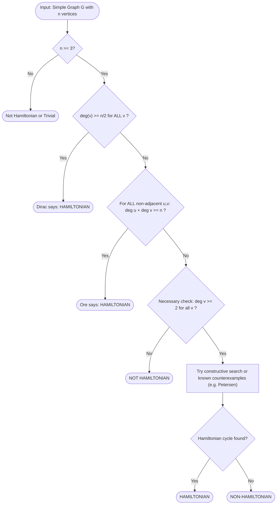
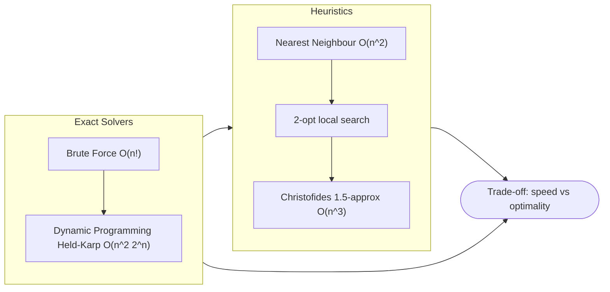
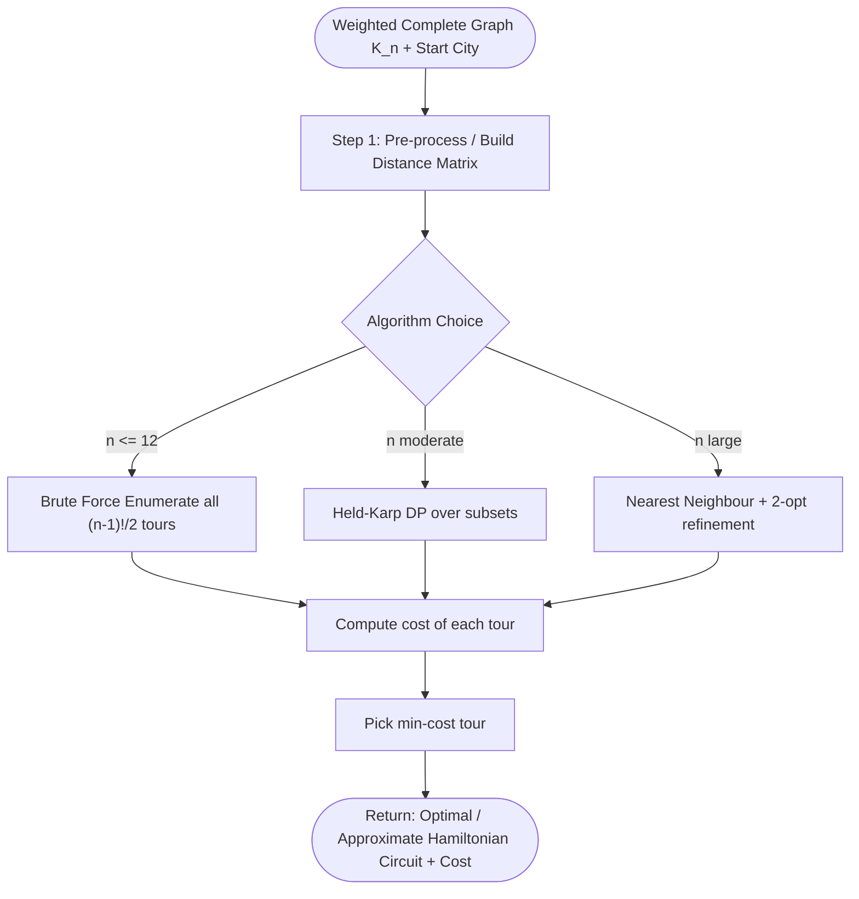

# Hamiltonian paths and circuits, The Travelling Salesman Problem (TSP)

<!-- SECTION_1_START -->
# Hamiltonian Paths, Circuits, and the Travelling Salesman Problem

## 1.1 Formal Definitions (KTU 2024 Scheme Terminology)

> [!IMPORTANT]
> **Core Definition — Hamiltonian Path**
> A **Hamiltonian path** in a simple undirected graph $G = (V, E)$ is a path that contains **every vertex of $G$ exactly once**. If the path has $n$ vertices, it consists of exactly $n - 1$ edges, traversing each vertex one and only one time.

> [!IMPORTANT]
> **Core Definition — Hamiltonian Circuit (Hamiltonian Cycle)**
> A **Hamiltonian circuit** (or **Hamiltonian cycle**) in $G = (V, E)$ is a cycle that contains **every vertex of $G$ exactly once**, returning to the starting vertex. It is a closed walk of length $n$ that visits each vertex exactly once and uses exactly $n$ edges.

> [!NOTE]
> **Naming Convention**
> These structures are named after the Irish mathematician **Sir William Rowan Hamilton** (1805–1865), who in 1856 commercialised a wooden puzzle called the *Icosian Game* — finding a closed tour through the 20 vertices of a dodecahedron touching each vertex once.

### 1.2 Conceptual Analogy — Tourist vs Postman

Imagine two very different travelling agents in a country with cities and one-way roads:

| Traveller | What They Care About | Graph Property |
|---|---|---|
| The **Eulerian Postman** | Walks down **every road** exactly once, may revisit cities. | Traverses every **edge** once. |
| The **Hamiltonian Tourist** | Visits **every city** exactly once, doesn't care if some roads are skipped. | Traverses every **vertex** once. |

> [!TIP]
> **Geometric Intuition**
> Draw a 5-vertex **pentagon graph** $C_5$. Going around its boundary visits all 5 vertices exactly once and returns to the start — that single boundary walk is a Hamiltonian circuit. Any diagonal you add creates an "extra road" that the postman could use, but the tourist still ignores it.

### 1.3 Travelling Salesman Problem — Quick Look

> [!IMPORTANT]
> **Travelling Salesman Problem (TSP) — Decision / Optimisation Form**
> Given a **complete weighted graph** $K_n$ with edge-weights $w(i, j) > 0$ (often satisfying the **triangle inequality** $w(i, k) \le w(i, j) + w(j, k)$), find a Hamiltonian circuit of **minimum total weight**. The optimal cost is denoted $OPT_{TSP}$.

The TSP is the **weighted optimisation cousin** of the Hamiltonian Cycle decision problem. Whereas Hamiltonicity asks *"does any Hamiltonian cycle exist?"*, TSP asks *"which Hamiltonian cycle is cheapest?"*.

### 1.4 Visualisation Hint

> [!VISUALIZATION CONTROL]
> **Concept:** Pentagon graph $C_5$ with a Hamiltonian cycle highlighted.
> **Desmos / GeoGebra Input:**
> * Points: $P_1 = (\cos(72°k), \sin(72°k))$ for $k = 0, 1, 2, 3, 4$
> * Edges: Connect $P_1$–$P_2$–$P_3$–$P_4$–$P_5$–$P_1$
> **Visual Description:** Observe that a single closed polygonal path passes through all 5 vertices with no repetition. Adding a diagonal (say $P_1$–$P_3$) creates an extra edge, but it does **not** create a new Hamiltonian cycle beyond the boundary traversal.
<!-- SECTION_1_END -->

<!-- SECTION_2_START -->
# Deep Theoretical Analysis & KTU High-Yield Formula Sheet

## 2.1 Necessary Conditions for a Hamiltonian Circuit

> [!NOTE]
> **Theorem 2.1 (Necessary Condition)**
> If a graph $G$ has a Hamiltonian circuit, then $G$ must satisfy:
> 1. **Connectivity:** $G$ is connected.
> 2. **Degree condition:** $\deg(v) \ge 2$ for every vertex $v \in V(G)$.
> 3. **No cut-vertex that separates the cycle:** Removing any single vertex from a Hamiltonian graph leaves a Hamiltonian path (still connected).

**Intuition (Why):** A Hamiltonian circuit uses exactly two of the edges incident to each vertex (one to enter, one to leave). If any vertex had $\deg(v) < 2$, it could not even participate in a cycle. Hence $\deg(v) \ge 2$ is mandatory.

> [!WARNING]
> These conditions are **necessary but NOT sufficient**. A graph with $\deg(v) \ge 2$ for all $v$ can still fail to be Hamiltonian — the **Petersen graph** is the canonical counterexample.

## 2.2 Sufficient Conditions — Dirac & Ore

> [!IMPORTANT]
> **Theorem 2.2 — Dirac's Theorem (1952)**
> Let $G$ be a simple graph with $n \ge 3$ vertices. If $\deg(v) \ge \dfrac{n}{2}$ for every vertex $v$, then $G$ contains a **Hamiltonian circuit**.

**Why this works (intuition):** Every vertex has many neighbours. In fact, the sum of degrees is so high that for any two non-adjacent vertices $u$ and $v$, the neighbourhoods are large enough to "force" a cycle to thread through all vertices. The proof proceeds by extending a longest path greedily and using pigeonhole on the endpoints.

> [!IMPORTANT]
> **Theorem 2.3 — Ore's Theorem (1960)**
> Let $G$ be a simple graph with $n \ge 3$ vertices. If for every pair of **non-adjacent** vertices $u$ and $v$,
> $$\deg(u) + \deg(v) \ge n,$$
> then $G$ contains a **Hamiltonian circuit**.

**Relationship:** Dirac's theorem is a special case of Ore's theorem (when all degrees are equal to at least $n/2$, the sum is at least $n$). Ore is more general because it allows uneven degrees.

> [!TIP]
> **Quick Check Before the Exam**
> * Count $n$.
> * If every $\deg(v) \ge \lceil n/2 \rceil$ → **Dirac applies** → Hamiltonian guaranteed.
> * If only the **sum** of non-adjacent pairs $\ge n$ → **Ore applies** → Hamiltonian guaranteed.
> * If neither holds → you must construct or disprove manually.

## 2.3 KTU Formula Sheet

| # | Concept | Formula / Statement | Conditions / Notes |
|---|---|---|---|
| 1 | Hamiltonian path length | Uses exactly $n - 1$ edges | Visits each of $n$ vertices once |
| 2 | Hamiltonian circuit length | Uses exactly $n$ edges | Closes back to start |
| 3 | Necessary degree bound | $\deg(v) \ge 2$ for all $v$ | Necessary, not sufficient |
| 4 | Dirac's condition | $\deg(v) \ge \dfrac{n}{2}, \ \forall v$ | $n \ge 3$ |
| 5 | Ore's condition | $\deg(u) + \deg(v) \ge n$ for all non-adjacent $u, v$ | $n \ge 3$ |
| 6 | Number of distinct Hamiltonian cycles in $K_n$ | $\dfrac{(n - 1)!}{2}$ | Brute-force TSP enumeration size |
| 7 | TSP cost function | $C(\pi) = \displaystyle\sum_{i=1}^{n} w(v_{\pi(i)}, v_{\pi(i+1)})$, with $v_{\pi(n+1)} = v_{\pi(1)}$ | $\pi$ is a permutation tour |
| 8 | Triangle inequality (metric TSP) | $w(i, k) \le w(i, j) + w(j, k)$ | Allows 2-approx. via MST |
| 9 | MST-based TSP approximation ratio | $C_{MST} \le 2 \cdot OPT$ | Doubling shortcut, metric case |
| 10 | TSP complexity | NP-hard (optimisation); NP-complete (decision) | No polynomial algorithm unless $P = NP$ |

## 2.4 Real-World Utility of Hamiltonian Structures

* **Operations Research & Logistics:** Vehicle routing, parcel delivery, school-bus scheduling — the TSP framework minimises fuel/time.
* **VLSI Circuit Design:** Drilling thousands of holes on a circuit board in minimum time is a direct TSP instance.
* **DNA Sequencing & Genomics:** Reconstructing DNA fragments (overlap-layout-consensus method) uses Hamiltonian path heuristics.
* **Computer Network Topology:** Designing fault-tolerant ring networks requires Hamiltonian structure so traffic can detour.
* **Robotics & Manufacturing:** Robotic arm tool-path optimisation (e.g., PCB soldering) and warehouse picking routes.

> [!NOTE]
> KTU 2024 Scheme explicitly maps these to **Course Outcomes CO1** (apply graph-theoretic reasoning) and **CO2** (analyse algorithmic complexity of combinatorial problems).
<!-- SECTION_2_END -->

<!-- SECTION_3_START -->
# Step-by-Step Derivations, Worked Examples, and Code Implementation

## 3.1 Worked Example 1 — Verifying Hamiltonicity via Dirac's Theorem

**Problem:** Determine whether the graph $G$ with $V = \{1, 2, 3, 4, 5, 6\}$ and edge set
$$E = \{12, 13, 14, 23, 25, 36, 45, 46, 56, 16, 26, 35\}$$
is Hamiltonian. Apply **Dirac's Theorem**.

**Step 1: Count $n$.**
$$n = \mid V \mid = 6$$

**Step 2: Compute $\deg(v)$ for each vertex.**

| Vertex | Incident Edges | Degree |
|---|---|---|
| 1 | $\{12, 13, 14, 16\}$ | $4$ |
| 2 | $\{12, 23, 25, 26\}$ | $4$ |
| 3 | $\{13, 23, 35, 36\}$ | $4$ |
| 4 | $\{14, 45, 46\}$ | $3$ |
| 5 | $\{25, 35, 45, 56\}$ | $4$ |
| 6 | $\{16, 26, 36, 46, 56\}$ | $5$ |

**Step 3: Apply Dirac's threshold.**
$$\frac{n}{2} = \frac{6}{2} = 3$$
Minimum degree is $\deg(4) = 3 \ge 3$ ✓

**Step 4: Conclusion.**
> Since $n \ge 3$ and $\deg(v) \ge 3 = n/2$ for every vertex, **Dirac's Theorem guarantees a Hamiltonian circuit** in $G$.

> **Model Answer Rubric (KTU Valuation):**
> '[Stating $n = 6$ and threshold $n/2 = 3$: 1 Mark] · [Computing all six degrees correctly: 3 Marks] · [Invoking Dirac's Theorem and stating conclusion: 1 Mark]'

## 3.2 Worked Example 2 — Constructing a Hamiltonian Circuit

**Problem:** In the same graph $G$ as above, exhibit one explicit Hamiltonian circuit.

**Step-by-step search (extending a longest path):**

1. Start at vertex $1$.
2. $1 \to 4$ (edge $14$ ✓).
3. $4 \to 6$ (edge $46$ ✓).
4. $6 \to 5$ (edge $56$ ✓).
5. $5 \to 2$ (edge $25$ ✓).
6. $2 \to 3$ (edge $23$ ✓).
7. $3 \to 1$ (edge $13$ ✓) — close the tour.

**Hamiltonian circuit:**
$$1 \to 4 \to 6 \to 5 \to 2 \to 3 \to 1$$

**Verification:** Visited vertices $= \{1, 2, 3, 4, 5, 6\}$ — each exactly once. Edges used $= 6 = n$. Closed. ✓

## 3.3 Worked Example 3 — Counterexample (Necessary but not Sufficient)

**Problem:** Show that the **Petersen graph** $P$ has $\deg(v) = 3$ for every vertex, yet is **not Hamiltonian** (it does have a Hamiltonian path).

**Step 1:** Petersen graph has $n = 10$ vertices, each of degree 3. Necessary condition $\deg(v) \ge 2$ holds trivially.

**Step 2:** But $\deg(v) = 3 < n/2 = 5$, so **Dirac's theorem does not apply** — and indeed $P$ is famously non-Hamiltonian. A Hamiltonian **path** exists:
$$v_1 \to v_2 \to v_3 \to \cdots \to v_{10}$$

> [!WARNING]
> Don't confuse a Hamiltonian **path** with a Hamiltonian **circuit**. Many non-Hamiltonian graphs (like the Petersen graph) still admit Hamiltonian paths.

## 3.4 Worked Example 4 — Brute-Force TSP on 4 Cities

**Distance Matrix $D$ (symmetric, metric):**

$$
D = \begin{bmatrix}
0 & 10 & 15 & 20 \\
10 & 0 & 35 & 25 \\
15 & 35 & 0 & 30 \\
20 & 25 & 30 & 0
\end{bmatrix}
$$

**Step 1: Fix starting city as $1$.** Number of distinct tours $= \dfrac{(4-1)!}{2} = 3$.

**Step 2: Enumerate the three canonical tours.**

| Tour | Path | Cost Calculation | Total |
|---|---|---|---|
| $T_1$ | $1 \to 2 \to 3 \to 4 \to 1$ | $10 + 35 + 30 + 20$ | $95$ |
| $T_2$ | $1 \to 2 \to 4 \to 3 \to 1$ | $10 + 25 + 30 + 15$ | $80$ |
| $T_3$ | $1 \to 3 \to 2 \to 4 \to 1$ | $15 + 35 + 25 + 20$ | $95$ |

**Step 3: Optimal tour.**
$$T^* = 1 \to 2 \to 4 \to 3 \to 1, \quad \text{cost} = 80$$

> **Rubric:** '[Fixing anchor city 1: 1 Mark] · [Enumerating $(n-1)!/2 = 3$ tours: 2 Marks] · [Computing all tour costs: 2 Marks] · [Identifying minimum and stating $T^*$: 1 Mark]'

## 3.5 Symbolic / Algorithmic Implementation

### 3.5.1 Brute-Force TSP Solver (Python, Exhaustive)

```python
from itertools import permutations
from typing import List, Tuple

def brute_force_tsp(distance_matrix: List[List[float]],
                    start: int = 0) -> Tuple[List[int], float]:
    """
    Solves the Travelling Salesman Problem by exhaustive enumeration.
    Time complexity: O(n!) — feasible only for n <= 12.

    Parameters
    ----------
    distance_matrix : square (n x n) matrix of non-negative weights.
    start           : fixed starting city (default 0).

    Returns
    -------
    (best_tour, best_cost) where best_tour[0] == best_tour[-1] == start.
    """
    n: int = len(distance_matrix)

    # Boundary check: TSP requires at least 2 cities.
    if n < 2:
        raise ValueError("Distance matrix must have at least 2 cities.")

    # Permute only the (n-1) cities excluding the start, then close the loop.
    others: List[int] = [c for c in range(n) if c != start]
    best_tour: List[int] = []
    best_cost: float = float("inf")

    for perm in permutations(others):
        tour: List[int] = [start, *perm, start]
        cost: float = 0.0
        for i in range(len(tour) - 1):
            u, v = tour[i], tour[i + 1]
            # Validate edge existence (matrix may be inf for forbidden moves).
            if distance_matrix[u][v] == float("inf"):
                cost = float("inf")
                break
            cost += distance_matrix[u][v]

        if cost < best_cost:
            best_cost = cost
            best_tour = tour

    return best_tour, best_cost


# ------------------- Demonstration -------------------
if __name__ == "__main__":
    D: List[List[float]] = [
        [0.0, 10.0, 15.0, 20.0],
        [10.0, 0.0, 35.0, 25.0],
        [15.0, 35.0, 0.0, 30.0],
        [20.0, 25.0, 30.0, 0.0],
    ]
    tour, cost = brute_force_tsp(D, start=0)
    print(f"Optimal TSP tour  : {tour}")
    print(f"Minimum tour cost : {cost}")
    # Expected output:
    # Optimal TSP tour  : [0, 1, 3, 2, 0]
    # Minimum tour cost : 80.0
```

### 3.5.2 Nearest-Neighbour Heuristic (Greedy, Polynomial)

```python
from typing import Dict, List, Tuple

def nearest_neighbour_tsp(distance_matrix: List[List[float]],
                          start: int = 0) -> Tuple[List[int], float]:
    """
    Greedy heuristic for TSP. From current city, always fly to the
    nearest unvisited city. Finally return to start.

    Time complexity: O(n^2). Cost is NOT guaranteed to be optimal.
    """
    n: int = len(distance_matrix)
    if n < 2:
        raise ValueError("Need at least 2 cities.")

    visited: set = set()
    tour: List[int] = [start]
    visited.add(start)
    cost: float = 0.0
    current: int = start

    for _ in range(n - 1):
        nearest: int = -1
        nearest_dist: float = float("inf")
        for nxt in range(n):
            if nxt in visited:
                continue
            d: float = distance_matrix[current][nxt]
            if d < nearest_dist:
                nearest_dist = d
                nearest = nxt
        if nearest == -1:                                # disconnected graph
            raise RuntimeError("Graph not fully connected; cannot complete tour.")
        tour.append(nearest)
        visited.add(nearest)
        cost += nearest_dist
        current = nearest

    # Close the tour
    cost += distance_matrix[current][start]
    tour.append(start)
    return tour, cost
```

### 3.5.3 Verification Helper — Dirac's Theorem Check

```python
def is_dirac_hamiltonian(adj_list: Dict[int, List[int]]) -> Tuple[bool, str]:
    """
    Returns (True, reason) if Dirac's condition guarantees a Hamiltonian cycle.
    """
    n: int = len(adj_list)
    if n < 3:
        return False, "Dirac's theorem requires n >= 3."
    half: float = n / 2
    for v, neighbours in adj_list.items():
        if len(neighbours) < half:
            return False, f"deg({v}) = {len(neighbours)} < n/2 = {half}."
    return True, f"All degrees >= {half}; Dirac guarantees Hamiltonian cycle."
```

## 3.6 Mathematical Derivation — Number of Tours in $K_n$

**Goal:** Show that the number of distinct Hamiltonian cycles in a complete graph $K_n$ is exactly $\dfrac{(n-1)!}{2}$.

**Step 1.** A Hamiltonian cycle is a cyclic permutation of the $n$ vertices. Total cyclic permutations of $n$ items: $(n-1)!$.

**Step 2.** Each cycle is counted twice (clockwise and counter-clockwise give the same tour). Divide by $2$.

$$\boxed{\,N_{\text{tours}}(K_n) = \dfrac{(n-1)!}{2}\,}$$

**Step 3.** This is the **brute-force enumeration size** for TSP, which is why TSP is intractable for $n > 20$.

| $n$ | Tours $(n-1)!/2$ | Approx. Magnitude |
|---|---|---|
| 5 | 12 | $\sim 10^{1}$ |
| 10 | $181{,}440$ | $\sim 10^{5}$ |
| 15 | $43{,}589{,}145{,}600$ | $\sim 10^{10}$ |
| 20 | $6 \times 10^{16}$ | infeasible for brute force |

## 3.7 Approximation — MST-Based 2-Approximation (Sketch)

For **metric TSP** (triangle inequality holds), the following algorithm guarantees a tour of cost at most $2 \cdot OPT$:

1. Compute a **Minimum Spanning Tree** $T$ of the complete weighted graph.
2. **Double** every edge of $T$ to form an Eulerian multigraph.
3. Find an **Eulerian circuit** of the doubled tree.
4. **Shortcut** repeated vertices to obtain a Hamiltonian cycle.

**Why it is a 2-approximation:**
$$C_{\text{TSP}} \le C_{\text{Euler}} = 2 \cdot \text{cost}(T) \le 2 \cdot OPT$$
because the MST cost is at most the optimal TSP cost (removing one edge from the optimal tour gives a spanning tree, which weighs at least as much as the MST).
<!-- SECTION_3_END -->

<!-- SECTION_4_START -->
# Structural Diagrams & Schematics

## 4.1 Decision Flow — Is the Graph Hamiltonian?



## 4.2 TSP Algorithm Comparison



## 4.3 Sequential TSP Processing Topology



## 4.4 Component / Responsibility Matrix

| Module | Responsibility | Output |
|---|---|---|
| **Input Loader** | Read graph edges and weights | Adjacency / distance matrix |
| **Hamiltonicity Tester** | Apply Dirac / Ore / necessary checks | Boolean answer |
| **TSP Engine** | Enumerate / approximate tours | Best tour + cost |
| **Verifier** | Confirm tour is Hamiltonian and sum weights | Validation report |
| **Reporter** | Format output for KTU-style answer | Solution string |

## 4.5 Comparative Analysis Table

| Aspect | Hamiltonian Cycle | Eulerian Circuit |
|---|---|---|
| Traverses every **vertex** vs **edge**? | Vertex | Edge |
| Allows edge repetition? | No | No |
| Allows vertex repetition? | Only start = end | Yes |
| Existence easy to check? | **NP-complete** | Polynomial ($O(\mid V \mid + \mid E \mid)$) |
| Famous sufficient theorem | Dirac / Ore | Euler's Theorem |
| Famous counterexample | Petersen graph (no HC, has HP) | Disconnected graph |
| Optimisation variant | **TSP** (min-weight HC) | Chinese Postman (min-cost closed walk) |
| Computational difficulty | NP-hard | P |
<!-- SECTION_4_END -->

<!-- SECTION_5_START -->
# KTU 2024 Scheme Examination Question Bank & Topic Recap

## 5.1 Part A Questions (3 Marks Each)

> **Q1.** `[KTU University Exam — July 2024]`
> Define a Hamiltonian path and a Hamiltonian circuit. How are they different from Eulerian paths and circuits?
> **CO1 · RBT Level: Remember**

**Model Answer (3 Marks):**
* **Hamiltonian path:** A path in a graph that visits every vertex exactly once. **[1 Mark]**
* **Hamiltonian circuit:** A closed walk that visits every vertex exactly once and returns to the start. **[1 Mark]**
* **Distinction from Eulerian:** Eulerian structures traverse every **edge** exactly once (vertices may repeat); Hamiltonian structures traverse every **vertex** exactly once (edges may be skipped). **[1 Mark]**

> **Q2.** `[KTU University Exam — Dec 2023]`
> State Dirac's theorem on Hamiltonian graphs. Under what conditions is a graph guaranteed to be Hamiltonian by this theorem?
> **CO1 · RBT Level: Understand**

**Model Answer (3 Marks):**
* **Statement:** If $G$ is a simple graph with $n \ge 3$ vertices and $\deg(v) \ge n/2$ for every vertex $v$, then $G$ contains a Hamiltonian circuit. **[2 Marks]**
* **Conditions:** (i) $G$ is simple, (ii) $n \ge 3$, (iii) every vertex degree at least $n/2$. **[1 Mark]**

## 5.2 Part B Questions (14 Marks Each — Internal Choice)

> ### Question A (14 Marks)
> `[KTU University Exam — July 2024]`
> **(a)** State and explain Ore's theorem for Hamiltonian graphs. Apply it to determine whether the graph $G$ with vertex set $V = \{1, 2, 3, 4, 5, 6\}$ and edge set $E = \{12, 14, 15, 23, 26, 34, 36, 45, 46, 56\}$ is Hamiltonian. **(7 Marks)**
> **(b)** Describe the Travelling Salesman Problem (TSP). For the 4-city distance matrix given below, find the optimal tour using brute-force enumeration. **(7 Marks)**
> **CO2 · RBT Levels: (a) Understand, (b) Apply**

#### Model Solution for Question A

**Part (a) — 7 Marks**

**Statement of Ore's Theorem (2 Marks):**
A simple graph $G$ with $n \ge 3$ vertices contains a Hamiltonian circuit if for every pair of **non-adjacent** vertices $u$ and $v$,
$$\deg(u) + \deg(v) \ge n.$$

**Degree Computation (2 Marks):**

| Vertex | Edges | Degree |
|---|---|---|
| 1 | $\{12, 14, 15\}$ | $3$ |
| 2 | $\{12, 23, 26\}$ | $3$ |
| 3 | $\{23, 34, 36\}$ | $3$ |
| 4 | $\{14, 34, 45, 46\}$ | $4$ |
| 5 | $\{15, 45, 56\}$ | $3$ |
| 6 | $\{26, 36, 46, 56\}$ | $4$ |

**Checking Non-Adjacent Pairs (2 Marks):**
Pairs of non-adjacent vertices and degree sums:

* $(1, 3)$: $3 + 3 = 6 \ge 6$ ✓
* $(1, 6)$: $3 + 4 = 7 \ge 6$ ✓
* $(2, 4)$: $3 + 4 = 7 \ge 6$ ✓
* $(2, 5)$: $3 + 3 = 6 \ge 6$ ✓
* $(3, 5)$: $3 + 3 = 6 \ge 6$ ✓
* $(4, 5)$: adjacent
* $(4, 6)$: adjacent
* $(5, 6)$: adjacent

All non-adjacent pairs satisfy the condition. **[1 Mark]**

**Conclusion (1 Mark):** By Ore's theorem, $G$ is **Hamiltonian**. One explicit circuit: $1 \to 2 \to 3 \to 4 \to 5 \to 6 \to 1$ (verify all edges exist).

**Part (b) — 7 Marks**

**Description of TSP (2 Marks):**
The TSP is the problem of finding a Hamiltonian circuit of **minimum total weight** in a complete weighted graph. It is **NP-hard**. Brute force enumerates $(n-1)!/2$ tours.

**Distance Matrix (1 Mark):**
$$
D = \begin{bmatrix}
0 & 8 & 12 & 6 \\
8 & 0 & 10 & 9 \\
12 & 10 & 0 & 7 \\
6 & 9 & 7 & 0
\end{bmatrix}
$$

**Brute-Force Enumeration (3 Marks):**
Fix city 1 as start. Distinct tours = $3!/2 = 3$:

| Tour | Path | Cost |
|---|---|---|
| $T_1$ | $1 \to 2 \to 3 \to 4 \to 1$ | $8 + 10 + 7 + 6 = 31$ |
| $T_2$ | $1 \to 2 \to 4 \to 3 \to 1$ | $8 + 9 + 7 + 12 = 36$ |
| $T_3$ | $1 \to 3 \to 2 \to 4 \to 1$ | $12 + 10 + 9 + 6 = 37$ |

**Optimal Tour (1 Mark):**
$$T^* = 1 \to 2 \to 3 \to 4 \to 1, \quad C^* = 31.$$

---

> ### Question B (14 Marks) — Alternative Choice
> `[KTU University Exam — Dec 2023]`
> **(a)** Explain the necessary conditions for a graph to have a Hamiltonian circuit. Show with a counterexample that the conditions $\deg(v) \ge 2$ for all $v$ is necessary but not sufficient. **(7 Marks)**
> **(b)** For the weighted complete graph $K_4$ with distance matrix
> $$D = \begin{bmatrix} 0 & 5 & 9 & 11 \\ 5 & 0 & 8 & 6 \\ 9 & 8 & 0 & 4 \\ 11 & 6 & 4 & 0 \end{bmatrix},$$
> find the optimal TSP tour. Mention the time complexity of brute-force enumeration. **(7 Marks)**
> **CO2 · RBT Levels: (a) Understand, (b) Apply**

#### Model Solution for Question B

**Part (a) — 7 Marks**

**Necessary Conditions (3 Marks):**
1. **Connectivity:** $G$ must be connected; otherwise a Hamiltonian circuit cannot exist.
2. **Minimum degree:** $\deg(v) \ge 2$ for every vertex $v \in V(G)$.
3. **No vertex cut:** No vertex whose removal disconnects the graph (more generally, no articulation point for a Hamiltonian structure).

**Counterexample — Petersen Graph (3 Marks):**
* The Petersen graph $P$ has $n = 10$ vertices, each with $\deg(v) = 3$.
* All necessary conditions hold: connected, $\deg(v) = 3 \ge 2$, no vertex cut.
* However, $P$ has **no Hamiltonian circuit** (proven by case analysis on its 3-regular structure).
* $P$ **does** have a Hamiltonian path, but no Hamiltonian cycle.

**Conclusion (1 Mark):** Hence $\deg(v) \ge 2 \ \forall v$ is necessary but **not sufficient** for Hamiltonicity.

**Part (b) — 7 Marks**

**Distance Matrix and Setup (1 Mark):**
Symmetric matrix with 4 cities. Fix start at city 1. Distinct tours = $3!/2 = 3$.

**Enumeration (4 Marks):**

| Tour | Path | Cost |
|---|---|---|
| $T_1$ | $1 \to 2 \to 3 \to 4 \to 1$ | $5 + 8 + 4 + 11 = 28$ |
| $T_2$ | $1 \to 2 \to 4 \to 3 \to 1$ | $5 + 6 + 4 + 9 = 24$ |
| $T_3$ | $1 \to 3 \to 2 \to 4 \to 1$ | $9 + 8 + 6 + 11 = 34$ |

**Optimal Tour (1 Mark):**
$$T^* = 1 \to 2 \to 4 \to 3 \to 1, \quad C^* = 24.$$

**Time Complexity (1 Mark):** Brute-force enumeration runs in $O(n!)$ time, examining $(n-1)!/2$ tours. This is infeasible for $n > 20$, motivating heuristic / approximation methods.

---

> [!WARNING]
> **KTU Examiner's Valuation Warning — Common Pitfalls**
> 1. **Confusing path vs cycle:** A Hamiltonian path visits all vertices once; a Hamiltonian circuit *returns to the start*. Many students state the path definition for both — this is a **1-mark deduction** immediately.
> 2. **Confusing Hamiltonian with Eulerian:** Hamiltonian = vertices; Eulerian = edges. Listing Eulerian conditions for a Hamiltonian question will give **zero marks** for that sub-part.
> 3. **Missing the "necessary ≠ sufficient" caveat:** When using Dirac or Ore, always check that the theorem **applies** before claiming Hamiltonicity. Saying "all degrees ≥ 2, so Hamiltonian" earns partial credit at best.
> 4. **TSP tour count:** Forgetting to divide by 2 (dividing by $n$ instead) leads to wrong enumeration count. Use $(n-1)!/2$.
> 5. **Forgetting to close the tour:** When computing TSP cost, remember the final edge from the last city back to the start. Missing this gives a wrong total cost.

## 5.3 Topic Recap & Important Things to Remember

* **Hamiltonian Path:** Visits every vertex exactly once. Length $= n - 1$ edges. **[Core definition]**
* **Hamiltonian Circuit:** Closes back to the start. Length $= n$ edges. **[Core definition]**
* **Distinction from Eulerian:** Hamiltonian = vertices; Eulerian = edges.
* **Necessary condition:** $\deg(v) \ge 2$ for all vertices; connectivity; no articulation point.
* **Dirac's Theorem:** $\deg(v) \ge n/2 \ \forall v \Rightarrow$ Hamiltonian (sufficient).
* **Ore's Theorem:** $\deg(u) + \deg(v) \ge n$ for all non-adjacent pairs $\Rightarrow$ Hamiltonian (more general).
* **Petersen Graph:** Classic non-Hamiltonian graph with $\deg = 3$, has Hamiltonian path only.
* **TSP:** Find minimum-weight Hamiltonian circuit. NP-hard.
* **Brute force:** Enumerates $(n-1)!/2$ tours — exponential time.
* **Metric TSP:** Triangle inequality holds; allows MST-based 2-approximation.
* **Nearest Neighbour Heuristic:** Greedy, $O(n^2)$, not optimal but fast.
* **Held-Karp DP:** $O(n^2 2^n)$ — best exact exponential-time algorithm.
* **Christofides Algorithm:** $1.5$-approximation for metric TSP.
* **Real-world use:** Logistics, VLSI drilling, DNA sequencing, robotics, network design.
* **NP-completeness:** Hamiltonian Cycle decision problem is NP-complete (Cook's theorem, 1971).
* **KTU 2024 mapping:** This topic maps to **CO1** (graph theory fundamentals) and **CO2** (algorithmic complexity).
* **Key identity to memorise:** $\text{Tours in } K_n = \dfrac{(n-1)!}{2}$.
* **Frequent trick:** The complete bipartite graph $K_{2, n-2}$ for $n \ge 3$ is **not Hamiltonian** when $n > 2$ (vertices split unevenly).
* **Always verify the tour:** Check that you used exactly $n$ edges and returned to the start in TSP answers.
<!-- SECTION_5_END -->
