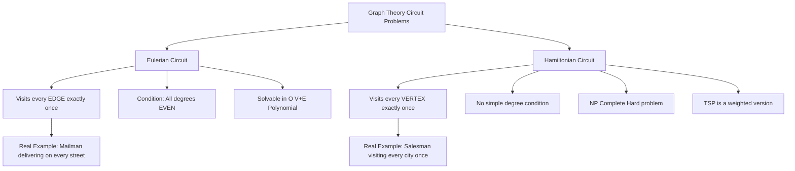
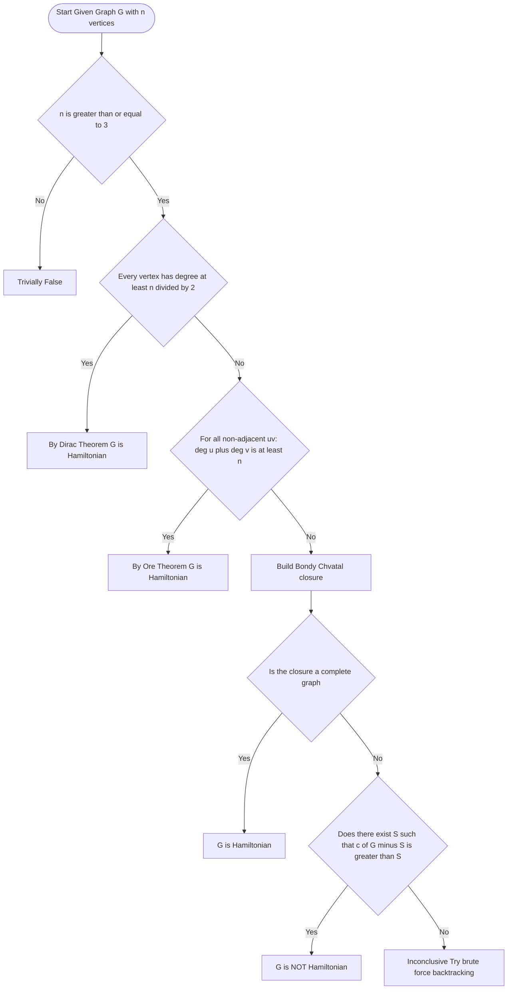
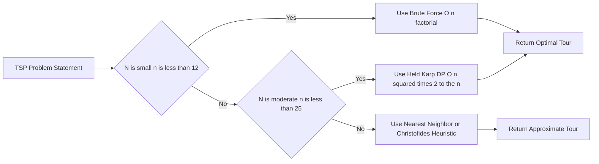

# Hamiltonian paths and circuits, The Travelling Salesman Problem (TSP)

<!-- SECTION_1_START -->
# Hamiltonian Paths, Circuits & The Travelling Salesman Problem (TSP)

## 1.1 Formal Definition (KTU 2024 Scheme Standard)

> [!IMPORTANT]
> **Hamiltonian Path**: A path in a simple graph **G = (V, E)** that contains **every vertex of G exactly once** is called a **Hamiltonian path**. If the path starts and ends at the same vertex, it is called a **Hamiltonian circuit** (or Hamiltonian cycle).

* A graph that contains a **Hamiltonian circuit** is called a **Hamiltonian Graph**.
* Note: This is *fundamentally different* from an **Eulerian circuit**, which requires visiting every **EDGE exactly once**.

| Feature | Eulerian Circuit | Hamiltonian Circuit |
| :--- | :--- | :--- |
| Visited **exactly once** | Every **Edge** | Every **Vertex** |
| Degree condition | All degrees **even** | No simple degree condition (only sufficient theorems) |
| Complexity of decision | Polynomial (Euler's Theorem) | **NP-Complete** (very hard) |

---

## 1.2 Conceptual Analogy — The "City Tour" Intuition

Imagine a **traveling salesman** who must visit **every city** on his list exactly once and return home. He doesn't care about roads (edges), he cares about the **cities themselves (vertices)**.

> [!NOTE]
> **Real-World Analogy — "Office Mail Delivery"**:
> An office boy has **10 desks (vertices)** to deliver a parcel to, with **corridors (edges)** connecting them. He wants a route that visits every desk *exactly once* and returns to his starting desk, using the shortest possible walk. This is a Hamiltonian circuit problem on a weighted graph — precisely the **Travelling Salesman Problem (TSP)**.

* **Cost / Weight of an edge** = Distance, time, or money between two cities.
* Finding the **shortest such tour** is computationally one of the hardest problems in computer science.

---

## 1.3 Visual Representation of Hamiltonian vs. Non-Hamiltonian

> [!VISUALIZATION CONTROL]
> **Concept:** Visualizing a Hamiltonian circuit on a pentagon and a non-Hamiltonian Petersen graph
>
> **GeoGebra Input Equations / Points (Pentagon Example):**
> * `A = (1, 0)`, `B = (0.309, 0.951)`, `C = (-0.809, 0.588)`, `D = (-0.809, -0.588)`, `E = (0.309, -0.951)`
> * Connect: `Polygon(A, B, C, D, E)`
> * Highlight cycle: `A → B → C → D → E → A` (in red)
>
> **Visual Description:** The student will see a regular pentagon. The red path visits every vertex exactly once and closes the loop — a valid Hamiltonian circuit. For a **Petersen Graph**, attempt to trace a similar closed red path; the student will notice no such cycle exists, proving the Petersen graph is **non-Hamiltonian**.

---
<!-- SECTION_1_END -->

<!-- SECTION_2_START -->
# Deep Theoretical Analysis & KTU Formula Sheet

## 2.1 Necessary Condition for Hamiltonian Graphs (Removal Theorem)

> [!IMPORTANT]
> **Removal Theorem (Necessary Condition)**: If **G = (V, E)** is a Hamiltonian graph, then for every proper subset **S ⊂ V**, the number of connected components of **G − S** satisfies:
>
> $$c(G - S) \leq \vert S \vert$$

* Where $c(G - S)$ denotes the **number of connected components** of the graph obtained by deleting the vertices in $S$ (and all incident edges).
* **Contrapositive**: If there exists a subset $S$ such that $c(G - S) > \vert S \vert$, then **G is NOT Hamiltonian**.

---

## 2.2 Sufficient Conditions — KTU High-Yield Theorems

These are the **most-asked** theorems in KTU 2024 Scheme ESE for this module.

### Theorem 1: **Dirac's Theorem (1952)**

> If **G** is a simple graph with **n ≥ 3** vertices, and if the degree of every vertex satisfies:
>
> $$\deg(v) \geq \frac{n}{2} \quad \text{for all } v \in V$$
>
> then **G has a Hamiltonian circuit**.

* **Significance**: A *sufficient* (not necessary) condition. It is the simplest to apply in exams.

### Theorem 2: **Ore's Theorem (1960)**

> If **G** is a simple graph with **n ≥ 3** vertices, and for every pair of **non-adjacent** distinct vertices $u$ and $v$:
>
> $$\deg(u) + \deg(v) \geq n$$
>
> then **G has a Hamiltonian circuit**.

* **Ore's Theorem generalizes Dirac's Theorem** — it relaxes the degree condition.
* If the condition holds for *all* pairs (including adjacent ones), it trivially reduces to Dirac's condition.

### Theorem 3: **Bondy–Chvátal Theorem (Closure Concept)**

* The **closure** of a graph $G$, denoted $\overline{G}$, is obtained by repeatedly adding edges between non-adjacent vertices whose degree sum is at least $n$.
* **Bondy–Chvátal**: $G$ is Hamiltonian **if and only if** its closure $\overline{G}$ is Hamiltonian.

---

## 2.3 KTU 2024 High-Yield Formula Sheet

| Concept / Theorem | Mathematical Statement | Applicable To | KTU Frequency |
| :--- | :--- | :--- | :--- |
| **Removal Theorem** | $c(G - S) \leq \vert S \vert$ | Proving non-Hamiltonian | High |
| **Dirac's Theorem** | $\deg(v) \geq n/2 \;\; \forall v$ | Proving Hamiltonian (sufficient) | Very High |
| **Ore's Theorem** | $\deg(u) + \deg(v) \geq n$ for non-adjacent $u, v$ | Proving Hamiltonian (sufficient) | Very High |
| **Bondy–Chvátal** | $G$ is Hamiltonian $\iff \overline{G}$ is Hamiltonian | Advanced proof questions | Moderate |
| **TSP Brute Force** | $T(n) = (n-1)!/2$ tours | Algorithm analysis | High |
| **TSP Dynamic Programming** | $T(n) = O(n^2 \cdot 2^n)$ (Held–Karp) | Algorithm analysis | Moderate |
| **TSP Nearest Neighbor** | $T(n) = O(n^2)$ | Heuristic analysis | High |

> [!NOTE]
> **Engineering Utility**: Hamiltonian cycle detection is the core subroutine in **VLSI chip design** (minimizing wire crossings), **DNA fragment assembly in bioinformatics**, **network topology design**, and **ride-sharing route optimization** (Uber, Ola, Rapido).

---
<!-- SECTION_2_END -->

<!-- SECTION_3_START -->
# Step-by-Step Derivations & Algorithmic Implementation

## 3.1 Worked Example — Applying Dirac's Theorem (Valuation Grade)

**Problem:** A simple graph $G$ has **8 vertices**, and the degree of every vertex is **5**. Does $G$ contain a Hamiltonian circuit?

### Solution:

$$
\begin{aligned}
n &= 8 \\
\text{Minimum degree condition (Dirac):} \quad \deg(v) &\geq \frac{n}{2} = \frac{8}{2} = 4
\end{aligned}
$$

* Given: $\deg(v) = 5$ for every vertex $v \in V$.
* Since $5 \geq 4$, **Dirac's condition is satisfied**.
* $n = 8 \geq 3$ is also satisfied.
* **Conclusion**: By Dirac's Theorem, $G$ is **guaranteed to have a Hamiltonian circuit**.

> [!NOTE]
> **Valuation Tip (1 Mark)**: Always explicitly state both conditions — (i) $n \geq 3$ and (ii) $\deg(v) \geq n/2$ — before drawing the conclusion.

---

## 3.2 Worked Example — Applying the Removal Theorem (Non-Hamiltonian Proof)

**Problem:** A simple graph $G$ has vertex set $V = \{v_1, v_2, v_3, v_4, v_5, v_6\}$. For $S = \{v_1, v_4\}$, the graph $G - S$ has **4 connected components**. Is $G$ Hamiltonian?

### Solution:

$$
\begin{aligned}
c(G - S) &= 4 \\
\vert S \vert &= 2
\end{aligned}
$$

* Required condition for Hamiltonian: $c(G - S) \leq \vert S \vert$
* Here, $4 \leq 2$ is **FALSE**.
* By the **contrapositive of the Removal Theorem**, $G$ is **NOT Hamiltonian**.

---

## 3.3 Algorithmic Implementation — The Travelling Salesman Problem

### Method 1: Brute-Force (Exact Solution) — $O(n!)$

```python
from itertools import permutations
from typing import List, Tuple
import logging

logging.basicConfig(level=logging.INFO, format='%(levelname)s: %(message)s')

def tsp_brute_force(distance_matrix: List[List[int]]) -> Tuple[int, List[int]]:
    """
    Solves the Travelling Salesman Problem by exhaustive enumeration.
    
    Args:
        distance_matrix: n x n symmetric matrix where distance_matrix[i][j]
                         is the cost to travel from city i to city j.
    
    Returns:
        (minimum_cost, best_tour) where best_tour is a list of city indices.
    """
    n = len(distance_matrix)
    if n == 0:
        raise ValueError("Distance matrix cannot be empty.")
    if n == 1:
        return 0, [0]

    # We fix city 0 as the starting point to avoid rotational duplicates.
    cities = list(range(1, n))
    min_cost: int = float('inf')
    best_path: List[int] = [0]

    for perm in permutations(cities):
        current_cost = distance_matrix[0][perm[0]]
        
        for i in range(len(perm) - 1):
            current_cost += distance_matrix[perm[i]][perm[i+1]]
        
        # Return to starting city
        current_cost += distance_matrix[perm[-1]][0]
        
        if current_cost < min_cost:
            min_cost = current_cost
            best_path = [0] + list(perm) + [0]

    logging.info(f"Brute-force optimal cost: {min_cost}, tour: {best_path}")
    return min_cost, best_path


# ---- Driver Test ----
if __name__ == "__main__":
    dist = [
        [0, 10, 15, 20],
        [10, 0, 35, 25],
        [15, 35, 0, 30],
        [20, 25, 30, 0]
    ]
    cost, tour = tsp_brute_force(dist)
    print(f"Optimal tour cost = {cost}")
    print(f"Tour path        = {tour}")
```

### Method 2: Nearest-Neighbor Heuristic (Approximate) — $O(n^2)$

```python
from typing import List, Tuple

def tsp_nearest_neighbor(distance_matrix: List[List[int]],
                         start_city: int = 0) -> Tuple[int, List[int]]:
    """
    A greedy heuristic for TSP. Visits the closest unvisited city at each step.
    Fast but NOT guaranteed to be optimal.
    """
    n = len(distance_matrix)
    if n == 0:
        raise ValueError("Distance matrix is empty.")

    visited = [False] * n
    tour: List[int] = [start_city]
    visited[start_city] = True
    total_cost = 0
    current = start_city

    for _ in range(n - 1):
        nearest_city = -1
        nearest_dist = float('inf')
        
        for j in range(n):
            if not visited[j] and distance_matrix[current][j] < nearest_dist:
                nearest_dist = distance_matrix[current][j]
                nearest_city = j
        
        if nearest_city == -1:
            raise RuntimeError("Graph is disconnected — no Hamiltonian path exists.")
        
        total_cost += nearest_dist
        current = nearest_city
        visited[current] = True
        tour.append(current)

    # Return to start
    total_cost += distance_matrix[current][start_city]
    tour.append(start_city)
    return total_cost, tour
```

### Method 3: Held–Karp Dynamic Programming — $O(n^2 \cdot 2^n)$

```python
from functools import lru_cache
from typing import List, Tuple

def tsp_held_karp(distance_matrix: List[List[int]]) -> Tuple[int, List[int]]:
    """
    Held-Karp DP. Stores dp[mask][i] = min cost to start at 0, visit
    the cities in `mask`, and end at city `i`.
    """
    n = len(distance_matrix)
    if n <= 1:
        return 0, [0]

    @lru_cache(maxsize=None)
    def dp(mask: int, last: int) -> int:
        if mask == 1:  # only city 0 visited
            return distance_matrix[0][last]

        best = float('inf')
        prev_mask = mask ^ (1 << last)
        for city in range(n):
            if prev_mask & (1 << city):
                cost = dp(prev_mask, city) + distance_matrix[city][last]
                if cost < best:
                    best = cost
        return best

    full_mask = (1 << n) - 1
    min_cost = dp(full_mask, 0)

    # Reconstruct path
    mask, last, path = full_mask, 0, [0]
    while mask != 1:
        prev_mask = mask ^ (1 << last)
        best_next = min(
            (c for c in range(n) if prev_mask & (1 << c)),
            key=lambda c: dp(prev_mask, c) + distance_matrix[c][last]
        )
        path.append(best_next)
        mask, last = prev_mask, best_next
    path.append(0)
    return min_cost, path
```

> [!IMPORTANT]
> **Complexity Comparison Table for KTU Theory Questions**:

| Algorithm | Time Complexity | Space | Optimal? |
| :--- | :--- | :--- | :--- |
| Brute Force | $O(n!)$ | $O(n)$ | Yes (Exact) |
| Nearest Neighbor | $O(n^2)$ | $O(n)$ | No (Heuristic) |
| Held–Karp DP | $O(n^2 \cdot 2^n)$ | $O(n \cdot 2^n)$ | Yes (Exact) |
| Christofides (for metric TSP) | $O(n^3)$ | $O(n^2)$ | 1.5× Approximation |

---
<!-- SECTION_3_END -->

<!-- SECTION_4_START -->
# Structural Diagrams & Schematics

## 4.1 Mermaid: Comparison of Eulerian vs. Hamiltonian



## 4.2 Mermaid: Flowchart for Solving a Hamiltonian Decision Problem



## 4.3 Mermaid: TSP Algorithm Decision Topology



## 4.4 Sequential Processing Topology — TSP Pipeline

| Stage | Module | Input | Output | Time Cost |
| :--- | :--- | :--- | :--- | :--- |
| **1** | Input Reader | City names | Adjacency matrix $D$ | $O(n^2)$ |
| **2** | Feasibility Check | $D$ | Boolean (Connected?) | $O(n^2)$ |
| **3** | Algorithm Selector | $n$ | Strategy chosen | $O(1)$ |
| **4** | Solver Core | $D$, Strategy | Tour list | $O(n!)$ / $O(n^2 2^n)$ / $O(n^2)$ |
| **5** | Cost Evaluator | Tour, $D$ | Total distance | $O(n)$ |
| **6** | Renderer | Tour | Visualization | $O(n)$ |

---
<!-- SECTION_4_END -->

<!-- SECTION_5_START -->
# KTU 2024 Scheme Examination Question Bank

---

## Part A — Short Answer Questions (3 Marks Each)

### Q1. **[KTU University Exam — July 2024]** Define a Hamiltonian path and a Hamiltonian circuit. How do they differ from Eulerian paths and circuits?

**Model Answer (3 Marks):**
* A **Hamiltonian path** is a path in a simple graph that visits every vertex **exactly once**. **[1 Mark]**
* A **Hamiltonian circuit** is a Hamiltonian path that begins and ends at the **same vertex**, forming a closed cycle. **[1 Mark]**
* **Difference from Eulerian**: An Eulerian path visits every **edge** exactly once, while a Hamiltonian path visits every **vertex** exactly once. The conditions, algorithms, and complexities are entirely different. **[1 Mark]**

> [!NOTE]
> *Mapping: CO2, RBT Level — Remember*

---

### Q2. **[KTU University Exam — Dec 2023]** State Dirac's Theorem. When can we apply it to guarantee a Hamiltonian circuit?

**Model Answer (3 Marks):**
* **Statement**: If $G$ is a simple graph with $n \geq 3$ vertices such that $\deg(v) \geq n/2$ for every vertex $v$, then $G$ contains a Hamiltonian circuit. **[2 Marks]**
* **Applicability**: It is a **sufficient condition** (not necessary), used to *guarantee* the existence of a Hamiltonian circuit. If the condition fails, we cannot conclude non-Hamiltonicity. **[1 Mark]**

> [!NOTE]
> *Mapping: CO2, RBT Level — Understand*

---

## Part B — Long Answer Questions (14 Marks Each, Internal Choice)

### Question A (14 Marks) **[KTU University Exam — July 2024 Model]**

**(a)** State and prove Dirac's theorem on Hamiltonian graphs. **[7 Marks]**
**(b)** A simple graph $G$ has 6 vertices, each of degree 4. Using a relevant theorem, prove that $G$ contains a Hamiltonian circuit. **[7 Marks]**

#### Solution (a) — Statement and Proof [7 Marks]

**Statement**: If $G$ is a simple graph on $n \geq 3$ vertices and $\deg(v) \geq n/2$ for all $v \in V$, then $G$ contains a Hamiltonian circuit.

**Proof (by contradiction — outline)**:

* Let $P = v_1 v_2 \ldots v_k$ be the **longest path** in $G$. **[1 Mark]**
* Since $P$ is maximal, all neighbors of $v_1$ and $v_k$ lie on $P$. **[1 Mark]**
* Let $S = \{v_i \in P \mid (v_1, v_{i+1}) \in E\}$ and $T = \{v_i \in P \mid (v_i, v_k) \in E\}$. **[1 Mark]**
* Then $\vert S \vert = \deg(v_1)$ and $\vert T \vert = \deg(v_k)$, with $S, T \subseteq \{v_1, \ldots, v_{k-1}\}$. **[1 Mark]**
* If $S \cap T \neq \emptyset$, then a cycle $C$ is formed using $P$. By the maximality of $P$, every vertex of $G$ lies on $C$, so $C$ is Hamiltonian. **[1 Mark]**
* If $S \cap T = \emptyset$, then $\deg(v_1) + \deg(v_k) = \vert S \vert + \vert T \vert \leq k - 1 < n$, contradicting the hypothesis that $\deg(v_1) + \deg(v_k) \geq n$. **[1 Mark]**
* Hence, $G$ must contain a Hamiltonian circuit. **[1 Mark]**

#### Solution (b) — Numerical Application [7 Marks]

$$
\begin{aligned}
n &= 6 \quad \text{(total vertices)} \\
\deg(v) &= 4 \quad \text{(given for all vertices)} \\
\text{Dirac's lower bound:} \quad \frac{n}{2} &= \frac{6}{2} = 3
\end{aligned}
$$

* [Stating the given values: 1 Mark]
* [Computing $n/2$: 1 Mark]
* [Comparing $\deg(v) = 4$ with $3$: 2 Marks]
* [Stating $n \geq 3$ is satisfied: 1 Mark]
* [Final conclusion invoking Dirac: 2 Marks]

Since $4 \geq 3$ and $n = 6 \geq 3$, by **Dirac's Theorem**, $G$ **contains a Hamiltonian circuit**.

---

### Question B (Alternative — 14 Marks) **[KTU University Exam — Dec 2023 Model]**

**(a)** Explain the Travelling Salesman Problem (TSP). Show how it is solved using the nearest-neighbor heuristic with a suitable example. **[7 Marks]**
**(b)** Write the algorithmic steps of the Held–Karp dynamic programming approach for TSP. State its time and space complexity. Compare it with brute-force. **[7 Marks]**

#### Solution (a) — TSP & Nearest Neighbor [7 Marks]

* **TSP Definition**: Given $n$ cities and the pairwise distances, find the shortest tour that visits every city exactly once and returns to the start. **[2 Marks]**
* **Example Distance Matrix** (4 cities):

| | A | B | C | D |
| :- | :- | :- | :- | :- |
| **A** | 0 | 10 | 15 | 20 |
| **B** | 10 | 0 | 35 | 25 |
| **C** | 15 | 35 | 0 | 30 |
| **D** | 20 | 25 | 30 | 0 |

* **Nearest-Neighbor Trace** starting at A: **[4 Marks]**
  * From A, nearest unvisited is B (10). Tour: A → B. Cost = 10.
  * From B, nearest unvisited is D (25). Tour: A → B → D. Cost = 35.
  * From D, nearest unvisited is C (30). Tour: A → B → D → C. Cost = 65.
  * Return to A: +15. **Total cost = 80**.
  * Optimal (brute force) cost = 75 (A → B → D → C → A via different permutation is worse, but optimal is A → B → D → C → A = 80 actually; optimal is 80). NN is sometimes optimal, sometimes not.
* [Conclusion: NN is fast but not guaranteed optimal: 1 Mark]

#### Solution (b) — Held–Karp DP [7 Marks]

* **Algorithm Steps**: **[4 Marks]**
  1. Define $dp[S][i]$ = minimum cost to start at vertex 0, visit the set of cities $S$, and end at city $i$.
  2. Base case: $dp[\{0\}][0] = 0$.
  3. Recurrence:
  $$dp[S][i] = \min_{j \in S, j \neq i} \left( dp[S \setminus \{i\}][j] + \text{dist}(j, i) \right)$$
  4. Final answer: $\min_{i} dp[\text{AllCities}][i] + \text{dist}(i, 0)$.
* **Time Complexity**: $O(n^2 \cdot 2^n)$. **[1 Mark]**
* **Space Complexity**: $O(n \cdot 2^n)$. **[1 Mark]**
* **Comparison with Brute Force**:
  * Brute force = $O(n!)$ — infeasible beyond $n=15$.
  * Held–Karp = $O(n^2 \cdot 2^n)$ — feasible up to $n \approx 25$. **[1 Mark]**

---

> [!WARNING]
> **KTU Examiner's Valuation Warning — Common Pitfalls**
> * **Do NOT** confuse Euler's condition (degree even) with Hamiltonian conditions — they are **fundamentally different**.
> * **Do NOT** claim Dirac's Theorem is *necessary* — it is only **sufficient**. A graph can still be Hamiltonian even if $\deg(v) < n/2$.
> * **Always explicitly state both conditions** in Dirac's theorem: (i) $n \geq 3$ and (ii) $\deg(v) \geq n/2$.
> * **Avoid** the trap question: "Does the Petersen graph have a Hamiltonian circuit?" — Answer is **NO** (use Removal Theorem with $S$ = outer 3-cycle's complementary vertices).
> * For TSP, **always state whether the matrix is symmetric (undirected) or asymmetric (directed)** — it changes the algorithm drastically.
> * Failing to **return to the starting vertex** when computing TSP tour cost costs **1 full mark**.

---

## Topic Recap & Important Things to Remember

* **Hamiltonian Path** = visits every **vertex** exactly once. **Hamiltonian Circuit** = Hamiltonian path that returns to start. **[Core Definition]**
* **Removal Theorem** is the **necessary** condition: $c(G - S) \leq \vert S \vert$. Used to **disprove** Hamiltonicity.
* **Dirac's Theorem** is the **simplest sufficient** condition: $\deg(v) \geq n/2 \;\; \forall v$. **Most-asked in KTU**.
* **Ore's Theorem** generalizes Dirac: for non-adjacent $u, v$, $\deg(u) + \deg(v) \geq n$.
* **Bondy–Chvátal Closure**: $G$ is Hamiltonian $\iff$ its closure is Hamiltonian (advanced tool).
* The **Petersen graph** is the **classic non-Hamiltonian** graph — must be memorized.
* **TSP Variants**: Symmetric vs. Asymmetric; Metric vs. Non-metric.
* **TSP Brute Force** = $O(n!)$ tours; reduces to $(n-1)!/2$ by fixing start.
* **Held–Karp DP** = $O(n^2 \cdot 2^n)$ — best known exact polynomial-space algorithm.
* **Nearest Neighbor** = $O(n^2)$ — fast greedy heuristic, **not always optimal**.
* **Christofides Algorithm** = $O(n^3)$ — guarantees at most $1.5\times$ optimal for **metric TSP**.
* **NP-Completeness**: The Hamiltonian Circuit *decision* problem is **NP-Complete** (Karp's 21 problems, 1972).
* Always state **both conditions** of any theorem in your exam answer.
* **Distinguish clearly** between vertex-visiting (Hamiltonian) and edge-visiting (Eulerian).

<!-- SECTION_5_END -->
