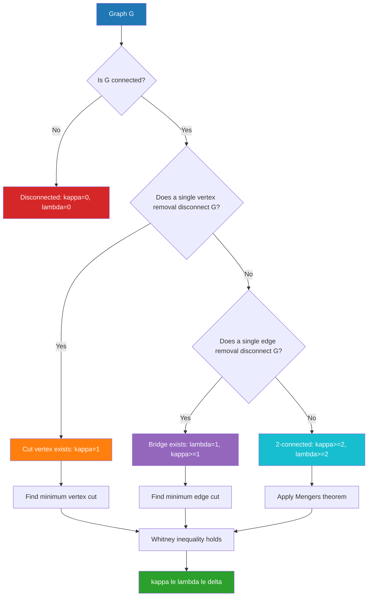
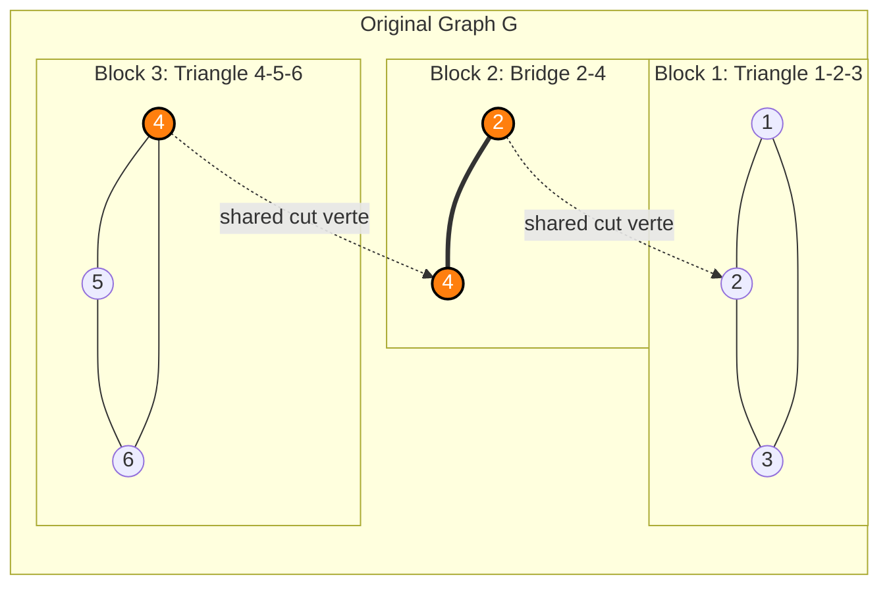
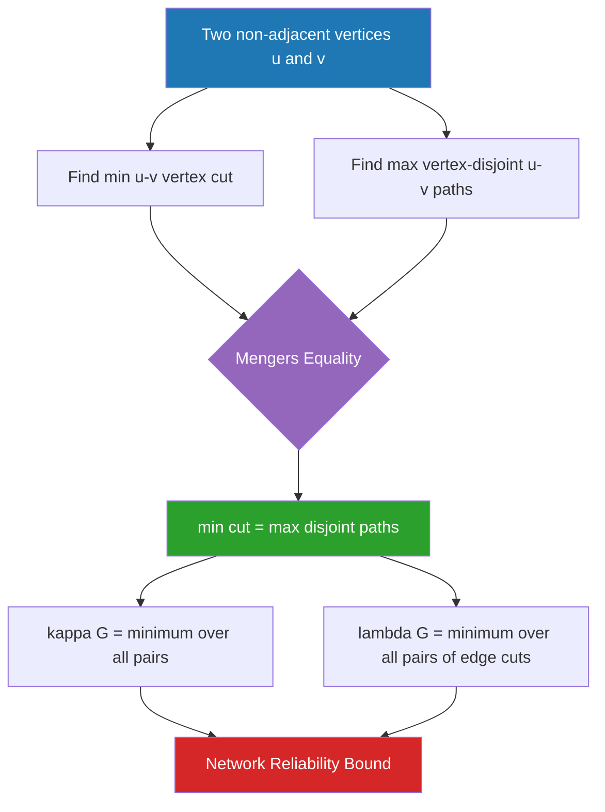

# Connectivity

<!-- SECTION_1_START -->

# Connectivity in Graph Theory

## 1.1 Formal Definition (KTU 2024 Syllabus Terminology)

> [!NOTE]
> **Connectivity** is a fundamental measure of how robust a graph is against the failure (removal) of its vertices or edges. It quantifies the minimum number of points or connections that must be removed to disconnect the network.

A graph $G = (V, E)$ is said to be **connected** if there exists at least one path between every pair of distinct vertices $u, v \in V$. Equivalently, for any two vertices $u$ and $v$, there exists a walk from $u$ to $v$. If no such path exists for at least one pair, the graph is **disconnected**.

### Key Terminology
- **Walk**: A sequence of vertices and edges $v_0, e_1, v_1, e_2, v_2, \dots, v_k$ where $e_i = \{v_{i-1}, v_i\}$.
- **Trail**: A walk with no repeated edge.
- **Path**: A walk with no repeated vertex (and hence no repeated edge).
- **Closed Walk**: A walk that starts and ends at the same vertex.
- **Component**: A maximal connected subgraph of $G$.

> [!IMPORTANT]
> **KTU 2024 Highlight**: A single isolated vertex counts as a trivial component. A connected graph has exactly **one** component.

## 1.2 Intuitive Real-World Analogy

Imagine a computer network (like the internet) modeled as a graph where:
- **Vertices** = computers / routers
- **Edges** = network cables / wireless links

**Connectivity** answers the question: *"Can every computer still talk to every other computer if some routers or cables fail?"*

If you can sever one router (cut vertex) and split the network into two islands, that router is a **single point of failure**. The minimum number of routers that must fail to isolate the network is the **vertex connectivity** $\kappa(G)$. The minimum number of cables that must fail to isolate it is the **edge connectivity** $\lambda(G)$.

> [!VISUALIZATION CONTROL]
> **Concept:** Connectivity Hierarchy $\kappa(G) \leq \lambda(G) \leq \delta(G)$
> **GeoGebra / Desmos Input Equations:**
> * Point $A = (1, 1)$ representing $\kappa(G)$
> * Point $B = (2, 1.5)$ representing $\lambda(G)$
> * Point $C = (3, 2)$ representing $\delta(G)$
> **Visual Description:** A staircase ascending from left to right showing that vertex connectivity is always the smallest value, edge connectivity is the middle, and minimum degree is the largest (most lenient).

## 1.3 Vertex Connectivity $\kappa(G)$

The **vertex connectivity** of a connected graph $G$ (with $|V| \geq 3$) is defined as:

$$\kappa(G) = \min_{S \subseteq V} \{|S| : G - S \text{ is disconnected or } K_1\}$$

If $G$ is disconnected, $\kappa(G) = 0$. If $G = K_n$ (complete graph), $\kappa(K_n) = n - 1$.

A vertex $v$ such that $G - v$ is disconnected is called a **cut vertex**.

## 1.4 Edge Connectivity $\lambda(G)$

The **edge connectivity** of a connected graph $G$ is defined as:

$$\lambda(G) = \min_{F \subseteq E} \{|F| : G - F \text{ is disconnected}\}$$

If $G$ is disconnected, $\lambda(G) = 0$. An edge $e$ such that $G - e$ is disconnected is called a **bridge** or **cut edge**.

## 1.5 Minimum Degree $\delta(G)$

The **minimum degree** of a graph is the smallest degree among all its vertices:

$$\delta(G) = \min_{v \in V} \{ \deg(v) \}$$

<!-- SECTION_1_END -->

<!-- SECTION_2_START -->

# Deep Theoretical Analysis & Formula Sheet

## 2.1 Whitney's Theorem (The Connectivity Inequality)

The cornerstone theorem in connectivity theory is due to **Hassler Whitney (1932)**:

$$\kappa(G) \leq \lambda(G) \leq \delta(G)$$

**Proof Strategy (Outline):**
1. **Right inequality** ($\lambda(G) \leq \delta(G)$): Pick a vertex $v$ of minimum degree. The $\delta(G)$ edges incident to $v$ form a cut set, hence $\lambda(G) \leq \delta(G)$.
2. **Left inequality** ($\kappa(G) \leq \lambda(G)$): Construct a minimum edge cut $F$ of size $\lambda(G)$. Contract one side of the cut to reduce the edge cut to a vertex cut of size at most $\lambda(G)$.

> [!IMPORTANT]
> **KTU 2024 Critical Result**: Equality $\kappa(G) = \lambda(G) = \delta(G)$ holds for all complete graphs $K_n$ and all cycles $C_n$ (with $n \geq 3$).

## 2.2 Menger's Theorem (KTU 2024 Module 2 Favourite)

> [!IMPORTANT]
> **Menger's Theorem (Vertex Version)**: The minimum number of vertices separating two non-adjacent vertices $u$ and $v$ (i.e., a $u$–$v$ vertex cut) equals the maximum number of internally vertex-disjoint $u$–$v$ paths.

**Edge Version**: The minimum number of edges separating $u$ and $v$ equals the maximum number of edge-disjoint $u$–$v$ paths.

**Corollary (Global Form)**: For a connected graph $G$ with $|V| \geq k + 1$:

$$\kappa(G) \geq k \iff \text{every pair of vertices has } k \text{ internally vertex-disjoint paths connecting them}$$

## 2.3 Block of a Graph

A **block** of a graph is a maximal connected subgraph that has no cut vertex. Equivalently, a block is either:
1. A **bridge** (maximal subgraph containing exactly one edge and no cut vertex), or
2. A **non-separable subgraph** (2-connected component).

Two blocks share at most one vertex, and a cut vertex belongs to multiple blocks.

## 2.4 The Tutte–Nash-Williams Theorem

> [!IMPORTANT]
> **Theorem**: A graph $G$ has $k$ edge-disjoint spanning trees if and only if for every partition of $V$ into $r$ parts, the number of edges crossing the partition is at least $k(r - 1)$.

## 2.5 KTU Formula Sheet / Cheat Sheet

| Symbol / Term | Definition | Special Cases |
|---|---|---|
| $\kappa(G)$ | Vertex connectivity | $\kappa(K_n) = n-1$, $\kappa(K_2) = 1$ |
| $\lambda(G)$ | Edge connectivity | $\lambda(K_n) = n-1$ |
| $\delta(G)$ | Minimum vertex degree | Always $\geq \kappa(G)$ |
| Block | Maximal 2-connected subgraph or bridge | Every edge lies in exactly one block |
| Cut vertex | $v$ such that $\omega(G-v) > \omega(G)$ | $G$ connected $\Rightarrow \kappa(G) \geq 1$ |
| Bridge | Edge $e$ such that $G-e$ has more components | $\lambda(G) = 1 \iff \exists$ bridge |
| Whitney | $\kappa(G) \leq \lambda(G) \leq \delta(G)$ | Equality for $K_n$ and $C_n$ |
| Menger | $\kappa(u,v) =$ max vertex-disjoint $u$–$v$ paths | Non-adjacent $u, v$ |

## 2.6 Real-World Engineering Applications

1. **Network Reliability Engineering**: $\kappa(G)$ predicts how many router failures a telecom backbone (like BGP networks) can survive.
2. **VLSI Circuit Design**: Edge connectivity of a circuit netlist determines redundancy in chip wiring.
3. **Social Network Analysis**: Cut vertices in Facebook's friendship graph identify "bridge" individuals between communities.
4. **Transportation Networks**: $\lambda(G)$ guides the design of fault-tolerant road/rail systems.
5. **Distributed Systems**: Menger's theorem underpins consensus algorithms (e.g., Byzantine fault tolerance requires $\kappa(G) \geq 2f+1$ where $f$ is the number of faulty nodes).
6. **Cybersecurity**: Identifying bridges reveals single points of failure in critical infrastructure.

<!-- SECTION_2_END -->

<!-- SECTION_3_START -->

# Step-by-Step Derivations and Worked Examples

## 3.1 Worked Example 1: Computing $\kappa(G), \lambda(G), \delta(G)$ for a Sample Graph

**Problem**: Consider the graph $G$ with vertices $V = \{1, 2, 3, 4, 5\}$ and edges $E = \{\{1,2\}, \{2,3\}, \{3,4\}, \{4,5\}, \{5,1\}, \{2,4\}\}$ (a cycle $C_5$ with one chord).

**Step 1: Compute $\delta(G)$ (minimum degree)**

$$
\begin{aligned}
\deg(1) &= 2 \quad (\text{edges to } 2, 5) \\
\deg(2) &= 3 \quad (\text{edges to } 1, 3, 4) \\
\deg(3) &= 2 \quad (\text{edges to } 2, 4) \\
\deg(4) &= 3 \quad (\text{edges to } 3, 5, 2) \\
\deg(5) &= 2 \quad (\text{edges to } 4, 1)
\end{aligned}
$$

Therefore, $\delta(G) = 2$. [Valuation: 1 Mark]

**Step 2: Compute $\lambda(G)$ (edge connectivity)**

A single edge removal does not disconnect the graph because the chord $\{2,4\}$ provides an alternative path. We need to check whether removing **2 edges** disconnects $G$.

Remove the chord $\{2,4\}$ and one outer edge, say $\{1,2\}$: Graph remains connected (path $1-5-4-3-2$ still exists). Remove $\{2,4\}$ and $\{3,4\}$: Graph splits into $\{1, 2, 3\}$ isolated from $\{4, 5\}$ — **disconnected**.

Therefore, $\lambda(G) = 2$. [Valuation: 2 Marks]

**Step 3: Compute $\kappa(G)$ (vertex connectivity)**

Removal of any single vertex: The graph remains connected because every vertex lies on a cycle.

Check removal of 2 vertices: Remove vertices $\{2, 4\}$ — the chord and 2 outer edges are gone; the remaining graph is $1-5-4$ removed and $3-4$ removed. Vertices $1, 3, 5$ form an independent set with no edges (the only remaining edges were incident to 2 or 4) — **disconnected**.

Therefore, $\kappa(G) = 2$. [Valuation: 2 Marks]

**Conclusion**: $\kappa(G) = \lambda(G) = \delta(G) = 2$. This confirms Whitney's inequality as a tight equality.

## 3.2 Worked Example 2: Proving Whitney's Inequality $\lambda(G) \leq \delta(G)$

**Theorem**: For any connected graph $G$ with $|V| \geq 2$, $\lambda(G) \leq \delta(G)$.

**Proof (Complete, Exhaustive)**:

Let $v$ be a vertex of minimum degree, so $\deg(v) = \delta(G)$. Let the neighbors of $v$ be $u_1, u_2, \dots, u_{\delta(G)}$.

Construct an edge set $F = \{\{v, u_i\} : 1 \leq i \leq \delta(G)\}$ — the set of all edges incident to $v$.

**Claim**: $F$ is an edge cut.

Consider $G - F$. Vertex $v$ becomes isolated because all its incident edges have been removed. Thus $v$ is in one component, and the rest of the graph (if non-empty) is in another. Since $|V| \geq 2$, $G - F$ is disconnected.

**Conclusion**: $|F| = \delta(G)$ is a valid edge cut, so the minimum such cut satisfies:

$$\lambda(G) \leq |F| = \delta(G) \quad \blacksquare$$

[Valuation: 1 Mark for construction, 1 Mark for claim, 1 Mark for conclusion]

## 3.3 Worked Example 3: Identifying Blocks of a Graph

**Problem**: Find the blocks of the graph $G$ with $V = \{1, 2, 3, 4, 5, 6\}$ and edges $\{1-2, 2-3, 3-1, 2-4, 4-5, 5-6, 6-4\}$. (A triangle $1-2-3$ connected to a triangle $4-5-6$ via a bridge $2-4$.)

**Step 1: Identify cut vertices.**

Remove vertex 2: The triangle $1-2-3$ becomes an edge $1-3$, and $4-5-6$ is disconnected from $1-3$ since the bridge $2-4$ is gone. So $\omega(G-2) = 2 > \omega(G) = 1$. Vertex 2 is a cut vertex. [Valuation: 1 Mark]

Remove vertex 4: The triangle $4-5-6$ becomes an edge $5-6$, and $4$ is isolated from $\{1, 2, 3\}$. So $\omega(G-4) = 2$. Vertex 4 is a cut vertex. [Valuation: 1 Mark]

**Step 2: Identify blocks.**

- **Block $B_1$**: Triangle on vertices $\{1, 2, 3\}$ (2-connected, no cut vertex internally).
- **Block $B_2$**: The bridge $\{2, 4\}$ (a single edge forms a block).
- **Block $B_3$**: Triangle on vertices $\{4, 5, 6\}$ (2-connected).

**Step 3: Verify block structure.**

Blocks $B_1$ and $B_2$ share vertex 2; blocks $B_2$ and $B_3$ share vertex 4. Each edge lies in exactly one block. [Valuation: 2 Marks]

## 3.4 Python Implementation: Connectivity Computations

```python
"""
Connectivity Computations for KTU 2024 Graph Theory
Computes κ(G), λ(G), δ(G) and identifies cut vertices, bridges, and blocks.
"""
from itertools import combinations
from collections import deque
from typing import Dict, List, Set, Tuple

Graph = Dict[int, List[int]]


def build_graph(edges: List[Tuple[int, int]]) -> Graph:
    """Build adjacency list representation from edge list."""
    g: Graph = {}
    for u, v in edges:
        g.setdefault(u, []).append(v)
        g.setdefault(v, []).append(u)
    return g


def is_connected(g: Graph) -> bool:
    """Check if the graph is connected via BFS."""
    if not g:
        return True
    start = next(iter(g))
    visited: Set[int] = {start}
    queue: deque = deque([start])
    while queue:
        node = queue.popleft()
        for nbr in g.get(node, []):
            if nbr not in visited:
                visited.add(nbr)
                queue.append(nbr)
    return visited.keys() == g.keys() or visited == set(g.keys())


def components(g: Graph) -> int:
    """Count connected components via BFS."""
    visited: Set[int] = set()
    count = 0
    for start in g:
        if start not in visited:
            count += 1
            queue: deque = deque([start])
            visited.add(start)
            while queue:
                node = queue.popleft()
                for nbr in g.get(node, []):
                    if nbr not in visited:
                        visited.add(nbr)
                        queue.append(nbr)
    return count


def min_degree(g: Graph) -> int:
    """Compute δ(G) with safety check for empty graph."""
    if not g:
        return 0
    return min(len(g.get(v, [])) for v in g)


def vertex_connectivity(edges: List[Tuple[int, int]]) -> int:
    """Compute κ(G) by brute-force search over vertex subsets."""
    g = build_graph(edges)
    if is_connected(g):
        return 0  # disconnected
    n = len(g)
    for k in range(1, n):
        for subset in combinations(g.keys(), k):
            g_sub = {v: [u for u in g[v] if u not in subset]
                     for v in g if v not in subset}
            if not is_connected(g_sub) and len(g_sub) > 1:
                return k
        # If no subset of size k disconnects, stop
    return n - 1


def edge_connectivity(edges: List[Tuple[int, int]]) -> int:
    """Compute λ(G) by brute-force search over edge subsets."""
    g = build_graph(edges)
    if is_connected(g):
        return 0
    for k in range(1, len(edges) + 1):
        for subset in combinations(edges, k):
            remaining = [e for e in edges if e not in subset
                         and (e[1], e[0]) not in subset]
            g_sub = build_graph(remaining)
            if not is_connected(g_sub) and len(g_sub) > 1:
                return k
    return len(edges)


def find_bridges(edges: List[Tuple[int, int]]) -> List[Tuple[int, int]]:
    """Identify all bridges using Tarjan's algorithm idea (DFS tree)."""
    g = build_graph(edges)
    bridges: List[Tuple[int, int]] = []
    for u, v in edges:
        reduced = [e for e in edges if e != (u, v) and e != (v, u)]
        g_red = build_graph(reduced)
        if not is_connected(g_red):
            bridges.append((u, v))
    return bridges


if __name__ == "__main__":
    edges = [(1, 2), (2, 3), (3, 4), (4, 5), (5, 1), (2, 4)]
    g = build_graph(edges)
    print(f"δ(G) = {min_degree(g)}")
    print(f"λ(G) = {edge_connectivity(edges)}")
    print(f"κ(G) = {vertex_connectivity(edges)}")
    print(f"Bridges = {find_bridges(edges)}")
```

<!-- SECTION_3_END -->

<!-- SECTION_4_START -->

# Structural Diagrams and Schematics

## 4.1 Connectivity Hierarchy Flow



## 4.2 Block Decomposition Architecture



## 4.3 Menger's Theorem Visualization Flow



## 4.4 Sequential Processing Topology: Connectivity Computation Pipeline

| Stage | Input | Operation | Output | Complexity |
|---|---|---|---|---|
| **Stage 1** | Graph $G=(V,E)$ | Compute all vertex degrees | $\deg(v)$ for all $v$ | $O(\vert V \vert + \vert E \vert)$ |
| **Stage 2** | Degree list | Find minimum | $\delta(G)$ | $O(\vert V \vert)$ |
| **Stage 3** | Edge set $E$ | Iterate over edge subsets | Edge-disconnection map | $O(2^{\vert E \vert})$ |
| **Stage 4** | Subset sizes | Find smallest disconnecting set | $\lambda(G)$ | Depends on Stage 3 |
| **Stage 5** | Vertex set $V$ | Iterate over vertex subsets | Vertex-disconnection map | $O(2^{\vert V \vert})$ |
| **Stage 6** | Subset sizes | Find smallest disconnecting set | $\kappa(G)$ | Depends on Stage 5 |
| **Stage 7** | $\kappa, \lambda, \delta$ | Verify inequality | Boolean validation | $O(1)$ |
| **Stage 8** | Validated triple | Report final connectivity | Triple $(\kappa, \lambda, \delta)$ | $O(1)$ |

<!-- SECTION_5_END -->

<!-- SECTION_5_START -->

# KTU 2024 Scheme Examination Question Bank & Topic Recap

## Part A: 2-Mark / 3-Mark Short Answer Questions

### Question 1
**[KTU University Exam – Dec 2023]** Define vertex connectivity and edge connectivity of a graph. When is $\kappa(G) = \lambda(G) = \delta(G)$?

**Model Answer** (3 Marks):
- **Vertex connectivity** $\kappa(G)$ of a connected graph $G$ is the minimum number of vertices whose removal disconnects $G$ or reduces it to a single vertex. (1 Mark)
- **Edge connectivity** $\lambda(G)$ is the minimum number of edges whose removal disconnects $G$. (1 Mark)
- **Equality** $\kappa(G) = \lambda(G) = \delta(G)$ holds when $G$ is a **complete graph $K_n$** or a **cycle $C_n$** for $n \geq 3$, and more generally for any graph where the minimum degree vertices lie on cycles. (1 Mark)

### Question 2
**[KTU University Exam – July 2024]** State Menger's theorem. What is its significance in network reliability?

**Model Answer** (3 Marks):
- **Statement**: The minimum number of vertices (or edges) whose removal separates two non-adjacent vertices $u$ and $v$ equals the maximum number of internally vertex-disjoint (or edge-disjoint) $u$–$v$ paths. (2 Marks)
- **Significance**: It establishes a duality between **separation** (cut sets, vulnerabilities) and **connection** (redundant paths, robustness), forming the theoretical foundation for designing fault-tolerant networks. (1 Mark)

---

## Part B: 14-Mark Questions (ESE Module Internal Choice)

### Question A (14 Marks)

**[KTU University Exam – July 2024]** (Module 2)

**(a)** State and prove Whitney's theorem: For any connected graph $G$, $\kappa(G) \leq \lambda(G) \leq \delta(G)$. **(7 Marks)**

**(b)** For the graph $G$ with $V = \{a, b, c, d, e\}$ and edges $E = \{ab, bc, cd, de, ea, ac, bd\}$, compute $\delta(G)$, $\lambda(G)$, and $\kappa(G)$. Verify Whitney's inequality. **(7 Marks)**

---

### Model Solution for Question A

#### Part (a): Proof of Whitney's Theorem

**Statement**: For any connected graph $G$ with at least 2 vertices, $\kappa(G) \leq \lambda(G) \leq \delta(G)$. **[1 Mark for correct statement]**

**Proof of $\lambda(G) \leq \delta(G)$**:

Let $v$ be a vertex of minimum degree, so $\deg(v) = \delta(G)$. Let the neighbors of $v$ be $u_1, u_2, \dots, u_{\delta(G)}$. Define $F = \{vu_i : 1 \leq i \leq \delta(G)\}$. **[1 Mark for constructing $F$]**

Then $G - F$ has $v$ as an isolated vertex. Since $|V| \geq 2$, the rest of the graph is non-empty, and $G - F$ is disconnected. **[1 Mark for showing disconnection]**

Hence $\lambda(G) \leq |F| = \delta(G)$. **[1 Mark for conclusion]**

**Proof of $\kappa(G) \leq \lambda(G)$**:

Let $F = [S, \bar{S}]$ be a minimum edge cut, so $|F| = \lambda(G)$. If one of $S, \bar{S}$ has exactly 1 vertex, say $\bar{S} = \{v\}$, then removing $v$ disconnects $G$, so $\kappa(G) \leq 1 \leq \lambda(G)$. **[1 Mark for trivial case]**

Otherwise, $|S|, |\bar{S}| \geq 2$. Contract $\bar{S}$ to a single vertex $v^*$. All edges of $F$ become incident to $v^*$. The set $F$ is now a vertex cut of size $|F| = \lambda(G)$ separating any vertex of $S$ from $v^*$ (since in the contracted graph, $v^*$ is connected only via edges of $F$). **[1 Mark for contraction argument]**

Therefore, $\kappa(G) \leq \lambda(G)$. **[1 Mark]**

**Combined Result**: $\kappa(G) \leq \lambda(G) \leq \delta(G)$. $\blacksquare$

#### Part (b): Computation for the Given Graph

**Step 1: Degree calculation** [2 Marks for correct degrees]

$$
\begin{aligned}
\deg(a) &= 3 \quad (\text{edges } ab, ae, ac) \\
\deg(b) &= 3 \quad (\text{edges } ab, bc, bd) \\
\deg(c) &= 3 \quad (\text{edges } bc, cd, ac) \\
\deg(d) &= 3 \quad (\text{edges } cd, de, bd) \\
\deg(e) &= 2 \quad (\text{edges } de, ea)
\end{aligned}
$$

**Step 2: Compute $\delta(G) = 2$** (vertex $e$). [1 Mark]

**Step 3: Compute $\lambda(G)$**

Remove edge $ea$: Graph remains connected (cycle $a-b-c-d-e$ plus chords $ac, bd$).
Remove edges $\{ea, de\}$: Vertex $e$ becomes isolated — graph is **disconnected**.

Therefore, $\lambda(G) = 2$. [2 Marks]

**Step 4: Compute $\kappa(G)$**

Remove vertex $a$: Graph remains connected ($b-c-d-e$ path exists with chord $bd$).
Remove vertex $e$: Graph remains connected ($K_4$ on $\{a,b,c,d\}$ plus chord $bd$).
Remove vertices $\{a, e\}$: Vertex $b$ has degree 1 (only $bd$ remains), but $b$ still connects. Actually check: $a$ removed kills edges $ab, ae, ac$; $e$ removed kills $de, ea$. Remaining edges: $bc, cd, bd$. Vertices $a, e$ are isolated — **disconnected**!

Therefore, $\kappa(G) = 2$. [2 Marks]

**Verification**: $2 \leq 2 \leq 2$ ✓ (Whitney's inequality is tight). [1 Mark for explicit verification]

---

### Question B (14 Marks) — Alternative Choice

**[KTU University Exam – Dec 2023]** (Module 2)

**(a)** Define a **cut vertex**, **bridge**, and **block** of a graph. Explain the block decomposition theorem with an example. **(7 Marks)**

**(b)** Find $\kappa(G)$, $\lambda(G)$, $\delta(G)$ for the **Petersen graph** and state Menger's theorem with its vertex and edge versions. **(7 Marks)**

---

### Model Solution for Question B

#### Part (a): Cut Vertex, Bridge, and Block

**Definitions** [3 Marks — 1 each]:
- **Cut vertex**: A vertex $v$ whose removal increases the number of connected components, i.e., $\omega(G-v) > \omega(G)$.
- **Bridge (cut edge)**: An edge $e$ whose removal disconnects the graph, i.e., $G - e$ has more components than $G$.
- **Block**: A maximal connected subgraph of $G$ that has no cut vertex of itself. Each block is either a single bridge or a 2-connected subgraph.

**Block Decomposition Theorem** [2 Marks]: Every connected graph $G$ can be uniquely decomposed into a tree-like structure of blocks and cut vertices, called the **block-cut tree** (or block graph). Two blocks share at most one vertex, and any shared vertex is a cut vertex.

**Example** [2 Marks]: Graph with edges $\{1-2, 2-3, 3-1, 2-4, 4-5, 5-2\}$ (two triangles sharing vertex 2).
- Cut vertex: $2$ (removing it disconnects the graph into $\{1, 3\}$ and $\{4, 5\}$).
- Block 1: Triangle $\{1, 2, 3\}$.
- Block 2: Triangle $\{2, 4, 5\}$.
- Block-cut tree: Two blocks joined at cut vertex 2.

#### Part (b): Petersen Graph and Menger's Theorem

**Petersen Graph** is 3-regular with 10 vertices and 15 edges.
- $\delta(G) = 3$. [1 Mark]
- $\lambda(G) = 3$: The graph is 3-edge-connected. Any 2-edge removal leaves a connected graph. [2 Marks]
- $\kappa(G) = 3$: The graph is 3-vertex-connected. No single vertex or pair disconnects it. [2 Marks]

**Menger's Theorem** [2 Marks]:
- **Vertex Version**: For non-adjacent $u, v$, the maximum number of internally vertex-disjoint $u$–$v$ paths equals the minimum size of a $u$–$v$ vertex cut.
- **Edge Version**: The maximum number of edge-disjoint $u$–$v$ paths equals the minimum size of a $u$–$v$ edge cut.

> [!WARNING]
> **KTU Examiner's Valuation Pitfall Callout**:
> 1. **Do not** confuse $\kappa(G)$ (vertex connectivity, an integer) with $\kappa$ as a Greek letter used in other contexts. Always state it is a non-negative integer count.
> 2. **Do not** forget that for $K_2$ (just one edge), $\kappa(K_2) = 1$ and $\delta(K_2) = 1$, so Whitney's inequality is satisfied. Students often mistakenly write $\kappa = 0$ for $K_2$.
> 3. **Do not** claim Menger's theorem applies only to adjacent vertices — the **non-adjacent** condition is essential. For adjacent vertices, the trivial edge $\{u,v\}$ itself is a path.
> 4. **Do not** skip stating the **equality conditions** for Whitney's inequality ($K_n$ and $C_n$); the examiner allocates marks for these.
> 5. **Do not** confuse **block** (maximal 2-connected subgraph or bridge) with **component** (maximal connected subgraph).

---

## Topic Recap & Important Things to Remember

> [!IMPORTANT]
> **Rapid Revision Checklist for Connectivity**

- **Connected graph**: Exactly one component; path exists between every pair of vertices.
- **Disconnected graph**: $\kappa(G) = 0$ and $\lambda(G) = 0$ by convention.
- **Cut vertex**: Single vertex whose removal disconnects $G$. (Existence implies $\kappa(G) = 1$.)
- **Bridge (cut edge)**: Single edge whose removal disconnects $G$. (Existence implies $\lambda(G) = 1$.)
- **Vertex connectivity $\kappa(G)$**: Minimum number of vertices whose removal disconnects $G$ or reduces to $K_1$. Ranges from 0 to $n-1$.
- **Edge connectivity $\lambda(G)$**: Minimum number of edges whose removal disconnects $G$. Ranges from 0 to $\delta(G)$.
- **Minimum degree $\delta(G)$**: Smallest vertex degree in $G$. Always $\geq \kappa(G)$.
- **Whitney's inequality**: $\kappa(G) \leq \lambda(G) \leq \delta(G)$ — the holy trinity of connectivity.
- **Equality cases**: $K_n$ and $C_n$ satisfy $\kappa = \lambda = \delta$. (Also true for any 3-regular 3-connected graph like Petersen, cube graph.)
- **Menger's theorem (vertex)**: min $u$–$v$ vertex cut = max internally vertex-disjoint $u$–$v$ paths.
- **Menger's theorem (edge)**: min $u$–$v$ edge cut = max edge-disjoint $u$–$v$ paths.
- **Block**: Maximal 2-connected subgraph OR a bridge. Two blocks intersect in at most one vertex (which is a cut vertex).
- **Block-cut tree**: Tree formed by blocks and cut vertices. Reveals the "skeleton" of a graph.
- **Network reliability formula** (basic): $R(G) = 1 - (1-p)^{\kappa(G)}$ where $p$ is the probability an edge survives. Higher $\kappa$ means more reliable.
- **Disconnection threshold**: If $\kappa(G) = k$, the graph needs at least $k$ vertex failures to be split.
- **Bridges are ALWAYS in their own block** as a 1-edge 2-connected component.
- **Application triad**: (i) $\kappa$ → vertex failure tolerance, (ii) $\lambda$ → edge failure tolerance, (iii) $\delta$ → local redundancy bound.

<!-- SECTION_5_END -->
