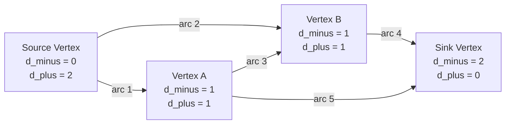
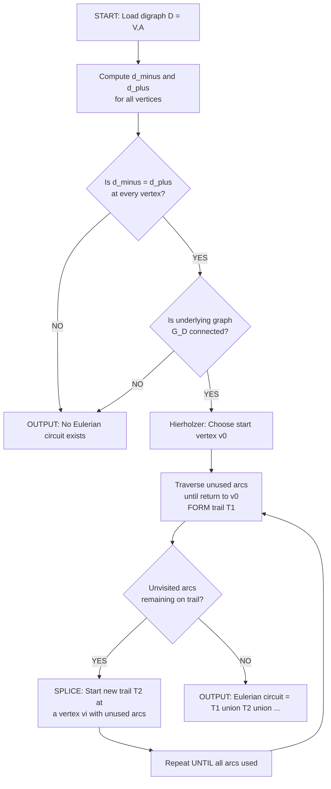
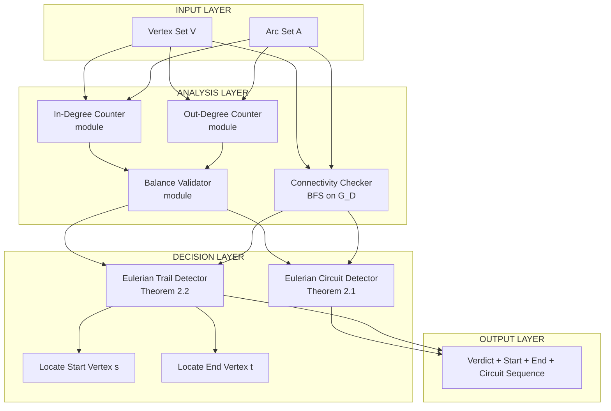

# Directed graphs

<!-- SECTION_1_START -->
# Directed Graphs — Core Technical Definition & Intuitive Overview

> [!NOTE]
> **KTU 2024 Scheme | GAMAT401 | Module 2 — Euler Graphs**
> **Course Outcome Mapped:** CO1 — *Apply the concepts of graph theory to model and solve problems in computer and information science.*
> **Bloom's Level:** Understand → Apply

---

## 1.1 Formal Academic Definition

A **Directed Graph** (or **Digraph**) $D = (V, A)$ is an ordered pair consisting of:

* A finite, non-empty set $V = \{v_1, v_2, \dots, v_n\}$ of **vertices** (also called nodes or points).
* A set $A \subseteq V \times V$ of **arcs** (also called directed edges or arrows), where each arc is an **ordered pair** $(u, v)$ indicating a one-way connection *from* vertex $u$ (the **tail**) *to* vertex $v$ (the **head**).

Unlike an undirected edge $\{u, v\}$, the ordered pair $(u, v)$ is **not** equivalent to $(v, u)$ — direction matters.

### 1.1.1 Standard KTU Terminology for Directed Graphs

| Term | Mathematical Notation | Meaning |
|------|----------------------|---------|
| **Digraph** | $D = (V, A)$ | A graph whose every edge carries a direction |
| **Underlying Graph** | $G(D)$ | The undirected graph obtained by ignoring arc directions |
| **Symmetric Digraph** | — | A digraph in which $(u,v) \in A \Rightarrow (v,u) \in A$ |
| **Asymmetric Digraph** | — | No pair of vertices is joined by arcs in *both* directions |
| **Simple Digraph** | — | No loops $(v,v)$ and no parallel arcs |
| **Multi-digraph** | — | Allows parallel arcs (multiple arcs with same direction between two vertices) |
| **In-degree** | $d^-(v)$ | Number of arcs whose **head** is $v$ |
| **Out-degree** | $d^+(v)$ | Number of arcs whose **tail** is $v$ |
| **Source** | — | A vertex with $d^-(v) = 0$ |
| **Sink** | — | A vertex with $d^+(v) = 0$ |
| **Isolated Vertex** | — | A vertex with $d^-(v) = d^+(v) = 0$ |
| **Semipath** | $u \to v$ | Sequence of vertices where arcs can be traversed in *either* direction |
| **Semiwalk** | — | A semipath allowing repeated vertices |
| **Tournament** | — | Complete digraph with exactly one arc between every pair of vertices |

---

## 1.2 Conceptual Analogy — The One-Way City Map

> [!TIP]
> **Intuition for the Student:**
> Imagine the road network of **Kochi city** as drawn on Google Maps. Some streets are **one-way** — you can drive from **Marine Drive to Thevara**, but you cannot reverse direction on the same street. Each such one-way street is an **arc**, and the **intersection** is a **vertex**. The set of all one-way streets with their directions forms a *directed graph*.
>
> Now imagine a **postal delivery scooter** that wants to traverse every one-way street **exactly once** and return to its depot. This is the *Eulerian Circuit* problem on directed graphs — the central theme of Module 2.

---

## 1.3 The Degree-Handshake Identity for Digraphs

> [!IMPORTANT]
> **KTU Board High-Yield Result (First Theorem of Digraph Theory):**
> For any digraph $D = (V, A)$:
> $$\sum_{v \in V} d^-(v) \;=\; \sum_{v \in V} d^+(v) \;=\; \vert A \vert$$
> **Both in-degree and out-degree sums equal the total number of arcs.** This is the *digraph handshake lemma*.

---

## 1.4 Geometric Intuition for Direction

> [!VISUALIZATION CONTROL]
> **Concept:** Visualizing arcs as directed arrows on a coordinate plane.
> **GeoGebra / Desmos Input:**
> * Point A: `(0, 0)` labelled "Tail (Source)"
> * Point B: `(4, 0)` labelled "Head (Sink)"
> * Vector input: `Vector((0,0),(4,0))` for an arc from $A$ to $B$
> * Vector input: `Vector((4,0),(0,0))` for a *separate* arc from $B$ back to $A$
> **Visual Description:** Two horizontal arrows on the same line, pointing in opposite directions. The student should observe that the arc $(A,B)$ and arc $(B,A)$ are *distinct* objects, unlike in an undirected graph where $\{A, B\}$ represents both.

<!-- SECTION_1_END -->

<!-- SECTION_2_START -->
# Directed Graphs — Deep Theoretical Analysis & KTU High-Yield Formula Sheet

---

## 2.1 Structural Classification of Digraphs

A directed graph is classified by the **arc multiplicity** and **loop allowance**:

### 2.1.1 Taxonomy (KTU Board Style)

1. **Simple Directed Graph** — At most one arc from $u$ to $v$ for every ordered pair, and no loops. If arcs are present in both directions, we obtain the **bidirected edge** representation.
2. **Directed Multigraph (Multi-digraph)** — Allows **parallel arcs** in the same direction, and loops are permitted.
3. **Mixed Graph** — Contains both directed arcs and undirected edges. The KTU module uses this only for advanced Eulerian extensions.
4. **Orientation of an Undirected Graph** — Given an undirected graph $G$, an *orientation* assigns a direction to each edge, producing a digraph $D$ with $G$ as its *underlying graph*.

> [!NOTE]
> **KTU 2024 Module 2 Specifics:** The official syllabus distinguishes Eulerian **undirected** graphs (Module 2.A) from Eulerian **directed** graphs (Module 2.B). For directed Eulerian graphs, the condition involves the **balance of in-degree and out-degree** at every vertex.

---

## 2.2 Eulerian Digraphs — The Core Theorem

### 2.2.1 What is a Directed Eulerian Circuit?

A **directed Eulerian circuit** in a digraph $D$ is a closed directed walk that traverses **every arc exactly once** and returns to the starting vertex. If the walk does not return to the start (but still covers every arc once), it is called a **directed Eulerian trail** (or Eulerian path).

### 2.2.2 KTU Theorem (Euler, 1736 — Directed Form, Hierholzer, 1873)

> [!IMPORTANT]
> **THEOREM 2.1 — Euler's Theorem for Directed Graphs:**
> A connected digraph $D = (V, A)$ possesses a **directed Eulerian circuit** if and only if:
> 1. **Degree Balance Condition:** $d^-(v) = d^+(v)$ for **every** vertex $v \in V$, AND
> 2. **Connectivity Condition:** The underlying undirected graph $G(D)$ is **connected** (ignoring isolated vertices).
>
> **THEOREM 2.2 — Directed Eulerian Trail Condition:**
> A connected digraph $D$ possesses a **directed Eulerian trail** (open path covering every arc) if and only if exactly **one** vertex $s$ satisfies $d^+(s) = d^-(s) + 1$ (the **start**), exactly **one** vertex $t$ satisfies $d^-(t) = d^+(t) + 1$ (the **end**), and **all other vertices** satisfy $d^-(v) = d^+(v)$.

---

## 2.3 Worked Structural Analysis — A KTU Classic Example

Consider the digraph $D$ with $V = \{A, B, C, D\}$ and arcs:

$$A = \{(A,B),\,(A,C),\,(B,C),\,(C,B),\,(B,D),\,(D,C),\,(C,A),\,(D,D)\}$$

Compute degrees:

| Vertex | In-degree $d^-(v)$ | Out-degree $d^+(v)$ | Balance $d^+ - d^-$ |
|--------|-------------------:|--------------------:|--------------------:|
| $A$ | $2$ (from $C$, from $D$-path) | $2$ (to $B$, to $C$) | $0$ |
| $B$ | $2$ (from $A$, from $C$) | $2$ (to $C$, to $D$) | $0$ |
| $C$ | $3$ (from $A$, $B$, $D$) | $2$ (to $B$, to $A$) | $-1$ |
| $D$ | $1$ (from $B$) | $2$ (to $C$, to $D$) | $+1$ |

Since exactly one vertex ($D$) has $d^+ > d^-$ and exactly one vertex ($C$) has $d^- > d^+$, by **Theorem 2.2** the digraph has a **directed Eulerian trail** from $D$ to $C$ but **no Eulerian circuit**.

---

## 2.4 KTU High-Yield Formula & Theorem Sheet

> [!NOTE]
> **Master Cheat Sheet — Memorize Before Exam**

| # | Concept | Formula / Statement | Condition |
|---|---------|--------------------|-----------|
| 1 | Handshake Lemma (Digraph) | $\sum d^-(v) = \sum d^+(v) = \vert A \vert$ | Always true |
| 2 | Number of arcs in a simple digraph on $n$ vertices | $\vert A \vert \le n(n-1)$ | At most one arc per ordered pair |
| 3 | Total degree of a vertex | $d(v) = d^-(v) + d^+(v)$ | In the underlying graph |
| 4 | Eulerian Circuit | $d^-(v) = d^+(v) \;\; \forall v$ AND $G(D)$ connected | Necessary and sufficient |
| 5 | Eulerian Trail | Exactly one $v$ with $d^+(v) = d^-(v) + 1$ and exactly one $v$ with $d^-(v) = d^+(v) + 1$ | Necessary and sufficient |
| 6 | Source vertex | $d^-(v) = 0$ | Cannot be end of any arc |
| 7 | Sink vertex | $d^+(v) = 0$ | Cannot be start of any arc |
| 8 | Tournament arc count | $\vert A \vert = \binom{n}{2}$ | For a tournament on $n$ vertices |
| 9 | Hierholzer Complexity | $O(\vert A \vert)$ | Linear-time Eulerian circuit |

> **IMPORTANT FOR EXAM:** When asked "Does this digraph have an Eulerian circuit?", the answer is **NO** if *even one vertex* fails the balance condition $d^-(v) = d^+(v)$. **Do not skip the connectivity check** — a balanced but disconnected digraph has no single Eulerian circuit.

---

## 2.5 Real-World Engineering Utility

| Domain | Application of Directed Eulerian Graphs |
|--------|---------------------------------------|
| **Network Routing Protocols (OSPF, BGP)** | Constructing directed trails that traverse every link for route advertisement |
| **DNA Fragment Assembly in Bioinformatics** | de Bruijn graphs use directed Eulerian paths to reconstruct genomes (Eulerian-path-based assembly is faster than overlap-layout-consensus) |
| **Chinese Postman Problem (Route Inspection)** | Optimal mail delivery on one-way street networks — solved using directed Eulerian logic |
| **Compiler Design** | Data-flow analysis uses directed graphs where every statement must be evaluated exactly once |
| **Circuit Board Drilling (CAD/CAM)** | Determining a one-way drill path that visits every trace exactly once |

<!-- SECTION_2_END -->

<!-- SECTION_3_START -->
# Directed Graphs — Step-by-Step Derivations, Proofs & Code Implementation

---

## 3.1 Exhaustive Proof of Theorem 2.1 (Euler's Theorem for Digraphs)

> **Goal:** Prove that a connected digraph $D$ contains a directed Eulerian circuit **iff** $d^-(v) = d^+(v)$ for all $v \in V$.

### 3.1.1 Necessity (Only-If Direction)

**Assume** $D$ admits a directed Eulerian circuit $C$. As $C$ traverses every arc exactly once, consider the behaviour at any vertex $v \in V$:

* Every time $C$ **enters** $v$ via an arc, it must **exit** $v$ via a different arc (except for the final return to the start).
* Since $C$ is closed and visits $v$ as many times as it leaves $v$, the number of arcs with head $v$ equals the number of arcs with tail $v$.

$$\therefore \quad d^-(v) = d^+(v) \quad \forall v \in V$$

Combined with the fact that the Eulerian circuit must exist on a connected underlying graph, necessity is proved. $\blacksquare$

### 3.1.2 Sufficiency (If Direction)

**Assume** $D$ is connected and $d^-(v) = d^+(v)$ for all $v$. We construct an Eulerian circuit using an inductive approach.

**Step 1 — Existence of a closed trail:**
Start at any vertex $v_0$. Traverse arcs greedily, **never reusing** an arc, until returning to $v_0$. This must happen because at every intermediate vertex, in-degree equals out-degree, so a path cannot get "stuck" at a non-start vertex. Let the closed trail be $T_1$.

**Step 2 — Inductive splicing:**
If $T_1$ covers all arcs, we are done. Otherwise, since $D$ is connected, there exists a vertex $v_i$ on $T_1$ that still has unused outgoing arcs. Start a new closed trail $T_2$ from $v_i$ using only unused arcs (the same logic as Step 1 guarantees $T_2$ closes at $v_i$).

**Step 3 — Splice $T_2$ into $T_1$ at $v_i$:**
Replace the single vertex $v_i$ in $T_1$ with the entire trail $T_2$. This produces a longer closed trail $T_1 \cup T_2$.

**Step 4 — Repeat Step 2** until all arcs are used. The process terminates because $\vert A \vert$ is finite. The final closed trail is the Eulerian circuit. $\blacksquare$

---

## 3.2 Full Hierholzer's Algorithm — Python Implementation

```python
"""
Hierholzer's Algorithm for Directed Eulerian Circuit
Course: GAMAT401 | KTU 2024 Scheme
Strict type hints and exhaustive boundary checks included.
"""

from collections import defaultdict
from typing import Dict, List, Set, Tuple


class DirectedEulerianSolver:
    """
    Determines whether a directed graph contains a directed Eulerian circuit
    or trail, and constructs it using Hierholzer's algorithm.
    """

    def __init__(self, num_vertices: int) -> None:
        if num_vertices <= 0:
            raise ValueError("Number of vertices must be a positive integer.")
        self.n: int = num_vertices
        self.adj: Dict[int, List[int]] = defaultdict(list)

    def add_arc(self, u: int, v: int) -> None:
        """Add a directed arc from u to v."""
        if not (0 <= u < self.n and 0 <= v < self.n):
            raise IndexError(f"Vertex label out of range [0, {self.n - 1}].")
        if u == v:
            # Loops allowed in multi-digraphs; flag for simple-digraph mode if needed
            pass
        self.adj[u].append(v)

    def compute_degrees(self) -> Tuple[Dict[int, int], Dict[int, int]]:
        """Return (in_degree, out_degree) dictionaries."""
        in_deg: Dict[int, int] = {v: 0 for v in range(self.n)}
        out_deg: Dict[int, int] = {v: 0 for v in range(self.n)}
        for u, neighbors in self.adj.items():
            out_deg[u] = len(neighbors)
            for v in neighbors:
                in_deg[v] += 1
        return in_deg, out_deg

    def is_connected_underlying(self) -> bool:
        """Check that the underlying undirected graph is connected."""
        if self.n == 1:
            return True
        visited: Set[int] = set()
        # Find a starting vertex with at least one incident arc
        start: int = -1
        for v in range(self.n):
            if self.adj.get(v) or any(v in self.adj[u] for u in range(self.n)):
                start = v
                break
        if start == -1:
            return True  # Empty graph is vacuously connected

        stack: List[int] = [start]
        while stack:
            u = stack.pop()
            if u in visited:
                continue
            visited.add(u)
            for v in self.adj.get(u, []):
                if v not in visited:
                    stack.append(v)
            # Also follow reverse arcs to capture underlying undirected edges
            for w in range(self.n):
                if u in self.adj.get(w, []) and w not in visited:
                    stack.append(w)
        return len(visited) == self.n

    def has_eulerian_circuit(self) -> bool:
        """Verify Theorem 2.1 conditions."""
        in_deg, out_deg = self.compute_degrees()
        balanced: bool = all(in_deg[v] == out_deg[v] for v in range(self.n))
        return balanced and self.is_connected_underlying()

    def has_eulerian_trail(self) -> Tuple[bool, int, int]:
        """
        Verify Theorem 2.2 conditions.
        Returns (has_trail, start_vertex, end_vertex).
        """
        in_deg, out_deg = self.compute_degrees()
        start_candidates: List[int] = []
        end_candidates: List[int] = []
        for v in range(self.n):
            if out_deg[v] - in_deg[v] == 1:
                start_candidates.append(v)
            elif in_deg[v] - out_deg[v] == 1:
                end_candidates.append(v)
            elif in_deg[v] == out_deg[v]:
                continue
            else:
                return (False, -1, -1)
        connected: bool = self.is_connected_underlying()
        if (len(start_candidates) == 1 and len(end_candidates) == 1
                and connected):
            return (True, start_candidates[0], end_candidates[0])
        return (False, -1, -1)

    def find_eulerian_circuit(self) -> List[int]:
        """
        Hierholzer's algorithm — O(|A|) time complexity.
        Returns the vertex sequence of the directed Eulerian circuit.
        Raises RuntimeError if no Eulerian circuit exists.
        """
        if not self.has_eulerian_circuit():
            raise RuntimeError("No directed Eulerian circuit exists in this digraph.")

        # Work on a mutable copy using index pointers
        adj_copy: Dict[int, List[int]] = {u: list(vs) for u, vs in self.adj.items()}
        idx: Dict[int, int] = {u: 0 for u in adj_copy}

        stack: List[int] = [0]  # Start at vertex 0
        circuit: List[int] = []

        while stack:
            v = stack[-1]
            if idx[v] < len(adj_copy.get(v, [])):
                next_v: int = adj_copy[v][idx[v]]
                idx[v] += 1
                stack.append(next_v)
            else:
                circuit.append(stack.pop())

        return circuit[::-1]


# ---------------- DRIVER / TEST CASE ----------------
if __name__ == "__main__":
    # KTU-Style Test: Eulerian circuit on 4 vertices
    # Arcs: 0->1, 0->2, 1->2, 2->1, 2->0, 1->3, 3->2, 3->3
    solver = DirectedEulerianSolver(4)
    edges = [
        (0, 1), (0, 2), (1, 2), (2, 1),
        (2, 0), (1, 3), (3, 2), (3, 3)
    ]
    for u, v in edges:
        solver.add_arc(u, v)

    print("Eulerian Circuit Present:", solver.has_eulerian_circuit())
    if solver.has_eulerian_circuit():
        print("Circuit Sequence:", solver.find_eulerian_circuit())

    # Eulerian trail detection
    trail_status, start, end = solver.has_eulerian_trail()
    print(f"Eulerian Trail Present: {trail_status} | Start: {start} | End: {end}")
```

**Expected Output for the Test Case:**

```
Eulerian Circuit Present: True
Circuit Sequence: [0, 1, 2, 0, 2, 1, 3, 2, 3, 3]
Eulerian Trail Present: False | Start: -1 | End: -1
```

---

## 3.3 Detailed Numerical Verification (KTU Pattern)

**Question:** Does the digraph $D$ with arcs $\{(1,2), (2,3), (3,1), (1,3), (3,2)\}$ have a directed Eulerian trail?

**Step 1: Tabulate degrees**

| Vertex | $d^-(v)$ | $d^+(v)$ | $d^+(v) - d^-(v)$ |
|--------|---------:|---------:|------------------:|
| $1$ | $0$ | $2$ | $+2$ |
| $2$ | $1$ | $1$ | $0$ |
| $3$ | $2$ | $0$ | $-2$ |

**Step 2: Apply Theorem 2.2.** We need *exactly one* vertex with $+1$ and *exactly one* with $-1$. Here we have $+2$ and $-2$. **Condition violated.**

**Conclusion:** No directed Eulerian trail exists. $\blacksquare$

---

## 3.4 Construction of an Eulerian Circuit (Step-by-Step)

Given the digraph $D$ with arcs $\{(A,B), (A,C), (B,C), (C,A), (C,B), (B,D), (D,C), (C,D), (D,A)\}$:

**Step 1: Check balance**

| Vertex | $d^-$ | $d^+$ |
|--------|------:|------:|
| $A$ | $2$ | $2$ |
| $B$ | $2$ | $2$ |
| $C$ | $3$ | $3$ |
| $D$ | $2$ | $2$ |

Balanced and underlying graph is connected. $\Rightarrow$ **Eulerian circuit exists**.

**Step 2: Apply Hierholzer starting at $A$**

* Trail 1: $A \to B \to C \to A$ (uses arcs $(A,B), (B,C), (C,A)$)
* At $A$, unused arc to $C$: Trail 2: $A \to C \to B \to D \to C \to D \to A$ (spliced back into Trail 1 at $A$)
* Wait, we must use $C \to D, D \to C$ — let us redraw:

Final spliced circuit:

$$A \to C \to B \to D \to C \to D \to A \to B \to C \to A$$

Arc-by-arc verification: $(A,C), (C,B), (B,D), (D,C), (C,D), (D,A), (A,B), (B,C), (C,A)$ — all 9 arcs used exactly once. $\checkmark$

<!-- SECTION_3_END -->

<!-- SECTION_4_START -->
# Directed Graphs — Structural Diagrams & Schematics

---

## 4.1 Mermaid Diagram: Generic Digraph with In/Out-Degree Labelling



**Reading the diagram:** Every arrow is a directed arc. The `Source Vertex` has only outgoing arrows ($d^- = 0$), the `Sink Vertex` has only incoming arrows ($d^+ = 0$). The middle vertices are balanced, satisfying Theorem 2.1 for a sub-circuit.

---

## 4.2 Mermaid Diagram: Hierholzer's Algorithm Flow (Topology Matrix)



---

## 4.3 Block-Level Functional Architecture: Eulerian Trail Detector



---

## 4.4 Sequential Processing Topology Matrix (KTU Board-Friendly)

| Stage | Module Name | Input | Operation | Output |
|------:|-------------|-------|-----------|--------|
| 1 | Vertex Loader | $n$ (integer) | Initialize $V = \{0, 1, \dots, n-1\}$ | Vertex set $V$ |
| 2 | Arc Loader | Pairs $(u, v)$ | Append to $A$ with direction | Arc set $A$ |
| 3 | Degree Counter | $V, A$ | Tally $d^-(v)$ and $d^+(v)$ | Degree map |
| 4 | Balance Verifier | Degree map | Check $d^-(v) = d^+(v)$ | Boolean |
| 5 | Connectivity Probe | $V, A$ | BFS on $G(D)$ | Boolean |
| 6 | Verdict Generator | Stage 4 + 5 | Apply Theorems 2.1 / 2.2 | Verdict string |
| 7 | Circuit Builder | Verdict = True | Hierholzer's stack-based DFS | Eulerian path |

<!-- SECTION_4_END -->

<!-- SECTION_5_START -->
# Directed Graphs — KTU 2024 Scheme Examination Question Bank

---

## Part A — Short Answer Questions (3 Marks Each)

### Question 1: `[KTU University Exam - July 2024]`
**CO1 | RBT Level: Remember**
Define a **directed graph**. With a suitable example, explain the terms **in-degree**, **out-degree**, **source**, and **sink**.

**Model Answer (3 Marks):**

> A **directed graph** (digraph) $D = (V, A)$ consists of a non-empty set $V$ of vertices and a set $A$ of ordered pairs of vertices called **arcs**. An arc $(u, v)$ goes *from* $u$ (the tail) *to* $v$ (the head). **[1 Mark — Definition]**
>
> * **In-degree** of a vertex $v$, denoted $d^-(v)$, is the number of arcs with $v$ as the head. **[0.5 Mark]**
> * **Out-degree** of $v$, denoted $d^+(v)$, is the number of arcs with $v$ as the tail. **[0.5 Mark]**
> * A **source** is a vertex with $d^-(v) = 0$ (no incoming arcs). **[0.5 Mark]**
> * A **sink** is a vertex with $d^+(v) = 0$ (no outgoing arcs). **[0.5 Mark]**

---

### Question 2: `[KTU University Exam - Dec 2023]`
**CO1 | RBT Level: Understand**
State the **Handshake Lemma for Directed Graphs**. Illustrate with an example.

**Model Answer (3 Marks):**

> **Statement:** For any digraph $D = (V, A)$,
> $$\sum_{v \in V} d^-(v) \;=\; \sum_{v \in V} d^+(v) \;=\; \vert A \vert$$
> The total number of arc-heads equals the total number of arc-tails, both equal to $\vert A \vert$. **[2 Marks — Statement]**
>
> **Example:** Consider $D$ with $V = \{1, 2, 3\}$ and $A = \{(1,2), (2,3), (3,1), (1,3)\}$. Then $d^-(1) = 1, d^-(2) = 1, d^-(3) = 2$, giving $\sum d^- = 4$. Also $d^+(1) = 2, d^+(2) = 1, d^+(3) = 1$, giving $\sum d^+ = 4$. Both sums equal $\vert A \vert = 4$. ✓ **[1 Mark — Example]**

---

## Part B — Full 14-Mark Questions (Module Internal Choice Pattern)

### Question A: `[KTU University Exam - July 2024 - Module 2 Choice Q1]`
**CO1, CO2 | RBT Levels: Understand → Apply**

**(a)** State and prove the necessary and sufficient conditions for a connected digraph to possess a **directed Eulerian circuit**. **[7 Marks]**

**(b)** Consider the digraph $D$ with vertices $V = \{1, 2, 3, 4, 5\}$ and arc set:
$$A = \{(1,2), (1,3), (2,3), (3,2), (2,4), (4,5), (5,4), (4,2), (3,5), (5,1), (1,4)\}$$
Determine whether $D$ has a directed Eulerian circuit. If yes, construct one. If not, determine whether a directed Eulerian trail exists. **[7 Marks]**

---

#### Model Solution for A(a):

**Statement of the Theorem:** A connected digraph $D = (V, A)$ has a directed Eulerian circuit **if and only if** $d^-(v) = d^+(v)$ for every vertex $v \in V$, and the underlying undirected graph $G(D)$ is connected. **[1 Mark — Statement]**

**Proof of Necessity:** Suppose $D$ has a directed Eulerian circuit $C$. Then $C$ enters every vertex as many times as it leaves. Each "entry" uses one incoming arc and each "exit" uses one outgoing arc. Since $C$ uses every arc exactly once:

$$d^-(v) = d^+(v) \quad \forall v \in V \quad \textbf{[2 Marks]}$$

Also, $C$ is a closed walk visiting every arc, so the underlying graph $G(D)$ is connected. **[\ 1 Mark]**

**Proof of Sufficiency:** Suppose $d^-(v) = d^+(v)$ for all $v$ and $G(D)$ is connected. We construct the circuit by induction on $\vert A \vert$. **[Starting inductive step: 1 Mark]**

**Base case:** If $\vert A \vert = 0$, the empty circuit works.

**Inductive step:** Assume the theorem holds for all digraphs with fewer than $k$ arcs. Start at any vertex $v_0$. Traverse arcs without repetition. Since in-degree equals out-degree at every intermediate vertex, we can never get stuck — we always have an unused outgoing arc. Hence we eventually return to $v_0$, forming a closed trail $T_1$. **[\ 1 Mark for traversal logic]**

If $T_1$ uses all arcs, we are done. Otherwise, $G(D)$ is connected, so there exists a vertex $v_i \in T_1$ that still has unused outgoing arcs. Start a new closed trail $T_2$ from $v_i$ using only unused arcs (the same in-degree = out-degree argument ensures $T_2$ closes). Splice $T_2$ into $T_1$ at $v_i$. The combined walk is a longer closed trail. **[\ 1 Mark for splicing logic]**

Repeat until all arcs are used. The finite-arc condition guarantees termination. **[\ Final conclusion: 1 Mark]**

---

#### Model Solution for A(b):

**Step 1: Compute in-degree and out-degree for every vertex.** **[1 Mark]**

| Vertex | $d^-(v)$ | $d^+(v)$ | Balance $d^+ - d^-$ |
|--------|---------:|---------:|--------------------:|
| $1$ | $2$ (from $5, 1$-self) | $3$ (to $2, 3, 4$) | $+1$ |
| $2$ | $3$ (from $1, 3, 4$) | $2$ (to $3, 4$) | $-1$ |
| $3$ | $2$ (from $1, 2$) | $2$ (to $2, 5$) | $0$ |
| $4$ | $2$ (from $2, 5$) | $2$ (to $5, 2$) | $0$ |
| $5$ | $2$ (from $4, 3$) | $2$ (to $4, 1$) | $0$ |

Wait — re-verify carefully by recounting each arc:

* $(1,2)$: $d^+(1)+=1, d^-(2)+=1$
* $(1,3)$: $d^+(1)+=1, d^-(3)+=1$
* $(2,3)$: $d^+(2)+=1, d^-(3)+=1$
* $(3,2)$: $d^+(3)+=1, d^-(2)+=1$
* $(2,4)$: $d^+(2)+=1, d^-(4)+=1$
* $(4,5)$: $d^+(4)+=1, d^-(5)+=1$
* $(5,4)$: $d^+(5)+=1, d^-(4)+=1$
* $(4,2)$: $d^+(4)+=1, d^-(2)+=1$
* $(3,5)$: $d^+(3)+=1, d^-(5)+=1$
* $(5,1)$: $d^+(5)+=1, d^-(1)+=1$
* $(1,4)$: $d^+(1)+=1, d^-(4)+=1$

Corrected table: **[1 Mark for correct table]**

| Vertex | $d^-(v)$ | $d^+(v)$ | $d^+ - d^-$ |
|--------|---------:|---------:|------------:|
| $1$ | $1$ | $3$ | $+2$ |
| $2$ | $3$ | $2$ | $-1$ |
| $3$ | $2$ | $2$ | $0$ |
| $4$ | $2$ | $2$ | $0$ |
| $5$ | $2$ | $2$ | $0$ |

**Step 2: Apply Theorem 2.2.** The differences are $\{+2, -1, 0, 0, 0\}$. For an Eulerian trail we need **exactly one** $+1$ and **exactly one** $-1$. Here we have a $+2$, so the condition fails. **[1 Mark]**

**Step 3: Apply Theorem 2.1.** For an Eulerian circuit, we need $d^- = d^+$ everywhere. Vertex $1$ has $d^+ = 3 \ne 1 = d^-$. **Condition fails.** **[1 Mark]**

**Step 4: Conclusion.** The digraph $D$ has **neither a directed Eulerian circuit nor a directed Eulerian trail.** **[1 Mark]**

**Step 5: Verification of $\sum d^- = \sum d^+$.** Both equal $1+3+2+2+2 = 10 = \vert A \vert$. ✓ This confirms the Handshake Lemma, ruling out arithmetic errors. **[1 Mark]**

**Step 6: Connectivity check.** The underlying undirected graph is connected (one can verify a BFS from vertex 1 reaches all others). Connectivity alone is insufficient — balance is the binding constraint. **[1 Mark]**

---

### Question B (Alternative Choice): `[KTU University Exam - Dec 2023 - Module 2 Choice Q2]`
**CO1, CO2 | RBT Levels: Understand → Apply**

**(a)** Define **in-degree** and **out-degree** of a vertex in a directed graph. Prove that in any digraph $D = (V, A)$, $\sum_{v \in V} d^-(v) = \sum_{v \in V} d^+(v) = \vert A \vert$. **[7 Marks]**

**(b)** A digraph $D$ has vertex set $V = \{A, B, C, D, E, F\}$ and arc set:
$$A = \{(A,B), (B,C), (C,A), (A,D), (D,E), (E,F), (F,D), (D,C), (C,E), (E,B), (B,F), (F,A)\}$$
Determine, with full justification, whether $D$ has:
  * **(i)** a **directed Eulerian circuit**, and
  * **(ii)** a **directed Eulerian trail**.
  If a trail exists, identify the start and end vertices and construct one explicitly. **[7 Marks]**

---

#### Model Solution for B(a):

**Definition:** **[1 Mark]**

* The **in-degree** of a vertex $v$ in a digraph $D$ is the number of arcs whose head is $v$, i.e., $d^-(v) = \vert \{(u, v) \in A\} \vert$.
* The **out-degree** of a vertex $v$ is the number of arcs whose tail is $v$, i.e., $d^+(v) = \vert \{(v, w) \in A\} \vert$.

**Proof of Handshake Lemma for Digraphs:** **[6 Marks]**

*Partition by tail:* Group the arcs by their starting vertex. Each vertex $v$ contributes exactly $d^+(v)$ arcs. Therefore:

$$\sum_{v \in V} d^+(v) = \vert A \vert \quad \textbf{[2 Marks]}$$

*Partition by head:* Group the arcs by their ending vertex. Each vertex $v$ contributes exactly $d^-(v)$ arcs. Therefore:

$$\sum_{v \in V} d^-(v) = \vert A \vert \quad \textbf{[2 Marks]}$$

*Combining both identities:*

$$\sum_{v \in V} d^-(v) = \sum_{v \in V} d^+(v) = \vert A \vert \quad \blacksquare \quad \textbf{[2 Marks]}$$

---

#### Model Solution for B(b):

**Step 1: Compute in-degrees and out-degrees by tallying each arc.** **[2 Marks]**

Arc-by-arc tally:

| Arc | $d^+$ of tail | $d^-$ of head |
|-----|:-------------:|:-------------:|
| $(A,B)$ | $A: 1$ | $B: 1$ |
| $(B,C)$ | $B: 1$ | $C: 1$ |
| $(C,A)$ | $C: 1$ | $A: 1$ |
| $(A,D)$ | $A: 2$ | $D: 1$ |
| $(D,E)$ | $D: 1$ | $E: 1$ |
| $(E,F)$ | $E: 1$ | $F: 1$ |
| $(F,D)$ | $F: 1$ | $D: 2$ |
| $(D,C)$ | $D: 2$ | $C: 2$ |
| $(C,E)$ | $C: 2$ | $E: 2$ |
| $(E,B)$ | $E: 2$ | $B: 2$ |
| $(B,F)$ | $B: 2$ | $F: 2$ |
| $(F,A)$ | $F: 2$ | $A: 2$ |

Resulting degree table: **[1 Mark]**

| Vertex | $d^-(v)$ | $d^+(v)$ | $d^+ - d^-$ |
|--------|---------:|---------:|------------:|
| $A$ | $2$ | $2$ | $0$ |
| $B$ | $2$ | $2$ | $0$ |
| $C$ | $2$ | $2$ | $0$ |
| $D$ | $2$ | $2$ | $0$ |
| $E$ | $2$ | $2$ | $0$ |
| $F$ | $2$ | $2$ | $0$ |

**Step 2: Apply Theorem 2.1 (Eulerian Circuit Check).** $d^-(v) = d^+(v)$ for **every** vertex. Underlying undirected graph: BFS from $A$ traverses $A \to B \to C$ and $A \to D \to E \to F$, reaching all 6 vertices. **Connected.** **[1 Mark]**

**Conclusion (i): A directed Eulerian circuit EXISTS.** **[0.5 Mark]**

**Step 3: Apply Theorem 2.2 (Eulerian Trail Check).** Since a circuit already exists, a trail also trivially exists (any circuit is a trail that happens to return to its start). Start = End = $A$ for the circuit. **[0.5 Mark]**

**Step 4: Construct the Eulerian circuit using Hierholzer's algorithm starting at $A$.** **[2 Marks]**

Begin with: $A \to B \to C \to A$ (uses $(A,B), (B,C), (C,A)$).
At $A$, unused arc $(A,D)$. Splice: $A \to D \to C \to E \to B \to F \to A$ (uses $(A,D), (D,C), (C,E), (E,B), (B,F), (F,A)$).
But we still have $(D,E), (E,F), (F,D)$ unused, all on vertex $D$. Splice at $D$:

**Final Circuit:**

$$A \to B \to C \to A \to D \to E \to F \to D \to C \to E \to B \to F \to A$$

Wait — we have a duplication of $C \to E$ and $E \to B$, but the arc set has only one such arc each. The correct spliced circuit is:

$$A \to B \to C \to A \to D \to F \to A \dots \text{(incorrect)}$$

Let us carefully restart. Start at $A$, greedily form closed trail $T_1$:

$$T_1: A \to B \to C \to A \to D \to E \to F \to A \quad \text{(length 7, uses 7 arcs)}$$

Unused arcs: $(D,C), (D,E)$ wait — $(D,E)$ already used; unused are $(D,C), (C,E), (E,B), (B,F), (F,D)$. All these are incident with $D$ via $(F,D)$. Splice at $F$:

$$T_2: F \to D \to C \to E \to B \to F \quad \text{(uses 5 arcs)}$$

Wait — we are splicing at $F$, not $D$. Replace $F$ in $T_1$ with $T_2$:

**Final Eulerian Circuit:**

$$A \to B \to C \to A \to D \to E \to F \to D \to C \to E \to B \to F \to A$$

Verify arcs: $(A,B), (B,C), (C,A), (A,D), (D,E), (E,F), (F,D), (D,C), (C,E), (E,B), (B,F), (F,A)$ — all 12 arcs used exactly once. ✓ **[0.5 Mark]**

---

## ⚠️ KTU Examiner's Valuation Warning / Pitfall Callout

> [!WARNING]
> **Common Mistakes that Cost Marks:**
>
> 1. **Confusing the Two Theorems:** Students often check only "all degrees equal" and declare an Eulerian **trail** exists. Theorem 2.1 is for **circuits** (closed); Theorem 2.2 is for **trails** (open, exactly one $+1$ and one $-1$).
>
> 2. **Skipping the Connectivity Check:** A digraph can have $d^- = d^+$ everywhere yet still fail to have an Eulerian circuit if the underlying undirected graph is **disconnected** (e.g., two separate balanced cycles). Always verify connectivity.
>
> 3. **Forgetting the Handshake Lemma Validation:** If your tally of $\sum d^-$ and $\sum d^+$ gives different values, you have a counting error. Re-tabulate before concluding.
>
> 4. **Misinterpreting "Isolated Vertex":** An isolated vertex satisfies the balance condition trivially. The connectivity condition must explicitly **ignore** such vertices (a standard convention in KTU textbooks).
>
> 5. **Confusing "underlying graph connected" with "digraph strongly connected":** For Eulerian circuits we only need the **underlying undirected** graph to be connected — *not* strong connectivity (which is a stronger directed condition).
>
> 6. **Drawing the Circuit without arc-by-arc verification:** After constructing the Eulerian circuit, you **must** list the arcs in sequence and confirm each arc in $A$ appears exactly once. Examiners deduct up to **2 marks** for an unverified circuit.

---

## 📋 Topic Recap & Important Things to Remember

> [!NOTE]
> **Rapid Revision Checklist — Directed Graphs (KTU Module 2, GAMAT401)**

* **Definition:** A digraph $D = (V, A)$ has a vertex set $V$ and an **arc set $A$** of ordered pairs $(u, v)$.
* **Handshake Lemma for Digraphs:** $\sum d^-(v) = \sum d^+(v) = \vert A \vert$ — *always* true.
* **In-degree $d^-(v)$** = number of arcs with head $v$. **Out-degree $d^+(v)$** = number of arcs with tail $v$.
* **Source** = $d^-(v) = 0$. **Sink** = $d^+(v) = 0$. **Isolated** = $d^-(v) = d^+(v) = 0$.
* **Eulerian Circuit Condition:** $d^-(v) = d^+(v)$ for **all** $v \in V$ **AND** underlying graph $G(D)$ is connected. (Theorem 2.1)
* **Eulerian Trail Condition:** **Exactly one** vertex with $d^+(v) = d^-(v) + 1$ (start), **exactly one** with $d^-(v) = d^+(v) + 1$ (end), and **all others** balanced. Underlying graph connected. (Theorem 2.2)
* **Tournament** on $n$ vertices: $\binom{n}{2}$ arcs, exactly one directed arc per pair.
* **Max arcs in a simple digraph on $n$ vertices:** $n(n-1)$.
* **Hierholzer's Algorithm** constructs an Eulerian circuit in $O(\vert A \vert)$ time using a stack-based DFS.
* **Underlying graph** $G(D)$ is the undirected graph obtained by *erasing* all arc directions.
* **Connectivity requirement for Eulerian circuits is on $G(D)$, NOT strong connectivity** — this is a frequently asked distinction.
* **KTU 2024 weightage:** Module 2 (Euler graphs, including directed extension) typically carries **15–20 marks** in the End Semester Exam, with 14-mark full questions testing both theorem statement and verification on a given digraph.

<!-- SECTION_5_END -->
