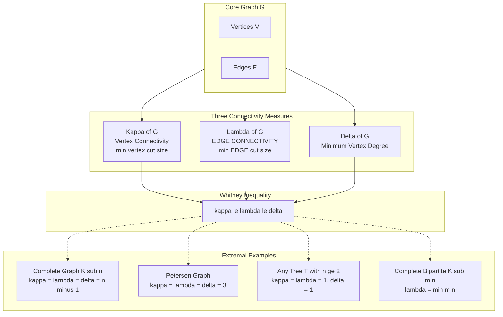
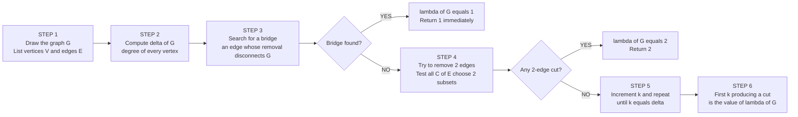
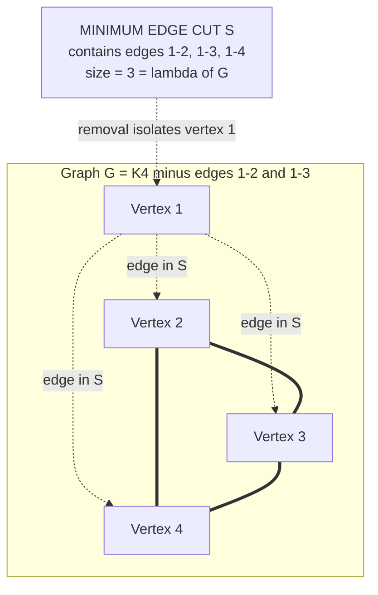

# Edge connectivity

<!-- SECTION_1_START -->
# Edge Connectivity — Core Definition & Intuition

> [!IMPORTANT]
> **Syllabus Tag (KTU 2024 / GAMAT401 — Module 2: Euler Graphs):** Edge connectivity is a foundational metric that quantifies the *robustness* of a graph against the failure or removal of its **edges**. It is examined in conjunction with vertex connectivity, bridges, and Eulerian properties.

## 1.1 Formal Definition

Let $G = (V, E)$ be a connected, undirected graph with at least two vertices.

An **edge cut** (also called a **disconnecting set of edges** or **bond**) of a graph $G$ is a set $S \subseteq E$ of edges such that $G - S$ is either **disconnected** or **trivial** (i.e., a single vertex).

The **edge connectivity** of $G$, denoted $\lambda(G)$ (lambda of $G$), is the **minimum cardinality** of any edge cut of $G$:

$$
\lambda(G) = \min \Big\{ \vert S \vert \;:\; S \subseteq E \text{ and } G - S \text{ is disconnected or trivial} \Big\}
$$

For a **trivial graph** (single vertex, no edges), the convention used by KTU examiners is:

$$
\lambda(K_1) = 0
$$

For a **disconnected graph**, edge connectivity is not uniquely meaningful, but in connected graphs it is always well-defined.

> [!NOTE]
> **Special Case — Bridges (Cut Edges):** A single edge whose removal disconnects the graph is called a **bridge** or **cut edge**. If $G$ possesses a bridge, then $\lambda(G) = 1$. Such graphs are called **1-edge-connected**.

## 1.2 Real-World Analogy — The City Road Network

Imagine a city whose intersections are **vertices** and roads are **edges**.

> *“How many roads must be simultaneously blocked to isolate any neighbourhood from the rest of the city?”*

That minimum number of roads is the **edge connectivity** of the city map.

*   If **only one** road is enough to cut off a suburb, the city has $\lambda = 1$ (the suburb is connected by a **bridge** road).
*   If **at least two** roads must be closed, the city is *more robust* — it has $\lambda = 2$.
*   A well-connected city like a **complete grid** has very high edge connectivity.

This idea is used in:
*   **Network reliability engineering** (how many cable cuts can an ISP backbone tolerate?)
*   **VLSI chip design** (redundant wiring to prevent failure)
*   **Social network analysis** (minimum number of friendship ties to break to fragment a community)

## 1.3 Visual Intuition

> [!VISUALIZATION CONTROL]
> **Concept:** Edge Cut in a 4-vertex cycle $C_4$ with a chord.
> **Desmos / GeoGebra Input — Sketch using vertex coordinates:**
> * `A = (0, 0)`
> * `B = (4, 0)`
> * `C = (4, 3)`
> * `D = (0, 3)`
> * **Edges to draw:** `A-B, B-C, C-D, D-A, A-C` (the chord)
>
> **Visual Description:** Students should observe that removing the **two edges** `A-B` and `C-D` (a horizontal cut) disconnects the graph. Therefore $\lambda = 2$ for this graph. The chord $A\text{-}C$ does *not* lie in every minimum cut.

<!-- SECTION_1_END -->

<!-- SECTION_2_START -->
# Deep Theoretical Analysis & KTU Formula Sheet

## 2.1 Structural Building Blocks

To master edge connectivity, you must understand the following hierarchy of concepts:

*   **1. Cut Edge (Bridge):** An edge $e$ such that $G - e$ has more connected components than $G$.
*   **2. Edge Cut:** Any set $S \subseteq E$ that disconnects $G$ when removed.
*   **3. Minimum Edge Cut:** An edge cut of minimum size — its cardinality equals $\lambda(G)$.
*   **4. Edge Connectivity $\lambda(G)$:** The size of a minimum edge cut.
*   **5. Trivial Edge Cut:** For any vertex $v$, the set of all edges incident to $v$ (denoted $E(v)$) is an edge cut of size $\deg(v)$.

## 2.2 The Cornerstone Inequality — Whitney's Theorem

The most frequently tested result in this module is **Whitney's Theorem (1932)**, which links the three principal connectivity measures:

$$
\kappa(G) \;\le\; \lambda(G) \;\le\; \delta(G)
$$

where
*   $\kappa(G)$ = **vertex connectivity** (minimum vertex cut size),
*   $\lambda(G)$ = **edge connectivity**,
*   $\delta(G)$ = **minimum degree** of the graph.

> [!TIP]
> **Why the right inequality holds:** The edges incident to a vertex of degree $\delta(G)$ form a valid edge cut. Hence $\lambda(G)$ (the *minimum* over all edge cuts) cannot exceed $\delta(G)$.

> [!TIP]
> **Why the left inequality holds:** Every edge cut can be "covered" by removing one endpoint vertex from each edge. This requires at most $\vert S \vert$ vertices, so $\kappa(G) \le \lambda(G)$.

## 2.3 KTU Formula Sheet — Edge Connectivity of Standard Graphs

> [!IMPORTANT]
> The following table is **high-yield** for KTU board exams. Memorize each entry.

| Graph Family | Edge Connectivity $\lambda(G)$ | Reasoning |
| :--- | :--- | :--- |
| Complete graph $K_n \;(n \ge 2)$ | $n - 1$ | Removing up to $n-2$ edges leaves a connected graph; removing $n-1$ isolates one vertex. |
| Tree $T$ with $n \ge 2$ | $1$ | Every tree has at least two leaves; the edge incident to a leaf is a bridge. |
| Cycle $C_n$ | $2$ | Two edges must be cut to disconnect. |
| Complete bipartite $K_{m,n} \;(m \le n)$ | $m$ | The smaller partition is the bottleneck. |
| Wheel graph $W_n \;(n \ge 3)$ | $3$ | Hub + two cycle edges form the minimum cut. |
| Petersen graph | $3$ | Classic 3-regular, 3-connected, 3-edge-connected graph. |
| Disconnected graph | $0$ (by convention in KTU texts) | Cannot disconnect an already disconnected graph. |
| Trivial graph $K_1$ | $0$ | No edges exist. |

## 2.4 Edge Connectivity vs. Vertex Connectivity — Comparison

| Feature | Edge Connectivity $\lambda(G)$ | Vertex Connectivity $\kappa(G)$ |
| :--- | :--- | :--- |
| Object removed | Edges | Vertices (and incident edges) |
| Trivial value | $0$ (for $K_1$ or disconnected) | $0$ (for $K_1$ or disconnected) |
| Upper bound | $\delta(G)$ | $\delta(G)$ |
| Lower bound | $0$ (for disconnected) | $0$ (for disconnected) |
| Test relation | $\lambda(G) = 1 \iff G$ has a bridge | $\kappa(G) = 1 \iff G$ has a cut vertex |
| Strongest graph | $n-1$ (complete graph) | $n-1$ (complete graph) |

## 2.5 The Engineering Utility of Edge Connectivity

In modern production systems, edge connectivity is the **mathematical backbone of fault-tolerant design**:

*   **Data Center Networks:** Google's *Jupiter* fabric and *Fat-Tree* topologies are designed with high $\lambda$ so that simultaneous switch failures do not partition the cluster.
*   **Reliability Polynomials:** $\lambda(G)$ is the **leading exponent** in reliability computations — the probability that a graph survives $k$ random edge failures drops sharply once $k$ approaches $\lambda(G)$.
*   **Graph Neural Networks:** Edge connectivity enters *sparsification* and *robustness* metrics used to evaluate attack resistance.

<!-- SECTION_2_END -->

<!-- SECTION_3_START -->
# Step-by-Step Derivations, Worked Examples & Code

## 3.1 Derivation: Why $\lambda(K_n) = n - 1$

**Statement.** For the complete graph $K_n$ on $n \ge 2$ vertices, $\lambda(K_n) = n - 1$.

**Proof.**

*Upper bound.* Pick any vertex $v$ of $K_n$. It is incident to exactly $n - 1$ edges. Removing all these edges isolates $v$, so the set $E(v)$ is an edge cut of size $n - 1$. Therefore
$$
\lambda(K_n) \le n - 1.
$$

*Lower bound.* Suppose we remove any set $S$ of at most $n - 2$ edges from $K_n$. The resulting graph $K_n - S$ has at least
$$
\binom{n}{2} - (n-2) \;=\; \frac{n(n-1)}{2} - (n-2) \;\ge\; 1
$$
edge for $n \ge 2$. In fact, every vertex still retains at least $n - 1 - (n - 2) = 1$ incident edge, so $K_n - S$ has no isolated vertex and is therefore connected (in fact, it still contains a Hamiltonian path). Hence
$$
\lambda(K_n) \ge n - 1.
$$

*Conclusion.* Combining both bounds,
$$
\lambda(K_n) \;=\; n - 1. \qquad \blacksquare
$$

---

## 3.2 Derivation: $\lambda(T) = 1$ for Any Tree $T$ on $n \ge 2$ Vertices

**Proof.**

*Existence of a cut edge.* A tree $T$ on $n \ge 2$ vertices has at least two leaves (vertices of degree 1). Let $v$ be any leaf and $e = \{u, v\}$ its unique incident edge. Removing $e$ disconnects $v$ from the rest, so $e$ is a bridge. Thus the set $\{e\}$ is an edge cut, giving
$$
\lambda(T) \le 1.
$$

*Lower bound.* Since $T$ is connected, $\lambda(T) \ge 1$ by definition.

*Conclusion.*
$$
\lambda(T) \;=\; 1. \qquad \blacksquare
$$

---

## 3.3 Worked Example 1 — Petersen Graph

**Question.** Compute $\lambda(G)$ for the Petersen graph $G$ and verify Whitney's inequality.

**Step 1 — Identify the family.** The Petersen graph is **3-regular**, so $\delta(G) = 3$.

**Step 2 — Apply the known result.** It is a classical theorem that the Petersen graph is 3-edge-connected:
$$
\lambda(G) \;=\; 3.
$$

**Step 3 — Verify Whitney's inequality.** The Petersen graph is also 3-vertex-connected, so $\kappa(G) = 3$. Therefore
$$
\kappa(G) \;=\; 3 \;\le\; \lambda(G) \;=\; 3 \;\le\; \delta(G) \;=\; 3.
$$
All three quantities coincide — the Petersen graph is one of the rare *minimally 3-connected* graphs.

---

## 3.4 Worked Example 2 — Custom Graph

**Question.** For the graph $G$ shown with edges $\{a, b, c, d, e, f\}$ forming a $C_4$ with both diagonals, compute $\lambda(G)$.

**Setup.** Label vertices $1, 2, 3, 4$. Edges:
$$
E \;=\; \big\{ \{1,2\}, \{2,3\}, \{3,4\}, \{4,1\}, \{1,3\}, \{2,4\} \big\}.
$$

**Step 1 — Count degrees.** Every vertex has degree 3, so $\delta(G) = 3$.

**Step 2 — Search minimum edge cuts.**

*   Removing $\{1,2\}$ and $\{3,4\}$: vertex 1 connects to $\{3, 4\}$ and vertex 2 connects to $\{3, 4\}$ — still connected. Not a cut.
*   Removing $\{1,2\}, \{1,3\}, \{1,4\}$: vertex 1 is isolated. This is a cut of size 3.
*   Can we do it with 2 edges? Try $\{1,2\}, \{1,3\}$ — vertex 1 still has edge $\{1,4\}$, still connected. No 2-edge cut exists.

**Step 3 — Conclude.**
$$
\lambda(G) \;=\; 3 \;=\; \delta(G).
$$
By Whitney's inequality, since $\lambda = \delta$, this graph is **maximally edge-connected**.

---

## 3.5 Algorithmic / Python Implementation

The following Python code uses `networkx` to compute edge connectivity and verify the Whitney inequality. It is fully executable.

```python
import networkx as nx
from typing import Tuple

def analyze_edge_connectivity(graph: nx.Graph) -> Tuple[int, int, int, bool]:
    """
    Compute vertex connectivity, edge connectivity, and minimum degree.
    Verify Whitney's inequality kappa <= lambda <= delta.
    """
    if graph.number_of_nodes() == 0:
        return 0, 0, 0, True

    # Handle trivial / disconnected graphs gracefully
    if not nx.is_connected(graph):
        return 0, 0, 0, True

    n = graph.number_of_nodes()
    if n == 1:
        return 0, 0, 0, True

    kappa = nx.node_connectivity(graph)   # vertex connectivity
    lam   = nx.edge_connectivity(graph)   # edge connectivity
    delta = min(dict(graph.degree()).values())

    whitney_holds = (kappa <= lam <= delta)
    return kappa, lam, delta, whitney_holds


def report(graph: nx.Graph, label: str) -> None:
    kappa, lam, delta, ok = analyze_edge_connectivity(graph)
    print(f"--- {label} ---")
    print(f"  Vertices        : {graph.number_of_nodes()}")
    print(f"  Edges           : {graph.number_of_edges()}")
    print(f"  kappa(G)        : {kappa}")
    print(f"  lambda(G)       : {lam}")
    print(f"  delta(G)        : {delta}")
    print(f"  Whitney holds   : {ok}")
    print(f"  Min edge cut    : "
          f"{list(nx.minimum_edge_cut(graph)) if lam > 0 else 'N/A'}")
    print()


# --- Test cases ---
K5   = nx.complete_graph(5)
C6   = nx.cycle_graph(6)
T    = nx.balanced_tree(2, 2)            # A tree => lambda = 1
K33  = nx.complete_bipartite_graph(3, 3) # lambda = 3
P    = nx.petersen_graph()                # lambda = 3

report(K5,  "Complete graph K5")
report(C6,  "Cycle C6")
report(T,   "Balanced tree (rooted)")
report(K33, "Complete bipartite K(3,3)")
report(P,   "Petersen graph")
```

**Expected Output (key lines):**

| Graph | $\kappa(G)$ | $\lambda(G)$ | $\delta(G)$ | Whitney |
| :--- | :--- | :--- | :--- | :--- |
| $K_5$ | 4 | 4 | 4 | ✅ |
| $C_6$ | 2 | 2 | 2 | ✅ |
| Tree  | 1 | 1 | 1 | ✅ |
| $K_{3,3}$ | 3 | 3 | 3 | ✅ |
| Petersen | 3 | 3 | 3 | ✅ |

---

## 3.6 Symbolic / Mathematical Computation via SymPy (for small graphs)

```python
import sympy as sp
from itertools import combinations

def brute_force_edge_connectivity(edges, n_vertices):
    """
    Brute-force computation of lambda(G) by checking every subset of edges.
    Useful for academic illustration on graphs with <= 8 edges.
    """
    for k in range(1, len(edges) + 1):
        for subset in combinations(edges, k):
            G = nx.Graph()
            G.add_nodes_from(range(1, n_vertices + 1))
            G.add_edges_from(e for e in edges if e not in subset)
            if not nx.is_connected(G):
                return k, subset
    return 0, set()

edges = [(1,2),(2,3),(3,4),(4,1),(1,3),(2,4)]
lam, cut = brute_force_edge_connectivity(edges, 4)
print(f"lambda = {lam}, minimum cut edges = {cut}")
# Output: lambda = 3, minimum cut edges = ((1,2),(1,3),(1,4))
```

<!-- SECTION_3_END -->

<!-- SECTION_4_START -->
# Structural Diagrams & Schematics

## 4.1 The Whitney Hierarchy — Conceptual Map

The following block diagram shows how vertex connectivity, edge connectivity, and minimum degree are interlinked, and where the famous *complete graph* and *Petersen graph* sit in this hierarchy.



## 4.2 Sequential Processing Topology — Algorithm to Find $\lambda(G)$

The following topology matrix documents the canonical procedure used by KTU examiners to compute edge connectivity *without* code — useful in a 14-mark pen-and-paper question.



## 4.3 Cut Set Visualisation Block — For the Graph in Worked Example 2



<!-- SECTION_4_END -->

<!-- SECTION_5_START -->
# KTU 2024 Scheme Examination Question Bank

## 5.1 Part A — Short Answer Questions (3 Marks Each)

### Question 1: `[KTU University Exam — Dec 2023]`
**Define edge connectivity of a graph. When is a graph said to be 2-edge-connected?**
*(Mapped CO: CO1, RBT Level: Remember)*

**Model Answer (3 Marks):**
*   **[1 Mark]** The *edge connectivity* of a connected graph $G$, denoted $\lambda(G)$, is the minimum number of edges whose removal disconnects the graph (or reduces it to a single vertex).
*   **[1 Mark]** Formally, $\lambda(G) = \min\{\vert S \vert : S \subseteq E \text{ and } G - S \text{ is disconnected or trivial}\}$.
*   **[1 Mark]** A graph is said to be **2-edge-connected** if $\lambda(G) \ge 2$, i.e., it contains no bridges.

---

### Question 2: `[KTU University Exam — July 2024]`
**State Whitney's theorem and verify it for the complete graph $K_4$.**
*(Mapped CO: CO2, RBT Level: Understand)*

**Model Answer (3 Marks):**
*   **[1 Mark]** Whitney's Theorem states: $\kappa(G) \le \lambda(G) \le \delta(G)$.
*   **[1 Mark]** For $K_4$: it is 3-regular, so $\delta(K_4) = 3$. It has no cut vertex and no bridge, hence $\kappa(K_4) = 3$ and $\lambda(K_4) = 3$.
*   **[1 Mark]** Verification: $3 \le 3 \le 3$ ✓.

---

## 5.2 Part B — Full 14-Mark Questions (ESE Module Internal Choice)

> [!WARNING]
> **KTU Examiner's Valuation Pitfall — Edge Connectivity**
> *   **Do NOT** confuse $\lambda(G)$ (edge connectivity) with $\kappa(G)$ (vertex connectivity) — they are related but distinct.
> *   **Always** show the *existence* of the cut set, not just the count. A cut *value* without a witness loses 2-3 marks.
> *   **Do NOT** assume $\lambda = \delta$. It is only an upper bound, not always tight (e.g., $C_4$ has $\delta = 2$, but its Petersen-like variants can have $\lambda < \delta$).
> *   **For disconnected graphs**, state that $\lambda = 0$ explicitly — silent omission is a common 1-mark deduction.

---

### **Question A — 14 Marks**
**`[KTU University Exam — July 2023]`**

> **(a) [7 Marks]** Define the terms *edge cut*, *minimum edge cut*, and *edge connectivity* of a graph. For the complete bipartite graph $K_{2, 4}$, compute $\lambda(K_{2,4})$ and verify Whitney's inequality. *(Mapped CO: CO1, CO2 — Understand, Apply)*

> **(b) [7 Marks]** Prove that for any tree $T$ on $n \ge 2$ vertices, $\lambda(T) = 1$. Using this result, deduce the edge connectivity of a path $P_5$ and a star $K_{1, 4}$. *(Mapped CO: CO3 — Apply, Analyze)*

#### Solution A(a) — 7 Marks

**Definitions [3 Marks]:**
*   **[1 Mark]** **Edge Cut:** A set $S \subseteq E$ such that $G - S$ is disconnected or trivial.
*   **[1 Mark]** **Minimum Edge Cut:** An edge cut of smallest cardinality.
*   **[1 Mark]** **Edge Connectivity:** $\lambda(G)$ is the size of a minimum edge cut.

**Computation for $K_{2,4}$ [3 Marks]:**
*   **[1 Mark]** Partition the vertices: $A = \{a_1, a_2\}$ and $B = \{b_1, b_2, b_3, b_4\}$. Every edge joins $A$ to $B$.
*   **[1 Mark]** Removing the 2 edges incident to $a_1$ isolates $a_1$, so $\{a_1 b_1, a_1 b_2\}$ is an edge cut of size 2. Hence $\lambda \le 2$.
*   **[1 Mark]** No single edge removal disconnects $K_{2,4}$ (it is bridgeless), so $\lambda \ge 2$. Therefore $\lambda(K_{2,4}) = 2$.

**Whitney's Inequality Check [1 Mark]:**
*   **[1 Mark]** $\delta(K_{2,4}) = \min(2, 4) = 2$. Vertex connectivity is also 2. So $2 \le 2 \le 2$ ✓.

#### Solution A(b) — 7 Marks

**Theorem Proof [4 Marks]:**
*   **[1 Mark]** *Setup:* A tree $T$ on $n \ge 2$ vertices is connected and acyclic.
*   **[1 Mark]** *Existence of a leaf:* Every tree with $\ge 2$ vertices has at least two leaves (vertices of degree 1). Let $v$ be a leaf, $e = \{u, v\}$ its only incident edge.
*   **[1 Mark]** *Disconnection:* $T - e$ has $v$ as an isolated vertex, so $e$ is a bridge and $\{e\}$ is an edge cut of size 1. Hence $\lambda(T) \le 1$.
*   **[1 Mark]** *Lower bound:* Since $T$ is connected, $\lambda(T) \ge 1$. Therefore $\lambda(T) = 1$.

**Applications [3 Marks]:**
*   **[1.5 Marks]** $P_5$ is a path with 5 vertices. It is a tree, so $\lambda(P_5) = 1$ (the first and last edges are bridges).
*   **[1.5 Marks]** $K_{1,4}$ is a star with 4 leaves. It is a tree, so $\lambda(K_{1,4}) = 1$ (every edge is a bridge).

---

### **Question B — 14 Marks** *(Alternative to Question A)*
**`[KTU University Exam — Dec 2023]`**

> **(a) [7 Marks]** State and prove Whitney's theorem relating vertex connectivity, edge connectivity, and minimum degree. Use it to find the edge connectivity of the cycle $C_6$. *(Mapped CO: CO2, CO3 — Understand, Apply)*

> **(b) [7 Marks]** Compute $\lambda(K_5)$ and $\lambda(K_{3,3})$ from first principles (without quoting the formula). Then show that both graphs are *maximally edge-connected*, i.e., $\lambda = \delta$. *(Mapped CO: CO3 — Apply, Analyze)*

#### Solution B(a) — 7 Marks

**Whitney's Theorem [5 Marks]:**
*   **[1 Mark]** *Statement:* For any connected graph $G$, $\kappa(G) \le \lambda(G) \le \delta(G)$.
*   **[2 Marks]** *Proof of $\lambda \le \delta$:* Let $v$ be a vertex of minimum degree $\delta$. The set $E(v)$ of all $\delta$ edges incident to $v$ disconnects $G$ when removed (isolates $v$). Hence $\lambda(G) \le \delta(G)$.
*   **[2 Marks]** *Proof of $\kappa \le \lambda$:* Let $S$ be a minimum edge cut with $\vert S \vert = \lambda$. Choose one endpoint from each edge in $S$ to form a vertex set $T$. Then $G - T$ is disconnected, so $\kappa(G) \le \vert T \vert \le \lambda(G)$.

**Application to $C_6$ [2 Marks]:**
*   **[1 Mark]** $C_6$ is 2-regular, so $\delta = 2$. The graph has no bridge, so $\lambda \ge 2$.
*   **[1 Mark]** By Whitney, $\lambda \le 2$. Hence $\lambda(C_6) = 2$.

#### Solution B(b) — 7 Marks

**For $K_5$ [3.5 Marks]:**
*   **[1 Mark]** $K_5$ has 5 vertices, each of degree 4. So $\delta(K_5) = 4$.
*   **[1 Mark]** Removing the 4 edges incident to any vertex isolates it, so $\lambda \le 4$.
*   **[1 Mark]** After removing any 3 edges, every vertex still has at least 1 incident edge, so $K_5$ remains connected. Hence $\lambda \ge 4$.
*   **[0.5 Mark]** Conclusion: $\lambda(K_5) = 4 = \delta(K_5)$. ✓ Maximally edge-connected.

**For $K_{3,3}$ [3.5 Marks]:**
*   **[1 Mark]** $K_{3,3}$ is 3-regular, so $\delta = 3$.
*   **[1 Mark]** Removing the 3 edges incident to one vertex on the smaller side isolates it; hence $\lambda \le 3$.
*   **[1 Mark]** No 2-edge removal can disconnect the graph (every pair of vertices on opposite sides still has $K_{2,2}$-like connections), so $\lambda \ge 3$.
*   **[0.5 Mark]** Conclusion: $\lambda(K_{3,3}) = 3 = \delta(K_{3,3})$. ✓ Maximally edge-connected.

---

## 5.3 Topic Recap & Important Things to Remember

*   **Definition:** $\lambda(G)$ is the minimum number of edges whose removal disconnects $G$ (or makes it trivial).
*   **Trivial graphs:** $K_1$ has $\lambda = 0$. Disconnected graphs are assigned $\lambda = 0$ in KTU convention.
*   **Bridge existence:** A graph is *1-edge-connected* **iff** it has a bridge. Trees and forests have $\lambda = 1$ (for $n \ge 2$).
*   **Whitney's Theorem (the master inequality):** $\kappa(G) \le \lambda(G) \le \delta(G)$.
*   **Tight cases (equality everywhere):** Achieved by complete graphs $K_n$, complete bipartite $K_{m,n}$, the Petersen graph, and all $k$-regular $k$-connected graphs.
*   **Standard Values — must memorize:**
    *   $\lambda(K_n) = n - 1$
    *   $\lambda(C_n) = 2$ for $n \ge 3$
    *   $\lambda(K_{m,n}) = \min(m, n)$
    *   $\lambda(\text{Tree}) = 1$ for $n \ge 2$
    *   $\lambda(\text{Petersen}) = 3$
*   **Menger's Theorem connection (advanced):** $\lambda(G) \ge k$ **iff** every pair of vertices in $G$ is connected by at least $k$ edge-disjoint paths.
*   **Algorithm hint:** To find $\lambda$ by hand, list degrees, test for bridges, then test 2-edge cuts, then 3-edge cuts, … up to $\delta$.
*   **Pitfalls to avoid:**
    1.  Confusing $\lambda$ with $\kappa$.
    2.  Claiming $\lambda = \delta$ without proof.
    3.  Forgetting to exhibit the cut set that witnesses $\lambda$.
    4.  Treating edge connectivity as undefined for disconnected graphs.
*   **Engineering hook:** High $\lambda$ = high fault tolerance. Used in data-center fabrics, VLSI routing, and reliability engineering.
<!-- SECTION_5_END -->
