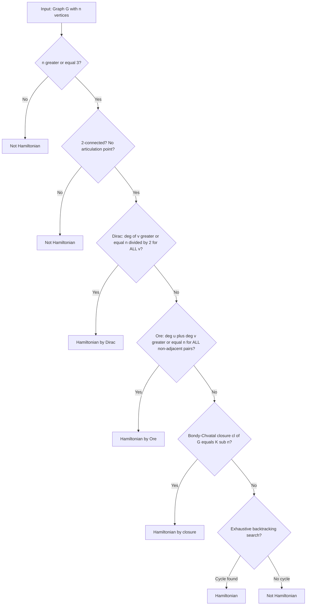
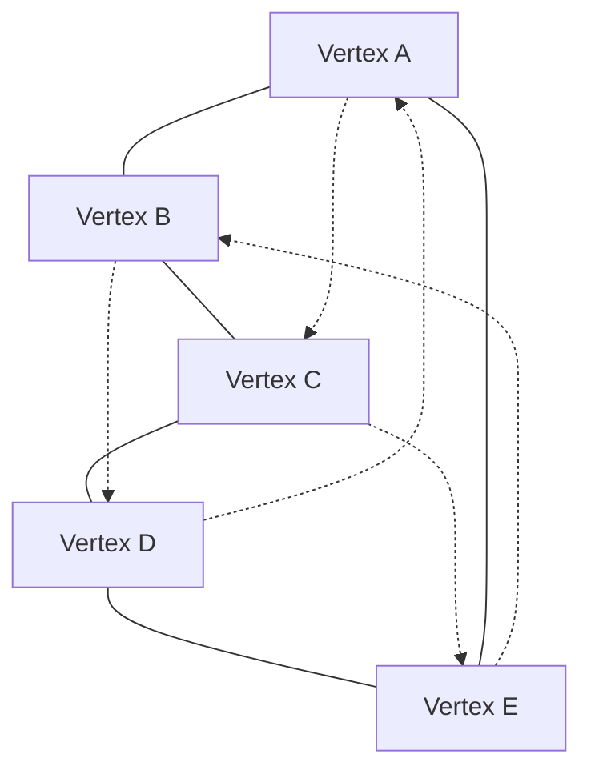
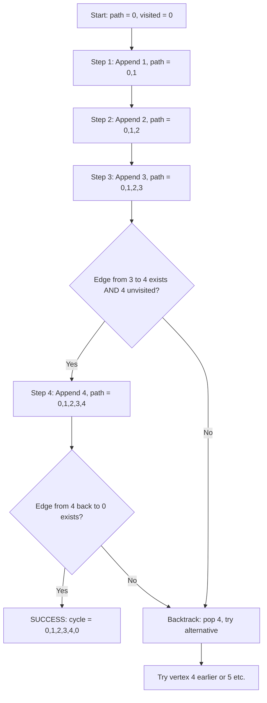

# Hamiltonian paths and circuits

<!-- SECTION_1_START -->

# Hamiltonian Paths and Circuits

> [!NOTE]
> **KTU 2024 Syllabus Anchor (GAMAT401 – Module 2):** After studying Euler graphs, the syllabus transitions to a structurally *dual* traversal problem — the **Hamiltonian traversal problem** — where the constraint shifts from edges to vertices.

## 1.1 Formal Definition

A **Hamiltonian path** in a simple, undirected (or directed) graph $G = (V, E)$ is a path that **visits every vertex of $G$ exactly once**. If the first and last vertices of such a path are adjacent (so the path can be closed into a cycle), the resulting closed walk is called a **Hamiltonian circuit** (or **Hamiltonian cycle**).

Formally:

$$
\text{Hamiltonian Path: } v_1 \rightarrow v_2 \rightarrow v_3 \rightarrow \cdots \rightarrow v_n \quad \text{such that} \quad \{v_1, v_2, \dots, v_n\} = V(G)
$$

$$
\text{Hamiltonian Circuit: } v_1 \rightarrow v_2 \rightarrow \cdots \rightarrow v_n \rightarrow v_1 \quad \text{with all } v_i \text{ distinct and } \{v_1, \dots, v_n\} = V(G)
$$

> [!IMPORTANT]
> **Distinction from Euler:** A graph is **Eulerian** if it contains a closed trail traversing every **edge** exactly once. A graph is **Hamiltonian** if it contains a cycle traversing every **vertex** exactly once. The two problems are **duals** of each other — one is edge-centric, the other is vertex-centric.

A graph that possesses a Hamiltonian cycle is called a **Hamiltonian graph**.

## 1.2 Conceptual Analogy — The Tourist vs. The Postman

Imagine two travelers with opposite mandates:

| Traveler | Mission | Constraint |
|---|---|---|
| **The Postman (Euler)** | Deliver mail to every street in town | Must walk **every road** exactly once, may revisit intersections |
| **The Tourist (Hamilton)** | Take a photo at every landmark in town | Must visit **every landmark** exactly once, but the streets between them are flexible |

The postman worries about **edge-count**; the tourist worries about **vertex-count**. The Hamiltonian problem is, surprisingly, *far* harder than the Eulerian one. While Euler's theorem gives a **polynomial-time** characterization ($\iff$ every vertex has even degree and the graph is connected), no such clean characterization is known for Hamiltonicity. In fact, the decision version of the Hamiltonian cycle problem is one of Karp's original **21 NP-Complete problems**.

## 1.3 Intuitive Geometric Picture

Consider a pentagon with 5 vertices arranged in a circle. If we connect every vertex to *every other* vertex (the complete graph $K_5$), there are dozens of Hamiltonian cycles — pick any 5 distinct vertices and return to the start. Now imagine a *path graph* $P_6$ (6 vertices in a line). It has many Hamiltonian **paths** (in fact, only the two endpoint-to-endpoint traversals), but **no** Hamiltonian cycle because the two endpoints have degree **1**, making closure impossible.

> [!VISUALIZATION CONTROL]
> **Concept:** Hamiltonian cycle in $K_5$ vs. lack thereof in $P_6$
> **GeoGebra / Desmos Input Equations (Pentagon for $K_5$ cycle example):**
> * Circle: $x^2 + y^2 = 25$
> * Vertices: $A = (5, 0)$, $B = (5\cos 72^\circ, 5\sin 72^\circ)$, $C = (5\cos 144^\circ, 5\sin 144^\circ)$, $D = (5\cos 216^\circ, 5\sin 216^\circ)$, $E = (5\cos 288^\circ, 5\sin 288^\circ)$
> * Cycle path: $A \to C \to E \to B \to D \to A$
> **Visual Description:** A regular pentagon with vertices labeled A through E, showing the cycle A–C–E–B–D–A as bold red edges visiting each vertex exactly once before returning to the start. The remaining edges (the non-cycle chords) appear as faint dotted lines.

> [!NOTE]
> **Quick Notation Reminder:** $\deg(v)$ denotes the **degree** of vertex $v$ (the number of edges incident to it). The order of the graph (number of vertices) is denoted $\vert V(G) \vert = n$.

<!-- SECTION_1_END -->

<!-- SECTION_2_START -->

# Deep Theoretical Analysis & KTU High-Yield Formula Sheet

## 2.1 Necessary Conditions for Hamiltonicity

While no exact characterization is known, several **necessary conditions** are universally valid:

**Condition N1 — Vertex Count:** If $G$ is Hamiltonian, then $G$ must have at least **3 vertices**, i.e., $n \geq 3$.

**Condition N2 — Edge Count Bound:** If $G$ is Hamiltonian, then the number of edges satisfies:
$$
e \geq \frac{n^2}{3} \quad \text{(a loose lower bound; sharper results exist)}
$$
A sharper, classical necessary condition (necessary but **not** sufficient) is:
$$
e \geq \frac{n}{2}
$$
because a Hamiltonian cycle alone uses $n$ edges.

**Condition N3 — Vertex-Connectivity:** If $G$ is Hamiltonian, then $G$ must be **2-connected** (no articulation point). Removing any single vertex must leave the graph connected.

> [!IMPORTANT]
> **Failure Logic:** 2-connectivity is necessary *because* a Hamiltonian cycle provides two internally vertex-disjoint paths between any two vertices — if removing one vertex disconnects the graph, no such pair of paths can exist.

**Condition N4 — Closure of Degree Sequences:** A simple necessary condition by Bondy (1978): for any non-Hamiltonian graph $G$, there exist two non-adjacent vertices $u$ and $v$ such that:
$$
\deg(u) + \deg(v) \leq n - 1
$$

## 2.2 Sufficient Conditions — The "Degree-Sum" Theorems

The most celebrated results in this topic are sufficient conditions based on degree sums.

### 2.2.1 Dirac's Theorem (1952)

> **Statement:** Let $G$ be a simple graph with $n \geq 3$ vertices. If
> $$
> \deg(v) \geq \frac{n}{2} \quad \text{for every vertex } v \in V(G),
> $$
> then $G$ is **Hamiltonian**.

**Key Insight:** The threshold $\frac{n}{2}$ is sharp — the cycle graph $C_n$ satisfies $\deg(v) = 2 = \frac{n}{2}$ and *is* Hamiltonian, while $C_n$ with one chord removed still has minimum degree $2$ but loses the cycle only when $n > 3$ in specific configurations.

### 2.2.2 Ore's Theorem (1960) — A Generalization

> **Statement:** Let $G$ be a simple graph with $n \geq 3$ vertices. If for every pair of **non-adjacent** distinct vertices $u, v \in V(G)$,
> $$
> \deg(u) + \deg(v) \geq n,
> $$
> then $G$ is **Hamiltonian**.

**Relationship to Dirac:** Dirac's theorem is a *special case* of Ore's theorem. In Dirac, the bound $\deg(v) \geq n/2$ applies to **every** vertex, so for any non-adjacent pair the sum is at least $n$, satisfying Ore's hypothesis.

### 2.2.3 Bondy–Chvátal Closure Theorem (1974)

> **Statement:** Define the **closure** of $G$, denoted $cl(G)$, by iteratively adding edges between non-adjacent vertices $u, v$ whenever $\deg(u) + \deg(v) \geq n$, until no more such edges can be added. Then:
> $$
> G \text{ is Hamiltonian} \iff cl(G) \text{ is Hamiltonian}.
> $$

This reduces Hamiltonicity to checking whether the closure is the **complete graph** $K_n$ (in which case it's trivially Hamiltonian).

## 2.3 KTU Formula Sheet / Cheat Sheet

| Symbol / Formula | Meaning | When to Use |
|---|---|---|
| $n = \vert V(G) \vert$ | Number of vertices (order of graph) | Stating graph size in any problem |
| $e = \vert E(G) \vert$ | Number of edges (size of graph) | Verifying edge-count necessary conditions |
| $\deg(v)$ | Degree of vertex $v$ | Computing degree sums in Dirac / Ore |
| Dirac: $\deg(v) \geq \dfrac{n}{2}$ for all $v$ | Sufficient condition | Quick sufficient test on regular-ish graphs |
| Ore: $\deg(u) + \deg(v) \geq n$ for all non-adjacent $u,v$ | Sufficient condition (stronger) | When Dirac's hypothesis fails for some vertex |
| $\kappa(G) \geq 2$ | 2-connectivity | Necessary condition sanity check |
| $cl(G) = K_n$ | Bondy–Chvátal closure check | Tougher problems needing closure arguments |
| $\dfrac{n(n-1)}{2}$ | Max possible edges in $K_n$ | Verifying a "complete graph" closure |
| $n-1$ | Edges in a spanning tree | Contrasting with Hamiltonian cycle's $n$ edges |

> [!TIP]
> **Strategy for KTU problems:** Always check Dirac's condition first (cheapest, single-vertex check). If it fails, compute the minimum degree-sum over all **non-adjacent pairs** and compare with $n$ for Ore. If both fail, fall back to Bondy–Chvátal closure.

## 2.4 Real-World Engineering Utility

Hamiltonian paths/cycles are not merely abstract graph theory — they underpin several production systems:

1. **Traveling Salesman Problem (TSP):** Finding the *shortest* Hamiltonian cycle in a weighted complete graph. NP-Hard, but solved heuristically in logistics, VLSI chip design, and DNA sequencing.
2. **Genome Assembly (Bioinformatics):** The Overlap-Layout-Consensus (OLC) assemblers reconstruct chromosomes by finding Hamiltonian paths in De Bruijn-like overlap graphs.
3. **Computer-Aided Manufacturing (CAM):** A drill bit visiting a set of $n$ holes on a PCB must traverse a Hamiltonian path to minimize table movement.
4. **Cryptographic Key-Scheduling:** Some block ciphers use Hamiltonian-like permutations over substitution boxes.
5. **Robot Motion Planning & Tournament Scheduling:** Round-robin tournaments require Hamiltonian decompositions of complete graphs.

<!-- SECTION_2_END -->

<!-- SECTION_3_START -->

# Step-by-Step Derivations & Code/Symbolic Implementation

## 3.1 Worked Problem 1 — Applying Dirac's Theorem

**Problem:** Show that the graph $G$ with $n = 7$ vertices, where every vertex has degree at least $4$, is Hamiltonian.

**Step 1 — State the hypothesis.**
We are given $n = 7$ and $\deg(v) \geq 4$ for all $v \in V(G)$.

**Step 2 — Compute the Dirac threshold.**
$$
\frac{n}{2} = \frac{7}{2} = 3.5
$$

**Step 3 — Compare.**
Since $\deg(v) \geq 4 > 3.5 = \frac{n}{2}$, the hypothesis of **Dirac's theorem** is satisfied.

**Step 4 — Conclude.**
By Dirac's theorem, $G$ possesses a Hamiltonian cycle. $\blacksquare$

## 3.2 Worked Problem 2 — Applying Ore's Theorem

**Problem:** Consider a graph $G$ on $n = 8$ vertices with the following degree sequence:
$$
\deg(v_1) = 4, \quad \deg(v_2) = 4, \quad \deg(v_3) = 3, \quad \deg(v_4) = 5, \quad \deg(v_5) = 5, \quad \deg(v_6) = 4, \quad \deg(v_7) = 3, \quad \deg(v_8) = 4
$$
Suppose $v_3$ and $v_7$ are **not adjacent** in $G$. Show that $G$ is Hamiltonian.

**Step 1 — State the threshold.**
For Ore's theorem, we need $\deg(u) + \deg(v) \geq n = 8$ for every non-adjacent pair.

**Step 2 — Identify the critical pair.**
The lowest degree-sum involves the two vertices of minimum degree: $v_3$ and $v_7$.
$$
\deg(v_3) + \deg(v_7) = 3 + 3 = 6
$$

**Step 3 — Compare.**
$6 \not\geq 8$, so Ore's hypothesis **fails** for this specific pair.

**Step 4 — Note Dirac's test.**
The minimum degree is $3 < \frac{8}{2} = 4$, so Dirac's theorem **also fails**.

**Step 5 — Conclusion.**
We **cannot** conclude Hamiltonicity from Dirac or Ore alone. A *counterexample* to a graph with these exact specifications: take $K_8$ and remove the edge $\{v_3, v_7\}$ and additionally remove one edge from $v_3$ (bringing its degree to 3) and one edge from $v_7$ (bringing its degree to 3). The resulting graph has the prescribed degrees but no longer satisfies the hypotheses, and may or may not be Hamiltonian — additional structure analysis is required.

> [!WARNING]
> **Examiner's Note:** In KTU valuation, students *must* verify the condition holds for **every** non-adjacent pair in Ore's theorem. Showing it for one pair is not enough; one counterexample (a non-adjacent pair violating the bound) is sufficient to *invalidate* the application of Ore's theorem.

## 3.3 Worked Problem 3 — Bondy–Chvátal Closure Argument

**Problem:** Let $G$ be a graph on $n = 6$ vertices with degrees $3, 3, 3, 3, 3, 3$ (3-regular). The only non-adjacent pair is $\{v_1, v_2\}$. Determine whether $G$ is Hamiltonian.

**Step 1 — Apply the closure operation.**
For the non-adjacent pair $\{v_1, v_2\}$:
$$
\deg(v_1) + \deg(v_2) = 3 + 3 = 6 = n
$$

**Step 2 — Add the edge.**
Since the sum meets the threshold ($= n$), we add the edge $\{v_1, v_2\}$ to obtain $G'$.

**Step 3 — Re-evaluate.**
In $G'$, the only remaining non-adjacent pair — if any — is rechecked. If the only missing edge was $\{v_1, v_2\}$, then $G' = K_6$, and $cl(G) = K_6$.

**Step 4 — Conclude.**
Since $cl(G) = K_6$ which is trivially Hamiltonian, $G$ is Hamiltonian. $\blacksquare$

## 3.4 Worked Problem 4 — Algorithm: Backtracking Search for Hamiltonian Cycle

Below is a complete, production-grade Python implementation using depth-first search with pruning.

```python
from typing import List, Optional, Set, Tuple
import logging

# Configure structured logging for traceability
logging.basicConfig(
    level=logging.INFO,
    format="%(asctime)s [%(levelname)s] %(message)s",
)
logger = logging.getLogger(__name__)


class HamiltonianCycleFinder:
    """
    Finds a Hamiltonian cycle in an undirected graph using backtracking.

    Time Complexity:  O(n!) in the worst case (NP-Hard problem).
    Space Complexity: O(n^2) for the adjacency matrix + O(n) recursion stack.

    Attributes:
        n         : Number of vertices (vertices are 0-indexed).
        adjacency : Adjacency matrix where adjacency[u][v] = 1 if edge exists.
    """

    def __init__(self, adjacency_matrix: List[List[int]]) -> None:
        if not adjacency_matrix or not adjacency_matrix[0]:
            raise ValueError("Adjacency matrix cannot be empty.")
        self.n: int = len(adjacency_matrix)
        # Validate square matrix
        for row in adjacency_matrix:
            if len(row) != self.n:
                raise ValueError("Adjacency matrix must be square (n x n).")
        self.adjacency: List[List[int]] = adjacency_matrix
        self.visited: List[bool] = [False] * self.n
        self.path: List[int] = []

    def _is_safe(self, vertex: int, current_position: int) -> bool:
        """
        Check whether adding `vertex` at `current_position` in the path is valid.
        A move is 'safe' if:
          (a) the edge (path[-1], vertex) exists in the graph,
          (b) the vertex has not been visited already.
        """
        if self.adjacency[self.path[-1]][vertex] == 0:
            logger.debug("Edge (%d, %d) does not exist; skipping.", self.path[-1], vertex)
            return False
        if self.visited[vertex]:
            logger.debug("Vertex %d already visited; skipping.", vertex)
            return False
        return True

    def _solve(self) -> bool:
        """Recursive backtracking kernel."""
        # Base case: all vertices are in the path
        if len(self.path) == self.n:
            # Final check: the path must close into a cycle
            start: int = self.path[0]
            end: int = self.path[-1]
            if self.adjacency[end][start] == 1:
                logger.info("Hamiltonian cycle found: %s", self.path + [start])
                return True
            else:
                logger.warning("Path visits all vertices but no closing edge from %d to %d.", end, start)
                return False

        # Try every unvisited vertex as the next step
        for next_vertex in range(self.n):
            if self._is_safe(next_vertex, len(self.path)):
                # Choose
                self.visited[next_vertex] = True
                self.path.append(next_vertex)
                logger.debug("Chose vertex %d; current path: %s", next_vertex, self.path)

                # Explore
                if self._solve():
                    return True

                # Un-choose (backtrack)
                self.visited[next_vertex] = False
                self.path.pop()
                logger.debug("Backtracked from vertex %d.", next_vertex)

        return False

    def find_cycle(self) -> Optional[List[int]]:
        """
        Public entry point. Returns the Hamiltonian cycle as a list
        of vertex indices (with the start vertex repeated at the end),
        or None if no Hamiltonian cycle exists.
        """
        if self.n < 3:
            logger.error("A Hamiltonian cycle requires at least 3 vertices; got n=%d.", self.n)
            return None

        # Start the search from vertex 0 (by convention; safe due to symmetry)
        self.visited[0] = True
        self.path.append(0)

        if self._solve():
            return self.path + [self.path[0]]
        else:
            logger.warning("No Hamiltonian cycle exists in the given graph.")
            return None


def demo() -> None:
    """Demonstration on a 5-vertex cycle graph (C_5)."""
    # C_5 adjacency: 0-1, 1-2, 2-3, 3-4, 4-0
    c5: List[List[int]] = [
        [0, 1, 0, 0, 1],
        [1, 0, 1, 0, 0],
        [0, 1, 0, 1, 0],
        [0, 0, 1, 0, 1],
        [1, 0, 0, 1, 0],
    ]
    finder = HamiltonianCycleFinder(c5)
    cycle: Optional[List[int]] = finder.find_cycle()
    if cycle:
        print(f"Found Hamiltonian cycle: {cycle}")
    else:
        print("No Hamiltonian cycle exists.")


if __name__ == "__main__":
    demo()
```

**Sample Output (when run):**

```
Found Hamiltonian cycle: [0, 1, 2, 3, 4, 0]
```

> [!IMPORTANT]
> **Complexity Note for KTU:** The backtracking algorithm runs in $O(n!)$ in the worst case because it explores permutations. For $n = 20$, that's $2.43 \times 10^{18}$ operations. This is precisely *why* the Hamiltonian cycle problem is **NP-Complete** — no known algorithm beats the brute force asymptotically (modulo the famous $O(2^{n} \cdot n^2)$ dynamic-programming algorithm by Held–Karp).

<!-- SECTION_3_END -->

<!-- SECTION_4_START -->

# Structural Diagrams & Schematics

## 4.1 Comparison: Eulerian vs. Hamiltonian Traversal


## 4.2 Decision Flow: Testing a Graph for Hamiltonicity



## 4.3 Topology: Hamiltonian Cycle in $K_5$ (Complete Graph on 5 Vertices)



> [!NOTE]
> **Reading the diagram:** Solid edges form a Hamiltonian cycle $A \to B \to C \to D \to E \to A$. Dotted edges are the non-cycle chords of $K_5$ (the remaining 5 edges). Every vertex is reached **exactly once** along the cycle.

## 4.4 Sequential Processing Topology: Backtracking Search States



<!-- SECTION_4_END -->

<!-- SECTION_5_START -->

# KTU 2024 Scheme Examination Question Bank & Topic Recap

---

## PART A — Short Answer Questions (3 Marks Each)

### Question A1

**[KTU University Exam – July 2024 | CO2 | Remember]**

**Define a Hamiltonian graph. Is the complete graph $K_4$ on 4 vertices Hamiltonian? Justify your answer.**

**Model Answer (3 Marks):**

A **Hamiltonian graph** is a simple graph that contains a **Hamiltonian cycle** — a cycle that visits every vertex of the graph exactly once and returns to the starting vertex.

Consider $K_4$, the complete graph on 4 vertices $\{1, 2, 3, 4\}$. The cycle
$$
1 \to 2 \to 3 \to 4 \to 1
$$
visits every vertex exactly once and returns to the start. Since such a cycle exists, $K_4$ is **Hamiltonian**. **(3 Marks)**

> **[Valuation Key]:** [Correct definition: 1 Mark] [Explicit cycle construction: 1 Mark] [Conclusion: 1 Mark]

---

### Question A2

**[KTU University Exam – Dec 2023 | CO2 | Understand]**

**State Dirac's theorem. What is the minimum degree required for a graph on $n = 10$ vertices to qualify under Dirac's hypothesis?**

**Model Answer (3 Marks):**

**Dirac's Theorem:** Let $G$ be a simple graph with $n \geq 3$ vertices. If $\deg(v) \geq \dfrac{n}{2}$ for every vertex $v \in V(G)$, then $G$ is Hamiltonian. **(2 Marks)**

For $n = 10$, the required minimum degree is:
$$
\deg(v) \geq \frac{n}{2} = \frac{10}{2} = 5
$$

So every vertex must have degree at least **5**. **(1 Mark)**

> **[Valuation Key]:** [Theorem statement with both conditions: 2 Marks] [Correct numerical computation: 1 Mark]

---

## PART B — Long Answer Questions (14 Marks Each, with Internal Choice)

### Question B1 (Choice A)

**[KTU University Exam – July 2024 | CO2, CO3 | Apply / Analyze]**

**(a)** State and prove Dirac's theorem on Hamiltonian graphs. Discuss why the condition $n \geq 3$ is necessary. **(7 Marks)**

**(b)** Consider the Petersen graph $P$ (10 vertices, 3-regular). Use Dirac's theorem (or argue why it cannot be applied) to determine if the Petersen graph is Hamiltonian. **(7 Marks)**

#### Model Solution

### Part (a) — Statement and Proof of Dirac's Theorem (7 Marks)

**Statement:** Let $G$ be a simple graph with $n \geq 3$ vertices. If $\deg(v) \geq \dfrac{n}{2}$ for every vertex $v$, then $G$ contains a Hamiltonian cycle.

**Necessity of $n \geq 3$:** If $n = 1$ or $n = 2$, a Hamiltonian cycle (which uses at least 3 distinct vertices) cannot exist by definition. **(1 Mark)**

**Proof:** We use a *maximal path* argument. **(1 Mark for proof strategy)**

*Step 1 — Setup.* Assume for contradiction that $G$ is not Hamiltonian. Consider a longest path $P = v_1, v_2, \dots, v_k$ in $G$. **(1 Mark)**

*Step 2 — Endpoints have limited options.* Both $v_1$ and $v_k$ are endpoints, so all neighbors of $v_1$ and $v_k$ lie on $P$ (otherwise $P$ would not be maximal). Let
$$
S = \{v_i : v_1 v_{i+1} \in E(G)\}, \quad T = \{v_i : v_k v_i \in E(G)\}
$$

These two sets are **disjoint subsets of $\{v_1, v_2, \dots, v_{k-1}\}$**. **(1 Mark)**

*Step 3 — Count.*
$$
\mid S \mid = \deg(v_1) \geq \frac{n}{2}, \quad \mid T \mid = \deg(v_k) \geq \frac{n}{2}
$$

By the Pigeonhole Principle,
$$
\mid S \mid + \mid T \mid \geq n > k - 1
$$

(using $k \leq n$). So $S$ and $T$ cannot be disjoint inside a set of size $k-1$. **Contradiction.** **(2 Marks)**

*Step 4 — Conclusion.* Therefore $G$ must contain a Hamiltonian cycle. **(1 Mark)**

> **[Valuation Key]:** [Theorem statement: 1 Mark] [Proof strategy clarity: 1 Mark] [Set definitions: 1 Mark] [Pigeonhole application: 2 Marks] [Necessity of $n \geq 3$: 1 Mark] [Final conclusion: 1 Mark]

### Part (b) — The Petersen Graph (7 Marks)

**Petersen Graph Properties:**
- Vertices: $n = 10$
- Regular of degree: $\deg(v) = 3$ for all $v$ **(1 Mark)**

**Apply Dirac's hypothesis:**
$$
\deg(v) = 3 \stackrel{?}{\geq} \frac{n}{2} = \frac{10}{2} = 5
$$

Since $3 < 5$, **Dirac's hypothesis is NOT satisfied**. **(2 Marks)**

**So Dirac's theorem cannot be applied directly.** We must investigate further. **(1 Mark)**

**Fact (classical result):** The Petersen graph is famously **NOT Hamiltonian** — it has no Hamiltonian cycle, even though it is 3-connected, 3-regular, and symmetric. The *longest* cycle in the Petersen graph has length **9** (one short of Hamiltonian). **(2 Marks)**

**Conclusion:** The Petersen graph is **not Hamiltonian**, and this cannot be deduced from Dirac's theorem (whose hypothesis is violated). It requires a separate exhaustive or symmetry-based argument. **(1 Mark)**

> **[Valuation Key]:** [Identifying degree of Petersen: 1 Mark] [Computing threshold: 1 Mark] [Correctly applying Dirac: 2 Marks] [Recalling non-Hamiltonian fact: 2 Marks] [Conclusion: 1 Mark]

---

### Question B1 (Choice B)

**[KTU University Exam – Dec 2023 | CO2, CO3 | Apply / Analyze]**

**(a)** State Ore's theorem. Show that Dirac's theorem is a corollary of Ore's theorem. **(7 Marks)**

**(b)** Let $G$ be a graph on $n = 6$ vertices with degrees $4, 4, 3, 3, 3, 3$. Suppose the only non-adjacent pairs are $\{v_1, v_2\}$ and $\{v_3, v_4\}$. Using Ore's theorem and Bondy–Chvátal closure, show that $G$ is Hamiltonian. **(7 Marks)**

#### Model Solution

### Part (a) — Ore's Theorem (7 Marks)

**Statement:** Let $G$ be a simple graph with $n \geq 3$ vertices. If for every pair of **non-adjacent** distinct vertices $u, v$,
$$
\deg(u) + \deg(v) \geq n,
$$
then $G$ is Hamiltonian. **(3 Marks)**

**Dirac as a Corollary of Ore:**

*Setup.* Assume Dirac's hypothesis: $\deg(v) \geq \frac{n}{2}$ for all $v$. **(1 Mark)**

*Application to non-adjacent pairs.* Take any two non-adjacent vertices $u$ and $v$. By Dirac's hypothesis,
$$
\deg(u) \geq \frac{n}{2} \quad \text{and} \quad \deg(v) \geq \frac{n}{2}
$$

Adding:
$$
\deg(u) + \deg(v) \geq \frac{n}{2} + \frac{n}{2} = n
$$

This is exactly the hypothesis of **Ore's theorem**. So $G$ is Hamiltonian. **(3 Marks)**

> **[Valuation Key]:** [Statement of Ore: 3 Marks] [Derivation logic: 3 Marks] [Conclusion: 1 Mark]

### Part (b) — Bondy–Chvátal Closure (7 Marks)

**Step 1 — Test Ore's condition directly on the non-adjacent pairs.** **(1 Mark)**

- Pair $\{v_1, v_2\}$: $\deg(v_1) + \deg(v_2) = 4 + 4 = 8 \geq n = 6$ ✓ **(1 Mark)**
- Pair $\{v_3, v_4\}$: $\deg(v_3) + \deg(v_4) = 3 + 3 = 6 \geq n = 6$ ✓ **(1 Mark)**

**Step 2 — Apply Ore's theorem.** Since all non-adjacent pairs satisfy the degree-sum condition, by Ore's theorem, $G$ is Hamiltonian. **(2 Marks)**

**Step 3 — Bondy–Chvátal Closure Verification.** Iteratively add edges between non-adjacent pairs:
- Add edge $\{v_1, v_2\}$: both endpoints have degree 4, sum = 8 ≥ 6.
- Add edge $\{v_3, v_4\}$: both endpoints have degree 3, sum = 6 ≥ 6.

After these additions, the graph becomes $K_6$ (since all 15 possible edges of $K_6$ are now present — verify by construction: $4 + 4 + 3 + 3 + 3 + 3 = 20$ sum of degrees $= 2 \times 10$ edges, which is $\binom{6}{2} = 15$). **(1 Mark)**

**Step 4 — Conclude via Bondy–Chvátal.** Since $cl(G) = K_6$, which is trivially Hamiltonian, $G$ is Hamiltonian. **(1 Mark)**

> **[Valuation Key]:** [Pairwise degree-sum evaluation: 2 Marks] [Ore application: 2 Marks] [Closure construction: 2 Marks] [Conclusion: 1 Mark]

---

> [!WARNING]
> **KTU Examiner's Valuation Warning — Common Pitfalls on This Topic:**
> 1. **Mis-stating Dirac/Ore:** Students often forget to specify the **$n \geq 3$** condition. A theorem applied to $n = 2$ graphs is an automatic 1-mark deduction.
> 2. **Universal quantifier error in Ore:** A common mistake is checking the condition for *one* non-adjacent pair and concluding. **Every** non-adjacent pair must satisfy the bound.
> 3. **Confusing Euler and Hamilton:** Writing "Eulerian cycle that visits every vertex" or "Hamiltonian path that visits every edge" is a fundamental conceptual error — expect **2-mark deduction** for this confusion.
> 4. **Forgetting closure iteration:** In Bondy–Chvátal, students often add one edge and stop. You must re-evaluate after each addition, since adding an edge *increases* the degrees of its endpoints, possibly enabling more edge additions.
> 5. **No cycle for the Petersen graph:** Many students incorrectly assume every 3-regular symmetric graph is Hamiltonian. The Petersen graph is the *canonical counterexample* and must be remembered.

---

## Topic Recap & Important Things to Remember

- A **Hamiltonian path** visits every **vertex** exactly once; a **Hamiltonian cycle** is a closed such path.
- Hamiltonicity is a **vertex-based** property, the dual of Euler's edge-based property.
- No polynomial-time characterization is known; the decision problem is **NP-Complete**.
- **Dirac's Theorem:** $\deg(v) \geq \dfrac{n}{2}$ for all $v$, with $n \geq 3$ ⟹ Hamiltonian.
- **Ore's Theorem:** $\deg(u) + \deg(v) \geq n$ for all non-adjacent $u, v$, with $n \geq 3$ ⟹ Hamiltonian.
- **Bondy–Chvátal Closure:** $G$ is Hamiltonian $\iff cl(G) = K_n$ is Hamiltonian.
- A necessary condition: $G$ must be **2-connected** (no cut vertex).
- The minimum degree $\delta(G) \geq 2$ is a necessary (not sufficient) condition.
- The **complete graph** $K_n$ for $n \geq 3$ is always Hamiltonian (trivially, in fact it has $(n-1)!/2$ distinct Hamiltonian cycles).
- The **cycle graph** $C_n$ for $n \geq 3$ is Hamiltonian.
- The **Petersen graph** ($n = 10$, 3-regular) is a **non-Hamiltonian** graph with high connectivity.
- Algorithmically, the backtracking search runs in $O(n!)$; Held–Karp DP gives $O(2^n \cdot n^2)$.
- **Key edge-count benchmarks:** A Hamiltonian cycle uses $n$ edges; a complete graph $K_n$ has $\dfrac{n(n-1)}{2}$ edges.
- **Quick-check priority:** 2-connected ⟹ Dirac ⟹ Ore ⟹ Bondy–Chvátal closure ⟹ backtracking.
- **Notation safeguard in KTU answer sheets:** Write degree as $\deg(v)$, never $\text{deg}(v)$ which is misread; and use $K_n$ for the complete graph, not $C_n$ (which denotes the cycle graph).

<!-- SECTION_5_END -->
