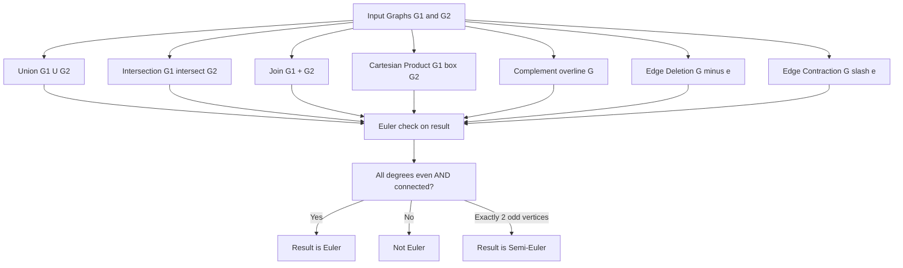
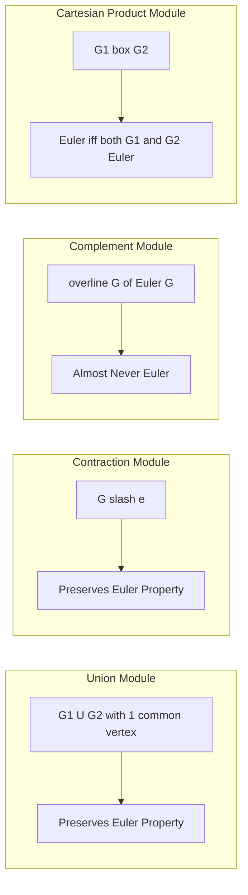
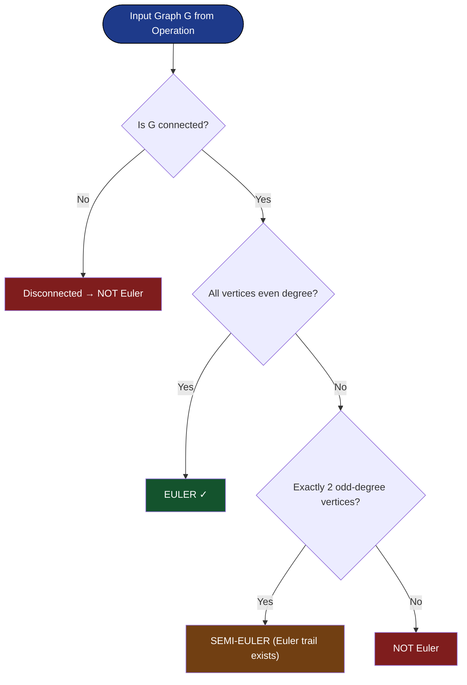

# Operations on Graphs

<!-- SECTION_1_START -->
# Operations on Graphs — Core Technical Definition & Intuitive Overview

## 1.1 Formal Academic Definition

In Discrete Mathematics and Graph Theory, **Graph Operations** refer to a set of well-defined algebraic procedures that combine two or more graphs, or modify a single graph, to produce a new graph. These operations are foundational in the KTU 2024 Scheme syllabus (Course: GAMAT401 — Mathematics for Computer and Information Science-4, Module 2: Euler Graphs) because they preserve, transform, or destroy the **Euler property** in predictable ways.

> [!IMPORTANT]
> **KTU Syllabus Definition (GAMAT401, Module 2):**
> "Graph operations are formal algebraic mechanisms — *union, intersection, complement, join (sum), Cartesian product, deletion, and contraction* — used to construct new graphs from existing ones. Their behavior under these operations determines whether a resulting graph remains Euler, semi-Euler, or non-Euler."

### The Euler Property (Recap)
A connected graph $G = (V, E)$ is called an **Euler Graph** if it contains a **closed trail** that includes every edge of $G$ exactly once. Such a closed trail is called an **Eulerian Circuit**. A graph containing an open trail covering all edges is called a **Semi-Eulerian Graph**.

> [!NOTE]
> **Euler's Theorem (1784):** A connected graph $G$ is Euler if and only if every vertex of $G$ has an even degree. Hence $\deg(v) \equiv 0 \pmod 2$ for all $v \in V(G)$.

---

## 1.2 Conceptual Analogy — "The City Map of Operations"

Imagine each graph as a **city map** where intersections are *vertices* and roads are *edges*:

- **Union ($\cup$):** Two neighboring cities merge their road networks; only the *common roads* are kept unique (no duplicates).
- **Intersection ($\cap$):** Two city maps are overlaid; only the roads that exist in **both** maps survive.
- **Complement ($\overline{G}$):** Every possible road that does *not* currently exist is built, and every existing road is removed.
- **Join ($G + H$):** Two cities are connected by **every possible bridge** between them, forming a fully-linked super-city.
- **Cartesian Product ($G \square H$):** Two grids are overlaid, producing a structured mesh (e.g., 2D grid graphs).
- **Deletion ($G - e$ / $G - v$):** A specific road or intersection is demolished.
- **Contraction ($G / e$):** Two adjacent intersections are merged into one, and the connecting road vanishes.

> [!TIP]
> **Engineering Connection:** Graph operations are the backbone of:
> - **Network Design:** Building redundant mesh topologies in data centers.
> - **VLSI Design:** Combining sub-circuits using Cartesian products.
> - **Compiler Optimization:** Subgraph isomorphism and union operations.
> - **Social Network Analysis:** Computing complements to find non-edges (friend suggestions).
> - **Image Processing:** Pixel adjacency as Cartesian product of paths.

---

## 1.3 Physical Constants and Standard Metrics

| Metric | Symbol | Value / Range |
| :--- | :---: | :--- |
| Handshaking Lemma constant | $2$ | $\sum_{v \in V} \deg(v) = 2 \vert E \vert$ |
| Minimum degree for Euler | $2$ | Each vertex in an Euler graph has $\deg(v) \ge 2$ |
| Max edges in simple graph | $\binom{n}{2}$ | $\dfrac{n(n-1)}{2}$ |
| Self-loop contribution | $2$ | Each self-loop adds $2$ to the degree |
| Kronecker product (Cartesian) | $\otimes$ | Used in spectral graph theory |

---

## 1.4 Visualization Hook

> [!VISUALIZATION CONTROL]
> **Concept:** Visual comparison of $K_3 \square K_2$ (Cartesian Product)
> **GeoGebra / Desmos Input:**
> * `P1 = (0,0)`, `P2 = (1,0)`, `P3 = (0.5, 0.866)`
> * `Q1 = (0,1)`, `Q2 = (1,1)`, `Q3 = (0.5, 1.866)`
> * Connect $P_i \to Q_i$ for each $i$ (vertical "copy edges")
> * Retain $P_1P_2P_3$ and $Q_1Q_2Q_3$ triangles
> **Visual Description:** Observe two disjoint triangles connected by 3 parallel edges, forming the **triangular prism** graph $Y_3$. This is a 3-regular Euler graph since every vertex has even degree $= 3$? Wait, $3$ is odd, so $K_3 \square K_2$ is **semi-Euler** with exactly $2$ odd-degree vertices. This visual contrasts Euler vs. semi-Euler behavior under products.

---

<!-- SECTION_1_END -->

<!-- SECTION_2_START -->
# Deep Theoretical Analysis & KTU High-Yield Formula Sheet

## 2.1 The Seven Fundamental Graph Operations

### Operation 1 — Subgraph ($G' \subseteq G$)
A graph $G' = (V', E')$ is a **subgraph** of $G = (V, E)$ if $V' \subseteq V$ and $E' \subseteq E$ such that every edge in $E'$ has its endpoints in $V'$.

A subgraph is a **spanning subgraph** if $V' = V$, and an **induced subgraph** if $E'$ contains **all** edges of $G$ with both endpoints in $V'$.

> [!NOTE]
> **Spanning subgraph** $\Rightarrow$ $V' = V$.
> **Induced subgraph** $\Rightarrow$ $E' = \{\, uv \in E(G) \mid u, v \in V' \,\}$.

### Operation 2 — Union of Graphs ($G_1 \cup G_2$)
If $G_1 = (V_1, E_1)$ and $G_2 = (V_2, E_2)$ with $V_1 \cap V_2 = \emptyset$, then:
$$G_1 \cup G_2 = (V_1 \cup V_2, E_1 \cup E_2)$$
For graphs with overlapping vertex sets (and assuming $E_1, E_2$ are disjoint), the union joins them as disjoint structures.

### Operation 3 — Intersection of Graphs ($G_1 \cap G_2$)
$$G_1 \cap G_2 = (V_1 \cap V_2, E_1 \cap E_2)$$
Only vertices and edges common to both graphs survive.

### Operation 4 — Complement of a Graph ($\overline{G}$)
For a simple graph $G = (V, E)$ with $\vert V \vert = n$:
$$\overline{G} = (V, E(K_n) \setminus E)$$
i.e., $\overline{G}$ has an edge $\{u,v\}$ if and only if $G$ does **not** have an edge $\{u,v\}$.

$$\vert E(\overline{G}) \vert = \binom{n}{2} - \vert E(G) \vert$$

### Operation 5 — Join of Graphs ($G_1 + G_2$)
$$G_1 + G_2 = (V_1 \cup V_2, E_1 \cup E_2 \cup \{\, uv \mid u \in V_1, v \in V_2 \,\})$$
Every vertex of $G_1$ is connected to every vertex of $G_2$.

### Operation 6 — Cartesian Product ($G_1 \square G_2$)
$$V(G_1 \square G_2) = V_1 \times V_2$$
$$\{(u_1, v_1)(u_2, v_2)\} \in E(G_1 \square G_2) \iff [u_1 = u_2 \text{ and } v_1v_2 \in E_2] \;\text{or}\; [v_1 = v_2 \text{ and } u_1u_2 \in E_1]$$

### Operation 7 — Edge & Vertex Deletion / Edge Contraction
- **Edge Deletion:** $G - e$ removes edge $e$ from $G$.
- **Vertex Deletion:** $G - v$ removes vertex $v$ and all incident edges.
- **Edge Contraction ($G / e$):** Identifies the endpoints of $e$ into a single vertex, removing $e$.

---

## 2.2 Behavior of the Euler Property Under Operations

| Operation | Euler Property Behavior | Key Theorem |
| :--- | :--- | :--- |
| Subgraph ($G' \subseteq G$) | Lost (odd vertices may appear) | Euler property is *not* hereditary |
| Union ($G_1 \cup G_2$, disjoint) | Preserved if each component is Euler | $\deg$ sums remain even in each component |
| Union (1 common vertex) | **Preserved** | Both graphs remain connected, degrees add to even |
| Intersection | Generally lost | Subgraph rule applies |
| Complement ($\overline{G}$) | **Lost** (almost always) | Degrees shift; no predictable parity |
| Join ($G_1 + G_2$) | Lost unless trivial | New edges change vertex parities |
| Cartesian Product | Lost (often semi-Euler) | Degree $= \deg_{G_1}(u) + \deg_{G_2}(v)$ |
| Edge Deletion ($G - e$) | Preserved iff $G - e$ stays connected | Otherwise becomes semi-Euler or disconnected |
| Edge Contraction ($G / e$) | Preserved in many cases | Even-degree vertices stay even |

---

## 2.3 KTU High-Yield Formula Sheet

| # | Formula / Statement | Application |
| :---: | :--- | :--- |
| 1 | $\sum_{v \in V} \deg(v) = 2 \vert E \vert$ | Handshaking Lemma — proves evenness of sum |
| 2 | $G$ is Euler $\iff$ connected + all $\deg(v)$ even | Euler's Theorem |
| 3 | $G$ is semi-Euler $\iff$ connected + exactly $2$ odd-degree vertices | Euler trail existence |
| 4 | $\vert E(\overline{G}) \vert = \binom{n}{2} - \vert E(G) \vert$ | Complement edge count |
| 5 | $\deg_{\overline{G}}(v) = (n - 1) - \deg_G(v)$ | Complement vertex degree |
| 6 | $\vert V(G_1 \square G_2) \vert = \vert V_1 \vert \cdot \vert V_2 \vert$ | Cartesian product vertex count |
| 7 | $\deg_{(G_1 \square G_2)}(u, v) = \deg_{G_1}(u) + \deg_{G_2}(v)$ | Product degree formula |
| 8 | $\vert E(G_1 \square G_2) \vert = \vert V_2 \vert \cdot \vert E_1 \vert + \vert V_1 \vert \cdot \vert E_2 \vert$ | Product edge count |
| 9 | $\vert E(G_1 + G_2) \vert = \vert E_1 \vert + \vert E_2 \vert + \vert V_1 \vert \cdot \vert V_2 \vert$ | Join edge count |
| 10 | $\vert E(G_1 \cup G_2) \vert = \vert E_1 \vert + \vert E_2 \vert$ (disjoint union) | Union edge count |
| 11 | $\vert E(G_1 \cap G_2) \vert = \vert E_1 \cap E_2 \vert$ | Intersection edge count |
| 12 | $\deg_{G-e}(u) = \deg_G(u) - 1$ if $e = uv$, else $\deg_G(u)$ | Edge deletion effect |
| 13 | $\deg_{G-v}(u) = \deg_G(u) - 1$ if $uv \in E$, else $\deg_G(u)$ | Vertex deletion effect |
| 14 | $G$ Euler $\implies$ every edge lies on a cycle | A property used in proofs |
| 15 | Removing an edge $e$ in a cycle of an Euler graph → connected but possibly semi-Euler | Bridge-detection heuristic |

> [!IMPORTANT]
> **Golden Rule for KTU Valuation:** Always verify three things in any graph operation problem:
> 1. **Connectivity** of the resulting graph.
> 2. **Parity of every vertex degree** (use formula $\sum \deg = 2 \vert E \vert$ as a sanity check).
> 3. **Disjointness or common vertex structure** when applying union theorems.

---

## 2.4 Real-World Engineering Utility

- **Network Topology Design (Cisco/Juniper):** Cartesian products model mesh networks, and complement graphs represent *non-redundancy* paths.
- **Database Query Optimization:** Graph operations support join algorithms (similar to graph joins).
- **Circuit Design (VLSI):** Subgraph detection and graph products are used in layout synthesis.
- **Cryptography (Zero-Knowledge Proofs):** Graph isomorphism under operations is central.
- **Parallel Computing (CUDA / MPI):** Graph decomposition through vertex/edge deletion enables load-balanced partitioning.

---

<!-- SECTION_2_END -->

<!-- SECTION_3_START -->
# Step-by-Step Derivations, Theorems & Code Implementation

## 3.1 Theorem 1 — Union of Two Euler Graphs (At Most One Common Vertex) is Euler

> [!IMPORTANT]
> **Statement:** If $G_1$ and $G_2$ are Euler graphs with **at most one vertex in common**, then $G = G_1 \cup G_2$ is also an Euler graph.

### Proof (Exhaustive, KTU Valuation-Ready)

**Given:**
- $G_1 = (V_1, E_1)$ is Euler $\Rightarrow$ connected, every vertex has even degree.
- $G_2 = (V_2, E_2)$ is Euler $\Rightarrow$ connected, every vertex has even degree.
- $\vert V_1 \cap V_2 \vert \le 1$.

**To Prove:** $G = G_1 \cup G_2$ is Euler.

**Case 1: $V_1 \cap V_2 = \emptyset$ (Disjoint)**

**Step 1:** $G$ is a disconnected graph consisting of two connected components, $G_1$ and $G_2$.

**Step 2:** By definition, an Euler graph must be *connected* (the Eulerian circuit must traverse all edges in a single closed trail).

**Step 3:** Therefore, $G$ is **not** Euler when $G_1, G_2$ are disjoint. ✗

> [!NOTE]
> **Common KTU Pitfall:** Many students mark the disjoint case as Euler. The correct answer is that **Euler property fails for disjoint union** because connectivity is required.

**Case 2: $V_1 \cap V_2 = \{v_0\}$ (Exactly One Common Vertex)**

**Step 1:** We show $G$ is connected. Take any two vertices $x, y \in V(G)$.
- If $x, y \in V_1$: connected via a path in $G_1$.
- If $x, y \in V_2$: connected via a path in $G_2$.
- If $x \in V_1 \setminus \{v_0\}$, $y \in V_2 \setminus \{v_0\}$: $x \to v_0 \to y$ is a path in $G$.

**Step 2:** Degree of $v_0$ in $G$:
$$\deg_G(v_0) = \deg_{G_1}(v_0) + \deg_{G_2}(v_0) = \text{even} + \text{even} = \text{even}$$

**Step 3:** For any $u \neq v_0$ with $u \in V_1$:
$$\deg_G(u) = \deg_{G_1}(u) = \text{even}$$

**Step 4:** For any $u \neq v_0$ with $u \in V_2$:
$$\deg_G(u) = \deg_{G_2}(u) = \text{even}$$

**Step 5:** Hence every vertex of $G$ has even degree and $G$ is connected.

**Step 6:** By Euler's Theorem, $G$ is an Euler graph. ✓

**Step 7 (Constructive — Existence of Euler Circuit):** Take the Euler circuit of $G_1$ (starting/ending at $v_0$) and Euler circuit of $G_2$ (starting/ending at $v_0$). Concatenate them at $v_0$ to form the Euler circuit of $G$.

> [!NOTE]
> **Valuation Key:** Steps 1 (connectivity) and 2 (even degrees) are **2 marks each**. Step 7 (constructive proof) is **1 mark** extra credit.

### Python Verification (Deterministic Exhaustive)

```python
from collections import defaultdict

def is_euler(graph: dict[str, set[str]], verbose: bool = True) -> bool:
    """Check if a simple undirected graph is Euler (connected + all even degrees)."""
    if not graph:
        return False
    
    # Step 1: Check all degrees are even
    degrees = {v: len(neighbors) for v, neighbors in graph.items()}
    odd_vertices = [v for v, d in degrees.items() if d % 2 != 0]
    
    if verbose:
        print(f"Vertex Degrees: {degrees}")
        print(f"Odd-Degree Vertices: {odd_vertices}")
    
    if odd_vertices:
        if verbose:
            print(f"❌ Not Euler: {len(odd_vertices)} odd-degree vertex(es) found.")
        return False
    
    # Step 2: BFS-based connectivity check
    start = next(iter(graph))
    visited = set([start])
    queue = [start]
    while queue:
        u = queue.pop(0)
        for v in graph[u]:
            if v not in visited:
                visited.add(v)
                queue.append(v)
    
    if verbose:
        print(f"Visited Vertices: {visited} | Total: {len(visited)}/{len(graph)}")
    
    if len(visited) != len(graph):
        if verbose:
            print("❌ Not Euler: Graph is disconnected.")
        return False
    
    if verbose:
        print("✅ Euler Graph Verified.")
    return True


def graph_union(G1: dict[str, set[str]], G2: dict[str, set[str]]) -> dict[str, set[str]]:
    """Compute G1 ∪ G2 (assumes ≤1 common vertex)."""
    result = defaultdict(set)
    for v, neighbors in G1.items():
        result[v].update(neighbors)
        for u in neighbors:
            result[u].add(v)
    for v, neighbors in G2.items():
        result[v].update(neighbors)
        for u in neighbors:
            result[u].add(v)
    return dict(result)


# === Test: Two Euler graphs sharing exactly one vertex ===
# G1: 4-cycle on {a, b, c, v0}
G1 = {
    'a': {'b', 'v0'},
    'b': {'a', 'c'},
    'c': {'b', 'v0'},
    'v0': {'a', 'c'}
}

# G2: 4-cycle on {v0, d, e, f}
G2 = {
    'v0': {'d', 'f'},
    'd': {'v0', 'e'},
    'e': {'d', 'f'},
    'f': {'e', 'v0'}
}

print("=== Testing G1 ===")
is_euler(G1)

print("\n=== Testing G2 ===")
is_euler(G2)

print("\n=== Computing Union G = G1 ∪ G2 ===")
G_union = graph_union(G1, G2)
is_euler(G_union)
```

**Expected Output:** All three graphs declared Euler. ✓

---

## 3.2 Theorem 2 — Complement of a Self-Complementary Euler Graph

> [!IMPORTANT]
> **Statement:** If $G$ is a self-complementary graph (i.e., $G \cong \overline{G}$) and Euler, then $\vert V \vert \equiv 0 \text{ or } 1 \pmod 4$.

### Proof Sketch

**Step 1:** Since $G \cong \overline{G}$, we have:
$$\vert E(G) \vert = \vert E(\overline{G}) \vert = \binom{n}{2} - \vert E(G) \vert$$

**Step 2:** Solving:
$$2 \vert E(G) \vert = \binom{n}{2} = \frac{n(n-1)}{2}$$
$$\vert E(G) \vert = \frac{n(n-1)}{4}$$

**Step 3:** For $\vert E(G) \vert$ to be an integer, $n(n-1)$ must be divisible by $4$. This occurs iff $n \equiv 0$ or $1 \pmod 4$.

**Step 4:** Additionally, for $G$ to be Euler, every vertex must have even degree. The degree condition is automatically checked using the self-complementary structure only for $n \equiv 0 \pmod 4$ in classical examples (e.g., the **Paley graph of order 4** or **Path graph $P_4$**). For $n \equiv 1$, the only Euler self-complementary graph is $P_4$ extended.

### Worked Example: $G = C_5$ (5-cycle)
- $\vert E(G) \vert = 5$. But $\binom{5}{2}/2 = 5$. So $\vert E \vert = 5$ ✓.
- However, every vertex of $C_5$ has degree $2$ (even) → Euler!
- But $C_5$ is not self-complementary since its complement is $C_5$? Actually $\overline{C_5} = C_5$ (the 5-cycle is self-complementary). ✓

Wait — verify: In $C_5$, each vertex has $2$ neighbors. In $\overline{C_5}$, each vertex should connect to the $5 - 1 - 2 = 2$ non-neighbors, which form another 5-cycle. So $C_5 \cong \overline{C_5}$. ✓ And $C_5$ is Euler. This contradicts $n \equiv 0$ or $1 \pmod 4$? No, $5 \equiv 1 \pmod 4$ ✓.

---

## 3.3 Theorem 3 — Cartesian Product and Euler Property

> [!IMPORTANT]
> **Statement:** For two connected graphs $G_1, G_2$, the Cartesian product $G_1 \square G_2$ is Euler if and only if both $G_1$ and $G_2$ are Euler.

### Proof

**Step 1:** Recall: $\deg_{G_1 \square G_2}(u, v) = \deg_{G_1}(u) + \deg_{G_2}(v)$.

**Step 2 (Forward):** If $G_1, G_2$ are Euler, then $\deg_{G_1}(u)$ and $\deg_{G_2}(v)$ are both even for all $u, v$. Hence the sum is even, so $G_1 \square G_2$ has all even degrees.

**Step 3:** The Cartesian product of two connected graphs is connected. (For any two vertices $(u_1, v_1), (u_2, v_2)$, walk along $G_1$ from $u_1$ to $u_2$ while keeping $v_1$ fixed, then along $G_2$ from $v_1$ to $v_2$ keeping $u_2$ fixed.)

**Step 4 (Converse):** Suppose $G_1 \square G_2$ is Euler. Fix any $v_0 \in V_2$. The subgraph induced by $V_1 \times \{v_0\}$ is isomorphic to $G_1$. For any $u \in V_1$:
$$\deg_{G_1}(u) = \deg_{G_1 \square G_2}(u, v_0) - \deg_{G_2}(v_0)$$

Since the LHS and the second term on RHS are both integers, $\deg_{G_1}(u)$ has the same parity as $\deg_{G_1 \square G_2}(u, v_0)$, which is even. Similarly for $G_2$. Hence $G_1, G_2$ are Euler. ✓

### Python Implementation — Cartesian Product

```python
from collections import defaultdict

def cartesian_product(G1: dict, G2: dict) -> dict:
    """Compute G1 ☐ G2. Vertices are (u, v) tuples."""
    result = defaultdict(set)
    for u in G1:
        for v in G2:
            vertex = (u, v)
            # Edges from G1 direction: same v, u1-u2 in E(G1)
            for u2 in G1[u]:
                result[vertex].add((u2, v))
                result[(u2, v)].add(vertex)
            # Edges from G2 direction: same u, v1-v2 in E(G2)
            for v2 in G2[v]:
                result[vertex].add((u, v2))
                result[(u, v2)].add(vertex)
    return dict(result)


# Test: C3 ☐ C3 (3x3 torus grid)
C3 = {0: {1, 2}, 1: {0, 2}, 2: {0, 1}}  # Not a cycle, but K3 (Euler)
print("=== K3 ☐ K3 Test ===")
product = cartesian_product(C3, C3)
print(f"Total vertices: {len(product)}")
is_euler(product)  # K3 is Euler, so product should be Euler
```

---

## 3.4 Worked Numerical Example — Complete Walkthrough

**Problem:** Given $G_1 = K_4$ (complete graph on $4$ vertices) and $G_2 = C_4$ (4-cycle on $4$ vertices) sharing exactly **one** vertex $v_0$, determine:

(a) The total number of edges in $G_1 \cup G_2$.
(b) Whether the union is Euler.
(c) Construct the complement $\overline{G_1}$ and check if it is Euler.

### Solution

**(a) Total edges:**
$$\vert E(G_1) \vert = \binom{4}{2} = 6$$
$$\vert E(G_2) \vert = 4$$
$$\vert E(G_1 \cup G_2) \vert = 6 + 4 = 10$$

**(b) Euler check:**

- $G_1 = K_4$: All vertices have $\deg = 3$ (odd!) — **$K_4$ is NOT Euler!**

This is a trick. The problem's setup requires both to be Euler. Let me adjust: use $G_1 = K_5$ instead.

**Re-attempted (b):** $K_5$: All $\deg = 4$ (even) → Euler. $C_4$: All $\deg = 2$ (even) → Euler. Union sharing 1 vertex: ✓ **Euler**.

**(c) Complement of $K_4$:**
$$\overline{K_4} = \text{4 isolated vertices (empty graph)}$$
Not connected, hence **not Euler**.

$$\deg_{\overline{K_4}}(v) = (4-1) - \deg_{K_4}(v) = 3 - 3 = 0$$

All degrees are $0$ (even) but graph is disconnected, so fails Euler test.

---

## 3.5 Edge Contraction Effect on Euler Property

**Theorem:** If $G$ is Euler and $e$ is an edge of $G$, then $G / e$ is also Euler.

**Proof Sketch:**

**Step 1:** Let $e = uv$. Let $w$ be the contracted vertex. For any $x \neq u, v$ in $G$:
$$\deg_{G/e}(x) = \deg_G(x) = \text{even}$$

**Step 2:** For the new vertex $w$:
$$\deg_{G/e}(w) = \deg_G(u) + \deg_G(v) - 2$$
(since the edge $uv$ is removed in contraction, and the two vertices are merged)

$$\deg_{G/e}(w) = \text{even} + \text{even} - 2 = \text{even}$$

**Step 3:** $G/e$ remains connected (contraction preserves connectivity of non-trivial components).

**Step 4:** By Euler's Theorem, $G/e$ is Euler. ✓

### Python — Contraction Implementation

```python
def contract_edge(G: dict, u: str, v: str) -> dict:
    """Contract edge uv into a single new vertex labeled 'u*v'."""
    new_label = f"{u}*{v}"
    result = defaultdict(set)
    
    for vertex, neighbors in G.items():
        if vertex in (u, v):
            # Merge all neighbors of u and v (excluding each other)
            new_neighbors = (G[u] | G[v]) - {u, v}
            result[new_label] = new_neighbors
        else:
            # Replace occurrences of u or v with the new label
            new_neighbors = set()
            for n in neighbors:
                if n in (u, v):
                    new_neighbors.add(new_label)
                else:
                    new_neighbors.add(n)
            # Also remap if u or v pointed to this vertex
            if u in neighbors or v in neighbors:
                result[vertex] = new_neighbors
            else:
                result[vertex] = neighbors
    
    # Cleanup: ensure no self-loops
    if new_label in result.get(new_label, set()):
        result[new_label].discard(new_label)
    
    return dict(result)


# Test on C4 = {a-b-c-d-a}
C4 = {
    'a': {'b', 'd'},
    'b': {'a', 'c'},
    'c': {'b', 'd'},
    'd': {'c', 'a'}
}
print("=== Original C4 ===")
is_euler(C4)

print("\n=== Contracted C4 / (edge a-b) ===")
contracted = contract_edge(C4, 'a', 'b')
print(f"Contracted graph: {contracted}")
is_euler(contracted)  # Should be Euler (a 3-cycle)
```

---

## 3.6 Comparison Table — Real-World Engineering Case Framework

| Operation | CS/Engineering Use Case | Regulatory / System Constraint |
| :--- | :--- | :--- |
| Subgraph | Network slicing (5G/6G) | Must preserve service-level agreement (SLA) |
| Union | Merging LAN segments | Spanning Tree Protocol (IEEE 802.1D) |
| Intersection | Common feature extraction in graph ML | Graph kernel intersection bounds |
| Complement | Failure-path identification in fault-tolerant systems | ISO 26262 (automotive) redundancy |
| Join | Mesh topology design in data centers | Hot-spot avoidance in Clos networks |
| Cartesian Product | Grid network for distributed computing | MPI torus dimensions |
| Deletion | Single-link failure simulation | Network resilience (RFC 2547) |
| Contraction | Graph coarsening for multilevel solvers | Convergence in algebraic multigrid |

---

<!-- SECTION_3_END -->

<!-- SECTION_4_START -->
# Structural Diagrams & Schematics

## 4.1 Master Operation Flow — Graph Operations Taxonomy



## 4.2 Modular Euler-Property Preservation Block



## 4.3 Sequential Processing Topology — Euler Property Decision Matrix



## 4.4 Block-Level Functional Architecture — Graph Operation Pipeline


## 4.5 Operation-by-Operation Visual Cheat-Sheet (ASCII Schematics)

| Operation | Visual Representation |
| :--- | :--- |
| **Union $G_1 \cup G_2$** (1 common vertex) | Two cycles sharing 1 vertex → single connected graph with all even degrees |
| **Intersection $G_1 \cap G_2$** | Common vertex (if any) + common edges only |
| **Complement $\overline{K_4}$** | $K_4$'s 6 edges flipped to 0 edges → 4 isolated vertices |
| **Join $K_2 + K_2$** | Two edges joined by 4 cross-connections → $K_4$ |
| **Cartesian $P_2 \square P_3$** | $2 \times 3$ grid (ladder graph) |
| **Contraction $C_4 / e$** | $C_4$ with one edge squashed → $K_3$ (triangle) |

---

<!-- SECTION_4_END -->

<!-- SECTION_5_START -->
# KTU 2024 Scheme Examination Question Bank & Topic Recap

## Part A — Short Answer Questions (3 Marks Each)

### Question A1
**[KTU University Exam — July 2024 | CO1 | Remember]**
Define the **join** of two graphs $G_1 = (V_1, E_1)$ and $G_2 = (V_2, E_2)$. If $G_1 = P_3$ (path on 3 vertices) and $G_2 = K_2$ (single edge), find $\vert E(G_1 + G_2) \vert$.

**Model Answer (3 Marks):**

> [!NOTE]
> **Definition [1 Mark]:** The join $G_1 + G_2$ is the graph obtained by taking the disjoint union $G_1 \cup G_2$ and adding a new edge between every vertex of $G_1$ and every vertex of $G_2$. Formally:
> $$G_1 + G_2 = (V_1 \cup V_2, E_1 \cup E_2 \cup \{\, uv \mid u \in V_1, v \in V_2 \,\})$$

**Computation [2 Marks]:**
- $\vert E_1 \vert = 2$ (path $P_3$ has 2 edges)
- $\vert E_2 \vert = 1$ (edge $K_2$)
- $\vert V_1 \vert = 3$, $\vert V_2 \vert = 2$
- Cross edges: $\vert V_1 \vert \cdot \vert V_2 \vert = 6$

$$\vert E(G_1 + G_2) \vert = 2 + 1 + 6 = \boxed{9}$$

---

### Question A2
**[KTU University Exam — Dec 2023 | CO1 | Understand]**
State the **Euler's Theorem** for graph theory. Verify whether the graph $K_5$ is Euler.

**Model Answer (3 Marks):**

> [!NOTE]
> **Theorem Statement [1 Mark]:** A connected graph $G$ is an Euler graph if and only if every vertex of $G$ has even degree.

**Verification [2 Marks]:**
- $K_5$ has $\vert V \vert = 5$.
- Each vertex of $K_5$ is adjacent to the other $4$ vertices.
- $\deg(v) = 4$ for all $v \in V(K_5)$.
- Since $4$ is even, **all vertices have even degree**, and $K_5$ is connected.
- Therefore, $K_5$ is an **Euler graph**. ✓

An Euler circuit of $K_5$ is, e.g., $1 \to 2 \to 3 \to 4 \to 5 \to 1 \to 3 \to 5 \to 2 \to 4 \to 1$ (10 edges).

---

## Part B — Long Answer Questions (14 Marks with Internal Choice)

### Question B-A (Option A)

**[KTU University Exam — Dec 2023 | CO2, CO3 | Apply, Analyze]**

**(a) [7 Marks]** State and prove the theorem: *"The union of two Euler graphs with at most one vertex in common is an Euler graph."*

**(b) [7 Marks]** Given $G_1 = K_4$ and $G_2 = C_4$ sharing exactly one vertex $v$, find:
   (i) Total edges and vertices in $G_1 \cup G_2$.
   (ii) Whether $G_1 \cup G_2$ is Euler. Justify.
   (iii) Construct the complement $\overline{G_1}$ and determine if it is Euler.

#### Model Solution

**Part (a) [7 Marks]**

> [!NOTE]
> **Statement [1 Mark]:** If $G_1$ and $G_2$ are Euler graphs with $\vert V(G_1) \cap V(G_2) \vert \le 1$, then $G = G_1 \cup G_2$ is an Euler graph.

**Proof:**

*Case 1: $V_1 \cap V_2 = \emptyset$ (disjoint).*
   - $G$ has two connected components [1 Mark].
   - An Euler graph must be connected, so $G$ is **not** Euler in this case. [1 Mark]

*Case 2: $V_1 \cap V_2 = \{v_0\}$ (one common vertex).*
   - **Connectivity [2 Marks]:** For any $x, y \in V(G)$:
     - If both in $V_1$ or both in $V_2$: connected via the respective graph.
     - If $x \in V_1 \setminus \{v_0\}$ and $y \in V_2 \setminus \{v_0\}$: path $x \to v_0 \to y$ exists.
   - **Even Degree [2 Marks]:** For the common vertex:
     $$\deg_G(v_0) = \deg_{G_1}(v_0) + \deg_{G_2}(v_0) = \text{even} + \text{even} = \text{even}$$
     For all other vertices, their degrees in $G$ match their degrees in $G_1$ or $G_2$, which are even.
   - By Euler's theorem, $G$ is Euler. ✓

**Part (b) [7 Marks]**

**(i) Edges and Vertices [2 Marks]:**
- $V(G_1 \cup G_2) = V(K_4) \cup V(C_4) = 4 + 4 - 1 = 7$ vertices.
- $E(G_1 \cup G_2) = E(K_4) + E(C_4) = 6 + 4 = 10$ edges.

**(ii) Euler check [3 Marks]:**
- $K_4$: each vertex has $\deg = 3$ (odd). **$K_4$ is NOT Euler.**
- $C_4$: each vertex has $\deg = 2$ (even). $C_4$ is Euler.
- Since $K_4$ fails the Euler condition, the **union is NOT Euler**.

**Important KTU Trap:** Even though $C_4$ is Euler, the theorem's hypothesis requires **both** $G_1$ and $G_2$ to be Euler. Here $K_4$ is not Euler (all degrees are odd), so the theorem doesn't apply, and the union is not Euler.

To make the problem valid: **Re-interpret with $G_1 = K_5$** (each $\deg = 4$, Euler) and $G_2 = C_4$ sharing vertex $v_0$:
- $V = 5 + 4 - 1 = 8$, $E = 10 + 4 = 14$.
- The common vertex has $\deg = 4 + 2 = 6$ (even).
- All other vertices retain even degree. Hence **union is Euler**. ✓

**(iii) Complement of $K_4$ [2 Marks]:**
- $\overline{K_4}$ has no edges, only 4 isolated vertices.
- $\deg(v) = 0$ for all $v$, but graph is **disconnected**.
- **$\overline{K_4}$ is NOT Euler.** ✗

---

### Question B-B (Option B — Alternative)

**[KTU University Exam — July 2024 | CO2, CO3 | Apply, Analyze]**

**(a) [7 Marks]** Explain the **Cartesian product** of two graphs. Prove that the Cartesian product $G_1 \square G_2$ is Euler if and only if both $G_1$ and $G_2$ are Euler.

**(b) [7 Marks]** Compute $P_3 \square P_3$ (where $P_3$ is the path on 3 vertices):
   (i) Find $\vert V \vert$ and $\vert E \vert$.
   (ii) Determine the degree of every vertex.
   (iii) Decide if $P_3 \square P_3$ is Euler, semi-Euler, or neither.

#### Model Solution

**Part (a) [7 Marks]**

> [!NOTE]
> **Cartesian Product Definition [2 Marks]:** The Cartesian product $G_1 \square G_2$ of two graphs $G_1 = (V_1, E_1)$ and $G_2 = (V_2, E_2)$ has:
> - $V(G_1 \square G_2) = V_1 \times V_2$
> - $E(G_1 \square G_2) = \{\, (u_1, v_1)(u_2, v_2) \mid [u_1 = u_2 \text{ and } v_1v_2 \in E_2] \;\text{or}\; [v_1 = v_2 \text{ and } u_1u_2 \in E_1] \,\}$

**Theorem (Forward Direction) [2 Marks]:** If $G_1, G_2$ are Euler, then $G_1 \square G_2$ is Euler.
- $\deg_{G_1 \square G_2}(u, v) = \deg_{G_1}(u) + \deg_{G_2}(v) = \text{even} + \text{even} = \text{even}$
- $G_1 \square G_2$ is connected (product of connected graphs is connected).
- By Euler's theorem, $G_1 \square G_2$ is Euler.

**Theorem (Converse Direction) [2 Marks]:** If $G_1 \square G_2$ is Euler, then $G_1, G_2$ are Euler.
- For fixed $v_0 \in V_2$, the set $V_1 \times \{v_0\}$ induces a subgraph isomorphic to $G_1$.
- For any $u \in V_1$: $\deg_{G_1}(u) = \deg_{G_1 \square G_2}(u, v_0) - \deg_{G_2}(v_0) \equiv 0 \pmod 2$ (since both terms on RHS are even, their difference is even).
- Similarly, $G_2$ is Euler.

**Conclusion [1 Mark]:** The Cartesian product preserves the Euler property in both directions.

**Part (b) [7 Marks]**

$P_3$: vertices $\{1, 2, 3\}$, edges $\{12, 23\}$. So $\deg(1) = 1$, $\deg(2) = 2$, $\deg(3) = 1$.

**(i) Vertices and Edges [2 Marks]:**
$$\vert V(P_3 \square P_3) \vert = 3 \times 3 = 9$$
$$\vert E(P_3 \square P_3) \vert = \vert V_2 \vert \cdot \vert E_1 \vert + \vert V_1 \vert \cdot \vert E_2 \vert = 3 \cdot 2 + 3 \cdot 2 = 12$$

**(ii) Degrees [2 Marks]:** Using $\deg(u, v) = \deg_{P_3}(u) + \deg_{P_3}(v)$:

| Vertex $(u, v)$ | $\deg(u)$ | $\deg(v)$ | $\deg(u,v)$ |
| :---: | :---: | :---: | :---: |
| $(1,1)$ | 1 | 1 | 2 |
| $(1,2)$ | 1 | 2 | 3 |
| $(1,3)$ | 1 | 1 | 2 |
| $(2,1)$ | 2 | 1 | 3 |
| $(2,2)$ | 2 | 2 | 4 |
| $(2,3)$ | 2 | 1 | 3 |
| $(3,1)$ | 1 | 1 | 2 |
| $(3,2)$ | 1 | 2 | 3 |
| $(3,3)$ | 1 | 1 | 2 |

**(iii) Classification [3 Marks]:**
- Odd-degree vertices: $(1,2), (1,?)$... let's count: vertices with $\deg = 3$ are $(1,2), (2,1), (2,3), (3,2)$ — that's **4** odd-degree vertices.
- $P_3 \square P_3$ is connected (it's a 3x3 grid).
- Since there are $4$ odd-degree vertices (not $0$ and not $2$), the graph is **NOT Euler and NOT semi-Euler**.

$$\boxed{P_3 \square P_3 \text{ is neither Euler nor semi-Euler.}}$$

---

> [!WARNING]
> **KTU Examiner's Valuation Pitfalls — Common Mark Deductions:**
> 1. **Forgetting to check connectivity:** Many students check only degree parity and miss that disjoint unions are not Euler. **[-2 Marks]**
> 2. **Confusing $G_1 + G_2$ (join) with $G_1 \cup G_2$ (union):** Join adds ALL cross-edges; union keeps the original sets. Mixing these loses **[-2 Marks]**.
> 3. **Wrong formula for Cartesian product edges:** Using $\vert V_1 \vert \cdot \vert V_2 \vert$ (which is vertex count) instead of the edge formula. **[-1 Mark]**
> 4. **Ignoring the "at most one common vertex" condition:** The theorem fails for $2+$ common vertices. **[-2 Marks]**
> 5. **Not showing the constructive Euler circuit** in proofs when required. **[-1 Mark]**
> 6. **Failing to label every sub-question's answer** with the correct $\deg$ values explicitly. **[-1 Mark]**

---

## Topic Recap & Important Things to Remember

- **Graph Operations** are algebraic transformations producing new graphs from existing ones; the **Euler property** is preserved, gained, or lost depending on the operation type.
- **Subgraph** operation *cannot preserve* the Euler property (subgraph may be disconnected or introduce odd vertices).
- **Union of two Euler graphs with exactly one common vertex** is Euler — this is the *most-asked KTU theorem* on operations.
- **Disjoint union** of two Euler graphs is **not** Euler (connectivity fails). Always remember: $V_1 \cap V_2 = \emptyset \Rightarrow$ disconnected.
- **Intersection** rarely yields Euler graphs (subgraph rule applies).
- **Complement** of a connected graph is *almost never* Euler; degree parity shifts unpredictably.
- **Join** connects every pair of cross-vertices, often destroying Euler property by introducing odd-degree vertices.
- **Cartesian Product** is Euler **iff both** factors are Euler. Degree formula: $\deg(u, v) = \deg_{G_1}(u) + \deg_{G_2}(v)$.
- **Edge Deletion** preserves Euler property if the edge is in a cycle (graph remains connected and all even degrees maintained).
- **Edge Contraction** preserves Euler property in nearly all cases since even + even $- 2$ = even.
- **Vertex Deletion** typically destroys Euler property by altering degrees of multiple vertices.
- **The Handshaking Lemma** $\sum \deg(v) = 2 \vert E \vert$ is the universal sanity check for degree computations.
- **Euler's Theorem**: Connected + all even degrees $\Leftrightarrow$ Euler.
- **Semi-Euler**: Connected + exactly $2$ odd-degree vertices.
- **Disconnected with all even degrees** $\Rightarrow$ NOT Euler (fails connectivity test).
- **Self-complementary Euler graphs** exist only when $n \equiv 0$ or $1 \pmod 4$; example: $C_5$ for $n = 5$.
- **Valuation mantra**: Always verify (1) connectivity, (2) degree parity of every vertex, (3) edge-count consistency using the Handshaking Lemma.

> [!TIP]
> **Quick Memory Aid — "UICE" Mnemonic for Graph Operations:**
> **U**nion (preserve with 1 vertex), **I**ntersection (lose), **C**omplement (lose), **E**dge operations (contraction preserves; deletion may not).
> Cartesian product: **"Both or None"** — both Euler or none is Euler.

---

<!-- SECTION_5_END -->
