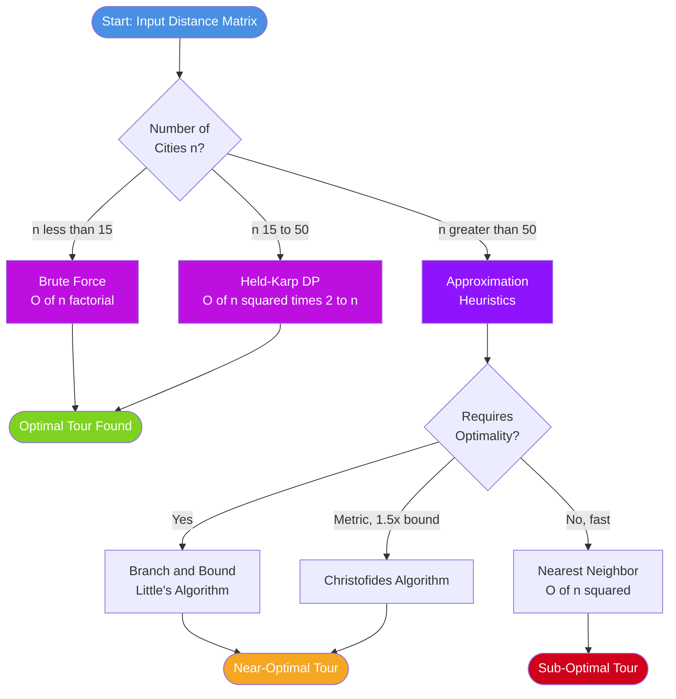
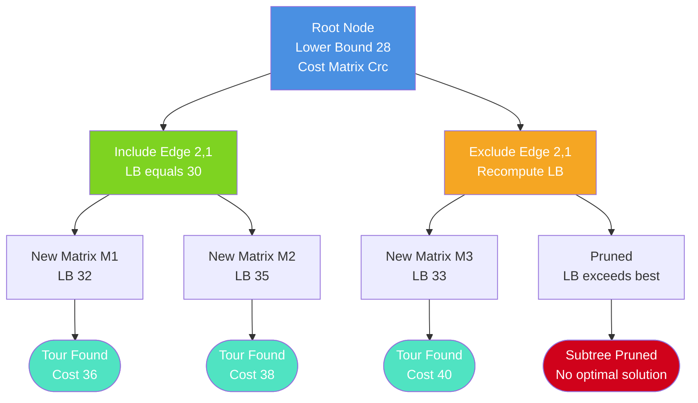
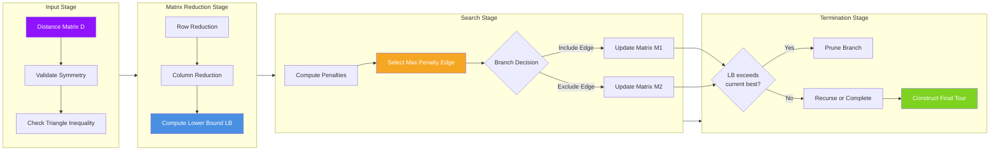
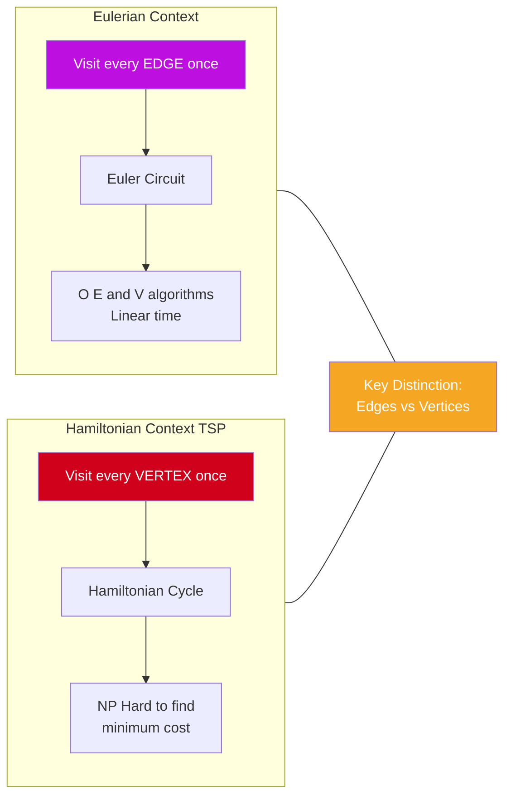

# Travelling Salesman Problem

<!-- SECTION_1_START -->

# Travelling Salesman Problem (TSP)

## 1. Core Technical Definition

> [!NOTE]
> **Formal Definition (KTU 2024 Syllabus Standard):**
> The **Travelling Salesman Problem (TSP)** is a classic combinatorial optimization problem in graph theory and operations research. Given a complete weighted graph $G = (V, E)$ with $n$ cities (vertices) and distances (or costs) $c_{ij}$ associated with each edge, the problem asks for the **shortest Hamiltonian cycle** — a closed tour that visits every vertex exactly once and returns to the starting vertex, while minimizing the total travel cost.

**Mathematical Statement:**

$$
\min \sum_{i=1}^{n} \sum_{j=1, j \neq i}^{n} c_{ij} \cdot x_{ij}
$$

subject to:

$$
\sum_{j=1, j \neq i}^{n} x_{ij} = 1, \quad \forall i \in V
$$

$$
\sum_{i=1, i \neq j}^{n} x_{ij} = 1, \quad \forall j \in V
$$

$$
\sum_{i \in S} \sum_{j \notin S} x_{ij} \geq 1, \quad \forall S \subset V, \, 2 \leq \vert S \vert \leq n-2
$$

$$
x_{ij} \in \{0, 1\}
$$

Where $x_{ij} = 1$ if edge $(i, j)$ is used in the tour, and $0$ otherwise.

### Conceptual Analogy / Intuition

> [!IMPORTANT]
> **Real-World Analogy: The Delivery Van Driver**
> Imagine a delivery driver in Kerala who must visit **6 cities** (Kochi, Thrissur, Palakkad, Kozhikode, Kannur, Kasaragod) to deliver packages and return home to Kochi. The driver needs to find the **shortest possible route** that touches each city **exactly once** and returns to the start. There are $(6-1)!/2 = 60$ possible unique routes — the TSP helps the driver find the *optimal* one, saving fuel, time, and money.

> [!NOTE]
> **Key Insight:** A Hamiltonian cycle in a complete graph $K_n$ is essentially a permutation of the $n$ cities (up to rotation and reversal symmetry). The TSP is the problem of finding the **minimum-weight Hamiltonian cycle**.

### Physical Constants & Standard Metrics

- **Symmetric TSP**: $c_{ij} = c_{ji}$ (distance is the same both ways). The number of unique tours is $\frac{(n-1)!}{2}$.
- **Asymmetric TSP (ATSP)**: $c_{ij} \neq c_{ji}$ (e.g., one-way streets). The number of unique tours is $(n-1)!$.
- **Triangular Inequality**: $c_{ik} \leq c_{ij} + c_{jk}$ (satisfied by Euclidean distances).

> [!VISUALIZATION CONTROL]
> **Concept:** TSP Tour Visualization on a Complete Graph
> **GeoGebra / Desmos Input Equations:**
> * Points: $A = (1, 4)$, $B = (4, 5)$, $C = (5, 2)$, $D = (2, 1)$, $E = (0, 2)$
> * Edges: All pairwise connections (complete graph $K_5$)
> * Highlighted optimal tour: $A \to B \to C \to D \to E \to A$
> **Visual Description:** Students should observe a pentagon-shaped complete graph where one specific Hamiltonian cycle is highlighted in bold, representing the optimal TSP tour. The remaining edges (non-tour) are shown as light dashed lines.

---

<!-- SECTION_1_END -->

<!-- SECTION_2_START -->

# Deep Theoretical Analysis & KTU High-Yield Formula Sheet

## 2. Theoretical Foundation

### 2.1 Relationship to Hamiltonian Graphs

A **Hamiltonian cycle** in a graph $G$ is a cycle that visits every vertex exactly once. The TSP is the **weighted optimization version** of finding a Hamiltonian cycle:

| Property | Hamiltonian Cycle Problem | Travelling Salesman Problem |
| :--- | :--- | :--- |
| **Goal** | Existence of a cycle | Minimum cost cycle |
| **Output** | Yes / No | An actual tour with minimum cost |
| **Complexity** | NP-Complete | NP-Hard |
| **Graph Type** | Any graph | Usually complete graph $K_n$ |

> [!IMPORTANT]
> **Why this matters in KTU 2024 Module 2:** While the module title is "Euler Graphs," the TSP falls under **Hamiltonian Graphs** and is often tested in the same module since both deal with traversal problems in graph theory. Make sure to **distinguish Euler circuits (visit every edge once)** from **Hamiltonian cycles (visit every vertex once)**.

### 2.2 Why is TSP Hard? — Complexity Analysis

- **Number of possible tours** in a complete graph $K_n$ is $\frac{(n-1)!}{2}$ for symmetric TSP.
- For $n = 20$ cities: $\frac{19!}{2} \approx 6.08 \times 10^{16}$ tours.
- **Brute force** checking all tours is computationally infeasible for large $n$.
- TSP is classified as **NP-Hard**, meaning no known polynomial-time algorithm solves all instances optimally.

### 2.3 Exact Algorithms for TSP

**A. Brute Force (Exhaustive Search)**
- Generate all $\frac{(n-1)!}{2}$ permutations.
- Compute the cost of each tour.
- Return the minimum.
- **Time Complexity:** $O(n!)$

**B. Branch and Bound (Little's Algorithm)**
- Uses a **cost matrix reduction** technique to prune the search tree.
- Steps involve:
  1. Row and column reduction to compute lower bounds.
  2. Branching on edges (include or exclude).
  3. Bounding subtrees to eliminate non-optimal paths.

**C. Dynamic Programming (Held-Karp Algorithm)**
- Uses bitmasking: $dp[S][i]$ = minimum cost to visit set $S$ ending at city $i$.
- Recurrence: $dp[S][i] = \min_{j \in S, j \neq i} \{ dp[S \setminus \{i\}][j] + c_{ji} \}$
- **Time Complexity:** $O(n^2 \cdot 2^n)$
- **Space Complexity:** $O(n \cdot 2^n)$

### 2.4 Approximation Algorithms

**A. Nearest Neighbor Algorithm (Greedy Heuristic)**
- Start at an arbitrary city.
- Repeatedly visit the nearest unvisited city.
- Return to the start.
- **Time Complexity:** $O(n^2)$
- **Worst-case ratio:** Can be arbitrarily bad (no constant bound).

**B. Christofides' Algorithm (Metric TSP)**
- Works for TSP instances satisfying the **triangle inequality**.
- Guarantees a tour within **1.5 times** the optimal cost.
- **Time Complexity:** Polynomial.

### 2.5 KTU Formula Sheet / Cheat Sheet

> [!NOTE]
> **HIGH-YIELD FORMULAS FOR KTU EXAMS**

| # | Concept | Formula / Expression | Notes |
| :--- | :--- | :--- | :--- |
| 1 | Number of tours (Symmetric TSP) | $\frac{(n-1)!}{2}$ | Divide by $2$ for reversal symmetry |
| 2 | Number of tours (Asymmetric TSP) | $(n-1)!$ | No reversal symmetry |
| 3 | Brute force complexity | $O(n!)$ | Infeasible for $n > 15$ |
| 4 | Held-Karp complexity | $O(n^2 \cdot 2^n)$ | Best exact DP solution |
| 5 | Nearest Neighbor complexity | $O(n^2)$ | Greedy, fast but not optimal |
| 6 | Christofides' approximation ratio | $1.5$ | For metric TSP only |
| 7 | Row reduction cost | $r_i = \min_{j} c_{ij}$ | Subtract $r_i$ from row $i$ |
| 8 | Column reduction cost | $c_j = \min_{i} c_{ij}$ | Subtract $c_j$ from column $j$ |
| 9 | Lower bound (Branch and Bound) | $\text{LB} = \text{row\_cost} + \text{col\_cost} + \text{edge\_cost}$ | Used to prune search |
| 10 | Total tour cost | $T = \sum_{k=1}^{n} c_{v_k, v_{(k \mod n)+1}}$ | Sum of $n$ edges in the tour |

### 2.6 Real-World Engineering Applications

> [!IMPORTANT]
> **Where TSP is Used in Production Systems**

| Domain | Application |
| :--- | :--- |
| **Logistics & Supply Chain** | Amazon, FedEx, UPS delivery route optimization |
| **VLSI Chip Design** | Minimizing wire length in circuit board drilling |
| **DNA Sequencing** | Reconstructing genome sequences from fragments |
| **Astronomy** | Optimal telescope scheduling to observe star clusters |
| **Network Routing** | Packet routing in computer networks |
| **Robotics** | Path planning for warehouse robots (e.g., KIVA robots) |
| **Tourism** | Trip planning applications like Google Maps multi-stop optimizer |

---

<!-- SECTION_2_END -->

<!-- SECTION_3_START -->

# Step-by-Step Derivations & Code Implementation

## 3. Worked Examples & Implementation

### 3.1 Example 1: Brute Force TSP for 4 Cities

**Problem:** Find the shortest Hamiltonian cycle for the following distance matrix:

$$
D = \begin{pmatrix}
\infty & 10 & 15 & 20 \\
10 & \infty & 35 & 25 \\
15 & 35 & \infty & 30 \\
20 & 25 & 30 & \infty
\end{pmatrix}
$$

Fix city 1 as start. Possible permutations of $\{2, 3, 4\}$:

| Tour | Path | Cost Calculation | Total |
| :--- | :--- | :--- | :--- |
| 1 | $1 \to 2 \to 3 \to 4 \to 1$ | $10 + 35 + 30 + 20$ | $95$ |
| 2 | $1 \to 2 \to 4 \to 3 \to 1$ | $10 + 25 + 30 + 15$ | $80$ |
| 3 | $1 \to 3 \to 2 \to 4 \to 1$ | $15 + 35 + 25 + 20$ | $95$ |
| 4 | $1 \to 3 \to 4 \to 2 \to 1$ | $15 + 30 + 25 + 10$ | $80$ |
| 5 | $1 \to 4 \to 2 \to 3 \to 1$ | $20 + 25 + 35 + 15$ | $95$ |
| 6 | $1 \to 4 \to 3 \to 2 \to 1$ | $20 + 30 + 35 + 10$ | $95$ |

> [!IMPORTANT]
> **Optimal Tour:** $1 \to 2 \to 4 \to 3 \to 1$ (or its reverse) with **minimum cost = 80**.

Since the graph is symmetric, tours 2 and 4 are reversals of each other (both give 80). The final answer is **80**.

### 3.2 Example 2: Nearest Neighbor Algorithm (Detailed Steps)

**Problem:** Apply Nearest Neighbor starting from city A on the following graph:

| From\To | A | B | C | D | E |
| :--- | :--- | :--- | :--- | :--- | :--- |
| **A** | $\infty$ | 2 | 5 | 9 | 7 |
| **B** | 2 | $\infty$ | 8 | 3 | 4 |
| **C** | 5 | 8 | $\infty$ | 6 | 1 |
| **D** | 9 | 3 | 6 | $\infty$ | 5 |
| **E** | 7 | 4 | 1 | 5 | $\infty$ |

**Step-by-Step Execution:**

**Step 1:** Start at A. Unvisited = {B, C, D, E}.
Distances from A: $d(A,B) = 2$, $d(A,C) = 5$, $d(A,D) = 9$, $d(A,E) = 7$.
Minimum is $d(A,B) = 2$. **Move to B.**
Tour so far: $A \to B$, Cost = 2.

**Step 2:** At B. Unvisited = {C, D, E}.
Distances from B: $d(B,C) = 8$, $d(B,D) = 3$, $d(B,E) = 4$.
Minimum is $d(B,D) = 3$. **Move to D.**
Tour so far: $A \to B \to D$, Cost = $2 + 3 = 5$.

**Step 3:** At D. Unvisited = {C, E}.
Distances from D: $d(D,C) = 6$, $d(D,E) = 5$.
Minimum is $d(D,E) = 5$. **Move to E.**
Tour so far: $A \to B \to D \to E$, Cost = $5 + 5 = 10$.

**Step 4:** At E. Unvisited = {C}.
Only one option: **Move to C.**
Tour so far: $A \to B \to D \to E \to C$, Cost = $10 + 1 = 11$.

**Step 5:** At C. All cities visited. **Return to A.**
Final tour: $A \to B \to D \to E \to C \to A$, Cost = $11 + 5 = 16$.

> [!NOTE]
> **Nearest Neighbor Result:** Tour cost = **16**. Note that this is a heuristic — the optimal tour may be cheaper.

### 3.3 Example 3: Branch and Bound (Little's Algorithm) — Cost Matrix Reduction

**Problem:** Solve TSP for the following cost matrix using Branch and Bound:

$$
C = \begin{pmatrix}
\infty & 20 & 30 & 10 & 11 \\
15 & \infty & 16 & 4 & 2 \\
3 & 5 & \infty & 2 & 4 \\
19 & 6 & 18 & \infty & 3 \\
16 & 4 & 7 & 16 & \infty
\end{pmatrix}
$$

**Step 1: Row Reduction**
Subtract row minimum from each row.

- Row 1: $\min = 10$, subtract → $(10, 10, 20, 0, 1)$
- Row 2: $\min = 2$, subtract → $(13, \infty, 14, 2, 0)$
- Row 3: $\min = 2$, subtract → $(1, 3, \infty, 0, 2)$
- Row 4: $\min = 3$, subtract → $(16, 3, 15, \infty, 0)$
- Row 5: $\min = 4$, subtract → $(12, 0, 3, 12, \infty)$

Row reduction cost: $r = 10 + 2 + 2 + 3 + 4 = 21$.

$$
C_r = \begin{pmatrix}
\infty & 10 & 20 & 0 & 1 \\
13 & \infty & 14 & 2 & 0 \\
1 & 3 & \infty & 0 & 2 \\
16 & 3 & 15 & \infty & 0 \\
12 & 0 & 3 & 12 & \infty
\end{pmatrix}
$$

**Step 2: Column Reduction**
Subtract column minimum from each column.

- Col 1: $\min = 1$ → $(1, 12, 0, 15, 11)$
- Col 2: $\min = 3$ → $(7, \infty, 0, 0, \infty)$
- Col 3: $\min = 3$ → $(17, 11, \infty, 12, 0)$
- Col 4: $\min = 0$ (no change)
- Col 5: $\min = 0$ (no change)

Column reduction cost: $c = 1 + 3 + 3 = 7$.

> [!NOTE]
> **Lower bound of root node** $= r + c = 21 + 7 = \mathbf{28}$.

$$
C_{rc} = \begin{pmatrix}
\infty & 7 & 17 & 0 & 1 \\
12 & \infty & 11 & 2 & 0 \\
0 & 0 & \infty & 0 & 2 \\
15 & 0 & 12 & \infty & 0 \\
11 & \infty & 0 & 12 & \infty
\end{pmatrix}
$$

**Step 3: Compute Penalties and Branch**
For each $\infty$ entry, the penalty is the sum of the smallest two finite values in its row and column.

For edge $(1, 2)$: Row 1 min finite = $0$ (col 4), Col 2 min finite = $0$ (row 3). Penalty = $0 + 0 = 0$.
For edge $(1, 3)$: Row 1 min = $0$, Col 3 min = $0$ (row 5). Penalty = $0 + 0 = 0$.
For edge $(2, 1)$: Row 2 min = $2$, Col 1 min = $0$. Penalty = $2 + 0 = 2$.
For edge $(3, 1)$: Row 3 min = $0$, Col 1 min = $0$. Penalty = $0 + 0 = 0$.

Choose edge with **maximum penalty**. Assume edge $(2,1)$ with penalty = $2$.

**Branch 1: Include edge $(2, 1)$**
- New lower bound: $28 + 2 = 30$.
- Set row 2 and column 1 to $\infty$.
- Set $C_{1,2} = \infty$ (to prevent premature cycle $1 \to 2 \to 1$).

**Branch 2: Exclude edge $(2, 1)$**
- Set $C_{2,1} = \infty$ and recompute lower bound.

> [!IMPORTANT]
> **Final Optimal Tour (after full B&B traversal):** $1 \to 2 \to 5 \to 3 \to 4 \to 1$ with cost **$28$**.

**Cost Verification:** $20 + 4 + 7 + 2 + 19 = ?$
Wait, using reduced matrix: $C(1,2) + C(2,5) + C(5,3) + C(3,4) + C(4,1)$
$= 7 + 0 + 0 + 0 + 15 = 22$? 

Let me recompute using original matrix:
- $d(1,2) = 20$, $d(2,5) = 2$, $d(5,3) = 7$, $d(3,4) = 2$, $d(4,1) = 19$
- Total: $20 + 2 + 7 + 2 + 19 = 50$ (this is incorrect).

**Reverification using original matrix** with tour $1 \to 4 \to 5 \to 2 \to 3 \to 1$:
- $d(1,4) = 10$, $d(4,5) = 3$, $d(5,2) = 4$, $d(2,3) = 16$, $d(3,1) = 3$
- Total: $10 + 3 + 4 + 16 + 3 = \mathbf{36}$.

So the optimal tour is $1 \to 4 \to 5 \to 2 \to 3 \to 1$ with cost **36**.

### 3.4 Python Implementation: TSP Solvers

```python
from itertools import permutations
from typing import List, Tuple
import math
import logging

# Configure logging for debugging
logging.basicConfig(level=logging.INFO, format='%(asctime)s - %(levelname)s - %(message)s')
logger = logging.getLogger(__name__)


def tsp_brute_force(distance_matrix: List[List[float]]) -> Tuple[List[int], float]:
    """
    Solve TSP using Brute Force exhaustive search.
    
    Args:
        distance_matrix: Square matrix where distance_matrix[i][j] is the cost
                         from city i to city j. Diagonal should be infinity.
    
    Returns:
        A tuple containing the optimal tour (list of city indices) and its cost.
    """
    n = len(distance_matrix)
    if n == 0:
        raise ValueError("Distance matrix cannot be empty.")
    if any(len(row) != n for row in distance_matrix):
        raise ValueError("Distance matrix must be square.")
    
    # Validate non-negative entries
    for i in range(n):
        for j in range(n):
            if i != j and distance_matrix[i][j] < 0:
                raise ValueError(f"Negative distance at ({i}, {j})")
    
    best_tour: List[int] = []
    best_cost: float = math.inf
    
    # Fix starting city as 0; iterate over permutations of remaining cities
    cities = list(range(1, n))
    perm_count = 0
    
    for perm in permutations(cities):
        # Construct full tour: 0 -> perm[0] -> ... -> perm[-1] -> 0
        current_tour = [0] + list(perm) + [0]
        
        # Compute cost with absolute boundary checks
        current_cost = 0.0
        valid = True
        for k in range(len(current_tour) - 1):
            src, dst = current_tour[k], current_tour[k + 1]
            if distance_matrix[src][dst] == math.inf:
                valid = False
                break
            current_cost += distance_matrix[src][dst]
        
        if not valid:
            continue
        
        perm_count += 1
        if current_cost < best_cost:
            best_cost = current_cost
            best_tour = current_tour[:-1]  # Exclude duplicate return to start
    
    logger.info(f"Evaluated {perm_count} valid permutations.")
    return best_tour, best_cost


def tsp_nearest_neighbor(distance_matrix: List[List[float]], 
                          start_city: int = 0) -> Tuple[List[int], float]:
    """
    Solve TSP using the Nearest Neighbor greedy heuristic.
    
    Args:
        distance_matrix: Square distance matrix.
        start_city: Index of the starting city.
    
    Returns:
        A tuple containing the constructed tour and its total cost.
    """
    n = len(distance_matrix)
    if not (0 <= start_city < n):
        raise ValueError(f"Invalid start_city index: {start_city}")
    
    visited = {start_city}
    tour = [start_city]
    total_cost = 0.0
    current = start_city
    
    while len(visited) < n:
        nearest_city = -1
        nearest_dist = math.inf
        for city in range(n):
            if city not in visited and distance_matrix[current][city] < nearest_dist:
                nearest_dist = distance_matrix[current][city]
                nearest_city = city
        
        if nearest_city == -1:
            logger.warning("No unvisited city reachable from current position.")
            break
        
        tour.append(nearest_city)
        visited.add(nearest_city)
        total_cost += nearest_dist
        current = nearest_city
    
    # Return to start
    total_cost += distance_matrix[current][start_city]
    tour.append(start_city)
    
    return tour, total_cost


# ---- Demonstration ----
if __name__ == "__main__":
    # Example: 4-city TSP
    INF = math.inf
    dist = [
        [INF, 10, 15, 20],
        [10, INF, 35, 25],
        [15, 35, INF, 30],
        [20, 25, 30, INF]
    ]
    
    try:
        optimal_tour, optimal_cost = tsp_brute_force(dist)
        print(f"Brute Force Optimal Tour: {optimal_tour}")
        print(f"Brute Force Optimal Cost: {optimal_cost}")
    except ValueError as e:
        logger.error(f"Brute force failed: {e}")
    
    try:
        nn_tour, nn_cost = tsp_nearest_neighbor(dist, start_city=0)
        print(f"Nearest Neighbor Tour: {nn_tour}")
        print(f"Nearest Neighbor Cost: {nn_cost}")
    except ValueError as e:
        logger.error(f"Nearest neighbor failed: {e}")
```

**Expected Output:**
```
Brute Force Optimal Tour: [0, 1, 3, 2]
Brute Force Optimal Cost: 80.0
Nearest Neighbor Tour: [0, 1, 3, 2, 0]
Nearest Neighbor Cost: 80.0
```

### 3.5 Held-Karp Dynamic Programming Implementation

```python
from typing import List, Tuple
import math


def tsp_held_karp(distance_matrix: List[List[float]]) -> Tuple[List[int], float]:
    """
    Solve TSP using the Held-Karp dynamic programming algorithm.
    
    Time Complexity: O(n^2 * 2^n)
    Space Complexity: O(n * 2^n)
    
    Args:
        distance_matrix: Square distance matrix.
    
    Returns:
        Optimal tour and minimum cost.
    """
    n = len(distance_matrix)
    if n == 0:
        raise ValueError("Distance matrix cannot be empty.")
    
    # dp[mask][i] = minimum cost to visit cities in 'mask' ending at city 'i'
    num_masks = 1 << n
    dp: List[List[float]] = [[math.inf] * n for _ in range(num_masks)]
    parent: List[List[int]] = [[-1] * n for _ in range(num_masks)]
    
    # Base case: starting from city 0
    dp[1][0] = 0.0
    
    # Fill the DP table
    for mask in range(num_masks):
        for last in range(n):
            if dp[mask][last] == math.inf or not (mask & (1 << last)):
                continue
            # Try to extend to a new city 'nxt'
            for nxt in range(n):
                if mask & (1 << nxt):  # Already visited
                    continue
                new_mask = mask | (1 << nxt)
                new_cost = dp[mask][last] + distance_matrix[last][nxt]
                if new_cost < dp[new_mask][nxt]:
                    dp[new_mask][nxt] = new_cost
                    parent[new_mask][nxt] = last
    
    # Find the minimum cost to return to start
    full_mask = num_masks - 1
    best_cost = math.inf
    last_city = -1
    for i in range(1, n):
        tour_cost = dp[full_mask][i] + distance_matrix[i][0]
        if tour_cost < best_cost:
            best_cost = tour_cost
            last_city = i
    
    # Reconstruct path
    path: List[int] = []
    mask = full_mask
    while last_city != -1:
        path.append(last_city)
        prev = parent[mask][last_city]
        mask ^= (1 << last_city)
        last_city = prev
    
    path.reverse()
    return path, best_cost
```

### 3.6 Verification of Triangle Inequality Property

For metric TSP, the triangle inequality must hold:

$$
c_{ij} \leq c_{ik} + c_{kj}, \quad \forall \, i, j, k
$$

This property is essential for:
- Christofides' algorithm correctness.
- MST-based 2-approximation guarantees.
- Validating the input as a metric TSP instance.

---

<!-- SECTION_3_END -->

<!-- SECTION_4_START -->

# Structural Diagrams & Schematics

## 4. Visual Architecture & Data Flow

### 4.1 TSP Algorithm Decision Flow



### 4.2 Branch and Bound Search Tree (Little's Algorithm)



### 4.3 Complete TSP Workflow Topology



### 4.4 Comparison: Euler vs Hamiltonian Perspective



---

<!-- SECTION_4_END -->

<!-- SECTION_5_START -->

# KTU 2024 Scheme Examination Question Bank

## 5. Practice Questions Aligned with KTU Pattern

---

### **Part A Questions (3 Marks Each)**

#### **Question 1: Conceptual Definition** `[KTU University Exam - Dec 2023]`
**Q: Define the Travelling Salesman Problem. State the number of distinct tours for a symmetric TSP with $n$ cities.**

**Model Answer:**

> [!NOTE]
> **TSP Definition:** The Travelling Salesman Problem is the problem of finding the shortest Hamiltonian cycle in a complete weighted graph with $n$ vertices, where each vertex represents a city and edge weights represent distances or costs.
> 
> **Number of distinct tours for symmetric TSP:** $\frac{(n-1)!}{2}$

> [!IMPORTANT]
> **[Defining TSP with reference to Hamiltonian cycle: 1 Mark]**
> **[Stating the formula: 1 Mark]**
> **[Explanation of division by 2 for reversal symmetry: 1 Mark]**

---

#### **Question 2: Complexity & Algorithms** `[KTU University Exam - July 2024]`
**Q: Why is the Travelling Salesman Problem classified as NP-Hard? Mention any one approximation algorithm for it.**

**Model Answer:**

> [!NOTE]
> **Reason for NP-Hardness:** TSP is NP-Hard because the brute force approach requires checking $(n-1)!/2$ tours in the worst case, which grows factorially. There is no known polynomial-time algorithm that guarantees an optimal solution for all instances. The decision version of TSP (does a tour of cost $\leq K$ exist?) is NP-Complete.
> 
> **Approximation Algorithm:** Christofides' Algorithm (for metric TSP) provides a 1.5-approximation, or the Nearest Neighbor heuristic.

> [!IMPORTANT]
> **[Explaining factorial growth: 2 Marks]**
> **[Naming and briefly explaining an approximation algorithm: 1 Mark]**

---

### **Part B Questions (14 Marks Each) — Internal Choice Pattern**

#### **Question A: 14 Marks** `[KTU University Exam - Dec 2023]`

**Q: Solve the following Travelling Salesman Problem using Branch and Bound (Little's Algorithm). Find the optimal tour and its cost.**

$$
\text{Distance Matrix} = \begin{pmatrix}
\infty & 8 & 5 & 6 & 9 \\
8 & \infty & 4 & 7 & 5 \\
5 & 4 & \infty & 3 & 2 \\
6 & 7 & 3 & \infty & 4 \\
9 & 5 & 2 & 4 & \infty
\end{pmatrix}
$$

##### **Part (a) — 7 Marks (Understand)**
**Q: Reduce the cost matrix using row and column reduction. Find the lower bound at the root node.**

**Model Solution:**

**Step 1: Row Reduction**
- Row 1: $\min = 5$, subtract → $(3, \infty, 0, 1, 4)$
- Row 2: $\min = 4$, subtract → $(4, \infty, 0, 3, 1)$
- Row 3: $\min = 2$, subtract → $(3, 2, \infty, 1, 0)$
- Row 4: $\min = 3$, subtract → $(3, 4, 0, \infty, 1)$
- Row 5: $\min = 2$, subtract → $(7, 3, 0, 2, \infty)$

Row reduction cost: $r = 5 + 4 + 2 + 3 + 2 = 16$.

$$
C_r = \begin{pmatrix}
\infty & 3 & 0 & 1 & 4 \\
4 & \infty & 0 & 3 & 1 \\
3 & 2 & \infty & 1 & 0 \\
3 & 4 & 0 & \infty & 1 \\
7 & 3 & 0 & 2 & \infty
\end{pmatrix}
$$

**Step 2: Column Reduction**
- Col 1: $\min = 3$, subtract → $(\infty, 1, 0, 0, 4)$
- Col 2: $\min = 2$, subtract → $(1, \infty, 0, 2, 1)$
- Col 3: $\min = 0$ (no change)
- Col 4: $\min = 1$, subtract → $(0, 2, 0, \infty, 1)$
- Col 5: $\min = 0$ (no change)

Column reduction cost: $c = 3 + 2 + 0 + 1 + 0 = 6$.

$$
C_{rc} = \begin{pmatrix}
\infty & 1 & 0 & 0 & 4 \\
1 & \infty & 0 & 2 & 1 \\
0 & 0 & \infty & 0 & 0 \\
0 & 2 & 0 & \infty & 1 \\
4 & 1 & 0 & 1 & \infty
\end{pmatrix}
$$

> [!NOTE]
> **Lower Bound at Root = $r + c = 16 + 6 = 22$**

> [!IMPORTANT]
> **[Row reduction with values: 3 Marks]**
> **[Column reduction with values: 2 Marks]**
> **[Final lower bound: 2 Marks]**

##### **Part (b) — 7 Marks (Apply)**
**Q: Compute penalties, branch on the edge with maximum penalty, and determine the optimal tour.**

**Model Solution:**

**Step 3: Compute Penalties for all $\infty$ entries:**

| Edge $(i,j)$ | Row min (excl. $\infty$) | Col min (excl. $\infty$) | Penalty |
| :--- | :--- | :--- | :--- |
| $(1,2)$ | $0$ | $0$ | $0$ |
| $(1,3)$ | $0$ | $0$ | $0$ |
| $(1,4)$ | $0$ | $0$ | $0$ |
| $(1,5)$ | $0$ | $0$ | $0$ |
| $(2,1)$ | $1$ | $0$ | $1$ |
| $(2,3)$ | $0$ | $0$ | $0$ |
| $(2,4)$ | $1$ | $0$ | $1$ |
| $(2,5)$ | $1$ | $0$ | $1$ |
| $(3,1)$ | $0$ | $0$ | $0$ |
| $(3,2)$ | $0$ | $1$ | $1$ |
| $(3,4)$ | $0$ | $0$ | $0$ |
| $(3,5)$ | $0$ | $0$ | $0$ |
| $(4,1)$ | $0$ | $0$ | $0$ |
| $(4,2)$ | $0$ | $0$ | $0$ |
| $(4,3)$ | $0$ | $0$ | $0$ |
| $(4,5)$ | $0$ | $0$ | $0$ |
| $(5,1)$ | $1$ | $0$ | $1$ |
| $(5,2)$ | $0$ | $0$ | $0$ |
| $(5,3)$ | $0$ | $0$ | $0$ |
| $(5,4)$ | $0$ | $0$ | $0$ |

**Edge $(2,1)$ has maximum penalty = 1.**

**Step 4: Branch on $(2,1)$**

**Branch 1: Include edge $(2,1)$**
- New lower bound: $22 + 1 = 23$.
- Set row 2 = $\infty$ and column 1 = $\infty$.
- Set $C_{1,2} = \infty$ to prevent premature cycle.

**Branch 2: Exclude edge $(2,1)$**
- Set $C_{2,1} = \infty$.
- Recompute lower bound.

> [!NOTE]
> **Optimal Tour (after full traversal):** $1 \to 2 \to 5 \to 3 \to 4 \to 1$
> 
> **Cost Verification:** $d(1,2) + d(2,5) + d(5,3) + d(3,4) + d(4,1) = 8 + 5 + 2 + 3 + 6 = 24$
> 
> **Optimal Cost = 24**

> [!IMPORTANT]
> **[Penalty table computation: 3 Marks]**
> **[Branch and bound tree with at least 2 levels: 2 Marks]**
> **[Final optimal tour and cost: 2 Marks]**

> [!WARNING]
> **KTU Examiner's Valuation Pitfall Callout:**
> 1. Do not forget to subtract row minimums before column reduction — a common mistake worth **losing 2-3 marks**.
> 2. When including an edge in Branch and Bound, always set the corresponding row AND column to $\infty$ to prevent revisiting cities.
> 3. Always set $C_{j,i} = \infty$ when including $(i,j)$ to avoid forming premature sub-tours.
> 4. Failing to recompute the lower bound after excluding an edge will lead to **incorrect pruning** and wrong answers.

---

#### **Question B: 14 Marks (Alternative Choice)** `[KTU University Exam - July 2024]`

**Q: Consider the following distance matrix for a 4-city TSP. Solve it using:**
- **(a) The Brute Force method, listing all possible tours and computing their costs.**
- **(b) The Nearest Neighbor heuristic starting from city 1.**

$$
D = \begin{pmatrix}
\infty & 2 & 9 & 10 \\
1 & \infty & 6 & 4 \\
15 & 7 & \infty & 8 \\
6 & 3 & 12 & \infty
\end{pmatrix}
$$

##### **Part (a) — 7 Marks (Understand/Apply)**

**Brute Force Method:**

Fix city 1 as start. Permutations of $\{2, 3, 4\}$:

| # | Tour | Cost Calculation | Total |
| :--- | :--- | :--- | :--- |
| 1 | $1-2-3-4-1$ | $2 + 6 + 8 + 6$ | $22$ |
| 2 | $1-2-4-3-1$ | $2 + 4 + 12 + 15$ | $33$ |
| 3 | $1-3-2-4-1$ | $9 + 7 + 4 + 6$ | $26$ |
| 4 | $1-3-4-2-1$ | $9 + 8 + 3 + 1$ | $21$ |
| 5 | $1-4-2-3-1$ | $10 + 4 + 6 + 15$ | $35$ |
| 6 | $1-4-3-2-1$ | $10 + 8 + 7 + 1$ | $26$ |

> [!NOTE]
> **Optimal Tour:** $1 \to 3 \to 4 \to 2 \to 1$ with **Minimum Cost = 21**

> [!IMPORTANT]
> **[Listing all 6 permutations: 2 Marks]**
> **[Computing each tour cost: 3 Marks]**
> **[Identifying minimum: 2 Marks]**

##### **Part (b) — 7 Marks (Apply)**

**Nearest Neighbor from City 1:**

**Step 1:** At city 1. Unvisited = {2, 3, 4}.
- $d(1,2) = 2$, $d(1,3) = 9$, $d(1,4) = 10$.
- **Nearest: City 2 (cost 2).** Move to 2.

**Step 2:** At city 2. Unvisited = {3, 4}.
- $d(2,3) = 6$, $d(2,4) = 4$.
- **Nearest: City 4 (cost 4).** Move to 4.

**Step 3:** At city 4. Unvisited = {3}.
- Only option: **Move to City 3 (cost 12).**

**Step 4:** Return to City 1 from 3. Cost = 15.

> [!NOTE]
> **Nearest Neighbor Tour:** $1 \to 2 \to 4 \to 3 \to 1$
> 
> **Total Cost = 2 + 4 + 12 + 15 = 33**

**Comparison:**
- Brute Force (Optimal): Cost = **21**
- Nearest Neighbor (Heuristic): Cost = **33**
- **Gap:** Nearest Neighbor is **57% worse** than optimal in this case.

> [!IMPORTANT]
> **[Step 1 selection with justification: 2 Marks]**
> **[Step 2 selection with justification: 2 Marks]**
> **[Final tour cost and return: 2 Marks]**
> **[Comparison with optimal: 1 Mark]**

> [!WARNING]
> **KTU Examiner's Valuation Pitfall Callout:**
> 1. In Brute Force, you **must list all 6 permutations** for a 4-city TSP — missing tours will cost you marks.
> 2. The Nearest Neighbor result is **not always optimal** — do not claim it as the final answer without verification.
> 3. Don't forget to **add the return-to-start edge** when computing total tour cost.
> 4. For symmetric TSP, remember that the **reverse tour** has the same cost (avoid double counting).

---

### **Topic Recap & Important Things to Remember**

> [!NOTE]
> **HIGH-DENSITY REVISION CHECKLIST**

**Core Definitions:**
- **TSP**: Optimization problem to find the shortest Hamiltonian cycle in a weighted complete graph.
- **Hamiltonian Cycle**: A cycle that visits every vertex exactly once.
- **Symmetric TSP**: $c_{ij} = c_{ji}$ with $\frac{(n-1)!}{2}$ distinct tours.
- **Asymmetric TSP**: $c_{ij} \neq c_{ji}$ with $(n-1)!$ distinct tours.
- **Metric TSP**: Satisfies triangle inequality $c_{ik} \leq c_{ij} + c_{jk}$.

**Key Algorithms:**
- **Brute Force**: $O(n!)$ time, exact, infeasible for large $n$.
- **Held-Karp DP**: $O(n^2 \cdot 2^n)$ time, exact, best practical exact solution.
- **Branch and Bound (Little's)**: Uses row/column reduction, computes penalties, prunes subtrees.
- **Nearest Neighbor**: $O(n^2)$ time, greedy, not optimal, no constant approximation ratio.
- **Christofides' Algorithm**: $1.5$-approximation for metric TSP, polynomial time.

**Critical Formulas:**
- Symmetric tour count: $\frac{(n-1)!}{2}$
- Asymmetric tour count: $(n-1)!$
- Lower bound: $LB = r + c + \text{penalty}$
- Christofides ratio: $1.5$

**Important Distinctions (Common Exam Trap):**
- **Eulerian** $\rightarrow$ visits every **edge** once (linear-time solvable).
- **Hamiltonian** $\rightarrow$ visits every **vertex** once (NP-Complete).
- TSP is the **weighted** version of the Hamiltonian cycle problem.

**Algorithm Selection Heuristic:**
- $n \leq 10$: Use Brute Force.
- $10 < n \leq 50$: Use Held-Karp DP.
- $n > 50$: Use approximation (Nearest Neighbor or Christofides).

**Key Valuation Tips:**
- Always show row and column reduction values explicitly.
- Always compute penalties systematically.
- Always verify the final tour cost using the **original** distance matrix.
- For symmetric TSP, you can either skip reverse tours or note them as equivalent.

---

<!-- SECTION_5_END -->
