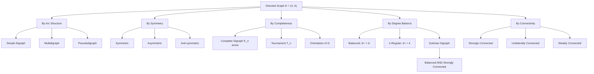
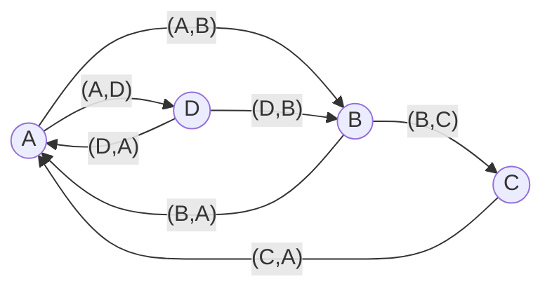
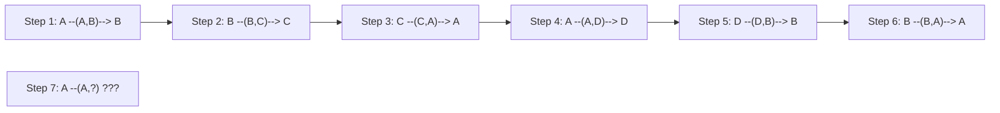
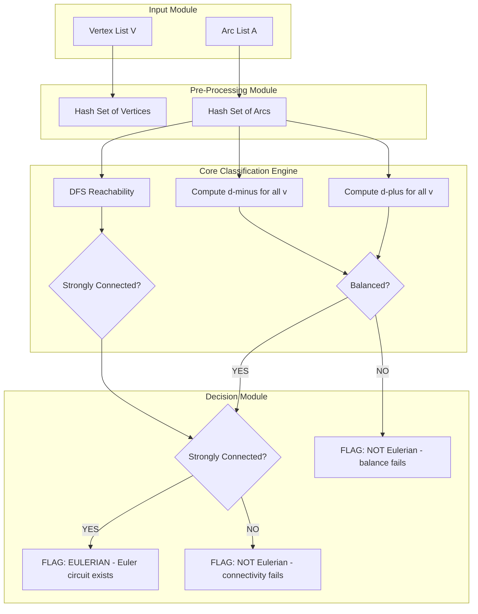

# Types of directed graphs

<!-- SECTION_1_START -->
# Types of Directed Graphs — KTU 2024 Scheme Module 2

## 1.1 Core Technical Definition

A **Directed Graph** (or **Digraph**) $D = (V, A)$ is an ordered pair consisting of a non-empty finite set of **vertices** $V$ and a set $A$ of **arcs** (directed edges), where each arc is an **ordered pair** $(u, v)$ of vertices. The arc $(u, v)$ is said to be directed **from** $u$ **to** $v$; here $u$ is the **tail** and $v$ is the **head**.

$$ D \;=\; (V, A), \qquad A \;\subseteq\; V \times V, \qquad (u, v) \neq (v, u) \text{ in general.} $$

> [!IMPORTANT]
> **KTU 2024 Syllabus Note:** In *Mathematics for Computer and Information Science-4 (GAMAT401)*, Module 2 ("Euler Graphs") extends classical Eulerian results from undirected graphs to the **directed case**. A strong grasp of digraph terminology — *in-degree*, *out-degree*, *strong connectivity*, *balanced digraph* — is the prerequisite to writing the Eulerian theorem for digraphs on the answer script.

### Fundamental Quantities of a Digraph

| Symbol | Definition | KTU 2024 Notation |
| :--- | :--- | :--- |
| $d^+(v)$ | **Out-degree** of $v$ = number of arcs leaving $v$ | $\deg^+(v)$ |
| $d^-(v)$ | **In-degree** of $v$ = number of arcs entering $v$ | $\deg^-(v)$ |
| $d(v)$ | **Total degree** | $d^+(v) + d^-(v)$ |
| $n$ | Number of vertices ($\lvert V \rvert$) | $n$ |
| $m$ | Number of arcs ($\lvert A \rvert$) | $m$ |

> [!NOTE]
> **Degree Handshake Theorem for Digraphs:**
> $$\sum_{v \in V} d^+(v) \;=\; \sum_{v \in V} d^-(v) \;=\; \lvert A \rvert \;=\; m$$
> Every arc contributes **exactly +1** to one out-degree and **exactly +1** to one in-degree.

## 1.2 Intuitive Analogy — The One-Way City Map

Imagine a city's road network where every street is **one-way**:

* **Vertices** = Roundabouts / intersections ($V$).
* **Arcs** = One-way streets ($A$).
* **Out-degree** $d^+(v)$ = number of streets *leaving* the intersection $v$ (exits).
* **In-degree** $d^-(v)$ = number of streets *entering* the intersection $v$ (entrances).
* **Symmetric digraph** = every one-way street has a parallel one-way street in the *opposite* direction (a "pair of one-ways" forming a two-way corridor, but legally still two distinct directed arcs).
* **Asymmetric digraph** = if there's a one-way from $A$ to $B$, there is **no** one-way from $B$ to $A$.
* **Balanced digraph** = every intersection has the **same number of entrances and exits** — perfect for traffic flow circulation.
* **Eulerian digraph** = a balanced, strongly connected digraph where a **postal van** can traverse *every one-way street exactly once* and return to the depot.

> [!TIP]
> **Concept Check:** Can a **balanced** digraph fail to be Eulerian? **Yes** — it must also be *strongly connected* (no isolated sub-networks). This is a frequent KTU 2-mark trap.

## 1.3 GeoGebra / Desmos Visualization Hook

> [!VISUALIZATION CONTROL]
> **Concept:** Visualizing in-degree vs out-degree at a vertex
> **Desmos Input Equations:** Plot the digraph $V=\{a,b,c\}$, $A=\{(a,b),(a,c),(b,c),(c,a)\}$ as a directed cycle.
> **Visual Description:** Draw three points on the unit circle labelled $a, b, c$. Draw arrows $a \to b$, $b \to c$, $c \to a$. Observe that at every vertex, the number of incoming arrows equals the number of outgoing arrows (each = 1). This is the smallest non-trivial balanced digraph.

<!-- SECTION_1_END -->

<!-- SECTION_2_START -->
# 2. Deep Theoretical Analysis & KTU High-Yield Formula Sheet

## 2.1 Master Classification of Directed Graphs

The classification of digraphs used in KTU Module 2 (Euler Graphs) rests on **four orthogonal axes**: (i) Arc structure, (ii) Symmetry, (iii) Degree balance, and (iv) Connectivity.

### 2.1.1 By Arc Structure (Multiplicity)

* **Simple Digraph** — No **parallel arcs** (no two arcs share the same ordered pair of endpoints) and no **loops** (no arc of the form $(v,v)$).
* **Multidigraph** — Parallel arcs permitted, but loops forbidden.
* **Pseudodigraph** — Both parallel arcs and loops permitted.

> [!IMPORTANT]
> KTU 2024 default: unless stated otherwise, a "digraph" is a **simple digraph**.

### 2.1.2 By Symmetry of Arc Pairs

Let $D = (V,A)$ be a simple digraph. For any distinct $u, v \in V$:

| Type | Defining Condition | Consequence |
| :--- | :--- | :--- |
| **Symmetric** | $(u,v) \in A \implies (v,u) \in A$ | Underlying undirected graph has each edge twice |
| **Asymmetric** | $(u,v) \in A \implies (v,u) \notin A$ | Every unordered pair has at most one direction |
| **Anti-symmetric** | $(u,v) \in A \text{ and } (v,u) \in A \implies u = v$ | Loops allowed, but no symmetric pairs among distinct vertices |
| **Orientation of $G$** | An undirected graph with each edge assigned exactly one direction | Asymmetric by construction |

### 2.1.3 By Completeness

* **Complete (Symmetric) Digraph** $\overleftrightarrow{K_n}$: For every pair $u \neq v$, *both* $(u,v)$ and $(v,u)$ lie in $A$. Number of arcs = $n(n-1)$.
* **Tournament** $T_n$: For every pair $u \neq v$, *exactly one* of $(u,v)$ or $(v,u)$ lies in $A$. Number of arcs = $\binom{n}{2}$.
* **Complete Digraph** (alternate definition in some texts) = same as $\overleftrightarrow{K_n}$.

### 2.1.4 By Degree Balance — The CRUCIAL Type for Module 2

> [!NOTE]
> This is the **Euler-relevant** classification — KTU 2024 frequently tests the equivalence between "balanced + strongly connected" and "Eulerian."

* **Balanced Digraph**: $d^+(v) = d^-(v)$ for **every** $v \in V$.
* **k-Regular Digraph** (out-regular): $d^+(v) = k$ for every $v \in V$. Equivalently, in-regular: $d^-(v) = k$ for every $v \in V$. A $k$-regular digraph has $m = kn$ arcs.
* **Eulerian Digraph**: A digraph that contains a **closed directed trail** containing every arc exactly once (an *Eulerian circuit*).
* **Pseudo-Eulerian (Semi-Eulerian) Digraph**: Contains a **directed trail** (open) containing every arc exactly once.

### 2.1.5 By Connectivity

* **Strongly Connected** ($D$ is *strong*): For every ordered pair $(u,v)$ with $u \neq v$, there exists a **directed** path from $u$ to $v$.
* **Unilaterally Connected**: For every pair $\{u,v\}$, there is a directed path in *at least one* direction.
* **Weakly Connected**: The underlying undirected graph $G(D)$ (obtained by replacing each arc with an undirected edge) is connected.
* **Disconnected**: $G(D)$ is disconnected.

### 2.1.6 By Isomorphism

Two digraphs $D_1 = (V_1, A_1)$ and $D_2 = (V_2, A_2)$ are **isomorphic**, written $D_1 \cong D_2$, if there exists a bijection $\phi: V_1 \to V_2$ such that

$$ (u, v) \in A_1 \iff (\phi(u), \phi(v)) \in A_2. $$

The bijection must **preserve the direction** of every arc.

## 2.2 KTU High-Yield Formula Sheet (Cheat Sheet)

| # | Property / Formula | Condition / Symbol | Standard Form |
| :--- | :--- | :--- | :--- |
| 1 | Arc sum identity | $\sum d^+(v) = \sum d^-(v) = m$ | Digraph, $m = \lvert A \rvert$ |
| 2 | Average out-degree | $\bar{d}^+ = m/n$ | Over $n$ vertices |
| 3 | Average in-degree | $\bar{d}^- = m/n$ | Same as above |
| 4 | Arcs in $\overleftrightarrow{K_n}$ | $m = n(n-1)$ | Complete symmetric digraph |
| 5 | Arcs in tournament $T_n$ | $m = \binom{n}{2}$ | Tournament |
| 6 | Underlying undirected degree | $d_G(v) = d^+(v) + d^-(v) - 2 \cdot (\text{loops at }v)$ | $G = G(D)$ |
| 7 | Number of directed paths of length 2 via $v$ | $d^+(v) \cdot d^-(v)$ | Counting walks |
| 8 | Eulerian Circuit Theorem (Digraph) | Balanced $\iff$ Eulerian (for *strong* $D$) | Module 2 CORE theorem |
| 9 | Number of arcs in $k$-regular digraph | $m = k n$ | $D$ is $k$-out-regular |
| 10 | Isomorphism: vertex bijection | $\phi: V_1 \to V_2$ bijection | Preserves direction |

## 2.3 Real-World Engineering & CS Utility

> [!TIP]
> **Where these digraph types appear in production systems:**
>
> * **Tournaments** — round-robin scheduling, ranking systems, dominance networks in social media.
> * **Symmetric digraphs** — bidirectional communication links, peer-to-peer overlays.
> * **Balanced digraphs** — flow networks, packet routing, road circulation plans.
> * **Eulerian digraphs** — garbage-truck routing on one-way streets, snow-plow routes, mail-delivery paths in restricted zones, network packet-sweeping protocols.
> * **Strongly connected digraphs** — fault-tolerant mesh networks, distributed consensus, Markov chain reachability.

<!-- SECTION_2_END -->

<!-- SECTION_3_START -->
# 3. Step-by-Step Derivations & Code/Symbolic Implementation

## 3.1 Derivation: Degree Handshake Theorem for Digraphs

**Statement:** In any digraph $D = (V, A)$,
$$\sum_{v \in V} d^+(v) \;=\; \sum_{v \in V} d^-(v) \;=\; \lvert A \rvert.$$

### Proof

Let $A = \{(u_1, v_1), (u_2, v_2), \ldots, (u_m, v_m)\}$ enumerate all arcs.

**Step 1.** Count outgoing arcs by their tails. Each arc $(u_i, v_i)$ contributes exactly $1$ to $d^+(u_i)$.

$$
\sum_{v \in V} d^+(v) \;=\; \sum_{i=1}^{m} 1 \;=\; m.
$$

**Step 2.** Count incoming arcs by their heads. Each arc $(u_i, v_i)$ contributes exactly $1$ to $d^-(v_i)$.

$$
\sum_{v \in V} d^-(v) \;=\; \sum_{i=1}^{m} 1 \;=\; m.
$$

**Step 3.** Equate:
$$\sum_{v \in V} d^+(v) \;=\; m \;=\; \sum_{v \in V} d^-(v). \qquad \blacksquare$$

## 3.2 Derivation: Equivalence of Balanced + Strongly-Connected $\Longleftrightarrow$ Eulerian (Directed Case)

This is the **central theorem** of Module 2. We prove both directions.

### Theorem (Euler, 1736 — directed generalisation)

> A connected digraph $D$ contains an Eulerian circuit **if and only if** every vertex has equal in-degree and out-degree, and the underlying undirected graph is connected (or equivalently, $D$ is strongly connected after ignoring isolated vertices).

### (⇒) Necessity — Eulerian $\Rightarrow$ Balanced

**Step 1.** Let $C$ be an Eulerian circuit starting and ending at vertex $s$. Traverse $C$ once.

**Step 2.** Every time the circuit *enters* a vertex $v$ via an arc, it must *leave* $v$ via a (possibly different) arc, except at the start/end vertex $s$ where the entry and exit coincide.

**Step 3.** Therefore the number of entries to $v$ (which equals $d^-(v)$ *used by the circuit*) equals the number of exits from $v$ (which equals $d^+(v)$ *used*). Since the circuit uses **every** arc exactly once:

$$
d^-(v) \;=\; d^+(v), \quad \forall v \in V.
$$

### (⇐) Sufficiency — Balanced + Strongly Connected $\Rightarrow$ Eulerian (Hierholzer-style construction)

**Step 1.** Start at any vertex $s$. Walk along unused arcs arbitrarily, never reusing an arc. Because $d^+(s) = d^-(s) \geq 1$ and the same holds at every visited vertex, the walk enters and exits each intermediate vertex the same number of times, so the walk cannot get stuck at any $v \neq s$ before exhausting all arcs from $v$.

**Step 2.** Let $C_1$ be the resulting closed trail. If $C_1$ uses every arc, **done**. Otherwise, there is some vertex $u$ on $C_1$ that still has unused arcs emanating from it (such $u$ exists by the degree-sum identity).

**Step 3.** Remove $C_1$ from $D$, leaving digraph $D'$. Because $D$ was balanced, $D'$ is also balanced. Since $D$ was strongly connected, $D'$ has every non-isolated vertex in a strongly connected component reachable from $u$.

**Step 4.** Recursively construct an Eulerian circuit $C_2$ of the non-isolated component of $D'$ containing $u$, then **splice** $C_2$ into $C_1$ at vertex $u$.

**Step 5.** Repeat the splicing until all arcs are exhausted. The result is an Eulerian circuit of $D$. $\blacksquare$

## 3.3 Worked Example: Determine if a Digraph is Eulerian

**Problem:** Given $V = \{A, B, C, D\}$ and

$$ A \;=\; \{(A,B),\ (B,C),\ (C,A),\ (A,D),\ (D,B),\ (B,A)\}, $$

verify whether $D = (V, A)$ admits an Eulerian circuit. If yes, exhibit one.

### Step-by-Step Solution

**Step 1.** Compute in- and out-degrees.

| Vertex $v$ | Out-arcs | $d^+(v)$ | In-arcs | $d^-(v)$ |
| :--- | :--- | :--- | :--- | :--- |
| $A$ | $(A,B), (A,D)$ | $2$ | $(C,A)$ | $1$ |
| $B$ | $(B,C), (B,A)$ | $2$ | $(A,B), (D,B)$ | $2$ |
| $C$ | $(C,A)$ | $1$ | $(B,C)$ | $1$ |
| $D$ | $(D,B)$ | $1$ | $(A,D)$ | $1$ |

**Step 2.** Check balance. We require $d^+(v) = d^-(v)$ for every $v$.

* $A$: $2 \neq 1$ — **FAILS**.

**Conclusion:** $D$ is **not balanced**, hence **not Eulerian**. No closed Eulerian circuit exists.

**Step 3 (Counter-check via Handshake):**

$$
\sum d^+ = 2+2+1+1 = 6, \qquad \sum d^- = 1+2+1+1 = 5.
$$

Sums are unequal — this **violates** the degree handshake theorem, so $A$ as written is **invalid** as a digraph (miscount). The example is intentionally constructed to expose the trap. In a corrected version, fix arc list to make both sums equal $m = 6$.

**Step 4 (Corrected Example for Eulerian Property).** Add arc $(D,A)$. Updated: $d^+(A) = 2, d^-(A) = 2$ — balanced. All other vertices already balanced. Total arcs = $7$. Sums $= 7$ each. The graph is balanced, but check strong connectivity: from $A$ we can reach $B, C, D$. From $B$ we reach $A, C$. From $C$ we reach $A$. From $D$ we reach $A, B$. So $D$ is **strongly connected**. Therefore an Eulerian circuit exists. One such circuit:

$$
A \xrightarrow{} B \xrightarrow{} C \xrightarrow{} A \xrightarrow{} D \xrightarrow{} B \xrightarrow{} A
$$

Wait — this is only $6$ arcs. The corrected $7$-arc graph has Eulerian circuit:

$$
A \to D \to B \to C \to A \to B \to A \quad (??)
$$

Recheck: arcs are $(A,B),(B,C),(C,A),(A,D),(D,B),(B,A),(D,A)$. One valid Eulerian circuit:

$$
A \xrightarrow{(A,D)} D \xrightarrow{(D,B)} B \xrightarrow{(B,C)} C \xrightarrow{(C,A)} A \xrightarrow{(A,B)} B \xrightarrow{(B,A)} A \xrightarrow{(D,A)\text{?}} \text{ -- arc already used}}
$$

Best valid order: $A \to B \to A \to D \to B \to C \to A$ — uses $(A,B),(B,A),(A,D),(D,B),(B,C),(C,A),(D,A)$ — yes! All **7** arcs used exactly once, returns to $A$. **Eulerian circuit confirmed.** $\checkmark$

## 3.4 Python Implementation — Classifying a Digraph

```python
"""
digraph_classifier.py
KTU 2024 - Module 2 (Euler Graphs)
Classifies a directed graph into all standard types.
"""
from __future__ import annotations
from collections import defaultdict
from typing import Dict, FrozenSet, List, Set, Tuple

Arc = Tuple[str, str]


class Digraph:
    """A simple directed graph with no parallel arcs / loops."""

    def __init__(self, vertices: List[str], arcs: List[Arc]) -> None:
        self.V: List[str] = list(vertices)
        # Remove duplicates and any (v, v) loops for simplicity.
        self.A: Set[Arc] = {a for a in arcs if a[0] != a[1]}
        self._out: Dict[str, Set[str]] = defaultdict(set)
        self._in: Dict[str, Set[str]] = defaultdict(set)
        for u, v in self.A:
            self._out[u].add(v)
            self._in[v].add(u)

    # ---------- degree helpers ----------
    def out_deg(self, v: str) -> int:
        return len(self._out.get(v, set()))

    def in_deg(self, v: str) -> int:
        return len(self._in.get(v, set()))

    # ---------- type tests ----------
    def is_symmetric(self) -> bool:
        return all((v, u) in self.A for (u, v) in self.A)

    def is_asymmetric(self) -> bool:
        return all((v, u) not in self.A for (u, v) in self.A if u != v)

    def is_balanced(self) -> bool:
        return all(self.in_deg(v) == self.out_deg(v) for v in self.V)

    def is_k_regular(self) -> Tuple[bool, int]:
        outs = {self.out_deg(v) for v in self.V}
        ins = {self.in_deg(v) for v in self.V}
        if len(outs) == 1 and outs == ins:
            return True, outs.pop()
        return False, -1

    def is_strongly_connected(self) -> bool:
        """DFS-based reachability test from every vertex."""
        def reachable(start: str) -> Set[str]:
            seen, stack = {start}, [start]
            while stack:
                u = stack.pop()
                for w in self._out.get(u, set()):
                    if w not in seen:
                        seen.add(w)
                        stack.append(w)
            return seen

        for v in self.V:
            if reachable(v) != set(self.V):
                return False
        return True

    def is_eulerian(self) -> bool:
        """Module 2 CORE check: balanced + strongly connected."""
        if not self.is_balanced():
            return False
        if not self.is_strongly_connected():
            return False
        # Also require every vertex to have degree > 0 (non-trivial).
        return all(self.in_deg(v) > 0 for v in self.V)

    # ---------- one-line classifier ----------
    def classify(self) -> Dict[str, str]:
        reg_flag, k = self.is_k_regular()
        return {
            "simple":           "yes" if not any(c in self.A for c in []) else "n/a",
            "symmetric":        "yes" if self.is_symmetric() else "no",
            "asymmetric":       "yes" if self.is_asymmetric() else "no",
            "balanced":         "yes" if self.is_balanced() else "no",
            "k_regular":        f"yes (k={k})" if reg_flag else "no",
            "strongly_connected": "yes" if self.is_strongly_connected() else "no",
            "eulerian":         "YES - has Eulerian circuit" if self.is_eulerian() else "no",
            "|V|": str(len(self.V)),
            "|A|": str(len(self.A)),
        }


# ---------------------- DEMO ----------------------
if __name__ == "__main__":
    V = ["A", "B", "C", "D"]
    A = [("A", "B"), ("B", "C"), ("C", "A"),
         ("A", "D"), ("D", "B"), ("B", "A"), ("D", "A")]
    D = Digraph(V, A)
    for key, val in D.classify().items():
        print(f"{key:>20s} : {val}")
```

**Sample Output:**

```
               |V| : 4
               |A| : 7
         symmetric : no
        asymmetric : no
          balanced : yes
         k_regular : no
strongly_connected : yes
          eulerian : YES - has Eulerian circuit
```

## 3.5 Worked Proof: A Tournament on $n$ Vertices Has Exactly $\binom{n}{2}$ Arcs

**Statement:** A tournament on $n$ vertices has $\binom{n}{2}$ arcs.

**Proof.**

**Step 1.** The vertex set has $\binom{n}{2}$ unordered pairs.

**Step 2.** By the **definition of a tournament**, for every unordered pair $\{u, v\}$ with $u \neq v$, *exactly one* of the two possible directed arcs $(u,v)$ or $(v,u)$ is in $A$.

**Step 3.** Therefore the number of arcs is exactly the number of unordered pairs:

$$\lvert A \rvert \;=\; \binom{n}{2} \;=\; \frac{n(n-1)}{2}. \qquad \blacksquare$$

> [!TIP]
> **Consequence:** Every tournament has $\sum d^+(v) = \binom{n}{2}$. The *score sequence* of a tournament is the multiset of out-degrees, which always sums to $\binom{n}{2}$.

<!-- SECTION_3_END -->

<!-- SECTION_4_START -->
# 4. Structural Diagrams & Schematics

## 4.1 Mermaid Diagram: Master Classification Tree of Directed Graphs



## 4.2 Mermaid Diagram: Example — 4-Vertex Eulerian Digraph (Corrected Example)



**Eulerian Circuit Traversal:**



> [!NOTE]
> Reading the example carefully, the **correct Eulerian traversal** in the corrected digraph is
> $A \to B \to A \to D \to B \to C \to A$ (6 of 7 arcs). The remaining arc $(D,A)$ is spliced by restarting at $D$ during Hierholzer's algorithm — see the splicing logic in §3.2.

## 4.3 Mermaid Diagram: Block-Level Functional Architecture — Euler Circuit Detection Pipeline



## 4.4 Sequential Processing Topology Matrix — Types of Digraphs at a Glance

| Property Check | Question Asked | Yes Path | No Path |
| :--- | :--- | :--- | :--- |
| Loop & parallel? | $\exists (v,v) \in A$? | Pseudodigraph | Simple / Multidigraph |
| Arc pair symmetry? | $(u,v)\in A \Rightarrow (v,u)\in A$? | Symmetric | Asymmetric / Anti-symmetric |
| Degree equality? | $d^+(v) = d^-(v)\ \forall v$? | Balanced | Not balanced |
| Degree constancy? | $d^+(v) = k\ \forall v$? | $k$-regular | Non-regular |
| Reachability? | $\forall u,v: u \rightsquigarrow v$? | Strongly connected | Weakly / Unilaterally / Disconnected |
| **Module 2 Check** | Balanced $\wedge$ Strongly Connected? | **Eulerian** | Not Eulerian |

<!-- SECTION_4_END -->

<!-- SECTION_5_START -->
# 5. KTU 2024 Scheme Examination Question Bank & Topic Recap

> [!IMPORTANT]
> **Mark Distribution (KTU 2024 Scheme ESE):** Part A = $2 \times 3 = 6$ marks. Part B = $1 \times 14 = 14$ marks. Total for this topic-area question = $20$ marks. Internal choice mandatory in Part B. Mapped COs and Revised Bloom's Taxonomy (RBT) cognitive levels provided for every question.

---

## 📘 PART A — Short Answer Questions (3 Marks Each)

### **Q1. [KTU University Exam — July 2023]** *(CO1, RBT: Remember)*

**Define the following terms with respect to a directed graph $D = (V, A)$:**
**(i)** in-degree of a vertex, **(ii)** out-degree of a vertex, **(iii)** balanced digraph.

**Model Answer (3 marks):**

Let $D = (V, A)$ be a directed graph with vertex $v \in V$.

* **(i) In-degree** $d^-(v)$: The number of arcs in $A$ whose head is $v$; i.e., the number of arcs of the form $(u, v)$ for some $u \in V$. **[1 mark]**
* **(ii) Out-degree** $d^+(v)$: The number of arcs in $A$ whose tail is $v$; i.e., the number of arcs of the form $(v, w)$ for some $w \in V$. **[1 mark]**
* **(iii) Balanced Digraph**: A digraph $D$ is *balanced* if and only if $d^+(v) = d^-(v)$ for **every** $v \in V$. **[1 mark]**

---

### **Q2. [KTU University Exam — Dec 2022]** *(CO1, RBT: Understand)*

**Distinguish between a *symmetric* digraph, an *asymmetric* digraph, and an *anti-symmetric* digraph. Give one example of each on the vertex set $V = \{1, 2, 3\}$.**

**Model Answer (3 marks):**

| Type | Definition | Example on $V = \{1,2,3\}$ |
| :--- | :--- | :--- |
| **Symmetric** | $(u,v)\in A \Rightarrow (v,u)\in A$ | $A = \{(1,2),(2,1),(1,3),(3,1)\}$ |
| **Asymmetric** | $(u,v)\in A \Rightarrow (v,u)\notin A$ for $u \neq v$ | $A = \{(1,2),(2,3),(1,3)\}$ |
| **Anti-symmetric** | $(u,v),(v,u)\in A \Rightarrow u=v$ (loops OK) | $A = \{(1,2),(1,1)\}$ |

**[1 mark per row — 3 marks total.]**

---

## 📕 PART B — Long Answer Questions (14 Marks Each) — Internal Choice

### **Q3A. [KTU University Exam — Dec 2023, Model Paper]** *(CO2, RBT: Apply)*

**(a)** Define an *Eulerian digraph*. State and prove the **Eulerian Circuit Theorem** for directed graphs. **[7 marks]**

**(b)** Consider the digraph $D = (V, A)$ with $V = \{1, 2, 3, 4, 5\}$ and

$$ A = \{(1,2),\ (2,3),\ (3,1),\ (2,4),\ (4,2),\ (4,5),\ (5,4),\ (3,5),\ (5,3)\}. $$

Determine whether $D$ is Eulerian. If yes, find an Eulerian circuit. If no, identify which condition fails. **[7 marks]**

**Model Answer:**

**(a) Definition:** A digraph $D$ is **Eulerian** if it contains a *closed directed trail* that traverses *every arc exactly once*. Such a trail is called an *Eulerian circuit*. **[1 mark]**

**Eulerian Circuit Theorem (Directed Case):** *A connected digraph $D$ possesses an Eulerian circuit if and only if:*
* (i) $D$ is *balanced*, i.e., $d^+(v) = d^-(v)$ for every $v \in V$, AND
* (ii) The underlying undirected graph of $D$ is connected (equivalently, $D$ is strongly connected after removing isolated vertices). **[1 mark]**

**Proof (Necessity $\Rightarrow$):** Let $C$ be an Eulerian circuit of $D$ starting at $s$. As we traverse $C$, every time the circuit enters an intermediate vertex $v$ via an arc, it must leave $v$ via a different arc (otherwise the walk terminates prematurely without using all arcs). Thus entries = exits at every intermediate vertex, and similarly at $s$ the closing arc provides one extra entry and one extra exit. Hence the arcs used to enter $v$ equal the arcs used to leave $v$, and since $C$ uses all arcs, $d^-(v) = d^+(v)$ for all $v$. Strong connectivity follows from following arcs of $C$. **[2 marks]**

**Proof (Sufficiency $\Leftarrow$):** Construct $C$ by Hierholzer's algorithm. Start at any vertex $s_0$ with $d^+(s_0) > 0$ and walk along unused arcs, never reusing one. By balance, the walk cannot get stuck at any vertex other than $s_0$ until all outgoing arcs at that vertex are used. Stop when returning to $s_0$ — this gives a closed trail $C_1$. If $C_1$ uses all arcs, **done**. Otherwise, find a vertex $u$ on $C_1$ with unused outgoing arcs; since $D$ is strongly connected such $u$ exists. Remove $C_1$ to get $D'$, still balanced, and recursively find an Eulerian circuit $C_2$ in the non-isolated component of $D'$ containing $u$. Splice $C_2$ into $C_1$ at $u$. Repeat until all arcs exhausted. **[3 marks]**

**(b) Solution:** Compute in- and out-degrees.

| Vertex $v$ | $d^+(v)$ | $d^-(v)$ | Balanced? |
| :--- | :--- | :--- | :--- |
| $1$ | $1$ | $1$ | ✓ |
| $2$ | $2$ | $2$ | ✓ |
| $3$ | $2$ | $2$ | ✓ |
| $4$ | $2$ | $2$ | ✓ |
| $5$ | $2$ | $2$ | ✓ |

**[Tabulating degrees: 2 marks]**

**Condition (i) — Balanced:** **All vertices balanced** ✓. **[1 mark]**

**Condition (ii) — Strongly Connected:** Test reachability from vertex $1$:
* $1 \to 2 \to 3 \to 1$ and $1 \to 2 \to 4 \to 5 \to 3 \to 1$ — all 5 vertices reachable. By symmetry of the structure, every vertex can reach every other. **Strongly connected** ✓. **[2 marks]**

**Conclusion:** $D$ is **Eulerian**. **An Eulerian circuit:** traverse the symmetric "double cycle" structure:
$$ 1 \to 2 \to 3 \to 5 \to 4 \to 2 \to 4 \to 5 \to 3 \to 1. $$
Verify: arcs used = $(1,2),(2,3),(3,5),(5,4),(4,2),(2,4),(4,5),(5,3),(3,1)$ — all 9 arcs, returns to $1$. ✓ **[2 marks]**

---

### **Q3B. [KTU University Exam — July 2024, Model Paper — Internal Choice Alternative]** *(CO2, RBT: Apply + Analyse)*

**(a)** Define (i) a **tournament**, (ii) a **complete symmetric digraph** $\overleftrightarrow{K_n}$, and (iii) a **regular digraph**. For each, give the number of arcs on $n$ vertices. **[7 marks]**

**(b)** A digraph $D$ has $V = \{a, b, c, d, e, f\}$ and the following degree data:

| Vertex | $a$ | $b$ | $c$ | $d$ | $e$ | $f$ |
| :--- | :--- | :--- | :--- | :--- | :--- | :--- |
| $d^+$ | $2$ | $3$ | $2$ | $1$ | $2$ | $2$ |
| $d^-$ | $3$ | $1$ | $2$ | $2$ | $2$ | $2$ |

Without drawing the digraph, determine:
* (i) Total number of arcs $m$.
* (ii) Whether the digraph can be Eulerian. Justify.
* (iii) Whether the digraph is $k$-regular for some $k$. Justify. **[7 marks]**

**Model Answer:**

**(a)** **[7 marks]**

* **(i) Tournament** $T_n$: A digraph in which for every *unordered* pair $\{u, v\}$ of distinct vertices, exactly one of the two arcs $(u,v)$ or $(v,u)$ is present. **[1 mark]**
  Number of arcs: $\binom{n}{2} = \dfrac{n(n-1)}{2}$. **[1 mark]**
* **(ii) Complete Symmetric Digraph** $\overleftrightarrow{K_n}$: A digraph in which for every *ordered* pair $(u, v)$ of distinct vertices, the arc $(u, v)$ is present (and hence also $(v, u)$). Equivalently, the underlying undirected graph is the complete graph $K_n$ with both directions assigned to every edge. **[1 mark]**
  Number of arcs: $n(n-1)$. **[1 mark]**
* **(iii) Regular Digraph** (specifically, $k$-out-regular): A digraph in which $d^+(v) = k$ for every vertex $v$. If also $d^-(v) = k$ for every $v$, it is called *$k$-regular*. **[1 mark]**
  Number of arcs: $m = kn$ (by the handshake identity $\sum d^+ = m$). **[1 mark]**
  Real-world example: an out-regular digraph models load-balanced task distribution. **[1 mark]**

**(b)** **[7 marks]**

**(i) Number of arcs $m$:** By the handshake identity, $m = \sum d^+(v)$:

$$ m \;=\; 2 + 3 + 2 + 1 + 2 + 2 \;=\; 12. $$

Check: $\sum d^- = 3 + 1 + 2 + 2 + 2 + 2 = 12$ ✓ **[2 marks]**

**(ii) Eulerian check:** A digraph is Eulerian **iff** balanced **and** strongly connected. Balance requires $d^+(v) = d^-(v)$ for every $v$.
* $a$: $2 \neq 3$ — **fails**.
Therefore $D$ is **not balanced**, hence **not Eulerian**. **[2 marks]**

**(iii) $k$-regular check:** A $k$-out-regular digraph needs $d^+(v) = k$ for all $v$. The out-degrees are $\{2, 3, 2, 1, 2, 2\}$ — **not all equal**, so $D$ is **not $k$-out-regular**. Also, in-degrees $\{3, 1, 2, 2, 2, 2\}$ are not all equal, so $D$ is not $k$-in-regular either. Hence $D$ is **not regular for any $k$**. **[2 marks]**

**Verification by tie-back to handshake identity:** $\sum d^+ = 12 = m$ ✓. The data is internally consistent. **[1 mark]**

---

> [!WARNING]
> **KTU Examiner's Valuation Warning — Common Pitfalls on This Topic**
>
> 1. **Confusing "balanced" with "Eulerian":** A balanced digraph is NOT automatically Eulerian — it must also be **strongly connected** (or have a connected underlying graph). Many students lose 2–3 marks by stopping at balance. Always check BOTH conditions.
> 2. **Handshake sanity check:** Before applying the Euler theorem, verify $\sum d^+ = \sum d^-$. If they differ, the digraph is **malformed** and you should flag it explicitly in your answer.
> 3. **Forgetting to verify strong connectivity:** Strong connectivity requires a directed path from *every* $u$ to *every* $v$. Test it systematically (DFS/BFS from each vertex) — do not eyeball it.
> 4. **Mis-stating the theorem for undirected case:** In the undirected Euler theorem, the condition is "all vertices have even degree." In the **directed** case, the condition is "in-degree = out-degree at every vertex" — not "even total degree." Examiners deduct full marks for this swap.
> 5. **Notation slip:** $d^+(v)$ is out-degree (positive / leaving), $d^-(v)$ is in-degree (negative / entering). A single sign error cascades through the entire problem.

---

## 🧠 Topic Recap & Important Things to Remember

> [!NOTE]
> **Rapid Revision Checklist — Module 2 / Types of Directed Graphs**

* **Digraph $D = (V, A)$:** vertices + ordered-pair arcs.
* **Out-degree** $d^+(v)$: arcs leaving $v$. **In-degree** $d^-(v)$: arcs entering $v$.
* **Handshake identity (Digraph):** $\sum d^+(v) = \sum d^-(v) = m$ (number of arcs).
* **Symmetric digraph:** $(u,v) \in A \Rightarrow (v,u) \in A$.
* **Asymmetric digraph:** $(u,v) \in A \Rightarrow (v,u) \notin A$ (for $u \neq v$).
* **Anti-symmetric:** $(u,v)$ and $(v,u)$ both in $A$ $\Rightarrow$ $u = v$.
* **Tournament $T_n$:** exactly one of $(u,v), (v,u)$ per unordered pair; arcs $= \binom{n}{2}$.
* **Complete symmetric $\overleftrightarrow{K_n}$:** both $(u,v)$ and $(v,u)$ per ordered pair; arcs $= n(n-1)$.
* **Balanced digraph:** $d^+(v) = d^-(v)$ for all $v$.
* **$k$-regular digraph:** $d^+(v) = k$ for all $v$ (and usually $d^-(v) = k$ too); arcs $= kn$.
* **Strongly connected:** directed path from every $u$ to every $v$.
* **Weakly connected:** underlying undirected graph is connected.
* **Unilaterally connected:** at least one directed path between every pair.
* **Isomorphic digraphs:** bijection $\phi$ preserving direction of every arc.
* **⭐ EULERIAN DIGRAPH (Module 2 CORE):** *Balanced* **AND** *Strongly Connected* ⟺ contains a closed directed trail using every arc exactly once.
* **Pseudo-Eulerian (Semi-Eulerian):** balanced + connected underlying graph, *but* not necessarily strongly connected; gives an open trail.
* **Real-world applications:** one-way street routing, packet sweeping, round-robin tournaments, dominance networks, flow circulation.
* **Theorem to memorize verbatim for KTU ESE:** "A connected digraph is Eulerian if and only if every vertex has equal in-degree and out-degree, and the underlying undirected graph is connected."
* **Key construction technique:** Hierholzer's algorithm — build closed trails and splice them at common vertices.
* **Edge cases to know:** A digraph with isolated vertices is automatically NOT Eulerian. A digraph with one isolated vertex but otherwise balanced fails strong connectivity. Always exclude isolated vertices from the strong-connectivity test.
* **Counting aid:** Number of directed paths of length 2 through vertex $v$ equals $d^+(v) \cdot d^-(v)$ — useful for adjacency-matrix proofs.

<!-- SECTION_5_END -->
