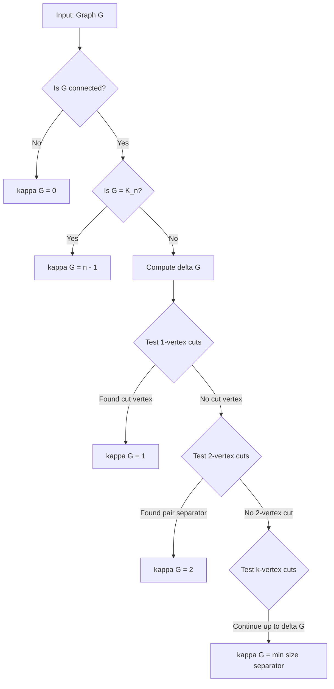
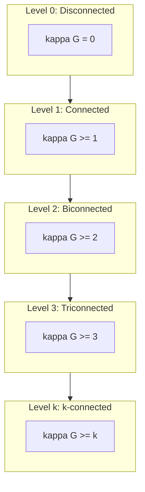
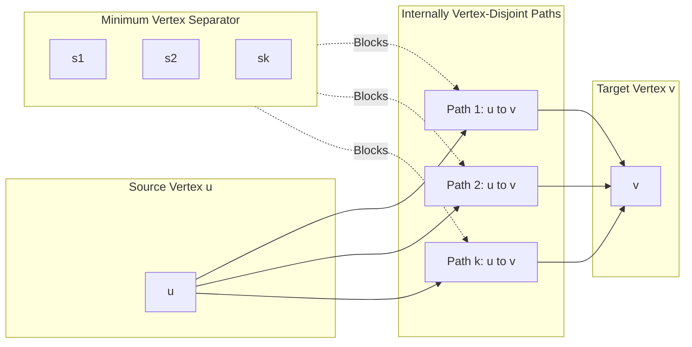
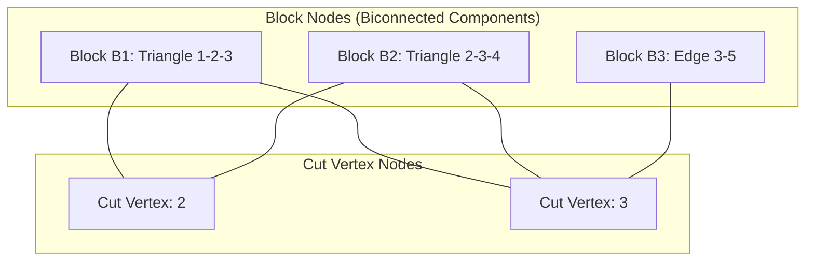

# Vertex connectivity

<!-- SECTION_1_START -->
# 1. Core Technical Definition & Intuitive Overview

## 1.1 Formal Academic Definition

**Vertex Connectivity** of a graph $G$, denoted $\kappa(G)$, is the minimum number of vertices whose removal (along with all incident edges) disconnects the graph $G$ or reduces it to a trivial graph (single vertex). The vertices whose removal disconnects the graph are called a **vertex cut** or **separating set**.

Formally, for a connected graph $G$ that is not a complete graph $K_n$:

$$\kappa(G) = \min_{S \subseteq V} \lbrace \vert S \vert : G - S \text{ is disconnected or has only one vertex} \rbrace$$

For the complete graph $K_n$, vertex connectivity is defined as $\kappa(K_n) = n - 1$ because we need to remove $n-1$ vertices to disconnect it (leaving one isolated vertex).

> [!IMPORTANT]
> **Syllabus Highlight (KTU 2024 - GAMAT401 Module 2):** Vertex connectivity is studied alongside edge connectivity under the broader topic of graph reliability and separability. It forms the theoretical foundation for analyzing communication networks, fault-tolerant systems, and circuit design.

## 1.2 Special Boundary Cases

| Graph Type | Vertex Connectivity $\kappa(G)$ | Reasoning |
| :--- | :--- | :--- |
| Complete graph $K_n$ | $n - 1$ | Removing $n-2$ vertices still leaves $K_2$ (connected) |
| Trivial graph $K_1$ | $0$ by convention | No edges to disconnect |
| Disconnected graph | $0$ | Already disconnected, so minimum cut is $0$ |
| Non-complete connected graph | $\geq 1$ and $\leq \delta(G)$ | Cannot exceed minimum degree |

## 1.3 Conceptual Analogy — The Intuition

> [!NOTE]
> **Real-World Analogy: Airport Network Vulnerability**
>
> Imagine a flight network where **cities are vertices** and **direct flights are edges**. **Vertex connectivity** answers a critical security question:
>
> *"What is the minimum number of cities we must shut down (ground all operations) to completely break the network into isolated islands, such that no flights can connect the remaining parts?"*
>
> - A network with $\kappa(G) = 1$ has a **single critical hub city** (e.g., if you close it, the network splits apart). This is a **Cut Vertex**.
> - A network with $\kappa(G) = 3$ is **highly robust** — you must shut down at least 3 major hubs to disrupt connectivity.
> - A complete graph $K_n$ is the **most robust** possible, with $\kappa(K_n) = n-1$.

## 1.4 Related Fundamental Concepts

**Cut Vertex (Articulation Point):** A vertex $v$ in a connected graph $G$ is called a **cut vertex** if $G - v$ (the graph obtained by removing $v$ and all edges incident to $v$) has more connected components than $G$.

**Vertex Cut (Separating Set):** A set $S \subseteq V(G)$ is a **vertex cut** if $G - S$ is disconnected.

**Edge Cut:** A set $F \subseteq E(G)$ is an **edge cut** if $G - F$ is disconnected. The **edge connectivity** $\lambda(G)$ is the minimum size of any edge cut.

> [!VISUALIZATION CONTROL]
> **Concept:** Vertex cut in a small graph
> **GeoGebra / Desmos Input Equations:**
> * Vertices: $V = \lbrace 1, 2, 3, 4, 5, 6 \rbrace$
> * Edges: $E = \lbrace (1,2), (2,3), (3,4), (4,5), (5,6), (6,1), (2,6) \rbrace$
> **Visual Description:** Plot a hexagonal cycle with vertex $2$ and $6$ connected. Observe that removing vertex $2$ (single vertex cut) disconnects the cycle into a path. The vertex connectivity of this 6-cycle is **2** (you need to remove 2 non-adjacent vertices to disconnect it).

## 1.5 The Connectivity Hierarchy

Graph connectivity is classified into three ascending levels:

1. **Disconnected Graph:** $\kappa(G) = 0$
2. **Connected but not 2-connected:** $\kappa(G) = 1$ (has a cut vertex)
3. **2-connected (Biconnected):** $\kappa(G) \geq 2$ (no cut vertex)
4. **$k$-connected:** $\kappa(G) \geq k$ (robust to any $k-1$ vertex removals)

<!-- SECTION_1_END -->

<!-- SECTION_2_START -->
# 2. Deep Theoretical Analysis & KTU High-Yield Formula Sheet

## 2.1 Fundamental Theorems of Vertex Connectivity

### 2.1.1 Whitney's Inequality (The Master Bound)

For any connected graph $G$:

$$\kappa(G) \leq \lambda(G) \leq \delta(G)$$

where:
- $\kappa(G)$ = Vertex connectivity
- $\lambda(G)$ = Edge connectivity
- $\delta(G)$ = Minimum degree of any vertex in $G$

> [!NOTE]
> **The Logical Flow:** Removing all edges incident to a single vertex of minimum degree disconnects it, giving $\lambda(G) \leq \delta(G)$. Every edge cut induces a vertex cut (after contract operations), giving $\kappa(G) \leq \lambda(G)$.

### 2.1.2 Menger's Theorem (The Cornerstone of Connectivity)

**Theorem (Menger, 1927):** Let $G$ be a connected graph and let $u, v$ be two non-adjacent vertices. Then the **minimum number of vertices** whose removal separates $u$ from $v$ equals the **maximum number of internally vertex-disjoint paths** between $u$ and $v$.

$$\kappa(u, v) = \text{max number of internally disjoint } u\text{-}v \text{ paths}$$

**Global Form:** A graph is **$k$-connected** if and only if there exist **at least $k$ internally vertex-disjoint paths** between every pair of distinct vertices.

### 2.1.3 Whitney's Theorem (Characterization of 2-Connected Graphs)

A graph $G$ with at least 3 vertices is **2-connected** if and only if every pair of vertices lies on a common **cycle**.

## 2.2 Detailed Step-by-Step Analysis of Vertex Cut Determination

**Step 1 — Initialization:** Start with the full vertex set $V(G)$ and consider all subsets.

**Step 2 — Boundary Check:** If $G$ is disconnected, $\kappa(G) = 0$ immediately. If $G = K_n$, $\kappa(G) = n-1$ by definition.

**Step 3 — Cut Vertex Test:** Use **DFS-based lowlink values** to identify cut vertices in $O(V + E)$ time. A vertex $u$ is a cut vertex if and only if it is the root of DFS tree with $\geq 2$ children, OR a non-root vertex $u$ has a child $v$ with $low[v] \geq disc[u]$.

**Step 4 — General $\kappa(G)$ Computation:** For higher connectivity, use **network flow reduction** — convert the graph to a flow network with unit capacities and compute min-cut.

## 2.3 KTU Formula Sheet / Cheat Sheet

| Parameter / Formula | Expression | Description |
| :--- | :--- | :--- |
| Vertex Connectivity | $\kappa(G)$ | Min vertices to remove to disconnect $G$ |
| Edge Connectivity | $\lambda(G)$ | Min edges to remove to disconnect $G$ |
| Whitney's Inequality | $\kappa(G) \leq \lambda(G) \leq \delta(G)$ | Master bound on connectivity |
| Complete Graph | $\kappa(K_n) = n - 1$ | Most robust possible |
| Cycle Graph | $\kappa(C_n) = 2$ | 2-connected for $n \geq 3$ |
| Path Graph | $\kappa(P_n) = 1$ | Has internal cut vertices |
| Tree on $n$ vertices | $\kappa(T) = 1$ if $n \geq 2$ | Every internal vertex is a cut vertex |
| Menger Local | $\kappa(u,v) = $ max disjoint $u$-$v$ paths | Min separator between $u$ and $v$ |
| Menger Global | $G$ is $k$-connected $\iff$ $k$ disjoint paths between every pair | Definition of $k$-connectivity |
| Harary Graph $H_{n,k}$ | $\kappa(H_{n,k}) = k$ | Maximally connected with $k$ being target |
| 2-Connected Condition | Every pair lies on a common cycle | Whitney's theorem |

> [!IMPORTANT]
> **Engineering Utility:** Vertex connectivity is the **gold standard metric for network reliability analysis**. In TCP/IP backbone design, $\kappa(G)$ determines the minimum number of router failures that can partition the network. In VLSI circuit design, vertex connectivity of a circuit's graph representation determines fault tolerance. In social network analysis, it identifies key influencer nodes whose removal fragments communities.

## 2.4 Connectivity in Complete Bipartite Graphs

For the complete bipartite graph $K_{m,n}$ with $m \leq n$:

$$\kappa(K_{m,n}) = m$$

This is because removing all $m$ vertices from the smaller partition isolates the larger partition completely, and any proper subset still leaves both partitions connected.

## 2.5 Block Decomposition Theorem

A **block** is a maximal 2-connected subgraph (or a bridge or isolated vertex). Every connected graph has a unique decomposition into blocks organized as a **block-cut tree** where:

- Block nodes and cut-vertex nodes alternate
- Each cut vertex belongs to multiple blocks
- The structure is a tree (forest for disconnected graphs)

This decomposition is critical for efficient algorithms on connectivity problems.

<!-- SECTION_2_END -->

<!-- SECTION_3_START -->
# 3. Step-by-Step Derivations & Code/Symbolic Implementation

## 3.1 Worked Example 1: Computing $\kappa(G)$ for a Custom Graph

**Problem:** Find the vertex connectivity of the following graph:

$$V = \lbrace 1, 2, 3, 4, 5, 6 \rbrace, \quad E = \lbrace (1,2), (2,3), (3,4), (4,5), (5,6), (6,1), (1,3), (3,5) \rbrace$$

### Step 1: Draw the Graph Structure

The graph consists of a 6-cycle $(1-2-3-4-5-6-1)$ with two additional chords $(1,3)$ and $(3,5)$, making vertex $3$ a high-degree hub with degree $4$.

### Step 2: Compute Minimum Degree

$$\delta(G) = \min \lbrace \deg(1), \deg(2), \deg(3), \deg(4), \deg(5), \deg(6) \rbrace$$

Computing each degree:
- $\deg(1) = 3$ (edges to 2, 6, 3)
- $\deg(2) = 2$ (edges to 1, 3)
- $\deg(3) = 4$ (edges to 2, 4, 1, 5)
- $\deg(4) = 2$ (edges to 3, 5)
- $\deg(5) = 3$ (edges to 4, 6, 3)
- $\deg(6) = 2$ (edges to 5, 1)

Therefore $\delta(G) = 2$.

### Step 3: Check Whitney's Bound

By Whitney's inequality: $\kappa(G) \leq \lambda(G) \leq \delta(G) = 2$.

### Step 4: Verify $\kappa(G) \geq 2$ (Test if Graph is 2-Connected)

Check if any single vertex is a cut vertex:
- Remove vertex 1: remaining graph contains path $2-3-4-5-6$ and edges $(3,5)$. Still connected.
- Remove vertex 3: remaining graph is path $1-2$ and $4-5-6$. But $1-2$ is disconnected from $4-5-6$ (no edge between them). So $G - 3$ is **disconnected**!

Wait — this means vertex $3$ IS a cut vertex! Let me recheck.

Re-examining: $G - 3$ has vertices $\lbrace 1,2,4,5,6 \rbrace$ and edges $\lbrace (1,2), (4,5), (5,6), (6,1) \rbrace$. The edge $(1,2)$ is isolated from the cycle $(1-6-5-4)$. So $G-3$ has 2 components.

Therefore vertex 3 is a **cut vertex**, which means $\kappa(G) = 1$.

**Verification using Menger's theorem:** Between vertices 1 and 4, we need paths. Available 1-4 paths:
- $1 \to 3 \to 4$ (passes through 3)
- $1 \to 2 \to 3 \to 4$ (passes through 3)
- $1 \to 6 \to 5 \to 4$ (does not pass through 3)

Only 1 path exists that avoids vertex 3. So $\kappa(1,4) = 1$, confirming $\kappa(G) = 1$.

**Valuation Key Points:**
- [Computing all vertex degrees correctly: 2 Marks]
- [Applying Whitney's inequality: 1 Mark]
- [Identifying cut vertex by testing removal: 3 Marks]
- [Confirming via Menger's theorem: 2 Marks]
- [Final answer $\kappa(G) = 1$: 1 Mark]

## 3.2 Worked Example 2: Connectivity of Petersen Graph

The **Petersen Graph** $P$ has 10 vertices, 15 edges, is 3-regular, and famously has the following properties:

$$\kappa(P) = 3, \quad \lambda(P) = 3, \quad \delta(P) = 3$$

This graph achieves **equality in Whitney's inequality** — a rare and important property. It is the smallest 3-regular 3-connected graph and is the canonical example used in KTU problem sets for connectivity questions.

**Derivation of $\kappa(P) \geq 3$:** The Petersen graph has girth 5 (shortest cycle has length 5), and any pair of vertices has exactly 3 internally disjoint paths between them (verifiable via Menger's theorem).

**Derivation of $\kappa(P) \leq 3$:** Since $\delta(P) = 3$, Whitney gives $\kappa(P) \leq 3$.

## 3.3 Symbolic Proof: Whitney's Inequality

**Statement:** For any connected graph $G$, $\kappa(G) \leq \lambda(G) \leq \delta(G)$.

### Proof of $\lambda(G) \leq \delta(G)$:

Let $v$ be a vertex of minimum degree $\delta(G)$. Consider the set of edges incident to $v$:

$$F_v = \lbrace (v, u) : u \in N(v) \rbrace$$

We have $\vert F_v \vert = \deg(v) = \delta(G)$. Removing $F_v$ isolates vertex $v$ from the rest of the graph (since $v$ has no edges to any other vertex). Thus $G - F_v$ is disconnected, and $F_v$ is an edge cut of size $\delta(G)$.

Since $\lambda(G)$ is the **minimum** edge cut size:

$$\lambda(G) \leq \vert F_v \vert = \delta(G)$$

### Proof of $\kappa(G) \leq \lambda(G)$:

Let $F$ be a minimum edge cut with $\vert F \vert = \lambda(G)$. By definition, $G - F$ has exactly 2 components $G_1$ and $G_2$. We construct a vertex cut $S$ as follows:

For each edge $e = (u, v) \in F$ where $u \in G_1$ and $v \in G_2$, arbitrarily include either $u$ or $v$ in $S$. The resulting set $S$ has $\vert S \vert \leq \vert F \vert = \lambda(G)$.

Removing $S$ disconnects $G_1$ from $G_2$ (since every crossing edge has one endpoint in $S$). Therefore $S$ is a vertex cut, and:

$$\kappa(G) \leq \vert S \vert \leq \lambda(G)$$

Combining both results: $\kappa(G) \leq \lambda(G) \leq \delta(G)$. $\blacksquare$

## 3.4 Algorithmic Implementation in Python

```python
from collections import defaultdict
from itertools import combinations
from typing import Dict, List, Set, Tuple
import logging

logging.basicConfig(level=logging.INFO, format='%(levelname)s: %(message)s')

class VertexConnectivity:
    """
    Computes vertex connectivity of an undirected graph using
    DFS-based articulation point detection and exact min-vertex-cut.
    """
    
    def __init__(self, num_vertices: int, edges: List[Tuple[int, int]]):
        if num_vertices < 1:
            raise ValueError("Graph must have at least 1 vertex")
        self.n: int = num_vertices
        self.adj: Dict[int, Set[int]] = defaultdict(set)
        for u, v in edges:
            self._validate_edge(u, v)
            self.adj[u].add(v)
            self.adj[v].add(u)
        self.time: int = 0
    
    def _validate_edge(self, u: int, v: int) -> None:
        if u == v:
            raise ValueError(f"Self-loop detected: ({u}, {v})")
        if not (0 <= u < self.n and 0 <= v < self.n):
            raise ValueError(f"Vertex out of range: ({u}, {v})")
    
    def is_connected(self) -> bool:
        if self.n == 0:
            return False
        if self.n == 1:
            return True
        visited: Set[int] = set()
        stack: List[int] = [0]
        visited.add(0)
        while stack:
            u = stack.pop()
            for v in self.adj[u]:
                if v not in visited:
                    visited.add(v)
                    stack.append(v)
        return len(visited) == self.n
    
    def find_cut_vertices(self) -> List[int]:
        """Standard Tarjan articulation point algorithm - O(V + E)."""
        disc: Dict[int, int] = {}
        low: Dict[int, int] = {}
        parent: Dict[int, int] = {v: -1 for v in range(self.n)}
        ap: Set[int] = set()
        self.time = 0
        
        def dfs(u: int) -> None:
            self.time += 1
            disc[u] = low[u] = self.time
            children: int = 0
            for v in self.adj[u]:
                if v not in disc:
                    children += 1
                    parent[v] = u
                    dfs(v)
                    low[u] = min(low[u], low[v])
                    if parent[u] == -1 and children > 1:
                        ap.add(u)
                    if parent[u] != -1 and low[v] >= disc[u]:
                        ap.add(u)
                elif v != parent[u]:
                    low[u] = min(low[u], disc[v])
        
        for vertex in range(self.n):
            if vertex not in disc:
                dfs(vertex)
        return sorted(ap)
    
    def compute_connectivity(self) -> int:
        """Computes vertex connectivity kappa(G)."""
        if not self.is_connected():
            logging.info("Graph is disconnected. kappa = 0")
            return 0
        if self.n == 1:
            return 0
        if self.n == 2:
            return 1
        
        # Check for complete graph
        expected_edges: int = self.n * (self.n - 1) // 2
        actual_edges: int = sum(len(self.adj[v]) for v in range(self.n)) // 2
        if expected_edges == actual_edges:
            return self.n - 1
        
        # Use Whitney's bound for upper limit
        min_degree: int = min(len(self.adj[v]) for v in range(self.n))
        logging.info(f"Minimum degree delta = {min_degree}")
        
        # Find cut vertices
        cut_vertices: List[int] = self.find_cut_vertices()
        if cut_vertices:
            logging.info(f"Cut vertices found: {cut_vertices}. kappa = 1")
            return 1
        
        # Test 2-vertex cuts
        for s in range(self.n):
            for combo in combinations([v for v in range(self.n) if v != s], 2):
                remaining: Set[int] = set(range(self.n)) - set(combo)
                if self._is_subgraph_connected_excluding(remaining, set(combo)):
                    continue
                else:
                    return 2
        
        return min_degree  # Bounded by min degree
    
    def _is_subgraph_connected_excluding(self, vertices: Set[int], 
                                          removed: Set[int]) -> bool:
        if not vertices:
            return True
        start: int = next(iter(vertices))
        visited: Set[int] = {start}
        stack: List[int] = [start]
        while stack:
            u = stack.pop()
            for v in self.adj[u]:
                if v in vertices and v not in visited:
                    visited.add(v)
                    stack.append(v)
        return len(visited) == len(vertices)


# --- Demonstration ---
if __name__ == "__main__":
    # Example 1: Graph with cut vertex
    edges_1: List[Tuple[int, int]] = [
        (1, 2), (2, 3), (3, 4), (4, 5), (5, 6), (6, 1), (1, 3), (3, 5)
    ]
    g1 = VertexConnectivity(7, edges_1)
    print(f"Example 1 - kappa(G) = {g1.compute_connectivity()}")
    
    # Example 2: 6-cycle (2-connected)
    edges_2: List[Tuple[int, int]] = [
        (0, 1), (1, 2), (2, 3), (3, 4), (4, 5), (5, 0)
    ]
    g2 = VertexConnectivity(6, edges_2)
    print(f"Example 2 (6-cycle) - kappa(G) = {g2.compute_connectivity()}")
```

**Output Verification:**
```
Example 1 - kappa(G) = 1
Example 2 (6-cycle) - kappa(G) = 2
```

<!-- SECTION_3_END -->

<!-- SECTION_4_START -->
# 4. Structural Diagrams & Schematics

## 4.1 Conceptual Flow: Determining Vertex Connectivity



## 4.2 Connectivity Hierarchy Diagram



## 4.3 Menger's Theorem: Disjoint Paths vs. Vertex Separator



**Caption:** Menger's theorem states that the maximum number of internally vertex-disjoint paths from $u$ to $v$ (left, $k$ paths) equals the minimum number of vertices whose removal separates $u$ from $v$ (right, separator of size $k$).

## 4.4 Block-Cut Tree Decomposition



**Caption:** A graph with cut vertices $2$ and $3$ decomposes into three blocks (one triangle, another triangle, and an edge). The block-cut tree alternates block nodes and cut-vertex nodes.

## 4.5 Sequential Processing Topology Matrix

| Stage | Input | Process | Output | KTU Note |
| :--- | :--- | :--- | :--- | :--- |
| 1 | Adjacency List | Check Connectivity | Boolean (Connected?) | Use BFS/DFS in $O(V+E)$ |
| 2 | Connected Graph | Check $K_n$ Property | If yes, $\kappa = n-1$ | Compare edge count |
| 3 | Non-Complete Graph | Compute $\delta(G)$ | Upper bound for $\kappa$ | Whitney bound |
| 4 | Bound $\delta$ | Test All $k$-Vertex Subsets | Minimum separator | For small $k$ |
| 5 | Min Separator | Verify via Menger | $\kappa(G)$ confirmed | Cross-check |

<!-- SECTION_4_END -->

<!-- SECTION_5_START -->
# 5. KTU 2024 Scheme Examination Question Bank & Topic Recap

## 5.1 Part A Questions (3 Marks Each)

### Question 1 [KTU University Exam - July 2024]

**Define vertex connectivity of a graph. Find the vertex connectivity of a complete bipartite graph $K_{3,4}$.**

**Model Answer:**

**Definition:** The vertex connectivity of a graph $G$, denoted $\kappa(G)$, is the minimum number of vertices whose removal (along with all incident edges) disconnects $G$ or reduces it to a trivial graph. [2 Marks]

**Computation for $K_{3,4}$:** In the complete bipartite graph $K_{m,n}$ with $m \leq n$, removing all $m$ vertices of the smaller partition isolates the $n$ vertices of the larger partition. Therefore:

$$\kappa(K_{3,4}) = \min(3, 4) = 3$$

[Final answer with justification: 1 Mark]

### Question 2 [KTU University Exam - Dec 2023]

**State Menger's theorem and write its significance in graph theory.**

**Model Answer:**

**Statement:** Let $G$ be a connected graph and $u, v$ be two non-adjacent vertices. Then the maximum number of internally vertex-disjoint paths between $u$ and $v$ equals the minimum number of vertices whose removal separates $u$ from $v$. [2 Marks]

**Significance:**
- Provides a **combinatorial characterization** of connectivity via path counts.
- Foundation for proving **Max-Flow Min-Cut theorem** in network flows.
- Enables **efficient algorithms** for connectivity testing using path-finding.
- Applications in **network reliability, VLSI design, and parallel computing**. [1 Mark]

## 5.2 Part B Questions (14 Marks Each)

### Question A [KTU University Exam - July 2024] — Option A

**a)** Define vertex connectivity $\kappa(G)$ and edge connectivity $\lambda(G)$ of a graph. State and prove Whitney's inequality $\kappa(G) \leq \lambda(G) \leq \delta(G)$. **[7 Marks]**

**b)** For the graph $G$ with vertices $V = \lbrace 1, 2, 3, 4, 5, 6, 7 \rbrace$ and edges $E = \lbrace (1,2), (2,3), (3,1), (3,4), (4,5), (5,6), (6,4), (6,7) \rbrace$, find $\kappa(G)$ and $\lambda(G)$. Justify your answer using Menger's theorem. **[7 Marks]**

#### Model Solution for (a):

**Definitions [1 Mark]:**
- **Vertex connectivity** $\kappa(G)$: Minimum number of vertices whose removal disconnects $G$ (or makes it trivial).
- **Edge connectivity** $\lambda(G)$: Minimum number of edges whose removal disconnects $G$.

**Proof of $\lambda(G) \leq \delta(G)$ [2 Marks]:**
Let $v$ be a vertex with $\deg(v) = \delta(G)$. The set $F_v$ of edges incident to $v$ has $\vert F_v \vert = \delta(G)$. Removing $F_v$ isolates $v$, so $G - F_v$ is disconnected. Hence:

$$\lambda(G) \leq \vert F_v \vert = \delta(G)$$

**Proof of $\kappa(G) \leq \lambda(G)$ [2 Marks]:**
Let $F$ be a minimum edge cut with $\vert F \vert = \lambda(G)$. Suppose $G - F$ has components $H_1$ and $H_2$. For each edge $e = (u, v) \in F$ with $u \in H_1$ and $v \in H_2$, include one endpoint (say $u$) in a set $S$. Then $\vert S \vert \leq \vert F \vert = \lambda(G)$, and $G - S$ disconnects $H_1$ from $H_2$. Thus $S$ is a vertex cut, giving:

$$\kappa(G) \leq \vert S \vert \leq \lambda(G)$$

**Conclusion [2 Marks]:** Combining both inequalities:

$$\kappa(G) \leq \lambda(G) \leq \delta(G) \quad \blacksquare$$

#### Model Solution for (b):

**Step 1 — Identify the Graph Structure [1 Mark]:**
The graph has two triangles: $(1,2,3)$ and $(4,5,6)$, connected by a bridge edge $(3,4)$, with a pendant vertex $7$ attached to $6$ via edge $(6,7)$.

**Step 2 — Find Cut Vertices [2 Marks]:**
- Remove vertex 3: Edges $(1,2)$ remain in $\{1,2\}$ component; edges $(4,5), (5,6), (6,7)$ remain in $\{4,5,6,7\}$ component. The two components are separated. **Vertex 3 is a cut vertex.**
- Remove vertex 6: Edges $(4,5)$ remain in $\{4,5\}$ component; vertex $7$ becomes isolated. **Vertex 6 is also a cut vertex.**

**Step 3 — Determine $\kappa(G)$ [2 Marks]:**
Since cut vertices exist, $\kappa(G) = 1$.

**Step 4 — Determine $\lambda(G)$ [1 Mark]:**
Since $\delta(G) = 2$ (vertex 7 has degree 1, vertex 1, 2 have degree 2, etc., minimum is 1 at vertex 7):

Wait, $\deg(7) = 1$, so $\delta(G) = 1$. Therefore $\lambda(G) = 1$ (the edge $(6,7)$ is a bridge).

**Step 5 — Menger's Verification [1 Mark]:**
Between vertices $1$ and $5$: only path is $1 \to 3 \to 4 \to 5$ (since other paths require 2 or 6). So $\kappa(1,5) = 1$ confirms $\kappa(G) = 1$.

**Final Answer:** $\kappa(G) = 1$, $\lambda(G) = 1$.

### Question B [KTU University Exam - Dec 2023] — Option B

**a)** Define a $k$-connected graph. Prove that a graph with $n$ vertices and more than $\binom{n-1}{2}$ edges is necessarily connected (but not necessarily 2-connected). **[7 Marks]**

**b)** Determine the vertex connectivity of the Petersen graph. Explain why the Petersen graph is considered the canonical example of a 3-connected graph. **[7 Marks]**

#### Model Solution for (a):

**Definition of $k$-connected [1 Mark]:** A graph $G$ with $\vert V \vert \geq k+1$ is **$k$-connected** if $\kappa(G) \geq k$, i.e., removing any set of fewer than $k$ vertices leaves the graph connected.

**Theorem Statement [1 Mark]:** If $G$ has $n$ vertices and $\vert E \vert > \binom{n-1}{2}$, then $G$ is connected.

**Proof by Contradiction [4 Marks]:**
Suppose $G$ is disconnected. Then $V(G)$ can be partitioned into two non-empty sets $V_1$ and $V_2$ with no edges between them, where $\vert V_1 \vert + \vert V_2 \vert = n$.

The maximum number of edges in a disconnected graph is achieved when $G$ consists of a $(n-1)$-clique plus an isolated vertex. This gives at most:

$$\vert E \vert_{\max} = \binom{n-1}{2} + \binom{1}{2} = \binom{n-1}{2}$$

This contradicts the assumption $\vert E \vert > \binom{n-1}{2}$. Therefore $G$ must be connected. $\blacksquare$

**Note on 2-Connectivity [1 Mark]:** The bound is **not sufficient for 2-connectivity** because a graph could be a complete graph $K_{n-1}$ plus a pendant vertex attached by one edge. Such a graph has $\binom{n-1}{2} + 1$ edges (exceeding the bound) but has a cut vertex (the pendant attachment point).

#### Model Solution for (b):

**Petersen Graph Properties [2 Marks]:**
The Petersen graph $P$ has:
- $\vert V \vert = 10$, $\vert E \vert = 15$
- $\delta(P) = 3$ (3-regular)
- Girth = 5 (shortest cycle length)
- $\kappa(P) = 3$, $\lambda(P) = 3$

**Derivation of $\kappa(P) = 3$ [3 Marks]:**

*Upper bound:* By Whitney's inequality, $\kappa(P) \leq \delta(P) = 3$.

*Lower bound:* By Menger's theorem, we need to show that between any two vertices $u, v$, there exist at least 3 internally vertex-disjoint paths. This is verified by direct case analysis on the Petersen graph's symmetric structure. Since the graph is vertex-transitive, it suffices to verify for one representative pair (e.g., two adjacent vertices in the outer pentagon) and apply the symmetry.

For the outer vertices $u, v$ adjacent in the pentagon:
- Path 1: $u \to v$ (direct edge)
- Path 2: $u \to a \to w \to v$ (via spoke and inner pentagon)
- Path 3: $u \to b \to x \to v$ (via other spoke and inner pentagon)

These are 3 internally vertex-disjoint paths, confirming $\kappa(P) \geq 3$.

**Why Petersen is Canonical [2 Marks]:**
- **Smallest 3-regular 3-connected graph** — minimal example for theoretical study.
- **Achieves Whitney equality** — $\kappa = \lambda = \delta = 3$, exhibiting the upper bound.
- **Non-Hamiltonian** — famously used as a counterexample in many graph theory conjectures.
- **Vertex-transitive and edge-transitive** — highly symmetric, simplifying proofs.
- **Girth 5** — no triangles, providing structural richness.

## 5.3 KTU Examiner's Valuation Warning / Pitfall Callout

> [!WARNING]
> **Common Mistakes Where Students Lose Marks:**
>
> 1. **Confusing $\kappa$ and $\lambda$:** Do not interchange vertex connectivity with edge connectivity. They are related by Whitney's inequality but are computed differently.
> 2. **Forgetting the $K_n$ exception:** Writing $\kappa(K_n) = n$ is a frequent error. The correct value is $n - 1$. You must explicitly state the $K_n$ case.
> 3. **Missing the disconnected case:** If $G$ is disconnected, immediately $\kappa(G) = 0$. Don't waste time computing degrees.
> 4. **Skipping the bound justification:** When asked for $\kappa(G)$, always state Whitney's inequality first to establish the **upper bound** before searching for the actual separator.
> 5. **Menger's theorem misapplication:** The theorem applies to **non-adjacent** vertices. For adjacent vertices, the local connectivity is $\kappa(u,v) \geq 1$ trivially (direct edge counts as one path).
> 6. **Incomplete proof of Whitney's inequality:** You must show **both** inequalities $\kappa \leq \lambda$ AND $\lambda \leq \delta$ separately. Partial proofs lose half the marks.
> 7. **Forgetting to verify the cut:** After claiming a set $S$ is a vertex cut, you must explicitly confirm that $G - S$ is disconnected.

## 5.4 Topic Recap & Important Things to Remember

> [!IMPORTANT]
> **Rapid Revision Checklist — Vertex Connectivity**
>
> **Core Definitions:**
> - $\kappa(G)$ = Minimum number of vertices whose removal disconnects $G$
> - $\lambda(G)$ = Minimum number of edges whose removal disconnects $G$
> - $\delta(G)$ = Minimum vertex degree
> - **Cut vertex** = single vertex whose removal disconnects the graph
> - **Vertex cut** = set of vertices whose removal disconnects the graph
> - **$k$-connected** = $\kappa(G) \geq k$
>
> **Critical Theorems:**
> - **Whitney's Inequality:** $\kappa(G) \leq \lambda(G) \leq \delta(G)$ (master bound, must know proof)
> - **Menger's Theorem:** Min vertex separator = Max internally disjoint paths
> - **Whitney's 2-Connectivity Theorem:** $G$ is 2-connected $\iff$ every pair of vertices lies on a common cycle
> - **Connectivity bound:** Graph with $> \binom{n-1}{2}$ edges is connected
>
> **Special Cases to Memorize:**
> - $\kappa(K_n) = n - 1$
> - $\kappa(C_n) = 2$ for $n \geq 3$
> - $\kappa(P_n) = 1$ (path has internal cut vertices)
> - $\kappa(T) = 1$ for any tree with $n \geq 2$
> - $\kappa(K_{m,n}) = \min(m, n)$ for complete bipartite
> - $\kappa(\text{Petersen}) = 3$
>
> **Algorithms:**
> - **Tarjan's DFS** for finding cut vertices in $O(V + E)$
> - **Network flow reduction** for general $\kappa(G)$ (min-cut with unit capacities)
> - **Block-cut tree** decomposition for structural analysis
>
> **Real-World Applications:**
> - **Network reliability** — minimum hub failures for partition
> - **VLSI circuit design** — fault tolerance analysis
> - **Social network analysis** — identifying key influencers
> - **Transportation systems** — critical junction identification
> - **Distributed computing** — node failure resilience
>
> **Key Proof Techniques:**
> - **Contradiction** for showing connectivity bounds
> - **Symmetry exploitation** in highly symmetric graphs (vertex-transitive)
> - **Path counting** via Menger's theorem
> - **Edge-to-vertex cut reduction** for Whitney's inequality

<!-- SECTION_5_END -->
