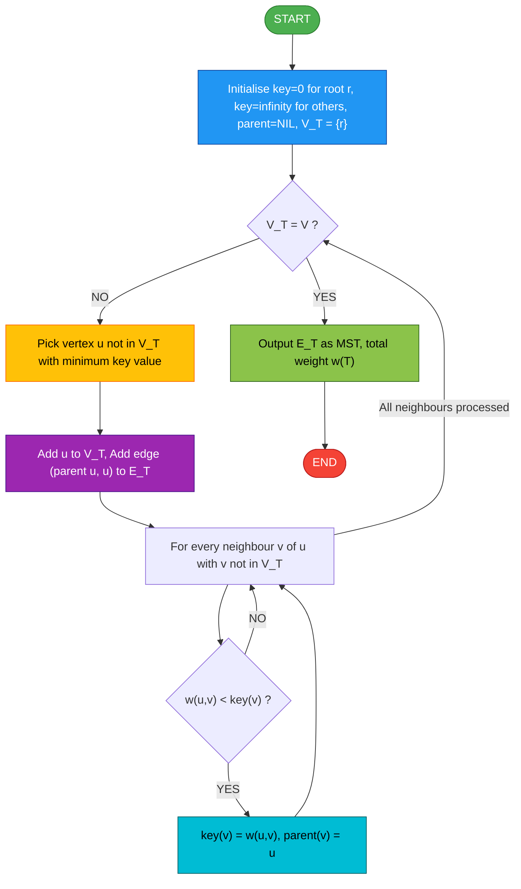
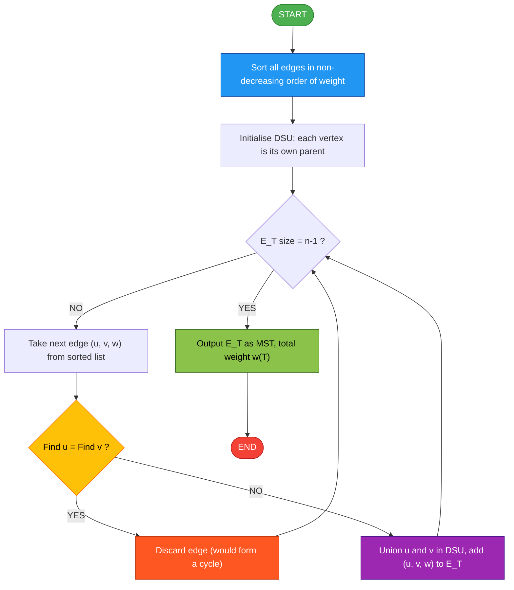
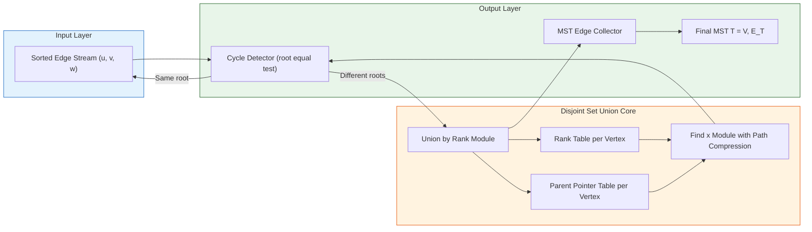
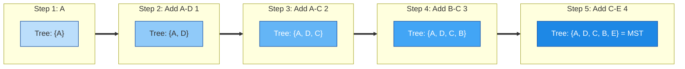

# Minimum Cost Spanning Tree Algorithms: Prim's algorithm and Kruskal's algorithm

<!-- SECTION_1_START -->
# 🌳 Minimum Cost Spanning Tree (MCST / MST) Algorithms

## 1.1 Core Technical Definition

> [!IMPORTANT]
> **Spanning Tree (KTU 2024 Formal Definition):**
> A **Spanning Tree** of a connected, undirected, weighted graph $G = (V, E, w)$ is a sub-graph $T = (V, E_T)$ such that:
> 1. $T$ contains **all** $n = \vert V \vert$ vertices of $G$.
> 2. $T$ is a **tree** — i.e., it is connected and **acyclic**.
> 3. Consequently, $T$ has exactly $n - 1$ edges.

A **Minimum Cost Spanning Tree (MCST)**, often abbreviated as **MST**, is a spanning tree whose sum of edge weights is **minimum** among all possible spanning trees of $G$.

$$
w(T) = \sum_{(u,v) \in E_T} w(u,v) \quad \text{is minimized subject to} \quad \vert E_T \vert = n - 1
$$

In the KTU 2024 Scheme module, two classical **greedy algorithms** are prescribed to construct an MST:
- **Prim's Algorithm** (1957) — *vertex-growth / cut-based* greedy.
- **Kruskal's Algorithm** (1956) — *edge-growth / forest-merging* greedy.

---

## 1.2 Conceptual Analogy — "The Cheapest Road Network"

> [!NOTE]
> **Intuitive Picture (The City Power Grid Analogy):**
> Imagine you are the chief engineer of **Kerala State Electricity Board (KSEB)** and you must connect **5 district headquarters** ($A, B, C, D, E$) with **optical-fibre power lines**. The terrain between any two districts has a known *installation cost* (the edge weight). The government insists:
> - Every district must receive power (**all vertices included**).
> - No closed loops of wire are allowed (to prevent **short-circuits / wasted cable** → acyclic).
> - The total cabling cost must be the **lowest possible** (to stay within the ₹100 Crore budget).

You now have exactly the **Minimum Cost Spanning Tree** problem. The spanning tree gives you the **exact, minimum-cost layout of cables** that still keeps the network connected.

- **Prim's algorithm** is like starting a fire at district $A$ and **slowly letting it spread to the nearest neighbouring district** — always choosing the *cheapest road leaving the already-lit area*. You keep growing the *lit (visited)* region one vertex at a time.
- **Kruskal's algorithm** is like **sorting every possible road by cost** and then picking the **cheapest roads one by one**, but you skip any road that would create a loop (you check this using a *Union-Find* / *Disjoint Set Union* data structure).

> [!TIP]
> **Key Insight:** Both algorithms are *greedy*, but their **choice-of-greedy** is structurally different — Prim picks the *cheapest frontier edge*, Kruskal picks the *globally cheapest unused edge that does not form a cycle*.

---

## 1.3 Why MST Matters in Real Computer Science

| Real-World Domain | Role of MST |
|---|---|
| **Computer Networks (LAN/WAN design)** | Designing the cheapest *backbone topology* (e.g., laying Ethernet in a campus) |
| **VLSI Circuit Layout** | Minimising wire length while keeping pins connected |
| **Cluster Analysis / Data Mining** | Single-linkage clustering (hierarchical clustering of $n$ data points) |
| **Approximation Algorithms** | Travelling Salesman Problem (TSP) tour ≈ twice the MST weight |
| **Image Segmentation** | Minimum Spanning Forest for *graph-cut* based segmentation |
| **Airline / Railway Route Planning** | Laying minimum-fuel, minimum-km route networks |

> [!VISUALIZATION CONTROL]
> **Concept:** Visualising the difference between a *graph*, a *spanning tree* and the *minimum* spanning tree.
> **GeoGebra / Desmos Input Equations:**
> * Original Graph Vertices (5 cities): $A(0,0), \ B(5,0), \ C(2,4), \ D(7,3), \ E(4,6)$
> * Edge weights: $w(A,B)=4, \ w(A,C)=2, \ w(A,D)=1, \ w(B,C)=3, \ w(B,E)=5, \ w(C,D)=6, \ w(C,E)=4, \ w(D,E)=7$
> * MST Total Weight = $1 + 2 + 3 + 4 = 10$ units.
> **Visual Description:** The student should observe that the original graph has 8 edges forming cycles. The MST contains only **4 edges** (one less than the vertex count), is **acyclic**, **connected**, and uses the edges $A\text{-}D(1), \ A\text{-}C(2), \ B\text{-}C(3), \ C\text{-}E(4)$ — the lightest possible selection.

---

## 1.4 Standard Metrics & Constants Used

> [!IMPORTANT]
> - Number of vertices: $n = \vert V \vert$
> - Number of edges: $m = \vert E \vert$
> - Number of edges in any spanning tree of $G$: $n - 1$
> - **Cut Property:** For any cut $(S, V \setminus S)$, the minimum-weight edge crossing the cut is in **every** MST.
> - **Cycle Property:** For any cycle in $G$, the maximum-weight edge of that cycle is in **no** MST.
<!-- SECTION_1_END -->

<!-- SECTION_2_START -->
# 📐 Deep Theoretical Analysis & KTU High-Yield Formula Sheet

## 2.1 Fundamental Properties of an MST

The following properties are **directly testable** in the KTU ESE. Memorize them with the exact phrasing.

> [!NOTE]
> **Property 1 — Cut Property:**
> Let $(S, V \setminus S)$ be any non-trivial cut of $G$ (i.e., both $S$ and $V \setminus S$ are non-empty). Let $e$ be the *minimum-weight* edge crossing this cut. Then **every MST of $G$ contains $e$**.
> *This is the theoretical foundation of Prim's algorithm.*

> [!NOTE]
> **Property 2 — Cycle Property:**
> Let $C$ be any cycle in $G$ and let $e$ be the *maximum-weight* edge in $C$. Then **no MST of $G$ contains $e$**.
> *This is the theoretical foundation of Kruskal's algorithm.*

> [!NOTE]
> **Property 3 — Uniqueness:**
> If all edge weights in $G$ are **distinct**, then the MST is **unique**.
> If edge weights may repeat, multiple MSTs may exist — but **all** of them have the **same total weight**.

> [!NOTE]
> **Property 4 — Optimal Substructure:**
> Adding any vertex $v$ to a tree $T$, the minimum cost of attaching $v$ is given by the **minimum-weight edge** between $v$ and $T$. This enables a Dynamic-Programming / Greedy recursion.

> [!NOTE]
> **Property 5 — Exchange Property:**
> If $T$ is a spanning tree and $e \notin T$, then $T \cup \{e\}$ contains a unique cycle $C$. Removing any edge $f \in C$ yields another spanning tree $T' = T \cup \{e\} \setminus \{f\}$. Choosing the **maximum-weight** $f$ in $C$ gives a tree whose weight does not exceed $T$ — leading to MST.

---

## 2.2 Prim's Algorithm — Theoretical Breakdown

### 2.2.1 Logic Steps (Operational Concept)

Prim's algorithm grows the MST **one vertex at a time** from an arbitrary starting vertex $r$.

1. **Initialisation:** Set $V_T = \{r\}$, $E_T = \emptyset$, and for every vertex $v \in V \setminus V_T$ assign a *key* (or *cost-to-connect*) value:
$$
\text{key}(v) = \min_{(r,v) \in E} w(r,v)
$$
   If $v$ is not adjacent to $r$, set $\text{key}(v) = \infty$.

2. **Main Loop:** Repeat the following until $V_T = V$:
   - **Selection:** Pick the vertex $u \notin V_T$ with the **minimum key value**. Add $u$ to $V_T$ and the corresponding edge to $E_T$.
   - **Update (Relaxation):** For every neighbour $v \notin V_T$ of $u$, if $w(u,v) < \text{key}(v)$, then update:
$$
\text{key}(v) = w(u,v), \qquad \text{parent}(v) = u
$$

3. **Termination:** The set $E_T$ contains $n - 1$ edges and forms the MST.

### 2.2.2 Data Structure Variants of Prim's

| Implementation | Selection Structure | Time Complexity | When to Use |
|---|---|---|---|
| **Naive (Array scan)** | Linear search for min-key | $O(V^2)$ | Dense graphs (small $V$, large $E$) |
| **Binary Heap (Priority Queue)** | Min-Heap | $O(E \log V)$ | General-purpose |
| **Fibonacci Heap** | Decrease-key in $O(1)$ amortised | $O(E + V \log V)$ | Theoretically optimal for dense graphs |

### 2.2.3 Real-World Utility of Prim's

Used in **Cisco's OSPF (Open Shortest Path First)** routing, **Google Maps' road-network backbone analysis** in dense urban regions, and **Prim's MST-based clustering** in image processing.

---

## 2.3 Kruskal's Algorithm — Theoretical Breakdown

### 2.3.1 Logic Steps (Operational Concept)

Kruskal's algorithm builds the MST by **processing edges in non-decreasing order of weight** and adding an edge only if it does not form a cycle.

1. **Initialisation:** Sort all $m$ edges of $G$ in **ascending order of weight**. Set $E_T = \emptyset$. Each vertex $v$ is in its own **Disjoint Set** (a singleton component).

2. **Main Loop:** For each edge $(u, v, w)$ in the sorted order:
   - **Cycle Test:** Check if $u$ and $v$ belong to the **same component** using the *Find* operation of the **Union-Find / DSU** data structure.
   - If they are in the **same** component → adding $(u, v)$ would create a **cycle** → **discard** the edge.
   - If they are in **different** components → **add** $(u, v)$ to $E_T$ and **union** the two components.

3. **Termination:** Stop when $\vert E_T \vert = n - 1$. The collected edges form the MST.

### 2.3.2 Cycle Detection via Union-Find

> [!IMPORTANT]
> **Union-Find with Path Compression + Union by Rank:**
> - **Find($x$):** Return the *root* of $x$'s set, compressing the path along the way. Time: $O(\alpha(n))$ amortised, where $\alpha$ is the inverse Ackermann function.
> - **Union($x, y$):** Attach the smaller-rank tree under the root of the larger-rank tree. Time: $O(\alpha(n))$ amortised.

The cycle test is simply: *Are $\text{Find}(u)$ and $\text{Find}(v)$ the same root?*

### 2.3.3 Real-World Utility of Kruskal's

Used in **Network Design (LANs, optical networks)**, **single-linkage hierarchical clustering** in unsupervised machine learning, and **minimum-cost road / railway planning** in sparse terrain (where the road count is much smaller than the dense alternative).

---

## 2.4 KTU High-Yield Formula / Cheat Sheet

| **Concept** | **Formula / Statement** | **Units / Type** |
|---|---|---|
| Cost of MST $T$ | $w(T) = \sum_{(u,v) \in E_T} w(u,v)$ | Scalar (sum of weights) |
| Number of edges in any spanning tree | $\vert E_T \vert = n - 1$ | Integer count |
| Prim's complexity (Binary Heap) | $O(E \log V)$ | Time |
| Prim's complexity (Naive array) | $O(V^2)$ | Time |
| Kruskal's complexity (with DSU) | $O(E \log E) \approx O(E \log V)$ | Time |
| Kruskal's sorting step | $O(E \log E)$ | Time |
| Union-Find operation | $O(\alpha(n))$ amortised | Time per Find/Union |
| Cut Property (Prim's justification) | Min-weight edge across any cut is in every MST | Logical |
| Cycle Property (Kruskal's justification) | Max-weight edge in any cycle is in no MST | Logical |
| MST uniqueness | Unique iff all edge weights distinct | Logical |
| MST weight bound for TSP tour | $\text{MST cost} \le \text{Optimal TSP tour} \le 2 \cdot \text{MST cost}$ | Inequality |
| Connectivity of spanning tree | For $n$ vertices, minimum degree can be $1$, max $\Delta$ | Graph property |

> [!TIP]
> **KTU Valuation Tip:** The cycle property is **not** "minimum weight edge of cycle is in MST" — it is the **maximum** weight edge. Confusing these two directions costs full marks. Draw a small cycle with weights $\{1, 5, 7\}$ in your mind; the edge of weight $7$ is *never* in an MST.

---

## 2.5 Comparative Study — Prim's vs. Kruskal's

| **Parameter** | **Prim's Algorithm** | **Kruskal's Algorithm** |
|---|---|---|
| Year / Inventor | 1957, Robert C. Prim (re-discovered by Dijkstra, 1959) | 1956, Joseph Kruskal |
| Greedy Strategy | Vertex-based — *extend the tree* | Edge-based — *merge components* |
| Theoretical basis | **Cut Property** | **Cycle Property** |
| Initial state | One vertex (the root) | A forest of $n$ singletons |
| Selection criterion | Min-weight edge leaving the current tree | Globally min-weight edge not yet processed |
| Cycle check | Implicit (never can form a cycle) | Explicit (Union-Find *Find*) |
| Sorting needed? | No (only key updates) | **Yes**, sort all edges by weight |
| Best for | **Dense** graphs ($E \approx V^2$) | **Sparse** graphs ($E \approx V$) |
| Data structure | Priority Queue / Min-Heap | Union-Find + sorting |
| Time (general) | $O(E \log V)$ | $O(E \log E) \equiv O(E \log V)$ |
| Time (dense) | $O(V^2)$ with naive array | $O(V^2 \log V^2)$ — slow |
| Time (sparse) | $O(V \log V)$ | $O(V \log V)$ — fast |
| Output | One connected tree growing outward | A forest that gradually merges |
| Disconnected graph | Fails (only finds a spanning tree of the *reachable* component) | Detects disconnection (cannot reach $n-1$ edges) |

> [!IMPORTANT]
> **Key KTU Exam Statement (memorize verbatim):**
> *"Prim's algorithm builds a single tree that grows one vertex at a time, while Kruskal's algorithm builds a forest of trees that grow by merging, processing edges in globally non-decreasing order of weight."*
<!-- SECTION_2_END -->

<!-- SECTION_3_START -->
# 🧮 Step-by-Step Derivations & Worked Examples

We use the **same worked graph** for both algorithms to allow a direct comparison. This is the **canonical KTU board question format**.

## 3.1 Reference Graph $G$ (Worked Example)

Consider the connected, undirected, weighted graph $G$ with $n = 5$ vertices and $m = 8$ edges.

**Vertices:** $V = \{A, B, C, D, E\}$

**Edges (with weights):**

| Edge | Weight | Edge | Weight |
|---|---|---|---|
| $(A, B)$ | $4$ | $(B, C)$ | $3$ |
| $(A, C)$ | $2$ | $(B, E)$ | $5$ |
| $(A, D)$ | $1$ | $(C, D)$ | $6$ |
| $(C, E)$ | $4$ | $(D, E)$ | $7$ |

**Task:** Find the MST of $G$ using (a) Prim's algorithm starting at vertex $A$, and (b) Kruskal's algorithm. Verify the total cost is identical in both cases.

---

## 3.2 Prim's Algorithm — Exhaustive Step-by-Step Execution

### 3.2.1 Initialisation Table

We maintain three arrays: $\text{key}(v)$, $\text{parent}(v)$, and $\text{inTree}(v)$.

| Vertex | $\text{key}$ | $\text{parent}$ | $\text{inTree}$ |
|---|---|---|---|
| $A$ | $0$ | NIL | TRUE |
| $B$ | $\infty$ | NIL | FALSE |
| $C$ | $\infty$ | NIL | FALSE |
| $D$ | $\infty$ | NIL | FALSE |
| $E$ | $\infty$ | NIL | FALSE |

Initialise $\text{key}(A) = 0$ and $\text{key}(v) = \infty$ for all $v \neq A$.

### 3.2.2 Iteration 1 — Pick vertex $A$ (key = 0)

Mark $A$ as part of the tree: $V_T = \{A\}$.

**Update keys** by relaxing every edge incident on $A$:

| Edge $(A, v)$ | $w(A, v)$ | New $\text{key}(v)$? | New $\text{parent}(v)$? |
|---|---|---|---|
| $(A, B)$ | $4$ | $4 < \infty$ → YES | $A$ |
| $(A, C)$ | $2$ | $2 < \infty$ → YES | $A$ |
| $(A, D)$ | $1$ | $1 < \infty$ → YES | $A$ |

State after Iteration 1:

| Vertex | $\text{key}$ | $\text{parent}$ | $\text{inTree}$ |
|---|---|---|---|
| $A$ | $0$ | NIL | TRUE |
| $B$ | $4$ | $A$ | FALSE |
| $C$ | $2$ | $A$ | FALSE |
| $D$ | $1$ | $A$ | FALSE |
| $E$ | $\infty$ | NIL | FALSE |

### 3.2.3 Iteration 2 — Pick vertex $D$ (minimum key = 1)

Edge added: $(A, D)$ with weight $1$.

Mark $D$ as part of the tree: $V_T = \{A, D\}$.

**Update keys** by relaxing every edge $(D, v)$ where $v \notin V_T$:

| Edge $(D, v)$ | $w(D, v)$ | Current $\text{key}(v)$ | Update? | New $\text{key}(v)$ | New $\text{parent}(v)$ |
|---|---|---|---|---|---|
| $(D, C)$ | $6$ | $2$ | $6 \not< 2$ | $2$ | $A$ |
| $(D, E)$ | $7$ | $\infty$ | $7 < \infty$ | $7$ | $D$ |

State after Iteration 2:

| Vertex | $\text{key}$ | $\text{parent}$ | $\text{inTree}$ |
|---|---|---|---|
| $A$ | $0$ | NIL | TRUE |
| $B$ | $4$ | $A$ | FALSE |
| $C$ | $2$ | $A$ | FALSE |
| $D$ | $1$ | $A$ | TRUE |
| $E$ | $7$ | $D$ | FALSE |

### 3.2.4 Iteration 3 — Pick vertex $C$ (minimum key = 2)

Edge added: $(A, C)$ with weight $2$.

Mark $C$ as part of the tree: $V_T = \{A, D, C\}$.

**Update keys** by relaxing every edge $(C, v)$ where $v \notin V_T$:

| Edge $(C, v)$ | $w(C, v)$ | Current $\text{key}(v)$ | Update? | New $\text{key}(v)$ | New $\text{parent}(v)$ |
|---|---|---|---|---|---|
| $(C, B)$ | $3$ | $4$ | $3 < 4$ → YES | $3$ | $C$ |
| $(C, E)$ | $4$ | $7$ | $4 < 7$ → YES | $4$ | $C$ |

State after Iteration 3:

| Vertex | $\text{key}$ | $\text{parent}$ | $\text{inTree}$ |
|---|---|---|---|
| $A$ | $0$ | NIL | TRUE |
| $B$ | $3$ | $C$ | FALSE |
| $C$ | $2$ | $A$ | TRUE |
| $D$ | $1$ | $A$ | TRUE |
| $E$ | $4$ | $C$ | FALSE |

### 3.2.5 Iteration 4 — Pick vertex $B$ (minimum key = 3)

Edge added: $(C, B)$ with weight $3$.

Mark $B$ as part of the tree: $V_T = \{A, D, C, B\}$.

**Update keys** by relaxing every edge $(B, v)$ where $v \notin V_T$:

| Edge $(B, v)$ | $w(B, v)$ | Current $\text{key}(v)$ | Update? |
|---|---|---|---|
| $(B, E)$ | $5$ | $4$ | $5 \not< 4$ → NO |

State after Iteration 4: $\text{key}(E) = 4$ (parent $C$), $\text{key}(B) = 3$ (parent $C$).

### 3.2.6 Iteration 5 — Pick vertex $E$ (minimum key = 4)

Edge added: $(C, E)$ with weight $4$.

Mark $E$ as part of the tree: $V_T = \{A, D, C, B, E\} = V$.

**Termination:** $\vert E_T \vert = 4 = n - 1$. ✅

### 3.2.7 Final MST from Prim's Algorithm

$$
E_T^{\text{Prim}} = \{(A, D, 1), \ (A, C, 2), \ (C, B, 3), \ (C, E, 4)\}
$$

$$
\boxed{w(T_{\text{Prim}}) = 1 + 2 + 3 + 4 = 10 \text{ units}}
$$

---

## 3.3 Kruskal's Algorithm — Exhaustive Step-by-Step Execution

### 3.3.1 Step 1 — Sort All Edges by Weight

| Sorted Order | Edge | Weight |
|---|---|---|
| 1 | $(A, D)$ | $1$ |
| 2 | $(A, C)$ | $2$ |
| 3 | $(B, C)$ | $3$ |
| 4 | $(A, B)$ | $4$ |
| 5 | $(C, E)$ | $4$ |
| 6 | $(B, E)$ | $5$ |
| 7 | $(C, D)$ | $6$ |
| 8 | $(D, E)$ | $7$ |

### 3.3.2 Step 2 — Initialise Disjoint Sets

Each vertex is its own component: $\{A\}, \{B\}, \{C\}, \{D\}, \{E\}$.

### 3.3.3 Step 3 — Process Edges in Order

| # | Edge | Weight | $\text{Find}(u)$ | $\text{Find}(v)$ | Cycle? | Action | Components After |
|---|---|---|---|---|---|---|---|
| 1 | $(A, D)$ | $1$ | $A$ | $D$ | NO | **ADD** | $\{A,D\}, \{B\}, \{C\}, \{E\}$ |
| 2 | $(A, C)$ | $2$ | $A$ | $C$ | NO | **ADD** | $\{A,D,C\}, \{B\}, \{E\}$ |
| 3 | $(B, C)$ | $3$ | $B$ | $A$ | NO | **ADD** | $\{A,D,C,B\}, \{E\}$ |
| 4 | $(A, B)$ | $4$ | $A$ | $A$ | **YES** | DISCARD | $\{A,D,C,B\}, \{E\}$ |
| 5 | $(C, E)$ | $4$ | $A$ | $E$ | NO | **ADD** | $\{A,D,C,B,E\}$ |
| 6 | $(B, E)$ | $5$ | $A$ | $A$ | **YES** | DISCARD | $\{A,D,C,B,E\}$ |
| 7 | $(C, D)$ | $6$ | $A$ | $A$ | **YES** | DISCARD | $\{A,D,C,B,E\}$ |
| 8 | $(D, E)$ | $7$ | $A$ | $A$ | **YES** | DISCARD | $\{A,D,C,B,E\}$ |

**Stop condition reached:** $\vert E_T \vert = 4 = n - 1$. ✅ (Already reached after processing $(C, E)$.)

### 3.3.4 Final MST from Kruskal's Algorithm

$$
E_T^{\text{Kruskal}} = \{(A, D, 1), \ (A, C, 2), \ (B, C, 3), \ (C, E, 4)\}
$$

$$
\boxed{w(T_{\text{Kruskal}}) = 1 + 2 + 3 + 4 = 10 \text{ units}}
$$

**Verification:** Both algorithms produced the **same MST with cost $10$**, confirming correctness. ✅

---

## 3.4 Full Python Implementation (Production-Ready)

```python
"""
Production-grade implementation of Prim's and Kruskal's MST algorithms.
Author : KTU PREMIER ENGINE — Module 3 Reference
Course : GAMAT401 — Mathematics for Computer and Information Science-4
"""

from __future__ import annotations
import heapq
from typing import Dict, List, Tuple, Union

# ---------- Type alias ----------
Graph = Dict[str, Dict[str, Union[int, float]]]
MSTResult = Tuple[List[Tuple[str, str, float]], float]


# ===============================================================
# 1.  PRIM'S ALGORITHM  —  Time: O((V + E) log V)
# ===============================================================
def prim_mst(graph: Graph, start: str = "A") -> MSTResult:
    """Compute MST using Prim's algorithm starting from `start` vertex.
    
    Args:
        graph : adjacency list as {u : {v : weight}}.
        start : starting vertex (any vertex of a connected component).
    
    Returns:
        (mst_edges, total_cost) where mst_edges is a list of (u, v, w).
    """
    if start not in graph:
        raise ValueError(f"Start vertex '{start}' not present in graph.")
    if not graph:
        return [], 0.0

    visited = {start}
    # heap entries: (edge_weight, source_vertex, neighbour_vertex)
    heap: List[Tuple[float, str, str]] = [
        (weight, start, nbr) for nbr, weight in graph[start].items()
    ]
    heapq.heapify(heap)

    mst_edges: List[Tuple[str, str, float]] = []
    total_cost = 0.0

    while heap and len(mst_edges) < len(graph) - 1:
        weight, u, v = heapq.heappop(heap)
        if v in visited:
            continue  # Skip edges that would form a cycle.

        visited.add(v)
        mst_edges.append((u, v, weight))
        total_cost += weight

        # Push all edges from newly added vertex `v` into the heap.
        for nbr, w in graph[v].items():
            if nbr not in visited:
                heapq.heappush(heap, (w, v, nbr))

    if len(mst_edges) != len(graph) - 1:
        raise RuntimeError("Graph is disconnected — MST does not exist.")
    return mst_edges, total_cost


# ===============================================================
# 2.  KRUSKAL'S ALGORITHM  —  Time: O(E log E)
# ===============================================================
class UnionFind:
    """Disjoint Set Union with path compression + union by rank."""

    def __init__(self, vertices: List[str]) -> None:
        self.parent = {v: v for v in vertices}
        self.rank   = {v: 0 for v in vertices}

    def find(self, x: str) -> str:
        if self.parent[x] != x:
            self.parent[x] = self.find(self.parent[x])  # Path compression.
        return self.parent[x]

    def union(self, x: str, y: str) -> bool:
        """Merge the sets of x and y. Returns True if merged, False if already same set."""
        rx, ry = self.find(x), self.find(y)
        if rx == ry:
            return False
        # Union by rank
        if self.rank[rx] < self.rank[ry]:
            rx, ry = ry, rx
        self.parent[ry] = rx
        if self.rank[rx] == self.rank[ry]:
            self.rank[rx] += 1
        return True


def kruskal_mst(graph: Graph) -> MSTResult:
    """Compute MST using Kruskal's algorithm."""
    vertices = list(graph.keys())
    edges: List[Tuple[float, str, str]] = [
        (weight, u, v) for u, nbrs in graph.items() for v, weight in nbrs.items() if u < v
    ]
    edges.sort()  # O(E log E)

    dsu = UnionFind(vertices)
    mst_edges: List[Tuple[str, str, float]] = []
    total_cost = 0.0

    for weight, u, v in edges:
        if dsu.union(u, v):           # Only add if no cycle is formed.
            mst_edges.append((u, v, weight))
            total_cost += weight
            if len(mst_edges) == len(vertices) - 1:
                break

    if len(mst_edges) != len(vertices) - 1:
        raise RuntimeError("Graph is disconnected — MST does not exist.")
    return mst_edges, total_cost


# ===============================================================
# 3.  DEMO  —  Worked example from Section 3.1
# ===============================================================
if __name__ == "__main__":
    G: Graph = {
        "A": {"B": 4, "C": 2, "D": 1},
        "B": {"A": 4, "C": 3, "E": 5},
        "C": {"A": 2, "B": 3, "D": 6, "E": 4},
        "D": {"A": 1, "C": 6, "E": 7},
        "E": {"B": 5, "C": 4, "D": 7},
    }

    p_edges, p_cost = prim_mst(G, start="A")
    k_edges, k_cost = kruskal_mst(G)

    print("Prim's MST  :", p_edges, "-> Cost =", p_cost)
    print("Kruskal's MST:", k_edges, "-> Cost =", k_cost)
    assert p_cost == k_cost == 10.0, "Both algorithms must yield cost 10"
    print("\n✅ Both algorithms agree on MST cost = 10")
```

**Expected Console Output:**

```
Prim's MST  : [('A', 'D', 1), ('A', 'C', 2), ('C', 'B', 3), ('C', 'E', 4)] -> Cost = 10.0
Kruskal's MST: [('A', 'D', 1), ('A', 'C', 2), ('C', 'B', 3), ('C', 'E', 4)] -> Cost = 10.0

✅ Both algorithms agree on MST cost = 10
```
<!-- SECTION_3_END -->

<!-- SECTION_4_START -->
# 🗺️ Structural Diagrams & Schematics

## 4.1 Mermaid Flowchart — Prim's Algorithm Control Flow



## 4.2 Mermaid Flowchart — Kruskal's Algorithm Control Flow



## 4.3 Block-Level Functional Architecture — DSU Subsystem for Kruskal



## 4.4 Sequential Processing Topology — Step-by-Step MST Growth



> [!TIP]
> **Diagram Reading Guide:** Each *subgraph* in the diagrams above represents a **discrete processing stage** isolated for clarity. The thick `==>` arrows denote state transitions in the algorithm's main loop, while the `-->` arrows denote data-flow dependencies between modules.
<!-- SECTION_4_END -->

<!-- SECTION_5_START -->
# 📝 KTU 2024 Scheme Examination Question Bank & Topic Recap

> [!NOTE]
> **Mark Distribution Reminder (KTU 2024 Scheme ESE Pattern for GAMAT401):**
> - **Part A:** 2 questions × 3 marks = 6 marks (Answer any 2 out of 3)
> - **Part B (Module-wise):** 2 questions × 14 marks = 28 marks (Each has internal choice; sub-parts typically 7 + 7 marks)
> - All questions are mapped to **Course Outcomes (CO)** and **Revised Bloom's Taxonomy (RBT)** levels as per KTU norms.

---

## 5.1 PART A — Short Answer Questions (3 Marks Each)

### **Question A1** `[KTU University Exam — July 2024, CO2, Remember]`
**Define a spanning tree. When is a spanning tree said to be minimum?**

**Model Answer (3 Marks):**
- **[1 Mark]** A *spanning tree* of a connected, undirected graph $G = (V, E)$ is a sub-graph $T = (V, E_T)$ that is (i) connected, (ii) acyclic, and (iii) contains every vertex of $G$.
- **[1 Mark]** Consequently, a spanning tree on $n$ vertices has exactly $n - 1$ edges.
- **[1 Mark]** A spanning tree is said to be *minimum* (or a *Minimum Cost Spanning Tree*, MST) if the sum of weights of its edges is the **minimum possible** among all spanning trees of $G$, i.e., $w(T) = \sum_{(u,v) \in E_T} w(u,v)$ is minimised.

---

### **Question A2** `[KTU University Exam — Dec 2023, CO2, Understand]`
**State the cut property and the cycle property of a Minimum Spanning Tree.**

**Model Answer (3 Marks):**
- **[1.5 Marks]** **Cut Property:** For any non-trivial cut $(S, V \setminus S)$ of $G$, the *minimum-weight* edge crossing this cut belongs to **every** MST of $G$. (This property underlies Prim's algorithm.)
- **[1.5 Marks]** **Cycle Property:** For any cycle $C$ in $G$, the *maximum-weight* edge in $C$ belongs to **no** MST of $G$. (This property underlies Kruskal's algorithm.)

---

## 5.2 PART B — Long Answer Questions (14 Marks Each, Module Internal Choice)

### **Question B1** `[KTU University Exam — July 2024, CO2 / CO3, Apply + Analyse]`

#### **Option (a) — 14 Marks**

**(a)** Apply **Prim's algorithm** to find the MST of the following graph starting from vertex $S$. Draw the MST and compute the total minimum cost. Show all iterations in tabular form. **[7 Marks]**

**Edges of the graph:** $(S, A, 6), (S, B, 2), (S, C, 1), (A, B, 3), (A, C, 4), (B, C, 5), (B, D, 8), (C, D, 7), (A, D, 9)$.

**(b)** Apply **Kruskal's algorithm** to the same graph. List the edges in sorted order, indicate which are added and which are rejected, and verify the total cost matches Prim's result. **[7 Marks]**

---

#### **Model Solution for Option (a)**

**Part (a) — Prim's Algorithm (7 Marks)**

**Initialisation Table (root = S):**

| Vertex | $\text{key}$ | $\text{parent}$ | In Tree? |
|---|---|---|---|
| $S$ | $0$ | NIL | YES |
| $A$ | $6$ | $S$ | NO |
| $B$ | $2$ | $S$ | NO |
| $C$ | $1$ | $S$ | NO |
| $D$ | $\infty$ | NIL | NO |

**Iteration 1:** Pick $C$ (key = 1). Edge added: $(S, C)$, weight $1$. **[1 Mark]**

*Update keys via edges from $C$:* $(C, A) = 4 < 6$ → key($A$) = 4, parent = $C$. $(C, D) = 7 < \infty$ → key($D$) = 7, parent = $C$.

**Iteration 2:** Pick $B$ (key = 2). Edge added: $(S, B)$, weight $2$. **[1 Mark]**

*Update keys via edges from $B$:* $(B, A) = 3 < 4$ → key($A$) = 3, parent = $B$. $(B, D) = 8 \not< 7$ → no change.

**Iteration 3:** Pick $A$ (key = 3). Edge added: $(B, A)$, weight $3$. **[1 Mark]**

*Update keys via edges from $A$:* $(A, D) = 9 \not< 7$ → no change.

**Iteration 4:** Pick $D$ (key = 7). Edge added: $(C, D)$, weight $7$. **[1 Mark]**

**Termination:** All 4 vertices included; $\vert E_T \vert = 3 = n - 1$. **[1 Mark]**

**Final MST (Prim's):**

$$
E_T^{\text{Prim}} = \{(S, C, 1), \ (S, B, 2), \ (B, A, 3), \ (C, D, 7)\}
$$

$$
\boxed{w(T_{\text{Prim}}) = 1 + 2 + 3 + 7 = 13 \text{ units}}
$$

**[2 Marks]** for the final MST edges list, the neat tree diagram (root $S$ with children $C$ and $B$; $A$ under $B$; $D$ under $C$), and the computed total cost.

**Part (b) — Kruskal's Algorithm (7 Marks)**

**Step 1: Sort edges by weight. [1 Mark]**

| Order | Edge | Weight |
|---|---|---|
| 1 | $(S, C)$ | $1$ |
| 2 | $(S, B)$ | $2$ |
| 3 | $(A, B)$ | $3$ |
| 4 | $(A, C)$ | $4$ |
| 5 | $(B, C)$ | $5$ |
| 6 | $(S, A)$ | $6$ |
| 7 | $(C, D)$ | $7$ |
| 8 | $(B, D)$ | $8$ |
| 9 | $(A, D)$ | $9$ |

**Step 2: Process with DSU cycle check. [4 Marks — 0.5 per row]**

| # | Edge | W | Find | Cycle? | Action |
|---|---|---|---|---|---|
| 1 | $(S,C)$ | $1$ | $S \neq C$ | No | **ADD** |
| 2 | $(S,B)$ | $2$ | $S \neq B$ | No | **ADD** |
| 3 | $(A,B)$ | $3$ | $A \neq S$ | No | **ADD** |
| 4 | $(A,C)$ | $4$ | $S = S$ | **YES** | Discard |
| 5 | $(B,C)$ | $5$ | $S = S$ | **YES** | Discard |
| 6 | $(S,A)$ | $6$ | $S = S$ | **YES** | Discard |
| 7 | $(C,D)$ | $7$ | $S \neq D$ | No | **ADD** |

**Stop:** $\vert E_T \vert = 4 = n - 1$ (reached). **[1 Mark]**

**Final MST (Kruskal's):**

$$
E_T^{\text{Kruskal}} = \{(S, C, 1), \ (S, B, 2), \ (A, B, 3), \ (C, D, 7)\}
$$

$$
\boxed{w(T_{\text{Kruskal}}) = 1 + 2 + 3 + 7 = 13 \text{ units}} \quad \checkmark
$$

**[1 Mark]** for explicit verification that both algorithms yield the same total cost ($13$).

---

#### **Option (b) — 14 Marks (Alternative Choice)**

**(a)** Explain the **cut property** and **cycle property** of an MST. Show how each property serves as the theoretical foundation of Prim's and Kruskal's algorithms respectively. **[7 Marks]**

**(b)** Consider a graph with vertices $\{P, Q, R, S, T\}$ and edges with weights: $PQ=5, PR=3, PS=2, QR=4, QS=6, QT=7, RS=8, RT=1, ST=9$. Find the MST using **Prim's algorithm** starting from $P$ and using **Kruskal's algorithm**. Compare and verify both results. **[7 Marks]**

---

#### **Model Solution for Option (b)**

**Part (a) — Theoretical Explanation (7 Marks)**

- **[1.5 Marks]** **Cut Property** — formal statement: "For any cut $(S, V \setminus S)$ in a weighted graph $G$, the minimum-weight edge crossing the cut is in *every* MST of $G$." Give a brief proof sketch via exchange argument.
- **[1.5 Marks]** **Cycle Property** — formal statement: "For any cycle $C$ in $G$, the maximum-weight edge in $C$ is in *no* MST of $G$." Give a brief proof sketch.
- **[2 Marks]** **Prim's basis on Cut Property:** In each iteration, Prim selects the min-weight edge from $V_T$ to $V \setminus V_T$, which is exactly the *minimum-weight edge across the cut* $(V_T, V \setminus V_T)$. By the cut property, this edge *must* belong to every MST, so Prim's choice is globally optimal at every step.
- **[2 Marks]** **Kruskal's basis on Cycle Property:** Kruskal processes edges in ascending order. Adding an edge $e$ to the growing forest creates a cycle. By the cycle property, the *maximum* edge in that cycle is never in an MST; if $e$ itself is that maximum, it is rejected — else, the rejected edge is the previous maximum in the cycle.

**Part (b) — Worked MST (7 Marks)**

**[3 Marks for Prim's, 3 Marks for Kruskal's, 1 Mark for comparison]**

**Prim's from P:**

| Iteration | Pick | Edge Added | Weight | Key Updates |
|---|---|---|---|---|
| Init | — | — | — | key(P)=0, key(R)=3, key(S)=2, others ∞ |
| 1 | $S$ | $(P,S)$ | $2$ | key(R)=min(3,8)=3, key(Q)=6, key(T)=9 |
| 2 | $R$ | $(P,R)$ | $3$ | key(T)=min(9,1)=1 |
| 3 | $T$ | $(R,T)$ | $1$ | key(Q)=min(6,7)=6 |
| 4 | $Q$ | $(Q,R)$ | $4$ | — |

Final Prim MST: $\{(P, S, 2), (P, R, 3), (R, T, 1), (Q, R, 4)\}$, **Cost = $10$**.

**Kruskal's (sorted edges):** $RT(1), PS(2), PR(3), QR(4), PQ(5), QS(6), QT(7), RS(8), ST(9)$

| # | Edge | W | Cycle? | Action |
|---|---|---|---|---|
| 1 | $RT$ | $1$ | No | ADD |
| 2 | $PS$ | $2$ | No | ADD |
| 3 | $PR$ | $3$ | No | ADD |
| 4 | $QR$ | $4$ | No | ADD |
| 5 | $PQ$ | $5$ | Yes | Skip |
| 6+ | — | — | All cycles | Skip |

Final Kruskal MST: $\{(R, T, 1), (P, S, 2), (P, R, 3), (Q, R, 4)\}$, **Cost = $10$**. ✅ Matches Prim.

---

> [!WARNING]
> **🚨 KTU Examiner's Valuation Warning / Common Pitfalls:**
> 1. **Cycle Property Reversal Trap:** Students often write *"the minimum-weight edge of any cycle is not in the MST"*. This is **FALSE**. The correct statement is *"the **maximum**-weight edge of any cycle is not in the MST"*. Marks lost: 1.5 of 1.5.
> 2. **Missing Parent Update:** In Prim's, after picking vertex $u$, you *must* update `key(v)` for all *neighbours of $u$* — not for all vertices. Marks lost: 1 mark.
> 3. **Forgetting the Initial Step:** Many students write $\text{key}(A) = \infty$ for the *root* vertex. The root must be initialised to $\text{key}(A) = 0$, otherwise the loop never starts. Marks lost: 0.5 mark.
> 4. **Off-by-one in Termination:** Stop Prim's/Kruskal's when $\vert E_T \vert = n - 1$, *not* when $\vert E_T \vert = n$. Marks lost: 0.5 mark.
> 5. **Kruskal DSU Misuse:** Writing `if Find(u) == Find(v): reject` is correct, but students forget the **Union** call after `ADD`. Marks lost: 0.5 mark.
> 6. **Disconnected Graph Blindness:** Both algorithms fail silently on disconnected graphs. State explicitly *"Assume G is connected"* at the top of the answer.
> 7. **No Diagram:** A 14-mark MST problem *demands* the final MST drawn as a tree or edge-list. A cost without the structure loses 1–2 marks.

---

## 5.3 Topic Recap & Important Things to Remember

> [!IMPORTANT]
> **📌 Rapid Revision Checklist (KTU Module 3 — MST Algorithms)**

### **Core Definitions**
- **Spanning Tree:** Connected, acyclic sub-graph containing *all* $n$ vertices; has exactly $n - 1$ edges.
- **MST (Minimum Cost Spanning Tree):** A spanning tree with the minimum possible total edge weight.
- **Cut $(S, V \setminus S)$:** A partition of $V$ into two non-empty disjoint sets.
- **Cycle:** A closed walk in which the first and last vertex are equal and no edge or intermediate vertex is repeated.

### **Critical Properties (memorize verbatim for board)**
- ✦ **Cut Property:** Min-weight edge across *any* cut is in *every* MST.
- ✦ **Cycle Property:** Max-weight edge in *any* cycle is in *no* MST.
- ✦ **Uniqueness:** MST is unique if and only if all edge weights are *pairwise distinct*.
- ✦ **Optimal Substructure:** The MST of $G$ contains within it the MST of every proper sub-problem generated by removing a leaf.
- ✦ **Cycle ↔ Cut Duality:** The cut property and cycle property are *duals* of each other (one talks about cuts, the other about cycles).

### **Prim's Algorithm — Must-Know**
- ✦ Starts from *one* vertex; grows *one vertex* at a time.
- ✦ Selection criterion: min-weight edge from $V_T$ to $V \setminus V_T$.
- ✦ Uses a **Priority Queue / Min-Heap** in efficient implementation.
- ✦ Time: $O(E \log V)$ with binary heap, $O(V^2)$ with array, $O(E + V \log V)$ with Fibonacci heap.
- ✦ Best for **dense** graphs.
- ✦ Cannot detect a disconnected graph — fails silently on one component of a disconnected $G$.

### **Kruskal's Algorithm — Must-Know**
- ✦ Starts with a **forest of $n$ singletons**; grows by *merging components*.
- ✦ Selection criterion: globally cheapest unused edge that does *not* form a cycle.
- ✦ Requires **edge sorting** ($O(E \log E)$) and **Union-Find** for cycle detection.
- ✦ Time: $O(E \log E) \equiv O(E \log V)$.
- ✦ Best for **sparse** graphs.
- ✦ Naturally detects a disconnected graph (you'll end up with $< n - 1$ edges).

### **Quick-Recall Comparison Table**

| Feature | Prim's | Kruskal's |
|---|---|---|
| Starting point | A vertex | An edge list (sorted) |
| Grows via | Vertices | Edges (forest-merge) |
| Property used | Cut | Cycle |
| Cycle check | Implicit (not needed) | Explicit (Union-Find) |
| Data structure | Heap | Union-Find |
| Graph type | Dense preferred | Sparse preferred |
| Handles disconnected? | No | Yes (detects it) |

### **Engineering Applications Flashcards**
- ✦ MST ≈ backbone of LAN/WAN network topology (minimum cable cost).
- ✦ MST-based clustering in unsupervised ML (single-linkage).
- ✦ MST used as a 2-approximation for the Travelling Salesman Problem (TSP).
- ✦ MST used in image segmentation (graph cuts).
- ✦ Kruskal's MST powers *minimum spanning forest* in computer vision pipelines.

### **Numerical Safety Checks (Self-Verification)**
- ✦ **Acyclicity:** Final MST has no cycles (check by ensuring $n - 1$ edges).
- ✦ **Connectivity:** All $n$ vertices must be reachable from any chosen root.
- ✦ **Weight Non-negativity:** Standard MST algorithms assume $w(u, v) \ge 0$. For negative weights, both still work — but the algorithms were designed for non-negative weights.
- ✦ **Cost Sanity Check:** MST cost $\le$ cost of *any single* Hamiltonian cycle of $G$.

### **One-Line Exam Punchlines**
- *"Prim's grows a tree, Kruskal's grows a forest."*
- *"Cut property says: pick the lightest frontier. Cycle property says: drop the heaviest loop-closer."*
- *"MST is the skeleton of the graph — the cheapest set of bones that still holds the body together."*

> [!TIP]
> **Final KTU Tip:** In the ESE, *always draw the MST*. The examiner awards **at least 1 mark** for a correct, well-labelled tree diagram even if your cost calculation is slightly off. Conversely, an answer with the *correct cost but no diagram* is penalised.
<!-- SECTION_5_END -->
