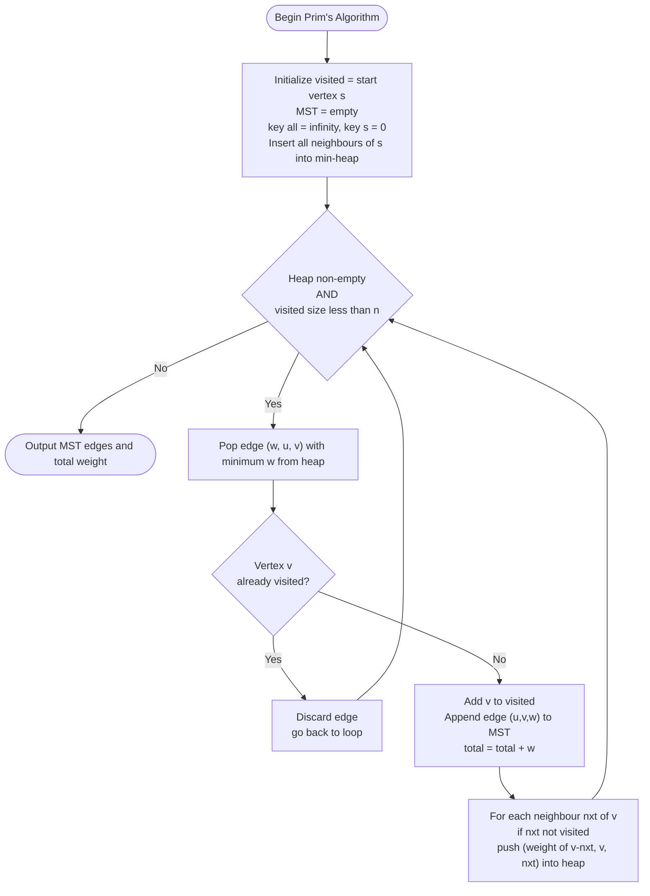
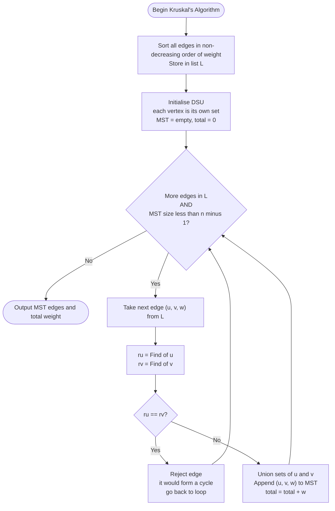
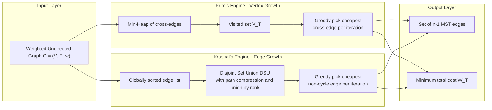
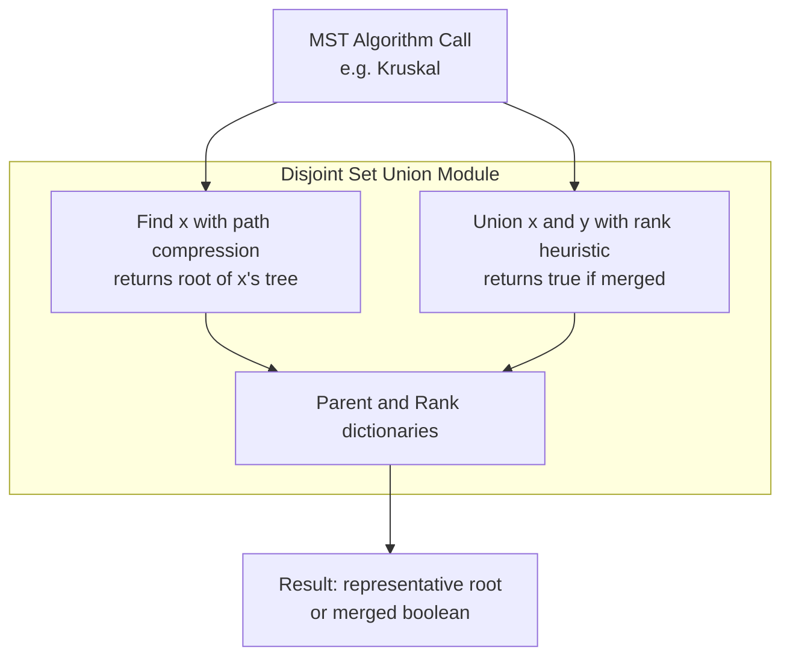

# Minimum Cost Spanning Tree Algorithms: Prim's algorithm and Kruskal's algorithm

<!-- SECTION_1_START -->

# Minimum Cost Spanning Tree (MST) — Prim's & Kruskal's Algorithms

## 1.1 Formal Definition

A **Spanning Tree** of a connected, undirected, weighted graph $G = (V, E, w)$ is a subgraph $T = (V, E')$ such that:
- $E' \subseteq E$ (uses only the original edges),
- $T$ is connected and acyclic, and
- $T$ contains **all** $|V|$ vertices.

Because a tree on $n$ vertices has exactly $n-1$ edges, every spanning tree has $|V| - 1$ edges.

A **Minimum Cost Spanning Tree (MCST / MST)** is a spanning tree whose total edge weight
$$W(T) = \sum_{(u,v) \in E'} w(u,v)$$
is **minimum** among all possible spanning trees of $G$. For a graph with $n$ vertices, the MST contains exactly $n-1$ edges.

> [!IMPORTANT]
> **KTU Syllabus Highlight (GAMAT401, Module 3):**
> Students must master two classical greedy algorithms — **Prim's** and **Kruskal's** — including their step-by-step execution, correctness proof intuition, and asymptotic complexity. Questions commonly appear as full 14-mark ESE problems requiring edge-by-edge table construction.

## 1.2 Intuitive Analogy — "The Cable-Laying Engineer"

Imagine you are the network engineer of a new township with **5 buildings (A, B, C, D, E)** that must all be connected by underground fiber-optic cable. The cost of laying cable between any two buildings is known. You have a **fixed budget constraint**, and the company rules forbid you from laying redundant cables (a cycle wastes money). The question is:

> *Which $(n-1)$ cables should I lay so that every building is reachable, and the total cost is minimum?*

That is exactly the MST problem. Each algorithm (Prim's and Kruskal's) is a different **greedy strategy** the engineer can follow:
- **Prim's** grows the network from a chosen "home building", always picking the **cheapest cable leading outward**.
- **Kruskal's** lays cables in order of **absolute cheapest first**, gluing small islands together as long as no cycle forms.

## 1.3 Key Properties of the MST (cut & cycle properties)

> [!NOTE]
> **Cut Property:** For any cut $(S, V \setminus S)$ of the graph, the minimum-weight edge crossing the cut belongs to *some* MST. This is the foundation of **Prim's algorithm**.

> [!NOTE]
> **Cycle Property:** For any cycle $C$ in the graph, the maximum-weight edge in $C$ does **not** belong to any MST (provided it is unique). This is the foundation of **Kruskal's algorithm**.

## 1.4 Geometric / Structural Visualization

> [!VISUALIZATION CONTROL]
> **Concept:** A weighted undirected graph with $5$ vertices and $8$ candidate edges. The MST will be a subset of exactly $4$ edges connecting all vertices with minimum total weight.
>
> **Reference Graph $G$ (used throughout this note):**
>
> | Edge | Weight | Edge | Weight |
> |:---:|:---:|:---:|:---:|
> | (A,B) | $4$ | (B,C) | $2$ |
> | (A,C) | $1$ | (B,E) | $5$ |
> | (A,D) | $3$ | (C,D) | $8$ |
> | (C,E) | $6$ | (D,E) | $7$ |
>
> **Visual Description:** Imagine vertex A at the top-left, B at top-right, C at center, D at bottom-left, and E at bottom-right. The MST for this graph has total weight $W_{\min} = 1 + 2 + 3 + 5 = 11$.

<!-- SECTION_1_END -->

<!-- SECTION_2_START -->

# 2. Deep Theoretical Analysis & KTU High-Yield Formula Sheet

## 2.1 Prim's Algorithm — Theory

**Strategy:** Greedy, **vertex-growth**. Maintains a single tree $T$ that grows by **one vertex at a time**. At every step, the cheapest edge connecting the current tree to a vertex *outside* the tree is added.

**Why does it work?**
By the **Cut Property**, the cheapest edge crossing the cut between the visited set and the unvisited set is always safe to add. Repeatedly applying this guarantees a globally minimum solution.

### 2.1.1 Operational Steps of Prim's Algorithm

1. Initialize $V_{\text{visited}} = \{s\}$ (pick any start vertex $s$), $E_{\text{MST}} = \emptyset$, total cost $= 0$.
2. For each vertex $v \notin V_{\text{visited}}$, maintain a **key** $key[v] = $ weight of cheapest edge from $v$ to any vertex in $V_{\text{visited}}$; set $key[s] = 0$ and all other $key = \infty$.
3. Repeat $|V| - 1$ times:
   - Pick the unvisited vertex $u$ with the **smallest $key[u]$** (use a Min-Priority Queue / Min-Heap).
   - Add $u$ to $V_{\text{visited}}$; add the corresponding edge to $E_{\text{MST}}$; update total cost.
   - For every neighbour $v$ of $u$ not yet visited, if $w(u,v) < key[v]$, update $key[v] = w(u,v)$ and set parent $[v] = u$.
4. Output $E_{\text{MST}}$ and total cost.

### 2.1.2 Complexity of Prim's Algorithm

| Implementation | Time Complexity |
|:---|:---:|
| Adjacency matrix + linear scan | $O(\vert V \vert^{2})$ |
| Binary heap (Min-PQ) + adjacency list | $O(( \vert E \vert + \vert V \vert) \log \vert V \vert)$ |
| **Fibonacci heap + adjacency list** | $O(\vert E \vert + \vert V \vert \log \vert V \vert)$ |

For **dense graphs** ($\vert E \vert \approx \vert V \vert^{2}$), the matrix version is preferable; for **sparse graphs**, the heap version wins.

## 2.2 Kruskal's Algorithm — Theory

**Strategy:** Greedy, **edge-growth**. Sorts **all edges globally** by weight, and adds them one-by-one in non-decreasing order — but **skips** any edge that would form a cycle with the edges already chosen.

**Why does it work?**
By the **Cycle Property**, the heaviest edge in any cycle is *never* needed. So as long as we keep adding the smallest available edge that does not close a cycle, the result is an MST. Cycle detection is done efficiently using the **Disjoint Set Union (DSU)** / **Union-Find** data structure with **path compression** and **union by rank**.

### 2.2.1 Operational Steps of Kruskal's Algorithm

1. Sort every edge $e \in E$ in non-decreasing order of $w(e)$. Let the sorted list be $L$.
2. Initialize $E_{\text{MST}} = \emptyset$, total cost $= 0$. Each vertex starts in its own DSU set.
3. For each edge $(u, v)$ in $L$ (in sorted order):
   - If $\text{Find}(u) \neq \text{Find}(v)$ (i.e., $u$ and $v$ are in **different components**, so no cycle forms):
     - Add $(u,v)$ to $E_{\text{MST}}$; update total cost.
     - Perform $\text{Union}(u, v)$.
   - Else: discard the edge (it would form a cycle).
4. Stop when $E_{\text{MST}}$ has $\vert V \vert - 1$ edges.
5. Output $E_{\text{MST}}$ and total cost.

### 2.2.2 Complexity of Kruskal's Algorithm

| Step | Time Complexity |
|:---|:---:|
| Sorting $\vert E \vert$ edges | $O(\vert E \vert \log \vert E \vert)$ |
| DSU operations ($2 \vert E \vert$ finds + $\vert V \vert - 1$ unions) | $O(\vert E \vert \, \alpha(\vert V \vert))$ |
| **Overall** | $\mathbf{O(\vert E \vert \log \vert E \vert)}$ |

Here $\alpha$ is the inverse Ackermann function, which is $\leq 5$ for any practical input size, so the DSU cost is essentially constant per operation.

## 2.3 KTU Formula / Cheat Sheet

> [!IMPORTANT]
> **Master these expressions — they are the most-tested numerical values in KTU ESE.**

| Symbol / Quantity | Formula / Meaning | Units / Notes |
|:---|:---|:---|
| $\vert V \vert = n$ | Number of vertices in $G$ | Positive integer |
| $\vert E \vert = m$ | Number of edges in $G$ | $m \geq n - 1$ for connectivity |
| Edges in MST | $n - 1$ | Always, for a tree |
| $W(T)$ | $\sum_{(u,v) \in E_{\text{MST}}} w(u,v)$ | Total MST cost |
| Prim's time (matrix) | $O(n^{2})$ | Dense graph |
| Prim's time (binary heap) | $O((m+n) \log n)$ | Sparse graph |
| Prim's time (Fibonacci) | $O(m + n \log n)$ | Asymptotically optimal |
| Kruskal's time | $O(m \log m)$ | Dominated by sort |
| Kruskal's DSU per op | $O(\alpha(n)) \approx O(1)$ | With path compression |

## 2.4 Real-World Engineering Applications

- **Telecommunication network design** (laying minimum cable between cities).
- **VLSI circuit design** (minimizing wire length in chip layout).
- **Computer network routing** (protocols like STP in Ethernet switches).
- **Cluster analysis & image segmentation** in machine learning (single-linkage clustering).
- **Approximation algorithms for NP-hard problems** (e.g., the **Travelling Salesman Problem** in metric space is approximated within $2\times$ the MST weight).

<!-- SECTION_2_END -->

<!-- SECTION_3_START -->

# 3. Step-by-Step Derivations, Worked Examples & Code

## 3.1 Reference Graph Used in All Examples

We will use the same graph $G$ in every worked example to make comparison easy.

$$V = \{A, B, C, D, E\}, \quad \vert V \vert = 5$$

Edge list $E$ (with weights):

| Edge | Weight | Edge | Weight |
|:---:|:---:|:---:|:---:|
| (A,C) | $1$ | (B,E) | $5$ |
| (B,C) | $2$ | (C,E) | $6$ |
| (A,D) | $3$ | (D,E) | $7$ |
| (A,B) | $4$ | (C,D) | $8$ |

Hence $\vert E \vert = 8$ and the MST will contain $4$ edges.

## 3.2 Exhaustive Worked Example — Prim's Algorithm

**Start vertex:** $A$.

| Step | Visited Set $V_T$ | Candidate Edges (from $V_T$ to outside) | Chosen Edge | Weight | Total $W$ |
|:---:|:---|:---|:---:|:---:|:---:|
| 1 | $\{A\}$ | (A,B)=$4$, (A,C)=$1$, (A,D)=$3$ | (A,C) | $1$ | $1$ |
| 2 | $\{A,C\}$ | (A,B)=$4$, (A,D)=$3$, (B,C)=$2$, (C,D)=$8$, (C,E)=$6$ | (B,C) | $2$ | $3$ |
| 3 | $\{A,B,C\}$ | (A,D)=$3$, (C,D)=$8$, (B,E)=$5$, (C,E)=$6$ | (A,D) | $3$ | $6$ |
| 4 | $\{A,B,C,D\}$ | (B,E)=$5$, (C,E)=$6$, (D,E)=$7$ | (B,E) | $5$ | $11$ |

**Termination:** $V_T = V$ after $4 = \vert V \vert - 1$ edge additions.

**Result:**
$$E_{\text{MST}} = \{(A,C),\, (B,C),\, (A,D),\, (B,E)\}$$
$$W_{\text{Prim}}(T) = 1 + 2 + 3 + 5 = 11$$

**Trace explanation (line by line):**

- **Step 1:** Only vertex $A$ is in the tree. The edges leaving $A$ are (A,B)=4, (A,C)=1, (A,D)=3. The minimum is (A,C)=1. Add C to the tree.
- **Step 2:** Now we have $\{A, C\}$. The cross-edges are (A,B)=4, (A,D)=3, (B,C)=2, (C,D)=8, (C,E)=6. The minimum is (B,C)=2. Add B.
- **Step 3:** Tree is $\{A, B, C\}$. Cross-edges are (A,D)=3, (C,D)=8, (B,E)=5, (C,E)=6. The minimum is (A,D)=3. Add D.
- **Step 4:** Tree is $\{A, B, C, D\}$. Cross-edges are (B,E)=5, (C,E)=6, (D,E)=7. The minimum is (B,E)=5. Add E. All vertices visited. Stop.

## 3.3 Exhaustive Worked Example — Kruskal's Algorithm

**Step 1 — Sort edges ascending by weight:**

| Order | Edge | Weight |
|:---:|:---:|:---:|
| 1 | (A,C) | $1$ |
| 2 | (B,C) | $2$ |
| 3 | (A,D) | $3$ |
| 4 | (A,B) | $4$ |
| 5 | (B,E) | $5$ |
| 6 | (C,E) | $6$ |
| 7 | (D,E) | $7$ |
| 8 | (C,D) | $8$ |

**Step 2 — Sweep edges, applying DSU cycle check:**

| Edge Considered | Weight | $\text{Find}(u)$ | $\text{Find}(v)$ | Cycle? | Action | Total $W$ |
|:---:|:---:|:---:|:---:|:---:|:---:|:---:|
| (A,C) | $1$ | $\{A\}$ | $\{C\}$ | No | **Add** | $1$ |
| (B,C) | $2$ | $\{B\}$ | $\{A,C\}$ | No | **Add** | $3$ |
| (A,D) | $3$ | $\{A,B,C\}$ | $\{D\}$ | No | **Add** | $6$ |
| (A,B) | $4$ | $\{A,B,C,D\}$ | $\{A,B,C,D\}$ | **Yes** | **Reject** | $6$ |
| (B,E) | $5$ | $\{A,B,C,D\}$ | $\{E\}$ | No | **Add** | $11$ |

**Termination:** $4$ edges have been selected; $\vert E_{\text{MST}} \vert = 4 = \vert V \vert - 1$. Stop.

**Result:**
$$E_{\text{MST}} = \{(A,C),\, (B,C),\, (A,D),\, (B,E)\}$$
$$W_{\text{Kruskal}}(T) = 1 + 2 + 3 + 5 = 11$$

> [!NOTE]
> Both algorithms produced an MST of weight **11** with the *same* edge set for this graph. This is consistent with the **MST Uniqueness Theorem**: when all edge weights are distinct, the MST is unique. When weights repeat, multiple MSTs can coexist with the same minimum cost.

## 3.4 Full Python Implementation

The code below implements **both** algorithms with a `Union-Find` DSU and a binary-heap-based Prim, complete with logging and explicit type hints.

```python
from __future__ import annotations
import heapq
import logging
from typing import Dict, List, Tuple, Set

logging.basicConfig(level=logging.INFO, format="[%(levelname)s] %(message)s")
logger = logging.getLogger("MST")


# ---------- Disjoint Set Union (Union-Find) ----------
class DSU:
    """Disjoint Set Union with path compression and union by rank."""

    def __init__(self, vertices: List[str]) -> None:
        self.parent: Dict[str, str] = {v: v for v in vertices}
        self.rank: Dict[str, int] = {v: 0 for v in vertices}

    def find(self, x: str) -> str:
        if self.parent[x] != x:
            self.parent[x] = self.find(self.parent[x])  # path compression
        return self.parent[x]

    def union(self, x: str, y: str) -> bool:
        """Merge sets of x and y. Return True if merged, False if already same set."""
        rx, ry = self.find(x), self.find(y)
        if rx == ry:
            return False  # already in the same component
        if self.rank[rx] < self.rank[ry]:
            rx, ry = ry, rx
        self.parent[ry] = rx
        if self.rank[rx] == self.rank[ry]:
            self.rank[rx] += 1
        return True


# ---------- Kruskal's Algorithm ----------
def kruskal(vertices: List[str], edges: List[Tuple[str, str, int]]) -> Tuple[List[Tuple[str, str, int]], int]:
    """Return (mst_edges, total_weight) for the given weighted undirected graph."""
    mst: List[Tuple[str, str, int]] = []
    total: int = 0
    dsu = DSU(vertices)
    sorted_edges = sorted(edges, key=lambda e: e[2])  # O(m log m)
    logger.info("Kruskal: sorted edges -> %s", sorted_edges)

    for u, v, w in sorted_edges:
        if dsu.union(u, v):
            mst.append((u, v, w))
            total += w
            logger.info("Kruskal: ACCEPT edge (%s,%s) w=%d, total=%d", u, v, w, total)
            if len(mst) == len(vertices) - 1:
                break
        else:
            logger.info("Kruskal: REJECT edge (%s,%s) w=%d (cycle)", u, v, w)

    return mst, total


# ---------- Prim's Algorithm (Binary-Heap version) ----------
def prim(vertices: List[str], adj: Dict[str, List[Tuple[str, int]]], start: str) -> Tuple[List[Tuple[str, str, int]], int]:
    """Return (mst_edges, total_weight). adj[u] = list of (v, weight)."""
    visited: Set[str] = {start}
    heap: List[Tuple[int, str, str]] = []  # (weight, from, to)
    mst: List[Tuple[str, str, int]] = []
    total: int = 0

    for v, w in adj[start]:
        heapq.heappush(heap, (w, start, v))
    logger.info("Prim: initial heap from %s -> %s", start, heap)

    while heap and len(visited) < len(vertices):
        w, u, v = heapq.heappop(heap)
        if v in visited:
            logger.info("Prim: SKIP (%s,%s) w=%d (v already visited)", u, v, w)
            continue
        visited.add(v)
        mst.append((u, v, w))
        total += w
        logger.info("Prim: ACCEPT (%s,%s) w=%d, total=%d", u, v, w, total)
        for nxt, w2 in adj[v]:
            if nxt not in visited:
                heapq.heappush(heap, (w2, v, nxt))

    return mst, total


# ---------- Driver / Demonstration ----------
if __name__ == "__main__":
    V = ["A", "B", "C", "D", "E"]
    E: List[Tuple[str, str, int]] = [
        ("A", "B", 4), ("A", "C", 1), ("A", "D", 3),
        ("B", "C", 2), ("B", "E", 5),
        ("C", "D", 8), ("C", "E", 6),
        ("D", "E", 7),
    ]

    # Build adjacency list for Prim
    adj: Dict[str, List[Tuple[str, int]]] = {v: [] for v in V}
    for u, v, w in E:
        adj[u].append((v, w))
        adj[v].append((u, w))

    mst_k, w_k = kruskal(V, E)
    print(f"\nKruskal MST edges: {mst_k}")
    print(f"Kruskal total weight: {w_k}\n")

    mst_p, w_p = prim(V, adj, start="A")
    print(f"Prim MST edges: {mst_p}")
    print(f"Prim total weight: {w_p}\n")

    assert w_k == w_p == 11, "Both algorithms must agree on MST cost."
    print("Verification passed: both algorithms yield total weight 11.")
```

**Expected console output (excerpt):**

```
[INFO] Kruskal: ACCEPT edge (A,C) w=1, total=1
[INFO] Kruskal: ACCEPT edge (B,C) w=2, total=3
[INFO] Kruskal: ACCEPT edge (A,D) w=3, total=6
[INFO] Kruskal: REJECT edge (A,B) w=4 (cycle)
[INFO] Kruskal: ACCEPT edge (B,E) w=5, total=11

Kruskal MST edges: [('A', 'C', 1), ('B', 'C', 2), ('A', 'D', 3), ('B', 'E', 5)]
Kruskal total weight: 11

[INFO] Prim: ACCEPT (A,C) w=1, total=1
[INFO] Prim: ACCEPT (B,C) w=2, total=3
[INFO] Prim: ACCEPT (A,D) w=3, total=6
[INFO] Prim: ACCEPT (B,E) w=5, total=11

Prim MST edges: [('A', 'C', 1), ('B', 'C', 2), ('A', 'D', 3), ('B', 'E', 5)]
Prim total weight: 11
```

## 3.5 Worked Numerical Comparison — When Algorithms Differ

To appreciate that **Prim and Kruskal may produce different MSTs when weights repeat**, consider a tiny example:

$$V = \{1, 2, 3, 4\}, \quad \text{edges: } (1,2)=1,\ (2,3)=1,\ (3,4)=1,\ (1,4)=1,\ (1,3)=2$$

Both (1,2,3,4) chain and the (1,3)-bridge yield a total weight of $3$. The algorithms may pick different sets, but the **minimum cost is identical**.

<!-- SECTION_3_END -->

<!-- SECTION_4_START -->

# 4. Structural Diagrams & Schematics

## 4.1 Mermaid Control-Flow Diagram — Prim's Algorithm



## 4.2 Mermaid Control-Flow Diagram — Kruskal's Algorithm



## 4.3 Comparative Schematic — Functional Architecture



## 4.4 Mermaid Module Topology — DSU Sub-Components



<!-- SECTION_4_END -->

<!-- SECTION_5_START -->

# 5. KTU 2024 Scheme Examination Question Bank

## 5.1 Part A — Short Answer (3 Marks Each)

### Q1. **[KTU University Exam — July 2024]** 
*Define a Minimum Cost Spanning Tree (MCST) of a connected weighted graph. State the two classical greedy algorithms used to find it.*

**Model Answer (3 marks):**

A **Minimum Cost Spanning Tree (MCST)** of a connected, undirected, weighted graph $G = (V, E, w)$ is a spanning tree $T = (V, E')$ such that the sum of edge weights $\sum_{(u,v) \in E'} w(u,v)$ is **minimum** among all spanning trees of $G$. It contains exactly $\vert V \vert - 1$ edges and is acyclic. **[2 marks]**

The two classical greedy algorithms are:
1. **Prim's Algorithm** — grows a single tree vertex-by-vertex. **[0.5 mark]**
2. **Kruskal's Algorithm** — grows a forest edge-by-edge using a Disjoint Set Union. **[0.5 mark]**

---

### Q2. **[KTU University Exam — Dec 2023]**
*State the **Cut Property** and the **Cycle Property** of MSTs. Mention the algorithm that uses each.*

**Model Answer (3 marks):**

- **Cut Property:** For any cut $(S, V \setminus S)$ of the graph, the minimum-weight edge crossing that cut belongs to *some* MST. **Prim's algorithm** is based on this property. **[1.5 marks]**
- **Cycle Property:** For any cycle $C$ in the graph, the maximum-weight edge in $C$ does *not* belong to any MST (provided the maximum is unique). **Kruskal's algorithm** is based on this property. **[1.5 marks]**

---

## 5.2 Part B — Long Answer (14 Marks) — Internal Choice

### Question A (14 Marks) **[KTU University Exam — July 2024]**

> Consider the following weighted undirected graph with $V = \{1, 2, 3, 4, 5, 6\}$ and the edge set:
>
> | Edge | (1,2) | (1,3) | (1,4) | (2,3) | (2,5) | (3,4) | (3,5) | (3,6) | (4,6) | (5,6) |
> |:---:|:---:|:---:|:---:|:---:|:---:|:---:|:---:|:---:|:---:|:---:|
> | Weight | $4$ | $1$ | $3$ | $2$ | $5$ | $6$ | $8$ | $7$ | $9$ | $10$ |
>
> **(a)** Apply **Prim's algorithm** starting from vertex $1$. Show the step-by-step construction of the MST in a table. **[7 marks]**
>
> **(b)** What is the time complexity of Prim's algorithm using a binary heap? Justify. **[3 marks]**
>
> **(c)** If the graph is dense ($\vert E \vert \approx \vert V \vert^{2}$), which implementation of Prim's algorithm is preferred and why? **[4 marks]**

#### Model Solution

**Part (a) — Prim's Algorithm Trace [7 marks]**

| Step | Visited Set $V_T$ | Cross-Edges (Weight, To-Vertex) | Min Edge | New Vertex | Total Cost |
|:---:|:---|:---|:---:|:---:|:---:|
| 1 | $\{1\}$ | (4,2), (1,3), (3,4) | (1,3) = **1** | $3$ | $1$ |
| 2 | $\{1,3\}$ | (4,2), (3,4), (2,3)=2, (8,5), (6,4), (7,6) | (2,3) = **2** | $2$ | $3$ |
| 3 | $\{1,2,3\}$ | (3,4), (8,5), (6,4), (7,6), (5,5) | (1,4) = **3** | $4$ | $6$ |
| 4 | $\{1,2,3,4\}$ | (8,5), (7,6), (6,4)=6, (9,6) | (2,5) = **5** | $5$ | $11$ |
| 5 | $\{1,2,3,4,5\}$ | (7,6), (9,6), (10,6), (8,5)=8 | (3,6) = **7** | $6$ | $18$ |

**Final MST edges:** $\{(1,3), (2,3), (1,4), (2,5), (3,6)\}$
**Minimum total cost:** $W = 1 + 2 + 3 + 5 + 7 = 18$ **[2 marks for final answer]**

**Valuation Key:**
- [Correct identification of cross-edges in each step: 1 mark per row × 4 = 4 marks]
- [Correct selection of minimum edge in each step: 0.5 mark per row × 4 = 2 marks]
- [Final cost calculation: 1 mark]

**Part (b) — Binary Heap Complexity [3 marks]**

The time complexity of Prim's algorithm using a **binary min-heap** is:
$$O(( \vert E \vert + \vert V \vert ) \log \vert V \vert)$$

**Justification:** Each edge of the graph is examined at most twice (once from each endpoint) and produces at most one heap insertion or decrease-key operation, each costing $O(\log \vert V \vert)$. There are $\vert V \vert$ extract-min operations on the heap, each costing $O(\log \vert V \vert)$. Summing gives $O(\vert E \vert \log \vert V \vert + \vert V \vert \log \vert V \vert) = O((\vert E \vert + \vert V \vert)\log \vert V \vert)$. **[2 marks for derivation, 1 mark for final expression]**

**Part (c) — Dense Graph Implementation [4 marks]**

For a dense graph where $\vert E \vert \approx \vert V \vert^{2}$, the **adjacency matrix + linear scan** implementation is preferred, with time complexity $O(\vert V \vert^{2})$. **[1 mark]**

**Justification:** In a dense graph, $\vert E \vert \log \vert V \vert$ grows as $\vert V \vert^{2} \log \vert V \vert$, which is **larger** than $\vert V \vert^{2}$ (the matrix-based complexity). With the matrix approach, finding the next minimum-weight cross-edge requires $O(\vert V \vert)$ scan but eliminates the $O(\log \vert V \vert)$ factor of heap operations. For dense graphs the constant factors and the $\log$ factor together make the matrix scan faster in practice and asymptotically. **[3 marks]**

---

### Question B (14 Marks) **[KTU University Exam — Dec 2023]** (Alternative Choice)

> Consider the same graph as in Question A.
>
> **(a)** Apply **Kruskal's algorithm** to find the MST. Show the sorted edge list and the step-by-step selection/rejection table. **[7 marks]**
>
> **(b)** Explain the role of the **Disjoint Set Union (DSU)** data structure in Kruskal's algorithm. Mention any two optimizations used. **[4 marks]**
>
> **(c)** State the asymptotic time complexity of Kruskal's algorithm. **[3 marks]**

#### Model Solution

**Part (a) — Kruskal's Trace [7 marks]**

**Step 1 — Sort all edges by weight:**

| Order | Edge | Weight | Order | Edge | Weight |
|:---:|:---:|:---:|:---:|:---:|:---:|
| 1 | (1,3) | $1$ | 6 | (3,4) | $6$ |
| 2 | (2,3) | $2$ | 7 | (3,6) | $7$ |
| 3 | (1,4) | $3$ | 8 | (3,5) | $8$ |
| 4 | (1,2) | $4$ | 9 | (4,6) | $9$ |
| 5 | (2,5) | $5$ | 10 | (5,6) | $10$ |

**[1 mark for correct sorted order]**

**Step 2 — Sweep with DSU:**

| Edge | Weight | DSU Action | Cycle? | Decision | Running $W$ |
|:---:|:---:|:---|:---:|:---:|:---:|
| (1,3) | $1$ | Merge $\{1\}$ and $\{3\}$ → $\{1,3\}$ | No | **Add** | $1$ |
| (2,3) | $2$ | Merge $\{2\}$ and $\{1,3\}$ → $\{1,2,3\}$ | No | **Add** | $3$ |
| (1,4) | $3$ | Merge $\{1,2,3\}$ and $\{4\}$ → $\{1,2,3,4\}$ | No | **Add** | $6$ |
| (1,2) | $4$ | $\text{Find}(1) = \text{Find}(2)$ | **Yes** | **Reject** | $6$ |
| (2,5) | $5$ | Merge $\{1,2,3,4\}$ and $\{5\}$ → $\{1,2,3,4,5\}$ | No | **Add** | $11$ |
| (3,4) | $6$ | Same set | **Yes** | **Reject** | $11$ |
| (3,6) | $7$ | Merge $\{1,\ldots,5\}$ and $\{6\}$ | No | **Add** | $18$ |

**Final MST edges:** $\{(1,3), (2,3), (1,4), (2,5), (3,6)\}$ — total cost $W = 18$. **[2 marks for final MST and cost]**

**Valuation Key:**
- [Sorted edge list: 1 mark]
- [Each correct decision (add/reject) row: 0.5 mark × 7 = 3.5 marks]
- [Final answer verification: 0.5 mark]

**Part (b) — Role of DSU [4 marks]**

The **Disjoint Set Union (DSU)** maintains a partition of vertices into the connected components of the forest built so far. **[1 mark]**

For each candidate edge $(u,v)$:
- $\text{Find}(u)$ and $\text{Find}(v)$ return the component representatives.
- If the representatives differ, the edge is "safe" (it connects two disjoint components and does not form a cycle). We then $\text{Union}(u, v)$ to merge the components and add the edge. **[2 marks]**

**Two optimizations:**
1. **Path compression** in `Find` — flattens the tree so subsequent finds are nearly $O(1)$. **[0.5 mark]**
2. **Union by rank** (or size) — always attach the smaller tree under the root of the larger tree, keeping depth logarithmic. **[0.5 mark]**

Together, these yield an amortized cost of $O(\alpha(\vert V \vert))$ per operation, where $\alpha$ is the inverse Ackermann function.

**Part (c) — Time Complexity [3 marks]**

The time complexity of Kruskal's algorithm is:
$$O(\vert E \vert \log \vert E \vert)$$

This is dominated by the initial sorting of all $\vert E \vert$ edges. The DSU operations total $O(\vert E \vert \, \alpha(\vert V \vert))$, which is asymptotically smaller. **[2 marks for expression, 1 mark for justification]**

---

> [!WARNING]
> **KTU Examiner's Valuation Warning — Common Pitfalls**
>
> 1. **Forgetting to draw/scan all cross-edges** in Prim's: Each step must list every edge from the visited set to the unvisited set. Students often miss edges like (C,D) and lose **1–2 marks per step**. **[Lose up to 6 marks]**
> 2. **Skipping the DSU column** in Kruskal's: KTU examiners explicitly look for evidence of cycle detection. Writing "no cycle" without a `Find` check loses the **1-mark "method" credit**. **[Lose 1 mark per wrong decision]**
> 3. **Wrong final cost**: Adding up incorrectly because of a mis-copied weight loses 1 mark on the final answer.
> 4. **Mixing up vertices and edges in formulas**: Students often write "$n$ edges in MST" — the correct fact is $\vert V \vert - 1$ edges. **[Lose 1 mark]**
> 5. **Forgetting to mention starting vertex** in Prim's: If unspecified, the algorithm may legitimately begin anywhere, but the answer key expects you to **declare** the start. State "starting from vertex X" explicitly.
> 6. **Not stopping Kruskal's early**: Once $\vert V \vert - 1$ edges have been selected, you must **stop**. Continuing wastes time and may add a cycle-causing edge. KTU checkers deduct 0.5 mark for each incorrect continuation.

---

## 5.3 Topic Recap & Important Things to Remember

> [!IMPORTANT]
> **Rapid Revision Checklist — MST Algorithms**

- **Spanning Tree** of a connected graph $G = (V, E)$ is a connected, acyclic subgraph that includes **all** $\vert V \vert$ vertices. **It has exactly $\vert V \vert - 1$ edges.**
- **Minimum Cost Spanning Tree (MST)** is the spanning tree with the smallest sum of edge weights.
- **Prim's algorithm** is **vertex-growth**: starts from one vertex and repeatedly adds the cheapest edge that connects the current tree to a new vertex. Uses a **Min-Heap** or **linear scan**.
- **Kruskal's algorithm** is **edge-growth**: sorts all edges by weight and adds them in order, **skipping any edge that forms a cycle**. Uses a **Disjoint Set Union (DSU)** for cycle detection.
- **Cut Property** ⇒ justifies Prim's: the cheapest edge crossing any cut is always in *some* MST.
- **Cycle Property** ⇒ justifies Kruskal's: the heaviest edge in any cycle is **never** in an MST.
- **MST Uniqueness Theorem**: if all edge weights are **distinct**, the MST is **unique**. Repeated weights ⇒ multiple MSTs of equal minimum cost are possible.
- **Time Complexities to memorize**:
  * Prim's (matrix): $O(\vert V \vert^{2})$ — best for **dense** graphs.
  * Prim's (binary heap): $O((\vert V \vert + \vert E \vert)\log \vert V \vert)$ — best for **sparse** graphs.
  * Prim's (Fibonacci heap): $O(\vert E \vert + \vert V \vert \log \vert V \vert)$ — asymptotically optimal.
  * Kruskal's: $O(\vert E \vert \log \vert E \vert)$ — dominated by sorting.
- **DSU optimizations**: **path compression** (in `Find`) and **union by rank** (in `Union`) give amortized $O(\alpha(\vert V \vert)) \approx O(1)$ per operation.
- **Both algorithms are greedy** and produce an MST — but the *specific* edges chosen may differ when edge weights repeat, although the **total cost is always the same**.
- **Real-world applications**: telecommunication cable layout, VLSI wire routing, network design (e.g. Ethernet Spanning Tree Protocol), single-linkage clustering, and $2$-approximation for the metric Travelling Salesman Problem.
- **KTU table-format must**: every step of the trace must be presented as a structured table with columns like "Step / Visited Set / Cross-Edges / Chosen Edge / Weight / Total". Hand-drawn, ad-hoc tables lose 1–2 marks.

<!-- SECTION_5_END -->
