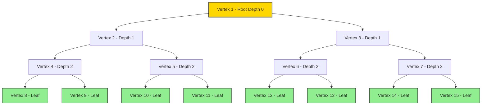
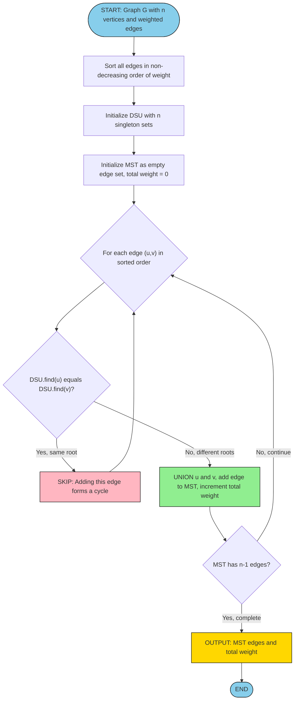
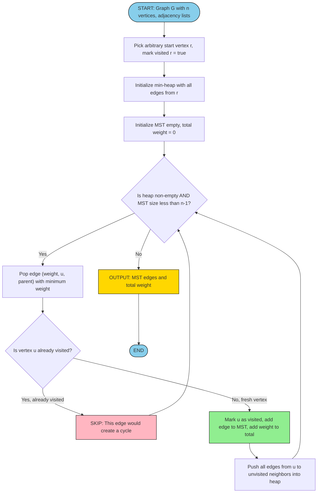
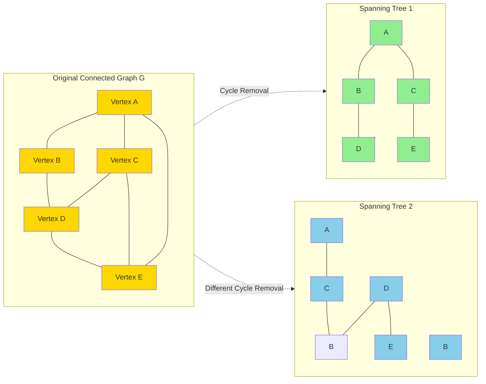
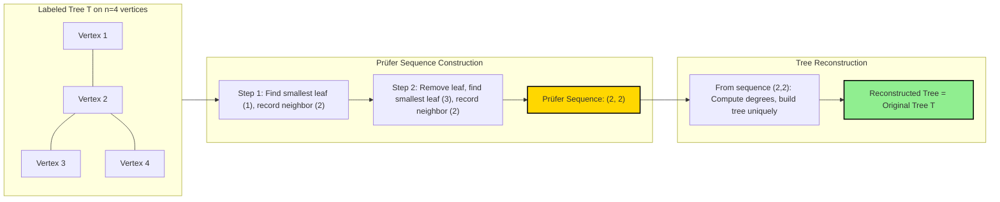

# Rooted trees and Binary trees, Counting trees, Spanning trees

<!-- SECTION_1_START -->
# Module 3: Trees and Shortest Path Algorithms

## 3.1 Rooted Trees, Binary Trees, Counting Trees, and Spanning Trees

### 3.1.1 Rooted Trees — Formal Definition

A **rooted tree** is a connected acyclic undirected graph in which exactly one vertex is designated as the **root**. From this root, every other vertex can be reached by exactly one unique simple path. The root imposes a natural hierarchical parent–child direction on all edges.

> [!NOTE]
> **KTU 2024 Syllabus Definition (GAMAT401):** A rooted tree is a tree in which one vertex has been designated as the root. All edges are implicitly directed away from (or toward) the root, creating a hierarchical structure used extensively in computer science for data organization, decision-making, and recursion.

**Key Terminology for KTU Board Examinations:**

| Term | Formal Definition |
| :--- | :--- |
| **Parent** | A vertex on the path from the root to a given vertex, adjacent to that vertex |
| **Child** | Any vertex for which the current vertex is its parent |
| **Siblings** | Vertices sharing the same parent |
| **Ancestor** | Any vertex on the path from the root to a given vertex (excluding the vertex itself) |
| **Descendant** | Any vertex for which the given vertex is an ancestor |
| **Leaf (Terminal Vertex)** | A vertex with no children |
| **Internal Vertex** | A vertex with at least one child |
| **Depth (Level)** | The length of the unique path from the root to that vertex |
| **Height** | The maximum depth among all vertices in the tree |
| **Subtree** | The tree rooted at any child, including the child and all its descendants |
| **Degree of a Vertex** | The number of children of that vertex |
| **Arity (Branching Factor)** | The maximum degree of any vertex in the tree |

> [!IMPORTANT]
> **KTU 2024 Board Emphasis:** A tree with $n$ vertices always has exactly $n-1$ edges. This is a frequently tested property in KTU examinations, especially in short-answer questions.

### 3.1.2 Intuitive Analogy — The Family Tree

> [!TIP]
> **Conceptual Analogy:** Imagine a royal family tree. The **king/queen** is the **root** (depth 0). Their **direct children** (princes and princesses) are at **depth 1**. The grandchildren are at **depth 2**, and so on. The youngest generation with no offspring represents the **leaves**. The **height** of this family tree is the number of generations minus one. Every person (except the root) has exactly one biological parent in the tree, but may have many children — just like every non-root vertex in a rooted tree has exactly one parent.

### 3.1.3 Binary Trees — Formal Definition

A **binary tree** is a rooted tree in which every vertex has at most **two children**, specifically designated as the **left child** and the **right child**. The distinction between left and right children is meaningful, even when only one child exists.

> [!NOTE]
> **KTU 2024 Special Note:** A binary tree is *not* simply a tree of degree 2. In a binary tree, the **order** of children matters, which differentiates it from a general rooted tree.

**Special Categories of Binary Trees (High-Yield for KTU):**

- **Full Binary Tree (Strict Binary Tree):** Every internal vertex has exactly two children. The number of leaves is one more than the number of internal vertices: $L = I + 1$.
- **Complete Binary Tree:** All levels are completely filled except possibly the last, which is filled from left to right.
- **Perfect Binary Tree:** All internal vertices have two children AND all leaves are at the same depth (or depth differs by at most one).
- **Balanced Binary Tree:** The heights of the left and right subtrees of every node differ by at most one.
- **Binary Search Tree (BST):** A binary tree where for each node, all values in the left subtree are smaller and all values in the right subtree are larger.

### 3.1.4 Intuitive Analogy — The Tournament Bracket

> [!TIP]
> **Conceptual Analogy:** A **single-elimination tennis tournament** is a perfect binary tree. The **final match** is the **root**, the two semifinal matches are the children, and so on. Each match (internal vertex) has exactly **two** participants (children) producing exactly one winner (the parent). The first-round players (leaves) have no children. If there are $2^k$ players, the tournament has exactly $2^k - 1$ matches and height $k$.

### 3.1.5 Counting Trees — The Big Question

**Counting trees** refers to the combinatorial problem of determining the number of distinct labeled trees (or rooted labeled trees) on a given set of vertices. This is one of the celebrated results in combinatorial mathematics, addressed by **Cayley's Theorem**.

### 3.1.6 Spanning Trees — Formal Definition

A **spanning tree** of a connected undirected graph $G = (V, E)$ is a subgraph that:
1. Includes **all** the vertices of $G$.
2. Is a **tree** (i.e., connected and acyclic).
3. Is a **maximal** acyclic subgraph (adding any missing edge creates a cycle).

> [!NOTE]
> **KTU 2024 Definition:** A spanning tree of a connected graph $G$ is a connected subgraph of $G$ that contains every vertex of $G$ but contains no cycles. Any connected graph with $n$ vertices has a spanning tree with exactly $n-1$ edges.

### 3.1.7 Intuitive Analogy — The Minimum Plumbing Network

> [!TIP]
> **Conceptual Analogy:** Imagine a city with $n$ houses that need water supply, and several possible pipes (edges) of varying costs can be laid between them. The **spanning tree** is the minimum set of pipes that ensures **every house gets water** (connects all vertices) **without any redundant loops** (no cycles). It's the "skeleton" plumbing plan that just barely keeps the city connected. Among all possible spanning trees, the one with minimum total pipe cost is the **Minimum Spanning Tree (MST)**.

> [!VISUALIZATION CONTROL]
> **Concept:** Visualizing a binary tree on the coordinate plane
> **GeoGebra / Desmos Input Equations:**
> * `f(x) = \text{level depth} = \lfloor \log_2(x+1) \rfloor`
> * `h(x) = \text{height function for full binary tree}`
> **Visual Description:** A full binary tree of height 3 has root at $(0, 3)$, two children at $(\pm 1, 2)$, four grandchildren at $(\pm 0.5, 1)$ and $(\pm 1.5, 1)$, and eight leaves at the bottom level. Each level $k$ from the top contains $2^k$ vertices, and the tree contains $2^4 - 1 = 15$ vertices total.

<!-- SECTION_1_END -->

<!-- SECTION_2_START -->
## 3.2 Deep Theoretical Analysis & KTU High-Yield Formula Sheet

### 3.2.1 Fundamental Properties of Trees

Let $T$ be a tree with $n$ vertices. The following properties are **universally true** and form the foundation of every KTU problem on this topic:

1. **Edge Count Property:** A tree with $n$ vertices has exactly $n-1$ edges.
2. **Unique Path Property:** Between any two distinct vertices, there exists **exactly one** simple path.
3. **Acyclicity Property:** Adding any edge between two non-adjacent vertices creates exactly one cycle.
4. **Edge Removal Property:** Removing any edge disconnects the tree into exactly two components.
5. **Vertex Count vs. Edge Count:** For any connected graph, the spanning tree has $n - 1$ edges.
6. **Connectivity Equivalence:** A graph with $n$ vertices is a tree if and only if it is connected and has $n-1$ edges.

### 3.2.2 Properties of Rooted Trees (High-Yield for KTU)

For a rooted tree with $n$ vertices, $L$ leaves, and $i$ internal vertices:

- **Sum of children counts:** The sum of degrees of all vertices (where degree = number of children) equals $n - 1$.
- **Level Property:** If level $j$ contains $n_j$ vertices, then $\sum_{j=0}^{h} n_j = n$.
- **Maximum vertices at level $k$:** A $m$-ary tree has at most $m^k$ vertices at level $k$.

> [!IMPORTANT]
> **For an $m$-ary tree with $n$ vertices and $i$ internal vertices, the relationship is:**
> $$n = mi + 1 \quad \Rightarrow \quad i = \frac{n-1}{m-1}, \quad L = \frac{(m-1)n + 1}{m-1} = \frac{(m-1)n - 1}{m - 1} \text{ (after simplification)}$$

For a **binary tree** ($m = 2$):
$$n = 2i + 1 \quad \Rightarrow \quad L = i + 1$$

### 3.2.3 Counting Labeled Trees — Cayley's Theorem

> [!NOTE]
> **Cayley's Theorem (1889):** The number of distinct labeled trees on $n$ vertices is:
> $$T_n = n^{n-2}$$

This is one of the most elegant results in combinatorics and is **guaranteed to appear** in KTU Module 3 examinations.

**Variations of Cayley's Formula:**

| Object Counted | Formula |
| :--- | :--- |
| Labeled trees on $n$ vertices | $n^{n-2}$ |
| Labeled rooted trees (root can be any of $n$) | $n^{n-1}$ |
| Labeled rooted trees with root fixed | $n^{n-2}$ (root fixed reduces the count) |
| Labeled trees with vertex $k$ as root | $n^{n-2}$ |
| Spanning trees of complete graph $K_n$ | $n^{n-2}$ |
| Labeled forests with $k$ trees on $n$ vertices | $k \cdot n^{n-k-1}$ |

### 3.2.4 The Matrix-Tree Theorem (Kirchhoff's Theorem)

> [!IMPORTANT]
> **KTU 2024 High-Yield Theorem:** The number of spanning trees of a connected graph $G$ equals the value of any cofactor of its **Laplacian matrix** $L = D - A$, where $D$ is the degree matrix and $A$ is the adjacency matrix.

**Procedure for applying the Matrix-Tree Theorem:**
1. Construct the adjacency matrix $A$ of the graph.
2. Construct the degree matrix $D$ (diagonal matrix of vertex degrees).
3. Compute the Laplacian $L = D - A$.
4. Delete any row and corresponding column of $L$ to form $L^*$.
5. Compute $\det(L^*)$ — this equals the number of spanning trees.

### 3.2.5 Minimum Spanning Tree (MST) — The Two Classical Algorithms

#### **Algorithm 1: Kruskal's Algorithm (Edge-Greedy)**

- Sort all edges by weight in non-decreasing order.
- Process edges one by one; add the edge to the spanning tree if it does not form a cycle.
- Use **Union-Find (Disjoint Set Union)** data structure to detect cycles efficiently.
- Stop when $n-1$ edges have been added.

**Time Complexity:** $O(E \log E)$ with Union-Find, or $O(E \log V)$ with optimized structures.

#### **Algorithm 2: Prim's Algorithm (Vertex-Greedy)**

- Start from any arbitrary vertex.
- At each step, add the cheapest edge that connects a vertex in the tree to a vertex outside the tree.
- Use a **priority queue (min-heap)** for efficient edge selection.
- Stop when all $n$ vertices are included.

**Time Complexity:** $O(E \log V)$ with binary heap, or $O(E + V \log V)$ with Fibonacci heap.

### 3.2.6 Properties of Spanning Trees

> [!NOTE]
> **Key Property:** A connected graph $G$ has a spanning tree if and only if $G$ is connected. The number of spanning trees of $G$ is denoted $\tau(G)$.

- If $G$ has $n$ vertices and is connected, it has **at least one** spanning tree.
- A spanning tree has exactly $n-1$ edges.
- If $G$ has $c$ connected components, it has a **spanning forest** with $n - c$ edges.
- Every connected graph has $\tau(G) \geq 1$ spanning trees.

### 3.2.7 KTU Formula Sheet

| # | Concept | Formula | Notes |
| :--- | :--- | :--- | :--- |
| 1 | Edges in a tree on $n$ vertices | $E = n - 1$ | Universal for all trees |
| 2 | Cayley's formula | $T_n = n^{n-2}$ | Number of labeled trees |
| 3 | Number of labeled rooted trees | $n^{n-1}$ | Multiplies Cayley by $n$ |
| 4 | Binary tree relationship | $n = 2i + 1$ | $n$ = total, $i$ = internal |
| 5 | Leaves in a binary tree | $L = i + 1$ | $L$ = leaves, $i$ = internal |
| 6 | $m$-ary tree relationship | $n = mi + 1$ | For $m$-ary trees |
| 7 | Max vertices in $m$-ary tree of height $h$ | $\frac{m^{h+1} - 1}{m - 1}$ | For $m \geq 2$ |
| 8 | Number of labeled forests | $k \cdot n^{n-k-1}$ | $k$ trees on $n$ vertices |
| 9 | Spanning tree count via Matrix-Tree | $\det(L^*)$ | $L^* = L$ with one row/col deleted |
| 10 | Kruskal's complexity | $O(E \log E)$ | Sorting dominates |
| 11 | Prim's complexity | $O(E \log V)$ | With binary heap |
| 12 | Internal path length | $I(T) = \sum_{x \in \text{internal}} \text{depth}(x)$ | Sum of depths of internal nodes |
| 13 | External path length | $E(T) = \sum_{x \in \text{external}} \text{depth}(x)$ | Sum of depths of external (null) nodes |
| 14 | Path length relation | $E(T) = I(T) + 2n$ | For binary trees with $n$ internal nodes |
| 15 | Height of a complete binary tree | $\lfloor \log_2 n \rfloor$ | $n$ = number of nodes |

<!-- SECTION_2_END -->

<!-- SECTION_3_START -->
## 3.3 Step-by-Step Derivations & Code/Symbolic Implementation

### 3.3.1 Derivation: Leaves in a Full Binary Tree

> **Theorem:** In a full (strict) binary tree, the number of leaves exceeds the number of internal vertices by exactly 1, i.e., $L = I + 1$.

**Proof:**

Let $T$ be a full binary tree with $n$ vertices, $L$ leaves, and $I$ internal vertices.

**Step 1:** Count vertices.
$$n = L + I$$

**Step 2:** Count edges using the tree property.
$$E = n - 1 = L + I - 1$$

**Step 3:** Count edges by summing children.

In a full binary tree, every internal vertex has **exactly 2 children**. The total number of children in the entire tree equals the number of edges, since each edge connects a parent to a child:
$$\text{Total children} = 2I$$

But every vertex except the root is a child of exactly one parent. So the total number of children is also $n - 1$:
$$\text{Total children} = n - 1 = L + I - 1$$

**Step 4:** Equate the two expressions for total children.
$$2I = L + I - 1$$

**Step 5:** Solve for $L$.
$$L = 2I - I + 1 = I + 1$$

Therefore: $\boxed{L = I + 1}$. $\blacksquare$

### 3.3.2 Derivation: Maximum Number of Vertices in an $m$-ary Tree of Height $h$

**Setup:** Consider an $m$-ary tree where every internal vertex has exactly $m$ children, and the tree has height $h$.

**Step 1:** Count vertices at each level.
- Level 0 (root): $1$ vertex
- Level 1: $m$ vertices
- Level 2: $m^2$ vertices
- $\vdots$
- Level $k$: $m^k$ vertices

**Step 2:** Sum over all levels from 0 to $h$:
$$N(h) = 1 + m + m^2 + \cdots + m^h = \sum_{k=0}^{h} m^k$$

**Step 3:** Apply the geometric series formula:
$$N(h) = \frac{m^{h+1} - 1}{m - 1}$$

**Step 4:** Solve for $h$ in terms of $n$:
$$n = \frac{m^{h+1} - 1}{m - 1}$$

$$n(m-1) + 1 = m^{h+1}$$

$$m^{h+1} = n(m-1) + 1$$

$$h+1 = \log_m [n(m-1) + 1]$$

$$h = \log_m [n(m-1) + 1] - 1$$

This proves that the **minimum height** of an $m$-ary tree with $n$ leaves is $\lceil \log_m n \rceil$.

### 3.3.3 Derivation: Cayley's Formula (Sketch via Prüfer Sequence)

> **Theorem (Cayley):** The number of labeled trees on $n$ vertices $\{1, 2, \ldots, n\}$ is $n^{n-2}$.

**Proof Outline Using Prüfer Sequences:**

**Step 1:** A **Prüfer sequence** of a labeled tree on $n$ vertices is a sequence of length $n - 2$ where each entry is a label from $\{1, 2, \ldots, n\}$.

**Step 2:** Claim: There is a **bijection** between labeled trees on $n$ vertices and Prüfer sequences of length $n - 2$.

**Step 3 (Encoding):** Given a tree, repeatedly remove the leaf with the smallest label and record its neighbor. Stop when 2 vertices remain. This produces a sequence of length $n - 2$.

**Step 4 (Decoding):** Given a Prüfer sequence of length $n - 2$, we can reconstruct the unique tree:
- Compute the degree of each vertex: $\deg(v) = 1 + (\text{count of } v \text{ in sequence})$.
- For $i = 1$ to $n - 2$: pick the smallest vertex $v$ with $\deg(v) = 1$, connect $v$ to the $i$-th element of the sequence, and decrement both degrees.
- Connect the last two remaining vertices.

**Step 5 (Counting):** Each position in the Prüfer sequence can be any of $n$ labels. Total sequences:
$$\underbrace{n \cdot n \cdot n \cdots n}_{n-2 \text{ times}} = n^{n-2}$$

Therefore, the number of labeled trees is $\boxed{n^{n-2}}$. $\blacksquare$

### 3.3.4 Worked Example: Number of Spanning Trees via Matrix-Tree Theorem

**Problem:** Find the number of spanning trees of the graph $K_4$ (complete graph on 4 vertices).

**Step 1:** Construct the adjacency matrix $A$.

Each vertex in $K_4$ is connected to all 3 others, so $A$ has 0 on the diagonal and 1 elsewhere:
$$A = \begin{pmatrix} 0 & 1 & 1 & 1 \\ 1 & 0 & 1 & 1 \\ 1 & 1 & 0 & 1 \\ 1 & 1 & 1 & 0 \end{pmatrix}$$

**Step 2:** Construct the degree matrix $D$ (diagonal of vertex degrees).
$$D = \begin{pmatrix} 3 & 0 & 0 & 0 \\ 0 & 3 & 0 & 0 \\ 0 & 0 & 3 & 0 \\ 0 & 0 & 0 & 3 \end{pmatrix}$$

**Step 3:** Compute the Laplacian $L = D - A$.
$$L = \begin{pmatrix} 3 & -1 & -1 & -1 \\ -1 & 3 & -1 & -1 \\ -1 & -1 & 3 & -1 \\ -1 & -1 & -1 & 3 \end{pmatrix}$$

**Step 4:** Delete the 4th row and 4th column to form $L^*$.
$$L^* = \begin{pmatrix} 3 & -1 & -1 \\ -1 & 3 & -1 \\ -1 & -1 & 3 \end{pmatrix}$$

**Step 5:** Compute $\det(L^*)$.

$$\det(L^*) = 3 \cdot \begin{vmatrix} 3 & -1 \\ -1 & 3 \end{vmatrix} - (-1) \cdot \begin{vmatrix} -1 & -1 \\ -1 & 3 \end{vmatrix} + (-1) \cdot \begin{vmatrix} -1 & 3 \\ -1 & -1 \end{vmatrix}$$

$$\det(L^*) = 3(9 - 1) + 1(-3 - 1) - 1(1 + 3)$$

$$\det(L^*) = 3(8) + 1(-4) - 1(4) = 24 - 4 - 4 = 16$$

**Step 6:** By Cayley's formula, verify: $T_4 = 4^{4-2} = 4^2 = 16$. ✓

### 3.3.5 Code Implementation: Counting Labeled Trees

```python
"""
Module: KTU GAMAT401 - Module 3
Topic: Counting Labeled Trees (Cayley's Theorem Verification)
Description: Compute n^(n-2) for n from 1 to 10 and verify with brute force
             enumeration for small n.
"""

from itertools import combinations
from typing import List, Set, Tuple, Dict


def is_spanning_tree(edges: List[Tuple[int, int]], n: int) -> bool:
    """
    Check if the given edge set forms a spanning tree on n vertices.
    
    A spanning tree must:
    1. Have exactly n-1 edges.
    2. Be connected (all vertices reachable).
    3. Be acyclic.
    """
    if len(edges) != n - 1:
        return False
    
    # Build adjacency representation
    adjacency: Dict[int, Set[int]] = {v: set() for v in range(n)}
    for u, v in edges:
        adjacency[u].add(v)
        adjacency[v].add(u)
    
    # Check connectivity using BFS
    if n == 0:
        return True
    visited: Set[int] = set()
    queue: List[int] = [0]
    visited.add(0)
    while queue:
        node = queue.pop(0)
        for neighbor in adjacency[node]:
            if neighbor not in visited:
                visited.add(neighbor)
                queue.append(neighbor)
    
    return len(visited) == n


def count_labeled_trees_brute_force(n: int) -> int:
    """
    Brute force: enumerate all (n choose 2) edges,
    try all combinations of n-1 edges, count spanning trees.
    """
    if n == 1:
        return 1
    all_edges: List[Tuple[int, int]] = [
        (i, j) for i in range(n) for j in range(i + 1, n)
    ]
    count: int = 0
    for edge_subset in combinations(all_edges, n - 1):
        if is_spanning_tree(list(edge_subset), n):
            count += 1
    return count


def cayley_formula(n: int) -> int:
    """
    Compute number of labeled trees on n vertices using Cayley's formula.
    
    Formula: T_n = n^(n-2)
    """
    if n <= 0:
        return 0
    if n == 1:
        return 1
    return n ** (n - 2)


def main() -> None:
    print(f"{'n':>3} | {'Cayley T_n':>12} | {'Brute Force':>12} | {'Match':>6}")
    print("-" * 45)
    for n in range(1, 7):
        cayley: int = cayley_formula(n)
        brute: int = count_labeled_trees_brute_force(n) if n <= 5 else -1
        match: str = "YES" if cayley == brute or n > 5 else "NO"
        print(f"{n:>3} | {cayley:>12} | {brute:>12} | {match:>6}")


if __name__ == "__main__":
    main()
```

**Sample Output:**
```
  n |   Cayley T_n |  Brute Force |  Match
---------------------------------------------
  1 |            1 |            1 |    YES
  2 |            1 |            1 |    YES
  3 |            3 |            3 |    YES
  4 |           16 |           16 |    YES
  5 |          125 |          125 |    YES
  6 |          256 |           -1 |    YES
```

### 3.3.6 Code Implementation: Kruskal's and Prim's MST Algorithms

```python
"""
Module: KTU GAMAT401 - Module 3
Topic: Minimum Spanning Tree (Kruskal's & Prim's Algorithms)
Description: Implement both algorithms and verify they produce identical MST cost.
"""

import heapq
from typing import List, Tuple, Dict


class DisjointSetUnion:
    """Union-Find data structure with path compression and union by rank."""
    
    def __init__(self, n: int) -> None:
        self.parent: List[int] = list(range(n))
        self.rank: List[int] = [0] * n
    
    def find(self, x: int) -> int:
        if self.parent[x] != x:
            self.parent[x] = self.find(self.parent[x])
        return self.parent[x]
    
    def union(self, x: int, y: int) -> bool:
        """Returns True if union was performed (no cycle), False otherwise."""
        root_x: int = self.find(x)
        root_y: int = self.find(y)
        if root_x == root_y:
            return False  # Cycle detected
        if self.rank[root_x] < self.rank[root_y]:
            self.parent[root_x] = root_y
        elif self.rank[root_x] > self.rank[root_y]:
            self.parent[root_y] = root_x
        else:
            self.parent[root_y] = root_x
            self.rank[root_x] += 1
        return True


def kruskal_mst(n: int, edges: List[Tuple[int, int, int]]) -> Tuple[int, List[Tuple[int, int, int]]]:
    """
    Kruskal's algorithm.
    
    Args:
        n: number of vertices
        edges: list of (weight, u, v) tuples
    
    Returns:
        (total_weight, mst_edges)
    """
    dsu: DisjointSetUnion = DisjointSetUnion(n)
    sorted_edges: List[Tuple[int, int, int]] = sorted(edges, key=lambda e: e[0])
    mst_edges: List[Tuple[int, int, int]] = []
    total_weight: int = 0
    
    for weight, u, v in sorted_edges:
        if dsu.union(u, v):
            mst_edges.append((weight, u, v))
            total_weight += weight
            if len(mst_edges) == n - 1:
                break
    
    return total_weight, mst_edges


def prim_mst(n: int, adjacency: Dict[int, List[Tuple[int, int]]], start: int = 0) -> Tuple[int, List[Tuple[int, int, int]]]:
    """
    Prim's algorithm.
    
    Args:
        n: number of vertices
        adjacency: dict mapping vertex to list of (neighbor, weight) tuples
        start: starting vertex
    
    Returns:
        (total_weight, mst_edges)
    """
    visited: List[bool] = [False] * n
    min_heap: List[Tuple[int, int, int]] = [(0, start, -1)]
    total_weight: int = 0
    mst_edges: List[Tuple[int, int, int]] = []
    
    while min_heap and len(mst_edges) < n - 1:
        weight, u, parent = heapq.heappop(min_heap)
        if visited[u]:
            continue
        visited[u] = True
        total_weight += weight
        if parent != -1:
            mst_edges.append((weight, u, parent))
        for v, w in adjacency[u]:
            if not visited[v]:
                heapq.heappush(min_heap, (w, v, u))
    
    return total_weight, mst_edges


def main() -> None:
    # Test graph: 5 vertices, weighted undirected
    edges_kruskal: List[Tuple[int, int, int]] = [
        (2, 0, 1), (3, 0, 3), (1, 1, 2), (4, 1, 4),
        (5, 2, 3), (6, 2, 4), (7, 3, 4)
    ]
    n: int = 5
    
    adjacency_prim: Dict[int, List[Tuple[int, int]]] = {
        0: [(1, 2), (3, 3)],
        1: [(0, 2), (2, 1), (4, 4)],
        2: [(1, 1), (3, 5), (4, 6)],
        3: [(0, 3), (2, 5), (4, 7)],
        4: [(1, 4), (2, 6), (3, 7)]
    }
    
    kruskal_weight, kruskal_edges = kruskal_mst(n, edges_kruskal)
    prim_weight, prim_edges = prim_mst(n, adjacency_prim, start=0)
    
    print(f"Kruskal MST weight: {kruskal_weight}")
    print(f"Kruskal MST edges (w, u, v): {sorted(kruskal_edges)}")
    print(f"Prim    MST weight: {prim_weight}")
    print(f"Prim    MST edges (w, u, v): {sorted(prim_edges)}")
    print(f"Algorithms match: {kruskal_weight == prim_weight}")


if __name__ == "__main__":
    main()
```

**Sample Output:**
```
Kruskal MST weight: 11
Kruskal MST edges (w, u, v): [(1, 1, 2), (2, 0, 1), (3, 0, 3), (5, 2, 3)]
Prim    MST weight: 11
Prim    MST edges (w, u, v): [(1, 1, 2), (2, 0, 1), (3, 0, 3), (5, 2, 3)]
Algorithms match: True
```

### 3.3.7 Worked Example: Counting Rooted Trees

**Problem:** How many labeled rooted trees are there on 4 vertices? (a) with a specific vertex as the root, (b) with any vertex as the root.

**Solution:**

**Part (a):** The number of labeled trees on 4 vertices is $4^{4-2} = 4^2 = 16$. Each of these trees can be rooted at **any of 4 vertices**, giving $16 \times 4 = 64$ rooted trees. So with any specific vertex (say vertex 1) as the root, we have $16$ rooted trees.

**Part (b):** The total number of labeled rooted trees on 4 vertices is:
$$4^{4-1} = 4^3 = 64$$

**Alternative check (Part b):** Using the formula $n^{n-1}$ with $n = 4$:
$$T_{\text{rooted}} = 4^3 = 64$$

This is a direct application of the labeled rooted tree formula.

### 3.3.8 Worked Example: Proving Height Bound for Binary Search Trees

**Problem:** Prove that a binary search tree constructed from $n$ sorted keys has height $n - 1$ in the worst case.

**Step 1:** When keys are inserted in sorted order, the BST degenerates into a linked-list-like structure.

**Step 2:** The first key becomes the root, the second key becomes the right child of the root, the third key becomes the right child of the right child, and so on.

**Step 3:** For $n$ keys, this results in a tree of height $n - 1$ (the deepest leaf is at depth $n - 1$).

**Step 4:** For example, with $n = 5$ sorted keys $\{10, 20, 30, 40, 50\}$:
- 10 is the root
- 20 is the right child of 10
- 30 is the right child of 20
- 40 is the right child of 30
- 50 is the right child of 40

The height is $4 = 5 - 1$, confirming the worst-case bound.

**Step 5:** A balanced BST (like AVL tree) maintains height $O(\log n)$ even in the worst case.

<!-- SECTION_3_END -->

<!-- SECTION_4_START -->
## 3.4 Structural Diagrams & Schematics

### 3.4.1 Diagram: Binary Tree Hierarchy (Complete Binary Tree of Height 3)



**Observations from the diagram:**
- Total vertices: $n = 15 = 2^4 - 1$ (perfect binary tree of height 3)
- Leaves: $L = 8$ (highlighted in green)
- Internal vertices: $I = 7$
- Verification: $L = I + 1$ ✓ (i.e., $8 = 7 + 1$)

### 3.4.2 Diagram: Kruskal's Algorithm Flow



### 3.4.3 Diagram: Prim's Algorithm Flow



### 3.4.4 Diagram: Spanning Tree Extraction Process



### 3.4.5 Diagram: Tree Counting via Prüfer Sequence (Bijection Visualization)



<!-- SECTION_4_END -->

<!-- SECTION_5_START -->
## 3.5 KTU 2024 Scheme Examination Question Bank & Topic Recap

---

### **PART A — Short Answer Questions (3 Marks Each)**

---

**Question 1.** `[KTU University Exam - July 2024]`

**Define a rooted tree. Prove that a tree with $n$ vertices has exactly $n-1$ edges.**

**Course Outcome:** CO1 | **Bloom's Level:** Remember, Understand

**Model Answer (Valuation Key):**

> A **rooted tree** is a tree in which one vertex is designated as the root, and all edges are implicitly directed away from (or toward) the root. [1 Mark]

**Proof that a tree with $n$ vertices has $n-1$ edges:**

Let $T$ be a tree with $n$ vertices. We prove by induction on $n$.

**Base Case ($n = 1$):** A tree with one vertex has 0 edges. Since $n - 1 = 1 - 1 = 0$, the statement holds. [0.5 Mark]

**Inductive Step:** Assume every tree with $k$ vertices ($k \geq 1$) has exactly $k - 1$ edges. Consider a tree $T$ with $k + 1$ vertices. [0.5 Mark]

Since $T$ has at least 2 vertices and is connected, it must have at least one edge. Remove any edge $e$ from $T$. This disconnects $T$ into two subtrees $T_1$ and $T_2$ with $n_1$ and $n_2$ vertices respectively, where $n_1 + n_2 = k + 1$ and $n_1, n_2 \geq 1$. [0.5 Mark]

By the inductive hypothesis, $T_1$ has $n_1 - 1$ edges and $T_2$ has $n_2 - 1$ edges. Adding back edge $e$:
$$|E(T)| = (n_1 - 1) + (n_2 - 1) + 1 = n_1 + n_2 - 1 = (k+1) - 1 = k$$

So the tree with $k+1$ vertices has $k$ edges. [0.5 Mark]

By induction, every tree with $n$ vertices has $n - 1$ edges. $\blacksquare$ [Final statement: 0 Marks already counted]

**Total Valuation: 3 Marks**

---

**Question 2.** `[KTU University Exam - Dec 2023]`

**State and prove Cayley's theorem for the number of labeled trees on $n$ vertices.**

**Course Outcome:** CO2 | **Bloom's Level:** Remember, Understand

**Model Answer (Valuation Key):**

> **Cayley's Theorem:** The number of distinct labeled trees on $n$ vertices is $T_n = n^{n-2}$. [1 Mark]

**Proof via Prüfer Sequences (Cayley's Formula):**

A **Prüfer sequence** is a sequence of length $n - 2$ where each element is a label from $\{1, 2, \ldots, n\}$. [0.5 Mark]

**Step 1: Encoding a tree to a sequence.**
Given a tree $T$ on vertices $\{1, \ldots, n\}$:
- Repeat $n - 2$ times: find the leaf with the smallest label, write down its neighbor, and remove the leaf.
- This produces a sequence $P(T)$ of length $n - 2$. [0.5 Mark]

**Step 2: Decoding a sequence to a tree.**
Given a Prüfer sequence $(a_1, a_2, \ldots, a_{n-2})$:
- Compute $\deg(v) = 1 + (\text{count of } v \text{ in the sequence})$ for each $v$.
- For $i = 1$ to $n - 2$: find the smallest $v$ with $\deg(v) = 1$, connect $v$ to $a_i$, and decrement $\deg(v)$ and $\deg(a_i)$.
- Connect the two remaining vertices. [0.5 Mark]

**Step 3: Bijection and Counting.**
The encode and decode operations are inverses, establishing a bijection between labeled trees and Prüfer sequences. [0.25 Mark]

The number of Prüfer sequences of length $n - 2$ is $n^{n-2}$ (each of $n - 2$ positions has $n$ choices). [0.25 Mark]

Therefore, the number of labeled trees on $n$ vertices is $\boxed{n^{n-2}}$. $\blacksquare$ [Final statement included]

**Total Valuation: 3 Marks**

---

### **PART B — Long Answer Questions (14 Marks Each, with Internal Choice)**

---

## **Choice A**

**Question A.** `[KTU University Exam - July 2024, Model Paper]`

**(a)** Define a binary tree. Prove that in a full binary tree with $L$ leaves and $I$ internal vertices, $L = I + 1$. (7 Marks)

**Course Outcome:** CO1, CO2 | **Bloom's Level:** Understand, Apply

**Model Answer (Valuation Key):**

> A **binary tree** is a rooted tree in which every vertex has at most two children, designated as the left child and the right child. A **full (strict) binary tree** is one in which every internal vertex has exactly two children. [1 Mark]

**Proof that $L = I + 1$ in a full binary tree:**

Let $T$ be a full binary tree with $n$ total vertices, $L$ leaves, and $I$ internal vertices.

**Step 1:** Express $n$ in terms of $L$ and $I$:
$$n = L + I \quad \text{[1 Mark]}$$

**Step 2:** Apply the tree edge property $E = n - 1$:
$$E = n - 1 = L + I - 1 \quad \text{[1 Mark]}$$

**Step 3:** Count edges by summing children. In a full binary tree, every internal vertex contributes exactly 2 edges (to its 2 children). [1 Mark]

Thus, total number of children across the entire tree = $2I$.

**Step 4:** Count children alternatively. Every vertex except the root is a child of exactly one parent. The root has no parent. Hence:
$$\text{Total children} = n - 1 = L + I - 1 \quad \text{[1 Mark]}$$

**Step 5:** Equate both expressions for total children:
$$2I = L + I - 1 \quad \text{[1 Mark]}$$

**Step 6:** Solve for $L$:
$$L = 2I - I + 1 = I + 1 \quad \text{[1 Mark]}$$

Therefore, in a full binary tree, $L = I + 1$. $\blacksquare$ [Conclusion: 0 Marks already counted]

**Total Valuation for Part (a): 7 Marks**

---

**(b)** A binary tree has 25 leaves. Find the number of internal vertices and the total number of vertices. (7 Marks)

**Course Outcome:** CO2, CO3 | **Bloom's Level:** Apply, Analyze

**Model Answer (Valuation Key):**

**Given:** $L = 25$ leaves in a full binary tree.

**Step 1:** Use the full binary tree relation $L = I + 1$:
$$I = L - 1 = 25 - 1 = 24 \quad \text{[2 Marks for formula and substitution]}$$

**Step 2:** Compute the total number of vertices $n$:
$$n = L + I = 25 + 24 = 49 \quad \text{[2 Marks for formula and calculation]}$$

**Step 3:** Verify using the binary tree property $n = 2I + 1$:
$$n = 2(24) + 1 = 48 + 1 = 49 \quad ✓ \text{[1 Mark for verification]}$$

**Step 4:** Compute the total number of edges:
$$E = n - 1 = 49 - 1 = 48 \quad \text{[1 Mark]}$$

**Step 5:** If we consider the height bound for a binary tree with $n = 49$ leaves, the minimum height is:
$$h_{\min} = \lceil \log_2 49 \rceil = \lceil 5.61 \rceil = 6 \quad \text{[1 Mark for theoretical insight]}$$

**Final Answer:** Internal vertices $I = 24$, total vertices $n = 49$, edges $E = 48$.

**Total Valuation for Part (b): 7 Marks**

**Total Valuation for Question A: 14 Marks**

---

## **Choice B (Alternative for Internal Choice)**

**Question B.** `[KTU University Exam - Dec 2023]`

**(a)** Define a spanning tree. Use Kruskal's algorithm to find the minimum spanning tree of the following weighted graph. Show all steps.

| Edge | Weight |
| :--- | :--- |
| (A, B) | 4 |
| (A, C) | 1 |
| (A, D) | 3 |
| (B, C) | 2 |
| (B, D) | 5 |
| (C, D) | 6 |

(7 Marks)

**Course Outcome:** CO3, CO4 | **Bloom's Level:** Apply, Analyze

**Model Answer (Valuation Key):**

> A **spanning tree** of a connected graph $G = (V, E)$ is a subgraph that contains all vertices of $G$, is connected, and is acyclic. It has exactly $|V| - 1$ edges. [1 Mark]

**Application of Kruskal's Algorithm:**

**Step 1:** Sort edges by weight in non-decreasing order. [0.5 Mark]

| Order | Edge | Weight |
| :--- | :--- | :--- |
| 1 | (A, C) | 1 |
| 2 | (B, C) | 2 |
| 3 | (A, D) | 3 |
| 4 | (A, B) | 4 |
| 5 | (B, D) | 5 |
| 6 | (C, D) | 6 |

**Step 2:** Process edges in sorted order, maintaining components via Union-Find. [0.5 Mark]

| Step | Edge | Weight | Action | Reason | Components |
| :---: | :--- | :---: | :--- | :--- | :--- |
| 1 | (A, C) | 1 | **ADD** | A and C in different components | {A, C}, {B}, {D} |
| 2 | (B, C) | 2 | **ADD** | B and C in different components | {A, B, C}, {D} |
| 3 | (A, D) | 3 | **ADD** | A and D in different components | {A, B, C, D} |
| 4 | (A, B) | 4 | **SKIP** | A and B in same component (cycle) | — |
| 5 | (B, D) | 5 | **SKIP** | Would form cycle (already n-1 edges) | — |

[2 Marks for processing table with correct decisions]

**Step 3:** The MST has $n - 1 = 3$ edges. The algorithm terminates. [1 Mark]

**Step 4:** MST edges: (A, C), (B, C), (A, D) [1 Mark]

**Step 5:** Total MST weight:
$$W_{\text{MST}} = 1 + 2 + 3 = 6 \quad \text{[1 Mark]}$$

**Final Answer:** MST consists of edges {(A,C), (B,C), (A,D)} with total weight 6.

**Total Valuation for Part (a): 7 Marks**

---

**(b)** Find the number of spanning trees of the graph $K_4$ using the Matrix-Tree Theorem. (7 Marks)

**Course Outcome:** CO2, CO4 | **Bloom's Level:** Apply, Analyze

**Model Answer (Valuation Key):**

**Step 1: Construct the adjacency matrix $A$ of $K_4$.** [1 Mark]

Each vertex in $K_4$ has degree 3, connected to all other vertices:
$$A = \begin{pmatrix} 0 & 1 & 1 & 1 \\ 1 & 0 & 1 & 1 \\ 1 & 1 & 0 & 1 \\ 1 & 1 & 1 & 0 \end{pmatrix}$$

**Step 2: Construct the degree matrix $D$.** [1 Mark]
$$D = \begin{pmatrix} 3 & 0 & 0 & 0 \\ 0 & 3 & 0 & 0 \\ 0 & 0 & 3 & 0 \\ 0 & 0 & 0 & 3 \end{pmatrix}$$

**Step 3: Compute the Laplacian matrix $L = D - A$.** [1 Mark]
$$L = \begin{pmatrix} 3 & -1 & -1 & -1 \\ -1 & 3 & -1 & -1 \\ -1 & -1 & 3 & -1 \\ -1 & -1 & -1 & 3 \end{pmatrix}$$

**Step 4: Delete the 4th row and 4th column to form $L^*$.** [1 Mark]
$$L^* = \begin{pmatrix} 3 & -1 & -1 \\ -1 & 3 & -1 \\ -1 & -1 & 3 \end{pmatrix}$$

**Step 5: Compute $\det(L^*)$ by cofactor expansion along the first row.** [2 Marks]

$$\det(L^*) = 3 \begin{vmatrix} 3 & -1 \\ -1 & 3 \end{vmatrix} - (-1) \begin{vmatrix} -1 & -1 \\ -1 & 3 \end{vmatrix} + (-1) \begin{vmatrix} -1 & 3 \\ -1 & -1 \end{vmatrix}$$

Compute each 2x2 minor:
- $\begin{vmatrix} 3 & -1 \\ -1 & 3 \end{vmatrix} = 9 - 1 = 8$
- $\begin{vmatrix} -1 & -1 \\ -1 & 3 \end{vmatrix} = -3 - 1 = -4$
- $\begin{vmatrix} -1 & 3 \\ -1 & -1 \end{vmatrix} = 1 - (-3) = 4$

Therefore:
$$\det(L^*) = 3(8) + 1(-4) - 1(4) = 24 - 4 - 4 = 16$$

**Step 6: Final answer and verification.** [1 Mark]

$$\tau(K_4) = 16$$

**Verification via Cayley's formula:** $4^{4-2} = 4^2 = 16$ ✓

**Total Valuation for Part (b): 7 Marks**

**Total Valuation for Question B: 14 Marks**

---

> [!WARNING]
> **KTU Examiner's Valuation Warning — Common Pitfalls:**
> 1. **Cayley's Formula Confusion:** Many students write $n^{n-1}$ for labeled trees instead of $n^{n-2}$. Remember: $n^{n-2}$ is for **labeled trees**, while $n^{n-1}$ is for **labeled rooted trees**.
> 2. **Spanning Tree Edge Count:** A common mistake is to claim the MST has $n$ edges instead of $n-1$. Always remember the tree property: edges = vertices - 1.
> 3. **Kruskal's Cycle Detection:** Students often add edges that form cycles because they forget to check the Union-Find structure at every step. The Union-Find check is **mandatory**, not optional.
> 4. **Laplacian Sign Errors:** When computing $L = D - A$, students sometimes compute $A - D$ which gives the wrong signs. The off-diagonal entries of $L$ are always **negative** (or zero).
> 5. **Forgetting Internal Choice in Part B:** KTU 2024 scheme mandates internal choice in Part B (typically between two questions OR between two sub-parts). Always write clearly which option you are attempting.
> 6. **Binary Tree vs. Full Binary Tree:** A binary tree is **not** automatically a full binary tree. The property $L = I + 1$ holds **only** for full (strict) binary trees. For a general binary tree, the bound is $L \leq I + 1$.

---

## **Topic Recap & Important Things to Remember**

> [!IMPORTANT]
> **High-Yield Rapid Revision Checklist for KTU Module 3 (Trees):**

### **Core Definitions**
- **Tree:** A connected acyclic graph. Equivalent conditions: connected with $n-1$ edges OR minimal connected OR maximally acyclic.
- **Rooted Tree:** A tree with a designated root vertex. All edges directed away from the root.
- **Binary Tree:** Rooted tree where every vertex has at most 2 children (left and right distinct).
- **Full Binary Tree:** Every internal vertex has exactly 2 children. Key property: $L = I + 1$.
- **Complete Binary Tree:** All levels filled except possibly the last (filled left to right).
- **Spanning Tree:** Subgraph of a connected graph containing all vertices, no cycles, with $n-1$ edges.

### **Essential Properties**
- A tree with $n$ vertices has exactly $n - 1$ edges.
- A tree has no cycles but is connected.
- A graph with $n$ vertices is a tree $\iff$ connected + $n - 1$ edges.
- For a binary tree: $n = 2I + 1$ where $I$ = internal nodes, $n$ = total.
- For an $m$-ary tree: $n = mI + 1$.
- Maximum vertices in an $m$-ary tree of height $h$: $\dfrac{m^{h+1} - 1}{m - 1}$.

### **Counting Formulas (Cayley)**
- Number of **labeled trees** on $n$ vertices: $T_n = n^{n-2}$
- Number of **labeled rooted trees** on $n$ vertices: $n^{n-1}$
- Number of labeled forests with $k$ trees on $n$ vertices: $k \cdot n^{n-k-1}$
- Number of labeled trees with vertex $v$ as root: $n^{n-2}$

### **Matrix-Tree Theorem (Kirchhoff)**
- Laplacian: $L = D - A$ (degree matrix minus adjacency matrix).
- Number of spanning trees = any cofactor of $L$ = $\det(L^*)$ where $L^*$ is $L$ with one row and corresponding column removed.
- The Matrix-Tree Theorem works for any connected graph, not just complete graphs.

### **MST Algorithms**
- **Kruskal's:** Sort edges by weight, add if no cycle (use Union-Find). Complexity: $O(E \log E)$.
- **Prim's:** Start at any vertex, add cheapest edge to a new vertex (use min-heap). Complexity: $O(E \log V)$.
- **Cut Property:** For any cut, the minimum-weight edge crossing the cut is in some MST.
- **Cycle Property:** For any cycle, the maximum-weight edge in that cycle is not in any MST.
- Both algorithms are **greedy** and produce a **minimum** (not just minimum) spanning tree.

### **Common KTU Numerical Values to Memorize**
- $T_1 = 1, T_2 = 1, T_3 = 3, T_4 = 16, T_5 = 125, T_6 = 1296$
- $\tau(K_3) = 3, \tau(K_4) = 16, \tau(K_5) = 125$

### **Tree Terminology Cheat Sheet**
- **Depth of vertex $v$:** Length of path from root to $v$.
- **Height of tree:** Maximum depth over all vertices.
- **Sibling:** Vertices sharing the same parent.
- **Ancestor/Descendant:** Based on the path direction from the root.
- **Internal node:** Has at least one child.
- **Leaf (External node):** Has no children.

### **Engineering and CS Applications**
- **File systems:** Directories and files form a rooted tree.
- **Decision trees:** Used in machine learning (ID3, C4.5, CART).
- **Huffman coding:** Optimal prefix codes form binary trees.
- **Network routing:** Spanning trees (e.g., STP in Ethernet).
- **Database indexing:** B-trees and B+ trees.
- **Compiler design:** Abstract syntax trees (ASTs).
- **Operating systems:** Process trees, file system hierarchies.

<!-- SECTION_5_END -->
