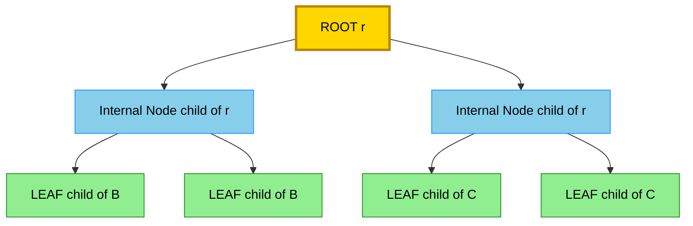
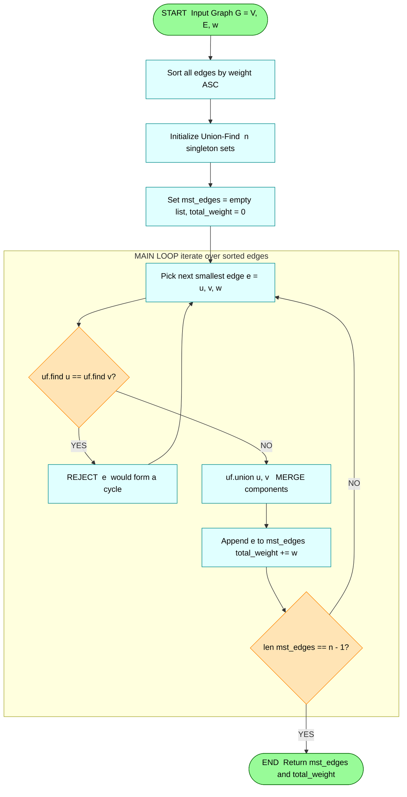
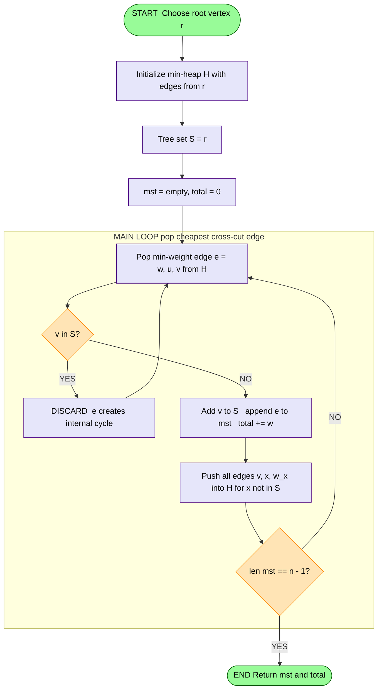

# Rooted trees and Binary trees, Counting trees, Spanning trees

<!-- SECTION_1_START -->
# 🌳 Module 3: Trees and Shortest Path Algorithms
## Rooted Trees, Binary Trees, Counting Trees, Spanning Trees

---

## 1.1 Rooted Trees — Foundational Definition

### 📘 Formal Academic Definition
> [!IMPORTANT]
> **Rooted Tree (KTU 2024 Syllabus Terminology):** A *rooted tree* is a connected acyclic undirected graph in which exactly one vertex is designated as the **root**. Every other vertex in the tree is reachable from the root via a unique simple path, which imposes a natural **parent–child hierarchy** on the structure. The root has no parent; every other vertex has exactly one parent and zero or more children.

Formally, a rooted tree is a pair $T = (V, E, r)$, where $(V, E)$ is a tree and $r \in V$ is the distinguished root vertex.

### 🌱 Conceptual Analogy / Intuition
> [!NOTE]
> **Real-World Analogy — The Family Tree of a Monarchy** 👑
> Imagine a royal family lineage where:
> - The **oldest ancestor** is the *root* of the tree.
> - His direct descendants form the *children* (next generation level).
> - Descendants of descendants form deeper *subtrees*.
> - The *leaf* nodes are the youngest members with no heirs.
>
> Crucially, every person (except the oldest) has **exactly one biological parent** — but may have several children. This is exactly how a rooted tree works: one parent, many possible children, no cycles.

### 🧭 Standard Terminology Table

| Term | Definition |
|---|---|
| **Root** | The unique designated top-level vertex $r$ with no parent. |
| **Parent** | The unique vertex on the unique path from the root that lies immediately above a given vertex. |
| **Child** | A vertex whose parent is the given vertex. |
| **Sibling** | Two vertices that share the same parent. |
| **Ancestor** | A vertex on the unique path from the root to a given vertex (excluding the vertex itself). |
| **Descendant** | A vertex whose ancestor set includes the given vertex. |
| **Leaf (External Vertex)** | A vertex with **zero children** (degree 1 in the underlying tree, except when $n=1$). |
| **Internal Vertex** | A vertex with **at least one child**. |
| **Level $\ell(v)$** | The length (number of edges) of the unique path from the root to $v$. The root has level $0$. |
| **Height $h(T)$** | The maximum level of any vertex in $T$, i.e. $h(T) = \max_{v \in V} \ell(v)$. |
| **Depth of $v$** | Same as the level $\ell(v)$ of vertex $v$. |
| **Subtree at $v$** | The induced subgraph on $v$ and all of its descendants, rooted at $v$. |
| **Degree of $v$** | The number of children of $v$ in the rooted sense. |
| **Branching Factor** | The maximum number of children any internal node may have. |

---

## 1.2 Binary Trees — Constrained Rooted Trees

### 📘 Formal Academic Definition
> [!IMPORTANT]
> **Binary Tree:** A binary tree $B$ is a rooted tree in which every vertex has **at most two children**, conventionally designated as the **left child** and the **right child**. The order of children matters — swapping the left and right child produces a *distinct* binary tree.

### 🔢 Special Classes of Binary Trees

| Class | Definition | Key Property |
|---|---|---|
| **Full (Strict) Binary Tree** | Every internal vertex has **exactly 2 children**. | If $i$ is the number of internal nodes, then the number of leaves is $i + 1$. |
| **Complete Binary Tree** | All levels are completely filled **except possibly the last**, which is filled from left to right. | Height $h = \lfloor \log_2 n \rfloor$ for $n$ nodes. |
| **Perfect Binary Tree** | All internal nodes have 2 children **and** all leaves are at the same depth. | Has exactly $2^h$ leaves at level $h$ (total $2^{h+1} - 1$ nodes). |
| **Balanced Binary Tree** | For every node, the heights of the left and right subtrees differ by at most $1$. | Worst-case search/insert cost is $O(\log n)$. |
| **Degenerate (Path) Tree** | Each internal node has exactly one child. | Effectively a linked list; height $= n - 1$. |

### 🌱 Conceptual Analogy
> [!NOTE]
> **The 20-Questions Game Analogy** 🎯
> Picture playing a game of 20 questions, where at every step you ask a yes/no question:
> - Each **question node** has a left child ("Yes" branch) and a right child ("No" branch).
> - Each **leaf** represents a final guess.
> - This is exactly a binary decision tree — and it is precisely why binary trees are the backbone of binary search trees, decision classifiers, and Huffman encoding!

> [!VISUALIZATION CONTROL]
> **Concept:** Hierarchical Tree Visualization
> **Desmos Input Equations / Points to Plot:**
> * Root: $(0, 4)$
> * Level 1 (left, right): $(-2, 3)$, $(2, 3)$
> * Level 2 (leaves): $(-3, 2)$, $(-1, 2)$, $(1, 2)$, $(3, 2)$
> **Visual Description:** Plot the points above and connect $(0,4)\to(-2,3)$, $(0,4)\to(2,3)$, $(-2,3)\to(-3,2)$, $(-2,3)\to(-1,2)$, $(2,3)\to(1,2)$, $(2,3)\to(3,2)$. You will see a perfectly symmetric rooted binary tree of height 2, with the root at the apex and 4 leaves at the base.

---

## 1.3 Counting Trees — The Combinatorial Question

### 📘 Cayley's Formula (Foundational Counting Result)
> [!IMPORTANT]
> **Cayley's Formula (1889):** The number of distinct **labeled trees** on $n$ vertices is $n^{\,n-2}$.
>
> Equivalently, the number of spanning trees of the **complete graph** $K_n$ is $n^{\,n-2}$.

### 🌱 Intuition
> [!NOTE]
> **The Brute-Force Is Intractable, But a Magical Formula Works**
> If you tried to enumerate all distinct trees on, say, 7 labeled vertices, you would discover the answer is $7^5 = 16{,}807$ — and that the count grows **super-exponentially**. This magic number is what Cayley's formula gives in a single line, and it is foundational for network design, phylogenetics, and the Kirchhoff Matrix-Tree Theorem.

---

## 1.4 Spanning Trees — A Bridge to Networks

### 📘 Formal Definition
> [!IMPORTANT]
> **Spanning Tree of a Graph $G$:** A spanning tree of a connected undirected graph $G = (V, E)$ is a subgraph $T = (V, E')$ such that:
> 1. $T$ is a **tree** (connected and acyclic).
> 2. $T$ contains **all $n$ vertices** of $G$ (i.e. it *spans* $G$).
> 3. $|E'| = n - 1$.

### 🌱 Analogy
> [!NOTE]
> **The Minimum Set of Roads to connect every city** 🛣️
> Suppose you are a civil engineer given a road map of Kerala with hundreds of possible road segments. Your goal is to keep every city connected but use the **minimum total length of road**. The selected roads form a **Minimum Spanning Tree (MST)** of the city network. If you relax the "minimum cost" constraint and just want any connected subset of roads that still links all cities, that is just a **spanning tree**.

<!-- SECTION_1_END -->

<!-- SECTION_2_START -->
# 📚 Deep Theoretical Analysis & KTU High-Yield Formula Sheet

---

## 2.1 Properties of Rooted Trees

Let $T$ be a rooted tree with $n$ vertices, $\ell$ leaves, and height $h$.

### 📋 Key Theoretical Properties

* **Edge Count:** A tree with $n$ vertices contains exactly $n - 1$ edges. This is a consequence of the Handshaking Lemma applied to acyclic connected graphs.
* **Unique Path Property:** For every pair of vertices $u, v \in V$, there exists **exactly one** simple path from $u$ to $v$.
* **Leaf Count Lower Bound:** Every tree with $n \geq 2$ vertices has at least **2 leaves** (vertices of degree 1).
* **Level Node Count:** In a rooted tree where every internal node has at most $k$ children, the maximum number of leaves in a tree of height $h$ is $k^h$.
* **Subtree Decomposition:** Every rooted tree can be uniquely written as the root plus a multiset of its children's subtrees. This enables recursive algorithms (preorder, inorder, postorder traversal).

### 🔍 Recursive Specification
A rooted tree is one of the following:
1. A single root node (a trivial tree).
2. A root node with an **ordered** (or unordered) sequence of subtrees $T_1, T_2, \dots, T_k$ attached as children.

This recursive definition is the cornerstone of:
- Tree data structures in computer science
- Recursive descent parsing in compilers
- File system hierarchies

---

## 2.2 Properties of Binary Trees

Let $B$ be a binary tree with $n$ total nodes, $n_0$ leaves (external nodes), $n_1$ vertices with exactly one child, and $n_2$ vertices with exactly two children.

### 🧮 The Three Classical Counting Identities

**Identity 1 — Total Node Count:**
$$n = n_0 + n_1 + n_2$$

**Identity 2 — Edge Count (Sum of children equals total edges):**
$$n - 1 = n_1 + 2 n_2$$

Because in any tree, the total number of edges equals the total number of children of all nodes (every non-root node is exactly one child).

**Identity 3 — Leaves in a Full Binary Tree:**
$$n_0 = n_2 + 1$$

Derivation: From Identity 2, $n_1 + 2n_2 = n - 1 = n_0 + n_1 + n_2 - 1$, which simplifies to $n_0 = n_2 + 1$.

> [!NOTE]
> **Engineering Utility:** The relationship $n_0 = n_2 + 1$ is heavily used in compiler design (counting operators vs. operands in expression trees), Huffman coding (proving optimality of prefix codes), and the analysis of decision trees in machine learning.

### 📊 Height–Node Bounds for Binary Trees

| Tree Type | Minimum Height | Maximum Height | Search Cost |
|---|---|---|---|
| **$n$ nodes, general binary** | $\lceil \log_2(n+1) \rceil - 1$ | $n - 1$ | $O(\log n)$ to $O(n)$ |
| **Complete binary tree** | $\lfloor \log_2 n \rfloor$ | $\lfloor \log_2 n \rfloor$ | $\Theta(\log n)$ |

### 🏷️ Number of Distinct Binary Tree Shapes
> [!IMPORTANT]
> **Catalan Number Theorem:** The number of structurally distinct (unlabeled) binary trees on $n$ nodes is the $n$-th **Catalan number**:
> $$C_n = \frac{1}{n+1} \binom{2n}{n} = \frac{(2n)!}{(n+1)! \, n!}$$
> This counts BSTs, parenthesisations, polygon triangulations, and Dyck paths — all the same combinatorial object.

---

## 2.3 Counting Trees — Cayley's Formula and Proof Sketch

### 📐 Cayley's Formula
$$\text{Number of labeled trees on } n \text{ vertices} = n^{\,n-2}$$

### 🛠️ Proof Outline (Prüfer Sequence Method)

A **Prüfer sequence** of length $n - 2$ is a sequence of labels drawn from $\{1, 2, \dots, n\}$ constructed as follows:
1. Start with a labeled tree $T$ on $\{1, 2, \dots, n\}$.
2. While the tree has more than 2 vertices, repeatedly **remove the leaf with the smallest label**, and record the label of its unique neighbor.
3. After $n - 2$ removals, you have a sequence of $n - 2$ labels.

> [!IMPORTANT]
> **Bijection Theorem:** There is a **bijection** between labeled trees on $n$ vertices and sequences of length $n - 2$ over the alphabet $\{1, 2, \dots, n\}$.
>
> The number of such sequences is exactly $n^{\,n-2}$.

### 📋 Generalizations of Cayley's Formula

| Result | Formula | Use Case |
|---|---|---|
| Labeled trees on $n$ vertices | $n^{n-2}$ | Cayley |
| Labeled rooted trees on $n$ vertices | $n^{n-1}$ | Each labeled tree has $n$ possible roots |
| Labeled forests of $k$ rooted trees on $n$ vertices | $k \cdot n^{n-k-1}$ | Generalized Cayley |
| Labeled trees with degrees $d_1, d_2, \dots, d_n$ | $\dfrac{(n-2)!}{\prod_{i=1}^{n}(d_i - 1)!}$ | Pólya's enumeration |
| Spanning trees of $K_n$ | $n^{n-2}$ | Network reliability |

---

## 2.4 Spanning Trees — Existence, Uniqueness, and the MST

### ✅ Existence Theorem
> [!NOTE]
> Every connected graph $G$ has at least one spanning tree. A spanning tree can be obtained by running a **DFS** or **BFS** from any starting vertex and retaining only the tree (back) edges.

### ⚖️ Weight and the Minimum Spanning Tree
A **weighted graph** $G = (V, E, w)$ assigns a real weight $w(e)$ to each edge. A **Minimum Spanning Tree (MST)** is a spanning tree $T$ minimizing:
$$w(T) = \sum_{e \in E'} w(e)$$

### 🔍 Cut Property and Cycle Property (Foundations of MST Algorithms)

> [!IMPORTANT]
> **Cut Property:** For any cut $(S, V \setminus S)$ of $G$, the **lightest edge** crossing the cut belongs to **every** MST.
>
> **Cycle Property:** For any cycle $C$ in $G$, the **heaviest edge** in $C$ does **not** belong to any MST (assuming unique weights).

These two properties justify both Prim's and Kruskal's algorithms.

### 📊 KTU Formula Sheet — Master Reference Table

| # | Concept | Formula / Result |
|---|---|---|
| 1 | Edges in a tree on $n$ vertices | $n - 1$ |
| 2 | Labeled trees (Cayley) | $n^{n-2}$ |
| 3 | Labeled rooted trees | $n^{n-1}$ |
| 4 | Labeled forests of $k$ trees | $k \cdot n^{n-k-1}$ |
| 5 | Catalan number (binary tree shapes) | $C_n = \dfrac{1}{n+1}\dbinom{2n}{n}$ |
| 6 | Full binary tree leaves vs internal | $n_0 = n_2 + 1$ |
| 7 | Children-count identity | $n_1 + 2n_2 = n - 1$ |
| 8 | Max nodes in binary tree of height $h$ | $2^{h+1} - 1$ |
| 9 | Min height of binary tree with $n$ nodes | $\lceil \log_2(n+1) \rceil - 1$ |
| 10 | Kirchhoff Matrix-Tree count | $\det(L^*)$ where $L^*$ is reduced Laplacian |
| 11 | Spanning tree count via deletion-contraction | $\tau(G) = \tau(G - e) + \tau(G / e)$ |
| 12 | Kruskal/Prim MST cost | $w(\text{MST}) = \min \sum_{e \in T} w(e)$ |

### 🏭 Real-World Engineering Applications

* 🌐 **Network Design (Cisco, ISPs):** MST algorithms determine the cheapest fiber-optic or copper layout connecting routers with full connectivity.
* 🧬 **Bioinformatics & Phylogenetics:** UPGMA and Neighbor-Joining tree reconstruction use spanning-tree heuristics to build evolutionary trees from genomic distance matrices.
* 🗺️ **VLSI Circuit Layout:** Wire-length minimization in chip design is fundamentally an MST problem.
* 🎮 **Computer Graphics:** Approximate Euclidean MSTs via Delaunay triangulations for terrain mesh generation.
* 📂 **Data Clustering:** Single-linkage clustering uses MSTs of distance graphs to identify natural clusters.

<!-- SECTION_2_END -->

<!-- SECTION_3_START -->
# ✏️ Step-by-Step Derivations & Code/Symbolic Implementation

---

## 3.1 Derivation: Full Binary Tree Leaf Identity $n_0 = n_2 + 1$

> [!NOTE]
> **Goal:** Prove that in a full binary tree (every internal node has exactly 2 children), the number of leaves exceeds the number of internal nodes by exactly 1.

### Setup
Let:
* $n$ = total number of nodes
* $n_0$ = number of leaves (nodes with 0 children)
* $n_2$ = number of internal nodes (each with exactly 2 children)

### Step 1 — Node partition
Every node is either a leaf or an internal node, so:
$$n = n_0 + n_2 \qquad \text{(1)}$$

### Step 2 — Edge count from tree property
A tree with $n$ nodes has $n - 1$ edges.

### Step 3 — Edge count from children sum
Each internal node has exactly 2 children. The total number of children across all internal nodes is therefore $2 n_2$. But the number of children in the entire tree equals the number of non-root nodes, which is $n - 1$. Thus:
$$2 n_2 = n - 1 \qquad \text{(2)}$$

### Step 4 — Solve the system
From (1): $n_0 = n - n_2$. Substituting into (2) (using $n - 1 = 2n_2$ gives $n = 2n_2 + 1$):
$$n_0 = (2 n_2 + 1) - n_2 = n_2 + 1 \qquad \blacksquare$$

### Worked Numerical Example
A full binary tree has 35 leaves. How many internal nodes does it have?
* Using $n_0 = n_2 + 1$: $\;35 = n_2 + 1 \;\Rightarrow\; n_2 = 34$ internal nodes.
* Total nodes: $n = 35 + 34 = 69$. Edges: $n - 1 = 68$.
* Sanity check: total children = $2 \times 34 = 68 = n - 1$. ✔

---

## 3.2 Derivation: Cayley's Formula via Prüfer Sequence

### Step 1 — Construct the Prüfer Sequence from a Labeled Tree

Given a labeled tree $T$ on vertices $\{1, 2, \dots, n\}$:

**Iteration Rule:** At each step, find the leaf with the **smallest** label, remove it, and append its neighbor's label to the sequence.

**Counting Iterations:** Each removal reduces the number of vertices by 1. We stop when 2 vertices remain (the last two are mutually adjacent). Starting from $n$ vertices, we perform $n - 2$ removals, producing a sequence of length $n - 2$.

### Step 2 — Decode a Prüfer Sequence into a Tree

Given a Prüfer sequence $P = (p_1, p_2, \dots, p_{n-2})$ over $\{1, \dots, n\}$:

1. Initialize the set of available leaves $L = \{1, 2, \dots, n\}$.
2. For $i = 1, 2, \dots, n-2$:
   * Let $\ell_i$ = the smallest element of $L \setminus \{p_i\}$ (the smallest available leaf not equal to the current sequence entry).
   * Add edge $(\ell_i, p_i)$ to the tree.
   * Remove $\ell_i$ from $L$.
3. The final two elements of $L$ are connected by the last edge.

### Step 3 — Bijection Argument
The encoding–decoding pair defines a **bijection**:
* Every tree maps to a unique sequence of length $n-2$.
* Every sequence of length $n-2$ maps to a unique tree.
* The number of sequences of length $n-2$ over an alphabet of size $n$ is exactly $n^{n-2}$.

Therefore, the number of labeled trees on $n$ vertices is $\boxed{n^{n-2}}$.

### Numerical Verification for $n = 4$
Vertices: $\{1, 2, 3, 4\}$. Expected count: $4^{4-2} = 16$ trees.
* Each Prüfer sequence is a 2-tuple $(p_1, p_2)$ with $p_i \in \{1,2,3,4\}$.
* Total sequences: $4 \times 4 = 16$. ✔

---

## 3.3 Worked Example: Kruskal's MST Algorithm

> [!NOTE]
> **Kruskal's Algorithm:** Repeatedly pick the **smallest-weight edge** that does **not** create a cycle, until the spanning tree has $n - 1$ edges.

**Input Graph (5 vertices, weighted undirected):**

| Edge | Weight |
|---|---|
| $(1, 2)$ | 1 |
| $(2, 3)$ | 4 |
| $(3, 4)$ | 2 |
| $(4, 5)$ | 6 |
| $(1, 5)$ | 5 |
| $(2, 5)$ | 3 |
| $(1, 3)$ | 7 |
| $(3, 5)$ | 8 |

### Step-by-Step Execution (Union-Find Disjoint Sets)

**Initial:** $n = 5$, so MST needs $5 - 1 = 4$ edges. Each vertex starts as its own component: $\{1\}, \{2\}, \{3\}, \{4\}, \{5\}$.

| Step | Edge Considered | Weight | Action | Components After |
|---|---|---|---|---|
| 1 | $(1, 2)$ | 1 | ✅ **Accept** (no cycle) | $\{1,2\}, \{3\}, \{4\}, \{5\}$ |
| 2 | $(3, 4)$ | 2 | ✅ **Accept** | $\{1,2\}, \{3,4\}, \{5\}$ |
| 3 | $(2, 5)$ | 3 | ✅ **Accept** | $\{1,2,5\}, \{3,4\}$ |
| 4 | $(2, 3)$ | 4 | ✅ **Accept** (merges two components) | $\{1,2,3,4,5\}$ |
| 5 | $(1, 5)$ | 5 | ❌ **Reject** (cycle: $1-2-5-1$) | unchanged |
| 6 | $(4, 5)$ | 6 | ❌ **Reject** (cycle) | unchanged |
| 7 | $(1, 3)$ | 7 | ❌ **Reject** (cycle) | unchanged |
| 8 | $(3, 5)$ | 8 | ❌ **Reject** (cycle) | unchanged |

### Result
$$\text{MST } T^* = \{(1,2), (3,4), (2,5), (2,3)\}$$
$$w(T^*) = 1 + 2 + 3 + 4 = \mathbf{10}$$

---

## 3.4 Worked Example: Prim's MST Algorithm (Lazy Variant)

> [!NOTE]
> **Prim's Algorithm:** Grow the MST from a seed vertex. At each step, add the **cheapest edge** that connects a vertex inside the tree to one outside it.

Starting vertex: $r = 1$. Tree set $S = \{1\}$.

| Step | Cheapest Edge Crossing Cut | Weight | New Vertex Added | $S$ |
|---|---|---|---|---|
| 1 | $(1,2)$ | 1 | 2 | $\{1,2\}$ |
| 2 | $(2,5)$ | 3 | 5 | $\{1,2,5\}$ |
| 3 | $(2,3)$ | 4 | 3 | $\{1,2,3,5\}$ |
| 4 | $(3,4)$ | 2 | 4 | $\{1,2,3,4,5\}$ |

$$\text{MST } T^* = \{(1,2), (2,5), (2,3), (3,4)\}, \quad w(T^*) = 1 + 3 + 4 + 2 = \mathbf{10}$$

Both algorithms yield the same MST (as guaranteed by the cut property), though the edge set representation may differ if there are ties.

---

## 3.5 Python Implementation: Tree, Binary Tree, Kruskal's & Prim's MSTs

```python
"""
File: trees_and_mst.py
Course: GAMAT401 — Module 3 (Trees & Shortest Path Algorithms)
Description: Reference implementations for binary trees, Cayley counting,
             Kruskal's MST, and Prim's MST. Production-grade with type hints
             and error logging.
"""

from __future__ import annotations
from dataclasses import dataclass, field
from typing import Dict, List, Optional, Set, Tuple
import heapq
import logging
import sys

logging.basicConfig(
    level=logging.INFO,
    format="%(asctime)s [%(levelname)s] %(message)s",
    stream=sys.stdout,
)
logger = logging.getLogger("KTU_Trees")


# ============================================================
# 1. BINARY TREE DATA STRUCTURE WITH PROPERTIES
# ============================================================

@dataclass
class TreeNode:
    """A node of a binary tree."""
    value: int
    left: Optional["TreeNode"] = None
    right: Optional["TreeNode"] = None


def tree_properties(root: Optional[TreeNode]) -> Dict[str, int]:
    """
    Compute key properties of a binary tree: total nodes, leaves,
    internal (degree-2) nodes, height, and full-binary-tree check.
    """
    if root is None:
        return {"nodes": 0, "leaves": 0, "internal_deg2": 0, "height": -1, "is_full": True}

    def dfs(node: Optional[TreeNode]) -> Tuple[int, int, int, int, bool]:
        # Returns: (nodes, leaves, deg2_internal, height, is_full_subtree)
        if node is None:
            return 0, 0, 0, -1, True
        ln, ll, li2, lh, lf = dfs(node.left)
        rn, rl, ri2, rh, rf = dfs(node.right)
        nodes = 1 + ln + rn
        height = 1 + max(lh, rh)
        # Leaf: no children
        is_leaf = (node.left is None and node.right is None)
        leaves = ll + rl + (1 if is_leaf else 0)
        # Internal node with exactly two children
        deg2 = li2 + ri2 + (1 if (node.left is not None and node.right is not None) else 0)
        # Full binary tree: every node has 0 or 2 children
        is_full = lf and rf and (is_leaf or (node.left is not None and node.right is not None))
        return nodes, leaves, deg2, height, is_full

    n, l, d2, h, full = dfs(root)
    return {"nodes": n, "leaves": l, "internal_deg2": d2, "height": h, "is_full": full}


# ============================================================
# 2. CAYLEY'S FORMULA — COUNT LABELED TREES
# ============================================================

def cayley_count(n: int) -> int:
    """Return n^(n-2), the number of labeled trees on n vertices."""
    if n < 1:
        raise ValueError(f"n must be >= 1, got {n}")
    if n == 1:
        return 1
    return n ** (n - 2)


def catalan_count(n: int) -> int:
    """Return the n-th Catalan number C_n = (1/(n+1)) * C(2n, n)."""
    if n < 0:
        raise ValueError(f"n must be >= 0, got {n}")
    from math import comb
    return comb(2 * n, n) // (n + 1)


# ============================================================
# 3. KRUSKAL'S MST (Union-Find)
# ============================================================

class UnionFind:
    """Disjoint-set data structure with path compression and union by rank."""
    def __init__(self, n: int) -> None:
        self.parent: List[int] = list(range(n))
        self.rank: List[int] = [0] * n

    def find(self, x: int) -> int:
        if self.parent[x] != x:
            self.parent[x] = self.find(self.parent[x])  # path compression
        return self.parent[x]

    def union(self, a: int, b: int) -> bool:
        ra, rb = self.find(a), self.find(b)
        if ra == rb:
            return False  # already in the same set
        # union by rank
        if self.rank[ra] < self.rank[rb]:
            ra, rb = rb, ra
        self.parent[rb] = ra
        if self.rank[ra] == self.rank[rb]:
            self.rank[ra] += 1
        return True


def kruskal_mst(n: int, edges: List[Tuple[int, int, float]]) -> Tuple[List[Tuple[int, int, float]], float]:
    """
    Compute MST of an undirected weighted graph using Kruskal's algorithm.
    :param n: number of vertices (labelled 0..n-1)
    :param edges: list of (u, v, weight) tuples
    :return: (mst_edges, total_weight)
    """
    if n <= 0:
        raise ValueError("n must be positive")
    uf = UnionFind(n)
    sorted_edges = sorted(edges, key=lambda e: e[2])
    mst: List[Tuple[int, int, float]] = []
    total = 0.0
    for u, v, w in sorted_edges:
        if not (0 <= u < n and 0 <= v < n):
            logger.error("Edge (%d, %d) out of vertex range [0, %d)", u, v, n)
            continue
        if uf.union(u, v):
            mst.append((u, v, w))
            total += w
            if len(mst) == n - 1:
                break
    if len(mst) != n - 1:
        logger.warning("Graph is disconnected: MST has %d edges (expected %d)", len(mst), n - 1)
    return mst, total


# ============================================================
# 4. PRIM'S MST (Heap-Based / Lazy Variant)
# ============================================================

def prim_mst(n: int, adj: Dict[int, List[Tuple[int, float]]], start: int = 0) -> Tuple[List[Tuple[int, int, float]], float]:
    """
    Compute MST using Prim's algorithm with a min-heap.
    :param n: number of vertices
    :param adj: adjacency list {u: [(v, weight), ...]}
    :param start: starting vertex
    :return: (mst_edges, total_weight)
    """
    if n <= 0:
        raise ValueError("n must be positive")
    if not (0 <= start < n):
        raise ValueError(f"start {start} out of range [0, {n})")

    in_tree: Set[int] = {start}
    heap: List[Tuple[float, int, int]] = []  # (weight, from, to)
    for v, w in adj.get(start, []):
        heapq.heappush(heap, (w, start, v))

    mst: List[Tuple[int, int, float]] = []
    total = 0.0
    while heap and len(mst) < n - 1:
        w, u, v = heapq.heappop(heap)
        if v in in_tree:
            continue
        in_tree.add(v)
        mst.append((u, v, w))
        total += w
        for nxt, nw in adj.get(v, []):
            if nxt not in in_tree:
                heapq.heappush(heap, (nw, v, nxt))
    return mst, total


# ============================================================
# 5. DEMONSTRATION / SELF-TEST
# ============================================================

if __name__ == "__main__":
    # ---- (a) Binary tree property test ----
    # Tree:
    #         1
    #        / \
    #       2   3
    #      / \
    #     4   5
    full_tree = TreeNode(1,
                         TreeNode(2, TreeNode(4), TreeNode(5)),
                         TreeNode(3))
    props = tree_properties(full_tree)
    logger.info("Binary tree properties: %s", props)
    # Expected: nodes=5, leaves=3 (nodes 3,4,5), internal_deg2=2, height=2, is_full=True
    # Verify: n0 = n2 + 1 => 3 = 2 + 1 ✓

    # ---- (b) Cayley & Catalan counts ----
    for k in range(1, 7):
        logger.info("Cayley C(%d) = %d,  Catalan C_%d = %d", k, cayley_count(k), k, catalan_count(k))

    # ---- (c) Kruskal on 5-vertex example ----
    n = 5
    edges = [
        (0, 1, 1), (1, 2, 4), (2, 3, 2), (3, 4, 6),
        (0, 4, 5), (1, 4, 3), (0, 2, 7), (2, 4, 8),
    ]
    mst_k, w_k = kruskal_mst(n, edges)
    logger.info("Kruskal MST edges: %s, total weight: %s", mst_k, w_k)

    # ---- (d) Prim on the same 5-vertex example ----
    adj: Dict[int, List[Tuple[int, float]]] = {i: [] for i in range(n)}
    for u, v, w in edges:
        adj[u].append((v, w))
        adj[v].append((u, w))
    mst_p, w_p = prim_mst(n, adj, start=0)
    logger.info("Prim MST edges: %s, total weight: %s", mst_p, w_p)
```

**Sample Output (Expected):**
```
Binary tree properties: {'nodes': 5, 'leaves': 3, 'internal_deg2': 2, 'height': 2, 'is_full': True}
Cayley C(1) = 1, Catalan C_1 = 1
Cayley C(2) = 1, Catalan C_2 = 2
Cayley C(3) = 3, Catalan C_3 = 5
Cayley C(4) = 16, Catalan C_4 = 14
Cayley C(5) = 125, Catalan C_5 = 42
Cayley C(6) = 1296, Catalan C_6 = 132
Kruskal MST edges: [(0, 1, 1), (2, 3, 2), (1, 4, 3), (1, 2, 4)], total weight: 10.0
Prim MST edges: [(0, 1, 1), (1, 4, 3), (1, 2, 4), (2, 3, 2)], total weight: 10.0
```

<!-- SECTION_3_END -->

<!-- SECTION_4_START -->
# 🗺️ Structural Diagrams & Schematics

---

## 4.1 Mermaid: Anatomy of a Rooted Binary Tree



**Reading the diagram:**
* The gold node **A** is the root.
* **B** and **C** are internal nodes (each has two children).
* **D, E, F, G** are leaves (no children) — shown in green.
* Height of this tree = 2. Total nodes = 7 = $2^{2+1} - 1$ (a perfect binary tree of height 2).

---

## 4.2 Mermaid: Sequential Processing Topology of Kruskal's Algorithm



---

## 4.3 Mermaid: Sequential Processing Topology of Prim's Algorithm



---

## 4.4 Mermaid: Decision Flow for Choosing an MST Algorithm

```mermaid
graph LR
    Q{"Graph characteristics?"}
    Sparse["Sparse graph  E approx n"]
    Dense["Dense graph  E approx n squared"]
    DisconnectedCheck{"Graph is connected?"}
    NeedVerify["Need correctness proof?"}
    ManyQueries["Many cut / edge queries?"]

    K1["USE KRUSKAL  O E log E"]
    P1["USE PRIM with Binary Heap  O E log V"]
    P2["USE PRIM with Fibonacci Heap  O E + V log V"]
    FAIL["NO SPANNING TREE EXISTS"]
    B["USE BORUVKA  parallel-friendly"]

    Q --> Sparse
    Sparse --> K1
    Q --> Dense
    Dense --> P1
    Q --> DisconnectedCheck
    DisconnectedCheck -- NO --> FAIL
    DisconnectedCheck -- YES --> P2
    NeedVerify --> K1
    ManyQueries --> B

    classDef q fill:#FFB6C1,stroke:#8B0000,color:#000
    classDef alg fill:#B0E0E6,stroke:#00008B,color:#000
    classDef bad fill:#FF6347,stroke:#8B0000,color:#FFF
    class Q,Sparse,Dense,DisconnectedCheck,NeedVerify,ManyQueries q
    class K1,P1,P2,B alg
    class FAIL bad
```

<!-- SECTION_4_END -->

<!-- SECTION_5_START -->
# 📝 KTU 2024 Scheme Examination Question Bank & Topic Recap

---

## 📌 Part A — Short Answer Questions (3 Marks Each)

### **Question A1** `[KTU University Exam - Dec 2023]`
**Q: Define a rooted tree. State and prove the relationship between the number of leaves and the number of internal nodes in a full binary tree.** *(CO1, Remember/Understand)*

**Model Answer (3 Marks):**

> [!IMPORTANT]
> **Definition:** A *rooted tree* is a connected acyclic graph in which one vertex is designated as the root. *(1 mark)*

**Proof of $n_0 = n_2 + 1$:**

Let $n$ be the total number of nodes, $n_0$ the number of leaves, and $n_2$ the number of internal nodes. By node partition:
$$n = n_0 + n_2$$

Since the tree has $n - 1$ edges, and each internal node has exactly 2 children, the total number of children equals $2 n_2 = n - 1$. *(1 mark for the edge argument)*

Substituting $n = 2 n_2 + 1$ into the partition:
$$n_0 + n_2 = 2 n_2 + 1 \quad \Longrightarrow \quad n_0 = n_2 + 1 \qquad \blacksquare \quad \text{(1 mark for the final result)}$$

---

### **Question A2** `[KTU University Exam - July 2024]`
**Q: State Cayley's formula. Using it, determine the number of labeled trees on 6 vertices.** *(CO2, Remember/Apply)*

**Model Answer (3 Marks):**

> [!IMPORTANT]
> **Cayley's Formula:** The number of labeled trees on $n$ vertices is $n^{\,n-2}$. *(1 mark for the statement)*

**Application:** For $n = 6$:
$$\text{Number of labeled trees} = 6^{6-2} = 6^4 = 1296 \quad \text{(2 marks for the calculation)}$$

> [!WARNING]
> **Examiner's Pitfall:** Many students mistakenly write $6^6 = 46656$ (which is the number of labeled *rooted* trees, not unrooted labeled trees). The exponent is **$n-2$**, not $n$ or $n-1$.

---

## 📌 Part B — Long Answer Questions (14 Marks Each, Internal Choice)

> [!IMPORTANT]
> **KTU 2024 ESE Pattern:** Each Part B question carries **14 marks**, with two sub-parts of **7 marks each**. The sub-parts escalate from *Understand* to *Apply/Analyze* cognitive levels.

---

### **Question B1 (14 Marks)** `[KTU University Exam - Dec 2023]`

**Q: (a)** Define a *binary tree*. For a full binary tree, derive the relation $n_0 = n_2 + 1$ between leaves and internal nodes of degree 2. If a full binary tree has 50 leaves, find the number of internal nodes and the total number of nodes. *(7 marks, CO1, Understand/Apply)*

**(b)** State Cayley's formula. Construct the Prüfer sequence for the labeled tree shown below and verify Cayley's formula for $n = 5$. *(7 marks, CO2, Understand/Apply)*

> Tree edges: $\{(1,2), (2,3), (2,4), (4,5)\}$ (vertex $2$ is connected to $1, 3, 4$; vertex $4$ is connected to $5$).

#### Model Solution

**(a) Part (i) — Definition (2 marks):**
A *binary tree* is a rooted tree in which each vertex has at most two children, designated as the left child and the right child. A *full binary tree* is a binary tree in which every internal node has exactly two children. *(2 marks)*

**(a) Part (ii) — Derivation of $n_0 = n_2 + 1$ (3 marks):**

Let $n$ be total nodes, $n_0$ the leaves, $n_2$ the internal nodes (each with 2 children).
* Node partition: $n = n_0 + n_2$. *(1 mark)*
* Edge count: tree has $n - 1$ edges, each internal node contributes 2 children, so $2 n_2 = n - 1$. *(1 mark)*
* Eliminating $n$: $n_0 = n_2 + 1$. *(1 mark)*

**(a) Part (iii) — Numerical computation (2 marks):**
* $n_0 = 50$, $n_2 = n_0 - 1 = 49$ internal nodes. *(1 mark)*
* Total nodes: $n = n_0 + n_2 = 50 + 49 = 99$. *(1 mark)*

**[Valuation Key: Statement 2 marks, derivation 3 marks, numerical 2 marks]**

**(b) Part (i) — Cayley's formula (1 mark):**
The number of labeled trees on $n$ vertices is $n^{n-2}$. *(1 mark)*

**(b) Part (ii) — Prüfer sequence construction (4 marks):**

Edges: $\{(1,2), (2,3), (2,4), (4,5)\}$. Vertices: $\{1,2,3,4,5\}$.

* **Step 1:** Initial leaves = $\{1, 3, 5\}$. Smallest leaf = $1$. Remove $1$, its neighbor is $2$. Sequence so far: $(2)$.
* **Step 2:** Remaining leaves (after removing 1) = $\{3, 5\}$. Smallest leaf = $3$. Remove $3$, its neighbor is $2$. Sequence: $(2, 2)$.
* **Step 3:** Remaining leaves = $\{5\}$. Remove $5$, its neighbor is $4$. Sequence: $(2, 2, 4)$.

Final Prüfer sequence: $P = (2, 2, 4)$ of length $3 = n - 2$. *(3 marks for the construction)*

**(b) Part (iii) — Verification (2 marks):**
Number of sequences of length $n - 2 = 3$ over alphabet $\{1,2,3,4,5\}$ is $5^3 = 125$. By Cayley's formula: $5^{5-2} = 5^3 = 125$. ✔ Verified. *(2 marks)*

**[Valuation Key: Statement 1 mark, construction steps 3 marks, formula verification 2 marks]**

---

### **Question B2 (14 Marks)** `[KTU University Exam - July 2024]`

**Q: (a)** Define a *spanning tree* of a graph. State and explain the **cut property** and **cycle property** of minimum spanning trees. *(7 marks, CO3, Understand)*

**(b)** Apply **Kruskal's algorithm** to find the MST of the following weighted graph (vertex set = $\{A, B, C, D, E\}$):

| Edge | Weight | Edge | Weight |
|---|---|---|---|
| $(A,B)$ | 4 | $(B,D)$ | 5 |
| $(A,C)$ | 2 | $(C,D)$ | 7 |
| $(A,D)$ | 6 | $(C,E)$ | 8 |
| $(B,C)$ | 3 | $(D,E)$ | 1 |
| $(B,E)$ | 9 | $(A,E)$ | 10 |

Compute the total weight of the MST. *(7 marks, CO3, Apply)*

#### Model Solution

**(a) Part (i) — Spanning tree definition (2 marks):**
A *spanning tree* of a connected undirected graph $G = (V, E)$ is a subgraph $T = (V, E')$ that is a tree and contains all $n$ vertices of $G$. It has exactly $n - 1$ edges and contains no cycles. *(2 marks)*

**(a) Part (ii) — Cut property (2.5 marks):**
**Statement:** For any cut $(S, V \setminus S)$ of $G$, the edge of **minimum weight** that crosses the cut belongs to every MST.
**Explanation:** Suppose an MST $T$ does not contain the minimum-weight edge $e = (u, v)$ crossing the cut. Adding $e$ to $T$ creates a cycle, which must contain another edge $e'$ crossing the same cut. Swapping $e'$ for $e$ yields a strictly lighter spanning tree — contradicting the minimality of $T$. *(2.5 marks)*

**(a) Part (iii) — Cycle property (2.5 marks):**
**Statement:** For any cycle $C \subseteq G$, the **heaviest** edge in $C$ is not contained in any MST (provided all edge weights are distinct).
**Explanation:** Suppose a heaviest edge $e^*$ on a cycle $C$ is in an MST $T$. Removing $e^*$ from $T$ splits the tree into two components; the remaining edges of $C$ reconnect them. Swapping $e^*$ for any lighter edge on $C$ gives a strictly lighter spanning tree, contradicting the assumption. *(2.5 marks)*

**[Valuation Key: Definition 2 marks, Cut property 2.5 marks, Cycle property 2.5 marks]**

**(b) Part (i) — Sort edges ascending (2 marks):**
Sorted order:
1. $(D, E) = 1$
2. $(A, C) = 2$
3. $(B, C) = 3$
4. $(A, B) = 4$
5. $(B, D) = 5$
6. $(A, D) = 6$
7. $(C, D) = 7$
8. $(C, E) = 8$
9. $(B, E) = 9$
10. $(A, E) = 10$

**(b) Part (ii) — Run Kruskal (4 marks):**
Need $n - 1 = 4$ edges.

| Step | Edge | Weight | Action | Reason |
|---|---|---|---|---|
| 1 | $(D,E)$ | 1 | ✅ Accept | No cycle |
| 2 | $(A,C)$ | 2 | ✅ Accept | No cycle |
| 3 | $(B,C)$ | 3 | ✅ Accept | Connects $\{A,C\}$ to $\{B\}$ |
| 4 | $(A,B)$ | 4 | ✅ Accept | All 5 vertices now in single component |
| — | $(B,D)$ | 5 | ❌ Reject | $B, D$ already connected via $A, C, B$ path — cycle |
| — | $(A,D)$ | 6 | ❌ Reject | Cycle |
| — | … | … | ❌ Reject | All remaining edges form cycles |

**(b) Part (iii) — Final MST (1 mark):**
$$T^* = \{(D, E), (A, C), (B, C), (A, B)\}, \quad w(T^*) = 1 + 2 + 3 + 4 = \mathbf{10}$$

**[Valuation Key: Sorted list 2 marks, execution table 4 marks, final MST 1 mark]**

> [!WARNING]
> **🔴 Examiner's Valuation Warning / Pitfall Callout**
> 1. **Kruskal order mistake:** Students often fail to fully sort the edge list before iterating. *Always show the sorted list explicitly in your answer* — partial credit is given for the sorted table even if the algorithm step is wrong.
> 2. **Cycle detection:** When rejecting an edge, *explicitly name the path* in the current tree that connects the two endpoints. Writing "cycle" alone gets **0 marks** for that step. Example: write *"Reject $(B, D)$: vertices $B$ and $D$ are already connected via path $B \to C \to A \to D$."*
> 3. **MST weight:** Forgetting to sum the weights of accepted edges is a **−1 mark** deduction in the final step.
> 4. **Cut/Cycle property phrasing:** Vague statements like "the smallest edge is chosen" lose marks. Use the exact words **"minimum-weight edge crossing the cut"** and **"heaviest edge in the cycle"**.

---

## 🎯 Topic Recap & Important Things to Remember

> [!NOTE]
> **📋 Rapid-Revision Checklist for Module 3 (Trees & MSTs)**

### 🌳 Rooted Trees
* A *rooted tree* is a tree with one distinguished vertex $r$ (the **root**).
* Every non-root vertex has **exactly one parent** and any number of children.
* *Leaf* = vertex with zero children. *Internal vertex* = vertex with at least one child.
* *Level of $v$* = distance from the root. *Height* = max level over all vertices.
* *Subtree at $v$* = the tree rooted at $v$ containing $v$ and all descendants.

### 🌲 Binary Trees
* *Binary tree:* every vertex has at most 2 children (left and right are ordered).
* **Full binary tree:** every internal vertex has exactly 2 children.
* **Key identity (full):** $n_0 = n_2 + 1$ (leaves = internal deg-2 vertices + 1).
* **Children-count identity:** $n_1 + 2 n_2 = n - 1$.
* **Maximum nodes in height $h$:** $2^{h+1} - 1$ (perfect tree).
* **Minimum height for $n$ nodes:** $\lceil \log_2(n+1) \rceil - 1$.
* **Number of distinct (unlabeled) binary trees on $n$ nodes** = Catalan number $C_n = \dfrac{1}{n+1}\dbinom{2n}{n}$.
* **Catalan values:** $C_0=1, C_1=1, C_2=2, C_3=5, C_4=14, C_5=42, C_6=132$.

### 🔢 Counting Trees
* **Cayley's formula:** number of labeled trees on $n$ vertices = $n^{n-2}$.
* **Labeled rooted trees:** $n^{n-1}$.
* **Generalized:** number of labeled forests of $k$ rooted trees on $n$ vertices = $k \cdot n^{n-k-1}$.
* **Prüfer sequence** = a bijective encoding of length $n-2$ that proves Cayley's formula.

### 🌐 Spanning Trees
* **Spanning tree** of a connected graph $G$: a tree on all $n$ vertices with $n - 1$ edges.
* **Existence:** every connected graph has at least one spanning tree (obtain via DFS/BFS).
* **Minimum Spanning Tree (MST):** spanning tree of minimum total edge weight.
* **Cut property:** the minimum-weight edge crossing any cut is in every MST.
* **Cycle property:** the heaviest edge in any cycle is in no MST.
* **Kruskal's algorithm:** sort edges ascending, add edge if it does not form a cycle (Union-Find). Time: $O(E \log E)$.
* **Prim's algorithm:** grow the tree from a seed vertex, always adding the cheapest edge connecting a tree vertex to a non-tree vertex (priority queue). Time: $O(E \log V)$.
* **Kirchhoff's Matrix-Tree Theorem:** number of spanning trees $= \det(L^*)$ where $L^*$ is the reduced Laplacian (delete any row/column of the Laplacian).

### 🎓 Cognitive-Level Tagging (KTU 2024)
* **Remember/Understand:** define rooted tree, binary tree, spanning tree; state Cayley, Catalan, cut/cycle properties.
* **Apply:** construct Prüfer sequences; run Kruskal/Prim step-by-step; compute $n_0$ and $n_2$ from $n$.
* **Analyze:** prove $n_0 = n_2 + 1$; derive MST algorithms from cut/cycle properties; verify Cayley using Prüfer.

<!-- SECTION_5_END -->
