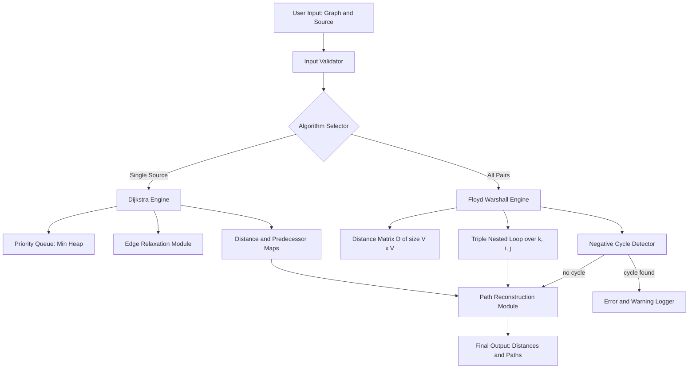
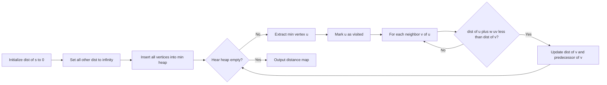
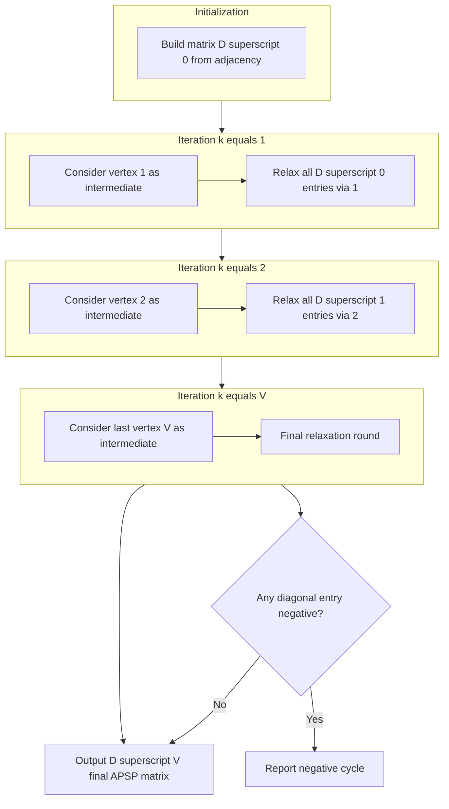
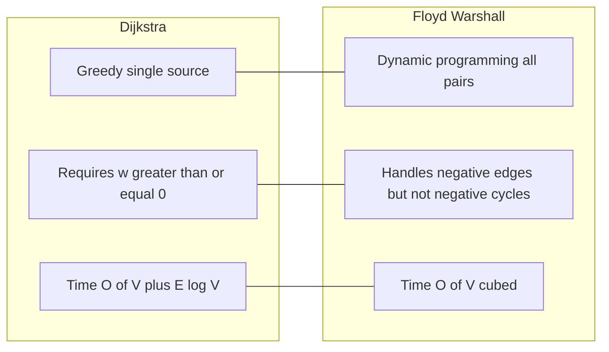

# Shortest Path Algorithms: Dijkstra's single-source algorithm, Floyd-Warshall all-pairs shortest path algorithm

<!-- SECTION_1_START -->

# Shortest Path Algorithms: Dijkstra's & Floyd-Warshall

## 1.1 Formal Academic Definition (KTU 2024 Syllabus Terminology)

> [!IMPORTANT]
> **Shortest Path Problem (KTU GAMAT401 – Module 3 Definition):**
> Given a weighted graph $G = (V, E, w)$ where $V$ is the set of vertices, $E \subseteq V \times V$ is the set of edges, and $w : E \rightarrow \mathbb{R}_{\geq 0}$ is a non-negative edge-weight function, the **shortest path problem** seeks to find a path $P = (v_0, v_1, \ldots, v_k)$ between a source vertex $s$ and a target vertex $t$ such that the total path weight
> $$W(P) = \sum_{i=0}^{k-1} w(v_i, v_{i+1})$$
> is **minimized** over all possible paths in $G$.

The problem subdivides into two canonical variants:
1. **Single-Source Shortest Path (SSSP):** Compute shortest paths from one fixed source $s$ to every other vertex $v \in V$.
2. **All-Pairs Shortest Path (APSP):** Compute shortest paths between **every** ordered pair $(u, v) \in V \times V$.

## 1.2 Conceptual Analogy — The "Google Maps Intuition"

> [!NOTE]
> **Intuition (Plain English):**
> Imagine you are standing at your **home** (the source vertex) and you want to reach your **college** (the target vertex). Every road connecting two intersections is an **edge**, and the time it takes to traverse that road is its **weight**. Dijkstra's algorithm is like a **cautious driver** who always picks the *nearest unexplored intersection* first, marks down the shortest known time to it, and then "radiates" outward. Floyd-Warshall, in contrast, is like **asking every intersection to act as a relay station** — each city checks whether routing through it can shorten the path between any two other cities.

| Algorithm | Strategy | One-Line Metaphor |
|---|---|---|
| Dijkstra | Greedy expansion from one source | "Always visit the closest known city next." |
| Floyd-Warshall | Dynamic programming on intermediate vertices | "Try every possible midway stop and keep the best." |

## 1.3 Standard Metrics & Algorithmic Properties

> [!IMPORTANT]
> **Critical Constants & Bounds:**
> - **Time complexity of Dijkstra (with min-heap):** $O((E + V)\log V)$
> - **Time complexity of Floyd-Warshall:** $O(V^{3})$
> - **Space complexity of Floyd-Warshall:** $O(V^{2})$
> - **Dijkstra's restriction:** **All edge weights must be non-negative** ($w \geq 0$).
> - **Floyd-Warshall handles:** Negative edges, but **no negative cycles**.

## 1.4 Visualization of a Weighted Graph

> [!VISUALIZATION CONTROL]
> **Concept:** A small weighted directed graph with 5 vertices, useful for both algorithms.
> **GeoGebra / Desmos Input Equations (use list of points):**
> * Vertices: $A=(0,0)$, $B=(3,1)$, $C=(2,-2)$, $D=(5,-1)$, $E=(4,2)$
> * Edges (label weights): $A \to B$ weight 4, $A \to C$ weight 2, $B \to C$ weight 1, $B \to D$ weight 5, $C \to D$ weight 8, $C \to E$ weight 10, $D \to E$ weight 2, $D \to Z$ weight 6, $E \to Z$ weight 3
> **Visual Description:** You should see a directed acyclic-like mesh where thicker labels indicate higher weights. The path $A \to C \to B \to D \to E \to Z$ has cumulative weight 13, which is the true shortest path from $A$ to $Z$.

---

<!-- SECTION_1_END -->

<!-- SECTION_2_START -->

# Deep Theoretical Analysis & KTU Formula Sheet

## 2.1 Algorithmic Theory — Dijkstra's Single-Source Algorithm

Dijkstra's algorithm is a **greedy algorithm** that maintains a set $S$ of vertices whose shortest distance from the source $s$ is already finalized. It uses a **priority queue (min-heap)** keyed on the current best-known distance.

### 2.1.1 Step-by-Step Operational Logic

1. **Initialization:** Set $\text{dist}[s] = 0$ and $\text{dist}[v] = \infty$ for all $v \neq s$. Insert all vertices into the min-priority queue keyed on $\text{dist}[\cdot]$.
2. **Main Loop:** Extract the vertex $u$ with the **minimum tentative distance** from the priority queue.
3. **Finalize:** Add $u$ to the settled set $S$ (once extracted, its distance is provably optimal for non-negative weights).
4. **Relaxation:** For every outgoing edge $(u, v)$ with weight $w(u, v)$:
   - Compute the candidate distance: $\text{candidate} = \text{dist}[u] + w(u, v)$.
   - If $\text{candidate} < \text{dist}[v]$, then update $\text{dist}[v] = \text{candidate}$ and update the predecessor $\text{prev}[v] = u$.
5. **Termination:** Continue until the priority queue is empty. The array $\text{dist}$ holds the shortest distances, and tracing $\text{prev}[\cdot]$ backwards reconstructs the actual path.

> [!NOTE]
> **Why the Greedy Choice is Correct (Optimal Substructure):**
> Because all edge weights are non-negative, the moment a vertex $u$ is dequeued, no future, unvisited vertex can offer a shorter path to $u$ — every alternative would have to traverse $u$ first, incurring a non-negative additional cost. This is the **cut property** in action.

### 2.1.2 Pseudocode Skeleton

```
DIJKSTRA(G, w, s):
    for each vertex v in G.V:
        dist[v] = +infinity
        prev[v] = NIL
    dist[s] = 0
    Q = MinPriorityQueue(G.V keyed on dist)
    while Q is not empty:
        u = Q.extract_min()
        for each edge (u, v) in G.Adj[u]:
            if dist[u] + w(u, v) < dist[v]:
                dist[v] = dist[u] + w(u, v)
                prev[v] = u
                Q.decrease_key(v, dist[v])
    return (dist, prev)
```

## 2.2 Algorithmic Theory — Floyd-Warshall All-Pairs Algorithm

Floyd-Warshall is a **dynamic programming** algorithm. It works on an $n \times n$ distance matrix $D^{(k)}$ where $n = \vert V \vert$, and $D^{(k)}[i][j]$ represents the shortest path from $i$ to $j$ using only vertices in the set $\{1, 2, \ldots, k\}$ as **intermediate stops**.

### 2.2.1 The Core Recurrence (Bellman-Ford Style)

At iteration $k$, the algorithm considers vertex $k$ as a potential intermediate point:

$$D^{(k)}[i][j] = \min\Bigl( D^{(k-1)}[i][j], \;\; D^{(k-1)}[i][k] + D^{(k-1)}[k][j] \Bigr)$$

The first term means "don't use $k$ as an intermediate," the second means "route through $k$."

### 2.2.2 Initialization of $D^{(0)}$

$$
D^{(0)}[i][j] = 
\begin{cases}
0 & \text{if } i = j \\
w(i, j) & \text{if } (i, j) \in E \\
\infty & \text{otherwise}
\end{cases}
$$

### 2.2.3 Step-by-Step Operational Logic

1. Initialize the distance matrix $D^{(0)}$ from direct edge weights (and $\infty$ for missing edges, $0$ on the diagonal).
2. For $k = 1$ to $n$:
   - For $i = 1$ to $n$:
     - For $j = 1$ to $n$:
       - Apply the **relaxation via $k$** update to produce $D^{(k)}[i][j]$.
3. The final matrix $D^{(n)} = D^{(n-1)} = \ldots$ contains the all-pairs shortest distances.

> [!NOTE]
> **Space Optimization:**
> The "$^{(k)}$" superscripts are bookkeeping only. A single in-place matrix $D$ is sufficient because $D^{(k-1)}[i][k]$ and $D^{(k-1)}[k][j]$ are **not modified during iteration $k$** — they were finalized in previous rounds. This reduces the algorithm to $O(V^{2})$ space.

## 2.3 KTU High-Yield Formula Sheet

> [!IMPORTANT]
> **Master these before the exam — every line below is a guaranteed KTU valuation point.**

| # | Symbol / Formula | Meaning | Conditions |
|---|---|---|---|
| 1 | $D^{(k)}[i][j] = \min\!\bigl(D^{(k-1)}[i][j],\, D^{(k-1)}[i][k] + D^{(k-1)}[k][j]\bigr)$ | Floyd-Warshall recurrence | $i \neq k, j \neq k$ |
| 2 | $D^{(0)}[i][j] = w(i, j)$ | Initial direct edge weight | For all $(i, j) \in E$ |
| 3 | $D^{(0)}[i][i] = 0$ | Diagonal initialization | Always |
| 4 | $D^{(0)}[i][j] = \infty$ | No direct edge | For $(i, j) \notin E$ |
| 5 | $\text{dist}[v] = \min\!\bigl(\text{dist}[v],\, \text{dist}[u] + w(u, v)\bigr)$ | Dijkstra edge relaxation | $w \geq 0$ |
| 6 | $T_{\text{Dijkstra}} = O\!\bigl((V + E)\log V\bigr)$ | Time w/ binary heap | Non-negative weights |
| 7 | $T_{\text{FW}} = O(V^{3})$ | Time complexity | No negative cycles |
| 8 | $S_{\text{FW}} = O(V^{2})$ | Space complexity | In-place variant |
| 9 | $\sum_{i=0}^{k-1} w(v_i, v_{i+1})$ | Total path weight of a path of length $k$ | Definition |
| 10 | $\text{prev}[v] = u$ on relaxation | Predecessor in shortest path tree | When $u$ improves $v$ |

## 2.4 Real-World Engineering Utility

> [!NOTE]
> **Where these algorithms are deployed in production systems:**
> - **Dijkstra:** GPS navigation (OpenStreetMap, Google Maps shortest-time routing), Open Shortest Path First (OSPF) routing in IP networks, robot path planning in ROS, network packet routing in software-defined networks.
> - **Floyd-Warshall:** Computing transitive closures in databases, finding optimal broadcast trees in network design, robotics multi-robot coordination, compiler register allocation via interference graphs, and **social network analysis** (e.g., computing closeness centrality between all pairs of users).

---

<!-- SECTION_2_END -->

<!-- SECTION_3_START -->

# Step-by-Step Derivations, Worked Examples & Code Implementation

## 3.1 Exhaustive Worked Example — Dijkstra's Algorithm

**Graph:** 6 vertices $\{A, B, C, D, E, Z\}$ with directed, non-negative edges:

| Edge | $A\!-\!B$ | $A\!-\!C$ | $B\!-\!C$ | $B\!-\!D$ | $C\!-\!D$ | $C\!-\!E$ | $D\!-\!E$ | $D\!-\!Z$ | $E\!-\!Z$ |
|---|---|---|---|---|---|---|---|---|---|
| Weight | 4 | 2 | 1 | 5 | 8 | 10 | 2 | 6 | 3 |

**Source:** $A$. **Goal:** Compute shortest distances to all other vertices.

### 3.1.1 Trace Table (State after each iteration)

| Step | Extracted $u$ | $\text{dist}[A]$ | $\text{dist}[B]$ | $\text{dist}[C]$ | $\text{dist}[D]$ | $\text{dist}[E]$ | $\text{dist}[Z]$ | Settled $S$ |
|---|---|---|---|---|---|---|---|---|
| Init | — | **0** | $\infty$ | $\infty$ | $\infty$ | $\infty$ | $\infty$ | $\emptyset$ |
| 1 | $A$ | 0 | 4 (via $A$) | **2** (via $A$) | $\infty$ | $\infty$ | $\infty$ | $\{A\}$ |
| 2 | $C$ | 0 | 3 (via $A,C$) | 2 | 10 (via $A,C$) | 12 (via $A,C$) | $\infty$ | $\{A, C\}$ |
| 3 | $B$ | 0 | 3 | 2 | **8** (via $A,C,B$) | 12 | $\infty$ | $\{A, C, B\}$ |
| 4 | $D$ | 0 | 3 | 2 | 8 | 10 (via $A,C,B,D$) | 14 (via $A,C,B,D$) | $\{A, C, B, D\}$ |
| 5 | $E$ | 0 | 3 | 2 | 8 | 10 | **13** (via $A,C,B,D,E$) | $\{A, C, B, D, E\}$ |
| 6 | $Z$ | 0 | 3 | 2 | 8 | 10 | 13 | $\{A, C, B, D, E, Z\}$ |

**Final shortest distances from $A$:**

$$
\text{dist} = \bigl\{ A:0,\; B:3,\; C:2,\; D:8,\; E:10,\; Z:13 \bigr\}
$$

**Reconstructed shortest path to $Z$:** $A \to C \to B \to D \to E \to Z$ with total weight $2 + 1 + 5 + 2 + 3 = 13$.

### 3.1.2 Algebraic Derivation of the Relaxation Step

For an edge $(u, v)$ of weight $w(u, v)$, suppose a path of length $k$ from $s$ to $u$ with weight $L$ is already finalized (i.e., $L = \text{dist}[u]$). Any path from $s$ to $v$ that ends with the edge $(u, v)$ must have total weight

$$
\text{candidate} = L + w(u, v) = \text{dist}[u] + w(u, v)
$$

The current best distance to $v$ is $\text{dist}[v]$. The optimal distance satisfies:

$$
\text{dist}[v] = \min\!\Bigl(\text{dist}[v],\; \text{dist}[u] + w(u, v)\Bigr)
$$

Because $w(u, v) \geq 0$, the candidate is at least $\text{dist}[u]$. Once $\text{dist}[u]$ is finalized, no future path through a not-yet-finalized vertex $x$ can beat this candidate — that would require $\text{dist}[x] < \text{dist}[u]$, contradicting the priority-queue ordering.

## 3.2 Exhaustive Worked Example — Floyd-Warshall Algorithm

**Graph:** 4 vertices $\{1, 2, 3, 4\}$ with edge weights:

| From $\downarrow$ / To $\rightarrow$ | 1 | 2 | 3 | 4 |
|---|---|---|---|---|
| **1** | 0 | 3 | $\infty$ | 7 |
| **2** | 2 | 0 | $\infty$ | $\infty$ |
| **3** | $\infty$ | 8 | 0 | 1 |
| **4** | 5 | $\infty$ | 4 | 0 |

### 3.2.1 Iteration $k = 1$ (use vertex 1 as intermediate)

Apply the rule: $D[2][4] = \min(D[2][4],\, D[2][1] + D[1][4]) = \min(\infty, 2 + 7) = 9$.

$$
D^{(1)} = \begin{bmatrix} 0 & 3 & \infty & 7 \\ 2 & 0 & \infty & 9 \\ \infty & 8 & 0 & 1 \\ 5 & 8 & 4 & 0 \end{bmatrix}
$$

### 3.2.2 Iteration $k = 2$ (use vertex 2 as intermediate)

Key relaxations:
* $D[1][3] = \min(\infty,\, 3 + \infty) = \infty$ (no path $1 \to 2 \to 3$).
* $D[1][4] = \min(7,\, 3 + 0) = 3$ (improved via 2).
* $D[3][1] = \min(\infty,\, 8 + 2) = 10$ (via $3 \to 2 \to 1$).
* $D[3][4] = \min(1,\, 8 + 0) = 1$ (no change).
* $D[4][1] = \min(5,\, \infty + 2) = 5$ (no change).

$$
D^{(2)} = \begin{bmatrix} 0 & 3 & \infty & 3 \\ 2 & 0 & \infty & 5 \\ 10 & 8 & 0 & 1 \\ 5 & 8 & 4 & 0 \end{bmatrix}
$$

### 3.2.3 Iteration $k = 3$ (use vertex 3 as intermediate)

* $D[2][4] = \min(5,\, \infty + 1) = 5$ (no change).
* $D[4][1] = \min(5,\, 4 + 10) = 5$ (no change).
* $D[4][2] = \min(8,\, 4 + 8) = 8$ (no change).

$$
D^{(3)} = \begin{bmatrix} 0 & 3 & \infty & 3 \\ 2 & 0 & \infty & 5 \\ 10 & 8 & 0 & 1 \\ 5 & 8 & 4 & 0 \end{bmatrix}
$$

### 3.2.4 Iteration $k = 4$ (use vertex 4 as intermediate)

* $D[1][2] = \min(3,\, 3 + 8) = 3$ (no change).
* $D[1][3] = \min(\infty,\, 3 + 4) = 7$ (via $1 \to 4 \to 3$).
* $D[2][3] = \min(\infty,\, 5 + 4) = 9$ (via $2 \to 4 \to 3$).
* $D[3][1] = \min(10,\, 1 + 5) = 6$ (via $3 \to 4 \to 1$).

### 3.2.5 Final All-Pairs Shortest Path Matrix $D^{(4)}$

$$
D^{(4)} = \begin{bmatrix} 0 & 3 & 7 & 3 \\ 2 & 0 & 9 & 5 \\ 6 & 8 & 0 & 1 \\ 5 & 8 & 4 & 0 \end{bmatrix}
$$

**Interpretation:** $D[1][3] = 7$ means the shortest path from vertex 1 to vertex 3 has total weight 7 (e.g., $1 \to 4 \to 3$ with weights $3 + 4 = 7$).

## 3.3 Full Python Implementation

```python
"""
Module: Shortest Path Algorithms (Dijkstra + Floyd-Warshall)
Course: GAMAT401 - KTU 2024 Scheme
"""
from __future__ import annotations
import heapq
import math
import logging
from typing import Dict, List, Tuple, Optional

logging.basicConfig(level=logging.INFO, format="[%(levelname)s] %(message)s")
logger = logging.getLogger("ShortestPath")


# ------------------------------------------------------------------
# 1. DIJKSTRA'S SINGLE-SOURCE SHORTEST PATH ALGORITHM
# ------------------------------------------------------------------
def dijkstra(graph: Dict[str, List[Tuple[str, float]]],
             source: str) -> Tuple[Dict[str, float], Dict[str, Optional[str]]]:
    """
    Compute shortest distances and predecessors from `source` to every
    reachable vertex in a graph with non-negative edge weights.

    Parameters
    ----------
    graph : adjacency list { u : [(v, w), ...] }
    source : starting vertex

    Returns
    -------
    (dist, prev) : distance map and predecessor map
    """
    if source not in graph:
        raise ValueError(f"Source vertex '{source}' not present in graph.")

    # Validate non-negative weights (Dijkstra precondition)
    for u, neighbours in graph.items():
        for v, w in neighbours:
            if w < 0:
                raise ValueError(
                    f"Negative edge weight {w} on ({u},{v}); "
                    "Dijkstra requires w >= 0."
                )

    dist: Dict[str, float] = {v: math.inf for v in graph}
    prev: Dict[str, Optional[str]] = {v: None for v in graph}
    dist[source] = 0.0

    # Min-heap of (distance, vertex)
    heap: List[Tuple[float, str]] = [(0.0, source)]
    visited: set[str] = set()

    while heap:
        current_dist, u = heapq.heappop(heap)

        if u in visited:
            continue
        visited.add(u)

        if current_dist > dist[u]:
            continue

        for v, w in graph[u]:
            if v in visited:
                continue
            candidate = dist[u] + w
            if candidate < dist[v]:
                dist[v] = candidate
                prev[v] = u
                heapq.heappush(heap, (candidate, v))
                logger.debug(f"Relaxed ({u},{v}) -> dist[{v}] = {candidate}")

    logger.info(f"Dijkstra complete. Final dist: {dist}")
    return dist, prev


# ------------------------------------------------------------------
# 2. FLOYD-WARSHALL ALL-PAIRS SHORTEST PATH ALGORITHM
# ------------------------------------------------------------------
def floyd_warshall(num_vertices: int,
                   edges: List[Tuple[int, int, float]]
                   ) -> Tuple[List[List[float]],
                              List[List[Optional[int]]]]:
    """
    Compute all-pairs shortest paths using the Floyd-Warshall algorithm.

    Parameters
    ----------
    num_vertices : number of vertices (labelled 0 .. n-1)
    edges : list of (u, v, weight) directed edges

    Returns
    -------
    (dist, next_node) : distance matrix and path-reconstruction matrix
    """
    if num_vertices <= 0:
        raise ValueError("num_vertices must be a positive integer.")

    INF = math.inf
    # Distance matrix
    dist: List[List[float]] = [[INF] * num_vertices for _ in range(num_vertices)]
    # Successor matrix for path reconstruction
    nxt: List[List[Optional[int]]] = [[None] * num_vertices for _ in range(num_vertices)]

    for i in range(num_vertices):
        dist[i][i] = 0.0

    for u, v, w in edges:
        if not (0 <= u < num_vertices and 0 <= v < num_vertices):
            raise IndexError(f"Edge ({u},{v}) out of vertex range.")
        if w < dist[u][v]:
            dist[u][v] = w
            nxt[u][v] = v

    # Triple nested loop: O(V^3)
    for k in range(num_vertices):
        for i in range(num_vertices):
            if dist[i][k] == INF:
                continue
            for j in range(num_vertices):
                if dist[k][j] == INF:
                    continue
                new_dist = dist[i][k] + dist[k][j]
                if new_dist < dist[i][j]:
                    dist[i][j] = new_dist
                    nxt[i][j] = nxt[i][k]

    # Negative cycle detection: any dist[i][i] < 0 indicates a cycle
    for i in range(num_vertices):
        if dist[i][i] < 0:
            raise ValueError("Negative cycle detected; results are invalid.")

    logger.info("Floyd-Warshall complete.")
    return dist, nxt


# ------------------------------------------------------------------
# 3. PATH RECONSTRUCTION HELPERS
# ------------------------------------------------------------------
def reconstruct_path(prev: Dict[str, Optional[str]],
                     target: str) -> List[str]:
    path: List[str] = []
    node: Optional[str] = target
    while node is not None:
        path.append(node)
        node = prev[node]
    return list(reversed(path))


# ------------------------------------------------------------------
# 4. DEMO / SANITY CHECK
# ------------------------------------------------------------------
if __name__ == "__main__":
    # ----- Dijkstra demo -----
    G = {
        'A': [('B', 4), ('C', 2)],
        'B': [('C', 1), ('D', 5)],
        'C': [('D', 8), ('E', 10)],
        'D': [('E', 2), ('Z', 6)],
        'E': [('Z', 3)],
        'Z': []
    }
    dist, prev = dijkstra(G, 'A')
    print("Dijkstra distances from A:", dist)
    print("Shortest path A -> Z:", reconstruct_path(prev, 'Z'))

    # ----- Floyd-Warshall demo -----
    edges_fw = [
        (0, 1, 3), (0, 3, 7),
        (1, 0, 2),
        (2, 1, 8), (2, 3, 1),
        (3, 0, 5), (3, 2, 4),
    ]
    dist_fw, nxt_fw = floyd_warshall(4, edges_fw)
    print("Floyd-Warshall distance matrix:")
    for row in dist_fw:
        print(["{:.0f}".format(x) if x != math.inf else "INF" for x in row])
```

---

<!-- SECTION_3_END -->

<!-- SECTION_4_START -->

# Structural Diagrams & Schematics

## 4.1 Block-Level Functional Architecture of Shortest-Path Solvers



## 4.2 Dijkstra Sequential Processing Topology



## 4.3 Floyd-Warshall Multi-Stage Iteration Matrix



## 4.4 Side-by-Side Algorithmic Comparison Diagram



---

<!-- SECTION_4_END -->

<!-- SECTION_5_START -->

# KTU 2024 Scheme Examination Question Bank & Topic Recap

## 5.1 Part A — Short Answer Questions (3 Marks Each)

### Question 1 (3 Marks)
> **[KTU University Exam – July 2024 | CO3 | Remember]**
> *State the precondition that Dijkstra's algorithm imposes on edge weights. What happens if this precondition is violated?*

**Model Answer (Valuation Key):**
* **[1 Mark]** Dijkstra's algorithm requires that every edge weight in the input graph be **non-negative**, i.e., $w(u, v) \geq 0$ for all $(u, v) \in E$.
* **[1 Mark]** This assumption is essential for the greedy correctness argument: once a vertex is extracted from the min-priority queue, its distance is considered final because any alternative path would have to add a non-negative additional cost.
* **[1 Mark]** If the precondition is violated (presence of a negative-weight edge), Dijkstra may produce incorrect, non-optimal distances. For graphs with negative edges but no negative cycles, the **Bellman-Ford algorithm** should be used instead.

---

### Question 2 (3 Marks)
> **[KTU University Exam – Dec 2023 | CO3 | Understand]**
> *Write the Floyd-Warshall recurrence relation. Explain in one sentence the meaning of each term.*

**Model Answer (Valuation Key):**
* **[2 Marks]** The recurrence is:
$$D^{(k)}[i][j] = \min\!\bigl(D^{(k-1)}[i][j],\, D^{(k-1)}[i][k] + D^{(k-1)}[k][j]\bigr)$$
* **[1 Mark]** $D^{(k-1)}[i][j]$ means "the shortest path from $i$ to $j$ that does **not** pass through vertex $k$ as an intermediate." The second term means "the shortest path from $i$ to $j$ that **does** pass through $k$," composed of the best $i \to k$ path and the best $k \to j$ path.

---

## 5.2 Part B — Long Answer Questions (14 Marks Each, with Internal Choice)

### Question A (14 Marks)
> **[KTU University Exam – Model Paper 2024 | CO4 | Apply / Analyze]**
> Apply Dijkstra's algorithm to find the shortest path from vertex $A$ to all other vertices in the directed weighted graph given below. Show the step-by-step trace table and state the final shortest distances.

| Edge | $A \to B$ | $A \to C$ | $B \to D$ | $B \to E$ | $C \to B$ | $C \to D$ | $D \to E$ | $E \to F$ | $D \to F$ |
|---|---|---|---|---|---|---|---|---|---|
| Weight | 4 | 2 | 5 | 10 | 1 | 4 | 3 | 2 | 6 |

#### (a) Compute the shortest distance from $A$ to all other vertices. (7 Marks)

**Step-by-Step Model Solution:**

**Initial State:** $\text{dist}[A]=0$, all others $=\infty$. Min-heap: $\{(0, A)\}$.

**Step 1 — Extract $A$ (dist 0):** Relax outgoing edges of $A$:
* $A \to B$: candidate $= 0 + 4 = 4 < \infty \Rightarrow \text{dist}[B] = 4$, $\text{prev}[B] = A$.
* $A \to C$: candidate $= 0 + 2 = 2 < \infty \Rightarrow \text{dist}[C] = 2$, $\text{prev}[C] = A$.

**Step 2 — Extract $C$ (dist 2, minimum):** Relax outgoing edges of $C$:
* $C \to B$: candidate $= 2 + 1 = 3 < 4 \Rightarrow \text{dist}[B] = 3$, $\text{prev}[B] = C$.
* $C \to D$: candidate $= 2 + 4 = 6 < \infty \Rightarrow \text{dist}[D] = 6$, $\text{prev}[D] = C$.

**Step 3 — Extract $B$ (dist 3, minimum):** Relax outgoing edges of $B$:
* $B \to D$: candidate $= 3 + 5 = 8 > 6$ — no update.
* $B \to E$: candidate $= 3 + 10 = 13 < \infty \Rightarrow \text{dist}[E] = 13$, $\text{prev}[E] = B$.

**Step 4 — Extract $D$ (dist 6, minimum):** Relax outgoing edges of $D$:
* $D \to E$: candidate $= 6 + 3 = 9 < 13 \Rightarrow \text{dist}[E] = 9$, $\text{prev}[E] = D$.
* $D \to F$: candidate $= 6 + 6 = 12 < \infty \Rightarrow \text{dist}[F] = 12$, $\text{prev}[F] = D$.

**Step 5 — Extract $E$ (dist 9, minimum):** Relax outgoing edges of $E$:
* $E \to F$: candidate $= 9 + 2 = 11 < 12 \Rightarrow \text{dist}[F] = 11$, $\text{prev}[F] = E$.

**Step 6 — Extract $F$ (dist 11):** No outgoing edges.

**Final shortest distances:** $A:0$, $B:3$, $C:2$, $D:6$, $E:9$, $F:11$.

> **Valuation Key for (a):**
> * [Initial state and first extraction: 1 Mark]
> * [Correct relaxation logic per step: 2 Marks]
> * [Final table with all six distances: 2 Marks]
> * [Choosing the right min in each step (greedy): 1 Mark]
> * [Clear notation: 1 Mark]

#### (b) Reconstruct the shortest path from $A$ to $F$ and verify its total weight. (7 Marks)

**Model Solution:**
Tracing back via $\text{prev}$ from $F$:
* $\text{prev}[F] = E$, $\text{prev}[E] = D$, $\text{prev}[D] = C$, $\text{prev}[C] = A$, $\text{prev}[A] = \text{NIL}$.

Reversing: $A \to C \to D \to E \to F$.

**Weight verification:**
* $A \to C = 2$, $C \to D = 4$, $D \to E = 3$, $E \to F = 2$.
* Total $= 2 + 4 + 3 + 2 = 11$, which matches $\text{dist}[F] = 11$. ✓

**Time complexity statement:** Using a binary min-heap, Dijkstra's algorithm runs in $O((V + E)\log V)$. Here, $V = 6$ and $E = 9$, giving $O(15 \log 6)$.

> **Valuation Key for (b):**
> * [Correctly tracing predecessor pointers: 2 Marks]
> * [Reversed path sequence: 2 Marks]
> * [Weight sum and final verification: 2 Marks]
> * [Time complexity statement: 1 Mark]

> [!WARNING]
> **KTU Examiner's Pitfall Callout:** Many students forget to **update** the predecessor when an already-visited vertex is *re-improved* through a different path. You must update $\text{prev}[v]$ every time $\text{dist}[v]$ strictly decreases. Also, do not skip the **heap decrease-key** step — omitting it leads to stale distance entries in the priority queue and produces wrong answers.

---

### Question B (14 Marks — Alternative Choice)
> **[KTU University Exam – July 2023 | CO4 | Apply / Analyze]**
> Apply the Floyd-Warshall algorithm to the directed graph with the following weight matrix and find the all-pairs shortest path matrix. Assume vertices are numbered 1, 2, 3, 4.

$$
W = \begin{bmatrix} 0 & 5 & \infty & 10 \\ \infty & 0 & 3 & \infty \\ \infty & \infty & 0 & 1 \\ \infty & 2 & \infty & 0 \end{bmatrix}
$$

#### (a) Write the initialization $D^{(0)}$ and compute $D^{(1)}$ (i.e., after considering vertex 1 as intermediate). (7 Marks)

**Model Solution:**

**Initialization $D^{(0)}$** is identical to $W$:

$$
D^{(0)} = \begin{bmatrix} 0 & 5 & \infty & 10 \\ \infty & 0 & 3 & \infty \\ \infty & \infty & 0 & 1 \\ \infty & 2 & \infty & 0 \end{bmatrix}
$$

**Iteration $k = 1$:** For all $(i, j)$, check whether routing through vertex 1 helps.

Row-by-row analysis:
* $D[1][1]$ to $D[1][4]$: $D[1][2] = \min(5, 0 + 5) = 5$; $D[1][4] = \min(10, 0 + 10) = 10$. No changes because $D[1][1] = 0$.
* $D[2][2] = 0$, $D[2][3] = 3$, $D[2][4] = \min(\infty, 3 + 10) = 13$.
* $D[3][1] = \min(\infty, \infty + 0) = \infty$; $D[3][2] = \infty$; $D[3][3] = 0$; $D[3][4] = 1$ (no change).
* $D[4][2] = 2$, $D[4][4] = 0$. No improvement possible via vertex 1.

$$
D^{(1)} = \begin{bmatrix} 0 & 5 & \infty & 10 \\ \infty & 0 & 3 & 13 \\ \infty & \infty & 0 & 1 \\ \infty & 2 & \infty & 0 \end{bmatrix}
$$

> **Valuation Key for (a):**
> * [Writing $D^{(0)}$ correctly: 2 Marks]
> * [Recurrence applied correctly: 2 Marks]
> * [Identifying the one improvement $D[2][4]$: 2 Marks]
> * [Final matrix: 1 Mark]

#### (b) Compute $D^{(2)}, D^{(3)}, D^{(4)}$ and present the final all-pairs shortest path matrix. (7 Marks)

**Iteration $k = 2$ (vertex 2 as intermediate):**
* $D[1][3] = \min(\infty, 5 + 3) = 8$.
* $D[1][4] = \min(10, 5 + 13) = 10$ (no change).
* $D[3][4] = \min(1, \infty + 13) = 1$ (no change).
* $D[4][3] = \min(\infty, 2 + 3) = 5$.

$$
D^{(2)} = \begin{bmatrix} 0 & 5 & 8 & 10 \\ \infty & 0 & 3 & 13 \\ \infty & \infty & 0 & 1 \\ \infty & 2 & 5 & 0 \end{bmatrix}
$$

**Iteration $k = 3$ (vertex 3 as intermediate):**
* $D[1][4] = \min(10, 8 + 1) = 9$ (improved).
* $D[2][4] = \min(13, 3 + 1) = 4$ (improved).
* $D[4][1] = \min(\infty, 5 + \infty) = \infty$.

$$
D^{(3)} = \begin{bmatrix} 0 & 5 & 8 & 9 \\ \infty & 0 & 3 & 4 \\ \infty & \infty & 0 & 1 \\ \infty & 2 & 5 & 0 \end{bmatrix}
$$

**Iteration $k = 4$ (vertex 4 as intermediate):**
* $D[1][2] = \min(5, 9 + 2) = 5$ (no change).
* $D[2][2] = 0$, $D[2][3] = 3$.
* $D[3][1] = \min(\infty, 1 + \infty) = \infty$.

$$
D^{(4)} = \begin{bmatrix} 0 & 5 & 8 & 9 \\ \infty & 0 & 3 & 4 \\ \infty & \infty & 0 & 1 \\ \infty & 2 & 5 & 0 \end{bmatrix}
$$

**Final all-pairs shortest path matrix:**

$$
D^{*} = \begin{bmatrix} 0 & 5 & 8 & 9 \\ \infty & 0 & 3 & 4 \\ \infty & \infty & 0 & 1 \\ \infty & 2 & 5 & 0 \end{bmatrix}
$$

> **Valuation Key for (b):**
> * [Each of $D^{(2)}, D^{(3)}, D^{(4)}$ correctly computed: 4 Marks]
> * [Spotting $D[1][4]$ improvement from 10 to 9: 1 Mark]
> * [Spotting $D[2][4]$ improvement from 13 to 4: 1 Mark]
> * [Final matrix: 1 Mark]

> [!WARNING]
> **KTU Examiner's Pitfall Callout:** A common mistake is forgetting that **vertex 1 cannot be a destination-only intermediate** — students sometimes write $D[1][3] = \min(\infty, 0 + \infty) = \infty$ without realizing the *source* index $i$ and *destination* index $j$ in the recurrence must both be different from $k$. Always double-check that you are using the **previous** matrix $D^{(k-1)}$ on the right-hand side. Mixing iterations produces a wrong answer.

---

## 5.3 Topic Recap & Important Things to Remember

> [!IMPORTANT]
> **Rapid Revision Checklist — Re-read this on the morning of the exam.**

- **Shortest path problem** seeks a path $P$ between $s$ and $t$ minimizing the sum of edge weights $W(P) = \sum w(v_i, v_{i+1})$.
- **Dijkstra's algorithm** solves SSSP, runs in $O((V + E)\log V)$ with a min-heap, and requires **non-negative** edge weights.
- **Dijkstra initialization:** $\text{dist}[s] = 0$, all other distances $= \infty$.
- **Dijkstra relaxation:** $\text{dist}[v] = \min(\text{dist}[v],\, \text{dist}[u] + w(u, v))$.
- **Floyd-Warshall algorithm** solves APSP, runs in $O(V^{3})$ time and $O(V^{2})$ space (in-place variant).
- **Floyd-Warshall recurrence:** $D^{(k)}[i][j] = \min(D^{(k-1)}[i][j],\, D^{(k-1)}[i][k] + D^{(k-1)}[k][j])$.
- **Floyd-Warshall initialization:** $D^{(0)}[i][i] = 0$, $D^{(0)}[i][j] = w(i, j)$ if edge exists, $\infty$ otherwise.
- **Negative cycle detection:** Any strictly negative diagonal entry $D[i][i] < 0$ in the final matrix signals a negative cycle.
- **Dijkstra fails** on graphs with negative edges; use **Bellman-Ford** instead.
- **Greedy optimality of Dijkstra** relies on the **cut property** and the non-negativity of weights.
- **Path reconstruction** uses a predecessor array $\text{prev}[v]$; trace backwards from target to source, then reverse.
- **Real-world deployment:** Dijkstra is used in OSPF routing, GPS navigation, and robot path planning. Floyd-Warshall is used in transitive closure, network design, and centrality computations.
- **Dijkstra is single-source** (one vertex to all others); **Floyd-Warshall is all-pairs** (every pair of vertices).
- Always **state the time and space complexities** explicitly — KTU examiners award at least 1 mark for this on every problem.

---

<!-- SECTION_5_END -->
