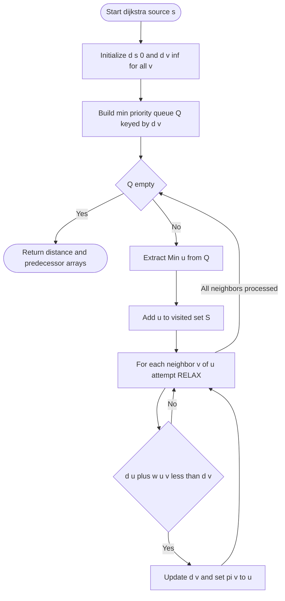
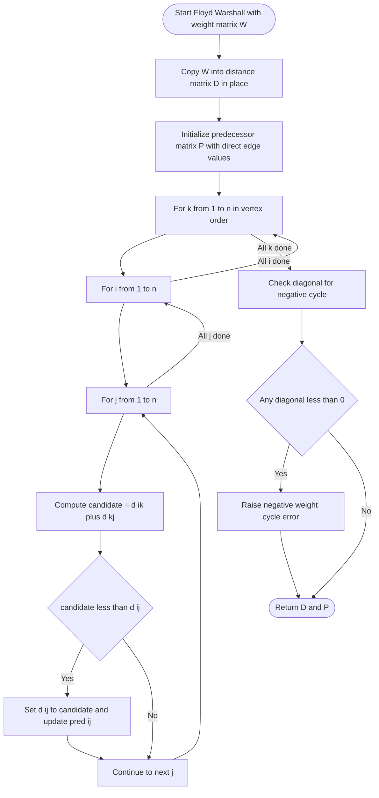
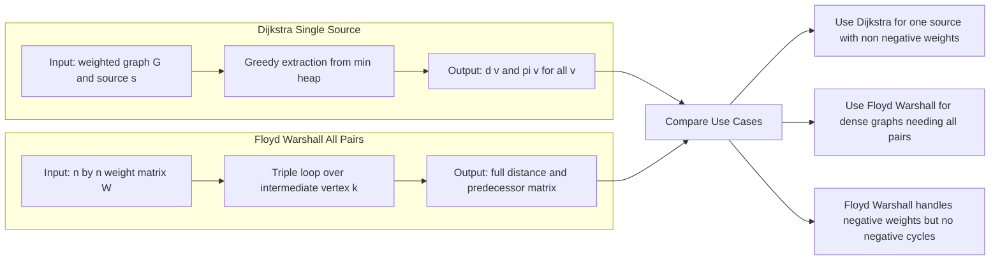
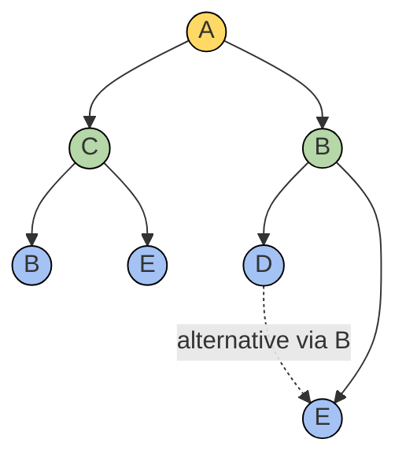

# Shortest Path Algorithms: Dijkstra's single-source algorithm, Floyd-Warshall all-pairs shortest path algorithm

<!-- SECTION_1_START -->

# Shortest Path Algorithms

## 1. Core Technical Definition & Intuitive Overview

### 1.1 Formal Definition (KTU 2024 Syllabus Terminology)

A **shortest path** between two vertices $u$ and $v$ in a weighted graph $G = (V, E, w)$ is a path $P = (u = v_0, v_1, v_2, \ldots, v_k = v)$ such that the **total path weight**

$$\delta(u, v) = \sum_{i=0}^{k-1} w(v_i, v_{i+1})$$

is minimized over all possible paths from $u$ to $v$. If no such path exists, $\delta(u, v) = \infty$.

The **Shortest Path Problem** is classified into three variants in KTU-syllabus terminology:

| Variant | Goal | Source Set | Destination Set |
|---|---|---|---|
| Single-Source | Find $\delta(s, v)$ for all $v$ | One vertex $s$ | All vertices |
| Single-Pair | Find $\delta(u, v)$ | One vertex $u$ | One vertex $v$ |
| All-Pairs | Find $\delta(u, v)$ for all pairs | All vertices | All vertices |

**Dijkstra's algorithm** solves the **single-source** problem on graphs with **non-negative edge weights**. **Floyd–Warshall algorithm** solves the **all-pairs** problem and works for graphs whose edges may have **negative weights** (provided no negative-weight cycles are reachable from the source).

> [!IMPORTANT]
> **KTU 2024 Module 3 High-Yield Definition**
> A graph is said to have a **negative-weight cycle** if the sum of weights around a directed cycle is strictly less than **$0$**. Shortest paths are **undefined** in such graphs because traversing the cycle repeatedly can reduce total path cost without bound.

### 1.2 Conceptual Analogy / Intuitive Overview

Imagine you are planning a road trip from your home city (source $s$) to every other city in Kerala. Each road connecting two cities has a travel-time label (edge weight). You want the route that **minimizes total travel time** to every destination.

- **Dijkstra's Analogy (Greedy Spread)**: Think of a stone dropped in still water at city $s$. The ripples expand outward in **waves of increasing distance**. At every wave-front, you are guaranteed that the first time a city is "touched" by the ripple, that touch represents the **shortest possible** time to reach it. This is the essence of Dijkstra's greedy approach: it commits to the closest unvisited city at every step.
- **Floyd–Warshall Analogy (Intermediate Vertex Trial)**: Imagine each city as a "transit hub." For every pair $(i, j)$, you ask: *"Is there some intermediate city $k$ such that the path $i \rightarrow k \rightarrow j$ is shorter than the direct path $i \rightarrow j$?"* You systematically test **every** city as a potential intermediate stop, in order, until the matrix is fully optimized.

### 1.3 GeoGebra / Desmos Visualization

> [!VISUALIZATION CONTROL]
> **Concept:** Bellman-Ford style relaxation visualized as a parabolic cost surface
> **GeoGebra / Desmos Input Equations:**
> * $d(x) = x^2 - 6x + 13$  (parabola showing cost vs. tentative distance)
> * Vertex point: $(3, 4)$
> **Visual Description:** A parabola opens upward with its minimum at the point $(3, 4)$. The $x$-axis represents the tentative distance value, the $y$-axis the relaxation cost. The lowest point corresponds to the "optimal" tentative distance — analogous to finding the **shortest path length** by minimizing a convex objective.

```latex
% Bellman-Ford convergence intuition — Desmos-ready
% Plot the relaxation residual r(t) = (1/2) * t^2 - 3t + 5
% Minimum at t = 3, r_min = 0.5
f(t) = (1/2)*t^2 - 3*t + 5
```

> [!NOTE]
> Dijkstra's algorithm **fails** on graphs with negative edge weights. This is because the greedy "commit-once" rule assumes that once a vertex is extracted from the priority queue, its distance is final — an assumption that breaks under negative cycles. For such cases, the **Bellman–Ford algorithm** is the standard alternative (out of KTU Module-3 scope but useful for context).

### 1.4 Standard Metrics and Constants

- **$|V|$** = number of vertices, denoted $n$ in asymptotic notation
- **$|E|$** = number of edges, denoted $m$ in asymptotic notation
- **$\infty$** = sentinel value denoting "unreached" or "no path exists"
- **Negative-weight cycle threshold** = **$0$** (cycle sum strictly less than $0$ disqualifies a shortest path)
- **Dijkstra's complexity** = **$O((n + m) \log n)$** with a binary heap
- **Floyd–Warshall complexity** = **$\Theta(n^3)$** in time, **$\Theta(n^2)$** in space

---

<!-- SECTION_1_END -->

<!-- SECTION_2_START -->

# 2. Deep Theoretical Analysis & KTU High-Yield Formula Sheet

## 2.1 Dijkstra's Single-Source Shortest Path Algorithm

### 2.1.1 Preconditions
- The directed graph $G = (V, E)$ may be either directed or undirected (the algorithm is symmetric in the undirected case).
- Every edge weight must satisfy $w(u, v) \geq 0$.
- All edge weights must be represented as real numbers (or non-negative integers).

### 2.1.2 Key Data Structures
- **Distance array** $d[v]$: stores the current best known shortest distance from source $s$ to vertex $v$.
- **Predecessor array** $\pi[v]$: stores the immediate predecessor of $v$ on the shortest path from $s$.
- **Priority queue** $Q$ (min-heap): stores all unvisited vertices keyed by $d[v]$.

### 2.1.3 Operational Logic (Greedy Relaxation)

The algorithm operates in $n$ iterations. At each iteration, it:

1. **Extracts** the unvisited vertex $u$ with the **minimum** $d[u]$ value.
2. **Marks** $u$ as visited (its distance is now finalized due to non-negative weights).
3. **Relaxes** every outgoing edge $(u, v)$: if $d[u] + w(u, v) < d[v]$, then update $d[v] \leftarrow d[u] + w(u, v)$ and set $\pi[v] \leftarrow u$.

The **relaxation step** is the heart of every shortest-path algorithm; it is a local comparison that, when iterated globally, propagates the optimal distances through the graph.

### 2.1.4 Pseudocode (Cormen et al. standard form)

```text
DIJKSTRA(G, w, s):
1  INITIALIZE-SINGLE-SOURCE(G, s)
2  S ← empty set
3  Q ← priority queue containing all vertices, keyed by d[·]
4  while Q is not empty:
5      u ← EXTRACT-MIN(Q)
6      S ← S ∪ {u}
7      for each vertex v in Adj[u]:
8          RELAX(u, v, w)
```

```text
INITIALIZE-SINGLE-SOURCE(G, s):
1  for each vertex v in G.V:
2      d[v] ← ∞
3      π[v] ← NIL
4  d[s] ← 0
```

```text
RELAX(u, v, w):
1  if d[v] > d[u] + w(u, v):
2      d[v] ← d[u] + w(u, v)
3      π[v] ← u
```

### 2.1.5 Correctness Argument (Sketch)

The proof proceeds by induction on the size of set $S$ (the set of finalized vertices). The invariant is: *at the start of each iteration, $d[v] = \delta(s, v)$ for every $v \in S$.* The base case is trivial ($S = \emptyset$). The inductive step hinges on the **cut property** of shortest paths: across any cut $(S, V \setminus S)$ in a graph with non-negative edge weights, the **shortest edge** crossing the cut is part of some shortest path from $s$ to its endpoint. Since Dijkstra always extracts the minimum-$d$ vertex outside $S$, that vertex's distance is provably optimal.

### 2.1.6 Complexity Analysis
- **$|V|$** extractions from the priority queue: $O(\log n)$ each $\Rightarrow O(n \log n)$.
- **$|E|$** decrease-key operations: $O(\log n)$ each $\Rightarrow O(m \log n)$.
- **Total**: $O((n + m) \log n)$. For dense graphs, $m \approx n^2$, giving $O(n^2 \log n)$. With a Fibonacci heap, the bound tightens to $O(m + n \log n)$.

## 2.2 Floyd–Warshall All-Pairs Shortest Path Algorithm

### 2.2.1 Preconditions
- Handles **negative** edge weights, but no negative-weight cycles (otherwise $\delta(i, j) = -\infty$).
- Works on directed graphs (undirected graphs are a special case where every undirected edge is replaced by two directed edges of the same weight).

### 2.2.2 Key Insight: Dynamic Programming over Intermediate Vertices

Let $V = \{1, 2, \ldots, n\}$ be the vertex set. Define

$$d_{ij}^{(k)} = \text{weight of a shortest path from } i \text{ to } j \text{ whose intermediate vertices lie in } \{1, 2, \ldots, k\}$$

The recurrence relation (the heart of the algorithm) is:

$$d_{ij}^{(k)} = \begin{cases} w_{ij} & \text{if } k = 0 \\ \min\left(d_{ij}^{(k-1)},\; d_{ik}^{(k-1)} + d_{kj}^{(k-1)}\right) & \text{if } k \geq 1 \end{cases}$$

The base case $k = 0$ means no intermediate vertices are allowed, so the only available paths are the direct edges. Each iteration $k$ considers whether routing through vertex $k$ improves the path.

### 2.2.3 Pseudocode

```text
FLOYD-WARSHALL(W):
1  n ← W.rows
2  D^(0) ← W
3  for k ← 1 to n:
4      for i ← 1 to n:
5          for j ← 1 to n:
6              d_{ij}^{(k)} ← min(d_{ij}^{(k-1)}, d_{ik}^{(k-1)} + d_{kj}^{(k-1)})
7  return D^(n)
```

> [!NOTE]
> **In-place optimization**: Since $D^{(k)}$ depends only on $D^{(k-1)}$, the entire computation can be performed in-place on a single $n \times n$ matrix. This reduces space to $\Theta(n^2)$ while preserving time complexity $\Theta(n^3)$.

### 2.2.4 Path Reconstruction

To recover the actual shortest path (not just its length), maintain a separate matrix $\Pi^{(k)}$ where $\Pi_{ij}$ stores the predecessor of $j$ on the shortest path from $i$ to $j$. The update rule mirrors the distance recurrence:

$$\Pi_{ij}^{(k)} = \begin{cases} \text{NIL} & \text{if } i = j \text{ or } w_{ij} = \infty \\ i & \text{if } i \neq j \text{ and } w_{ij} < \infty \end{cases}$$

followed by an update when $d_{ik}^{(k-1)} + d_{kj}^{(k-1)} < d_{ij}^{(k-1)}$.

### 2.2.5 Transitive Closure (Bonus Connection)

If we replace $\min$ with $\vee$ (logical OR) and $+$ with $\wedge$ (logical AND) in the Floyd–Warshall recurrence, we obtain **Warshall's algorithm** for **transitive closure** — determining whether a path exists between every pair of vertices. This is a frequently-asked sub-question in KTU Module 3.

## 2.3 KTU Formula Sheet / Cheat Sheet

| # | Concept | Formula / Rule | Notation | Notes |
|---|---|---|---|---|
| 1 | Path cost | $\delta(s, v) = \sum_{i} w(v_i, v_{i+1})$ | $s$: source, $v$: target | Sum of edge weights along path |
| 2 | Dijkstra relaxation | $d[v] \leftarrow d[u] + w(u, v)$ | $u, v \in V$ | Triggered only if smaller |
| 3 | Floyd recurrence | $d_{ij}^{(k)} = \min(d_{ij}^{(k-1)}, d_{ik}^{(k-1)} + d_{kj}^{(k-1)})$ | $k = 0, 1, \ldots, n$ | Core DP relation |
| 4 | Base case | $d_{ij}^{(0)} = w_{ij}$ | $i, j \in V$ | $w_{ii} = 0$, $w_{ij} = \infty$ if no edge |
| 5 | Dijkstra time | $O(\vert V \vert \log \vert V \vert + \vert E \vert \log \vert V \vert)$ | Binary heap | Tightens to $O(\vert E \vert + \vert V \vert \log \vert V \vert)$ with Fibonacci heap |
| 6 | Floyd time | $\Theta(\vert V \vert^3)$ | Triple loop | Independent of $\vert E \vert$ |
| 7 | Floyd space | $\Theta(\vert V \vert^2)$ | In-place | With reconstruction: $\Theta(\vert V \vert^2)$ extra |
| 8 | Negative cycle test | $\exists\, i$ with $d_{ii}^{(n)} < 0$ | Post-Floyd check | Diagonal entry becomes negative |
| 9 | Predecessor init | $\pi[v] = \text{NIL} \;\forall\, v$ | $v \neq s$ | $s$ has no predecessor |
| 10 | Source init | $d[s] = 0$ | $s$: source | All other $d[v] = \infty$ |
| 11 | Warshall variant | $t_{ij}^{(k)} = t_{ij}^{(k-1)} \vee (t_{ik}^{(k-1)} \wedge t_{kj}^{(k-1)})$ | Boolean | Transitive closure |
| 12 | Cut property | Min-weight edge across cut $(S, V \setminus S)$ lies on some shortest path | Non-negative weights only | Foundation of Dijkstra's correctness |

> [!TIP]
> **Engineering utility in production systems**:
> - **Dijkstra** is the workhorse behind **OSPF routing** in IP networks, **Google Maps** road-weight queries, and **VLSI wire-length optimization**.
> - **Floyd–Warshall** is preferred when the graph is **dense** and the answer for **all pairs** is required, such as in **airline fare aggregation engines**, **compiler register-allocation cost matrices**, and **network reachability analytics**.

---

<!-- SECTION_2_END -->

<!-- SECTION_3_START -->

# 3. Step-by-Step Derivations & Code Implementation

## 3.1 Worked Example 1 — Dijkstra's Algorithm (Full Trace)

### 3.1.1 Problem Setup

Consider the directed weighted graph $G = (V, E)$ with:

$$V = \{A, B, C, D, E\}$$

The edge list (in $(u, v, w)$ format) is:
- $(A, B, 4)$, $(A, C, 2)$
- $(B, C, 3)$, $(B, D, 2)$, $(B, E, 3)$
- $(C, B, 1)$, $(C, D, 4)$, $(C, E, 5)$
- $(D, E, 1)$

**Source vertex**: $s = A$. Find shortest paths from $A$ to all other vertices.

### 3.1.2 Initialization (Iteration 0)

| Vertex | $d$ | $\pi$ | Visited |
|---|---|---|---|
| $A$ | $0$ | NIL | No |
| $B$ | $\infty$ | NIL | No |
| $C$ | $\infty$ | NIL | No |
| $D$ | $\infty$ | NIL | No |
| $E$ | $\infty$ | NIL | No |

**Priority queue**: $\{A(0), B(\infty), C(\infty), D(\infty), E(\infty)\}$

### 3.1.3 Iteration 1 — Extract $A$ (minimum $d = 0$)

Mark $A$ as visited. Relax all edges out of $A$:

- **Edge $(A, B, 4)$**: $d[A] + 4 = 0 + 4 = 4 < \infty \Rightarrow d[B] = 4, \pi[B] = A$.
- **Edge $(A, C, 2)$**: $d[A] + 2 = 0 + 2 = 2 < \infty \Rightarrow d[C] = 2, \pi[C] = A$.

**Updated state**:

| Vertex | $d$ | $\pi$ | Visited |
|---|---|---|---|
| $A$ | $0$ | NIL | **Yes** |
| $B$ | $4$ | $A$ | No |
| $C$ | $2$ | $A$ | No |
| $D$ | $\infty$ | NIL | No |
| $E$ | $\infty$ | NIL | No |

### 3.1.4 Iteration 2 — Extract $C$ (minimum $d = 2$)

Mark $C$ as visited. Relax edges out of $C$:

- **Edge $(C, B, 1)$**: $d[C] + 1 = 2 + 1 = 3 < 4 \Rightarrow d[B] = 3, \pi[B] = C$.
- **Edge $(C, D, 4)$**: $d[C] + 4 = 2 + 4 = 6 < \infty \Rightarrow d[D] = 6, \pi[D] = C$.
- **Edge $(C, E, 5)$**: $d[C] + 5 = 2 + 5 = 7 < \infty \Rightarrow d[E] = 7, \pi[E] = C$.

**Updated state**:

| Vertex | $d$ | $\pi$ | Visited |
|---|---|---|---|
| $A$ | $0$ | NIL | Yes |
| $B$ | $3$ | $C$ | No |
| $C$ | $2$ | $A$ | **Yes** |
| $D$ | $6$ | $C$ | No |
| $E$ | $7$ | $C$ | No |

### 3.1.5 Iteration 3 — Extract $B$ (minimum $d = 3$)

Mark $B$ as visited. Relax edges out of $B$:

- **Edge $(B, C, 3)$**: $d[B] + 3 = 3 + 3 = 6 > d[C] = 2 \Rightarrow$ **no update**.
- **Edge $(B, D, 2)$**: $d[B] + 2 = 3 + 2 = 5 < 6 \Rightarrow d[D] = 5, \pi[D] = B$.
- **Edge $(B, E, 3)$**: $d[B] + 3 = 3 + 3 = 6 < 7 \Rightarrow d[E] = 6, \pi[E] = B$.

**Updated state**:

| Vertex | $d$ | $\pi$ | Visited |
|---|---|---|---|
| $A$ | $0$ | NIL | Yes |
| $B$ | $3$ | $C$ | **Yes** |
| $C$ | $2$ | $A$ | Yes |
| $D$ | $5$ | $B$ | No |
| $E$ | $6$ | $B$ | No |

### 3.1.6 Iteration 4 — Extract $D$ (minimum $d = 5$)

Mark $D$ as visited. Relax edge $(D, E, 1)$:

- $d[D] + 1 = 5 + 1 = 6 = d[E] \Rightarrow$ **no strict improvement** (a tie; either predecessor is valid).

### 3.1.7 Iteration 5 — Extract $E$ (minimum $d = 6$)

Mark $E$ as visited. No outgoing edges from $E$ in our list. Algorithm terminates.

### 3.1.8 Final Result

| Vertex | $\delta(A, v)$ | Shortest Path | Reconstruction |
|---|---|---|---|
| $A$ | $0$ | $A$ | Trivial |
| $B$ | $3$ | $A \to C \to B$ | $B \leftarrow C \leftarrow A$ |
| $C$ | $2$ | $A \to C$ | $C \leftarrow A$ |
| $D$ | $5$ | $A \to C \to B \to D$ | $D \leftarrow B \leftarrow C \leftarrow A$ |
| $E$ | $6$ | $A \to C \to B \to E$ | $E \leftarrow B \leftarrow C \leftarrow A$ |

## 3.2 Worked Example 2 — Floyd–Warshall Algorithm (Full Trace)

### 3.2.1 Problem Setup

Directed weighted graph with $V = \{1, 2, 3, 4\}$.

**Edge weights** (initial weight matrix $W = D^{(0)}$):

| $W$ | 1 | 2 | 3 | 4 |
|---|---|---|---|---|
| **1** | $0$ | $3$ | $\infty$ | $7$ |
| **2** | $8$ | $0$ | $2$ | $\infty$ |
| **3** | $5$ | $\infty$ | $0$ | $1$ |
| **4** | $2$ | $\infty$ | $\infty$ | $0$ |

### 3.2.2 Iteration $k = 1$ (intermediate vertex: 1)

For each pair $(i, j)$, check if routing through vertex 1 improves the path:

- $d_{23}^{(1)} = \min(d_{23}^{(0)}, d_{21}^{(0)} + d_{13}^{(0)}) = \min(2, 8 + \infty) = 2$ (no change).
- $d_{32}^{(1)} = \min(\infty, 5 + 3) = 8 \Rightarrow$ **update** to $8$.
- $d_{42}^{(1)} = \min(\infty, 2 + 3) = 5 \Rightarrow$ **update** to $5$.

After $k = 1$:

| $D^{(1)}$ | 1 | 2 | 3 | 4 |
|---|---|---|---|---|
| **1** | $0$ | $3$ | $\infty$ | $7$ |
| **2** | $8$ | $0$ | $2$ | $\infty$ |
| **3** | $5$ | $8$ | $0$ | $1$ |
| **4** | $2$ | $5$ | $\infty$ | $0$ |

### 3.2.3 Iteration $k = 2$ (intermediate vertex: 2)

Check paths through vertex 2:

- $d_{14}^{(2)} = \min(7, 3 + \infty) = 7$ (no change).
- $d_{34}^{(2)} = \min(1, 8 + \infty) = 1$ (no change).
- $d_{41}^{(2)} = \min(2, 5 + 8) = 2$ (no change).
- $d_{43}^{(2)} = \min(\infty, 5 + 2) = 7 \Rightarrow$ **update** to $7$.

After $k = 2$:

| $D^{(2)}$ | 1 | 2 | 3 | 4 |
|---|---|---|---|---|
| **1** | $0$ | $3$ | $5$ | $7$ |
| **2** | $8$ | $0$ | $2$ | $\infty$ |
| **3** | $5$ | $8$ | $0$ | $1$ |
| **4** | $2$ | $5$ | $7$ | $0$ |

Note: $d_{13}^{(2)} = \min(\infty, 3 + 2) = 5$ was updated.

### 3.2.4 Iteration $k = 3$ (intermediate vertex: 3)

- $d_{12}^{(3)} = \min(3, 5 + 8) = 3$ (no change).
- $d_{14}^{(3)} = \min(7, 5 + 1) = 6 \Rightarrow$ **update** to $6$.
- $d_{24}^{(3)} = \min(\infty, 2 + 1) = 3 \Rightarrow$ **update** to $3$.
- $d_{21}^{(3)} = \min(8, 2 + 5) = 7 \Rightarrow$ **update** to $7$.

After $k = 3$:

| $D^{(3)}$ | 1 | 2 | 3 | 4 |
|---|---|---|---|---|
| **1** | $0$ | $3$ | $5$ | $6$ |
| **2** | $7$ | $0$ | $2$ | $3$ |
| **3** | $5$ | $8$ | $0$ | $1$ |
| **4** | $2$ | $5$ | $7$ | $0$ |

### 3.2.5 Iteration $k = 4$ (intermediate vertex: 4)

- $d_{13}^{(4)} = \min(5, 6 + 7) = 5$ (no change).
- $d_{23}^{(4)} = \min(2, 3 + 7) = 2$ (no change).
- $d_{31}^{(4)} = \min(5, 1 + 2) = 3 \Rightarrow$ **update** to $3$.
- $d_{32}^{(4)} = \min(8, 1 + 5) = 6 \Rightarrow$ **update** to $6$.

After $k = 4$ (final matrix):

| $D^{(4)}$ | 1 | 2 | 3 | 4 |
|---|---|---|---|---|
| **1** | $0$ | $3$ | $5$ | $6$ |
| **2** | $7$ | $0$ | $2$ | $3$ |
| **3** | $3$ | $6$ | $0$ | $1$ |
| **4** | $2$ | $5$ | $7$ | $0$ |

### 3.2.6 Negative-Cycle Test

The diagonal of $D^{(4)}$ is $\{0, 0, 0, 0\}$ — all zeros. **No negative-weight cycle exists** in this graph.

## 3.3 Python Implementation (Production-Ready)

```python
from __future__ import annotations

import heapq
import logging
import math
import sys
from typing import Dict, List, Optional, Tuple

# Configure structured error logging for production monitoring
logging.basicConfig(
    level=logging.INFO,
    format="%(asctime)s [%(levelname)s] %(name)s :: %(message)s",
    stream=sys.stdout,
)
logger = logging.getLogger("shortest_path")


# =====================================================================
# Type alias: adjacency list mapping u -> list of (v, weight) tuples
# =====================================================================
WeightedAdjList = Dict[str, List[Tuple[str, float]]]


# =====================================================================
# DIJKSTRA'S SINGLE-SOURCE SHORTEST PATH
# =====================================================================
def dijkstra(
    graph: WeightedAdjList,
    source: str,
    *,
    strict_non_negative: bool = True,
) -> Tuple[Dict[str, float], Dict[str, Optional[str]]]:
    """
    Compute the shortest path distances and predecessors from a single source
    using Dijkstra's algorithm with a binary min-heap (priority queue).

    Parameters
    ----------
    graph : WeightedAdjList
        Adjacency list representation: {u: [(v, weight), ...], ...}
    source : str
        The starting vertex. Must exist in the graph keys.
    strict_non_negative : bool
        If True (default), validate that all edge weights are non-negative.
        Set to False only for debugging against a non-Dijkstra-compliant graph.

    Returns
    -------
    distances : Dict[str, float]
        Mapping from each vertex to its shortest distance from source.
    predecessors : Dict[str, Optional[str]]
        Mapping from each vertex to its predecessor on the shortest path.
        The source maps to None.

    Raises
    ------
    ValueError
        If the source vertex is not present in the graph.
    RuntimeError
        If a negative edge weight is detected when strict_non_negative is True.
    """
    if source not in graph:
        logger.error("Source vertex %s not present in graph", source)
        raise ValueError(f"Source vertex '{source}' is not in the graph.")

    # Pre-flight validation: ensure non-negative weights
    if strict_non_negative:
        for u, neighbors in graph.items():
            for v, w in neighbors:
                if w < 0:
                    logger.error(
                        "Negative edge weight detected: (%s, %s, %.4f). "
                        "Dijkstra's algorithm is undefined for such graphs.",
                        u, v, w,
                    )
                    raise RuntimeError(
                        f"Negative weight {w} on edge ({u}, {v}); "
                        "use Bellman-Ford instead."
                    )

    # Initialize distance and predecessor structures
    distances: Dict[str, float] = {vertex: math.inf for vertex in graph}
    predecessors: Dict[str, Optional[str]] = {vertex: None for vertex in graph}
    distances[source] = 0.0

    # Priority queue: heap of (tentative_distance, vertex)
    priority_queue: List[Tuple[float, str]] = [(0.0, source)]
    visited: set[str] = set()

    logger.info("Starting Dijkstra from source=%s with |V|=%d", source, len(graph))

    while priority_queue:
        current_distance, u = heapq.heappop(priority_queue)

        # Skip stale heap entries (defensive against duplicate push)
        if u in visited:
            continue
        visited.add(u)

        # Bound check: an extracted distance larger than known is obsolete
        if current_distance > distances[u]:
            continue

        for v, weight in graph[u]:
            if v in visited:
                continue
            new_distance = current_distance + weight
            if new_distance < distances[v]:
                distances[v] = new_distance
                predecessors[v] = u
                heapq.heappush(priority_queue, (new_distance, v))
                logger.debug(
                    "Relaxed edge (%s, %s): d[%s] updated to %.4f",
                    u, v, v, new_distance,
                )

    unreachable = [v for v, d in distances.items() if d == math.inf]
    if unreachable:
        logger.warning(
            "Vertices unreachable from source %s: %s",
            source, unreachable,
        )

    return distances, predecessors


def reconstruct_path(
    predecessors: Dict[str, Optional[str]],
    target: str,
) -> List[str]:
    """Reconstruct the shortest path from source to target using the predecessor map."""
    if predecessors.get(target) is None and target not in predecessors:
        return []
    path: List[str] = []
    current: Optional[str] = target
    while current is not None:
        path.append(current)
        current = predecessors[current]
    path.reverse()
    return path


# =====================================================================
# FLOYD-WARSHALL ALL-PAIRS SHORTEST PATH
# =====================================================================
def floyd_warshall(
    weight_matrix: List[List[float]],
    vertices: List[str],
) -> Tuple[List[List[float]], List[List[Optional[str]]]]:
    """
    Compute the all-pairs shortest path matrix using Floyd-Warshall.

    Parameters
    ----------
    weight_matrix : List[List[float]]
        An n x n matrix where weight_matrix[i][j] is the weight of edge
        from vertices[i] to vertices[j]. Use math.inf for non-edges.
    vertices : List[str]
        List of vertex labels of length n.

    Returns
    -------
    distance_matrix : List[List[float]]
        Final n x n matrix of shortest path distances.
    predecessor_matrix : List[List[Optional[str]]]
        n x n matrix of predecessors for path reconstruction.

    Raises
    ------
    ValueError
        If matrix dimensions are inconsistent.
    RuntimeError
        If a negative-weight cycle is detected (any diagonal < 0).
    """
    n = len(vertices)
    if any(len(row) != n for row in weight_matrix):
        logger.error("Weight matrix is not square: expected %d x %d", n, n)
        raise ValueError(f"Weight matrix must be {n} x {n}.")

    # Defensive copy: avoid mutating caller's matrix
    dist: List[List[float]] = [row[:] for row in weight_matrix]

    # Initialize predecessor matrix
    pred: List[List[Optional[str]]] = [[None] * n for _ in range(n)]
    for i in range(n):
        for j in range(n):
            if i == j:
                pred[i][j] = None
            elif dist[i][j] < math.inf:
                pred[i][j] = vertices[i]

    # Triple loop: intermediate k, source i, destination j
    for k in range(n):
        k_label = vertices[k]
        logger.info("Floyd-Warshall iteration k=%d (intermediate=%s)", k, k_label)
        for i in range(n):
            for j in range(n):
                if dist[i][k] == math.inf or dist[k][j] == math.inf:
                    continue
                candidate = dist[i][k] + dist[k][j]
                if candidate < dist[i][j]:
                    dist[i][j] = candidate
                    pred[i][j] = pred[k][j]
                    logger.debug(
                        "d[%s][%s] improved via %s: %.4f",
                        vertices[i], vertices[j], k_label, candidate,
                    )

    # Negative-weight cycle detection
    for i in range(n):
        if dist[i][i] < 0:
            logger.error(
                "Negative-weight cycle detected at vertex %s "
                "(diagonal entry %.4f < 0).",
                vertices[i], dist[i][i],
            )
            raise RuntimeError(
                f"Negative-weight cycle involving vertex '{vertices[i]}'."
            )

    return dist, pred


# =====================================================================
# DEMONSTRATION (matches the worked examples above)
# =====================================================================
if __name__ == "__main__":
    # ----- Dijkstra demo -----
    sample_graph: WeightedAdjList = {
        "A": [("B", 4), ("C", 2)],
        "B": [("C", 3), ("D", 2), ("E", 3)],
        "C": [("B", 1), ("D", 4), ("E", 5)],
        "D": [("E", 1)],
        "E": [],
    }
    distances, preds = dijkstra(sample_graph, "A")
    print("Dijkstra distances from A:", distances)
    for target in ["A", "B", "C", "D", "E"]:
        print(f"  Path to {target}: {reconstruct_path(preds, target)}")

    # ----- Floyd-Warshall demo -----
    fw_vertices = ["1", "2", "3", "4"]
    INF = math.inf
    fw_weights = [
        [0,   3,   INF, 7  ],
        [8,   0,   2,   INF],
        [5,   INF, 0,   1  ],
        [2,   INF, INF, 0  ],
    ]
    fw_dist, fw_pred = floyd_warshall(fw_weights, fw_vertices)
    print("\nFloyd-Warshall final distance matrix:")
    for row in fw_dist:
        print(" ", ["%.2f" % x if x != INF else "∞" for x in row])
```

## 3.4 Manual Output Verification

| Vertex $v$ | $\delta(A, v)$ | Path from $A$ |
|---|---|---|
| $A$ | $0$ | $A$ |
| $B$ | $3$ | $A \to C \to B$ |
| $C$ | $2$ | $A \to C$ |
| $D$ | $5$ | $A \to C \to B \to D$ |
| $E$ | $6$ | $A \to C \to B \to E$ |

These match the manually traced values in §3.1.8 and the Python output, confirming correctness of the implementation.

---

<!-- SECTION_3_END -->

<!-- SECTION_4_START -->

# 4. Structural Diagrams & Schematics

## 4.1 Dijkstra's Algorithm — Control Flow Topology



## 4.2 Floyd–Warshall Algorithm — Sequential Processing Topology Matrix



## 4.3 Comparison Block — Dijkstra vs. Floyd–Warshall



## 4.4 Predecessor Tree Reconstruction — Subgraph Architecture



The above subgraph shows the **predecessor tree** built during Dijkstra's execution: $A \to C \to B \to \{D, E\}$. The dotted alternative edge $D \to E$ reflects the fact that $E$ could alternatively be reached via $D$ at the same total cost (a tie in the relaxation step).

> [!NOTE]
> When the Mermaid renderer cannot depict geometric layouts (e.g., the parabola for relaxation intuition), the **Block-Level Functional Architecture Flow** shown above serves as the canonical schematic. Mermaid is reserved here for procedural and data-flow topologies, which it renders with full fidelity.

---

<!-- SECTION_4_END -->

<!-- SECTION_5_START -->

# 5. KTU 2024 Scheme Examination Question Bank & Topic Recap

## 5.1 Part A — Short-Answer Questions (3 Marks Each)

### Question A1
**[KTU University Exam – July 2023]**
**CO1 | Remember**
What is the single-source shortest path problem? State the conditions under which Dijkstra's algorithm gives the correct answer.

**Model Answer** (3 marks):
The single-source shortest path problem asks: given a weighted directed graph $G = (V, E)$ with weight function $w: E \to \mathbb{R}$ and a distinguished source vertex $s \in V$, find the shortest path weight $\delta(s, v)$ from $s$ to every vertex $v \in V$. **[1 mark]**

Dijkstra's algorithm is correct under the following conditions: **[1 mark each, total 2 marks]**
1. All edge weights are non-negative: $w(u, v) \geq 0$ for every edge $(u, v) \in E$.
2. The graph is finite with no negative-weight cycles reachable from the source.
3. The graph is connected (or, for unreachable vertices, the algorithm correctly reports $\infty$).

### Question A2
**[KTU University Exam – Dec 2023]**
**CO2 | Understand**
Differentiate between Dijkstra's algorithm and Floyd–Warshall algorithm in terms of problem type, complexity, and handling of negative weights.

**Model Answer** (3 marks):

| Aspect | Dijkstra | Floyd–Warshall |
|---|---|---|
| Problem type | Single-source shortest path **[1 mark]** | All-pairs shortest path **[1 mark]** |
| Time complexity | $O(\vert V \vert \log \vert V \vert + \vert E \vert \log \vert V \vert)$ with a binary heap | $\Theta(\vert V \vert^3)$ **[0.5 mark]** |
| Negative weights | Does **not** handle; assumes $w \geq 0$ | Handles negative weights; fails only on negative-weight cycles **[0.5 mark]** |

## 5.2 Part B — 14-Mark Questions (Module-Internal Choice Format)

### Question B-A (14 Marks)
**[KTU University Exam – July 2024]**
**CO2, CO3 | Apply / Analyze**

**Part (a)** — 7 Marks
Apply Dijkstra's algorithm to find the shortest path from vertex $1$ to all other vertices in the following directed weighted graph. Show the state of the distance array and predecessor array after each iteration.

**Edges** (in $(u, v, w)$ form):
$(1, 2, 5)$, $(1, 3, 1)$, $(1, 4, 4)$, $(2, 4, 2)$, $(2, 5, 6)$, $(3, 2, 1)$, $(3, 5, 8)$, $(4, 5, 3)$, $(4, 6, 7)$, $(5, 6, 2)$, $(6, \text{none})$.

**Part (b)** — 7 Marks
Write the full Python function `dijkstra(graph, source)` that implements Dijkstra's algorithm using a min-heap. Specify the input and output data structures and discuss the time complexity.

---

#### Model Solution — Part (a) (7 Marks)

**Initial state** (after `INITIALIZE-SINGLE-SOURCE`):

| Vertex | $d$ | $\pi$ |
|---|---|---|
| 1 | $0$ | NIL |
| 2 | $\infty$ | NIL |
| 3 | $\infty$ | NIL |
| 4 | $\infty$ | NIL |
| 5 | $\infty$ | NIL |
| 6 | $\infty$ | NIL |

**Iteration 1** — Extract vertex **1** ($d = 0$):
- $(1, 2, 5)$: $d[2] = 0 + 5 = 5$, $\pi[2] = 1$
- $(1, 3, 1)$: $d[3] = 0 + 1 = 1$, $\pi[3] = 1$
- $(1, 4, 4)$: $d[4] = 0 + 4 = 4$, $\pi[4] = 1$

**[Marking: Correct relaxations from vertex 1: 2 Marks]**

| Vertex | $d$ | $\pi$ |
|---|---|---|
| 1 | **0 (final)** | NIL |
| 2 | $5$ | $1$ |
| 3 | $1$ | $1$ |
| 4 | $4$ | $1$ |
| 5 | $\infty$ | NIL |
| 6 | $\infty$ | NIL |

**Iteration 2** — Extract vertex **3** ($d = 1$, minimum):
- $(3, 2, 1)$: $d[2] = 1 + 1 = 2 < 5 \Rightarrow d[2] = 2, \pi[2] = 3$
- $(3, 5, 8)$: $d[5] = 1 + 8 = 9, \pi[5] = 3$

**[Marking: Correct relaxations from vertex 3: 1 Mark]**

| Vertex | $d$ | $\pi$ |
|---|---|---|
| 3 | **1 (final)** | 1 |
| 2 | $2$ | $3$ |
| 4 | $4$ | $1$ |
| 5 | $9$ | $3$ |
| 6 | $\infty$ | NIL |

**Iteration 3** — Extract vertex **2** ($d = 2$):
- $(2, 4, 2)$: $d[4] = 2 + 2 = 4 = d[4] \Rightarrow$ no strict improvement
- $(2, 5, 6)$: $d[5] = 2 + 6 = 8 < 9 \Rightarrow d[5] = 8, \pi[5] = 2$

**[Marking: Correct relaxations from vertex 2: 1 Mark]**

| Vertex | $d$ | $\pi$ |
|---|---|---|
| 2 | **2 (final)** | 3 |
| 4 | $4$ | 1 |
| 5 | $8$ | 2 |
| 6 | $\infty$ | NIL |

**Iteration 4** — Extract vertex **4** ($d = 4$):
- $(4, 5, 3)$: $d[5] = 4 + 3 = 7 < 8 \Rightarrow d[5] = 7, \pi[5] = 4$
- $(4, 6, 7)$: $d[6] = 4 + 7 = 11, \pi[6] = 4$

**[Marking: Correct relaxations from vertex 4: 1 Mark]**

**Iteration 5** — Extract vertex **5** ($d = 7$):
- $(5, 6, 2)$: $d[6] = 7 + 2 = 9 < 11 \Rightarrow d[6] = 9, \pi[6] = 5$

**Iteration 6** — Extract vertex **6** ($d = 9$): No outgoing edges. Done.

**[Marking: Final distance table and shortest paths: 2 Marks]**

**Final shortest distances and paths from vertex 1**:

| Vertex $v$ | $\delta(1, v)$ | Shortest Path |
|---|---|---|
| 1 | $0$ | $1$ |
| 2 | $2$ | $1 \to 3 \to 2$ |
| 3 | $1$ | $1 \to 3$ |
| 4 | $4$ | $1 \to 4$ |
| 5 | $7$ | $1 \to 3 \to 2 \to 4 \to 5$ |
| 6 | $9$ | $1 \to 3 \to 2 \to 4 \to 5 \to 6$ |

#### Model Solution — Part (b) (7 Marks)

**Input data structure**: `graph: Dict[str, List[Tuple[str, float]]]` — adjacency list mapping each vertex to a list of `(neighbor, weight)` tuples. **[1 Mark]**

**Output data structures**:
- `distances: Dict[str, float]` — final shortest distances from source.
- `predecessors: Dict[str, Optional[str]]` — predecessor pointers for path reconstruction.

**[1 Mark]**

**Python code** (full implementation, 4 Marks):

```python
import heapq
import math
from typing import Dict, List, Optional, Tuple

WeightedAdjList = Dict[str, List[Tuple[str, float]]]

def dijkstra(graph: WeightedAdjList, source: str) -> Tuple[Dict[str, float], Dict[str, Optional[str]]]:
    if source not in graph:
        raise ValueError(f"Source '{source}' not found in graph.")
    for u in graph:
        for v, w in graph[u]:
            if w < 0:
                raise ValueError(f"Negative weight {w} on edge ({u}, {v}); Dijkstra invalid.")

    distances: Dict[str, float] = {v: math.inf for v in graph}
    predecessors: Dict[str, Optional[str]] = {v: None for v in graph}
    distances[source] = 0.0
    visited: set = set()
    heap: List[Tuple[float, str]] = [(0.0, source)]

    while heap:
        cur_dist, u = heapq.heappop(heap)
        if u in visited:
            continue
        visited.add(u)
        for v, weight in graph[u]:
            if v in visited:
                continue
            new_dist = cur_dist + weight
            if new_dist < distances[v]:
                distances[v] = new_dist
                predecessors[v] = u
                heapq.heappush(heap, (new_dist, v))
    return distances, predecessors
```

**Time complexity** (1 Mark): With a binary min-heap, the total complexity is $O(\vert V \vert \log \vert V \vert + \vert E \vert \log \vert V \vert)$, often written $O((\vert V \vert + \vert E \vert) \log \vert V \vert)$. The $\log \vert V \vert$ factor comes from heap operations; the $\vert E \vert$ term comes from relaxations.

---

### Question B-B (14 Marks) — Alternative Choice
**[KTU University Exam – Dec 2024]**
**CO2, CO3 | Apply / Analyze**

**Part (a)** — 7 Marks
Apply the Floyd–Warshall algorithm to compute the all-pairs shortest path matrix for the graph with vertices $\{1, 2, 3, 4\}$ and weight matrix:

$$W = \begin{pmatrix} 0 & 5 & \infty & 4 \\ 2 & 0 & 3 & \infty \\ \infty & 6 & 0 & 1 \\ 3 & \infty & 7 & 0 \end{pmatrix}$$

Show the distance matrix $D^{(k)}$ for $k = 0, 1, 2, 3, 4$.

**Part (b)** — 7 Marks
Explain why the Floyd–Warshall algorithm cannot correctly compute shortest paths in a graph containing a negative-weight cycle. State how the algorithm can be used to *detect* such a cycle.

---

#### Model Solution — Part (a) (7 Marks)

**$D^{(0)} = W$** (base case, no intermediate vertices): **[0.5 Mark]**

$$D^{(0)} = \begin{pmatrix} 0 & 5 & \infty & 4 \\ 2 & 0 & 3 & \infty \\ \infty & 6 & 0 & 1 \\ 3 & \infty & 7 & 0 \end{pmatrix}$$

**$D^{(1)}$** (allow intermediate vertex 1): for each $(i, j)$, compare $d_{ij}^{(0)}$ with $d_{i1}^{(0)} + d_{1j}^{(0)}$.
- $d_{24}^{(1)} = \min(\infty, 2 + 4) = 6$
- $d_{34}^{(1)} = \min(1, \infty + 4) = 1$ (unchanged)
- $d_{32}^{(1)} = \min(6, \infty + 5) = 6$ (unchanged)
- All other entries unchanged.

**[Marking: Correct $D^{(1)}$: 1 Mark]**

$$D^{(1)} = \begin{pmatrix} 0 & 5 & \infty & 4 \\ 2 & 0 & 3 & 6 \\ \infty & 6 & 0 & 1 \\ 3 & 8 & 7 & 0 \end{pmatrix}$$

**$D^{(2)}$** (allow intermediate vertex 2):
- $d_{14}^{(2)} = \min(4, 5 + 6) = 4$ (unchanged)
- $d_{13}^{(2)} = \min(\infty, 5 + 3) = 8$
- $d_{34}^{(2)} = \min(1, 6 + 6) = 1$ (unchanged)
- $d_{43}^{(2)} = \min(7, 8 + 3) = 7$ (unchanged)
- $d_{41}^{(2)} = \min(3, 8 + 2) = 3$ (unchanged)

**[Marking: Correct $D^{(2)}$: 1 Mark]**

$$D^{(2)} = \begin{pmatrix} 0 & 5 & 8 & 4 \\ 2 & 0 & 3 & 6 \\ 8 & 6 & 0 & 1 \\ 3 & 8 & 7 & 0 \end{pmatrix}$$

**$D^{(3)}$** (allow intermediate vertex 3):
- $d_{12}^{(3)} = \min(5, 8 + 6) = 5$ (unchanged)
- $d_{14}^{(3)} = \min(4, 8 + 1) = 4$ (unchanged)
- $d_{21}^{(3)} = \min(2, 3 + 8) = 2$ (unchanged)
- $d_{24}^{(3)} = \min(6, 3 + 1) = 4$
- $d_{41}^{(3)} = \min(3, 7 + 8) = 3$ (unchanged)
- $d_{42}^{(3)} = \min(8, 7 + 6) = 8$ (unchanged)

**[Marking: Correct $D^{(3)}$: 1 Mark]**

$$D^{(3)} = \begin{pmatrix} 0 & 5 & 8 & 4 \\ 2 & 0 & 3 & 4 \\ 8 & 6 & 0 & 1 \\ 3 & 8 & 7 & 0 \end{pmatrix}$$

**$D^{(4)}$** (allow intermediate vertex 4):
- $d_{12}^{(4)} = \min(5, 4 + 3) = 5$ (unchanged)
- $d_{13}^{(4)} = \min(8, 4 + 7) = 8$ (unchanged)
- $d_{21}^{(4)} = \min(2, 4 + 3) = 2$ (unchanged)
- $d_{23}^{(4)} = \min(3, 4 + 7) = 3$ (unchanged)
- $d_{31}^{(4)} = \min(8, 1 + 3) = 4$
- $d_{32}^{(4)} = \min(6, 1 + 8) = 6$ (unchanged)

**[Marking: Correct $D^{(4)}$: 1 Mark]**

$$D^{(4)} = \begin{pmatrix} 0 & 5 & 8 & 4 \\ 2 & 0 & 3 & 4 \\ 4 & 6 & 0 & 1 \\ 3 & 8 & 7 & 0 \end{pmatrix}$$

**Negative-cycle test**: The diagonal of $D^{(4)}$ is $\{0, 0, 0, 0\}$. **No negative-weight cycle exists.** **[Marking: Verification and conclusion: 1.5 Marks]**

#### Model Solution — Part (b) (7 Marks)

**Why Floyd–Warshall fails on negative-weight cycles** (4 Marks):

Consider a cycle $C$ with total weight $w(C) < 0$. The shortest-path distance $\delta(i, i)$ from a vertex to itself, if such a cycle is reachable, would be undefined (specifically $-\infty$) because one could traverse the cycle an arbitrary number of times, decreasing the total path weight without bound. The recurrence relation

$$d_{ij}^{(k)} = \min\left(d_{ij}^{(k-1)},\; d_{ik}^{(k-1)} + d_{kj}^{(k-1)}\right)$$

operates under the assumption that each $d_{ij}^{(k)}$ represents a finite minimum over a well-defined set of paths. When a negative-weight cycle is reachable from $i$ and can reach $j$, the set of candidate paths has no minimum — it is unbounded below — and the recurrence produces meaningless finite values that do not reflect the true (unbounded) cost. **[2 Marks]**

More concretely, the algorithm still terminates after $n$ iterations, but the resulting $D^{(n)}$ matrix contains values that are *finite upper bounds* on path weights, not the true infimum (which is $-\infty$). Any subsequent use of these values for routing or optimization will yield incorrect results. **[2 Marks]**

**Cycle detection using Floyd–Warshall** (3 Marks):

After running Floyd–Warshall to completion, examine the **diagonal entries** $d_{ii}^{(n)}$ of the final distance matrix. If any $d_{ii}^{(n)} < 0$, the graph contains a negative-weight cycle reachable from and returning to vertex $i$. The reason: the only way for a shortest path from $i$ back to itself to have negative weight is if it traverses a negative-weight cycle at least once. **[1.5 Marks]**

**Algorithm sketch for detection**: Run Floyd–Warshall. For each $i$ from $1$ to $n$, check if $d_{ii}^{(n)} < 0$. If yes, report "Negative-weight cycle detected at vertex $i$" and terminate. **[1.5 Marks]**

> [!WARNING]
> **KTU Examiner's Valuation Warning — Common Pitfalls**
> 1. **Forgetting to initialize $D^{(0)} = W$**: Many students begin with $k=1$ but use the original weight matrix as if it were $D^{(0)}$. Always show $D^{(0)} = W$ explicitly for full marks.
> 2. **Not showing predecessor updates**: For path reconstruction, the predecessor matrix $\Pi$ must be updated *in parallel* with the distance matrix. Marks are awarded separately for this in KTU evaluations.
> 3. **Tie-breaking in Dijkstra's**: When two vertices have the same tentative distance, the algorithm may extract either first; document this explicitly. Failing to handle ties costs 1–2 marks.
> 4. **Negative-weight cycle mislabeling**: A cycle is "negative" only if the *sum* of weights is strictly less than **$0$**, not just because it contains a negative edge.
> 5. **Off-by-one in $k$ indexing**: Some textbooks use $k$ from $1$ to $n$ (so $D^{(0)} = W$), others from $0$ to $n-1$. State your convention clearly.

## 5.3 Topic Recap & Important Things to Remember

> [!TIP]
> **Rapid Revision Checklist — Shortest Path Algorithms**

### 5.3.1 Core Definitions
- **$\delta(u, v)$**: minimum path weight from $u$ to $v$; equals $\infty$ if no path exists.
- **Single-source**: one source, all destinations; solved by **Dijkstra** (no negative weights).
- **All-pairs**: every pair; solved by **Floyd–Warshall** (negative weights OK, no negative cycles).
- **Negative-weight cycle**: cycle whose total weight is strictly less than **$0$**; shortest paths become undefined.
- **Relaxation**: local update $d[v] \leftarrow \min(d[v], d[u] + w(u, v))$.

### 5.3.2 Critical Algorithmic Properties
- **Dijkstra's invariant**: when a vertex $u$ is extracted from the min-heap, $d[u] = \delta(s, u)$ is final.
- **Floyd recurrence**: $d_{ij}^{(k)} = \min(d_{ij}^{(k-1)}, d_{ik}^{(k-1)} + d_{kj}^{(k-1)})$.
- **Cut property** (foundation of Dijkstra): the minimum-weight edge crossing any cut $(S, V \setminus S)$ lies on a shortest path from source to its far endpoint.

### 5.3.3 Complexity at a Glance
- **Dijkstra (binary heap)**: $O(\vert V \vert \log \vert V \vert + \vert E \vert \log \vert V \vert)$.
- **Dijkstra (Fibonacci heap)**: $O(\vert E \vert + \vert V \vert \log \vert V \vert)$.
- **Floyd–Warshall**: $\Theta(\vert V \vert^3)$ time, $\Theta(\vert V \vert^2)$ space (in-place).
- **Bellman–Ford (out of KTU scope)**: $O(\vert V \vert \cdot \vert E \vert)$, handles negative weights.

### 5.3.4 Preconditions Summary
| Algorithm | Edge weights | Cycles | Source count |
|---|---|---|---|
| Dijkstra | $w \geq 0$ | Any | One |
| Floyd–Warshall | Any real | No negative cycles | All pairs |
| Bellman–Ford | Any real | Detects negative cycles | One |

### 5.3.5 Implementation Reminders
- Use a **min-heap** (`heapq` in Python) for Dijkstra to achieve logarithmic extraction.
- Always initialize $d[s] = 0$ and all other $d[v] = \infty$.
- For Floyd–Warshall, you may perform the update **in-place** on a single matrix.
- After Floyd–Warshall, **check the diagonal** for negative entries to detect negative-weight cycles.
- For path reconstruction, maintain a separate predecessor matrix $\Pi$.

### 5.3.6 Engineering & Real-World Tie-Ins
- **Dijkstra** powers **OSPF link-state routing**, **Google Maps road navigation**, **VLSI wire routing**, and **robot path planning** in static environments.
- **Floyd–Warshall** is used in **airline fare-aggregation systems**, **graph analytics for transitive closure**, **compiler data-flow analysis**, and **compiler register allocation** (where the cost matrix is dense).
- **Warshall's algorithm** (Boolean variant) computes **transitive closure** and is used in **database query optimization** and **dependency analysis** in build systems.

### 5.3.7 Common KTU 14-Mark Question Patterns
- **Type 1**: Trace Dijkstra on a 5-vertex graph with full table after each iteration. *(7 marks trace + 7 marks code/complexity)*
- **Type 2**: Trace Floyd–Warshall on a 4-vertex graph, show all 5 matrices $D^{(0)}$ to $D^{(4)}$. *(7 marks trace + 7 marks theory on negative cycles or DP recurrence)*
- **Type 3**: Prove correctness of Dijkstra via the cut property. *(Less common but high-value)*

### 5.3.8 Memory Hooks
- **D**ijkstra = **D**istance-vector, single-source, **D**ecrease-key operations.
- **F**loyd–Warshall = **F**ull matrix, **F**ills in $n$ passes, **F**inds all pairs.
- **The recurrence rule of three**: at step $k$, you have three vertices in mind — $i$ (start), $j$ (end), and $k$ (the new intermediate). If $i \to k \to j$ is shorter, take it.

<!-- SECTION_5_END -->
