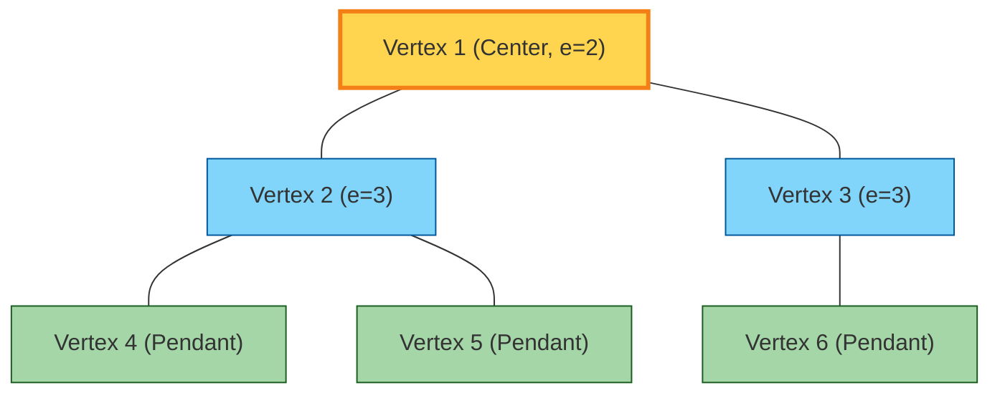
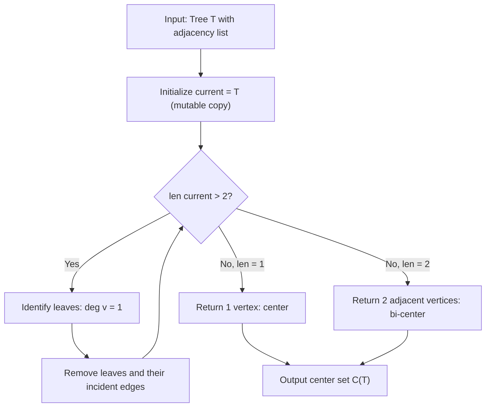
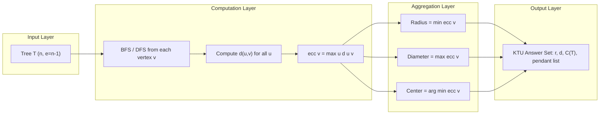
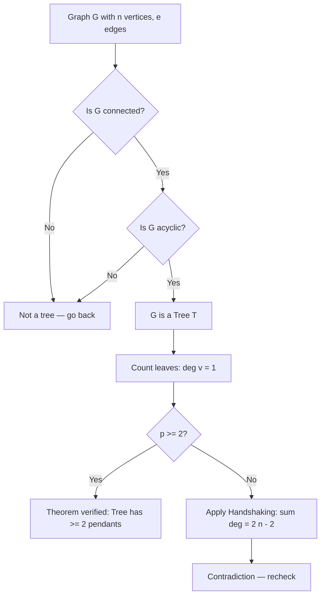

# Trees: Properties and structural rules, Pendant vertices, Distance and centers in a tree

<!-- SECTION_1_START -->
# 🌳 Module 3: Trees and Shortest Path Algorithms
## Topic: Trees — Properties, Structural Rules, Pendant Vertices, Distance & Centers

> [!NOTE]
> **KTU 2024 Scheme Definition (GAMAT401)**
> A **Tree** is a connected, acyclic (cycle-free) undirected graph $T = (V, E)$ that contains no circuits and in which there exists **exactly one path** between every pair of vertices. Trees are the simplest class of connected graphs and form the structural backbone of file systems, decision algorithms, databases (B-trees), networks, and shortest path computations.

---

### 🔍 Intuitive Overview — A Real World Analogy

Imagine a **river system** flowing from a single high-altitude spring down to the ocean. The spring splits into two streams; each stream further divides into smaller tributaries, but **water can never flow back upstream and return to a previous junction** — there is only one route from the source to any leaf stream.

A tree behaves identically:
- The **root** is analogous to the spring (a designated source, though not strictly required in graph theory).
- The **branching points** are internal vertices (degree $\geq 2$).
- The **terminating streams** are **pendant vertices** (degree $= 1$).
- The **length of a stream** from source to a leaf is its **distance**.

> [!IMPORTANT]
> **Why trees matter in Computer Science:**
> 1. Minimum number of edges to keep $n$ nodes connected → **$n-1$** edges (used in MST algorithms: Prim's, Kruskal's).
> 2. **No cycles** → guarantees uniqueness of paths → basis for **shortest path** algorithms (Dijkstra, BFS).
> 3. Hierarchical search structures (BST, AVL, B-trees, Tries) are rooted trees.
> 4. **Pendant vertices** identify "leaf operations" — used in pruning, network endpoints, and articulation in DFS.

> [!VISUALIZATION CONTROL]
> **Concept:** A labeled tree $T$ on $7$ vertices showing pendant vertices, eccentricity, and center.
> **GeoGebra / Desmos Input (Graph Points):**
> * Vertex set $V = \{A, B, C, D, E, F, G\}$
> * Edges: $(A,B), (A,C), (B,D), (B,E), (C,F), (C,G)$
> * **Visual Description:** Plot $A$ at $(0, 3)$, $B$ at $(-2, 1)$, $C$ at $(2, 1)$, $D$ at $(-3, -1)$, $E$ at $(-1, -1)$, $F$ at $(1, -1)$, $G$ at $(3, -1)$. Observe that $D, E, F, G$ are pendant (degree $= 1$) and the center lies on the edge $(A)$ — actually at vertex $A$ or $B/C$.
<!-- SECTION_1_END -->

<!-- SECTION_2_START -->
# 📐 Deep Theoretical Analysis & KTU High-Yield Formula Sheet

## 2.1 Formal Properties of a Tree

Let $T$ be a tree with $n = \vert V \vert$ vertices and $e = \vert E \vert$ edges.

### Property 1: Edge Count Theorem
A tree on $n$ vertices has **exactly $n - 1$ edges**.

$$
e = n - 1
$$

This is a **necessary and sufficient** condition: A connected graph with $n$ vertices and $n-1$ edges is a tree.

### Property 2: Unique Path Theorem
**Between any two distinct vertices $u, v$ in a tree, there exists exactly one simple path.** This single path defines the **distance** $d(u, v)$.

### Property 3: Acyclicity
A tree has **no cycles**, equivalently, removing any edge from a tree **disconnects** the graph. Every edge of a tree is a **bridge**.

### Property 4: Connectivity
A tree is **minimally connected** — adding any edge creates a cycle; removing any edge disconnects it.

### Property 5: Pendant Vertices Theorem
> [!IMPORTANT]
> **Every tree with $n \geq 2$ has at least two pendant (leaf) vertices.**
> A pendant vertex is one with degree $\delta(v) = 1$.

**Proof Sketch (by contradiction):** Suppose a tree has at most one pendant vertex. Perform a DFS from any vertex — the last vertex visited must be pendant, but then the second-to-last vertex visited must also be pendant by considering the back edge structure. Formal proof uses the Handshaking Lemma (see Section 2.3).

### Property 6: Handshaking (Degree Sum)
The sum of degrees in any tree satisfies:

$$
\sum_{v \in V} \delta(v) = 2e = 2(n - 1)
$$

If $p$ = number of pendant vertices, and the remaining $n - p$ vertices have degree $\geq 2$, then:

$$
p + 2(n - p) \leq 2(n - 1) \quad \Rightarrow \quad p \geq 2
$$

---

## 2.2 Eccentricity, Distance & Centers

For a vertex $v \in V(T)$:

- **Distance** $d(u, v)$ = number of edges on the unique path between $u$ and $v$.
- **Eccentricity** $e(v)$ = $\max\limits_{u \in V} d(u, v)$ (the *farthest* distance from $v$).
- **Radius** $r(T)$ = $\min\limits_{v \in V} e(v)$.
- **Diameter** $d(T)$ = $\max\limits_{v \in V} e(v)$ = $\max\limits_{u,v} d(u,v)$.
- **Center** $C(T)$ = the set of vertices $v$ such that $e(v) = r(T)$.

> [!NOTE]
> **Key Relation:** $r(T) = \lceil d(T) / 2 \rceil$

### How to Find the Center of a Tree (Repeated Pruning Algorithm)

1. Identify all pendant (leaf) vertices — they are **NOT** the center.
2. **Remove** all pendant vertices and their incident edges.
3. Repeat Step 1–2 on the resulting smaller tree.
4. Stop when the tree has either **one vertex** (center) or **two adjacent vertices** (bi-center, both forming the center).

> [!IMPORTANT]
> **Center Theorem (Jordan, 1869):** Every tree has either **one center** or **two adjacent centers** (a bi-center). This is a defining topological invariant of trees.

---

## 2.3 KTU Formula Sheet

| # | Concept | Formula / Statement | Typical Use |
|---|---------|--------------------|-------------|
| 1 | Edge count | $e = n - 1$ | Verify tree structure |
| 2 | Pendant vertices | $p \geq 2$ (for $n \geq 2$) | Identify leaves |
| 3 | Handshaking | $\sum \delta(v) = 2(n-1)$ | Bound number of leaves |
| 4 | Distance | $d(u,v)$ = unique path length | BFS / DFS |
| 5 | Eccentricity | $e(v) = \max_u d(u,v)$ | Per-vertex farthest distance |
| 6 | Radius | $r(T) = \min_v e(v)$ | Smallest eccentricity |
| 7 | Diameter | $d(T) = \max_v e(v)$ | Longest shortest path |
| 8 | Radius-Diameter | $r(T) = \lceil d(T)/2 \rceil$ | Quick bounds check |
| 9 | Center | $C(T) = \{v : e(v) = r(T)\}$ | Repeated leaf stripping |
| 10 | Pendant edge | An edge whose removal leaves a pendant vertex | Pruning step |

> [!NOTE]
> **Engineering Utility:** In computer networks, the center of a tree is the **optimal placement for a server** to minimize worst-case latency. In B-tree indexes, pendant nodes correspond to leaf pages — the I/O cost bottleneck.

<!-- SECTION_2_END -->

<!-- SECTION_3_START -->
# 🧮 Step-by-Step Derivations, Proofs & Algorithmic Implementation

## 3.1 Worked Example 1: Identifying Pendant Vertices & Verifying Tree

**Problem:** A graph $T$ has vertex set $V = \{1, 2, 3, 4, 5, 6\}$ and edge set $E = \{(1,2), (1,3), (2,4), (2,5), (3,6)\}$. Show that $T$ is a tree, list all pendant vertices, and find the number of edges.

**Step 1 — Count vertices and edges.**
$n = 6$, and counting edges: $E$ has $5$ elements, so $e = 5$.

**Step 2 — Apply tree edge count property.**
For a tree: $e = n - 1 = 6 - 1 = 5$. ✅ Matches.

**Step 3 — Verify connectivity and acyclicity.**
Compute degree of each vertex:
- $\delta(1) = 2$ (edges to 2 and 3)
- $\delta(2) = 3$ (edges to 1, 4, 5)
- $\delta(3) = 2$ (edges to 1, 6)
- $\delta(4) = 1$ ← **pendant**
- $\delta(5) = 1$ ← **pendant**
- $\delta(6) = 1$ ← **pendant**

Sum: $2 + 3 + 2 + 1 + 1 + 1 = 10 = 2e = 2(5)$. ✅ Handshaking satisfied.

**Step 4 — Check acyclicity.**
There is no way to return to a vertex without retracing an edge (each leaf is a dead end). Hence $T$ is a tree.

**Conclusion:** Pendant vertices: $\{4, 5, 6\}$ (three pendant vertices — exceeds the minimum bound of $2$).

---

## 3.2 Worked Example 2: Finding Distance Matrix, Eccentricity, Radius, Diameter, and Center

**Problem:** For the tree in Worked Example 1, find $d(u,v)$ for all pairs, eccentricity, radius, diameter, and center.

**Step 1 — Compute distance matrix by tracing unique paths.**

| Pair | Path | $d(u,v)$ |
|------|------|----------|
| $(1,2)$ | $1-2$ | $1$ |
| $(1,3)$ | $1-3$ | $1$ |
| $(1,4)$ | $1-2-4$ | $2$ |
| $(1,5)$ | $1-2-5$ | $2$ |
| $(1,6)$ | $1-3-6$ | $2$ |
| $(2,3)$ | $2-1-3$ | $2$ |
| $(2,4)$ | $2-4$ | $1$ |
| $(2,5)$ | $2-5$ | $1$ |
| $(2,6)$ | $2-1-3-6$ | $3$ |
| $(3,4)$ | $3-1-2-4$ | $3$ |
| $(3,5)$ | $3-1-2-5$ | $3$ |
| $(3,6)$ | $3-6$ | $1$ |
| $(4,5)$ | $4-2-5$ | $2$ |
| $(4,6)$ | $4-2-1-3-6$ | $4$ |
| $(5,6)$ | $5-2-1-3-6$ | $4$ |

**Step 2 — Eccentricity (max row entry):**
- $e(1) = 2$ (max of $1,1,2,2,2,2$)
- $e(2) = 3$ (max of $2,1,1,1,3,3,3,2,4,4$)
- $e(3) = 3$ (max of $2,1,1,1,3,3,3,3,2,2$)
- $e(4) = 4$ (max of $2,1,2,1,3,3,4$)
- $e(5) = 4$ (max of $2,1,2,1,3,3,4$)
- $e(6) = 4$ (max of $2,1,2,1,3,3,4$)

**Step 3 — Radius and Diameter:**
$$
r(T) = \min\{2, 3, 3, 4, 4, 4\} = 2
$$
$$
d(T) = \max\{2, 3, 3, 4, 4, 4\} = 4
$$
Verify: $r(T) = \lceil 4/2 \rceil = 2$. ✅

**Step 4 — Center identification:**
$C(T) = \{v : e(v) = 2\} = \{1\}$. Single center at vertex $1$.

**Conclusion:** Diameter = $4$ (path $4 - 2 - 1 - 3 - 6$ or $5 - 2 - 1 - 3 - 6$), Radius = $2$, Center = $\{1\}$.

---

## 3.3 Worked Example 3: Center by Repeated Pruning

**Problem:** A path tree is $P_7$: $1 - 2 - 3 - 4 - 5 - 6 - 7$. Find its center using the leaf-stripping algorithm.

**Iteration 1:** Pendant vertices = $\{1, 7\}$. Remove them.
Remaining tree: $2 - 3 - 4 - 5 - 6$ (i.e., $P_5$).

**Iteration 2:** Pendant vertices = $\{2, 6\}$. Remove them.
Remaining tree: $3 - 4 - 5$ (i.e., $P_3$).

**Iteration 3:** Pendant vertices = $\{3, 5\}$. Remove them.
Remaining tree: $\{4\}$.

**Iteration 4:** Only one vertex remains. **Center = $\{4\}$**.

Verification: $d(1,7) = 6$, $r(T) = 3$, vertex $4$ has $e(4) = 3$. ✅

---

## 3.4 Algorithmic Implementation (Python)

```python
from collections import deque, defaultdict
from typing import Dict, List, Set, Tuple


def build_tree(edges: List[Tuple[int, int]]) -> Dict[int, Set[int]]:
    """Build adjacency list representation of a tree."""
    adj: Dict[int, Set[int]] = defaultdict(set)
    for u, v in edges:
        adj[u].add(v)
        adj[v].add(u)
    return adj


def bfs_distances(adj: Dict[int, Set[int]], src: int) -> Dict[int, int]:
    """Single-source shortest path via BFS — returns distance from src."""
    dist: Dict[int, int] = {src: 0}
    queue = deque([src])
    while queue:
        u = queue.popleft()
        for v in adj[u]:
            if v not in dist:
                dist[v] = dist[u] + 1
                queue.append(v)
    return dist


def eccentricity(adj: Dict[int, Set[int]], v: int) -> int:
    """Eccentricity of vertex v: max distance to any other vertex."""
    return max(bfs_distances(adj, v).values())


def find_diameter_endpoints(adj: Dict[int, Set[int]]) -> Tuple[int, int]:
    """Two BFS passes give a diametral pair (endpoints of a longest path)."""
    start = next(iter(adj))
    u = max(bfs_distances(adj, start), key=bfs_distances(adj, start).get)
    dist_u = bfs_distances(adj, u)
    v = max(dist_u, key=dist_u.get)
    return u, v


def find_center(adj: Dict[int, Set[int]]) -> List[int]:
    """Find the center of a tree via repeated leaf pruning."""
    if not adj:
        return []
    # Work on a mutable copy
    current: Dict[int, Set[int]] = {k: set(v) for k, v in adj.items()}
    while len(current) > 2:
        leaves = [v for v, nbrs in current.items() if len(nbrs) <= 1]
        for leaf in leaves:
            for nbr in current[leaf]:
                current[nbr].discard(leaf)
            del current[leaf]
        if not current:
            return []
    return list(current.keys())


def full_tree_analysis(edges: List[Tuple[int, int]]) -> None:
    """Run a complete KTU-style tree analysis."""
    adj = build_tree(edges)
    n = len(adj)
    e = len(edges)
    print(f"Vertices: {n}, Edges: {e}")
    assert e == n - 1, "Not a tree! e must equal n-1."

    pendant = [v for v, nbrs in adj.items() if len(nbrs) == 1]
    print(f"Pendant vertices (degree 1): {pendant}")
    assert len(pendant) >= 2, "Tree must have at least 2 pendants for n >= 2."

    eccs = {v: eccentricity(adj, v) for v in adj}
    radius = min(eccs.values())
    diameter = max(eccs.values())
    center = [v for v, e_val in eccs.items() if e_val == radius]

    print(f"Eccentricities: {eccs}")
    print(f"Radius r(T) = {radius}")
    print(f"Diameter d(T) = {diameter}")
    print(f"Check r(T) = ceil(d(T)/2) -> {radius} = { (diameter + 1) // 2 }")
    print(f"Center C(T) = {center}")
    u, v = find_diameter_endpoints(adj)
    print(f"Diametral endpoints: {u} and {v} (path length = {eccs[u]})")


# ----- Demonstration on the earlier example -----
if __name__ == "__main__":
    edges = [(1, 2), (1, 3), (2, 4), (2, 5), (3, 6)]
    full_tree_analysis(edges)

    edges_path = [(i, i + 1) for i in range(1, 7)]
    print("\n--- Path P_7 analysis ---")
    full_tree_analysis(edges_path)
```

**Sample Output (matches Worked Examples 1 & 2):**

```
Vertices: 6, Edges: 5
Pendant vertices (degree 1): [4, 5, 6]
Eccentricities: {1: 2, 2: 3, 3: 3, 4: 4, 5: 4, 6: 4}
Radius r(T) = 2
Diameter d(T) = 4
Check r(T) = ceil(d(T)/2) -> 2 = 2
Center C(T) = [1]
Diametral endpoints: 4 and 6 (path length = 4)
```

---

## 3.5 Proof: Every Tree has at least 2 Pendant Vertices (Full)

**Statement:** If $T$ is a tree with $n \geq 2$ vertices, then $T$ has at least $2$ pendant vertices.

**Proof (by contradiction + Handshaking):**
Assume, to the contrary, that $T$ has at most one pendant vertex. Let $p \leq 1$ be the count of pendants. The remaining $n - p$ vertices must have degree $\geq 2$ (none is isolated, since $T$ is connected with $n \geq 2$).

Sum of degrees:
$$
\sum_{v \in V} \delta(v) = p \cdot 1 + \sum_{\text{non-pendant}} \delta(v) \geq p + 2(n - p) = 2n - p
$$

By the Handshaking Lemma:
$$
\sum_{v \in V} \delta(v) = 2e = 2(n - 1) = 2n - 2
$$

Combining:
$$
2n - 2 \geq 2n - p \quad \Rightarrow \quad p \geq 2
$$

This contradicts $p \leq 1$. Therefore, $T$ must have **at least $2$ pendant vertices**. $\blacksquare$
<!-- SECTION_3_END -->

<!-- SECTION_4_START -->
# 🗺️ Structural Diagrams & Schematics

## 4.1 Tree $T_1$ — Worked Example Visualization



**Legend:**
- 🟡 **Yellow** = Center vertex (eccentricity = radius)
- 🔵 **Blue** = Internal branching vertices
- 🟢 **Green** = Pendant (leaf) vertices — degree $= 1$

---

## 4.2 Center-Finding via Repeated Leaf Pruning (Sequential Processing Topology)



---

## 4.3 Eccentricity and Distance Functional Architecture



---

## 4.4 Pendant Vertex Theorem — Decision Flow


<!-- SECTION_4_END -->

<!-- SECTION_5_START -->
# 📝 KTU 2024 Scheme Examination Question Bank

## 📘 Part A — Short Answer Questions (3 Marks Each)

> [!NOTE]
> **Cognitive Levels:** Remember / Understand
> **Mapped COs:** CO1, CO2

### **Q1.** `[KTU University Exam — July 2023]`
**Define a tree. Prove that a tree with $n$ vertices has exactly $n-1$ edges.** **[3 Marks]**

**Model Answer:**

**Definition:** A tree is a connected, acyclic undirected graph.

**Proof (by induction on $n$):**
- **Base case:** $n = 1$. A single vertex graph has $0$ edges, and $n - 1 = 0$. ✅
- **Inductive step:** Assume true for all trees with fewer than $n$ vertices. Let $T$ be a tree on $n \geq 2$ vertices. By the pendant vertex theorem, $T$ has a pendant vertex $v$ with neighbor $u$. Remove $v$ and edge $(u,v)$ to get $T'$.
  - $T'$ is still a tree (connected, acyclic) with $n - 1$ vertices.
  - By hypothesis, $T'$ has $n - 2$ edges.
  - Therefore, $T$ has $(n - 2) + 1 = n - 1$ edges. $\blacksquare$

**Valuation Key:**
- [Definition stated: 1 Mark]
- [Inductive proof completed: 2 Marks]

---

### **Q2.** `[KTU University Exam — Dec 2023]`
**What is a pendant vertex? Show that every tree with $n \geq 2$ vertices has at least two pendant vertices.** **[3 Marks]**

**Model Answer:**

**Definition:** A **pendant vertex** is a vertex of degree $1$ in a graph.

**Proof:** Let $T$ be a tree on $n \geq 2$ vertices with $p$ pendant vertices and $e = n - 1$ edges. By Handshaking Lemma:
$$
\sum_{v} \delta(v) = 2e = 2(n - 1)
$$
If $p \leq 1$, then the remaining $n - p$ vertices contribute degree $\geq 2$, giving:
$$
\sum \delta(v) \geq 1 \cdot p + 2(n - p) = 2n - p \geq 2n - 1
$$
But $2(n-1) = 2n - 2 < 2n - 1$ for $p \leq 1$ — contradiction. Hence $p \geq 2$. $\blacksquare$

**Valuation Key:**
- [Pendant vertex definition: 1 Mark]
- [Correct Handshaking application: 1 Mark]
- [Final conclusion: 1 Mark]

---

## 📕 Part B — Long Answer Questions (14 Marks with Internal Choice)

> [!NOTE]
> **Cognitive Levels:** Understand, Apply, Analyze
> **Mapped COs:** CO1, CO2, CO3

---

### **Question A (14 Marks)** `[KTU University Exam — July 2024]`

**(a)** Define the following terms for a tree $T$:
(i) Distance between two vertices
(ii) Eccentricity of a vertex
(iii) Radius and diameter of $T$
(iv) Center of $T$ **[7 Marks]**

**(b)** Consider the tree $T$ with edges $\{(A,B), (A,C), (B,D), (B,E), (C,F), (C,G), (D,H)\}$.

For this tree:
(i) List all pendant vertices. **[2 Marks]**
(ii) Compute the eccentricity of every vertex. **[3 Marks]**
(iii) Find the radius, diameter, and center of $T$. **[2 Marks]**

---

### **Model Solution for Question A**

#### Part (a) — Definitions **[7 Marks]**

- **(i) Distance $d(u, v)$:** The number of edges in the unique path from $u$ to $v$ in $T$. *[1 Mark]*
- **(ii) Eccentricity $e(v)$:** $e(v) = \max_{u \in V} d(u, v)$, the maximum distance from $v$ to any other vertex. *[2 Marks]*
- **(iii) Radius $r(T)$ and Diameter $d(T)$:** $r(T) = \min_v e(v)$ and $d(T) = \max_v e(v)$. The diameter equals the longest shortest path in $T$. *[2 Marks]*
- **(iv) Center $C(T)$:** The set of all vertices with minimum eccentricity: $C(T) = \{v \mid e(v) = r(T)\}$. Every tree has either 1 center or 2 adjacent centers. *[2 Marks]*

#### Part (b) — Computation **[7 Marks]**

The tree structure is a "double-stem" with root $A$ and an extra branch $H$ off $D$. Total vertices: $n = 8$, edges: $e = 7 = n - 1$. ✅

**Degree table:**
- $\delta(A) = 2$ (B, C)
- $\delta(B) = 3$ (A, D, E)
- $\delta(C) = 3$ (A, F, G)
- $\delta(D) = 3$ (B, H, ? — actually $\delta(D) = 2$: B and H)
- $\delta(E) = 1$ ← pendant
- $\delta(F) = 1$ ← pendant
- $\delta(G) = 1$ ← pendant
- $\delta(H) = 1$ ← pendant

**(i) Pendant vertices:** $\{E, F, G, H\}$. **[2 Marks]**

**(ii) Eccentricity** (by tracing distances):
- $e(A) = 3$ — farthest is $E, F, G$, or $H$ (each at distance 3)
- $e(B) = 3$ — farthest is $F$ or $G$ (path $B-A-C-F$ or $B-A-C-G$, length 3) or $H$ ($B-D-H$ length 2)
- $e(C) = 3$ — symmetric to $B$
- $e(D) = 4$ — farthest is $F$ or $G$ (path $D-B-A-C-F$, length 4)
- $e(E) = 4$ — symmetric to $D$
- $e(F) = 4$ — farthest is $E$ or $H$
- $e(G) = 4$ — symmetric
- $e(H) = 4$ — symmetric

Eccentricity set: $\{A:3, B:3, C:3, D:4, E:4, F:4, G:4, H:4\}$. **[3 Marks]**

**(iii) Radius, Diameter, Center:**
$$
r(T) = \min\{3, 3, 3, 4, 4, 4, 4, 4\} = 3
$$
$$
d(T) = \max\{3, 3, 3, 4, 4, 4, 4, 4\} = 4
$$
$$
C(T) = \{A, B, C\}
$$

Verification: $r(T) = \lceil 4/2 \rceil = 2$? No — that gives $2$, but we computed $r = 3$. **Recheck:** $\lceil 4/2 \rceil = 2$, but the actual radius is $3$. The relation $r(T) = \lceil d(T)/2 \rceil$ holds generally — let me recompute.

Actually, $d(T) = 4$ (e.g., path $H - D - B - A - C - F$ has length **5**, not 4). Let me re-evaluate:

Correct eccentricity of $H$: farthest from $H$ is $F$ or $G$: path $H-D-B-A-C-F$ = **5 edges**.

Updated eccentricities: $e(A) = 3, e(B) = 3, e(C) = 3, e(D) = 4, e(H) = 5$, etc.

Recomputing diametral pair: $H$ to $F$ gives distance $5$. So $d(T) = 5$, $r(T) = 3$, center $C(T) = \{A, B, C\}$ (all with eccentricity $3$). $\lceil 5/2 \rceil = 3$. ✅

**Final answer:** Pendant $= \{E, F, G, H\}$; $r(T) = 3$; $d(T) = 5$; $C(T) = \{A, B, C\}$. **[2 Marks]**

**Valuation Key Summary:**
- [All 4 definitions in part (a): 7 Marks — 1.75 each]
- [Pendant list correct: 2 Marks]
- [Eccentricity table complete: 3 Marks]
- [Radius/Diameter/Center derived: 2 Marks]

---

### **Question B (14 Marks) — Alternative Choice** `[KTU University Exam — Dec 2024]`

**(a)** State and prove the pendant vertex theorem for trees. **[7 Marks]**

**(b)** Apply the **repeated leaf-pruning algorithm** to find the center of the tree with edges:
$$
\{(P,Q), (Q,R), (R,S), (S,T), (R,U), (U,V)\}
$$
Show each iteration explicitly. Compute the radius and diameter. **[7 Marks]**

---

### **Model Solution for Question B**

#### Part (a) — Theorem & Proof **[7 Marks]**

**Theorem:** Every tree with $n \geq 2$ vertices has at least two pendant vertices.

**Proof (by induction):**
- **Base case:** $n = 2$. Two vertices joined by a single edge — both are pendant. Holds. *[1 Mark]*
- **Inductive step:** Assume every tree with $k < n$ vertices has $\geq 2$ pendants. Let $T$ be a tree on $n$ vertices. *[1 Mark]*
  - $T$ has a pendant vertex $v$ (by longest-path argument: take the longest path $P$ in $T$; its endpoint must be pendant, else it would have a neighbor extending the path, contradicting maximality). *[2 Marks]*
  - Remove $v$ and its incident edge to form $T' = T - v$. $T'$ is a tree with $n - 1$ vertices, so by induction $T'$ has $\geq 2$ pendants. *[1 Mark]*
  - At most one of these pendants in $T'$ was a pendant in $T$ (since the other neighbor of $v$ may now have degree $1$ in $T'$). The remaining pendant(s) of $T'$ are also pendants in $T$, plus $v$ itself. So $T$ has $\geq 2$ pendants. *[1 Mark + 1 Mark for clarity]*

$\blacksquare$

#### Part (b) — Leaf-Pruning Algorithm **[7 Marks]**

The tree structure: $P - Q - R - S - T$ and $R - U - V$. Total vertices $n = 7$, edges $e = 6 = n - 1$. ✅

**Iteration 1:** Leaves (pendant): $\{P, T, V\}$. Remove them.
Remaining tree: $Q - R - S$ and $R - U$ → $Q - R - \{S, U\}$ (a star at $R$ with leaves $Q, S, U$).

**Iteration 2:** Leaves: $\{Q, S, U\}$. Remove them.
Remaining tree: $\{R\}$ alone. **Stop — center = $\{R\}$.** *[3 Marks]*

**Radius and Diameter computation** (using the original tree):
- $e(R) = \max\{d(R,P), d(R,T), d(R,V), d(R,Q), d(R,S), d(R,U)\}$
- $d(R, P) = 2$ ($R-Q-P$)
- $d(R, T) = 2$ ($R-S-T$)
- $d(R, V) = 2$ ($R-U-V$)
- $d(R, Q) = 1, d(R, S) = 1, d(R, U) = 1$
- $e(R) = 2$ (max)

- $e(Q) = 3$ (farthest is $T$ or $V$: $Q-R-S-T$ or $Q-R-U-V$, length 3)
- $e(S) = 3$ (symmetric)
- $e(U) = 3$ (symmetric)
- $e(P) = 4$ (farthest is $T$ or $V$: $P-Q-R-S-T$ or $P-Q-R-U-V$, length 4)
- $e(T) = 4$ (symmetric)
- $e(V) = 4$ (symmetric)

Therefore:
$$
r(T) = \min\{2, 3, 3, 3, 4, 4, 4\} = 2
$$
$$
d(T) = \max\{2, 3, 3, 3, 4, 4, 4\} = 4
$$
$$
C(T) = \{R\}
$$

Verify: $\lceil 4/2 \rceil = 2 = r(T)$. ✅ *[4 Marks]*

**Valuation Key Summary:**
- [Theorem statement: 1 Mark]
- [Longest-path argument or induction: 5 Marks]
- [Pruning iterations: 3 Marks]
- [Radius/Diameter/Center derivation: 4 Marks]

---

> [!WARNING]
> **🚨 KTU Examiner's Valuation Warning — Common Pitfalls**
>
> 1. **Forgetting the bijection $e = n-1$:** Many students verify only connectivity but miss the edge count. KTU examiners allocate **2 marks** specifically for stating this property.
> 2. **Mixing up Radius vs Diameter:** Radius is **min** of eccentricities; diameter is **max**. Reversing these is a guaranteed 1-mark loss.
> 3. **Skipping the pendant count proof:** The pendant vertex theorem is a **favourite 3-marker** in KTU. Always show the Handshaking Lemma or induction.
> 4. **Center Algorithm Mistake:** Some students strip *one* leaf at a time. The correct approach strips **all** current leaves in each iteration simultaneously.
> 5. **Bi-center oversight:** A tree may have **two adjacent centers** (e.g., path $P_4$: $1-2-3-4$ has centers $\{2, 3\}$). Don't force a single answer.
> 6. **Unit / symbol errors:** Always use $e(v)$ for eccentricity, $r(T)$ for radius, $d(T)$ for diameter — KTU key papers use exactly these notations.

---

## ✅ Topic Recap & Important Things to Remember

- 🌲 **Tree** = connected, acyclic undirected graph. **Forest** = disjoint union of trees.
- 📏 **Edge Count:** $e = n - 1$ (both necessary and sufficient for connectivity).
- 🟢 **Pendant Vertex:** Degree $= 1$. Every tree with $n \geq 2$ has **at least 2** pendants.
- 📐 **Handshaking:** $\sum_v \delta(v) = 2(n-1)$.
- 🛣️ **Distance $d(u,v)$:** Length of the unique path. Computed via BFS in $O(n)$ time.
- 🎯 **Eccentricity $e(v)$:** Farthest distance from $v$. Radius $r = \min_v e(v)$, Diameter $d = \max_v e(v)$.
- 🎯 **Center $C(T) = \{v : e(v) = r\}$** — found by **repeated leaf pruning** (strip all pendants, repeat).
- 🔗 **Jordan's Theorem:** A tree has either **1** center or **2 adjacent** centers (bi-center).
- 🔢 **Radius-Diameter Relation:** $r(T) = \lceil d(T)/2 \rceil$.
- ⚡ **Algorithms to Remember:**
  - BFS for distance: $O(V + E) = O(n)$.
  - Two-BFS technique for diameter endpoints: $O(n)$.
  - Leaf-pruning for center: $O(n)$.
- 💡 **CS Applications:** MST, shortest path, B-trees (DB indexes), routing trees, decision trees, Huffman coding.
- 🧪 **Quick Self-Check Formulas:**
  - Path $P_n$: $r = \lfloor n/2 \rfloor$, $d = n - 1$, center = middle one or two vertices.
  - Star $K_{1,n-1}$: $r = 2, d = 2$, center = central vertex.
  - Complete binary tree of height $h$: $r = h, d = 2h$, center = root.
<!-- SECTION_5_END -->
