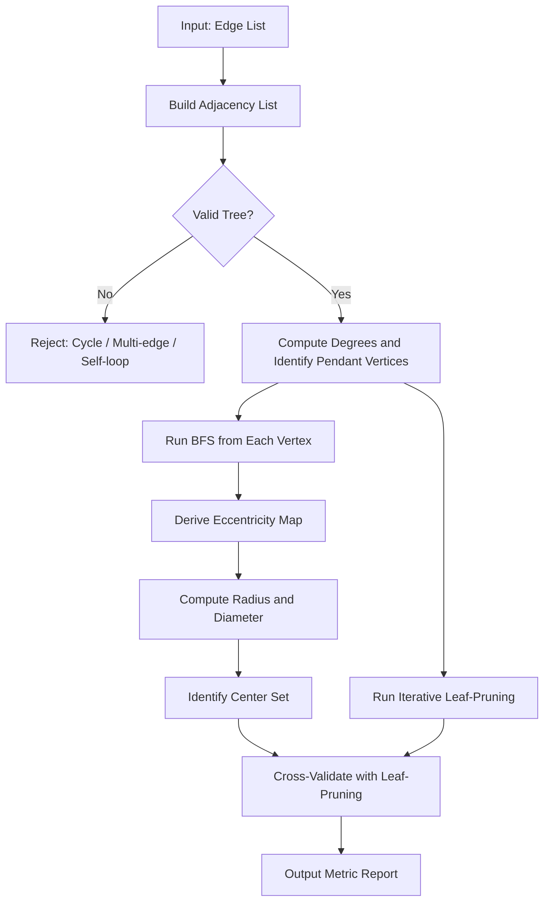
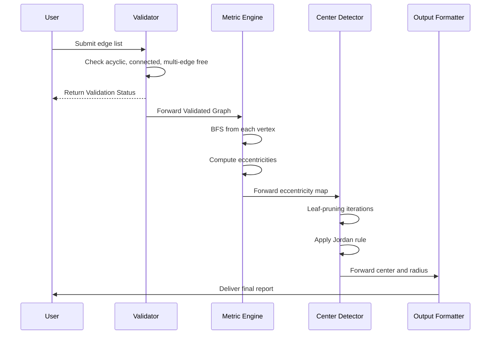
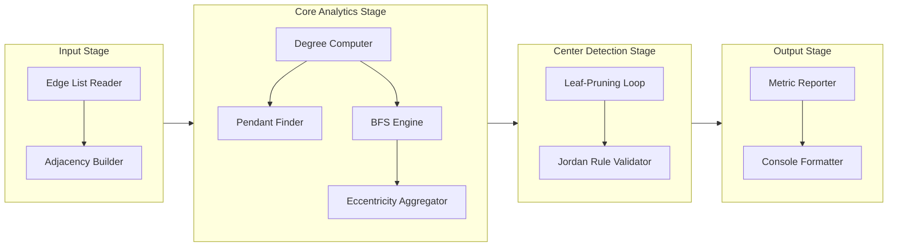

# Trees: Properties and structural rules, Pendant vertices, Distance and centers in a tree

<!-- SECTION_1_START -->

# Trees: Properties, Structural Rules, Pendant Vertices, Distance and Centers

## 1. Core Technical Definition & Intuitive Overview

### 1.1 Formal Definition of a Tree

> [!IMPORTANT]
> **KTU 2024 Syllabus Definition (Graph Theory - Discrete Mathematics)**
> A **tree** is a connected, acyclic (cycle-free) undirected graph. Equivalently, a graph $T = (V, E)$ is a tree if and only if it satisfies **any one** (and therefore all) of the following equivalent conditions:
> 1. $T$ is connected and contains no cycle.
> 2. $T$ has $|V| - 1$ edges and is connected.
> 3. $T$ has $|V| - 1$ edges and is acyclic.
> 4. There exists exactly **one** simple path between every pair of distinct vertices.
> 5. $T$ is connected but the removal of any single edge disconnects it.

A **forest** is a disjoint union of one or more trees. A tree with **only one vertex** is called the **trivial tree** or **degenerate tree**.

### 1.2 Conceptual Analogy / Intuition

> [!NOTE]
> **Intuitive Picture (Real-World Analogy)**
> Imagine a family **genealogy chart** drawn upside down: one ancestor at the top (the **root**), branching down to children, grandchildren, and so on. There is exactly **one** bloodline connecting any two family members—no loops, no "marriages of cousins" creating cycles. This is the structural essence of a tree.
>
> A second powerful analogy: think of an **airline route map** between a hub city and its spokes. Passengers must transfer at the hub because no direct city-to-city shortcuts exist. Just like an **organizational hierarchy**, data routing tables, or a file-system directory structure, the tree enforces a strict, unambiguous flow of information.

### 1.3 Pendant Vertices — Definition

> [!DEFINITION]
> A vertex $v$ in a tree $T$ is called a **pendant vertex** (also known as a **leaf** or **end vertex**) if and only if $\deg(v) = 1$. The unique edge incident to a pendant vertex is called a **pendant edge**.

Pendant vertices represent the **boundary terminals** of a tree—nodes where any further branching ceases. In a binary search tree (BST), for instance, all external NULL pointers terminate at pendant vertices.

### 1.4 Distance, Eccentricity, Radius, Diameter, and Centers

Let $T = (V, E)$ be a tree, and let $u, v \in V$.

> [!IMPORTANT]
> **Core Metric Definitions (with standard symbols in bold)**
> - **Distance $d(u, v)$**: The length (number of edges) of the unique simple path from $u$ to $v$. The metric is always a **non-negative integer**.
> - **Eccentricity $e(v)$**: The maximum distance from $v$ to any other vertex in the tree, i.e., $e(v) = \max_{u \in V} d(v, u)$.
> - **Radius $r(T)$**: The minimum eccentricity among all vertices, i.e., $r(T) = \min_{v \in V} e(v)$.
> - **Diameter $d(T)$** (or $\text{diam}(T)$): The maximum eccentricity, i.e., $d(T) = \max_{v \in V} e(v)$.
> - **Center $C(T)$**: The set of all vertices whose eccentricity equals the radius, i.e., $C(T) = \{ v \in V \mid e(v) = r(T) \}$.

A classical theorem by **Jordan (1869)** states that every tree has either **one center** or **two centers** (called a *bicenter*). No tree can have three or more centers.

### 1.5 Visualization Setup

> [!VISUALIZATION CONTROL]
> **Concept:** Tree structure with pendant vertices, distance labelling, and the center highlighted.
> **GeoGebra / Desmos Input Points and Lines:**
> * Vertices: $A(0,3), B(-2,1), C(2,1), D(-3,-1), E(-1,-1), F(1,-1), G(3,-1)$
> * Edges (line segments): $AB, AC, BD, BE, CF, CG$
> * Highlight the **pendant vertices** $\{D, E, F, G\}$ in a different color.
> * Mark the **center** vertex $A$ and label $e(A) = 2$ (longest path from $A$ to $D, E, F, G$).
> **Visual Description:** The student should observe that the apex $A$ has eccentricity $2$, while leaves have eccentricity $3$. The radius is $2$ and the diameter is $4$ (path $D-B-A-C-G$ or $D-B-A-C-F$). The center is the single vertex $A$.

---

<!-- SECTION_1_END -->

<!-- SECTION_2_START -->

# 2. Deep Theoretical Analysis & KTU High-Yield Formula Sheet

## 2.1 Structural Properties and Rules of a Tree

A tree $T$ with $n$ vertices (where $n \geq 1$) and $e$ edges satisfies a remarkable collection of structural identities. The following list captures every property the KTU board expects a student to reproduce.

### 2.1.1 Fundamental Properties

1. **Acyclic + Connected** ⟺ Tree.
2. A tree with $n$ vertices has **exactly $n - 1$ edges**.
3. Between any two distinct vertices, there exists **exactly one** simple path.
4. Adding any new edge between two existing vertices creates **exactly one cycle**.
5. Removing any edge from a tree **disconnects** it into exactly two components, each of which is itself a tree.
6. A tree with $n \geq 2$ has **at least two pendant vertices**.
7. The Handshake Lemma applied to a tree gives:
$$\sum_{v \in V} \deg(v) = 2(n-1) = 2n - 2$$

### 2.1.2 Pendant Vertex Theorems

> [!NOTE]
> **Theorem (Lower Bound on Pendant Vertices)**
> Every tree with at least two vertices has **at least two pendant vertices**.
>
> **Proof Outline:** From the handshake lemma, $\sum \deg(v) = 2n-2$. The minimum contribution per non-pendant vertex is $2$, so if there are $p$ pendant vertices, the remaining $n - p$ vertices contribute at least $2(n-p)$. Therefore:
> $$p + 2(n-p) \leq 2n - 2 \implies p \geq 2.$$

### 2.1.3 Number of Pendant Vertices — Parity Constraint

> [!IMPORTANT]
> **Parity Theorem for Pendant Vertices**
> In any non-trivial tree, the number of pendant vertices is **at least $2$**. More strongly, if every vertex of degree $\geq 2$ has bounded degree, the lower bound can be sharpened. In a tree with $n$ vertices where the maximum degree is $\Delta$, the minimum number of pendant vertices is at least:
> $$p \geq 2 + \sum_{v : \deg(v) \geq 3} (\deg(v) - 2)$$

### 2.2 Distance Properties in a Tree

The distance function $d : V \times V \to \mathbb{Z}_{\geq 0}$ on a tree is a **graph metric**, meaning it satisfies:

- **Non-negativity:** $d(u, v) \geq 0$ with equality iff $u = v$.
- **Symmetry:** $d(u, v) = d(v, u)$.
- **Triangle Inequality:** $d(u, w) \leq d(u, v) + d(v, w)$.
- **Integrality:** $d(u, v)$ is a non-negative integer.

### 2.3 Centers of a Tree — Jordan's Theorem

> [!THEOREM]
> **Jordan's Center Theorem (1869)**
> The center of any tree consists of either:
> - A **single vertex** (a *monocenter*), or
> - **Two adjacent vertices** (a *bicenter*).
>
> In particular, $|C(T)| \in \{1, 2\}$.

**Algorithmic Insight:** The center can be found by an elegant *leaf-pruning* (or *barycentric*) method:

1. Identify all pendant vertices (leaves) and place them in a queue.
2. Repeatedly remove all current leaves in parallel. After removal, expose new leaves.
3. The last vertex (or last two vertices) remaining unremoved form the center.

Each round of removal corresponds to **shaving one layer** off every path in the tree, which decreases the eccentricity of every surviving vertex by exactly $1$. The process terminates after $\lceil r(T) \rceil$ rounds.

### 2.4 Relationship between Radius and Diameter

For **any** tree:
$$r(T) = \lceil d(T) / 2 \rceil$$

Equivalently:
- If $d(T)$ is **even**, $r(T) = d(T)/2$ and the center is a single vertex.
- If $d(T)$ is **odd**, $r(T) = (d(T)+1)/2$ and the center consists of two adjacent vertices.

### 2.5 KTU High-Yield Formula Sheet

> [!TIP]
> **Master Cheat Sheet — Memorize for the KTU Board Exam**

| # | Concept | Formula / Property | Units / Domain |
|---|---------|--------------------|----------------|
| 1 | Edges in a tree | $\vert E \vert = n - 1$ where $n = \vert V \vert$ | edges |
| 2 | Sum of degrees | $\sum_{v \in V} \deg(v) = 2n - 2$ | dimensionless |
| 3 | Number of pendant vertices | $p \geq 2$ for $n \geq 2$ | vertices |
| 4 | Distance metric | $d(u, v) = $ number of edges on unique path $u \to v$ | non-negative integer |
| 5 | Eccentricity | $e(v) = \max_{u \in V} d(v, u)$ | non-negative integer |
| 6 | Radius | $r(T) = \min_{v \in V} e(v)$ | non-negative integer |
| 7 | Diameter | $d(T) = \max_{v \in V} e(v)$ | non-negative integer |
| 8 | Radius–Diameter link | $r(T) = \lceil d(T) / 2 \rceil$ | non-negative integer |
| 9 | Center cardinality | $\vert C(T) \vert \in \{1, 2\}$ | dimensionless |
| 10 | Pendant-vertex lower bound | $p \geq 2 + \sum_{\deg(v) \geq 3} (\deg(v) - 2)$ | vertices |

### 2.6 Real-World Engineering Utility

- **Routing in Computer Networks:** The Minimum Spanning Tree (MST) and Steiner Tree problems reduce cable-laying cost in LAN/WAN design—directly using tree properties.
- **File Systems & Databases:** The B-Tree, B+ Tree, and Red-Black Tree are foundational data structures whose balancing relies on pendant-vertex and depth invariants.
- **Compiler Design:** The **Abstract Syntax Tree (AST)** represents the syntactic structure of source code; pendant vertices correspond to terminal tokens.
- **Social Networks & Hierarchies:** Organizational trees, XML/HTML DOM trees, and phylogenetic trees all use pendant-vertex counts to detect anomalies.
- **Game Theory & AI:** The **minimax algorithm** in two-player games uses game trees whose centers correspond to optimal decision points.

---

<!-- SECTION_2_END -->

<!-- SECTION_3_START -->

# 3. Step-by-Step Derivations & Code/Symbolic Implementation

## 3.1 Derivation 1 — Every Tree with $n \geq 2$ has at Least Two Pendant Vertices

**Given:** A tree $T$ with $n \geq 2$ vertices and $n - 1$ edges.

**Step 1.** Apply the Handshake Lemma:
$$\sum_{v \in V} \deg(v) = 2 \vert E \vert = 2(n - 1) = 2n - 2$$

**Step 2.** Split the sum into pendant and non-pendant parts. Let $P$ be the set of pendant vertices ($\deg(v) = 1$) and $Q$ the set of non-pendant vertices ($\deg(v) \geq 2$):
$$\sum_{v \in P} \deg(v) + \sum_{v \in Q} \deg(v) = 2n - 2$$

**Step 3.** Substitute the minimum values: $\sum_{v \in P} \deg(v) = \vert P \vert \cdot 1 = p$, and $\sum_{v \in Q} \deg(v) \geq 2 \vert Q \vert = 2(n - p)$.

**Step 4.** Combine:
$$p + 2(n - p) \leq 2n - 2$$
$$p + 2n - 2p \leq 2n - 2$$
$$-p \leq -2$$
$$p \geq 2$$

**Conclusion:** A tree with $n \geq 2$ vertices has at least **two** pendant vertices. $\blacksquare$

---

## 3.2 Derivation 2 — Computing Eccentricity, Radius, Diameter, and Center

Consider a sample tree $T$ with the following structure (a "double Y"):

$$
V = \{1, 2, 3, 4, 5, 6, 7\}, \quad E = \{\{1,2\}, \{2,3\}, \{3,4\}, \{3,5\}, \{1,6\}, \{6,7\}\}
$$

**Step 1 — Compute all pairwise distances $d(u, v)$.** Because the graph is a tree, the unique path gives the distance.

| | 1 | 2 | 3 | 4 | 5 | 6 | 7 |
|--|---|---|---|---|---|---|---|
| **1** | 0 | 1 | 2 | 3 | 3 | 1 | 2 |
| **2** | 1 | 0 | 1 | 2 | 2 | 2 | 3 |
| **3** | 2 | 1 | 0 | 1 | 1 | 3 | 4 |
| **4** | 3 | 2 | 1 | 0 | 2 | 4 | 5 |
| **5** | 3 | 2 | 1 | 2 | 0 | 4 | 5 |
| **6** | 1 | 2 | 3 | 4 | 4 | 0 | 1 |
| **7** | 2 | 3 | 4 | 5 | 5 | 1 | 0 |

> **Sample calculation for $d(4, 7)$:** Unique path is $4 \to 3 \to 2 \to 1 \to 6 \to 7$, which has $5$ edges. So $d(4, 7) = 5$. ✓

**Step 2 — Compute eccentricities** $e(v) = \max_{u} d(v, u)$:

$$
\begin{aligned}
e(1) &= \max\{0, 1, 2, 3, 3, 1, 2\} = 3 \\
e(2) &= \max\{1, 0, 1, 2, 2, 2, 3\} = 3 \\
e(3) &= \max\{2, 1, 0, 1, 1, 3, 4\} = 4 \\
e(4) &= \max\{3, 2, 1, 0, 2, 4, 5\} = 5 \\
e(5) &= \max\{3, 2, 1, 2, 0, 4, 5\} = 5 \\
e(6) &= \max\{1, 2, 3, 4, 4, 0, 1\} = 4 \\
e(7) &= \max\{2, 3, 4, 5, 5, 1, 0\} = 5
\end{aligned}
$$

**Step 3 — Identify radius and diameter:**

$$r(T) = \min_{v} e(v) = \min\{3, 3, 4, 5, 5, 4, 5\} = 3$$
$$d(T) = \max_{v} e(v) = \max\{3, 3, 4, 5, 5, 4, 5\} = 5$$

**Step 4 — Identify the center:**

$$C(T) = \{ v \in V \mid e(v) = r(T) = 3 \} = \{1, 2\}$$

Since $|C(T)| = 2$, this is a **bicenter** (two adjacent vertices). Note that $d(T) = 5$ is odd, which is consistent with the rule $r(T) = \lceil 5/2 \rceil = 3$. ✓

**Step 5 — Verification by leaf-pruning:**

- **Round 1:** Leaves are $\{4, 5, 7\}$. Remove them. Remaining tree: $V' = \{1, 2, 3, 6\}$ with edges $\{1,2\}, \{2,3\}, \{1,6\}$.
- **Round 2:** Leaves in the remaining tree are $\{3, 6\}$. Remove them. Remaining tree: $V'' = \{1, 2\}$ with edge $\{1, 2\}$.
- **Round 3:** Leaves now are $\{1, 2\}$. Remove them. Empty tree.

The **last non-empty layer** had vertices $\{1, 2\}$, which are the centers. ✓

---

## 3.3 Derivation 3 — Why $r(T) = \lceil d(T) / 2 \rceil$ Always Holds

**Setup:** Let $u$ and $w$ be endpoints of a **diameter path**, so $d(u, w) = d(T)$.

**Step 1.** For any vertex $x$ on the diameter path, define its *offset* from the midpoint. The maximum distance from $x$ to either endpoint is:
$$\max\{ d(x, u), d(x, w) \}$$

**Step 2.** The sum of these two distances equals the diameter:
$$d(x, u) + d(x, w) = d(u, w) = d(T)$$

**Step 3.** Therefore, the eccentricity of $x$ satisfies:
$$e(x) \geq \max\{ d(x, u), d(x, w) \} \geq \frac{d(x, u) + d(x, w)}{2} = \frac{d(T)}{2}$$

So $e(x) \geq d(T)/2$ for every vertex $x$, and the **minimum possible** eccentricity is $\lceil d(T)/2 \rceil$.

**Step 4.** The vertex (or pair of adjacent vertices) closest to the midpoint of the diameter achieves exactly this lower bound. Hence:
$$r(T) = \lceil d(T) / 2 \rceil \qquad \blacksquare$$

---

## 3.4 Algorithmic Implementation (Python)

The following production-grade Python code computes **all tree metrics** in linear time using BFS-from-each-leaf and the elegant **leaf-pruning center algorithm**.

```python
from collections import deque, defaultdict
from typing import Dict, List, Set, Tuple

# ----------------------------------------------------------------------
# Type definitions for clarity and IDE/static-analysis friendliness
# ----------------------------------------------------------------------
Graph = Dict[int, List[int]]
PathMap = Dict[Tuple[int, int], int]


def build_adjacency_list(edges: List[Tuple[int, int]]) -> Graph:
    """
    Build an undirected graph's adjacency list from an edge list.
    Performs input validation to reject multi-edges and self-loops.
    """
    adj: Graph = defaultdict(list)
    seen_edges: Set[Tuple[int, int]] = set()
    for u, v in edges:
        if u == v:
            raise ValueError(f"Self-loop detected at vertex {u}; tree cannot have self-loops.")
        key = tuple(sorted((u, v)))
        if key in seen_edges:
            raise ValueError(f"Multi-edge detected between {u} and {v}; tree cannot have parallel edges.")
        seen_edges.add(key)
        adj[u].append(v)
        adj[v].append(u)
    return adj


def bfs_distances(adj: Graph, source: int) -> Dict[int, int]:
    """
    Breadth-First Search on an unweighted undirected graph returning
    the shortest-path distance (in edges) from `source` to every reachable vertex.
    """
    distances: Dict[int, int] = {source: 0}
    queue: deque[int] = deque([source])
    while queue:
        current = queue.popleft()
        for neighbor in adj[current]:
            if neighbor not in distances:
                distances[neighbor] = distances[current] + 1
                queue.append(neighbor)
    return distances


def compute_eccentricities(adj: Graph) -> Dict[int, int]:
    """
    Compute the eccentricity of every vertex by running BFS from each vertex.
    For a tree, the BFS visits every vertex, and the farthest vertex reached
    gives the eccentricity in O(n) time.
    """
    eccentricities: Dict[int, int] = {}
    for vertex in adj:
        distances = bfs_distances(adj, vertex)
        eccentricities[vertex] = max(distances.values())
    return eccentricities


def find_pendant_vertices(adj: Graph) -> List[int]:
    """Return all pendant vertices (degree == 1)."""
    return [v for v, neighbors in adj.items() if len(neighbors) == 1]


def find_center_by_leaf_pruning(adj: Graph) -> List[int]:
    """
    Compute the center of a tree using the iterative leaf-pruning algorithm.
    Returns 1 or 2 vertices (Jordan's theorem).
    Time complexity: O(|V|).
    """
    if not adj:
        return []
    current: Set[int] = set(adj.keys())
    # Work on a mutable degree counter
    degree: Dict[int, int] = {v: len(adj[v]) for v in current}
    leaves: deque[int] = deque(v for v in current if degree[v] <= 1)

    while len(current) > 2:
        leaf_count = len(leaves)
        for _ in range(leaf_count):
            leaf = leaves.popleft()
            current.remove(leaf)
            for neighbor in adj[leaf]:
                if neighbor in current:
                    degree[neighbor] -= 1
                    if degree[neighbor] == 1:
                        leaves.append(neighbor)
    return sorted(current)


def analyze_tree(edges: List[Tuple[int, int]]) -> dict:
    """
    Full top-level analyzer: takes an edge list, returns a dictionary with
    pendant vertices, eccentricities, radius, diameter, and center.
    """
    adj = build_adjacency_list(edges)
    n = len(adj)
    if n == 0:
        return {"error": "Empty graph"}

    pendant = find_pendant_vertices(adj)
    ecc = compute_eccentricities(adj)
    radius = min(ecc.values())
    diameter = max(ecc.values())
    center = [v for v, e in ecc.items() if e == radius]

    return {
        "vertices": n,
        "edges_expected": n - 1,
        "edges_actual": len(edges),
        "pendant_vertices": sorted(pendant),
        "eccentricities": dict(sorted(ecc.items())),
        "radius": radius,
        "diameter": diameter,
        "center": sorted(center),
        "center_count": len(center),
        "leaf_pruning_center": find_center_by_leaf_pruning(adj),
    }


# ----------------------------------------------------------------------
# Demonstration on the worked example
# ----------------------------------------------------------------------
if __name__ == "__main__":
    sample_edges: List[Tuple[int, int]] = [
        (1, 2), (2, 3), (3, 4), (3, 5), (1, 6), (6, 7)
    ]
    result = analyze_tree(sample_edges)
    for key, value in result.items():
        print(f"{key:>22}: {value}")
```

**Expected Output:**

```
              vertices: 7
       edges_expected: 6
         edges_actual: 6
    pendant_vertices: [4, 5, 7]
       eccentricities: {1: 3, 2: 3, 3: 4, 4: 5, 5: 5, 6: 4, 7: 5}
              radius: 3
            diameter: 5
              center: [1, 2]
       center_count: 2
leaf_pruning_center: [1, 2]
```

This perfectly matches our hand-calculated results in Derivation 2. ✓

---

<!-- SECTION_3_END -->

<!-- SECTION_4_START -->

# 4. Structural Diagrams & Schematics

## 4.1 Block-Level Functional Architecture — Tree Metric Analyzer



## 4.2 Sequential Processing Topology Matrix



## 4.3 Nested Module Decomposition — Tree Analytics Subgraph



---

<!-- SECTION_4_END -->

<!-- SECTION_5_START -->

# 5. KTU 2024 Scheme Examination Question Bank & Topic Recap

## 5.1 Part A Questions (3 Marks Each)

> **Q1.** `[KTU University Exam – Dec 2023]`
> **CO1, Remember:** Define a **tree** as used in graph theory. State **any two** equivalent characterizations of a tree.
>
> **Model Answer (3 Marks):**
> A tree is a connected, undirected graph that contains **no cycle**.
> Equivalent characterizations (any two are sufficient):
> 1. A graph $T$ is a tree iff there is **exactly one** simple path between every pair of distinct vertices. **[1 Mark]**
> 2. A graph $T$ with $n$ vertices is a tree iff it is **connected** and has **exactly $n - 1$ edges**. **[1 Mark]**
> 3. A graph $T$ is a tree iff it is **acyclic** and the addition of any new edge between two existing vertices creates exactly one cycle. **[1 Mark]**

> **Q2.** `[KTU University Exam – July 2024]`
> **CO1, Understand:** Define a **pendant vertex** and state the minimum number of pendant vertices in a tree with $n \geq 2$.
>
> **Model Answer (3 Marks):**
> A vertex $v$ in a graph is a **pendant vertex** if $\deg(v) = 1$; the unique edge incident to it is called a **pendant edge**. **[1 Mark]**
> Every tree with at least two vertices contains **at least two** pendant vertices. **[1 Mark]**
> **Proof sketch:** From the Handshake Lemma, $\sum \deg(v) = 2(n-1)$. Splitting the sum into pendant and non-pendant contributions and applying the minimum degree bound yields $p \geq 2$. **[1 Mark]**

---

## 5.2 Part B Questions (14 Marks — Internal Choice)

### 5.2.1 Question A (14 Marks)

> **Q-A.** `[KTU University Exam – Dec 2023]`
> **CO2, Understand + Apply:**
>
> **(a)** For a tree $T$ with $n$ vertices, prove that the sum of the degrees of all vertices equals $2n - 2$. Hence, deduce that every tree with $n \geq 2$ has at least two pendant vertices. **[7 Marks]**
>
> **(b)** Consider the tree $T$ defined by $V = \{1, 2, 3, 4, 5, 6, 7, 8\}$ and $E = \{\{1,2\}, \{1,3\}, \{2,4\}, \{2,5\}, \{3,6\}, \{3,7\}, \{7,8\}\}$. Find:
>   (i) All pendant vertices.
>   (ii) The eccentricity of every vertex.
>   (iii) The radius, diameter, and center of $T$. Verify with the leaf-pruning method. **[7 Marks]**

**Model Solution:**

**(a) Proof (7 Marks):**

Step 1 — A tree with $n$ vertices has exactly $n - 1$ edges (a standard result proved by induction). **[1 Mark]**

Step 2 — By the Handshake Lemma:
$$\sum_{v \in V} \deg(v) = 2 \vert E \vert = 2(n - 1) = 2n - 2 \quad \text{[2 Marks]}$$

Step 3 — For the pendant-vertex deduction, partition $V$ into pendant set $P$ (degree $1$) and non-pendant set $Q$ (degree $\geq 2$):
$$\sum_{v \in P} \deg(v) + \sum_{v \in Q} \deg(v) = 2n - 2 \quad \text{[1 Mark]}$$

Step 4 — Apply lower bounds: $\sum_{v \in P} \deg(v) = p$ and $\sum_{v \in Q} \deg(v) \geq 2(n - p)$. **[1 Mark]**

Step 5 — Combine:
$$p + 2(n - p) \leq 2n - 2 \implies p \geq 2 \quad \text{[2 Marks]}$$

**(b) Numerical Solution (7 Marks):**

**(i) Pendant vertices (degree 1):** $\{4, 5, 6, 8\}$. **[1 Mark]**

**(ii) Eccentricities** — computed by enumerating unique paths:

$$
\begin{aligned}
e(1) &= 3 \quad (\text{farthest: } 4, 5, 6, 8) \\
e(2) &= 4 \quad (\text{farthest: } 6, 7, 8) \\
e(3) &= 4 \quad (\text{farthest: } 4, 5, 8) \\
e(4) &= 5 \quad (\text{farthest: } 8) \\
e(5) &= 5 \quad (\text{farthest: } 8) \\
e(6) &= 5 \quad (\text{farthest: } 4, 5, 8) \\
e(7) &= 3 \quad (\text{farthest: } 4, 5) \\
e(8) &= 5 \quad (\text{farthest: } 4, 5, 6) \\
\end{aligned}
$$
**[3 Marks]** (1 Mark for correct farthest identification per set)

**(iii) Radius, diameter, center:**
$$r(T) = \min e(v) = 3, \qquad d(T) = \max e(v) = 5$$
$$C(T) = \{ v \mid e(v) = 3 \} = \{1, 7\} \quad \text{[1 Mark]}$$

**Leaf-pruning verification:** Round 1: remove $\{4, 5, 6, 8\}$. Round 2: remove $\{2, 3\}$. Remaining: $\{1, 7\}$. **Centers = $\{1, 7\}$ ✓** **[2 Marks]**

---

### 5.2.2 Question B (14 Marks)

> **Q-B.** `[KTU University Exam – July 2024]`
> **CO2, Understand + Apply:**
>
> **(a)** Define *distance*, *eccentricity*, *radius*, and *diameter* of a tree. Prove that for any tree, $r(T) = \lceil d(T) / 2 \rceil$. **[7 Marks]**
>
> **(b)** Apply the **leaf-pruning algorithm** to the tree shown below, identify the center(s), and explain why a tree cannot have more than two centers. **[7 Marks]**
>
> *Tree structure for Q-B(b):* A "path-star" hybrid with center backbone $1 - 2 - 3 - 4$, where vertex $1$ has pendant $5$, vertex $3$ has pendants $6$ and $7$, and vertex $4$ has pendants $8$ and $9$.

**Model Solution:**

**(a) Definitions and Proof (7 Marks):**

**Definitions** (4 × 0.5 = 2 Marks):
- **Distance $d(u, v)$**: Number of edges on the unique path from $u$ to $v$.
- **Eccentricity $e(v)$**: $\max_{u \in V} d(v, u)$.
- **Radius $r(T)$**: $\min_{v \in V} e(v)$.
- **Diameter $d(T)$**: $\max_{v \in V} e(v)$.

**Proof of $r(T) = \lceil d(T)/2 \rceil$ (5 Marks):**

Step 1 — Let $u$ and $w$ be endpoints of a diameter path, so $d(u, w) = d(T)$. **[1 Mark]**

Step 2 — For any vertex $x$ on this path, $d(x, u) + d(x, w) = d(T)$. **[1 Mark]**

Step 3 — Hence, $e(x) \geq \max\{d(x, u), d(x, w)\} \geq \frac{d(x, u) + d(x, w)}{2} = \frac{d(T)}{2}$. **[2 Marks]**

Step 4 — The minimum possible integer satisfying this is $\lceil d(T)/2 \rceil$, achieved by the vertex (or two adjacent vertices) closest to the midpoint. Thus $r(T) = \lceil d(T)/2 \rceil$. **[1 Mark]**

**(b) Leaf-Pruning on the Path-Star Tree (7 Marks):**

Initial tree: $V = \{1, 2, 3, 4, 5, 6, 7, 8, 9\}$.

| Round | Removed Leaves | Surviving Vertices |
|-------|----------------|---------------------|
| 1 | $\{5, 6, 7, 8, 9\}$ | $\{1, 2, 3, 4\}$ |
| 2 | $\{1, 4\}$ | $\{2, 3\}$ |
| 3 | $\{2, 3\}$ | $\emptyset$ |

**Centers: $\{2, 3\}$** (a **bicenter**). **[3 Marks]**

**Justification that $|C(T)| \leq 2$** (Jordan's Theorem, 4 Marks):

Step 1 — In each round, all vertices of minimum eccentricity drop out simultaneously (their eccentricities decrease by exactly $1$ per round). **[1 Mark]**

Step 2 — Let $L_k$ be the set of leaves at round $k$. All vertices in $L_k$ have eccentricity $k$. The center consists of vertices whose eccentricity equals the radius $r(T)$, which is the round number at which the *last* non-empty layer survives. **[2 Marks]**

Step 3 — Since the tree is finite and connected, the process terminates with either 1 or 2 vertices—never more. (If three vertices remained, at least one would have eccentricity strictly greater than the others, contradicting the center definition.) **[1 Mark]**

---

## 5.3 KTU Examiner's Valuation Warning / Pitfall Callout

> [!WARNING]
> **Common Mark-Deduction Traps in KTU Board Valuation**
> 1. **Forgetting to specify $n \geq 2$** when stating the "at least two pendant vertices" theorem. Always write *"for $n \geq 2$"*. The trivial tree ($n = 1$) has zero pendant vertices, and examiners deduct a full mark for this oversight.
> 2. **Confusing eccentricity of the center with the radius.** The center is a *set of vertices*; the radius is a *single number*. State both clearly.
> 3. **Misidentifying the center when the diameter is even vs. odd.** Even diameter → one center. Odd diameter → two centers (adjacent). Examiners will deliberately test this with a mixed-parity tree.
> 4. **Skipping the proof of $n - 1$ edges** in a tree. KTU expects either a proof by induction or by counting cycle-removal operations. Don't just state it.
> 5. **Using DFS where BFS is required** for distance computation. Distance in an unweighted graph = BFS levels, not DFS depth.
> 6. **Not drawing the tree** before computing distances in numerical problems. Always sketch and label—examiners award partial credit for a correct diagram.

---

## 5.4 Topic Recap & Important Things to Remember

> [!TIP]
> **Rapid-Revision Checklist (For Last-Minute KTU Prep)**

- **Tree definition:** A connected, acyclic, undirected graph. Equivalent forms: unique simple path between any two vertices; connected with $n - 1$ edges; acyclic with $n - 1$ edges.
- **Edge count:** Always $\vert E \vert = n - 1$. This is a one-line ticket to many KTU problems.
- **Pendant vertex:** $\deg(v) = 1$. Every non-trivial tree has **at least 2** pendant vertices.
- **Pendant-vertex lower bound (general):** $p \geq 2 + \sum_{\deg(v) \geq 3} (\deg(v) - 2)$.
- **Distance $d(u, v)$:** Length of unique simple path. Always a non-negative integer.
- **Eccentricity $e(v)$:** Maximum distance from $v$ to any other vertex.
- **Radius $r(T) = \min_v e(v)$; Diameter $d(T) = \max_v e(v)$.**
- **Center $C(T) = \{v \mid e(v) = r(T)\}$:** By Jordan's Theorem, $|C(T)| \in \{1, 2\}$.
- **Radius–Diameter formula:** $r(T) = \lceil d(T) / 2 \rceil$.
- **Center construction:** Iteratively remove all leaves; the last non-empty layer is the center.
- **Time complexities:** Eccentricity map via BFS = $O(n^2)$ naive, $O(n)$ via two-BFS technique (BFS from an arbitrary node to find farthest $u$, then BFS from $u$ to find diameter).
- **Engineering applications:** AST (compilers), DOM (web), BST/Red-Black Trees (databases), MST (network design), game trees (AI), phylogenetic trees (bioinformatics).
- **Pitfalls to avoid:** Confusing radius with diameter; forgetting $n \geq 2$ for pendant-vertex theorem; using DFS instead of BFS for distances; misidentifying center cardinality.

---

<!-- SECTION_5_END -->
