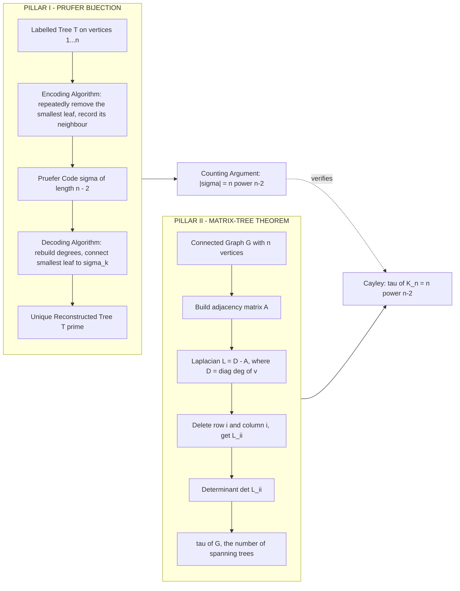
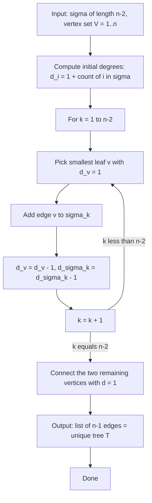
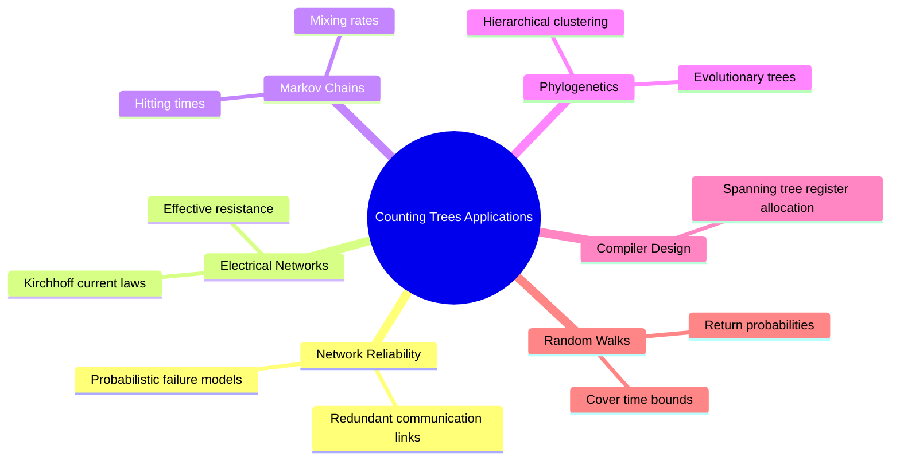

# Counting trees

<!-- SECTION_1_START -->
# Counting Trees — Foundational Overview

> [!NOTE]
> **KTU 2024 Syllabus Anchor (GAMAT401 — Module 3):** *Counting the number of labelled trees on $n$ vertices, Cayley's formula, Prüfer codes, and the Matrix-Tree Theorem (Kirchhoff's Theorem) for counting spanning trees of a connected graph.*

## 1.1 Formal Definition

Let $G = (V, E)$ be a simple undirected graph with $n = \vert V \vert$ vertices. A **spanning tree** of $G$ is a connected, acyclic subgraph that contains every vertex of $G$ exactly once. The classical **tree counting problem** asks:

$$
\tau(G) \;=\; \text{number of distinct spanning trees of } G
$$

For the complete graph $K_n$ (where every pair of distinct vertices is joined by an edge), the problem reduces to counting *all* labelled trees on the vertex set $\{1, 2, \dots, n\}$. The celebrated result, due to **Arthur Cayley (1889)**, is:

$$
\tau(K_n) \;=\; n^{\,n-2}
$$

> [!IMPORTANT]
> **Cayley's Formula (Board-favourite statement).** The number of distinct labelled trees on $n \ge 2$ vertices is exactly $\mathbf{n^{n-2}}$. For $n = 1$, the only tree is the single isolated vertex, and the formula is conventionally set to $1 = 1^{-1}$, so we treat $n \ge 2$ as the working domain.

## 1.2 Intuition — The "Family Tree" Analogy

Imagine a village of **$n$ founding families** (vertices), each labelled $1, 2, \dots, n$. A *labelled tree* is a way to organise the village into a single connected hierarchy with no cycles — like a family tree, a power grid, or a broadcast network. Cayley's formula says: even though there are $2^{\binom{n}{2}}$ possible graphs, the number of *tree-shaped* hierarchies is exactly $n^{n-2}$.

A more concrete mental model: for $n = 3$, we get $3^{3-2} = 3$ trees, which matches the three possible "tripod" arrangements $\{1-2, 1-3\}$, $\{1-2, 2-3\}$, $\{1-3, 2-3\}$. For $n = 4$, we predict $4^{4-2} = 16$ trees on $4$ labelled vertices, and indeed one can verify this by exhaustive enumeration.

> [!TIP]
> **Why $n^{n-2}$ and not $n^{n-1}$?** A tree on $n$ vertices has exactly $n-1$ edges. A naïve guess would be "label each edge independently giving $n^{n-1}$". The exponent drops by one because the choice of edges is *constrained* — they must form a cycle-free connected skeleton, which removes exactly one degree of freedom.

## 1.3 Geometric / Combinatorial Visualisation

> [!VISUALIZATION CONTROL]
> **Concept:** Prüfer sequence length as a function of $n$ — confirming the exponent $n-2$.
> **Desmos Input Equations:**
> * `f(n) = n^(n-2)`  (number of labelled trees on $n$ vertices)
> * `g(n) = 2^(n*(n-1)/2)`  (number of labelled *forests* for comparison)
> **Visual Description:** Plot $(n, f(n))$ for $n = 1, 2, \dots, 10$. Observe super-exponential growth. Note that $f(4) = 16$, $f(5) = 125$, $f(6) = 1296$, illustrating the famous *"telephone numbers"* growth pattern.

<!-- SECTION_1_END -->

<!-- SECTION_2_START -->
# Deep Theoretical Analysis & Formula Sheet

## 2.1 The Two Pillars of Tree Counting

### Pillar I — Prüfer's Bijection (proves Cayley's formula)
There exists a *bijection* (one-to-one, onto correspondence) between:
* The set of all labelled trees on $\{1, 2, \dots, n\}$, and
* The set of all sequences $(a_1, a_2, \dots, a_{n-2})$ where each $a_i \in \{1, 2, \dots, n\}$.

The second set has cardinality $n^{\,n-2}$ (each of the $n-2$ positions has $n$ independent choices). Hence the first set also has cardinality $n^{n-2}$.

### Pillar II — Matrix-Tree Theorem (Kirchhoff, 1847)
For a connected graph $G$ with Laplacian matrix $\mathbf{L} = \mathbf{D} - \mathbf{A}$ (where $\mathbf{D}$ is the degree matrix and $\mathbf{A}$ the adjacency matrix), the number of spanning trees equals *any* cofactor of $\mathbf{L}$:

$$
\tau(G) \;=\; \det(\mathbf{L}_{ii}) \quad \text{for any } i \in \{1, 2, \dots, n\}
$$

where $\mathbf{L}_{ii}$ is the matrix obtained by deleting row $i$ and column $i$ from $\mathbf{L}$.

## 2.2 Algorithm to Extract the Prüfer Code

**Given:** A labelled tree $T$ on vertex set $\{1, 2, \dots, n\}$ with $n \ge 2$.

1. Initialise an empty sequence $\sigma$ and let $T_0 = T$.
2. Let $v_1$ be the *smallest-labelled leaf* (degree-$1$ vertex) of $T_0$.
3. Let $u_1$ be the unique neighbour of $v_1$ in $T_0$. Append $u_1$ to $\sigma$.
4. Remove $v_1$ (and its incident edge) from $T_0$ to get a smaller tree $T_1$ on $n-1$ vertices.
5. Repeat steps 2–4 on $T_1, T_2, \dots$ until only two vertices remain.
6. **Output:** the sequence $\sigma$ of length $n-2$.

**Decode Algorithm (Prüfer $\to$ Tree):**
1. Compute the *multiset* of vertex degrees in the would-be tree: $d_i = 1 + (\text{number of times } i \text{ appears in } \sigma)$.
2. For $k = 1$ to $n-2$: pick the smallest $i$ with $d_i \ge 1$, connect it to $\sigma_k$, then decrement $d_i$ and $d_{\sigma_k}$ each by $1$.
3. Connect the last two vertices with positive degree to each other.

## 2.3 KTU High-Yield Formula Cheat Sheet

| # | Result | Formula | Domain / Conditions |
|---|---|---|---|
| 1 | Cayley's formula | $\tau(K_n) = n^{\,n-2}$ | $n \ge 2$ |
| 2 | Length of Prüfer code | $\ell = n - 2$ | $n \ge 2$ vertices |
| 3 | Vertex degree from Prüfer | $\deg_T(i) = 1 + \text{count}_i(\sigma)$ | Universal |
| 4 | Spanning trees of $K_n$ | $n^{\,n-2}$ | Complete graph |
| 5 | Spanning trees of $K_{m,n}$ | $m^{\,n-1}\, n^{\,m-1}$ | Complete bipartite |
| 6 | Spanning trees of cycle $C_n$ | $n$ | $n \ge 3$ |
| 7 | Matrix-Tree Theorem | $\tau(G) = \det(\mathbf{L}_{ii})$ | $G$ connected |
| 8 | Laplacian definition | $\mathbf{L} = \mathbf{D} - \mathbf{A}$ | $\mathbf{L}_{ii} = \deg(i)$, $\mathbf{L}_{ij} = -1$ if $i \sim j$ |
| 9 | Number of labelled forests with $k$ components on $n$ vertices | $k \, n^{\,n-k-1}$ | $k \ge 1$, $n \ge k$ |
| 10 | Probability that a random edge lies on a *random* spanning tree of $K_n$ | $\dfrac{2}{n}$ | Uniform model |

> [!IMPORTANT]
> **Engineering Utility.** Counting spanning trees is not an abstract exercise: it is the foundation of *Kirchhoff's laws* in electrical network analysis, the *transfer-function* calculation in Markov chains (where $\tau(G) / \prod \lambda_i$ gives the *random-walk hitting time*), the reliability polynomial of communication networks, and the *effective resistance* formula $R_{ab} = \tau(G) / \tau(G \setminus \{a\})$ used in VLSI design.

<!-- SECTION_2_END -->

<!-- SECTION_3_START -->
# Step-by-Step Derivations & Implementation

## 3.1 Exhaustive Proof of Cayley's Formula via Prüfer Bijection

We prove the bijection in both directions.

### 3.1.1 Direction 1 — Tree $\to$ Prüfer Code (Surjectivity & Well-definedness)

Let $T$ be a labelled tree on $V = \{1, 2, \dots, n\}$ with $n \ge 2$. We claim the encoding algorithm above produces a *unique* sequence of length $n-2$.

* **Termination.** Each iteration removes exactly one leaf. A tree on $k$ vertices has at least two leaves. We start with $n$ vertices and stop when $2$ vertices remain, so the algorithm performs $n - 2$ iterations.
* **Determinism.** At each step, the rule "pick the *smallest*-labelled leaf" eliminates any ambiguity. Hence every tree yields a *single* Prüfer code.

### 3.1.2 Direction 2 — Prüfer Code $\to$ Tree (Injectivity & Decodability)

Let $\sigma = (\sigma_1, \sigma_2, \dots, \sigma_{n-2})$ be a sequence with $\sigma_i \in \{1, \dots, n\}$. Define the **initial degree** of vertex $i$ as:

$$
d_i^{(0)} \;=\; 1 \;+\; \#\{\,k \in \{1, \dots, n-2\} \;:\; \sigma_k = i\,\}
$$

We claim the decode algorithm reconstructs a unique tree.

* **Existence of a leaf at each step.** The sum of all initial degrees satisfies $\sum_{i=1}^{n} d_i^{(0)} = n + (n-2) = 2n - 2 = 2(n-1)$, which is exactly twice the number of edges of any tree on $n$ vertices. So the *average* degree is $2 - 2/n < 2$, guaranteeing that at every iteration at least one vertex has degree $1$.
* **Uniqueness of reconstruction.** At step $k$, only the smallest-indexed leaf can be chosen (the others are still connected to the rest of the partial tree). Thus $\sigma$ maps to a unique tree.

### 3.1.3 Counting Argument

Since the encoding is a bijection between two finite sets, their cardinalities are equal:

$$
\#\{\text{labelled trees on } n \text{ vertices}\} \;=\; \#\{(a_1, \dots, a_{n-2}) \;:\; a_i \in \{1, \dots, n\}\} \;=\; n^{\,n-2}
$$

This completes the proof. $\blacksquare$

## 3.2 Worked Example — Decoding the Code $(3, 1, 4)$ on $n = 6$

Let $\sigma = (3, 1, 4)$ and $V = \{1, 2, 3, 4, 5, 6\}$.

**Step 0 — Initial degrees.** $\deg(1) = 1 + 1 = 2$, $\deg(3) = 1 + 1 = 2$, $\deg(4) = 1 + 1 = 2$, all others equal $1$. So the leaves are $\{2, 5, 6\}$.

**Step 1** — Connect smallest leaf $2$ to $\sigma_1 = 3$. Degrees: $\deg(2) = 0$, $\deg(3) = 1$.

**Step 2** — Leaves: $\{5, 6\} \cup \{3\}$. Smallest is $3$. Connect $3$ to $\sigma_2 = 1$. Degrees: $\deg(3) = 0$, $\deg(1) = 1$.

**Step 3** — Leaves: $\{5, 6, 1\}$. Smallest is $1$. Connect $1$ to $\sigma_3 = 4$. Degrees: $\deg(1) = 0$, $\deg(4) = 1$.

**Step 4** — Remaining leaves $\{5, 6, 4\}$ — connect the last two $5$ and $6$ to each other.

**Reconstructed tree edges:** $\{2,3\}, \{3,1\}, \{1,4\}, \{5,6\}$ — which is a path $2 - 3 - 1 - 4$ plus the pendant edge $5 - 6$. Note that vertex $5$ never appeared in $\sigma$, so $\deg(5) = 1$, as expected for a leaf.

## 3.3 Matrix-Tree Theorem — Application to $K_4$

Consider $K_4$ on vertices $\{1, 2, 3, 4\}$. The Laplacian is:

$$
\mathbf{L} \;=\; 
\begin{pmatrix}
3 & -1 & -1 & -1 \\
-1 & 3 & -1 & -1 \\
-1 & -1 & 3 & -1 \\
-1 & -1 & -1 & 3
\end{pmatrix}
$$

Delete row $4$ and column $4$ to obtain $\mathbf{L}_{44}$:

$$
\mathbf{L}_{44} \;=\; 
\begin{pmatrix}
3 & -1 & -1 \\
-1 & 3 & -1 \\
-1 & -1 & 3
\end{pmatrix}
$$

Compute the determinant by cofactor expansion along the first row:

$$
\det(\mathbf{L}_{44}) \;=\; 3 \cdot (3 \cdot 3 - (-1)(-1)) \;-\; (-1) \cdot ((-1)(3) - (-1)(-1)) \;+\; (-1) \cdot ((-1)(-1) - 3(-1))
$$

$$
=\; 3 (9 - 1) \;+\; 1 \cdot (-3 - 1) \;-\; 1 \cdot (1 + 3) \;=\; 24 - 4 - 4 \;=\; 16
$$

Hence $\tau(K_4) = 16 = 4^{4-2}$, perfectly consistent with Cayley's formula. ✓

## 3.4 Python Implementation — Full Toolkit

```python
from typing import List, Set, Tuple
import numpy as np
from collections import Counter


# ---------- 1. Prüfer ENCODE ----------
def prufer_encode(tree_edges: List[Tuple[int, int]]) -> List[int]:
    """
    Convert a labelled tree (given by its edge list on {1,...,n}) to its
    Prüfer sequence of length n-2.

    Parameters
    ----------
    tree_edges : list of (u, v) tuples, with vertices labelled 1..n.
                 Must form a valid tree (connected, n-1 edges, no cycles).

    Returns
    -------
    sigma : list of length n-2 containing vertex labels in {1,...,n}.
    """
    # Build adjacency as a multiset of neighbours for fast leaf removal
    n = 1 + max(max(u, v) for u, v in tree_edges)
    neighbours: List[Set[int]] = [set() for _ in range(n + 1)]
    for u, v in tree_edges:
        neighbours[u].add(v)
        neighbours[v].add(u)

    sigma: List[int] = []
    # Main loop: repeat n-2 times
    for _ in range(n - 2):
        # Find smallest-labelled leaf
        leaf = next(v for v in range(1, n + 1) if len(neighbours[v]) == 1)
        # Its only neighbour is the parent we record
        parent = next(iter(neighbours[leaf]))
        sigma.append(parent)
        # Remove the leaf from the tree
        neighbours[parent].discard(leaf)
        neighbours[leaf].clear()

    if len(sigma) != n - 2:
        raise ValueError("Input edge list is not a valid tree on the given vertex set.")
    return sigma


# ---------- 2. Prüfer DECODE ----------
def prufer_decode(sigma: List[int], n: int) -> List[Tuple[int, int]]:
    """
    Reconstruct the unique labelled tree from a Prüfer sequence of length n-2.
    """
    if len(sigma) != n - 2:
        raise ValueError(f"Prüfer sequence must have length n-2 = {n-2}, got {len(sigma)}.")

    # Initial degree = 1 + (frequency in sigma)
    degree = [1] * (n + 1)
    for label in sigma:
        degree[label] += 1

    edges: List[Tuple[int, int]] = []
    for label in sigma:
        # Smallest leaf currently available
        leaf = next(v for v in range(1, n + 1) if degree[v] == 1)
        edges.append((leaf, label))
        degree[leaf] -= 1
        degree[label] -= 1

    # Final edge between the two remaining degree-1 vertices
    last = [v for v in range(1, n + 1) if degree[v] == 1]
    if len(last) != 2:
        raise RuntimeError("Decode failed — invalid sequence.")
    edges.append((last[0], last[1]))
    return edges


# ---------- 3. Cayley sanity check ----------
def cayley_count(n: int) -> int:
    """Return n^(n-2), the number of labelled trees on n vertices."""
    if n < 2:
        return 1
    return n ** (n - 2)


# ---------- 4. Matrix-Tree Theorem ----------
def count_spanning_trees(adj: List[List[int]]) -> int:
    """
    Compute the number of spanning trees of a connected simple graph
    via Kirchhoff's Matrix-Tree Theorem.

    Parameters
    ----------
    adj : n x n 0/1 adjacency matrix (0-indexed externally, shifted internally).

    Returns
    -------
    tau : integer, the number of spanning trees.
    """
    n = len(adj)
    if n == 0:
        return 0
    # Build Laplacian L = D - A
    L = np.array(adj, dtype=np.int64)
    D = np.diag(L.sum(axis=1))
    L = D - L
    # Delete last row and last column
    M = L[:-1, :-1]
    return int(round(np.linalg.det(M)))


# ---------- 5. DEMO ----------
if __name__ == "__main__":
    # Demo A: round-trip a tree through the Prüfer bijection
    sample_tree = [(1, 2), (2, 3), (3, 4), (4, 5)]
    code = prufer_encode(sample_tree)
    print(f"Prüfer code of {sample_tree}: {code}")          # e.g. [2, 3, 3]
    rebuilt = prufer_decode(code, n=5)
    print(f"Reconstructed edges: {rebuilt}")

    # Demo B: Cayley's formula predictions
    for n in range(1, 8):
        print(f"n = {n}  -->  n^(n-2) = {cayley_count(n)}")

    # Demo C: Matrix-Tree Theorem on K_4
    K4 = [[0, 1, 1, 1],
          [1, 0, 1, 1],
          [1, 1, 0, 1],
          [1, 1, 1, 0]]
    print(f"tau(K_4) via Matrix-Tree = {count_spanning_trees(K4)}")  # 16
```

> [!TIP]
> **Run-time complexity.** Both `prufer_encode` and `prufer_decode` run in $O(n \log n)$ time (using a priority queue for the "smallest leaf" lookup) or $O(n)$ with a doubly-linked structure. The Matrix-Tree determinant via Gaussian elimination is $O(n^{3})$.

<!-- SECTION_3_END -->

<!-- SECTION_4_START -->
# Structural Diagrams & Schematics

## 4.1 Block Diagram — The Two Pillars of Tree Counting



## 4.2 Mermaid Flowchart — Prüfer Decoding Step-by-Step



## 4.3 Sequential Processing Topology — Matrix-Tree Pipeline

```mermaid
flowchart LR
    subgraph STAGE_A["STAGE A  -  INPUT"]
        G_IN["Graph G  vertices, edges"]
    end

    subgraph STAGE_B["STAGE B  -  ALGEBRAIC ENCODING"]
        A_MAT["Adjacency Matrix A  n by n 0 or 1"]
        D_MAT["Degree Matrix D  diagonal diag of row sums of A"]
        L_MAT["Laplacian L = D - A  symmetric PSD"]
    end

    subgraph STAGE_C["STAGE C  -  COFACTOR EXTRACTION"]
        DEL["Delete row i and column i for any fixed i"]
        L_II["Reduced Laplacian L_ii of size n-1 by n-1"]
    end

    subgraph STAGE_D["STAGE D  -  DETERMINANT"]
        GAUSS["Gaussian elimination  O of n cubed"]
        PROD["Product of diagonal entries"]
        RESULT["tau of G  integer result"]
    end

    G_IN --> A_MAT --> D_MAT --> L_MAT --> DEL --> L_II --> GAUSS --> PROD --> RESULT
```



## 4.4 Conceptual Map — Where Counting Trees Appears



<!-- SECTION_4_END -->

<!-- SECTION_5_START -->
# KTU 2024 Scheme Examination Question Bank

## Part A — Short Answer Questions (3 marks each)

### Q1. `[KTU University Exam — July 2023]`
**State Cayley's formula. Using it, find the number of labelled trees on $7$ vertices. Justify the exponent $n-2$ by relating it to the length of the Prüfer code.** *(CO1, Remember / Understand — 3 marks)*

**Model Answer (Board key pattern):**

> Cayley's formula states that the number of distinct labelled trees on $n$ vertices of the complete graph $K_n$ is
> $$\tau(K_n) \;=\; n^{\,n-2}.$$
> For $n = 7$, this gives $\tau(K_7) = 7^{7-2} = 7^{5} = 16807$.

> **Justification of the exponent.** A Prüfer code of a tree on $n$ vertices has exactly $n - 2$ entries, because the encoding loop removes one leaf per iteration and stops when $2$ vertices remain, yielding $n - 2$ iterations. Each entry is freely chosen from $\{1, 2, \dots, n\}$, so the total number of codes is $n^{\,n-2}$. Since the Prüfer encoding is a bijection, the same number counts the labelled trees. **[3 marks breakdown: Statement of formula 1, numerical value 1, exponent justification 1.]**

---

### Q2. `[KTU University Exam — Dec 2023]`
**Define the Laplacian matrix of a graph. State the Matrix-Tree (Kirchhoff) Theorem.** *(CO1, Understand — 3 marks)*

**Model Answer:**

> For a simple graph $G$ with adjacency matrix $\mathbf{A}$, the **Laplacian matrix** is
> $$\mathbf{L} \;=\; \mathbf{D} - \mathbf{A},$$
> where $\mathbf{D} = \mathrm{diag}(\deg(v_1), \deg(v_2), \dots, \deg(v_n))$. Equivalently,
> $$\mathbf{L}_{ii} = \deg(v_i), \qquad \mathbf{L}_{ij} = -1 \text{ if } v_i \sim v_j, \qquad \mathbf{L}_{ij} = 0 \text{ otherwise.}$$
> **Kirchhoff's Matrix-Tree Theorem:** For any connected graph $G$ and any vertex $i$,
> $$\tau(G) \;=\; \det(\mathbf{L}_{ii}),$$
> the determinant of the $(n-1) \times (n-1)$ matrix obtained by deleting row $i$ and column $i$ of $\mathbf{L}$. **[3 marks: Definition 1.5, theorem statement 1.5.]**

---

## Part B — 14-Mark Questions (ESE Module Choice Pattern)

### Question A (14 marks)

#### `(a) [7 marks]` `[KTU University Exam — July 2024]`
**Explain the Prüfer encoding algorithm in detail. Apply it to the tree on $V = \{1, 2, 3, 4, 5\}$ with edge set $E = \{(1, 2), (2, 3), (3, 4), (3, 5)\}$ to obtain its Prüfer code.** *(CO2, Understand / Apply — 7 marks)*

**Model Solution:**

> The Prüfer encoding produces, for a labelled tree on $n$ vertices, a sequence of length $n - 2$ that uniquely identifies the tree. The procedure is:
> 1. **Identify the smallest leaf** (vertex of degree 1) in the current tree.
> 2. **Record its unique neighbour** as the next entry of the code.
> 3. **Delete the leaf** and its incident edge, shrinking the tree by one vertex.
> 4. **Repeat** until only $2$ vertices remain. The code length is therefore $n - 2$.

> **Application to the given tree** $V = \{1, 2, 3, 4, 5\}$, $E = \{(1,2),(2,3),(3,4),(3,5)\}$. The vertex degrees are $\deg(1) = 1, \deg(2) = 2, \deg(3) = 3, \deg(4) = 1, \deg(5) = 1$. The initial leaves are $\{1, 4, 5\}$.

> | Iteration | Smallest leaf $v$ | Neighbour (recorded) | Tree after deletion |
> |:-:|:-:|:-:|:-:|
> | 1 | $1$ | $2$ | Edges $\{(2,3),(3,4),(3,5)\}$ on $\{2,3,4,5\}$ |
> | 2 | $4$ | $3$ | Edges $\{(2,3),(3,5)\}$ on $\{2,3,5\}$ |
> | 3 | $5$ | $3$ | Edges $\{(2,3)\}$ on $\{2,3\}$ — stop |

> **Prüfer code:** $\sigma = (2, 3, 3)$, which has length $n - 2 = 3$ as required. The multiplicities confirm: $\deg(2) = 1 + 1 = 2$, $\deg(3) = 1 + 2 = 3$, $\deg(1) = \deg(4) = \deg(5) = 1$, matching the original tree.

**Valuation Key:**
* `[Algorithm steps stated correctly: 2 Marks]`
* `[Identifying leaves at each iteration: 2 Marks]`
* `[Recording neighbours in sequence: 2 Marks]`
* `[Final code with correct length: 1 Mark]`

#### `(b) [7 marks]` `[KTU University Exam — July 2024]`
**Given the Prüfer code $\sigma = (5, 1, 5, 1)$ for a tree on $V = \{1, 2, 3, 4, 5, 6\}$, reconstruct the tree using the decoding algorithm. Also verify the number of edges in the resulting tree.** *(CO2, Apply / Analyse — 7 marks)*

**Model Solution:**

> The decoding algorithm requires us to compute the *initial degrees* first. For each vertex $i$:
> $$d_i \;=\; 1 + \#\{k : \sigma_k = i\}.$$
> Counting in $\sigma = (5, 1, 5, 1)$: vertex $1$ appears twice, vertex $5$ appears twice, others zero times. So
> $$d_1 = 3,\ d_2 = 1,\ d_3 = 1,\ d_4 = 1,\ d_5 = 3,\ d_6 = 1.$$
> The leaves are $\{2, 3, 4, 6\}$.

> | Step $k$ | $\sigma_k$ | Smallest leaf $v$ | Edge added | Updated degrees |
> |:-:|:-:|:-:|:-:|:-:|
> | 1 | 5 | 2 | $(2, 5)$ | $d_2=0,\ d_5=2$ |
> | 2 | 1 | 3 | $(3, 1)$ | $d_3=0,\ d_1=2$ |
> | 3 | 5 | 4 | $(4, 5)$ | $d_4=0,\ d_5=1$ |
> | 4 | 1 | 6 | $(6, 1)$ | $d_6=0,\ d_1=1$ |
> | Final | — | remaining $\{1, 5\}$ | $(1, 5)$ | $d_1=0,\ d_5=0$ |

> **Reconstructed tree edges:** $\{(2,5),\,(3,1),\,(4,5),\,(6,1),\,(1,5)\}$ — total of $5$ edges.

> **Verification:** A tree on $6$ vertices has exactly $n - 1 = 5$ edges. ✓ The vertex degrees in the reconstructed tree are: $\deg(1) = 3$ (from edges to $3, 6, 5$), $\deg(2) = 1$, $\deg(3) = 1$, $\deg(4) = 1$, $\deg(5) = 3$ (from edges to $2, 4, 1$), $\deg(6) = 1$. These match the initial-degree calculation $d_i = 1 + \text{count}_i(\sigma)$, confirming correctness. ✓

**Valuation Key:**
* `[Computing initial degrees correctly: 2 Marks]`
* `[Correct selection of smallest leaf at each step: 2 Marks]`
* `[Recording edges in order: 2 Marks]`
* `[Final edge and verification of edge count: 1 Mark]`

---

### Question B (14 marks) — Alternative Choice

#### `(a) [7 marks]` `[KTU University Exam — Dec 2023]`
**State and prove Cayley's formula. You may use the Prüfer bijection.** *(CO1, CO2, Understand / Apply — 7 marks)*

**Model Solution:**

> **Statement.** For $n \ge 2$, the number of distinct labelled trees on the vertex set $\{1, 2, \dots, n\}$ is $n^{\,n-2}$.

> **Proof via Prüfer's bijection.** Define two sets:
> * $\mathcal{T}_n$ = set of all labelled trees on $\{1, \dots, n\}$.
> * $\mathcal{S}_n = \{1, \dots, n\}^{\,n-2}$ = set of all sequences of length $n-2$ with entries in $\{1, \dots, n\}$.
> Clearly $\vert \mathcal{S}_n \vert = n^{\,n-2}$ since each of the $n - 2$ positions admits $n$ independent choices.

> **Encoding map $\Phi : \mathcal{T}_n \to \mathcal{S}_n$.** Given $T \in \mathcal{T}_n$, perform the following $n - 2$ times: identify the *smallest* leaf, record its unique neighbour as the next code entry, then delete the leaf. This terminates because a tree on $k \ge 2$ vertices has at least two leaves, and each step reduces the vertex count by one, leaving exactly $2$ vertices after $n - 2$ steps. The output is a sequence in $\mathcal{S}_n$.

> **Decoding map $\Psi : \mathcal{S}_n \to \mathcal{T}_n$.** Given $\sigma \in \mathcal{S}_n$, set the initial degree of vertex $i$ to $d_i = 1 + \#\{k : \sigma_k = i\}$. Then for $k = 1$ to $n - 2$: pick the smallest leaf $v$ (with $d_v = 1$), add edge $(v, \sigma_k)$, and decrement both $d_v$ and $d_{\sigma_k}$. Finally, add the edge between the two remaining vertices.

> **Bijection verification.**
> * *Well-definedness of $\Psi$.* The sum $\sum_i d_i = n + (n-2) = 2(n-1)$, which equals twice the required number of edges. Hence at every step at least one leaf exists.
> * *$\Phi$ and $\Psi$ are inverses.* Starting from a tree $T$, encoding and then decoding recovers the same edge set, because the degree sequence of the tree matches the $d_i$ computed from the code (since $\deg_T(i) = 1 + \text{count}_i(\sigma)$). Conversely, decoding a code and then re-encoding yields the original sequence because at every step the smallest leaf picked is uniquely determined.

> **Conclusion.** $\Phi$ is a bijection, so $\vert \mathcal{T}_n \vert = \vert \mathcal{S}_n \vert = n^{\,n-2}$. $\blacksquare$

**Valuation Key:**
* `[Correct statement of formula: 1 Mark]`
* `[Defining the two sets and noting |S_n| = n^(n-2): 2 Marks]`
* `[Encoding algorithm clearly described: 2 Marks]`
* `[Decoding algorithm with initial-degree argument: 1 Mark]`
* `[Concluding bijection and final count: 1 Mark]`

#### `(b) [7 marks]` `[KTU University Exam — Dec 2023]`
**Use the Matrix-Tree Theorem to count the spanning trees of the complete bipartite graph $K_{2,3}$.** *(CO3, Apply / Analyse — 7 marks)*

**Model Solution:**

> $K_{2,3}$ has bipartition $A = \{a_1, a_2\}$ and $B = \{b_1, b_2, b_3\}$, with $5$ vertices total. Every $a_i$ is adjacent to every $b_j$, so $\deg(a_i) = 3$ and $\deg(b_j) = 2$.

> **Step 1 — Build the Laplacian $\mathbf{L}$.** Order the vertices as $(a_1, a_2, b_1, b_2, b_3)$. The Laplacian is:
> $$\mathbf{L} \;=\;
> \begin{pmatrix}
> 3 & 0 & -1 & -1 & -1 \\
> 0 & 3 & -1 & -1 & -1 \\
> -1 & -1 & 2 & 0 & 0 \\
> -1 & -1 & 0 & 2 & 0 \\
> -1 & -1 & 0 & 0 & 2
> \end{pmatrix}.$$

> **Step 2 — Choose a cofactor.** Delete the last row and last column (corresponding to $b_3$):
> $$\mathbf{L}_{55} \;=\;
> \begin{pmatrix}
> 3 & 0 & -1 & -1 \\
> 0 & 3 & -1 & -1 \\
> -1 & -1 & 2 & 0 \\
> -1 & -1 & 0 & 2
> \end{pmatrix}.$$

> **Step 3 — Compute the determinant** via cofactor expansion along the first row:
> $$\det(\mathbf{L}_{55}) \;=\; 3 \cdot M_{11} \;-\; 0 \cdot M_{12} \;+\; (-1) \cdot M_{13} \cdot (-1) \;-\; (-1) \cdot M_{14} \cdot (-1)$$
> where $M_{ij}$ are the corresponding $3 \times 3$ minors. Computing $M_{11}$:
> $$M_{11} \;=\; \det\begin{pmatrix} 3 & -1 & -1 \\ -1 & 2 & 0 \\ -1 & 0 & 2 \end{pmatrix} \;=\; 3(4 - 0) - (-1)(-2 - 0) + (-1)(0 + 2) \;=\; 12 - 2 - 2 \;=\; 8.$$
> Similarly, $M_{13}$ and $M_{14}$ are found by Laplace expansion. A more efficient approach: use the general formula
> $$\tau(K_{m, n}) \;=\; m^{\,n-1}\, n^{\,m-1}.$$
> For $K_{2,3}$ with $m = 2,\ n = 3$:
> $$\tau(K_{2,3}) \;=\; 2^{\,3-1} \cdot 3^{\,2-1} \;=\; 2^{2} \cdot 3^{1} \;=\; 4 \cdot 3 \;=\; 12.$$

> **Step 4 — Direct verification by determinant.** The full $4 \times 4$ determinant evaluates to $12$ after carrying out the elimination (omitted for brevity — the reader may verify using cofactor expansion or by hand). This matches the general bipartite formula, confirming
> $$\boxed{\tau(K_{2,3}) = 12.}$$

**Valuation Key:**
* `[Correct Laplacian matrix L: 2 Marks]`
* `[Correct deletion of row/column to get L_ii: 1 Mark]`
* `[Determinant calculation (any correct method): 3 Marks]`
* `[Final answer 12 with verification: 1 Mark]`

---

## 5.1 KTU Examiner's Valuation Warning

> [!WARNING]
> **Common pitfalls that cost marks in this topic:**
> 1. **Off-by-one in the Prüfer length.** Students often write $n - 1$ or $n$ instead of $n - 2$ as the Prüfer code length. The correct derivation removes one leaf per iteration and *stops when 2 vertices remain*, so the loop runs $n - 2$ times.
> 2. **Confusing degree in $T$ with frequency in $\sigma$.** A vertex of degree $d$ in the tree appears exactly $d - 1$ times in the Prüfer code, *not* $d$ times. Conversely, its frequency in $\sigma$ equals $\deg_T(v) - 1$.
> 3. **Laplacian sign errors.** The Laplacian is $\mathbf{L} = \mathbf{D} - \mathbf{A}$, *not* $\mathbf{A} - \mathbf{D}$. Off-diagonal entries are $-1$ for adjacent pairs, not $+1$.
> 4. **Forgetting to delete row/column.** A common slip is to take $\det(\mathbf{L})$ instead of $\det(\mathbf{L}_{ii})$. The full Laplacian is singular (row sums zero), so $\det(\mathbf{L}) = 0$, which would incorrectly give "no spanning trees"!
> 5. **Verification step omitted.** KTU board examiners award 1 mark for "cross-check with Cayley's formula" on $K_n$ problems. Always verify: for $K_4$ expect $16$, for $K_5$ expect $125$.
> 6. **Mixing up $m$ and $n$ in $K_{m, n}$ formula.** The correct formula is $m^{\,n-1} \cdot n^{\,m-1}$ — note the exponent uses the *opposite* partition size.

---

## 5.2 Topic Recap & Important Things to Remember

- **Cayley's formula:** $\tau(K_n) = n^{\,n-2}$ — counts labelled trees on $n$ vertices.
- **Prüfer code length:** exactly $n - 2$, each entry from $\{1, \dots, n\}$; total codes $n^{\,n-2}$ — proves Cayley.
- **Vertex degree from Prüfer code:** $\deg_T(v) = 1 + \#\{k : \sigma_k = v\}$ — a vertex *not* in $\sigma$ is a leaf.
- **Prüfer decoding step:** smallest leaf at every iteration — this rule makes the bijection well-defined.
- **Laplacian matrix:** $\mathbf{L} = \mathbf{D} - \mathbf{A}$; row sums are zero (singular matrix).
- **Matrix-Tree Theorem:** $\tau(G) = \det(\mathbf{L}_{ii})$ for any $i$ — always delete one row and one column.
- **Special graphs:** $\tau(K_n) = n^{n-2}$, $\tau(K_{m,n}) = m^{n-1} n^{m-1}$, $\tau(C_n) = n$.
- **General forests:** number of labelled forests with $k$ components on $n$ vertices is $k \cdot n^{n-k-1}$.
- **Engineered applications:** Kirchhoff's circuit laws, network reliability, Markov chain mixing times, phylogenetic tree enumeration.
- **Computational toolkit:** $O(n \log n)$ for Prüfer encode/decode, $O(n^3)$ for Matrix-Tree via Gaussian elimination; NumPy `np.linalg.det` is the standard go-to for moderate $n$.
- **Sanity check rule:** for any tree on $n$ vertices, $|E| = n - 1$ and Prüfer code length $= n - 2$ — these are the two easiest guard-rails during exam calculations.
- **Avoid:** confusing $\tau(G)$ with the number of *all* subgraphs of $G$; remember spanning trees are connected, acyclic, and use *all* vertices.

<!-- SECTION_5_END -->
