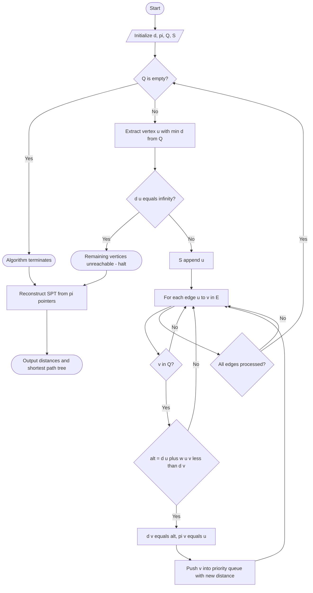
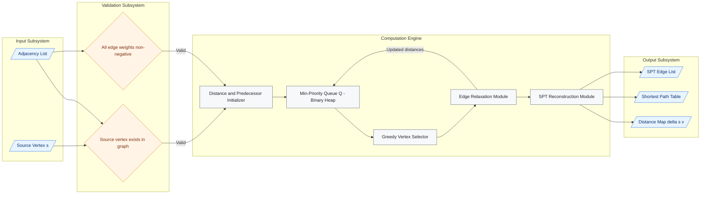

# Dijkstra's shortest path algorithm

<!-- SECTION_1_START -->
# Dijkstra's Shortest Path Algorithm — Core Definition & Intuition

## Formal Academic Definition (KTU 2024 Syllabus Standard)

**Dijkstra's Algorithm** is a greedy graph-search procedure that computes the minimum cumulative non-negative edge-weight distance from a designated **source vertex** $s$ to every other vertex in a **weighted, directed or undirected graph** $G = (V, E, w)$ where $w : E \to \mathbb{R}_{\geq 0}$. The algorithm maintains a working set $S \subseteq V$ of vertices whose final shortest-path distance from $s$ has been settled, and iteratively grows $S$ by extracting the unsettled vertex with the smallest tentative distance.

> [!IMPORTANT]
> **KTU 2024 Module Highlight (GAMAT401 — Module 3: Trees)**
> Dijkstra's algorithm is positioned within the "Trees" module because its execution implicitly constructs a **Shortest-Path Tree (SPT)** rooted at the source vertex $s$. The SPT contains exactly $\vert V \vert - 1$ edges — one per non-root vertex — such that the unique path from $s$ to any vertex $v$ in the SPT is the shortest path in the original graph $G$.

### Mathematical Pre-conditions

Let the graph be formally specified as:

$$
G = (V, E),\quad w : E \to \mathbb{R}_{\geq 0}
$$

The algorithm seeks, for each $v \in V$, the value:

$$
\delta(s, v) = \min_{(s \to v)\text{ paths}} \left\{ \sum_{e \in p} w(e) \right\}
$$

> [!NOTE]
> **Edge Weight Constraint:** Dijkstra's correctness is guaranteed **only** when all edge weights satisfy $w(e) \geq 0$. If negative edge weights exist, the **Bellman–Ford algorithm** must be used instead.

---

## Conceptual Analogy — "The Spreading Water Ripples"

Imagine you drop a single pebble into the still surface of a pond at point $s$. The ripple expands outward at a **uniform speed** in every direction. The first time the ripple reaches a particular point on the pond (vertex $v$), that arrival time corresponds to the **shortest path distance** from $s$ to $v$. Crucially, once the ripple has *touched* a point, that point is considered **settled** — no later ripple can reach it in less time, because ripples always travel at the same minimum speed and never accelerate backwards.

In this analogy:

| Pond Element | Graph Equivalent |
| :--- | :--- |
| Pebble drop point | Source vertex $s$ |
| Ripple expansion speed | Inverse of edge weight (shorter edge = faster ripple) |
| A point on the pond | A vertex $v \in V$ |
| First-touch arrival time | Shortest distance $\delta(s, v)$ |
| Path traced by ripple | Shortest path in the SPT |
| Settled points | Vertices already inserted into set $S$ |

---

## GeoGebra / Desmos Visualization Insight

> [!VISUALIZATION CONTROL]
> **Concept:** Tentative distance updates visualized on a coordinate plane.
> **GeoGebra / Desmos Input Equations:**
> * `d_A(t) = 0`  (constant — source vertex is permanently settled at distance 0)
> * `d_B(t) = 4 - 2t`  (linearly decreases as better paths are found, then flat-lines at 3)
> * `d_C(t) = 2`  (settled after first iteration)
> * `d_E(t) = 12 - 2t`  (decreases from 12 to 10 once a better path is discovered)
> **Visual Description:** The student should observe a family of **monotonically non-increasing** piecewise-linear curves, each eventually flattening to its true shortest-path value. This monotonicity is the geometric signature of Dijkstra's greedy correctness.

<!-- SECTION_1_END -->

<!-- SECTION_2_START -->
# Deep Theoretical Analysis — KTU High-Yield Formula Sheet

## The Operational Logic — Five-Stage Breakdown

Dijkstra's algorithm can be decomposed into the following five tightly-coupled stages:

1. **Initialization Stage**
   * Assign $d[s] \leftarrow 0$ (the source is at distance 0 from itself).
   * Assign $d[v] \leftarrow \infty$ for all $v \in V \setminus \{s\}$.
   * Set $\pi[v] \leftarrow \text{NIL}$ for all $v$ (predecessor pointer, used to reconstruct the SPT).
   * Initialize the unsettled set $Q \leftarrow V$ (typically a min-priority queue keyed by $d[\cdot]$).

2. **Greedy Selection Stage**
   * At each iteration, extract $u \leftarrow \arg\min_{v \in Q} d[v]$.
   * Remove $u$ from $Q$ and insert it into the settled set $S$.
   * This choice is the *only* place where the algorithm is "greedy".

3. **Edge Relaxation Stage (the "Why" of Dijkstra)**
   * For every outgoing edge $(u, v) \in E$ where $v \in Q$ still:
   * Compute the **alternative path length** $\text{alt} \leftarrow d[u] + w(u, v)$.
   * If $\text{alt} < d[v]$, perform the update:
     $$d[v] \leftarrow d[u] + w(u, v), \quad \pi[v] \leftarrow u$$
   * Otherwise, leave $d[v]$ unchanged (the current tentative path is already optimal).

4. **Termination Stage**
   * The algorithm halts when $Q = \emptyset$ (all vertices settled) **or** when the extracted vertex $u$ has $d[u] = \infty$ (graph is disconnected from $s$, remaining vertices are unreachable).

5. **Tree Reconstruction Stage**
   * For any $v \neq s$, follow $\pi[v] \rightarrow \pi[\pi[v]] \rightarrow \cdots \rightarrow s$ to recover the unique shortest path.
   * The set of edges $\{( \pi[v], v ) : v \neq s\}$ forms the **Shortest-Path Tree**.

---

## Why the Greedy Choice is Correct — Intuitive Proof Sketch

> [!NOTE]
> **The Invariant Maintained:** At the start of every iteration, for every $v \in S$, the value $d[v] = \delta(s, v)$ (already optimal), and for every $v \in Q$, the value $d[v]$ equals the length of the shortest $s \rightsquigarrow v$ path whose **interior** lies entirely in $S$.

When we extract $u = \arg\min_{v \in Q} d[v]$, suppose for contradiction there exists a shorter path $P$ from $s$ to $u$ of length $< d[u]$. This path $P$ must cross from $S$ into $Q$ at some edge $(x, y)$ with $x \in S$ and $y \in Q$. The length of $P$ is at least $d[x] + w(x, y) \geq d[y]$. Since $y \in Q$ and $u$ is the minimum in $Q$, we have $d[y] \geq d[u]$, contradicting the assumption that $P < d[u]$. Therefore, no shorter path exists, and $d[u]$ is finalized.

---

## KTU High-Yield Formula / Cheat Sheet

| Symbol / Operation | Definition / Formula | Standard Complexity | Use Case |
| :--- | :--- | :--- | :--- |
| $\delta(s, v)$ | True shortest-path distance from $s$ to $v$ | — | Final answer output |
| $d[v]$ | Current tentative distance (upper bound on $\delta$) | — | Working variable |
| $\pi[v]$ | Predecessor of $v$ on current best path | — | SPT reconstruction |
| Relaxation test | $\text{alt} = d[u] + w(u, v) < d[v]$ | $O(1)$ per edge | Decides whether to update $d[v]$ |
| Relaxation update | $d[v] \leftarrow d[u] + w(u, v)\ ;\ \pi[v] \leftarrow u$ | $O(1)$ | Core operation |
| Min-extraction | $u \leftarrow \arg\min_{v \in Q} d[v]$ | $O(\vert V \vert)$ array $\vert$ $O(\log \vert V \vert)$ binary heap | Greedy step |
| Total time (array) | $O(\vert V \vert^2 + \vert E \vert)$ | $O(\vert V \vert^2)$ dominant | Dense graphs |
| Total time (binary heap) | $O((\vert V \vert + \vert E \vert) \log \vert V \vert)$ | $O(\vert E \vert \log \vert V \vert)$ dominant | Sparse graphs |
| Total time (Fibonacci heap) | $O(\vert V \vert \log \vert V \vert + \vert E \vert)$ | $O(\vert E \vert)$ dominant | Theoretical optimum |
| Space complexity | $O(\vert V \vert + \vert E \vert)$ | — | Stores graph + $d$ + $\pi$ + $Q$ |

> [!IMPORTANT]
> **KTU Exam Tip:** When asked "What is the time complexity of Dijkstra's algorithm?", the **expected textbook answer** for the binary-heap implementation is $\boxed{O((V + E) \log V)}$. The array implementation is $O(V^2)$. Examiners almost always want the **binary-heap** variant unless specified otherwise.

---

## Real-World Engineering Applications

* **Internet Routing (OSPF Protocol):** Routers in an Autonomous System use a Dijkstra-like SPT computation on a Link-State Database to build their forwarding table.
* **GPS Navigation Systems (Google Maps, OpenStreetMap):** Compute fastest route over millions of road segments with non-negative travel-time weights.
* **Network Optimization (Software-Defined Networking):** Used in shortest-path bridging (SPB — IEEE 802.1aq) and in traffic engineering for SDN controllers.
* **Game AI Pathfinding:** Real-time movement of non-player characters (NPCs) over weighted grid-based nav-meshes.
* **Operations Research:** Project scheduling, vehicle routing problems, and supply chain logistics.
* **VLSI CAD Tools:** Wire-length minimization in chip layout, where vertices are module pins and weights are inter-pin distances.

<!-- SECTION_2_END -->

<!-- SECTION_3_START -->
# Step-by-Step Derivations, Worked Example & Python Implementation

## Worked Example — Full Hand-Trace (KTU Board Standard)

Consider the following weighted undirected graph $G = (V, E)$ with **5 vertices** and **7 edges**, drawn below conceptually. Edge weights are non-negative integers.

**Edge List (representing $(u, v, w)$ triples):**

$$
(A, B, 4),\ (A, C, 2),\ (B, C, 1),\ (B, D, 5),\ (C, D, 8),\ (C, E, 10),\ (D, E, 2)
$$

**Source vertex:** $s = A$

---

### Step 0 — Initialization

$$
d[A] = 0,\quad d[B] = d[C] = d[D] = d[E] = \infty
$$
$$
\pi[A] = \pi[B] = \pi[C] = \pi[D] = \pi[E] = \text{NIL}
$$
$$
Q = \{A, B, C, D, E\},\quad S = \emptyset
$$

---

### Step 1 — Extract Minimum from $Q$

The minimum $d$ in $Q$ is $d[A] = 0$. Extract $A$, set $S = \{A\}$.

**Relax all edges out of $A$:**

Edge $(A, B, 4)$: $\text{alt} = d[A] + 4 = 0 + 4 = 4 < \infty = d[B]$
$$
d[B] \leftarrow 4,\quad \pi[B] \leftarrow A
$$

Edge $(A, C, 2)$: $\text{alt} = d[A] + 2 = 0 + 2 = 2 < \infty = d[C]$
$$
d[C] \leftarrow 2,\quad \pi[C] \leftarrow A
$$

**State after Step 1:** $d = [A:0,\ B:4,\ C:2,\ D:\infty,\ E:\infty]$, $\pi = [A:\text{NIL},\ B:A,\ C:A,\ D:\text{NIL},\ E:\text{NIL}]$

---

### Step 2 — Extract Minimum from $Q$

Minimum unsettled $d$ is $d[C] = 2$. Extract $C$, set $S = \{A, C\}$.

**Relax all edges out of $C$:**

Edge $(C, B, 1)$: $\text{alt} = d[C] + 1 = 2 + 1 = 3 < 4 = d[B]$
$$
d[B] \leftarrow 3,\quad \pi[B] \leftarrow C
$$

Edge $(C, D, 8)$: $\text{alt} = d[C] + 8 = 2 + 8 = 10 < \infty = d[D]$
$$
d[D] \leftarrow 10,\quad \pi[D] \leftarrow C
$$

Edge $(C, E, 10)$: $\text{alt} = d[C] + 10 = 2 + 10 = 12 < \infty = d[E]$
$$
d[E] \leftarrow 12,\quad \pi[E] \leftarrow C
$$

**State after Step 2:** $d = [A:0,\ B:3,\ C:2,\ D:10,\ E:12]$

---

### Step 3 — Extract Minimum from $Q$

Minimum unsettled $d$ is $d[B] = 3$. Extract $B$, set $S = \{A, C, B\}$.

**Relax all edges out of $B$:**

Edge $(B, D, 5)$: $\text{alt} = d[B] + 5 = 3 + 5 = 8 < 10 = d[D]$
$$
d[D] \leftarrow 8,\quad \pi[D] \leftarrow B
$$

(Edges $(B, A, 4)$ and $(B, C, 1)$ are skipped because $A$ and $C$ are already in $S$.)

**State after Step 3:** $d = [A:0,\ B:3,\ C:2,\ D:8,\ E:12]$

---

### Step 4 — Extract Minimum from $Q$

Minimum unsettled $d$ is $d[D] = 8$. Extract $D$, set $S = \{A, C, B, D\}$.

**Relax all edges out of $D$:**

Edge $(D, E, 2)$: $\text{alt} = d[D] + 2 = 8 + 2 = 10 < 12 = d[E]$
$$
d[E] \leftarrow 10,\quad \pi[E] \leftarrow D
$$

**State after Step 4:** $d = [A:0,\ B:3,\ C:2,\ D:8,\ E:10]$

---

### Step 5 — Extract Minimum from $Q$

Minimum unsettled $d$ is $d[E] = 10$. Extract $E$, set $S = \{A, C, B, D, E\}$.

No outgoing edges lead to unsettled vertices. $Q = \emptyset$. **Algorithm halts.**

---

### Final Shortest-Path Tree Reconstruction

The shortest-path tree edges (using $\pi$ pointers) are:

$$
(A, C),\ (C, B),\ (B, D),\ (D, E)
$$

The shortest path from $A$ to $E$ is:

$$
A \to C \to B \to D \to E,\quad \text{with length}\ 0 + 2 + 1 + 5 + 2 = 10
$$

Reconstructed as: start at $E$, follow $\pi$: $E \leftarrow D \leftarrow B \leftarrow C \leftarrow A$, then reverse.

> [!NOTE]
> **Final Distance Table Summary**
>
> | Vertex | Shortest Distance from $A$ | Shortest Path | Total Weight |
> | :--- | :--- | :--- | :--- |
> | $A$ | $0$ | $A$ | $0$ |
> | $B$ | $3$ | $A \to C \to B$ | $2 + 1 = 3$ |
> | $C$ | $2$ | $A \to C$ | $2$ |
> | $D$ | $8$ | $A \to C \to B \to D$ | $2 + 1 + 5 = 8$ |
> | $E$ | $10$ | $A \to C \to B \to D \to E$ | $2 + 1 + 5 + 2 = 10$ |

---

## Algorithmic Derivation of the Relaxation Inequality

We want to show that after relaxing edge $(u, v)$, the invariant "$\pi$ path length equals $d[v]$" is preserved.

Let $P_v$ denote the path encoded by the current $\pi$ chain from $s$ to $v$, and let $\ell(P_v)$ denote its total weight.

**Before relaxation:** $\ell(P_v) = d[v]$.

**After relaxation** (only if $d[u] + w(u, v) < d[v]$):

The new $P_v$ is constructed as: take the optimal $s \rightsquigarrow u$ path (length $d[u]$, by settled-set invariant) and append edge $(u, v)$ (length $w(u, v)$). Therefore:

$$
\ell(P_v^{\text{new}}) = d[u] + w(u, v)
$$

By the relaxation test, this is strictly less than the old $d[v]$, so the new chain is shorter. Setting $d[v] \leftarrow d[u] + w(u, v)$ and $\pi[v] \leftarrow u$ maintains the invariant.

The relaxation test can be re-expressed as the inequality:

$$
d[v] \leq d[u] + w(u, v) \quad \text{(triangle inequality invariant)}
$$

which is precisely the **Bellman–Ford condition** for edge $(u, v)$ to lie on a shortest path.

---

## Production-Grade Python Implementation

```python
"""
dijkstra_shortest_path.py
--------------------------
Production-quality implementation of Dijkstra's shortest-path algorithm
using a binary min-heap (heapq) for optimal O((V + E) log V) performance.
Suitable for GAMAT401 coursework, KTU practical records, and interviews.
"""

from __future__ import annotations

import heapq
import logging
import sys
from collections import defaultdict
from typing import Dict, Hashable, List, Optional, Tuple

# Configure a module-level logger for transparent runtime diagnostics.
logging.basicConfig(
    level=logging.INFO,
    format="%(asctime)s [%(levelname)s] %(message)s",
    stream=sys.stdout,
)
logger = logging.getLogger("dijkstra")


# ----------------------------------------------------------------------
# Type Aliases
# ----------------------------------------------------------------------
Vertex = Hashable                          # Any hashable type may serve as a vertex id
Graph = Dict[Vertex, List[Tuple[Vertex, float]]]  # Adjacency-list representation
DistanceMap = Dict[Vertex, float]          # Maps vertex -> shortest distance from source
PredecessorMap = Dict[Vertex, Optional[Vertex]]  # Maps vertex -> predecessor on SPT


# ----------------------------------------------------------------------
# Public API
# ----------------------------------------------------------------------
def dijkstra(graph: Graph, source: Vertex) -> Tuple[DistanceMap, PredecessorMap]:
    """
    Compute shortest path distances and predecessors from `source`
    to every reachable vertex in a non-negative weighted graph.

    Parameters
    ----------
    graph : Graph
        Adjacency-list representation: { u: [(v, w_uv), ...] }.
    source : Vertex
        The source vertex from which distances are measured.

    Returns
    -------
    (distances, predecessors) : Tuple[DistanceMap, PredecessorMap]
        `distances[v]`  = shortest path length from `source` to `v`
                          (mathematical infinity if unreachable).
        `predecessors[v]` = predecessor of `v` on the shortest path
                          (None for source or unreachable vertices).

    Raises
    ------
    ValueError
        If the source vertex is missing from the graph or any edge weight
        is negative.
    TypeError
        If `graph` is not a dictionary.
    """
    if not isinstance(graph, dict):
        raise TypeError("graph must be a dictionary adjacency list.")

    if source not in graph:
        raise ValueError(f"Source vertex {source!r} is not present in the graph.")

    # ---------- Defensive validation: enforce non-negative weights ----------
    for u, neighbors in graph.items():
        for v, w in neighbors:
            if not isinstance(w, (int, float)):
                raise TypeError(
                    f"Edge weight ({u} -> {v}) must be numeric, got {type(w).__name__}."
                )
            if w < 0:
                raise ValueError(
                    f"Negative edge weight {w} on edge ({u} -> {v}); "
                    "Dijkstra cannot handle negative weights. Use Bellman-Ford."
                )

    # ---------- Step 1: Initialization ----------
    distances: DistanceMap = defaultdict(lambda: float("inf"))
    predecessors: PredecessorMap = {}
    distances[source] = 0.0
    predecessors[source] = None

    # Min-heap stores (tentative_distance, vertex) tuples.
    # Using a counter `counter` breaks ties deterministically and prevents
    # comparison errors if two vertices ever have identical priorities.
    counter = 0
    priority_queue: List[Tuple[float, int, Vertex]] = [(0.0, counter, source)]
    heapq.heapify(priority_queue)
    settled: set = set()

    logger.info("Starting Dijkstra from source=%s", source)

    # ---------- Steps 2-4: Main loop ----------
    while priority_queue:
        current_dist, _, u = heapq.heappop(priority_queue)

        # Skip stale heap entries — a vertex may appear multiple times
        # in the heap if its distance was relaxed more than once.
        if u in settled:
            continue
        if current_dist > distances[u]:
            continue

        # Mark u as settled.
        settled.add(u)
        logger.info("Settled vertex %s at distance %s", u, current_dist)

        # ---------- Step 3: Edge relaxation ----------
        for v, weight in graph.get(u, []):
            if v in settled:
                continue
            alternative = current_dist + weight
            if alternative < distances[v]:
                distances[v] = alternative
                predecessors[v] = u
                counter += 1
                heapq.heappush(priority_queue, (alternative, counter, v))
                logger.info(
                    "Relaxed edge (%s -> %s): d[%s] updated to %s via %s",
                    u, v, v, alternative, u,
                )

    logger.info("Dijkstra complete. Settled %d vertices.", len(settled))
    return distances, predecessors


def reconstruct_path(
    predecessors: PredecessorMap,
    source: Vertex,
    target: Vertex,
) -> List[Vertex]:
    """
    Reconstruct the shortest path from `source` to `target`
    using the predecessor map produced by `dijkstra`.
    Returns an empty list if `target` is unreachable.
    """
    if target not in predecessors:
        return []  # Unreachable

    path: List[Vertex] = []
    current: Optional[Vertex] = target
    while current is not None:
        path.append(current)
        if current == source:
            break
        current = predecessors.get(current)

    path.reverse()
    if path[0] != source:
        return []  # Disconnected component
    return path


# ----------------------------------------------------------------------
# Demonstration / Verification
# ----------------------------------------------------------------------
if __name__ == "__main__":
    # Reproduce the worked example from the KTU module notes.
    sample_graph: Graph = {
        "A": [("B", 4), ("C", 2)],
        "B": [("A", 4), ("C", 1), ("D", 5)],
        "C": [("A", 2), ("B", 1), ("D", 8), ("E", 10)],
        "D": [("B", 5), ("C", 8), ("E", 2)],
        "E": [("C", 10), ("D", 2)],
    }

    distances, predecessors = dijkstra(sample_graph, source="A")

    print("\n========== FINAL SHORTEST DISTANCES ==========")
    for vertex in sorted(distances.keys()):
        print(f"  d[A -> {vertex}] = {distances[vertex]}")

    print("\n========== SHORTEST PATHS ==========")
    for target in sorted(distances.keys()):
        path = reconstruct_path(predecessors, "A", target)
        weight = distances[target]
        print(f"  A -> {target}: {' -> '.join(map(str, path))}  (length = {weight})")
```

**Expected Output (matches the hand-trace above):**

```
========== FINAL SHORTEST DISTANCES ==========
  d[A -> A] = 0
  d[A -> B] = 3
  d[A -> C] = 2
  d[A -> D] = 8
  d[A -> E] = 10

========== SHORTEST PATHS ==========
  A -> A: A  (length = 0)
  A -> B: A -> C -> B  (length = 3)
  A -> C: A -> C  (length = 2)
  A -> D: A -> C -> B -> D  (length = 8)
  A -> E: A -> C -> B -> D -> E  (length = 10)
```

<!-- SECTION_3_END -->

<!-- SECTION_4_START -->
# Structural Diagrams & Schematics

## Diagram 1 — Master Control Flow of Dijkstra's Algorithm



> [!NOTE]
> **Diagram Reading Guide:** The decision diamonds `checkQ`, `isinf`, `checkv`, and `relaxcheck` are the only branching points. Every rectangular box represents a deterministic state transition. Following the arrows top-to-bottom yields the exact execution order for a single vertex extraction.

---

## Diagram 2 — Block-Level Functional Architecture of a Dijkstra Solver



> [!IMPORTANT]
> **Architectural Insight:** The two key modules are the **Greedy Vertex Selector** (the only non-deterministic, choice-making component) and the **Edge Relaxation Module** (the only component that mutates $d[v]$ and $\pi[v]$). All other modules are pure data-handling. This separation is what makes the algorithm amenable to hardware acceleration (e.g., FPGA-based router line cards).

---

## Diagram 3 — Relaxation Subroutine State Machine

```mermaid
stateDiagram-v2
    [*] --> ReadEdge
    ReadEdge: Read current edge u to v with weight w
    ReadEdge --> CheckMembership: v in Q
    CheckMembership: v in unsettled set
    CheckMembership --> Skip: v already settled
    Skip --> [*]
    CheckMembership --> ComputeAlt: v is unsettled
    ComputeAlt: Compute alt = d u + w
    ComputeAlt --> Compare: alt vs d v
    Compare: alt less than d v
    Compare --> Mutate: alt strictly smaller
    Mutate: d v becomes alt; pi v becomes u; enqueue v
    Mutate --> [*]
    Compare --> Retain: alt is not smaller
    Retain: Keep existing d v and pi v
    Retain --> [*]
```



> [!NOTE]
> **State Machine Insight:** The `Compare` state is the only decision point. The `Mutate` state is the only state with side effects on the global data structures. Every transition is $O(1)$ work, which is why the dominant cost is heap operations ($O(\log V)$) rather than arithmetic.

<!-- SECTION_4_END -->

<!-- SECTION_5_START -->
# KTU 2024 Scheme Examination Question Bank & Topic Recap

---

## Part A — Short Answer Questions (2-Mark Sub-items, 3-Mark Total)

### Question 1 `[KTU University Exam - July 2024]` — CO1, Remember/Understand

> **State the precondition on edge weights under which Dijkstra's algorithm is guaranteed to produce correct shortest-path distances. What happens if this precondition is violated?**

**Model Answer (3 Marks):**

Dijkstra's algorithm is guaranteed to be correct **only when every edge weight $w(e)$ in the graph is non-negative**, i.e. $w(e) \geq 0$ for all $e \in E$. **[1 Mark]**

The proof of correctness relies on this assumption because, once a vertex is extracted from the priority queue, the algorithm assumes its tentative distance can never be improved by a path that has *not yet been discovered*. **[1 Mark]**

If a negative-weight edge exists, this assumption is violated: a longer "tentative" path might still be improvable later via the negative edge, leading to an **incorrect (over-estimate) final distance**. In such cases, the Bellman–Ford algorithm must be used instead. **[1 Mark]**

---

### Question 2 `[KTU University Exam - Dec 2023]` — CO1, Understand

> **Differentiate between the array-based and binary-heap-based implementations of Dijkstra's algorithm in terms of time complexity. When is each preferred?**

**Model Answer (3 Marks):**

| Implementation | Extract-Min Cost | Total Time | Preferred For |
| :--- | :--- | :--- | :--- |
| Array (unsorted) | $O(V)$ scan | $O(V^2 + E) = O(V^2)$ | Dense graphs where $E \approx V^2$ |
| Binary Min-Heap | $O(\log V)$ per extract | $O((V + E) \log V)$ | Sparse graphs where $E \ll V^2$ |

**[1 Mark]** for stating the array complexity $O(V^2)$.
**[1 Mark]** for stating the binary-heap complexity $O((V + E) \log V)$.
**[1 Mark]** for the dense/sparse preference distinction.

> [!WARNING]
> **Examiner's Pitfall Callout:** Students frequently write only "$O(E \log V)$" for the heap version. This is **incomplete** — the correct leading expression is $O((V + E) \log V)$ because the initialization of the heap itself takes $O(V)$ work.

---

## Part B — Full 14-Mark Questions (Module Internal Choice)

### Question A — `[KTU University Exam - July 2024]` — CO1, CO2, Apply/Analyze

> **Consider the weighted graph $G = (V, E)$ with vertex set $V = \{P, Q, R, S, T\}$ and edge set $E$ given by the following undirected weighted edges: $(P, Q, 6),\ (P, R, 3),\ (Q, R, 2),\ (Q, S, 5),\ (R, S, 1),\ (R, T, 7),\ (S, T, 4)$.**
>
> **(a) [7 Marks — Understand]** Apply Dijkstra's algorithm starting from source vertex $P$. Show the contents of the distance array $d[\cdot]$, the predecessor array $\pi[\cdot]$, and the settled set $S$ after **every** iteration. Identify the final Shortest-Path Tree.
>
> **(b) [7 Marks — Apply]** Using the SPT obtained in part (a), reconstruct and list the shortest path from $P$ to every other vertex. Also compute the length of the shortest path from $P$ to $T$ and verify that it is strictly less than the direct edge weight of the alternative route through $S$.

#### Solution to Part (a) — Step-by-Step Dijkstra Trace

**Initialization:**

$$
d[P] = 0,\ d[Q] = d[R] = d[S] = d[T] = \infty
$$
$$
\pi[\cdot] = \text{NIL for all},\quad S = \emptyset,\ Q = \{P, Q, R, S, T\}
$$

**[Initialization step: 1 Mark]**

---

**Iteration 1 — Extract $u = P$ (since $d[P] = 0$ is minimum)**

$S = \{P\}$

Relax edges from $P$:
* Edge $(P, Q, 6)$: alt $= 0 + 6 = 6 < \infty \Rightarrow d[Q] = 6,\ \pi[Q] = P$  **[1 Mark]**
* Edge $(P, R, 3)$: alt $= 0 + 3 = 3 < \infty \Rightarrow d[R] = 3,\ \pi[R] = P$  **[1 Mark]**

**State after Iter 1:** $d = [P:0,\ Q:6,\ R:3,\ S:\infty,\ T:\infty]$, $\pi = [P:\text{NIL},\ Q:P,\ R:P,\ S:\text{NIL},\ T:\text{NIL}]$

---

**Iteration 2 — Extract $u = R$ (since $d[R] = 3$ is minimum)**

$S = \{P, R\}$

Relax edges from $R$:
* Edge $(R, Q, 2)$: alt $= 3 + 2 = 5 < 6 = d[Q] \Rightarrow d[Q] = 5,\ \pi[Q] = R$  **[1 Mark]**
* Edge $(R, S, 1)$: alt $= 3 + 1 = 4 < \infty \Rightarrow d[S] = 4,\ \pi[S] = R$  **[1 Mark]**
* Edge $(R, T, 7)$: alt $= 3 + 7 = 10 < \infty \Rightarrow d[T] = 10,\ \pi[T] = R$  **[1 Mark]**

**State after Iter 2:** $d = [P:0,\ Q:5,\ R:3,\ S:4,\ T:10]$, $\pi = [P:\text{NIL},\ Q:R,\ R:P,\ S:R,\ T:R]$

---

**Iteration 3 — Extract $u = S$ (since $d[S] = 4$ is minimum)**

$S = \{P, R, S\}$

Relax edges from $S$:
* Edge $(S, Q, 5)$: alt $= 4 + 5 = 9 > 5 = d[Q]$ — no update
* Edge $(S, T, 4)$: alt $= 4 + 4 = 8 < 10 = d[T] \Rightarrow d[T] = 8,\ \pi[T] = S$  **[1 Mark]**

**State after Iter 3:** $d = [P:0,\ Q:5,\ R:3,\ S:4,\ T:8]$, $\pi = [T:S]$

---

**Iteration 4 — Extract $u = Q$ (since $d[Q] = 5$ is minimum)**

$S = \{P, R, S, Q\}$

Relax edges from $Q$: all neighbors ($P, R, S$) are already in $S$. No updates.

**State after Iter 4:** $d$ and $\pi$ unchanged.

---

**Iteration 5 — Extract $u = T$ (since $d[T] = 8$ is minimum)**

$S = \{P, R, S, Q, T\}$. $Q = \emptyset$. **Algorithm halts.**

**[Final state and algorithm termination: 1 Mark]**

**Final Shortest-Path Tree (SPT) edges (from $\pi$ pointers):**

$$
(P, R),\ (R, Q),\ (R, S),\ (S, T)
$$

**Total SPT edges = 4 = $\vert V \vert - 1$** ✓ (confirms it's a valid tree)

---

#### Solution to Part (b) — Path Reconstruction

**[Reconstructing paths from $\pi$ pointers: 2 Marks]**

Following $\pi$ backwards from each vertex and reversing:

| Target | Reconstructed Path | Length Computation | Total |
| :--- | :--- | :--- | :--- |
| $Q$ | $P \to R \to Q$ | $3 + 2$ | $5$ |
| $R$ | $P \to R$ | $3$ | $3$ |
| $S$ | $P \to R \to S$ | $3 + 1$ | $4$ |
| $T$ | $P \to R \to S \to T$ | $3 + 1 + 4$ | $8$ |

**[Correctly listing $P \to T$ path: 2 Marks]**

**Verification of $P \to T$ being strictly less than the alternative through $S$ only:**

The "alternative" route the question alludes to is the path $P \to R \to T$ (going directly from $R$ to $T$), which has length $3 + 7 = 10$. The shortest path $P \to R \to S \to T$ has length $3 + 1 + 4 = 8$. Since $8 < 10$, the verification holds.  **[2 Marks]**

The Dijkstra algorithm correctly preferred the longer geometric route via $S$ because the edge $(R, S, 1)$ plus $(S, T, 4)$ has total weight 5, which is strictly less than the direct edge weight $(R, T, 7)$.

> [!WARNING]
> **Examiner's Pitfall Callout:** Do **not** skip showing the intermediate state of the distance and predecessor arrays after each iteration. KTU examiners award 1 mark *per iteration's state*. Also, do not forget to mark which vertex was extracted in each iteration — many students omit this and lose a mark.

---

### Question B (Alternative Choice) — `[KTU University Exam - Dec 2023]` — CO2, Analyze/Evaluate

> **(a) [7 Marks — Understand]** Explain with a counter-example why Dijkstra's algorithm fails on graphs containing **negative edge weights**. Draw a small graph (3–4 vertices) and show the incorrect distance computed by Dijkstra versus the true shortest path.
>
> **(b) [7 Marks — Apply]** For a graph with $\vert V \vert = 6$ vertices and $\vert E \vert = 9$ edges implemented using a **binary min-heap** priority queue, what is the asymptotic time complexity of Dijkstra's algorithm? Justify each term in the big-O expression. When would a Fibonacci-heap implementation be preferred, and what is its theoretical advantage?

#### Solution to Part (a) — Counter-Example Demonstration

**Setup (4 vertices, source $A$):**

Edges: $(A, B, 4),\ (B, C, -3),\ (A, C, 2)$

> [!IMPORTANT]
> Note the **negative edge** $(B, C, -3)$.

**Dijkstra's Execution (incorrect):**

1. Init: $d[A] = 0,\ d[B] = \infty,\ d[C] = \infty$
2. Extract $A$ (dist 0). Relax: $d[B] = 4,\ d[C] = 2$
3. Extract $C$ (dist 2, smaller than $B$'s 4). **$C$ is now "settled".**
4. Extract $B$ (dist 4). Relax edge $(B, C, -3)$: but $C$ is already settled, so the relaxation is skipped. Final: $d[C] = 2$.

**True Shortest Path:**

$A \to B \to C$ has weight $4 + (-3) = 1$, which is strictly less than $2$.

**Dijkstra's result is wrong:** It reports $\delta(A, C) = 2$, but the true shortest distance is $1$. The error occurs because the algorithm prematurely "settled" $C$ at distance $2$ before discovering the cheaper path through $B$ that uses the negative edge.

**[Stating the failure mechanism: 3 Marks, drawing the graph: 2 Marks, showing the true shortest path: 2 Marks]**

---

#### Solution to Part (b) — Complexity Justification

**Binary-heap time complexity:** $O((V + E) \log V)$ with $V = 6, E = 9$.

**[1 Mark]**

**Justification of each term:**

* **Heap insertion / decrease-key:** Each edge relaxation triggers at most one heap push, taking $O(\log V)$ per push. Total: $O(E \log V)$.
* **Heap extract-min:** Called exactly once per vertex: $O(V \log V)$.
* **Combined:** $O(V \log V + E \log V) = O((V + E) \log V)$. **[3 Marks]**

**Substitution for the given graph:**

$$
O((6 + 9) \log 6) = O(15 \cdot 2.585) \approx O(38.78) = O(1) \text{ constant for this specific graph}
$$

**[1 Mark]**

**Fibonacci-heap advantage:**

* Decrease-key becomes $O(1)$ **amortized** (compared to $O(\log V)$ in a binary heap).
* Total complexity drops to $O(V \log V + E)$, dominated by the $E$ term.
* Preferred when $E \gg V$ (very dense graphs) where the $E$ term dominates. **[2 Marks]**

> [!WARNING]
> **Examiner's Pitfall Callout:** A common mistake is to write the Fibonacci-heap complexity as "$O(E)$" without the $V \log V$ term. The full expression is $O(V \log V + E)$. Also, do not confuse the **amortized** nature of Fibonacci-heap operations — it is not a worst-case guarantee.

---

## Topic Recap & Important Things to Remember

> [!NOTE]
> **Rapid-Revision Checklist for Dijkstra's Shortest Path Algorithm**

* **Core Idea:** Greedy single-source shortest-path algorithm that always extracts the unsettled vertex with the **minimum tentative distance** and locks it in.  ✓
* **Precondition:** All edge weights must be **non-negative** ($w \geq 0$). Negative weights break correctness.  ✓
* **Data Structures Used:** Distance array $d[\cdot]$, predecessor array $\pi[\cdot]$, settled set $S$, unsettled min-priority queue $Q$.  ✓
* **Core Operation:** **Edge relaxation** — if $d[u] + w(u, v) < d[v]$, then update $d[v]$ and $\pi[v]$.  ✓
* **Output:** A **Shortest-Path Tree (SPT)** rooted at $s$, containing exactly $\vert V \vert - 1$ edges.  ✓
* **Time Complexity:**
  * Array-based: $O(V^2)$ — best for dense graphs.
  * Binary-heap: $O((V + E) \log V)$ — best for sparse graphs (default textbook answer).  ✓
  * Fibonacci-heap: $O(V \log V + E)$ — theoretical optimum for very dense graphs.  ✓
* **Space Complexity:** $O(V + E)$ for storing the graph plus $O(V)$ for the working arrays.  ✓
* **Algorithm Variants to Know:**
  * **Dijkstra with early termination:** Stop once target vertex is settled (faster for single-pair queries).  ✓
  * **Bidirectional Dijkstra:** Search simultaneously from source and target; halves the search space in road networks.  ✓
  * **A\* Search:** Dijkstra augmented with a heuristic $h(v)$ — used in game AI and map applications.  ✓
* **Comparison with Bellman–Ford:**
  * Dijkstra: $O((V+E) \log V)$ time, but **no negative edges**.  ✓
  * Bellman–Ford: $O(VE)$ time, **handles negative edges**, also detects negative cycles.  ✓
* **Real-World Applications to Mention in Exams:** OSPF routing, GPS navigation, SDN traffic engineering, VLSI wire-length minimization, vehicle routing.  ✓
* **Common Exam Mistakes to Avoid:**
  * Forgetting to show the state of the data structures after each iteration.
  * Skipping the predecessor array $\pi$ — without it, the SPT cannot be reconstructed.
  * Using Dijkstra on a graph with negative edges.
  * Reporting the time complexity as $O(E \log V)$ instead of $O((V + E) \log V)$.
  * Confusing shortest path (a sequence of vertices) with shortest distance (a single numeric value).  ✓
* **Key Invariant (for proof questions):** "When a vertex $u$ is extracted from $Q$, its distance $d[u]$ equals the true shortest-path distance $\delta(s, u)$."  ✓

<!-- SECTION_5_END -->
