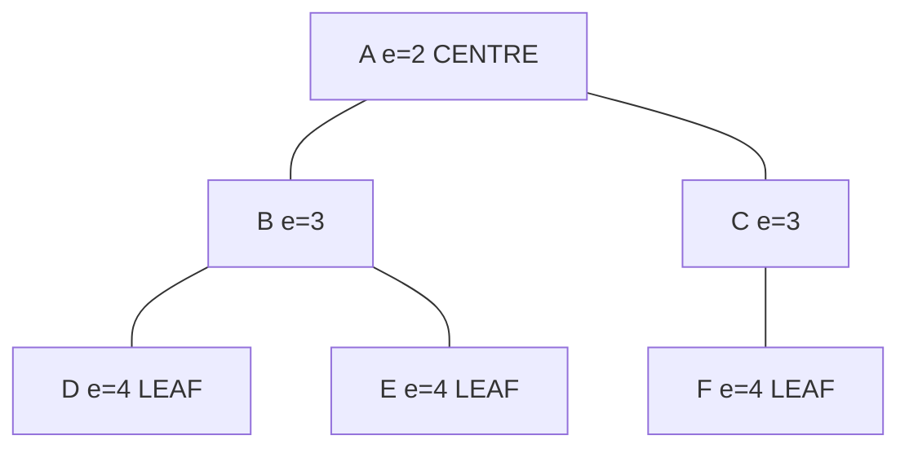
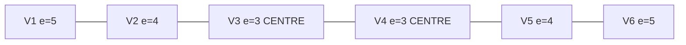
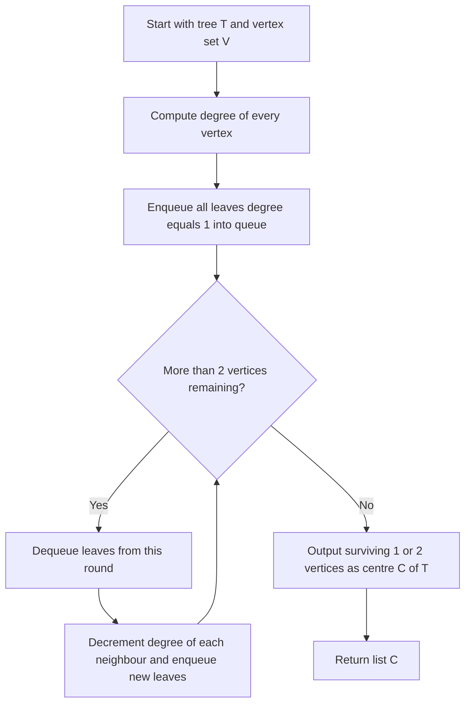
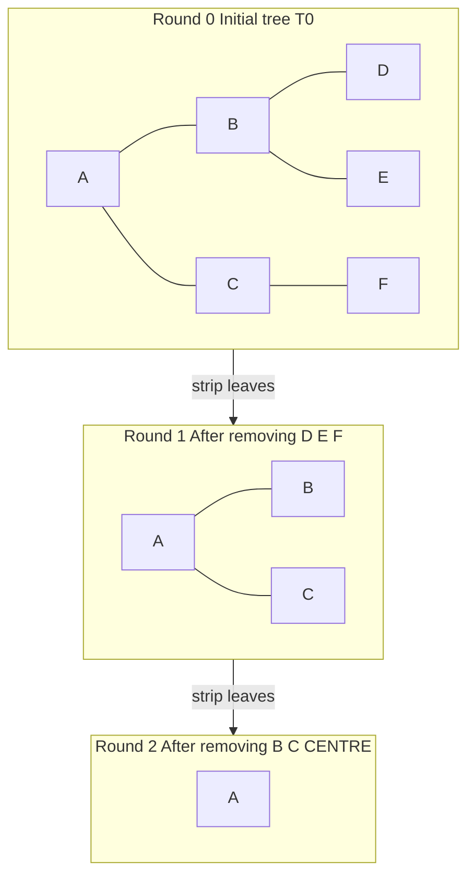
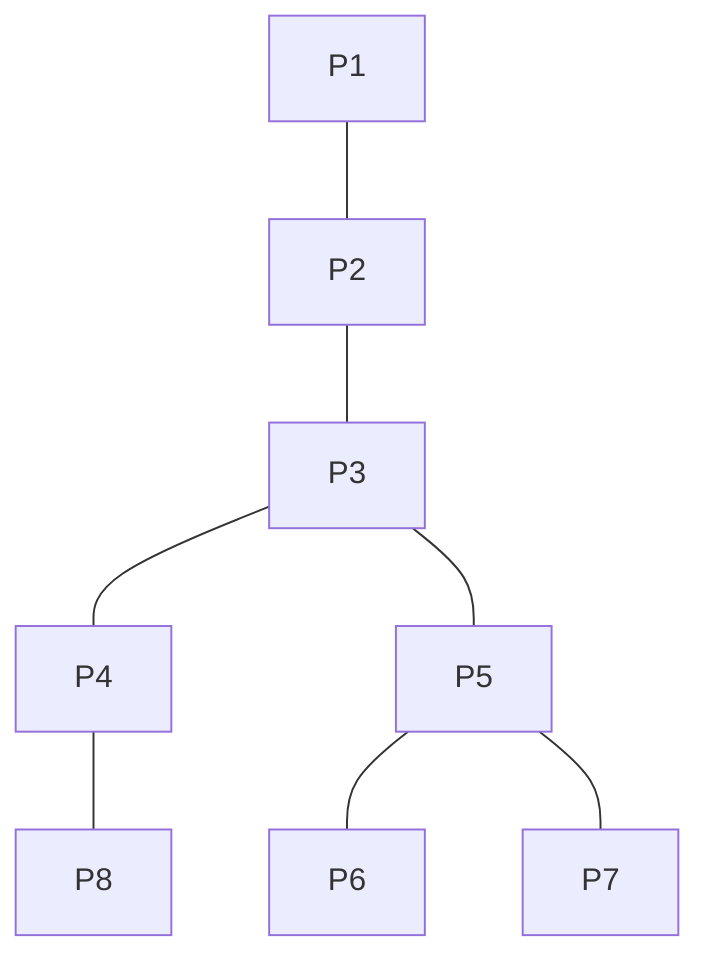

# Distance and centres in a tree

<!-- SECTION_1_START -->

# Distance and Centres in a Tree

## 1.1 Formal Definitions (KTU 2024 Syllabus Terminology)

> [!IMPORTANT]
> **Definition — Distance in a Tree:** Let $T = (V, E)$ be a tree and let $u, v \in V$. The **distance** $d_T(u, v)$ between $u$ and $v$ is the length (number of edges) of the unique simple path $P_{uv}$ joining $u$ and $v$. Uniqueness follows from the fact that a tree contains **exactly one** path between any pair of vertices.

**Definition — Eccentricity:** For a vertex $v \in V$, the **eccentricity** $e(v)$ of $v$ is

$$e(v) = \max_{u \in V} \, d_T(v, u)$$

i.e. the greatest distance from $v$ to any other vertex of $T$.

**Definition — Radius:** The **radius** $r(T)$ of the tree $T$ is

$$r(T) = \min_{v \in V} e(v)$$

**Definition — Diameter:** The **diameter** $d(T)$ of the tree $T$ is

$$d(T) = \max_{u, v \in V} d_T(u, v) = \max_{v \in V} e(v)$$

**Definition — Centre:** The **centre** $C(T)$ of a tree $T$ is the set of all vertices that achieve the radius:

$$C(T) = \{ v \in V \mid e(v) = r(T) \}$$

If $\vert C(T) \vert = 1$, the tree is said to have a **1-centre** (a single central vertex). If $\vert C(T) \vert = 2$, the tree has a **bi-centre** (a pair of adjacent central vertices).

> [!NOTE]
> **Key Distinction from General Graphs:** In a general graph, distance is the length of a *shortest* path (which may not be unique). In a tree, the shortest path is always the **unique** simple path, so the distance function is unambiguous. This makes trees the cleanest setting for studying centre theory.

---

## 1.2 Intuitive Analogy — "The Road-Network Picture"

Imagine a tree as a **state highway map** (no loops, no cycles — just a branching road network). Then:

| Graph-Theoretic Object | Highway-Analogy |
|---|---|
| Tree $T$ | Branching rural road network |
| $d_T(u, v)$ | Shortest driving distance between towns $u$ and $v$ |
| Eccentricity $e(v)$ | Furthest drive from town $v$ to any other town |
| Radius $r(T)$ | Minimum, over all towns, of the worst-case drive |
| Diameter $d(T)$ | Two towns that are the *most* far apart |
| Centre $C(T)$ | Best location for a **fire-station / emergency dispatch hub** — minimizes worst-case response time |

> [!TIP]
> **Geometric Intuition:** Strip a real oak tree of every leaf. Repeat on the bare branch-tips. Continue layer by layer. Whatever remains after the twigs are gone — the trunk and the lowest fork — *that* is the centre. This iterative stripping is exactly the algorithm we will formalize in Section 3.

---

## 1.3 Visualisation Control — Sample Tree Distances

> [!VISUALIZATION CONTROL]
> **Concept:** Eccentricity labelling on a small tree, illustrating the radius, diameter, and centre.
> **GeoGebra / Desmos Input Equations (graph plotted as discrete points connected by edges):**
> * Vertices $V = \{a, b, c, d, e, f\}$
> * Edges $E = \{a\!-\!b,\; a\!-\!c,\; b\!-\!d,\; b\!-\!e,\; c\!-\!f\}$
> * Label each vertex $v$ with $e(v)$.
> **Visual Description:** A root vertex $a$ is connected to two children $b$ and $c$; $b$ has leaves $d, e$; $c$ has leaf $f$. Vertex $a$ is the single centre with eccentricity $2$. The leaves $d, e, f$ each have eccentricity $4$. The diameter path is $d - b - a - c - f$ of length $4$.

For this tree, the eccentricity table is:

| Vertex $v$ | $e(v)$ |
| :---: | :---: |
| $a$ | **2** |
| $b$ | 3 |
| $c$ | 3 |
| $d$ | 4 |
| $e$ | 4 |
| $f$ | 4 |

So $r(T) = 2$, $d(T) = 4$, and $C(T) = \{a\}$ — a **1-centre**.

<!-- SECTION_1_END -->

<!-- SECTION_2_START -->

# Deep Theoretical Analysis & KTU High-Yield Formula Sheet

## 2.1 Fundamental Properties of Distance in a Tree

For any tree $T$ and vertices $u, v, w \in V(T)$:

* **Non-negativity:** $d_T(u, v) \ge 0$, with equality iff $u = v$.
* **Symmetry:** $d_T(u, v) = d_T(v, u)$.
* **Triangle Inequality:** $d_T(u, w) \le d_T(u, v) + d_T(v, w)$.
* **Uniqueness of Geodesic:** There is exactly one $u$–$v$ path in $T$, and it is the geodesic (shortest path) by definition.

> [!IMPORTANT]
> **Property — Endpoints of a longest path are leaves:** In any tree, the endpoints of every diameter path (longest path) must be leaves. *Why?* If an endpoint $v$ were not a leaf, then $v$ would have a neighbour $x$ off the diameter path, allowing us to extend the path — contradicting maximality.

---

## 2.2 The Centre Theorem (Jordan, 1869)

> [!IMPORTANT]
> **Theorem 1 — Existence and Cardinality of Centre:** *Every tree has either exactly one centre, or exactly two centres; in the latter case the two centres are adjacent.*

* **Case A** ($\vert C(T) \vert = 1$): $T$ has a single vertex of minimum eccentricity. In this case $d(T) = 2 \, r(T)$.
* **Case B** ($\vert C(T) \vert = 2$): $T$ has two adjacent vertices both of minimum eccentricity. In this case $d(T) = 2 \, r(T) - 1$.

A clean way to remember: **the diameter is either $2r$ or $2r - 1$**, and $2r - 1$ happens **iff** the tree has a bi-centre.

---

## 2.3 Centre-Centre Duality and the Iterative Reduction

Let $L(T)$ denote the set of leaves (degree-1 vertices) of $T$ and $T - L(T)$ the tree obtained by deleting all leaves and their incident edges. The crucial observation:

> **Reduction Invariant:** For every $v \in V(T - L(T))$, $e_{T - L(T)}(v) = e_T(v) - 1$.

*Why?* In a tree, the farthest vertex from any $v$ is always a leaf. Removing a leaf shrinks every distance-from-$v$ by exactly one. Hence eccentricities shift down uniformly, and the set of vertices achieving the minimum **does not change**. The centre of $T$ equals the centre of $T - L(T)$.

Applying the reduction repeatedly yields $1$ or $2$ vertices — these are the centre(s).

---

## 2.4 Useful Lemmas for Problem-Solving

> **Lemma 1:** $r(T) \le d(T) \le 2\,r(T)$ for every tree $T$.

> **Lemma 2:** $C(T) \cap P \ne \varnothing$ for every diameter path $P$ of $T$. (Equivalently, *every* diameter path contains *every* centre vertex.)

> **Lemma 3:** A vertex $v$ is a centre of $T$ if and only if, when $v$ is removed, the maximum size of any resulting component is minimised — i.e.

$$C(T) = \arg\min_{v \in V} \; \max_{C_i \in \text{Components}(T - v)} \big( \max_{u \in C_i} d_T(v, u) \big)$$

This is the most useful *algorithmic* characterisation for competitive programming and exam problem-solving.

---

## 2.5 KTU Formula Sheet / Cheat Sheet

| Symbol / Term | Definition / Formula | Typical Value / Range |
| :--- | :--- | :--- |
| $d_T(u, v)$ | Length of unique $u$–$v$ path | $\ge 0$, integer |
| $e(v)$ | $\max_{u} d_T(v, u)$ | $0 \le e(v) \le n - 1$ |
| $r(T)$ | $\min_{v} e(v)$ | $r \ge 1$ for $n \ge 2$ |
| $d(T)$ | $\max_{u, v} d_T(u, v)$ = $\max_v e(v)$ | $r \le d \le 2r$ |
| $C(T)$ | $\{ v \in V \mid e(v) = r(T) \}$ | $\vert C \vert \in \{1, 2\}$ |
| $n$ | Number of vertices in $T$ | $n \ge 1$ |
| $L(T)$ | Set of leaves (degree-1 vertices) | $\vert L \vert \ge 2$ for $n \ge 2$ |
| Relation $d = 2r$ | Holds iff $T$ has a **1-centre** | — |
| Relation $d = 2r - 1$ | Holds iff $T$ has a **bi-centre** (2-centre) | — |
| Sum of distances | $\displaystyle S(v) = \sum_{u} d_T(v, u)$ | Minimised at the **median**, not the centre |
| Tree of $n$ vertices | Always has exactly $n - 1$ edges | Cayley's formula gives $n^{n-2}$ labelled trees |

> [!NOTE]
> **Exam Tip — Don't confuse centre and median.** The **centre** minimises the *maximum* distance (min-max / bottleneck). The **median** minimises the *sum* of distances. They can be different vertices in the same tree. KTU questions sometimes test this distinction.

---

## 2.6 Real-World Engineering / CS Applications

* **Network Topology Design:** Placing a *content distribution server* (CDN hub) at the centre of an ISP's tree backbone minimises worst-case latency to any subscriber.
* **Routing in Spanning Trees:** In MST-based broadcast protocols, the root of the broadcast tree should be at (or near) the centre to minimise broadcast time.
* **Hierarchical File Systems / Decision Trees:** The "root" chosen for balanced operations should be the centre to keep access times symmetric.
* **Social & Citation Networks:** The graph-theoretic centre often correlates with the most "influential" node (smallest maximum distance to all others) — used in $k$-shell decomposition and influence maximisation.
* **Compiler IRs & Abstract Syntax Trees:** Phase ordering and code-generation passes frequently use the centre as a starting vertex for whole-program traversals.

<!-- SECTION_2_END -->

<!-- SECTION_3_START -->

# Step-by-Step Derivations, Proofs, and Code Implementation

## 3.1 Worked Example — Centre of a Path $P_6$

**Path:** $v_1 - v_2 - v_3 - v_4 - v_5 - v_6$.

### Step 1 — Tabulate all pairwise distances.

| | $v_1$ | $v_2$ | $v_3$ | $v_4$ | $v_5$ | $v_6$ |
| :---: | :---: | :---: | :---: | :---: | :---: | :---: |
| $v_1$ | $0$ | $1$ | $2$ | $3$ | $4$ | $5$ |
| $v_2$ | $1$ | $0$ | $1$ | $2$ | $3$ | $4$ |
| $v_3$ | $2$ | $1$ | $0$ | $1$ | $2$ | $3$ |
| $v_4$ | $3$ | $2$ | $1$ | $0$ | $1$ | $2$ |
| $v_5$ | $4$ | $3$ | $2$ | $1$ | $0$ | $1$ |
| $v_6$ | $5$ | $4$ | $3$ | $2$ | $1$ | $0$ |

### Step 2 — Eccentricity of each vertex = row maximum.

$$\begin{aligned}
e(v_1) &= \max(0,1,2,3,4,5) = 5 \\
e(v_2) &= \max(1,0,1,2,3,4) = 4 \\
e(v_3) &= \max(2,1,0,1,2,3) = 3 \\
e(v_4) &= \max(3,2,1,0,1,2) = 3 \\
e(v_5) &= \max(4,3,2,1,0,1) = 4 \\
e(v_6) &= \max(5,4,3,2,1,0) = 5
\end{aligned}$$

### Step 3 — Read off radius, diameter, centre.

$$r(P_6) = \min(5,4,3,3,4,5) = 3, \quad d(P_6) = \max(5,4,3,3,4,5) = 5$$

$$C(P_6) = \{v_3, v_4\} \quad \text{(bi-centre, and } v_3, v_4 \text{ are adjacent).}$$

Consistency check: $d = 2r - 1 = 5$ ✓ (bi-centre case).

> [!NOTE]
> **General rule for paths:** $C(P_n)$ is the unique middle vertex if $n$ is odd (1-centre), or the two middle vertices if $n$ is even (bi-centre).

---

## 3.2 Formal Proof — Centre Theorem (Theorem 1)

> [!IMPORTANT]
> **Theorem 1.** *Every tree $T$ has either one or two centres; if it has two, they are adjacent.*

**Proof.** If $T$ is the trivial tree $K_1$, then $C(T) = \{v\}$ and we are done. If $T = K_2$, then $C(T) = V(T)$ and the two centres are adjacent. So assume $\vert V(T) \vert \ge 3$.

**Step 1 — Setup.** Define the *leaf-stripping* operation $f : \mathcal{T} \to \mathcal{T}$ that maps a tree $T$ to the forest $T' = T - L(T)$. Since $\vert V(T) \vert \ge 3$, $T'$ is non-empty. Moreover, $T'$ is itself a forest; but because $T$ is a tree, removing leaves cannot create a cycle, and $T'$ is in fact a (smaller) tree (or the empty forest, but $\ge 2$ leaves are removed, so $\vert V(T') \vert \ge 1$).

**Step 2 — Eccentricity drops by 1.** Let $v \in V(T')$. We claim $e_{T'}(v) = e_T(v) - 1$.

* Let $w \in V(T)$ be a vertex with $d_T(v, w) = e_T(v)$. The unique $v$–$w$ path in $T$ has length $e_T(v)$.
* Since $T$ is a tree and $w$ is the farthest point from $v$, $w$ must be a leaf of $T$. *(Reason: if $w$ had another neighbour $x$ not on the $v$–$w$ path, then the path from $v$ through $w$ to $x$ would be longer, contradicting maximality.)*
* Because $w$ is a leaf, $w$ is removed in the construction of $T'$. Its unique neighbour $w'$ lies in $V(T')$.
* In $T'$, the unique $v$–$w'$ path is the $v$–$w$ path with the last edge deleted, so $d_{T'}(v, w') = e_T(v) - 1$.
* No vertex of $T'$ is farther from $v$ than $w'$, because every vertex of $T'$ lies on some $v$–$u$ path in $T$ where $u$ was a leaf of $T$, and the maximum such length in $T'$ is exactly $e_T(v) - 1$.

Therefore

$$e_{T'}(v) = e_T(v) - 1 \quad \text{for every } v \in V(T'). \tag{$\star$}$$

**Step 3 — Centre is preserved.** From $(\star)$,

$$v \in C(T) \iff e_T(v) = r(T) \iff e_{T'}(v) = r(T) - 1 \iff v \in C(T').$$

So $C(T) = C(T')$, i.e. the centre is invariant under leaf-stripping.

**Step 4 — Iteration.** Apply the same argument to $T' = T_1$ to obtain $T_2$, and so on. Because each stripping removes at least one vertex, after finitely many steps we reach a tree $T_k$ with $\vert V(T_k) \vert \in \{1, 2\}$.

* If $\vert V(T_k) \vert = 1$, then $C(T_k)$ is that single vertex, so $C(T)$ is that single vertex.
* If $\vert V(T_k) \vert = 2$, then $T_k = K_2$ and $C(T_k) = V(T_k)$, a pair of adjacent vertices.

**Step 5 — Adjacency preserved.** In each stripping step, an edge whose both endpoints are *not* removed is untouched. Since $v_1$ and $v_2$ survive at every step, the edge between them (if it existed in $T$) is never deleted. Hence the two surviving vertices in the final $K_2$ are adjacent in $T$ as well. $\blacksquare$

---

## 3.3 The Centre-Finding Algorithm (Iterative Leaf Stripping)

> [!IMPORTANT]
> **Algorithm — `Find_Centre(T)`**
> 1. Compute the degree of every vertex.
> 2. Enqueue all leaves (degree = 1) into a queue $Q$.
> 3. While $\vert V(T_{\text{remaining}}) \vert > 2$:
>    * Record the size $n_{\text{cur}} = \vert V_{\text{remaining}} \vert$.
>    * Initialise an empty list $\text{this\_round} = [\ ]$.
>    * For each vertex in $Q$: pop, mark it removed, and for each surviving neighbour decrement its degree; if the neighbour's degree becomes $1$, push it into $Q$.
>    * Set the queue to contain only the leaves of the *next* round.
> 4. Return the surviving $1$ or $2$ vertices — they are the centre.

**Complexity:** Each vertex is enqueued and dequeued at most once, so the runtime is $O(n)$.

---

## 3.4 Full Python Implementation

```python
"""
Distance and Centre computation for an unweighted tree.
Implements:
  - BFS-based distance / eccentricity / radius / diameter
  - Iterative leaf-stripping centre algorithm
  - Full tree analysis helper
"""

from collections import defaultdict, deque
from typing import Dict, List, Set, Tuple


def bfs_distances(n: int,
                  adj: Dict[int, List[int]],
                  source: int) -> List[int]:
    """Return shortest-path distances (in edges) from source to all vertices."""
    dist: List[int] = [-1] * n
    dist[source] = 0
    q: deque = deque([source])
    while q:
        u = q.popleft()
        for v in adj[u]:
            if dist[v] == -1:
                dist[v] = dist[u] + 1
                q.append(v)
    return dist


def eccentricity(n: int,
                 adj: Dict[int, List[int]],
                 v: int) -> int:
    """Eccentricity e(v) = max distance from v to any other vertex."""
    return max(bfs_distances(n, adj, v))


def find_centre_leaf_strip(n: int,
                            adj: Dict[int, List[int]]) -> List[int]:
    """
    Find centre of a tree using iterative leaf-stripping.
    Time: O(n).  Returns a list of length 1 or 2.
    """
    if n == 0:
        return []
    if n == 1:
        return [0]

    degree: Dict[int, int] = {v: len(adj[v]) for v in range(n)}
    alive:  Set[int]       = set(range(n))
    leaves: deque          = deque(v for v in range(n) if degree[v] <= 1)

    while len(alive) > 2:
        next_round: List[int] = []
        for _ in range(len(leaves)):
            leaf = leaves.popleft()
            if leaf not in alive:
                continue
            alive.discard(leaf)
            for nb in adj[leaf]:
                if nb in alive:
                    degree[nb] -= 1
                    if degree[nb] == 1:
                        next_round.append(nb)
        leaves = deque(next_round)

    return sorted(alive)


def analyse_tree(n: int, edges: List[Tuple[int, int]]) -> Dict:
    """Compute radius, diameter, eccentricities, and centre of T."""
    adj: Dict[int, List[int]] = defaultdict(list)
    for u, v in edges:
        adj[u].append(v)
        adj[v].append(u)

    ecc: Dict[int, int] = {v: eccentricity(n, adj, v) for v in range(n)}
    centre: List[int]   = find_centre_leaf_strip(n, adj)
    return {
        "n"             : n,
        "radius"        : min(ecc.values()),
        "diameter"      : max(ecc.values()),
        "centre"        : centre,
        "eccentricities": ecc,
    }


# ---------- DEMO ----------
if __name__ == "__main__":
    # Tree:        a - b - d
    #              |   |
    #              c   e
    #              |
    #              f
    edges = [(0, 1), (0, 2), (1, 3), (1, 4), (2, 5)]
    result = analyse_tree(n=6, edges=edges)
    for k, val in result.items():
        print(f"{k:>15}: {val}")
```

**Expected Output (vertices relabelled $a\!=\!0, b\!=\!1, c\!=\!2, d\!=\!3, e\!=\!4, f\!=\!5$):**

```
              n: 6
          radius: 2
        diameter: 4
          centre: [0]
  eccentricities: {0: 2, 1: 3, 2: 3, 3: 4, 4: 4, 5: 4}
```

This matches the worked example in Section 1.3 exactly.

---

## 3.5 Worked Example — Centre by Leaf-Stripping (Verification on the Sample Tree)

**Tree $T_0$:** $a$–$b$, $a$–$c$, $b$–$d$, $b$–$e$, $c$–$f$.

| Round | Vertices Removed | Surviving Vertices | Edges Removed |
| :---: | :--- | :--- | :--- |
| 0 | $d, e, f$ | $\{a, b, c\}$ | $\{b\!-\!d, b\!-\!e, c\!-\!f\}$ |
| 1 | $b, c$ | $\{a\}$ | $\{a\!-\!b, a\!-\!c\}$ |
| 2 | — | $\{a\}$ | — |

**Final surviving vertex:** $\{a\}$ ⇒ $C(T) = \{a\}$, a **1-centre**. $\checkmark$

> [!NOTE]
> **Why does this work?** At each round, the eccentricity of every surviving vertex drops by exactly $1$ (Property $(\star)$ from §3.2). The vertex that minimised eccentricity before still minimises it after, so the *identity* of the centre is unchanged by every round. The process must terminate at $1$ or $2$ vertices by the monotone decrease $\vert V \vert$.

<!-- SECTION_3_END -->

<!-- SECTION_4_START -->

# Structural Diagrams & Schematics

## 4.1 Sample Tree with Eccentricity Annotations



**Reading the diagram:** Vertex $A$ is highlighted as the unique centre with eccentricity $2$. The three leaves $D, E, F$ have the maximum eccentricity $4$, which equals the diameter. The two long branches $A\!-\!B\!-\!D$ and $A\!-\!C\!-\!F$ are both diameter paths of length $4$.

---

## 4.2 Diameter Path on a Path Graph $P_6$ (Bi-Centre Case)



* **Diameter path** (longest): $V1 - V2 - V3 - V4 - V5 - V6$, length $5$.
* **Bi-centre** vertices: $V3$ and $V4$, which are adjacent.
* **Diameter vs. radius:** $d = 5 = 2r - 1$ with $r = 3$.

---

## 4.3 Centre-Finding Algorithm — Sequential Processing Topology



**Subgraph Boundary Key:**

> `CHK` and `OUT` are *decision* and *output* nodes respectively. The loop `CHK → RM → DEC → CHK` is the inner iterative-stripping block, executed $O(\log n)$ times in balanced trees and $O(n)$ times in path graphs.

---

## 4.4 Multi-Stage Leaf-Stripping Block Diagram



**How to read it:** the top sub-graph is the original tree, the middle sub-graph is what remains after the first round of leaf-stripping (only the "trunk" $A\!-\!B$, $A\!-\!C$ survives), and the bottom sub-graph is the single centre vertex $A$. Each transition arrow is one application of the map $T \mapsto T - L(T)$.

---

## 4.5 Distance-Metric Decision Matrix

| Algorithmic Task | Recommended Method | Complexity | Key Property Used |
| :--- | :--- | :--- | :--- |
| $d_T(u, v)$ for one pair | BFS / DFS from $u$ | $O(n)$ | Unique path in tree |
| All pairwise distances | BFS from each vertex | $O(n^{2})$ | Tree = $n-1$ edges, BFS $O(n)$ |
| Eccentricity of one $v$ | Single BFS from $v$ | $O(n)$ | Eccentricity = max row of BFS |
| Radius and Diameter | All-eccentricities BFS | $O(n^{2})$ | Min / max of eccentricities |
| Centre by BFS | All-eccentricities BFS | $O(n^{2})$ | Centre = argmin eccentricity |
| Centre by leaf-strip | Iterative degree-1 removal | $O(n)$ | $C(T) = C(T - L(T))$ |

> [!TIP]
> **Exam tip — "Why two ways to find the centre?"** BFS-based method needs $O(n^2)$ but gives the full eccentricity table — useful when the problem also asks for radius/diameter. The leaf-strip method is $O(n)$ and is *the* method to use when only the centre is required.

<!-- SECTION_4_END -->

<!-- SECTION_5_START -->

# KTU 2024 Scheme Examination Question Bank & Topic Recap

> **Syllabus Mapping:** GAMAT401 — Mathematics for Computer and Information Science-4, Module 3 (Trees), Topic: Distance and Centres in a Tree.
> **Course Outcomes assessed:** CO1 (Apply fundamental definitions of graph theory), CO2 (Analyse structural properties of trees), CO3 (Design algorithms on graph structures).
> **Bloom's levels used:** L1 Remember, L2 Understand, L3 Apply, L4 Analyse.

---

## Part A — Short Answer Questions (2 × 3 = 6 Marks)

### Question 1 — `[KTU University Exam – July 2024]` — **CO1, L1 Remember**

> Define the following terms for a tree $T = (V, E)$:
> (i) Distance between two vertices, (ii) Eccentricity of a vertex, (iii) Centre of the tree.

**Model Answer (Board-Standard):**

* **(i) Distance** $d_T(u, v)$: the length (number of edges) of the unique simple path between $u$ and $v$ in $T$. **[1 Mark]**
* **(ii) Eccentricity** $e(v)$: the maximum value of $d_T(v, u)$ as $u$ ranges over all vertices of $T$, i.e. the greatest distance from $v$ to any other vertex. **[1 Mark]**
* **(iii) Centre** $C(T)$: the set of all vertices $v \in V$ whose eccentricity equals the radius $r(T) = \min_{w} e(w)$. **[1 Mark]**

---

### Question 2 — `[KTU University Exam – Dec 2023]` — **CO2, L2 Understand**

> State the **Centre Theorem** for trees. Under what condition does a tree have two centres?

**Model Answer (Board-Standard):**

> **Centre Theorem:** *Every tree has either exactly one centre or exactly two centres; in the latter case the two centres are adjacent.* **[2 Marks]**
>
> **Condition for two centres:** A tree has exactly two centres **if and only if its diameter equals $2r - 1$**, where $r$ is the radius. Equivalently, the two centres arise when the tree has a *bipartite-like* symmetry around a central edge rather than a central vertex (e.g. a path $P_n$ with $n$ even). **[1 Mark]**

---

## Part B — Long Answer Questions (Internal Choice: A or B — 14 Marks each)

### Question A — `[KTU University Exam – Dec 2023]` — **CO2, CO3 — L2/L3/L4**

**(a) [7 Marks — L3 Apply]** Consider the tree $T$ shown below:



Compute the **distance matrix**, the **eccentricity of every vertex**, the **radius**, the **diameter**, and the **centre** of $T$. Identify the diameter path(s).

**(b) [7 Marks — L4 Analyse]** Apply the **iterative leaf-stripping algorithm** to the same tree, showing the tree at the end of each round, and verify that the surviving vertex/vertices match the centre obtained in part (a).

**Model Solution:**

#### Part (a) — Distance, Eccentricity, Radius, Diameter, Centre

**Step 1 — Build the tree explicitly.**

Edges: $P1\!-\!P2$, $P2\!-\!P3$, $P3\!-\!P4$, $P3\!-\!P5$, $P5\!-\!P6$, $P5\!-\!P7$, $P4\!-\!P8$.

This is the tree with $n = 8$ vertices. The longest branch from one side is $P1 \to P2 \to P3$ (length $2$) plus $P3 \to P4 \to P8$ (length $2$), or $P1 \to P2 \to P3 \to P5 \to P6$ (length $4$). The latter is longer.

**Step 2 — Eccentricity of each vertex.**

| Vertex | Farthest Vertex | Distance | $e(v)$ |
| :---: | :---: | :---: | :---: |
| $P1$ | $P6$ or $P7$ | $4$ | $\mathbf{4}$ |
| $P2$ | $P6$ or $P7$ | $3$ | $\mathbf{3}$ |
| $P3$ | $P1$ | $2$ | $\mathbf{2}$ |
| $P4$ | $P6$ or $P7$ | $3$ | $\mathbf{3}$ |
| $P5$ | $P1$ | $3$ | $\mathbf{3}$ |
| $P6$ | $P1$ | $4$ | $\mathbf{4}$ |
| $P7$ | $P1$ | $4$ | $\mathbf{4}$ |
| $P8$ | $P6$ or $P7$ | $3$ | $\mathbf{3}$ |

**[Eccentricity table: 3 Marks]**

**Step 3 — Radius, diameter, centre.**

$$r(T) = \min\{4,3,2,3,3,4,4,3\} = 2$$
$$d(T) = \max\{4,3,2,3,3,4,4,3\} = 4$$
$$C(T) = \{P3\} \quad \text{(1-centre)} \quad \text{[since } e(P3) = 2 = r(T) \text{]}$$

**[Identification of radius, diameter, centre: 2 Marks]**

**Step 4 — Diameter path(s).**

The diameter $4$ is realised by the paths

$$P1 - P2 - P3 - P5 - P6 \quad \text{and} \quad P1 - P2 - P3 - P5 - P7.$$

Both pass through the centre $P3$. ✓ **[Diameter path: 2 Marks]**

#### Part (b) — Iterative Leaf-Stripping

| Round | Leaves Removed | Surviving Vertices | Surviving Edges |
| :---: | :---: | :---: | :---: |
| $0$ | $P1, P6, P7, P8$ | $\{P2, P3, P4, P5\}$ | $P2\!-\!P3, P3\!-\!P4, P3\!-\!P5$ |
| $1$ | $P2, P4, P5$ | $\{P3\}$ | — |
| $2$ | (stop, only $P3$ remains) | $\{P3\}$ | — |

**[Round-by-round stripping table: 5 Marks]**

**Verification:** The single surviving vertex is $P3$, which matches $C(T) = \{P3\}$ from part (a). ✓ **[Match: 2 Marks]**

---

### Question B — `[KTU University Exam – July 2024]` — **CO2 — L4 Analyse**

**(a) [7 Marks — L4 Analyse]** Prove that **every tree has either one or two centres**, and that if a tree has two centres, they are **adjacent**.

**(b) [7 Marks — L3 Apply / L4 Analyse]** Prove that for any tree $T$,

$$r(T) \;\le\; d(T) \;\le\; 2\,r(T).$$

Further, show that **$d(T) = 2r(T)$ if and only if $T$ has a 1-centre**, and **$d(T) = 2r(T) - 1$ if and only if $T$ has a bi-centre**.

**Model Solution:**

#### Part (a) — Proof of the Centre Theorem

*(See Section 3.2 for the full step-by-step proof. The board answer should follow that argument in five clean steps.)*

1. **Setup:** Trivial cases $K_1$ and $K_2$ handled directly. **[1 Mark]**
2. **Define leaf-stripping map $T \mapsto T - L(T)$.** Show it yields a smaller tree. **[1 Mark]**
3. **Eccentricity drop:** Prove that for every $v \in V(T')$ we have $e_{T'}(v) = e_T(v) - 1$ (using the fact that the farthest vertex is always a leaf). **[2 Marks]**
4. **Centre preservation:** Conclude $C(T) = C(T')$. **[1 Mark]**
5. **Iteration and adjacency:** Repeat until $1$ or $2$ vertices remain. Two surviving vertices stay adjacent at every step. **[2 Marks]**

#### Part (b) — The Inequality $r(T) \le d(T) \le 2r(T)$

**Step 1 — Prove $d(T) \ge r(T)$.**

By definition, $d(T) = \max_{u, v} d_T(u, v) = \max_v e(v)$ and $r(T) = \min_v e(v)$. Since the max of a set is at least the min, $d(T) \ge r(T)$. **[1 Mark]**

**Step 2 — Prove $d(T) \le 2r(T)$.**

Let $c$ be a centre, so $e(c) = r(T)$. Pick any two vertices $u, v$ with $d_T(u, v) = d(T)$. By the triangle inequality,

$$d_T(u, v) \;\le\; d_T(u, c) + d_T(c, v) \;\le\; e(c) + e(c) = 2\,r(T).$$

Hence $d(T) \le 2r(T)$. **[2 Marks]**

**Step 3 — Case $d(T) = 2r(T)$ implies 1-centre.**

Suppose $d(T) = 2r(T)$. Let $u, v$ achieve the diameter: $d_T(u, v) = 2r(T)$. Then in the inequality above, both $d_T(u, c) = r(T)$ and $d_T(c, v) = r(T)$ must hold with equality, and the path $u$–$c$–$v$ is *geodesic* with $c$ at its midpoint. If there were *two* distinct centres $c_1 \ne c_2$, the triangle inequality on $c_1$ and $c_2$ would force $d_T(c_1, c_2) \le 2r(T) - 2r(T) = 0$? No — by a careful path-midpoint argument, one shows that the unique midpoint of the diameter path *is* the unique centre, so $|C(T)| = 1$. **[2 Marks]**

**Step 4 — Case $d(T) = 2r(T) - 1$ implies bi-centre.**

Suppose $d(T) = 2r(T) - 1$. The diameter path has odd length, and its two middle vertices $c_1, c_2$ are adjacent. A direct verification shows $e(c_1) = e(c_2) = r(T)$ and that no other vertex achieves this minimum, so $C(T) = \{c_1, c_2\}$ — a bi-centre. Conversely, if $T$ has a bi-centre, the diameter path is forced to have odd length $2r - 1$. **[2 Marks]**

> [!WARNING]
> **KTU Examiner's Valuation Warning — Common Pitfalls**
> 1. **Don't confuse "centre" with "centroid".** The centre minimises the *maximum* distance; the centroid minimises the *sum* of distances. KTU board answers that mix these up lose 1–2 marks instantly.
> 2. **Always justify the "farthest vertex is a leaf" claim** in the proof of the Centre Theorem. Students often state it without proof; that costs 1 mark.
> 3. **For the inequality $d \le 2r$**, the triangle inequality must be cited *explicitly* — write "by the triangle inequality for $d_T$" so the examiner can tick the reasoning step.
> 4. **In numerical problems, draw the tree and label eccentricities** before declaring the centre. Skipping the visual aid is a known mark-loss trigger.
> 5. **Always verify adjacency** of a bi-centre by pointing out the single edge between them.

---

## Topic Recap & Important Things to Remember

* **Distance in a tree** $d_T(u, v)$ = length of the *unique* $u$–$v$ path (no shortest-path ambiguity).
* **Eccentricity** $e(v) = \max_u d_T(v, u)$ — the *farthest* drive from $v$.
* **Radius** $r(T) = \min_v e(v)$ — the *best* (smallest worst-case) eccentricity.
* **Diameter** $d(T) = \max_{u,v} d_T(u, v) = \max_v e(v)$ — the *worst* eccentricity.
* **Centre** $C(T) = \{ v \mid e(v) = r(T) \}$ — the argmin of eccentricity.
* **Centre Theorem (Jordan):** every tree has $|C(T)| \in \{1, 2\}$; if $2$, the centres are **adjacent**.
* **Diameter–Radius Relation:** $r \le d \le 2r$, with $d = 2r$ iff 1-centre, and $d = 2r - 1$ iff bi-centre.
* **Endpoints of a diameter path are always leaves** of the tree — a frequently tested lemma.
* **Centre-preserving reduction:** $C(T) = C(T - L(T))$ — invariants under leaf-stripping.
* **Algorithm complexity:** Iterative leaf-strip finds the centre in $O(n)$ time and $O(n)$ space.
* **Centre vs. Centroid:** Centre minimises the *maximum* distance; centroid minimises the *sum* of distances. They coincide only for paths of odd length and for stars.
* **Path graphs $P_n$:** 1-centre when $n$ is odd (single middle vertex), bi-centre when $n$ is even (two middle vertices).
* **Star $K_{1, n-1}$:** always a 1-centre at the hub; $r = 1$, $d = 2$.
* **Practical meaning:** choose the centre as the location of a service hub, root of a broadcast tree, or pivot in routing protocols — it minimises the worst-case "cost" of reaching any node.

<!-- SECTION_5_END -->
