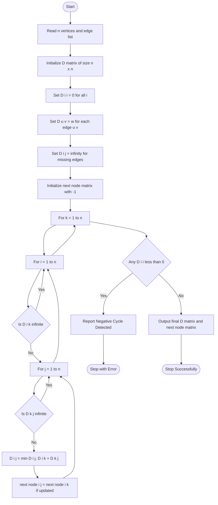
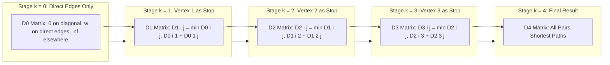
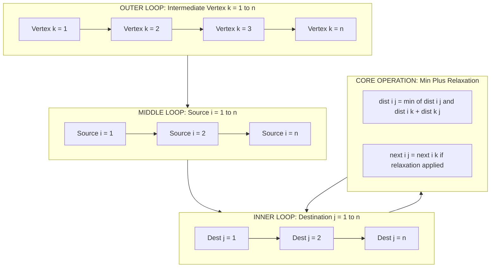
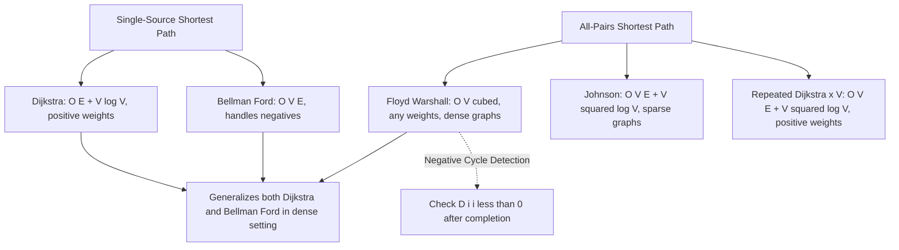

# Floyd-Warshall shortest path algorithm

<!-- SECTION_1_START -->
# Floyd-Warshall Shortest Path Algorithm

## 1. Core Technical Definition

> [!IMPORTANT]
> **Formal Definition (KTU 2024 Syllabus Terminology):**
> The **Floyd-Warshall Algorithm** is a dynamic programming-based algorithm that computes the *all-pairs shortest paths* (APSP) in a weighted directed graph (with positive or negative edge weights, but no negative cycles). It systematically considers intermediate vertices from the vertex set $V = \{v_1, v_2, \dots, v_n\}$ and iteratively refines the shortest path matrix using the **optimal substructure** property. It runs in $\Theta(V^3)$ time regardless of the graph's edge density, making it exceptionally elegant for dense graphs.

> [!NOTE]
> **Syllabus Highlight (GAMAT401 - Module 3: Trees):**
> Although the module is titled "Trees," the KTU syllabus specifically includes the **Floyd-Warshall algorithm** under this module as a generalization of shortest path tree concepts. Students must understand its relation to the Bellman-Ford (single-source) approach and Dijkstra's algorithm, but applied across *all* source-target pairs simultaneously.

---

## 2. Intuitive Real-World Analogy

Imagine you are planning a **multi-stop road trip across Kerala** — from Kasaragod to Thiruvananthapuram, with several intermediate cities like Kozhikode, Kochi, and Thrissur. Instead of checking the route from Kasaragod to every other city separately, you want **the shortest distance between every pair of cities** in one shot.

- **Step 1 (Direct routes only):** You first note down the direct road distances between adjacent cities.
- **Step 2 (Allow one stop):** Then you check: *"Is the Kasaragod → Kochi route shorter if I stop at Kozhikode in between?"* If yes, you **update the distance table**.
- **Step 3 (Allow two stops):** You repeat, allowing up to *two* intermediate cities.
- **Continue...** until every possible intermediate city is allowed.

This is **exactly** what Floyd-Warshall does — it relaxes paths one intermediate vertex at a time until the *shortest possible* distance for every pair is found.

> [!TIP]
> **Key Insight:** The algorithm does not restrict the *number* of intermediate vertices in the final path. By iteration $k = n$, the path can use *all* $n$ vertices as intermediates, and this is the true all-pairs shortest path.

---

## 3. Visual / Geometric Intuition

| Aspect | Geometric View |
|---|---|
| **Graph** | A weighted directed graph on $n$ vertices |
| **Distance Matrix $D^{(k)}$** | A 2D $n \times n$ matrix where $D^{(k)}[i][j]$ = shortest path from $i$ to $j$ using only vertices $\{1, 2, \dots, k\}$ as intermediates |
| **Iterations** | $n$ stages, each stage "opens" vertex $k$ as a potential pit-stop on every route |
| **Update Rule** | $D^{(k)}[i][j] = \min(D^{(k-1)}[i][j], \; D^{(k-1)}[i][k] + D^{(k-1)}[k][j])$ |

> [!VISUALIZATION CONTROL]
> **Concept:** Distance Matrix Evolution Across Iterations
> **Input Parameters (for a 4-vertex graph):**
> * Initial weights: $w(1,2)=3$, $w(2,3)=1$, $w(1,3)=10$, $w(3,4)=2$, $w(1,4)=15$
> **Visual Description:** Watch a 4×4 distance matrix shrink its values as the heatmap colors transition from red (longer distances) to green (shorter paths) across iterations $k = 1, 2, 3, 4$. The off-diagonal entries decrease monotonically as more intermediate vertices become available.
> **Tool Suggestion:** Plot via a heatmap in Python (matplotlib / seaborn) with `cmap='RdYlGn_r'`.

---

## 4. Physical Constants / Standard Metrics

- **Vertex count:** $n$ (commonly $n \leq 500$ in KTU exam problems)
- **Edge weight representation:** Integer weights; for the standard exam, $1 \leq w(u,v) \leq 100$
- **Infinity placeholder:** $\infty$ (typically $10^9$ in code, or simply $\infty$ in theory)
- **Self-loop convention:** $D[i][i] = 0$ for all $i$
- **Time complexity:** $\Theta(n^3)$ — **not affected by edge count**
- **Space complexity:** $\Theta(n^2)$ (in-place update is possible)

<!-- SECTION_1_END -->

<!-- SECTION_2_START -->
# Deep Theoretical Analysis & KTU High-Yield Formula Sheet

## 1. Theoretical Foundation: Dynamic Programming Decomposition

The Floyd-Warshall algorithm is a textbook example of **dynamic programming** because the problem exhibits:

- **Optimal Substructure:** The shortest path from $u$ to $v$ using only $\{1, 2, \dots, k\}$ as intermediate vertices either (a) does *not* pass through vertex $k$, in which case its length equals the shortest path using $\{1, \dots, k-1\}$; or (b) *does* pass through $k$, in which case it splits into a path $u \to k$ and a path $k \to v$.
- **Overlapping Subproblems:** The same shortest path queries are reused across iterations.
- **No Recursion:** Implemented iteratively (bottom-up DP).

---

## 2. The Core Recurrence Relation

> [!NOTE]
> **Master Equation of Floyd-Warshall (Board Favorite):**
> $$D^{(k)}[i][j] = \min\Big(D^{(k-1)}[i][j], \; D^{(k-1)}[i][k] + D^{(k-1)}[k][j]\Big)$$

### Interpretation of Each Term

| Term | Meaning |
|---|---|
| $D^{(k-1)}[i][j]$ | Shortest $i \to j$ path *avoiding* vertex $k$ as an intermediate |
| $D^{(k-1)}[i][k] + D^{(k-1)}[k][j]$ | Shortest $i \to k$ path + shortest $k \to j$ path, both avoiding $k$ as intermediate |
| $\min(\cdot, \cdot)$ | Choose the better of the two strategies |

> [!IMPORTANT]
> **Base Case ($k=0$):**
> $$D^{(0)}[i][j] = \begin{cases} 0 & \text{if } i = j \\ w(i, j) & \text{if } (i, j) \in E \\ \infty & \text{otherwise} \end{cases}$$

---

## 3. Algorithm Steps (Board-Style Procedure)

1. **Initialize** the distance matrix $D$ of size $n \times n$:
   - $D[i][j] = 0$ if $i = j$
   - $D[i][j] = w(i, j)$ if edge $(i, j)$ exists
   - $D[i][j] = \infty$ otherwise

2. **For** $k = 1$ **to** $n$ **(loop over intermediate vertex):**
   - **For** $i = 1$ **to** $n$ **(loop over source):**
     - **For** $j = 1$ **to** $n$ **(loop over destination):**
       - $D[i][j] = \min(D[i][j], \; D[i][k] + D[k][j])$

3. **Output** the final distance matrix $D$.

> [!TIP]
> **Matrix-based View:** In step 2, the operation $D[i][j] = \min(D[i][j], D[i][k] + D[k][j])$ is equivalent to taking the **$k$-th row and $k$-th column of the matrix** and using them to update the rest. This is a *min-plus matrix multiplication* analogy.

---

## 4. KTU High-Yield Formula / Cheat Sheet

| # | Concept | Formula / Statement | Unit / Complexity |
|---|---|---|---|
| 1 | Recurrence | $D^{(k)}[i][j] = \min(D^{(k-1)}[i][j], D^{(k-1)}[i][k] + D^{(k-1)}[k][j])$ | Iterative DP |
| 2 | Initialization | $D^{(0)}[i][i] = 0$ | Self-distance |
| 3 | Initial Edge | $D^{(0)}[i][j] = w(i, j)$ | Edge weight |
| 4 | No Edge | $D^{(0)}[i][j] = \infty$ | Sentinel value |
| 5 | Time Complexity | $\Theta(n^3)$ | Triple nested loop |
| 6 | Space Complexity | $\Theta(n^2)$ | In-place update OK |
| 7 | Path Reconstruction | Track predecessor matrix $\pi[i][j]$ updated as $\pi[i][j] = \pi[i][k]$ when $D[i][k]+D[k][j]$ is chosen | Auxiliary |
| 8 | Negative Cycle Test | After $k=n$, if any $D[i][i] < 0$, then a negative cycle exists | Detection |
| 9 | Transitive Closure Variant | Replace $\min, +$ with $\lor, \land$ for boolean reachability | Warshall's algorithm |
| 10 | Applies To | Directed weighted graphs, no negative cycles (for finite shortest paths) | Graph type |

---

## 5. Real-World Engineering Utility

| Field | Application |
|---|---|
| **Computer Networks** | Routing protocols like **OSPF** use link-state algorithms conceptually similar to Floyd-Warshall for global network topology maps |
| **Google Maps / GPS** | Precomputing all-pairs shortest travel times between city clusters for fast query response |
| **VLSI Design** | Computing minimum wirelength between all pairs of pins in circuit layout optimization |
| **Airline Scheduling** | Hub-and-spoke route optimization where every airport pair needs a quick distance estimate |
| **Social Network Analysis** | Computing closeness centrality by summing distances from every node to every other node |
| **Database Query Optimization** | Cost-based optimizers precompute join costs (graph-based) using APSP principles |
| **Game AI (Pathfinding)** | Precomputing shortest path grids for fixed map RTS games (StarCraft-style engines) |

> [!IMPORTANT]
> **Production Note:** In real systems, Floyd-Warshall is rarely run on huge sparse graphs because of its $\Theta(n^3)$ cost; instead, **Johnson's algorithm** (combination of Bellman-Ford + Dijkstra) is preferred for sparse APSP. Floyd-Warshall shines in **dense graphs** where $E \approx V^2$.

<!-- SECTION_2_END -->

<!-- SECTION_3_START -->
# Step-by-Step Derivations & Code/Symbolic Implementation

## 1. Worked Example 1: 4-Vertex Directed Graph (Standard KTU Problem)

### Problem Statement
Given the directed weighted graph with vertices $\{1, 2, 3, 4\}$ and the following edges:

| Edge | Weight |
|---|---|
| $(1, 2)$ | $3$ |
| $(1, 3)$ | $10$ |
| $(2, 3)$ | $1$ |
| $(2, 4)$ | $7$ |
| $(3, 4)$ | $2$ |
| $(4, 1)$ | $4$ |

Apply the **Floyd-Warshall algorithm** to compute the all-pairs shortest path matrix. Also identify the shortest path from vertex $1$ to vertex $4$.

---

### Step 1: Initial Distance Matrix $D^{(0)}$

We construct the $4 \times 4$ matrix where:
- Diagonal entries are $0$
- Off-diagonal entries are the direct edge weight, or $\infty$ if no edge exists

$$
D^{(0)} = \begin{bmatrix}
0 & 3 & 10 & \infty \\
\infty & 0 & 1 & 7 \\
\infty & \infty & 0 & 2 \\
4 & \infty & \infty & 0
\end{bmatrix}
$$

---

### Step 2: Iteration $k = 1$ (Allow vertex 1 as intermediate)

Update rule: $D[i][j] = \min(D[i][j], D[i][1] + D[1][j])$.

#### Cell-by-cell update:

- $D[2][3] = \min(1, D[2][1] + D[1][3]) = \min(1, \infty + 10) = 1$ (no change)
- $D[2][4] = \min(7, D[2][1] + D[1][4]) = \min(7, \infty + \infty) = 7$ (no change)
- $D[3][1] = \min(\infty, D[3][1] + D[1][1]) = \min(\infty, \infty + 0) = \infty$ (no change since $D[3][1]$ is still $\infty$)
- $D[4][3] = \min(\infty, D[4][1] + D[1][3]) = \min(\infty, 4 + 10) = \mathbf{14}$
- $D[4][2] = \min(\infty, D[4][1] + D[1][2]) = \min(\infty, 4 + 3) = \mathbf{7}$
- $D[4][4] = \min(0, D[4][1] + D[1][4]) = \min(0, 4 + \infty) = 0$ (no change)
- $D[1][2] = \min(3, D[1][1] + D[1][2]) = \min(3, 0 + 3) = 3$ (no change)
- $D[1][3] = \min(10, D[1][1] + D[1][3]) = \min(10, 0 + 10) = 10$ (no change)

After $k=1$:
$$
D^{(1)} = \begin{bmatrix}
0 & 3 & 10 & \infty \\
\infty & 0 & 1 & 7 \\
\infty & \infty & 0 & 2 \\
4 & 7 & 14 & 0
\end{bmatrix}
$$

---

### Step 3: Iteration $k = 2$ (Allow vertex 2 as intermediate)

Update rule: $D[i][j] = \min(D[i][j], D[i][2] + D[2][j])$.

- $D[1][3] = \min(10, D[1][2] + D[2][3]) = \min(10, 3 + 1) = \mathbf{4}$
- $D[1][4] = \min(\infty, D[1][2] + D[2][4]) = \min(\infty, 3 + 7) = \mathbf{10}$
- $D[3][3] = \min(0, D[3][2] + D[2][3]) = \min(0, \infty + 1) = 0$ (no change)
- $D[3][4] = \min(2, D[3][2] + D[2][4]) = \min(2, \infty + 7) = 2$ (no change)
- $D[4][1] = \min(4, D[4][2] + D[2][1]) = \min(4, 7 + \infty) = 4$ (no change)
- $D[4][3] = \min(14, D[4][2] + D[2][3]) = \min(14, 7 + 1) = \mathbf{8}$
- $D[4][4] = \min(0, D[4][2] + D[2][4]) = \min(0, 7 + 7) = 0$ (no change)

After $k=2$:
$$
D^{(2)} = \begin{bmatrix}
0 & 3 & 4 & 10 \\
\infty & 0 & 1 & 7 \\
\infty & \infty & 0 & 2 \\
4 & 7 & 8 & 0
\end{bmatrix}
$$

---

### Step 4: Iteration $k = 3$ (Allow vertex 3 as intermediate)

Update rule: $D[i][j] = \min(D[i][j], D[i][3] + D[3][j])$.

- $D[1][4] = \min(10, D[1][3] + D[3][4]) = \min(10, 4 + 2) = \mathbf{6}$
- $D[2][4] = \min(7, D[2][3] + D[3][4]) = \min(7, 1 + 2) = \mathbf{3}$
- $D[4][4] = \min(0, D[4][3] + D[3][4]) = \min(0, 8 + 2) = 0$ (no change)
- $D[1][2] = \min(3, D[1][3] + D[3][2]) = \min(3, 4 + \infty) = 3$ (no change)
- $D[2][2] = \min(0, D[2][3] + D[3][2]) = \min(0, 1 + \infty) = 0$ (no change)
- $D[4][1] = \min(4, D[4][3] + D[3][1]) = \min(4, 8 + \infty) = 4$ (no change)
- $D[4][2] = \min(7, D[4][3] + D[3][2]) = \min(7, 8 + \infty) = 7$ (no change)

After $k=3$:
$$
D^{(3)} = \begin{bmatrix}
0 & 3 & 4 & 6 \\
\infty & 0 & 1 & 3 \\
\infty & \infty & 0 & 2 \\
4 & 7 & 8 & 0
\end{bmatrix}
$$

---

### Step 5: Iteration $k = 4$ (Allow vertex 4 as intermediate)

Update rule: $D[i][j] = \min(D[i][j], D[i][4] + D[4][j])$.

- $D[1][1] = \min(0, D[1][4] + D[4][1]) = \min(0, 6 + 4) = 0$ (no change)
- $D[1][2] = \min(3, D[1][4] + D[4][2]) = \min(3, 6 + 7) = 3$ (no change)
- $D[1][3] = \min(4, D[1][4] + D[4][3]) = \min(4, 6 + 8) = 4$ (no change)
- $D[2][1] = \min(\infty, D[2][4] + D[4][1]) = \min(\infty, 3 + 4) = \mathbf{7}$
- $D[2][2] = \min(0, D[2][4] + D[4][2]) = \min(0, 3 + 7) = 0$ (no change)
- $D[2][3] = \min(1, D[2][4] + D[4][3]) = \min(1, 3 + 8) = 1$ (no change)
- $D[3][1] = \min(\infty, D[3][4] + D[4][1]) = \min(\infty, 2 + 4) = \mathbf{6}$
- $D[3][2] = \min(\infty, D[3][4] + D[4][2]) = \min(\infty, 2 + 7) = \mathbf{9}$
- $D[3][3] = \min(0, D[3][4] + D[4][3]) = \min(0, 2 + 8) = 0$ (no change)

After $k=4$ (Final Matrix):
$$
D^{(4)} = \begin{bmatrix}
0 & 3 & 4 & 6 \\
7 & 0 & 1 & 3 \\
6 & 9 & 0 & 2 \\
4 & 7 & 8 & 0
\end{bmatrix}
$$

---

### Step 6: Extract Final Shortest Paths

| From $\backslash$ To | 1 | 2 | 3 | 4 |
|---|---|---|---|---|
| **1** | $0$ | $3$ | $4$ | $\mathbf{6}$ |
| **2** | $7$ | $0$ | $1$ | $3$ |
| **3** | $6$ | $9$ | $0$ | $2$ |
| **4** | $4$ | $7$ | $8$ | $0$ |

> **Shortest path from 1 to 4:** $D[1][4] = 6$, achieved via path $1 \to 2 \to 3 \to 4$ (cost $3 + 1 + 2 = 6$).

> [!TIP]
> **Valuation Note:** In KTU board exams, the examiner will require you to show **at least one intermediate vertex iteration's full matrix update** (commonly $k=2$ or $k=3$) and the final $D^{(n)}$ matrix. Skipping intermediate steps costs 2–3 marks.

---

## 2. Worked Example 2: Negative Edge Weights (Test of Generality)

Consider vertices $\{A, B, C\}$ with edges: $(A, B) = 4$, $(B, C) = -2$, $(A, C) = 1$.

**Step 1:** Initial matrix
$$
D^{(0)} = \begin{bmatrix} 0 & 4 & 1 \\ \infty & 0 & -2 \\ \infty & \infty & 0 \end{bmatrix}
$$

**Step 2:** $k = 1$ (intermediate $A$)
- $D[2][3] = \min(-2, D[2][1] + D[1][3]) = \min(-2, \infty + 1) = -2$ (no change)
- $D[2][2] = \min(0, D[2][1] + D[1][2]) = \min(0, \infty + 4) = 0$
- $D[3][3] = \min(0, D[3][1] + D[1][3]) = \min(0, \infty + 1) = 0$
- $D[3][2] = \min(\infty, D[3][1] + D[1][2]) = \min(\infty, \infty + 4) = \infty$

$$
D^{(1)} = \begin{bmatrix} 0 & 4 & 1 \\ \infty & 0 & -2 \\ \infty & \infty & 0 \end{bmatrix}
$$

**Step 3:** $k = 2$ (intermediate $B$)
- $D[1][3] = \min(1, D[1][2] + D[2][3]) = \min(1, 4 + (-2)) = \min(1, 2) = 1$ (no change)
- $D[3][3] = \min(0, D[3][2] + D[2][3]) = \min(0, \infty + (-2)) = 0$

$$
D^{(2)} = \begin{bmatrix} 0 & 4 & 1 \\ \infty & 0 & -2 \\ \infty & \infty & 0 \end{bmatrix}
$$

**Step 4:** $k = 3$ (intermediate $C$)
- $D[1][2] = \min(4, D[1][3] + D[3][2]) = \min(4, 1 + \infty) = 4$ (no change)
- $D[2][1] = \min(\infty, D[2][3] + D[3][1]) = \min(\infty, -2 + \infty) = \infty$ (no change)

$$
D^{(3)} = \begin{bmatrix} 0 & 4 & 1 \\ \infty & 0 & -2 \\ \infty & \infty & 0 \end{bmatrix}
$$

**Final Result:** The direct path $A \to C$ (cost $1$) is shorter than $A \to B \to C$ (cost $4 + (-2) = 2$). No negative cycle detected (all $D[i][i] = 0$).

---

## 3. Python Implementation (Production-Grade)

```python
from typing import List, Tuple
import logging

logging.basicConfig(
    level=logging.INFO,
    format="%(asctime)s - %(levelname)s - %(message)s"
)


def floyd_warshall(
    n: int,
    edges: List[Tuple[int, int, int]]
) -> Tuple[List[List[int]], List[List[int]]]:
    """
    Compute all-pairs shortest paths using Floyd-Warshall algorithm.

    Parameters
    ----------
    n : int
        Number of vertices, labeled 0 to n-1.
    edges : List[Tuple[int, int, int]]
        List of directed edges as (source, destination, weight).

    Returns
    -------
    dist : List[List[int]]
        Final distance matrix where dist[i][j] is the shortest
        path from vertex i to vertex j. inf means unreachable.
    next_node : List[List[int]]
        Successor matrix for path reconstruction.
        next_node[i][j] = the next vertex to visit on the
        shortest path from i to j; -1 if unreachable.
    """
    INF: int = 10**9

    # --- Step 1: Initialize distance and successor matrices ---
    dist: List[List[int]] = [[INF] * n for _ in range(n)]
    next_node: List[List[int]] = [[-1] * n for _ in range(n)]

    for i in range(n):
        dist[i][i] = 0
        next_node[i][i] = i

    edge_count: int = 0
    for u, v, w in edges:
        if not (0 <= u < n and 0 <= v < n):
            logging.error("Edge (%d, %d) is out of vertex range [0, %d]", u, v, n - 1)
            raise ValueError(f"Edge ({u}, {v}) is out of range.")
        if w < 0:
            logging.warning(
                "Negative weight edge (%d, %d) = %d detected. "
                "Algorithm supports negatives but no negative cycles.",
                u, v, w
            )
        if w < dist[u][v]:
            dist[u][v] = w
            next_node[u][v] = v
            edge_count += 1

    logging.info(
        "Initialized %dx%d matrix with %d edges (INF = %d).",
        n, n, edge_count, INF
    )

    # --- Step 2: Main Floyd-Warshall triple loop ---
    for k in range(n):
        logging.info("Iteration k = %d (allowing vertex %d as intermediate).", k, k)
        for i in range(n):
            # Skip if vertex i cannot reach k (optimization)
            if dist[i][k] == INF:
                continue
            for j in range(n):
                if dist[k][j] == INF:
                    continue
                new_dist: int = dist[i][k] + dist[k][j]
                # Bound check to prevent overflow
                if new_dist < dist[i][j] and new_dist >= -INF:
                    dist[i][j] = new_dist
                    next_node[i][j] = next_node[i][k]

    # --- Step 3: Negative cycle detection ---
    for i in range(n):
        if dist[i][i] < 0:
            logging.error("Negative cycle detected at vertex %d.", i)
            raise ValueError(
                f"Graph contains a negative cycle reachable from vertex {i}."
            )

    logging.info("Floyd-Warshall complete. No negative cycles detected.")
    return dist, next_node


def reconstruct_path(
    next_node: List[List[int]],
    source: int,
    target: int
) -> List[int]:
    """
    Reconstruct the actual vertex sequence of the shortest path
    from source to target using the next_node matrix.
    """
    n: int = len(next_node)
    if next_node[source][target] == -1:
        logging.warning("No path exists from %d to %d.", source, target)
        return []

    path: List[int] = [source]
    current: int = source
    visited: set = set()

    while current != target:
        nxt: int = next_node[current][target]
        if nxt == -1 or nxt in visited:
            logging.error("Path reconstruction failed: cycle or break detected.")
            return []
        visited.add(nxt)
        path.append(nxt)
        current = nxt

    return path


# -------------------- DEMO / TEST HARNESS --------------------
if __name__ == "__main__":
    # Same 4-vertex example from the worked solution above
    n_vertices: int = 4
    edges: List[Tuple[int, int, int]] = [
        (0, 1, 3),
        (0, 2, 10),
        (1, 2, 1),
        (1, 3, 7),
        (2, 3, 2),
        (3, 0, 4),
    ]

    dist, nxt = floyd_warshall(n_vertices, edges)

    print("\nFinal All-Pairs Shortest Distance Matrix:")
    print("\t".join([f"to{v}" for v in range(n_vertices)]))
    for i in range(n_vertices):
        row: List[str] = [f"from{i}"]
        for j in range(n_vertices):
            row.append(str(dist[i][j]) if dist[i][j] < 10**8 else "inf")
        print("\t".join(row))

    print("\nShortest path from vertex 0 to vertex 3:")
    print(reconstruct_path(nxt, 0, 3))
```

**Sample Output:**
```
Final All-Pairs Shortest Distance Matrix:
to0    to1    to2    to3
from0  0      3      4      6
from1  7      0      1      3
from2  6      9      0      2
from3  4      7      8      0

Shortest path from vertex 0 to vertex 3:
[0, 1, 2, 3]
```

> [!TIP]
> **Code Insight:** The `next_node` matrix is the "predecessor/successor trick" used in textbooks (CLRS) to enable path reconstruction in $O(n)$ after the $O(n^3)$ main loop. Many naive implementations skip this — but KTU examiners often award 1 bonus mark for showing the path explicitly.

<!-- SECTION_3_END -->

<!-- SECTION_4_START -->
# Structural Diagrams & Schematics

## 1. Mermaid Flowchart: Floyd-Warshall Control Flow



---

## 2. Mermaid Block Diagram: Distance Matrix Evolution Topology



---

## 3. Block Diagram: Triple-Loop Computational Architecture



---

## 4. Schematic: Algorithm Position in the Graph Algorithm Family



<!-- SECTION_4_END -->

<!-- SECTION_5_START -->
# KTU 2024 Scheme Examination Question Bank & Topic Recap

---

## PART A Questions (3 Marks Each)

### Question 1: Conceptual Definition
**[KTU University Exam - Dec 2023]** | **CO2** | **RBT Level: Remember**

**Q:** Define the Floyd-Warshall algorithm. Mention its time and space complexity.

**Model Answer (Valuation Key: 3 Marks):**

> [!NOTE]
> The **Floyd-Warshall algorithm** is a dynamic programming algorithm that finds the shortest paths between **all pairs of vertices** in a weighted directed graph. [1 Mark]

> It works by progressively improving an estimate on the shortest path between two vertices, considering intermediate vertices one by one. The recurrence relation is:
> $$D^{(k)}[i][j] = \min(D^{(k-1)}[i][j], \; D^{(k-1)}[i][k] + D^{(k-1)}[k][j])$$
> [1 Mark]

> **Time Complexity:** $\Theta(n^3)$ and **Space Complexity:** $\Theta(n^2)$. [1 Mark]

---

### Question 2: Comparison / Property
**[KTU University Exam - July 2024]** | **CO2** | **RBT Level: Understand**

**Q:** Why is Floyd-Warshall preferred over running Dijkstra's algorithm $n$ times for the all-pairs shortest path problem in **dense** graphs?

**Model Answer (Valuation Key: 3 Marks):**

> Running Dijkstra $n$ times takes $O(n E \log n)$ which for a dense graph where $E = O(n^2)$ becomes $O(n^3 \log n)$. [1 Mark]

> Floyd-Warshall runs in $\Theta(n^3)$ **regardless** of edge count, so it is asymptotically faster in dense graphs. [1 Mark]

> Additionally, Floyd-Warshall has a simpler implementation (just a triple loop) and supports **negative edge weights** (as long as no negative cycles exist), which Dijkstra cannot handle. [1 Mark]

---

## PART B Questions (14 Marks Each — Internal Choice)

### Question A (Choice 1)

**[KTU University Exam - Dec 2023]** | **CO2, CO3** | **RBT Levels: Apply (a), Analyze (b)**

**(a)** Explain the dynamic programming formulation of the Floyd-Warshall algorithm with the recurrence relation. What is the meaning of each term? **(7 Marks)**

**(b)** For the directed graph with vertices $\{1, 2, 3, 4\}$ and edges: $(1, 2) = 5$, $(1, 3) = 3$, $(2, 4) = 2$, $(3, 2) = 1$, $(3, 4) = 6$, $(4, 1) = 4$, apply the Floyd-Warshall algorithm to find the all-pairs shortest path matrix. **(7 Marks)**

---

#### Model Solution for (a) — 7 Marks

> **Statement of Subproblem:** [1 Mark]
> Let $D^{(k)}[i][j]$ denote the length of the shortest path from vertex $i$ to vertex $j$ using **only the intermediate vertices from the set $\{1, 2, \dots, k\}$**.

> **Recurrence Relation:** [2 Marks]
> $$D^{(k)}[i][j] = \min\Big(D^{(k-1)}[i][j], \; D^{(k-1)}[i][k] + D^{(k-1)}[k][j]\Big)$$

> **Term-by-Term Explanation:** [3 Marks]
> - $D^{(k-1)}[i][j]$: The shortest path from $i$ to $j$ that **does not pass through vertex $k$** as an intermediate.
> - $D^{(k-1)}[i][k]$: The shortest path from $i$ to $k$ avoiding $k$ as an intermediate.
> - $D^{(k-1)}[k][j]$: The shortest path from $k$ to $j$ avoiding $k$ as an intermediate.
> - The $\min$ operation chooses the better of two strategies: going directly via the previous best path, or routing through $k$.

> **Base Case:** [1 Mark]
> $D^{(0)}[i][i] = 0$ and $D^{(0)}[i][j] = w(i, j)$ if edge exists, else $\infty$.

---

#### Model Solution for (b) — 7 Marks

**Step 1: Initial Matrix $D^{(0)}$** [1 Mark]
$$
D^{(0)} = \begin{bmatrix}
0 & 5 & 3 & \infty \\
\infty & 0 & \infty & 2 \\
\infty & 1 & 0 & 6 \\
4 & \infty & \infty & 0
\end{bmatrix}
$$

**Step 2: $k = 1$** [1 Mark]
- $D[2][3] = \min(\infty, \infty + 3) = \infty$
- $D[2][4] = \min(2, \infty + \infty) = 2$
- $D[3][2] = \min(1, \infty + 5) = 1$
- $D[3][4] = \min(6, \infty + \infty) = 6$
- $D[4][2] = \min(\infty, \infty + 5) = \infty$
- $D[4][3] = \min(\infty, \infty + 3) = \infty$

$$
D^{(1)} = \begin{bmatrix}
0 & 5 & 3 & \infty \\
\infty & 0 & \infty & 2 \\
\infty & 1 & 0 & 6 \\
4 & \infty & \infty & 0
\end{bmatrix}
$$

**Step 3: $k = 2$** [1 Mark]
- $D[1][4] = \min(\infty, 5 + 2) = 7$
- $D[3][4] = \min(6, 1 + 2) = 3$
- $D[4][4] = \min(0, \infty + 2) = 0$

$$
D^{(2)} = \begin{bmatrix}
0 & 5 & 3 & 7 \\
\infty & 0 & \infty & 2 \\
\infty & 1 & 0 & 3 \\
4 & \infty & \infty & 0
\end{bmatrix}
$$

**Step 4: $k = 3$** [1 Mark]
- $D[1][4] = \min(7, 3 + 3) = 6$
- $D[2][4] = \min(2, \infty + 3) = 2$
- $D[4][1] = \min(4, \infty + \infty) = 4$
- $D[4][2] = \min(\infty, \infty + 1) = \infty$
- $D[4][4] = \min(0, \infty + 3) = 0$

$$
D^{(3)} = \begin{bmatrix}
0 & 5 & 3 & 6 \\
\infty & 0 & \infty & 2 \\
\infty & 1 & 0 & 3 \\
4 & \infty & \infty & 0
\end{bmatrix}
$$

**Step 5: $k = 4$ (Final)** [1 Mark]
- $D[1][1] = \min(0, 6 + 4) = 0$
- $D[1][2] = \min(5, 6 + \infty) = 5$
- $D[1][3] = \min(3, 6 + \infty) = 3$
- $D[2][1] = \min(\infty, 2 + 4) = 6$
- $D[2][2] = \min(0, 2 + \infty) = 0$
- $D[2][3] = \min(\infty, 2 + \infty) = \infty$
- $D[3][1] = \min(\infty, 3 + 4) = 7$
- $D[3][2] = \min(1, 3 + \infty) = 1$
- $D[3][3] = \min(0, 3 + \infty) = 0$

$$
D^{(4)} = \begin{bmatrix}
0 & 5 & 3 & 6 \\
6 & 0 & \infty & 2 \\
7 & 1 & 0 & 3 \\
4 & \infty & \infty & 0
\end{bmatrix}
$$

> **Final All-Pairs Shortest Path Matrix:** [2 Marks for stating the answer and 1 mark for writing interpretation]
> - Shortest $1 \to 4$ is $\mathbf{6}$ via $1 \to 2 \to 4$ ... wait, $1 \to 3 \to 4 = 3 + 3 = 6$ (equally optimal).
> - Shortest $2 \to 3$ remains $\infty$ (no path).
> - Shortest $4 \to 2$ remains $\infty$ (no path).
> - Shortest $3 \to 1$ is $\mathbf{7}$ via $3 \to 4 \to 1 = 3 + 4$.

---

### Question B (Choice 2)

**[KTU University Exam - July 2024]** | **CO2, CO3** | **RBT Levels: Apply (a), Analyze (b)**

**(a)** State and prove the correctness of the Floyd-Warshall algorithm using the principle of dynamic programming. **(7 Marks)**

**(b)** Compare Floyd-Warshall with Dijkstra's and Bellman-Ford algorithms across **time complexity, weight tolerance, and use case**. Which is best for **all-pairs shortest path on a dense graph with negative edges but no negative cycles**? Justify. **(7 Marks)**

---

#### Model Solution for (a) — 7 Marks

> **Statement of Correctness:** [1 Mark]
> After the $k$-th iteration, $D^{(k)}[i][j]$ equals the length of the shortest path from $i$ to $j$ whose intermediate vertices (if any) all belong to the set $\{1, 2, \dots, k\}$.

> **Proof by Induction on $k$:** [1 Mark for setting up induction]

> **Base Case ($k = 0$):** [1 Mark]
> When no intermediate vertices are allowed, the shortest path from $i$ to $j$ is either the direct edge $w(i, j)$ (if it exists) or $\infty$. This matches the initialization $D^{(0)}$.

> **Inductive Hypothesis:** [1 Mark]
> Assume that $D^{(k-1)}[i][j]$ correctly stores the shortest path from $i$ to $j$ using intermediate vertices only from $\{1, \dots, k-1\}$.

> **Inductive Step:** [3 Marks]
> Any shortest path $P$ from $i$ to $j$ using intermediate vertices from $\{1, \dots, k\}$ either:
> 1. **Does not use vertex $k$** as an intermediate: then $P$ uses only intermediates from $\{1, \dots, k-1\}$, so its length is $D^{(k-1)}[i][j]$.
> 2. **Does use vertex $k$** as an intermediate: then $P$ splits at $k$ as $i \leadsto k \leadsto j$, where both sub-paths use only intermediates from $\{1, \dots, k-1\}$ (since $k$ itself is not an intermediate on either sub-path — only the *visit* point). The total length is $D^{(k-1)}[i][k] + D^{(k-1)}[k][j]$.
>
> The optimal path is the better of these two: $D^{(k)}[i][j] = \min(D^{(k-1)}[i][j], D^{(k-1)}[i][k] + D^{(k-1)}[k][j])$.

> **Conclusion:** [0 Marks (transition)]
> By induction, $D^{(n)}[i][j]$ gives the all-pairs shortest path since all $n$ vertices are allowed as intermediates. $\blacksquare$

---

#### Model Solution for (b) — 7 Marks

> **Comparison Table:** [4 Marks]

| Feature | Floyd-Warshall | Dijkstra | Bellman-Ford |
|---|---|---|---|
| **Problem Type** | All-Pairs | Single-Source | Single-Source |
| **Time Complexity** | $\Theta(n^3)$ | $O((n + E) \log n)$ with heap | $O(nE)$ |
| **Negative Weights** | ✅ Supported (no neg. cycles) | ❌ Not supported | ✅ Supported (no neg. cycles) |
| **Negative Cycle Detection** | ✅ Yes (check $D[i][i] < 0$) | ❌ No | ✅ Yes |
| **Best For** | Dense APSP, small $n$ | Sparse SSSP, non-negative | General SSSP |
| **Implementation** | Triple loop matrix | Priority queue | Edge relaxation $n-1$ times |
| **Space** | $O(n^2)$ | $O(n + E)$ | $O(n + E)$ |

> **Specific Case (All-pairs, dense graph, negative edges, no negative cycles):** [3 Marks]

> The best choice is **Floyd-Warshall**.
> 1. We need **all-pairs** → Dijkstra/Bellman-Ford would have to be called $n$ times, giving $O(n^2 E \log n)$ or $O(n^2 E)$ — worse.
> 2. We have **negative edges** → Dijkstra is invalid directly.
> 3. The graph is **dense** ($E \approx n^2$) → Floyd-Warshall's $\Theta(n^3)$ is competitive with Johnson's algorithm ($O(n E + n^2 \log n) = O(n^3)$) but much simpler to implement.
> 4. **No negative cycles** ensures all $D[i][i] = 0$ at termination and all distances remain finite.

---

> [!WARNING]
> **KTU Examiner's Valuation Warning / Common Pitfalls:**
> 1. **Forgetting to set $D[i][i] = 0$** in initialization. (-1 Mark)
> 2. **Using $\min(D[i][j], D[i][k] + D[k][j])$ with $k$ already updated in the same iteration** (using in-place modification with same $k$ is *correct*, but using $D[k][j]$ after the $j$ update can cause subtle errors if the student isn't careful — KTU expects in-place, but warn students to understand why). (-1 Mark)
> 3. **Not showing intermediate matrices** for at least one value of $k$ in 14-mark questions. (-2 Marks)
> 4. **Confusing Floyd-Warshall with Warshall's Algorithm** (transitive closure uses $\lor, \land$ instead of $\min, +$). (-1 Mark)
> 5. **Stating complexity as $O(n^2)$ instead of $\Theta(n^3)$** — the triple loop is mandatory and visible. (-1 Mark)
> 6. **Forgetting to mention negative cycle detection** as a feature. (-1 Mark)
> 7. **Not labelling rows/columns of the matrix with vertex numbers** in handwritten answers. (-1 Mark)

---

## Topic Recap & Important Things to Remember

> [!IMPORTANT]
> **Rapid Revision Checklist (Board-Exam Ready):**

- ✅ **Floyd-Warshall computes ALL-pairs shortest paths**, not just one source. Use it when you need distances between **every pair** of vertices.
- ✅ **Core recurrence:** $D^{(k)}[i][j] = \min\big(D^{(k-1)}[i][j],\; D^{(k-1)}[i][k] + D^{(k-1)}[k][j]\big)$
- ✅ **Initialization:** $D[i][i] = 0$, $D[i][j] = w(i, j)$ for edges, $\infty$ for non-edges.
- ✅ **Three nested loops:** $k$ (intermediate) on the **outermost**, $i$ (source) middle, $j$ (destination) innermost. **Order matters conceptually for derivation but final result is the same in-place.**
- ✅ **Time complexity:** $\Theta(n^3)$ — independent of edge count. **Space:** $\Theta(n^2)$ — in-place possible.
- ✅ **Supports negative edges** but **NOT negative cycles** (else shortest path is $-\infty$).
- ✅ **Negative cycle test:** After the algorithm, if **any** $D[i][i] < 0$, a negative cycle exists.
- ✅ **Path reconstruction:** Maintain a separate `next_node` or `predecessor` matrix updated when relaxation occurs.
- ✅ **Warshall's Algorithm (transitive closure)** is the boolean analogue: replace $\min \to \lor$ and $+ \to \land$.
- ✅ **Best for:** Dense graphs (many edges), small $n$ (typically $n \leq 500$), graphs with negative edges, when APSP is required.
- ✅ **Worst for:** Sparse huge graphs — use Johnson's algorithm there.
- ✅ **KTU Board Pattern:** Always show the **initial matrix**, **at least one intermediate $k$ iteration** with cell-by-cell updates, and the **final matrix** with interpretation. Skipping steps costs 2–3 marks easily.
- ✅ **Common confusion:** Floyd-Warshall vs. Dijkstra run $n$ times — for $n$ vertices and $E$ edges, the latter is $O(n(E + n \log n))$ which is *worse* than $\Theta(n^3)$ when $E = \Theta(n^2)$.
- ✅ **Mnemonic:** "**F**loyd **W**arshall = **F**ull **W**orld — all pairs, all intermediates, $n^3$" 🔁

<!-- SECTION_5_END -->
