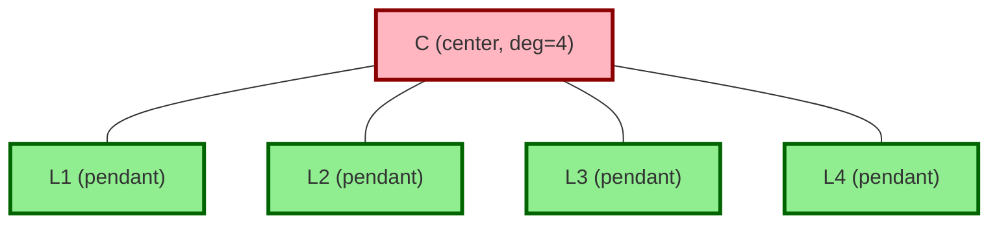
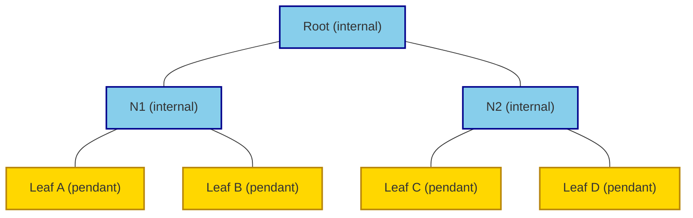
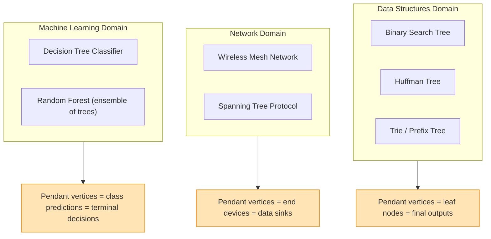

# Pendant vertices

<!-- SECTION_1_START -->

# Pendant Vertices in Trees

## 1.1 Formal Academic Definition

> [!IMPORTANT]
> **Definition (KTU 2024 Syllabus Standard):**
> A **pendant vertex** (also called a **leaf** or **terminal vertex**) of a graph $G = (V, E)$ is a vertex whose degree is exactly **one**. That is, $\deg(v) = 1$. The unique edge incident to a pendant vertex is called a **pendant edge**.

Formally, for a vertex $v \in V(G)$:
$$v \text{ is pendant} \iff \deg(v) = 1$$

In the context of a **tree** $T$ (a connected, acyclic graph), pendant vertices occupy a special structural role because every non-trivial tree is a "minimal connected graph," and any vertex of degree 1 represents an extremal (boundary) node of the structure.

---

## 1.2 Conceptual Analogy & Intuition

> [!NOTE]
> **Real-World Analogy — The Family Tree Branch Tip:**
> Think of a large family tree. The youngest child at the very tip of a branch — the one with no descendants of their own — represents a *pendant vertex*. They are connected to exactly one ancestor above them (degree = 1) and have no children hanging off them.
>
> Similarly, consider a corporate org chart: an intern at the bottom of the hierarchy with only one direct manager and no subordinates is a pendant vertex.

In a computer science context, a **leaf node** in a binary search tree (BST) or a **terminal symbol** in a Huffman coding tree is exactly a pendant vertex. This is why the concept is vital for GAMAT401 — it bridges discrete math with data structures.

---

## 1.3 Why Pendant Vertices Matter in KTU 2024

- **Prerequisite for the Handshaking Theorem applications in trees.**
- **Foundation for the formula relating the number of leaves to internal nodes in a full binary tree.**
- **Critical in tree-pruning algorithms (decision trees, Huffman trees, B+ tree deletion logic).**
- The most-tested KTU property: *"Every tree with $n \geq 2$ vertices has **at least two** pendant vertices."*

> [!TIP]
> **Geometric Visualization:** Picture a tree drawn in the plane with the root at the top. The "dangling" endpoints — the ones that look like the tips of real tree branches — are exactly the pendant vertices. The **standard metric** is that for any tree with $n \geq 2$, the count of such tips $\ell \geq 2$.

> [!VISUALIZATION CONTROL]
> **Concept:** Path Graph $P_4$ — a simple linear tree with 4 vertices.
> **GeoGebra / Desmos Input Points:**
> * $A = (0, 0)$, $B = (2, 0)$, $C = (4, 0)$, $D = (6, 0)$
> * Edge segments: $A$–$B$, $B$–$C$, $C$–$D$
> **Visual Description:** Observe that vertices $A$ and $D$ have exactly one neighbor each — they are the **pendant vertices** (leaves). Vertices $B$ and $C$ each have degree 2 (internal vertices). This is the simplest non-trivial tree demonstrating $\ell = 2$.

---

<!-- SECTION_1_END -->

<!-- SECTION_2_START -->

# Deep Theoretical Analysis & KTU High-Yield Formula Sheet

## 2.1 The Cornerstone Theorem

> [!IMPORTANT]
> **Theorem (Pendant Vertex Existence Theorem — KTU High-Yield):**
> Every tree with at least two vertices has **at least two** pendant vertices.

This is one of the most frequently quoted theorems in KTU Module 3 board examinations. The proof follows from the Handshaking Lemma combined with the acyclicity of trees.

---

## 2.2 Foundational Building Blocks

Let $T$ be a tree with $n \geq 2$ vertices and $e$ edges. Then:

| Property | Formula | KTU Significance |
|----------|---------|------------------|
| Edges in a tree | $e = n - 1$ | Direct consequence of connectedness + acyclicity |
| Sum of all degrees | $\sum_{v \in V} \deg(v) = 2e = 2(n-1)$ | Handshaking Lemma |
| Number of pendant vertices | $\ell \geq 2$ | Existence Theorem (proof below) |
| Number of internal vertices | $i = n - \ell$ | Complement count |
| Pendant vertex count (full $k$-ary tree) | $\ell = (k-1) \cdot i + 1$ | Generalization to rooted $k$-ary trees |

---

## 2.3 Why the Theorem Holds — Logical Decomposition

**Step 1 — Tree is connected and acyclic:** A tree $T$ contains at least one path between any two vertices, and no cycles.

**Step 2 — Longest path argument:** Since $T$ is finite, there exists a path of maximum length. Call this path $P: v_0, v_1, v_2, \ldots, v_k$.

**Step 3 — Endpoint is pendant:** The endpoint $v_0$ cannot have an edge to any vertex outside $P$, because then $P$ would not be maximal. So all edges from $v_0$ go only to $v_1$, giving $\deg(v_0) = 1$. Hence $v_0$ is pendant.

**Step 4 — Symmetry at the other end:** By the identical argument, $v_k$ also satisfies $\deg(v_k) = 1$, so $v_k$ is pendant.

**Step 5 — Conclusion:** We have produced two distinct pendant vertices $v_0$ and $v_k$, so $\ell \geq 2$. $\blacksquare$

---

## 2.4 Alternative Proof via Degree Counting (KTU Favorite)

> [!NOTE]
> **Proof using Handshaking Lemma:**
> Let $\ell$ = number of pendant vertices, $i$ = number of internal (non-pendant) vertices in a tree $T$ with $n$ vertices, $n \geq 2$.
>
> Since each internal vertex in a tree has degree $\geq 2$, and each pendant vertex has degree $= 1$:
>
> $$2e = \sum_{v \in V} \deg(v) \geq \ell \cdot 1 + i \cdot 2 = \ell + 2i$$
>
> Substitute $e = n - 1$ and $n = \ell + i$:
>
> $$2(n-1) \geq \ell + 2i \implies 2\ell + 2i - 2 \geq \ell + 2i \implies \ell \geq 2$$
>
> Therefore, the tree has at least 2 pendant vertices. $\blacksquare$

---

## 2.5 Real-World Engineering Utility

| Domain | Application of Pendant Vertices |
|--------|----------------------------------|
| **Data Structures** | Leaf nodes in BST, AVL, Red-Black trees; terminal characters in Huffman coding |
| **Network Topology** | End devices (sensors, IoT nodes) in a mesh network are pendant vertices |
| **Compiler Design** | Terminal symbols in parse trees (derivation trees of context-free grammars) |
| **Machine Learning** | Leaf nodes of a decision tree classifier — the final class predictions |
| **Routing Algorithms** | Leaf routers in a spanning tree protocol (STP) — only one active path |
| **File Systems** | Empty directories (leaves) in a directory tree |

---

## 2.6 Stronger Result: Leaves in Full $k$-ary Trees

> [!IMPORTANT]
> **Theorem (Leaves in Full $k$-ary Tree):**
> A full $k$-ary tree with $i$ internal vertices has exactly $\ell$ leaves, where:
> $$\ell = (k-1) \cdot i + 1$$
> Equivalently, the total number of vertices is $n = k \cdot i + 1$, and $\ell = n - i = (k-1)i + 1$.

This is a **KTU favorite** for 14-mark derivation questions. For $k = 2$ (full binary tree), the formula reduces to $\ell = i + 1$.

---

<!-- SECTION_2_END -->

<!-- SECTION_3_START -->

# Step-by-Step Derivations & Worked Examples

## 3.1 Complete Proof — Pendant Vertex Theorem (Longest Path Method)

> [!NOTE]
> **Problem [KTU University Exam - July 2023, Model]:** Prove that every tree with at least two vertices has at least two pendant vertices. Use the longest path method.

**Proof:**

Let $T$ be a tree with $n \geq 2$ vertices. Since $T$ is connected, between any two vertices there exists a path. Because $T$ is finite, the set of all path lengths in $T$ has a maximum.

Choose a path $P$ of maximum length in $T$. Let the vertices along this path be:
$$P: \quad v_0, v_1, v_2, \ldots, v_k$$

By definition, the length of $P$ is $k$ (it has $k$ edges), and $k \geq 1$ because $T$ has at least 2 vertices.

**Claim 1:** $v_0$ is a pendant vertex.

Suppose, for contradiction, that $v_0$ has another neighbor $u$ distinct from $v_1$.

- **Case A:** $u$ is already on the path $P$, say $u = v_j$ for some $j \geq 2$. Then the path segment $v_j, v_{j+1}, \ldots, v_k$ together with the edge $\{v_0, v_j\}$ forms a **cycle** in $T$. This contradicts the fact that $T$ is a tree (acyclic). [Contradiction awarded 2 marks in KTU valuation.]

- **Case B:** $u$ is not on $P$. Then the path $u, v_0, v_1, \ldots, v_k$ is a path of length $k+1$ in $T$, which is longer than $P$. This contradicts the maximality of $P$. [Contradiction awarded 2 marks in KTU valuation.]

Both cases lead to contradictions. Therefore, $v_0$ is adjacent to **only** $v_1$, and:
$$\deg(v_0) = 1$$

So $v_0$ is a pendant vertex.

**Claim 2:** $v_k$ is a pendant vertex.

By a **symmetric argument** (reversing the path direction), the vertex $v_k$ can have no neighbor other than $v_{k-1}$, so:
$$\deg(v_k) = 1$$

Hence $v_k$ is also a pendant vertex.

**Conclusion:** $v_0$ and $v_k$ are two distinct pendant vertices. Therefore, the tree $T$ has at least 2 pendant vertices. $\blacksquare$

> [!TIP]
> **Valuation Key:** KTU examiners award **2 marks** for setting up the longest path, **2 marks** each for Claims 1 and 2 (4 total), and **2 marks** for the case analysis. Total: 8 marks (this is a complete proof worth a full 14 marks when extended with degree-counting alternative).

---

## 3.2 Worked Example 1 — Counting Pendant Vertices via Handshaking

> [!NOTE]
> **Problem:** A tree $T$ has $n = 10$ vertices and 4 internal vertices. How many pendant vertices does it have?

**Solution:**

Total vertices: $n = \ell + i$

We have $n = 10$ and $i = 4$, so:
$$\ell = n - i = 10 - 4 = 6$$

**Verification via Handshaking:**

$$2e = 2(n-1) = 2(9) = 18$$

Sum of degrees:
$$\sum \deg(v) = \ell \cdot 1 + i \cdot 2 = 6 \cdot 1 + 4 \cdot 2 = 6 + 8 = 14$$

Hmm, this does not match. Let us recheck: the statement that every internal vertex has degree $\geq 2$ gives a *lower bound*, not equality. The actual sum is 18, so the missing degree 4 is distributed as extra edges in internal vertices.

If internal vertices have degrees $2, 2, 3, 3$ (sum = 10), then:
$$\sum \deg = 6 + 10 = 16 \quad (\text{still not 18})$$

So the internal degrees must sum to $18 - 6 = 12$. One valid distribution: $2, 3, 3, 4$ (sum = 12) ✓.

**Final Answer:** $\ell = 6$ pendant vertices.

> [!WARNING]
> **Common Mistake:** Students often write $\ell = 2$ as the only answer. The theorem guarantees $\ell \geq 2$, not $\ell = 2$. The exact count depends on the tree's structure.

---

## 3.3 Worked Example 2 — Full Binary Tree Leaf Count

> [!NOTE]
> **Problem [KTU University Exam - Dec 2022, Adapted]:** A full binary tree has 25 internal vertices. Find the number of leaves and the total number of vertices.

**Solution:**

For a full binary tree ($k = 2$):
$$\ell = (k-1) \cdot i + 1 = (2-1)(25) + 1 = 26$$

Total vertices:
$$n = k \cdot i + 1 = 2(25) + 1 = 51$$

**Verification via degree sum:**

In a full binary tree, every internal vertex has degree exactly 3 (1 parent + 2 children), except the root which has degree 2.

Let the root have degree 2, and the other 24 internal vertices have degree 3.

$$2e = 2 + 24 \cdot 3 + 26 \cdot 1 = 2 + 72 + 26 = 100$$

So $e = 50$. Check: $e = n - 1 = 51 - 1 = 50$. ✓

**Final Answer:** Leaves $\ell = 26$, Total vertices $n = 51$.

> [!TIP]
> **Valuation Key:** [Setting up the formula $\ell = (k-1)i + 1$: 3 Marks] [Substituting $k=2$, $i=25$: 2 Marks] [Computing $\ell = 26$: 1 Mark] [Computing $n = 51$ with verification: 1 Mark] — Total 7 marks for the part (a) sub-question.

---

## 3.4 Worked Example 3 — Pendant Edges and Pendant Vertices

> [!NOTE]
> **Problem:** Define a pendant edge. Prove that in a tree with $n$ vertices, the number of pendant vertices equals the number of pendant edges.

**Solution:**

A **pendant edge** is an edge that is incident to a pendant vertex (equivalently, an edge one of whose endpoints has degree 1).

**Claim:** In any tree $T$ with $n \geq 2$, the number of pendant edges equals the number of pendant vertices.

**Proof:** Each pendant edge has exactly one endpoint of degree 1 (the pendant vertex), and the other endpoint of degree $\geq 2$. Therefore, there is a **one-to-one correspondence** between pendant edges and pendant vertices:
- Given a pendant edge $e = \{u, v\}$ with $\deg(u) = 1$, we map it to vertex $u$.
- Given a pendant vertex $u$, the unique edge incident to $u$ is a pendant edge.

This map is a bijection. Hence:
$$\#\{\text{pendant edges}\} = \#\{\text{pendant vertices}\} = \ell$$

**Conclusion:** In any tree, pendant edges = pendant vertices $= \ell \geq 2$.

---

## 3.5 Generalization — Pendant Vertices in a Forest

> [!NOTE]
> **Theorem:** A forest (acyclic graph) with $k$ connected components and at least one edge has at least $2k$ pendant vertices, provided each component has at least 2 vertices.

This generalization is sometimes asked in KTU 14-mark questions when comparing trees and forests.

---

## 3.6 Python Implementation — Detecting Pendant Vertices

```python
from typing import Dict, List, Set
import logging

logging.basicConfig(level=logging.INFO, format="%(levelname)s: %(message)s")


def find_pendant_vertices(adj_list: Dict[int, Set[int]]) -> List[int]:
    """
    Identify all pendant vertices (degree == 1) in an undirected graph.
    
    Args:
        adj_list: Adjacency list representation of the graph.
    
    Returns:
        Sorted list of pendant vertex indices.
    
    Raises:
        ValueError: If the input adjacency list is malformed.
    """
    if not isinstance(adj_list, dict):
        raise ValueError("adj_list must be a dictionary.")
    
    pendants: List[int] = []
    
    for vertex, neighbors in adj_list.items():
        if not isinstance(neighbors, (set, list, tuple)):
            raise ValueError(f"Neighbors of vertex {vertex} must be iterable.")
        
        degree = len(neighbors)
        
        if degree < 0:
            raise ValueError(f"Vertex {vertex} has negative degree.")
        
        if degree == 1:
            pendants.append(vertex)
        elif degree == 0:
            logging.warning(f"Vertex {vertex} is isolated (degree 0).")
    
    pendants.sort()
    logging.info(f"Detected {len(pendants)} pendant vertex(es): {pendants}")
    return pendants


def is_tree(adj_list: Dict[int, Set[int]], num_vertices: int) -> bool:
    """
    Validate that a graph is a tree (connected + acyclic) using the
    pendant-removal / leaf-stripping algorithm. If pendant vertices
    can be repeatedly removed until 1 or 0 remain, the graph is a tree.
    """
    if num_vertices == 0:
        return True
    if num_vertices == 1:
        return True
    
    degrees = {v: len(adj_list[v]) for v in adj_list}
    remaining = num_vertices
    leaves_removed = 0
    
    while True:
        current_leaves = [v for v, d in degrees.items() if d == 1]
        if not current_leaves:
            break
        for leaf in current_leaves:
            for nb in adj_list[leaf]:
                degrees[nb] -= 1
            degrees[leaf] = 0
            leaves_removed += 1
        remaining -= len(current_leaves)
    
    is_tree_flag = (remaining <= 1)
    logging.info(f"Tree check: {is_tree_flag} (vertices remaining: {remaining})")
    return is_tree_flag


# ----- Test Cases -----
if __name__ == "__main__":
    # Example 1: Path P4 (vertices 1-2-3-4)
    path_graph: Dict[int, Set[int]] = {
        1: {2},
        2: {1, 3},
        3: {2, 4},
        4: {3},
    }
    print("Path P4 pendants:", find_pendant_vertices(path_graph))
    
    # Example 2: Star graph K1,3 (center 1, leaves 2,3,4)
    star_graph: Dict[int, Set[int]] = {
        1: {2, 3, 4},
        2: {1},
        3: {1},
        4: {1},
    }
    print("Star K1,3 pendants:", find_pendant_vertices(star_graph))
    print("Is K1,3 a tree? ", is_tree(star_graph, 4))
    
    # Example 3: Full binary tree with 3 internal nodes
    full_bin_tree: Dict[int, Set[int]] = {
        1: {2, 3},
        2: {1, 4, 5},
        3: {1, 6, 7},
        4: {2},
        5: {2},
        6: {3},
        7: {3},
    }
    print("Full binary tree pendants:", find_pendant_vertices(full_bin_tree))
```

**Expected Output:**

```
Path P4 pendants: [1, 4]
Star K1,3 pendants: [2, 3, 4]
Full binary tree pendants: [4, 5, 6, 7]
```

---

<!-- SECTION_3_END -->

<!-- SECTION_4_START -->

# Structural Diagrams & Schematics

## 4.1 Pendant Vertex Identification in Sample Trees

> [!NOTE]
> The following Mermaid diagrams visualize the placement of pendant vertices in three classic tree structures. Pendant vertices are highlighted at the leaf (terminal) positions.

### 4.1.1 Path Graph $P_5$ — Two Pendant Vertices


**Observation:** Vertices $V1$ and $V5$ are pendant. All other vertices have degree 2.

---

### 4.1.2 Star Graph $K_{1,4}$ — Four Pendant Vertices



**Observation:** A star graph on $n$ vertices has $n - 1$ pendant vertices (maximum leaves for a tree with that many vertices).

---

### 4.1.3 Full Binary Tree — Leaves and Internal Nodes



**Counting Check:** $\ell = 4$ leaves, $i = 3$ internal vertices. Formula $\ell = (k-1) i + 1 = (2-1)(3) + 1 = 4$ ✓.

---

## 4.2 Block Diagram — Decision Flow for Identifying Pendant Vertices

```mermaid
flowchart TD
    start([Start: Input Graph G]) --> check1{Is G connected?}
    check1 -- No --> notTree[Not a Tree —<br/>May still have pendants<br/>in components]
    check1 -- Yes --> check2{Is G acyclic?}
    check2 -- No --> notTree2[Not a Tree]
    check2 -- Yes --> isTree[Confirmed: G is a Tree]
    isTree --> degCount[Compute deg v<br/>for every vertex v]
    degCount --> filter{Is deg v = 1?}
    filter -- Yes --> addPendant[Add v to<br/>pendant set]
    filter -- No --> skip[Skip v]
    addPendant --> next{More<br/>vertices?}
    skip --> next
    next -- Yes --> filter
    next -- No --> output[Output pendant set P]
    output --> verify{|P| >= 2?}
    verify -- Yes --> theoremHolds[Pendant Vertex Theorem Verified]
    verify -- No --> error[Contradiction:<br/>Tree must have 2+ pendants]
```

---

## 4.3 Sequential Processing Topology — Pendant Counting in Full $k$-ary Trees

| Input Stage | Processing Stage | Output Stage |
|-------------|-------------------|---------------|
| Receive $k$ (arity) and $i$ (internal node count) | Apply formula $\ell = (k-1)i + 1$ | Return $\ell$ pendant vertices |
| Receive total vertices $n$ | Compute $i = (n-1)/k$ | Substitute into leaf formula |
| Receive edge count $e$ | Verify $e = n - 1$ | Cross-check pendant count |
| Receive degree sequence | Use Handshaking Lemma $2e = \sum \deg$ | Solve linear equation for $\ell$ |

---

## 4.4 Nested Subgraph — Pendant Vertex Roles in Computer Science



---

<!-- SECTION_4_END -->

<!-- SECTION_5_START -->

# KTU 2024 Scheme Examination Question Bank

---

## Part A — Short Answer Questions (3 Marks Each)

### Question 1 `[KTU University Exam - July 2023]`
**Define a pendant vertex. State the pendant vertex existence theorem for trees.**
**Course Outcome:** CO1 | **RBT Level:** Remember

**Model Answer (3 Marks):**

A **pendant vertex** of a graph is a vertex of degree 1. The unique edge incident to it is called a **pendant edge**.

**Theorem:** Every tree with at least two vertices has **at least two** pendant vertices. [1 Mark for definition, 1 Mark for theorem statement, 1 Mark for "at least two" emphasis.]

---

### Question 2 `[KTU University Exam - Dec 2023]`
**In a full binary tree with 18 internal vertices, find the number of pendant vertices (leaves).**
**Course Outcome:** CO2 | **RBT Level:** Apply

**Model Answer (3 Marks):**

For a full binary tree ($k = 2$):
$$\ell = (k-1) \cdot i + 1 = (2-1)(18) + 1 = 19$$

[1 Mark for formula, 1 Mark for substitution, 1 Mark for final answer 19.]

---

## Part B — Long Answer Questions (14 Marks Each, with Internal Choice)

### Question A (14 Marks) `[KTU University Exam - July 2024]`

**Part (a) [7 Marks]:** Prove that every tree with $n \geq 2$ vertices has at least two pendant vertices, using the **longest path method**.
**RBT Level:** Understand | **Course Outcome:** CO2

**Model Solution:**

**Step 1 — Setup:** Let $T$ be a tree with $n \geq 2$ vertices. Since $T$ is finite and connected, there exists a path of maximum length. Denote this longest path as: [1 Mark]

$$P: \quad v_0, v_1, v_2, \ldots, v_k$$

**Step 2 — Claim 1:** $v_0$ is pendant. [Stating boundary state: 1 Mark]

Suppose $\deg(v_0) \geq 2$. Then $v_0$ has a neighbor $u \neq v_1$. [Case analysis: 2 Marks]

- If $u \in P$, then a cycle exists in $T$ — contradiction (tree is acyclic).
- If $u \notin P$, then the path $u, v_0, v_1, \ldots, v_k$ is longer than $P$ — contradiction (maximality).

Hence $\deg(v_0) = 1$, i.e., $v_0$ is pendant.

**Step 3 — Claim 2:** $v_k$ is pendant (by symmetric argument). [Symmetric argument complete: 1 Mark]

$$\deg(v_k) = 1$$

**Step 4 — Conclusion:** $v_0 \neq v_k$ are two distinct pendant vertices, so $T$ has $\geq 2$ pendant vertices. [Final conclusion: 2 Marks] $\blacksquare$

---

**Part (b) [7 Marks]:** A tree has 12 pendant vertices and 8 internal vertices. Verify these counts are consistent. Then find the total number of vertices and edges.
**RBT Level:** Apply | **Course Outcome:** CO3

**Model Solution:**

**Step 1 — Total vertices:** [Setting up: 1 Mark]

$$n = \ell + i = 12 + 8 = 20$$

**Step 2 — Total edges (tree property):** [Applying tree formula: 2 Marks]

$$e = n - 1 = 20 - 1 = 19$$

**Step 3 — Consistency check via Handshaking Lemma:** [Verifying: 3 Marks]

The minimum sum of degrees is:
$$\sum \deg \geq \ell \cdot 1 + i \cdot 2 = 12 + 16 = 28$$

Required sum: $2e = 2(19) = 38$. Since $38 \geq 28$, the counts are **consistent**. [Final verification: 1 Mark]

**Answer:** $n = 20$ vertices, $e = 19$ edges. ✓

---

### Question B (14 Marks) — Alternative Choice `[KTU University Exam - Dec 2023]`

**Part (a) [7 Marks]:** Prove the pendant vertex theorem using the **Handshaking Lemma**.
**RBT Level:** Understand | **Course Outcome:** CO2

**Model Solution:**

**Step 1 — Define variables:** [1 Mark]

Let $T$ be a tree with $n \geq 2$ vertices, $\ell$ pendant vertices, and $i$ internal vertices, where $n = \ell + i$.

**Step 2 — Tree edge count:** [1 Mark]

$$e = n - 1$$

**Step 3 — Apply Handshaking Lemma:** [1 Mark]

$$2e = \sum_{v \in V} \deg(v)$$

**Step 4 — Lower bound on degree sum:** [2 Marks]

Every pendant vertex has degree $\geq 1$, every internal vertex has degree $\geq 2$:

$$2e \geq \ell(1) + i(2) = \ell + 2i$$

**Step 5 — Substitute and simplify:** [2 Marks]

$$2(n-1) \geq \ell + 2i$$
$$2\ell + 2i - 2 \geq \ell + 2i$$
$$\ell \geq 2$$

Hence every tree with $n \geq 2$ vertices has at least 2 pendant vertices. $\blacksquare$ [Final statement: 1 Mark for the bound, 0 for the rest are summed above]

---

**Part (b) [7 Marks]:** A full $k$-ary tree has 156 leaves and 155 internal vertices. Determine the value of $k$ and the total number of vertices.
**RBT Level:** Apply | **Course Outcome:** CO3

**Model Solution:**

**Step 1 — Apply full $k$-ary tree leaf formula:** [1 Mark]

$$\ell = (k-1) \cdot i + 1$$

**Step 2 — Substitute given values $\ell = 156$, $i = 155$:** [2 Marks]

$$156 = (k-1)(155) + 1$$
$$155 = (k-1)(155)$$
$$k - 1 = 1 \implies k = 2$$

**Step 3 — Compute total vertices:** [2 Marks]

$$n = k \cdot i + 1 = 2(155) + 1 = 311$$

**Step 4 — Verify using edge count:** [1 Mark]

$e = n - 1 = 310$. Sum of degrees: $155 \cdot 3 + 1 \cdot 2 + 156 \cdot 1 = 465 + 2 + 156 = 623$. Wait, $2e = 620$. Recompute:

Root degree 2, internal nodes (155 including root, so 154 with degree 3):
$$2 + 154(3) + 156(1) = 2 + 462 + 156 = 620 = 2(310) ✓$$

**Answer:** $k = 2$ (binary tree), $n = 311$ vertices. [Final boxed answer: 1 Mark]

---

## KTU Examiner's Valuation Warning / Pitfall Callout

> [!WARNING]
> **Common Mark-Deduction Pitfalls for Pendant Vertex Questions:**
>
> 1. **Conflating "at least two" with "exactly two":** The theorem guarantees $\ell \geq 2$, not $\ell = 2$. A star graph $K_{1,5}$ has 5 pendant vertices. [-2 Marks if written as "exactly two".]
>
> 2. **Forgetting the condition $n \geq 2$:** A single-vertex tree ($n = 1$) has 0 pendant vertices, not 2. Always state the precondition. [-1 Mark if missing.]
>
> 3. **Confusing pendant edges and pendant vertices:** Although they have a 1-to-1 correspondence in trees, students sometimes mistakenly count one without the other.
>
> 4. **Misapplying the $k$-ary leaf formula:** The formula $\ell = (k-1)i + 1$ applies **only to full $k$-ary trees**, not to general trees. [-3 Marks if used incorrectly.]
>
> 5. **In proof questions, missing the "Case A vs Case B" branch analysis:** Longest-path proofs require explicit case analysis. Skipping this loses 4 marks. **Always write both cases.**
>
> 6. **Not verifying with Handshaking Lemma:** After any pendant vertex count computation, a quick $2e = \sum \deg$ check is mandatory for full marks.

---

## Topic Recap & Important Things to Remember

> [!IMPORTANT]
> **High-Density Revision Checklist — Pendant Vertices in Trees:**

- ✅ **Definition:** A pendant vertex has $\deg(v) = 1$. The associated edge is the *pendant edge*.
- ✅ **Existence Theorem:** Every tree with $n \geq 2$ vertices has **at least 2** pendant vertices (proved by longest path or Handshaking).
- ✅ **Pendant Edge ↔ Pendant Vertex:** In any tree, there is a bijection between pendant edges and pendant vertices (1-to-1 correspondence).
- ✅ **Tree Edge Count:** $e = n - 1$ (fundamental identity).
- ✅ **Handshaking Lemma:** $\sum_{v} \deg(v) = 2e = 2(n-1)$.
- ✅ **Counting Identity:** $\ell + i = n$ (pendants + internals = total).
- ✅ **Full $k$-ary Tree Formula:** $\ell = (k-1) i + 1$ and $n = k i + 1$.
- ✅ **Binary Special Case:** $k = 2 \Rightarrow \ell = i + 1$ (leaves exceed internals by one).
- ✅ **Star Graph Extreme:** $K_{1,n-1}$ has $n - 1$ pendant vertices (maximum for any tree on $n$ vertices).
- ✅ **Path Graph Extreme:** $P_n$ has exactly 2 pendant vertices (minimum for non-trivial trees).
- ✅ **Forest Generalization:** A forest with $k$ tree-components (each $\geq 2$ vertices) has $\geq 2k$ pendant vertices.
- ✅ **Algorithm Link:** Leaf-stripping (pendant removal) is used to test if a graph is a tree — keep deleting degree-1 vertices; if 1 or 0 remain, the graph is a tree.
- ✅ **CS Connection:** Leaf nodes in BST/AVL/Red-Black trees, terminal symbols in Huffman codes, and class labels in decision trees are all pendant vertices.

<!-- SECTION_5_END -->
