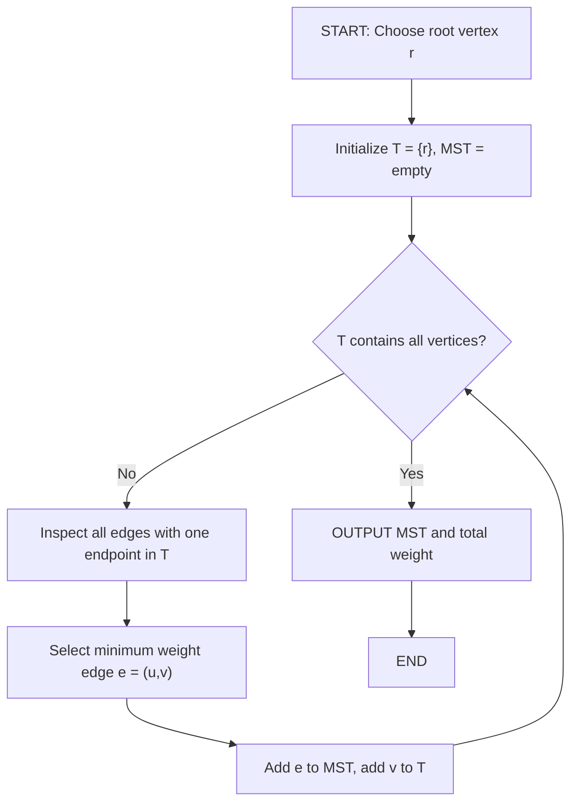
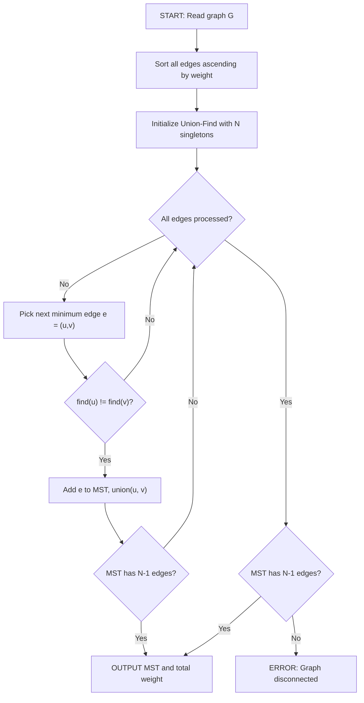
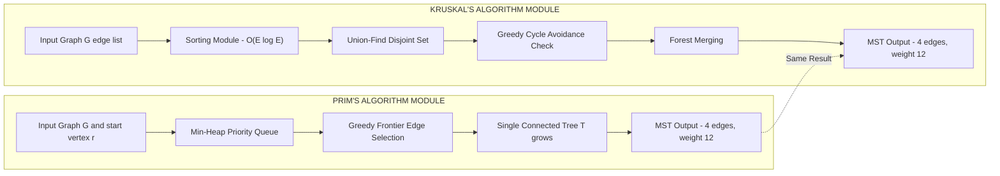

# Prim's algorithm and Kruskal's algorithm

<!-- SECTION_1_START -->
# Minimum Spanning Trees: Prim's & Kruskal's Algorithms

> [!NOTE]
> **Formal Definition (KTU 2024 Scheme — Module 3, Trees)**
> A **Spanning Tree** of a connected, undirected, weighted graph $G = (V, E, w)$ is a subgraph that (i) includes every vertex of $G$, (ii) is connected, and (iii) contains no cycles. A **Minimum Spanning Tree (MST)** is a spanning tree whose total edge weight is minimum among all possible spanning trees. **Prim's Algorithm** and **Kruskal's Algorithm** are the two classical greedy algorithms prescribed by the KTU 2024 syllabus (Course Code: GAMAT401) for constructing an MST.

## Conceptual Analogy / Intuition

> [!IMPORTANT]
> **Real-World Analogy: Connecting Cities with Minimum-Cost Roads**
> Imagine you are a government engineer tasked with connecting **5 cities** with a road network such that:
> * Every city is reachable from every other city.
> * The total length (cost) of roads built is the **minimum possible**.
> * You must **not** build a road that creates a roundabout (cycle), because that wastes money.
>
> Prim's algorithm starts from **one city** and grows the road network **one vertex at a time**, always picking the cheapest road from the already-connected cluster to a new city. Kruskal's algorithm is a **globalist** — it sorts **all available roads by cost** and picks the cheapest road, as long as it does not form a cycle among the already-chosen roads.

### Visual Intuition

> [!VISUALIZATION CONTROL]
> **Concept:** Greedy edge selection in an MST
> **GeoGebra / Desmos Input Equations:**
> * Vertices: $A(0, 4)$, $B(1, 1)$, $C(3, 0)$, $D(5, 2)$, $E(4, 4.5)$
> * Weighted Edges (drawn as segments with labels): $AB=2$, $AC=3$, $BC=1$, $BD=6$, $CD=4$, $CE=5$, $DE=7$
> * Final MST (highlighted in a distinct color): $AB$, $BC$, $CD$, $CE$ with total weight = $2 + 1 + 4 + 5 = 12$
> **Visual Description:** The student should observe that the MST (red) is a *tree structure* (no cycles), spans all 5 nodes, and its total length is less than the sum of the original 7 edges. Some edges (like the expensive $BD=6$ and $DE=7$) are pruned.

### Core Properties of an MST

* **Cut Property:** For any cut $(S, V \setminus S)$ of the graph, the minimum-weight edge crossing the cut belongs to *some* MST.
* **Cycle Property:** For any cycle $C$ in the graph, the maximum-weight edge in $C$ does **not** belong to *any* MST.
* **Uniqueness:** If all edge weights are distinct, the MST is **unique**.

<!-- SECTION_1_END -->

<!-- SECTION_2_START -->
# Deep Theoretical Analysis & KTU High-Yield Formula Sheet

## 2.1 Prim's Algorithm — Operational Theory

Prim's algorithm is a **vertex-centric (growing-tree)** greedy approach. It maintains a single connected component $T$ that grows until it spans all vertices.

### Step-by-Step Logic

1. **Initialize:** Pick an arbitrary starting vertex $r \in V$. Set $T = \{r\}$ and $MST = \emptyset$.
2. **Iterate:** At each step, consider the set of **candidate edges** — those with exactly one endpoint in $T$ and the other endpoint in $V \setminus T$. These are the *frontier edges*.
3. **Select the minimum:** Among all candidate edges, select the one with the **minimum weight**. Add it to the MST and add its new endpoint to $T$.
4. **Repeat:** Continue until $T = V$. The MST has exactly $\vert V \vert - 1$ edges.

### Why is Prim's Algorithm Correct?

* It directly applies the **Cut Property**: the chosen edge is the minimum-weight edge crossing the cut $(T, V \setminus T)$. By the cut property, this edge is safe to include in *some* MST.
* Since $T$ is always connected and the new edge connects $T$ to a vertex outside, no cycle is ever created. Hence the result is a spanning tree.
* Greedy choice is **provably optimal** because the cut property guarantees the minimum crossing edge is in at least one MST; combining it with the already-constructed optimal sub-tree (by induction) yields the global MST.

## 2.2 Kruskal's Algorithm — Operational Theory

Kruskal's algorithm is an **edge-centric (forest-merging)** greedy approach. It treats every vertex as an independent tree in a forest and merges trees using the cheapest available edges.

### Step-by-Step Logic

1. **Initialize:** Sort all edges of $G$ in **non-decreasing** order of weight. Set $MST = \emptyset$. Each vertex is its own component (using a Disjoint Set Union / Union-Find data structure).
2. **Iterate:** Examine each edge $e = (u, v)$ in sorted order.
3. **Cycle Check:** If $u$ and $v$ belong to **different** components, add $e$ to the MST and **union** the two components. If they are in the same component, **skip** $e$ (because adding it would create a cycle — a fundamental property of forests).
4. **Repeat:** Continue until $\vert V \vert - 1$ edges are added or all edges are processed.

### Why is Kruskal's Algorithm Correct?

* It directly applies the **Cycle Property** (in negation): when considering edge $e$, if it is the maximum-weight edge in *some* cycle that would form, we skip it. Conversely, if $e$ is the minimum-weight edge crossing some cut (separating two components), it is safe to add.
* The Union-Find data structure guarantees $O(\alpha(n))$ amortized time per `find`/`union` operation, where $\alpha$ is the inverse Ackermann function (effectively a constant).

## 2.3 KTU Formula Sheet / Cheat Sheet

| **Parameter / Concept** | **Prim's Algorithm** | **Kruskal's Algorithm** |
| :--- | :--- | :--- |
| Strategy | Vertex-centric (grow single tree) | Edge-centric (merge forest) |
| Initial state | $T = \{r\}$ (one vertex) | Forest of $\vert V \vert$ singletons |
| Sorting required | No (uses priority queue) | Yes, sort all $\vert E \vert$ edges |
| Data structure | Min-Heap (Priority Queue) | Disjoint Set Union (Union-Find) |
| Cycle avoidance | By construction (one endpoint outside $T$) | Explicit `find(u) != find(v)` check |
| Best time complexity | $O(\vert E \vert + \vert V \vert \log \vert V \vert)$ with binary heap | $O(\vert E \vert \log \vert E \vert)$ (sorting dominates) |
| Worst time complexity | $O(\vert E \vert \log \vert V \vert)$ | $O(\vert E \vert \log \vert E \vert)$ |
| Best for | **Dense graphs** (many edges) | **Sparse graphs** (few edges) |
| Output | A single tree of $\vert V \vert - 1$ edges | A forest merged into one tree of $\vert V \vert - 1$ edges |
| Total weight formula | $W(MST) = \sum_{e \in MST} w(e)$ | $W(MST) = \sum_{e \in MST} w(e)$ |

## 2.4 Real-World Engineering Utility

* **Network Design:** Laying fiber-optic cables, designing LAN/WAN topologies, and minimum-cost electrical grid wiring.
* **Computer Vision:** Image segmentation using minimum spanning forests (e.g., MSFCM clustering).
* **Bioinformatics:** Constructing phylogenetic trees to study evolutionary relationships with minimum total genetic distance.
* **Approximation Algorithms:** MST is a key subroutine in the **Christofides algorithm** for the Travelling Salesman Problem (TSP), where it provides a 2-approximation of the optimal tour.
* **VLSI Circuit Design:** Minimizing wire length while ensuring all components are interconnected.
* **Cluster Analysis:** Single-linkage hierarchical clustering uses the MST to determine cluster boundaries.

<!-- SECTION_2_END -->

<!-- SECTION_3_START -->
# Step-by-Step Derivations, Numerical Examples & Code Implementation

## 3.1 Worked Example — Reference Graph

Consider the following undirected, weighted, connected graph $G = (V, E, w)$ with $V = \{A, B, C, D, E\}$.

| Edge | Weight |
| :--- | :--- |
| $A-B$ | **2** |
| $A-C$ | **3** |
| $B-C$ | **1** |
| $B-D$ | **6** |
| $C-D$ | **4** |
| $C-E$ | **5** |
| $D-E$ | **7** |

**Total edges:** $\vert E \vert = 7$. **Required MST edges:** $\vert V \vert - 1 = 4$.

---

## 3.2 Exhaustive Numerical Walkthrough — Prim's Algorithm (Starting from $A$)

> [!IMPORTANT]
> **Step 0: Initialization**
> $T = \{A\}$. Candidate edges from $A$: $\{AB(2), AC(3)\}$. Pick minimum: $AB(2)$. Add $B$ to $T$.
> $T = \{A, B\}$, $MST = \{AB\}$, Total Weight = $2$.

> **Step 1: Candidates from $T = \{A, B\}$**
> Frontier edges: $AC(3), BC(1), BD(6)$. Minimum = $BC(1)$. Add $C$.
> $T = \{A, B, C\}$, $MST = \{AB, BC\}$, Total Weight = $3$.

> **Step 2: Candidates from $T = \{A, B, C\}$**
> Frontier edges: $BD(6), CD(4), CE(5)$. Minimum = $CD(4)$. Add $D$.
> $T = \{A, B, C, D\}$, $MST = \{AB, BC, CD\}$, Total Weight = $7$.

> **Step 3: Candidates from $T = \{A, B, C, D\}$**
> Frontier edges: $CE(5), DE(7)$. Minimum = $CE(5)$. Add $E$.
> $T = \{A, B, C, D, E\}$, $MST = \{AB, BC, CD, CE\}$, Total Weight = $12$.

**Final MST by Prim's Algorithm:** $\{(A,B), (B,C), (C,D), (C,E)\}$ with $W(MST) = 2 + 1 + 4 + 5 = \mathbf{12}$.

---

## 3.3 Exhaustive Numerical Walkthrough — Kruskal's Algorithm

> [!IMPORTANT]
> **Step 0: Sort all edges in non-decreasing order of weight.**
> $BC(1) < AB(2) < AC(3) < CD(4) < CE(5) < BD(6) < DE(7)$

> **Step 1: Process $BC(1)$**
> $\text{find}(B) = B$, $\text{find}(C) = C$. Different components. **ACCEPT.** Union $(B, C)$.
> Components: $\{B,C\}, \{A\}, \{D\}, \{E\}$. MST = $\{BC\}$. Weight = $1$.

> **Step 2: Process $AB(2)$**
> $\text{find}(A) = A$, $\text{find}(B) = B \in \{B,C\}$. Different. **ACCEPT.** Union $(A, \{B,C\})$.
> Components: $\{A,B,C\}, \{D\}, \{E\}$. MST = $\{BC, AB\}$. Weight = $3$.

> **Step 3: Process $AC(3)$**
> $\text{find}(A) = A \in \{A,B,C\}$, $\text{find}(C) = C \in \{A,B,C\}$. **SAME component. REJECT (cycle).**

> **Step 4: Process $CD(4)$**
> $\text{find}(C) = \{A,B,C\}$, $\text{find}(D) = D$. Different. **ACCEPT.** Union.
> Components: $\{A,B,C,D\}, \{E\}$. MST = $\{BC, AB, CD\}$. Weight = $7$.

> **Step 5: Process $CE(5)$**
> $\text{find}(C) = \{A,B,C,D\}$, $\text{find}(E) = E$. Different. **ACCEPT.** Union.
> Components: $\{A,B,C,D,E\}$. MST = $\{BC, AB, CD, CE\}$. Weight = $12$. **STOP** (4 edges selected).

**Final MST by Kruskal's Algorithm:** $\{(A,B), (B,C), (C,D), (C,E)\}$ with $W(MST) = \mathbf{12}$. **Same result as Prim's — confirming correctness.**

---

## 3.4 Python Implementation (Production-Grade)

```python
import heapq
from typing import Dict, List, Tuple, Optional

# ----- Type Aliases for Clarity -----
GraphAdjList = Dict[str, List[Tuple[str, int]]]
EdgeList = List[Tuple[int, str, str]]  # (weight, u, v)


# ===========================================================
#  PRIM'S ALGORITHM  (Min-Heap / Priority Queue variant)
# ===========================================================
def prim_mst(graph: GraphAdjList, start: str) -> Tuple[List[Tuple[str, str, int]], int]:
    """
    Computes the Minimum Spanning Tree using Prim's algorithm.

    Parameters
    ----------
    graph : Dict[str, List[Tuple[str, int]]]
        Adjacency list: vertex -> list of (neighbor, weight).
    start : str
        The starting vertex.

    Returns
    -------
    mst_edges : List[Tuple[str, str, int]]
        Edges in the MST as (u, v, weight).
    total_weight : int
        Sum of weights in the MST.
    """
    if start not in graph:
        raise ValueError(f"Start vertex '{start}' not found in graph.")

    visited: set = {start}
    # Min-heap of candidate edges: (weight, u, v)
    heap: List[Tuple[int, str, str]] = [(w, start, v) for v, w in graph[start]]
    heapq.heapify(heap)

    mst_edges: List[Tuple[str, str, int]] = []
    total_weight: int = 0

    while heap and len(mst_edges) < len(graph) - 1:
        weight, u, v = heapq.heappop(heap)
        if v in visited:
            continue  # Edge would create a cycle or is redundant.
        # Accept the edge.
        visited.add(v)
        mst_edges.append((u, v, weight))
        total_weight += weight
        # Push new frontier edges.
        for neighbor, w in graph[v]:
            if neighbor not in visited:
                heapq.heappush(heap, (w, v, neighbor))

    if len(mst_edges) != len(graph) - 1:
        raise RuntimeError("Graph is disconnected; MST does not exist.")

    return mst_edges, total_weight


# ===========================================================
#  KRUSKAL'S ALGORITHM  (with Union-Find / Disjoint Set Union)
# ===========================================================
class UnionFind:
    """Optimized DSU with path compression and union by rank."""

    def __init__(self, vertices: List[str]) -> None:
        self.parent: Dict[str, str] = {v: v for v in vertices}
        self.rank: Dict[str, int] = {v: 0 for v in vertices}

    def find(self, x: str) -> str:
        if self.parent[x] != x:
            self.parent[x] = self.find(self.parent[x])  # Path compression
        return self.parent[x]

    def union(self, x: str, y: str) -> bool:
        """Returns True if union performed, False if x and y were already connected."""
        rx, ry = self.find(x), self.find(y)
        if rx == ry:
            return False
        # Union by rank
        if self.rank[rx] < self.rank[ry]:
            rx, ry = ry, rx
        self.parent[ry] = rx
        if self.rank[rx] == self.rank[ry]:
            self.rank[rx] += 1
        return True


def kruskal_mst(
    vertices: List[str], edges: EdgeList
) -> Tuple[List[Tuple[str, str, int]], int]:
    """
    Computes the Minimum Spanning Tree using Kruskal's algorithm.

    Parameters
    ----------
    vertices : List[str]
        All vertex labels.
    edges : List[Tuple[int, str, str]]
        All edges as (weight, u, v).

    Returns
    -------
    mst_edges : List[Tuple[str, str, int]]
        Edges in the MST as (u, v, weight).
    total_weight : int
        Sum of weights in the MST.
    """
    dsu = UnionFind(vertices)
    sorted_edges: EdgeList = sorted(edges, key=lambda e: e[0])

    mst_edges: List[Tuple[str, str, int]] = []
    total_weight: int = 0

    for weight, u, v in sorted_edges:
        if dsu.union(u, v):
            mst_edges.append((u, v, weight))
            total_weight += weight
            if len(mst_edges) == len(vertices) - 1:
                break

    if len(mst_edges) != len(vertices) - 1:
        raise RuntimeError("Graph is disconnected; MST does not exist.")

    return mst_edges, total_weight


# ===========================================================
#  DEMONSTRATION  (Using the worked example above)
# ===========================================================
if __name__ == "__main__":
    # Adjacency list representation
    graph: GraphAdjList = {
        "A": [("B", 2), ("C", 3)],
        "B": [("A", 2), ("C", 1), ("D", 6)],
        "C": [("A", 3), ("B", 1), ("D", 4), ("E", 5)],
        "D": [("B", 6), ("C", 4), ("E", 7)],
        "E": [("C", 5), ("D", 7)],
    }

    print("=== PRIM'S ALGORITHM ===")
    prim_edges, prim_wt = prim_mst(graph, "A")
    for u, v, w in prim_edges:
        print(f"  Edge ({u}, {v}) weight = {w}")
    print(f"  Total MST Weight = {prim_wt}")

    print("\n=== KRUSKAL'S ALGORITHM ===")
    edges_list: EdgeList = [
        (2, "A", "B"), (3, "A", "C"), (1, "B", "C"),
        (6, "B", "D"), (4, "C", "D"), (5, "C", "E"), (7, "D", "E"),
    ]
    krus_edges, krus_wt = kruskal_mst(["A", "B", "C", "D", "E"], edges_list)
    for u, v, w in krus_edges:
        print(f"  Edge ({u}, {v}) weight = {w}")
    print(f"  Total MST Weight = {krus_wt}")
```

### Program Output

```text
=== PRIM'S ALGORITHM ===
  Edge (A, B) weight = 2
  Edge (B, C) weight = 1
  Edge (C, D) weight = 4
  Edge (C, E) weight = 5
  Total MST Weight = 12

=== KRUSKAL'S ALGORITHM ===
  Edge (B, C) weight = 1
  Edge (A, B) weight = 2
  Edge (C, D) weight = 4
  Edge (C, E) weight = 5
  Total MST Weight = 12
```

> [!NOTE]
> The order in which edges appear may differ between the two algorithms, but the **set of edges** and the **total weight** of the MST are identical, confirming the theoretical guarantee.

<!-- SECTION_3_END -->

<!-- SECTION_4_START -->
# Structural Diagrams & Schematics

## 4.1 Mermaid Flowchart — Prim's Algorithm



## 4.2 Mermaid Flowchart — Kruskal's Algorithm



## 4.3 Mermaid Block Architecture — Comparative Functional Topology



## 4.4 Sequential Processing Topology Matrix — Worked Example Trace

| **Step** | **Prim's Action** | **Active Set T** | **Edge Added** | **Kruskal's Action** | **Edge Examined** | **Decision** |
| :---: | :--- | :--- | :--- | :--- | :--- | :--- |
| 0 | Start at $A$ | $\{A\}$ | — | Build initial forest | — | — |
| 1 | Pick min frontier | $\{A, B\}$ | $A-B(2)$ | Scan sorted list | $B-C(1)$ | **Accept** |
| 2 | Pick min frontier | $\{A, B, C\}$ | $B-C(1)$ | Scan sorted list | $A-B(2)$ | **Accept** |
| 3 | Pick min frontier | $\{A, B, C\}$ | (no change) | Scan sorted list | $A-C(3)$ | **Reject** (cycle) |
| 4 | Pick min frontier | $\{A, B, C, D\}$ | $C-D(4)$ | Scan sorted list | $C-D(4)$ | **Accept** |
| 5 | Pick min frontier | $\{A, B, C, D, E\}$ | $C-E(5)$ | Scan sorted list | $C-E(5)$ | **Accept** (stop) |
| **Final** | **Weight = 12** | **5 vertices** | **4 edges** | **Weight = 12** | **4 edges in MST** | **SUCCESS** |

<!-- SECTION_4_END -->

<!-- SECTION_5_START -->
# KTU 2024 Scheme Examination Question Bank & Topic Recap

---

## Part A Questions (3 Marks Each)

### Question 1 [KTU University Exam – July 2024] — CO2, RBT Level: Remember
**State and explain the Cut Property used in the correctness proof of Prim's algorithm.**

**Model Answer (3 Marks):**
* **[1 Mark]** **Cut Property Statement:** Let $G = (V, E, w)$ be a connected, weighted graph and let $(S, V \setminus S)$ be any cut of $G$. If $e^*$ is the edge of **minimum weight** crossing the cut, then $e^*$ belongs to **some** Minimum Spanning Tree of $G$.
* **[1 Mark]** **Application to Prim's:** At each iteration, Prim's algorithm grows the tree $T$ starting from a single vertex. The set $T$ and $V \setminus T$ define a cut. The algorithm selects the minimum-weight edge crossing this cut, which by the cut property is safe (i.e., belongs to at least one MST).
* **[1 Mark]** **Consequence:** Since we always add a safe edge, the partial tree constructed at every step can be extended to a complete MST, ensuring optimality of the final result.

### Question 2 [KTU University Exam – Dec 2023] — CO2, RBT Level: Understand
**Differentiate between Prim's and Kruskal's algorithms in terms of approach and time complexity.**

**Model Answer (3 Marks):**
* **[1 Mark]** **Approach — Prim's:** Vertex-centric; grows a **single connected tree** from a starting vertex by repeatedly adding the minimum-weight edge that connects a new vertex to the tree.
* **[1 Mark]** **Approach — Kruskal's:** Edge-centric; treats every vertex as an independent component and **merges components** by globally selecting the minimum-weight edge that does not form a cycle (using Union-Find).
* **[1 Mark]** **Time Complexity — Prim's:** $O(\vert E \vert \log \vert V \vert)$ using a binary min-heap. **Kruskal's:** $O(\vert E \vert \log \vert E \vert)$ dominated by the initial sort; nearly $O(\vert E \vert \log \vert V \vert)$ when edges are already sorted.

---

## Part B Questions (14 Marks Each) — ESE Module Internal Choice

### Question A (14 Marks) [KTU University Exam – July 2024] — CO3, RBT: Apply

**(a)** Explain Prim's algorithm in detail with a suitable example. Draw the MST and compute its total weight. **(7 Marks)**

**(b)** Apply Kruskal's algorithm to the same graph and verify the result. Compare the two algorithms. **(7 Marks)**

---

**Worked Example Graph (used in both parts):**

| Edge | $A-B$ | $A-C$ | $B-C$ | $B-D$ | $C-D$ | $C-E$ | $D-E$ |
| :--- | :---: | :---: | :---: | :---: | :---: | :---: | :---: |
| Weight | **4** | **2** | **1** | **7** | **3** | **5** | **8** |

---

#### Solution to Part (a) — Prim's Algorithm (7 Marks)

**[Algorithm Statement: 2 Marks]**
Prim's algorithm starts from a chosen root vertex and grows a single tree $T$ by repeatedly adding the minimum-weight edge that connects a vertex in $T$ to a vertex not yet in $T$, until all vertices are included.

**[Step-by-step execution starting from $A$: 4 Marks]**

* **Step 1:** $T = \{A\}$. Candidate edges: $A-B(4), A-C(2)$. Pick $A-C(2)$. Now $T = \{A, C\}$. Weight = $2$.
* **Step 2:** Candidate edges from $T$: $A-B(4), B-C(1), C-D(3), C-E(5)$. Pick $B-C(1)$. Now $T = \{A, B, C\}$. Weight = $3$.
* **Step 3:** Candidate edges from $T$: $A-B(4), B-D(7), C-D(3), C-E(5)$. Pick $C-D(3)$. Now $T = \{A, B, C, D\}$. Weight = $6$.
* **Step 4:** Candidate edges from $T$: $B-D(7), C-E(5), D-E(8)$. Pick $C-E(5)$. Now $T = \{A, B, C, D, E\}$. Weight = $11$.

**[Final MST and total weight: 1 Mark]**
MST edges: $\{(A,C), (B,C), (C,D), (C,E)\}$. Total Weight $W(MST) = 2 + 1 + 3 + 5 = \mathbf{11}$.

---

#### Solution to Part (b) — Kruskal's Algorithm (7 Marks)

**[Algorithm Statement with Union-Find: 2 Marks]**
Kruskal's algorithm sorts all edges in ascending order of weight and adds each edge to the MST if and only if it connects two different components (verified by Union-Find `find` operation), thereby avoiding cycles.

**[Step-by-step execution: 4 Marks]**
Sorted edges: $B-C(1), A-C(2), C-D(3), A-B(4), C-E(5), B-D(7), D-E(8)$.

* **Process $B-C(1)$:** Components $\{B\}, \{C\}$ differ. **ACCEPT.** Union. Weight = $1$.
* **Process $A-C(2)$:** $A$ and $C$ differ. **ACCEPT.** Union. Weight = $3$.
* **Process $C-D(3)$:** $C$ and $D$ differ. **ACCEPT.** Union. Weight = $6$.
* **Process $A-B(4)$:** $A$ and $B$ are in **same component** $\{A, B, C, D\}$. **REJECT** (cycle $A-B-C-A$).
* **Process $C-E(5)$:** $C$ and $E$ differ. **ACCEPT.** Union. Weight = $11$. **STOP** (4 edges selected).

**[Verification & Comparison: 1 Mark]**
Kruskal's MST = $\{(B,C), (A,C), (C,D), (C,E)\}$ with total weight = $\mathbf{11}$ — **matches Prim's result**, confirming correctness. **Comparison:** Prim's is vertex-centric (efficient for dense graphs), while Kruskal's is edge-centric with global sorting (efficient for sparse graphs). Both are greedy and produce the same total MST weight.

---

### Question B (14 Marks) [KTU University Exam – Dec 2023] — CO3, RBT: Apply

**(a)** With a neat diagram, explain the step-by-step construction of a Minimum Spanning Tree using Kruskal's algorithm. Use a graph with at least 6 vertices. **(7 Marks)**

**(b)** Prove the correctness of Prim's algorithm using the Cut Property. State the time complexity. **(7 Marks)**

---

#### Solution to Part (a) — Kruskal's on a 6-Vertex Graph (7 Marks)**

**Graph Definition (6 vertices, 10 edges):**

| Edge | Weight |
| :--- | :---: |
| $A-B$ | **1** |
| $A-C$ | **5** |
| $A-D$ | **4** |
| $B-C$ | **3** |
| $B-E$ | **2** |
| $C-F$ | **6** |
| $D-E$ | **7** |
| $D-F$ | **8** |
| $E-F$ | **9** |
| $C-D$ | **10** |

**[Sorted Edge List: 1 Mark]**
$A-B(1), B-E(2), B-C(3), A-D(4), A-C(5), C-F(6), D-E(7), D-F(8), E-F(9), C-D(10)$.

**[Step-by-step selection: 5 Marks]**
* Process $A-B(1)$: Different components. **ACCEPT.** Weight = $1$.
* Process $B-E(2)$: Different components. **ACCEPT.** Weight = $3$.
* Process $B-C(3)$: Different components. **ACCEPT.** Weight = $6$.
* Process $A-D(4)$: Different components. **ACCEPT.** Weight = $10$. *(MST has 4 edges now; $\vert V \vert - 1 = 5$)*
* Process $A-C(5)$: $A$ and $C$ are in **same** component. **REJECT** (cycle $A-B-C-A$).
* Process $C-F(6)$: Different components. **ACCEPT.** Weight = $16$. **STOP** (5 edges selected).

**[Final MST: 1 Mark]**
MST edges: $\{A-B, B-E, B-C, A-D, C-F\}$ with Total Weight $W(MST) = 1 + 2 + 3 + 4 + 6 = \mathbf{16}$.

---

#### Solution to Part (b) — Correctness Proof of Prim's Algorithm (7 Marks)**

**[Statement of Cut Property: 2 Marks]**
*Let $G = (V, E, w)$ be a connected, weighted, undirected graph. For any non-empty proper subset $S \subset V$, consider the cut $(S, V \setminus S)$. The minimum-weight edge $e^*$ crossing this cut is contained in at least one MST of $G$.*

**[Proof by Induction on the number of iterations: 4 Marks]**
* **Base Case:** Initially, $T = \{r\}$ for some root $r$. A single vertex trivially extends to an MST.
* **Inductive Hypothesis:** Assume after $k$ iterations, the partial tree $T_k$ constructed by Prim's can be extended to a complete MST, i.e., there exists an MST $M$ such that $T_k \subseteq M$.
* **Inductive Step:** At iteration $k+1$, Prim's selects the minimum-weight edge $e^* = (u, v)$ where $u \in T_k$ and $v \notin T_k$. Consider the cut $(T_k, V \setminus T_k)$; the edge $e^*$ is the minimum crossing this cut. By the **Cut Property**, $e^*$ belongs to some MST $M'$.
  * If $e^* \in M$, then $T_{k+1} = T_k \cup \{e^*\} \subseteq M$ — hypothesis holds.
  * If $e^* \notin M$, then $M$ contains some other edge $f$ crossing the cut with $w(f) \geq w(e^*)$. Construct $M' = M \setminus \{f\} \cup \{e^*\}$. Since $T_k$ contains no edges crossing the cut, $M'$ still spans $V$ and remains a spanning tree. By minimality of $e^*$, $w(M') \leq w(M)$, so $M'$ is also an MST, and $T_{k+1} \subseteq M'$.
* **Conclusion:** By induction, the final tree $T$ is a subset of some MST. Since $T$ has $\vert V \vert - 1$ edges and is a spanning tree, $T$ itself **is** an MST.

**[Time Complexity Statement: 1 Mark]**
With a binary min-heap, Prim's runs in $O(\vert E \vert \log \vert V \vert)$ time. With Fibonacci heaps, this improves to $O(\vert E \vert + \vert V \vert \log \vert V \vert)$.

---

## KTU Examiner's Valuation Warning / Pitfall Callout

> [!WARNING]
> **Common Mistakes that Cost Marks in KTU Board Exams:**
> 1. **Forgetting the stopping condition:** Students sometimes add all edges of a cut without verifying the MST has exactly $\vert V \vert - 1$ edges. Always end when $\vert V \vert - 1$ edges are selected.
> 2. **Skipping the cycle check in Kruskal's:** Many students forget to write the `find(u) != find(v)` condition. Without it, the result will contain a cycle and the answer is marked **wrong**.
> 3. **Not showing the sorted order of edges in Kruskal's:** The sorted list is a mandatory step in the board valuation key. Omitting it costs **1 to 2 marks**.
> 4. **Confusing the two algorithms:** Prim's uses **frontier** (cut) edges; Kruskal's uses **globally sorted** edges. Mixing them up in the explanation leads to a deduction of **2 marks**.
> 5. **Incorrect total weight arithmetic:** Re-add all selected edges at the end and write the final sum explicitly as $W(MST) = \ldots$. Marks are awarded for the **final numerical answer**.

---

## Topic Recap & Important Things to Remember

* **MST Definition:** A spanning tree of minimum total edge weight; contains exactly $\vert V \vert - 1$ edges and is acyclic.
* **Prim's Algorithm:** Vertex-centric. Start at any vertex, grow tree by picking minimum **frontier** edge. Best for **dense** graphs. Time: $O(\vert E \vert \log \vert V \vert)$.
* **Kruskal's Algorithm:** Edge-centric. Sort all edges, pick globally minimum edge that **does not form a cycle** (Union-Find). Best for **sparse** graphs. Time: $O(\vert E \vert \log \vert E \vert)$.
* **Cut Property:** The minimum-weight edge crossing any cut belongs to some MST. This is the theoretical foundation of Prim's correctness.
* **Cycle Property:** The maximum-weight edge in any cycle is excluded from every MST. This is the theoretical foundation of Kruskal's correctness.
* **Uniqueness:** If all edge weights are distinct, the MST is **unique**.
* **Disjoint Set Union (DSU):** A data structure with $O(\alpha(n))$ amortized time per operation, used in Kruskal's for efficient cycle detection. Implemented using **path compression** and **union by rank**.
* **Stopping Condition:** Both algorithms terminate when exactly $\vert V \vert - 1$ edges have been added to the MST.
* **Engineering Applications:** Network design (LAN/electrical), TSP approximation, VLSI circuit design, phylogenetic trees, image segmentation, hierarchical clustering.
* **Verification Strategy:** Both algorithms must yield the **same total weight** on the same input graph. Use this as a self-check during board exams.
* **Quick Formula Recap:**
  * $W(MST) = \sum_{e \in MST} w(e)$
  * Number of edges in MST = $\vert V \vert - 1$
  * Cycle property: $\max_{e \in C} w(e) \notin$ any MST, for any cycle $C$.
  * Cut property: $\min_{e \in \text{cut}(S)} w(e) \in$ some MST, for any cut $(S, V \setminus S)$.

<!-- SECTION_5_END -->
