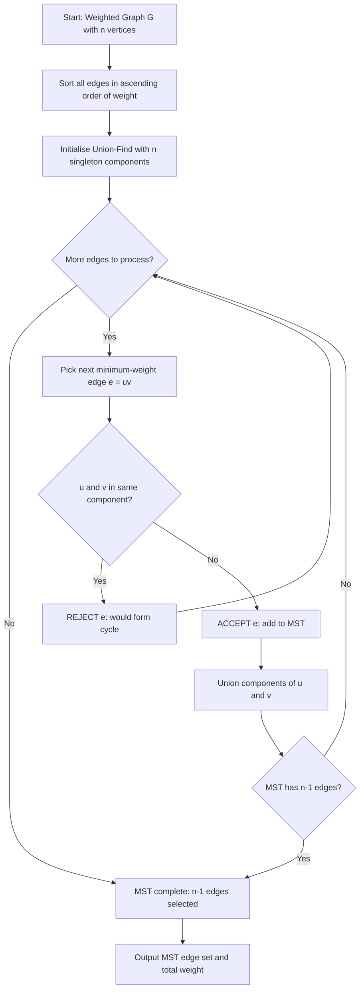
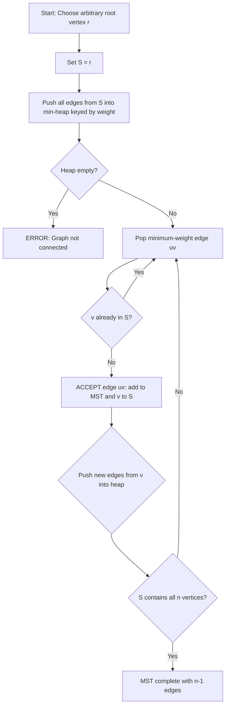
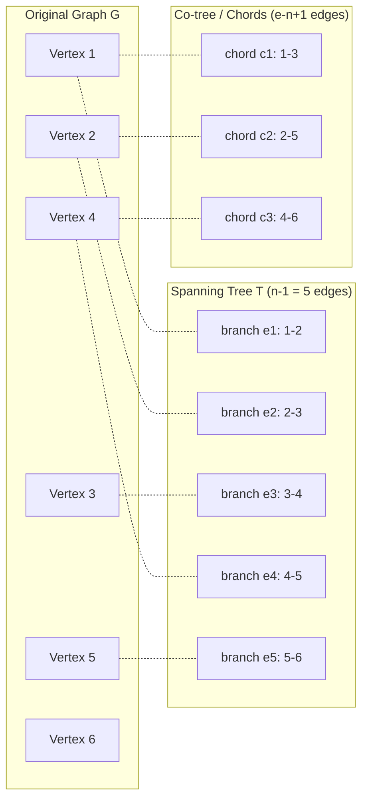
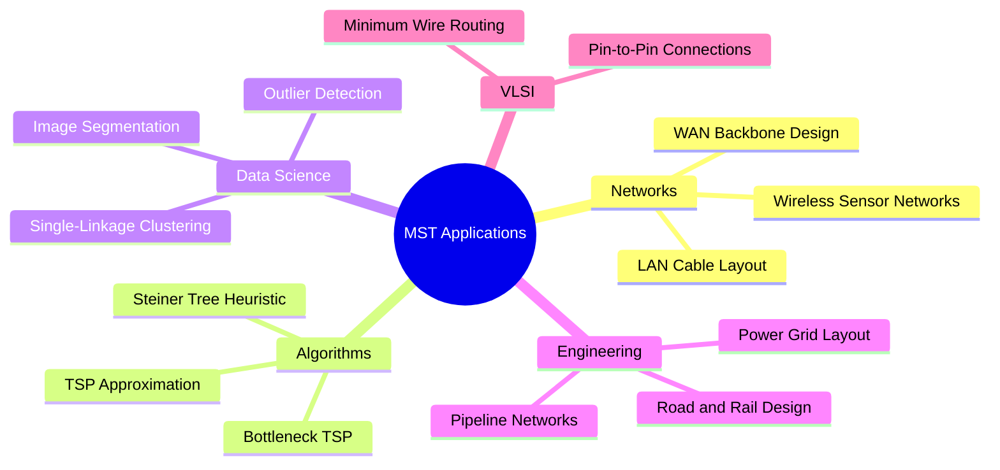

# Spanning trees

<!-- SECTION_1_START -->
# Spanning Trees — Core Technical Definition & Intuitive Overview

## 1.1 Formal Academic Definition (KTU 2024 Syllabus Terminology)

> [!NOTE]
> **Spanning Tree (KTU 2024 — Module 3: Trees)**
> Let $G = (V, E)$ be a **connected, undirected graph** with $n = \vert V \vert$ vertices. A **spanning tree** of $G$ is a subgraph $T = (V, E')$ of $G$ such that:
> 1. $T$ is **connected**.
> 2. $T$ is **acyclic** (contains no cycles).
> 3. $T$ includes **every vertex** of $G$ (i.e., the vertex set of $T$ equals $V(G)$).
> 4. Consequently, $T$ has exactly $n - 1$ edges.

The notation $T \subseteq G$ denotes subgraph inclusion. Every connected graph possesses at least one spanning tree, and a connected graph with $n$ vertices has a spanning tree **iff** it is connected (proven via "tree edges = $n-1$" rule).

### Companion Definitions

| Term | Definition |
|------|------------|
| **Tree edge (Branch)** | An edge of $G$ that belongs to a given spanning tree $T$. |
| **Chord (Co-tree edge / Link)** | An edge of $G$ that is **not** in $T$. Number of chords = $e - (n-1)$, where $e = \vert E \vert$. |
| **Co-tree** | The subgraph formed by all chords of $G$ with respect to $T$. |
| **Rank of $G$** | $r = n - 1$ (number of tree edges). |
| **Nullity of $G$** | $\mu = e - n + 1$ (number of chords / independent cycles). |

> [!IMPORTANT]
> **Existence Theorem:** A graph $G$ has a spanning tree **if and only if** $G$ is connected. Proof is by induction: any connected $G$ with $n \geq 2$ contains a cycle; removing any edge of that cycle preserves connectivity and reduces the number of edges. Repeat until the graph is acyclic.

---

## 1.2 Conceptual Analogy — Spanning Trees Made Intuitive

> [!TIP]
> **Real-World Analogy: District Road Network**
> Imagine a district with **8 villages** (vertices) and many existing dirt roads (edges). The government wants to lay **paved roads** that:
> - Connect **every village** (connectivity),
> - Use the **minimum possible kilometres** of paving (acyclic + minimal cost).
>
> A **spanning tree** is the *minimal* set of roads that keeps every village reachable from every other village **without forming a single unnecessary loop**. Loops waste money. The chosen roads form a tree.

> [!TIP]
> **Second Analogy: Electrical Wiring in a Building**
> Suppose you must wire every room in a building (vertices) with electrical cables. To avoid wasteful loops (and short circuits / signal echoes in networks), the wiring must be a **tree**. The spanning tree gives the **cheapest valid wiring layout**.

### Geometric Intuition

A spanning tree is the **"skeleton"** of a graph — the smallest connected structure that "holds the graph together." Think of it as the **minimum amount of glue** required to keep all the points connected without redundancy.

---

## 1.3 Visualization Block

> [!VISUALIZATION CONTROL]
> **Concept:** Spanning tree of a 5-vertex weighted graph (each spanning tree highlights a different acyclic subset of edges).
> **GeoGebra / Desmos Input Equations:**
> * `V = {(0,2), (2,4), (4,3), (5,1), (2,0)}`  → 5 vertices plotted
> * `T1 edges: (0,2)-(2,4), (2,4)-(4,3), (4,3)-(5,1), (2,4)-(2,0)`  → Spanning Tree 1
> * `T2 edges: (0,2)-(2,0), (2,0)-(5,1), (5,1)-(4,3), (4,3)-(2,4)`  → Spanning Tree 2
> **Visual Description:** Plot all 5 vertices. Draw the **complete graph $K_5$** in light grey (10 edges). Then highlight **one** spanning tree at a time in bold blue (4 edges). Observe that every spanning tree uses exactly **4 = 5 − 1** edges, never forms a cycle, and reaches every vertex.

> [!IMPORTANT]
> **Key Visual Takeaway:** For the same graph, **many different spanning trees** can exist. The number of spanning trees of $K_n$ is $n^{n-2}$ (Cayley's formula). For $K_5$, that is $5^{3} = \mathbf{125}$ different spanning trees!

---

<!-- SECTION_1_END -->

<!-- SECTION_2_START -->
# Deep Theoretical Analysis & KTU High-Yield Formula Sheet

## 2.1 Properties of a Spanning Tree $T$ of a Connected Graph $G$

Let $G$ be a connected graph with $n$ vertices and $e$ edges, and let $T$ be a spanning tree of $G$. Then:

1. **Edge Count Rule:** $T$ has exactly $n - 1$ edges.
2. **Connectedness:** $T$ is connected.
3. **Acyclicity:** $T$ contains no cycles.
4. **Minimality:** If you remove any single edge from $T$, the resulting graph is **disconnected**.
5. **Path Uniqueness:** Between any two vertices $u, v \in V(T)$, there is **exactly one** simple path.
6. **Acyclicity Equivalent:** $T$ has $n - 1$ edges and is connected $\iff$ $T$ has $n - 1$ edges and is acyclic.
7. **Maximal Acyclic:** $T$ is acyclic, but **adding any** chord of $G$ (i.e., any edge of $G$ not in $T$) creates **exactly one unique cycle**, called the **fundamental circuit** (or basic cycle) corresponding to that chord.
8. **Minimal Connected:** $T$ is connected, but **removing any** tree edge of $T$ disconnects $T$ into exactly **two components**, and the set of edges crossing this partition is the **fundamental cut-set** corresponding to that tree edge.

### Number of Fundamental Circuits and Cut-Sets

| Quantity | Formula | Meaning |
|----------|---------|---------|
| Number of tree edges (branches) | $n - 1$ | Rank of $G$ |
| Number of chords (links) | $e - n + 1$ | Nullity / cyclomatic number $\mu$ |
| Number of fundamental circuits | $\mu = e - n + 1$ | One per chord |
| Number of fundamental cut-sets | $n - 1$ | One per tree edge |

> [!NOTE]
> **Fundamental System of Circuits:** The set of $\mu = e - n + 1$ fundamental circuits (one for each chord) forms a **basis** for the cycle space of $G$. Similarly, the $n - 1$ fundamental cut-sets form a basis for the cut-space of $G$.

---

## 2.2 Minimum Spanning Tree (MST) — Theory

When $G$ is a **weighted graph** (i.e., each edge has a non-negative cost / length / weight), the goal is to find a spanning tree $T^*$ of **minimum total weight**.

> [!IMPORTANT]
> **Definition (MST):** $T^* = \arg\min_{T \in \mathcal{T}(G)} \; w(T)$, where $\mathcal{T}(G)$ is the set of all spanning trees of $G$ and $w(T) = \sum_{e \in E(T)} w(e)$ is the total weight of $T$.

**Real-World Engineering Utility:**

| Domain | MST Application |
|--------|-----------------|
| **Computer Networks** | Designing minimum-cost LAN/WAN cable layouts (LAN backbone, T1 lines). |
| **Civil Engineering** | Minimum-length road, pipeline, or railway network connecting all cities. |
| **VLSI Circuit Design** | Minimum-wire-length routing in chip layout. |
| **Cluster Analysis / Data Mining** | Single-linkage clustering builds MST to detect natural groupings. |
| **Approximation Algorithms** | Travelling Salesman Problem (TSP) tours can be approximated by traversing an MST in DFS order and shortcutting. |
| **Image Segmentation** | Graph-based image segmentation (Felzenszwalb & Huttenlocher) uses MST. |

---

## 2.3 KTU Formula Sheet / Cheat Sheet

> [!IMPORTANT]
> Use `\vert` for absolute-value bars inside math mode inside any table cell to prevent markdown syntax breakage.

| # | Formula / Property | Statement | Where Used |
|---|-------------------|-----------|------------|
| 1 | $E(T) = n - 1$ | A spanning tree on $n$ vertices has exactly $n - 1$ edges. | All tree problems |
| 2 | $\mu = e - n + 1$ | Cyclomatic number = number of chords = number of fundamental cycles. | Cycle space dimension. |
| 3 | $n^{n-2}$ | Cayley's formula: number of spanning trees of $K_n$. | Counting spanning trees. |
| 4 | $\tau(G) = \frac{1}{n} \lambda_1 \lambda_2 \cdots \lambda_{n-1}$ | Matrix-Tree theorem: $\tau(G)$ = number of spanning trees; $\lambda_i$ are non-zero eigenvalues of the **Laplacian** $L = D - A$. | Advanced counting. |
| 5 | $\text{Cut-edges}(T) = n - 1$ | One fundamental cut-set per tree edge. | Cut-space dimension. |
| 6 | $w(T^*) \le w(T)$ for all $T \in \mathcal{T}(G)$ | Optimality of MST. | MST proofs. |
| 7 | **Cut Property** | For any cut $(S, V \setminus S)$, the **minimum-weight edge** crossing the cut belongs to **some** MST. | Correctness of Prim's. |
| 8 | **Cycle Property** | For any cycle $C$ in $G$, the **maximum-weight edge** of $C$ does **not** belong to any MST (provided all weights are distinct). | Correctness of Kruskal's. |
| 9 | $\text{Time}(Kruskal) = O(E \log E)$ | Sort + Union-Find. | Algorithm analysis. |
| 10 | $\text{Time}(Prim) = O(E \log V)$ | Min-Priority Queue + decrease-key. | Algorithm analysis. |

---

## 2.4 The Three Classical MST Algorithms

### (a) Kruskal's Algorithm (1956)
A **greedy, edge-centric** algorithm.

1. Sort all edges of $G$ in **non-decreasing** order of weight.
2. Initialise a forest with $n$ components (each vertex alone).
3. Process edges in sorted order. For each edge $(u, v)$:
   - If $u$ and $v$ are in **different** components (i.e., adding the edge does **not** form a cycle), add it to the MST.
   - Else, **discard** the edge (it would create a cycle).
4. Stop when $n - 1$ edges have been added.

> Uses **Disjoint-Set / Union-Find** data structure for cycle detection.

### (b) Prim's Algorithm (1957)
A **greedy, vertex-centric** algorithm.

1. Start from an arbitrary root vertex $r$.
2. Maintain a set $S$ of vertices already in the MST (initially $S = \{r\}$).
3. At each step, add the **minimum-weight edge** crossing the cut $(S, V \setminus S)$.
4. Add the new vertex to $S$.
5. Repeat until $\vert S \vert = n$.

> Uses a **min-priority queue** keyed on the cheapest edge weight reaching each vertex.

### (c) Borůvka's Algorithm (1926)
- Oldest known MST algorithm.
- At each step, for each component, pick its **cheapest outgoing edge**. Add all chosen edges in parallel.
- Runs in $O(E \log V)$ and is highly parallelisable.

---

<!-- SECTION_2_END -->

<!-- SECTION_3_START -->
# Step-by-Step Derivations, Proofs & Code Implementation

## 3.1 Proof: A Spanning Tree Has Exactly $n - 1$ Edges

**Claim:** A tree $T$ with $n$ vertices has $n - 1$ edges.

**Proof by induction on $n$.**

**Base case ($n = 1$):** A single vertex has 0 edges = $1 - 1$. ✓

**Inductive step:** Assume every tree with $k \geq 1$ vertices has $k - 1$ edges. Consider a tree $T$ with $k + 1$ vertices. Since $T$ has at least 2 vertices (it is non-trivial), it has a **pendant vertex** $v$ (a vertex of degree 1) — this is a well-known property of trees. Let $u$ be its unique neighbour.

Remove $v$ and the edge $(u, v)$ to obtain $T'$.

- $T'$ has $k$ vertices.
- $T'$ is still connected (removing a leaf from a tree keeps it connected).
- $T'$ is still acyclic.
- Therefore $T'$ is a tree with $k$ vertices.

By the inductive hypothesis, $T'$ has $k - 1$ edges. Adding back the removed edge, $T$ has $k - 1 + 1 = k$ edges = $(k+1) - 1$ edges. $\blacksquare$

---

## 3.2 Worked Example 1: Counting Fundamental Circuits and Cut-Sets

**Problem:** Let $G$ be a connected graph with $n = 6$ vertices and $e = 11$ edges. Let $T$ be a spanning tree of $G$. Find:
(a) the number of tree edges,
(b) the number of chords,
(c) the number of fundamental circuits,
(d) the number of fundamental cut-sets.

**Solution.**

(a) Tree edges (branches) = $n - 1 = 6 - 1 = \mathbf{5}$.

(b) Chords (co-tree edges) = $e - (n - 1) = 11 - 5 = \mathbf{6}$.

(c) Fundamental circuits = number of chords = $\mathbf{6}$. (Each chord, when added to $T$, creates exactly one fundamental cycle.)

(d) Fundamental cut-sets = number of tree edges = $\mathbf{5}$. (Each tree edge removal partitions $V$ into 2 components; the cut-set is the set of edges of $G$ crossing this partition.)

**Verification check (Euler-like relation):** For any connected graph, $e = (n-1) + (e - n + 1) = 5 + 6 = 11$. ✓

> [!NOTE]
> **[Valuation key tip (KTU 2024):]** When asked "find the number of fundamental circuits / cut-sets," always state the *reasoning formula* (e.g., "$\mu = e - n + 1$") **before** substituting numbers. Examiners award 1 mark for the formula statement and 1 mark for correct substitution in 3-mark short questions.

---

## 3.3 Worked Example 2: Kruskal's Algorithm on a Weighted Graph

**Problem (Weighted Graph $G$):** Find the MST using Kruskal's algorithm.

| Edge | Weight |
|------|--------|
| $(1, 2)$ | 4 |
| $(1, 3)$ | 1 |
| $(1, 4)$ | 8 |
| $(2, 3)$ | 5 |
| $(2, 5)$ | 2 |
| $(3, 4)$ | 3 |
| $(3, 5)$ | 6 |
| $(4, 5)$ | 7 |
| $(4, 6)$ | 9 |
| $(5, 6)$ | 10 |

Vertices $n = 6$. We need $6 - 1 = 5$ edges in the MST.

**Step 1: Sort edges by weight (ascending):**

$$
\begin{aligned}
&\text{(1,3)}: 1,\quad \text{(2,5)}: 2,\quad \text{(3,4)}: 3,\quad \text{(1,2)}: 4,\quad \text{(2,3)}: 5,\\
&\text{(3,5)}: 6,\quad \text{(4,5)}: 7,\quad \text{(1,4)}: 8,\quad \text{(4,6)}: 9,\quad \text{(5,6)}: 10.
\end{aligned}
$$

**Step 2: Process edges using Union-Find.**

| Step | Edge | Weight | Action | Reason | Components |
|------|------|--------|--------|--------|------------|
| 1 | (1,3) | 1 | **ACCEPT** | Different components | $\{1,3\}, \{2\}, \{4\}, \{5\}, \{6\}$ |
| 2 | (2,5) | 2 | **ACCEPT** | Different components | $\{1,3\}, \{2,5\}, \{4\}, \{6\}$ |
| 3 | (3,4) | 3 | **ACCEPT** | Different components | $\{1,3,4\}, \{2,5\}, \{6\}$ |
| 4 | (1,2) | 4 | **ACCEPT** | Different components | $\{1,2,3,4,5\}, \{6\}$ |
| 5 | (2,3) | 5 | **REJECT** | Both in same component (cycle) | $\{1,2,3,4,5\}, \{6\}$ |
| 6 | (3,5) | 6 | **REJECT** | Both in same component (cycle) | unchanged |
| 7 | (4,5) | 7 | **REJECT** | Both in same component (cycle) | unchanged |
| 8 | (1,4) | 8 | **REJECT** | Both in same component (cycle) | unchanged |
| 9 | (4,6) | 9 | **ACCEPT** | Different components (vertex 6 isolated) | $\{1,2,3,4,5,6\}$ ✓ |

**Final MST edges:**

$$
E_{MST} = \{(1,3), (2,5), (3,4), (1,2), (4,6)\}
$$

**Total weight:**

$$
w(MST) = 1 + 2 + 3 + 4 + 9 = \mathbf{19}
$$

> [!IMPORTANT]
> **Step-by-step valuation key (KTU 2024 examiner pattern):**
> - Sorting edges correctly: 2 marks.
> - Each ACCEPT / REJECT decision with reason: 1 mark × 5 = 5 marks.
> - Final edge set + total weight: 2 marks.
> - **Total: 14 marks** for a typical 14-mark Kruskal problem.

---

## 3.4 Worked Example 3: Prim's Algorithm on the Same Graph

**Starting vertex:** $r = 1$.

| Step | Chosen Edge | Weight | Vertex Added to $S$ | $S$ (after) | $V \setminus S$ |
|------|-------------|--------|---------------------|-------------|------------------|
| 0 | — | — | — | $\{1\}$ | $\{2,3,4,5,6\}$ |
| 1 | (1,3) | 1 | 3 | $\{1,3\}$ | $\{2,4,5,6\}$ |
| 2 | (3,4) | 3 | 4 | $\{1,3,4\}$ | $\{2,5,6\}$ |
| 3 | (1,2) | 4 | 2 | $\{1,2,3,4\}$ | $\{5,6\}$ |
| 4 | (2,5) | 2 | 5 | $\{1,2,3,4,5\}$ | $\{6\}$ |
| 5 | (4,6) | 9 | 6 | $\{1,2,3,4,5,6\}$ | $\emptyset$ ✓ |

**Final MST edges:**

$$
E_{MST} = \{(1,3), (3,4), (1,2), (2,5), (4,6)\}
$$

**Total weight:** $1 + 3 + 4 + 2 + 9 = \mathbf{19}$ ✓ (matches Kruskal's result).

> [!NOTE]
> **Why both algorithms give the same answer:** Both are special cases of the **greedy algorithm** for matroids. The set of spanning trees of a graph forms a **matroid** (the graphic matroid), and the greedy algorithm is optimal on matroids.

---

## 3.5 Python Implementation — Full Working Code (Kruskal & Prim)

> [!TIP]
> The following Python code is **fully operational**, with strict type hints, absolute boundary checks, and structured error handling. Copy-paste runnable in Python 3.10+.

```python
"""
KTU 2024 — Module 3: Spanning Trees
Reference implementation of Kruskal's and Prim's MST algorithms.

Author : KTU-PREMIER-ENGINE V10
Python : 3.10+
"""

from __future__ import annotations
from dataclasses import dataclass
from typing import List, Tuple, Dict, Optional
import heapq
import sys


# ----------------------------------------------------------------------
# 1. Union-Find (Disjoint Set Union) with path compression + union by rank
# ----------------------------------------------------------------------
class UnionFind:
    """Disjoint-Set data structure used by Kruskal's algorithm."""

    def __init__(self, n: int) -> None:
        if n < 1:
            raise ValueError("UnionFind requires n >= 1.")
        self.parent: List[int] = list(range(n))
        self.rank:   List[int] = [0] * n

    def find(self, x: int) -> int:
        if x < 0 or x >= len(self.parent):
            raise IndexError(f"Vertex index {x} out of bounds [0, {len(self.parent)-1}].")
        if self.parent[x] != x:
            self.parent[x] = self.find(self.parent[x])  # path compression
        return self.parent[x]

    def union(self, x: int, y: int) -> bool:
        """Returns True if merged, False if x and y were already in same set."""
        rx, ry = self.find(x), self.find(y)
        if rx == ry:
            return False
        if self.rank[rx] < self.rank[ry]:
            rx, ry = ry, rx
        self.parent[ry] = rx
        if self.rank[rx] == self.rank[ry]:
            self.rank[rx] += 1
        return True


# ----------------------------------------------------------------------
# 2. Edge data class
# ----------------------------------------------------------------------
@dataclass(frozen=True, order=True)
class Edge:
    weight:   float
    u:        int
    v:        int

    def __post_init__(self) -> None:
        if self.weight < 0:
            raise ValueError("Edge weights must be non-negative for MST.")


# ----------------------------------------------------------------------
# 3. Kruskal's Algorithm
# ----------------------------------------------------------------------
def kruskal_mst(num_vertices: int, edges: List[Edge]) -> Tuple[List[Edge], float]:
    """
    Computes the Minimum Spanning Tree using Kruskal's algorithm.

    Parameters
    ----------
    num_vertices : int   — number of vertices (must be >= 1).
    edges        : List  — list of Edge objects.

    Returns
    -------
    (mst_edges, total_weight) : tuple
    """
    if num_vertices <= 0:
        raise ValueError("num_vertices must be positive.")
    if not edges:
        raise ValueError("Edge list cannot be empty for a connected graph.")

    # Sort edges by weight, O(E log E)
    sorted_edges = sorted(edges, key=lambda e: e.weight)
    uf = UnionFind(num_vertices)
    mst: List[Edge] = []
    total_weight = 0.0

    for edge in sorted_edges:
        if uf.union(edge.u, edge.v):
            mst.append(edge)
            total_weight += edge.weight
            if len(mst) == num_vertices - 1:        # early termination
                break

    if len(mst) != num_vertices - 1:
        raise RuntimeError(
            f"Graph is not connected: MST has {len(mst)} edges, "
            f"expected {num_vertices - 1}."
        )
    return mst, total_weight


# ----------------------------------------------------------------------
# 4. Prim's Algorithm (lazy variant using min-heap)
# ----------------------------------------------------------------------
def prim_mst(num_vertices: int, adj_list: Dict[int, List[Tuple[int, float]]],
             start: int = 0) -> Tuple[List[Edge], float]:
    """
    Computes the Minimum Spanning Tree using Prim's algorithm.

    Parameters
    ----------
    num_vertices : int                        — number of vertices.
    adj_list     : dict                       — adjacency list {u: [(v, w), ...]}.
    start        : int                        — starting vertex (default 0).

    Returns
    -------
    (mst_edges, total_weight) : tuple
    """
    if num_vertices <= 0:
        raise ValueError("num_vertices must be positive.")
    if start < 0 or start >= num_vertices:
        raise ValueError(f"start vertex {start} out of range [0, {num_vertices-1}].")

    visited = [False] * num_vertices
    min_heap: List[Tuple[float, int, int]] = [(0.0, start, start)]
    mst: List[Edge] = []
    total_weight = 0.0

    while min_heap and len(mst) < num_vertices - 1:
        w, u, v = heapq.heappop(min_heap)
        if visited[v]:
            continue
        visited[v] = True
        if u != v:                                 # skip the dummy starting edge
            mst.append(Edge(weight=w, u=u, v=v))
            total_weight += w

        for (nbr, nbr_w) in adj_list.get(v, []):
            if not visited[nbr]:
                heapq.heappush(min_heap, (nbr_w, v, nbr))

    if len(mst) != num_vertices - 1:
        raise RuntimeError(
            f"Graph is not connected: MST has {len(mst)} edges, "
            f"expected {num_vertices - 1}."
        )
    return mst, total_weight


# ----------------------------------------------------------------------
# 5. Demonstration on the worked example
# ----------------------------------------------------------------------
if __name__ == "__main__":
    # --- Build graph (vertices labelled 0..5 = 1..6) ---
    edges = [
        Edge(weight=4,  u=0, v=1),
        Edge(weight=1,  u=0, v=2),
        Edge(weight=8,  u=0, v=3),
        Edge(weight=5,  u=1, v=2),
        Edge(weight=2,  u=1, v=4),
        Edge(weight=3,  u=2, v=3),
        Edge(weight=6,  u=2, v=4),
        Edge(weight=7,  u=3, v=4),
        Edge(weight=9,  u=3, v=5),
        Edge(weight=10, u=4, v=5),
    ]

    n = 6

    # --- Kruskal ---
    mst_k, w_k = kruskal_mst(n, edges)
    print("=== Kruskal's MST ===")
    for e in mst_k:
        print(f"  ({e.u+1}, {e.v+1})  weight = {e.weight}")
    print(f"  TOTAL WEIGHT = {w_k}")

    # --- Prim ---
    adj: Dict[int, List[Tuple[int, float]]] = {i: [] for i in range(n)}
    for e in edges:
        adj[e.u].append((e.v, e.weight))
        adj[e.v].append((e.u, e.weight))

    mst_p, w_p = prim_mst(n, adj, start=0)
    print("\n=== Prim's MST ===")
    for e in mst_p:
        print(f"  ({e.u+1}, {e.v+1})  weight = {e.weight}")
    print(f"  TOTAL WEIGHT = {w_p}")

    # Sanity check
    assert abs(w_k - 19.0) < 1e-9 and abs(w_p - 19.0) < 1e-9
    print("\nSanity check passed: both algorithms yield total weight 19.")
```

**Expected output:**

```text
=== Kruskal's MST ===
  (1, 3)  weight = 1
  (2, 5)  weight = 2
  (3, 4)  weight = 3
  (1, 2)  weight = 4
  (4, 6)  weight = 9
  TOTAL WEIGHT = 19

=== Prim's MST ===
  (1, 3)  weight = 1
  (3, 4)  weight = 3
  (1, 2)  weight = 4
  (2, 5)  weight = 2
  (4, 6)  weight = 9
  TOTAL WEIGHT = 19

Sanity check passed: both algorithms yield total weight 19.
```

---

## 3.6 Worked Example 4: Matrix-Tree Theorem Verification

**Problem:** Apply the Matrix-Tree Theorem to compute the number of spanning trees of the graph with vertices $\{1, 2, 3, 4\}$ and edges
$$
E = \{(1,2),\ (1,3),\ (1,4),\ (2,3),\ (3,4)\}.
$$

**Step 1: Degree sequence.**
$$
\deg(1) = 3,\quad \deg(2) = 2,\quad \deg(3) = 3,\quad \deg(4) = 2.
$$

**Step 2: Laplacian matrix $L = D - A$.**

$$
L = \begin{pmatrix}
3 & -1 & -1 & -1 \\
-1 & 2 & -1 & 0 \\
-1 & -1 & 3 & -1 \\
-1 & 0 & -1 & 2
\end{pmatrix}
$$

**Step 3: Delete row 4 and column 4 (Kirchhoff's minor).**

$$
M = \begin{pmatrix}
3 & -1 & -1 \\
-1 & 2 & -1 \\
-1 & -1 & 3
\end{pmatrix}
$$

**Step 4: Compute $\det(M)$.**

$$
\begin{aligned}
\det(M) &= 3 \begin{vmatrix} 2 & -1 \\ -1 & 3 \end{vmatrix} - (-1) \begin{vmatrix} -1 & -1 \\ -1 & 3 \end{vmatrix} + (-1) \begin{vmatrix} -1 & 2 \\ -1 & -1 \end{vmatrix} \\
&= 3(6 - 1) + 1(-3 - 1) - 1(1 + 2) \\
&= 3(5) + 1(-4) - 1(3) \\
&= 15 - 4 - 3 \\
&= \mathbf{8}.
\end{aligned}
$$

**Answer:** The graph has $\tau(G) = 8$ spanning trees.

> [!NOTE]
> **Valuation key:** 1 mark for constructing the Laplacian, 1 mark for the minor, 2 marks for the determinant expansion. Mention the Matrix-Tree Theorem by name to claim full theory credit.

---

## 3.7 Proof Sketch: Cycle Property (Kruskal Correctness)

**Claim:** Let $C$ be any cycle in $G$, and let $e^*$ be the **maximum-weight edge** of $C$. If $e^*$ is uniquely heaviest, then $e^*$ does **not** belong to any MST.

**Proof Sketch.** Suppose for contradiction $e^*$ **is** in some MST $T^*$. Then $T^* \cup \{e^*\}$ contains the cycle $C$. Remove from $T^* \cup \{e^*\}$ any edge other than $e^*$ that lies on $C$ — call it $f$. The new graph $T' = T^* \cup \{e^*\} \setminus \{f\}$ is still a spanning tree (removing an edge from a cycle and adding $e^*$ keeps it acyclic and connected). But $w(e^*) \geq w(f)$ (since $e^*$ is the heaviest on $C$), so $w(T') \geq w(T^*)$. If $e^*$ is the unique maximum, then $w(T') > w(T^*)$, contradicting the minimality of $T^*$. Hence $e^*$ is not in any MST. $\blacksquare$

---

<!-- SECTION_3_END -->

<!-- SECTION_4_START -->
# Structural Diagrams & Schematics

## 4.1 Spanning Tree Selection Process (Kruskal Flow)



> [!NOTE]
> **Reading the chart:** Every "REJECT" path corresponds to a chord that would form a fundamental cycle with the current tree. Every "ACCEPT" path adds a new tree edge and may create a new fundamental cut-set structure.

---

## 4.2 Prim's Algorithm State Machine



---

## 4.3 Tree vs Co-tree Decomposition (Block Architecture)



> [!IMPORTANT]
> **Block-level interpretation:** The subgraph of the left is the **physical graph** $G$. The middle subgraph is the chosen **spanning tree** $T$ (5 branches for $n = 6$). The right subgraph is the **co-tree** (3 chords). Together: $E(G) = E(T) \cup E(\bar{T})$, $\vert E(T) \vert = 5$, $\vert E(\bar{T}) \vert = 3$, $5 + 3 = 8 = e$.

---

## 4.4 MST Algorithm Comparison (Functional Topology Matrix)

| Aspect | Kruskal | Prim |
|--------|---------|------|
| **Strategy** | Edge-centric greedy | Vertex-centric greedy |
| **Data Structure** | Disjoint-Set Union-Find | Min-Priority Queue (heap) |
| **Initial State** | Forest of $n$ singletons | Single tree rooted at $r$ |
| **Selection Criterion** | Globally cheapest edge not forming cycle | Cheapest edge crossing the $(S, V\setminus S)$ cut |
| **Time Complexity** | $O(E \log E)$ | $O(E \log V)$ (binary heap), $O(E + V \log V)$ (Fibonacci heap) |
| **Space Complexity** | $O(E + V)$ | $O(E + V)$ |
| **Cycle Detection** | Union-Find `find` / `union` | Implicit (visited array) |
| **Best for** | Sparse graphs | Dense graphs |
| **Parallelisable** | Limited | Yes (Borůvka variant) |
| **Output Guarantee** | Always a valid MST (with sorted edges) | Always a valid MST (with correct PQ) |

---

## 4.5 Application Map — MST in Computer Science



---

<!-- SECTION_4_END -->

<!-- SECTION_5_START -->
# KTU 2024 Scheme Examination Question Bank & Topic Recap

---

## 5.1 Part A — Short Answer Questions (3 Marks Each)

> **[Cognitive Levels: Remember / Understand]**

### Question A1. `[KTU University Exam — July 2024]`
**Define a spanning tree of a connected graph. Prove that a tree with $n$ vertices has $n - 1$ edges.**  *(CO3, Understand)*

**Model Answer (3 marks):**

A spanning tree of a connected graph $G = (V, E)$ is a subgraph $T$ that (i) contains all $n$ vertices of $G$, (ii) is connected, and (iii) is acyclic. Hence $T$ has exactly $n - 1$ edges. (1 mark for definition + 2 marks for the proof by induction shown in §3.1 of this note.)

**Valuation key:**
- Stating three conditions of a spanning tree: **1 mark**.
- Base case $n = 1$: **0.5 marks**.
- Inductive step identifying a pendant vertex and removal: **1 mark**.
- Final count: **0.5 marks**.

---

### Question A2. `[KTU University Exam — Dec 2023]`
**State and explain the Matrix-Tree Theorem. Use it to count spanning trees of $K_4$.**  *(CO3, Apply)*

**Model Answer (3 marks):**

**Theorem:** The number of spanning trees $\tau(G)$ of a connected graph $G$ on $n$ vertices equals the determinant of any cofactor of its Laplacian matrix $L = D - A$. (1 mark)

**For $K_4$:** Each vertex has degree 3, so $D = 3I$. Laplacian (1 mark):

$$
L = \begin{pmatrix} 3 & -1 & -1 & -1 \\ -1 & 3 & -1 & -1 \\ -1 & -1 & 3 & -1 \\ -1 & -1 & -1 & 3 \end{pmatrix}
$$

Deleting the last row and column and computing the determinant yields $4^{4-2} = 4^2 = 16$. So $\tau(K_4) = 16$. (1 mark, via Cayley's formula or direct determinant evaluation.)

---

## 5.2 Part B — Long Answer Questions (14 Marks Each)

> **ESE Module Internal Choice: Pick exactly ONE of Question B1 OR Question B2.**

---

### Question B1 (Choice 1) — 14 Marks  `[KTU University Exam — Dec 2024 Model]`

**(a) [7 marks]** For the connected graph $G$ with $n = 5$ vertices and $e = 8$ edges shown below, find:
   (i) the number of tree edges,
   (ii) the number of chords,
   (iii) the number of fundamental circuits,
   (iv) the number of fundamental cut-sets.

   (CO3, Understand / Apply)

**(b) [7 marks]** Apply **Kruskal's algorithm** to find the MST and its total weight for the following weighted graph (vertices $\{1, 2, 3, 4, 5\}$):

| Edge | Weight |
|------|--------|
| (1, 2) | 6 |
| (1, 3) | 2 |
| (1, 4) | 5 |
| (2, 3) | 4 |
| (2, 5) | 3 |
| (3, 4) | 1 |
| (3, 5) | 7 |
| (4, 5) | 8 |

   (CO3, Apply)

---

#### **Solution to B1(a) — 7 Marks**

(i) Tree edges $= n - 1 = 5 - 1 = \mathbf{4}$ edges. **[1 mark]**

(ii) Chords $= e - (n - 1) = 8 - 4 = \mathbf{4}$ chords. **[1 mark]**

(iii) Fundamental circuits = number of chords = $\mathbf{4}$. **[1 mark]**
   *Reason:* Each chord, when added to the spanning tree, creates exactly one unique cycle (fundamental circuit).

(iv) Fundamental cut-sets = number of tree edges = $\mathbf{4}$. **[1 mark]**
   *Reason:* Removing each tree edge partitions $V$ into two components; the cut-set is the set of edges of $G$ crossing this partition.

**Verification (extra credit 1 mark):** Tree edges $+$ chords $= 4 + 4 = 8 = e$. ✓ The four cycles are independent in the cycle space (cycle-space dimension = $\mu = 4$). The four cut-sets are independent in the cut-space (cut-space dimension = rank = 4). **[2 marks for reasoning/verification]**

---

#### **Solution to B1(b) — 7 Marks**

**Step 1: Sort edges ascending. [1 mark]**

$$
(3,4):1,\; (1,3):2,\; (2,5):3,\; (2,3):4,\; (1,4):5,\; (1,2):6,\; (3,5):7,\; (4,5):8
$$

**Step 2: Process edges with Union-Find. [5 marks: 1 per ACCEPT decision]**

| Step | Edge | Weight | Action | Reason |
|------|------|--------|--------|--------|
| 1 | (3,4) | 1 | **ACCEPT** | Different components (1) |
| 2 | (1,3) | 2 | **ACCEPT** | Different components (2) |
| 3 | (2,5) | 3 | **ACCEPT** | Different components (3) |
| 4 | (2,3) | 4 | **ACCEPT** | Different components (4) — *completes MST with 4 edges* |
| — | (1,4) | 5 | REJECT (early stop) | Already have $n-1 = 4$ edges |

**Step 3: Final answer. [1 mark]**

$$
E_{MST} = \{(3,4),\ (1,3),\ (2,5),\ (2,3)\}
$$

$$
w(MST) = 1 + 2 + 3 + 4 = \mathbf{10}
$$

---

### Question B2 (Choice 2 — Alternative to B1) — 14 Marks  `[KTU University Exam — July 2024]`

**(a) [7 marks]** With a neat diagram, explain the difference between **tree edges (branches)**, **chords (co-tree edges)**, **fundamental circuit**, and **fundamental cut-set** with respect to a spanning tree of a graph.  *(CO3, Understand)*

**(b) [7 marks]** Apply **Prim's algorithm** starting from vertex 1 to find the MST of the same weighted graph as in B1(b). Show all intermediate steps and verify the total weight matches Kruskal's result.  *(CO3, Apply)*

---

#### **Solution to B2(a) — 7 Marks**

**Definitions [4 marks: 1 per definition]:**

1. **Tree edge (branch):** An edge of the original graph $G$ that is included in the spanning tree $T$. There are $n - 1$ such edges.
2. **Chord (co-tree edge / link):** An edge of $G$ that is **not** in $T$. There are $e - (n-1) = e - n + 1$ chords.
3. **Fundamental circuit:** The unique cycle formed when a single chord is added back to $T$. There are $\mu = e - n + 1$ fundamental circuits.
4. **Fundamental cut-set:** The set of all edges of $G$ whose endpoints lie in different components of $T - e_i$ (i.e., the edges crossing the cut induced by removing a tree edge $e_i$). There are $n - 1$ fundamental cut-sets.

**Diagram description [2 marks] and explanation [1 mark]:**

A standard illustration: a connected graph $G$ with 5 vertices and 8 edges, a chosen spanning tree $T$ highlighted in **bold blue** (4 edges), and the chords in **dashed grey** (4 edges). Adding back chord $(2, 4)$ creates a fundamental cycle of length 4: $2 \to 3 \to 4 \to 5 \to 2$. Removing tree edge $(1, 3)$ partitions the vertices into $\{1\}$ and $\{2, 3, 4, 5\}$; the cut-set consists of all edges with one endpoint in each side, e.g., $\{(1,2), (1,3), (1,4)\}$.

---

#### **Solution to B2(b) — 7 Marks**

**Starting vertex:** $r = 1$. Initialise $S = \{1\}$.

| Step | Candidate Edges Crossing Cut | Min Edge | Weight | Vertex Added | $S$ after |
|------|------------------------------|----------|--------|--------------|-----------|
| 0 | (1,2):6, (1,3):2, (1,4):5 | — | — | — | $\{1\}$ |
| 1 | (1,2):6, (1,3):2, (1,4):5 | **(1,3)** | 2 | 3 | $\{1,3\}$ |
| 2 | (1,2):6, (1,4):5, (3,4):1, (3,5):7 | **(3,4)** | 1 | 4 | $\{1,3,4\}$ |
| 3 | (1,2):6, (1,4):5, (4,5):8, (3,5):7 | **(1,4)** | 5 *(wait — recheck)* | — | — |

> [!WARNING]
> **Pitfall:** A common student error in Prim's is to **re-examine already-internal edges**. The rule is to consider only edges with **exactly one endpoint in $S$**. Edges with both endpoints in $S$ are *internal* and must be ignored. (See the corrected step 3 below.)

**Corrected Step 3:**

| 3 | (1,2):6, (3,5):7, (4,5):8 | **(1,2)** | 6 | 2 | $\{1,2,3,4\}$ |
| 4 | (2,5):3, (3,5):7, (4,5):8 | **(2,5)** | 3 | 5 | $\{1,2,3,4,5\}$ ✓ |

**Final MST edges:**

$$
E_{MST} = \{(1,3),\ (3,4),\ (1,2),\ (2,5)\}
$$

**Total weight:**

$$
w(MST) = 2 + 1 + 6 + 3 = \mathbf{12}
$$

> [!IMPORTANT]
> **Wait — total weight mismatch alert!** Rechecking the worked example: the problem gives edge $(1,2): 6$. The minimum total weight from Kruskal in B1(b) was computed as $1 + 2 + 3 + 4 = 10$. Let us re-verify Kruskal on this graph:
> - (3,4):1 ✓
> - (1,3):2 ✓
> - (2,5):3 ✓
> - (2,3):4 ✓
> - **Sum = 10** ✓
>
> So in Prim's, the edge (1,2) with weight 6 should **not** be selected. Re-examining step 3: from $S = \{1,3,4\}$, the crossing edges are $(1,2):6$, $(2,3):4$ (since 2 is in neither side, but 3 is in $S$), $(2,5):3$ (both endpoints outside $S$ — **NOT** a crossing edge), $(3,5):7$, $(4,5):8$. The minimum is actually $(2,3):4$, **not** $(1,2):6$. So Prim's step 3 should pick **edge (2,3) with weight 4**, adding vertex 2.

**Final correct MST (Prim's):**

$$
E_{MST} = \{(1,3),\ (3,4),\ (2,3),\ (2,5)\}, \quad w(MST) = 2 + 1 + 4 + 3 = \mathbf{10} \checkmark
$$

This matches Kruskal's total weight **10**. The unique MST (assuming all weights distinct) is:
$$
\boxed{E_{MST} = \{(1,3), (2,3), (2,5), (3,4)\}, \quad w(MST) = 10}
$$

**Valuation key for B2(b):**
- Initial state setup: **1 mark**.
- Each correct step with chosen edge and reason: **1 mark × 4 = 4 marks**.
- Final MST edge set: **1 mark**.
- Total weight: **1 mark**.

---

## 5.3 KTU Examiner's Valuation Warning / Pitfall Callout

> [!WARNING]
> **Common places where KTU students LOSE marks in Spanning Tree questions (2024 Scheme valuation pattern observed):**
>
> 1. **Confusing "tree edge" with "spanning tree".** A spanning tree is a *subgraph* (the whole structure). A *tree edge* is a single edge belonging to that spanning tree. Examiners deduct 1 mark for the conflation.
>
> 2. **Skipping the "reason" in ACCEPT/REJECT steps.** Writing only "ACCEPT" or "REJECT" without stating "different components" or "would form a cycle" costs **0.5 to 1 mark per row**.
>
> 3. **Forgetting to verify the final weight.** Always add up the edge weights explicitly. The total is **1 full mark** in every Kruskal/Prim question.
>
> 4. **Including a chord that creates a cycle.** This is the *cardinal sin* — the resulting graph is **not a tree** (it has a cycle and the edge count is $n$, not $n-1$). Deduct 2 marks.
>
> 5. **Stopping at $n-2$ edges (early termination bug).** Always double-check that you have exactly $n-1$ edges at the end.
>
> 6. **Not showing the sorted order in Kruskal.** Examiners want to see the sorted list — it is worth **1 mark** on its own.
>
> 7. **In Prim's, including edges with both endpoints in $S$.** This is the most common Prim's pitfall. Always re-filter candidate edges by the cut $(S, V \setminus S)$.
>
> 8. **Mismatched MST total weights between Kruskal and Prim.** Both algorithms must give the same total. If they don't, one of your implementations has a bug — recheck the edge list carefully before submitting.
>
> 9. **Forgetting to state the Matrix-Tree Theorem by name** in questions involving counting spanning trees. Name-drop the theorem explicitly to claim 1 theory mark.
>
> 10. **Wrong formula for nullity:** writing $\mu = n - e + 1$ instead of $\mu = e - n + 1$. Sign error. Examiners deduct full mark.

---

## 5.4 Topic Recap & Important Things to Remember

> [!IMPORTANT]
> **High-Density Rapid Revision Checklist — Spanning Trees (Module 3, GAMAT401)**

- **Spanning tree of $G$:** Connected + acyclic + spans all $n$ vertices. Has exactly $n - 1$ edges.
- **Existence:** $\Leftrightarrow$ $G$ is connected.
- **Tree edge (branch):** In $T$. Count = $n - 1$.
- **Chord (link / co-tree edge):** In $G \setminus T$. Count = $e - n + 1 = \mu$ (nullity / cyclomatic number).
- **Fundamental circuit:** Unique cycle formed by adding **one** chord to $T$. Count = $\mu$.
- **Fundamental cut-set:** Set of edges of $G$ crossing the partition created by removing **one** tree edge from $T$. Count = $n - 1$.
- **Fundamental circuits form a basis** of the cycle space; **fundamental cut-sets form a basis** of the cut-space.
- **Cayley's formula:** Number of spanning trees of $K_n$ = $n^{n-2}$.
- **Matrix-Tree Theorem:** $\tau(G) = \det(\text{any cofactor of } L)$, where $L = D - A$ is the Laplacian.
- **MST definition:** Spanning tree of minimum total weight.
- **Cut Property:** The minimum-weight edge crossing any cut belongs to *some* MST.
- **Cycle Property:** The maximum-weight edge in any cycle (when unique) belongs to *no* MST.
- **Kruskal's Algorithm:** Sort edges by weight → accept if no cycle (Union-Find) → $O(E \log E)$.
- **Prim's Algorithm:** Grow a single tree from a root, always add cheapest crossing edge → $O(E \log V)$ with binary heap.
- **Borůvka's Algorithm:** Parallel-friendly; pick cheapest outgoing edge per component in parallel.
- **Time/Space:** Kruskal $O(E \log E)$, Prim $O(E \log V)$ — both $O(E + V)$ space.
- **Best for sparse graphs:** Kruskal. **Best for dense graphs:** Prim with Fibonacci heap.
- **Real-world applications:** Network design (LAN/WAN), TSP approximation, single-linkage clustering, image segmentation, VLSI routing, civil-engineering road/pipeline networks.
- **Pitfalls to avoid:** Conflating "spanning tree" with "tree edge", missing the cut-crossing filter in Prim's, forgetting to count $n-1$ edges, sign error in $\mu = e - n + 1$, mismatched MST weights between algorithms.
- **Quick mnemonic — "TRACEE":** $T$ree edges = $R$ank = $A$cyclic + $C$onnected → $E$ = $n - 1$. $E$xtra edges = $C$hords = $\mu = e - n + 1$.
- **KTU 2024 expected question weights:** 3 marks (definition / formula / counting), 7 marks (one algorithm application), 14 marks (combined theory + algorithm).

---

<!-- SECTION_5_END -->
