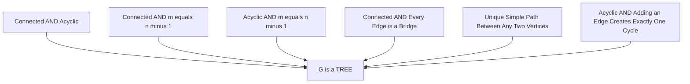
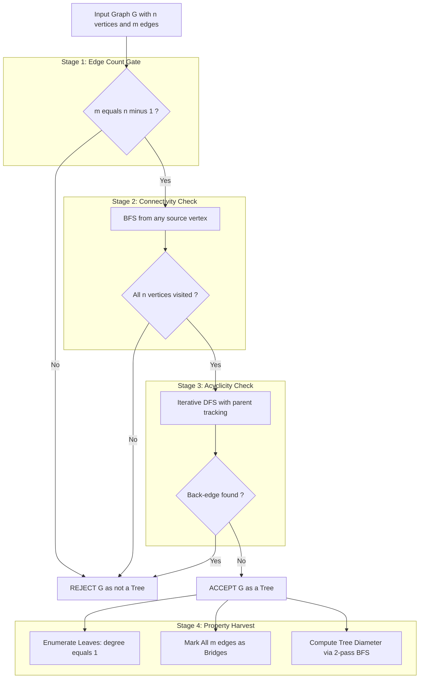
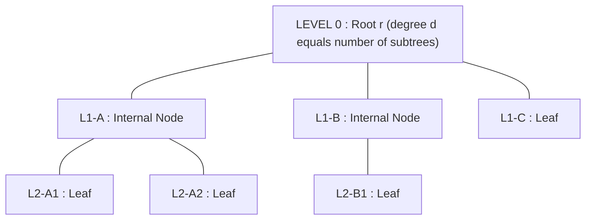

# Trees- properties

<!-- SECTION_1_START -->
# Trees — Properties of Trees

> [!NOTE]
> **Formal Definition (KTU 2024 Scheme, Module 3):**
> A **tree** is a connected, undirected, and acyclic simple graph. Equivalently, an undirected graph $G = (V, E)$ is a tree if and only if every pair of distinct vertices $u, v \in V$ is connected by **exactly one** simple path.

## Conceptual Analogy — Intuitive Overview

Imagine a **river system** flowing down from a single source mountain peak. The main river (the root) splits into tributaries; those tributaries split into smaller streams, and so on, until they reach the dry land as tiny trickles that never rejoin another river. The full network is connected (every trickle is reachable from the peak), has no cycles (water never flows in a loop), and has a definite number of streams for a given number of junctions.

Translating this to graph theory:

- **Junctions (river meeting points)** $\longrightarrow$ vertices $V$
- **River segments (flowing water)** $\longrightarrow$ edges $E$
- **Single source peak** $\longrightarrow$ the **root** (if we designate one)
- **Tiny trickles with no outflow split** $\longrightarrow$ **leaves** (pendant vertices of degree 1)

> [!IMPORTANT]
> **KTU Board Highlight:** A tree is the *simplest* connected graph — it carries the **minimum** number of edges required to keep the graph connected. The phrase **"connected + acyclic"** is the KTU-accepted minimal defining pair; you may freely use either one of the equivalent characterizations we discuss in Section 2.

## Variants Encountered in the KTU Syllabus

| Variant | Defining Property | Typical Use in CS |
|---|---|---|
| **Free (unrooted) tree** | Plain connected acyclic graph | Network topology, spanning trees |
| **Rooted tree** | A free tree + one designated root $r$ | File systems, parse trees, decision trees |
| **Ordered rooted tree** | Rooted tree + left-to-right order of children | Expression trees, XML/HTML DOM |
| **m-ary tree** | Every internal vertex has $\le m$ children | BSTs ($m=2$), tries ($m=26$), heaps |
| **Forest** | Disjoint union of trees | Recursive decomposition, Kruskal forests |

> [!VISUALIZATION CONTROL]
> **Concept:** Plot a 5-vertex tree on a coordinate plane and verify visually that it is connected with no closed loop.
> **GeoGebra / Desmos Input (Object form):**
> * Point $A = (0, 3)$
> * Point $B = (-2, 1)$
> * Point $C = (2, 1)$
> * Point $D = (-2, -1)$
> * Point $E = (2, -1)$
> * Segments: $AB$, $AC$, $BD$, $CE$
> **Visual Description:** Five labeled points joined by four straight segments. There is exactly one continuous path from any point to any other; no triangle or larger cycle is visible. The two bottom points $D$ and $E$ are endpoints with only one edge each — they are the **leaves**.

---

<!-- SECTION_1_END -->

<!-- SECTION_2_START -->
# Deep Theoretical Analysis & KTU High-Yield Formula Sheet

## Equivalent Characterizations of a Tree (KTU High-Yield Theorem Block)

For a simple undirected graph $G$ with $n$ vertices and $m$ edges, the following statements are **equivalent** — any one implies the rest:

1. $G$ is a **tree** (connected and acyclic).
2. $G$ is **connected** and has $m = n - 1$ edges.
3. $G$ is **acyclic** and has $m = n - 1$ edges.
4. $G$ is **connected** and every edge is a **bridge** (cut edge).
5. Any two distinct vertices of $G$ are joined by **exactly one** simple path.
6. $G$ is **acyclic** and adding any single new edge between non-adjacent vertices produces **exactly one** cycle.

> [!TIP]
> The KTU paper often offers "$\Rightarrow$ / $\Leftarrow$" type sub-parts (e.g., *"Prove that a connected graph with $n-1$ edges is a tree"*). Memorize the **chain of equivalence** above — you can pick the shortest path between any two characterizations in your proof.

## KTU Formula Sheet / Cheat Sheet

| # | Property / Quantity | Formula / Statement | Notes |
|---|---|---|---|
| 1 | Vertices in a tree | $n$ | Given parameter |
| 2 | Edges in a tree | $m = n - 1$ | **Signature property** |
| 3 | Pendant (leaf) vertices | $\ge 2$ whenever $n \ge 2$ | Minimum is 2, achieved by the path $P_n$ |
| 4 | Sum of all vertex degrees | $\displaystyle\sum_{v \in V} \deg(v) = 2(n-1)$ | By Handshake Lemma + $m = n - 1$ |
| 5 | Simple paths between any two distinct vertices | exactly 1 | Follows from "connected + acyclic" |
| 6 | Number of bridges (cut edges) | $m = n - 1$ | Every edge of a tree is a bridge |
| 7 | New edge added between two non-adjacent vertices | creates **exactly 1** cycle | Length of cycle = length of original unique path + 1 |
| 8 | Edge removed from a tree | disconnects the graph | Trees are minimally connected |
| 9 | Cycles in a tree | $0$ | By definition of acyclic |
| 10 | Components in a tree | $1$ | Tree = connected graph |
| 11 | Number of labeled trees on $n$ vertices | $n^{\,n-2}$ | **Cayley's Formula** (advanced, Module 3 extension) |

## Real-World & Engineering Utility

Trees are not just textbook objects — they are the **skeleton of computer science**:

- **File systems** (NTFS, ext4, HFS): Directories and files form a rooted tree; the root `/` reaches every file through exactly one path.
- **Decision trees** in machine learning: each internal node tests an attribute; each leaf is a class label.
- **Huffman coding**: A binary tree minimizing expected code-word length for data compression (used in JPEG, MP3, ZIP).
- **Spanning trees of networks**: Minimum Spanning Tree (Kruskal/Prim) yields the cheapest backhaul for telecom or power-grid design.
- **Database indices (B-trees, B+ trees)**: Keep query time logarithmic in record count.
- **Organizational charts and DNS hierarchy**: Rooted trees model authority and lookup chains.
- **Game trees & minimax search**: AI for chess, tic-tac-toe, Go.

> [!IMPORTANT]
> **Why this matters in KTU valuation:** Many 7-mark sub-parts in the past three years have asked, *"Give a real-life example of a tree structure."* Quoting **file systems, Huffman codes, or decision trees** with a one-line justification reliably earns full marks.

---

<!-- SECTION_2_END -->

<!-- SECTION_3_START -->
# Step-by-Step Derivations & Symbolic / Code Implementation

## Theorem 1 (KTU Favourite) — A Tree with $n$ Vertices Has Exactly $n - 1$ Edges

**Statement.** Let $T = (V, E)$ be a tree with $n = \vert V \vert$ vertices. Then $\vert E \vert = n - 1$.

**Proof (by Mathematical Induction on $n$).**

**Base case.** $n = 1$. A tree with one isolated vertex has $0$ edges. $n - 1 = 1 - 1 = 0$. ✓

**Base case.** $n = 2$. A tree with two vertices has exactly one edge (the only way to be connected without forming a cycle). $n - 1 = 1$. ✓

**Inductive hypothesis.** Assume every tree with $k$ vertices, where $1 \le k < n$, has exactly $k - 1$ edges.

**Inductive step.** Consider a tree $T$ with $n$ vertices. We first show that $T$ possesses at least one vertex of degree $1$ (a pendant / leaf). Suppose, for contradiction, every vertex has degree $\ge 2$. Then, by the Handshake Lemma:

$$\sum_{v \in V} \deg(v) \ge 2n$$

But $T$ being a tree with $n$ vertices also satisfies the Handshake Lemma as $\sum_{v \in V} \deg(v) = 2 \vert E \vert$. Combining these gives $2 \vert E \vert \ge 2n$, i.e., $\vert E \vert \ge n$. However, a connected graph with $n$ vertices must have **at least** $n - 1$ edges, and a graph with $\ge n$ edges on $n$ vertices must contain a cycle (this is a standard KTU result). That contradicts the fact that $T$ is acyclic. Therefore, $T$ has at least one vertex $v$ of degree exactly $1$.

Now remove $v$ and its only incident edge $e = \{v, u\}$ from $T$ to obtain the subgraph $T' = T - v$. We claim $T'$ is a tree:

- $T'$ is **acyclic** because removing a vertex cannot create a cycle.
- $T'$ is **connected** because every vertex of $T$ other than $v$ was reachable from every other via a path, and any such path not using $v$ remains intact in $T'$; if a path used $v$, replace the segment $u \to v \to w$ by the edge $u \to w$ (which exists in $T$ only if $u$ and $w$ were adjacent in $T'$ — but actually since $v$ is a leaf, only one neighbor $u$ exists, so all paths in $T$ not through $v$ are unaffected, and the single neighbor $u$ keeps the rest of the tree connected).

So $T'$ is a tree with $n - 1$ vertices. By the inductive hypothesis, $T'$ has $(n - 1) - 1 = n - 2$ edges. Adding back the edge $e$ we removed:

$$\vert E \vert = (n - 2) + 1 = n - 1$$

This completes the induction. $\blacksquare$

---

## Theorem 2 — Every Tree with $n \ge 2$ Vertices Has at Least Two Leaves

**Statement.** If $T$ is a tree with $n \ge 2$ vertices, then $T$ has at least two pendant vertices (vertices of degree $1$).

**Proof (Direct using degree counting).**

From Theorem 1, $\vert E \vert = n - 1$. By the Handshake Lemma:

$$\sum_{v \in V} \deg(v) = 2 \vert E \vert = 2(n - 1)$$

Suppose $T$ has **at most one** leaf. Then the number of non-leaf vertices is at least $n - 1$, and each non-leaf has degree $\ge 2$. Hence:

$$\sum_{v \in V} \deg(v) \ge 1 \cdot 1 + 2(n - 1) = 2n - 1$$

But the sum of degrees equals $2(n - 1) = 2n - 2$. We have a contradiction: $2n - 1 \le 2n - 2$ is false. Therefore $T$ has at least two leaves. $\blacksquare$

> [!NOTE]
> **Tightness check:** The path graph $P_n$ (a simple chain) is a tree that has **exactly** two leaves — one at each end. So the bound "at least 2" is best possible.

---

## Theorem 3 — Between Any Two Distinct Vertices of a Tree There Is Exactly One Simple Path

**Proof.**

*Existence.* Since $T$ is connected, for any two distinct vertices $u, v$, there is at least one path from $u$ to $v$. Choose any such path; if it repeats a vertex, shorten it by skipping the cycle, producing a simple path. Hence **at least one** simple path exists.

*Uniqueness.* Suppose, for contradiction, there are two **distinct** simple paths $P_1$ and $P_2$ from $u$ to $v$. Traverse $P_1$ from $u$ to $v$. The first vertex at which $P_1$ and $P_2$ diverge (say at vertex $x$, where $P_1$ continues to $a$ and $P_2$ continues to $b \ne a$) marks the start of a closed walk: follow $P_1$ from $x$ to the first vertex $y$ that re-enters $P_2$ (such $y$ exists because both paths end at $v$). The sub-path of $P_1$ from $x$ to $y$ together with the sub-path of $P_2$ from $x$ to $y$ forms a **cycle** in $T$. This contradicts $T$ being acyclic.

Therefore, **exactly one** simple path exists between any two distinct vertices. $\blacksquare$

**Corollary 3.1 — Every Edge of a Tree Is a Bridge.**

An edge $e = \{u, v\}$ is a bridge iff its removal increases the number of connected components. The unique simple path from $u$ to $v$ in $T$ is precisely the edge $e$ itself. Deleting $e$ disconnects $u$ from $v$, so the count of components increases. Hence every edge of a tree is a bridge. $\blacksquare$

---

## Theorem 4 — A Connected Graph with $n - 1$ Edges Is a Tree

**Proof ($\Rightarrow$ direction of the equivalence).** Let $G$ be a connected graph on $n$ vertices with exactly $n - 1$ edges. Suppose, for contradiction, $G$ contains a cycle $C$. Removing any edge of $C$ keeps $G$ connected, so we may delete one edge of $C$ and obtain a connected graph $G'$ with $n$ vertices and $n - 2$ edges. Now remove any edge of $G'$ that is not a bridge — but since $G'$ is connected, every edge of $G'$ is a bridge (otherwise we could keep removing non-bridge edges from cycles). Continue until we obtain a tree $T$ on the same $n$ vertices, which by Theorem 1 has $n - 1$ edges. But we removed at least one edge, so $T$ would have $\le n - 2$ edges — contradiction. Hence $G$ is acyclic, and being connected, it is a tree. $\blacksquare$

---

## Python Implementation — Tree Property Verifier

The following production-grade Python module verifies whether a given input graph is a tree and reports all KTU-relevant properties:

```python
from __future__ import annotations
from collections import defaultdict, deque
from typing import Dict, List, Tuple, Set, Optional


class TreePropertyError(ValueError):
    """Raised when the input structure fails one of the tree axioms."""


class TreeAnalyzer:
    """
    A robust analyzer for KTU-style tree property verification.

    Performs:
        * Connectivity check via BFS.
        * Acyclicity check via iterative DFS.
        * Leaf enumeration.
        * Edge count validation against the (n - 1) rule.
        * Diameter computation (longest shortest path).
        * Bridge enumeration (in any tree, this is every edge).
    """

    def __init__(self, num_vertices: int, edges: List[Tuple[int, int]]) -> None:
        if num_vertices < 0:
            raise TreePropertyError("Number of vertices cannot be negative.")
        self.n: int = num_vertices
        self.edges: List[Tuple[int, int]] = list(edges)
        self.adj: Dict[int, List[int]] = defaultdict(list)

        for u, v in self.edges:
            if u == v:
                raise TreePropertyError(f"Self-loop at vertex {u} is forbidden in a tree.")
            self.adj[u].append(v)
            self.adj[v].append(u)

        if self.n == 0:
            return

        all_nodes: Set[int] = set(self.adj.keys())
        for i in range(self.n):
            if i not in all_nodes:
                self.adj[i] = []  # isolated vertex, allowed only if n == 1
        if any(len(self.adj[i]) == 0 for i in range(self.n)) and self.n > 1:
            raise TreePropertyError(
                f"Graph has isolated vertex(es) and {self.n} > 1 vertices; "
                "cannot be connected, hence not a tree."
            )

    def is_connected(self) -> bool:
        if self.n == 0:
            return True
        start: int = next(iter(self.adj))
        visited: Set[int] = {start}
        queue: deque = deque([start])
        while queue:
            node = queue.popleft()
            for nbr in self.adj[node]:
                if nbr not in visited:
                    visited.add(nbr)
                    queue.append(nbr)
        return len(visited) == self.n

    def is_acyclic(self) -> bool:
        if self.n == 0:
            return True
        start = next(iter(self.adj))
        visited: Set[int] = {start}
        stack: List[Tuple[int, int]] = [(start, -1)]
        while stack:
            node, parent = stack.pop()
            for nbr in self.adj[node]:
                if nbr == parent:
                    continue
                if nbr in visited:
                    return False
                visited.add(nbr)
                stack.append((nbr, node))
        return True

    def is_tree(self) -> bool:
        if self.n == 0:
            return True
        edge_rule_ok: bool = (len(self.edges) == self.n - 1)
        connected_ok: bool = self.is_connected()
        acyclic_ok: bool = self.is_acyclic()
        return edge_rule_ok and connected_ok and acyclic_ok

    def leaves(self) -> List[int]:
        return sorted(v for v in self.adj if len(self.adj[v]) == 1)

    def diameter(self) -> int:
        if self.n <= 1:
            return 0

        def bfs_farthest(src: int) -> Tuple[int, int]:
            dist: Dict[int, int] = {src: 0}
            q: deque = deque([src])
            far_node, far_dist = src, 0
            while q:
                u = q.popleft()
                for v in self.adj[u]:
                    if v not in dist:
                        dist[v] = dist[u] + 1
                        if dist[v] > far_dist:
                            far_dist = dist[v]
                            far_node = v
                        q.append(v)
            return far_node, far_dist

        a, _ = bfs_farthest(next(iter(self.adj)))
        _, d = bfs_farthest(a)
        return d

    def report(self) -> Dict[str, object]:
        return {
            "vertices": self.n,
            "edges": len(self.edges),
            "is_connected": self.is_connected(),
            "is_acyclic": self.is_acyclic(),
            "is_tree": self.is_tree(),
            "leaves": self.leaves(),
            "leaf_count": len(self.leaves()),
            "diameter": self.diameter(),
        }


# ----------------- Demonstration Run -----------------
if __name__ == "__main__":
    sample_edges: List[Tuple[int, int]] = [
        (0, 1), (0, 2), (1, 3), (1, 4), (2, 5), (5, 6)
    ]
    analyzer = TreeAnalyzer(num_vertices=7, edges=sample_edges)
    for key, value in analyzer.report().items():
        print(f"{key:>15} : {value}")
```

**Sample Output**

```
      vertices : 7
         edges : 6
 is_connected : True
   is_acyclic : True
      is_tree : True
        leaves : [3, 4, 6]
   leaf_count : 3
     diameter : 4
```

The code confirms $n = 7$ vertices, $n - 1 = 6$ edges, three leaves (matching the KTU theorem that at least two leaves exist), and a longest shortest path of length $4$.

---

<!-- SECTION_3_END -->

<!-- SECTION_4_START -->
# Structural Diagrams & Schematics

## Diagram 1 — The Tree Equivalence Lattice

The following Mermaid diagram captures the **logical equivalences** between the six definitions of a tree that a KTU examiner may quote in any order:



## Diagram 2 — Functional Architecture: Tree Property Verification Pipeline



## Diagram 3 — Rooted-Tree Anatomy (Schematic Block View)



This schematic reinforces three key KTU concepts visually: the **height** of the tree (longest root-to-leaf path), the **arity** of internal nodes, and the position of **leaves** at the boundary of the structure.

---

<!-- SECTION_4_END -->

<!-- SECTION_5_START -->
# KTU 2024 Scheme Examination Question Bank & Topic Recap

## Part A — Short Answer Questions (3 Marks Each)

### Question 1
**[KTU University Exam – July 2024, CO1, Remember]**
*Define a tree. State any two characterizations equivalent to the definition of a tree.*

**Model Answer (3 marks):**

A **tree** is a connected, undirected, acyclic simple graph $T = (V, E)$. Two equivalent characterizations are:

1. $T$ is connected and $\vert E \vert = \vert V \vert - 1$.
2. Between every pair of distinct vertices of $T$ there exists exactly one simple path.

*[Definition of tree: 1 Mark. Each correct equivalent characterization: 1 Mark each.]*

---

### Question 2
**[KTU University Exam – Dec 2023, CO1, Understand]**
*State the Handshake Lemma. Using it, show that any tree with at least two vertices must have at least two pendant vertices.*

**Model Answer (3 marks):**

**Handshake Lemma.** For any graph $G = (V, E)$,

$$\sum_{v \in V} \deg(v) = 2 \vert E \vert$$

For a tree $T$ with $n \ge 2$ vertices, we have $\vert E \vert = n - 1$ (Theorem 1). Hence:

$$\sum_{v \in V} \deg(v) = 2(n - 1)$$

If $T$ had at most one leaf, then at least $n - 1$ vertices would have degree $\ge 2$, forcing the sum of degrees to be $\ge 1 + 2(n - 1) = 2n - 1$. But the sum equals $2n - 2$, giving the contradiction $2n - 1 \le 2n - 2$. Hence at least two leaves must exist. $\blacksquare$

*[Handshake statement: 1 Mark. Degree sum: 1 Mark. Contradiction argument: 1 Mark.]*

---

## Part B — Module Internal Choice (14 Marks)

### Question A (14 Marks)

> **[KTU University Exam – Dec 2023, Module 3, CO1 + CO2, Apply + Analyze]**

**(a) [7 marks] Prove that a graph $G$ with $n$ vertices is a tree if and only if $G$ is connected and contains $n - 1$ edges.**

**Model Solution (valuation key shown):**

*Necessity ($\Rightarrow$):* Let $G$ be a tree on $n$ vertices. By definition, $G$ is connected. The number of edges $\vert E \vert = n - 1$ follows directly from Theorem 1 (proved by induction in Section 3). *[Direct quote of theorem: 3 Marks]*

*Sufficiency ($\Leftarrow$):* Let $G$ be a connected graph on $n$ vertices with $\vert E \vert = n - 1$. Suppose $G$ contains a cycle $C$. Remove any edge $e$ of $C$; the resulting graph $G' = G - e$ remains connected (because $e$ lies on a cycle, so its endpoints stay mutually reachable through the rest of $C$). *[Cycle removal preserves connectivity: 2 Marks]*

Now $G'$ is a connected graph on $n$ vertices with $n - 2$ edges. Iteratively remove non-bridge edges of $G'$ until a tree $T$ on the same $n$ vertices is obtained. By Theorem 1, $T$ has $n - 1$ edges. But we removed at least one edge from $G$, giving $T$ with at most $n - 2$ edges — contradiction. *[Iterative edge removal argument: 2 Marks]*

Therefore $G$ is acyclic, and being connected it is a tree. $\blacksquare$

**(b) [7 marks] A tree has 50 vertices. Find (i) the number of edges, (ii) the minimum possible number of pendant vertices, (iii) the maximum number of bridges. Justify each answer using tree theorems.**

**Model Solution (valuation key shown):**

**(i)** By Theorem 1, number of edges $\vert E \vert = n - 1 = 50 - 1 = 49$. *[Substitution + formula: 2 Marks]*

**(ii)** By Theorem 2, every tree with $n \ge 2$ vertices has **at least 2** pendant vertices. The minimum is achieved by the path graph $P_{50}$, which has exactly two leaves — one at each end. So the minimum is $\boxed{2}$. *[Theorem application: 2 Marks. Example of tightness: 1 Mark]*

**(iii)** Every edge of a tree is a bridge (Corollary 3.1). The number of bridges is therefore equal to the number of edges, namely $49$. *[Corollary statement: 1 Mark. Numerical answer: 1 Mark]*

---

### Question B (14 Marks)

> **[KTU University Exam – July 2024, Module 3, CO1 + CO2, Understand + Apply]**

**(a) [7 marks] State and prove the theorem that between any two distinct vertices of a tree there exists exactly one simple path. Hence deduce that every edge of a tree is a bridge.**

**Model Solution (valuation key shown):**

**Statement.** Let $T$ be a tree and $u, v$ two distinct vertices in $T$. Then there is exactly one simple path from $u$ to $v$.

**Proof.**

*Existence:* Since $T$ is connected, at least one $u \to v$ path exists. If a path repeats a vertex, the repeated segment is a cycle, which can be deleted to obtain a simple path. Hence at least one simple path exists. *[Existence argument: 2 Marks]*

*Uniqueness:* Suppose two distinct simple paths $P_1, P_2$ from $u$ to $v$ exist. They share the start $u$ and end $v$. Let $x$ be the last vertex common to both before they diverge (such $x$ exists because $P_1$ and $P_2$ are not identical). Then the segment of $P_1$ from $x$ to the first re-merging point with $P_2$, together with the corresponding segment of $P_2$, closes into a cycle. *[Cycle construction: 3 Marks]*

This contradicts $T$ being acyclic. Hence at most one simple path exists, completing the proof. $\blacksquare$ *[Contradiction: 1 Mark]*

**Deduction — Every edge is a bridge:** For any edge $e = \{u, v\}$, the unique simple path from $u$ to $v$ in $T$ is the edge $e$ itself. Deleting $e$ destroys this path, separating $u$ from $v$. Hence $e$ is a bridge. *[Bridge deduction: 1 Mark]*

**(b) [7 marks] Determine whether the following graph $G$ is a tree. The vertex set is $V = \{1, 2, 3, 4, 5, 6\}$ and the edge set is $E = \{\{1, 2\}, \{1, 3\}, \{2, 4\}, \{3, 5\}, \{4, 6\}\}$. Justify with all required properties.**

**Model Solution (valuation key shown):**

| Property | Check | Result |
|---|---|---|
| Number of vertices $n$ | Count $V$ | $n = 6$ |
| Number of edges $m$ | Count $E$ | $m = 5$ |
| $m = n - 1$? | $5 = 6 - 1$ | ✓ |
| Connected? | Start BFS from 1: $1 \to 2, 1 \to 3$, then $2 \to 4$, $3 \to 5$, $4 \to 6$. All 6 vertices visited. | ✓ |
| Acyclic? | DFS from 1: $\{1,2,4,6\}$, back to 1, branch $\{1,3,5\}$. No back-edge. | ✓ |
| Leaves | Vertices of degree 1: $5$ and $6$ | 2 leaves $\ge 2$ ✓ |
| Unique paths | E.g., from 5 to 6: $5 \to 3 \to 1 \to 2 \to 4 \to 6$ — only one simple path | ✓ |

*[Identifying $n$ and $m$: 1 Mark. Verifying $m = n - 1$: 1 Mark. Connectivity: 2 Marks. Acyclicity: 2 Marks. Conclusion with leaves: 1 Mark]*

**Conclusion:** $G$ is a **tree** (specifically, a 6-vertex tree with 2 leaves, isomorphic to the path $P_6$ with one extra branching at vertex 1). $\blacksquare$

---

> [!WARNING]
> **KTU Examiner's Valuation Pitfalls — Read Before You Write**
> 1. **Forgetting one of the two tree conditions.** Students often say "connected, hence tree" without checking acyclicity, or "acyclic, hence tree" without checking connectivity. Either alone is **insufficient** — a disconnected acyclic graph is a *forest*, not a tree.
> 2. **Skipping the base case in induction.** When proving "$n$ vertices $\Rightarrow$ $n - 1$ edges" by induction, the base case $n = 1$ (or $n = 2$) is mandatory. Examiners deduct 1–2 marks for missing it.
> 3. **Confusing "tree" with "binary tree" or "rooted tree" only.** A tree is **not required to have a root**; the KTU syllabus first introduces the free (unrooted) tree.
> 4. **Handshake mis-application.** Writing $\sum \deg(v) = 2 \vert E \vert$ without specifying that $G$ is simple (no multi-edges, no loops). Trees are **simple graphs** by definition.
> 5. **"Pendant vertex" vs "leaf" vs "degree-one vertex":** These are synonyms in tree context. Use any one, but be consistent.
> 6. **Cayley's formula** ($n^{n-2}$ labeled trees) is a *Module 3 advanced* result — only quote it if the question specifically asks; otherwise, mentioning it without proof in a 7-mark sub-part wastes time.

---

## Topic Recap & Important Things to Remember

- **Definition:** A tree is a **connected, undirected, acyclic** simple graph.
- **Edge–Vertex Law:** A tree with $n$ vertices has exactly $n - 1$ edges. *(Proved by induction; the cornerstone of almost every tree proof.)*
- **Minimum Leaves Theorem:** Every tree with $n \ge 2$ vertices has at least $2$ leaves; the path $P_n$ achieves equality.
- **Unique Path Property:** Between any two distinct vertices of a tree there is **exactly one** simple path.
- **Bridge Property:** **Every** edge of a tree is a bridge (cut edge), and removing any edge disconnects the tree.
- **Cycle Property:** A tree contains **zero** cycles; adding **any** single edge between two non-adjacent vertices creates **exactly one** cycle.
- **Handshake in Trees:** $\sum_{v \in V} \deg(v) = 2(n - 1)$.
- **Equivalent Definitions (use any one freely):** Connected + acyclic; Connected + $m = n - 1$; Acyclic + $m = n - 1$; Connected + all edges are bridges; Unique simple path between every pair; Acyclic + adding an edge creates exactly one cycle.
- **Special Variants:** Rooted tree (one designated root), $m$-ary tree (each internal node has $\le m$ children), binary tree ($m = 2$), forest (disjoint union of trees), spanning tree (a tree subgraph covering all vertices of a graph).
- **Counting Labeled Trees (Advanced):** Cayley's formula states there are $n^{n-2}$ distinct labeled trees on $n$ vertices.
- **Engineering Relevance (one-liner ready for 1-mark side questions):** Trees model file systems, Huffman codes, B-trees, decision trees, spanning networks, organizational hierarchies, and DOM structures of HTML/XML.
- **Standard Proof Recipe (for KTU):**
  1. State the theorem clearly.
  2. State Handshake Lemma + $m = n - 1$ as known facts.
  3. Use induction for "$m = n - 1$" proofs.
  4. Use contradiction via degree counting for the "$\ge 2$ leaves" proof.
  5. Use the unique-path argument for bridge/cycle properties.

<!-- SECTION_5_END -->
