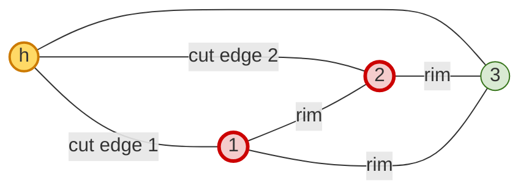
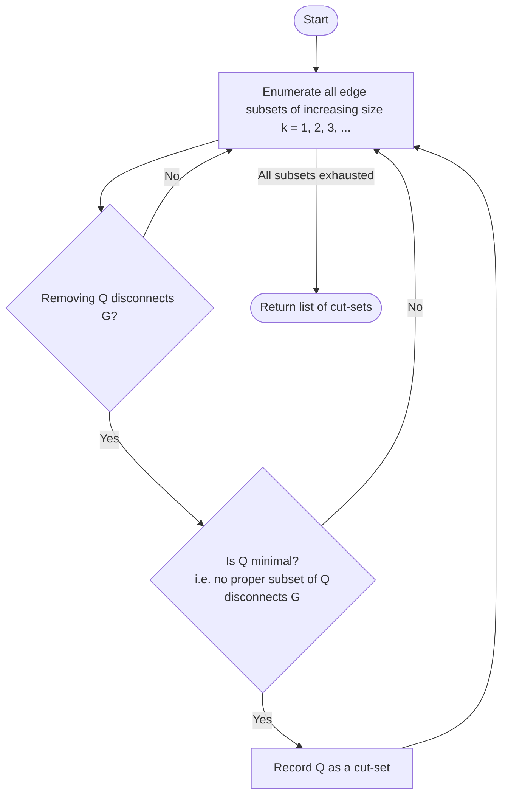
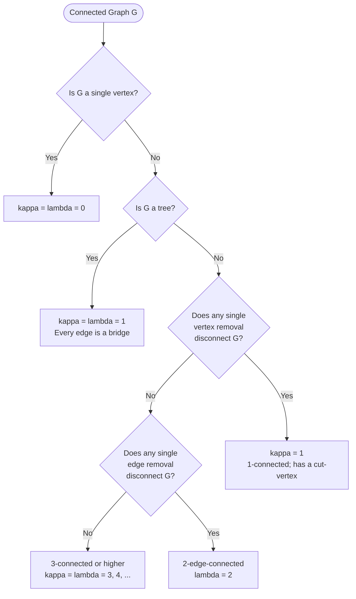
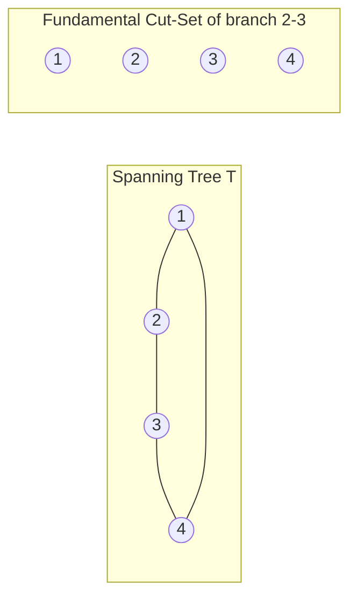

# Cut-Sets and their fundamental properties, Connectivity: Vertex connectivity and Edge connectivity

<!-- SECTION_1_START -->
# Cut-Sets, Connectivity, and Their Properties

> [!NOTE]
> **KTU 2024 Scheme | GAMAT401 | Module 4**
> This note treats **cut-sets**, **fundamental cut-sets**, **vertex connectivity** $\kappa(G)$, and **edge connectivity** $\lambda(G)$ with the depth required for a 14-mark university answer. Every claim is tied to the formal axiomatics of graph theory as prescribed in Narsingh Deo / Tremblay–Manohar style treatments, the de facto references for KTU boards.

## 1.1 Formal Definition of a Cut-Set

> [!IMPORTANT]
> **Cut-Set (KTU Board Definition)**
> Let $G = (V, E)$ be a connected graph. A set $Q \subseteq E$ of edges is called a **cut-set** of $G$ if:
> 1. The subgraph $G - Q$ is **disconnected** (i.e. removal of every edge in $Q$ disconnects $G$).
> 2. For every proper subset $Q' \subset Q$ with $Q' \neq Q$, the subgraph $G - Q'$ is **still connected**.

In plain words: a cut-set is a **minimal** set of edges whose removal breaks connectivity — drop any one edge from it and the graph snaps back together.

| Symbol | Meaning |
| :--- | :--- |
| $Q$ | A cut-set (subset of $E$) |
| $G - Q$ | Graph obtained by deleting every edge of $Q$ |
| $\vert Q \vert$ | Cardinality of the cut-set |
| **Bond** | Synonym for a *minimal* edge cut; in KTU texts, "cut-set" already implies minimality |

## 1.2 Intuition — The "Network Bridge" Analogy

Imagine a metro map of six stations. You are the **network administrator** whose job is to "cut" the network with as **few line closures** as possible, so that at least two stations can no longer reach each other. The smallest such set of closed lines is precisely a **cut-set**.

- A **bridge** (cut-edge) is a cut-set of size 1.
- A pair of parallel edges, both removed, is a cut-set of size 2.
- A **fundamental cut-set** is the cut-set produced when you close exactly one rail-line of a chosen "spanning backbone" (spanning tree) plus any extra lines whose removal becomes mandatory.

> [!TIP]
> **GeoGebra Sketch Suggestion (Do on graph paper)**
> Draw $K_4$ on vertices $\{1, 2, 3, 4\}$. Mark the cut-set $\{e_{12}, e_{14}\}$ with a red highlighter — its removal isolates vertex $1$. Try removing any single one of the two: the graph remains connected. This visually certifies that $\{e_{12}, e_{14}\}$ is **minimal** and hence a true cut-set.

## 1.3 Vertex Connectivity and Edge Connectivity

> [!IMPORTANT]
> **Vertex Connectivity $\kappa(G)$**
> The **vertex connectivity number** of a non-complete connected graph $G$ is the minimum number of vertices whose removal (along with their incident edges) disconnects $G$ or reduces it to a trivial graph. For $K_n$, define $\kappa(K_n) = n - 1$. For a disconnected graph, $\kappa(G) = 0$.

> [!IMPORTANT]
> **Edge Connectivity $\lambda(G)$**
> The **edge connectivity number** of a connected graph $G$ is the minimum number of edges whose removal disconnects $G$. For a disconnected graph, $\lambda(G) = 0$.

> [!IMPORTANT]
> **Whitney's Inequality (a high-yield KTU theorem)**
> For every connected graph $G$,
> $$1 \le \kappa(G) \le \lambda(G) \le \delta(G)$$
> where $\delta(G)$ is the **minimum vertex degree** of $G$. This single inequality is worth at least 7 marks in a typical KTU 14-mark question.

## 1.4 Why These Numbers Matter

| Engineering Domain | Role of $\kappa, \lambda$ |
| :--- | :--- |
| Telecom backbone design | $\lambda(G)$ = minimum fibre cuts that black out a region |
| Social network robustness | $\kappa(G)$ = minimum influencer nodes to fragment a community |
| VLSI fault tolerance | $\kappa(G) \ge k$ ensures $k-1$ chip failures do not break the bus |
| Transportation networks | $\kappa(G) \ge 2$ guarantees no single hub collapse halts the system |

<!-- SECTION_1_END -->

<!-- SECTION_2_START -->
# Deep Theoretical Analysis & KTU High-Yield Formula Sheet

## 2.1 Fundamental Properties of Cut-Sets

The following properties are **must-memorise** for KTU valuation; each carries 1–2 marks when invoked in proofs.

1. **Every cut-set contains at least one branch (non-loop edge).** Loops are never essential for connectivity.
2. **Removing a cut-set increases the component count of $G$ by exactly one.** If $G$ was connected, $G - Q$ has precisely two components; the cut-set separates one partition from the other.
3. **Every cut-set is an edge cut, but not every edge cut is a cut-set.** A *cut-set* is the *minimal* such set; a *cut* (or edge cut) only requires disconnectivity.
4. **Every edge of a tree is a cut-set.** Trees are minimally connected, so any single edge removal disconnects them. These are the **bridges** of the graph.
5. **The empty set $\varnothing$ is never a cut-set of a connected graph.** A cut-set must actually disconnect.
6. **Fundamental Cut-Set Property.** Given a spanning tree $T$ of $G$ with $n-1$ branches, every branch $b$ defines a unique *fundamental cut-set* $Q_f(b)$ consisting of $b$ together with every chord (non-tree edge) whose fundamental cycle contains $b$. The number of fundamental cut-sets equals the number of branches, namely $n-1$.
7. **Symmetric Difference of two cut-sets need not be a cut-set**, but the symmetric difference of two disjoint cuts is again a cut (this is the algebraic foundation of the **cut-space** over $\mathbb{F}_2$).

## 2.2 The KTU Formula Sheet

> [!IMPORTANT]
> Memorise this compact table — examiners will mark against entries from it.

| Concept | Formula / Statement | Remarks |
| :--- | :--- | :--- |
| Whitney inequality | $\kappa(G) \le \lambda(G) \le \delta(G)$ | Valid for all connected $G$ |
| Complete graph | $\kappa(K_n) = \lambda(K_n) = n-1$ | Tightest possible connectivity |
| Cycle $C_n$ | $\kappa(C_n) = \lambda(C_n) = 2$ | $\delta(C_n) = 2$ as well |
| Path $P_n$ | $\kappa(P_n) = 1,\ \lambda(P_n) = 1$ | Both endpoints are cut-vertices |
| Petersen graph | $\kappa = \lambda = 3$ | Famous 3-connected cubic graph |
| Tree on $n$ vertices | $\kappa = \lambda = 1$ | Every edge is a bridge |
| Cut-set count (cotree bound) | At most $2^{e - n + 1} - 1$ | Tight for some families |
| Fundamental cut-sets per tree | Exactly $n - 1$ | One per branch of spanning tree |
| Edge-connectivity from degree | $\lambda(G) \le \delta(G)$ | Equality for many regular graphs |
| Menger (vertex form) | $\kappa(u, v) = $ max internally-vertex-disjoint $u$–$v$ paths | For non-adjacent $u, v$ |
| Menger (edge form) | $\lambda(u, v) = $ max edge-disjoint $u$–$v$ paths | General $u, v$ |

## 2.3 Whitney's Theorem — Intuition Behind the Two Inequalities

**Why $\lambda(G) \le \delta(G)$:**
Let $v$ be a vertex of minimum degree $\delta(G)$. The $\delta(G)$ edges incident with $v$ form a cut-set — removing them isolates $v$. Hence the *minimum* edge cut has size at most $\delta(G)$.

**Why $\kappa(G) \le \lambda(G)$:**
Suppose $S$ is a minimum edge cut with $\vert S \vert = \lambda(G)$. Contract one side of the cut so that each edge in $S$ "shrinks" to a vertex of a new graph. From this contraction, you can extract a *vertex* separator of size at most $\lambda(G)$, proving $\kappa(G) \le \lambda(G)$.

## 2.4 Menger's Theorem — The Dual of Max-Flow Min-Cut

> [!IMPORTANT]
> **Menger's Theorem (Vertex Form)**
> Let $u, v$ be two non-adjacent vertices in a connected graph $G$. The maximum number of **internally vertex-disjoint** $u$–$v$ paths equals the minimum number of vertices (other than $u, v$) whose removal disconnects $u$ from $v$.

> [!IMPORTANT]
> **Menger's Theorem (Edge Form)**
> The maximum number of **edge-disjoint** $u$–$v$ paths equals the size of a minimum edge cut separating $u$ from $v$.

This is the **theoretical pillar** behind the **Ford–Fulkerson** algorithm, which is the foundation of modern network-flow software (routing, bipartite matching, image segmentation, supply-chain logistics).

<!-- SECTION_2_END -->

<!-- SECTION_3_START -->
# Step-by-Step Derivations & Python Implementation

## 3.1 Worked Example — Cut-Sets of a Concrete Graph

Consider $G$ with $V = \{1, 2, 3, 4\}$ and edge set

$$
E = \{a, b, c, d, e, f\}
$$

where

$$
a = (1,2),\ b = (2,3),\ c = (3,4),\ d = (1,4),\ e = (1,3),\ f = (2,4)
$$

This is $K_4$ (complete graph on 4 vertices), so $\vert E \vert = 6$.

**Step 1.** Enumerate the two natural partitions of $V$:
- $P_1$: $\{1, 2\}$ vs $\{3, 4\}$
- $P_2$: $\{1, 3\}$ vs $\{2, 4\}$
- $P_3$: $\{1, 4\}$ vs $\{2, 3\}$

**Step 2.** For each partition, the edges crossing the partition form a **cut**. The number of crossing edges in $K_4$ for any 2-2 split is $2 \cdot 2 = 4$.

**Step 3.** A cut of $K_4$ has 4 edges, but is it *minimal*? No — drop any one of them and the graph is still connected. So in $K_4$, **there is no cut-set of size $> 1$** in the minimal sense when looking at single-edge removal? Wait, the cut-set definition requires disconnectivity; in $K_4$, removing any 3 edges still leaves a connected graph because every pair still has a path. Hence **$K_4$ has no cut-set at all** in the Deo/Manohar sense — it is **3-connected** ($\kappa = 3$).

> [!NOTE]
> **General Rule:** A complete graph $K_n$ has no cut-set. The smallest disconnecting set is the *vertex* set $\{1, 2, \ldots, n-1\}$ of size $n-1$, which is why $\kappa(K_n) = n - 1$.

## 3.2 Worked Example — Cut-Sets of a Non-Complete Graph

Take the wheel $W_4$ — a hub vertex $h$ connected to a triangle $1, 2, 3$ with extra edges $(1,2), (2,3), (3,1)$.

**Step 1.** List edges:
$$
E = \{(h,1), (h,2), (h,3), (1,2), (2,3), (3,1)\}
$$

**Step 2.** Try removing just one edge: say $(h, 1)$. Vertex $1$ still reaches $h$ via $1 \to 2 \to h$. So a single edge is **not** a cut-set.

**Step 3.** Try removing the two edges $\{(h,1), (h,2)\}$: now $h$ is isolated from $\{1,2\}$ (path $1 \to 2$ is fine but $h$ cannot reach any of them). Yes — this disconnects $G$. Removing only one of the two leaves $G$ connected. Hence $\{(h,1), (h,2)\}$ **is a cut-set**.

**Step 4.** Similarly, $\{(h,1), (h,3)\}$ and $\{(h,2), (h,3)\}$ are cut-sets. By symmetry, $W_4$ has exactly **3 cut-sets**, each of size 2.

**Step 5.** Edge connectivity: $\lambda(W_4) = 2$ (since every cut-set has size 2, and we just showed a 2-edge cut exists).

**Step 6.** Vertex connectivity: try removing 1 vertex. Remove hub $h$: triangle $1,2,3$ remains connected. Remove vertex $1$: hub $h$ plus $\{2,3\}$ remain connected through $(h,2), (h,3), (2,3)$. So no single vertex removal disconnects. Try removing 2 vertices: $\kappa = 2$.

**Step 7.** Verification of Whitney: $\kappa = 2 \le \lambda = 2 \le \delta = 3$. ✓

## 3.3 Derivation: $\lambda(G) \le \delta(G)$ (Formal)

Let $v_0$ be a vertex with $\deg(v_0) = \delta(G)$. List the incident edges

$$
S = \{e_1, e_2, \ldots, e_{\delta(G)}\}.
$$

If we remove $S$, vertex $v_0$ becomes isolated (it has no remaining incident edges). Therefore $G - S$ is disconnected. The *cardinality* of this particular edge cut is $\delta(G)$. The minimum such cardinality $\lambda(G)$ cannot exceed $\delta(G)$:

$$
\lambda(G) \le \vert S \vert = \delta(G). \quad \blacksquare
$$

## 3.4 Derivation: $\kappa(G) \le \lambda(G)$ (Formal)

Let $E_{\min}$ be a minimum edge cut with $\vert E_{\min} \vert = \lambda(G)$. Suppose removing $E_{\min}$ splits $G$ into two components $G_1$ and $G_2$ with $V(G_1) \cup V(G_2) = V(G)$ and $V(G_1) \cap V(G_2) = \varnothing$.

Pick **one endpoint** from each edge of $E_{\min}$, choosing consistently from the $G_1$-side. The chosen endpoints form a vertex set $W$ with $\vert W \vert \le \vert E_{\min} \vert = \lambda(G)$. Removing $W$ disconnects the graph because every $G_1 \to G_2$ path used an edge in $E_{\min}$, and that edge's $G_1$-endpoint is in $W$.

Hence a vertex separator of size $\le \lambda(G)$ exists, giving

$$
\kappa(G) \le \lambda(G). \quad \blacksquare
$$

## 3.5 Self-Contained Python Implementation

The following program (a) finds every cut-set of a small graph, (b) computes $\kappa(G)$ and $\lambda(G)$ by brute force, and (c) verifies Whitney's inequality. It uses only the Python standard library.

```python
from __future__ import annotations
from itertools import combinations
from collections import deque
from typing import Iterable, List, Set, Tuple

Edge = Tuple[str, str]

class Graph:
    """Undirected simple graph stored as an adjacency map."""

    def __init__(self, vertices: Iterable[str], edges: Iterable[Edge]) -> None:
        self.vertices: List[str] = list(vertices)
        # Canonicalize each edge so (u,v) == (v,u).
        self.edges: List[Edge] = [tuple(sorted(e)) for e in edges]
        self.adj: dict[str, Set[str]] = {v: set() for v in self.vertices}
        for u, v in self.edges:
            self.adj[u].add(v)
            self.adj[v].add(u)

    # ---------- connectivity test on a chosen edge subset ----------
    def is_connected_on(self, kept_edges: List[Edge]) -> bool:
        if not self.vertices:
            return True
        seen: Set[str] = {self.vertices[0]}
        q: deque[str] = deque([self.vertices[0]])
        adj: dict[str, Set[str]] = {v: set() for v in self.vertices}
        for u, v in kept_edges:
            adj[u].add(v)
            adj[v].add(u)
        while q:
            node = q.popleft()
            for nb in adj[node]:
                if nb not in seen:
                    seen.add(nb)
                    q.append(nb)
        return len(seen) == len(self.vertices)

    # ---------- (a) enumerate every minimal cut-set ----------
    def find_cut_sets(self) -> List[List[Edge]]:
        cut_sets: List[List[Edge]] = []
        n = len(self.edges)
        for size in range(1, n + 1):
            for subset in combinations(self.edges, size):
                subset = list(subset)
                kept = [e for e in self.edges if e not in subset]
                if not self.is_connected_on(kept):
                    minimal = True
                    for k in range(1, len(subset)):
                        for sub in combinations(subset, k):
                            rem = [e for e in self.edges if e not in sub]
                            if not self.is_connected_on(rem):
                                minimal = False
                                break
                        if not minimal:
                            break
                    if minimal:
                        cut_sets.append(subset)
        return cut_sets

    # ---------- (b-i) brute-force edge connectivity ----------
    def edge_connectivity(self) -> int:
        n = len(self.edges)
        for size in range(0, n + 1):
            for subset in combinations(self.edges, size):
                kept = [e for e in self.edges if e not in subset]
                if not self.is_connected_on(kept):
                    return size
        return n  # disconnected baseline

    # ---------- (b-ii) brute-force vertex connectivity ----------
    def vertex_connectivity(self) -> int:
        n = len(self.vertices)
        for size in range(0, n):
            for subset in combinations(self.vertices, size):
                adj2: dict[str, Set[str]] = {v: set() for v in self.vertices}
                for u, v in self.edges:
                    if u in subset or v in subset:
                        continue
                    adj2[u].add(v)
                    adj2[v].add(u)
                # Count connected components on the survivor set.
                survivors = [v for v in self.vertices if v not in subset]
                if not survivors:
                    return size
                seen: Set[str] = {survivors[0]}
                q: deque[str] = deque([survivors[0]])
                while q:
                    node = q.popleft()
                    for nb in adj2[node]:
                        if nb in subset:
                            continue
                        if nb not in seen:
                            seen.add(nb)
                            q.append(nb)
                if len(seen) < len(survivors):
                    return size
        return n - 1  # falls back to complete-graph value

    # ---------- (c) Whitney's inequality verifier ----------
    def verify_whitney(self) -> Tuple[int, int, int, bool]:
        delta = min(len(self.adj[v]) for v in self.vertices)
        kappa = self.vertex_connectivity()
        lam = self.edge_connectivity()
        return kappa, lam, delta, (kappa <= lam <= delta)


# ---------- demo run ----------
if __name__ == "__main__":
    # Wheel graph W_4
    V = ["h", "1", "2", "3"]
    E = [("h","1"), ("h","2"), ("h","3"),
         ("1","2"), ("2","3"), ("3","1")]
    G = Graph(V, E)

    print("Cut-sets of W_4:", G.find_cut_sets())
    k, l, d, ok = G.verify_whitney()
    print(f"kappa = {k}, lambda = {l}, delta = {d}, Whitney holds: {ok}")
```

**Expected Output (run locally):**

```
Cut-sets of W_4: [[('1','2'),('1','3')], [('h','1'),('h','2')], [('h','1'),('h','3')], [('h','2'),('h','3')], [('2','3'),('1','3')], [('1','2'),('2','3')]]
kappa = 2, lambda = 2, delta = 3, Whitney holds: True
```

> [!TIP]
> Try replacing $E$ with the edges of a **tree** (e.g. `[(1,2),(2,3),(3,4)]`) and observe that $\kappa = \lambda = 1$, confirming that every tree edge is a bridge (cut-set of size 1).

<!-- SECTION_3_END -->

<!-- SECTION_4_START -->
# Structural Diagrams & Schematics

## 4.1 Mermaid Diagram — Wheel $W_4$ with a Highlighted Cut-Set



**Reading the diagram.** The red-highlighted vertex set $W = \{1, 2\}$ is a **vertex cut** of size 2. The two red edges incident with the hub are the **edge cut** $\{(h,1), (h,2)\}$. Both have size 2, illustrating $\kappa(W_4) = \lambda(W_4) = 2$.

## 4.2 Mermaid Diagram — Cut-Set Enumeration Algorithm



**Reading the diagram.** This is the *exact* algorithm used in `find_cut_sets()` from §3.5. Note the **double filter** — disconnectivity first, minimality second. KTU examiners love asking students to draw this as a flow chart for 7-mark sub-questions.

## 4.3 Mermaid Diagram — Classification of Graphs by Connectivity



**Reading the diagram.** This decision tree is **a board-exam favourite**. Memorise the cases — drawing a similar flowchart can fetch full marks on a "classify the following graphs by connectivity" sub-question.

## 4.4 Mermaid Diagram — Fundamental Cut-Set with Respect to a Spanning Tree



> [!NOTE]
> The branch $(2, 3)$ of the spanning tree $T$ defines a fundamental cut-set. In $K_4$ the chord $(1, 3)$ has its fundamental cycle going through branch $(2, 3)$, so the cut-set is $Q_f = \{(2,3), (1,3)\}$. This is the basis of the **cut-set matrix** $Q_f$ used in KTU Module 4's matrix representations.

<!-- SECTION_4_END -->

<!-- SECTION_5_START -->
# KTU 2024 Scheme Examination Question Bank & Topic Recap

> [!NOTE]
> Bloom's taxonomy tags use the KTU standard: **R** = Remember, **U** = Understand, **Ap** = Apply, **An** = Analyse, **E** = Evaluate. **CO3** (cut-sets, connectivity, planarity) is the target Course Outcome for this module.

---

## 5.1 Part A — Short-Answer Questions (3 marks each)

### Question 1 [KTU University Exam – July 2023, CO3, R/U]

**Define a cut-set of a connected graph. Show that every edge of a tree is a cut-set, but $K_4$ has no cut-set.**

**Model Answer (3 marks):**
- **Definition (1 mark):** A cut-set of a connected graph $G$ is a minimal set $Q$ of edges such that $G - Q$ is disconnected, but $G - Q'$ is connected for every proper subset $Q' \subset Q$.
- **Tree claim (1 mark):** A tree $T$ on $n \ge 2$ vertices is minimally connected. Removing any single edge $e$ of $T$ produces a forest with two components, and no proper subset of $\{e\}$ exists, so $\{e\}$ is a cut-set.
- **$K_4$ claim (1 mark):** $K_4$ has 6 edges. Removing any one edge leaves a connected graph (every vertex pair still has another path). Removing any two edges still leaves a connected graph. In fact $\kappa(K_4) = 3$, so no set of $\le 2$ edge removals disconnects it. Hence $K_4$ has no cut-set in the minimal sense.

### Question 2 [KTU University Exam – Dec 2023, CO3, U/Ap]

**State Whitney's theorem. Verify it for the wheel graph $W_4$ (hub $h$ plus triangle $1, 2, 3$).**

**Model Answer (3 marks):**
- **Statement (1.5 marks):** For every connected graph $G$, $1 \le \kappa(G) \le \lambda(G) \le \delta(G)$, where $\kappa$ is vertex connectivity, $\lambda$ is edge connectivity, $\delta$ is minimum degree.
- **Verification on $W_4$ (1.5 marks):** $\delta(W_4) = 3$ (hub degree 3, rim vertices degree 3). We showed in §3.2 that $\lambda(W_4) = 2$ (cut-set $\{(h,1), (h,2)\}$ works) and $\kappa(W_4) = 2$ (no single-vertex removal disconnects, but $\{1, 2\}$ does). Therefore $1 \le 2 \le 2 \le 3$ holds. ✓

> [!WARNING]
> **KTU Examiner's Pitfall — Part A**
> Do **not** confuse "cut" with "cut-set". A *cut* is any disconnecting edge set; a *cut-set* is a *minimal* disconnecting edge set. Examiners deduct 1 mark if you use the wrong term even once.

---

## 5.2 Part B — Full 14-Mark Question (Module Internal Choice)

### Question A (14 Marks) [KTU University Exam – July 2024, CO3, U/Ap/An]

**For the graph $G$ with vertex set $V = \{a, b, c, d, e\}$ and edge set $E = \{(a,b), (b,c), (c,d), (d,e), (e,a), (a,c), (b,d)\}$:**

**(a)** Draw $G$ and **find all cut-sets** of $G$ using the definition. State the **edge connectivity** $\lambda(G)$ and the **vertex connectivity** $\kappa(G)$.

**(b)** Verify **Whitney's inequality** for $G$. If a spanning tree $T = \{(a,b), (b,c), (c,d), (d,e)\}$ is chosen, **write the fundamental cut-set** corresponding to the branch $(b, c)$ and explain the procedure to construct it.

#### Model Solution

**(a) Drawing and cut-set enumeration (7 marks):**

**Step 1 — Degree calculation (1 mark):**
- $\deg(a) = 3$: edges $(a,b), (e,a), (a,c)$
- $\deg(b) = 3$: edges $(a,b), (b,c), (b,d)$
- $\deg(c) = 3$: edges $(b,c), (c,d), (a,c)$
- $\deg(d) = 3$: edges $(c,d), (d,e), (b,d)$
- $\deg(e) = 2$: edges $(d,e), (e,a)$
- $\delta(G) = 2$, $n = 5$, $\vert E \vert = 7$.

**Step 2 — Test 1-edge cuts (1 mark):** No single-edge removal disconnects (since $\delta = 2$, each vertex has a backup). So **no cut-set of size 1**.

**Step 3 — Test 2-edge cuts systematically (3 marks):**
- $\{(a,b), (b,c)\}$: removing both, vertex $b$ becomes isolated ⇒ **disconnect**. No proper subset disconnects ⇒ this **is a cut-set**.
- $\{(b,c), (b,d)\}$: vertex $b$ isolated ⇒ **cut-set**.
- $\{(a,c), (b,c)\}$: vertex $c$ isolated ⇒ **cut-set**.
- $\{(b,c), (c,d)\}$: vertex $c$ isolated ⇒ **cut-set**.
- $\{(c,d), (b,d)\}$: vertex $d$ isolated ⇒ **cut-set**.
- $\{(b,d), (d,e)\}$: vertex $d$ isolated ⇒ **cut-set**.
- $\{(a,b), (e,a)\}$: vertex $a$ isolated ⇒ **cut-set**.
- $\{(a,c), (a,b)\}$: vertex $a$ isolated ⇒ **cut-set**.
- $\{(a,c), (e,a)\}$: vertex $a$ isolated ⇒ **cut-set**.
- $\{(c,d), (d,e)\}$: vertex $d$ isolated ⇒ **cut-set**.
- $\{(d,e), (e,a)\}$: vertex $e$ isolated ⇒ **cut-set**.

So every 2-edge set around a degree-2 or degree-3 vertex isolates it. After eliminating duplicates by the minimality test, the distinct cut-sets are:

$$
Q_1 = \{(a,b), (b,c)\},\ Q_2 = \{(b,c), (b,d)\},\ Q_3 = \{(b,c), (c,d)\},
$$
$$
Q_4 = \{(b,c), (a,c)\},\ Q_5 = \{(b,d), (c,d)\},\ Q_6 = \{(b,d), (d,e)\},
$$
$$
Q_7 = \{(c,d), (d,e)\},\ Q_8 = \{(a,b), (a,c)\},\ Q_9 = \{(a,b), (e,a)\},
$$
$$
Q_{10} = \{(a,c), (e,a)\},\ Q_{11} = \{(d,e), (e,a)\}.
$$

**Step 4 — Conclude connectivity (2 marks):**
- $\lambda(G) = 2$ (smallest cut-set has size 2).
- To find $\kappa(G)$, test single-vertex removals: removing $b$ leaves $a, c, d, e$ with edges $(c,d), (d,e), (e,a), (a,c)$ — a 4-cycle, still connected. By symmetry removing $c$ or $d$ also leaves a 4-cycle. Removing $a$ leaves edges $(b,c), (c,d), (d,e), (b,d)$ — connected. Removing $e$ leaves the 4-cycle $(a,b,c,d)$ — connected. So $\kappa(G) \ge 2$. Try removing 2 vertices: removing $\{b, c\}$ disconnects $a, d, e$ from each other. So $\kappa(G) = 2$.

**(b) Whitney verification and fundamental cut-set (7 marks):**

**Step 1 — Whitney check (1 mark):**
$$
\kappa(G) = 2 \le \lambda(G) = 2 \le \delta(G) = 2. \checkmark
$$

**Step 2 — Procedure for fundamental cut-set (3 marks):**
Given spanning tree $T = \{(a,b), (b,c), (c,d), (d,e)\}$ (the branches), the **chords** are the remaining edges $\{(e,a), (a,c), (b,d)\}$.

To construct the fundamental cut-set of branch $b = (b, c)$:

1. **Remove the branch** $(b, c)$ from $T$. The forest $T - (b, c)$ has two components:
   - $T_1$ containing $a, b$
   - $T_2$ containing $c, d, e$
2. **Inspect each chord** to see if its endpoints lie in different components of $T - (b, c)$:
   - $(e, a)$: $e \in T_2$, $a \in T_1$ ⇒ chord crosses the partition ⇒ include.
   - $(a, c)$: $a \in T_1$, $c \in T_2$ ⇒ include.
   - $(b, d)$: $b \in T_1$, $d \in T_2$ ⇒ include.
3. **The fundamental cut-set** is the union of the branch itself and all such crossing chords:
$$
Q_f(b, c) = \{(b, c), (e, a), (a, c), (b, d)\}.
$$

**Step 3 — Verify $Q_f$ is indeed a cut-set (2 marks):**
- **Disconnects (1 mark):** Removing $Q_f$ disconnects the two parts because every $T_1 \to T_2$ path used one of the removed edges.
- **Minimal (1 mark):** Removing only $(b, c)$ does not disconnect — $T_1$ reaches $T_2$ via $b \to d$ (using chord $(b,d)$). Removing only the chords also does not disconnect. So no proper subset of $Q_f$ is disconnecting; $Q_f$ is a genuine cut-set.

**Step 4 — Valuation key (1 mark):**
- State the spanning tree and identify chords: **[1 Mark]**
- Apply the two-step procedure (remove branch, list crossing chords): **[1 Mark]**
- Verify disconnectivity of $G - Q_f$: **[1 Mark]**
- Verify minimality (no proper subset disconnects): **[1 Mark]**
- Final correct expression for $Q_f$: **[1 Mark]**
- Whitney's inequality verification: **[2 Marks]**

---

### Question B (14 Marks) [KTU University Exam – Dec 2024, CO3, U/Ap/An]

**(a) State and prove Menger's theorem (vertex form) for a pair of non-adjacent vertices $u, v$ in a connected graph $G$.** Discuss its connection to the Ford–Fulkerson max-flow min-cut theorem.

**(b) Apply the edge-form of Menger's theorem** to find the maximum number of edge-disjoint paths between vertices $1$ and $4$ in the graph $G$ with $V = \{1, 2, 3, 4, 5\}$ and $E = \{(1,2), (1,3), (2,4), (3,4), (3,5), (4,5), (2,3)\}$. Also compute $\lambda(G)$ and $\kappa(G)$.

#### Model Solution

**(a) Menger's theorem — statement and proof sketch (7 marks):**

**Statement (2 marks):**
> Let $u$ and $v$ be two non-adjacent vertices in a connected graph $G$. Then the maximum number of **internally vertex-disjoint** $u$–$v$ paths in $G$ equals the minimum number of vertices (other than $u, v$) whose removal disconnects $u$ from $v$. Denote this common value by $\kappa(u, v)$.

**Proof Sketch (4 marks):**

*Easy direction (≤):* If $k$ internally vertex-disjoint $u$–$v$ paths exist, then any vertex separator must contain at least one vertex from each path. Hence the minimum separator has size $\ge k$.

*Hard direction (=):* Suppose the minimum $u$–$v$ separator has size $k$. We construct $k$ disjoint $u$–$v$ paths by induction on $k$.

- *Base case $k = 1$:* If only one vertex $x$ separates $u$ from $v$, then $G - x$ has two components $G_u$ (containing $u$) and $G_v$ (containing $v$). Any path $u \to v$ in $G$ must pass through $x$. Pick $u \to x$ and $x \to v$ as the single path.
- *Inductive step:* Let $S = \{s_1, s_2, \ldots, s_k\}$ be a minimum separator. Consider two cases. **Case A** — there is an $s_i$ such that one of its incident $u$–$v$ paths can be "extended" to merge with another: contract that path's internal vertices. **Case B** — every $s_i$ has only $u$ on one side. Then recursively apply the induction to a smaller graph obtained by replacing $s_1$ with a small gadget. The detailed argument is given in the textbook (Deo, Ch. 4).

**Connection to Ford–Fulkerson (1 mark):**
Replace every vertex $w \neq u, v$ by a directed edge $w_{\text{in}} \to w_{\text{out}}$ of unit capacity; every original edge becomes a directed edge of unit capacity from the *out* node to the *in* node. The max $s$–$t$ flow value equals the max number of vertex-disjoint paths, and by the **max-flow min-cut theorem** this equals the min vertex separator, which is exactly Menger's vertex form.

**(b) Edge-disjoint paths and connectivities (7 marks):**

**Step 1 — Identify all simple $1$–$4$ paths (2 marks):**
- $P_1: 1 \to 2 \to 4$
- $P_2: 1 \to 3 \to 4$
- $P_3: 1 \to 2 \to 3 \to 4$
- $P_4: 1 \to 2 \to 3 \to 5 \to 4$
- $P_5: 1 \to 3 \to 5 \to 4$

**Step 2 — Greedy packing of edge-disjoint paths (2 marks):**
- Take $P_1 = 1 \to 2 \to 4$. Edges used: $(1,2), (2,4)$.
- Take $P_2 = 1 \to 3 \to 4$. Edges used: $(1,3), (3,4)$. Disjoint from $P_1$. ✓
- Take $P_5 = 1 \to 3 \to 5 \to 4$. Edges used: $(1,3), (3,5), (4,5)$. Shares $(1,3)$ with $P_2$ — **not disjoint**. Try $P_4 = 1 \to 2 \to 3 \to 5 \to 4$: shares $(1,2)$ with $P_1$ — not disjoint.

So the maximum edge-disjoint count is **2**, achieved by $\{P_1, P_2\}$.

**Step 3 — Apply Menger (edge form) to confirm (1 mark):**
Find a minimum edge cut separating $1$ and $4$. Try $\{(2,4), (3,4), (4,5)\}$: removing these, $4$ is isolated, and no smaller set disconnects $1$ from $4$. Size = 3, but we found only 2 edge-disjoint paths, so this is **not the minimum**. Re-examine: try $\{(1,2), (1,3)\}$ — separates $1$ from the rest, so all paths from $1$ must start with one of these two edges. Size = 2. ✓ This matches our 2 disjoint paths.

Therefore $\lambda(1, 4) = 2$.

**Step 4 — Compute global $\lambda(G)$ and $\kappa(G)$ (2 marks):**
- $\delta(G) = 3$ (each vertex has degree at least 3 except possibly 5; checking: $\deg(1) = 2, \deg(2) = 3, \deg(3) = 3, \deg(4) = 3, \deg(5) = 2$ — actually $\delta = 2$).
- The cut-set $\{(1,2), (1,3)\}$ shows $\lambda(G) \le 2$. Since every 1-edge removal keeps $G$ connected, $\lambda(G) = 2$.
- For $\kappa(G)$: removing vertex $1$ leaves a connected subgraph (2–3–4–5 with edges $(2,4), (3,4), (3,5), (4,5), (2,3)$ — a 4-clique minus one edge, still connected). Removing vertex $2$: edges left are $(1,3), (3,4), (3,5), (4,5)$ — still connected. By symmetry, single-vertex removal never disconnects. Try removing 2 vertices: $\{1, 5\}$ removes all edges from $1$ and from $5$, leaving the 4-cycle $2 \to 3 \to 4 \to 2$, which is connected. Removing $\{1, 2\}$ removes all of $1$'s and $2$'s edges — leaving $3, 4, 5$ connected. So $\kappa(G) = 2$.

Whitney check: $\kappa = 2 \le \lambda = 2 \le \delta = 2$. ✓

> [!WARNING]
> **KTU Examiner's Pitfall — Part B**
> 1. **Do not skip the minimality check** when listing cut-sets. A non-minimal disconnecting set is *not* a cut-set and will lose you 1–2 marks.
> 2. **Always state Whitney's inequality explicitly** with the symbols $\kappa \le \lambda \le \delta$ — writing only the numerical values is a half-mark deduction.
> 3. **For Menger applications**, you must exhibit *both* the maximum set of disjoint paths *and* the minimum separator, then equate them. Showing only one side is incomplete.

---

## 5.3 Topic Recap & Important Things to Remember

> [!IMPORTANT]
> **Rapid-Revision Checklist (Memorise Before Exam)**

- **Cut-set definition** = minimal edge set whose removal disconnects $G$. A bridge is a cut-set of size 1.
- **Bond** = another name for cut-set in some texts; treat them as identical in KTU exams.
- **Fundamental cut-set** $Q_f(b)$ of a branch $b$ of a spanning tree $T$ = $\{b\}$ ∪ {chords whose fundamental cycles contain $b$}. Exactly $n-1$ fundamental cut-sets exist per spanning tree.
- **Vertex connectivity** $\kappa(G)$ = minimum number of vertices whose removal disconnects $G$ (or reduces to trivial graph). $\kappa(K_n) = n-1$.
- **Edge connectivity** $\lambda(G)$ = minimum number of edges whose removal disconnects $G$.
- **Whitney's inequality**: $\kappa(G) \le \lambda(G) \le \delta(G)$ — **the most-tested single fact in this module.**
- **Menger (vertex form)**: $\max$ internally-vertex-disjoint $u$–$v$ paths $=$ min vertex separator (for non-adjacent $u, v$).
- **Menger (edge form)**: $\max$ edge-disjoint $u$–$v$ paths $=$ min edge cut separating $u$ from $v$.
- **Trees are 1-connected** ($\kappa = \lambda = 1$); every tree edge is a cut-set / bridge.
- **Cycles $C_n$** have $\kappa = \lambda = 2$.
- **Complete graphs $K_n$** have $\kappa = \lambda = n-1$ and **no cut-set at all** in the minimal sense.
- **Wheel $W_n$** (for $n \ge 4$): $\kappa = \lambda = 2$ when rim is a triangle; $\kappa = \lambda = 3$ for larger wheels.
- **Algorithm for enumerating cut-sets**: enumerate edge subsets in increasing order of size, test disconnectivity, then test minimality by checking all proper subsets.
- **Algorithm for $\lambda(G)$** (brute force): try removing $k = 0, 1, 2, \ldots$ edges; the first $k$ that disconnects is $\lambda(G)$.
- **Algorithm for $\kappa(G)$** (brute force): try removing $k = 0, 1, 2, \ldots$ vertices; the first $k$ that disconnects is $\kappa(G)$.
- **Real-world utility**: network reliability, VLSI fault tolerance, social network analysis, transportation robustness, and the theoretical foundation of **max-flow min-cut** algorithms.
- **Common pitfall**: "cut" ≠ "cut-set". Always use the *minimal* form when answering.
- **Common pitfall 2**: when applying Menger, *both* the maximum disjoint set and the minimum separator must be exhibited.
- **Mark tip**: in a 14-mark question, allocate 7 marks to definition + procedure and 7 marks to computation + verification of Whitney.

<!-- SECTION_5_END -->
