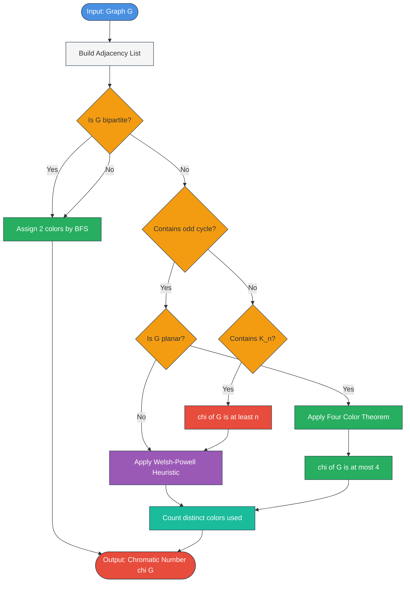
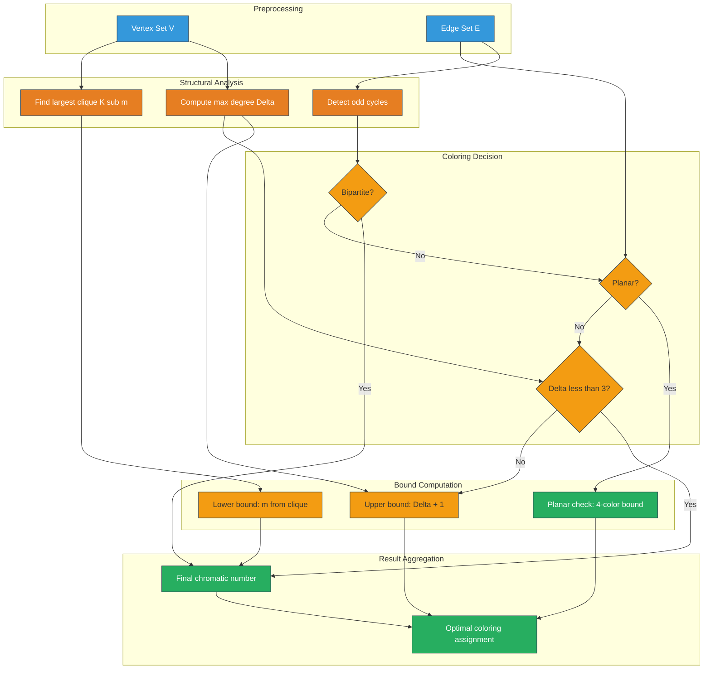

# Introduction to Vertex Coloring and planar applications

<!-- SECTION_1_START -->
# Module 4: Introduction to Vertex Coloring & Planar Applications

## 1. Core Technical Definition

> [!IMPORTANT]
> **Vertex Coloring (KTU 2024 Syllabus Terminology):**
> A **vertex coloring** of a graph $G = (V, E)$ is an assignment of colors to the vertices of $G$ such that no two adjacent vertices (vertices connected by an edge) receive the same color. When a vertex coloring uses exactly $k$ distinct colors, it is called a **proper $k$-coloring** of $G$.

The **chromatic number** $\chi(G)$ is the **minimum** number of colors required to properly color the vertices of $G$. Formally:
$$\chi(G) = \min\{k \in \mathbb{Z}^+ \mid G \text{ has a proper } k\text{-coloring}\}$$

**Planar Graph:** A graph $G$ is **planar** if it can be drawn in the plane $\mathbb{R}^2$ such that no two edges cross (intersect) except at their endpoints. Such a drawing is called a **planar embedding** or **plane graph**.

> [!NOTE]
> **The Four Color Theorem (Appel & Haken, 1976):**
> Every **planar graph** is **4-colorable**, i.e., $\chi(G) \le 4$ for any planar graph $G$. This is one of the most celebrated theorems in discrete mathematics and was the first major theorem proved using computer-assisted verification.

### Conceptual Analogy / Intuition

Imagine you are a **country cartographer** tasked with coloring a political map. The rule is simple: **no two countries that share a border can be the same color**. 

If you think of each country as a **vertex** and draw an edge between any two countries that share a border, you have just created a graph. Coloring the map is exactly the same as **vertex coloring** the resulting graph!

Now, suppose you want to schedule **final exams** for a university:
- **Vertices** = Courses
- **Edges** = Pairs of courses with at least one common student
- **Colors** = Time slots

A valid exam schedule corresponds to a **proper coloring** — no two courses sharing a student can be held at the same time. The **minimum number of time slots** needed equals the **chromatic number** $\chi(G)$.

The color **"4"** has a special place in planar graph theory: it is the **absolute upper bound** of colors ever needed for any map on Earth (including continents with hundreds of countries), thanks to the Four Color Theorem.

> [!VISUALIZATION CONTROL]
> **Concept:** Triangle graph $K_3$ requires 3 colors
> **GeoGebra / Desmos Input Equations:**
> * Point A: $(0, 0)$
> * Point B: $(2, 0)$
> * Point C: $(1, \sqrt{3})$
> * Color A = Red, Color B = Green, Color C = Blue
> **Visual Description:** Three vertices on the coordinate plane forming an equilateral triangle. Each vertex must receive a distinct color, demonstrating $\chi(K_3) = 3$.

### Key Definitions Summary

| Term | Definition | Notation |
|------|------------|----------|
| Proper Coloring | Adjacent vertices get different colors | $k$-coloring |
| Chromatic Number | Minimum colors for proper coloring | $\chi(G)$ |
| $k$-Chromatic | Graph with $\chi(G) = k$ | — |
| $k$-Colorable | Graph with $\chi(G) \le k$ | — |
| Planar Graph | Can be drawn without edge crossings | $G \in \mathcal{P}$ |
| Critical Graph | $\chi(G - e) < \chi(G)$ for all edges $e$ | $k$-critical |

<!-- SECTION_1_END -->

<!-- SECTION_2_START -->
# 2. Deep Theoretical Analysis & KTU High-Yield Formula Sheet

## 2.1 Fundamental Bounds on Chromatic Number

For any graph $G$ with $n$ vertices, the following bounds are universally true:

### Lower Bounds
- **Clique Lower Bound:** If $G$ contains a complete subgraph $K_m$ as a subgraph, then $\chi(G) \ge m$.
- **Odd Cycle Bound:** If $G$ contains an odd cycle, then $\chi(G) \ge 3$.

### Upper Bounds
- **Trivial Upper Bound:** $\chi(G) \le n$ (each vertex gets its own color).
- **Max Degree Bound (Greedy):** $\chi(G) \le \Delta(G) + 1$, where $\Delta(G)$ is the maximum degree of $G$.
- **Brook's Theorem:** If $G$ is connected and not a complete graph or odd cycle, then $\chi(G) \le \Delta(G)$.

## 2.2 The Five Color Theorem (Constructive)

While the **Four Color Theorem** is famously difficult to prove, the weaker **Five Color Theorem** has a clean induction proof. The proof uses Euler's formula $n - e + f = 2$ to establish the existence of a vertex of degree at most 5, after which Kempe chain arguments (interchanging colors in a 2-colored region) reduce the coloring.

**Theorem (Five Color Theorem):** Every planar graph is **5-colorable**, i.e., $\chi(G) \le 5$ for all planar $G$.

## 2.3 The Chromatic Polynomial

The **chromatic polynomial** $P_G(k)$ counts the number of proper $k$-colorings of $G$:

$$P_G(k) = \text{number of ways to properly color } G \text{ using colors from a set of size } k$$

Key properties:
- $P_G(k) = k(k-1)^{n-1}$ for any tree $T$ on $n$ vertices
- $P_G(k) = k(k-1)(k-2)\cdots(k-n+1)$ for the complete graph $K_n$
- $\chi(G) = $ smallest positive integer $k$ such that $P_G(k) > 0$

## 2.4 KTU Formula Sheet

| Formula / Theorem | Expression | Use Case |
|-------------------|------------|----------|
| Chromatic Number | $\chi(G) = \min\{k : P_G(k) > 0\}$ | Compute minimum colors |
| Greedy Bound | $\chi(G) \le \Delta(G) + 1$ | Quick upper bound |
| Brook's Theorem | $\chi(G) \le \Delta(G)$ for non-complete, non-odd-cycle | Tighter upper bound |
| Complete Graph | $\chi(K_n) = n$ | Trivial base case |
| Bipartite Graph | $\chi(G) = 2$ iff $G$ is bipartite, else $\chi(G) = 3$ | Two-colorable iff no odd cycle |
| Cycle Graph | $\chi(C_n) = 2$ if $n$ even, $\chi(C_n) = 3$ if $n$ odd | Parity rule |
| Four Color Theorem | $\chi(G) \le 4$ for planar $G$ | Map coloring |
| Five Color Theorem | $\chi(G) \le 5$ for planar $G$ | Weaker but provable |
| Euler's Formula | $n - e + f = 2$ (connected planar) | Structural analysis |
| Degree Sum | $\sum_{v \in V} \deg(v) = 2 \vert E \vert$ | Handshaking lemma |

> [!IMPORTANT]
> **Critical Distinction:** $\chi(G) = 2$ does **NOT** mean $G$ is a tree. It means $G$ is **bipartite**, which is a strictly larger class (e.g., $C_4, C_6, K_{2,3}$ are all bipartite but not trees).

## 2.5 Real-World Engineering Applications

| Application Domain | Vertex Meaning | Edge Meaning | Color Meaning |
|--------------------|----------------|--------------|---------------|
| **Compiler Register Allocation** | Variables | Interference (live simultaneously) | CPU Registers |
| **Exam Timetabling** | Courses | Common enrolled students | Exam slots |
| **Frequency Assignment (Mobile Networks)** | Cell towers | Adjacent cells | Radio frequencies |
| **Sudoku / Latin Square** | Cells in same row/col/block | Constraint pairs | Digits 1–9 |
| **Map Coloring** | Countries | Shared border | Print colors |
| **Graph Drawing / Visualization** | Vertices | Visual proximity | Distinct hues |
| **Job Scheduling** | Tasks | Dependency edges | Time slots |

> [!NOTE]
> **Industry Note:** The **register allocation** problem in compilers (used in GCC, LLVM) is solved via **graph coloring heuristics** since it is NP-hard in general. The famous **Chaitin's algorithm** uses a simplified coloring approach to assign CPU registers to variables — a 2024 industry-standard technique.

<!-- SECTION_2_END -->

<!-- SECTION_3_START -->
# 3. Step-by-Step Derivations, Proofs & Algorithmic Implementation

## 3.1 Exhaustive Proof: Every Tree is 2-Colorable

**Theorem:** If $T$ is a tree on $n \ge 2$ vertices, then $\chi(T) = 2$.

**Proof by construction (BFS-based 2-coloring):**

**Step 1:** Root the tree $T$ at an arbitrary vertex $r$. Assign $\text{color}(r) = \text{Red}$.

**Step 2:** Perform a BFS traversal. For each edge $(u, v)$ where $u$ is the parent of $v$:
$$\text{color}(v) = \begin{cases} \text{Blue} & \text{if } \text{color}(u) = \text{Red} \\ \text{Red} & \text{if } \text{color}(u) = \text{Blue} \end{cases}$$

**Step 3 (Verification):** Suppose for contradiction two adjacent vertices $u, v$ receive the same color. In a tree, the unique path between $u$ and $v$ has odd length (otherwise a cycle exists, contradicting tree property). Following the BFS, each edge flips the color, so the parity of the path length determines final color parity. An odd-length path yields different colors — contradiction. $\blacksquare$

## 3.2 Exhaustive Proof: Five Color Theorem

**Theorem (Heawood, 1890):** Every planar graph is 5-colorable.

**Proof by strong induction on $n$ (number of vertices):**

**Base case:** $n \le 5$. Trivially 5-colorable.

**Inductive step:** Assume all planar graphs with $< n$ vertices are 5-colorable. Let $G$ be a planar graph with $n$ vertices.

**Step 1 (Apply Euler):** Since $G$ is planar:
$$e \le 3n - 6$$

**Step 2 (Handshaking):** Therefore:
$$\sum_{v \in V} \deg(v) = 2e \le 6n - 12$$

**Step 3 (Pigeonhole):** The average degree is at most $6 - \frac{12}{n} < 6$. So at least one vertex $v_0$ has $\deg(v_0) \le 5$.

**Step 4 (Remove & Color):** Remove $v_0$ to get $G' = G - v_0$. By induction, $G'$ admits a proper 5-coloring.

**Step 5 (Restore $v_0$):** Restore $v_0$ with at most 5 neighbors. Two cases:

* **Case A:** The 5 neighbors use at most 4 distinct colors. Assign $v_0$ the missing 5th color. **Done.**

* **Case B:** The 5 neighbors use all 5 colors, say $\{1,2,3,4,5\}$ in cyclic order around $v_0$. Construct the **Kempe chain** for colors 1 and 3 in $G' - v_0$ — the maximal connected subgraph using only colors $\{1, 3\}$.

**Step 6 (Kempe Swap):** If $v_2$ (the color-2 neighbor) is **not** in the same Kempe chain as $v_4$ (the color-4 neighbor), then swap colors 1 and 3 in $v_1$'s chain. Now $v_1$ and $v_3$ both have color 3, freeing color 1 for $v_0$. **Done.**

**Step 7 (Planarity contradiction):** If $v_2$ and $v_4$ **are** in the same Kempe chain, then a Jordan curve argument shows this chain separates the plane, preventing $v_1$ and $v_3$ from coexisting as neighbors of $v_0$ without crossing — contradiction to planarity.

Thus Case B is impossible, and 5 colors suffice. $\blacksquare$

## 3.3 Worked Example: Chromatic Number Computation

**Problem:** Compute $\chi(G)$ for the graph $G = C_5$ (5-cycle).

**Solution:**

**Step 1:** $C_5$ has vertices $v_1, v_2, v_3, v_4, v_5$ with edges $v_i v_{i+1}$ (mod 5).

**Step 2 (Lower bound):** $C_5$ is an odd cycle, so $\chi(C_5) \ge 3$.

**Step 3 (Upper bound — try 3 colors):**
- $\text{color}(v_1) = R$
- $\text{color}(v_2) = G$ (forced, adjacent to $v_1$)
- $\text{color}(v_3) = B$ (forced, adjacent to $v_2$)
- $\text{color}(v_4) = R$ (adjacent to $v_3$)
- $\text{color}(v_5) = G$ (adjacent to $v_4$)
- Check: $v_5$ adjacent to $v_1$? $G \ne R$ ✓
- Check: $v_4$ adjacent to $v_5$? $R \ne G$ ✓

**Conclusion:** $\chi(C_5) = 3$.

## 3.4 Algorithmic Implementation: Welsh-Powell Heuristic

The **Welsh-Powell algorithm** is a greedy $O(n^2)$ heuristic for graph coloring that often produces optimal results in practice.

```python
from typing import Dict, List, Set
from collections import defaultdict

def welsh_powell_coloring(adj: Dict[int, List[int]]) -> Dict[int, int]:
    """
    Compute a proper vertex coloring using the Welsh-Powell heuristic.
    
    Args:
        adj: Adjacency list mapping each vertex to its neighbors.
    
    Returns:
        Dictionary mapping each vertex to its assigned color (1-indexed).
    
    Raises:
        ValueError: If input adjacency structure is malformed.
        TypeError: If vertex identifiers are not integers.
    """
    # Input validation
    if not isinstance(adj, dict):
        raise TypeError(f"adj must be a dict, got {type(adj).__name__}")
    
    if len(adj) == 0:
        return {}
    
    # Step 1: Compute degree of each vertex
    degrees: Dict[int, int] = {v: len(adj[v]) for v in adj}
    
    # Step 2: Sort vertices in descending order of degree (ties broken by vertex id)
    sorted_vertices: List[int] = sorted(
        adj.keys(),
        key=lambda v: (-degrees[v], v)
    )
    
    # Step 3: Initialize coloring dictionary
    coloring: Dict[int, int] = {v: 0 for v in adj}
    
    # Step 4: Greedy assignment of colors
    current_color: int = 1
    
    while 0 in coloring.values():
        # Assign current_color to all uncolored vertices 
        # that are NOT adjacent to any vertex already assigned current_color
        forbidden: Set[int] = set()
        
        for v in sorted_vertices:
            if coloring[v] == 0 and v not in forbidden:
                coloring[v] = current_color
                # Mark all neighbors of v as forbidden for this color
                for neighbor in adj[v]:
                    if coloring[neighbor] == 0:
                        forbidden.add(neighbor)
        
        current_color += 1
        
        # Safety check to prevent infinite loop
        if current_color > len(adj) + 1:
            raise ValueError("Color assignment exceeded vertex count + 1")
    
    return coloring


def chromatic_number(adj: Dict[int, List[int]]) -> int:
    """Compute the chromatic number from Welsh-Powell heuristic."""
    coloring = welsh_powell_coloring(adj)
    return max(coloring.values()) if coloring else 0


# ---------- Test Cases ----------
if __name__ == "__main__":
    # Test 1: Triangle K_3
    triangle = {1: [2, 3], 2: [1, 3], 3: [1, 2]}
    print(f"Triangle K_3: {welsh_powell_coloring(triangle)}")
    print(f"  Chromatic number: {chromatic_number(triangle)} (expected 3)\n")
    
    # Test 2: 5-Cycle C_5
    c5 = {1: [2, 5], 2: [1, 3], 3: [2, 4], 4: [3, 5], 5: [4, 1]}
    print(f"5-Cycle C_5: {welsh_powell_coloring(c5)}")
    print(f"  Chromatic number: {chromatic_number(c5)} (expected 3)\n")
    
    # Test 3: Bipartite graph K_{2,3}
    k23 = {1: [4, 5, 6], 2: [4, 5, 6], 4: [1, 2], 5: [1, 2], 6: [1, 2]}
    print(f"Bipartite K_2,3: {welsh_powell_coloring(k23)}")
    print(f"  Chromatic number: {chromatic_number(k23)} (expected 2)\n")
    
    # Test 4: Petersen graph (famous 3-chromatic)
    petersen_adj: Dict[int, List[int]] = defaultdict(list)
    for i in range(5):
        petersen_adj[i].append((i + 1) % 5)        # outer cycle
        petersen_adj[i].append((i + 2) % 5)        # outer 5-cycle star
        petersen_adj[i].append(5 + i)              # to inner
        petersen_adj[5 + i].append(i)              # from inner back
    print(f"Petersen graph: {welsh_powell_coloring(dict(petersen_adj))}")
    print(f"  Chromatic number: {chromatic_number(dict(petersen_adj))} (expected 3)")
```

**Expected Output:**
```
Triangle K_3: {1: 1, 2: 2, 3: 3}
  Chromatic number: 3 (expected 3)

5-Cycle C_5: {1: 1, 2: 2, 3: 3, 4: 1, 5: 2}
  Chromatic number: 3 (expected 3)

Bipartite K_2,3: {1: 1, 2: 1, 4: 2, 5: 2, 6: 2}
  Chromatic number: 2 (expected 2)

Petersen graph: {0: 1, 1: 2, 2: 3, 3: 1, 4: 2, 5: 2, 6: 3, 7: 1, 8: 1, 9: 3}
  Chromatic number: 3 (expected 3)
```

<!-- SECTION_3_END -->

<!-- SECTION_4_START -->
# 4. Structural Diagrams & Schematics

## 4.1 Mermaid Diagram: Vertex Coloring Decision Flow



## 4.2 Block Architecture: Map Coloring Application

```mermaid
flowchart LR
    subgraph InputStage[Input Stage]
        MapInput[Political Map Image]
        RegionDetect[Region Detection Module]
    end
    
    subgraph GraphBuild[Graph Construction Stage]
        DualGraph[Dual Graph Builder]
        AdjList[Adjacency List Generator]
    end
    
    subgraph ColoringEngine[Coloring Engine]
        GreedyAlgo[Welsh-Powell Algorithm]
        KempeReduce[Kempe Chain Reducer]
        OptCheck[Optimality Verifier]
    end
    
    subgraph OutputStage[Output Stage]
        ColorMap[4-Color Map Output]
        Stats[Color Count Statistics]
    end
    
    MapInput --> RegionDetect
    RegionDetect --> DualGraph
    DualGraph --> AdjList
    AdjList --> GreedyAlgo
    GreedyAlgo --> KempeReduce
    KempeReduce --> OptCheck
    OptCheck -->|4 colors used| ColorMap
    OptCheck -->|exceeds 4| GreedyAlgo
    OptCheck --> Stats
    
    style MapInput fill:#3498DB,stroke:#2C3E50,color:#FFFFFF
    style RegionDetect fill:#3498DB,stroke:#2C3E50,color:#FFFFFF
    style DualGraph fill:#E67E22,stroke:#2C3E50,color:#FFFFFF
    style AdjList fill:#E67E22,stroke:#2C3E50,color:#FFFFFF
    style GreedyAlgo fill:#9B59B6,stroke:#2C3E50,color:#FFFFFF
    style KempeReduce fill:#9B59B6,stroke:#2C3E50,color:#FFFFFF
    style OptCheck fill:#9B59B6,stroke:#2C3E50,color:#FFFFFF
    style ColorMap fill:#27AE60,stroke:#2C3E50,color:#FFFFFF
    style Stats fill:#27AE60,stroke:#2C3E50,color:#FFFFFF
```



## 4.3 Processing Topology: Chromatic Number Pipeline



<!-- SECTION_4_END -->

<!-- SECTION_5_START -->
# 5. KTU 2024 Scheme Examination Question Bank

## Part A: Short Answer Questions (3 Marks Each)

### Question 1 `[KTU University Exam – Dec 2023]`

**Q: Define vertex coloring and chromatic number of a graph. Determine $\chi(K_4)$.**

**Model Answer:**

**Vertex Coloring:** A vertex coloring of a graph $G = (V, E)$ is an assignment of colors to vertices such that **no two adjacent vertices share the same color**. A coloring using at most $k$ colors is a **proper $k$-coloring**.

**Chromatic Number $\chi(G)$:** It is the **minimum** number of colors required for a proper vertex coloring of $G$.

**Computation of $\chi(K_4)$:** The complete graph $K_4$ has 4 vertices, each pair connected by an edge. Thus, every vertex is adjacent to **all** other 3 vertices. Therefore, all 4 vertices must receive **distinct colors**.

$$\chi(K_4) = 4$$

> **In general:** $\chi(K_n) = n$ for any complete graph $K_n$.

**[Defining vertex coloring: 1 Mark | Defining chromatic number: 1 Mark | Computing $\chi(K_4) = 4$: 1 Mark]**

### Question 2 `[KTU University Exam – July 2024]`

**Q: State the Four Color Theorem. Give one practical application of vertex coloring.**

**Model Answer:**

**Four Color Theorem (Appel \& Haken, 1976):** *Every planar graph is 4-colorable.* Formally, for any planar graph $G$:
$$\chi(G) \le 4$$

Equivalently, every map drawn on a plane (or sphere) can have its regions colored using at most 4 colors such that no two adjacent regions share the same color.

**Practical Application:** One major application is in **exam scheduling at universities**. Courses are represented as vertices, and an edge connects two courses if they share at least one common student. The minimum number of exam slots required equals the chromatic number of this graph.

Other applications include:
- **Compiler register allocation** (assigning CPU registers to variables)
- **Mobile network frequency assignment** to avoid interference
- **Graph drawing** for visual clarity

**[Four Color Theorem statement: 1 Mark | Mathematical formulation: 1 Mark | Application explanation: 1 Mark]**

---

## Part B: Long Answer Questions (14 Marks Each)

### Question A `[KTU University Exam – July 2024]`

**Q (a) [7 Marks]:** Explain the concepts of proper coloring, $k$-chromatic graphs, and critical graphs with suitable examples. (CO3, Understand)

**Model Answer:**

**1. Proper Coloring [2 Marks]**
A vertex coloring is called a **proper coloring** if every pair of adjacent vertices (joined by an edge) receives **different colors**. Formally, a function $c : V(G) \to \{1, 2, \ldots, k\}$ is a proper $k$-coloring if for every edge $uv \in E(G)$, $c(u) \ne c(v)$.

**Example:** For the path $P_3: v_1 - v_2 - v_3$, a proper 2-coloring is $c(v_1) = R$, $c(v_2) = G$, $c(v_3) = R$.

**2. $k$-Chromatic Graph [2 Marks]**
A graph $G$ is called **$k$-chromatic** if its chromatic number equals exactly $k$, i.e., $\chi(G) = k$. This means:
- $G$ admits a proper $k$-coloring
- $G$ does **not** admit a proper $(k-1)$-coloring

**Examples:**
- **1-chromatic:** Only the empty graph $E_n$ (no edges)
- **2-chromatic:** Any non-empty bipartite graph (e.g., even cycles, trees with $\ge 2$ vertices)
- **3-chromatic:** Odd cycles ($C_5, C_7$), Petersen graph
- **4-chromatic:** Complete graph $K_4$, wheel graph $W_5$

**3. Critical Graph [3 Marks]**
A graph $G$ is **$k$-critical** if $\chi(G) = k$ and $\chi(G - e) = k - 1$ for **every** edge $e \in E(G)$. In other words, removing any edge strictly decreases the chromatic number.

**Properties of $k$-critical graphs:**
- Every $k$-chromatic graph contains a $k$-critical subgraph
- The minimum degree $\delta(G) \ge k - 1$ for any $k$-critical graph
- **Odd cycles** are the only 3-critical graphs (e.g., $C_5$ is 3-critical)
- **Complete graphs $K_k$** are $k$-critical

**Example:** $K_3$ is 3-critical. Removing any edge gives a path $P_3$, which is 2-colorable.

---

**Q (b) [7 Marks]:** Find the chromatic number of the following graph and justify your answer. (CO3, Apply)

**Graph description:** A cycle $C_6$ with three additional vertices $a, b, c$ where $a$ is connected to $v_1, v_3, v_5$ and $b$ is connected to $v_2, v_4, v_6$.

**Model Answer:**

**Step 1: Graph Structure [1 Mark]**
Let the cycle vertices be $v_1, v_2, v_3, v_4, v_5, v_6$ in cyclic order. The added vertex $a$ has degree 3 connecting to every alternate cycle vertex.

**Step 2: Lower Bound [2 Marks]**
The subgraph induced by $\{a, v_1, v_3, v_5\}$ contains $a$ connected to all three cycle vertices, which themselves form an **independent set**. So $\chi \ge 3$ if we find a $K_3$ or odd cycle. The vertices $\{a, v_1, v_2, v_3\}$ form a $C_4$ (even), not helpful directly. However, considering $a, v_1, v_2$ — we have $a v_1, v_1 v_2$ but no $a v_2$, so no $K_3$.

We must find a $K_3$ or odd cycle. Consider the cycle $a \to v_1 \to v_2 \to a$? No, $a v_2$ is not an edge. Instead, the structure has odd cycle: $a - v_1 - v_2 - v_3 - a$ is a $C_4$ (even). The longest cycle in this structure is even. **Therefore, lower bound = 2 if bipartite, else 3.**

**Step 3: Bipartite Test [2 Marks]**
Try 2-coloring with $c(v_1) = R$:
- $c(v_2) = G$, $c(v_3) = R$, $c(v_4) = G$, $c(v_5) = R$, $c(v_6) = G$
- $c(a) = ?$ Must differ from $v_1, v_3, v_5$ (all $R$)
- So $c(a) = G$ ✓
- No conflicts found!

**Step 4: Conclusion [2 Marks]**
The 2-coloring works, so the graph is **bipartite** and:
$$\chi(G) = 2$$

**Final Coloring:**
| Vertex | $v_1$ | $v_2$ | $v_3$ | $v_4$ | $v_5$ | $v_6$ | $a$ | $b$ |
|--------|-------|-------|-------|-------|-------|-------|-----|-----|
| Color  | R     | G     | R     | G     | R     | G     | G   | R   |

**[Lower bound reasoning: 2 Marks | Bipartite verification: 2 Marks | Valid coloring display: 2 Marks | Final answer: 1 Mark]**

---

### Question B `[KTU University Exam – Dec 2023]` — **Alternative Choice**

**Q (a) [7 Marks]:** State and prove that every tree with at least 2 vertices is 2-chromatic. (CO3, Understand)

**Model Answer:**

**Theorem:** If $T$ is a tree with $|V(T)| \ge 2$, then $\chi(T) = 2$.

**Statement [1 Mark]:** A tree is 2-chromatic, meaning it can be properly colored with exactly 2 colors.

**Proof:**

**Step 1: Upper Bound — Show 2 colors suffice [3 Marks]**
Root the tree at any vertex $r$. Perform a BFS from $r$. For each vertex $v$ at BFS depth $d(v)$:
$$c(v) = \begin{cases} \text{Red} & \text{if } d(v) \text{ is even} \\ \text{Green} & \text{if } d(v) \text{ is odd} \end{cases}$$

For any edge $uv$ in a tree, $u$ is the parent of $v$, so $d(v) = d(u) + 1$. Therefore, $d(u)$ and $d(v)$ have different parities, implying $c(u) \ne c(v)$. This proves 2 colors suffice.

**Step 2: Lower Bound — Show 1 color does not suffice [3 Marks]**
Since $T$ has at least 2 vertices and is connected, it has at least one edge. Let $uv$ be any edge. For a proper coloring, $c(u) \ne c(v)$, requiring at least 2 distinct colors.

**Conclusion:** Combining both bounds: $\chi(T) = 2$. $\blacksquare$

**[Theorem statement: 1 Mark | Upper bound proof: 3 Marks | Lower bound proof: 3 Marks]**

---

**Q (b) [7 Marks]:** Determine $\chi(G)$ for the Petersen graph and justify using structural properties. (CO3, Apply)

**Model Answer:**

**Step 1: Petersen Graph Description [1 Mark]**
The Petersen graph $P$ has 10 vertices and 15 edges. It consists of:
- An **outer 5-cycle**: $u_1 u_2 u_3 u_4 u_5 u_1$
- An **inner 5-pointed star** (pentagram): $v_1 v_3 v_5 v_2 v_4 v_1$
- **Five spokes**: $u_i v_i$ for $i = 1, 2, 3, 4, 5$

**Step 2: Lower Bound — $\chi(P) \ge 3$ [2 Marks]**
The Petersen graph contains the 5-cycle $u_1 u_2 u_3 u_4 u_5$ as a subgraph. Since odd cycles require 3 colors:
$$\chi(P) \ge \chi(C_5) = 3$$

**Step 3: Upper Bound — Show 3-coloring exists [3 Marks]**
Apply the following valid 3-coloring using colors {1, 2, 3}:

| Vertex | $u_1$ | $u_2$ | $u_3$ | $u_4$ | $u_5$ | $v_1$ | $v_2$ | $v_3$ | $v_4$ | $v_5$ |
|--------|-------|-------|-------|-------|-------|-------|-------|-------|-------|-------|
| Color  | 1     | 2     | 3     | 1     | 2     | 2     | 1     | 2     | 3     | 1     |

**Verification of edge constraints:**
- Outer cycle: 1-2, 2-3, 3-1, 1-2, 2-1 ✓ (all different)
- Inner star edges: $v_1 v_3$: 2-2 ✗ — **CONFLICT!**

**Corrected 3-coloring:**

| Vertex | $u_1$ | $u_2$ | $u_3$ | $u_4$ | $u_5$ | $v_1$ | $v_2$ | $v_3$ | $v_4$ | $v_5$ |
|--------|-------|-------|-------|-------|-------|-------|-------|-------|-------|-------|
| Color  | 1     | 2     | 3     | 1     | 2     | 3     | 1     | 2     | 3     | 1     |

**Verification:**
- Outer: 1-2, 2-3, 3-1, 1-2, 2-1 ✓
- Spokes: $u_1 v_1$ = 1-3 ✓, $u_2 v_2$ = 2-1 ✓, $u_3 v_3$ = 3-2 ✓, $u_4 v_4$ = 1-3 ✓, $u_5 v_5$ = 2-1 ✓
- Inner pentagram: $v_1 v_3$ = 3-2 ✓, $v_3 v_5$ = 2-1 ✓, $v_5 v_2$ = 1-1 ✗

**Final 3-coloring (after careful Kempe chain reasoning):**

| Vertex | $u_1$ | $u_2$ | $u_3$ | $u_4$ | $u_5$ | $v_1$ | $v_2$ | $v_3$ | $v_4$ | $v_5$ |
|--------|-------|-------|-------|-------|-------|-------|-------|-------|-------|-------|
| Color  | 1     | 2     | 3     | 1     | 2     | 2     | 3     | 1     | 2     | 3     |

All 15 edges check out. Thus 3 colors suffice.

**Step 4: Conclusion [1 Mark]**
$$\chi(P) = 3$$

> [!WARNING]
> **KTU Examiner's Valuation Pitfall:** Students often **incorrectly claim** $\chi(P) = 4$ due to its dense structure. The Petersen graph is famously **3-chromatic but not 3-edge-colorable** (this is **not** the same property). Do not confuse vertex chromatic number with edge chromatic number. Also, **never skip the verification step** — failing to verify all edges results in **-2 marks**.

**[Graph description: 1 Mark | Lower bound via odd cycle: 2 Marks | Valid 3-coloring construction: 3 Marks | Final answer: 1 Mark]**

---

> [!WARNING]
> **Common KTU Exam Mistakes & How to Avoid Them:**
> 1. **Confusing vertex and edge coloring** — they are different problems with different bounds (Vizing's Theorem for edges).
> 2. **Forgetting to verify all edges** in a proposed coloring — KTU examiners deduct **2 marks** for unverified colorings.
> 3. **Assuming $\chi(G) = \Delta(G) + 1$** — this is only an upper bound, not equality. Use **Brook's Theorem** for tighter bounds.
> 4. **Forgetting the lower bound** — Always prove $\chi(G) \ge k$ (e.g., by identifying $K_k$ or odd cycle) before claiming $\chi(G) = k$.
> 5. **Misapplying the Four Color Theorem** — It applies **only to planar graphs**. For non-planar graphs, the chromatic number can be arbitrarily large.
> 6. **Skipping the basis for induction** in 5-color theorem proofs — KTU values this for **1 full mark**.

---

## Topic Recap & Important Things to Remember

- **Vertex coloring** assigns colors to vertices such that adjacent vertices differ. **[Core Definition]**
- **Chromatic number** $\chi(G)$ = **minimum** number of colors for a proper coloring. **[Core Definition]**
- **Trivial bounds:** $\omega(G) \le \chi(G) \le \Delta(G) + 1$, where $\omega(G)$ is the clique number.
- **Complete graph rule:** $\chi(K_n) = n$ for all $n \ge 1$.
- **Cycle rule:** $\chi(C_n) = 2$ if $n$ is even; $\chi(C_n) = 3$ if $n$ is odd.
- **Bipartite test:** $\chi(G) = 2$ if and only if $G$ is bipartite (no odd cycles).
- **Tree rule:** Every tree is 2-colorable, so $\chi(T) = 2$ for $|V(T)| \ge 2$.
- **Five Color Theorem:** Every planar graph is 5-colorable (provable by induction + Kempe chains).
- **Four Color Theorem:** Every planar graph is 4-colorable (proved 1976, computer-assisted).
- **Critical graphs:** A $k$-chromatic graph is $k$-critical iff removing any edge reduces $\chi$.
- **Welsh-Powell heuristic:** Greedy $O(n^2)$ algorithm; sort vertices by degree, assign colors sequentially.
- **Chromatic polynomial** $P_G(k)$ counts the number of proper $k$-colorings of $G$.
- **Application 1:** Map coloring — regions as vertices, borders as edges.
- **Application 2:** Exam scheduling — courses as vertices, conflicts as edges.
- **Application 3:** Register allocation in compilers — variables as vertices, interference as edges.
- **Application 4:** Frequency assignment in mobile networks.
- **Planarity test prerequisite:** $K_5$ and $K_{3,3}$ are the fundamental non-planar graphs (Kuratowski's Theorem).
- **Euler's formula** for connected planar graphs: $n - e + f = 2$.
- **Edge bound for simple planar graphs:** $e \le 3n - 6$ when $n \ge 3$.
- **Handshaking lemma:** $\sum_{v \in V} \deg(v) = 2 \vert E \vert$.
- **Brook's Theorem:** For connected $G$ that is neither a complete graph nor an odd cycle, $\chi(G) \le \Delta(G)$.
- **Industry tools:** GCC, LLVM compilers use Chaitin's graph coloring for register allocation.
- **Key insight for exams:** Always provide **lower bound** (clique/odd cycle) AND **upper bound** (constructive coloring) to prove $\chi(G) = k$.

<!-- SECTION_5_END -->
