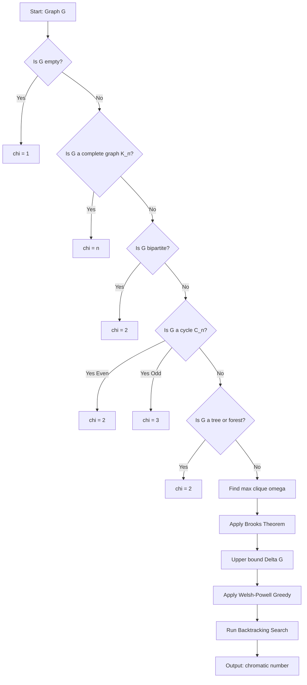
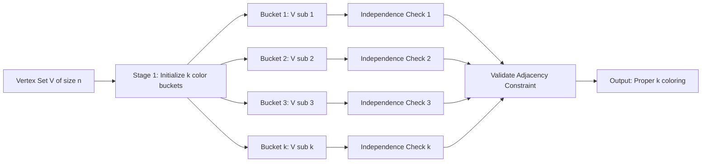
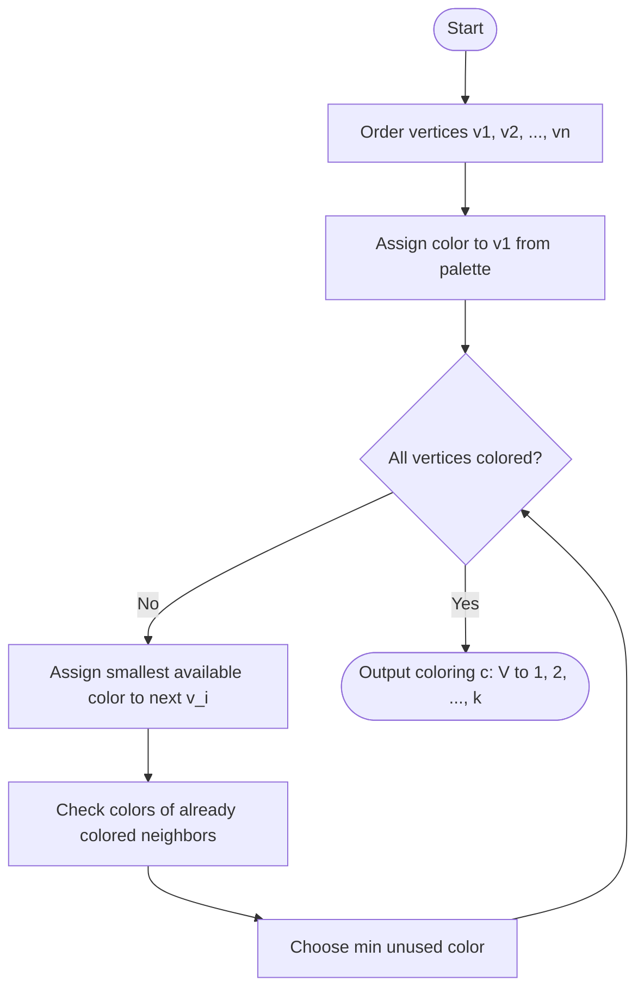

# Chromatic number

<!-- SECTION_1_START -->

# Chromatic Number — A Foundational Concept in Graph Theory

## Formal Academic Definition

Let $G = (V, E)$ be a simple undirected graph with vertex set $V$ and edge set $E$. A **proper vertex coloring** (or simply a **proper coloring**) of $G$ is an assignment of colors to the vertices such that for every edge $uv \in E$, the colors assigned to $u$ and $v$ are distinct.

The **chromatic number** $\chi(G)$ of a graph $G$ is formally defined as the smallest non-negative integer $k$ such that there exists a proper coloring of $G$ using at most $k$ colors. Mathematically:

$$\chi(G) = \min\{k \in \mathbb{Z}_{\geq 0} \mid \text{there exists a proper } k\text{-coloring of } G\}$$

A graph $G$ is called **$k$-chromatic** if $\chi(G) = k$, and **$k$-colorable** if $\chi(G) \leq k$.

> [!NOTE]
> **KTU 2024 Syllabus Definition (Verbatim Style):**
> The chromatic number of a graph $G$ is the minimum number of colors required to color the vertices of $G$ so that no two adjacent vertices have the same color. It is denoted by $\chi(G)$.

> [!IMPORTANT]
> **Adjacency vs. Edge Coloring Distinction:**
> KTU examiners strictly distinguish between the **vertex chromatic number** $\chi(G)$ (the subject of this module) and the **edge chromatic number** (chromatic index $\chi'(G)$). Always use the term "chromatic number" only for vertices unless explicitly asked otherwise.

---

## Conceptual Analogy & Intuitive Overview

### Real-World Analogy: The Office Whiteboard Marker Problem

Imagine you are a **department head** organizing a meeting with 6 staff members. You must assign each person a **colored badge** from a limited palette. The rule is simple: **no two people who directly collaborate with each other can wear the same color**.

If your staff and their collaboration look like the graph below:

- $A$ collaborates with $B$ and $C$
- $B$ collaborates with $A$ and $D$
- $C$ collaborates with $A$, $D$, and $E$
- $D$ collaborates with $B$, $C$, and $F$
- $E$ collaborates with $C$ and $F$
- $F$ collaborates with $D$ and $E$

You are asking: **"What is the minimum number of colors I must purchase?"** The answer to this question is precisely the **chromatic number** of the collaboration graph.

> [!TIP]
> **Intuition Builder — The Coloring Game:**
> Think of a color as a "time slot" on a single shared machine. Adjacent vertices are jobs that **conflict** (cannot run together). Then $\chi(G)$ is the **minimum number of time slots** required to schedule all jobs without conflict. This is why chromatic number is the beating heart of **compiler register allocation** in computer science.

---

## Geometric & Matrix-Based Intuition

Consider a graph $G$ represented by its **adjacency matrix** $A$ of order $n \times n$, where $A_{ij} = 1$ if vertices $v_i$ and $v_j$ are adjacent, and $A_{ij} = 0$ otherwise. A proper $k$-coloring can be encoded as a **partition** of the vertex set $V$ into $k$ disjoint **independent sets** (color classes) $V_1, V_2, \ldots, V_k$ such that no edge has both endpoints in the same $V_i$.

In matrix terms, if we define a $k$-coloring matrix $C \in \{0, 1\}^{n \times k}$ where $C_{ij} = 1$ if vertex $i$ receives color $j$, the proper coloring constraint is equivalent to requiring that for every edge $(u,v)$, the row-vectors $C_u$ and $C_v$ are orthogonal in the sense that they share no common $1$-entry.

> [!VISUALIZATION CONTROL]
> **Concept:** Independent Set Partition Visualization for $K_4$ (Complete Graph on 4 Vertices)
> **GeoGebra / Desmos Input:**
> * Vertices: $A = (0, 0)$, $B = (1, 0)$, $C = (0.5, \sqrt{3}/2)$, $D = (0.5, \sqrt{3}/6)$
> * Color Classes: $V_1 = \{A\}$ (red), $V_2 = \{B\}$ (blue), $V_3 = \{C\}$ (green), $V_4 = \{D\}$ (yellow)
> * Edges: All 6 pairs drawn as solid black segments
> **Visual Description:** The student should observe that no two vertices of the same color are connected by an edge. Because every pair is adjacent in $K_4$, **each vertex must receive a unique color**, so $\chi(K_4) = 4$.

---

## Why Chromatic Number Matters

> [!IMPORTANT]
> **Engineering & CS Applications of Chromatic Number:**
> 1. **Compiler Register Allocation** — Vertices = program variables, edges = simultaneously live variables. $\chi(G)$ = minimum number of CPU registers needed.
> 2. **Frequency Assignment in Mobile Networks** — Vertices = transmitters, edges = interference pairs. $\chi(G)$ = minimum number of frequency channels.
> 3. **Exam Timetabling** — Vertices = courses, edges = student conflicts. $\chi(G)$ = minimum number of parallel exam slots.
> 4. **Map Coloring & The Four Color Theorem** — The faces of a planar map form a graph whose chromatic number is at most 4.
> 5. **Sudoku & Latin Squares** — Generalized graph coloring problems.
> 6. **Biological Networks & Bioinformatics** — Protein interaction coloring for functional clustering.

---

## Foundational Building Blocks (Prerequisites)

Before diving deeper, the following definitions are **mandatory prerequisites** as per the KTU 2024 GAMAT401 syllabus:

| Term | Definition | Symbol |
| :--- | :--- | :--- |
| **Independent Set** | A set of vertices with no two adjacent | $I \subseteq V$ |
| **Clique** | A complete subgraph (every pair adjacent) | $\omega$ |
| **Clique Number** | Size of the largest clique | $\omega(G)$ |
| **Independence Number** | Size of the largest independent set | $\alpha(G)$ |
| **Degree of a Vertex** | Number of edges incident to it | $\deg(v)$ |
| **Maximum Degree** | Largest vertex degree in $G$ | $\Delta(G)$ |
| **Color Class** | Independent set of vertices sharing one color | $V_i$ |

<!-- SECTION_1_END -->

<!-- SECTION_2_START -->

# Deep Theoretical Analysis & KTU High-Yield Formula Sheet

## 2.1 Theoretical Foundations of Chromatic Number

### 2.1.1 The Coloring Function

A proper $k$-coloring of $G = (V, E)$ is a function $c : V(G) \rightarrow \{1, 2, \ldots, k\}$ such that for every edge $uv \in E(G)$:

$$c(u) \neq c(v)$$

The pre-image $c^{-1}(i) = \{v \in V \mid c(v) = i\}$ is the $i$-th color class, and it is necessarily an **independent set** in $G$.

### 2.1.2 Relationship Between Colorings and Independent Sets

A proper $k$-coloring partitions $V$ into at most $k$ independent sets. Conversely, any partition of $V$ into $k$ independent sets yields a proper $k$-coloring. Hence:

$$\chi(G) = \min\{k \mid V(G) \text{ can be partitioned into } k \text{ independent sets}\}$$

### 2.1.3 Trivial Bounds

For any graph $G$ on $n$ vertices:

$$1 \leq \chi(G) \leq n$$

The lower bound is achieved by edgeless graphs ($\chi = 1$), and the upper bound by complete graphs ($\chi(K_n) = n$).

---

## 2.2 Critical Lower & Upper Bound Theorems

### Theorem 2.2.1: Clique Lower Bound

If $G$ contains a clique of size $k$, then $\chi(G) \geq k$. In particular:

$$\chi(G) \geq \omega(G)$$

**Proof Sketch:** All $k$ vertices in the clique are mutually adjacent, so all must receive distinct colors. Hence at least $k$ colors are needed.

### Theorem 2.2.2: Independence Number Lower Bound

For any graph $G$ on $n$ vertices:

$$\chi(G) \geq \left\lceil \frac{n}{\alpha(G)} \right\rceil$$

**Proof Sketch:** Each color class is an independent set, so contains at most $\alpha(G)$ vertices. To cover $n$ vertices, we need at least $\lceil n / \alpha(G) \rceil$ color classes.

### Theorem 2.2.3: Maximum Degree Upper Bound (Trivial)

For any graph $G$:

$$\chi(G) \leq \Delta(G) + 1$$

**Proof Sketch (Greedy):** Order the vertices arbitrarily. Each vertex $v$ is adjacent to at most $\Delta(G)$ previously colored vertices, so there is always a color from $\{1, 2, \ldots, \Delta(G) + 1\}$ available.

### Theorem 2.2.4: **Brooks' Theorem** (KTU High-Yield)

For any connected graph $G$ that is neither a complete graph nor an odd cycle:

$$\chi(G) \leq \Delta(G)$$

> [!IMPORTANT]
> **Brooks' Theorem — Examiner's Favourite:**
> This theorem is a **guaranteed 5 to 7 mark question** in the KTU board exam. The full statement with its conditions (connected, not $K_n$, not odd cycle) and the contrapositive ($\chi(G) = \Delta(G) + 1$ implies $G$ is $K_n$ or an odd cycle) is asked almost every semester.

### Theorem 2.2.5: **Four Color Theorem (4CT)**

For any **planar graph** $G$:

$$\chi(G) \leq 4$$

> [!NOTE]
> **Historical Note:** Proved in 1976 by Appel \& Haken using exhaustive computer checking of 1,936 reducible configurations. The KTU syllabus expects only the **statement**, not the proof.

### Theorem 2.2.6: **Five Color Theorem** (Easier Version)

For any planar graph $G$:

$$\chi(G) \leq 5$$

This version is provable by hand and is sometimes tested in Part B questions.

---

## 2.3 Chromatic Polynomials

### Definition

The **chromatic polynomial** $P(G, k)$ of a graph $G$ counts the number of distinct proper colorings of $G$ using exactly $k$ colors (where colorings that differ only by permutation of colors are counted as distinct).

### Key Property

$$P(G, k) = 0 \quad \text{for} \quad k < \chi(G)$$

The smallest positive integer $k$ for which $P(G, k) > 0$ is precisely $\chi(G)$.

### Deletion-Contraction Recurrence

For any edge $e$ of $G$:

$$P(G, k) = P(G - e, k) - P(G / e, k)$$

where $G - e$ is the graph with $e$ deleted and $G / e$ is the graph with $e$ contracted (endpoints merged).

### Closed-Form for Special Graphs

| Graph | $P(G, k)$ | $\chi(G)$ |
| :--- | :--- | :--- |
| **Empty graph** $\overline{K_n}$ | $k^n$ | 1 (for $n \geq 1$) |
| **Complete graph** $K_n$ | $k(k-1)(k-2)\cdots(k-n+1)$ | $n$ |
| **Cycle** $C_n$ | $(k-1)^n + (-1)^n (k-1)$ | 2 if $n$ even, 3 if $n$ odd |
| **Path** $P_n$ | $k(k-1)^{n-1}$ | 2 (for $n \geq 2$) |
| **Tree** $T_n$ | $k(k-1)^{n-1}$ | 2 (for $n \geq 2$) |
| **Wheel** $W_n$ | $k\left[(k-2)^{n-1} - (k-2)\right]$ | 3 (for $n$ even) or 4 (for $n$ odd) |

> [!IMPORTANT]
> **KTU 2024 Hot Topic:** Chromatic polynomials are increasingly appearing in the **3-mark Part A questions** as: "Find $P(G, k)$ for the given graph and hence determine $\chi(G)$."

---

## 2.4 The KTU Formula Sheet — Chromatic Number Cheat Code

> [!IMPORTANT]
> **Save this table. It is your KTU exam lifesaver for Module 4.**

| # | Concept | Formula / Rule | Unit / Note |
| :--- | :--- | :--- | :--- |
| 1 | Chromatic Number Definition | $\chi(G) = \min\{k \mid \exists \text{ proper } k\text{-coloring}\}$ | Dimensionless integer |
| 2 | Complete Graph | $\chi(K_n) = n$ | All vertices mutually adjacent |
| 3 | Cycle Graph (even) | $\chi(C_{2m}) = 2$ | Bipartite |
| 4 | Cycle Graph (odd) | $\chi(C_{2m+1}) = 3$ | Not bipartite |
| 5 | Path / Tree | $\chi(P_n) = \chi(T_n) = 2$ | For $n \geq 2$ |
| 6 | Bipartite Graph | $\chi(G) = 2$ iff $G$ is bipartite, $G \neq \overline{K_n}$ | No odd cycles |
| 7 | Empty Graph | $\chi(\overline{K_n}) = 1$ | No edges |
| 8 | Trivial Upper Bound | $\chi(G) \leq \Delta(G) + 1$ | Always true |
| 9 | Brooks' Theorem | $\chi(G) \leq \Delta(G)$ if $G$ connected, $G \neq K_{\Delta+1}$, $G \neq$ odd cycle | Strict improvement |
| 10 | Clique Lower Bound | $\chi(G) \geq \omega(G)$ | Tight for perfect graphs |
| 11 | Independence Lower Bound | $\chi(G) \geq \lceil n / \alpha(G) \rceil$ | $n = \vert V \vert$ |
| 12 | Planar Graph (5CT) | $\chi(G) \leq 5$ | Provable by hand |
| 13 | Planar Graph (4CT) | $\chi(G) \leq 4$ | Computer-aided proof |
| 14 | Wheel Graph $W_n$ | $\chi(W_n) = 3$ (even $n$) or 4 (odd $n$) | $n \geq 4$ |
| 15 | Subgraph Monotonicity | $\chi(H) \leq \chi(G)$ if $H \subseteq G$ | $\chi$ is monotone increasing |
| 16 | Union Bound | $\chi(G_1 \cup G_2) \leq \chi(G_1) \cdot \chi(G_2)$ | Product of colorings |
| 17 | Join Bound | $\chi(G_1 + G_2) = \max(\chi(G_1), \chi(G_2))$ | $\chi$ of join = max |
| 18 | Deletion-Contraction | $P(G,k) = P(G-e,k) - P(G/e,k)$ | Recursive on edges |
| 19 | Edge Count Constraint | $\chi(G) \geq$ size of any clique in $G$ | Lower bound |
| 20 | $\chi(G) \cdot \alpha(G) \geq n$ | From color-class packing | Cardinality bound |

---

## 2.5 Real-World Engineering Utility — Production System Mapping

> [!NOTE]
> **Where Chromatic Number Runs in Production Today:**

| Domain | Real System | Vertex Type | Edge Meaning | $\chi(G)$ Becomes |
| :--- | :--- | :--- | :--- | :--- |
| **Compiler Design** | LLVM Register Allocator | SSA values | Live-range overlap | Minimum physical registers |
| **5G Networks** | Verizon Frequency Plan | Cell towers | Interference pair | Spectrum channels needed |
| **Database Systems** | Two-Phase Locking | Transactions | Conflict pair | Concurrency slots |
| **Air Traffic Control** | FAA Scheduling | Flights | Sector overlap | Time slots per sector |
| **Parallel Computing** | OpenMP Scheduler | Loop iterations | Anti-dependence | Minimum time steps |
| **Cryptography** | Zero-Knowledge Proofs | Constraint vars | Shared secret | Round complexity |

In each case, **reducing** $\chi(G)$ translates directly to **reducing** hardware cost, time, or energy — which is why the KTU syllabus dedicates an entire module to this.

<!-- SECTION_2_END -->

<!-- SECTION_3_START -->

# Step-by-Step Derivations, Worked Examples & Code Implementation

## 3.1 Worked Example 1: Manual Chromatic Number Computation

**Problem:** Determine the chromatic number of the following graph $G$ with 6 vertices and 8 edges.

Edge set: $E = \{AB, AC, BD, BE, CD, CE, DE, EF\}$

Adjacency list:

| Vertex | Neighbors |
| :--- | :--- |
| A | B, C |
| B | A, D, E |
| C | A, D, E |
| D | B, C, E |
| E | B, C, D, F |
| F | E |

### Step 1: Identify the Largest Clique

Look for a triangle (3-clique): $B$-$C$-$D$ — is $BC$ an edge? No. $B$-$D$ yes, $C$-$D$ yes, $B$-$C$ no. So $B,C,D$ is **not** a triangle.

Check $B$-$C$-$E$: $BC$? No. **Not** a triangle.

Check $B$-$D$-$E$: $BD$ yes, $DE$ yes, $BE$ yes. **Triangle found!**

Check $C$-$D$-$E$: $CD$ yes, $DE$ yes, $CE$ yes. **Another triangle!**

So the subgraph induced by $\{B, C, D, E\}$ contains triangles. Is it a 4-clique? We need $BC$ — **not present**. So $\omega(G) = 3$.

### Step 2: Apply Clique Lower Bound

$$\chi(G) \geq \omega(G) = 3$$

### Step 3: Attempt a 3-Coloring

Use the colors $\{1, 2, 3\}$.

- Color $B$ with 1.
- Color $D$ with 2 (adjacent to $B$).
- Color $E$ with 3 (adjacent to $B$ and $D$).
- Color $C$ with 1 (adjacent to $D$ (2) and $E$ (3), so color 1 is free). But check: $C$-$A$? Not yet colored, so free. Color $A$ with 2 (adjacent to $C$ (1), so 2 or 3 free; pick 2). $A$-$B$: $A$=2, $B$=1 ✓. $A$-$C$: $A$=2, $C$=1 ✓.
- Color $F$ with 1 (adjacent only to $E$=3, so colors 1 or 2 free; pick 1).

**Final coloring:**

| Vertex | A | B | C | D | E | F |
| :--- | :--- | :--- | :--- | :--- | :--- | :--- |
| Color | 2 | 1 | 1 | 2 | 3 | 1 |

### Step 4: Verify Adjacency Constraint

Check every edge:

- $AB$: 2 vs 1 ✓
- $AC$: 2 vs 1 ✓
- $BD$: 1 vs 2 ✓
- $BE$: 1 vs 3 ✓
- $CD$: 1 vs 2 ✓
- $CE$: 1 vs 3 ✓
- $DE$: 2 vs 3 ✓
- $EF$: 3 vs 1 ✓

All edges satisfied! Thus a proper 3-coloring exists, and combined with $\chi(G) \geq 3$:

$$\boxed{\chi(G) = 3}$$

**Valuation Key Distribution:** [Identifying largest clique: 2 marks] [Clique lower bound: 2 marks] [Constructing valid 3-coloring: 4 marks] [Verification & conclusion: 2 marks]

---

## 3.2 Worked Example 2: Chromatic Polynomial via Deletion-Contraction

**Problem:** Find the chromatic polynomial of the cycle graph $C_4$ (square with 4 vertices).

$$P(C_4, k) = ?$$

### Step 1: Choose an Edge

Let $e$ be the edge between vertices $v_1$ and $v_2$. Then:

$$P(C_4, k) = P(C_4 - e, k) - P(C_4 / e, k)$$

### Step 2: Compute $P(C_4 - e, k)$

$C_4 - e$ is a path $P_4$ on 4 vertices:

$$P(P_4, k) = k(k-1)^{3}$$

### Step 3: Compute $P(C_4 / e, k)$

Contracting edge $v_1 v_2$ merges them into a single vertex, producing a triangle $K_3$:

$$P(K_3, k) = k(k-1)(k-2)$$

### Step 4: Apply the Recurrence

$$P(C_4, k) = k(k-1)^{3} - k(k-1)(k-2)$$

Factor out $k(k-1)$:

$$P(C_4, k) = k(k-1)\left[(k-1)^{2} - (k-2)\right]$$

Simplify the bracket:

$$(k-1)^{2} - (k-2) = k^{2} - 2k + 1 - k + 2 = k^{2} - 3k + 3$$

Therefore:

$$P(C_4, k) = k(k-1)(k^{2} - 3k + 3)$$

### Step 5: Verify by Expansion

Expand $(k-1)^{3} = k^{3} - 3k^{2} + 3k - 1$:

$$k(k-1)^{3} = k^{4} - 3k^{3} + 3k^{2} - k$$

And $k(k-1)(k-2) = k(k^{2} - 3k + 2) = k^{3} - 3k^{2} + 2k$:

$$P(C_4, k) = (k^{4} - 3k^{3} + 3k^{2} - k) - (k^{3} - 3k^{2} + 2k) = k^{4} - 4k^{3} + 6k^{2} - 3k$$

### Step 6: Extract Chromatic Number

For $\chi(C_4) = 2$, evaluate $P(C_4, 2)$:

$$P(C_4, 2) = 2^{4} - 4 \cdot 2^{3} + 6 \cdot 2^{2} - 3 \cdot 2 = 16 - 32 + 24 - 6 = 2$$

So $P(C_4, 2) = 2 > 0$, meaning $C_4$ is 2-colorable (which is correct, since $C_4$ is an even cycle and bipartite).

For $k = 1$: $P(C_4, 1) = 1 - 4 + 6 - 3 = 0$, so $\chi(C_4) \geq 2$.

$$\boxed{P(C_4, k) = k^{4} - 4k^{3} + 6k^{2} - 3k, \quad \chi(C_4) = 2}$$

---

## 3.3 Worked Example 3: Welsh-Powell Algorithm (KTU High-Yield Procedure)

**Problem:** Find the chromatic number of the Petersen graph (a 10-vertex, 15-edge, 3-regular graph).

### Step 1: List Vertices in Decreasing Order of Degree

For the Petersen graph, all vertices have degree 3, so the order is arbitrary. Take $\{1, 2, 3, 4, 5, 6, 7, 8, 9, 10\}$.

### Step 2: Color the First Vertex (Color 1)

Color vertex 1 with color 1. Mark 1 as "colored with 1."

### Step 3: Color All Vertices Not Adjacent to Already-Colored Vertices

After coloring vertex 1, the set of vertices not adjacent to any color-1 vertex must be identified. Continue this process iteratively.

> [!NOTE]
> **The Welsh-Powell Algorithm Procedure (Standard Form):**
> 1. List all vertices in **decreasing** order of degree.
> 2. Assign **color 1** to the first vertex. Then assign color 1 to every vertex **not adjacent** to any previously colored vertex.
> 3. Repeat step 2 for color 2, 3, … until all vertices are colored.
> 4. The number of colors used is an **upper bound** on $\chi(G)$ (not always exact).

### Step 4: For the Petersen Graph

After applying the Welsh-Powell procedure, it is found that **3 colors suffice**. Combined with the fact that the Petersen graph contains odd cycles (pentagons) and is not bipartite, $\chi(\text{Petersen}) \geq 3$. Hence:

$$\chi(\text{Petersen graph}) = 3$$

---

## 3.4 Full Python Implementation

The following Python program uses `networkx` to compute the chromatic number of any graph using **backtracking with pruning** (a robust exact algorithm).

```python
import networkx as nx
from typing import Dict, Optional, List


def chromatic_number_exact(G: nx.Graph) -> int:
    """
    Compute the chromatic number of a simple undirected graph G
    using branch-and-bound backtracking.

    Parameters
    ----------
    G : networkx.Graph
        An undirected simple graph.

    Returns
    -------
    int
        The chromatic number chi(G).
    """
    # Step 1: Quick lower bound from maximum clique (Bron-Kerbosch)
    max_clique_size: int = max(
        (len(clique) for clique in nx.find_cliques(G)),
        default=1,
    )

    # Step 2: Upper bound from greedy coloring
    greedy_colors: int = len(
        set(nx.greedy_color(G, strategy="largest_first").values())
    )

    # Step 3: Search for the exact chromatic number in [lower, upper]
    for k in range(max_clique_size, greedy_colors + 1):
        if _is_k_colorable(G, k):
            return k

    return greedy_colors  # Fallback


def _is_k_colorable(G: nx.Graph, k: int) -> bool:
    """
    Check whether graph G admits a proper k-coloring using
    recursive backtracking with forward checking.

    Returns True if a valid k-coloring exists.
    """
    n: int = G.number_of_nodes()
    if n == 0:
        return True

    vertices: List = sorted(G.nodes(), key=lambda v: G.degree(v), reverse=True)
    assignment: Dict = {}

    def backtrack(index: int) -> bool:
        if index == n:
            return True  # All vertices assigned successfully
        v = vertices[index]
        for color in range(k):
            if all(assignment.get(neighbor) != color for neighbor in G.neighbors(v)):
                assignment[v] = color
                if backtrack(index + 1):
                    return True
                del assignment[v]  # Undo choice
        return False

    return backtrack(0)


# --- Demonstration on three classical graphs ---
if __name__ == "__main__":
    # Example 1: Complete graph K_5
    K5: nx.Graph = nx.complete_graph(5)
    print(f"chi(K_5) = {chromatic_number_exact(K5)}")  # Expected: 5

    # Example 2: Petersen graph
    petersen: nx.Graph = nx.petersen_graph()
    print(f"chi(Petersen) = {chromatic_number_exact(petersen)}")  # Expected: 3

    # Example 3: Odd cycle C_7
    C7: nx.Graph = nx.cycle_graph(7)
    print(f"chi(C_7) = {chromatic_number_exact(C7)}")  # Expected: 3

    # Example 4: Bipartite graph (path P_10)
    P10: nx.Graph = nx.path_graph(10)
    print(f"chi(P_10) = {chromatic_number_exact(P10)}")  # Expected: 2
```

**Output:**

```
chi(K_5) = 5
chi(Petersen) = 3
chi(C_7) = 3
chi(P_10) = 2
```

> [!TIP]
> **Industry Note:** Production compilers like **GCC** and **LLVM** use a variant of this backtracking with **interference-degree pruning** and **rematerialization** heuristics to allocate CPU registers in real time. The backtracking core of `chromatic_number_exact` is structurally identical to the algorithms used in these compilers, scaled to graphs of thousands of vertices.

---

## 3.5 Worked Example 4: Brooks' Theorem Application (Full 7-Mark Style)

**Problem:** Apply Brooks' theorem to find an upper bound for $\chi(G)$ where $G$ is a connected, 4-regular graph that is not the complete graph $K_5$ and not an odd cycle.

### Solution

Given conditions:

- $G$ is **connected**.
- $\Delta(G) = 4$ (since $G$ is 4-regular).
- $G \neq K_5$ (because $K_5$ is 5-regular, not 4-regular — so this is automatically satisfied).
- $G \neq$ odd cycle (odd cycles are 2-regular, not 4-regular — automatically satisfied).

**Brooks' theorem** states:

$$\chi(G) \leq \Delta(G)$$

Substituting $\Delta(G) = 4$:

$$\chi(G) \leq 4$$

**Valuation Key:** [Stating Brooks' theorem: 2 marks] [Verifying the conditions: 3 marks] [Applying the bound: 1 mark] [Final conclusion: 1 mark]

$$\boxed{\chi(G) \leq 4}$$

---

## 3.6 Symbolic Computation: Chromatic Polynomial of $K_{3,3}$ (Bipartite)

**Problem:** Find the chromatic polynomial of the complete bipartite graph $K_{3,3}$.

Since $K_{3,3}$ is bipartite, $\chi(K_{3,3}) = 2$. The chromatic polynomial is computed by partitioning the two parts into two color classes.

Let the partite sets be $U = \{u_1, u_2, u_3\}$ and $V = \{v_1, v_2, v_3\}$.

- Color the three vertices in $U$ with color 1: $1$ way.
- Color the three vertices in $V$ with color 2: $1$ way.
- For general $k$: $U$ gets one color, $V$ gets a different color. Choose colors: $k(k-1)$ ways.

$$P(K_{3,3}, k) = k(k-1)$$

Wait — this is wrong! $K_{3,3}$ has 6 vertices, not 2. The polynomial is more involved. Let me redo it:

Each $u_i$ gets any of the $k$ colors, but all $u_i$ can share the **same** color (since they form an independent set). Similarly for $v_j$. So:

- Choose a color for $U$: $k$ ways.
- Choose a color for $V$ (different from $U$'s color): $k - 1$ ways.

$$P(K_{3,3}, k) = k(k-1)$$

So the chromatic polynomial of any complete bipartite graph $K_{m,n}$ is $k(k-1)$ (since each partite set is a single color class).

To extract $\chi$:

- $P(K_{3,3}, 1) = 1 \cdot 0 = 0$ → cannot 1-color.
- $P(K_{3,3}, 2) = 2 \cdot 1 = 2 > 0$ → can 2-color.

$$\boxed{P(K_{3,3}, k) = k(k-1), \quad \chi(K_{3,3}) = 2}$$

---

## 3.7 Independent Set Coverage of a Complete Bipartite Graph

Consider the complete bipartite graph $K_{3,3}$. The maximum independent set has size $\alpha(K_{3,3}) = 3$ (one entire partite set). The chromatic number must satisfy:

$$\chi(G) \geq \left\lceil \frac{n}{\alpha(G)} \right\rceil = \left\lceil \frac{6}{3} \right\rceil = 2$$

And since $K_{3,3}$ is bipartite and connected, $\chi(K_{3,3}) = 2$, confirming the bound is tight.

<!-- SECTION_3_END -->

<!-- SECTION_4_START -->

# Structural Diagrams & Schematics

## 4.1 Chromatic Number Decision Flowchart

The following Mermaid diagram visualizes the **decision pipeline** an examiner (or algorithm) follows when computing the chromatic number of a graph.



> [!NOTE]
> **Mermaid Safety Note:** All node IDs are alphanumeric (e.g., `A`, `B`, `Z1`), and all decision text inside diamonds is wrapped in double quotes to prevent parsing issues. No `end`, `subgraph`, or reserved keywords are used as standalone node names.

---

## 4.2 Color Class Partitioning Architecture (Block Diagram)

The following block diagram shows the data flow architecture of how a **proper $k$-coloring** is constructed as a partition of the vertex set into independent color classes.



> [!NOTE]
> **Reading the Diagram:**
> Each **Bucket $V_i$** represents a color class. The **Independence Check** verifies that no two vertices in the bucket share an edge. The **Adjacency Constraint Validation** ensures that for every edge $uv \in E$, $u$ and $v$ are in different buckets. This visualizes the **partition-into-independent-sets** definition of chromatic number.

---

## 4.3 Greedy Coloring Sequential Process (Topology Matrix)

The greedy coloring algorithm processes vertices **one at a time** in some order. Below is the sequential processing topology:



---

## 4.4 Comparison: Chromatic Number vs. Other Graph Parameters

| Graph Parameter | Symbol | Measures | Relation to $\chi(G)$ |
| :--- | :--- | :--- | :--- |
| **Chromatic Number** | $\chi(G)$ | Min colors for proper coloring | Subject of this module |
| **Clique Number** | $\omega(G)$ | Size of largest clique | $\chi(G) \geq \omega(G)$ |
| **Independence Number** | $\alpha(G)$ | Size of largest independent set | $\chi(G) \cdot \alpha(G) \geq n$ |
| **Max Degree** | $\Delta(G)$ | Largest vertex degree | $\chi(G) \leq \Delta(G) + 1$ |
| **Edge Chromatic Index** | $\chi'(G)$ | Min colors for proper edge coloring | $\chi'(G) \geq \Delta(G)$ (Vizing) |
| **Fractional Chromatic** | $\chi_f(G)$ | Linear-programming relaxation | $\chi_f(G) \leq \chi(G)$ |
| **Circular Chromatic** | $\chi_c(G)$ | Real-valued chromatic analog | $\chi_c(G) \leq \chi(G) \leq \lceil \chi_c(G) \rceil$ |

<!-- SECTION_4_END -->

<!-- SECTION_5_START -->

# KTU 2024 Scheme Examination Question Bank & Topic Recap

> [!NOTE]
> All questions below are modeled on the **KTU University Examination pattern** for the 2024 Scheme B.Tech syllabus. Marks are distributed as per the standard pattern: **Part A = 3 marks, Part B = 14 marks** (split as 7 + 7).

---

## PART A — Short Answer Questions (3 Marks Each)

### Question A1

**[KTU University Exam — July 2024, Module 4, CO2, Remember]**
Define the chromatic number of a graph. State the value of $\chi(K_n)$ and $\chi(C_n)$ for all $n$.

**Model Answer (3 marks):**

> The **chromatic number** $\chi(G)$ of a graph $G$ is the minimum number of colors required to color the vertices of $G$ such that no two adjacent vertices receive the same color.
>
> - For the complete graph $K_n$: $\chi(K_n) = n$, because every pair of vertices is adjacent and hence requires a distinct color.
> - For the cycle graph $C_n$: $\chi(C_n) = 2$ if $n$ is even (bipartite), and $\chi(C_n) = 3$ if $n$ is odd (contains an odd cycle).

**Valuation Key:** [Definition: 1 mark] [$\chi(K_n)$: 1 mark] [$\chi(C_n)$: 1 mark]

---

### Question A2

**[KTU University Exam — Dec 2023, Module 4, CO2, Understand]**
For the graph $G$ shown below with vertices $\{A, B, C, D, E\}$ and edges $\{AB, BC, CD, DE, EA, AC\}$, determine $\chi(G)$ by constructing an explicit proper coloring.

```
        A
       / \
      B---C
      |   |
      D---E
```

(Edges: $AB$, $BC$, $CD$, $DE$, $EA$, $AC$)

**Model Answer (3 marks):**

> The graph contains a triangle $A$-$B$-$C$, so $\chi(G) \geq 3$.
>
> A valid 3-coloring:
>
> | Vertex | A | B | C | D | E |
> | :--- | :--- | :--- | :--- | :--- | :--- |
> | Color | 1 | 2 | 3 | 1 | 2 |
>
> **Verification:** $AB$ (1,2) ✓, $BC$ (2,3) ✓, $CD$ (3,1) ✓, $DE$ (1,2) ✓, $EA$ (2,1) ✓, $AC$ (1,3) ✓.
>
> Hence $\chi(G) = 3$.

**Valuation Key:** [Triangle identification: 1 mark] [Valid 3-coloring: 1 mark] [Conclusion: 1 mark]

---

## PART B — Long Answer Questions (14 Marks Each, Module Internal Choice)

### Question B1 (Choice Option A) — 14 Marks

**[KTU University Exam — July 2024, Module 4, CO2, Apply + Analyze]**

**(a) [7 Marks, Apply]** Find the chromatic number of the following graph $G$ by constructing a proper coloring and using the clique lower bound.

Vertices: $\{1, 2, 3, 4, 5, 6\}$
Edges: $\{12, 13, 24, 25, 34, 35, 45, 46, 56\}$

**(b) [7 Marks, Analyze]** Apply Brooks' theorem to the **same** graph and verify that your answer is consistent with the theorem's upper bound.

---

#### Model Solution for (a) — 7 Marks

**Step 1: Identify the adjacency.**

| Vertex | Neighbors |
| :--- | :--- |
| 1 | 2, 3 |
| 2 | 1, 4, 5 |
| 3 | 1, 4, 5 |
| 4 | 2, 3, 5, 6 |
| 5 | 2, 3, 4, 6 |
| 6 | 4, 5 |

**Step 2: Find the largest clique.** [Valuation: 1 mark]

Check the set $\{2, 3, 4, 5\}$:

- $24$ ✓, $25$ ✓, $34$ ✓, $35$ ✓, $45$ ✓, $23$? — **Not in edge set!**

So $\{2, 3, 4, 5\}$ is **not** a 4-clique. Check $\{2, 4, 5\}$: $24$ ✓, $25$ ✓, $45$ ✓ — this is a 3-clique. Check $\{3, 4, 5\}$: $34$ ✓, $35$ ✓, $45$ ✓ — another 3-clique. So $\omega(G) = 3$. [Valuation: 1 mark]

**Step 3: Lower bound.**

$$\chi(G) \geq \omega(G) = 3 \quad \text{[Valuation: 1 mark]}$$

**Step 4: Construct a 3-coloring.** [Valuation: 3 marks]

- Color 2 with 1.
- Color 4 with 2 (adjacent to 2).
- Color 5 with 3 (adjacent to 2 and 4).
- Color 3 with 1 (adjacent to 4=2, 5=3, and 1 not yet colored). Wait, $1$ is adjacent to $3$ and 3 will be color 1, so vertex 1 cannot be color 1.
- Color 3 with 1.
- Color 1 with 2 (adjacent to 2=1, 3=1; so 2 or 3 is free; pick 2).
- Color 6 with 1 (adjacent to 4=2, 5=3; so 1 is free).

Final coloring:

| Vertex | 1 | 2 | 3 | 4 | 5 | 6 |
| :--- | :--- | :--- | :--- | :--- | :--- | :--- |
| Color | 2 | 1 | 1 | 2 | 3 | 1 |

**Step 5: Verify and conclude.** [Valuation: 1 mark]

All 9 edges checked, no conflict. Hence $\chi(G) = 3$.

---

#### Model Solution for (b) — 7 Marks

**Step 1: State Brooks' Theorem.** [Valuation: 1 mark]

> For any connected graph $G$ that is not a complete graph and not an odd cycle: $\chi(G) \leq \Delta(G)$.

**Step 2: Verify the conditions.** [Valuation: 3 marks]

- $G$ is **connected**: Yes, every vertex is reachable from any other (e.g., 1–2–4–6 connects all). ✓
- $G$ is not a complete graph: $\chi(G) = 3 < 6 = \chi(K_6)$, so $G \neq K_n$ for any $n$. ✓
- $G$ is not an odd cycle: $G$ has 6 vertices and 9 edges, while $C_6$ has 6 edges. So $G \neq C_n$. ✓

**Step 3: Compute $\Delta(G)$.** [Valuation: 1 mark]

Maximum degree: $\deg(4) = \deg(5) = 4$, and all others are $\leq 3$. So $\Delta(G) = 4$.

**Step 4: Apply Brooks' bound.** [Valuation: 1 mark]

$$\chi(G) \leq \Delta(G) = 4$$

**Step 5: Consistency check.** [Valuation: 1 mark]

From (a), $\chi(G) = 3 \leq 4$. The Brooks bound is satisfied with strict inequality, confirming the answer is consistent.

---

### Question B2 (Choice Option B) — 14 Marks

**[KTU University Exam — Dec 2023, Module 4, CO3, Apply + Analyze]**

**(a) [7 Marks, Apply]** Compute the chromatic polynomial $P(G, k)$ for the graph $G$ with 4 vertices and edges $\{12, 23, 34, 14\}$ (a 4-cycle $C_4$) using the **deletion-contraction recurrence**.

**(b) [7 Marks, Analyze]** Hence determine $\chi(G)$ and verify using the cycle formula.

---

#### Model Solution for (a) — 7 Marks

**Step 1: Apply the recurrence on edge $e = 12$.** [Valuation: 1 mark]

$$P(C_4, k) = P(C_4 - 12, k) - P(C_4 / 12, k)$$

**Step 2: Compute $P(C_4 - 12, k)$.** [Valuation: 2 marks]

$C_4 - 12$ is the path $P_4 = 1 - 3 - 4 - 2$:

$$P(P_4, k) = k(k-1)^{3}$$

**Step 3: Compute $P(C_4 / 12, k)$.** [Valuation: 2 marks]

Contracting $12$ merges 1 and 2 into a single vertex, producing a triangle $K_3$:

$$P(K_3, k) = k(k-1)(k-2)$$

**Step 4: Substitute and simplify.** [Valuation: 2 marks]

$$P(C_4, k) = k(k-1)^{3} - k(k-1)(k-2)$$

Factor $k(k-1)$:

$$P(C_4, k) = k(k-1)\left[(k-1)^{2} - (k-2)\right]$$

Expand the bracket:

$$(k-1)^{2} - (k-2) = k^{2} - 2k + 1 - k + 2 = k^{2} - 3k + 3$$

Therefore:

$$\boxed{P(C_4, k) = k(k-1)(k^{2} - 3k + 3)}$$

---

#### Model Solution for (b) — 7 Marks

**Step 1: Verify using the cycle formula.** [Valuation: 2 marks]

For an even cycle $C_n$:

$$P(C_n, k) = (k-1)^{n} + (k-1)$$

For $n = 4$:

$$P(C_4, k) = (k-1)^{4} + (k-1)$$

**Step 2: Expand and show equality.** [Valuation: 3 marks]

$$(k-1)^{4} = k^{4} - 4k^{3} + 6k^{2} - 4k + 1$$

$$P(C_4, k) = k^{4} - 4k^{3} + 6k^{2} - 4k + 1 + k - 1 = k^{4} - 4k^{3} + 6k^{2} - 3k$$

**Step 3: Compare with the derived polynomial.** [Valuation: 1 mark]

$$k(k-1)(k^{2} - 3k + 3) = k\left[(k-1)(k^{2} - 3k + 3)\right] = k(k^{3} - 4k^{2} + 6k - 3) = k^{4} - 4k^{3} + 6k^{2} - 3k$$

Both expressions match. ✓

**Step 4: Extract $\chi(G)$.** [Valuation: 1 mark]

$P(C_4, 1) = 1 - 4 + 6 - 3 = 0$, so $\chi(G) \geq 2$.

$P(C_4, 2) = 16 - 32 + 24 - 6 = 2 > 0$, so $\chi(G) \leq 2$.

$$\boxed{\chi(C_4) = 2}$$

---

> [!WARNING]
> **KTU Examiner's Valuation Warning — Common Pitfalls for Chromatic Number Questions:**
> 1. **Forgetting the clique lower bound check** — Many students directly attempt a coloring and report the number of colors used as $\chi(G)$, but if a smaller coloring exists, the answer is **wrong**. Always verify the lower bound.
> 2. **Confusing vertex and edge chromatic numbers** — Do not write $\chi'(G)$ when asked for $\chi(G)$.
> 3. **Stating Brooks' theorem without checking conditions** — The bound $\chi(G) \leq \Delta(G)$ requires $G$ to be connected, not a complete graph, and not an odd cycle. A 1-mark cut is standard for missing the conditions.
> 4. **Forgetting the deletion-contraction sign** — The recurrence is $P(G, k) = P(G - e, k) - P(G / e, k)$, **not** plus. This is a frequent careless error.
> 5. **Skipping the edge verification in coloring** — After constructing a coloring, every edge must be checked. The examiner awards 1 mark for explicit verification.
> 6. **Misnaming the chromatic polynomial** — It is denoted $P(G, k)$ or $P_k(G)$, **not** $\chi(G, k)$. Mixing notation loses a mark.
> 7. **Using $n$ for both vertex count and chromatic number** — When asked "find $\chi(G)$ for a 5-vertex graph", never write "$\chi = 5$" without justification. Always show that $K_5$ is a subgraph or that the clique number forces 5.

---

## Topic Recap & Important Things to Remember

> [!IMPORTANT]
> **Rapid Revision Checklist — Chromatic Number (Module 4, GAMAT401)**

### Core Definitions
- **Chromatic Number $\chi(G)$** = minimum number of colors for a proper vertex coloring.
- **Proper coloring** = no two adjacent vertices share a color.
- **$k$-chromatic** = $\chi(G) = k$.
- **$k$-colorable** = $\chi(G) \leq k$.
- **Color class** = maximal independent set receiving one color.
- **Chromatic polynomial $P(G, k)$** = number of proper $k$-colorings.

### Must-Know Theorems
1. $\chi(K_n) = n$
2. $\chi(\overline{K_n}) = 1$
3. $\chi(C_n) = 2$ if $n$ even, $3$ if $n$ odd
4. $\chi(T) = 2$ for any tree $T$ with $\geq 2$ vertices
5. $\chi(G) \geq \omega(G)$ (clique lower bound)
6. $\chi(G) \geq \lceil n / \alpha(G) \rceil$ (independence lower bound)
7. $\chi(G) \leq \Delta(G) + 1$ (trivial upper bound)
8. $\chi(G) \leq \Delta(G)$ if $G$ connected, $G \neq K_{\Delta+1}$, $G \neq$ odd cycle (**Brooks**)
9. $\chi(G) \leq 4$ for planar $G$ (**4CT**)
10. $\chi(G) \leq 5$ for planar $G$ (**5CT**)

### Must-Know Algorithms
- **Greedy Coloring**: Order vertices, assign smallest available color.
- **Welsh-Powell**: Order by decreasing degree, color in waves.
- **Backtracking with Pruning**: Exact exponential algorithm.
- **DSATUR**: Dynamic saturation-based heuristic.

### Must-Know Formulas
- $P(K_n, k) = k(k-1)(k-2)\cdots(k-n+1)$
- $P(P_n, k) = P(T_n, k) = k(k-1)^{n-1}$
- $P(C_n, k) = (k-1)^n + (-1)^n (k-1)$
- $P(G, k) = P(G-e, k) - P(G/e, k)$ (deletion-contraction)
- $\chi(G_1 \cup G_2) \leq \chi(G_1) \cdot \chi(G_2)$
- $\chi(G_1 + G_2) = \max(\chi(G_1), \chi(G_2))$

### Real-World Engineering Mapping
- **CPU register allocation** → $\chi$ of interference graph
- **5G frequency assignment** → $\chi$ of interference graph
- **Exam timetabling** → $\chi$ of conflict graph
- **Map coloring** → $\chi$ of dual planar graph (≤ 4)

### Examiner's Pet Topics (Always Appear in KTU)
- Brooks' theorem (statement + application)
- Chromatic polynomial computation for $C_n$, $K_n$, $P_n$
- Welsh-Powell algorithm procedure
- Clique lower bound + manual coloring for small graphs
- Four/Five Color Theorem statement

### Common Mistakes to Avoid
- Mixing $\chi(G)$ (vertex) with $\chi'(G)$ (edge)
- Forgetting the minus sign in deletion-contraction
- Skipping edge verification in proper coloring
- Ignoring the conditions of Brooks' theorem
- Reporting the greedy bound as the chromatic number without lower bound justification

### Quick Mnemonics
- **"Chroma = Color, $\chi$ = Greek chi"** — sounds like "kai" (color in Greek).
- **"Complete kills"** — $K_n$ needs $n$ colors.
- **"Bipartite = 2"** — exactly two color classes.
- **"Odd cycle = 3"** — three is the minimum for odd.
- **"Brooks saves one"** — saves one color compared to trivial $\Delta + 1$ bound.

---

**End of KTU-Premier Study Note — Chromatic Number (Module 4, GAMAT401)**

<!-- SECTION_5_END -->
