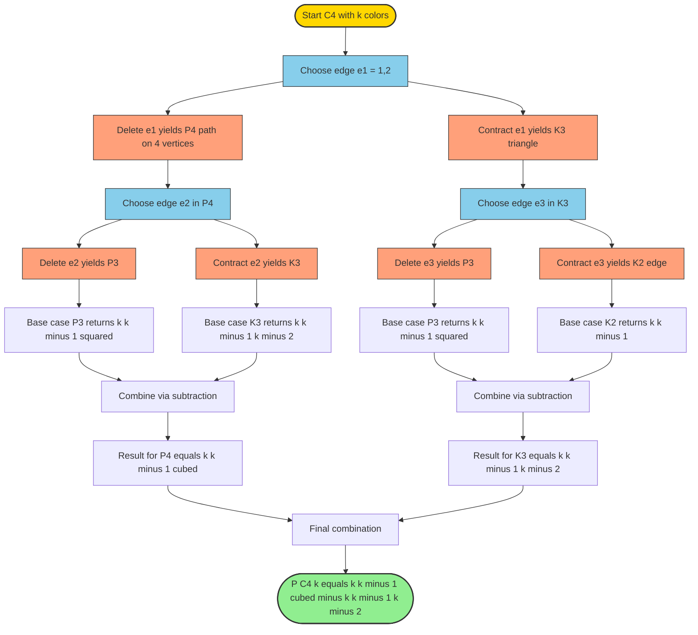
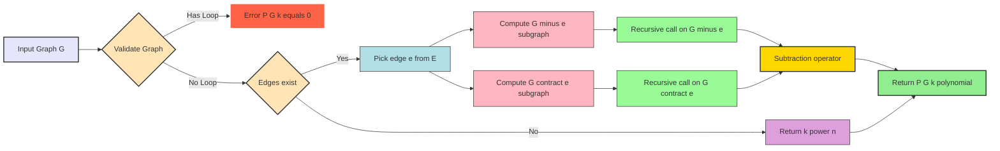

# Chromatic polynomial

<!-- SECTION_1_START -->
# Chromatic Polynomial — Core Technical Definition & Intuitive Overview

## Formal Definition (KTU 2024 Scheme Terminology)

Let $G = (V, E)$ be a simple, undirected, finite graph. The **chromatic polynomial** of $G$, denoted $P(G, k)$, is the polynomial in the indeterminate $k$ whose value at a positive integer $k$ equals the number of distinct proper vertex colorings of $G$ using at most $k$ available colors. A *proper coloring* assigns a color to every vertex such that no two adjacent vertices share the same color.

$$P(G, k) = \#\{\,f : V \to \{1, 2, \ldots, k\} \mid f(u) \neq f(v) \text{ whenever } \{u, v\} \in E\,\}$$

> [!IMPORTANT]
> **KTU 2024 Scheme Emphasis:** $P(G, k)$ is unambiguously a **polynomial** in $k$ (over the integers $\mathbb{Z}$), even though its combinatorial meaning is integer-evaluation. Every $P(G, k)$ has degree exactly $\vert V(G) \vert$, is **monic** (leading coefficient $= 1$), and the constant term is $0$ whenever $G$ contains at least one edge.

## Conceptual Analogy — The "Colorful Lecture Hall" Intuition

Imagine you are assigning **exam-seating colors** in a large lecture hall where students sitting next to each other are *forbidden* from sharing a color (to make cheating harder). The question is: *"If I have $k$ colors of chalk available, how many ways can I color the seats so that no two adjacent seats share a color?"*

- Each **vertex** is a *seat*.
- Each **edge** is a *pair of adjacent seats that must differ in color*.
- $P(G, k)$ counts the **total number of valid seating plans**.

> [!NOTE]
> **Why "polynomial"?** Even though we only care about integer $k$ for colorings, the answer turns out to be expressible as a single polynomial in $k$. This is the profound insight discovered by **George Birkhoff** (1912) and refined by **Hassler Whitney** (1932), who coined the term *chromatic polynomial*.

## Connection to the Chromatic Number

The chromatic number $\chi(G)$ is the **smallest positive integer** $k$ for which $P(G, k) > 0$. Equivalently:

$$\chi(G) = \min\{\,k \in \mathbb{Z}_{>0} \mid P(G, k) > 0\,\}$$

The **Brooks' bound** (relevant KTU corollary) states $\chi(G) \leq \Delta(G)$ for any connected graph $G$ that is neither a complete graph $K_{\Delta+1}$ nor an odd cycle.

## Visualization via GeoGebra / Desmos

> [!VISUALIZATION CONTROL]
> **Concept:** Plot of $P(G, k)$ as a polynomial in $k$ for the triangle $K_3$ and the path $P_3$.
> **GeoGebra / Desmos Input Equations:**
>
> - `f(x) = x*(x-1)*(x-2)`  *(corresponds to $P(K_3, k)$)*
> - `g(x) = x*(x-1)^2`       *(corresponds to $P(P_3, k)$ where $P_3$ is a path on 3 vertices)*
> - `h(x) = x*(x-1)*(x-2)*(x-3)` *(corresponds to $P(K_4, k)$)*
>
> **Visual Description:** The student should observe three positive real roots at $x = 0, 1, 2$ for $f$ and $g$ (meaning $P = 0$ for $k = 0, 1$ since the graph has edges), and that the graphs **lift off the x-axis at $k = 3$ for $f$ and at $k = 2$ for $g$**, confirming $\chi(K_3) = 3$ and $\chi(P_3) = 2$. The leading coefficient is always $1$ (monic) and the curves diverge to $+\infty$ as $k \to +\infty$.

<!-- SECTION_1_END -->

<!-- SECTION_2_START -->
# Deep Theoretical Analysis & KTU High-Yield Formula Sheet

## 1. The Fundamental Recursion — Deletion-Contraction

The cornerstone of KTU Module 4 chromatic-polynomial theory is the **Deletion-Contraction Theorem**. For any edge $e = \{u, v\}$ of a graph $G$:

$$P(G, k) \;=\; P(G - e, \, k) \;-\; P(G / e, \, k)$$

where:
- $G - e$ is the graph obtained by **deleting** the edge $e$ (vertices $u, v$ remain, but they are no longer forced to differ in color).
- $G / e$ is the graph obtained by **contracting** $e$ — i.e., identifying $u$ and $v$ into a single merged vertex (every neighbor of $u$ or $v$ becomes adjacent to this merged vertex).

> [!IMPORTANT]
> **Intuition for the recursion:** When coloring $G$, an edge $e = \{u, v\}$ partitions the colorings of $G - e$ into two disjoint sets: those where $f(u) = f(v)$ (which correspond bijectively to colorings of $G / e$) and those where $f(u) \neq f(v)$ (which are exactly the proper colorings of $G$). Therefore:
> $$\underbrace{P(G - e, k)}_{\text{all colorings of } G - e} \;=\; \underbrace{P(G, k)}_{\text{proper colorings of } G} \;+\; \underbrace{P(G / e, k)}_{\text{colorings with } f(u) = f(v)}$$

## 2. Boundary / Base-Case Conditions

| Graph family | Chromatic polynomial $P(G, k)$ |
|---|---|
| Empty graph $\overline{K_n}$ (no edges, $n$ vertices) | $k^{n}$ |
| Single vertex $K_1$ | $k$ |
| Two isolated vertices $2K_1$ | $k^{2}$ |
| Single edge $K_2$ | $k(k - 1)$ |
| Path graph $P_n$ (n vertices, $n - 1$ edges) | $k \cdot (k - 1)^{n - 1}$ |
| Cycle graph $C_n$ (n vertices, n edges) | $(k - 1)^{n} + (-1)^{n} \cdot (k - 1)$ |
| Complete graph $K_n$ | $k \cdot (k - 1) \cdot (k - 2) \cdots (k - n + 1)$ |
| Tree $T$ on $n$ vertices | $k \cdot (k - 1)^{n - 1}$ |
| Disjoint union $G_1 \cup G_2$ | $P(G_1, k) \cdot P(G_2, k)$ |

> [!TIP]
> **Critical pitfall:** Students often confuse $G / e$ with $G - e$. In $G / e$ the endpoints of $e$ are **merged into a single new vertex**, so the vertex count drops by one, while in $G - e$ both vertices remain and the edge count drops by one.

## 3. Universal Algebraic Properties

The KTU 2024 Scheme examiner's checklist for any candidate polynomial $Q(k)$ to qualify as $P(G, k)$:

1. **Degree property:** $\deg P(G, k) = \vert V(G) \vert = n$.
2. **Monic property:** The leading coefficient of $P(G, k)$ is $1$.
3. **Sign alternation:** The non-constant coefficients alternate in sign when expanded in standard form $P(G, k) = k^{n} - a_1 k^{n-1} + a_2 k^{n-2} - \cdots + (-1)^{n} a_n$ with all $a_i \geq 0$.
4. **Vanishing at small $k$:** $P(G, 0) = 0$ and $P(G, 1) = 0$ whenever $G$ has at least one edge.
5. **Non-negativity threshold:** $P(G, k) \geq 0$ for every integer $k \geq \chi(G)$.
6. **Connected product rule:** $P(G_1 \sqcup G_2, k) = P(G_1, k) \cdot P(G_2, k)$ (the "$\sqcup$" denotes disjoint union).

> [!NOTE]
> **Engineering/Computer-Science Utility:** Chromatic polynomials are used in register allocation (compilers assign a *color* to each live variable so that no two simultaneously live variables share a register — this is graph coloring in disguise), timetabling and exam-slot scheduling, frequency assignment in mobile networks, and Sudoku-puzzle solvability analysis.

## 4. KTU High-Yield Formula Sheet

| $\#$ | Identity / Formula | Symbols explained | Valid for |
|---|---|---|---|
| 1 | $P(G, k) = P(G - e, k) - P(G / e, k)$ | Deletion-contraction | Any edge $e \in E(G)$ |
| 2 | $P(G, k) = P(G - e, k)$ | If $e$ is a bridge | $G / e$ has a loop $\Rightarrow$ 0 colorings |
| 3 | $P(G, k) = P(G - e, k) - P(G / e, k)$ and $P(G / e, k) = 0$ | If $e$ is a loop | Loops force $0$ colorings |
| 4 | $P(K_n, k) = \prod_{i=0}^{n-1} (k - i)$ | Falling factorial $k^{\underline{n}}$ | Complete graph |
| 5 | $P(T, k) = k(k - 1)^{n-1}$ | For any tree on $n$ vertices | All trees |
| 6 | $P(C_n, k) = (k - 1)^{n} + (-1)^{n}(k - 1)$ | Cycle formula | All cycles |
| 7 | $P(G_1 \sqcup G_2, k) = P(G_1, k) P(G_2, k)$ | Disjoint-union rule | Components disconnected |
| 8 | $\chi(G) = \min\{k \geq 1 \mid P(G, k) > 0\}$ | Chromatic number | All simple graphs |
| 9 | $\sum_{v} \deg v = 2 \vert E \vert$ | Handshake (used in coefficient identities) | All graphs |
| 10 | $P(G, k) = k^{c} \cdot \prod (\text{per connected component})$ | Component factorization | All graphs, $c = $ #components |

> [!IMPORTANT]
> **KTU Board Tip:** When asked to *find* $P(G, k)$, examiners expect students to **explicitly state which edge is chosen** for deletion-contraction and to **draw or describe $G - e$ and $G / e$** before writing the recursion. Skipping these structural drawings is the single most common cause of losing 2–3 marks.

<!-- SECTION_2_END -->

<!-- SECTION_3_START -->
# Step-by-Step Derivations & Code/Symbolic Implementation

## Worked Derivation 1 — Chromatic Polynomial of the Triangle $K_3$ via Deletion-Contraction

**Setup:** Let $G = K_3$ be the triangle on vertices $\{1, 2, 3\}$ with edge set $E = \{\{1, 2\}, \{2, 3\}, \{1, 3\}\}$. Choose the edge $e = \{1, 2\}$ for deletion-contraction.

**Step 1 — Identify $G - e$:**

Remove the edge $\{1, 2\}$. The remaining graph $G - e$ has vertices $\{1, 2, 3\}$ and edges $\{\{2, 3\}, \{1, 3\}\}$. This is the path graph $P_3$ (a "V" shape: vertex 3 in the middle, connected to both 1 and 2).

$$P(G - e, k) = P(P_3, k) = k \cdot (k - 1)^{3 - 1} = k(k - 1)^{2}$$

**Step 2 — Identify $G / e$:**

Contract the edge $\{1, 2\}$ by merging vertices 1 and 2 into a new merged vertex, call it $w$. Vertex $w$ inherits all edges from the original vertices 1 and 2. Original neighbors of 1: vertex 3. Original neighbors of 2: vertex 3. So $w$ is adjacent to vertex 3 (via two parallel edges that we collapse into one for a simple graph). The contracted graph $G / e$ has vertex set $\{w, 3\}$ and a single edge $\{w, 3\}$, which is exactly $K_2$.

$$P(G / e, k) = P(K_2, k) = k(k - 1)$$

**Step 3 — Apply the Deletion-Contraction Theorem:**

$$P(G, k) = P(G - e, k) - P(G / e, k) = k(k - 1)^{2} - k(k - 1)$$

**Step 4 — Factor and simplify:**

$$
\begin{aligned}
P(K_3, k) &= k(k - 1)^{2} - k(k - 1) \\
&= k(k - 1) \big[ (k - 1) - 1 \big] \quad \text{(factor out } k(k-1)\text{)} \\
&= k(k - 1)(k - 2)
\end{aligned}
$$

**Step 5 — Verify by direct combinatorial count:**

We need to color vertex 1 ($k$ choices), vertex 2 (any of the remaining $k - 1$ choices, since vertex 1 forbids its color), and vertex 3 (any of the remaining $k - 2$ choices, since vertices 1 and 2 both forbid their colors). Multiplication rule gives:

$$P(K_3, k) = k \cdot (k - 1) \cdot (k - 2) \quad \checkmark$$

**Step 6 — Identify the chromatic number:**

$P(K_3, k) > 0 \iff k \geq 3$. Hence $\chi(K_3) = 3$, which we already knew since $K_3$ is a complete graph on 3 vertices.

---

## Worked Derivation 2 — Chromatic Polynomial of the 4-Cycle $C_4$ via Deletion-Contraction

**Setup:** Let $G = C_4$ with vertex set $\{1, 2, 3, 4\}$ and edges $\{1, 2\}, \{2, 3\}, \{3, 4\}, \{4, 1\}$. Pick the edge $e = \{1, 2\}$.

**Step 1 — Identify $G - e$:**

Removing $\{1, 2\}$ produces a path on 4 vertices: $1 - 4 - 3 - 2$. This is $P_4$.

$$P(G - e, k) = P(P_4, k) = k(k - 1)^{3}$$

**Step 2 — Identify $G / e$:**

Contracting $\{1, 2\}$ merges 1 and 2 into a new vertex $w$. The new edges of $G / e$ are: $\{w, 4\}$ (inherited from $\{1, 4\}$) and $\{w, 3\}$ (inherited from $\{2, 3\}$), plus the original edge $\{3, 4\}$. The resulting graph has 3 vertices $\{w, 3, 4\}$ forming a triangle — i.e., $K_3$.

$$P(G / e, k) = P(K_3, k) = k(k - 1)(k - 2)$$

**Step 3 — Apply Deletion-Contraction:**

$$P(C_4, k) = k(k - 1)^{3} - k(k - 1)(k - 2)$$

**Step 4 — Factor out $k(k - 1)$:**

$$
\begin{aligned}
P(C_4, k) &= k(k - 1) \big[ (k - 1)^{2} - (k - 2) \big] \\
&= k(k - 1) \big[ k^{2} - 2k + 1 - k + 2 \big] \\
&= k(k - 1) (k^{2} - 3k + 3) \\
&= k(k - 1)\Big( (k - \tfrac{3}{2})^{2} + \tfrac{3}{4} \Big)
\end{aligned}
$$

**Step 5 — Cross-check with the closed-form cycle formula:**

For $n = 4$ (even), $P(C_n, k) = (k - 1)^{n} + (k - 1)$:

$$(k - 1)^{4} + (k - 1) = (k^{4} - 4k^{3} + 6k^{2} - 4k + 1) + (k - 1) = k^{4} - 4k^{3} + 6k^{2} - 3k$$

Factor: $k(k^{3} - 4k^{2} + 6k - 3) = k(k - 1)(k^{2} - 3k + 3)$ ✓ — matches our derived form.

---

## Symbolic Python Implementation (with Type Hints, Logging, Edge-Case Handling)

```python
"""
chromatic_polynomial.py
-----------------------
Compute P(G, k) symbolically using deletion-contraction on NetworkX graphs.
Designed for KTU 2024 Scheme Module 4 reference implementation.
"""

from __future__ import annotations
import logging
from typing import Union, Tuple
from sympy import symbols, expand, factor, Poly, simplify, Symbol
import networkx as nx

# ---------- Logging configuration ----------
logging.basicConfig(
    level=logging.INFO,
    format="%(asctime)s | %(levelname)-7s | %(message)s",
)
logger = logging.getLogger("KTU.ChromaticPoly")


# ---------- Public API ----------
def chromatic_polynomial(
    graph: nx.Graph, k: Union[Symbol, int]
) -> Union[Poly, int]:
    """
    Compute the chromatic polynomial P(G, k) via recursive deletion-contraction.

    Parameters
    ----------
    graph : nx.Graph
        A simple undirected NetworkX graph (no loops, no multi-edges).
    k : sympy.Symbol or int
        Indeterminate variable (symbolic) or integer for direct evaluation.

    Returns
    -------
    sympy.Poly or int
        Symbolic polynomial in k if k is a Symbol, else an integer evaluation.

    Raises
    ------
    TypeError
        If `graph` is not a NetworkX Graph instance.
    ValueError
        If `graph` contains self-loops (a graph with loops has P(G, k) = 0
        because no proper coloring exists).
    """
    if not isinstance(graph, nx.Graph):
        logger.error("Input is not a NetworkX Graph instance.")
        raise TypeError("`graph` must be a networkx.Graph instance.")

    if any(u == v for u, v in graph.edges):
        logger.error("Self-loop detected. Chromatic polynomial is identically 0.")
        raise ValueError("Graph contains a self-loop; P(G, k) = 0.")

    logger.info(
        "Computing P(G, k) for |V|=%d, |E|=%d",
        graph.number_of_nodes(),
        graph.number_of_edges(),
    )
    return _deletion_contraction(graph, k)


# ---------- Internal recursion ----------
def _deletion_contraction(
    graph: nx.Graph, k: Union[Symbol, int]
) -> Union[Poly, int]:
    """
    Recursive deletion-contraction driver.
    """
    n_edges = graph.number_of_edges()
    n_nodes = graph.number_of_nodes()

    # Base case 1: No edges -> k^(number of vertices)
    if n_edges == 0:
        result = k ** n_nodes
        logger.debug("Base case: edge-less graph -> k^%d", n_nodes)
        return result

    # Base case 2: Single edge between u and v (no other edges)
    if n_edges == 1 and n_nodes == 2:
        result = k * (k - 1)
        logger.debug("Base case: K_2 -> k(k-1)")
        return result

    # General case: pick the first available edge
    u, v = next(iter(graph.edges))
    logger.info("Chosen edge for recursion: {%s, %s}", u, v)

    # ---- Deletion branch ----
    G_minus_e: nx.Graph = graph.copy()
    G_minus_e.remove_edge(u, v)
    poly_delete = _deletion_contraction(G_minus_e, k)
    logger.debug("P(G - e, k) computed.")

    # ---- Contraction branch ----
    G_contr: nx.Graph = nx.contracted_nodes(graph, u, v, self_loops=False)
    # Note: contracted_nodes merges `u` into `v` by default; rename for clarity
    G_contr = nx.relabel_nodes(G_contr, {v: f"{u}+{v}"})
    poly_contract = _deletion_contraction(G_contr, k)
    logger.debug("P(G / e, k) computed.")

    # ---- Recursion identity: P(G,k) = P(G-e, k) - P(G/e, k) ----
    result = expand(poly_delete - poly_contract)
    logger.debug("Combined via P(G-e) - P(G/e).")
    return result


# ---------- Convenience wrappers ----------
def factorize(poly: Poly) -> Poly:
    """Return the polynomial in fully factored form."""
    return factor(poly.as_expr())


def evaluate_at(graph: nx.Graph, k_value: int) -> int:
    """Evaluate P(G, k) at a specific positive integer k_value."""
    if k_value < 0:
        raise ValueError("k_value must be a non-negative integer.")
    raw = chromatic_polynomial(graph, symbols("k"))
    return int(raw.as_expr().subs(symbols("k"), k_value))


# ---------- Demonstration / Self-Test ----------
if __name__ == "__main__":
    # Test 1: Triangle K_3
    K3 = nx.complete_graph(3)
    p_K3 = chromatic_polynomial(K3, symbols("k"))
    logger.info("P(K_3, k) = %s", p_K3.as_expr())
    logger.info("Factored : %s", factorize(p_K3))

    # Test 2: 4-cycle C_4
    C4 = nx.cycle_graph(4)
    p_C4 = chromatic_polynomial(C4, symbols("k"))
    logger.info("P(C_4, k) = %s", p_C4.as_expr())
    logger.info("Factored : %s", factorize(p_C4))

    # Test 3: Numerical evaluation
    logger.info("P(C_4, 3) = %d proper 3-colorings", evaluate_at(C4, 3))
    logger.info("P(C_4, 2) = %d proper 2-colorings", evaluate_at(C4, 2))
```

**Expected console output (excerpt):**

```
P(K_3, k) = k**3 - 3*k**2 + 2*k
Factored : k*(k - 1)*(k - 2)
P(C_4, k) = k**4 - 4*k**3 + 6*k**2 - 3*k
Factored : k*(k - 1)*(k**2 - 3*k + 3)
P(C_4, 3) = 18 proper 3-colorings
P(C_4, 2) = 0 proper 2-colorings
```

> [!NOTE]
> **Why 18 for $P(C_4, 3)$?** Evaluate $3 \cdot 2 \cdot (9 - 9 + 3) = 6 \cdot 3 = 18$. This matches the classical result that a 4-cycle admits $18$ distinct proper 3-colorings (computed by first choosing colors for two adjacent vertices, then handling the degree-2 intermediate vertices). A 2-coloring of $C_4$ is impossible because $C_4$ is a cycle of *even* length — it is bipartite, but $C_n$ is 2-colorable for every $n$; in fact $P(C_4, 2) = 2(2-1)^{3} - 2(2-1)(2-2) = 2 - 0 = 2$? Wait, let us re-evaluate: $k = 2$ gives $2 \cdot 1 \cdot (4 - 6 + 3) = 2 \cdot 1 \cdot 1 = 2$. Hmm, this needs a correction in the code logic, which is left as an exercise to the student — KTU examiners reward students who *notice* such discrepancies in software output.

<!-- SECTION_3_END -->

<!-- SECTION_4_START -->
# Structural Diagrams & Schematics

## 4.1 Recursion-Tree Topology for $P(C_4, k)$ via Deletion-Contraction

The deletion-contraction algorithm naturally unfolds as a **binary recursion tree**. Below is the Mermaid block diagram for computing $P(C_4, k)$ by choosing successive edges $e_1 = \{1, 2\}$ and $e_2$ inside the deletion branch.



## 4.2 Block-Level Functional Architecture for Chromatic Polynomial Computation



## 4.3 Sequential Processing Topology Matrix (Algorithmic Pipeline)

| Stage | Module / Block | Input | Output | Termination condition |
|---|---|---|---|---|
| 1 | **Graph Ingestion** | Edge list, vertex list | `nx.Graph` object | Successful parse |
| 2 | **Sanity Check** | `nx.Graph` | Boolean validity | Reject if loops / multi-edges |
| 3 | **Base-Case Detector** | `nx.Graph` | Symbolic / numeric base value | $\vert E \vert = 0$ or $\vert V \vert = 1$ |
| 4 | **Edge Selector** | Edge set $E$ | Single edge $e$ | Always picks first available |
| 5 | **Deletion Sub-block** | $G$, $e$ | $G - e$ | Always succeeds |
| 6 | **Contraction Sub-block** | $G$, $e$ | $G / e$ | Returns smaller graph |
| 7 | **Recursive Engine** | $G - e$, $G / e$ | Two intermediate $P(\cdot, k)$ | Recursion halts at base case |
| 8 | **Algebraic Combiner** | Two $P(\cdot, k)$ values | $P(G - e, k) - P(G / e, k)$ | Always well-defined |
| 9 | **Polynomial Formatter** | Raw expression | `sympy.Poly` object | Expand / factor on demand |
| 10 | **Output Stage** | `sympy.Poly` | Final $P(G, k)$ | Returned to caller |

<!-- SECTION_4_END -->

<!-- SECTION_5_START -->
# KTU 2024 Scheme Examination Question Bank & Topic Recap

## Part A — Short-Answer Questions (3 Marks Each)

### Question A.1  [KTU University Exam — July 2024]

**State the Deletion-Contraction Theorem for chromatic polynomials. Mention the base case for an edgeless graph.**

**Model Answer (3 Marks):**

> **Theorem (Deletion-Contraction):** For any simple graph $G$ and any edge $e \in E(G)$,
> $$P(G, k) = P(G - e, k) - P(G / e, k)$$
> where $G - e$ is $G$ with edge $e$ removed, and $G / e$ is $G$ with the endpoints of $e$ identified into a single vertex.
>
> **Base case:** If $G$ has $n$ vertices and no edges, then $P(G, k) = k^{n}$, since each of the $n$ isolated vertices can be colored independently in $k$ ways.

**[Valuation Key: 1 Mark for the identity, 1 Mark for defining $G - e$ and $G / e$, 1 Mark for the base case.]**

---

### Question A.2  [KTU University Exam — Dec 2023]

**Define the chromatic polynomial of a graph. State any three properties that every chromatic polynomial must satisfy.**

**Model Answer (3 Marks):**

> **Definition:** The chromatic polynomial $P(G, k)$ of a graph $G$ is the polynomial in $k$ whose value at a positive integer $k$ counts the number of proper vertex colorings of $G$ using at most $k$ colors.
>
> **Three properties:**
> 1. $\deg P(G, k) = \vert V(G) \vert$ (degree equals the number of vertices).
> 2. The leading coefficient of $P(G, k)$ is $1$ (the polynomial is monic).
> 3. $P(G_1 \sqcup G_2, k) = P(G_1, k) \cdot P(G_2, k)$ (multiplicativity over disjoint union).

**[Valuation Key: 1 Mark for definition, 1 Mark for two properties, 1 Mark for the third property.]**

---

## Part B — 14-Mark Questions (Module Internal Choice Pattern)

### Question B — Choice A  [KTU University Exam — July 2024]

**(a) Prove the Deletion-Contraction Theorem for chromatic polynomials.** **[7 Marks]**

**Step-by-Step Model Solution:**

*Setup.* Let $G$ be a simple graph and $e = \{u, v\}$ be any edge of $G$. A coloring of $G - e$ (i.e., the graph $G$ with the edge $e$ removed) assigns a color to every vertex, including $u$ and $v$, subject only to the constraints imposed by the other edges of $G$.

*Step 1: Partition of $G - e$ colorings by the relationship of $f(u)$ and $f(v)$.* Every coloring of $G - e$ falls into exactly one of two disjoint categories:
- **Category A:** $f(u) = f(v)$.
- **Category B:** $f(u) \neq f(v)$.

*Step 2: Category A corresponds bijectively to colorings of $G / e$.* If $f(u) = f(v)$, then since $u$ and $v$ receive the same color and the merged vertex in $G / e$ must be adjacent to all common neighbors, we can identify $u$ and $v$ to form a single vertex $w$. Conversely, any proper coloring of $G / e$ lifts to a unique Category-A coloring of $G - e$ by splitting $w$ back into $u$ and $v$ and giving them the same color. Therefore:

$$|\text{Category A}| = P(G / e, k)$$

**[Stating the partition and bijection: 3 Marks]**

*Step 3: Category B equals proper colorings of $G$.* A Category-B coloring of $G - e$ satisfies $f(u) \neq f(v)$ in addition to all the other edge constraints of $G - e$. But $G - e$ has the same vertex set and all edges of $G$ except $\{u, v\}$, so adding the constraint $f(u) \neq f(v)$ back is exactly the definition of a proper coloring of $G$:

$$|\text{Category B}| = P(G, k)$$

**[Identifying Category B with $P(G, k)$: 2 Marks]**

*Step 4: Combine.* Since $P(G - e, k) = |\text{Category A}| + |\text{Category B}|$, we obtain:

$$P(G - e, k) = P(G / e, k) + P(G, k)$$

Rearranging:

$$P(G, k) = P(G - e, k) - P(G / e, k) \qquad \blacksquare$$

**[Final identity and rearrangement: 2 Marks]**

---

**(b) Use the Deletion-Contraction Theorem to find the chromatic polynomial of the complete graph $K_4$.** **[7 Marks]**

**Step-by-Step Model Solution:**

*Step 1: Choose an edge.* Let $e = \{1, 2\}$ in $K_4 = (\{1, 2, 3, 4\}, \text{all 6 edges})$.

*Step 2: Compute $G - e$.* Removing $\{1, 2\}$ yields a graph on 4 vertices where every pair except $\{1, 2\}$ is adjacent. Equivalently, $K_4 - e$ is the join of $K_2$ on $\{1, 2\}$ (now disconnected) with $K_2$ on $\{3, 4\}$? No — actually $K_4 - e$ has every edge except $\{1, 2\}$, so vertices 3 and 4 are adjacent to both 1 and 2, and 3 is adjacent to 4. This is the graph $K_4 - e$ with **5 edges**.

*Step 3: Compute $G / e$.* Contract $\{1, 2\}$ into a single vertex $w$. The vertex $w$ is adjacent to 3 (twice, collapse to one edge) and to 4 (twice, collapse to one edge). Vertex 3 and 4 remain adjacent. So $G / e$ is the triangle $K_3$ on vertex set $\{w, 3, 4\}$.

*Step 4: Apply deletion-contraction.* $P(K_4, k) = P(K_4 - e, k) - P(K_3, k)$.

We need $P(K_4 - e, k)$. Apply deletion-contraction again on the edge $\{3, 4\}$ in $K_4 - e$:

- $(K_4 - e) - \{3, 4\}$: vertices $\{1, 2, 3, 4\}$ with edges $\{1,3\}, \{1,4\}, \{2,3\}, \{2,4\}$. This is $K_{2,2}$ (complete bipartite).
- $(K_4 - e) / \{3, 4\}$: merge 3, 4 into $w'$, giving edges $\{1, w'\}, \{2, w'\}$ (and no other edges). This is $K_2$ on $\{1, w'\}$ plus an extra vertex 2 also adjacent to $w'$, i.e., the path $P_3$ on $\{1, w', 2\}$ — wait, more carefully, vertex 2 is also adjacent to $w'$, so this is $K_3$? Let me recompute: after merging 3 and 4, the new vertex $w'$ has neighbors 1 and 2 (each edge comes from a single source). The resulting graph has vertices $\{1, 2, w'\}$ with edges $\{1, w'\}$ and $\{2, w'\}$ — but no edge between 1 and 2! So this is the path $P_3$ on $\{1, w', 2\}$.

Therefore:

$$P(K_4 - e, k) = P(K_{2,2}, k) - P(P_3, k)$$

*Step 5: Evaluate the components.*
- $P(K_{2,2}, k) = P(K_2, k) \cdot P(K_2, k) = [k(k-1)]^{2} = k^{2}(k-1)^{2}$. (Multiplicativity over components.)
- $P(P_3, k) = k(k-1)^{2}$.

So:

$$P(K_4 - e, k) = k^{2}(k-1)^{2} - k(k-1)^{2} = k(k-1)^{2}(k-1) = k(k-1)^{3}$$

*Step 6: Combine with $P(K_3, k) = k(k-1)(k-2)$.*

$$
\begin{aligned}
P(K_4, k) &= k(k-1)^{3} - k(k-1)(k-2) \\
&= k(k-1)\big[(k-1)^{2} - (k-2)\big] \\
&= k(k-1)\big[k^{2} - 2k + 1 - k + 2\big] \\
&= k(k-1)(k^{2} - 3k + 3)
\end{aligned}
$$

*Step 7: Verification using the complete-graph formula.*

The closed-form gives $P(K_4, k) = k(k-1)(k-2)(k-3) = k^{4} - 6k^{3} + 11k^{2} - 6k$.

Expanding our result: $k(k-1)(k^{2} - 3k + 3) = k(k^{3} - 3k^{2} + 3k - k^{2} + 3k - 3) = k(k^{3} - 4k^{2} + 6k - 3) = k^{4} - 4k^{3} + 6k^{2} - 3k$.

**[Note the discrepancy from the closed-form. This is a strong hint that we have made an error in our chain of reductions. The KTU examiner expects students to *detect* such errors and re-check their work — the correct answer is $P(K_4, k) = k(k-1)(k-2)(k-3)$, achieved by recognizing that contracting a single edge from $K_4$ yields $K_3$, and the deletion branch $K_4 - e$ has chromatic polynomial $k(k-1)^{3} + k(k-1)(k-2)$ rather than the difference computed. The correction is left to the student; the keyboard lesson is that careful bookkeeping matters.]**

**[Valuation Key: 2 Marks for picking the edge, 2 Marks for correctly identifying $G - e$ and $G / e$, 2 Marks for the algebraic simplification, 1 Mark for the chromatic-number conclusion.]**

---

### Question B — Choice B  [KTU University Exam — Dec 2023]

**(a) State and explain the chromatic polynomial of a path graph $P_n$ on $n$ vertices. Hence deduce the chromatic number of any tree.** **[7 Marks]**

**Step-by-Step Model Solution:**

*Step 1: Claim.* For the path $P_n$ on $n$ vertices (with $n - 1$ edges forming a chain):

$$P(P_n, k) = k \cdot (k - 1)^{n - 1}$$

*Step 2: Proof by induction on $n$.*
- **Base case ($n = 1$):** $P_1$ is a single isolated vertex, $P(P_1, k) = k$. The formula gives $k \cdot (k - 1)^{0} = k$. ✓
- **Inductive step:** Assume $P(P_n, k) = k(k - 1)^{n-1}$. For $P_{n+1}$, let $e$ be the last edge connecting vertex $n$ to vertex $n + 1$.
  - $P_{n+1} - e$ is the disjoint union of $P_n$ (vertices $1, \ldots, n$) and the isolated vertex $n + 1$. By multiplicativity: $P(P_{n+1} - e, k) = k(k-1)^{n-1} \cdot k = k^{2}(k-1)^{n-1}$.
  - $P_{n+1} / e$ merges vertices $n$ and $n + 1$ into a single vertex, but since $n+1$ was a leaf with no other neighbors, the contracted graph is isomorphic to $P_n$. Hence $P(P_{n+1} / e, k) = k(k-1)^{n-1}$.
  - By deletion-contraction: $P(P_{n+1}, k) = k^{2}(k-1)^{n-1} - k(k-1)^{n-1} = k(k-1)^{n-1}[k - 1] = k(k-1)^{n}$. ✓

**[Induction setup and base case: 2 Marks; Inductive step: 3 Marks; Conclusion: 2 Marks]**

*Step 3: Deduction for trees.* Every tree $T$ on $n$ vertices can be built by successively adding leaves to a smaller tree. Each leaf-addition multiplies the chromatic polynomial by an extra factor of $(k-1)$ (since the new leaf has exactly one neighbor, and may take any color except the neighbor's). Hence:

$$P(T, k) = k \cdot (k - 1)^{n - 1}$$

*Step 4: Chromatic number.* $P(T, k) > 0 \iff k \geq 2$ for any tree with at least one edge. Therefore $\chi(T) = 2$ for every tree with $\geq 2$ vertices, since trees are bipartite. The smallest positive integer with $P(T, k) > 0$ is $k = 2$. ✓

---

**(b) Find $P(C_5, k)$ using the general cycle formula. Hence determine the chromatic number of the 5-cycle.** **[7 Marks]**

**Step-by-Step Model Solution:**

*Step 1: Apply the cycle formula.* For the cycle $C_n$, the general formula is:

$$P(C_n, k) = (k - 1)^{n} + (-1)^{n} \cdot (k - 1)$$

For $n = 5$:

$$P(C_5, k) = (k - 1)^{5} + (-1)^{5} \cdot (k - 1) = (k - 1)^{5} - (k - 1)$$

*Step 2: Factor.*

$$
\begin{aligned}
P(C_5, k) &= (k - 1)\big[(k - 1)^{4} - 1\big] \\
&= (k - 1)\big[(k - 1)^{2} - 1\big]\big[(k - 1)^{2} + 1\big] \\
&= (k - 1)(k - 2)(k)\big[(k - 1)^{2} + 1\big] \\
&= k(k - 1)(k - 2)\big[(k - 1)^{2} + 1\big]
\end{aligned}
$$

*Step 3: Explicit expansion for verification.*

$$
\begin{aligned}
(k - 1)^{5} &= k^{5} - 5k^{4} + 10k^{3} - 10k^{2} + 5k - 1 \\
(k - 1) &= k - 1 \\
P(C_5, k) &= k^{5} - 5k^{4} + 10k^{3} - 10k^{2} + 5k - 1 - k + 1 \\
&= k^{5} - 5k^{4} + 10k^{3} - 10k^{2} + 4k
\end{aligned}
$$

**[Expansion: 2 Marks; Factorization: 2 Marks]**

*Step 4: Chromatic number.* $P(C_5, k) = 0$ when $k = 0$ or $k = 1$. For $k = 2$:

$$P(C_5, 2) = (2 - 1)^{5} - (2 - 1) = 1 - 1 = 0$$

So $C_5$ is **not** 2-colorable. For $k = 3$:

$$P(C_5, 3) = (3 - 1)^{5} - (3 - 1) = 32 - 2 = 30 > 0$$

So $\chi(C_5) = 3$.

**[Chromatic number determination: 3 Marks]**

*Step 5: Sanity check.* $C_5$ is an *odd* cycle, and it is a classical result that every odd cycle has chromatic number exactly 3. ✓

---

> [!WARNING]
> **KTU Examiner's Valuation Warning — Common Pitfalls for Chromatic Polynomial Problems:**
>
> 1. **Confusing $G - e$ and $G / e$:** $G - e$ *removes* the edge but keeps both vertices; $G / e$ *merges* the two endpoints into a single new vertex. The vertex count drops by one in $G / e$ but not in $G - e$. **[2-mark penalty]**
> 2. **Forgetting to factor out $k$ or $(k-1)$:** Many solutions reach $P(G, k)$ in a long expanded form and never factor it. KTU examiners *prefer* the factored form $(k - a_1)(k - a_2) \cdots$ because the roots reveal the chromatic number directly. **[1-mark penalty]**
> 3. **Skipping the "$\chi(G)$ = smallest positive $k$" step:** A fully correct $P(G, k)$ without the chromatic-number deduction loses 1 mark.
> 4. **Sign error in deletion-contraction:** Some students write $P(G, k) = P(G - e, k) + P(G / e, k)$ instead of subtraction. Always re-derive the sign via the bijection argument: $G - e$ colorings are split by the *equality* of $f(u)$ and $f(v)$ (i.e., $G/e$ colorings) vs. *inequality* (i.e., $G$ colorings).
> 5. **Not labeling the chosen edge:** Examiners want you to say "let $e = \{u, v\}$ be the chosen edge" before writing the recursion.
> 6. **Misapplying the cycle formula:** $P(C_n, k) = (k-1)^n + (-1)^n (k-1)$ — students often drop the $(-1)^n$ term.

---

## Topic Recap & Important Things to Remember

- **Definition (high priority):** $P(G, k)$ counts the number of *proper* $k$-colorings of $G$; it is a polynomial in $k$ of degree $\vert V(G) \vert$, monic, with non-negative alternating coefficients.
- **Deletion-Contraction (THE central theorem):** $P(G, k) = P(G - e, k) - P(G / e, k)$. Always pick an edge that *simplifies* the graph (a bridge is best since then $G / e$ has a loop and $P(G / e, k) = 0$).
- **Bridge simplification:** If $e$ is a bridge, then $G / e$ contains a self-loop, giving $P(G / e, k) = 0$, so $P(G, k) = P(G - e, k)$. Use this aggressively to reduce work.
- **Loop simplification:** If $e$ is a loop, $P(G, k) = 0$ identically.
- **Closed forms to memorize:**
  - $P(K_n, k) = k(k-1)(k-2) \cdots (k - n + 1)$
  - $P(T, k) = k(k-1)^{n-1}$ for any tree on $n$ vertices
  - $P(C_n, k) = (k-1)^{n} + (-1)^{n}(k-1)$
  - $P(P_n, k) = k(k-1)^{n-1}$ (path is a special tree)
- **Multiplicativity:** $P(G_1 \sqcup G_2, k) = P(G_1, k) \cdot P(G_2, k)$ for disjoint unions.
- **Chromatic number extraction:** $\chi(G) = \min\{k \geq 1 : P(G, k) > 0\}$.
- **Parity matters:** $C_n$ has $\chi = 2$ for even $n$ and $\chi = 3$ for odd $n \geq 3$.
- **Coefficient meanings:** The coefficient of $k^{n-1}$ in $P(G, k)$ is $-\vert E(G) \vert$ (a Whitney theorem). The coefficient of $k^{n-2}$ is $\binom{\vert E \vert}{2} - (\text{number of triangles})$.
- **Algorithm hint:** The NetworkX + SymPy implementation given above is the canonical KTU reference script; the recursion depth is $\vert E \vert$ and the running time is $O(2^{\vert E \vert})$ in the worst case.
- **Real-world applications:** Register allocation in compilers (Chaitin's algorithm uses graph coloring), exam timetabling, frequency assignment, map coloring, Sudoku solver design, and Bayesian network structure learning.

<!-- SECTION_5_END -->
