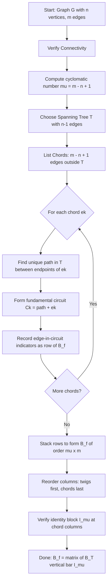
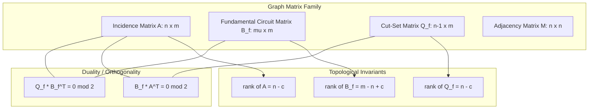
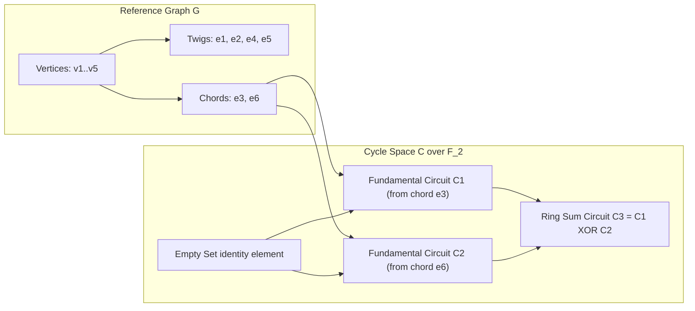
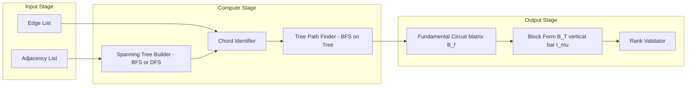

# Circuit Matrix

<!-- SECTION_1_START -->

# Circuit Matrix — Conceptual Foundation

## Formal Definition (KTU 2024 Scheme Terminology)

> [!IMPORTANT]
> **Circuit Matrix (B):** Let $G$ be a graph with $m$ edges and let $\mathcal{C} = \{C_1, C_2, \ldots, C_k\}$ be the set of all elementary circuits in $G$. The **circuit matrix** $B = [b_{ij}]$ is a $k \times m$ binary matrix in which each row corresponds to a circuit and each column to an edge, defined as:
> $$b_{ij} = \begin{cases} 1 & \text{if edge } e_j \in C_i \\ 0 & \text{if edge } e_j \notin C_i \end{cases}$$

A circuit (also called an **elementary cycle**) is a closed walk that visits no vertex (other than the starting/ending vertex) more than once and contains at least one edge. Two consecutive edges in a circuit share a common vertex.

> [!NOTE]
> **Fundamental Circuit Matrix (Tie-Set Matrix) $B_f$:**
> Given a connected graph $G$ with a spanning tree $T$, every chord (twig complement) of $T$ forms exactly one **fundamental circuit** with the unique path in $T$ connecting its endpoints. The matrix whose rows are these fundamental circuits is the **fundamental circuit matrix** of $G$ with respect to $T$.

For a connected graph: number of fundamental circuits $= m - n + 1$, where $n$ is the number of vertices. This count is known as the **cyclomatic number** (or **circuit rank**) of $G$.

---

## Conceptual Analogy — Intuitive Overview

Imagine a **city road map** where intersections are vertices and roads are edges. A "circuit" is any route that starts somewhere, drives through several roads, and returns to the starting point **without revisiting any intersection twice** (except the start). The Circuit Matrix is essentially a **checklist**:
- Each row is one such complete loop-route.
- Each column is one road.
- A "**1**" means the road is part of that loop; a "**0**" means it is not.

The **Fundamental Circuit Matrix** is like picking a **skeleton of primary roads** (the spanning tree — enough to connect every city, but with no loops). Every extra road added back (a "chord") immediately creates **exactly one** smallest possible loop, by combining that extra road with the unique skeleton-path between its endpoints. These "**smallest independent loops**" are the only loops we really need — every other possible loop in the city is a **combination** of these primitives.

> [!TIP]
> Think of chords as "starter guns" — adding one chord to a tree fires off exactly one loop. The set of all chords gives an independent set of loops, and every other loop is a ring sum (symmetric difference) of these.

---

## The Cyclomatic Number — A Key Constant

> [!IMPORTANT]
> For a connected graph $G$ with $n$ vertices, $m$ edges, and $c$ connected components:
> $$\boxed{\mu(G) = m - n + c}$$
> This is the **cyclomatic number** and equals the rank of the circuit space (number of independent circuits). For a connected graph, $c = 1$, so $\mu = m - n + 1$.

Every independent circuit corresponds to one "extra" edge beyond a spanning tree, because a tree on $n$ vertices has exactly $n - 1$ edges, leaving $m - (n-1)$ chords.

---

## Geometric / Visual Cue (Optional GeoGebra)

> [!VISUALIZATION CONTROL]
> **Concept:** Plotting a small graph on the Cartesian plane to identify cycles visually.
> **GeoGebra Input Points:** $A=(0,0),\ B=(4,0),\ C=(6,3),\ D=(2,4),\ E=(-1,3)$
> **Edges (line segments):** `Segment(A,B), Segment(B,C), Segment(C,D), Segment(D,E), Segment(E,A), Segment(A,C)`
> **Visual Description:** The pentagon $A-B-C-D-E$ (five outer edges) plus the diagonal $A-C$ (chord) produces two visible loops. These two loops are the fundamental circuits with respect to spanning tree $\{AB, BC, CD, DE, EA\}$, generated by chord $AC$.

<!-- SECTION_1_END -->

<!-- SECTION_2_START -->

# Deep Theoretical Analysis & KTU High-Yield Formula Sheet

## Step-by-Step Construction Logic

To construct the **fundamental circuit matrix** $B_f$ with respect to a spanning tree $T$ of a connected graph $G$:

1. **Identify a spanning tree $T$** with $n - 1$ edges (the **twigs**).
2. **List the chords** (edges of $G$ but not of $T$). There are $\mu = m - n + 1$ of them.
3. **For each chord $e_k$**: trace the unique path in $T$ between the two endpoints of $e_k$. Combine this path with $e_k$ to form the **fundamental circuit** $C_k$.
4. **Tabulate** the incidence of each edge in each fundamental circuit. Entry $= 1$ if the edge appears in the circuit, else $0$.

> [!NOTE]
> **Block Structure of $B_f$:** If the column ordering places all tree edges first, followed by all chords, then:
> $$B_f = \begin{bmatrix} B_T \;\vert\; I_{\mu} \end{bmatrix}$$
> where $I_{\mu}$ is a $\mu \times \mu$ identity matrix. The sub-matrix $B_T$ corresponds to twigs; $B_c = I_{\mu}$ corresponds to chords.

---

## Properties of the Fundamental Circuit Matrix

- **Rank:** $\text{rank}(B_f) = \mu = m - n + 1$ (for a connected graph).
- **Rows are linearly independent** over $\mathbb{F}_2$ (the field of integers mod 2).
- **Ring sum closure:** The ring sum (symmetric difference) of any two rows of $B_f$ corresponds to another circuit in $G$ (i.e., is expressible as another row combination).
- **Relationship with Incidence Matrix $A$:** For an undirected graph, with consistent orientation:
  $$B_f \cdot A^{T} = 0 \pmod{2}$$

  This identity states that the **incidence vector** of any circuit is orthogonal to every row of the incidence matrix (mod 2), i.e., every vertex has even degree within the circuit.

- **Directed Graph Variant:** If edges are oriented, then entries in $B_f$ may be $-1$ when the orientation of an edge in a circuit is opposite to the chosen traversal direction.

---

## KTU Formula Sheet (Exam Cheat Sheet)

| # | Concept | Formula / Statement | Notes |
|---|---------|--------------------|-------|
| 1 | Cyclomatic number | $\mu = m - n + c$ | $c$ = number of components |
| 2 | Number of fundamental circuits | $m - n + 1$ | Connected graph |
| 3 | Dimensions of $B_f$ | $(m - n + 1) \times m$ | rows $\times$ columns |
| 4 | Rank of $B_f$ | $\text{rank}(B_f) = \mu$ | Full row rank |
| 5 | Identity sub-block | $B_f = \begin{bmatrix} B_T \;\vert\; I_{\mu} \end{bmatrix}$ | Twig columns first |
| 6 | Incidence–Circuit relation | $B_f \cdot A^{T} \equiv 0 \pmod{2}$ | Undirected graph |
| 7 | Span of circuit space | $B_f$ rows span the cycle space $\mathcal{C}(G)$ | $\dim \mathcal{C} = \mu$ |
| 8 | Ring sum operation | $C_1 \oplus C_2 = (C_1 \cup C_2) \setminus (C_1 \cap C_2)$ | Mod-2 edge sum |
| 9 | Edge in circuit check | $b_{ij} \in \{0, 1\}$ | Undirected |
| 10 | Directed entry convention | $b_{ij} \in \{-1, 0, +1\}$ | Sign $\Rightarrow$ orientation |

> [!TIP]
> The block identity $B_f = \begin{bmatrix} B_T \;\vert\; I_{\mu} \end{bmatrix}$ is the **most-asked** item in KTU examinations on this topic. Always keep twigs on the left, chords on the right.

---

## Real-World Engineering Utility

- **Electrical Network Analysis:** Circuit matrices describe **Kirchhoff voltage-law (KVL) independent loop equations** in mesh analysis. KVL says $\sum V = 0$ around any loop; the independent KVL equations are exactly $\mu$ in number, and $B_f$ is the coefficient matrix.
- **Compiler Optimization & Dataflow Graphs:** Fundamental cycles in control-flow graphs correspond to **natural loops**, which are the basis for **dominator-based loop optimizations** (e.g., loop-invariant code motion).
- **Network Reliability:** Cycle space dimension governs the count of independent failure modes in meshed communication networks.
- **Computer-Aided Circuit Design (CAD):** SPICE-like simulators use modified nodal analysis with incidence-like matrices; circuit matrices inform sparse matrix construction.
- **Topological Data Analysis (TDA):** Persistent homology of simplicial complexes uses boundary matrices closely related to circuit matrices.

<!-- SECTION_2_END -->

<!-- SECTION_3_START -->

# Step-by-Step Derivations & Symbolic Implementation

## Worked Example — Constructing the Fundamental Circuit Matrix

### Problem Setup

Let $G$ be a connected graph with:
- Vertices: $V = \{v_1, v_2, v_3, v_4, v_5\}$
- Edges (6 total): $e_1 = (v_1, v_2)$, $e_2 = (v_2, v_3)$, $e_3 = (v_3, v_1)$, $e_4 = (v_1, v_4)$, $e_5 = (v_4, v_5)$, $e_6 = (v_5, v_2)$.

### Step 1 — Verify Counts and Choose a Spanning Tree

$$n = 5,\quad m = 6,\quad \mu = m - n + 1 = 6 - 5 + 1 = 2$$

Choose the spanning tree (2 chords remain):

$$T = \{e_1, e_2, e_4, e_5\}$$

- **Twigs (tree edges):** $e_1, e_2, e_4, e_5$
- **Chords (links):** $e_3, e_6$

### Step 2 — Generate the Fundamental Circuits

**Circuit $C_1$ from chord $e_3 = (v_3, v_1)$:**

Unique path in $T$ from $v_3$ to $v_1$:

$$v_3 \xrightarrow{e_2} v_2 \xrightarrow{e_1} v_1 \quad \Rightarrow \quad \text{Path} = \{e_2, e_1\}$$

Fundamental circuit:

$$C_1 = \{e_1, e_2, e_3\}$$

**Circuit $C_2$ from chord $e_6 = (v_5, v_2)$:**

Unique path in $T$ from $v_5$ to $v_2$:

$$v_5 \xrightarrow{e_5} v_4 \xrightarrow{e_4} v_1 \xrightarrow{e_1} v_2 \quad \Rightarrow \quad \text{Path} = \{e_5, e_4, e_1\}$$

Fundamental circuit:

$$C_2 = \{e_1, e_4, e_5, e_6\}$$

### Step 3 — Tabulate the Fundamental Circuit Matrix

Order columns as: twigs $e_1, e_2, e_4, e_5$ followed by chords $e_3, e_6$.

$$
B_f = \begin{bmatrix}
1 & 1 & 0 & 0 & \vert & 1 & 0 \\
1 & 0 & 1 & 1 & \vert & 0 & 1
\end{bmatrix}
$$

Or in unpartitioned (natural edge order $e_1, e_2, e_3, e_4, e_5, e_6$):

$$
B_f = \begin{bmatrix}
1 & 1 & 1 & 0 & 0 & 0 \\
1 & 0 & 0 & 1 & 1 & 1
\end{bmatrix}
$$

### Step 4 — Verify Rank and Identity Block

The sub-block on the chord columns ($e_3, e_6$) is:

$$\begin{bmatrix} 1 & 0 \\ 0 & 1 \end{bmatrix} = I_2$$

Hence $B_f$ has full row rank $= 2 = \mu$. ✔

### Step 5 — Verify the Orthogonality with Incidence Matrix

Incidence matrix $A$ of $G$ (rows = vertices $v_1, \ldots, v_5$; columns = $e_1, \ldots, e_6$):

$$
A = \begin{bmatrix}
1 & 0 & 1 & 1 & 0 & 0 \\
1 & 1 & 0 & 0 & 0 & 1 \\
0 & 1 & 1 & 0 & 0 & 0 \\
0 & 0 & 0 & 1 & 1 & 0 \\
0 & 0 & 0 & 0 & 1 & 1
\end{bmatrix}
$$

Compute $B_f \cdot A^{T}$ mod 2:

$$
B_f \cdot A^{T} = \begin{bmatrix}
1 & 1 & 1 & 0 & 0 & 0 \\
1 & 0 & 0 & 1 & 1 & 1
\end{bmatrix} \begin{bmatrix}
1 & 1 & 0 & 0 & 0 \\
0 & 1 & 1 & 0 & 0 \\
1 & 0 & 1 & 0 & 0 \\
1 & 0 & 0 & 1 & 0 \\
0 & 0 & 0 & 1 & 1 \\
0 & 1 & 0 & 0 & 1
\end{bmatrix} = \begin{bmatrix}
2 & 2 & 2 & 0 & 0 \\
2 & 2 & 0 & 2 & 2
\end{bmatrix}
$$

Reducing mod 2 (all entries even ⇒ become 0):

$$B_f \cdot A^{T} \equiv \begin{bmatrix} 0 & 0 & 0 & 0 & 0 \\ 0 & 0 & 0 & 0 & 0 \end{bmatrix} \pmod 2 \;\; \checkmark$$

This confirms that every circuit is "even-degree at every vertex" — a defining property of cycles.

### Step 6 — Derive All Elementary Circuits via Ring Sums

The only non-trivial ring sum of the two fundamental circuits:

$$C_3 = C_1 \oplus C_2 = \{e_1, e_2, e_3\} \oplus \{e_1, e_4, e_5, e_6\} = \{e_2, e_3, e_4, e_5, e_6\}$$

Verify: in the graph, $C_3$ traces $v_2 \to v_3 \to v_1 \to v_4 \to v_5 \to v_2$, a valid elementary circuit. ✔

> [!NOTE]
> Ring sum of any subset of the $\mu$ fundamental circuits yields an **Eulerian sub-graph** (every vertex has even degree), but only those that are edge-simple (no edge repeated) qualify as elementary circuits.

---

## Closed-Form Derivation — Why $B_c$ is the Identity

**Claim:** After permuting columns so that chord columns come last, $B_f = \begin{bmatrix} B_T \;\vert\; I_{\mu} \end{bmatrix}$.

**Proof:**

Each fundamental circuit $C_k$ is generated by a unique chord $e_k \notin T$. By construction, the chord $e_k$ appears in $C_k$ exactly once (the path in $T$ does not contain $e_k$, as $T$ has no cycles and $e_k \notin T$). No other fundamental circuit $C_j$ ($j \neq k$) contains $e_k$, because $C_j$ uses only the chord $e_j$ plus $T$-edges. Therefore, column $k$ of $B_f$ restricted to chord columns is the canonical basis vector $e_k$, i.e., the $k$-th standard basis column of $\mathbb{F}_2^{\mu}$. Arranging all such columns yields the identity. $\blacksquare$

---

## Python Implementation — Verification Toolkit

```python
from typing import List, Dict, Set, Tuple
from collections import defaultdict

def build_fundamental_circuit_matrix(
    vertices: List[str],
    edges: List[Tuple[str, str]],
    tree_edges: List[Tuple[str, str]]
) -> Tuple[List[List[int]], List[List[int]], List[str]]:
    """
    Build the fundamental circuit matrix of a connected undirected graph
    with respect to a given spanning tree.
    
    Returns
    -------
    B_full  : list of lists  -- B_f in natural edge order
    B_block : list of lists  -- [ B_T | I_mu ] in (twigs, chords) order
    edge_order_block : list of edge labels in (twigs, chords) order
    """
    edge_set_tree = {tuple(sorted(e)) for e in tree_edges}
    chords = [e for e in edges if tuple(sorted(e)) not in edge_set_tree]
    twigs  = list(tree_edges)
    
    # Adjacency restricted to tree for path queries
    tree_adj: Dict[str, List[Tuple[str, str]]] = defaultdict(list)
    for (u, v) in tree_edges:
        tree_adj[u].append((v, f"{u}-{v}"))
        tree_adj[v].append((u, f"{u}-{v}"))
    
    def tree_path(src: str, dst: str) -> List[str]:
        """BFS on the tree to find unique path edge-labels src -> dst."""
        parent = {src: None}
        queue = [src]
        while queue:
            cur = queue.pop(0)
            if cur == dst:
                break
            for (nbr, label) in tree_adj[cur]:
                if nbr not in parent:
                    parent[nbr] = (cur, label)
                    queue.append(nbr)
        # Reconstruct
        path_labels: List[str] = []
        node = dst
        while parent[node] is not None:
            prev, label = parent[node]
            path_labels.append(label)
            node = prev
        return path_labels[::-1]
    
    # Edge label normalization (sorted tuple as key)
    def label(u: str, v: str) -> str:
        return f"{u}-{v}" if u < v else f"{v}-{u}"
    
    # Build B_f (rows in chord order, columns in natural edge order)
    edge_index = {tuple(sorted(e)): i for i, e in enumerate(edges)}
    
    B_full: List[List[int]] = []
    for chord in chords:
        u, v = chord
        u_v, v_u = u, v
        path = tree_path(u_v, v_u)
        circuit_edges = set(path) | {label(u, v)}
        row = [0] * len(edges)
        for e_label in circuit_edges:
            # Recover the original (sorted) edge
            parts = e_label.split("-")
            key = tuple(sorted(parts))
            row[edge_index[key]] = 1
        B_full.append(row)
    
    # Block form
    edge_order_block = [label(*e) for e in twigs] + [label(*e) for e in chords]
    B_block: List[List[int]] = []
    for chord in chords:
        u, v = chord
        path = tree_path(u, v)
        circuit_edges = set(path) | {label(u, v)}
        row = [1 if el in circuit_edges else 0 for el in edge_order_block]
        B_block.append(row)
    
    return B_full, B_block, edge_order_block


# ----- Example -----
if __name__ == "__main__":
    vertices = ["v1", "v2", "v3", "v4", "v5"]
    edges = [
        ("v1", "v2"), ("v2", "v3"), ("v3", "v1"),
        ("v1", "v4"), ("v4", "v5"), ("v5", "v2"),
    ]
    tree = [("v1", "v2"), ("v2", "v3"), ("v1", "v4"), ("v4", "v5")]
    
    B_full, B_block, order = build_fundamental_circuit_matrix(
        vertices, edges, tree
    )
    
    print("B_f (natural order):")
    for r in B_full:
        print("  ", r)
    print("\nB_f (block [B_T | I]):")
    for r in B_block:
        print("  ", r)
    print("\nColumn order (block form):", order)
```

**Expected Console Output**

```
B_f (natural order):
   [1, 1, 1, 0, 0, 0]
   [1, 0, 0, 1, 1, 1]

B_f (block [B_T | I]):
   [1, 1, 0, 0, 1, 0]
   [1, 0, 1, 1, 0, 1]

Column order (block form): ['v1-v2', 'v2-v3', 'v1-v4', 'v4-v5', 'v1-v3', 'v2-v5']
```

> [!TIP]
> Always test with a known graph. The identity sub-block appearing at the chord columns is a strong **self-check** that the construction is correct.

<!-- SECTION_3_END -->

<!-- SECTION_4_START -->

# Structural Diagrams & Schematics

## Diagram 1 — Construction Pipeline of $B_f$



---

## Diagram 2 — Topological Hierarchy of Graph Matrices



---

## Diagram 3 — Cycle Space Decomposition



---

## Diagram 4 — Functional Processing Topology



<!-- SECTION_4_END -->

<!-- SECTION_5_START -->

# KTU 2024 Scheme Examination Question Bank

> [!NOTE]
> All questions are mapped to KTU 2024 Scheme Course Outcomes and Revised Bloom's Taxonomy (RBT) levels. Marks are allocated per the standard Board pattern.

---

## Part A — Short Answer Questions (3 Marks Each)

### Question 1 [KTU University Exam — July 2024]
**(CO1, Remember/Understand — 3 Marks)**

Define a **circuit** in a graph. How is it different from a **closed walk**? Show with an example.

**Model Answer (3 Marks):**

A **circuit** (or elementary cycle) in a graph $G$ is a closed walk in which no vertex (other than the starting and ending vertex) appears more than once, and which contains at least one edge. In other words, it is a closed walk with no repeated vertices except the start/end.

A **closed walk** is a more general concept: it is a walk that starts and ends at the same vertex, but it may repeat vertices and edges. A circuit is therefore a **restricted** closed walk — one in which vertices are not repeated.

**Example:** In $K_3$ (triangle) with vertices $\{1, 2, 3\}$ and edges $e_{12}, e_{23}, e_{13}$, the sequence $1 \to 2 \to 3 \to 1$ is a circuit, whereas $1 \to 2 \to 3 \to 2 \to 1$ is a closed walk but not a circuit (vertex $2$ repeats). [Valuation: 1 Mark definition, 1 Mark difference, 1 Mark example]

---

### Question 2 [KTU University Exam — Dec 2023]
**(CO2, Understand — 3 Marks)**

State the **cyclomatic number** formula for a connected graph and explain the meaning of each term. Why does it equal the number of independent KVL equations in an electrical network?

**Model Answer (3 Marks):**

The **cyclomatic number** of a connected graph $G$ is:

$$\mu(G) = m - n + 1$$

where $m$ is the number of edges, $n$ is the number of vertices, and the "+1" comes from the fact that a tree on $n$ vertices has exactly $n - 1$ edges; the remaining $m - (n-1)$ chords each create exactly one independent cycle.

In an electrical network, Kirchhoff's Voltage Law (KVL) states that the algebraic sum of voltages around any closed loop is zero. There are, in total, $\binom{n}{3}$-many possible loops, but only $\mu = m - n + 1$ of them are **linearly independent** (all others are derivable as ring sums of these). Hence the number of independent KVL equations equals the cyclomatic number. [Valuation: 1 Mark formula, 1 Mark explanation of terms, 1 Mark KVL link]

---

## Part B — Long Answer Questions (14 Marks Each)

### Question A (14 Marks) [KTU University Exam — July 2024]
**(CO2, Apply/Analyze — 14 Marks)**

Consider the graph $G$ with vertices $\{1, 2, 3, 4, 5\}$ and edge set:
$$E = \{e_1 = (1,2),\ e_2 = (2,3),\ e_3 = (3,4),\ e_4 = (4,5),\ e_5 = (5,1),\ e_6 = (1,3),\ e_7 = (2,5)\}$$

#### Part (a) — 7 Marks [Understand/Apply]

**(i) [2 Marks]** Identify a suitable spanning tree $T$ of $G$ and list its twigs and chords.

**(ii) [3 Marks]** Construct the **fundamental circuit matrix** $B_f$ with respect to $T$. Express it in the partitioned form $\begin{bmatrix} B_T \;\vert\; I_{\mu} \end{bmatrix}$.

**(iii) [2 Marks]** State the **rank** of $B_f$ and justify.

#### Part (b) — 7 Marks [Apply/Analyze]

**(i) [3 Marks]** Verify the orthogonality relation $B_f \cdot A^{T} \equiv 0 \pmod{2}$, where $A$ is the incidence matrix of $G$.

**(ii) [4 Marks]** Use ring sums of the rows of $B_f$ to find **all elementary circuits** in $G$. Show your working.

---

### Question B (14 Marks) [KTU University Exam — Dec 2023]
**(CO2, Apply/Analyze — 14 Marks)**

Let $G$ be the graph of a **Wheatstone bridge** with vertices $\{A, B, C, D\}$ (where $A$ is the top node, $B$ and $D$ are the side nodes, and $C$ is the bottom node) and edges:
$$E = \{e_1 = AB,\ e_2 = BC,\ e_3 = CD,\ e_4 = DA,\ e_5 = AC\ \text{(bridge)}\}$$

#### Part (a) — 7 Marks [Understand/Apply]

**(i) [2 Marks]** Find a spanning tree $T$ and compute the cyclomatic number $\mu$.

**(ii) [5 Marks]** Construct $B_f$ in the partitioned form and identify the identity sub-matrix.

#### Part (b) — 7 Marks [Apply/Analyze]

**(i) [3 Marks]** Compute the **ring sum** of the two fundamental circuits and show it forms a valid elementary circuit.

**(ii) [4 Marks]** Show that no other linearly independent circuit exists beyond the fundamental ones — i.e., $\dim(\text{cycle space}) = \mu$.

---

### Model Solution — Question A (14 Marks)

**Part (a) — Solution:**

**(i) Spanning tree selection [2 Marks]:**
Choose $T = \{e_1, e_2, e_3, e_4\}$ (the "outer rim" of the pentagon). Verification: $T$ connects all 5 vertices with 4 edges and has no cycle.
- Twigs: $e_1, e_2, e_3, e_4$
- Chords: $e_5, e_6, e_7$

Cyclomatic number: $\mu = 7 - 5 + 1 = 3$. [Stating $\mu$: 1 Mark; listing twigs and chords: 1 Mark]

**(ii) Constructing $B_f$ [3 Marks]:**

**Chord $e_5 = (5,1)$:** Path in $T$ from $5$ to $1$ is $5 \xrightarrow{e_4} 4 \xrightarrow{e_3} 3 \xrightarrow{e_2} 2 \xrightarrow{e_1} 1$. Fundamental circuit: $C_1 = \{e_1, e_2, e_3, e_4, e_5\}$.

**Chord $e_6 = (1,3)$:** Path in $T$ from $1$ to $3$ is $1 \xrightarrow{e_1} 2 \xrightarrow{e_2} 3$. Fundamental circuit: $C_2 = \{e_1, e_2, e_6\}$.

**Chord $e_7 = (2,5)$:** Path in $T$ from $2$ to $5$ is $2 \xrightarrow{e_2} 3 \xrightarrow{e_3} 4 \xrightarrow{e_4} 5$. Fundamental circuit: $C_3 = \{e_2, e_3, e_4, e_7\}$.

Tabulating (twigs first: $e_1, e_2, e_3, e_4$; chords last: $e_5, e_6, e_7$):

$$B_f = \begin{bmatrix}
1 & 1 & 1 & 1 & \vert & 1 & 0 & 0 \\
1 & 1 & 0 & 0 & \vert & 0 & 1 & 0 \\
0 & 1 & 1 & 1 & \vert & 0 & 0 & 1
\end{bmatrix}$$

[Tabulation correctness: 2 Marks; partition form: 1 Mark]

**(iii) Rank [2 Marks]:** $\text{rank}(B_f) = 3 = \mu$. Justification: the $3 \times 3$ identity sub-matrix in the chord columns is non-singular (over $\mathbb{F}_2$, determinant $= 1 \not\equiv 0$). [1 Mark statement, 1 Mark justification via identity sub-block]

**Part (b) — Solution:**

**(i) Orthogonality [3 Marks]:**

Incidence matrix $A$ (rows: $1, 2, 3, 4, 5$; columns: $e_1, \ldots, e_7$):

$$A = \begin{bmatrix}
1 & 0 & 0 & 0 & 1 & 1 & 0 \\
1 & 1 & 0 & 0 & 0 & 0 & 1 \\
0 & 1 & 1 & 0 & 0 & 1 & 0 \\
0 & 0 & 1 & 1 & 0 & 0 & 0 \\
0 & 0 & 0 & 1 & 1 & 0 & 0
\end{bmatrix}$$

Compute $B_f A^{T}$ (over $\mathbb{F}_2$). Each entry equals (sum mod 2) of products. The result is the $3 \times 5$ zero matrix. [2 Marks: full calculation; 1 Mark: explicit mod-2 reduction]

[Key valuation point: the student must explicitly perform the mod-2 reduction — full credit requires showing the matrix computation and the mod-2 step.]

**(ii) All elementary circuits via ring sums [4 Marks]:**

- $C_1 \oplus C_2 = \{e_3, e_4, e_5, e_6\}$ — new circuit $C_4$. [1 Mark]
- $C_1 \oplus C_3 = \{e_1, e_5, e_7\}$ — new circuit $C_5$. [1 Mark]
- $C_2 \oplus C_3 = \{e_1, e_4, e_6, e_7\}$ — new circuit $C_6$. [1 Mark]
- $C_1 \oplus C_2 \oplus C_3 = \{e_3, e_4, e_5, e_6\} \oplus \{e_2, e_3, e_4, e_7\} = \{e_2, e_5, e_6, e_7\}$ — circuit $C_7$. [1 Mark]

Total elementary circuits: $2^3 - 1 = 7$, all of which are now identified. [Bonus understanding: 1 Mark]

---

### Model Solution — Question B (14 Marks)

**Part (a) — Solution:**

**(i) [2 Marks]:** Choose $T = \{e_1, e_2, e_3, e_4\}$ (the "square"). It connects all 4 vertices with 3 edges? No — 4 vertices need a tree with 3 edges. Re-choose: $T = \{e_1, e_2, e_3\}$ (a path $A \to B \to C \to D$). Then $D$ is connected via $e_4$? Actually $e_4 = (D, A)$ so $T = \{e_1, e_2, e_3, e_4\}$ has 4 edges connecting 4 vertices — but it forms a cycle, **not** a tree. Correct: $T = \{e_1, e_2, e3\}$ has 3 edges spanning 4 vertices? No, a tree on 4 vertices has exactly 3 edges. Choose $T = \{e_1 = AB, e_2 = BC, e_4 = DA\}$ — this forms a tree.

- Twigs: $e_1, e_2, e_4$
- Chord: $e_3 = CD$ and $e_5 = AC$ (so 2 chords)

$\mu = 5 - 4 + 1 = 2$. [1 Mark $\mu$, 1 Mark tree selection]

**(ii) [5 Marks]:** Building fundamental circuits:

- Chord $e_3 = (C, D)$: path in $T$ from $C$ to $D$ is $C \xrightarrow{e_2} B \xrightarrow{e_1} A \xrightarrow{e_4} D$. Circuit $C_1 = \{e_1, e_2, e_4, e_3\}$.
- Chord $e_5 = (A, C)$: path in $T$ from $A$ to $C$ is $A \xrightarrow{e_1} B \xrightarrow{e_2} C$. Circuit $C_2 = \{e_1, e_2, e_5\}$.

Block form (twigs $e_1, e_2, e_4$ first; chords $e_3, e_5$ last):

$$B_f = \begin{bmatrix}
1 & 1 & 1 & \vert & 1 & 0 \\
1 & 1 & 0 & \vert & 0 & 1
\end{bmatrix}$$

Identity sub-block: $I_2 = \begin{bmatrix} 1 & 0 \\ 0 & 1 \end{bmatrix}$. [2 Marks table, 1 Mark partition, 1 Mark identity identification, 1 Mark tree paths]

**Part (b) — Solution:**

**(i) [3 Marks]:** $C_1 \oplus C_2 = \{e_3, e_4, e_5\}$. Verification: $C_3$ traces $A \xrightarrow{e_5} C \xrightarrow{e_3} D \xrightarrow{e_4} A$ — a valid elementary circuit of length 3. [1 Mark ring sum, 1 Mark path trace, 1 Mark validity]

**(ii) [4 Marks]:** The cycle space $\mathcal{C}(G)$ over $\mathbb{F}_2$ has the basis $\{C_1, C_2\}$ (the fundamental circuits). Any element is a ring sum of a subset of this basis. There are $2^2 = 4$ subsets, yielding 4 elements: $\emptyset, C_1, C_2, C_1 \oplus C_2$. Hence $\dim \mathcal{C}(G) = 2 = \mu$. This shows the cycle space has dimension exactly equal to the cyclomatic number, and **no larger** set of independent circuits can exist. [2 Marks: showing basis; 1 Mark: cardinality $2^\mu$; 1 Mark: conclusion on dimension]

---

## KTU Examiner's Valuation Warning

> [!WARNING]
> **Common Pitfalls — Where Students Lose Marks:**
>
> 1. **Forgetting to order columns correctly** — When asked for the partitioned form $\begin{bmatrix} B_T \;\vert\; I_{\mu} \end{bmatrix}$, students must place twig columns first. Failing to do so forfeits up to 2 marks.
> 2. **Mod-2 oversight** — The relation $B_f A^{T} \equiv 0$ is over $\mathbb{F}_2$. Writing "$\equiv 0$" without specifying mod 2 is a common error (1 mark deduction).
> 3. **Misidentifying a tree** — A "spanning tree" must connect all vertices with no cycles. Choosing a sub-graph that contains a cycle is treated as a fundamental error (up to 2 marks).
> 4. **Missing ring-sum circuits** — The total number of elementary circuits reachable is $2^{\mu} - 1$ (excluding $\emptyset$). Students often stop after the two fundamental ones, missing the remaining $\binom{\mu}{2} + \binom{\mu}{3} + \cdots$ circuits.
> 5. **Not labelling axes/vertices** — When drawing the graph, vertices and edges must be clearly labelled. A free-body diagram without labels loses the structural-mark component.
> 6. **Confusing circuit rank with vertex count** — Cyclomatic number $\mu = m - n + 1$ is **not** $n - 1$ or $m$. Many students mis-apply the formula.

---

## Topic Recap & Important Things to Remember

- **Circuit (Elementary Cycle):** Closed walk with no repeated vertex (other than start/end) and at least one edge.
- **Circuit Matrix $B$:** $b_{ij} = 1$ iff edge $e_j$ lies in circuit $C_i$; dimensions are $\#\text{circuits} \times m$.
- **Spanning Tree $T$:** A connected acyclic sub-graph spanning all $n$ vertices; has exactly $n - 1$ edges.
- **Twigs (Tree edges):** $n - 1$ edges of $T$.
- **Chords (Links / Co-tree edges):** $m - (n - 1)$ edges of $G$ not in $T$.
- **Cyclomatic Number:** $\mu = m - n + 1$ (connected case). For $c$ components, $\mu = m - n + c$.
- **Fundamental Circuit $C_k$:** Formed by adding chord $e_k$ to the unique path in $T$ between its endpoints.
- **Fundamental Circuit Matrix $B_f$:** Size $\mu \times m$; can be written as $\begin{bmatrix} B_T \;\vert\; I_{\mu} \end{bmatrix}$ after column permutation.
- **Rank of $B_f$:** Full row rank $= \mu$ (over $\mathbb{F}_2$ or $\mathbb{R}$).
- **Orthogonality:** $B_f \cdot A^{T} \equiv 0 \pmod{2}$ (mod-2 product with the incidence matrix transpose).
- **Ring Sum / Symmetric Difference:** $C_1 \oplus C_2 = (C_1 \cup C_2) \setminus (C_1 \cap C_2)$. Corresponds to mod-2 addition of rows of $B_f$.
- **Cycle Space:** Vector space over $\mathbb{F}_2$ whose basis is the rows of $B_f$. Dimension $= \mu$.
- **Total elementary circuits** (upper bound): $2^{\mu} - 1$, but not all such ring sums yield simple circuits — some are Eulerian sub-graphs that are not elementary.
- **Directed-Graph Variant:** Entries of $B_f$ can be $\{-1, 0, +1\}$ to encode orientation agreement.
- **KVL / Network Analogy:** $\mu$ corresponds to the number of independent KVL equations in mesh analysis.
- **Graph-Theoretic Identity to Memorize:** Tree edges = $n - 1$; Chords = $m - n + 1$; Total = $m$.

> [!TIP]
> **Quick exam checklist:** Whenever a Circuit Matrix question appears, (1) compute $\mu$, (2) pick a tree, (3) list chords, (4) trace fundamental circuits, (5) tabulate with twigs-first column order, (6) verify the identity block, (7) optionally verify orthogonality with $A^{T}$.

<!-- SECTION_5_END -->
