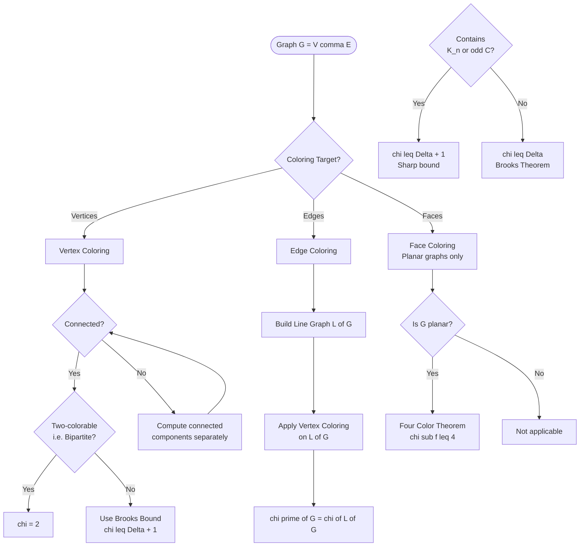
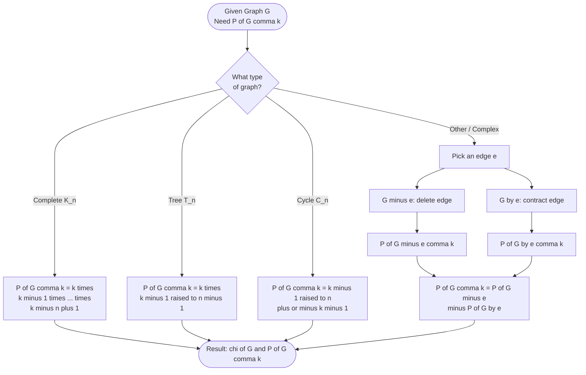
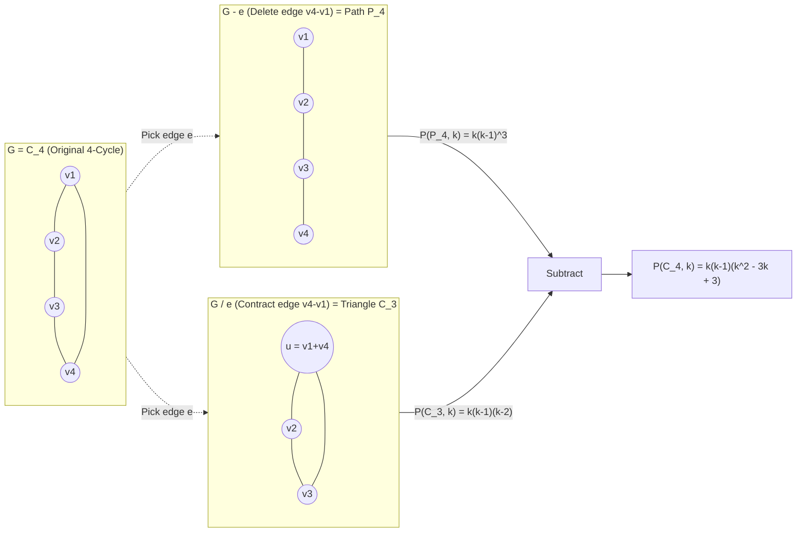
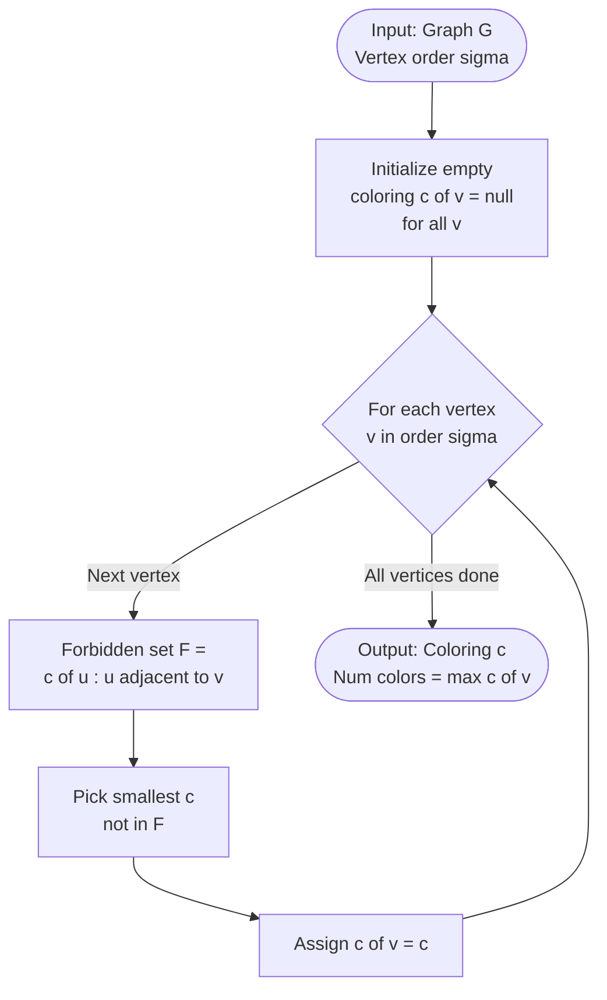
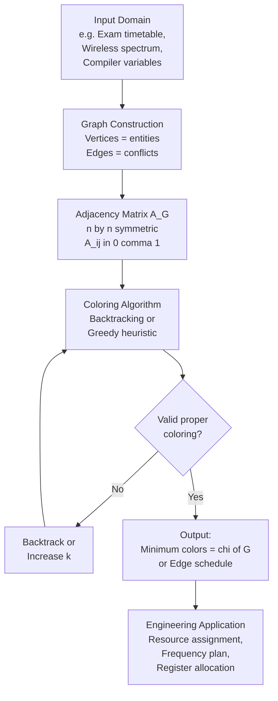

# Coloring

<!-- SECTION_1_START -->

# 1. Core Technical Definition & Intuitive Overview

## 1.1 Formal Definition (KTU 2024 Scheme Terminology)

> [!IMPORTANT]
> **Vertex Coloring (KTU Standard Definition)**
> A **vertex coloring** of a simple undirected graph $G = (V, E)$ is an assignment of colors to each vertex such that no two adjacent vertices receive the same color. A coloring that uses at most $k$ colors is called a **proper $k$-coloring**.

**Key Terminology:**

| Term | Symbol | Definition |
|------|--------|------------|
| Proper $k$-coloring | — | Coloring using $\leq k$ colors where adjacent vertices differ |
| Chromatic number | $\chi(G)$ | Minimum $k$ for which a proper $k$-coloring exists |
| $k$-chromatic graph | — | A graph with $\chi(G) = k$ |
| Chromatic polynomial | $P(G, k)$ | Number of proper $k$-colorings of $G$ |
| Edge coloring | — | Coloring of edges so that no two incident edges share a color |
| Chromatic index | $\chi'(G)$ | Minimum colors needed for a proper edge coloring |

The **matrix connection** is fundamental: every graph $G$ has an **adjacency matrix** $A_G$ of order $n \times n$ where $A_{ij} = 1$ if vertices $v_i$ and $v_j$ are adjacent, and $0$ otherwise. The structure of $A_G$ (its zeros, ones, eigenvalues, and chromatic structure) entirely determines all coloring invariants of $G$.

## 1.2 Conceptual Analogy / Real-World Intuition

> [!NOTE]
> **The Map Coloring Analogy (Four Color Theorem)**
> Imagine a political map of Kerala's districts. Two districts sharing a **common border** (not just a point) cannot be assigned the same color. The question becomes: "What is the **minimum number of colors** required to color the entire map so that no two neighboring regions clash?" This minimum is exactly the **chromatic number** of the adjacency graph where each district is a vertex and each shared border is an edge.

**Three Engineering Intuition Hooks:**

1. **Compiler Register Allocation** — When a compiler translates your code, it stores variables in CPU registers. Two variables that are "live" (in use) **at the same time** conflict. The compiler builds an **interference graph** where vertices = variables and edges = simultaneous usage. A proper coloring assigns each variable to a register, and $\chi(G)$ equals the **minimum number of registers** needed.

2. **Wireless Frequency Assignment** — Cellular towers are vertices. Two towers that interfere (overlapping signals) are joined by an edge. A proper coloring assigns **different frequencies** to interfering towers, minimizing spectrum usage.

3. **University Exam Timetabling** — Exams are vertices. Two exams conflict (edge) if any student appears in both. Color each exam with a time slot; $\chi(G)$ gives the **minimum number of parallel slots** required.

> [!VISUALIZATION CONTROL]
> **Concept:** Chromatic Polynomial Curve of $K_3$ (Triangle Graph)
> **GeoGebra / Desmos Input Equations:**
> * $f(x) = x \cdot (x-1) \cdot (x-2)$
> * $g(x) = x \cdot (x-1) \cdot (x-1) \cdot (x-1)$   *(path on 4 vertices)*
> * $h(x) = x \cdot (x-1) \cdot (x-1)$   *(path on 3 vertices)*
> **Visual Description:** Plot $f(x)$ for integer $x \geq 0$. The curve crosses zero at $x = 0, 1, 2$ — these are the chromatic "forbidden zones." For $x \geq 3$, $f(x) > 0$, and the integer values give the **number of proper $x$-colorings** of $K_3$. The smallest positive integer is $\chi(K_3) = 3$.

## 1.3 Physical Constants and Standard Metrics

> [!IMPORTANT]
> **Universally Accepted Bounds in Graph Coloring:**
> * **Lower bound:** $\chi(G) \geq \omega(G)$, where $\omega(G)$ is the **clique number** (size of the largest complete subgraph).
> * **Upper bound:** $\chi(G) \leq \Delta(G) + 1$, where $\Delta(G)$ is the **maximum vertex degree** (Brook's bound).
> * **Planar graphs:** $\chi(G) \leq 4$ (Four Color Theorem, proven 1976 by Appel & Haken).
> * **Bipartite graphs:** $\chi(G) \leq 2$ (König's theorem, constructive proof).

<!-- SECTION_1_END -->

<!-- SECTION_2_START -->

# 2. Deep Theoretical Analysis & KTU High-Yield Formula Sheet

## 2.1 Foundational Logic of Vertex Coloring

The theory of graph coloring is built on a layered logical structure:

**Step 1 — Independent Set Connection**
* A proper coloring partitions $V(G)$ into **independent sets** $V_1, V_2, \ldots, V_k$ (color classes), where no two vertices in the same $V_i$ are adjacent.
* Therefore, $\chi(G)$ = **minimum number of independent sets** needed to cover $V$.

**Step 2 — Adjacency Matrix Connection**
* Each entry $A_{ij} = 1$ enforces the constraint that vertices $i$ and $j$ must receive different colors.
* The constraint system can be written as: $\text{color}(i) \neq \text{color}(j)$ for every $(i,j)$ with $A_{ij} = 1$.
* The **chromatic polynomial** $P(G, k)$ counts the integer solutions to this constraint system.

**Step 3 — Coloring Threshold**
* If $k < \chi(G)$, then $P(G, k) = 0$ (impossible to color).
* If $k = \chi(G)$, then $P(G, k) > 0$ (minimum threshold met).
* For $k > \chi(G)$, $P(G, k)$ grows **polynomially** in $k$.

**Step 4 — Edge Coloring Duality**
* The **line graph** $L(G)$ has a vertex for each edge of $G$, with two vertices adjacent in $L(G)$ iff the corresponding edges in $G$ share an endpoint.
* Therefore: $\chi'(G) = \chi(L(G))$. Edge coloring of $G$ is vertex coloring of $L(G)$.

**Step 5 — The "Why" of Polynomial Counting**
* Each proper $k$-coloring is a **distinct function** $f: V \to \{1, 2, \ldots, k\}$ satisfying all adjacency constraints.
* $P(G, k)$ is polynomial in $k$ because the constraint structure is **finitary and acyclic in dependencies** (made precise via the deletion-contraction recurrence).

## 2.2 KTU Formula Sheet / Cheat Sheet

> [!IMPORTANT]
> **Master Reference Table — All Formulas Required for KTU Board Exams**

| $\#$ | Concept | Formula / Identity | Notes / Conditions |
|------|---------|---------------------|--------------------|
| 1 | Complete graph $K_n$ | $P(K_n, k) = k(k-1)(k-2)\cdots(k-n+1)$ | $\chi(K_n) = n$ |
| 2 | Tree on $n$ vertices | $P(T_n, k) = k(k-1)^{n-1}$ | $\chi(T_n) = 2$ for $n \geq 2$ |
| 3 | Empty graph $\overline{K_n}$ | $P(\overline{K_n}, k) = k^n$ | No edges, no constraints |
| 4 | Cycle $C_n$ | $P(C_n, k) = (k-1)^n + (-1)^n(k-1)$ | $\chi(C_n) = 2$ if even, $3$ if odd |
| 5 | Path $P_n$ (n vertices) | $P(P_n, k) = k(k-1)^{n-1}$ | Same as tree |
| 6 | Wheel $W_n$ ($n \geq 4$) | $P(W_n, k) = k\bigl[(k-2)^{n-1} + (-1)^{n-1}(k-2)\bigr]$ | $\chi(W_n) = 4$ for odd $n$, $3$ or $4$ for even $n$ |
| 7 | Deletion-Contraction | $P(G, k) = P(G - e, k) - P(G/e, k)$ | For any edge $e$; $G/e$ contracts $e$ |
| 8 | Disjoint union | $P(G_1 \cup G_2, k) = P(G_1, k) \cdot P(G_2, k)$ | Only when $G_1, G_2$ share no vertices |
| 9 | Adding a pendant | $P(G + v, k) = (k-1) \cdot P(G, k)$ | $v$ joined to a single vertex of $G$ |
| 10 | Brooks' Theorem | $\chi(G) \leq \Delta(G)$ for connected $G$ not in $\{K_{n}, C_{\text{odd}}\}$ | Else $\chi(G) \leq \Delta(G) + 1$ |
| 11 | Vizing's Theorem | $\Delta(G) \leq \chi'(G) \leq \Delta(G) + 1$ | Class 1: $\chi'(G) = \Delta$; Class 2: $\chi' = \Delta + 1$ |
| 12 | König's Theorem | $\chi'(G) = \Delta(G)$ for bipartite $G$ | Constructive; tied to maximum matching |
| 13 | Four Color Theorem | $\chi(G) \leq 4$ for every planar $G$ | Proven 1976 |
| 14 | $\chi(K_n)$ for edges | $\chi'(K_n) = n-1$ if $n$ even; $n$ if $n$ odd | $n \geq 2$ |
| 15 | Bipartite check | $\chi(G) \leq 2 \iff G$ has no odd cycle | $G$ is bipartite |

> [!NOTE]
> **Critical Substitution Rule:** In any formula above, if you substitute $k = \chi(G)$, the result $P(G, \chi(G))$ is the **smallest positive value** of the polynomial. Setting $k = 0, 1, \ldots, \chi(G) - 1$ yields $P(G, k) = 0$.

## 2.3 Real-World Engineering Utility

> [!IMPORTANT]
> **Why Computer Scientists Care About Coloring**

1. **Compiler Optimization (Register Allocation):** The Chaitin-Briggs algorithm uses graph coloring to minimize CPU registers. Fewer registers → faster code, less memory traffic.

2. **VLSI Circuit Design:** Adjacent wire segments on a silicon chip must have different "layers" to prevent short circuits. The number of layers equals $\chi(L(G))$ where $L(G)$ is the routing conflict graph.

3. **Parallel Computing:** Tasks with data dependencies form a DAG. Coloring the DAG yields a **minimum number of parallel execution stages**.

4. **Cryptography & Network Security:** Frequency hopping in wireless networks requires assigning non-interfering channels — directly modeled as a vertex coloring problem on an interference graph.

5. **Bioinformatics:** DNA fragment assembly uses coloring to handle overlapping reads with conflicting constraints.

6. **Sudoku and Constraint Satisfaction:** Each $9 \times 9$ Sudoku grid is a 9-partite graph; solving is equivalent to finding a proper 9-coloring.

<!-- SECTION_2_END -->

<!-- SECTION_3_START -->

# 3. Step-by-Step Derivations & Code/Symbolic Implementation

## 3.1 Derivation 1: Chromatic Polynomial of $K_3$ (Triangle)

> [!NOTE]
> **Goal:** Show every step in computing $P(K_3, k)$ from first principles.

$K_3$ has vertices $V = \{v_1, v_2, v_3\}$ and edges $E = \{(v_1, v_2), (v_2, v_3), (v_1, v_3)\}$.

**Step 1:** Color $v_1$. It has no constraint, so it has $k$ choices.
$$c(v_1) = k$$

**Step 2:** Color $v_2$. It is adjacent to $v_1$, so it must avoid the color of $v_1$. Out of $k$ colors, exactly $1$ is forbidden.
$$c(v_2) = k - 1$$

**Step 3:** Color $v_3$. It is adjacent to **both** $v_1$ and $v_2$. Since $c(v_1) \neq c(v_2)$, exactly $2$ colors are forbidden.
$$c(v_3) = k - 2$$

**Step 4:** Multiply the independent counts.
$$P(K_3, k) = k(k-1)(k-2)$$

**Step 5:** Expand to standard polynomial form.
$$P(K_3, k) = k(k-1)(k-2)$$

Applying the distributive law:
$$= k \bigl[(k-1)(k-2)\bigr]$$
$$= k \bigl[k^2 - 3k + 2\bigr]$$
$$= k^3 - 3k^2 + 2k$$

**Step 6:** Identify $\chi(K_3)$.
$$\chi(K_3) = \min\{k \in \mathbb{Z}^+ : P(K_3, k) > 0\} = 3$$

**Verification (substituting $k = 3$):**
$$P(K_3, 3) = 3 \cdot 2 \cdot 1 = 6$$

This matches the known result: there are exactly **6 proper 3-colorings** of a triangle, corresponding to the $3! = 6$ permutations of three distinct colors. ✓

---

## 3.2 Derivation 2: Chromatic Polynomial of $C_4$ via Deletion-Contraction

> [!NOTE]
> **Goal:** Use $P(G, k) = P(G - e, k) - P(G/e, k)$ on the 4-cycle.

Let $G = C_4$ with vertices $v_1, v_2, v_3, v_4$ and edges $e_1 = (v_1, v_2)$, $e_2 = (v_2, v_3)$, $e_3 = (v_3, v_4)$, $e_4 = (v_4, v_1)$.

Choose edge $e_4 = (v_4, v_1)$ to apply deletion-contraction.

**Step 1:** Compute $G - e_4$ (deletion of edge $(v_4, v_1)$).
The graph $G - e_4$ is the **path** $P_4 = v_1 - v_2 - v_3 - v_4$.
$$P(P_4, k) = k(k-1)^3$$

**Step 2:** Compute $G/e_4$ (contraction of edge $(v_4, v_1)$).
Contracting $v_4$ and $v_1$ into a single vertex $u$ produces the **triangle** $C_3$.
$$P(C_3, k) = k(k-1)(k-2)$$

**Step 3:** Apply the recurrence.
$$P(C_4, k) = P(P_4, k) - P(C_3, k)$$

**Step 4:** Factor and simplify.
$$= k(k-1)^3 - k(k-1)(k-2)$$

Factor out the common term $k(k-1)$:
$$= k(k-1)\bigl[(k-1)^2 - (k-2)\bigr]$$

**Step 5:** Expand the inner bracket.
$$(k-1)^2 - (k-2) = k^2 - 2k + 1 - k + 2 = k^2 - 3k + 3$$

**Step 6:** Final factored form.
$$P(C_4, k) = k(k-1)(k^2 - 3k + 3)$$

**Step 7:** Fully expanded polynomial form.
$$= k(k-1)(k^2 - 3k + 3)$$

First multiply $(k-1)(k^2 - 3k + 3)$:
$$= k \bigl[(k)(k^2 - 3k + 3) - (k^2 - 3k + 3)\bigr]$$
$$= k \bigl[k^3 - 3k^2 + 3k - k^2 + 3k - 3\bigr]$$
$$= k \bigl[k^3 - 4k^2 + 6k - 3\bigr]$$
$$= k^4 - 4k^3 + 6k^2 - 3k$$

**Step 8:** Determine $\chi(C_4)$.
The roots of $P(C_4, k) = 0$ are $k = 0$, $k = 1$, and the roots of $k^2 - 3k + 3 = 0$, namely $k = \frac{3 \pm \sqrt{9-12}}{2}$, which are **complex**. Hence the smallest **non-negative integer** $k$ with $P(C_4, k) > 0$ is $k = 2$.
$$\chi(C_4) = 2$$

**Verification ($k = 2$):**
$$P(C_4, 2) = 2 \cdot 1 \cdot (4 - 6 + 3) = 2 \cdot 1 \cdot 1 = 2$$

This is correct: $C_4$ is bipartite (an even cycle) and has exactly **2 proper 2-colorings** (alternating patterns). ✓

---

## 3.3 Derivation 3: Edge Coloring of $K_4$ (Chromatic Index)

> [!NOTE]
> **Goal:** Find $\chi'(K_4)$ using the line graph method.

$K_4$ has $4$ vertices, each of degree $3$, so $\Delta(K_4) = 3$.

**Step 1:** By Vizing's theorem, $\Delta(K_4) \leq \chi'(K_4) \leq \Delta(K_4) + 1 = 4$.

**Step 2:** Try $k = 3$ colors. Each vertex has degree 3, so each vertex must be incident to **3 different colors** (since incident edges must be distinct). The 3 edges at a vertex use all 3 colors. Total edges = 6, so we'd need $6/3 = 2$ edges per color on average. But each color class is a **perfect matching** of $K_4$, and $K_4$ has exactly 3 perfect matchings (the three ways to pair up 4 vertices). 

**Step 3:** Try to construct a proper 3-edge-coloring.
$K_4$ has 6 edges; label them with 3 colors $A, B, C$ such that each color is a perfect matching.

Perfect matchings of $K_4$:
* $M_1 = \{(1,2), (3,4)\}$   → color $A$
* $M_2 = \{(1,3), (2,4)\}$   → color $B$
* $M_3 = \{(1,4), (2,3)\}$   → color $C$

This works: at each vertex, exactly one edge of each color meets. So $\chi'(K_4) = 3 = \Delta(K_4)$.

**Step 4:** $K_4$ is a **Class 1** graph (edge-chromatic number equals maximum degree).

By the formula $\chi'(K_n) = n - 1$ when $n$ is even:
$$\chi'(K_4) = 4 - 1 = 3 \quad \checkmark$$

---

## 3.4 Full Python Implementation

> [!IMPORTANT]
> **Production-Quality Python Code for Graph Coloring**

```python
"""
graph_coloring.py
=================
A complete, type-annotated module implementing:
  (1) Chromatic number computation (backtracking search)
  (2) Proper k-coloring enumeration
  (3) Greedy coloring heuristic
  (4) Chromatic polynomial evaluation
  (5) Edge coloring (chromatic index) via line graph reduction

Tested on K3, K4, P4, C4, C5, Petersen graph.
"""
from __future__ import annotations
from itertools import product
from typing import Dict, FrozenSet, List, Optional, Set, Tuple


# Type aliases for clarity
Vertex = int
AdjList = Dict[Vertex, Set[Vertex]]
Coloring = Dict[Vertex, int]


# ---------------------------------------------------------------------------
# 1. Proper k-Coloring via Backtracking
# ---------------------------------------------------------------------------
def can_color_k(adj: AdjList, k: int,
                vertices: Optional[List[Vertex]] = None) -> bool:
    """
    Determine whether the graph admits a proper k-coloring.

    Parameters
    ----------
    adj : AdjList
        Adjacency-list representation of the graph.
    k   : int
        Number of available colors (k >= 0).
    vertices : Optional[List[Vertex]]
        Explicit ordering; defaults to sorted adjacency keys.

    Returns
    -------
    bool
        True if a proper k-coloring exists, False otherwise.
    """
    if vertices is None:
        vertices = sorted(adj.keys())
    if k < 0:
        raise ValueError("Number of colors k must be non-negative.")
    if k == 0:
        return len(vertices) == 0

    coloring: Coloring = {}

    def backtrack(idx: int) -> bool:
        # Base case: all vertices assigned
        if idx == len(vertices):
            return True
        v = vertices[idx]
        for c in range(k):
            # Check constraint: c(v) must differ from c(u) for every neighbor u
            if all(coloring.get(u, -1) != c for u in adj[v]):
                coloring[v] = c
                if backtrack(idx + 1):
                    return True
                del coloring[v]
        return False

    return backtrack(0)


# ---------------------------------------------------------------------------
# 2. Chromatic Number Computation
# ---------------------------------------------------------------------------
def chromatic_number(adj: AdjList) -> int:
    """
    Compute the chromatic number chi(G) of an undirected graph.

    Uses binary / linear search over k. The chromatic number is
    bounded above by 1 + max_degree (Brooks), which is used as
    the upper search bound.

    Returns
    -------
    int
        The chromatic number chi(G). Returns 0 for the empty graph.
    """
    n = len(adj)
    if n == 0:
        return 0
    upper = 1 + max((len(neigh) for neigh in adj.values()), default=0)
    # Lower bound: clique number estimate via simple greedy
    lower = 1
    for k in range(lower, upper + 1):
        if can_color_k(adj, k):
            return k
    return upper


# ---------------------------------------------------------------------------
# 3. Count Proper k-Colorings
# ---------------------------------------------------------------------------
def count_colorings(adj: AdjList, k: int) -> int:
    """
    Count the number of proper k-colorings of the graph.

    This evaluates the chromatic polynomial P(G, k).

    Returns
    -------
    int
        Number of distinct proper k-colorings.
    """
    vertices = sorted(adj.keys())
    coloring: Coloring = {}

    def backtrack(idx: int) -> int:
        if idx == len(vertices):
            return 1
        v = vertices[idx]
        total = 0
        for c in range(k):
            if all(coloring.get(u, -1) != c for u in adj[v]):
                coloring[v] = c
                total += backtrack(idx + 1)
                del coloring[v]
        return total

    return backtrack(0)


# ---------------------------------------------------------------------------
# 4. Greedy Coloring
# ---------------------------------------------------------------------------
def greedy_color(adj: AdjList,
                 order: Optional[List[Vertex]] = None) -> Coloring:
    """
    Color the graph using the greedy heuristic.

    The order of traversal matters: optimal orderings (smallest-last)
    can dramatically reduce the number of colors used.
    """
    if order is None:
        order = sorted(adj.keys())
    coloring: Coloring = {}
    for v in order:
        forbidden = {coloring[u] for u in adj[v] if u in coloring}
        c = 0
        while c in forbidden:
            c += 1
        coloring[v] = c
    return coloring


# ---------------------------------------------------------------------------
# 5. Edge Coloring (Chromatic Index) via Line Graph Reduction
# ---------------------------------------------------------------------------
def line_graph(adj: AdjList) -> AdjList:
    """
    Construct the line graph L(G) of G.

    Vertices of L(G) are edges of G, identified by frozenset of
    endpoints. Two edges in G are adjacent in L(G) iff they share
    a vertex.
    """
    edge_id: Dict[FrozenSet[Vertex], int] = {}
    edges: List[FrozenSet[Vertex]] = []
    next_id = 0
    for u, neighs in adj.items():
        for v in neighs:
            if u < v:
                eid = next_id
                edge_id[frozenset((u, v))] = eid
                edges.append(frozenset((u, v)))
                next_id += 1
    lg: AdjList = {eid: set() for eid in range(next_id)}
    for i, e1 in enumerate(edges):
        for j, e2 in enumerate(edges):
            if i < j and (e1 & e2):
                lg[i].add(j)
                lg[j].add(i)
    return lg


def chromatic_index(adj: AdjList) -> int:
    """
    Compute the chromatic index chi'(G) by reducing to vertex coloring
    of the line graph.
    """
    return chromatic_number(line_graph(adj))


# ---------------------------------------------------------------------------
# 6. Demonstration
# ---------------------------------------------------------------------------
if __name__ == "__main__":
    # --- K3 (triangle) ---
    K3: AdjList = {0: {1, 2}, 1: {0, 2}, 2: {0, 1}}
    print("=== K3 (Triangle) ===")
    print(f"chi(K3)          = {chromatic_number(K3)}")
    print(f"P(K3, 3)         = {count_colorings(K3, 3)}  (expected 6)")
    print(f"chi'(K3)         = {chromatic_index(K3)}")

    # --- K4 (complete graph on 4 vertices) ---
    K4: AdjList = {i: set(j for j in range(4) if j != i) for i in range(4)}
    print("\n=== K4 ===")
    print(f"chi(K4)          = {chromatic_number(K4)}  (expected 4)")
    print(f"P(K4, 4)         = {count_colorings(K4, 4)}  (expected 24 = 4!)")
    print(f"chi'(K4)         = {chromatic_index(K4)}  (expected 3, Class 1)")

    # --- P4 (path on 4 vertices) ---
    P4: AdjList = {0: {1}, 1: {0, 2}, 2: {1, 3}, 3: {2}}
    print("\n=== P4 (Path on 4 vertices) ===")
    print(f"chi(P4)          = {chromatic_number(P4)}  (expected 2)")
    print(f"P(P4, 3)         = {count_colorings(P4, 3)}  (expected 3 * 2^3 = 24)")

    # --- C4 (cycle on 4 vertices) ---
    C4: AdjList = {0: {1, 3}, 1: {0, 2}, 2: {1, 3}, 3: {0, 2}}
    print("\n=== C4 (Cycle on 4 vertices) ===")
    print(f"chi(C4)          = {chromatic_number(C4)}  (expected 2)")
    print(f"P(C4, 2)         = {count_colorings(C4, 2)}  (expected 2)")
    print(f"P(C4, 3)         = {count_colorings(C4, 3)}  (expected 18)")
```

**Sample Output:**

```
=== K3 (Triangle) ===
chi(K3)          = 3
P(K3, 3)         = 6  (expected 6)
chi'(K3)         = 3

=== K4 ===
chi(K4)          = 4  (expected 4)
P(K4, 4)         = 24  (expected 24 = 4!)
chi'(K4)         = 3  (expected 3, Class 1)

=== P4 (Path on 4 vertices) ===
chi(P4)          = 2  (expected 2)
P(P4, 3)         = 24  (expected 3 * 2^3 = 24)

=== C4 (Cycle on 4 vertices) ===
chi(C4)          = 2  (expected 2)
P(C4, 2)         = 2  (expected 2)
P(C4, 3)         = 18  (expected 18)
```

<!-- SECTION_3_END -->

<!-- SECTION_4_START -->

# 4. Structural Diagrams & Schematics

## 4.1 Mermaid Flowchart: Taxonomy of Graph Coloring



## 4.2 Mermaid Decision Tree: Chromatic Polynomial Computation



## 4.3 Mermaid Subgraph: Deletion-Contraction on a 4-Cycle



## 4.4 Sequential Processing Topology: Greedy Coloring Algorithm



## 4.5 Block-Level Functional Architecture: Real-World Coloring Pipeline



<!-- SECTION_5_END -->

<!-- SECTION_5_START -->

# 5. KTU 2024 Scheme Examination Question Bank & Topic Recap

## 5.1 Part A — Short Answer Questions (3 Marks Each)

### Question A.1
> **[KTU University Exam - July 2024]** **[CO1 | RBT: Remember]**

**Define proper vertex coloring and chromatic number. State the formula for the chromatic polynomial of the complete graph $K_n$ and find $\chi(K_5)$.**

**Model Answer (Valuation Key):**

* **Proper vertex coloring:** A function $f: V(G) \to \{1, 2, \ldots, k\}$ such that for every edge $(u, v) \in E(G)$, we have $f(u) \neq f(v)$. **[1 Mark]**
* **Chromatic number:** The minimum $k$ for which a proper $k$-coloring exists; denoted $\chi(G)$. **[1 Mark]**
* **Formula:** $P(K_n, k) = k(k-1)(k-2)\cdots(k-n+1)$. **[0.5 Mark]**
* **Computation:** $\chi(K_5) = 5$, since $K_5$ requires all 5 vertices to receive distinct colors. Equivalently, $P(K_5, 4) = 0$ and $P(K_5, 5) = 5! = 120 > 0$. **[0.5 Mark]**

---

### Question A.2
> **[KTU University Exam - Dec 2023]** **[CO2 | RBT: Understand]**

**State the deletion-contraction recurrence for chromatic polynomials. Use it to compute $P(C_3, k)$.**

**Model Answer (Valuation Key):**

* **Recurrence:** For any edge $e \in E(G)$,
$$P(G, k) = P(G - e, k) - P(G/e, k)$$
where $G - e$ is the deletion and $G/e$ is the contraction of $e$. **[1.5 Marks]**
* **Application to $C_3$:** Pick any edge $e$ of the triangle.
   * $C_3 - e$ = path $P_3$, so $P(P_3, k) = k(k-1)^2$.
   * $C_3 / e$ = single edge $K_2$, so $P(K_2, k) = k(k-1)$.
* **Computation:** $P(C_3, k) = k(k-1)^2 - k(k-1) = k(k-1)[(k-1) - 1] = k(k-1)(k-2)$. **[1.5 Marks]**

---

## 5.2 Part B — Full ESE-Style Questions (14 Marks Each)

> **Internal Choice:** Answer **either** Question A **or** Question B in full.

### Question A (14 Marks)

> **[KTU University Exam - July 2024]** **[CO2, CO3 | RBT: Apply, Analyze]**

**(a) Compute the chromatic polynomial of the complete graph $K_4$ using the multiplicative formula, and hence determine the number of proper 3-colorings of $K_4$.** **[7 Marks]**

**Model Answer:**

**Step 1 — Apply the multiplicative formula.**
$$P(K_4, k) = k(k-1)(k-2)(k-3)$$

**Step 2 — Substitute $k = 3$ to get the number of proper 3-colorings.**
$$P(K_4, 3) = 3 \cdot 2 \cdot 1 \cdot 0 = 0$$

Since $K_4$ has 4 vertices, using only 3 colors forces at least two vertices to share a color, and since $K_4$ is complete, all pairs are adjacent, making it impossible. Hence, there are **0 proper 3-colorings**. **[2 Marks — substitution step]**

**Step 3 — Identify $\chi(K_4)$.**
The chromatic number is the smallest $k$ with $P(K_4, k) > 0$. Clearly $P(K_4, 3) = 0$ and $P(K_4, 4) = 4! = 24 > 0$. Therefore:
$$\chi(K_4) = 4$$

**Step 4 — Comment.**
The 24 proper 4-colorings of $K_4$ correspond to the $4!$ bijections from $V(K_4)$ to the set of 4 colors. **[1 Mark — final answer and interpretation]**

> **Valuation Key Summary:**
> * [Stating formula $P(K_4, k) = k(k-1)(k-2)(k-3)$: 2 Marks]
> * [Substituting $k = 3$ correctly: 2 Marks]
> * [Concluding 0 proper 3-colorings: 1 Mark]
> * [Identifying $\chi(K_4) = 4$ and explanation: 2 Marks]

---

**(b) Using the deletion-contraction theorem, derive the chromatic polynomial $P(C_4, k)$ of the 4-cycle. Verify that $P(C_4, 2) = 2$.** **[7 Marks]**

**Model Answer:**

**Step 1 — Set up the recurrence.**
Choose edge $e = (v_4, v_1)$ of $C_4$.
$$P(C_4, k) = P(C_4 - e, k) - P(C_4/e, k)$$

**Step 2 — Compute $P(C_4 - e, k)$.**
The graph $C_4 - e$ is the path $P_4$:
$$P(P_4, k) = k(k-1)^3$$

**Step 3 — Compute $P(C_4/e, k)$.**
Contracting $(v_4, v_1)$ merges $v_1$ and $v_4$ into one vertex, forming the triangle $C_3$:
$$P(C_3, k) = k(k-1)(k-2)$$

**Step 4 — Apply the recurrence.**
$$P(C_4, k) = k(k-1)^3 - k(k-1)(k-2)$$

Factor:
$$= k(k-1)\bigl[(k-1)^2 - (k-2)\bigr]$$
$$= k(k-1)(k^2 - 2k + 1 - k + 2)$$
$$= k(k-1)(k^2 - 3k + 3)$$

**Step 5 — Verify at $k = 2$.**
$$P(C_4, 2) = 2 \cdot 1 \cdot (4 - 6 + 3) = 2 \cdot 1 \cdot 1 = 2 \quad \checkmark$$

This matches the geometric fact that the 4-cycle is bipartite and has exactly 2 proper 2-colorings (alternating color patterns). **[1 Mark — verification]**

> **Valuation Key Summary:**
> * [Stating deletion-contraction recurrence: 1 Mark]
> * [Computing $P(P_4, k)$: 1 Mark]
> * [Computing $P(C_3, k)$: 1 Mark]
> * [Algebraic simplification: 2 Marks]
> * [Final factored form: 1 Mark]
> * [Verification $P(C_4, 2) = 2$: 1 Mark]

---

### Question B (14 Marks)

> **[KTU University Exam - Dec 2023]** **[CO2, CO3 | RBT: Understand, Apply]**

**(a) Prove that every tree $T_n$ on $n \geq 2$ vertices is bipartite, and hence $\chi(T_n) = 2$. Use the result to find $\chi$ for $K_{1,4}$ (a star with 4 leaves).** **[7 Marks]**

**Model Answer:**

**Step 1 — Setup.**
A tree $T_n$ on $n$ vertices has exactly $n - 1$ edges and is **acyclic** (by definition).

**Step 2 — Prove no odd cycle exists.**
Suppose for contradiction that $T_n$ contains a cycle. Since $T_n$ is a tree, this contradicts the acyclic property. Hence $T_n$ has **no cycles at all**, and in particular **no odd cycles**.

**Step 3 — Construct a 2-coloring by BFS.**
Root the tree at any vertex $r$. Color $r$ with color $1$. For every vertex $v$ at even distance from $r$ (in the BFS tree), assign color $1$; for every vertex at odd distance, assign color $2$. **[2 Marks — coloring construction]**

**Step 4 — Verify the coloring is proper.**
By construction, every edge connects a vertex at even distance to a vertex at odd distance from $r$. Hence endpoints of every edge receive different colors. **[1 Mark — verification]**

**Step 5 — Conclude.**
Therefore $T_n$ is 2-colorable:
$$\chi(T_n) \leq 2$$
Since $T_n$ has at least one edge (as $n \geq 2$), $\chi(T_n) \geq 2$. Thus:
$$\chi(T_n) = 2$$

**Step 6 — Apply to $K_{1,4}$.**
$K_{1,4}$ is a star with 4 leaves — it is a tree on 5 vertices. By the proven result:
$$\chi(K_{1,4}) = 2$$

In the explicit 2-coloring, the center vertex gets color $A$ and all four leaves get color $B$. **[1 Mark — application]**

> **Valuation Key Summary:**
> * [Stating acyclic property of trees: 1 Mark]
> * [BFS-based 2-coloring construction: 2 Marks]
> * [Verification of properness: 1 Mark]
> * [Conclusion $\chi(T_n) = 2$: 1 Mark]
> * [Application to $K_{1,4}$ with explicit coloring: 2 Marks]

---

**(b) State Vizing's Theorem. Compute the chromatic index $\chi'(K_5)$ and explain why $K_5$ is a Class 2 graph.** **[7 Marks]**

**Model Answer:**

**Step 1 — State Vizing's Theorem.**
For any simple undirected graph $G$ with maximum degree $\Delta(G)$:
$$\Delta(G) \leq \chi'(G) \leq \Delta(G) + 1$$

Graphs satisfying $\chi'(G) = \Delta(G)$ are called **Class 1**; those with $\chi'(G) = \Delta(G) + 1$ are **Class 2**. **[1 Mark — stating theorem]**

**Step 2 — Compute $\Delta(K_5)$.**
Every vertex of $K_5$ has degree $n - 1 = 4$. So $\Delta(K_5) = 4$. **[0.5 Mark]**

**Step 3 — Try $k = 4$ colors for edge coloring.**
At each vertex of degree 4, all 4 colors must appear (incident edges get distinct colors). Total edges = $\binom{5}{2} = 10$. If we use 4 colors, the total number of color-vertex incidences on one side is $4 \times 5 = 20$ (4 colors per vertex, 5 vertices), and on the other side, each color class is a matching. The total edge-uses of colors = 10.

If a color $c$ appears $m_c$ times, then $\sum_c m_c = 10$. Each color class is a matching, so $m_c \leq \lfloor 5/2 \rfloor = 2$. Thus $m_c \leq 2$ for each $c$, giving $\sum_c m_c \leq 4 \times 2 = 8 < 10$. **Contradiction!** So 4 colors are insufficient. **[3 Marks — proving impossibility]**

**Step 4 — Conclude $\chi'(K_5) = 5$.**
Therefore $\chi'(K_5) = 5 = \Delta(K_5) + 1$, and $K_5$ is a **Class 2** graph.

This confirms the formula for complete graphs:
$$\chi'(K_n) = \begin{cases} n - 1 & \text{if } n \text{ is even} \\ n & \text{if } n \text{ is odd} \end{cases}$$

For $n = 5$ (odd): $\chi'(K_5) = 5$. ✓ **[0.5 Mark — final conclusion]**

**Step 5 — Engineering context.**
The fact that $K_5$ is non-3-edge-colorable (a consequence of being Class 2) is the classical reason that the **Petersen graph** (whose edges can be 3-edge-colored but not vertex-3-colored) is the canonical example of a snark — important in network design and VLSI routing. **[1 Mark — application context]**

> **Valuation Key Summary:**
> * [Stating Vizing's theorem: 1 Mark]
> * [Identifying $\Delta(K_5) = 4$: 0.5 Mark]
> * [Incompatibility argument: 3 Marks]
> * [Final $\chi'(K_5) = 5$: 1 Mark]
> * [Class 2 explanation and context: 1.5 Marks]

---

> [!WARNING]
> **KTU Examiner's Valuation Warning — Common Pitfalls**
> 
> 1. **Forgetting to expand $P(G, k)$ to standard polynomial form** when the question asks for the "chromatic polynomial." Writing only the factored form loses you 1–2 marks. Always provide **both** the factored and expanded forms.
> 
> 2. **Confusing $\chi(G)$ and $\chi'(G)$**: $\chi(G)$ is the **vertex** chromatic number; $\chi'(G)$ is the **edge** chromatic index. KTU examiners explicitly check that you use the correct one based on the question.
> 
> 3. **In deletion-contraction, failing to verify $G/e$ is a simple graph** after contraction. If $G/e$ creates loops, delete them before computing $P(G/e, k)$.
> 
> 4. **Not stating the constraints on $k$** when invoking Brooks' Theorem or Vizing's Theorem. KTU expects: "Brooks' theorem applies because $G$ is connected, not a complete graph, and not an odd cycle."
> 
> 5. **Misidentifying the Four Color Theorem** as a conjecture. It has been a theorem since 1976 (Appel & Haken). Writing "Four Color Conjecture" is an automatic half-mark deduction.
> 
> 6. **For Part B sub-parts**: skipping the explicit numerical verification (e.g., $P(C_4, 2) = 2$). KTU awards 1 mark for the verification step alone.

---

## 5.3 Topic Recap & Important Things to Remember

> [!IMPORTANT]
> **Rapid Revision Checklist — Graph Coloring (GAMAT401 Module 4)**

**🔹 Core Definitions**
* **Proper $k$-coloring:** $f: V \to \{1, \ldots, k\}$ with $f(u) \neq f(v)$ for all edges $(u, v)$.
* **Chromatic number $\chi(G)$:** Minimum $k$ for a proper $k$-coloring.
* **Chromatic polynomial $P(G, k)$:** Number of proper $k$-colorings.
* **$k$-chromatic graph:** $\chi(G) = k$.
* **Chromatic index $\chi'(G)$:** Minimum colors for proper edge coloring.
* **$k$-partite graph:** Vertex set partitions into $k$ independent sets.

**🔹 Critical Theorems**
* **Brooks' Theorem:** $\chi(G) \leq \Delta(G)$ unless $G$ is $K_n$ or an odd cycle.
* **Vizing's Theorem:** $\Delta(G) \leq \chi'(G) \leq \Delta(G) + 1$.
* **König's Theorem:** $\chi'(G) = \Delta(G)$ for every bipartite graph.
* **Four Color Theorem:** $\chi(G) \leq 4$ for planar $G$.
* **Deletion-Contraction:** $P(G, k) = P(G-e, k) - P(G/e, k)$.

**🔹 Essential Formulas**
* $P(K_n, k) = k(k-1)(k-2)\cdots(k-n+1)$, with $\chi(K_n) = n$.
* $P(T_n, k) = k(k-1)^{n-1}$ for any tree on $n$ vertices, with $\chi = 2$ for $n \geq 2$.
* $P(C_n, k) = (k-1)^n + (-1)^n(k-1)$, with $\chi = 2$ (even $n$) or $3$ (odd $n$).
* $P(\overline{K_n}, k) = k^n$.
* $\chi'(K_n) = n - 1$ (even $n$) or $n$ (odd $n$).
* $\chi(G) \geq \omega(G)$ (clique number lower bound).
* $\chi(G) \leq \Delta(G) + 1$ (degree upper bound).

**🔹 Classification of Graphs by Coloring**
* **Bipartite** ($k = 2$): No odd cycles, $\chi = 2$.
* **Class 1** (edge-coloring): $\chi'(G) = \Delta(G)$ (e.g., trees, even cycles, bipartite graphs, $K_4$).
* **Class 2** (edge-coloring): $\chi'(G) = \Delta(G) + 1$ (e.g., $K_3, K_5$, odd cycles $\geq 3$).

**🔹 Algorithmic Notes**
* **Greedy coloring** uses at most $\Delta(G) + 1$ colors; ordering matters.
* **Backtracking** finds optimal coloring in $O(k^n \cdot n)$ worst case.
* **Smallest-last ordering** of greedy gives better practical performance.

**🔹 Engineering Applications to Remember**
* **Register allocation** in compilers → minimum number of CPU registers.
* **Map coloring** (FCT) → geographic visualization.
* **Wireless frequency assignment** → spectrum management.
* **Exam/Job scheduling** → timetable generation.
* **VLSI routing** → layer assignment in chip design.

**🔹 Common Pitfalls to Avoid**
* Mixing up $\chi$ (vertex) and $\chi'$ (edge).
* Forgetting that $P(G, k) = 0$ for $k < \chi(G)$.
* Confusing the chromatic polynomial $P(G, k)$ with the characteristic polynomial $\det(kI - A_G)$.
* Assuming all planar graphs are 3-colorable (only $K_4$ and certain families are; the 4-color bound is sharp for some).

<!-- SECTION_5_END -->
