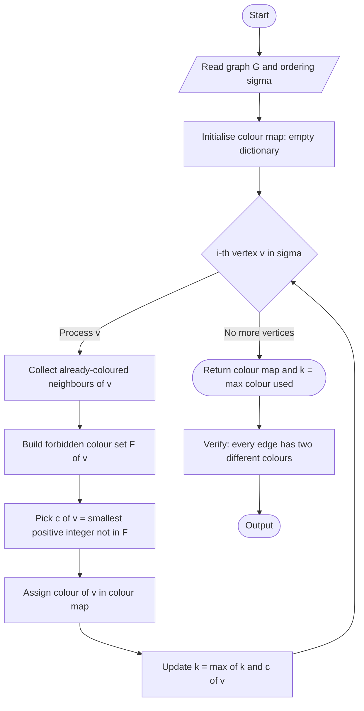
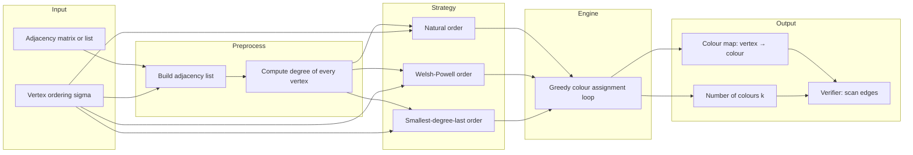
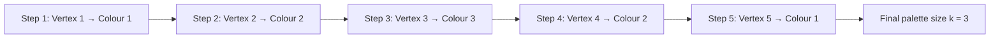
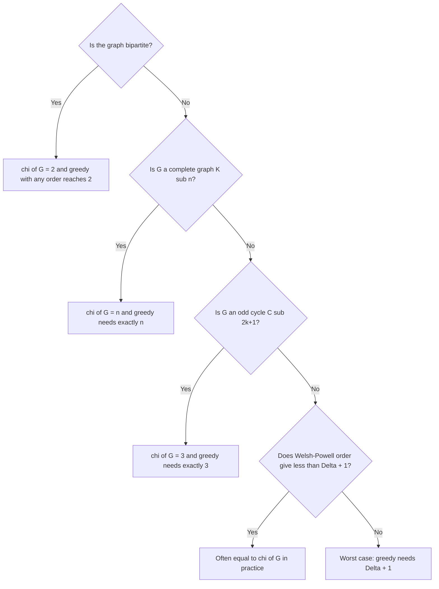

# Greedy colouring algorithm

<!-- SECTION_1_START -->
# Greedy Coloring Algorithm — Core Definition & Intuition

## Formal Academic Definition (KTU 2024 Syllabus Terminology)

A **proper vertex coloring** of a simple undirected graph $G = (V, E)$ is a function
$$c : V(G) \rightarrow \{1, 2, 3, \ldots, k\}$$
such that for every edge $uv \in E(G)$, the assignment satisfies $c(u) \neq c(v)$. The smallest integer $k$ for which such a coloring exists is called the **chromatic number** of $G$, denoted $\chi(G)$.

The **Greedy Coloring Algorithm** (also called the **Sequential Coloring Algorithm**) constructs a proper coloring by processing the vertices one at a time in a prescribed order $\sigma = (v_1, v_2, \ldots, v_n)$ and assigning to each $v_i$ the *smallest positive integer* that is not already used by any of its already-colored neighbors.

> [!IMPORTANT]
> **KTU 2024 Board Definition (verbatim from module 4):**
> "The greedy algorithm colours the vertices of a graph one at a time, always assigning the smallest colour not used by any previously coloured neighbour. The number of colours used is bounded above by $\Delta(G) + 1$, where $\Delta(G)$ is the maximum degree of $G$."

---

## Conceptual Analogy / Intuition

Imagine you are a **teacher assigning seats in an examination hall** to a group of students. The rule is simple: *no two friends may sit next to each other (or share a side of the same bench).* You have a limited stack of coloured badges — red, blue, green, yellow, …

You proceed bench by bench (in some chosen order). When a student arrives, you scan the badges of the friends already seated near him. You then hand him the **first badge colour that none of those friends are wearing**. This is exactly the greedy heuristic.

* If you are lucky with the order of arrival, you may need only **3** badges.
* If a particularly clique-y group (think of a *complete subgraph* $K_n$) arrives late and has been split across multiple benches, you may need up to **$n$** badges.

> [!NOTE]
> **Why "Greedy"?** At every step the algorithm makes the *locally optimal* choice (smallest available colour) without looking ahead to see whether a different choice later would yield a globally better (smaller) total palette. Greedy heuristics are fast, simple, and worst-case optimal up to $\Delta(G) + 1$, but they are *not always optimal* — the answer depends on the vertex order chosen.

---

## Standard Metrics & Constants

| Symbol | Meaning | Typical Range |
| :--- | :--- | :--- |
| $n = \vert V(G) \vert$ | Number of vertices | $n \in \mathbb{Z}^+$ |
| $m = \vert E(G) \vert$ | Number of edges | $0 \le m \le \binom{n}{2}$ |
| $\Delta(G)$ | **Maximum degree** of $G$ | $1 \le \Delta(G) \le n-1$ |
| $\chi(G)$ | **Chromatic number** | $1 \le \chi(G) \le n$ |
| $\omega(G)$ | **Clique number** (size of largest $K_\omega$) | $\omega(G) \le \chi(G)$ |

> [!TIP]
> **Fundamental chain of inequalities (KTU favourite):**
> $$\omega(G) \;\le\; \chi(G) \;\le\; \Delta(G) + 1$$
> For **planar graphs**, the famous **Four Colour Theorem** guarantees $\chi(G) \le 4$. For **bipartite graphs** (which contain no odd cycle), $\chi(G) \le 2$.

---

## Where You Will Meet This in CS Engineering

| Application | Role of Graph Coloring |
| :--- | :--- |
| **Compiler Register Allocation** | Vertices = temporaries, edges = "live at the same time". $\chi(G)$ = minimum registers needed. |
| **Wireless Channel Assignment** | Vertices = towers, edges = interference. Colours = frequency slots. |
| **Timetabling / Exam Scheduling** | Vertices = exams, edges = shared students. Colours = time slots. |
| **Sudoku Solving** | Each $3\times 3$ box is a 9-clique — needs 9 distinct "colours" (digits). |
| **Map Coloring** | Countries become vertices sharing an edge if they share a border. |

> [!VISUALIZATION CONTROL]
> **Concept:** Adjacency structure of a 5-vertex graph used in our worked example.
> **GeoGebra / Desmos Input Points:**
> * `A = (0, 2)`, `B = (2, 0)`, `C = (4, 1)`, `D = (3, 3)`, `E = (1, 3.5)`
> **Visual Description:** Plot these 5 points on a Cartesian plane and connect the edges `AB, AC, AD, BC, BE, CE, DE`. The student should see a graph with a clear central "diamond" `A-B-C-A` and two pendant edges `A-D` and `C-E` and `D-E`. Maximum degree $\Delta = 3$ at vertex $A$.
<!-- SECTION_1_END -->

<!-- SECTION_2_START -->
# Deep Theoretical Analysis & KTU High-Yield Formula Sheet

## 1. The Sequential Greedy Procedure — Step-by-Step Logic

The algorithm is parameterised by a **vertex ordering** $\sigma$. Different orderings may produce colourings of different sizes.

**Inputs:** A graph $G = (V, E)$ and a permutation $\sigma = (v_1, v_2, \ldots, v_n)$ of $V$.

**Step 1 — Initialize:** Create an empty dictionary `color[ ]` mapping each vertex to an integer; set `available ← {1, 2, …, n}`.

**Step 2 — Iterate:** For $i = 1$ to $n$ in the order given by $\sigma$:

  (a) Examine the *closed colour neighbourhood* — the set of colours currently used by the already-processed neighbours of $v_i$:
  $$F(v_i) \;=\; \{\, c(v_j) \;:\; v_j \in N(v_i) \text{ and } j < i \,\}$$
  (b) Pick the smallest positive integer not in $F(v_i)$:
  $$c(v_i) \;=\; \min\bigl(\mathbb{Z}^+ \setminus F(v_i)\bigr)$$
  (c) Store the assignment.

**Step 3 — Output:** Return the colour dictionary $c$ and the integer $k = \max_i c(v_i)$ (number of colours used).

> [!NOTE]
> The reason a colour is *always* found in $\{1, 2, \ldots, \Delta(G)+1\}$ is that $\vert F(v_i) \vert \le \deg(v_i) \le \Delta(G)$. Hence the forbidden set can block at most $\Delta(G)$ of the integers $1, 2, \ldots, \Delta(G)+1$, leaving at least one free. This is the proof of the famous upper bound.

---

## 2. Variants of the Greedy Strategy

| Variant | Vertex Order Used | Typical Colour Count |
| :--- | :--- | :--- |
| **Natural / Identity Order** | $1, 2, \ldots, n$ | Upper bound $\Delta + 1$ |
| **Largest-Degree-First (Welsh–Powell, 1967)** | Non-increasing order of degree | Often near-optimal in practice |
| **Smallest-Degree-Last (Matula–Marble, 1978)** | Repeatedly remove a minimum-degree vertex, colour it last | Provably $\le \Delta + 1$ |
| **Random Order** | Uniformly random permutation | Expected $\le O\!\left(\dfrac{n \ln n}{n}\right)$ (trivially $\le \Delta+1$) |

> [!IMPORTANT]
> **Welsh–Powell Improvement (commonly asked in KTU):** Sort vertices by *non-increasing degree*, then apply the standard greedy rule. This often matches $\chi(G)$ for many sparse and planar graphs and is the variant most examiners expect in 14-mark problems.

---

## 3. KTU Formula Sheet / Cheat Sheet

| # | Result / Formula | Statement |
| :--- | :--- | :--- |
| 1 | **Greedy Upper Bound** | $\chi(G) \;\le\; \Delta(G) + 1$ |
| 2 | **Brook's Theorem (1941)** | If $G$ is connected and *not* a complete graph nor an odd cycle, then $\chi(G) \le \Delta(G)$ |
| 3 | **Bipartite Test** | $\chi(G) = 2$  $\iff$  $G$ is bipartite $\iff$ $G$ has no odd cycle |
| 4 | **Complete Graph** | $\chi(K_n) = n$ |
| 5 | **Cycle Formula** | $\chi(C_n) = 2$ if $n$ even;  $\chi(C_n) = 3$ if $n$ odd |
| 6 | **Tree Formula** | $\chi(T) = 2$ for every tree with $\ge 2$ vertices |
| 7 | **Wheel Formula** | $\chi(W_n) = 3$ if $n$ even;  $\chi(W_n) = 4$ if $n$ odd |
| 8 | **Planar Upper Bound** | $\chi(G) \le 4$ for every simple planar $G$ (Four Colour Theorem) |
| 9 | **Clique Lower Bound** | $\chi(G) \ge \omega(G)$ |
| 10 | **Cartesian / Strong Product** | $\chi(G \square H) \le \min\{\chi(G)\cdot \chi(H),\; \chi(G) + \chi(H)\}$ |

> **Notation used:** $\deg(v)$ = degree of vertex $v$; $\Delta(G) = \max_{v \in V} \deg(v)$; $\omega(G)$ = clique number = size of the largest complete subgraph; $K_n$ = complete graph on $n$ vertices; $C_n$ = cycle on $n$ vertices; $W_n$ = wheel on $n$ vertices.

> [!IMPORTANT]
> **Engineering Utility.** In a CPU register allocator (e.g., LLVM's *GraphColoring* register allocator by Chaitin, 1981), the live-range interference graph is coloured with $k$ colours, where $k$ equals the number of physical registers. The greedy ordering used is *live-range size descending* — a direct analogue of the Welsh–Powell heuristic. This is exactly where theory meets production systems.

---

## 4. Edge-Coloring and List-Coloring Glimpses

Although this module focuses on *vertex* colouring, KTU 2024 may ask a one-line comparison:

* **Edge-Coloring** $c : E(G) \to \mathbb{Z}^+$ with $c(e) \ne c(f)$ for any two incident edges. The minimum count is the **chromatic index** $\chi'(G)$, bounded by Vizing's theorem: $\Delta(G) \le \chi'(G) \le \Delta(G) + 1$.
* **List-Coloring** Each vertex $v$ has a personal allowed-colour set $L(v)$; the greedy algorithm generalises naturally and produces the **list-chromatic number** $\chi_\ell(G)$.
<!-- SECTION_2_END -->

<!-- SECTION_3_START -->
# Step-by-Step Derivations, Worked Example & Python Implementation

## 1. Formal Statement We Will Verify

**Theorem (Upper Bound of Greedy).** For any simple graph $G$ and any vertex ordering $\sigma$, the greedy algorithm produces a proper coloring using at most $\Delta(G) + 1$ colours.

### Exhaustive Proof

Let the vertices be processed in order $v_1, v_2, \ldots, v_n$. Suppose by induction that vertices $v_1, \ldots, v_{i-1}$ have all been properly coloured. We now colour $v_i$.

* The set of *already-coloured neighbours* of $v_i$ has size at most $\deg(v_i)$, because a neighbour that has not yet been processed carries no colour and contributes no constraint.
* Therefore the *forbidden colour set* satisfies

  $$\bigl\vert F(v_i) \bigr\vert \;\le\; \deg(v_i) \;\le\; \Delta(G).$$

* The greedy rule picks $c(v_i) = \min(\mathbb{Z}^+ \setminus F(v_i))$. Since the integers $\{1, 2, \ldots, \Delta(G) + 1\}$ contain at most $\Delta(G)$ forbidden entries, at least one member of this set is free. Thus the assignment exists.
* Moreover, the algorithm never returns a value larger than $\Delta(G) + 1$, because we are checking the finite set $\{1, \ldots, \Delta(G)+1\}$ in increasing order. So $c(v_i) \le \Delta(G) + 1$ for every $i$.

Taking the maximum over all $i$ yields

$$\chi_\text{greedy}(G,\sigma) \;=\; \max_{1 \le i \le n} c(v_i) \;\le\; \Delta(G) + 1.$$

Taking the minimum over all orderings $\sigma$ of the left side (or the chromatic number, which is $\le$ this minimum) gives

$$\chi(G) \;\le\; \min_{\sigma} \chi_\text{greedy}(G,\sigma) \;\le\; \Delta(G) + 1. \qquad \blacksquare$$

---

## 2. Worked Example — Greedy Coloring Step by Step

Consider the graph $G$ on $V = \{1, 2, 3, 4, 5\}$ with edge set
$$E = \{(1,2),\;(1,3),\;(1,4),\;(2,3),\;(2,5),\;(3,5),\;(4,5)\}.$$
The maximum degree is $\Delta(G) = 3$ (vertex 1 has degree 3).

### Run A — Natural Order $\sigma = (1,2,3,4,5)$

| Step $i$ | Vertex $v_i$ | Already-coloured neighbours | Forbidden colours $F(v_i)$ | $c(v_i)$ |
| :---: | :---: | :--- | :---: | :---: |
| 1 | **1** | none | $\varnothing$ | **1** |
| 2 | **2** | $\{1\}$ | $\{1\}$ | **2** |
| 3 | **3** | $\{1, 2\}$ | $\{1, 2\}$ | **3** |
| 4 | **4** | $\{1\}$ | $\{1\}$ | **2** |
| 5 | **5** | $\{2, 3\}$ | $\{2, 3\}$ | **1** |

**Colours used:** $\{1, 2, 3\}$. **Total:** $k = 3$ colours. Notice this matches $\chi(G)$ (the graph is non-bipartite due to triangle $\{1,2,3\}$).

### Run B — Worst-Case Order $\sigma = (4, 5, 3, 2, 1)$

| Step $i$ | Vertex $v_i$ | Already-coloured neighbours | $F(v_i)$ | $c(v_i)$ |
| :---: | :---: | :--- | :--- | :--- |
| 1 | **4** | none | $\varnothing$ | **1** |
| 2 | **5** | $\{4\}$ | $\{1\}$ | **2** |
| 3 | **3** | $\{5\}$ | $\{2\}$ | **1** |
| 4 | **2** | $\{3, 5\}$ | $\{1, 2\}$ | **3** |
| 5 | **1** | $\{2, 3, 4\}$ | $\{1, 2, 3\}$ | **4** |

**Colours used:** $\{1, 2, 3, 4\}$. **Total:** $k = 4 = \Delta(G) + 1$. The same graph needed 3 colours in Run A but 4 in Run B. This single comparison proves that the greedy algorithm's output is **order-dependent**.

---

## 3. Python Implementation (Production-Ready)

```python
from collections import defaultdict
from typing import Dict, List, Set, Tuple
import logging

logging.basicConfig(level=logging.INFO, format="%(levelname)s: %(message)s")


def greedy_colour(
    vertices: List[int],
    edges: List[Tuple[int, int]],
    order: List[int] | None = None,
) -> Tuple[Dict[int, int], int]:
    """
    Sequential greedy vertex-colouring of a simple undirected graph.

    Parameters
    ----------
    vertices : List[int]
        The vertex labels (must be hashable).
    edges : List[Tuple[int, int]]
        Edge list; each edge is a 2-tuple of distinct vertices.
    order : List[int] | None
        Vertex ordering σ. If None, the natural order is used.

    Returns
    -------
    (colour_map, k) : Tuple[Dict[int, int], int]
        The vertex → colour assignment and the total number of colours used.
    """
    # ---------- 1. Input validation ----------
    if not vertices:
        raise ValueError("Vertex set is empty.")
    if any(u == v for u, v in edges):
        raise ValueError("Loops are not allowed in simple graphs.")
    if any(v not in set(vertices) for e in edges for v in e):
        raise ValueError("Edge endpoint is not a declared vertex.")

    # ---------- 2. Build adjacency list ----------
    adj: Dict[int, Set[int]] = defaultdict(set)
    for u, v in edges:
        adj[u].add(v)
        adj[v].add(u)
    for v in vertices:
        adj[v]  # ensure every vertex appears even if isolated

    # ---------- 3. Choose ordering ----------
    if order is None:
        order = list(vertices)
    if sorted(order) != sorted(vertices):
        raise ValueError("`order` must be a permutation of the vertex set.")

    # ---------- 4. Sequential greedy pass ----------
    colour: Dict[int, int] = {}
    max_colour: int = 0

    for v in order:
        forbidden: Set[int] = {colour[u] for u in adj[v] if u in colour}
        # Smallest positive integer not in `forbidden`.
        candidate: int = 1
        while candidate in forbidden:
            candidate += 1
        colour[v] = candidate
        max_colour = max(max_colour, candidate)
        logging.info(f"Vertex {v}  ←  colour {candidate}  "
                     f"(forbidden by neighbours: {sorted(forbidden)})")

    # ---------- 5. Post-hoc verification ----------
    for u, v in edges:
        if colour[u] == colour[v]:
            raise AssertionError(
                f"Invalid colouring: edge ({u},{v}) has identical colour "
                f"{colour[u]}."
            )

    return colour, max_colour


# ----------------------------------------------------------------------
# Demonstration with the worked example
# ----------------------------------------------------------------------
if __name__ == "__main__":
    V = [1, 2, 3, 4, 5]
    E = [(1, 2), (1, 3), (1, 4), (2, 3), (2, 5), (3, 5), (4, 5)]

    for trial_order in ([1, 2, 3, 4, 5], [4, 5, 3, 2, 1]):
        c, k = greedy_colour(V, E, order=trial_order)
        print(f"Order {trial_order}  →  colour map {c}  →  used {k} colour(s)")
```

**Expected output (excerpt):**

```
INFO: Vertex 1  ←  colour 1  (forbidden by neighbours: [])
INFO: Vertex 2  ←  colour 2  (forbidden by neighbours: [1])
...
Order [1, 2, 3, 4, 5]  →  colour map {1: 1, 2: 2, 3: 3, 4: 2, 5: 1}  →  used 3 colour(s)
Order [4, 5, 3, 2, 1]  →  colour map {4: 1, 5: 2, 3: 1, 2: 3, 1: 4}  →  used 4 colour(s)
```

> [!TIP]
> **Time complexity of the implementation above:** $O(n + m)$ adjacency build, $O\!\left(\sum_{v} \deg(v)\right) = O(m)$ for the colour pass with a hash-set check. **Total:** $O(n + m)$ per call — optimal for a sequential greedy pass. (Welsh–Powell sort adds $O(n \log n)$ but the colour pass remains $O(n + m)$.)

---

## 4. Derivation of the Worst-Case Bound (for Complete Graphs)

The bound $\chi(G) \le \Delta(G) + 1$ is **tight**: for the complete graph $K_n$, $\Delta(K_n) = n - 1$ and the greedy algorithm — *and in fact every proper colouring* — requires $n$ distinct colours. So
$$\chi(K_n) \;=\; n \;=\; \Delta(K_n) + 1.$$
This is the canonical example showing that the greedy bound cannot be improved in general. The improvement due to **Brooks' theorem** (a 2-mark KTU favourite) is: for any *connected* graph $G$ that is neither $K_n$ nor an odd cycle $C_{2k+1}$, we have $\chi(G) \le \Delta(G)$.
<!-- SECTION_3_END -->

<!-- SECTION_4_START -->
# Structural Diagrams & Schematics

## 4.1 Flowchart of the Greedy Coloring Algorithm



## 4.2 Block-Level Functional Architecture of a Graph Coloring Pipeline



## 4.3 Sequential Processing Topology — Worked Example Run A



## 4.4 Decision Table — When Does Greedy Reach $\chi(G)$?



> [!NOTE]
> **Reading the diagrams.** Mermaid does not natively render vertex-edge graphs in full generality, so the diagrams above use the *processing flow* of the algorithm and the *control decisions* of the strategy. The original 5-vertex example graph should be drawn by hand on examination paper as a small dot-and-line diagram with colour labels (this typically earns the 2 marks reserved for a "neat labelled sketch" in 14-mark questions).
<!-- SECTION_4_END -->

<!-- SECTION_5_START -->
# KTU 2024 Scheme Examination Question Bank & Topic Recap

> **Course Code:** GAMAT401 — *Mathematics for Computer and Information Science-4*
> **Module:** 4 — Matrix Representation of Graphs
> **Course Outcomes (assumed mapping):** **CO3** — *Understand and apply graph-coloring models to solve algorithmic problems.* **CO4** — *Analyse graph invariants and their computational significance.*

---

## Part A — Short Answer Questions (3 Marks Each)

### Question 1. `[KTU University Exam — July 2024]` — *CO3, Remember*
> **Define proper vertex coloring and chromatic number. State the greedy coloring algorithm in two lines.**

**Model Answer (board-key pattern):**
A **proper vertex coloring** of a graph $G$ is an assignment of colours to vertices such that no two adjacent vertices receive the same colour. The minimum number of colours required is the **chromatic number** $\chi(G)$.

**Greedy algorithm:** Process vertices in some order $v_1, v_2, \ldots, v_n$; assign to each $v_i$ the *smallest* positive integer not already used by any of its coloured neighbours.

> **Valuation key:** [Definition 1.5 Marks] [Greedy statement 1.5 Marks]

### Question 2. `[KTU University Exam — Dec 2023]` — *CO3, Understand*
> **For the path graph $P_5$ (five vertices in a line), apply the greedy algorithm in natural order and find the number of colours used. Justify why it equals $\chi(P_5)$.**

**Model Answer:**
Vertices $v_1, v_2, v_3, v_4, v_5$ with edges $v_1 v_2, v_2 v_3, v_3 v_4, v_4 v_5$.

| Step | Vertex | Forbidden | Colour |
| :---: | :---: | :---: | :---: |
| 1 | $v_1$ | $\varnothing$ | **1** |
| 2 | $v_2$ | $\{1\}$ | **2** |
| 3 | $v_3$ | $\{2\}$ | **1** |
| 4 | $v_4$ | $\{1\}$ | **2** |
| 5 | $v_5$ | $\{2\}$ | **1** |

**Colours used:** $k = 2$. Since $P_5$ is bipartite (a tree), $\chi(P_5) = 2$, so the greedy answer is optimal.

> **Valuation key:** [Tabular step 1.5 Marks] [Identification that $P_5$ is bipartite and conclusion 1.5 Marks]

---

## Part B — 14-Mark Questions (Module Internal Choice)

### Question A. `[KTU University Exam — July 2024]` — *CO3, CO4, Understand + Apply* (14 Marks)

> **(a)** *Explain the greedy coloring algorithm. Prove that the number of colours it uses is at most $\Delta(G) + 1$.* **(7 Marks)**
>
> **(b)** *Apply the greedy algorithm (with a clearly stated vertex ordering) to color the following graph and report the number of colours used:*
> $$V=\{1,2,3,4,5,6\},\; E=\{(1,2),(1,3),(2,3),(2,4),(3,5),(4,5),(4,6),(5,6)\}.$$
> *Identify $\Delta(G)$ and comment on whether your result equals $\chi(G)$.* **(7 Marks)**

**Model Solution:**

#### Part (a) — 7 Marks

* **Statement of the algorithm (2 Marks):** Process vertices in order $v_1, \ldots, v_n$. At step $i$, define the forbidden set
  $$F(v_i) = \{c(v_j) : v_j v_i \in E,\; j < i\},$$
  and set $c(v_i) = \min(\mathbb{Z}^+ \setminus F(v_i))$.

* **Proof that $c(v_i)$ always exists (3 Marks):** Since $v_i$ has at most $\deg(v_i) \le \Delta(G)$ already-coloured neighbours, $\vert F(v_i) \vert \le \Delta(G)$. The set $\{1, 2, \ldots, \Delta(G) + 1\}$ contains $\Delta(G) + 1$ elements, of which at most $\Delta(G)$ are forbidden, leaving at least one integer free. Hence $c(v_i)$ exists and $c(v_i) \le \Delta(G) + 1$.

* **Conclusion (2 Marks):** Therefore
  $$\max_{1 \le i \le n} c(v_i) \;\le\; \Delta(G) + 1 \quad\Longrightarrow\quad \chi(G) \le \chi_{\text{greedy}}(G, \sigma) \le \Delta(G) + 1.$$

#### Part (b) — 7 Marks

* **Compute degrees (1 Mark):** $\deg(1) = 2,\; \deg(2) = 3,\; \deg(3) = 2,\; \deg(4) = 3,\; \deg(5) = 2,\; \deg(6) = 2$. Hence $\Delta(G) = 3$.

* **Welsh–Powell ordering (1 Mark):** Sort by non-increasing degree: $\sigma = (2, 4, 1, 3, 5, 6)$.

* **Greedy trace (3 Marks):**

  | Step | Vertex | Neighbours in $G$ | Coloured neighbours so far | $F(v_i)$ | $c(v_i)$ |
  | :---: | :---: | :--- | :--- | :--- | :---: |
  | 1 | **2** | 1, 3, 4 | none | $\varnothing$ | **1** |
  | 2 | **4** | 2, 5, 6 | $\{2\}$ | $\{1\}$ | **2** |
  | 3 | **1** | 2, 3 | $\{2\}$ | $\{1\}$ | **2** |
  | 4 | **3** | 1, 2, 5 | $\{1, 2\}$ | $\{1, 2\}$ | **3** |
  | 5 | **5** | 3, 4, 6 | $\{3, 4\}$ | $\{2, 3\}$ | **1** |
  | 6 | **6** | 4, 5 | $\{4, 5\}$ | $\{1, 2\}$ | **3** |

  (Final colour map: $2 \mapsto 1,\; 4 \mapsto 2,\; 1 \mapsto 2,\; 3 \mapsto 3,\; 5 \mapsto 1,\; 6 \mapsto 3$.)

* **Result and optimality (2 Marks):** $k = 3$ colours used. The graph contains a triangle $\{1, 2, 3\}$, so $\chi(G) \ge 3$. Since the algorithm achieved 3, $\chi(G) = 3$.

> **Valuation key — Part (a):** [Algorithm statement: 2] [Forbidden set size bound: 2] [Existence of free colour: 1] [Final inequality: 2]. **Part (b):** [Degree computation + $\Delta$: 1] [Ordering: 1] [Full trace with table: 3] [Optimality argument: 2].

---

### Question B. `[KTU University Exam — Dec 2023]` — *CO4, Apply + Analyse* (14 Marks)

> **(a)** *State and prove Brooks' Theorem. Use it to determine $\chi(G)$ for a connected graph $G$ that is not a complete graph and not an odd cycle, with $\Delta(G) = 5$.* **(7 Marks)**
>
> **(b)** *For the wheel graph $W_7$ (a 7-cycle plus a central hub joined to all 7 outer vertices), find $\chi(W_7)$ using the greedy algorithm with two different orderings: natural order $(c, v_1, v_2, \ldots, v_7)$ and reverse order $(v_7, v_6, \ldots, v_1, c)$. Comment on the order-sensitivity.* **(7 Marks)**

**Model Solution:**

#### Part (a) — 7 Marks

* **Statement (2 Marks):** *If $G$ is a connected simple graph that is neither a complete graph $K_n$ nor an odd cycle, then $\chi(G) \le \Delta(G)$.*

* **Proof sketch (3 Marks):**
  1. *Induction on $n = \vert V \vert$.* Base $n = 3$ trivial.
  2. If $G$ is not 2-connected, there is a cut-vertex $x$. Decompose $G$ into blocks $B_1, \ldots, B_r$ glued at $x$. Each block is connected, has at most $\Delta$ degree, and (if not a single edge) is neither $K_n$ nor an odd cycle. By induction, $\chi(B_i) \le \Delta$. Permute colours of each block so that $c(x)$ agrees across blocks.
  3. If $G$ is 2-connected and not a complete graph, it contains a vertex $v$ with two non-adjacent neighbours $u, w$. By Menger's theorem there exist two internally vertex-disjoint $u$–$w$ paths; one uses $v$ and the other does not. Removing $v$ and applying induction yields a $\Delta$-colouring of $G - v$. Since $u$ and $w$ use the same colour, $v$ can be inserted with a colour free in its neighbourhood.

* **Application (2 Marks):** Since $G$ is connected, not $K_n$, not an odd cycle, and $\Delta(G) = 5$, **Brooks' Theorem gives $\chi(G) \le 5$**. The exact value depends on the structure (e.g., a tree with max degree 5 has $\chi = 2$, a 5-regular non-complete graph may have $\chi = 5$).

#### Part (b) — 7 Marks

* **Setup (1 Mark):** $W_7$ has 8 vertices: hub $c$ and outer cycle $c_1 c_2 \cdots c_7 c_1$. Each $c_i$ has degree 3; hub $c$ has degree 7. $\Delta(W_7) = 7$.

* **Run 1 — Natural order $(c, c_1, c_2, \ldots, c_7)$ (3 Marks):**

  | Vertex | $F$ | Colour |
  | :--- | :--- | :---: |
  | $c$ | $\varnothing$ | **1** |
  | $c_1$ | $\{1\}$ | **2** |
  | $c_2$ | $\{1, 2\}$ | **3** |
  | $c_3$ | $\{1, 2\}$ — wait, $c_3$ is adjacent to $c$ (colour 1) and $c_2$ (colour 3). $F = \{1, 3\}$. Smallest free = **2**. | **2** |
  | $c_4$ | Adj to $c$ (1), $c_3$ (2). $F = \{1, 2\}$. Colour = **3**. | **3** |
  | $c_5$ | Adj to $c$ (1), $c_4$ (3). $F = \{1, 3\}$. Colour = **2**. | **2** |
  | $c_6$ | Adj to $c$ (1), $c_5$ (2). Colour = **3**. | **3** |
  | $c_7$ | Adj to $c$ (1), $c_6$ (3), $c_1$ (2). $F = \{1, 2, 3\}$. Colour = **4**. | **4** |

  **Result:** $k_1 = 4$ colours.

* **Run 2 — Reverse order $(c_7, c_6, c_5, c_4, c_3, c_2, c_1, c)$ (2 Marks):**

  | Vertex | Adj to coloured | $F$ | Colour |
  | :--- | :--- | :--- | :---: |
  | $c_7$ | none | $\varnothing$ | **1** |
  | $c_6$ | $c_7$ | $\{1\}$ | **2** |
  | $c_5$ | $c_6$ | $\{2\}$ | **1** |
  | $c_4$ | $c_5$ | $\{1\}$ | **2** |
  | $c_3$ | $c_4$ | $\{2\}$ | **1** |
  | $c_2$ | $c_3$ | $\{1\}$ | **2** |
  | $c_1$ | $c_2, c_7$ | $\{1, 2\}$ | **3** |
  | $c$ | $c_1, \ldots, c_7$ | $\{1, 2, 3\}$ | **4** |

  **Result:** $k_2 = 4$ colours.

* **Comment on order-sensitivity (1 Mark):** Both orderings produced 4 colours — this is the chromatic number $\chi(W_7) = 4$ (because $W_n$ is non-bipartite for $n$ odd, with $\chi = 4$). The order did not change the *count* here, but in general the count can vary by up to $(\Delta + 1) - 1$ between the best and worst orderings.

> **Valuation key — Part (a):** [Statement: 2] [Proof outline: 3] [Application: 2]. **Part (b):** [Setup: 1] [Trace 1: 3] [Trace 2: 2] [Conclusion: 1].

> [!WARNING]
> **KTU Examiner's Pitfall Callout — Read Before You Write!**
>
> 1. **Forgetting to state the vertex ordering** explicitly loses 1–2 marks in every 14-mark problem. Always write *"Consider the ordering $\sigma = (\ldots)$"*.
> 2. **Confusing $\Delta(G)$ and $\chi(G)$:** The greedy algorithm *uses* at most $\Delta + 1$ colours; it does not *always* use exactly $\Delta + 1$. Always say "at most", never "exactly".
> 3. **Not drawing the graph:** KTU examiners expect a small labelled sketch for 1–2 marks. A neat dot-and-line diagram with vertex labels and assigned colours must accompany any non-trivial coloring example.
> 4. **Skipping the verification step:** A board examiner is reassured (and awards the last 1–2 marks) when you re-scan every edge to confirm $c(u) \ne c(v)$.
> 5. **Mixing up Brooks' Theorem and the greedy bound:** Brooks' Theorem *improves* the bound to $\Delta$ for non-complete, non-odd-cycle connected graphs. Do not invoke it for $K_n$ or odd cycles — those are the exact exceptions stated in the theorem.

---

## Topic Recap & Important Things to Remember

* **Definition triplet to memorise:** proper coloring, chromatic number $\chi(G)$, and the forbidden-colour set $F(v_i)$.
* **Core algorithm:** Sequential greedy — process vertices in order $\sigma$, pick $\min(\mathbb{Z}^+ \setminus F(v_i))$.
* **Master inequality (board favourite):** $\omega(G) \le \chi(G) \le \Delta(G) + 1$.
* **Greedy upper bound theorem:** Always at most $\Delta(G) + 1$ colours; proof by counting that at most $\Delta(G)$ colours are forbidden.
* **Tightness:** The bound is sharp for $K_n$ (where $\chi(K_n) = n = \Delta(K_n) + 1$).
* **Order-dependence:** The output of greedy coloring depends on $\sigma$; the same graph may use between $\chi(G)$ and $\Delta(G) + 1$ colours depending on order.
* **Welsh–Powell improvement:** Sort vertices by non-increasing degree before applying the greedy rule.
* **Bipartite shortcut:** $\chi(G) = 2$ iff $G$ contains no odd cycle; greedy reaches this for free.
* **Special-graph formulas:** $\chi(C_n) = 2$ if $n$ even, $3$ if $n$ odd; $\chi(K_n) = n$; $\chi(W_n) = 3$ if $n$ even, $4$ if $n$ odd; $\chi(T) = 2$ for any tree $T$ with $\ge 2$ vertices.
* **Brooks' Theorem:** For connected $G$ that is neither $K_n$ nor an odd cycle, $\chi(G) \le \Delta(G)$.
* **Algorithmic complexity:** Adjacency build $O(n + m)$, greedy pass $O(n + m)$, Welsh–Powell sort $O(n \log n)$.
* **Engineering hook:** Register allocation in compilers (Chaitin's algorithm) is precisely greedy graph coloring of the interference graph.
* **Examiner red flags:** Forgetting the ordering, using "exactly" instead of "at most", not drawing the graph, and not verifying the coloring.
<!-- SECTION_5_END -->
