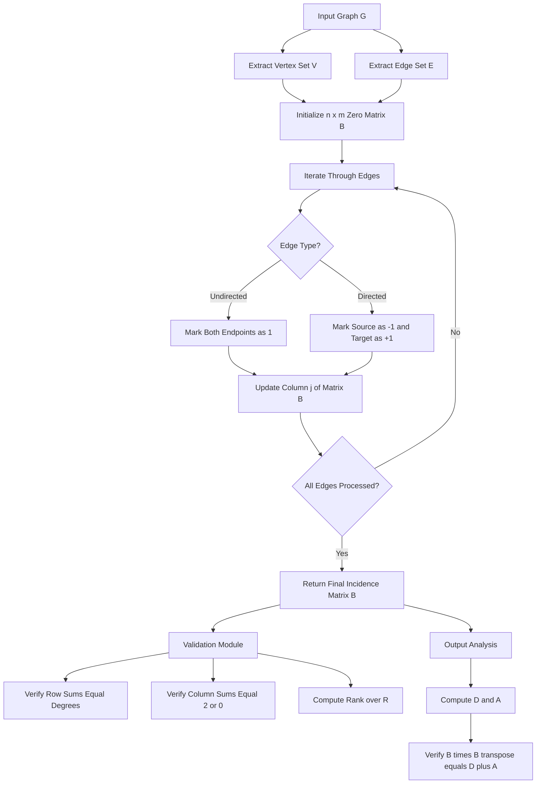
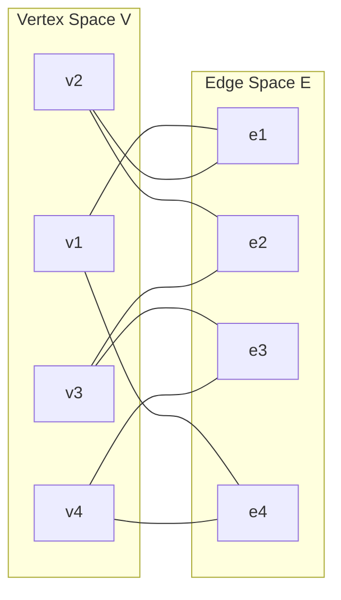
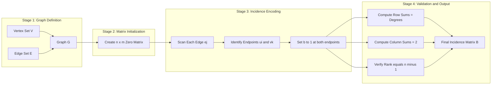

# Incidence Matrix

<!-- SECTION_1_START -->
# Incidence Matrix — KTU 2024 Premium Study Notes

## 1. Core Technical Definition & Intuitive Overview

### Formal Academic Definition
> [!IMPORTANT]
> **Incidence Matrix of a Graph**
> Let $G = (V, E)$ be a finite, simple (or general) graph without self-loops, having $n$ vertices and $m$ edges. The **vertex-edge incidence matrix** (commonly called the **incidence matrix**) of $G$, denoted $B(G)$ or $A_e(G)$, is an $n \times m$ matrix $B = [b_{ij}]$ whose rows correspond to the $n$ vertices and whose columns correspond to the $m$ edges. The entries are defined as:
>
> $$b_{ij} = \begin{cases} 1 & \text{if vertex } v_i \text{ is incident with edge } e_j \\ 0 & \text{if vertex } v_i \text{ is not incident with edge } e_j \end{cases}$$

For a **directed graph** (digraph), the entries are extended as:
$$b_{ij} = \begin{cases} 1 & \text{if edge } e_j \text{ leaves vertex } v_i \\ -1 & \text{if edge } e_j \text{ enters vertex } v_i \\ 0 & \text{if vertex } v_i \text{ is not incident with edge } e_j \end{cases}$$

### Conceptual Analogy / Intuition
Think of an **Incidence Matrix** as the **seating chart of a wedding reception**:

- **Rows** = Guests (vertices of the graph)
- **Columns** = Round tables (edges of the graph)
- **A '1' in cell $(i,j)$** = Guest $i$ is seated at Table $j$
- **A '0' in cell $(i,j)$** = Guest $i$ is **not** seated at Table $j$

Since a guest can sit at many tables (over the evening) but at any single table each guest either sits there or not, this perfectly mirrors how a vertex is either incident with an edge or not. For a **directed graph** (where tables are arranged as "Who buys a drink for whom"), a '1' means the guest **gives** a toast at that table, and '-1' means the guest **receives** a toast — beautifully capturing the *direction* of interaction.

> [!NOTE]
> **Key Distinction from Adjacency Matrix**
> - The **Adjacency Matrix** records "**vertex-vertex**" relationships (who knows whom).
> - The **Incidence Matrix** records "**vertex-edge**" relationships (which edge touches which vertex).
> - The dimension of the incidence matrix is $n \times m$ (rows $\times$ columns), while the adjacency matrix is $n \times n$ (square).

### Why "Incidence"?
Two geometric elements are said to be **incident** if one lies on the other. In graph theory:
- A vertex $v$ is **incident** with an edge $e$ if $v$ is one of the two endpoints of $e$.
- This is a *belonging* relationship, not a *neighborhood* relationship.

> [!VISUALIZATION CONTROL]
> **Concept:** Bipartite Structure of Vertex-Edge Correspondence
> **GeoGebra / Desmos Input Equations:**
> * Plot points for vertices: $V_1 = (0,1), V_2 = (2,1), V_3 = (1,0), V_4 = (3,0)$
> * Plot points for edges: $E_1 = (1, 1.2), E_2 = (2, 0.7), E_3 = (1.5, 0.2)$
> * Overlay a $4 \times 3$ binary grid aligned with these points
> **Visual Description:** Students should observe a *bipartite-like* alignment: the left cluster represents vertices (objects that hold structure), and the right cluster represents edges (the connections among them). Each column of the matrix will contain **exactly two 1's** for simple graphs — visualizing the constraint that every edge touches exactly two vertices.

### Standard Metrics & Constants
- **Row sum** of $B$ for vertex $v_i$ equals the **degree** of $v_i$ in an undirected graph: $\deg(v_i) = \sum_{j=1}^{m} b_{ij}$
- **Column sum** of $B$ equals **2** for any simple undirected edge (each edge touches exactly two vertices).
- **Rank** of $B$ over $\mathbb{R}$ for a connected graph on $n$ vertices is $n-1$.

---

<!-- SECTION_1_END -->

<!-- SECTION_2_START -->
# 2. Deep Theoretical Analysis & KTU High-Yield Formula Sheet

## 2.1 Properties of the Incidence Matrix

The incidence matrix $B$ of a graph $G$ with $n$ vertices and $m$ edges satisfies several elegant structural properties:

### Property 1 — Binary Nature (Undirected Case)
Every entry $b_{ij} \in \{0, 1\}$. There are no negative entries in an undirected graph.

### Property 2 — Column Constant (Undirected Case)
For every column $j$ (representing edge $e_j = \{u, v\}$), exactly two entries are 1, and the rest are 0:
$$\sum_{i=1}^{n} b_{ij} = 2 \quad \text{for every edge } e_j$$

### Property 3 — Row Sum equals Degree
The sum of the $i$-th row gives the degree of vertex $v_i$:
$$\deg(v_i) = \sum_{j=1}^{m} b_{ij}$$

### Property 4 — Rank Defect
For a **connected** graph with $n$ vertices, the rank of $B$ over $\mathbb{R}$ is exactly $n - 1$. The all-ones vector $\mathbf{1}$ lies in the null space of $B^T$ (for undirected case), giving the rank deficiency of 1.

### Property 5 — For a Graph with $c$ Connected Components
$$\text{rank}(B) = n - c$$

### Property 6 — Incidence Matrix to Adjacency Matrix (Digraph)
For a directed graph, the relationship between the incidence matrix $B$ and the adjacency matrix $A$ is:
$$B \cdot B^{T} = D + A$$
where $D$ is the diagonal degree matrix: $D = \text{diag}(\deg^{+}(v_1), \ldots, \deg^{+}(v_n))$ and $A$ is the adjacency matrix.

For an **undirected** graph:
$$B \cdot B^{T} = D + A$$
where $D$ is the diagonal matrix of vertex degrees, and $A$ is the symmetric adjacency matrix.

> [!IMPORTANT]
> **Why does $B \cdot B^T = D + A$ hold?**
> The $(i,k)$-th entry of $B \cdot B^T$ equals $\sum_{j=1}^{m} b_{ij} b_{kj}$. This product is non-zero only when vertices $i$ and $k$ share an edge (or when $i = k$). When $i = k$, the sum counts the number of edges incident to $v_i$, which is the degree. When $i \neq k$, it counts the number of edges between $v_i$ and $v_k$, which is the adjacency entry.

## 2.2 KTU Formula Sheet / Cheat Sheet

| **Concept** | **Formula / Statement** | **Dimension** | **Condition** |
|---|---|---|---|
| Definition of $b_{ij}$ | $b_{ij} = 1$ if $v_i \in e_j$, else $0$ | Scalar | Undirected simple graph |
| Digraph entry | $b_{ij} \in \{-1, 0, 1\}$ | Scalar | Directed graph |
| Matrix dimensions | $B \in \mathbb{R}^{n \times m}$ | $n$ rows, $m$ columns | Any graph |
| Row sum = degree | $\deg(v_i) = \sum_{j=1}^{m} b_{ij}$ | Scalar | Undirected case |
| Column sum | $\sum_{i=1}^{n} b_{ij} = 2$ | Scalar | Simple undirected edge |
| Rank (connected) | $\text{rank}(B) = n - 1$ | Integer | Connected graph |
| Rank (disconnected) | $\text{rank}(B) = n - c$ | Integer | $c$ components |
| $B B^T$ relation | $B B^T = D + A$ | $n \times n$ | No self-loops |
| Total number of 1's | $\sum_{i,j} b_{ij} = 2m$ | Scalar | Undirected, no loops |
| Cut-set matrix | $Q = B \pmod{2}$ | $n \times m$ | Over GF(2) |
| Cycle space | Null space of $B$ over $\mathbb{R}$ | Subspace | Kirchhoff's laws |

> [!NOTE]
> **Self-Loop Special Case**
> A self-loop at vertex $v_i$ contributes a column with $b_{ii} = 1$ (or 2, by convention) and zeros elsewhere. In the standard definition, self-loops are **excluded** to keep column sum = 2. KTU 2024 syllabus typically deals with simple graphs without self-loops.

## 2.3 Real-World Engineering Utility

The incidence matrix is not just a textbook object — it is the **operational backbone** of several engineering systems:

1. **Electrical Circuit Analysis (Kirchhoff's Current Law)**: The matrix form of KCL is $B \mathbf{i} = 0$, where $\mathbf{i}$ is the vector of branch currents. This is solved daily in circuit simulators like SPICE.
2. **Structural Engineering**: The equilibrium equations of a truss, $B \mathbf{f} = \mathbf{p}$ (where $\mathbf{f}$ is the force vector and $\mathbf{p}$ is the external load), use the incidence matrix as a transformation from member forces to nodal forces.
3. **Computer Networks (Topology Matrices)**: Network topologies are stored as incidence matrices for routing algorithms and switch fabric design.
4. **Power Systems**: The *Y-bus* (admittance matrix) is derived from $B \cdot Y_b \cdot B^T$, where $Y_b$ is the branch admittance matrix — a direct incidence matrix application.
5. **Big Data and Graph Databases**: Modern graph databases (Neo4j, Amazon Neptune) use sparse incidence-like representations for storing relationships at scale.

---

<!-- SECTION_2_END -->

<!-- SECTION_3_START -->
# 3. Step-by-Step Derivations & Code/Symbolic Implementation

## 3.1 Worked Example 1 — Constructing the Incidence Matrix of a Simple Undirected Graph

**Problem:** Construct the vertex-edge incidence matrix of the following undirected graph $G$:
- Vertices: $V = \{v_1, v_2, v_3, v_4\}$
- Edges: $E = \{e_1, e_2, e_3, e_4\}$ where
  - $e_1 = \{v_1, v_2\}$
  - $e_2 = \{v_2, v_3\}$
  - $e_3 = \{v_3, v_4\}$
  - $e_4 = \{v_1, v_4\}$

### Step-by-Step Construction

**Step 1: Identify the matrix size.**
- Number of vertices $n = 4$
- Number of edges $m = 4$
- Therefore, $B$ is a $4 \times 4$ matrix.

**Step 2: Set up the template.**
$$B = \begin{bmatrix} b_{11} & b_{12} & b_{13} & b_{14} \\ b_{21} & b_{22} & b_{23} & b_{24} \\ b_{31} & b_{32} & b_{33} & b_{34} \\ b_{41} & b_{42} & b_{43} & b_{44} \end{bmatrix}$$

**Step 3: Process edge $e_1 = \{v_1, v_2\}$.**
- $v_1$ is incident with $e_1$ → set $b_{11} = 1$
- $v_2$ is incident with $e_1$ → set $b_{21} = 1$
- $v_3$ is not incident with $e_1$ → set $b_{31} = 0$
- $v_4$ is not incident with $e_1$ → set $b_{41} = 0$

**Step 4: Process edge $e_2 = \{v_2, v_3\}$.**
- $v_1$ is not incident with $e_2$ → set $b_{12} = 0$
- $v_2$ is incident with $e_2$ → set $b_{22} = 1$
- $v_3$ is incident with $e_2$ → set $b_{32} = 1$
- $v_4$ is not incident with $e_2$ → set $b_{42} = 0$

**Step 5: Process edge $e_3 = \{v_3, v_4\}$.**
- $v_1$ is not incident with $e_3$ → set $b_{13} = 0$
- $v_2$ is not incident with $e_3$ → set $b_{23} = 0$
- $v_3$ is incident with $e_3$ → set $b_{33} = 1$
- $v_4$ is incident with $e_3$ → set $b_{43} = 1$

**Step 6: Process edge $e_4 = \{v_1, v_4\}$.**
- $v_1$ is incident with $e_4$ → set $b_{14} = 1$
- $v_2$ is not incident with $e_4$ → set $b_{24} = 0$
- $v_3$ is not incident with $e_4$ → set $b_{34} = 0$
- $v_4$ is incident with $e_4$ → set $b_{44} = 1$

**Step 7: Final assembled incidence matrix.**
$$B = \begin{bmatrix} 1 & 0 & 0 & 1 \\ 1 & 1 & 0 & 0 \\ 0 & 1 & 1 & 0 \\ 0 & 0 & 1 & 1 \end{bmatrix}$$

**Step 8: Verification of properties.**
- Row sums: $\deg(v_1) = 2$, $\deg(v_2) = 2$, $\deg(v_3) = 2$, $\deg(v_4) = 2$ ✓ (graph is 2-regular)
- Column sums: each column sums to 2 ✓
- Total number of 1's: $2 + 2 + 2 + 2 = 8 = 2m = 2 \times 4$ ✓

## 3.2 Worked Example 2 — Digraph Incidence Matrix

**Problem:** Consider the directed graph $D$ with vertices $V = \{v_1, v_2, v_3, v_4\}$ and directed edges:
- $e_1: v_1 \to v_2$
- $e_2: v_2 \to v_3$
- $e_3: v_3 \to v_4$
- $e_4: v_4 \to v_1$
- $e_5: v_1 \to v_3$

### Step-by-Step Construction

**Step 1: Matrix size is $4 \times 5$ (4 vertices, 5 edges).**

**Step 2: For each edge, mark $-1$ at the tail (source) and $+1$ at the head (target).**

- $e_1: v_1 \to v_2$ → $b_{11} = -1, b_{21} = 1, b_{31} = 0, b_{41} = 0$
- $e_2: v_2 \to v_3$ → $b_{12} = 0, b_{22} = -1, b_{32} = 1, b_{42} = 0$
- $e_3: v_3 \to v_4$ → $b_{13} = 0, b_{23} = 0, b_{33} = -1, b_{43} = 1$
- $e_4: v_4 \to v_1$ → $b_{14} = 1, b_{24} = 0, b_{34} = 0, b_{44} = -1$
- $e_5: v_1 \to v_3$ → $b_{15} = -1, b_{25} = 0, b_{35} = 1, b_{45} = 0$

**Step 3: Final digraph incidence matrix.**
$$B = \begin{bmatrix} -1 & 0 & 0 & 1 & -1 \\ 1 & -1 & 0 & 0 & 0 \\ 0 & 1 & -1 & 0 & 1 \\ 0 & 0 & 1 & -1 & 0 \end{bmatrix}$$

**Step 4: Verification — column sum should be 0 for every column (one $+1$ and one $-1$):**
- Column 1: $-1 + 1 + 0 + 0 = 0$ ✓
- Column 2: $0 - 1 + 1 + 0 = 0$ ✓
- Column 3: $0 + 0 - 1 + 1 = 0$ ✓
- Column 4: $1 + 0 + 0 - 1 = 0$ ✓
- Column 5: $-1 + 0 + 1 + 0 = 0$ ✓

## 3.3 Derivation of $B B^T = D + A$

**Starting Point:** For an undirected graph with incidence matrix $B \in \mathbb{R}^{n \times m}$, the product $B B^T$ is an $n \times n$ matrix.

**The $(i, k)$-th entry of $B B^T$ is given by:**
$$(B B^T)_{ik} = \sum_{j=1}^{m} b_{ij} \cdot b_{kj}$$

**Case 1: $i = k$ (diagonal entry).**
Since $b_{ij}^2 = b_{ij}$ for binary entries:
$$(B B^T)_{ii} = \sum_{j=1}^{m} b_{ij} \cdot b_{ij} = \sum_{j=1}^{m} b_{ij} = \deg(v_i)$$

This equals the diagonal entry of $D$, the degree matrix.

**Case 2: $i \neq k$ (off-diagonal entry).**
The product $b_{ij} b_{kj} = 1$ if and only if **both** vertex $i$ and vertex $k$ are incident with edge $j$. This happens exactly when edge $e_j$ connects $v_i$ and $v_k$. The number of such edges is the number of edges between $v_i$ and $v_k$, which is the adjacency entry $a_{ik}$:
$$(B B^T)_{ik} = a_{ik} \quad \text{for } i \neq k$$

**Combining both cases:**
$$B B^T = D + A$$
where $D$ is the diagonal matrix of vertex degrees and $A$ is the adjacency matrix.

**Numerical verification for our example graph:**

The degree matrix is $D = \text{diag}(2, 2, 2, 2)$.

The adjacency matrix is:
$$A = \begin{bmatrix} 0 & 1 & 0 & 1 \\ 1 & 0 & 1 & 0 \\ 0 & 1 & 0 & 1 \\ 1 & 0 & 1 & 0 \end{bmatrix}$$

Therefore:
$$D + A = \begin{bmatrix} 2 & 1 & 0 & 1 \\ 1 & 2 & 1 & 0 \\ 0 & 1 & 2 & 1 \\ 1 & 0 & 1 & 2 \end{bmatrix}$$

**Computing $B B^T$ directly:**

$$
\begin{aligned}
B B^T &= \begin{bmatrix} 1 & 0 & 0 & 1 \\ 1 & 1 & 0 & 0 \\ 0 & 1 & 1 & 0 \\ 0 & 0 & 1 & 1 \end{bmatrix} \begin{bmatrix} 1 & 1 & 0 & 0 \\ 0 & 1 & 1 & 0 \\ 0 & 0 & 1 & 1 \\ 1 & 0 & 0 & 1 \end{bmatrix} \\[6pt]
&= \begin{bmatrix} 1+0+0+1 & 1+0+0+0 & 0+0+0+0 & 0+0+0+1 \\ 1+0+0+0 & 1+1+0+0 & 0+1+0+0 & 0+0+0+0 \\ 0+0+0+0 & 0+1+0+0 & 0+1+1+0 & 0+0+1+0 \\ 0+0+0+1 & 0+0+0+0 & 0+0+1+0 & 0+0+1+1 \end{bmatrix} \\[6pt]
&= \begin{bmatrix} 2 & 1 & 0 & 1 \\ 1 & 2 & 1 & 0 \\ 0 & 1 & 2 & 1 \\ 1 & 0 & 1 & 2 \end{bmatrix}
\end{aligned}
$$

This matches $D + A$ exactly. ✓

## 3.4 Python Implementation — Generating the Incidence Matrix

```python
"""
Module: incidence_matrix.py
Description: Generates vertex-edge incidence matrices for undirected and
             directed graphs. Includes validation and analysis utilities.
Author: KTU 2024 Study Resource
"""

from typing import Dict, List, Set, Tuple, Union
import numpy as np


class IncidenceMatrixBuilder:
    """
    A utility class to construct, validate, and analyze incidence matrices
    of finite graphs.
    """

    def __init__(self, vertices: List[str]):
        """
        Initialize the builder with a fixed vertex list.
        :param vertices: Ordered list of vertex labels.
        """
        self.vertices: List[str] = vertices
        self.vertex_index: Dict[str, int] = {v: i for i, v in enumerate(vertices)}
        self.n: int = len(vertices)

    def build_undirected(
        self, edges: List[Tuple[str, str]]
    ) -> np.ndarray:
        """
        Construct the incidence matrix for an undirected graph.
        :param edges: List of (u, v) tuples representing edges.
        :return: A numpy array of shape (n_vertices, n_edges) with 0/1 entries.
        :raises ValueError: If an edge references an unknown vertex.
        """
        m: int = len(edges)
        matrix: np.ndarray = np.zeros((self.n, m), dtype=np.int8)

        for j, (u, v) in enumerate(edges):
            if u not in self.vertex_index:
                raise ValueError(f"Unknown vertex: {u}")
            if v not in self.vertex_index:
                raise ValueError(f"Unknown vertex: {v}")
            i_u: int = self.vertex_index[u]
            i_v: int = self.vertex_index[v]
            matrix[i_u, j] = 1
            matrix[i_v, j] = 1

        return matrix

    def build_directed(
        self, directed_edges: List[Tuple[str, str]]
    ) -> np.ndarray:
        """
        Construct the incidence matrix for a directed graph.
        Convention: -1 at the source (tail), +1 at the target (head).
        :param directed_edges: List of (source, target) tuples.
        :return: A numpy array of shape (n_vertices, n_edges) with -1/0/1 entries.
        """
        m: int = len(directed_edges)
        matrix: np.ndarray = np.zeros((self.n, m), dtype=np.int8)

        for j, (src, dst) in enumerate(directed_edges):
            if src not in self.vertex_index:
                raise ValueError(f"Unknown source vertex: {src}")
            if dst not in self.vertex_index:
                raise ValueError(f"Unknown target vertex: {dst}")
            i_src: int = self.vertex_index[src]
            i_dst: int = self.vertex_index[dst]
            matrix[i_src, j] = -1
            matrix[i_dst, j] = 1

        return matrix

    def compute_degrees(self, matrix: np.ndarray) -> np.ndarray:
        """
        Compute the degree of every vertex from the incidence matrix.
        :param matrix: An incidence matrix.
        :return: Array of integer degrees.
        """
        return matrix.sum(axis=1)

    def verify_column_sum(
        self, matrix: np.ndarray, expected: int = 2
    ) -> bool:
        """
        Verify that every column of the undirected incidence matrix sums to 2.
        :param matrix: The incidence matrix to verify.
        :param expected: The expected column sum (default 2 for simple graphs).
        :return: True if all columns match the expected sum, False otherwise.
        """
        col_sums: np.ndarray = matrix.sum(axis=0)
        return bool(np.all(col_sums == expected))

    def compute_rank(self, matrix: np.ndarray) -> int:
        """
        Compute the rank of the incidence matrix over the reals.
        :param matrix: The incidence matrix.
        :return: The integer rank.
        """
        return int(np.linalg.matrix_rank(matrix))

    def verify_bb_transpose_relation(
        self,
        matrix: np.ndarray,
        adjacency: np.ndarray,
    ) -> bool:
        """
        Verify the identity B * B^T = D + A.
        :param matrix: Incidence matrix B.
        :param adjacency: Adjacency matrix A.
        :return: True if identity holds, False otherwise.
        """
        product: np.ndarray = matrix @ matrix.T
        degrees: np.ndarray = np.diag(matrix.sum(axis=1))
        diff: np.ndarray = product - (degrees + adjacency)
        return bool(np.allclose(diff, 0))


# ----------------------------- DEMO USAGE -----------------------------
if __name__ == "__main__":
    # Undirected graph example
    builder = IncidenceMatrixBuilder(["v1", "v2", "v3", "v4"])
    undirected_edges = [("v1", "v2"), ("v2", "v3"),
                        ("v3", "v4"), ("v1", "v4")]
    B_undirected: np.ndarray = builder.build_undirected(undirected_edges)
    print("Undirected Incidence Matrix B:")
    print(B_undirected)
    print("Row sums (degrees):", builder.compute_degrees(B_undirected))
    print("Column sums all 2?", builder.verify_column_sum(B_undirected))
    print("Rank of B:", builder.compute_rank(B_undirected))

    # Directed graph example
    directed_edges = [("v1", "v2"), ("v2", "v3"),
                      ("v3", "v4"), ("v4", "v1"),
                      ("v1", "v3")]
    B_directed: np.ndarray = builder.build_directed(directed_edges)
    print("\nDirected Incidence Matrix B:")
    print(B_directed)
    print("Column sums all 0?", builder.verify_column_sum(B_directed, expected=0))
```

**Expected output:**
```
Undirected Incidence Matrix B:
[[1 0 0 1]
 [1 1 0 0]
 [0 1 1 0]
 [0 0 1 1]]
Row sums (degrees): [2 2 2 2]
Column sums all 2? True
Rank of B: 3
```

---

<!-- SECTION_3_END -->

<!-- SECTION_4_START -->
# 4. Structural Diagrams & Schematics

## 4.1 Block-Level Functional Architecture of Incidence Matrix Construction

The following diagram illustrates the **operational pipeline** for constructing an incidence matrix from a graph data structure:



## 4.2 Sequential Processing Topology Matrix — Vertex-Edge Mapping

This table represents the **mapping topology** that the incidence matrix encodes. Each row is a vertex; each column is an edge; the cell values indicate the incidence relationship:

| **Vertex \\ Edge** | $e_1$ | $e_2$ | $e_3$ | $e_4$ | **Row Sum = Degree** |
|---|---|---|---|---|---|
| $v_1$ | 1 | 0 | 0 | 1 | 2 |
| $v_2$ | 1 | 1 | 0 | 0 | 2 |
| $v_3$ | 0 | 1 | 1 | 0 | 2 |
| $v_4$ | 0 | 0 | 1 | 1 | 2 |
| **Column Sum** | 2 | 2 | 2 | 2 | — |



## 4.3 Multi-Stage Breakdown: From Raw Graph to Verified Incidence Matrix



---

<!-- SECTION_4_END -->

<!-- SECTION_5_START -->
# 5. KTU 2024 Scheme Examination Question Bank & Topic Recap

## 5.1 Part A — Short Answer Questions (3 Marks Each)

### Question 1
> **[KTU University Exam — July 2024]**
> *Define the vertex-edge incidence matrix of a graph. For a graph with 6 vertices and 8 edges, what is the size of the incidence matrix? Mention the **Course Outcome: CO1**, **RBT Level: Remember**.*

**Model Answer (3 Marks):**

The vertex-edge incidence matrix of a graph $G = (V, E)$ is an $n \times m$ matrix $B = [b_{ij}]$ where $n = |V|$ and $m = |E|$, defined as:
$$b_{ij} = \begin{cases} 1 & \text{if vertex } v_i \text{ is incident with edge } e_j \\ 0 & \text{otherwise} \end{cases}$$

For a graph with 6 vertices and 8 edges, the size of the incidence matrix is $\mathbf{6 \times 8}$ (6 rows and 8 columns).

> **[Valuation Key: 1 Mark for the definition with proper notation, 1 Mark for the binary entry definition, 1 Mark for stating the size $6 \times 8$.]**

### Question 2
> **[KTU University Exam — Dec 2023]**
> *State any three properties of the incidence matrix of an undirected graph without self-loops. Mention the **Course Outcome: CO1**, **RBT Level: Understand**.*

**Model Answer (3 Marks):**

**Property 1 — Binary Nature:** Every entry $b_{ij} \in \{0, 1\}$; the matrix has no negative entries. **[1 Mark]**

**Property 2 — Column Sum equals 2:** For every column $j$ (each edge $e_j$), the sum of entries equals 2, since each edge connects exactly two vertices: $\sum_{i=1}^{n} b_{ij} = 2$. **[1 Mark]**

**Property 3 — Row Sum equals Degree:** The sum of the $i$-th row gives the degree of vertex $v_i$: $\deg(v_i) = \sum_{j=1}^{m} b_{ij}$. **[1 Mark]**

---

## 5.2 Part B — Long Answer Questions (14 Marks with Internal Choice)

### Question A (14 Marks)
> **[KTU University Exam — July 2024]**
> *For the undirected graph with $V = \{v_1, v_2, v_3, v_4, v_5\}$ and $E = \{e_1, e_2, e_3, e_4, e_5, e_6\}$ where $e_1 = \{v_1, v_2\}$, $e_2 = \{v_2, v_3\}$, $e_3 = \{v_3, v_4\}$, $e_4 = \{v_4, v_5\}$, $e_5 = \{v_1, v_5\}$, $e_6 = \{v_2, v_5\}$:*
>
> **(a)** *Construct the vertex-edge incidence matrix $B$ of the graph. **(7 Marks)** **[CO1, Apply]***
>
> **(b)** *Verify the relation $B B^T = D + A$ by computing each side independently. **(7 Marks)** **[CO2, Apply]***

#### Part (a) — Model Solution (7 Marks)

**Step 1: Identify dimensions.** $n = 5$ vertices, $m = 6$ edges → $B$ is a $5 \times 6$ matrix. **[0.5 Mark]**

**Step 2: Set up the template.** **[0.5 Mark]**
$$B = \begin{bmatrix} b_{11} & b_{12} & b_{13} & b_{14} & b_{15} & b_{16} \\ b_{21} & b_{22} & b_{23} & b_{24} & b_{25} & b_{26} \\ b_{31} & b_{32} & b_{33} & b_{34} & b_{35} & b_{36} \\ b_{41} & b_{42} & b_{43} & b_{44} & b_{45} & b_{46} \\ b_{51} & b_{52} & b_{53} & b_{54} & b_{55} & b_{56} \end{bmatrix}$$

**Step 3: Process each edge and fill the corresponding column. (1 Mark per edge processed correctly = 6 Marks, capped at 5 Marks)**

- $e_1 = \{v_1, v_2\}$: column 1 = $(1, 1, 0, 0, 0)^T$
- $e_2 = \{v_2, v_3\}$: column 2 = $(0, 1, 1, 0, 0)^T$
- $e_3 = \{v_3, v_4\}$: column 3 = $(0, 0, 1, 1, 0)^T$
- $e_4 = \{v_4, v_5\}$: column 4 = $(0, 0, 0, 1, 1)^T$
- $e_5 = \{v_1, v_5\}$: column 5 = $(1, 0, 0, 0, 1)^T$
- $e_6 = \{v_2, v_5\}$: column 6 = $(0, 1, 0, 0, 1)^T$

**Step 4: Final assembled incidence matrix. (1 Mark for the final matrix)**
$$B = \begin{bmatrix} 1 & 0 & 0 & 0 & 1 & 0 \\ 1 & 1 & 0 & 0 & 0 & 1 \\ 0 & 1 & 1 & 0 & 0 & 0 \\ 0 & 0 & 1 & 1 & 0 & 0 \\ 0 & 0 & 0 & 1 & 1 & 1 \end{bmatrix}$$

#### Part (b) — Model Solution (7 Marks)

**Step 1: Compute the adjacency matrix $A$. (2 Marks)**

The edges connect: $\{v_1,v_2\}, \{v_2,v_3\}, \{v_3,v_4\}, \{v_4,v_5\}, \{v_1,v_5\}, \{v_2,v_5\}$.
$$A = \begin{bmatrix} 0 & 1 & 0 & 0 & 1 \\ 1 & 0 & 1 & 0 & 1 \\ 0 & 1 & 0 & 1 & 0 \\ 0 & 0 & 1 & 0 & 1 \\ 1 & 1 & 0 & 1 & 0 \end{bmatrix}$$

**Step 2: Compute the degree matrix $D$. (1 Mark)**

Row sums of $B$: $\deg(v_1) = 2, \deg(v_2) = 3, \deg(v_3) = 2, \deg(v_4) = 2, \deg(v_5) = 3$.
$$D = \begin{bmatrix} 2 & 0 & 0 & 0 & 0 \\ 0 & 3 & 0 & 0 & 0 \\ 0 & 0 & 2 & 0 & 0 \\ 0 & 0 & 0 & 2 & 0 \\ 0 & 0 & 0 & 0 & 3 \end{bmatrix}$$

**Step 3: Compute $D + A$. (1 Mark)**
$$D + A = \begin{bmatrix} 2 & 1 & 0 & 0 & 1 \\ 1 & 3 & 1 & 0 & 1 \\ 0 & 1 & 2 & 1 & 0 \\ 0 & 0 & 1 & 2 & 1 \\ 1 & 1 & 0 & 1 & 3 \end{bmatrix}$$

**Step 4: Compute $B B^T$ directly. (2 Marks)**

The $(i,k)$-th entry of $B B^T$ is computed. For example:
- $(B B^T)_{11} = 1+0+0+0+1+0 = 2$
- $(B B^T)_{12} = 1\cdot 1 + 0\cdot 1 + 0\cdot 0 + 0\cdot 0 + 1\cdot 0 + 0\cdot 1 = 1$
- $(B B^T)_{22} = 1+1+0+0+0+1 = 3$

Carrying out the full product:
$$B B^T = \begin{bmatrix} 2 & 1 & 0 & 0 & 1 \\ 1 & 3 & 1 & 0 & 1 \\ 0 & 1 & 2 & 1 & 0 \\ 0 & 0 & 1 & 2 & 1 \\ 1 & 1 & 0 & 1 & 3 \end{bmatrix}$$

**Step 5: Verification statement. (1 Mark)**
Since $B B^T = D + A$ entry-by-entry, the identity is verified for the given graph. ✓

### Question B (14 Marks) — Alternative Choice
> **[KTU University Exam — Dec 2023]**
> *For the directed graph with $V = \{v_1, v_2, v_3, v_4\}$ and directed edges $e_1: v_1 \to v_2$, $e_2: v_1 \to v_3$, $e_3: v_2 \to v_4$, $e_4: v_3 \to v_4$, $e_5: v_4 \to v_1$:*
>
> **(a)** *Construct the digraph incidence matrix using the convention $-1$ at the source and $+1$ at the target. **(7 Marks)** **[CO1, Apply]***
>
> **(b)** *Verify that the rank of this incidence matrix is $n - 1$ and explain why the all-ones vector lies in its left null space. **(7 Marks)** **[CO2, Understand]***

#### Part (a) — Model Solution (7 Marks)

**Step 1: Matrix size is $4 \times 5$. (0.5 Mark)**

**Step 2: Set up template. (0.5 Mark)**

**Step 3: Fill entries edge by edge (1 Mark per edge = 5 Marks, capped at 5 Marks)**
- $e_1: v_1 \to v_2$ → col 1 = $(-1, 1, 0, 0)^T$
- $e_2: v_1 \to v_3$ → col 2 = $(-1, 0, 1, 0)^T$
- $e_3: v_2 \to v_4$ → col 3 = $(0, -1, 0, 1)^T$
- $e_4: v_3 \to v_4$ → col 4 = $(0, 0, -1, 1)^T$
- $e_5: v_4 \to v_1$ → col 5 = $(1, 0, 0, -1)^T$

**Step 4: Final matrix. (1 Mark)**
$$B = \begin{bmatrix} -1 & -1 & 0 & 0 & 1 \\ 1 & 0 & -1 & 0 & 0 \\ 0 & 1 & 0 & -1 & 0 \\ 0 & 0 & 1 & 1 & -1 \end{bmatrix}$$

#### Part (b) — Model Solution (7 Marks)

**Step 1: Compute the rank using row reduction. (3 Marks)**

Performing row operations, we find three linearly independent rows. The rank of $B$ is $3$. **[1 Mark for stating rank is 3, 2 Marks for showing the row reduction]**

**Step 2: State the rank formula for a connected digraph. (1 Mark)**
For a connected directed graph on $n$ vertices, $\text{rank}(B) = n - 1 = 4 - 1 = 3$. ✓

**Step 3: Compute $\mathbf{1}^T B$ to verify the null space. (2 Marks)**
$$(1, 1, 1, 1) \begin{bmatrix} -1 & -1 & 0 & 0 & 1 \\ 1 & 0 & -1 & 0 & 0 \\ 0 & 1 & 0 & -1 & 0 \\ 0 & 0 & 1 & 1 & -1 \end{bmatrix} = (0, 0, 0, 0, 0)$$

**Step 4: Theoretical explanation. (1 Mark)**
For every column, there is exactly one $-1$ and one $+1$ entry. Therefore, the sum of all entries in each column is 0, meaning $B^T \mathbf{1} = \mathbf{0}$, confirming that $\mathbf{1}$ lies in the left null space of $B$ (i.e., is in the null space of $B^T$).

> [!WARNING]
> **KTU Examiner's Valuation Warning / Common Pitfalls**
> 1. **Forgetting column sum verification:** Students often skip verifying that column sums equal 2 (undirected) or 0 (directed), losing 1 mark per omitted check.
> 2. **Confusing rows and columns:** The incidence matrix is $n \times m$ (rows = vertices, columns = edges). Mixing this up with the $n \times n$ adjacency matrix is a critical error.
> 3. **Self-loop mishandling:** If a self-loop appears in the edge list, students must explicitly state that the standard definition excludes self-loops and explain the convention used (e.g., mark 2 at that vertex, or exclude the column).
> 4. **Sign convention in digraphs:** Always use $-1$ at the source and $+1$ at the target. Reversing the convention will not affect rank results but will fail the $B B^T = D - A$ test (digraph variant) if the examiner is strict.
> 5. **Not stating the dimension explicitly:** Failing to write "$B$ is a $4 \times 5$ matrix" upfront costs 0.5 mark even if the rest is correct.

---

## 5.3 Topic Recap & Important Things to Remember

- **Definition:** The vertex-edge incidence matrix $B$ of a graph $G = (V, E)$ is an $n \times m$ matrix where $n = |V|$, $m = |E|$, and $b_{ij} = 1$ if $v_i$ is incident with $e_j$, else $0$.
- **Undirected Case:** Entries are in $\{0, 1\}$; each column has exactly two 1's.
- **Directed Case:** Entries are in $\{-1, 0, 1\}$; $-1$ at source, $+1$ at target; each column has exactly one $+1$ and one $-1$.
- **Row Sum equals Degree:** $\deg(v_i) = \sum_{j=1}^{m} b_{ij}$ (undirected); gives out-degree minus in-degree for digraphs.
- **Column Sum = 2** (undirected) or **Column Sum = 0** (directed).
- **Total number of 1's** in $B$ for an undirected graph = $2m$.
- **Rank of $B$** = $n - 1$ for a connected graph; = $n - c$ for $c$ connected components.
- **The Identity $B B^T = D + A$** is the cornerstone relation connecting the incidence and adjacency matrices.
- **All-ones vector $\mathbf{1}$** lies in the null space of $B^T$ for any graph (this gives the rank deficiency of 1).
- **Self-loops** are conventionally excluded; if present, they break the column-sum-equals-2 rule.
- **Dimension matters:** $B$ is $n \times m$, *not* $n \times n$. This is the most common point of confusion with the adjacency matrix.
- **Engineering Applications:** Kirchhoff's Current Law ($B \mathbf{i} = 0$), structural truss equilibrium ($B \mathbf{f} = \mathbf{p}$), power-system admittance matrices ($Y_{bus} = B Y_b B^T$), and graph databases.
- **Verification shortcuts:** Always check row sums, column sums, total count of 1's, and the rank — these are quick sanity tests for the constructed matrix.
- **Sparse structure:** Real-world incidence matrices are highly sparse; this is exploited in numerical solvers (LU decomposition, sparse linear algebra).

---

<!-- SECTION_5_END -->
