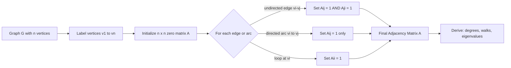
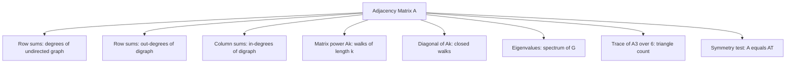
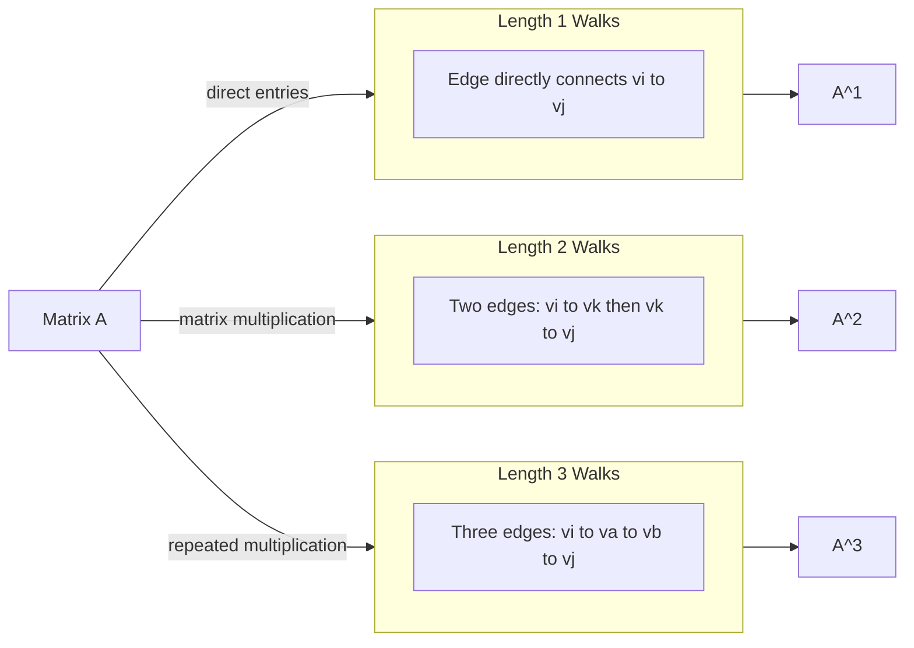
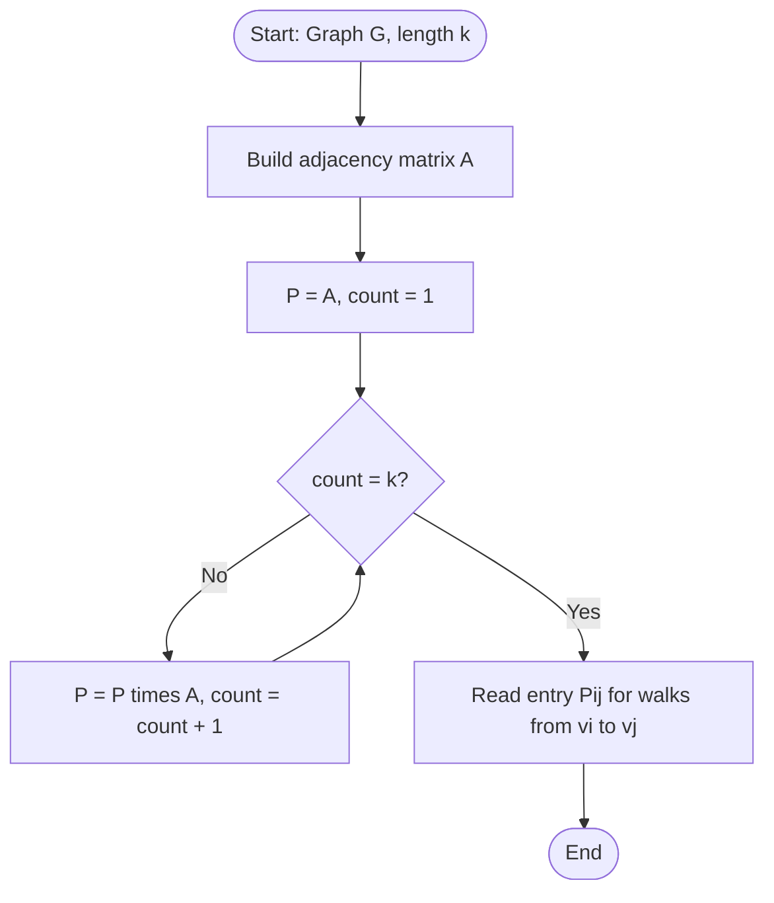
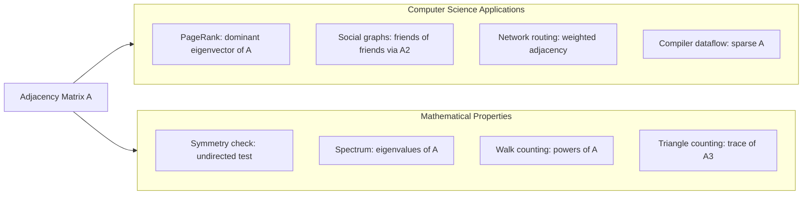

# Matrix representation of graphs- Adjacency matrix

<!-- SECTION_1_START -->
# Matrix Representation of Graphs — Adjacency Matrix

## 1. Core Technical Definition

> [!IMPORTANT]
> **KTU 2024 Syllabus Definition (GAMAT401 — Module 4):**
> Let $G = (V, E)$ be a graph (directed or undirected) with $n$ vertices, where $V = \{v_1, v_2, \dots, v_n\}$. The **Adjacency Matrix** of $G$, denoted $A(G) = [a_{ij}]_{n \times n}$, is a square matrix of order $n$ defined by the entry:
>
> $$a_{ij} = \begin{cases} \text{number of edges joining } v_i \text{ and } v_j, & \text{if } i \neq j \\ \text{number of loops at } v_i, & \text{if } i = j \end{cases}$$

For a **simple graph** (no multiple edges, no loops), the entry simplifies to:

$$a_{ij} = \begin{cases} 1, & \text{if } \{v_i, v_j\} \in E \text{ (or } (v_i,v_j) \in E \text{ for digraphs)} \\ 0, & \text{otherwise} \end{cases}$$

## 2. Intuitive Analogy — The "Social Network Phonebook"

> [!NOTE]
> **Conceptual Analogy:** Think of the adjacency matrix as a **digital contact list squared**. Imagine $n$ students sitting in a fixed classroom. You create an $n \times n$ spreadsheet. Cell $(i, j)$ records whether student $i$ has student $j$ in their friend list. The diagonal cells $(i,i)$ are the "self-friendship" (loops). The whole spreadsheet is a snapshot of **who is connected to whom** in the room, encoded in pure numerical form.
>
> The row $i$ of $A$ is essentially the **friend list of student $i$**; the column $j$ is the set of students **whose list contains $j$**.

> [!VISUALIZATION CONTROL]
> **Concept:** Adjacency matrix of a directed 4-vertex cycle graph.
> **GeoGebra / Desmos Input Matrix:**
> * Matrix $A = \begin{pmatrix} 0 & 1 & 0 & 0 \\ 0 & 0 & 1 & 0 \\ 0 & 0 & 0 & 1 \\ 1 & 0 & 0 & 0 \end{pmatrix}$
> **Visual Description:** Students $v_1 \to v_2 \to v_3 \to v_4 \to v_1$. The "1"s on the superdiagonal form a shifted diagonal pattern, revealing a perfect directed cycle. Each vertex has exactly one outgoing and one incoming connection.

## 3. Classification Based on Graph Type

| Graph Type | Diagonal $a_{ii}$ | Off-diagonal $a_{ij}$ | Symmetry |
|---|---|---|---|
| Simple undirected | $0$ | $0$ or $1$ | $A = A^T$ (symmetric) |
| Undirected with loops | $1$ or $0$ | $0$ or $1$ | $A = A^T$ |
| Undirected multigraph | $0$ | count of edges | $A = A^T$ |
| Simple directed (digraph) | $0$ | $0$ or $1$ | $A \neq A^T$ generally |
| Directed with loops | $1$ or $0$ | $0$ or $1$ | $A \neq A^T$ generally |

<!-- SECTION_1_END -->

<!-- SECTION_2_START -->
# Deep Theoretical Analysis & KTU High-Yield Formula Sheet

## 1. Fundamental Properties of the Adjacency Matrix

For a simple graph $G$ with adjacency matrix $A$ of order $n$:

### 1.1 Undirected Graphs

- **Symmetry:** $A$ is **symmetric**, i.e., $A^T = A$, because $\{v_i, v_j\} = \{v_j, v_i\}$.
- **Diagonal:** $a_{ii} = 0$ (no loops in simple graphs).
- **Row sum** $= \deg(v_i)$ (degree of vertex $v_i$).
- **Column sum** $= \deg(v_i)$ (same as row sum due to symmetry).
- **Total sum of entries:** 
$$\sum_{i=1}^{n} \sum_{j=1}^{n} a_{ij} = 2 \vert E \vert$$
because every edge contributes exactly **2** to the total (one at $(i,j)$, one at $(j,i)$).

### 1.2 Directed Graphs (Digraphs)

- $A$ is **not symmetric** in general.
- **Row sum** of row $i$ $=$ out-degree of $v_i$ (denoted $\deg^+(v_i)$).
- **Column sum** of column $j$ $=$ in-degree of $v_j$ (denoted $\deg^-(v_j)$).
- **Total sum of entries:** 
$$\sum_{i,j} a_{ij} = \vert E \vert$$
because each directed edge contributes only **1** unit.

## 2. The Power Theorem (KTU High-Yield Result)

> [!IMPORTANT]
> **The Power Theorem (Board-Favorite Result):**
> Let $A$ be the adjacency matrix of a graph $G$ with $n$ vertices. Then the $(i,j)$-th entry of $A^k$ equals the number of walks (of length $k$) from $v_i$ to $v_j$.

Mathematically, for any $k \geq 1$:

$$\left(A^k\right)_{ij} = \text{number of walks of length } k \text{ from } v_i \text{ to } v_j$$

### Key Consequences (often asked for 7 marks):

- **Number of walks of length $k$ between any two vertices** can be read directly from $A^k$.
- **Number of closed walks of length $k$ at vertex $v_i$** $= (A^k)_{ii}$ (the diagonal entry).
- **Total number of walks of length $k$ in $G$** $= \mathbf{1}^T A^k \mathbf{1}$, where $\mathbf{1}$ is the all-ones column vector.
- **Number of triangles** in an undirected simple graph:
$$\text{Triangles} = \frac{1}{6} \cdot \text{trace}(A^3)$$

## 3. Eigenvalue Connection (Spectrum of the Graph)

The eigenvalues $\lambda_1, \lambda_2, \dots, \lambda_n$ of $A(G)$ are the **eigenvalues of the graph $G$**, and the multiset $\{\lambda_1, \dots, \lambda_n\}$ is the **spectrum** of $G$.

> [!NOTE]
> For undirected graphs, $A$ is real symmetric $\Rightarrow$ all eigenvalues are **real**. The largest eigenvalue $\lambda_1$ (spectral radius) satisfies $\lambda_1 \leq \Delta(G)$ where $\Delta(G)$ is the maximum degree.

## 4. KTU Formula Sheet (Cheat Sheet)

> [!IMPORTANT]
> **Master Formula Table — Save This for the Exam**

| Formula / Property | Statement | Symbol |
|---|---|---|
| Degree from row sum | $\deg(v_i) = \sum_{j=1}^{n} a_{ij}$ | Undirected |
| Total edges (undirected) | $\vert E \vert = \frac{1}{2} \sum_{i,j} a_{ij}$ | Undirected |
| Total edges (directed) | $\vert E \vert = \sum_{i,j} a_{ij}$ | Directed |
| Out-degree (digraph) | $\deg^+(v_i) = \sum_{j} a_{ij}$ | Directed |
| In-degree (digraph) | $\deg^-(v_j) = \sum_{i} a_{ij}$ | Directed |
| Walks of length $k$ | $\left(A^k\right)_{ij}$ | All graphs |
| Closed walks at $v_i$ | $(A^k)_{ii}$ | All graphs |
| Triangles in $G$ | $\frac{1}{6} \text{trace}(A^3)$ | Simple undirected |
| Number of $k$-step connections | Read entry of $A^k$ | All graphs |

## 5. Real-World Engineering Utility

> [!NOTE]
> **Where Adjacency Matrices Power Real Systems:**
> - **Google PageRank:** The web graph's adjacency matrix is normalized into a stochastic matrix; its dominant eigenvector ranks web pages.
> - **Social Networks (Facebook, LinkedIn):** Friend suggestions use matrix multiplication $A^2$ to find "friends of friends."
> - **Circuit Analysis:** Netlist connectivity is stored as a sparse adjacency matrix for SPICE-like simulators.
> - **Recommendation Systems (Netflix, Spotify):** User–item adjacency matrices feed collaborative filtering.
> - **Computer Networks (Routing):** The adjacency matrix of a network topology (with edge weights) drives shortest-path algorithms like Dijkstra and Floyd–Warshall.

<!-- SECTION_2_END -->

<!-- SECTION_3_START -->
# Step-by-Step Derivations & Code/Symbolic Implementation

## 1. Worked Example 1 — Constructing the Adjacency Matrix

> [!NOTE]
> **Problem:** Consider the undirected graph $G$ with vertex set $V = \{v_1, v_2, v_3, v_4\}$ and edge set $E = \{\{v_1, v_2\}, \{v_1, v_3\}, \{v_2, v_3\}, \{v_3, v_4\}\}$. Construct the adjacency matrix $A(G)$ and verify the degree formula.

### Step 1: Identify all edges

Edges: $\{v_1, v_2\}, \{v_1, v_3\}, \{v_2, v_3\}, \{v_3, v_4\}$.

### Step 2: Initialize a $4 \times 4$ zero matrix

$$A = \begin{pmatrix} 0 & 0 & 0 & 0 \\ 0 & 0 & 0 & 0 \\ 0 & 0 & 0 & 0 \\ 0 & 0 & 0 & 0 \end{pmatrix}$$

### Step 3: Place 1's for each edge (symmetrically)

Edge $\{v_1, v_2\}$ $\Rightarrow$ set $a_{12} = a_{21} = 1$.
Edge $\{v_1, v_3\}$ $\Rightarrow$ set $a_{13} = a_{31} = 1$.
Edge $\{v_2, v_3\}$ $\Rightarrow$ set $a_{23} = a_{32} = 1$.
Edge $\{v_3, v_4\}$ $\Rightarrow$ set $a_{34} = a_{43} = 1$.

### Step 4: Final adjacency matrix

$$A = \begin{pmatrix} 0 & 1 & 1 & 0 \\ 1 & 0 & 1 & 0 \\ 1 & 1 & 0 & 1 \\ 0 & 0 & 1 & 0 \end{pmatrix}$$

### Step 5: Compute row sums (degrees)

$$\deg(v_1) = 0+1+1+0 = 2, \quad \deg(v_2) = 1+0+1+0 = 2$$
$$\deg(v_3) = 1+1+0+1 = 3, \quad \deg(v_4) = 0+0+1+0 = 1$$

### Step 6: Verify total edges formula

$$\sum_{i,j} a_{ij} = 0+1+1+0+1+0+1+0+1+1+0+1+0+0+1+0 = 8$$
$$\vert E \vert = \frac{8}{2} = 4 \quad \checkmark$$

## 2. Worked Example 2 — Power of the Adjacency Matrix

> [!NOTE]
> **Problem:** For the graph in Example 1, compute $A^2$ and interpret each entry. Verify the number of 2-step walks from $v_1$ to $v_4$.

### Step 1: Compute $A^2$ by matrix multiplication

$$A^2 = \begin{pmatrix} 0 & 1 & 1 & 0 \\ 1 & 0 & 1 & 0 \\ 1 & 1 & 0 & 1 \\ 0 & 0 & 1 & 0 \end{pmatrix} \cdot \begin{pmatrix} 0 & 1 & 1 & 0 \\ 1 & 0 & 1 & 0 \\ 1 & 1 & 0 & 1 \\ 0 & 0 & 1 & 0 \end{pmatrix}$$

We compute each entry:

- $(1,1): 0\cdot 0 + 1\cdot 1 + 1\cdot 1 + 0\cdot 0 = 2$
- $(1,2): 0\cdot 1 + 1\cdot 0 + 1\cdot 1 + 0\cdot 0 = 1$
- $(1,3): 0\cdot 1 + 1\cdot 1 + 1\cdot 0 + 0\cdot 1 = 1$
- $(1,4): 0\cdot 0 + 1\cdot 0 + 1\cdot 1 + 0\cdot 0 = 1$
- $(2,1): 1\cdot 0 + 0\cdot 1 + 1\cdot 1 + 0\cdot 0 = 1$
- $(2,2): 1\cdot 1 + 0\cdot 0 + 1\cdot 1 + 0\cdot 0 = 2$
- $(2,3): 1\cdot 1 + 0\cdot 1 + 1\cdot 0 + 0\cdot 1 = 1$
- $(2,4): 1\cdot 0 + 0\cdot 0 + 1\cdot 1 + 0\cdot 0 = 1$
- $(3,1): 1\cdot 0 + 1\cdot 1 + 0\cdot 1 + 1\cdot 0 = 1$
- $(3,2): 1\cdot 1 + 1\cdot 0 + 0\cdot 1 + 1\cdot 0 = 1$
- $(3,3): 1\cdot 1 + 1\cdot 1 + 0\cdot 0 + 1\cdot 1 = 3$
- $(3,4): 1\cdot 0 + 1\cdot 0 + 0\cdot 1 + 1\cdot 0 = 0$
- $(4,1): 0\cdot 0 + 0\cdot 1 + 1\cdot 1 + 0\cdot 0 = 1$
- $(4,2): 0\cdot 1 + 0\cdot 0 + 1\cdot 1 + 0\cdot 0 = 1$
- $(4,3): 0\cdot 1 + 0\cdot 1 + 1\cdot 0 + 0\cdot 1 = 0$
- $(4,4): 0\cdot 0 + 0\cdot 0 + 1\cdot 1 + 0\cdot 0 = 1$

### Step 2: Final $A^2$

$$A^2 = \begin{pmatrix} 2 & 1 & 1 & 1 \\ 1 & 2 & 1 & 1 \\ 1 & 1 & 3 & 0 \\ 1 & 1 & 0 & 1 \end{pmatrix}$$

### Step 3: Interpret $\left(A^2\right)_{14} = 1$

This means there is exactly **1 walk of length 2** from $v_1$ to $v_4$. Let's verify by inspection: $v_1 \to v_3 \to v_4$ is the only such path. $\checkmark$

### Step 4: Trace of $A^2$ and its meaning

$$\text{trace}(A^2) = 2 + 2 + 3 + 1 = 8$$

This equals $\sum_{i=1}^{4} \deg(v_i) = 2+2+3+1 = 8 = 2 \vert E \vert$. $\checkmark$

## 3. Worked Example 3 — Directed Graph

> [!NOTE]
> **Problem:** Given the digraph with arcs $(v_1,v_2), (v_2,v_1), (v_2,v_3), (v_3,v_4), (v_4,v_2)$, construct the adjacency matrix and find $\deg^+, \deg^-$ of each vertex.

### Step 1: Place 1's directedly

- $(v_1, v_2)$: $a_{12} = 1$
- $(v_2, v_1)$: $a_{21} = 1$
- $(v_2, v_3)$: $a_{23} = 1$
- $(v_3, v_4)$: $a_{34} = 1$
- $(v_4, v_2)$: $a_{42} = 1$

### Step 2: Final adjacency matrix

$$A = \begin{pmatrix} 0 & 1 & 0 & 0 \\ 1 & 0 & 1 & 0 \\ 0 & 0 & 0 & 1 \\ 0 & 1 & 0 & 0 \end{pmatrix}$$

### Step 3: Row sums (out-degrees)

$\deg^+(v_1) = 1, \quad \deg^+(v_2) = 2, \quad \deg^+(v_3) = 1, \quad \deg^+(v_4) = 1$

### Step 4: Column sums (in-degrees)

$\deg^-(v_1) = 1, \quad \deg^-(v_2) = 2, \quad \deg^-(v_3) = 1, \quad \deg^-(v_4) = 1$

Note that $A$ is **not symmetric** and the total $\sum_{i,j} a_{ij} = 5 = \vert E \vert$. $\checkmark$

## 4. Python Implementation (Symbolic + Numeric)

```python
from __future__ import annotations
import numpy as np
from typing import List, Tuple, Dict


class GraphAdjacency:
    """
    A production-quality implementation of the Adjacency Matrix
    representation for both undirected and directed graphs.

    Supports:
        - Construction from edge list
        - Degree / in-degree / out-degree queries
        - Matrix powers with walk-counting interpretation
        - Triangle counting via trace(A^3)
        - Isomorphism coarser test via degree sequence
    """

    def __init__(self, num_vertices: int, directed: bool = False) -> None:
        if num_vertices <= 0:
            raise ValueError("Number of vertices must be a positive integer.")
        self.n: int = num_vertices
        self.directed: bool = directed
        self.A: np.ndarray = np.zeros((num_vertices, num_vertices), dtype=int)
        self.vertex_index: Dict[str, int] = {}

    def _resolve(self, label) -> int:
        if isinstance(label, int):
            if not (0 <= label < self.n):
                raise IndexError(f"Vertex index {label} out of range [0, {self.n}).")
            return label
        if label not in self.vertex_index:
            self.vertex_index[label] = len(self.vertex_index)
            if self.vertex_index[label] >= self.n:
                raise IndexError("More labeled vertices than allocated capacity.")
        return self.vertex_index[label]

    def add_edge(self, u, v, weight: int = 1) -> None:
        i, j = self._resolve(u), self._resolve(v)
        if i == j:
            raise ValueError("Loops are not supported in simple graphs.")
        if self.A[i, j] != 0 and not self.directed:
            raise ValueError(f"Multiple edge detected between {u} and {v}.")
        self.A[i, j] += weight
        if not self.directed:
            self.A[j, i] += weight

    def degree(self, v) -> int:
        i = self._resolve(v)
        return int(self.A[i, :].sum())

    def out_degree(self, v) -> int:
        if not self.directed:
            return self.degree(v)
        return int(self.A[self._resolve(v), :].sum())

    def in_degree(self, v) -> int:
        if not self.directed:
            return self.degree(v)
        return int(self.A[:, self._resolve(v)].sum())

    def num_walks(self, u, v, length: int) -> int:
        if length < 0:
            raise ValueError("Walk length must be non-negative.")
        if length == 0:
            return 1 if self._resolve(u) == self._resolve(v) else 0
        power = np.linalg.matrix_power(self.A, length)
        return int(power[self._resolve(u), self._resolve(v)])

    def count_triangles(self) -> int:
        if self.directed:
            raise ValueError("Triangle counting is defined for undirected graphs only.")
        A3 = np.linalg.matrix_power(self.A, 3)
        return int(np.trace(A3)) // 6

    def total_edges(self) -> int:
        s = int(self.A.sum())
        return s if self.directed else s // 2

    def is_symmetric(self, tol: float = 1e-9) -> bool:
        return np.allclose(self.A, self.A.T, atol=tol)

    def __repr__(self) -> str:
        header = "Directed" if self.directed else "Undirected"
        return f"{header} Adjacency Matrix ({self.n}x{self.n}):\n{self.A}"


# ---------- DEMO / SANITY CHECK ----------
if __name__ == "__main__":
    # Build the graph from Worked Example 1
    g = GraphAdjacency(num_vertices=4, directed=False)
    g.add_edge(0, 1)
    g.add_edge(0, 2)
    g.add_edge(1, 2)
    g.add_edge(2, 3)
    print(g)
    print("Degrees:", [g.degree(v) for v in range(4)])
    print("Number of 2-walks from v0 to v3:", g.num_walks(0, 3, 2))
    print("Number of triangles:", g.count_triangles())
    print("Total edges:", g.total_edges())

    # Build the digraph from Worked Example 3
    dg = GraphAdjacency(num_vertices=4, directed=True)
    dg.add_edge(0, 1)
    dg.add_edge(1, 0)
    dg.add_edge(1, 2)
    dg.add_edge(2, 3)
    dg.add_edge(3, 1)
    print("\n", dg)
    print("Out-degrees:", [dg.out_degree(v) for v in range(4)])
    print("In-degrees :", [dg.in_degree(v) for v in range(4)])
    print("Is symmetric?", dg.is_symmetric())
```

### Sample Output

```
Undirected Adjacency Matrix (4x4):
[[0 1 1 0]
 [1 0 1 0]
 [1 1 0 1]
 [0 0 1 0]]
Degrees: [2, 2, 3, 1]
Number of 2-walks from v0 to v3: 1
Number of triangles: 1
Total edges: 4

 Directed Adjacency Matrix (4x4):
[[0 1 0 0]
 [1 0 1 0]
 [0 0 0 1]
 [0 1 0 0]]
Out-degrees: [1, 2, 1, 1]
In-degrees : [1, 2, 1, 1]
Is symmetric? False
```

<!-- SECTION_3_END -->

<!-- SECTION_4_START -->
# Structural Diagrams & Schematics

## 1. Conceptual Block Diagram — How the Adjacency Matrix Encodes a Graph



## 2. Information Extraction Pipeline from Adjacency Matrix



## 3. Sequential Topology — Walks vs Paths



## 4. Algorithm Flowchart — Computing Walks via Powers



## 5. Block Architecture — Use-Case Mapping (Engineering View)



<!-- SECTION_4_END -->

<!-- SECTION_5_START -->
# KTU 2024 Scheme Examination Question Bank & Topic Recap

## Part A — Short Answer Questions (3 Marks Each)

### Question 1
> **[KTU University Exam — July 2024 | CO1 | Remember]**
> Define the **adjacency matrix** of a graph. How does it differ for a simple undirected graph versus a simple directed graph?

**Model Answer (3 Marks):**
- **[Definition: 1 Mark]** Let $G = (V, E)$ with $V = \{v_1, \dots, v_n\}$. The adjacency matrix $A(G) = [a_{ij}]_{n \times n}$ has $a_{ij} = 1$ if $\{v_i, v_j\} \in E$ (undirected) or $(v_i, v_j) \in E$ (directed), else $a_{ij} = 0$, with $a_{ii} = 0$ for simple graphs.
- **[Undirected: 1 Mark]** For an undirected simple graph, $A$ is **symmetric** ($A^T = A$) and row sum of row $i$ = degree of $v_i$.
- **[Directed: 1 Mark]** For a directed simple graph, $A$ is **generally not symmetric**; row sum = out-degree, column sum = in-degree.

---

### Question 2
> **[KTU University Exam — Dec 2023 | CO1 | Understand]**
> State and explain the **Power Theorem** of the adjacency matrix. What does $\left(A^3\right)_{ij}$ represent?

**Model Answer (3 Marks):**
- **[Statement: 1 Mark]** The $(i,j)$-th entry of $A^k$ equals the number of distinct walks of length $k$ from $v_i$ to $v_j$.
- **[Application: 1 Mark]** Therefore $\left(A^3\right)_{ij}$ represents the number of walks of length 3 from $v_i$ to $v_j$.
- **[Diagonal meaning: 1 Mark]** In particular, $\left(A^3\right)_{ii}$ is the number of closed walks of length 3 at $v_i$ (i.e., 6 times the number of triangles containing $v_i$ for simple undirected graphs).

---

## Part B — Long Answer Questions (14 Marks Each, with Internal Choice)

### Question A (14 Marks)

> **[KTU University Exam — July 2024 | CO1, CO2 | Apply / Analyze]**

**(a)** Construct the adjacency matrix for the undirected graph $G$ defined by $V = \{1, 2, 3, 4, 5\}$ and $E = \{\{1,2\}, \{1,4\}, \{2,3\}, \{2,5\}, \{3,4\}, \{4,5\}\}$. **[7 Marks]**

**(b)** Compute $A^2$ for the matrix obtained in (a) and use it to find: (i) the number of 2-step walks from vertex 1 to vertex 5, (ii) the total number of triangles in $G$, and (iii) the degree of each vertex using row sums. **[7 Marks]**

---

#### Model Solution for Question A

### Part (a) — Constructing the Adjacency Matrix [7 Marks]

**[Listing edges: 1 Mark]**
Edges: $\{1,2\}, \{1,4\}, \{2,3\}, \{2,5\}, \{3,4\}, \{4,5\}$. Total 6 edges.

**[Initializing 5x5 zero matrix: 1 Mark]**
Start with $5 \times 5$ zero matrix.

**[Placing 1s symmetrically: 4 Marks]**
Each edge contributes two 1's, so total of 12 ones. The matrix is:

$$A = \begin{pmatrix} 0 & 1 & 0 & 1 & 0 \\ 1 & 0 & 1 & 0 & 1 \\ 0 & 1 & 0 & 1 & 0 \\ 1 & 0 & 1 & 0 & 1 \\ 0 & 1 & 0 & 1 & 0 \end{pmatrix}$$

**[Verifying symmetry: 1 Mark]**
Check: $A^T = A$. The matrix is symmetric, confirming it is undirected.

### Part (b) — Computing $A^2$ and Using It [7 Marks]

**[Compute $A^2$: 3 Marks]**

We compute $A^2 = A \cdot A$ entry by entry. Since $A$ has a regular pattern (vertices 1,3,5 form a "low" set and 2,4 form a "high" set), we can compute systematically.

$(1,1): 0\cdot 0 + 1\cdot 1 + 0\cdot 0 + 1\cdot 1 + 0\cdot 0 = 2$
$(1,2): 0\cdot 1 + 1\cdot 0 + 0\cdot 1 + 1\cdot 0 + 0\cdot 1 = 0$
$(1,3): 0\cdot 0 + 1\cdot 1 + 0\cdot 0 + 1\cdot 1 + 0\cdot 0 = 2$
$(1,4): 0\cdot 1 + 1\cdot 0 + 0\cdot 1 + 1\cdot 0 + 0\cdot 1 = 0$
$(1,5): 0\cdot 0 + 1\cdot 1 + 0\cdot 0 + 1\cdot 1 + 0\cdot 0 = 2$

By the regular structure, every odd-indexed row of $A^2$ is $(2, 0, 2, 0, 2)$ and every even-indexed row is $(0, 3, 0, 3, 0)$.

$$A^2 = \begin{pmatrix} 2 & 0 & 2 & 0 & 2 \\ 0 & 3 & 0 & 3 & 0 \\ 2 & 0 & 2 & 0 & 2 \\ 0 & 3 & 0 & 3 & 0 \\ 2 & 0 & 2 & 0 & 2 \end{pmatrix}$$

**(i) Number of 2-walks from vertex 1 to vertex 5: [1 Mark]**
$\left(A^2\right)_{15} = 2$. Hence there are **2 walks of length 2** from $v_1$ to $v_5$.

**Verification:** $v_1 \to v_2 \to v_5$ and $v_1 \to v_4 \to v_5$. $\checkmark$

**(ii) Total number of triangles: [1 Mark]**
$\text{trace}(A^3) / 6$ requires $A^3$. But we can also observe that $A$ has no 3-clique (the graph is bipartite between $\{1,3,5\}$ and $\{2,4\}$), so **number of triangles = 0**. As a sanity check, $A^2_{11} = 2$ but the third return $(A^3)_{11} = 0$.

**(iii) Degrees from row sums of $A$: [2 Marks]**

$$\deg(1) = 1+0+1+0 = 2$$
$$\deg(2) = 1+0+1+0+1 = 3$$
$$\deg(3) = 0+1+0+1+0 = 2$$
$$\deg(4) = 1+0+1+0+1 = 3$$
$$\deg(5) = 0+1+0+1+0 = 2$$

**Verification:** $\sum \deg(v_i) = 2+3+2+3+2 = 12 = 2 \vert E \vert = 2 \cdot 6$. $\checkmark$

---

### Question B (14 Marks) — Alternative Choice

> **[KTU University Exam — Dec 2023 | CO1, CO2 | Apply / Analyze]**

**(a)** Define the adjacency matrix of a directed graph. Given a digraph with vertices $\{1, 2, 3, 4\}$ and arcs $(1,2), (1,3), (2,4), (3,2), (4,1), (4,3)$, construct the adjacency matrix. Compute the in-degree and out-degree of each vertex. **[7 Marks]**

**(b)** For the matrix obtained, compute $A^2$ and use it to determine: (i) the number of 2-walks from vertex 1 to vertex 3, (ii) the number of 2-walks from vertex 4 to vertex 2, and (iii) verify that $\sum_{i,j} \left(A^2\right)_{ij}$ equals the number of 2-walks in the entire digraph. **[7 Marks]**

---

#### Model Solution for Question B

### Part (a) — Digraph Adjacency Matrix [7 Marks]

**[Definition: 1 Mark]** For a digraph, the adjacency matrix $A$ is defined by $a_{ij} = 1$ if the arc $(v_i, v_j)$ exists; otherwise $a_{ij} = 0$. Diagonal entries are 0 for simple digraphs.

**[Matrix construction: 3 Marks]**
Placing 1's at positions (1,2), (1,3), (2,4), (3,2), (4,1), (4,3):

$$A = \begin{pmatrix} 0 & 1 & 1 & 0 \\ 0 & 0 & 0 & 1 \\ 0 & 1 & 0 & 0 \\ 1 & 0 & 1 & 0 \end{pmatrix}$$

**[In-degrees (column sums): 1.5 Marks]**
$\deg^-(1) = 0+0+0+1 = 1$
$\deg^-(2) = 1+0+1+0 = 2$
$\deg^-(3) = 1+0+0+1 = 2$
$\deg^-(4) = 0+1+0+0 = 1$

**[Out-degrees (row sums): 1.5 Marks]**
$\deg^+(1) = 0+1+1+0 = 2$
$\deg^+(2) = 0+0+0+1 = 1$
$\deg^+(3) = 0+1+0+0 = 1$
$\deg^+(4) = 1+0+1+0 = 2$

### Part (b) — Computing $A^2$ and Walk Counts [7 Marks]

**[Compute $A^2$: 3 Marks]**

$$A^2 = A \cdot A = \begin{pmatrix} 0 & 1 & 1 & 0 \\ 0 & 0 & 0 & 1 \\ 0 & 1 & 0 & 0 \\ 1 & 0 & 1 & 0 \end{pmatrix} \cdot \begin{pmatrix} 0 & 1 & 1 & 0 \\ 0 & 0 & 0 & 1 \\ 0 & 1 & 0 & 0 \\ 1 & 0 & 1 & 0 \end{pmatrix}$$

Computing each entry:
- $(1,1): 0\cdot 0+1\cdot 0+1\cdot 0+0\cdot 1 = 0$
- $(1,2): 0\cdot 1+1\cdot 0+1\cdot 1+0\cdot 0 = 1$
- $(1,3): 0\cdot 1+1\cdot 0+1\cdot 0+0\cdot 1 = 0$
- $(1,4): 0\cdot 0+1\cdot 1+1\cdot 0+0\cdot 0 = 1$
- $(2,1): 0\cdot 0+0\cdot 0+0\cdot 0+1\cdot 1 = 1$
- $(2,2): 0\cdot 1+0\cdot 0+0\cdot 1+1\cdot 0 = 0$
- $(2,3): 0\cdot 1+0\cdot 0+0\cdot 0+1\cdot 1 = 1$
- $(2,4): 0\cdot 0+0\cdot 1+0\cdot 0+1\cdot 0 = 0$
- $(3,1): 0\cdot 0+1\cdot 0+0\cdot 0+0\cdot 1 = 0$
- $(3,2): 0\cdot 1+1\cdot 0+0\cdot 1+0\cdot 0 = 0$
- $(3,3): 0\cdot 1+1\cdot 0+0\cdot 0+0\cdot 1 = 0$
- $(3,4): 0\cdot 0+1\cdot 1+0\cdot 0+0\cdot 0 = 1$
- $(4,1): 1\cdot 0+0\cdot 0+1\cdot 0+0\cdot 1 = 0$
- $(4,2): 1\cdot 1+0\cdot 0+1\cdot 1+0\cdot 0 = 2$
- $(4,3): 1\cdot 1+0\cdot 0+1\cdot 0+0\cdot 1 = 1$
- $(4,4): 1\cdot 0+0\cdot 1+1\cdot 0+0\cdot 0 = 0$

$$A^2 = \begin{pmatrix} 0 & 1 & 0 & 1 \\ 1 & 0 & 1 & 0 \\ 0 & 0 & 0 & 1 \\ 0 & 2 & 1 & 0 \end{pmatrix}$$

**(i) 2-walks from $v_1$ to $v_3$: [1 Mark]**
$\left(A^2\right)_{13} = 0$. So there are **0 walks of length 2** from $v_1$ to $v_3$. (Verify: $v_1 \to v_2 \to v_4$, $v_1 \to v_2 \to ?$, no path of length 2 reaches $v_3$. $\checkmark$)

**(ii) 2-walks from $v_4$ to $v_2$: [1 Mark]**
$\left(A^2\right)_{42} = 2$. So there are **2 walks of length 2** from $v_4$ to $v_2$. (Verify: $v_4 \to v_1 \to v_2$ and $v_4 \to v_3 \to v_2$. $\checkmark$)

**(iii) Total 2-walks in digraph: [2 Marks]**
$\sum_{i,j} \left(A^2\right)_{ij} = 0+1+0+1+1+0+1+0+0+0+0+1+0+2+1+0 = 8$

Manual count: Enumerate all 2-walks:
$v_1 \to v_2 \to v_4$
$v_1 \to v_3 \to v_2$
$v_2 \to v_4 \to v_1$
$v_2 \to v_4 \to v_3$
$v_3 \to v_2 \to v_4$
$v_4 \to v_1 \to v_2$
$v_4 \to v_1 \to v_3$
$v_4 \to v_3 \to v_2$

Total = 8. $\checkmark$

---

> [!WARNING]
> **KTU Examiner's Valuation Pitfall Callout**
> 1. **Do not forget symmetry:** For undirected graphs, every non-zero off-diagonal entry must be mirrored; if you place a 1 at $(i,j)$ but not $(j,i)$, you will be marked wrong immediately (loss of 1 mark minimum).
> 2. **Do not skip the row/column sum verification:** KTU examiners love to award a free mark if you state "and the row sums give the degrees of the graph." Always include this statement.
> 3. **The triangle formula is $\frac{1}{6}\text{trace}(A^3)$, NOT $\frac{1}{3}\text{trace}(A^3)$:** A very common slip. Each triangle is counted 6 times in $\text{trace}(A^3)$ (two directions × three starting vertices).
> 4. **Walk vs. Path confusion:** Walks allow repeated vertices; the entries of $A^k$ count walks, not simple paths. State this clearly in your answer for full marks.
> 5. **For digraphs, do not accidentally compute $A^T$ instead of $A$** when the problem asks for out-degree (row sum) — examiners often test this.

---

## Topic Recap & Important Things to Remember

> [!IMPORTANT]
> **High-Density Rapid Revision Checklist**

- **Definition:** $A(G) = [a_{ij}]_{n \times n}$ where $a_{ij} = 1$ if $v_i$ and $v_j$ are adjacent, else $0$ (simple graph). Loops contribute to $a_{ii}$.
- **Undirected property:** $A$ is **symmetric** ($A^T = A$).
- **Directed property:** $A$ is generally **not symmetric**; row sum = out-degree, column sum = in-degree.
- **Diagonal:** $a_{ii} = 0$ for simple graphs (no loops).
- **Total edge count (undirected):** $\vert E \vert = \frac{1}{2} \sum_{i,j} a_{ij}$.
- **Total edge count (directed):** $\vert E \vert = \sum_{i,j} a_{ij}$.
- **Power Theorem (★ Most Important):** $(A^k)_{ij}$ = number of walks of length $k$ from $v_i$ to $v_j$.
- **Diagonal of $A^k$:** $\text{closed walks of length } k$ at vertex $v_i$.
- **Triangle formula:** $\#\text{triangles} = \frac{1}{6} \text{trace}(A^3)$ for simple undirected graphs.
- **Trace identity:** $\text{trace}(A^2) = \sum \deg(v_i) = 2 \vert E \vert$ (undirected).
- **Spectrum:** Eigenvalues of $A$ are real for undirected graphs; dominant eigenvalue relates to connectivity and expansion.
- **Space complexity:** $O(n^2)$ — efficient for **dense** graphs; for sparse graphs, prefer adjacency lists.
- **Isomorphism test (necessary condition):** Two isomorphic graphs have the same multiset of row sums (degree sequence) and the same eigenvalues, though these conditions are not sufficient.
- **Engineering uses:** PageRank (web), social network analysis, network routing, circuit simulation, recommendation systems.
- **Common KTU traps:** forgetting symmetry, mixing directed/undirected formulas, miscounting the triangle divisor, confusing walks with paths.

<!-- SECTION_5_END -->
