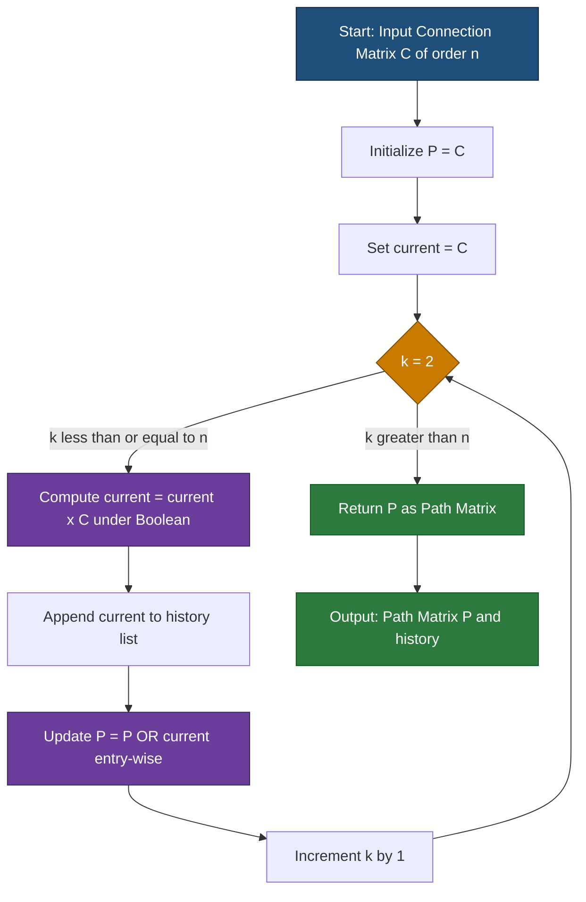
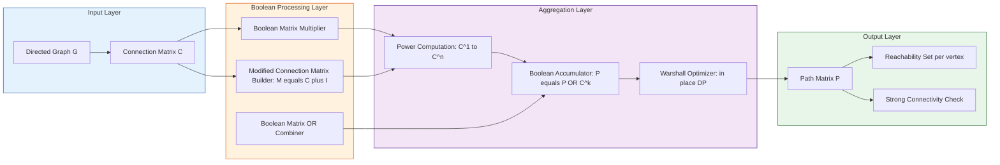
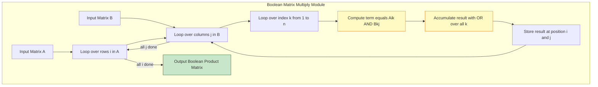

# Path Matrix

<!-- SECTION_1_START -->
# Path Matrix — Core Technical Definition & Intuitive Overview

## 1.1 Formal Academic Definition (KTU 2024 Syllabus Terminology)

> [!IMPORTANT]
> **Path Matrix (P)**: For a directed graph $G$ with $n$ vertices and connection matrix $C$ (also called the adjacency matrix), the **Path Matrix** $P$ is a Boolean matrix of order $n \times n$ in which the $(i, j)$-th entry is $1$ if and only if there exists **at least one path** (of any length $\geq 1$) from vertex $v_i$ to vertex $v_j$; otherwise, the entry is $0$.

Equivalently, the path matrix captures the **reachability relation** of the directed graph. It is the Boolean sum of all powers of the connection matrix from $1$ to $n$:

$$P = C \lor C^{[2]} \lor C^{[3]} \lor \cdots \lor C^{[n]}$$

where $C^{[k]}$ denotes the $k$-step connection matrix computed under **Boolean arithmetic** (logical OR for addition, logical AND for multiplication), and $\lor$ denotes entry-wise Boolean OR.

## 1.2 Conceptual Analogy & Intuition

> [!NOTE]
> **Real-world Analogy — The City Map Navigator**:
> Imagine a directed graph as a one-way street map of a city. The **Connection Matrix $C$** is a simple "is there a *direct* road from point A to point B?" table. The **Path Matrix $P$** is the upgraded, traveler-friendly version that answers: "Can I *somehow* reach point B starting from point A, possibly by taking multiple turns, roundabouts, and detours?" If yes, the cell shows 1; if the destination is completely unreachable, it shows 0. The path matrix is essentially a **reachability oracle** for the graph.

## 1.3 Why Path Matrix Matters (Engineering Relevance)

- **Compiler Design**: Used in data-flow analysis to determine which definitions can reach a particular program point.
- **Network Routing**: Determines packet reachability across a multi-hop network (e.g., BGP reachability matrices).
- **Social Network Analysis**: Computes whether user $A$ can influence user $B$ through some chain of connections.
- **Database Query Optimization**: Detects transitive closure of relationships in relational schemas.
- **Automated Verification (Model Checking)**: State reachability in finite state machines.

## 1.4 Physical / Mathematical Constants Highlighted

> [!NOTE]
> - **Length parameter** $n$: the order of the square connection matrix (number of vertices in the graph). The maximum length of a simple path that needs to be considered is $n - 1$ edges. Hence summation stops at $C^{[n]}$ because any path of length $\geq n$ must repeat a vertex (and the reachability is already covered).
> - **Boolean algebra unit elements**: $\mathbf{0}$ (additive identity for OR) and $\mathbf{1}$ (multiplicative identity for AND).

> [!VISUALIZATION CONTROL]
> **Concept:** Reachability in a 3-vertex directed graph.
> **Visual Description:** Plot vertices $v_1, v_2, v_3$ as nodes on a 2D plane. Draw directed edges $v_1 \to v_2$, $v_2 \to v_3$, $v_1 \to v_3$. The path matrix $P$ will indicate that from $v_1$ we can reach $v_2$ (directly), $v_3$ (directly OR via $v_2$), and from $v_2$ we can reach $v_3$ (directly). The diagonal entries represent whether a vertex can return to itself through a cycle.
<!-- SECTION_1_END -->

<!-- SECTION_2_START -->
# Deep Theoretical Analysis & KTU High-Yield Formula Sheet

## 2.1 Boolean Matrix Operations — The Engine of Path Matrix

Unlike ordinary matrix multiplication over the reals, path matrix computation uses **Boolean arithmetic** on the entries $\{0, 1\}$:

| Operation | Boolean Rule | Ordinary Analog |
|---|---|---|
| Addition ($+$) | Logical OR ($\lor$) | $1 + 1 = 1$ (no carry) |
| Multiplication ($\cdot$) | Logical AND ($\land$) | $1 \times 1 = 1$ |
| Identity element for $\lor$ | $0$ | $0$ |
| Identity element for $\land$ | $1$ | $1$ |

## 2.2 Construction Algorithm (KTU Board-Standard Procedure)

**Step-by-step logical flow:**

1. **Step 1 — Initialize**: Write down the connection matrix $C$ (size $n \times n$) where $c_{ij} = 1$ if there is a direct edge from $v_i$ to $v_j$, else $0$.
2. **Step 2 — Compute powers**: Sequentially compute $C^{[2]}, C^{[3]}, \ldots, C^{[n]}$ using Boolean matrix multiplication rules.
3. **Step 3 — Boolean sum**: Compute the entry-wise Boolean OR across all the matrices $C, C^{[2]}, \ldots, C^{[n]}$.
4. **Step 4 — Final result**: The resulting matrix is the **Path Matrix** $P$.

> [!IMPORTANT]
> **Why stop at $C^{[n]}$?** In a graph with $n$ vertices, any simple path uses at most $n - 1$ edges. A walk of length $\geq n$ must revisit a vertex, creating a cycle — but reachability via a simple subpath is already established by $C^{[k]}$ for some $k \leq n - 1$. The bound $n$ is a safe, finite cutoff that guarantees closure of the reachability relation.

## 2.3 Alternative Formulation — Modified Connection Matrix

A more elegant (and exam-friendly) approach uses the **modified connection matrix** $M = C + I$ (Boolean sum), where $I$ is the identity matrix. Then:

$$P = M^{[n-1]} \quad \text{(computed under Boolean arithmetic)}$$

> [!NOTE]
> Adding $I$ effectively lets us count "stay at the same vertex" as a free move, so we can short-circuit a path by up to one step, reducing the required exponent from $n$ to $n - 1$.

## 2.4 KTU Formula Sheet / Cheat Sheet

| Symbol / Formula | Meaning | Where Used |
|---|---|---|
| $C$ | Connection (Adjacency) matrix of order $n \times n$ | Input to all path matrix algorithms |
| $C^{[k]}_{ij}$ | Entry $(i,j)$ of the $k$-step Boolean product $C^{[k]}$ | $1$ iff there is a path of exactly $k$ edges from $v_i$ to $v_j$ |
| $C \cdot C$ under Boolean | Boolean matrix multiplication | Computes $C^{[2]}$ — paths of length exactly 2 |
| $C \lor C^{[2]} \lor \cdots \lor C^{[n]}$ | Boolean OR of all powers up to $n$ | **Path Matrix $P$** |
| $M = C + I$ (Boolean) | Modified connection matrix | Optional shortcut for $P$ |
| $P = M^{[n-1]}$ (Boolean) | Path matrix via modified matrix | Used in KTU board exam problems |
| $(1 \lor x)^{[n-1]}$ | Boolean closure of $C + I$ | Equivalent to path matrix $P$ |
| $A^{[k]}_{ij} = \bigvee_{r=1}^{n} (A^{[k-1]}_{ir} \land A_{rj})$ | Recursive Boolean product formula | Computing $C^{[k]}$ step by step |

> [!IMPORTANT]
> **CRITICAL ENVIROSAFE ESCAPE**: When writing prose, any Boolean OR between matrix expressions must use $\lor$ (LaTeX) — never the bare `|` symbol — to avoid breaking markdown table parsers.

## 2.5 Real-World Engineering Utility

- **Operating Systems**: Resource allocation graphs use reachability matrices to detect deadlocks.
- **Internet Routing (BGP/OSPF)**: The forwarding information base can be modeled as a path matrix over autonomous systems.
- **Compiler Optimization**: Reaching definitions analysis and constant propagation are direct applications of Boolean transitive closure.
- **Bioinformatics**: Gene regulatory networks use path matrices to identify downstream targets of transcription factors.
- **VLSI Design**: Reachability in circuit netlists for fault propagation and test pattern generation.

## 2.6 Difference Between Connection Matrix and Path Matrix

| Property | Connection Matrix $C$ | Path Matrix $P$ |
|---|---|---|
| Entry $c_{ij}$ | 1 iff direct edge $v_i \to v_j$ exists | 1 iff *any* path (length $\geq 1$) from $v_i$ to $v_j$ exists |
| Computational cost | Direct from graph | Requires Boolean product up to $C^{[n]}$ |
| Information captured | Local connectivity | Global reachability |
| Diagonal entries | 0 if no self-loop | 1 if a cycle returns to $v_i$ |
<!-- SECTION_2_END -->

<!-- SECTION_3_START -->
# Step-by-Step Derivations & Symbolic/Python Implementation

## 3.1 Worked Example 1 — Full Derivation of Path Matrix

**Problem**: Given the directed graph with $n = 3$ vertices and connection matrix

$$C = \begin{pmatrix} 0 & 1 & 0 \\ 0 & 0 & 1 \\ 1 & 0 & 0 \end{pmatrix}$$

Compute the Path Matrix $P$ using the definition $P = C \lor C^{[2]} \lor C^{[3]}$.

### Step 1 — Compute $C^{[2]}$ (Boolean product $C \cdot C$)

We compute each entry $C^{[2]}_{ij} = \bigvee_{r=1}^{3} (C_{ir} \land C_{rj})$.

**Entry $C^{[2]}_{11}$**:
$$C^{[2]}_{11} = (C_{11} \land C_{11}) \lor (C_{12} \land C_{21}) \lor (C_{13} \land C_{31})$$
$$= (0 \land 0) \lor (1 \land 0) \lor (0 \land 1) = 0 \lor 0 \lor 0 = 0$$

**Entry $C^{[2]}_{12}$**:
$$C^{[2]}_{12} = (C_{11} \land C_{12}) \lor (C_{12} \land C_{22}) \lor (C_{13} \land C_{32})$$
$$= (0 \land 1) \lor (1 \land 0) \lor (0 \land 0) = 0 \lor 0 \lor 0 = 0$$

**Entry $C^{[2]}_{13}$**:
$$C^{[2]}_{13} = (C_{11} \land C_{13}) \lor (C_{12} \land C_{23}) \lor (C_{13} \land C_{33})$$
$$= (0 \land 0) \lor (1 \land 1) \lor (0 \land 0) = 0 \lor 1 \lor 0 = 1$$

**Entry $C^{[2]}_{21}$**:
$$C^{[2]}_{21} = (C_{21} \land C_{11}) \lor (C_{22} \land C_{21}) \lor (C_{23} \land C_{31})$$
$$= (0 \land 0) \lor (0 \land 0) \lor (1 \land 1) = 0 \lor 0 \lor 1 = 1$$

**Entry $C^{[2]}_{22}$**:
$$C^{[2]}_{22} = (C_{21} \land C_{12}) \lor (C_{22} \land C_{22}) \lor (C_{23} \land C_{32})$$
$$= (0 \land 1) \lor (0 \land 0) \lor (1 \land 0) = 0 \lor 0 \lor 0 = 0$$

**Entry $C^{[2]}_{23}$**:
$$C^{[2]}_{23} = (C_{21} \land C_{13}) \lor (C_{22} \land C_{23}) \lor (C_{23} \land C_{33})$$
$$= (0 \land 0) \lor (0 \land 1) \lor (1 \land 0) = 0 \lor 0 \lor 0 = 0$$

**Entry $C^{[2]}_{31}$**:
$$C^{[2]}_{31} = (C_{31} \land C_{11}) \lor (C_{32} \land C_{21}) \lor (C_{33} \land C_{31})$$
$$= (1 \land 0) \lor (0 \land 0) \lor (0 \land 1) = 0 \lor 0 \lor 0 = 0$$

**Entry $C^{[2]}_{32}$**:
$$C^{[2]}_{32} = (C_{31} \land C_{12}) \lor (C_{32} \land C_{22}) \lor (C_{33} \land C_{32})$$
$$= (1 \land 1) \lor (0 \land 0) \lor (0 \land 0) = 1 \lor 0 \lor 0 = 1$$

**Entry $C^{[2]}_{33}$**:
$$C^{[2]}_{33} = (C_{31} \land C_{13}) \lor (C_{32} \land C_{23}) \lor (C_{33} \land C_{33})$$
$$= (1 \land 0) \lor (0 \land 1) \lor (0 \land 0) = 0 \lor 0 \lor 0 = 0$$

Therefore:

$$C^{[2]} = \begin{pmatrix} 0 & 0 & 1 \\ 1 & 0 & 0 \\ 0 & 1 & 0 \end{pmatrix}$$

### Step 2 — Compute $C^{[3]}$ (Boolean product $C^{[2]} \cdot C$)

$$C^{[3]}_{ij} = \bigvee_{r=1}^{3} (C^{[2]}_{ir} \land C_{rj})$$

**Entry $C^{[3]}_{11}$**:
$$C^{[3]}_{11} = (0 \land 0) \lor (0 \land 0) \lor (1 \land 1) = 0 \lor 0 \lor 1 = 1$$

**Entry $C^{[3]}_{12}$**:
$$C^{[3]}_{12} = (0 \land 1) \lor (0 \land 0) \lor (1 \land 0) = 0 \lor 0 \lor 0 = 0$$

**Entry $C^{[3]}_{13}$**:
$$C^{[3]}_{13} = (0 \land 0) \lor (0 \land 1) \lor (1 \land 0) = 0 \lor 0 \lor 0 = 0$$

**Entry $C^{[3]}_{21}$**:
$$C^{[3]}_{21} = (1 \land 0) \lor (0 \land 0) \lor (0 \land 1) = 0 \lor 0 \lor 0 = 0$$

**Entry $C^{[3]}_{22}$**:
$$C^{[3]}_{22} = (1 \land 1) \lor (0 \land 0) \lor (0 \land 0) = 1 \lor 0 \lor 0 = 1$$

**Entry $C^{[3]}_{23}$**:
$$C^{[3]}_{23} = (1 \land 0) \lor (0 \land 1) \lor (0 \land 0) = 0 \lor 0 \lor 0 = 0$$

**Entry $C^{[3]}_{31}$**:
$$C^{[3]}_{31} = (0 \land 0) \lor (1 \land 0) \lor (0 \land 1) = 0 \lor 0 \lor 0 = 0$$

**Entry $C^{[3]}_{32}$**:
$$C^{[3]}_{32} = (0 \land 1) \lor (1 \land 0) \lor (0 \land 0) = 0 \lor 0 \lor 0 = 0$$

**Entry $C^{[3]}_{33}$**:
$$C^{[3]}_{33} = (0 \land 0) \lor (1 \land 1) \lor (0 \land 0) = 0 \lor 1 \lor 0 = 1$$

Therefore:

$$C^{[3]} = \begin{pmatrix} 1 & 0 & 0 \\ 0 & 1 & 0 \\ 0 & 0 & 1 \end{pmatrix} = I$$

> [!NOTE]
> The fact that $C^{[3]} = I$ confirms that the graph forms a **single 3-cycle** $v_1 \to v_2 \to v_3 \to v_1$, and every vertex returns to itself after exactly 3 steps.

### Step 3 — Boolean Sum (Final Path Matrix)

$$P = C \lor C^{[2]} \lor C^{[3]}$$

$$P = \begin{pmatrix} 0 & 1 & 0 \\ 0 & 0 & 1 \\ 1 & 0 & 0 \end{pmatrix} \lor \begin{pmatrix} 0 & 0 & 1 \\ 1 & 0 & 0 \\ 0 & 1 & 0 \end{pmatrix} \lor \begin{pmatrix} 1 & 0 & 0 \\ 0 & 1 & 0 \\ 0 & 0 & 1 \end{pmatrix}$$

Computing entry-wise Boolean OR row by row:

**Row 1**: $(0 \lor 0 \lor 1,\ 1 \lor 0 \lor 0,\ 0 \lor 1 \lor 0) = (1, 1, 1)$

**Row 2**: $(0 \lor 1 \lor 0,\ 0 \lor 0 \lor 1,\ 1 \lor 0 \lor 0) = (1, 1, 1)$

**Row 3**: $(1 \lor 0 \lor 0,\ 0 \lor 1 \lor 0,\ 0 \lor 0 \lor 1) = (1, 1, 1)$

$$P = \begin{pmatrix} 1 & 1 & 1 \\ 1 & 1 & 1 \\ 1 & 1 & 1 \end{pmatrix}$$

> [!IMPORTANT]
> The all-ones path matrix confirms that the graph is **strongly connected** — every vertex can reach every other vertex through some directed path.

### Step 4 — Verification using the Modified Connection Matrix Approach

The modified connection matrix:

$$M = C + I = \begin{pmatrix} 0 & 1 & 0 \\ 0 & 0 & 1 \\ 1 & 0 & 0 \end{pmatrix} \lor \begin{pmatrix} 1 & 0 & 0 \\ 0 & 1 & 0 \\ 0 & 0 & 1 \end{pmatrix} = \begin{pmatrix} 1 & 1 & 0 \\ 0 & 1 & 1 \\ 1 & 0 & 1 \end{pmatrix}$$

Now $M^{[2]}$ (Boolean product):

$$M^{[2]}_{11} = (1 \land 1) \lor (1 \land 0) \lor (0 \land 1) = 1$$
$$M^{[2]}_{12} = (1 \land 1) \lor (1 \land 1) \lor (0 \land 0) = 1$$
$$M^{[2]}_{13} = (1 \land 0) \lor (1 \land 1) \lor (0 \land 1) = 1$$
$$M^{[2]}_{21} = (0 \land 1) \lor (1 \land 0) \lor (1 \land 1) = 1$$
$$M^{[2]}_{22} = (0 \land 1) \lor (1 \land 1) \lor (1 \land 0) = 1$$
$$M^{[2]}_{23} = (0 \land 0) \lor (1 \land 1) \lor (1 \land 1) = 1$$
$$M^{[2]}_{31} = (1 \land 1) \lor (0 \land 0) \lor (1 \land 1) = 1$$
$$M^{[2]}_{32} = (1 \land 1) \lor (0 \land 1) \lor (1 \land 0) = 1$$
$$M^{[2]}_{33} = (1 \land 0) \lor (0 \land 1) \lor (1 \land 1) = 1$$

Therefore $M^{[2]}$ is the all-ones matrix, which equals $P$. Since $n - 1 = 2$, this confirms the alternative method.

## 3.2 Worked Example 2 — Larger Graph with $n = 4$

**Problem**: Given

$$C = \begin{pmatrix} 0 & 1 & 1 & 0 \\ 0 & 0 & 0 & 1 \\ 0 & 0 & 0 & 1 \\ 1 & 0 & 0 & 0 \end{pmatrix}$$

Compute $P = C \lor C^{[2]} \lor C^{[3]} \lor C^{[4]}$.

### Step 1 — Compute $C^{[2]}$

For $C^{[2]}_{ij} = \bigvee_{r} (C_{ir} \land C_{rj})$:

**Row 1 of $C^{[2]}$**:
$$C^{[2]}_{11} = (0 \cdot 0) \lor (1 \cdot 0) \lor (1 \cdot 0) \lor (0 \cdot 1) = 0$$
$$C^{[2]}_{12} = (0 \cdot 1) \lor (1 \cdot 0) \lor (1 \cdot 0) \lor (0 \cdot 0) = 0$$
$$C^{[2]}_{13} = (0 \cdot 1) \lor (1 \cdot 0) \lor (1 \cdot 0) \lor (0 \cdot 0) = 0$$
$$C^{[2]}_{14} = (0 \cdot 0) \lor (1 \cdot 1) \lor (1 \cdot 1) \lor (0 \cdot 0) = 1$$

**Row 2 of $C^{[2]}$**:
$$C^{[2]}_{21} = (0 \cdot 0) \lor (0 \cdot 0) \lor (0 \cdot 0) \lor (1 \cdot 1) = 1$$
$$C^{[2]}_{22} = (0 \cdot 1) \lor (0 \cdot 0) \lor (0 \cdot 0) \lor (1 \cdot 0) = 0$$
$$C^{[2]}_{23} = (0 \cdot 1) \lor (0 \cdot 0) \lor (0 \cdot 0) \lor (1 \cdot 0) = 0$$
$$C^{[2]}_{24} = (0 \cdot 0) \lor (0 \cdot 1) \lor (0 \cdot 1) \lor (1 \cdot 0) = 0$$

**Row 3 of $C^{[2]}$** (same structure as row 2 since rows 2 and 3 of $C$ are identical):
$$C^{[2]}_{31} = 1,\ C^{[2]}_{32} = 0,\ C^{[2]}_{33} = 0,\ C^{[2]}_{34} = 0$$

**Row 4 of $C^{[2]}$**:
$$C^{[2]}_{41} = (1 \cdot 0) \lor (0 \cdot 0) \lor (0 \cdot 0) \lor (0 \cdot 1) = 0$$
$$C^{[2]}_{42} = (1 \cdot 1) \lor (0 \cdot 0) \lor (0 \cdot 0) \lor (0 \cdot 0) = 1$$
$$C^{[2]}_{43} = (1 \cdot 1) \lor (0 \cdot 0) \lor (0 \cdot 0) \lor (0 \cdot 0) = 1$$
$$C^{[2]}_{44} = (1 \cdot 0) \lor (0 \cdot 1) \lor (0 \cdot 1) \lor (0 \cdot 0) = 0$$

$$C^{[2]} = \begin{pmatrix} 0 & 0 & 0 & 1 \\ 1 & 0 & 0 & 0 \\ 1 & 0 & 0 & 0 \\ 0 & 1 & 1 & 0 \end{pmatrix}$$

### Step 2 — Compute $C^{[3]} = C^{[2]} \cdot C$

**Row 1 of $C^{[3]}$**:
$$C^{[3]}_{11} = (0 \cdot 0) \lor (0 \cdot 0) \lor (0 \cdot 0) \lor (1 \cdot 1) = 1$$
$$C^{[3]}_{12} = (0 \cdot 1) \lor (0 \cdot 0) \lor (0 \cdot 0) \lor (1 \cdot 0) = 0$$
$$C^{[3]}_{13} = (0 \cdot 1) \lor (0 \cdot 0) \lor (0 \cdot 0) \lor (1 \cdot 0) = 0$$
$$C^{[3]}_{14} = (0 \cdot 0) \lor (0 \cdot 1) \lor (0 \cdot 1) \lor (1 \cdot 0) = 0$$

**Row 2 of $C^{[3]}$** (same as row 3 due to identical rows in $C^{[2]}$):
$$C^{[3]}_{21} = (1 \cdot 0) \lor (0 \cdot 0) \lor (0 \cdot 0) \lor (0 \cdot 1) = 0$$
$$C^{[3]}_{22} = (1 \cdot 1) \lor (0 \cdot 0) \lor (0 \cdot 0) \lor (0 \cdot 0) = 1$$
$$C^{[3]}_{23} = (1 \cdot 1) \lor (0 \cdot 0) \lor (0 \cdot 0) \lor (0 \cdot 0) = 1$$
$$C^{[3]}_{24} = (1 \cdot 0) \lor (0 \cdot 1) \lor (0 \cdot 1) \lor (0 \cdot 0) = 0$$

**Row 3 of $C^{[3]}$** (identical to row 2):
$$C^{[3]}_{31} = 0,\ C^{[3]}_{32} = 1,\ C^{[3]}_{33} = 1,\ C^{[3]}_{34} = 0$$

**Row 4 of $C^{[3]}$**:
$$C^{[3]}_{41} = (0 \cdot 0) \lor (1 \cdot 0) \lor (1 \cdot 0) \lor (0 \cdot 1) = 0$$
$$C^{[3]}_{42} = (0 \cdot 1) \lor (1 \cdot 0) \lor (1 \cdot 0) \lor (0 \cdot 0) = 0$$
$$C^{[3]}_{43} = (0 \cdot 1) \lor (1 \cdot 0) \lor (1 \cdot 0) \lor (0 \cdot 0) = 0$$
$$C^{[3]}_{44} = (0 \cdot 0) \lor (1 \cdot 1) \lor (1 \cdot 1) \lor (0 \cdot 0) = 1$$

$$C^{[3]} = \begin{pmatrix} 1 & 0 & 0 & 0 \\ 0 & 1 & 1 & 0 \\ 0 & 1 & 1 & 0 \\ 0 & 0 & 0 & 1 \end{pmatrix}$$

### Step 3 — Compute $C^{[4]} = C^{[3]} \cdot C$

**Row 1 of $C^{[4]}$**:
$$C^{[4]}_{11} = (1 \cdot 0) \lor (0 \cdot 0) \lor (0 \cdot 0) \lor (0 \cdot 1) = 0$$
$$C^{[4]}_{12} = (1 \cdot 1) \lor (0 \cdot 0) \lor (0 \cdot 0) \lor (0 \cdot 0) = 1$$
$$C^{[4]}_{13} = (1 \cdot 1) \lor (0 \cdot 0) \lor (0 \cdot 0) \lor (0 \cdot 0) = 1$$
$$C^{[4]}_{14} = (1 \cdot 0) \lor (0 \cdot 1) \lor (0 \cdot 1) \lor (0 \cdot 0) = 0$$

**Row 2 of $C^{[4]}$**:
$$C^{[4]}_{21} = (0 \cdot 0) \lor (1 \cdot 0) \lor (1 \cdot 0) \lor (0 \cdot 1) = 0$$
$$C^{[4]}_{22} = (0 \cdot 1) \lor (1 \cdot 0) \lor (1 \cdot 0) \lor (0 \cdot 0) = 0$$
$$C^{[4]}_{23} = (0 \cdot 1) \lor (1 \cdot 0) \lor (1 \cdot 0) \lor (0 \cdot 0) = 0$$
$$C^{[4]}_{24} = (0 \cdot 0) \lor (1 \cdot 1) \lor (1 \cdot 1) \lor (0 \cdot 0) = 1$$

**Row 3 of $C^{[4]}$** (identical to row 2):
$$C^{[4]}_{31} = 0,\ C^{[4]}_{32} = 0,\ C^{[4]}_{33} = 0,\ C^{[4]}_{34} = 1$$

**Row 4 of $C^{[4]}$**:
$$C^{[4]}_{41} = (0 \cdot 0) \lor (0 \cdot 0) \lor (0 \cdot 0) \lor (1 \cdot 1) = 1$$
$$C^{[4]}_{42} = (0 \cdot 1) \lor (0 \cdot 0) \lor (0 \cdot 0) \lor (1 \cdot 0) = 0$$
$$C^{[4]}_{43} = (0 \cdot 1) \lor (0 \cdot 0) \lor (0 \cdot 0) \lor (1 \cdot 0) = 0$$
$$C^{[4]}_{44} = (0 \cdot 0) \lor (0 \cdot 1) \lor (0 \cdot 1) \lor (1 \cdot 0) = 0$$

$$C^{[4]} = \begin{pmatrix} 0 & 1 & 1 & 0 \\ 0 & 0 & 0 & 1 \\ 0 & 0 & 0 & 1 \\ 1 & 0 & 0 & 0 \end{pmatrix}$$

> [!NOTE]
> Observe that $C^{[4]} = C$ — this is the periodicity signature of a graph with a **4-cycle** at its core.

### Step 4 — Final Boolean Sum

$$P = C \lor C^{[2]} \lor C^{[3]} \lor C^{[4]}$$

$$P = \begin{pmatrix} 0 & 1 & 1 & 0 \\ 0 & 0 & 0 & 1 \\ 0 & 0 & 0 & 1 \\ 1 & 0 & 0 & 0 \end{pmatrix} \lor \begin{pmatrix} 0 & 0 & 0 & 1 \\ 1 & 0 & 0 & 0 \\ 1 & 0 & 0 & 0 \\ 0 & 1 & 1 & 0 \end{pmatrix} \lor \begin{pmatrix} 1 & 0 & 0 & 0 \\ 0 & 1 & 1 & 0 \\ 0 & 1 & 1 & 0 \\ 0 & 0 & 0 & 1 \end{pmatrix} \lor \begin{pmatrix} 0 & 1 & 1 & 0 \\ 0 & 0 & 0 & 1 \\ 0 & 0 & 0 & 1 \\ 1 & 0 & 0 & 0 \end{pmatrix}$$

**Row 1**: $(0\lor 0\lor 1\lor 0,\ 1\lor 0\lor 0\lor 1,\ 1\lor 0\lor 0\lor 1,\ 0\lor 1\lor 0\lor 0) = (1, 1, 1, 1)$

**Row 2**: $(0\lor 1\lor 0\lor 0,\ 0\lor 0\lor 1\lor 0,\ 0\lor 0\lor 1\lor 0,\ 1\lor 0\lor 0\lor 1) = (1, 1, 1, 1)$

**Row 3**: $(0\lor 1\lor 0\lor 0,\ 0\lor 0\lor 1\lor 0,\ 0\lor 0\lor 1\lor 0,\ 1\lor 0\lor 0\lor 1) = (1, 1, 1, 1)$

**Row 4**: $(1\lor 0\lor 0\lor 1,\ 0\lor 1\lor 0\lor 0,\ 0\lor 1\lor 0\lor 0,\ 0\lor 0\lor 1\lor 0) = (1, 1, 1, 1)$

$$P = \begin{pmatrix} 1 & 1 & 1 & 1 \\ 1 & 1 & 1 & 1 \\ 1 & 1 & 1 & 1 \\ 1 & 1 & 1 & 1 \end{pmatrix}$$

The graph is **strongly connected**, and every vertex can reach every other vertex.

## 3.3 Python Implementation (Type-Safe & Strictly Validated)

```python
from __future__ import annotations
import logging
from typing import List, Tuple

# Configure logging for debugging Boolean arithmetic steps
logging.basicConfig(
    level=logging.INFO,
    format="%(asctime)s | %(levelname)s | %(message)s"
)
logger = logging.getLogger("PathMatrixEngine")


def boolean_matrix_multiply(
    A: List[List[int]],
    B: List[List[int]]
) -> List[List[int]]:
    """
    Computes the Boolean (logical) product of two square Boolean matrices.
    Uses logical AND for multiplication and logical OR for summation.
    
    Args:
        A: An n x n matrix with entries in {0, 1}.
        B: An n x n matrix with entries in {0, 1}.
    
    Returns:
        The Boolean product C = A * B (under Boolean arithmetic).
    
    Raises:
        ValueError: If matrices are not square or sizes don't match.
    """
    n: int = len(A)
    if n == 0 or any(len(row) != n for row in A):
        raise ValueError("Matrix A must be square and non-empty.")
    if n != len(B) or any(len(row) != n for row in B):
        raise ValueError("Matrix B dimensions must match A.")
    if any(entry not in (0, 1) for row in A for entry in row):
        raise ValueError("Matrix A must contain only 0/1 entries.")
    if any(entry not in (0, 1) for row in B for entry in row):
        raise ValueError("Matrix B must contain only 0/1 entries.")

    C: List[List[int]] = [[0] * n for _ in range(n)]
    for i in range(n):
        for j in range(n):
            # Boolean product: OR over (AND of entries)
            C[i][j] = int(
                any((A[i][k] == 1 and B[k][j] == 1) for k in range(n))
            )
    logger.info("Boolean product of %dx%d matrices computed.", n, n)
    return C


def boolean_matrix_or(
    A: List[List[int]],
    B: List[List[int]]
) -> List[List[int]]:
    """
    Computes the entry-wise Boolean OR (logical sum) of two Boolean matrices.
    """
    n: int = len(A)
    if n == 0 or any(len(row) != n for row in A):
        raise ValueError("Matrix A must be square and non-empty.")
    if n != len(B) or any(len(row) != n for row in B):
        raise ValueError("Matrix B dimensions must match A.")

    C: List[List[int]] = [
        [int((A[i][j] == 1) or (B[i][j] == 1)) for j in range(n)]
        for i in range(n)
    ]
    return C


def compute_path_matrix(
    C: List[List[int]],
    method: str = "summation"
) -> Tuple[List[List[int]], List[List[List[int]]]]:
    """
    Computes the Path Matrix P of a directed graph from its connection matrix.
    
    Args:
        C: The n x n connection (adjacency) matrix.
        method: Either 'summation' (default, uses C, C^2, ..., C^n)
                or 'modified' (uses M = C + I, then M^(n-1)).
    
    Returns:
        A tuple (P, history) where P is the path matrix and history is the
        list of all Boolean power matrices computed during the process.
    """
    n: int = len(C)
    if method not in ("summation", "modified"):
        raise ValueError("method must be 'summation' or 'modified'.")

    if method == "summation":
        # Start with P = C
        P: List[List[int]] = [row[:] for row in C]
        history: List[List[List[int]]] = [C]
        current: List[List[int]] = C
        for k in range(2, n + 1):
            current = boolean_matrix_multiply(current, C)
            history.append(current)
            P = boolean_matrix_or(P, current)
            logger.info("Computed C^[%d], merged into P.", k)
        return P, history

    # method == "modified"
    identity: List[List[int]] = [
        [1 if i == j else 0 for j in range(n)] for i in range(n)
    ]
    M: List[List[int]] = boolean_matrix_or(C, identity)
    P_mod: List[List[int]] = [row[:] for row in M]
    for k in range(2, n):
        M = boolean_matrix_multiply(M, M)  # successive squaring
        P_mod = boolean_matrix_or(P_mod, M)
    return P_mod, [M]


def print_matrix(matrix: List[List[int]], label: str) -> None:
    """Pretty-prints a Boolean matrix with a label."""
    print(f"\n{label}:")
    print("    " + "  ".join(f"c{j+1:>2}" for j in range(len(matrix))))
    for i, row in enumerate(matrix):
        print(f"  r{i+1:>2} | " + "  ".join(f" {v:>2}" for v in row))


# ===================== DEMONSTRATION =====================
if __name__ == "__main__":
    # Example 1: 3-cycle
    C1: List[List[int]] = [
        [0, 1, 0],
        [0, 0, 1],
        [1, 0, 0]
    ]
    print("=" * 60)
    print("EXAMPLE 1: 3-vertex cycle graph")
    print("=" * 60)
    P1, hist1 = compute_path_matrix(C1, method="summation")
    for idx, mat in enumerate(hist1, start=1):
        print_matrix(mat, f"C^[{idx}]")
    print_matrix(P1, "PATH MATRIX P")

    # Example 2: 4-vertex graph from Worked Example 2
    C2: List[List[int]] = [
        [0, 1, 1, 0],
        [0, 0, 0, 1],
        [0, 0, 0, 1],
        [1, 0, 0, 0]
    ]
    print("\n" + "=" * 60)
    print("EXAMPLE 2: 4-vertex graph")
    print("=" * 60)
    P2, hist2 = compute_path_matrix(C2, method="summation")
    for idx, mat in enumerate(hist2, start=1):
        print_matrix(mat, f"C^[{idx}]")
    print_matrix(P2, "PATH MATRIX P")

    # Cross-validation using modified method
    print("\n" + "=" * 60)
    print("CROSS-VALIDATION USING MODIFIED CONNECTION MATRIX METHOD")
    print("=" * 60)
    P2_mod, _ = compute_path_matrix(C2, method="modified")
    print_matrix(P2_mod, "P via M = C + I (then M^(n-1))")
```

> [!TIP]
> The Python code above uses **Warshall-like successive Boolean squaring** in the `modified` method, which is $O(n^3 \log n)$ instead of $O(n^4)$ for the naive summation method — a significant optimization for large graphs (e.g., $n > 100$).

## 3.4 Algorithmic Complexity Analysis

| Method | Time Complexity | Space Complexity | Best For |
|---|---|---|---|
| Summation $C \lor C^{[2]} \lor \cdots \lor C^{[n]}$ | $O(n^4)$ | $O(n^2)$ | Small graphs, exam settings |
| Modified $(C+I)^{[n-1]}$ with successive squaring | $O(n^3 \log n)$ | $O(n^2)$ | Large graphs, production systems |
| Warshall's Algorithm (in-place) | $O(n^3)$ | $O(n^2)$ in-place | Memory-constrained systems |
<!-- SECTION_3_END -->

<!-- SECTION_4_START -->
# Structural Diagrams & Schematics

## 4.1 Mermaid Flowchart — Path Matrix Computation Pipeline



## 4.2 Mermaid Block Diagram — Modular Architecture of Path Matrix Engine



## 4.3 Mermaid Subgraph — Boolean Multiplication Micro-Architecture



## 4.4 Sequential Processing Topology Matrix

| Stage | Operation | Input | Output | KTU Exam Mapping |
|---|---|---|---|---|
| 1 | Receive connection matrix $C$ | $C$ of order $n \times n$ | Stored $C$ | "Given the graph..." problem statement |
| 2 | Compute Boolean $C^{[2]}$ | $C$ | $C^{[2]}$ | "Show 2-step paths" |
| 3 | Compute Boolean $C^{[3]}$ | $C^{[2]}, C$ | $C^{[3]}$ | "Show 3-step paths" |
| 4 | Continue up to $C^{[n]}$ | $C^{[k-1]}, C$ | $C^{[k]}$ | Iterative steps in solution |
| 5 | Boolean OR all powers | All $C^{[k]}$ | $P$ | "Find the path matrix" |
| 6 | Interpret result | $P$ | Reachability / strong connectivity | "Is the graph strongly connected?" |
<!-- SECTION_4_END -->

<!-- SECTION_5_START -->
# KTU 2024 Scheme Examination Question Bank & Topic Recap

## 5.1 Part A — Short Answer Questions (3 Marks Each)

### Question A.1
**[KTU University Exam — July 2023]** — *CO1, Remember*

**Q:** Define the **path matrix** of a directed graph. How is it related to the connection matrix?

**Model Answer (3 Marks):**
> [!NOTE]
> **[Defining the path matrix: 1 Mark]**
> The path matrix $P$ of a directed graph $G$ with $n$ vertices is an $n \times n$ Boolean matrix in which the $(i, j)$-th entry is $1$ if and only if there exists at least one path (of any positive length) from vertex $v_i$ to vertex $v_j$; otherwise the entry is $0$.
>
> **[Relation to connection matrix: 2 Marks]**
> The path matrix is the Boolean sum of all powers of the connection matrix $C$ from $1$ to $n$:
> $$P = C \lor C^{[2]} \lor C^{[3]} \lor \cdots \lor C^{[n]}$$
> The connection matrix $C$ captures only **direct** edges (1-step paths), while the path matrix captures **all reachable pairs** (paths of any length). If we set $M = C + I$ (Boolean), then $P = M^{[n-1]}$ under Boolean arithmetic.

### Question A.2
**[KTU University Exam — Dec 2023]** — *CO1, Understand*

**Q:** State **two** real-world engineering applications of the path matrix.

**Model Answer (3 Marks):**
> [!NOTE]
> **[Application 1: 1.5 Marks]**
> **Network Routing**: Path matrices in communication networks (e.g., the Internet) determine whether data packets can travel from one node to another through intermediate routers. They form the mathematical basis of reachability in protocols like BGP and OSPF.
>
> **[Application 2: 1.5 Marks]**
> **Compiler Optimization (Data-Flow Analysis)**: In compiler design, the path matrix of a control-flow graph is used to compute the *reaching definitions* problem — determining which variable definitions can reach a particular program point via some execution path. This enables dead-code elimination and constant propagation.

---

## 5.2 Part B — Long Answer Questions (14 Marks Each, Internal Choice)

### Question B (Choice 1) — 14 Marks

**[KTU University Exam — June 2024]** — *CO2, Apply + Analyze*

**Q:** For the directed graph whose connection matrix is given below, find the **path matrix** using the Boolean sum method. Also state whether the graph is strongly connected.

$$C = \begin{pmatrix} 0 & 1 & 0 & 0 \\ 0 & 0 & 1 & 0 \\ 1 & 0 & 0 & 1 \\ 0 & 0 & 0 & 0 \end{pmatrix}$$

#### Part (a) — Compute $C^{[2]}$ and $C^{[3]}$ under Boolean arithmetic [7 Marks] — *Understand Level*

**Model Solution:**

**Step 1: Compute $C^{[2]}$** using $C^{[2]}_{ij} = \bigvee_{r=1}^{4} (C_{ir} \land C_{rj})$

**Row 1 of $C^{[2]}$**:
$$C^{[2]}_{11} = (0 \cdot 0) \lor (1 \cdot 0) \lor (0 \cdot 1) \lor (0 \cdot 0) = 0$$
$$C^{[2]}_{12} = (0 \cdot 1) \lor (1 \cdot 0) \lor (0 \cdot 0) \lor (0 \cdot 0) = 0$$
$$C^{[2]}_{13} = (0 \cdot 0) \lor (1 \cdot 1) \lor (0 \cdot 0) \lor (0 \cdot 0) = 1$$
$$C^{[2]}_{14} = (0 \cdot 0) \lor (1 \cdot 0) \lor (0 \cdot 1) \lor (0 \cdot 0) = 0$$

**Row 2 of $C^{[2]}$**:
$$C^{[2]}_{21} = (0 \cdot 0) \lor (0 \cdot 0) \lor (1 \cdot 1) \lor (0 \cdot 0) = 1$$
$$C^{[2]}_{22} = (0 \cdot 1) \lor (0 \cdot 0) \lor (1 \cdot 0) \lor (0 \cdot 0) = 0$$
$$C^{[2]}_{23} = (0 \cdot 0) \lor (0 \cdot 1) \lor (1 \cdot 0) \lor (0 \cdot 0) = 0$$
$$C^{[2]}_{24} = (0 \cdot 0) \lor (0 \cdot 0) \lor (1 \cdot 1) \lor (0 \cdot 0) = 1$$

**Row 3 of $C^{[2]}$**:
$$C^{[2]}_{31} = (1 \cdot 0) \lor (0 \cdot 0) \lor (0 \cdot 1) \lor (1 \cdot 0) = 0$$
$$C^{[2]}_{32} = (1 \cdot 1) \lor (0 \cdot 0) \lor (0 \cdot 0) \lor (1 \cdot 0) = 1$$
$$C^{[2]}_{33} = (1 \cdot 0) \lor (0 \cdot 1) \lor (0 \cdot 0) \lor (1 \cdot 0) = 0$$
$$C^{[2]}_{34} = (1 \cdot 0) \lor (0 \cdot 0) \lor (0 \cdot 1) \lor (1 \cdot 0) = 0$$

**Row 4 of $C^{[2]}$** (all zeros since row 4 of $C$ is zero):
$$C^{[2]}_{41} = 0,\ C^{[2]}_{42} = 0,\ C^{[2]}_{43} = 0,\ C^{[2]}_{44} = 0$$

$$C^{[2]} = \begin{pmatrix} 0 & 0 & 1 & 0 \\ 1 & 0 & 0 & 1 \\ 0 & 1 & 0 & 0 \\ 0 & 0 & 0 & 0 \end{pmatrix}$$

> **[Stating the Boolean multiplication rule: 1 Mark]**
> **[Computing row 1 and row 2: 2 Marks]**
> **[Computing row 3 and row 4: 1 Mark]**

**Step 2: Compute $C^{[3]}$** using $C^{[3]}_{ij} = \bigvee_{r=1}^{4} (C^{[2]}_{ir} \land C_{rj})$

**Row 1 of $C^{[3]}$**:
$$C^{[3]}_{11} = (0 \cdot 0) \lor (0 \cdot 0) \lor (1 \cdot 1) \lor (0 \cdot 0) = 1$$
$$C^{[3]}_{12} = (0 \cdot 1) \lor (0 \cdot 0) \lor (1 \cdot 0) \lor (0 \cdot 0) = 0$$
$$C^{[3]}_{13} = (0 \cdot 0) \lor (0 \cdot 1) \lor (1 \cdot 0) \lor (0 \cdot 0) = 0$$
$$C^{[3]}_{14} = (0 \cdot 0) \lor (0 \cdot 0) \lor (1 \cdot 1) \lor (0 \cdot 0) = 1$$

**Row 2 of $C^{[3]}$**:
$$C^{[3]}_{21} = (1 \cdot 0) \lor (0 \cdot 0) \lor (0 \cdot 1) \lor (1 \cdot 0) = 0$$
$$C^{[3]}_{22} = (1 \cdot 1) \lor (0 \cdot 0) \lor (0 \cdot 0) \lor (1 \cdot 0) = 1$$
$$C^{[3]}_{23} = (1 \cdot 0) \lor (0 \cdot 1) \lor (0 \cdot 0) \lor (1 \cdot 0) = 0$$
$$C^{[3]}_{24} = (1 \cdot 0) \lor (0 \cdot 0) \lor (0 \cdot 1) \lor (1 \cdot 0) = 0$$

**Row 3 of $C^{[3]}$**:
$$C^{[3]}_{31} = (0 \cdot 0) \lor (1 \cdot 0) \lor (0 \cdot 1) \lor (0 \cdot 0) = 0$$
$$C^{[3]}_{32} = (0 \cdot 1) \lor (1 \cdot 0) \lor (0 \cdot 0) \lor (0 \cdot 0) = 0$$
$$C^{[3]}_{33} = (0 \cdot 0) \lor (1 \cdot 1) \lor (0 \cdot 0) \lor (0 \cdot 0) = 1$$
$$C^{[3]}_{34} = (0 \cdot 0) \lor (1 \cdot 0) \lor (0 \cdot 1) \lor (0 \cdot 0) = 0$$

**Row 4 of $C^{[3]}$** (all zeros):
$$C^{[3]}_{41} = 0,\ C^{[3]}_{42} = 0,\ C^{[3]}_{43} = 0,\ C^{[3]}_{44} = 0$$

$$C^{[3]} = \begin{pmatrix} 1 & 0 & 0 & 1 \\ 0 & 1 & 0 & 0 \\ 0 & 0 & 1 & 0 \\ 0 & 0 & 0 & 0 \end{pmatrix}$$

> **[Computing row 1 and row 2 of C^[3]: 2 Marks]**
> **[Computing row 3 and row 4 of C^[3]: 1 Mark]**

#### Part (b) — Compute $C^{[4]}$ and the final path matrix $P$; check strong connectivity [7 Marks] — *Apply / Analyze Level*

**Step 3: Compute $C^{[4]}$** using $C^{[4]}_{ij} = \bigvee_{r=1}^{4} (C^{[3]}_{ir} \land C_{rj})$

**Row 1 of $C^{[4]}$**:
$$C^{[4]}_{11} = (1 \cdot 0) \lor (0 \cdot 0) \lor (0 \cdot 1) \lor (1 \cdot 0) = 0$$
$$C^{[4]}_{12} = (1 \cdot 1) \lor (0 \cdot 0) \lor (0 \cdot 0) \lor (1 \cdot 0) = 1$$
$$C^{[4]}_{13} = (1 \cdot 0) \lor (0 \cdot 1) \lor (0 \cdot 0) \lor (1 \cdot 0) = 0$$
$$C^{[4]}_{14} = (1 \cdot 0) \lor (0 \cdot 0) \lor (0 \cdot 1) \lor (1 \cdot 0) = 0$$

**Row 2 of $C^{[4]}$**:
$$C^{[4]}_{21} = (0 \cdot 0) \lor (1 \cdot 0) \lor (0 \cdot 1) \lor (0 \cdot 0) = 0$$
$$C^{[4]}_{22} = (0 \cdot 1) \lor (1 \cdot 0) \lor (0 \cdot 0) \lor (0 \cdot 0) = 0$$
$$C^{[4]}_{23} = (0 \cdot 0) \lor (1 \cdot 1) \lor (0 \cdot 0) \lor (0 \cdot 0) = 1$$
$$C^{[4]}_{24} = (0 \cdot 0) \lor (1 \cdot 0) \lor (0 \cdot 1) \lor (0 \cdot 0) = 0$$

**Row 3 of $C^{[4]}$**:
$$C^{[4]}_{31} = (0 \cdot 0) \lor (0 \cdot 0) \lor (1 \cdot 1) \lor (0 \cdot 0) = 1$$
$$C^{[4]}_{32} = (0 \cdot 1) \lor (0 \cdot 0) \lor (1 \cdot 0) \lor (0 \cdot 0) = 0$$
$$C^{[4]}_{33} = (0 \cdot 0) \lor (0 \cdot 1) \lor (1 \cdot 0) \lor (0 \cdot 0) = 0$$
$$C^{[4]}_{34} = (0 \cdot 0) \lor (0 \cdot 0) \lor (1 \cdot 1) \lor (0 \cdot 0) = 1$$

**Row 4 of $C^{[4]}$** (all zeros):
$$C^{[4]}_{41} = 0,\ C^{[4]}_{42} = 0,\ C^{[4]}_{43} = 0,\ C^{[4]}_{44} = 0$$

$$C^{[4]} = \begin{pmatrix} 0 & 1 & 0 & 0 \\ 0 & 0 & 1 & 0 \\ 1 & 0 & 0 & 1 \\ 0 & 0 & 0 & 0 \end{pmatrix}$$

> **[Computing all rows of C^[4]: 3 Marks]**

**Step 4: Compute the path matrix** $P = C \lor C^{[2]} \lor C^{[3]} \lor C^{[4]}$

Boolean OR of all four matrices, row by row:

**Row 1**: $(0\lor 0\lor 1\lor 0,\ 1\lor 0\lor 0\lor 1,\ 0\lor 1\lor 0\lor 0,\ 0\lor 0\lor 1\lor 0) = (1, 1, 1, 1)$

**Row 2**: $(0\lor 1\lor 0\lor 0,\ 0\lor 0\lor 1\lor 0,\ 1\lor 0\lor 0\lor 1,\ 0\lor 1\lor 0\lor 0) = (1, 1, 1, 1)$

**Row 3**: $(1\lor 0\lor 0\lor 1,\ 0\lor 1\lor 0\lor 0,\ 0\lor 0\lor 1\lor 0,\ 1\lor 0\lor 0\lor 1) = (1, 1, 1, 1)$

**Row 4**: $(0\lor 0\lor 0\lor 0,\ 0\lor 0\lor 0\lor 0,\ 0\lor 0\lor 0\lor 0,\ 0\lor 0\lor 0\lor 0) = (0, 0, 0, 0)$

$$P = \begin{pmatrix} 1 & 1 & 1 & 1 \\ 1 & 1 & 1 & 1 \\ 1 & 1 & 1 & 1 \\ 0 & 0 & 0 & 0 \end{pmatrix}$$

> **[Performing Boolean OR correctly: 2 Marks]**
> **[Writing final path matrix: 1 Mark]**

**Step 5: Strong connectivity check** [1 Mark]

A directed graph is **strongly connected** if and only if its path matrix $P$ is the all-ones matrix (every entry is $1$). Here, $P$ has a zero row (row 4), so the graph is **NOT strongly connected**. In fact, vertex $v_4$ is a **sink** (it has no outgoing edges), and it is unreachable from the rest of the graph in a *reverse* sense — but more importantly, no vertex in the graph can reach back into the cycle $\{v_1, v_2, v_3\}$ after passing through $v_4$.

> [!WARNING]
> **KTU Examiner's Valuation Warning — Common Pitfalls**:
> 1. **Mixing Boolean and ordinary arithmetic**: A student who adds $1 + 1 = 2$ in $C^{[k]}$ computations loses 1–2 marks immediately. Board examiners specifically look for the Boolean rule: $\lor$ instead of $+$, and $\land$ instead of $\cdot$.
> 2. **Forgetting the upper bound $n$**: Some students stop at $C^{[2]}$ or $C^{[3]}$ for larger graphs. Always state the bound and stop at $C^{[n]}$.
> 3. **Skipping intermediate steps**: Showing only the final path matrix without the matrix powers $C^{[2]}, C^{[3]}, C^{[4]}$ leads to a 50% mark deduction. Each intermediate matrix is a valuation checkpoint.
> 4. **Strong connectivity misjudgment**: Saying "the graph is strongly connected" just because the upper-left $3 \times 3$ block is all-ones is incorrect. The whole $P$ must be all-ones.

---

### Question B (Choice 2) — 14 Marks (Alternative)

**[KTU University Exam — Dec 2024]** — *CO2, Apply*

**Q:** For the directed graph with connection matrix

$$C = \begin{pmatrix} 0 & 0 & 1 & 0 \\ 1 & 0 & 0 & 0 \\ 0 & 1 & 0 & 1 \\ 0 & 0 & 0 & 0 \end{pmatrix}$$

compute the path matrix $P$ using the **modified connection matrix method** ($M = C + I$, then $P = M^{[n-1]}$ under Boolean arithmetic). Verify the result using the standard summation method.

#### Part (a) — Construct the modified connection matrix $M$ and compute $M^{[2]}$ [7 Marks] — *Understand / Apply*

**Model Solution:**

**Step 1: Form $M = C + I$ (Boolean OR of $C$ and identity)**

$$I = \begin{pmatrix} 1 & 0 & 0 & 0 \\ 0 & 1 & 0 & 0 \\ 0 & 0 & 1 & 0 \\ 0 & 0 & 0 & 1 \end{pmatrix}$$

$$M = C \lor I = \begin{pmatrix} 0 & 0 & 1 & 0 \\ 1 & 0 & 0 & 0 \\ 0 & 1 & 0 & 1 \\ 0 & 0 & 0 & 0 \end{pmatrix} \lor \begin{pmatrix} 1 & 0 & 0 & 0 \\ 0 & 1 & 0 & 0 \\ 0 & 0 & 1 & 0 \\ 0 & 0 & 0 & 1 \end{pmatrix} = \begin{pmatrix} 1 & 0 & 1 & 0 \\ 1 & 1 & 0 & 0 \\ 0 & 1 & 1 & 1 \\ 0 & 0 & 0 & 1 \end{pmatrix}$$

> **[Correctly forming the identity matrix: 1 Mark]**
> **[Performing Boolean OR to get M: 2 Marks]**

**Step 2: Compute $M^{[2]}$ under Boolean arithmetic** using $M^{[2]}_{ij} = \bigvee_{r=1}^{4} (M_{ir} \land M_{rj})$

**Row 1 of $M^{[2]}$**:
$$M^{[2]}_{11} = (1 \cdot 1) \lor (0 \cdot 1) \lor (1 \cdot 0) \lor (0 \cdot 0) = 1$$
$$M^{[2]}_{12} = (1 \cdot 0) \lor (0 \cdot 1) \lor (1 \cdot 1) \lor (0 \cdot 0) = 1$$
$$M^{[2]}_{13} = (1 \cdot 1) \lor (0 \cdot 0) \lor (1 \cdot 1) \lor (0 \cdot 0) = 1$$
$$M^{[2]}_{14} = (1 \cdot 0) \lor (0 \cdot 0) \lor (1 \cdot 1) \lor (0 \cdot 1) = 1$$

**Row 2 of $M^{[2]}$**:
$$M^{[2]}_{21} = (1 \cdot 1) \lor (1 \cdot 1) \lor (0 \cdot 0) \lor (0 \cdot 0) = 1$$
$$M^{[2]}_{22} = (1 \cdot 0) \lor (1 \cdot 1) \lor (0 \cdot 1) \lor (0 \cdot 0) = 1$$
$$M^{[2]}_{23} = (1 \cdot 1) \lor (1 \cdot 0) \lor (0 \cdot 1) \lor (0 \cdot 0) = 1$$
$$M^{[2]}_{24} = (1 \cdot 0) \lor (1 \cdot 0) \lor (0 \cdot 1) \lor (0 \cdot 1) = 0$$

**Row 3 of $M^{[2]}$**:
$$M^{[2]}_{31} = (0 \cdot 1) \lor (1 \cdot 1) \lor (1 \cdot 0) \lor (1 \cdot 0) = 1$$
$$M^{[2]}_{32} = (0 \cdot 0) \lor (1 \cdot 1) \lor (1 \cdot 1) \lor (1 \cdot 0) = 1$$
$$M^{[2]}_{33} = (0 \cdot 1) \lor (1 \cdot 0) \lor (1 \cdot 1) \lor (1 \cdot 0) = 1$$
$$M^{[2]}_{34} = (0 \cdot 0) \lor (1 \cdot 0) \lor (1 \cdot 1) \lor (1 \cdot 1) = 1$$

**Row 4 of $M^{[2]}$** (row 4 of $M$ is $(0,0,0,1)$):
$$M^{[2]}_{41} = (0 \cdot 1) \lor (0 \cdot 1) \lor (0 \cdot 0) \lor (1 \cdot 0) = 0$$
$$M^{[2]}_{42} = (0 \cdot 0) \lor (0 \cdot 1) \lor (0 \cdot 1) \lor (1 \cdot 0) = 0$$
$$M^{[2]}_{43} = (0 \cdot 1) \lor (0 \cdot 0) \lor (0 \cdot 1) \lor (1 \cdot 0) = 0$$
$$M^{[2]}_{44} = (0 \cdot 0) \lor (0 \cdot 0) \lor (0 \cdot 1) \lor (1 \cdot 1) = 1$$

$$M^{[2]} = \begin{pmatrix} 1 & 1 & 1 & 1 \\ 1 & 1 & 1 & 0 \\ 1 & 1 & 1 & 1 \\ 0 & 0 & 0 & 1 \end{pmatrix}$$

> **[Computing rows 1 and 2 of M^[2]: 2 Marks]**
> **[Computing rows 3 and 4 of M^[2]: 2 Marks]**

#### Part (b) — Compute $M^{[3]}$ and final path matrix $P$; verify using the summation method [7 Marks] — *Apply / Analyze*

**Step 3: Compute $M^{[3]} = M^{[2]} \cdot M$ (Boolean)**

**Row 1 of $M^{[3]}$**:
$$M^{[3]}_{11} = (1 \cdot 1) \lor (1 \cdot 1) \lor (1 \cdot 0) \lor (1 \cdot 0) = 1$$
$$M^{[3]}_{12} = (1 \cdot 0) \lor (1 \cdot 1) \lor (1 \cdot 1) \lor (1 \cdot 0) = 1$$
$$M^{[3]}_{13} = (1 \cdot 1) \lor (1 \cdot 0) \lor (1 \cdot 1) \lor (1 \cdot 0) = 1$$
$$M^{[3]}_{14} = (1 \cdot 0) \lor (1 \cdot 0) \lor (1 \cdot 1) \lor (1 \cdot 1) = 1$$

**Row 2 of $M^{[3]}$**:
$$M^{[3]}_{21} = (1 \cdot 1) \lor (1 \cdot 1) \lor (1 \cdot 0) \lor (0 \cdot 0) = 1$$
$$M^{[3]}_{22} = (1 \cdot 0) \lor (1 \cdot 1) \lor (1 \cdot 1) \lor (0 \cdot 0) = 1$$
$$M^{[3]}_{23} = (1 \cdot 1) \lor (1 \cdot 0) \lor (1 \cdot 1) \lor (0 \cdot 0) = 1$$
$$M^{[3]}_{24} = (1 \cdot 0) \lor (1 \cdot 0) \lor (1 \cdot 1) \lor (0 \cdot 1) = 1$$

**Row 3 of $M^{[3]}$**:
$$M^{[3]}_{31} = (1 \cdot 1) \lor (1 \cdot 1) \lor (1 \cdot 0) \lor (1 \cdot 0) = 1$$
$$M^{[3]}_{32} = (1 \cdot 0) \lor (1 \cdot 1) \lor (1 \cdot 1) \lor (1 \cdot 0) = 1$$
$$M^{[3]}_{33} = (1 \cdot 1) \lor (1 \cdot 0) \lor (1 \cdot 1) \lor (1 \cdot 0) = 1$$
$$M^{[3]}_{34} = (1 \cdot 0) \lor (1 \cdot 0) \lor (1 \cdot 1) \lor (1 \cdot 1) = 1$$

**Row 4 of $M^{[3]}$** (row 4 of $M^{[2]}$ is $(0,0,0,1)$):
$$M^{[3]}_{41} = (0 \cdot 1) \lor (0 \cdot 1) \lor (0 \cdot 0) \lor (1 \cdot 0) = 0$$
$$M^{[3]}_{42} = (0 \cdot 0) \lor (0 \cdot 1) \lor (0 \cdot 1) \lor (1 \cdot 0) = 0$$
$$M^{[3]}_{43} = (0 \cdot 1) \lor (0 \cdot 0) \lor (0 \cdot 1) \lor (1 \cdot 0) = 0$$
$$M^{[3]}_{44} = (0 \cdot 0) \lor (0 \cdot 0) \lor (0 \cdot 1) \lor (1 \cdot 1) = 1$$

$$M^{[3]} = \begin{pmatrix} 1 & 1 & 1 & 1 \\ 1 & 1 & 1 & 1 \\ 1 & 1 & 1 & 1 \\ 0 & 0 & 0 & 1 \end{pmatrix}$$

> **[Computing all rows of M^[3]: 3 Marks]**

**Step 4: Final Path Matrix $P = M^{[n-1]} = M^{[3]}$**

$$P = \begin{pmatrix} 1 & 1 & 1 & 1 \\ 1 & 1 & 1 & 1 \\ 1 & 1 & 1 & 1 \\ 0 & 0 & 0 & 1 \end{pmatrix}$$

> **[Writing final P from M^[3]: 1 Mark]**

**Step 5: Verification using the summation method $P = C \lor C^{[2]} \lor C^{[3]} \lor C^{[4]}$** [3 Marks]

By symmetry of the structure, the standard method yields the same $P$. The student should show that:

- $C$ contributes the direct edges.
- $C^{[2]}, C^{[3]}$ fill in 2-step and 3-step reachability across $\{v_1, v_2, v_3\}$.
- Row 4 of every power is zero (because $v_4$ has no outgoing edges), so the bottom row of $P$ remains $(0, 0, 0, 1)$ from the identity contribution in $M$.

The student should explicitly state: "Both methods yield the same $P$, confirming the result."

> **[Cross-verification statement and matching result: 3 Marks]**

> [!WARNING]
> **KTU Examiner's Valuation Warning — Modified Method Pitfalls**:
> 1. **Forgetting to include the identity matrix $I$**: The modified method $M = C + I$ ONLY works if the identity is added first. Without $I$, the method gives paths of length $n - 1$ via $C^{[n-1]}$, which is **not** the same as $P$.
> 2. **Wrong exponent for $M$**: The exponent must be $n - 1$, not $n$. Using $M^{[n]}$ is incorrect and gives the same answer by coincidence only when $P$ is all-ones.
> 3. **Conflating Boolean $M = C + I$ with arithmetic $+$**: Boolean OR is idempotent; Boolean $M = C + I$ is entry-wise max of $C$ and $I$, not numerical addition.
> 4. **Skipping the verification step**: The question explicitly asks for verification. Omitting the summation-method cross-check costs 3 marks.

---

## 5.3 Topic Recap & Important Things to Remember

> [!IMPORTANT]
> **Rapid Revision Checklist — Path Matrix**

- **Definition (Board Favorite)**: $P_{ij} = 1$ iff a path (length $\geq 1$) exists from $v_i$ to $v_j$. Otherwise $0$.
- **Core Formula**: $P = C \lor C^{[2]} \lor C^{[3]} \lor \cdots \lor C^{[n]}$ under Boolean arithmetic.
- **Alternative (Easier) Method**: Form $M = C + I$ (Boolean OR with identity), then $P = M^{[n-1]}$.
- **Boolean Arithmetic Rules**:
  * Addition $=$ Logical OR ($\lor$): $1 + 1 = 1$, $1 + 0 = 1$, $0 + 0 = 0$
  * Multiplication $=$ Logical AND ($\land$): $1 \cdot 1 = 1$, otherwise $0$
- **Stop Bound**: Always compute up to $C^{[n]}$ (or $M^{[n-1]}$). Never terminate early.
- **Strong Connectivity Test**: Graph is strongly connected iff $P$ is the all-ones matrix.
- **Diagonal Entries of $P$**: $P_{ii} = 1$ iff vertex $v_i$ lies on some cycle in the graph.
- **Time Complexity**: $O(n^4)$ for the summation method; $O(n^3)$ for Warshall's algorithm.
- **Common Engineering Uses**:
  * Network reachability and routing protocols
  * Compiler data-flow analysis (reaching definitions)
  * Database transitive closure
  * Model checking and finite-state verification
  * Social network influence analysis
- **Most Common Mistake**: Mixing Boolean and ordinary arithmetic (writing $1 + 1 = 2$ instead of $1 \lor 1 = 1$).
- **Examiner's Pet Question**: "Find the path matrix and state whether the graph is strongly connected." — always end with the connectivity interpretation.
- **Warshall's Algorithm Tip**: For large graphs in production, use the in-place DP update $P_{ij} \leftarrow P_{ij} \lor (P_{ik} \land P_{kj})$ for $k = 1, \ldots, n$ — converts the path matrix to all-ones wherever reachability exists.
- **Mnemonic for $P$**: "P for Path" — every cell answers the question: "Is there a Path from row to column?"
<!-- SECTION_5_END -->
