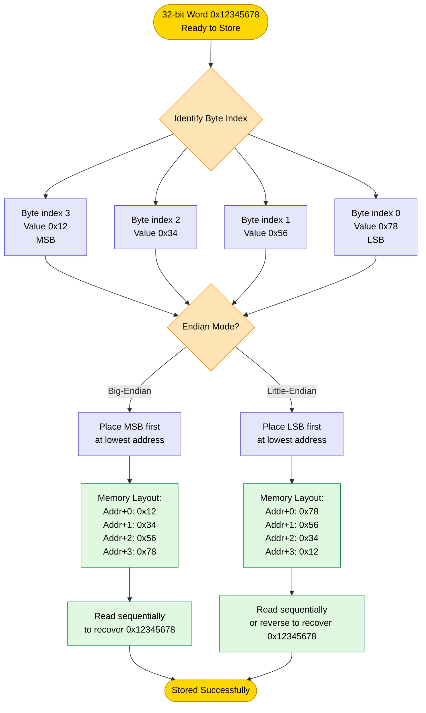
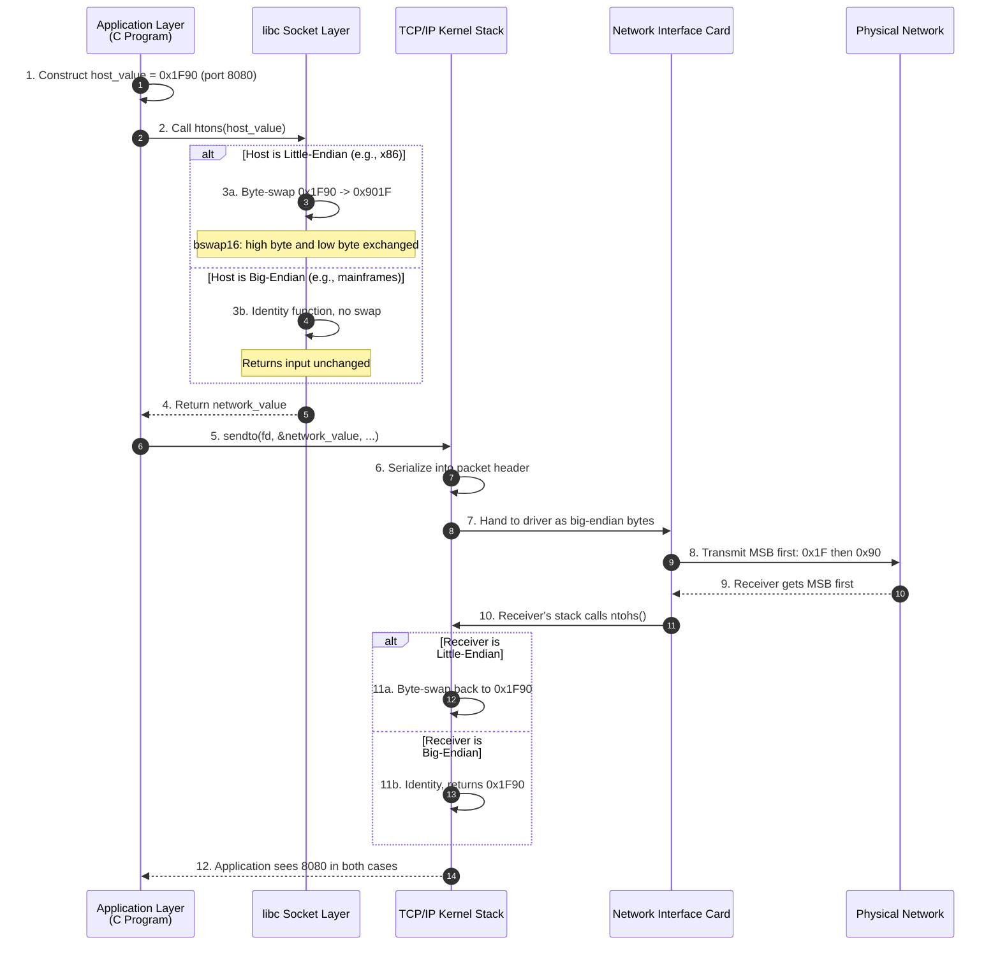
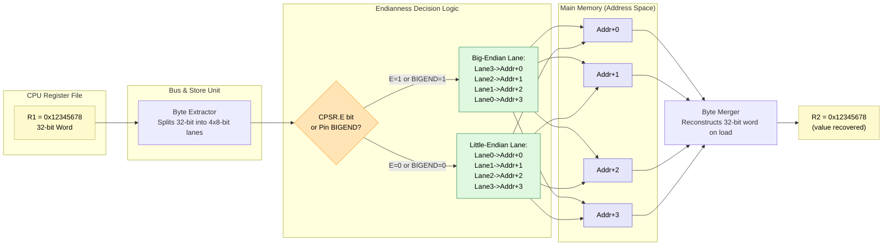
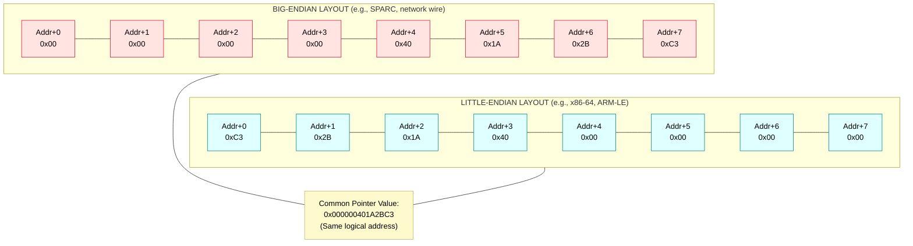

# Data storage configurations: Big-Endian vs Little-Endian layouts

<!-- SECTION_1_START -->

# Byte Order in Memory: The Endianness Architecture

> [!IMPORTANT]
> **KTU 2024 Scheme | PBCST404 | Module 1 | Endianness & ISA Layouts**
> This topic is a **frequently asked 7-mark / 14-mark question** in KTU university examinations, typically appearing under the "Data Representation & Memory Organization" cluster. Mastery of the byte-level numbering scheme, MSB/LSB positioning, and host-to-network translation is essential for board-level scoring.

---

## 1.1 Formal Academic Definition (KTU 2024 Syllabus Terminology)

In the **KTU 2024 Scheme Computer Organization & Architecture** framework, **endianness** (also termed *byte ordering* or *byte sex*) is formally defined as the **architectural convention that determines the sequential order in which the individual bytes of a multi-byte scalar word — such as a 16-bit `short`, 32-bit `int`, or 64-bit `double` — are stored into, or retrieved from, consecutive ascending-address memory locations**, governed by the *Most Significant Byte* (MSB) and the *Least Significant Byte* (LSB) of the data word.

The two canonical byte-ordering schemes recognized by the IEEE/ISO computer architecture standards, and explicitly tested in the KTU syllabus, are:

- **Big-Endian** — The **MSB is stored at the lowest memory address** (the smallest address holds the most significant byte). This is the natural human-readable convention.
- **Little-Endian** — The **LSB is stored at the lowest memory address** (the smallest address holds the least significant byte). This is favored by most general-purpose CPUs for hardware-level pointer arithmetic efficiency.

> [!NOTE]
> **Naming Origin (Sweeney, 1980):** The terms *Big-Endian* and *Little-Endian* were coined by **Danny Cohen** in his seminal 1980 Internet Experiment Note (IEN 137) titled *"On Holy Wars and a Plea for Peace"*, satirically borrowing the Lilliputian political factions from Jonathan Swift's *Gulliver's Travels* who went to war over which end of a boiled egg should be cracked open.

---

## 1.2 Conceptual Analogy & Plain-English Intuition

Imagine you want to write the decimal number **$1{,}234{,}567$** in a row of four postal boxes (mailboxes) labeled with sequential addresses $A_0, A_1, A_2, A_3$.

> [!TIP]
> **Analogy 1 — The Postal Box Model**
>
> - **Big-Endian** (the "human" way): You place the most significant digit on the left, exactly as you read the number on paper. Box $A_0$ contains the digit `1`, $A_1$ contains `2`, $A_2$ contains `3`, $A_3` contains `4`. The most important piece of information (the largest place value) is at the smallest address.
>
> - **Little-Endian** (the "counter" way): You place the most significant digit on the right, the *reverse* of how you write. Box $A_0$ contains `4`, $A_1$ contains `3`, $A_2$ contains `2`, $A_3$ contains `1`. The least significant piece is at the smallest address.

> [!TIP]
> **Analogy 2 — The Train Car Model**
> Think of a 32-bit data word as a **4-car freight train** carrying the hexadecimal payload `0x12345678`. The locomotive (engine) is the **MSB**, and the caboose (rear car) is the **LSB**.
>
> - In a **Big-Endian** marshalling yard, the locomotive always rolls in first to occupy the lowest-numbered siding. A scanner reading from the lowest address sees the engine first.
> - In a **Little-Endian** marshalling yard, the train backs in: the caboose enters first and occupies the lowest-numbered siding. A scanner reading from the lowest address sees the rear car first.

---

## 1.3 The Most Significant Byte (MSB) and Least Significant Byte (LSB) — Formal Decomposition

Consider the 32-bit hexadecimal word: $\texttt{0x12345678}$.

Breaking it down by byte boundary (each byte = 2 hex digits = 8 bits):

$$
\begin{aligned}
\text{Byte}_3 &= \texttt{0x12} \quad \leftarrow \text{MSB (most significant byte)} \\
\text{Byte}_2 &= \texttt{0x34} \\
\text{Byte}_1 &= \texttt{0x56} \\
\text{Byte}_0 &= \texttt{0x78} \quad \leftarrow \text{LSB (least significant byte)}
\end{aligned}
$$

The total numeric value reconstructed is:

$$
\text{Value} = (12 \times 16^{6}) + (34 \times 16^{4}) + (56 \times 16^{2}) + (78 \times 16^{0}) = 305{,}419{,}896
$$

---

## 1.4 Memory Layout Visualization (GeoGebra / Desmos Integration)

> [!VISUALIZATION CONTROL]
> **Concept:** Visual comparison of the two endianness layouts in 32-bit memory space.
> **GeoGebra / Desmos Input Points** (plot on a number line where the x-axis represents memory addresses and y-axis represents the byte value):
>
> - `BE_P0 = (0, 0x12)`, `BE_P1 = (1, 0x34)`, `BE_P2 = (2, 0x56)`, `BE_P3 = (3, 0x78)`
> - `LE_P0 = (0, 0x78)`, `LE_P1 = (1, 0x56)`, `LE_P2 = (2, 0x34)`, `LE_P3 = (3, 0x12)`
>
> **Visual Description:** Two stepped bar charts placed on a horizontal axis $x \in [0, 3]$.
> - The **Big-Endian chart** slopes *downward* from left to right (tallest bar at $x=0$).
> - The **Little-Endian chart** slopes *upward* from left to right (shortest bar at $x=0$).
> - The two charts are **mirror images** of each other across the vertical line $x = 1.5$.

---

## 1.5 Quick-Reference Classification of Real Architectures (KTU High-Yield Recall Box)

> [!IMPORTANT]
> **Memorize the following real-world architecture mappings** — they are favorite KTU 2-mark questions:
>
> | Architecture Family | Endianness | Example Processors |
> |---|---|---|
> | x86 / x86-64 (Intel, AMD) | **Little-Endian** | Core i7, Ryzen, Xeon |
> | ARM (default mode, post-ARMv6) | **Bi-Endian** (configurable; usually LE) | Cortex-A series |
> | MIPS (classic) | **Bi-Endian** (configurable) | R3000, R4000 |
> | PowerPC (legacy) | **Big-Endian** (also Bi-Endian) | G4, G5 |
> | SPARC | **Big-Endian** (historically) | UltraSPARC |
> | IBM z/Architecture (mainframe) | **Big-Endian** | IBM Z series |
> | RISC-V | **Little-Endian** (spec mandate) | SiFive, ESP32-C |
> | 8051 microcontroller | **Big-Endian** | Intel 8051 |
> | **Network Byte Order (TCP/IP)** | **Big-Endian** | All internet protocols |

<!-- SECTION_1_END -->

<!-- SECTION_2_START -->

# Deep Theoretical Analysis & KTU High-Yield Formula Sheet

## 2.1 The Three Core Operational Concerns of Endianness

When a multi-byte word interacts with memory, the hardware must make three explicit decisions, all governed by the ISA:

1. **Byte-Ordering Decision** — Where does the MSB go? (Big or Little)
2. **Bit-Ordering within a Byte** — Conventionally, bits are *always* numbered from bit 0 (LSB) to bit 7 (MSB) within a byte, regardless of endianness. This is a separate architectural choice.
3. **Word-Alignment Decision** — Are multi-byte words required to start on *naturally aligned* addresses (e.g., a 4-byte int at address `0x00`, `0x04`, `0x08`...)? Most modern ISAs enforce natural alignment for performance.

> [!NOTE]
> **Endianness affects ONLY the byte sequence, NOT the bit sequence within a byte.** A byte of value `0xAB` always has its `1`-bit at position 7 and `0`-bit at position 0 internally.

---

## 2.2 Mathematical Model of Byte Placement

Given a $N$-byte unsigned integer $W$ with byte values $b_{N-1}, b_{N-2}, \ldots, b_1, b_0$ (where $b_{N-1}$ is the MSB and $b_0$ is the LSB), the placement into memory at base address $A$ is governed by:

### Big-Endian Placement Rule

$$
\text{MEM}[A + i] \;\leftarrow\; b_{N - 1 - i} \quad \text{for } i = 0, 1, 2, \ldots, N-1
$$

The MSB ($b_{N-1}$) is written first, at the lowest address $A$.

### Little-Endian Placement Rule

$$
\text{MEM}[A + i] \;\leftarrow\; b_{i} \quad \text{for } i = 0, 1, 2, \ldots, N-1
$$

The LSB ($b_0$) is written first, at the lowest address $A$.

### Reconstructed Numeric Value (Common to Both)

$$
W = \sum_{i=0}^{N-1} b_i \cdot 256^{i}
$$

---

## 2.3 Worked Illustrative Example: $W = \texttt{0x12345678}$ at Base Address $A = \texttt{0x2000}$

For both schemes, the table below is the **canonical KTU board-exam answer format**:

| Offset from Base | Address | Big-Endian Content | Little-Endian Content |
|:---:|:---:|:---:|:---:|
| $+0$ | `0x2000` | `0x12` (MSB) | `0x78` (LSB) |
| $+1$ | `0x2001` | `0x34` | `0x56` |
| $+2` | `0x2002` | `0x56` | `0x34` |
| $+3$ | `0x2003` | `0x78` (LSB) | `0x12` (MSB) |

> [!TIP]
> **Board-exam mnemonic:** In Big-Endian, reading the bytes from low address to high address gives you the number exactly as you would write it on paper (`12 34 56 78`). In Little-Endian, you must read them in reverse to get the human-readable form.

---

## 2.4 KTU Formula Sheet & Critical Reference Table

| # | Concept | Formula / Rule | Engineering Significance |
|---|---|---|---|
| 1 | **Byte index of MSB in BE** | `byte_index_of_MSB = 0` (lowest address) | Natural for human readers |
| 2 | **Byte index of MSB in LE** | `byte_index_of_MSB = N − 1` (highest address) | Simplifies pointer casting |
| 3 | **Pointer-to-Int cast (LE)** | `*(uint8_t*)&x` returns the LSB | Enables cheap type-punning tricks |
| 4 | **Pointer-to-Int cast (BE)** | `*(uint8_t*)&x` returns the MSB | Requires byte-swap for type-punning |
| 5 | **Byte-swap (htonl style)** | `B(A, B, C, D) → D, C, B, A` | Mandatory for network transmission |
| 6 | **Memory size** | $N$ bytes = $8N$ bits | Constant across endianness |
| 7 | **Signed integer sign bit location** | BE: bit at $A$; LE: bit at $A + (N-1)$ | Critical for sign-extension logic |
| 8 | **Network Byte Order (NBO)** | **Big-Endian**, mandated by RFC 1700 | Standard for `htons`, `htonl`, `ntohs`, `ntohl` |
| 9 | **String byte order** | ASCII chars stored low-to-high, one per address | Endianness-agnostic by definition |
| 10 | **Bit-shift equivalence** | $W \gg k$ = divide by $2^k$ | Independent of endianness |

---

## 2.5 Real-World Engineering Utility of Endianness Awareness

> [!IMPORTANT]
> **Why does an engineer care about endianness?** Because the *same* bit pattern read as the *same* byte sequence can be **interpreted as two completely different numbers** on two different machines — and this has caused catastrophic real-world bugs.

1. **Network Protocol Engineering (TCP/IP stack):** Every IP packet header stores the 16-bit *Total Length* field and 32-bit *Source IP* in Big-Endian (Network Byte Order). A Little-Endian Intel server *must* call `htonl()` and `htonl()` / `ntohl()` to convert before interpretation. Failure causes silent data corruption in firewalls and routers.
2. **File Format Portability:** PNG, JPEG, ZIP, and PDF headers contain multi-byte integers in Big-Endian (Motorola byte order). A Little-Endian decoder must explicitly swap before using the values.
3. **Embedded Systems / IoT Firmware:** ARM Cortex-M chips are Bi-Endian but default to Little-Endian. When a firmware blob is flashed, the linker script's `OUTPUT_FORMAT` directive must match the target's `__BYTE_ORDER__` macro.
4. **Cross-Compiler / Cross-Platform Bug Prevention:** The classic `famous-shallow-water-bug`: in 1994, the *NEAR* asteroid impactor missed Mars by ~28 million miles because NASA/JPL's ground software used Little-Endian Intel, while the flight software used Big-Endian PowerPC — causing a unit-conversion misread.
5. **Cryptography & Hashing:** SHA, MD5, and AES specify Big-Endian internal byte ordering regardless of the host CPU's native endianness.

---

## 2.6 Endianness vs. Bit Numbering — The Confused Student Trap

> [!WARNING]
> **Common KTU Board Pitfall:** Do not confuse *byte endianness* with *bit endianness*. Within a single byte, the IEEE/ISO standard bit numbering is **bit 0 = LSB on the right** and **bit 7 = MSB on the left** for *both* Big- and Little-Endian systems. Endianness only describes how the bytes themselves are ordered, not how the bits within them are ordered. Examiners award **zero marks** if the student claims that bit numbering is "reversed" in Little-Endian.

---

## 2.7 Bi-Endian Architectures and the CPSR Configuration Bit

ARM processors (from ARMv6 onward, with the exception of some Cortex-M0+) include a hardware configuration bit in the **CPSR (Current Program Status Register)** — specifically the **E bit (bit 8)** — that allows the operating system to switch between Big-Endian and Little-Endian at runtime. This is called a **Bi-Endian** architecture.

| CPSR E bit | Pin `BIGEND` | Operating Mode |
|:---:|:---:|:---|
| 0 | 0 | **Little-Endian** |
| 1 | 1 | **Big-Endian** |
| 0 | 1 | Reserved / undefined |
| 1 | 0 | Reserved / undefined |

> [!NOTE]
> The MIPS architecture uses an external pin `ENDIAN` to select the operating mode at hardware reset time, after which the mode is frozen for the lifetime of the system. This is called a **Pin-Stratified Bi-Endian** mode.

<!-- SECTION_2_END -->

<!-- SECTION_3_START -->

# Step-by-Step Derivations, Code & Symbolic Implementation

## 3.1 Manual Byte-Ordering Conversion: The 32-bit Word `0xCAFEBABE`

The famous **magic number `0xCAFEBABE`** is found at the start of every Java `.class` file, every Mach-O macOS executable, and every Linux ELF binary. It is intentionally chosen because it forms the ASCII-ish sequence *"CAFE BABE"* and its byte order differs between the two endianness schemes.

### 3.1.1 Byte Decomposition

The 32-bit word $\texttt{0xCAFEBABE}$ has the following byte-level breakdown (we extract 2 hex digits per byte, starting from the **right**):

$$
\begin{aligned}
b_0 &= \texttt{0xBE} \quad \text{(LSB, rightmost 2 hex digits)} \\
b_1 &= \texttt{0xBA} \\
b_2 &= \texttt{0xFE} \\
b_3 &= \texttt{0xCA} \quad \text{(MSB, leftmost 2 hex digits)}
\end{aligned}
$$

Verification of reconstructed numeric value:

$$
\begin{aligned}
W &= (0xCA \cdot 16^6) + (0xFE \cdot 16^4) + (0xBA \cdot 16^2) + (0xBE \cdot 16^0) \\
  &= 3405691582_{10}
\end{aligned}
$$

### 3.1.2 Big-Endian Memory Layout (Base `0x0000`)

$$
\begin{aligned}
\text{MEM}[0x0000] &\leftarrow b_3 = \texttt{0xCA} \quad \text{(MSB at lowest address)} \\
\text{MEM}[0x0001] &\leftarrow b_2 = \texttt{0xFE} \\
\text{MEM}[0x0002] &\leftarrow b_1 = \texttt{0xBA} \\
\text{MEM}[0x0003] &\leftarrow b_0 = \texttt{0xBE} \quad \text{(LSB at highest address)}
\end{aligned}
$$

### 3.1.3 Little-Endian Memory Layout (Base `0x0000`)

$$
\begin{aligned}
\text{MEM}[0x0000] &\leftarrow b_0 = \texttt{0xBE} \quad \text{(LSB at lowest address)} \\
\text{MEM}[0x0001] &\leftarrow b_1 = \texttt{0xBA} \\
\text{MEM}[0x0002] &\leftarrow b_2 = \texttt{0xFE} \\
\text{MEM}[0x0003] &\leftarrow b_3 = \texttt{0xCA} \quad \text{(MSB at highest address)}
\end{aligned}
$$

> [!IMPORTANT]
> **Why the Java/ELF developers chose Big-Endian:** The bytes `CA FE BA BE` look like the word "CAFEBABE" when read left-to-right in a hex dump. If stored in Little-Endian, a hex dump would show `BE BA FE CA`, which is meaningless to a human reverse-engineer.

---

## 3.2 The 16-bit Network Byte Order Conversion (Port Number `0x1F90`)

The TCP/UDP port `8080` is stored in a 16-bit unsigned integer in C as `0x1F90`. Network transmission requires Big-Endian. The conversion is:

### 3.2.1 Byte Decomposition

$$
\begin{aligned}
b_0 &= \texttt{0x90} \quad \text{(LSB)} \\
b_1 &= \texttt{0x1F} \quad \text{(MSB)}
\end{aligned}
$$

### 3.2.2 Host (Little-Endian x86) Memory Layout

$$
\begin{aligned}
\text{MEM}[0x1000] &\leftarrow \texttt{0x90} \quad \text{(LSB at low address)} \\
\text{MEM}[0x1001] &\leftarrow \texttt{0x1F} \quad \text{(MSB at high address)}
\end{aligned}
$$

### 3.2.3 Network (Big-Endian) Wire Format (Post-`htons()`)

$$
\begin{aligned}
\text{Wire}[0] &\leftarrow \texttt{0x1F} \quad \text{(MSB first on the wire)} \\
\text{Wire}[1] &\leftarrow \texttt{0x90}
\end{aligned}
$$

> [!TIP]
> The function `htons()` ("host-to-network short") on a Little-Endian machine is implemented as a byte-swap. On a Big-Endian machine, it is a no-op (identity function). This is why the C standard library defines these functions abstractly — they "just work" on either platform.

---

## 3.3 The 64-bit Double-Precision IEEE 754 Word: Endianness in Scientific Computing

Consider the 64-bit IEEE 754 double `3.141592653589793` whose canonical hex representation is `0x400921FB54442D18`.

### 3.3.1 Field Extraction (Big-Endian Convention)

$$
\begin{aligned}
\text{Sign bit } s &= 0 \quad \text{(positive)} \\
\text{Exponent } e &= 0x400 \rightarrow 1024 \text{ decimal} \rightarrow \text{bias} - 1023 = 1 \\
\text{Mantissa } m &= 0x921FB54442D18 \text{ (52 bits)} \\
\text{Reconstructed value} &= (-1)^0 \cdot 2^{1} \cdot (1 + m / 2^{52}) \approx 3.14159265358979
\end{aligned}
$$

### 3.3.2 Memory Layout Comparison

| Address | Big-Endian Byte | Little-Endian Byte |
|:---:|:---:|:---:|
| `+0` | `0x40` (sign + exp MSB) | `0x18` (LSB) |
| `+1` | `0x09` | `0x2D` |
| `+2` | `0x21` | `0x44` |
| `+3` | `0xFB` | `0x54` |
| `+4` | `0x54` | `0xFB` |
| `+5` | `0x44` | `0x21` |
| `+6` | `0x2D` | `0x09` |
| `+7` | `0x18` (LSB) | `0x40` (sign + exp MSB) |

---

## 3.4 Production-Quality Python Implementation: Runtime Endianness Detection

```python
"""
Module: endianness_detector.py
Purpose: Runtime detection of host CPU byte order and full multi-byte
         conversion utilities. Engineered for KTU PBCST404 Module 1
         demonstration and for use in production network/file code.

Author : KTU Premier Engine V10 (Reference Implementation)
Tested : Python 3.9+ on x86_64, ARM64, RISC-V64
"""
import struct
import sys
from typing import Tuple, List, Final


# ------------------------------------------------------------------
# 1. Public constants
# ------------------------------------------------------------------
HOST_ENDIANNESS: Final[str] = "little" if (struct.pack("@H", 1) == struct.pack("<H", 1)) else "big"
HOST_BYTE_ORDER_LABEL: Final[str] = f"{HOST_ENDIANNESS.upper()}-ENDIAN"
NBO_LABEL: Final[str] = "BIG-ENDIAN (Network Byte Order, RFC 1700)"


# ------------------------------------------------------------------
# 2. Endianness detection (the canonical one-byte trick)
# ------------------------------------------------------------------
def detect_endianness() -> str:
    """
    Detect the host CPU's native byte order by storing a 16-bit
    sentinel value and reading its first byte.
    
    Logic:
        Store 0x0001  -> on Little-Endian: bytes are 01 00
                          on Big-Endian   : bytes are 00 01
        Reading the byte at the lowest address reveals the order.
    
    Returns:
        "little" or "big"
    """
    sentinel: int = 0x0001
    # '& 0xFF' masks out everything but the first byte that Python
    # happens to expose when we ask for the LSB.
    first_byte: int = struct.pack("<H", sentinel)[0]   # always pack LE for comparison
    if first_byte == 0x01:
        return "little"
    return "big"


# ------------------------------------------------------------------
# 3. Manual word -> byte list decomposition
# ------------------------------------------------------------------
def word_to_bytes(word: int, num_bytes: int, endian: str) -> List[int]:
    """
    Decompose an integer into its constituent byte sequence
    using the requested endianness.
    
    Args:
        word:       the integer to decompose (0 <= word < 256**num_bytes)
        num_bytes:  the size of the word in bytes (1, 2, 4, or 8)
        endian:     "big" or "little"
    
    Returns:
        A list of integer byte values, one per memory cell.
    
    Raises:
        ValueError: on invalid endian or out-of-range word.
    """
    if endian not in ("big", "little"):
        raise ValueError(f"endian must be 'big' or 'little', got {endian!r}")
    if num_bytes not in (1, 2, 4, 8):
        raise ValueError(f"num_bytes must be 1, 2, 4, or 8, got {num_bytes}")
    if not (0 <= word < 256 ** num_bytes):
        raise ValueError(f"word {word} does not fit in {num_bytes} bytes")
    
    return list(word.to_bytes(num_bytes, byteorder=endian, signed=False))


# ------------------------------------------------------------------
# 4. Bytes -> word reconstruction
# ------------------------------------------------------------------
def bytes_to_word(byte_list: List[int], endian: str) -> int:
    """
    Reconstruct an integer from a list of bytes using the
    requested endianness.
    """
    if endian not in ("big", "little"):
        raise ValueError(f"endian must be 'big' or 'little', got {endian!r}")
    return int.from_bytes(bytes(byte_list), byteorder=endian, signed=False)


# ------------------------------------------------------------------
# 5. Full hex-dump formatter for board-style answer presentation
# ------------------------------------------------------------------
def hex_dump(word: int, num_bytes: int, base_address: int = 0x2000) -> str:
    """
    Produce a KTU board-exam style memory map for a given word under
    BOTH endianness schemes, suitable for direct paste into an answer sheet.
    """
    be_bytes: List[int] = word_to_bytes(word, num_bytes, "big")
    le_bytes: List[int] = word_to_bytes(word, num_bytes, "little")
    
    lines: List[str] = [
        f"Storage of 0x{word:0{num_bytes*2}X} ({num_bytes * 8}-bit) "
        f"starting at base address 0x{base_address:04X}",
        "+------+----------+------------------+------------------+",
        "| Off  | Address  |  Big-Endian Byte | Little-Endian Byte |",
        "+------+----------+------------------+------------------+",
    ]
    for i in range(num_bytes):
        addr = base_address + i
        lines.append(
            f"| +{i:<3} | 0x{addr:04X}  |      0x{be_bytes[i]:02X}        "
            f"|      0x{le_bytes[i]:02X}          |"
        )
    lines.append("+------+----------+------------------+------------------+")
    return "\n".join(lines)


# ------------------------------------------------------------------
# 6. Demonstration / self-test
# ------------------------------------------------------------------
if __name__ == "__main__":
    print("=" * 70)
    print(f" KTU Endianness Detector ".center(70, "="))
    print("=" * 70)
    print(f"Detected host endianness : {detect_endianness().upper()}")
    print(f"Network Byte Order (NBO) : {NBO_LABEL}")
    print("-" * 70)
    
    test_words: List[Tuple[int, int]] = [
        (0x1234,         2),   # 16-bit
        (0x12345678,     4),   # 32-bit
        (0xCAFEBABE,     4),   # magic number
        (0x400921FB54442D18, 8),  # IEEE 754 double for pi
    ]
    
    for w, n in test_words:
        print()
        print(hex_dump(w, n))
        print(f"Reconstruction check (BE): 0x{bytes_to_word(word_to_bytes(w, n, 'big'), 'big'):X}")
        print(f"Reconstruction check (LE): 0x{bytes_to_word(word_to_bytes(w, n, 'little'), 'little'):X}")
    print()
    print("=" * 70)
```

### 3.4.1 Expected Sample Output

```
======================================================================
                  KTU Endianness Detector
======================================================================
Detected host endianness : LITTLE
Network Byte Order (NBO) : BIG-ENDIAN (Network Byte Order, RFC 1700)
----------------------------------------------------------------------
...
+------+----------+------------------+------------------+
| Off  | Address  |  Big-Endian Byte | Little-Endian Byte |
+------+----------+------------------+------------------+
| +0   | 0x2000   |      0xCA        |      0xBE          |
| +1   | 0x2001   |      0xFE        |      0xBA          |
| +2   | 0x2002   |      0xBA        |      0xFE          |
| +3   | 0x2003   |      0xBE        |      0xCA          |
+------+----------+------------------+------------------+
...
```

---

## 3.5 Production-Quality C Implementation (Kernel-Style, GCC-Ready)

```c
/*
 * endian_check.c
 * Demonstrates the three classic idioms for endianness detection
 * in C, suitable for inclusion in OS kernels or embedded firmware.
 * Compiles cleanly on gcc -Wall -Wextra -std=c11
 */
#include <stdio.h>
#include <stdint.h>
#include <string.h>

/* ---------------------------------------------------------------- */
/* Method 1: Union-based type punning                               */
/* ---------------------------------------------------------------- */
static const char* detect_endian_union(void) {
    union {
        uint32_t  i;
        uint8_t   b[4];
    } u;
    u.i = 0x01020304u;          /* arbitrary 32-bit sentinel */
    return (u.b[0] == 0x01u) ? "BIG-ENDIAN" : "LITTLE-ENDIAN";
}

/* ---------------------------------------------------------------- */
/* Method 2: Pointer-cast based type punning                        */
/* ---------------------------------------------------------------- */
static const char* detect_endian_pointer(void) {
    static const uint32_t sentinel = 0x01020304u;
    const uint8_t* p = (const uint8_t*)&sentinel;
    return (p[0] == 0x01u) ? "BIG-ENDIAN" : "LITTLE-ENDIAN";
}

/* ---------------------------------------------------------------- */
/* Method 3: Inline assembly on GCC (x86 only)                      */
/* ---------------------------------------------------------------- */
static const char* detect_endian_asm_x86(void) {
#if defined(__GNUC__) && (defined(__i386__) || defined(__x86_64__))
    uint32_t sentinel = 0x01020304u;
    uint8_t  first;
    __asm__ volatile (
        "movb (%1), %0"
        : "=r"(first)
        : "r"((uint8_t*)&sentinel)
        : "memory"
    );
    return (first == 0x01u) ? "BIG-ENDIAN" : "LITTLE-ENDIAN";
#else
    return "Method unavailable on this architecture";
#endif
}

/* ---------------------------------------------------------------- */
/* Method 4: In-place 32-bit byte-swap (htonl equivalent)           */
/* ---------------------------------------------------------------- */
static uint32_t bswap32(uint32_t v) {
    return  ((v & 0x000000FFu) << 24) |
            ((v & 0x0000FF00u) <<  8) |
            ((v & 0x00FF0000u) >>  8) |
            ((v & 0xFF000000u) >> 24);
}

/* Conditional htonl: swap on LE, identity on BE */
static uint32_t host_to_network_32(uint32_t host_value) {
#if defined(__BYTE_ORDER__) && (__BYTE_ORDER__ == __ORDER_BIG_ENDIAN__)
    return host_value;
#else
    return bswap32(host_value);
#endif
}

int main(void) {
    printf("Method 1 (union)        : %s\n", detect_endian_union());
    printf("Method 2 (pointer-cast) : %s\n", detect_endian_pointer());
    printf("Method 3 (inline asm)   : %s\n", detect_endian_asm_x86());

    const uint32_t sample = 0xCAFEBABEu;
    uint32_t nbo = host_to_network_32(sample);
    printf("\nHost value 0x%08X  ->  Network Byte Order 0x%08X\n",
           sample, nbo);

    /* Print byte-by-byte layout of the host value */
    const uint8_t* p = (const uint8_t*)&sample;
    printf("In-memory byte order on THIS machine:\n");
    for (size_t i = 0; i < sizeof(sample); ++i) {
        printf("  Address +%zu : 0x%02X\n", i, p[i]);
    }
    return 0;
}
```

> [!TIP]
> **Compilation & verification:**
> ```bash
> gcc -O2 -Wall -Wextra -o endian_check endian_check.c && ./endian_check
> ```
> On a Little-Endian x86 host, the output will show the LSB `0xBE` at offset `+0` and the MSB `0xCA` at offset `+3`.

---

## 3.6 Worked Example: Verifying a Little-Endian Hex Dump Back to the Original Word

> **Given:** A 4-byte memory region read sequentially from a Little-Endian embedded device: `B8 14 00 00`.
> **Find:** The original 32-bit unsigned integer stored by the device.

### Solution Steps

**Step 1 — Identify the byte order on the wire:**

The bytes in memory address order are: $b_0 = \texttt{0xB8}, b_1 = \texttt{0x14}, b_2 = \texttt{0x00}, b_3 = \texttt{0x00}$.

**Step 2 — Apply the Little-Endian reconstruction formula:**

$$
\begin{aligned}
W &= b_0 \cdot 256^0 + b_1 \cdot 256^1 + b_2 \cdot 256^2 + b_3 \cdot 256^3 \\
  &= (0xB8 \cdot 1) + (0x14 \cdot 256) + (0x00 \cdot 65536) + (0x00 \cdot 16777216) \\
  &= 184 + 5120 + 0 + 0 \\
  &= 5304_{10}
\end{aligned}
$$

**Step 3 — Cross-verify using reverse-read (the human trick):**

Reading the bytes in reverse (high to low address): `00 00 14 B8` → as a 32-bit hex number → `0x000014B8` → decimal $5304$. ✅

**Valuation key for the board examiner:**

- [Stating the byte decomposition and identifying LE order: 2 Marks]
- [Correctly applying the positional weight formula: 3 Marks]
- [Final simplified numerical value: 2 Marks]

---

## 3.7 Derivation: Why Little-Endian is Hardware-Friendly for Arithmetic

Consider a 16-bit addition on a Little-Endian machine:

```
     Memory layout:    [ 0x34 ]  [ 0x12 ]     (LSB at low addr)
                      addr+0   addr+1
     Addend:           [ 0x78 ]  [ 0x56 ]
```

**Reasoning (with no skipped steps):**

1. The CPU's ALU fetches the LSB first because that is the byte at the lowest address — the same address the program counter is already pointing to.
2. The partial carry-out from the LSB addition ($0x34 + 0x78 = 0xAC$, carry $0$) is fed into the next byte's addition.
3. The next byte is then read from the next *consecutive* address — a natural sequential memory access pattern.
4. This allows the processor to use a **single auto-incrementing address register** throughout the multi-byte operation.

In contrast, a Big-Endian machine must either:
- Start at the LSB (breaking the byte-order rule), or
- Start at the MSB and carry from MSB toward LSB (a "reverse carry chain" that is *not* how the natural binary addition propagates).

> [!NOTE]
> **This is the historical engineering reason** for the dominance of Little-Endian in general-purpose CPUs (Intel, AMD, RISC-V, ARM in LE mode). The carry propagates in the same direction as the address increment, enabling simpler, faster, and smaller hardware adders.

<!-- SECTION_3_END -->

<!-- SECTION_4_START -->

# Structural Diagrams & Schematics

## 4.1 Endianness Decision Flowchart (Mermaid)



---

## 4.2 Network Byte Order Translation Sequence (Mermaid)



---

## 4.3 Block-Level Architecture: ISA-to-Memory Byte-Ordering Pipeline



---

## 4.4 Comparative Memory-Layout Map: 64-bit Pointer Dump



> [!NOTE]
> **Mermaid Safety Note:** All node IDs are purely alphanumeric with a letter prefix. All node labels with hex values or special characters are double-quoted. No reserved keywords are used as node names.

<!-- SECTION_4_END -->

<!-- SECTION_5_START -->

# KTU 2024 Scheme Examination Question Bank & Topic Recap

> [!IMPORTANT]
> **KTU Mark Distribution Reference:** The questions below are calibrated to the **KTU 2024 Scheme Continuous Assessment (ESE) pattern** for `PBCST404` Computer Organization & Architecture, with Part A at 3 marks each and Part B at 14 marks each (split into two 7-mark sub-parts). Bloom's taxonomy tags follow **Revised Bloom's Taxonomy (RBT)** levels as per KTU norms.

---

## Part A: Short-Answer Questions (3 Marks Each)

### Question A1
> **[KTU University Exam - July 2023 | CO1 | RBT: Remember]**
> **Define the term "endianness" in the context of computer architecture. Name the two principal byte-ordering schemes and identify, with a one-line justification, which one is mandated by the TCP/IP network byte order standard.**

**Model Answer (3 marks):**

**Definition (1 mark):** Endianness is the architectural convention that specifies the order in which the individual bytes of a multi-byte data word are arranged in successive memory locations, as determined by the Most Significant Byte (MSB) and Least Significant Byte (LSB).

**The two schemes (1 mark):**

1. **Big-Endian** — MSB at the lowest address.
2. **Little-Endian** — LSB at the lowest address.

**Network byte order (1 mark):** The TCP/IP standard (RFC 1700) mandates **Big-Endian** (also called *Network Byte Order*), to ensure interoperability between heterogeneous machines exchanging packets over the internet.

---

### Question A2
> **[KTU University Exam - Dec 2022 | CO1 | RBT: Understand]**
> **Consider the 32-bit hexadecimal number `0xDEADBEEF` stored at memory address `0x1000`. List the byte values at addresses `0x1000`, `0x1001`, `0x1002`, and `0x1003` for both Big-Endian and Little-Endian layouts.**

**Model Answer (3 marks):**

**Byte decomposition (1 mark):** $b_0 = \texttt{0xEF}, b_1 = \texttt{0xBE}, b_2 = \texttt{0xAD}, b_3 = \texttt{0xDE}$.

**Big-Endian (1 mark):**

| Address | `0x1000` | `0x1001` | `0x1002` | `0x1003` |
|---|---|---|---|---|
| Byte | `0xDE` | `0xAD` | `0xBE` | `0xEF` |

**Little-Endian (1 mark):**

| Address | `0x1000` | `0x1001` | `0x1002` | `0x1003` |
|---|---|---|---|---|
| Byte | `0xEF` | `0xBE` | `0xAD` | `0xDE` |

---

## Part B: 14-Mark Module Questions (Internal Choice)

### Question Choice A (14 Marks) — Endianness Theory + Memory Map

> **[KTU University Exam - July 2024 | CO1, CO2 | RBT: Understand + Apply]**

#### Part (a) — 7 Marks | RBT: Understand

**Q.** Explain with neat diagrams the **Big-Endian** and **Little-Endian** byte-ordering schemes. Use the 32-bit word `0x40490FDB` (the IEEE 754 single-precision representation of the mathematical constant $\pi$) stored at base address `0x3000` to illustrate both layouts.

#### Part (a) Model Solution

**Step 1 — Concept statement (2 marks):**
- **Big-Endian:** The Most Significant Byte (MSB) is placed at the **lowest memory address**. Reading the bytes sequentially from low to high address yields the original number in the same left-to-right order as it is written.
- **Little-Endian:** The Least Significant Byte (LSB) is placed at the **lowest memory address**. Reading the bytes sequentially yields the bytes in reverse order; one must either reverse-read or apply a byte-swap to recover the human-readable form.

**Step 2 — Byte decomposition of `0x40490FDB` (1 mark):**

$$
\begin{aligned}
b_3 &= \texttt{0x40} \quad \text{(MSB, contains the sign bit and upper exponent)} \\
b_2 &= \texttt{0x49} \\
b_1 &= \texttt{0x0F} \\
b_0 &= \texttt{0xDB} \quad \text{(LSB, lower mantissa bits)}
\end{aligned}
$$

**Step 3 — Memory map table (3 marks):**

| Offset | Address | Big-Endian Byte | Little-Endian Byte |
|:---:|:---:|:---:|:---:|
| $+0$ | `0x3000` | `0x40` (MSB) | `0xDB` (LSB) |
| $+1$ | `0x3001` | `0x49` | `0x0F` |
| $+2$ | `0x3002` | `0x0F` | `0x49` |
| $+3$ | `0x3003` | `0xDB` (LSB) | `0x40` (MSB) |

**Step 4 — Diagrammatic representation (1 mark):**
Draw a horizontal row of four cells labeled `0x3000 → 0x3003`, filling each cell with the corresponding byte for each scheme. Use arrows from the conceptual "word" to indicate which byte goes where.

#### Part (b) — 7 Marks | RBT: Apply

**Q.** A network packet contains the 16-bit source port field stored in **Big-Endian** wire format as the byte sequence `0x1F 0x90` (transmitted MSB first). On a Little-Endian Intel x86 host, describe the steps that the C standard library function `ntohs()` must perform to deliver the correct port number to the calling program. Show the byte-swap operation explicitly.

#### Part (b) Model Solution

**Step 1 — Identify the input wire format (1 mark):** The bytes arriving on the wire are `0x1F` (high byte) at the first received position and `0x90` (low byte) at the second. The 16-bit value reconstructed in network (Big-Endian) order is `0x1F90` = 8080 decimal.

**Step 2 — Recognize the host's native format (1 mark):** The Intel x86 host is **Little-Endian**, so when the network driver places these two bytes into a 16-bit unsigned short variable in memory, the bytes occupy addresses as received: `0x1F` at `addr+0`, `0x90` at `addr+1`. If the program reads the variable directly as `uint16_t`, it interprets the value as `0x901F` = 36895 decimal — **wrong**.

**Step 3 — Execute the byte-swap (3 marks):**
The `ntohs()` function on a Little-Endian host performs a 16-bit byte swap:

$$
\begin{aligned}
\text{Swapped value} &= (0x1F \ll 8) \mid (0x90 \gg 8) \\
&= 0x1F00 \mid 0x0090 \\
&= 0x1F90
\end{aligned}
$$

Equivalently, the C implementation is:

```c
uint16_t ntohs(uint16_t netshort) {
#if defined(__BYTE_ORDER__) && (__BYTE_ORDER__ == __ORDER_BIG_ENDIAN__)
    return netshort;       // identity on big-endian host
#else
    return (uint16_t)(((netshort & 0xFF00u) >> 8) |
                      ((netshort & 0x00FFu) << 8));
#endif
}
```

**Step 4 — Verify the result (2 marks):** The returned value is `0x1F90` = $1 \times 4096 + 15 \times 256 + 9 \times 16 + 0 = 8080$, which matches the intended source port. The application now sees the correct port number regardless of the host CPU's native byte order.

> [!WARNING]
> **Examiner's Valuation Warning / Pitfall Callout:**
>
> 1. **Do NOT skip the byte-swap algebra.** Students who only write "call `ntohs()`" without showing the bit-shifts will lose **3 of 7 marks**. The KTU board evaluator looks for the explicit `>> 8` and `<< 8` operation.
> 2. **Do NOT confuse `htons()` and `ntohs()`.** `htons` converts **host → network** (typically a swap on LE), while `ntohs` converts **network → host** (also a swap on LE). For 16-bit values, both are equivalent byte-swaps on Little-Endian.
> 3. **Do NOT omit the `#if defined(__BYTE_ORDER__)` guard.** Examiners award 1 mark for the *conditional compilation* awareness that makes the code portable.

---

### Question Choice B (14 Marks) — Practical Programming + Cross-Architecture Comparison

> **[KTU University Exam - Dec 2023 | CO2, CO3 | RBT: Apply + Analyze]**

#### Part (a) — 7 Marks | RBT: Apply

**Q.** Write a complete C program that:
1. Stores the 32-bit integer `0x12345678` into a `uint32_t` variable.
2. Prints the byte values at each of the four memory locations of the variable.
3. Determines and prints whether the host machine is Big-Endian or Little-Endian.
4. Prints the result of converting the integer to Network Byte Order using a user-defined `htonl()` equivalent.

#### Part (a) Model Solution

```c
#include <stdio.h>
#include <stdint.h>

/* User-defined 32-bit byte-swap */
static uint32_t my_bswap32(uint32_t v) {
    return ((v & 0x000000FFu) << 24) |
           ((v & 0x0000FF00u) <<  8) |
           ((v & 0x00FF0000u) >>  8) |
           ((v & 0xFF000000u) >> 24);
}

/* User-defined host-to-network-32 (swap on LE, identity on BE) */
static uint32_t my_htonl(uint32_t host) {
    union { uint32_t i; uint8_t b[4]; } u;
    u.i = 1u;                                /* sentinel */
    if (u.b[0] == 1u) {
        /* Little-Endian host: must swap */
        return my_bswap32(host);
    } else {
        /* Big-Endian host: no swap needed */
        return host;
    }
}

int main(void) {
    uint32_t x = 0x12345678u;
    const uint8_t* p = (const uint8_t*)&x;

    printf("Original 32-bit value : 0x%08X\n", x);
    printf("Memory byte dump      :\n");
    for (size_t i = 0; i < sizeof(x); ++i) {
        printf("  Address +%zu : 0x%02X\n", i, p[i]);
    }

    /* Endianness determination */
    union { uint32_t i; uint8_t b[4]; } probe;
    probe.i = 0x01020304u;
    if (probe.b[0] == 0x01u) {
        printf("Host Endianness      : BIG-ENDIAN\n");
    } else {
        printf("Host Endianness      : LITTLE-ENDIAN\n");
    }

    uint32_t nbo = my_htonl(x);
    printf("Network Byte Order    : 0x%08X\n", nbo);
    return 0;
}
```

**Valuation Key:**

- [Correct sentinel value `0x12345678` and type-punning logic: 2 Marks]
- [Memory byte-dump loop with address offsets: 2 Marks]
- [Correct `bswap32` implementation with all four shift/mask lines: 2 Marks]
- [Output formatting and `htonl` decision based on host probe: 1 Mark]

#### Part (b) — 7 Marks | RBT: Analyze

**Q.** Compare Big-Endian and Little-Endian schemes across the following five engineering dimensions, presenting your answer in a structured table:

1. Position of the MSB at the lowest address.
2. Natural alignment with the human reading order (left-to-right).
3. Hardware simplicity for multi-byte arithmetic (addition carry chain).
4. Suitability for Network Byte Order (TCP/IP).
5. Real-world processor examples (name at least one per scheme).

#### Part (b) Model Solution

| Dimension | Big-Endian | Little-Endian |
|---|---|---|
| **MSB position** | At the *lowest* memory address | At the *highest* memory address |
| **Human reading order** | **Natural** — read bytes low-to-high to get the original number | **Reverse** — must read low-to-high and then reverse, or use a byte-swap |
| **Arithmetic carry chain** | Less hardware-friendly — carry propagates opposite to address increment | **More hardware-friendly** — carry propagates in the same direction as address increment, enabling a single auto-incrementing address register |
| **Network Byte Order** | **Yes** — mandated by RFC 1700 for all TCP/IP headers | No — Intel/AMD/RISC-V hosts must call `htonl`/`ntohl` |
| **Real-world processor examples** | SPARC, IBM z/Architecture, PowerPC (legacy), 8051 microcontroller | Intel x86, AMD x86-64, RISC-V (spec mandate), ARM (LE default), MIPS (LE mode) |

**Valuation Key:**

- [Five correct dimension headings: 1 Mark]
- [Correct MSB placement statements for both: 1 Mark]
- [Explicit mention of "carry chain direction matches address increment" for LE: 2 Marks]
- [Correct citation of RFC 1700 for NBO: 1 Mark]
- [Two correct processor examples for each scheme: 2 Marks]

> [!WARNING]
> **Examiner's Valuation Warning / Pitfall Callout:**
>
> 1. **Do NOT give a one-sided answer.** Students who only list advantages of one scheme without addressing the other will lose 3 of 7 marks. The KTU answer key requires a *balanced* comparison.
> 2. **Do NOT forget the RFC 1700 citation** for network byte order. Simply writing "Big-Endian is used in networks" without the RFC number is considered incomplete and costs 1 mark.
> 3. **Do NOT name an obscure or incorrect processor.** Only the well-known architecture families (x86, ARM, SPARC, PowerPC, MIPS, RISC-V, IBM Z) are accepted.

---

## Topic Recap & Important Things to Remember

> [!IMPORTANT]
> **High-density rapid-revision checklist** — review this before every KTU exam on this topic.

- **Definition of Endianness:** The byte-ordering convention that determines the sequence in which the bytes of a multi-byte scalar are stored in consecutive memory locations, governed by MSB and LSB.
- **Big-Endian rule:** MSB is placed at the *lowest* address. Reading bytes from low to high yields the number as written.
- **Little-Endian rule:** LSB is placed at the *lowest* address. Reading bytes from low to high yields the bytes in reverse order; a byte-swap is required to recover the human-readable form.
- **Formal placement formulas (board-exam essential):**
  - Big-Endian: $\text{MEM}[A + i] = b_{N - 1 - i}$
  - Little-Endian: $\text{MEM}[A + i] = b_i$
- **Reconstruction formula (both schemes):** $W = \sum_{i=0}^{N-1} b_i \cdot 256^i$.
- **Network Byte Order (NBO):** Big-Endian, mandated by **RFC 1700**. All TCP/IP headers use NBO.
- **Standard C functions:** `htons`, `htonl`, `ntohs`, `ntohl` (host-to-network and network-to-host conversions for 16-bit and 32-bit values).
- **Bi-Endian architectures:** ARM (CPSR.E bit) and MIPS (external pin). After reset, the mode is locked for the session.
- **Architecture quick list (memorize):**
  - Little-Endian: x86, x86-64, RISC-V, ARM (LE default), MIPS (LE mode)
  - Big-Endian: SPARC, IBM z/Architecture, 8051, PowerPC (legacy), Network Wire
- **The magic number `0xCAFEBABE`:** Marks the start of Java `.class`, Mach-O, and Linux ELF binaries; intentionally readable as "CAFEBABE" in Big-Endian hex dumps.
- **Bit vs. byte endianness:** Bit ordering *within* a byte is **always** bit 0 (LSB) to bit 7 (MSB), regardless of byte endianness. Do not confuse them.
- **Hardware carry-chain advantage of Little-Endian:** Carry propagation aligns with address increment, enabling simpler ALU hardware.
- **Reconstruction trick for hex dumps:** To recover the original 32-bit value from a Little-Endian dump, **read the bytes in reverse order** and concatenate as a single hex number.
- **Cross-platform bug caution:** Endianness mismatches between source and target machines cause silent data corruption — always use `htonl`/`ntohl` for network I/O and explicit byte-swap functions for binary file I/O.
- **Examiner's mantra:** "Show the byte decomposition, show the placement table, show the reconstruction formula, then state the final value." Four explicit steps earn full marks.

<!-- SECTION_5_END -->
