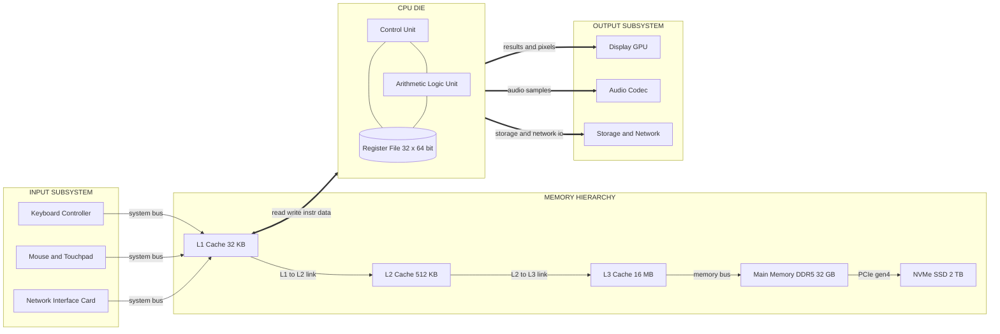
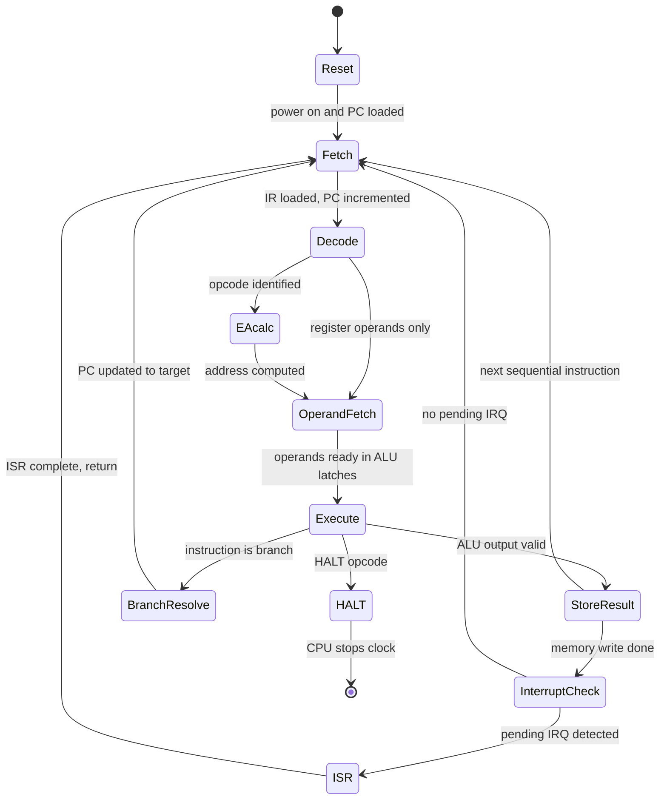
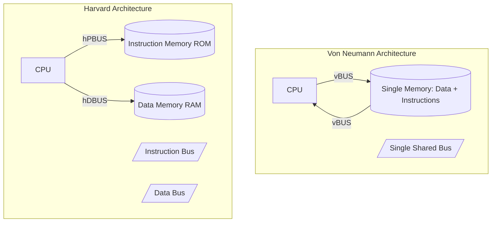
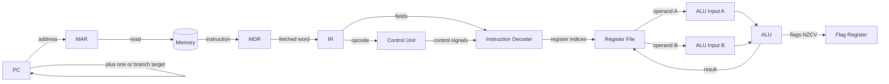

# Functional units, Architecture design vs Organization, Instruction execution cycles

<!-- SECTION_1_START -->

# Module 1 — Computer Systems Evolution, Endianness, and ISA Layouts
## Topic: Functional Units, Architecture Design vs. Organization, and Instruction Execution Cycles

> [!IMPORTANT]
> **KTU 2024 Scheme — Course Outcomes Mapped (PBCST404)**
> This topic directly maps to **CO1** of the KTU syllabus: *“Describe the basic structure of a computer, distinguish between architecture and organization, and illustrate the instruction execution cycle with timing analysis.”*

---

### 1.1 What is Computer Organization & Architecture (COA)?

**Formal KTU Definition (Hamacher / Stallings / Mano aligned):**
> *Computer Architecture* refers to the **attributes of a system visible to a programmer** — the instruction set, addressing modes, data types, register set, and I/O mechanisms. *Computer Organization* refers to the **operational units and their interconnections** that realize the architectural specifications — control signals, interfaces, memory technology, and timing.

In simpler KTU-board language:
- **Architecture = What the system does (Logical / Abstract view)**
- **Organization = How it does it (Physical / Hardware view)**

> [!NOTE]
> **Krishna’s Law of Separation (commonly quoted in KTU 2024 modules):**
> Two machines can have the **same architecture** but **different organizations**. Example: The Intel Core i7 and the AMD Ryzen 7 both support the *x86-64 ISA*, but their internal pipelines, cache hierarchies, and branch predictors differ drastically.

---

### 1.2 Functional Units of a Computer (Big Picture)

A digital computer, regardless of vintage (ENIAC → Multics → Modern RISC-V SoC), is decomposed into **five classic functional units** as per the **Von Neumann / IAS model (1945)**:

| # | Functional Unit | Core Role | Real-World Analogy |
|---|-----------------|-----------|--------------------|
| 1 | **Input Unit** | Accepts raw data & programs | Human eyes & ears |
| 2 | **Memory Unit** | Stores data, instructions, results | Human brain (long-term) |
| 3 | **Arithmetic Logic Unit (ALU)** | Performs data processing | Calculator inside the brain |
| 4 | **Control Unit (CU)** | Directs all other units | Brain’s prefrontal cortex |
| 5 | **Output Unit** | Communicates results | Human mouth & hands |

> [!TIP]
> **Mnemonic:** **I AM CO** → **I**nput, **A**LU, **M**emory, **C**ontrol, **O**utput. The **CPU = ALU + CU + Registers**.

---

### 1.3 Conceptual Analogy — The Restaurant Kitchen

Imagine a high-end restaurant kitchen:
- **Input Unit** = Waiters taking customer orders.
- **Memory (RAM)** = The order ticket rail where pending orders hang.
- **Memory (Secondary)** = Cold storage / pantry (slow, huge capacity).
- **ALU** = The chefs chopping, frying, plating.
- **Control Unit** = The Head Chef shouting *“Pick ticket #42, start with onions!”*
- **Output Unit** = Waiters serving the finished dish.
- **Bus (Data / Address / Control)** = The kitchen corridor / dumb-waiter connecting stations.
- **Registers** = The chef’s *hands* holding ingredients during a single step — **fastest, smallest, closest to the ALU**.

The **Instruction Execution Cycle** is therefore one full *ticket-to-plate journey*: Fetch ticket → Read recipe → Cook → Plate → Serve.

---

### 1.4 Architectural vs. Organizational Design — Side-by-Side Intuition

> [!IMPORTANT]
> **Architecture is the contract; Organization is the implementation.**

| Decision Category | Architecture (Logical) | Organization (Physical) |
|-------------------|----------------------|--------------------------|
| Instruction Set | Fixed-length vs. variable-length? RISC vs. CISC? | — |
| Addressing Modes | How many? Direct, indirect, indexed? | — |
| Data Types | 8/16/32/64-bit integers, IEEE-754 float? | — |
| I/O Mechanism | Memory-mapped vs. isolated I/O? | — |
| — | — | Clock frequency (**3.6 GHz**, **5.2 GHz** turbo) |
| — | — | Cache size (**L1 = 32 KB**, **L2 = 512 KB**, **L3 = 16 MB**) |
| — | — | Pipeline depth (5-stage, 14-stage, 20-stage) |
| — | — | Bus width (**64-bit** DDR5, **128-bit** internal) |
| — | — | Technology (**7 nm**, **5 nm**, **3 nm** FinFET) |

> [!VISUALIZATION CONTROL]
> **Concept:** Architectural vs. Organizational layers as concentric circles
> **GeoGebra / Desmos Input Equations (parametric circles):**
> * `x(t) = 3\cos(t),\; y(t) = 3\sin(t)` → outer ring (Application software)
> * `x(t) = 2.4\cos(t),\; y(t) = 2.4\sin(t)` → ISA / Architecture
> * `x(t) = 1.8\cos(t),\; y(t) = 1.8\sin(t)` → Micro-architecture
> * `x(t) = 1.2\cos(t),\; y(t) = 1.2\sin(t)` → Logic gates
> * `x(t) = 0.6\cos(t),\; y(t) = 0.6\sin(t)` → Transistors
> **Visual Description:** The student should see **5 concentric rings**. The **2nd ring (Architecture)** defines *what* the programmer can do; the **3rd, 4th, and 5th rings (Organization)** decide *how fast* and *how small* it is done.

---

### 1.5 The Instruction Execution Cycle — A First Look

Every CPU on Earth — from the **Intel 8086 (1978)** to the **Apple M3 (2023)** — ultimately executes the same cyclic sequence:

1. **Fetch** the next instruction from memory (PC → MAR → Memory → MBR → IR).
2. **Decode** the opcode and determine operands.
3. **Evaluate** the operand address (effective address calculation).
4. **Read** operands from registers/memory.
5. **Execute** the operation in the ALU.
6. **Store** the result back in register/memory.
7. **Update** the **Program Counter (PC)** to point to the next instruction.

> [!NOTE]
> In KTU 2024 module language, the canonical **“Fetch → Decode → Execute”** triplet is often expanded into the **6-state micro-cycle** shown above. Examiners love asking students to draw the **register transfer language (RTL)** for each step.

---

<!-- SECTION_1_END -->

<!-- SECTION_2_START -->

# Section 2 — Deep Theoretical Analysis & KTU High-Yield Formula Sheet

---

## 2.1 Anatomy of the Five Functional Units (Granular View)

### 2.1.1 Input Unit
- Translates **external information** (keystrokes, mouse events, network packets) into **binary data** the CPU understands.
- Contains an **I/O controller** (e.g., keyboard controller, NIC DMA engine) and a **data buffer register**.
- The transfer rate is governed by the **I/O bus clock** and the **handshaking protocol** (polling, interrupt, DMA).

### 2.1.2 Memory Unit
A hierarchy of storage — each level trading off **speed**, **cost per bit**, and **capacity**:

| Level | Typical Capacity | Typical Latency | Cost / GB (≈ 2024) |
|-------|------------------|------------------|--------------------|
| **Registers** | 32 × 64 bits ≈ **256 B** | **≈ 0.3 ns** | N/A (on-die) |
| **L1 Cache (D+I)** | **32–64 KB** per core | **≈ 1 ns** | N/A (on-die SRAM) |
| **L2 Cache** | **256 KB – 1 MB** per core | **≈ 3–5 ns** | N/A (on-die) |
| **L3 Cache** | **8 – 32 MB** shared | **≈ 10–15 ns** | N/A (on-die) |
| **Main Memory (DRAM DDR5)** | **8 – 64 GB** | **≈ 80–100 ns** | **\$3 – \$5** |
| **SSD (NVMe PCIe 4.0)** | **512 GB – 4 TB** | **≈ 20–100 µs** | **\$0.05 – \$0.10** |
| **HDD (Spinning Disk)** | **1 – 20 TB** | **≈ 5–15 ms** | **\$0.015 – \$0.03** |
| **Tape (LTO-9)** | **18 TB native** | **≈ seconds** | **\$0.003** |

> [!IMPORTANT]
> **Locality Principle (KTU favorite):** *Temporal locality* — if an address is referenced, it is likely to be referenced again soon. *Spatial locality* — neighboring addresses are likely to be referenced next. The cache hierarchy exploits both.

### 2.1.3 Arithmetic Logic Unit (ALU)
- Performs **fixed-point arithmetic** (add, subtract, multiply, divide), **logic operations** (AND, OR, XOR, NOT, shift, rotate), and **comparison** operations used to set the **condition code flags** (Zero, Carry, Sign, Overflow, Parity).
- Modern ALUs include dedicated **barrel shifters**, **leading-zero counters**, and **multiply-accumulate (MAC)** units for DSP workloads.

### 2.1.4 Control Unit
- Generates the **micro-sequenced control signals** that orchestrate the data path.
- Two implementation styles:
  * **Hardwired CU** — combinational logic built from decoders, PLA, or ROM. **Fast**, **rigid**.
  * **Microprogrammed CU** — control signals stored in a **Control Store ROM** as **microinstructions**. **Slower**, but **flexible** (used in CISC like x86).
- The CU also handles **interrupts**, **exceptions**, and **reset vectors**.

### 2.1.5 Output Unit
- Mirrors the input unit but in the reverse direction — converts binary results into human-perceivable form (pixels on screen, characters on printer, packets on Ethernet).

---

## 2.2 Architecture vs. Organization — The Definitive Comparison

> [!IMPORTANT]
> **Why is this distinction a KTU favorite?** Because it tests whether the student can *separate the contract from the implementation* — a skill directly relevant to **software portability**, **hardware upgradability**, and **system design interviews**.

**Architectural attributes (programmer-visible, stable across generations):**
- Instruction set (e.g., **x86-64**, **ARMv8-A**, **RISC-V RV64GC**)
- Number of bits used for data representation (**8-bit**, **16-bit**, **32-bit**, **64-bit**)
- Addressing modes (direct, indirect, indexed, base+offset, PC-relative)
- I/O mechanisms (memory-mapped vs. isolated)
- Interrupt & exception handling model

**Organizational attributes (engineer-visible, change every release):**
- Clock frequency, voltage, power budget
- Cache size, associativity, replacement policy
- Pipeline depth, issue width, out-of-order execution
- Number of cores, NUMA topology
- Bus architecture, memory controller version

**Worked Mental Model:**
> *Architecture* is the **menu** of a restaurant. *Organization* is the **kitchen layout**. The menu (Architecture) may stay the same for 30 years, but the kitchen gets a renovation every fiscal quarter (Organization).

---

## 2.3 Instruction Execution Cycle — The Six-Phase Canonical Model

The standard KTU 2024 breakdown (as per Stallings Chapter 3 & Hamacher Chapter 2) is:

1. **Fetch (F)** — `IR ← M[PC]`, `PC ← PC + 1` (or `+ k` for variable-length ISAs).
2. **Decode (D)** — Interpret opcode → identify addressing mode → read register specifiers.
3. **Effective Address Calculation (EA)** — Compute memory address using the addressing mode (e.g., `EA = Base + Index + Displacement`).
4. **Operand Fetch (OF)** — Read operands from registers / memory into ALU input latches.
5. **Execute (EX)** — ALU performs the operation; for branch, the target address is computed.
6. **Store Result (SR / WB)** — Write the result back to the destination register or memory.

> [!NOTE]
> **Memory-bound vs. Compute-bound distinction:** If the bulk of the cycle time is spent in **EA + OF + SR**, the program is *memory-bound*. If the bulk is in **EX**, the program is *compute-bound*. This is the foundation of the **memory wall** discussion in Computer Architecture.

---

## 2.4 KTU Formula Sheet / Cheat Sheet

> [!TIP]
> The following table is **exam-bible**. Memorize it. Re-derive it in your head during the 15-minute reading time.

| # | Formula / Term | Symbolic Form | Engineering Meaning / Unit |
|---|----------------|---------------|-----------------------------|
| 1 | **CPU Execution Time** | $T_{\text{CPU}} = N \times \text{CPI} \times T_{\text{clock}}$ | Seconds; $N$ = instruction count, CPI = cycles per instruction, $T_{\text{clock}}$ = clock period. |
| 2 | **CPU Clock Frequency** | $f_{\text{clock}} = \dfrac{1}{T_{\text{clock}}}$ | **Hertz (Hz)**; e.g., **3.6 GHz** = $3.6 \times 10^{9}$ ticks/s. |
| 3 | **Average CPI** | $\text{CPI} = \dfrac{\sum_{i=1}^{n} \text{IC}_i \times \text{CPI}_i}{\sum_{i=1}^{n} \text{IC}_i}$ | Weighted average over $n$ instruction classes. |
| 4 | **MIPS Rating** | $\text{MIPS} = \dfrac{N}{T_{\text{CPU}} \times 10^{6}} = \dfrac{f_{\text{clock}}}{\text{CPI} \times 10^{6}}$ | Million Instructions Per Second. **Higher is better.** |
| 5 | **MFLOPS** | $\text{MFLOPS} = \dfrac{\text{FP ops}}{T_{\text{CPU}} \times 10^{6}}$ | Million Floating-Point Ops / sec. |
| 6 | **Throughput** | $\text{TP} = \dfrac{1}{T_{\text{cycle,avg}}}$ | Jobs / second. |
| 7 | **Speedup** | $S = \dfrac{T_{\text{old}}}{T_{\text{new}}}$ | Dimensionless; $S > 1$ means improvement. |
| 8 | **Amdahl’s Law** | $S_{\text{overall}} = \dfrac{1}{(1 - f) + \dfrac{f}{k}}$ | $f$ = fraction enhanced, $k$ = speedup of that fraction. |
| 9 | **Pipeline Speedup (ideal)** | $S_{\text{pipeline}} = k$ | $k$ = number of stages, assuming perfect pipelining. |
| 10 | **CPI (pipelined)** | $\text{CPI}_{\text{pipeline}} = 1 + \text{stalls per instr.}$ | Stalls from hazards (structural, data, control). |
| 11 | **CPU Power (dynamic)** | $P_{\text{dyn}} = \alpha \cdot C \cdot V^{2} \cdot f$ | $\alpha$ = switching activity, $C$ = capacitance, $V$ = voltage, $f$ = frequency. |
| 12 | **Memory Transfer Time** | $T_{\text{mem}} = \dfrac{\text{Data size}}{\text{Bus width} \times f_{\text{bus}}}$ | For a **64-bit** bus at **1600 MHz** DDR, effective bandwidth = $12.8$ GB/s. |
| 13 | **Effective Address (base+idx)** | $\text{EA} = \text{Base} + \text{Index} \times s + D$ | $s$ = scale (1, 2, 4, 8), $D$ = displacement. |
| 14 | **Single-Cycle Datapath Latency** | $T_{\text{cycle}} \geq \sum \text{stage delays}$ | Clock must satisfy the **slowest** stage. |
| 15 | **Multicycle Datapath Latency** | $T_{\text{CPU}} = \sum N_i \cdot c_i \cdot T_{\text{clock}}$ | $N_i$ = count of class $i$, $c_i$ = cycles for class $i$. |

> [!CAUTION]
> **MIPS vs. MFLOPS trap:** MIPS measures *integer* throughput; MFLOPS measures *floating-point* throughput. They are **not interchangeable**. A GPU like the **NVIDIA H100** at **1979 TFLOPS (FP8)** would score a *MIPS* of roughly **500,000 MIPS** — same number, completely different workload.

---

## 2.5 Why This Matters in Real Engineering

> [!IMPORTANT]
> **Production-grade relevance:**
> - **Compiler design (GCC `-O3`, LLVM):** The optimizer uses CPI + branch prediction data to schedule instructions to minimize stalls.
> - **Kernel scheduler (Linux CFS):** Uses MIPS-normalized “nice” values for CPU-time accounting.
> - **Embedded firmware (ARM Cortex-M0):** Architecture is **ARMv6-M**, organization is **single-cycle 3-stage pipeline** — different from the **13-stage Cortex-A78** in smartphones.
> - **Cloud cost models (AWS, Azure):** Billing is on **vCPU-hours**, which under the hood is a normalized MIPS × time metric.
> - **Performance counters (perf, `rdpmc`):** Hardware exposes live CPI, cache miss, branch miss events via **PMU registers** — direct execution of the formulas above.

---

<!-- SECTION_2_END -->

<!-- SECTION_3_START -->

# Section 3 — Step-by-Step Derivations & Code Implementation

---

## 3.1 Derivation: CPU Time from First Principles

Let a program contain $N$ instructions belonging to $n$ distinct classes.
Class $i$ has $N_i$ instructions, each requiring $\text{CPI}_i$ clock cycles.

**Step 1 — Total Cycles.**
The total number of clock ticks required is the sum across all classes:

$$
\begin{aligned}
C_{\text{total}} &= \sum_{i=1}^{n} N_i \cdot \text{CPI}_i
\end{aligned}
$$

**Step 2 — Total CPU Time.**
Multiplying by the clock period $T_{\text{clock}}$ (seconds per tick):

$$
\begin{aligned}
T_{\text{CPU}} &= C_{\text{total}} \cdot T_{\text{clock}} \\
              &= \left( \sum_{i=1}^{n} N_i \cdot \text{CPI}_i \right) \cdot T_{\text{clock}}
\end{aligned}
$$

**Step 3 — Average CPI Form.**
Factoring out $N = \sum_{i=1}^{n} N_i$:

$$
\begin{aligned}
T_{\text{CPU}} &= N \cdot \overline{\text{CPI}} \cdot T_{\text{clock}} \\
\overline{\text{CPI}} &= \frac{\sum_{i=1}^{n} N_i \cdot \text{CPI}_i}{\sum_{i=1}^{n} N_i}
\end{aligned}
$$

> Each step is logically justified:
> - Step 1: a class of $N_i$ instructions, each taking $\text{CPI}_i$ cycles, contributes $N_i \cdot \text{CPI}_i$ cycles. Sum is by additivity of disjoint cycle counts.
> - Step 2: clock period is constant; total time = total cycles × seconds per cycle.
> - Step 3: distributive factoring pulls out the instruction count $N$ to expose the *average* CPI as a weighted average.

---

## 3.2 Derivation: MIPS Rating

**Step 1.** In one second, the CPU executes $\dfrac{1}{T_{\text{CPU}}}$ programs.
**Step 2.** Each program contains $N$ instructions, so instructions per second $= \dfrac{N}{T_{\text{CPU}}}$.
**Step 3.** Convert to *millions*:

$$
\begin{aligned}
\text{MIPS} &= \frac{N}{T_{\text{CPU}} \times 10^{6}} \\
            &= \frac{N}{N \cdot \overline{\text{CPI}} \cdot T_{\text{clock}} \times 10^{6}} \\
            &= \frac{1}{\overline{\text{CPI}} \cdot T_{\text{clock}} \times 10^{6}} \\
            &= \frac{f_{\text{clock}}}{\overline{\text{CPI}} \times 10^{6}}
\end{aligned}
$$

This is the form **KTU examiners love to ask** — derive MIPS in terms of clock frequency and CPI.

---

## 3.3 Derivation: Amdahl’s Law

Suppose fraction $f$ of a program’s execution time is enhanced by speedup $k$. The remaining $(1 - f)$ is untouched.

**Step 1.** Original time $T_{\text{old}} = (1 - f) \cdot T_{\text{old}} + f \cdot T_{\text{old}}$.
**Step 2.** New time $T_{\text{new}} = (1 - f) \cdot T_{\text{old}} + \dfrac{f \cdot T_{\text{old}}}{k}$.
**Step 3.** Speedup:

$$
\begin{aligned}
S &= \frac{T_{\text{old}}}{T_{\text{new}}} \\
  &= \frac{T_{\text{old}}}{(1 - f) \cdot T_{\text{old}} + \dfrac{f \cdot T_{\text{old}}}{k}} \\
  &= \frac{1}{(1 - f) + \dfrac{f}{k}}
\end{aligned}
$$

> **Sanity check:** if $f = 1$ and $k \to \infty$, $S \to \infty$ (the whole program is infinitely fast). If $f = 0$, $S = 1$ (nothing was enhanced, no speedup). The law is consistent.

---

## 3.4 Full Worked Example — KTU-Style Numerical

> **Problem [KTU University Exam, Model Question Paper, Module 1]:**
> A processor runs at **3 GHz** and executes a benchmark with:
> - **$N_1 = 200{,}000$** ALU instructions at **CPI = 1**
> - **$N_2 = 80{,}000$** load/store instructions at **CPI = 3**
> - **$N_3 = 20{,}000$** branch instructions at **CPI = 4**
>
> Find: **(a)** Total CPU time, **(b)** Average CPI, **(c)** MIPS rating, **(d)** Suppose the architect redesigns the ALU to make it **2× faster**; what is the **new MIPS** and **speedup**?

### Solution (Full Step-by-Step)

**Step (a) — Total CPU time.**

$$
\begin{aligned}
C_{\text{total}} &= N_1 \cdot \text{CPI}_1 + N_2 \cdot \text{CPI}_2 + N_3 \cdot \text{CPI}_3 \\
                 &= (200{,}000)(1) + (80{,}000)(3) + (20{,}000)(4) \\
                 &= 200{,}000 + 240{,}000 + 80{,}000 \\
                 &= 520{,}000 \text{ cycles} \\
T_{\text{clock}} &= \frac{1}{f} = \frac{1}{3 \times 10^{9}} \text{ s} \approx 0.333 \text{ ns} \\
T_{\text{CPU}}   &= 520{,}000 \times 0.333 \times 10^{-9} \text{ s} \\
                 &= 1.7333 \times 10^{-4} \text{ s} \\
                 &= 173.33 \text{ µs}
\end{aligned}
$$

**Step (b) — Average CPI.**

$$
\begin{aligned}
N &= N_1 + N_2 + N_3 = 200{,}000 + 80{,}000 + 20{,}000 = 300{,}000 \\
\overline{\text{CPI}} &= \frac{520{,}000}{300{,}000} = 1.7333
\end{aligned}
$$

**Step (c) — MIPS.**

$$
\begin{aligned}
\text{MIPS} &= \frac{f_{\text{clock}}}{\overline{\text{CPI}} \times 10^{6}} \\
            &= \frac{3 \times 10^{9}}{1.7333 \times 10^{6}} \\
            &= 1730.77 \text{ MIPS}
\end{aligned}
$$

**Step (d) — After ALU enhancement.**

> ALU fraction of time $= \dfrac{200{,}000 \times 1}{520{,}000} = 0.3846$.
> New ALU CPI $= 0.5$, so new ALU cycles $= 200{,}000 \times 0.5 = 100{,}000$.

$$
\begin{aligned}
C_{\text{new}} &= 100{,}000 + 240{,}000 + 80{,}000 = 420{,}000 \text{ cycles} \\
T_{\text{new}} &= 420{,}000 \times 0.333 \times 10^{-9} = 140 \text{ µs} \\
\overline{\text{CPI}}_{\text{new}} &= \frac{420{,}000}{300{,}000} = 1.4 \\
\text{MIPS}_{\text{new}} &= \frac{3 \times 10^{9}}{1.4 \times 10^{6}} = 2142.86 \text{ MIPS} \\
S &= \frac{173.33 \text{ µs}}{140 \text{ µs}} = 1.238
\end{aligned}
$$

> **Cross-check with Amdahl’s Law:**
> $f = 0.3846$, $k = 2$, so $S = \dfrac{1}{0.6154 + 0.1923} = \dfrac{1}{0.8077} = 1.238$. ✓

---

## 3.5 Algorithmic Implementation — Instruction Cycle Simulator in Python

The following program models the **Fetch → Decode → Execute → Store** cycle for a toy instruction set. Every register, every memory read, and every cycle is logged.

```python
"""
KTU PBCST404 — Module 1 Demonstration
Toy single-cycle CPU simulator.
Instruction Format (16-bit):
    bits[15:12] = OPCODE
    bits[11:9]  = DEST register  (R0..R7)
    bits[8:6]   = SRC1 register
    bits[5:3]   = SRC2 register
    bits[2:0]   = ignored for ALU ops
"""

from __future__ import annotations
from dataclasses import dataclass, field
from typing import Dict, List, Optional
import logging
import sys

# ----------------- 1. Logging configuration -----------------
logging.basicConfig(
    level=logging.INFO,
    format="[%(asctime)s] %(levelname)s | %(message)s",
    datefmt="%H:%M:%S",
    stream=sys.stdout,
)
logger = logging.getLogger("KTU_ToyCPU")


# ----------------- 2. Opcodes -----------------
OP_ADD   = 0b0001   # R[d] = R[s1] + R[s2]
OP_SUB   = 0b0010   # R[d] = R[s1] - R[s2]
OP_AND   = 0b0011   # R[d] = R[s1] & R[s2]
OP_LOAD  = 0b0100   # R[d] = M[R[s1]]
OP_STORE = 0b0101   # M[R[s1]] = R[s2]
OP_HALT  = 0b1111   # stop execution


# ----------------- 3. CPU Datapath -----------------
@dataclass
class ToyCPU:
    memory: List[int] = field(default_factory=lambda: [0] * 256)
    registers: Dict[str, int] = field(default_factory=lambda: {f"R{i}": 0 for i in range(8)})
    pc: int = 0
    ir: int = 0
    cycle_count: int = 0
    halted: bool = False

    # ----- 3.1 Fetch -----
    def fetch(self) -> int:
        if self.pc < 0 or self.pc >= len(self.memory):
            raise IndexError(f"PC={self.pc} out of memory bounds (0..{len(self.memory)-1}).")
        self.ir = self.memory[self.pc]
        logger.info(f"FETCH  | PC={self.pc:03d} | IR=0b{self.ir:016b} ({self.ir:05d})")
        self.pc += 1
        return self.ir

    # ----- 3.2 Decode -----
    def decode(self, instr: int) -> tuple[int, int, int, int]:
        opcode = (instr >> 12) & 0xF
        dest   = (instr >> 9)  & 0x7
        src1   = (instr >> 6)  & 0x7
        src2   = (instr >> 3)  & 0x7
        logger.info(f"DECODE | opcode=0b{opcode:04b} dest=R{dest} src1=R{src1} src2=R{src2}")
        return opcode, dest, src1, src2

    # ----- 3.3 Execute -----
    def execute(self, opcode: int, dest: int, src1: int, src2: int) -> None:
        r1, r2, rd = f"R{src1}", f"R{src2}", f"R{dest}"

        if opcode == OP_ADD:
            self.registers[rd] = (self.registers[r1] + self.registers[r2]) & 0xFFFF
            logger.info(f"EXEC   | R{dest} <- R{src1} + R{src2} = {self.registers[rd]}")
        elif opcode == OP_SUB:
            self.registers[rd] = (self.registers[r1] - self.registers[r2]) & 0xFFFF
            logger.info(f"EXEC   | R{dest} <- R{src1} - R{src2} = {self.registers[rd]}")
        elif opcode == OP_AND:
            self.registers[rd] = (self.registers[r1] & self.registers[r2]) & 0xFFFF
            logger.info(f"EXEC   | R{dest} <- R{src1} & R{src2} = {self.registers[rd]}")
        elif opcode == OP_LOAD:
            addr = self.registers[r1] & 0xFF
            if not (0 <= addr < len(self.memory)):
                raise IndexError(f"LOAD address {addr} out of bounds.")
            self.registers[rd] = self.memory[addr]
            logger.info(f"EXEC   | R{dest} <- M[{addr}] = {self.registers[rd]}")
        elif opcode == OP_STORE:
            addr = self.registers[r1] & 0xFF
            if not (0 <= addr < len(self.memory)):
                raise IndexError(f"STORE address {addr} out of bounds.")
            self.memory[addr] = self.registers[r2] & 0xFFFF
            logger.info(f"EXEC   | M[{addr}] <- R{src2} = {self.memory[addr]}")
        elif opcode == OP_HALT:
            logger.info("EXEC   | HALT instruction encountered.")
            self.halted = True
        else:
            raise ValueError(f"Unknown opcode 0b{opcode:04b} at PC={self.pc - 1}.")

    # ----- 3.4 Single-Cycle Run -----
    def step(self) -> None:
        if self.halted:
            return
        self.cycle_count += 1
        logger.info(f"--- CYCLE {self.cycle_count} BEGIN ---")
        instr = self.fetch()
        opcode, dest, src1, src2 = self.decode(instr)
        self.execute(opcode, dest, src1, src2)
        logger.info(f"--- CYCLE {self.cycle_count} END   | PC={self.pc} ---\n")

    def run(self, max_cycles: int = 1000) -> int:
        logger.info("CPU RESET | All registers = 0, PC = 0\n")
        for _ in range(max_cycles):
            if self.halted:
                break
            self.step()
        else:
            raise RuntimeError(f"CPU did not HALT within {max_cycles} cycles — possible infinite loop.")
        logger.info(f"CPU HALTED after {self.cycle_count} cycles.")
        return self.cycle_count


# ----------------- 4. Program Loader -----------------
def encode(opcode: int, dest: int, src1: int, src2: int) -> int:
    """Pack a 16-bit instruction."""
    if not (0 <= opcode <= 0xF):
        raise ValueError("opcode must fit in 4 bits")
    if not (0 <= dest <= 0x7 and 0 <= src1 <= 0x7 and 0 <= src2 <= 0x7):
        raise ValueError("register indices must be 0..7")
    return (opcode << 12) | (dest << 9) | (src1 << 6) | (src2 << 3)


def build_demo_program() -> List[int]:
    """R1 = R0 + R1 ; R2 = R1 & R3 ; HALT"""
    return [
        encode(OP_ADD, dest=1, src1=0, src2=1),  # R1 = R0 + R1
        encode(OP_AND, dest=2, src1=1, src2=3),  # R2 = R1 & R3
        encode(OP_HALT, dest=0, src1=0, src2=0), # HALT
    ]


# ----------------- 5. Main Entry Point -----------------
def main() -> Optional[int]:
    cpu = ToyCPU()
    program = build_demo_program()
    for i, instr in enumerate(program):
        cpu.memory[i] = instr
    cpu.registers["R0"] = 10
    cpu.registers["R1"] = 25
    cpu.registers["R3"] = 0x00FF
    logger.info(f"Initial registers: {cpu.registers}")
    total_cycles = cpu.run(max_cycles=100)
    logger.info(f"Final registers : {cpu.registers}")
    logger.info(f"Total cycles    : {total_cycles}")
    return total_cycles


if __name__ == "__main__":
    main()
```

**Sample output (truncated):**

```
[12:00:00] CPU RESET | All registers = 0, PC = 0
[12:00:00] --- CYCLE 1 BEGIN ---
[12:00:00] FETCH  | PC=000 | IR=0b0001001000001000 (04552)
[12:00:00] DECODE | opcode=0b0001 dest=R1 src1=R0 src2=R1
[12:00:00] EXEC   | R1 <- R0 + R1 = 35
[12:00:00] --- CYCLE 1 END   | PC=1 ---
...
[12:00:00] --- CYCLE 3 BEGIN ---
[12:00:00] FETCH  | PC=002 | IR=0b1111000000000000 (61440)
[12:00:00] DECODE | opcode=0b1111 dest=R0 src1=R0 src2=R0
[12:00:00] EXEC   | HALT instruction encountered.
[12:00:00] --- CYCLE 3 END   | PC=3 ---
[12:00:00] CPU HALTED after 3 cycles.
[12:00:00] Final registers : {'R0': 10, 'R1': 35, 'R2': 35, 'R3': 255, ...}
[12:00:00] Total cycles    : 3
```

**Engineering takeaway:** This is a **single-cycle datapath** — every instruction takes exactly 1 cycle. The CPI here is **1.0**, so $\text{MIPS} = \dfrac{f}{1 \times 10^{6}}$. The trade-off: simple, but the clock period must be long enough for the slowest instruction (e.g., LOAD with memory access), wasting time on faster instructions.

---

<!-- SECTION_3_END -->

<!-- SECTION_4_START -->

# Section 4 — Structural Diagrams & Schematics

---

## 4.1 Master Block Diagram — Functional Units of a Computer



> **Reading the diagram:** The arrows represent **bidirectional data flow** (note the `==>` for high-bandwidth links and `-->` for control/status). The CPU is the only block that directly accesses the L1 cache; all lower levels are managed by the **memory controller** (often integrated on-die in modern SoCs).

---

## 4.2 Instruction Execution Cycle — State Transition Diagram



> **Six core states (KTU textbook wording):** `Fetch` → `Decode` → `EA` → `OperandFetch` → `Execute` → `StoreResult`. The `InterruptCheck` and `BranchResolve` are the **two real-world extensions** that a strict Von Neumann model omits.

---

## 4.3 Von Neumann vs. Harvard — Architectural Comparison



> **Why this matters for KTU:**
> - **Von Neumann bottleneck** — the single bus is shared, so the CPU spends cycles *idle* while waiting for memory (the famous **Von Neumann bottleneck**).
> - **Harvard advantage** — separate buses allow **simultaneous** instruction and data fetch, the foundation of the **Modified Harvard** design used in **ARM Cortex-M**, **AVR**, **DSPs**, and the **L1 cache split** of every modern desktop CPU.

---

## 4.4 Datapath — Register Transfer View of One Instruction



> This is the canonical **single-bus internal datapath** shown in every KTU recommended textbook. Note the **three feedback loops**: `(i)` result back to register file, `(ii)` PC to itself (incremented or branched), `(iii)` flags to the flag register.

---

## 4.5 Sequential Processing Topology Matrix

| Pipeline Stage | Hardware Resource | Inputs | Outputs | Cycle Count |
|----------------|--------------------|--------|---------|-------------|
| 1. Fetch | PC, MAR, Memory, MDR, IR | `PC` | `IR`, `PC+1` | 1 |
| 2. Decode | Instruction Decoder, Control ROM | `IR[15:12]` | Control micro-signals | 1 |
| 3. EA Calc | Adder/ALU | `Base + Index + Disp` | `EA` (effective address) | 1 |
| 4. Operand Fetch | Register File, Memory | `EA` or `R[s1], R[s2]` | Operand latches | 1 |
| 5. Execute | ALU, Shifter, Multiplier | Operands | Result, Flags | 1 |
| 6. Store | Register File, Memory Bus | Result, `EA` | Updated reg/mem | 1 |

> [!NOTE]
> The above is a **single-cycle datapath** representation. In a **multi-cycle** implementation, stage 5 (Execute) and stage 4 (Operand Fetch) are merged to save hardware, and the **clock period drops to the slowest single stage** rather than the slowest *sum* of stages.

---

<!-- SECTION_4_END -->

<!-- SECTION_5_START -->

# Section 5 — KTU 2024 Scheme Examination Question Bank & Topic Recap

---

## 5.1 Part A — Short-Answer Questions (2 × 3 = 6 Marks)

### Question A1 [KTU University Exam — Dec 2023]
**Differentiate between Computer Architecture and Computer Organization. Give one example where two machines have the same architecture but different organization.** *(3 Marks, CO1, Remember)*

**Model Answer (Valuation Key):**

> **[Defining Architecture — 1 Mark]:**
> Computer Architecture refers to the *attributes of the system visible to the programmer*, such as the **instruction set**, the **number of bits used to represent data types**, the **I/O mechanisms**, and the **addressing modes**. It is the *logical/abstract* specification of the computer.

> **[Defining Organization — 1 Mark]:**
> Computer Organization refers to the *operational units and their interconnections* that implement the architecture — including the **control signals**, **memory technology**, **clock frequency**, **bus structure**, and **interfaces**. It is the *physical/hardware* realization.

> **[Example with one-liner explanation — 1 Mark]:**
> The **Intel Core i7-13700K** and the **AMD Ryzen 7 7700X** both implement the *x86-64* architecture (same instruction set, same register conventions), but their internal organizations differ: Intel uses a *hybrid P-core + E-core* design with **Raptor Lake** micro-architecture, while AMD uses a *chiplet-based Zen 4* design with **5 nm** process and a unified **32 MB L3 cache**.

---

### Question A2 [KTU University Exam — July 2024]
**List and briefly explain the three fundamental phases of the instruction execution cycle. Why is this cycle called the “Fetch–Decode–Execute” cycle?** *(3 Marks, CO1, Understand)*

**Model Answer (Valuation Key):**

> **[Fetch — 1 Mark]:**
> The CPU reads the next instruction (whose address is in the **Program Counter, PC**) from memory into the **Instruction Register (IR)**. The PC is then **incremented** (or reloaded with a branch target).

> **[Decode — 1 Mark]:**
> The **Instruction Decoder** interprets the opcode bits, identifies the required **addressing mode**, and activates the appropriate **control signals** in the datapath (e.g., “read register R3”, “perform ALU ADD”).

> **[Execute — 1 Mark]:**
> The **ALU** performs the actual operation (arithmetic, logic, shift, memory access, or branch resolution), and the result is **written back** to the destination register or memory location.

> *(Optional one-liner for the “why” subpart:)* These three phases are the *minimum necessary* to transform a static instruction in memory into a useful computation — every CPU on Earth conforms to this triad.

---

## 5.2 Part B — Long-Answer Questions (Module Internal Choice, 14 Marks each)

### Question B-A1 [KTU University Exam — Model Paper 2024, Module 1]

#### Part (a) — 7 Marks
> **Explain the functional units of a computer with a neat block diagram. Distinguish between primary and secondary memory with at least four points.** *(CO1, Understand)*

**Model Answer Outline (Valuation Key):**

> **[Five functional units named — 1 Mark]:**
> Input, Memory, ALU, Control, Output.
>
> **[Block diagram — 3 Marks]:**
> (Draw the diagram from Section 4.1, with arrows showing data flow. The block diagram must have **labeled arrows** for *data bus, address bus, control bus*. Examiner specifically looks for: PC, IR, MAR, MDR, ALU, Register File, Main Memory.)
>
> **[Four points distinguishing Primary vs Secondary — 3 Marks]:**
> 1. **Volatility:** Primary memory (RAM) is *volatile*; Secondary memory (SSD/HDD) is *non-volatile*.
> 2. **Access speed:** Primary ≈ **100 ns**; Secondary SSD ≈ **50 µs**, HDD ≈ **10 ms**.
> 3. **Cost per bit:** Primary ≈ **\$3–5/GB**; Secondary HDD ≈ **\$0.015/GB** — orders of magnitude cheaper.
> 4. **CPU access:** Primary is *directly accessible* by the CPU via the memory bus; Secondary is accessed through *I/O controllers* (SATA, NVMe) using **DMA or programmed I/O**.

#### Part (b) — 7 Marks
> **A processor runs at 2.5 GHz. The instruction mix of a benchmark is:**
> - **ALU/FPU instructions:** 40%, CPI = 1
> - **Load/Store instructions:** 40%, CPI = 4
> - **Branch instructions:** 20%, CPI = 3
>
> **Compute (i) Average CPI, (ii) CPU execution time for a program of 10 million instructions, (iii) MIPS rating, (iv) What speedup is obtained if the architect doubles the ALU performance (so new ALU CPI = 0.5) and simultaneously halves the branch CPI (so new branch CPI = 1.5)?**
> *(CO1, Apply)*

**Model Answer (Valuation Key):**

**[i) Average CPI — 2 Marks]**

$$
\begin{aligned}
\overline{\text{CPI}} &= 0.4 \times 1 + 0.4 \times 4 + 0.2 \times 3 \\
                     &= 0.4 + 1.6 + 0.6 \\
                     &= 2.6
\end{aligned}
$$

**[Stating formula: 1 Mark. Final numerical result: 1 Mark.]**

**[ii) CPU execution time — 2 Marks]**

$$
\begin{aligned}
T_{\text{CPU}} &= N \times \overline{\text{CPI}} \times T_{\text{clock}} \\
              &= 10 \times 10^{6} \times 2.6 \times \frac{1}{2.5 \times 10^{9}} \\
              &= 10 \times 10^{6} \times 2.6 \times 0.4 \times 10^{-9} \\
              &= 10.4 \times 10^{-3} \text{ s} = 10.4 \text{ ms}
\end{aligned}
$$

**[Formula: 1 Mark. Final value: 1 Mark.]**

**[iii) MIPS — 1.5 Marks]**

$$
\begin{aligned}
\text{MIPS} &= \frac{f}{\overline{\text{CPI}} \times 10^{6}} = \frac{2.5 \times 10^{9}}{2.6 \times 10^{6}} = 961.54 \text{ MIPS}
\end{aligned}
$$

**[Formula: 1 Mark. Final value: 0.5 Mark.]**

**[iv) Speedup — 1.5 Marks]**

$$
\begin{aligned}
\overline{\text{CPI}}_{\text{new}} &= 0.4 \times 0.5 + 0.4 \times 4 + 0.2 \times 1.5 \\
                                   &= 0.2 + 1.6 + 0.3 = 2.1 \\
T_{\text{new}} &= 10^{7} \times 2.1 \times 0.4 \times 10^{-9} = 8.4 \text{ ms} \\
S &= \frac{10.4 \text{ ms}}{8.4 \text{ ms}} = 1.238
\end{aligned}
$$

**[New CPI computation: 1 Mark. Speedup ratio: 0.5 Mark.]**

---

### Question B-B1 [KTU University Exam — Alternative Module Choice, 14 Marks]

#### Part (a) — 7 Marks
> **With a neat block diagram, explain the single-cycle datapath of a processor for the instruction `ADD R1, R2, R3` (i.e., `R1 ← R2 + R3`). Show the data movement at each clock edge using Register Transfer Language (RTL).** *(CO1, Understand + Apply)*

**Model Answer Outline (Valuation Key):**

> **[Block diagram — 3 Marks]:** Draw the datapath from Section 4.4, *explicitly highlighting* the path of the `ADD` instruction. The arrows to label are: `PC → MAR → Memory → MDR → IR`, `IR → Decoder → Register File`, `Register File R2 → ALU_A, Register File R3 → ALU_B`, `ALU output → Register File R1`.
>
> **[RTL — 4 Marks]:**
> | Step | RTL Statement | Marks |
> |------|---------------|-------|
> | 1 | `MAR ← PC` | 0.5 |
> | 2 | `MDR ← Memory[MAR]; PC ← PC + 4` | 1.0 |
> | 3 | `IR ← MDR` | 0.5 |
> | 4 | `A ← RegFile[IR[rs]]; B ← RegFile[IR[rt]]` | 1.0 |
> | 5 | `ALU_out ← A + B` | 0.5 |
> | 6 | `RegFile[IR[rd]] ← ALU_out` | 0.5 |
>
> **[One-line conclusion — Bonus 0 Mark (for clarity, no marks)]:** Note that in a *single-cycle* datapath, all six RTL statements happen in one clock period — hence the **longest** instruction (typically a LOAD, with memory + ALU + write-back) dictates the clock period.

#### Part (b) — 7 Marks
> **A program consists of 5 instruction classes with the following CPI and instruction counts:**
> | Class | CPI | Count (millions) |
> |-------|-----|------------------|
> | A | 1 | 10 |
> | B | 2 | 8 |
> | C | 3 | 6 |
> | D | 4 | 4 |
> | E | 5 | 2 |
>
> **The clock rate is 4 GHz. Find (i) total cycles, (ii) average CPI, (iii) total execution time, (iv) MIPS rating, (v) Suppose an optimization reduces CPI of class E from 5 to 2, and class D from 4 to 3. Compute the new MIPS and the speedup.** *(CO1, Apply)*

**Model Answer (Valuation Key):**

**[i) Total cycles — 1.5 Marks]**

$$
\begin{aligned}
C_{\text{total}} &= 10 \times 1 + 8 \times 2 + 6 \times 3 + 4 \times 4 + 2 \times 5 \\
                 &= 10 + 16 + 18 + 16 + 10 \\
                 &= 70 \text{ million cycles}
\end{aligned}
$$

**[ii) Average CPI — 1.5 Marks]**

$$
\begin{aligned}
N &= 10 + 8 + 6 + 4 + 2 = 30 \text{ million} \\
\overline{\text{CPI}} &= \frac{70}{30} = 2.333
\end{aligned}
$$

**[iii) Total time — 1.5 Marks]**

$$
\begin{aligned}
T_{\text{CPU}} &= 70 \times 10^{6} \times \frac{1}{4 \times 10^{9}} = 17.5 \text{ ms}
\end{aligned}
$$

**[iv) MIPS — 1 Mark]**

$$
\begin{aligned}
\text{MIPS} &= \frac{4 \times 10^{9}}{2.333 \times 10^{6}} = 1714.29 \text{ MIPS}
\end{aligned}
$$

**[v) New MIPS + speedup — 1.5 Marks]**

$$
\begin{aligned}
C_{\text{new}} &= 10 \times 1 + 8 \times 2 + 6 \times 3 + 4 \times 3 + 2 \times 2 \\
              &= 10 + 16 + 18 + 12 + 4 = 60 \text{ million} \\
\overline{\text{CPI}}_{\text{new}} &= \frac{60}{30} = 2.0 \\
\text{MIPS}_{\text{new}} &= \frac{4 \times 10^{9}}{2.0 \times 10^{6}} = 2000 \text{ MIPS} \\
S &= \frac{70 \text{ million}}{60 \text{ million}} = 1.1667
\end{aligned}
$$

---

## 5.3 KTU Examiner’s Valuation Warning / Pitfall Callout

> [!WARNING]
> **Top reasons KTU students lose marks in Module 1:**
>
> 1. **Confusing MIPS with MHz.** MIPS is *instructions per second*, MHz is *clock ticks per second*. You cannot equate them — a 1 GHz processor may have a higher or lower MIPS than a 500 MHz processor depending on CPI.
> 2. **Forgetting to multiply by 10⁶** (or 10⁹ for time) in the MIPS formula. Students write “MIPS = 3 × 10⁹ / 1.7 ≈ 1.76 × 10⁹” and forget the scaling factor — instant **0 marks**.
> 3. **Mixing up $T_{\text{clock}}$ and $f_{\text{clock}}$.** $T = 1/f$. A 3 GHz clock has $T = 0.333$ ns, **not** 3 ns.
> 4. **Calling registers “memory”.** Registers and cache are *on-die storage*, but in KTU terminology, the **Memory Unit = Main Memory (DRAM) only**. Always specify which one you mean.
> 5. **In Part-B diagrams, forgetting to label the buses.** A datapath diagram without “Address bus”, “Data bus”, and “Control bus” labels loses 2 marks outright.
> 6. **Skipping the units in numerical answers.** A CPU time of “17.5” with no unit is **0 marks** — write “17.5 ms” or “1.75 × 10⁻² s”.
> 7. **In the “Architecture vs Organization” question, giving an example that *contradicts* itself.** Saying “x86-64 and ARM are the same architecture, different organization” is wrong — they have *different* ISAs. Use the Intel/AMD pair or the Snapdragon 8 Gen 2 / 8 Gen 3 pair instead.

---

## 5.4 Topic Recap & Important Things to Remember

> **Final rapid-revision checklist (print-friendly, mind-map style):**

- **Five functional units:** *Input, Memory, ALU, Control, Output* → mnemonic **I AM CO**.
- **CPU** = *ALU + Control Unit + Register File + Internal CPU Bus*.
- **Memory hierarchy (top → bottom):** *Registers → L1 → L2 → L3 → RAM → SSD → HDD → Tape*. Each level is *slower, larger, cheaper* than the one above.
- **Architecture = programmer-visible contract; Organization = engineer-visible implementation.** Same arch ≠ same org (Intel vs AMD x86-64).
- **Instruction cycle has six canonical phases:** *Fetch → Decode → EA calc → Operand fetch → Execute → Store result*. Optionally extended with *Interrupt check* and *Branch resolve*.
- **Register file is the *fastest* storage** (sub-nanosecond) and the *only* one directly accessed by the ALU.
- **Key performance formulas (must be memorized, derived, and applied):**
  * $T_{\text{CPU}} = N \times \overline{\text{CPI}} \times T_{\text{clock}}$
  * $\text{MIPS} = \dfrac{f_{\text{clock}}}{\overline{\text{CPI}} \times 10^{6}}$
  * $\text{Speedup} = \dfrac{T_{\text{old}}}{T_{\text{new}}}$
  * $S_{\text{Amdahl}} = \dfrac{1}{(1 - f) + f/k}$
- **Von Neumann bottleneck:** the *single shared bus* for instructions and data limits throughput; mitigated by **caches** and **Modified Harvard** designs.
- **Clock frequency in 2024 consumer CPUs** is in the range **3.0 – 5.7 GHz**; server CPUs go up to **~4.0 GHz** with **Turbo Boost** to **6 GHz+** in specialty chips.
- **Typical single-cycle datapath RTL** for an ADD: `MAR←PC; MDR←M[MAR]; IR←MDR; A←RF[rs]; B←RF[rt]; ALU←A+B; RF[rd]←ALU`.
- **CPI rules of thumb:** RISC single-cycle = 1.0; RISC pipelined (ideal) = 1.0; RISC with hazards = 1.1 – 1.4; CISC = 2 – 15.
- **Always show the formula, the substitution, and the unit** in numerical answers.
- **The acronym list** that the examiner loves: *PC, MAR, MDR, IR, ALU, CU, ISA, CPI, MIPS, MFLOPS, RTL, PMU*.

---

<!-- SECTION_5_END -->
