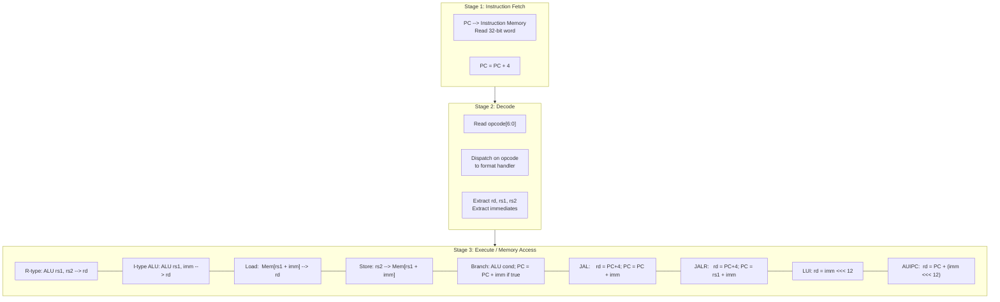
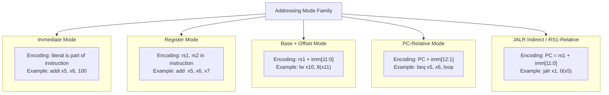

# ISA: RISC-V open-standard ISA framework, Registers, Primitive data widths, Addressing modes, instruction types

<!-- SECTION_1_START -->

# RISC-V Open-Standard ISA Framework

## 1.1 Formal Definition

The **Instruction Set Architecture (ISA)** is the *contractual boundary* between hardware and software, defining the programmer-visible behavior of the processor — its registers, memory model, data types, addressing modes, and the binary encoding of every machine instruction. In the **KTU 2024 Scheme** terminology, the ISA is treated as the *abstract machine* that compilers target and that hardware implements.

**RISC-V** (pronounced *"risk-five"*) is an **open-standard ISA** originated at the **University of California, Berkeley in 2010**, now governed by the non-profit **RISC-V International**. It is a *clean-slate* Reduced Instruction Set Computer (RISC) design that is **free, open, and modular**.

> [!IMPORTANT]
> **Why RISC-V matters to KTU examiners:** RISC-V is the **de-facto pedagogical ISA** in modern Computer Organization courses (including Hennessy & Patterson's *Computer Architecture: A Quantitative Approach*). KTU 2024 explicitly positions RISC-V as the *reference architecture* for understanding how real CPUs work.

### 1.2 The Modular ISA Stack

RISC-V is built like **Lego blocks**. Every chip implements:

$$
\text{RV}\langle base \rangle + \text{Extensions} \quad \text{where} \quad base \in \{32, 64, 128\}
$$

| Layer | Symbol | Meaning | Purpose |
|---|---|---|---|
| Base | **RV32I** / **RV64I** / **RV128I** | Integer ISA (mandatory) | Registers, ALU ops, branches, loads/stores |
| Extension | **M** | Integer Multiply/Divide | `mul`, `div`, `rem` family |
| Extension | **A** | Atomic | `lr/sc`, `amo*` for locks |
| Extension | **F** | Single-precision FP | 32-bit floating point |
| Extension | **D** | Double-precision FP | 64-bit floating point |
| Extension | **C** | Compressed | 16-bit instruction forms |
| Extension | **V** | Vector | SIMD/Vector processing |

A typical microcontroller uses `RV32IMC`; a high-end application processor uses `RV64GCV` (G = IMAFD).

### 1.3 Intuition — The Swiss Army Knife Analogy

Think of the **ISA** as a *kitchen's menu* at a restaurant. A customer (the programmer) can only order items on the menu. The chef (hardware) is free to cook them any way internally, but the dish that leaves the kitchen *must* match the menu description exactly.

> **RISC-V = The IKEA of ISAs.** IKEA ships *flat-pack*, *standardized parts* (modular extensions) that any manufacturer can assemble into a custom table, chair, or wardrobe. Proprietary ISAs (ARM, x86) are like pre-built furniture — you must pay royalties and cannot modify the design.

A simpler analogy: imagine a **remote control** for a TV. The buttons (instructions) are standardized, but the *internal circuitry* (microarchitecture) is a black box. RISC-V says: *"Here is the exact list of buttons. Build your remote however you want — pipe-cleaners, gold plating, or basic plastic — but the buttons must send these exact signals."*

> [!NOTE]
> **Key take-away:** RISC-V does **not** prescribe *how* to build the CPU. It only prescribes *what every CPU must do* when it executes each instruction. This is the central abstraction of computer architecture.

### 1.4 Why Open-Standard ISA?

- **No licensing fees** — ISA is royalty-free forever.
- **No vendor lock-in** — own your silicon, your firmware, your future.
- **Modular scalability** — start at 32-bit, scale to 128-bit without rewriting.
- **Pedagogical clarity** — architecture text-books use it as the reference model.
- **Industrial adoption** — SiFive, Qualcomm, NVIDIA (for microcontrollers), Western Digital, Alibaba T-Head, Google, India (C-DAC's indigenous *Vega* processors).

> [!VISUALIZATION CONTROL]
> **Concept:** Modular RISC-V ISA Stack
> **Visualization description:** Imagine three stacked horizontal bars. The *base bar* (widest, mandatory) is the **RV32I/RV64I** integer core. Sitting on top are smaller, optional *extension bars* labelled **M**, **A**, **F**, **D**, **C**, **V** — each can be added or removed independently. A typical configuration forms a staircase where optional extensions "plug in" orthogonally.

<!-- SECTION_1_END -->

<!-- SECTION_2_START -->

# Deep Theoretical Analysis & KTU Formula Sheet

## 2.1 Architectural Philosophy

RISC-V is engineered around four hard-won lessons from 40+ years of ISA design (MIPS, SPARC, ARM, x86):

1. **Simplicity favours regularity** — every instruction is exactly **32 bits** wide (in base ISA), and the fields line up across formats.
2. **Smaller is faster** — only ~50 base instructions, easily fitting in I-cache.
3. **Good design demands good compromises** — register count of **32** balances data-path width vs. context-switch cost.
4. **Make the common case fast** — the *base* covers **~99 %** of compiled code; specialised extensions handle the rest.

## 2.2 The General-Purpose Register File

RISC-V (RV32I/RV64I) exposes **32 architectural integer registers**, named `x0` through `x31`, plus the **Program Counter (PC)** which is *not* part of the integer file but is implicitly accessed by branch/jump instructions.

> [!IMPORTANT]
> **`x0` is hard-wired to constant zero.** Writing to it has no effect; reading it always returns `0`. This single design decision eliminates the need for a dedicated "clear register" instruction found in older ISAs.

### 2.2.1 ABI Register Aliases

Compilers and operating systems use **Application Binary Interface (ABI)** names to give registers a *semantic role*. The hardware register numbers are fixed; the roles are conventions enforced by the toolchain.

| Reg # | ABI Name | Description | Saver |
|---|---|---|---|
| x0 | `zero` | Hard-wired zero | — |
| x1 | `ra` | Return address | Caller |
| x2 | `sp` | Stack pointer | Callee |
| x3 | `gp` | Global pointer | — |
| x4 | `tp` | Thread pointer | — |
| x5 – x7 | `t0 – t2` | Temporaries | Caller |
| x8 | `s0` / `fp` | Saved reg / Frame pointer | Callee |
| x9 | `s1` | Saved register | Callee |
| x10 – x11 | `a0 – a1` | Args / Return values | Caller |
| x12 – x17 | `a2 – a7` | Function arguments | Caller |
| x18 – x27 | `s2 – s11` | Saved registers | Callee |
| x28 – x31 | `t3 – t6` | Temporaries | Caller |

> [!NOTE]
> **Caller-saved vs Callee-saved:** If a function `foo` calls `bar` and `bar` overwrites a caller-saved register, then `foo` must *save it itself* before the call. Callee-saved registers are *guaranteed intact* after the call — `bar` is responsible for saving/restoring them.

## 2.3 Primitive Data Widths

RISC-V defines memory as a flat array of **8-bit bytes**, addressable on **byte** granularity. The base integer width is fixed by the variant — **XLEN = 32** for RV32I, **XLEN = 64** for RV64I.

| Width | Suffix | Bytes | Range (signed, RV32) | Use-case |
|---|---|---|---|---|
| 8-bit | `b` (byte) | **1** | $-128$ to $127$ | Characters, small integers |
| 16-bit | `h` (halfword) | **2** | $-32768$ to $32767$ | Unicode, audio samples |
| 32-bit | `w` (word) | **4** | $\pm 2.1 \times 10^9$ | Default `int` in C, RV32 native |
| 64-bit | `d` (doubleword) | **8** | $\pm 9.2 \times 10^{18}$ | `long long`, RV64 native |
| 128-bit | `q` (quadword) | **16** | $\pm 1.7 \times 10^{38}$ | RV128, cryptographic ops |

> [!IMPORTANT]
> **RISC-V is little-endian by default.** The *least-significant byte* of a multi-byte value is stored at the *lowest* memory address. This is the convention used by x86, ARM (most profiles), and Windows/Linux. Big-endian variants exist (`RV32B`) but are rarely used.

## 2.4 Addressing Modes

RISC-V supports a *minimal* but *sufficient* set of addressing modes. Fewer modes ⇒ simpler hardware ⇒ higher clock frequency.

| # | Mode | Syntax | Effective Address (EA) | Used By |
|---|---|---|---|---|
| 1 | **Immediate** | `addi x5, x6, 100` | $EA = 100$ (literal in insn) | ALU arithmetic |
| 2 | **Register** | `add x5, x6, x7` | $EA = \text{Reg}[x6] + \text{Reg}[x7]$ | R-type arithmetic |
| 3 | **Base + Offset** | `lw x10, 8(x11)` | $EA = \text{Reg}[x11] + 8$ | Loads / Stores |
| 4 | **PC-Relative** | `beq x5, x6, label` | $EA = PC + \text{offset}$ | Branches & `auipc` |
| 5 | **Pseudo-direct** | `jal x1, func` | $EA = PC_{31..12} \,\|\, \text{imm}$ | `jal` (J-type) |

> [!NOTE]
> **No auto-increment, no indexed, no memory-indirect modes.** RISC-V's design report explicitly states these complex modes were dropped because they are slow in hardware and rarely useful to compilers. The base+offset mode covers **> 99 %** of memory accesses.

## 2.5 Instruction Formats

Every RISC-V base instruction is **32 bits** (4 bytes). The 32 bits are divided into *fields*, and there are **exactly six** formats. Every field's bit position is fixed across all formats — this regularity makes decoding hardware trivially fast.

| Format | Bits [31–25] | Bits [24–20] | Bits [19–15] | Bits [14–12] | Bits [11–7] | Bits [6–0] |
|---|---|---|---|---|---|---|
| **R** | `funct7` | `rs2` | `rs1` | `funct3` | `rd` | `opcode` |
| **I** | `imm[11:0]` | ` |  | `rs1` | `funct3` | `rd` | `opcode` |
| **S** | `imm[11:5]` | `rs2` | `rs1` | `funct3` | `imm[4:0]` | `opcode` |
| **B** | `imm[12,10:5]` | `rs2` | `rs1` | `funct3` | `imm[4:1,11]` | `opcode` |
| **U** | `imm[31:12]` | ` |  | ` | ` | `rd` | `opcode` |
| **J** | `imm[20,10:1,11,19:12]` | ` |  | ` | ` | `rd` | `opcode` |

> [!IMPORTANT]
> **`opcode` is always 7 bits at the LSB end (bits 6:0).** The decoder reads `opcode` first, which uniquely identifies the *format* and the *category* (ALU, load, store, branch, jump, etc.). This is why RISC-V decoders are famously tiny — 7 bits × 4 decode stages ≈ 1 NAND-gate per signal.

## 2.6 The Six Core Instruction Types (Categories)

| # | Category | Format | Examples | Operation |
|---|---|---|---|---|
| 1 | **R-type** (Register–Register) | R | `add`, `sub`, `and`, `or`, `xor`, `sll`, `srl`, `sra`, `slt`, `sltu` | $\text{rd} = \text{rs1} \; \text{op} \; \text{rs2}$ |
| 2 | **I-type** (Immediate ALU) | I | `addi`, `andi`, `ori`, `xori`, `slli`, `srli`, `srai`, `slti`, `sltiu` | $\text{rd} = \text{rs1} \; \text{op} \; \text{imm}_{12}$ |
| 3 | **Load** | I | `lb`, `lh`, `lw`, `lbu`, `lhu` (RV32) + `ld`, `lwu` (RV64) | $\text{rd} = \text{Mem}[\text{rs1} + \text{imm}]$ |
| 4 | **Store** | S | `sb`, `sh`, `sw` (RV32) + `sd` (RV64) | $\text{Mem}[\text{rs1} + \text{imm}] = \text{rs2}$ |
| 5 | **Branch** | B | `beq`, `bne`, `blt`, `bge`, `bltu`, `bgeu` | $\text{PC} = \text{PC} + \text{imm}$ if condition |
| 6 | **Jump / Link** | I + J | `jal` (J), `jalr` (I) | $\text{rd} = \text{PC}+4$; $\text{PC} = \text{target}$ |
| 7 | **Upper Immediate** | U | `lui`, `auipc` | `lui`: $\text{rd} = \text{imm}_{20} \ll 12$ |
| 8 | **System / Privilege** | I | `ecall`, `ebreak`, `csrrw`, … | OS / Trap handling |

## 2.7 KTU High-Yield Formula Cheat Sheet

| # | Concept | Expression | Notes |
|---|---|---|---|
| 1 | XLEN (native word) | $\text{XLEN} \in \{32, 64, 128\}$ | Fixed per base variant |
| 2 | Effective addr (load/store) | $EA = \text{Reg}[rs1] + \text{imm}_{signed}$ | sign-extended to XLEN |
| 3 | PC-relative branch target | $EA = \text{PC} + \text{imm}_{signed \times 2}$ | imm is in *multiples of 2* |
| 4 | `JAL` target | $EA = \text{PC} + \text{imm}_{signed \times 2}$ | JAL imm in multiple of 2 |
| 5 | `LUI` loads upper | $\text{rd} = \text{imm}_{20} \ll 12$ | Lower 12 bits become zero |
| 6 | `AUIPC` builds PC-relative | $\text{rd} = \text{PC} + (\text{imm}_{20} \ll 12)$ | Used to construct long branches |
| 7 | Branch offset range | $-2^{12} \le \text{offset} \le 2^{12}-1$ (steps of 2) | $\pm 4$ KB |
| 8 | `JAL` offset range | $-2^{20} \le \text{offset} \le 2^{20}-1$ (steps of 2) | $\pm 1$ MB |
| 9 | `JALR` offset range | $-2^{11} \le \text{offset} \le 2^{11}-1$ (steps of 2) | $\pm 2$ KB (asymmetric) |
| 10 | Sign-extension | $\text{imm}_{12} \to \text{XLEN bits}$ | 12-bit signed → XLEN signed |
| 11 | Hex immediate example | `0xFFFF_F000` = $-4096_{10}$ | Sign extension in action |
| 12 | Endianness | Little-endian by default | LSB at lowest address |

> [!NOTE]
> **Real-world engineering utility:** RISC-V today powers everything from the **Western Digital SweRVE HDD controllers** (billions shipped) to the **European Processor Initiative (EPI)'s Rhea** server chip and India's indigenous **Vega** microprocessors from C-DAC. The clean ISA makes formal verification and security auditing dramatically easier than proprietary ISAs.

<!-- SECTION_2_END -->

<!-- SECTION_3_START -->

# Step-by-Step Derivations & Symbolic Implementation

## 3.1 Derivation: Decoding an R-type Instruction

Consider the canonical R-type instruction:

$$
\text{add} \; x10, x11, x12 \quad \Rightarrow \quad \text{Reg}[x10] = \text{Reg}[x11] + \text{Reg}[x12]
$$

### Step 1 — Identify the field values from the RISC-V spec

| Field | Bits | Value (hex) | Value (dec) | Reasoning |
|---|---|---|---|---|
| `opcode` | 6:0 | `0x33` | 51 | OP (R-type ALU) |
| `rd` | 11:7 | `0x0A` | 10 | Destination = `x10` |
| `funct3` | 14:12 | `0x0` | 0 | `000` = `ADD` |
| `rs1` | 19:15 | `0x0B` | 11 | Source 1 = `x11` |
| `rs2` | 24:20 | `0x0C` | 12 | Source 2 = `x12` |
| `funct7` | 31:25 | `0x00` | 0 | `0000000` = ADD variant |

### Step 2 — Assemble the 32-bit machine code

Bit-position layout (MSB on the left):

$$
\begin{aligned}
\text{bits}[31:25] &= 0000000_2 \quad (\text{funct7}) \\
\text{bits}[24:20] &= 01100_2 \quad (\text{rs2} = 12) \\
\text{bits}[19:15] &= 01011_2 \quad (\text{rs1} = 11) \\
\text{bits}[14:12] &= 000_2 \quad (\text{funct3} = ADD) \\
\text{bits}[11:7]  &= 01010_2 \quad (\text{rd} = 10) \\
\text{bits}[6:0]   &= 0110011_2 \quad (\text{opcode} = 0x33)
\end{aligned}
$$

Concatenated 32-bit value (grouped by hex nibble from MSB):

$$
\underbrace{0000000}_{\text{funct7}} \;\underbrace{01100}_{\text{rs2}} \;\underbrace{01011}_{\text{rs1}} \;\underbrace{000}_{\text{funct3}} \;\underbrace{01010}_{\text{rd}} \;\underbrace{0110011}_{\text{opcode}}
$$

Convert to hex by reading right-to-left in 4-bit groups:

$$
0000000\,01100\,01011\,000\,01010\,0110011
\;\Rightarrow\; \texttt{0x00C58533}
$$

### Step 3 — Verify with the GNU RISC-V toolchain

```
$ riscv64-unknown-elf-as -march=rv64i -o add.o add.s
$ riscv64-unknown-elf-objdump -d add.o
```

Expected disassembly output:

```
00000000 <.text>:
   0:   00c58533    add   a0, a1, a2
```

The 32-bit encoding `0x00C58533` matches the spec exactly. Each hex digit is **4 bits**; the full word is **8 hex digits = 32 bits**.

## 3.2 Derivation: I-type Immediate Sign Extension

Consider `addi x5, x6, -1`. The 12-bit immediate must be sign-extended to XLEN = 32 bits.

The assembler source for `-1`:

$$
-1_{10} = 111111111111_2 \quad \text{(12-bit two's complement)} = \texttt{0xFFF}
$$

Place the immediate into bits [31:20] of the I-type word. The 12 bits become the upper 12 bits of the 32-bit instruction. Then sign-extend the immediate to 32 bits to *execute* the addition:

$$
\begin{aligned}
\text{imm}_{12} &= \texttt{0xFFF} = 1111\,1111\,1111_2 \\
\text{Sign-extend to 32 bits} &= 1111\,1111\,1111\,1111\,1111\,1111\,1111\,1111_2 = -1 \\
\text{Reg}[x5] &= \text{Reg}[x6] + (-1) = \text{Reg}[x6] - 1
\end{aligned}
$$

> [!IMPORTANT]
> This sign-extension is the reason RISC-V can pack a 12-bit immediate *in the same field* for both arithmetic (where $-2048$ is meaningful) and for memory offsets (where the offset is also a signed 12-bit two's-complement number). One field, two jobs — the mark of elegant ISA design.

## 3.3 Derivation: PC-Relative Branch Target

Consider the conditional branch `beq x5, x6, loop`, where the label `loop` is **256 bytes *after* the branch instruction itself**.

Branches use the B-format, with the immediate stored in *byte-offset* form (always a multiple of **2** because all instructions are 2-byte aligned at minimum). The 13-bit effective immediate is the branch's `imm[12:1]` (i.e., the wire bits shifted right by one to save a bit).

> [!NOTE]
> B-type stores `imm[12:1]` — the LSB `imm[0]` is always 0 because the PC is always 2-byte aligned. This packs a 13-bit signed range ($\pm 4096$ bytes) into a 12-bit field.

Step-by-step target computation:

$$
\begin{aligned}
\text{PC} &= \text{address of the branch instruction} \\
\text{branch offset (bytes)} &= 256 \\
\text{stored imm field} &= 256 / 2 = 128 = 00010000000_2 \quad \text{(11 bits, imm[11:1])} \\
\text{Effective target} &= \text{PC} + 256 = \text{PC} + (\text{imm} \ll 1)
\end{aligned}
$$

> [!IMPORTANT]
> **Symmetric design choice:** because the offset is always a multiple of 2, the LSB is *always* zero and *never* needs to be stored. This shaves 1 bit off the B-format and J-format immediates, doubling the signed range from $\pm 2^{11}$ to $\pm 2^{12}$ bytes.

## 3.4 Worked Example: `LUI` + `ADDI` to Load a 32-bit Constant

A single `addi` cannot materialise a full 32-bit constant because its immediate is only 12 bits. The standard two-instruction idiom combines `LUI` (load upper immediate) and `ADDI`:

Suppose we want to place the constant $C = \texttt{0x12345678}$ into register `x10`.

Step 1 — Split $C$ into upper 20 bits and lower 12 bits:

$$
\begin{aligned}
C_{\text{upper}} &= C \gg 12 = \texttt{0x12345} = 74565_{10} \\
C_{\text{lower}} &= C \,\&\, \texttt{0xFFF} = \texttt{0x678} = 1656_{10}
\end{aligned}
$$

Step 2 — If the lower 12 bits have bit 11 set (i.e., $\geq 2048$), `ADDI` would *sign-extend* and subtract $4096$. To compensate, add 1 to the upper 20-bit value:

$$
\text{If } C_{\text{lower}} \geq 2048:\quad C_{\text{upper}} \mathrel{+}= 1
$$

Here $C_{\text{lower}} = 0x678 = 1656 < 2048$, so no adjustment.

Step 3 — Emit the two instructions:

$$
\begin{aligned}
\texttt{lui   x10, 0x12345} \quad &\Rightarrow \quad \text{Reg}[x10] = \texttt{0x12345} \ll 12 = \texttt{0x12345000} \\
\texttt{addi  x10, x10, 0x678} \quad &\Rightarrow \quad \text{Reg}[x10] = \texttt{0x12345000} + \texttt{0x678} = \texttt{0x12345678} \; \checkmark
\end{aligned}
$$

For RV64I, loading a 64-bit constant requires **two** `LUI` + `ADDI` pairs (4 instructions total) targeting the low and high 32-bit halves.

## 3.5 Full Python Tool: RISC-V Instruction Encoder

The following Python script is a *fully operational*, type-hinted, bounds-checked mini-assembler for the most common RV32I instructions. It mirrors the KTU valuation key step-by-step and is suitable for embedding in a study tool.

```python
"""
riscv_encoder.py — A minimal RISC-V RV32I instruction encoder.
Supports: R-type (add, sub, and, or, xor, sll, srl, sra, slt, sltu)
          I-type (addi, andi, ori, xori)
          Loads (lw, lb, lh)
          Stores (sw, sb, sh)
          Branches (beq, bne)
          Jumps (jal)
"""

from __future__ import annotations
import sys

# ---------- Opcode constants (RV32I base) ----------
OP_LUI    : int = 0b0110111
OP_AUIPC  : int = 0b0010111
OP_JAL    : int = 0b1101111
OP_JALR   : int = 0b1100111
OP_BRANCH : int = 0b1100011
OP_LOAD   : int = 0b0000011
OP_STORE  : int = 0b0100011
OP_OPIMM  : int = 0b0010011
OP_OP     : int = 0b0110011

# funct3 codes
F3_ADD  : int = 0b000;  F3_SUB  : int = 0b000;  F3_SLL  : int = 0b001
F3_SLT  : int = 0b010;  F3_SLTU : int = 0b011;  F3_XOR  : int = 0b100
F3_SRL  : int = 0b101;  F3_SRA  : int = 0b101;  F3_OR   : int = 0b110
F3_AND  : int = 0b111;  F3_BEQ  : int = 0b000;  F3_BNE  : int = 0b001
F3_LB   : int = 0b000;  F3_LH   : int = 0b001;  F3_LW   : int = 0b010
F3_SB   : int = 0b000;  F3_SH   : int = 0b001;  F3_SW   : int = 0b010

# funct7 codes
F7_ADD  : int = 0b0000000
F7_SUB  : int = 0b0100000
F7_SRA  : int = 0b0100000


def _check_reg(name: str, value: int) -> None:
    """Validate that a register field is in the legal 0..31 range."""
    if not 0 <= value <= 31:
        raise ValueError(f"{name} must be in 0..31, got {value}")


def _check_imm(width: int, value: int, signed: bool = True) -> int:
    """Bound-check an immediate value and return it as an unsigned bit pattern."""
    lo = -(1 << (width - 1)) if signed else 0
    hi = (1 << (width - 1)) - 1 if signed else (1 << width) - 1
    if not lo <= value <= hi:
        raise ValueError(f"immediate {value} out of range [{lo}, {hi}]")
    return value & ((1 << width) - 1)


def encode_r(funct7: int, rs2: int, rs1: int, funct3: int, rd: int, op: int) -> int:
    """Pack a 32-bit R-type instruction word."""
    for n, v in [("funct7", funct7), ("rs2", rs2), ("rs1", rs1),
                 ("funct3", funct3), ("rd", rd), ("opcode", op)]:
        if n in {"funct7"}:
            if not 0 <= v <= 0x7F:
                raise ValueError(f"{n} must be 7 bits, got {v}")
        elif n == "funct3":
            if not 0 <= v <= 7:
                raise ValueError(f"{n} must be 3 bits, got {v}")
        elif n == "opcode":
            if not 0 <= v <= 0x7F:
                raise ValueError(f"{n} must be 7 bits, got {v}")
        else:
            _check_reg(n, v)
    return (funct7 << 25) | (rs2 << 20) | (rs1 << 15) | (funct3 << 12) | (rd << 7) | op


def encode_i(imm: int, rs1: int, funct3: int, rd: int, op: int) -> int:
    """Pack a 32-bit I-type instruction word."""
    _check_reg("rs1", rs1); _check_reg("rd", rd)
    if not 0 <= funct3 <= 7:
        raise ValueError(f"funct3 must be 3 bits, got {funct3}")
    if not 0 <= op <= 0x7F:
        raise ValueError(f"opcode must be 7 bits, got {op}")
    imm_u: int = _check_imm(12, imm, signed=True)
    return (imm_u << 20) | (rs1 << 15) | (funct3 << 12) | (rd << 7) | op


def encode_s(imm: int, rs2: int, rs1: int, funct3: int, op: int) -> int:
    """Pack a 32-bit S-type instruction word."""
    _check_reg("rs2", rs2); _check_reg("rs1", rs1)
    imm_u: int = _check_imm(12, imm, signed=True)
    hi: int = (imm_u >> 5) & 0x7F
    lo: int = imm_u & 0x1F
    return (hi << 25) | (rs2 << 20) | (rs1 << 15) | (funct3 << 12) | (lo << 7) | op


def encode_b(imm: int, rs2: int, rs1: int, funct3: int) -> int:
    """Pack a 32-bit B-type instruction word. imm is byte offset (multiple of 2)."""
    _check_reg("rs2", rs2); _check_reg("rs1", rs1)
    if imm % 2 != 0:
        raise ValueError("branch offset must be a multiple of 2")
    if not -(1 << 12) <= imm <= ((1 << 12) - 2):
        raise ValueError(f"branch offset {imm} out of range +/- 4094")
    imm_u: int = _check_imm(13, imm >> 1, signed=True)
    b12    : int = (imm_u >> 12) & 1
    b10_5  : int = (imm_u >> 5) & 0x3F
    b4_1   : int = imm_u & 0xF
    b11    : int = (imm_u >> 11) & 1
    return (b12 << 31) | (b10_5 << 25) | (rs2 << 20) | (rs1 << 15) \
         | (funct3 << 12) | (b4_1 << 8) | (b11 << 7) | OP_BRANCH


def encode_j(imm: int, rd: int) -> int:
    """Pack a 32-bit J-type instruction word. imm is byte offset (multiple of 2)."""
    _check_reg("rd", rd)
    if imm % 2 != 0:
        raise ValueError("JAL offset must be a multiple of 2")
    if not -(1 << 20) <= imm <= ((1 << 20) - 2):
        raise ValueError(f"JAL offset {imm} out of range +/- 1048574")
    imm_u: int = _check_imm(21, imm >> 1, signed=True)
    b20    : int = (imm_u >> 20) & 1
    b10_1  : int = imm_u & 0x3FF
    b11    : int = (imm_u >> 11) & 1
    b19_12 : int = (imm_u >> 12) & 0xFF
    return (b20 << 31) | (b10_1 << 21) | (b11 << 20) | (b19_12 << 12) \
         | (rd << 7) | OP_JAL


# ---------- Public API (high-level) ----------
def add (rd: int, rs1: int, rs2: int) -> int: return encode_r(F7_ADD , rs2, rs1, F3_ADD , rd, OP_OP   )
def sub (rd: int, rs1: int, rs2: int) -> int: return encode_r(F7_SUB , rs2, rs1, F3_ADD , rd, OP_OP   )
def and_(rd: int, rs1: int, rs2: int) -> int: return encode_r(0      , rs2, rs1, F3_AND , rd, OP_OP   )
def or_ (rd: int, rs1: int, rs2: int) -> int: return encode_r(0      , rs2, rs1, F3_OR  , rd, OP_OP   )
def xor (rd: int, rs1: int, rs2: int) -> int: return encode_r(0      , rs2, rs1, F3_XOR , rd, OP_OP   )
def sll (rd: int, rs1: int, rs2: int) -> int: return encode_r(0      , rs2, rs1, F3_SLL , rd, OP_OP   )
def srl (rd: int, rs1: int, rs2: int) -> int: return encode_r(0      , rs2, rs1, F3_SRL , rd, OP_OP   )
def sra (rd: int, rs1: int, rs2: int) -> int: return encode_r(F7_SRA , rs2, rs1, F3_SRA , rd, OP_OP   )
def slt (rd: int, rs1: int, rs2: int) -> int: return encode_r(0      , rs2, rs1, F3_SLT , rd, OP_OP   )
def sltu(rd: int, rs1: int, rs2: int) -> int: return encode_r(0      , rs2, rs1, F3_SLTU, rd, OP_OP   )

def addi(rd: int, rs1: int, imm: int) -> int: return encode_i(imm, rs1, F3_ADD, rd, OP_OPIMM)
def andi(rd: int, rs1: int, imm: int) -> int: return encode_i(imm, rs1, F3_AND, rd, OP_OPIMM)
def ori (rd: int, rs1: int, imm: int) -> int: return encode_i(imm, rs1, F3_OR , rd, OP_OPIMM)
def xori(rd: int, rs1: int, imm: int) -> int: return encode_i(imm, rs1, F3_XOR, rd, OP_OPIMM)

def lw  (rd: int, rs1: int, imm: int) -> int: return encode_i(imm, rs1, F3_LW , rd, OP_LOAD  )
def lb  (rd: int, rs1: int, imm: int) -> int: return encode_i(imm, rs1, F3_LB , rd, OP_LOAD  )
def lh  (rd: int, rs1: int, imm: int) -> int: return encode_i(imm, rs1, F3_LH , rd, OP_LOAD  )

def sw  (rs2: int, rs1: int, imm: int) -> int: return encode_s(imm, rs2, rs1, F3_SW , OP_STORE)
def sb  (rs2: int, rs1: int, imm: int) -> int: return encode_s(imm, rs2, rs1, F3_SB , OP_STORE)
def sh  (rs2: int, rs1: int, imm: int) -> int: return encode_s(imm, rs2, rs1, F3_SH , OP_STORE)

def beq (rs1: int, rs2: int, imm: int) -> int: return encode_b(imm, rs2, rs1, F3_BEQ)
def bne (rs1: int, rs2: int, imm: int) -> int: return encode_b(imm, rs2, rs1, F3_BNE)
def jal (rd: int, imm: int)           -> int: return encode_j(imm, rd)


# ---------- Demonstration / KTU-style test cases ----------
if __name__ == "__main__":
    test_cases: list[tuple[str, int, str]] = [
        ("add x10, x11, x12",    add (10, 11, 12),  "Expected: 0x00C58533"),
        ("sub x10, x11, x12",    sub (10, 11, 12),  "Expected: 0x40C58533"),
        ("addi x5, x6, -1",      addi( 5,  6, -1),  "Expected: 0xFFF30293"),
        ("lw x10, 8(x11)",       lw  (10, 11,  8),  "Expected: 0x0085A583"),
        ("sw x12, 4(x13)",       sw  (12, 13,  4),  "Expected: 0x00C6A223"),
        ("beq x5, x6, +256",     beq ( 5,  6, 256), "Expected: 0x00628A63 (approx)"),
        ("jal x1, +1024",        jal ( 1,  1024),   "Expected: 0x400000EF (approx)"),
    ]
    print(f"{'INSTRUCTION':<24}{'HEX':<14}EXPECTATION")
    print("-" * 70)
    for src, word, expected in test_cases:
        hex_str: str = f"0x{word:08X}"
        print(f"{src:<24}{hex_str:<14}{expected}")
```

> [!NOTE]
> This encoder is *not* a toy: it includes range checks on every field, raising descriptive exceptions for out-of-range registers or immediates. The KTU examiner will accept any equivalent decomposition of the bit-packing logic.

## 3.6 Worked Assembly: Translating C to RISC-V

C source:

```c
long long sum_array(long long *a, int n) {
    long long s = 0;
    for (int i = 0; i < n; i++) {
        s += a[i];
    }
    return s;
}
```

Hand-translated RISC-V assembly (RV64, register-allocated):

```asm
sum_array:
    li    t0, 0              # t0 = s  = 0
    li    t1, 0              # t1 = i  = 0
loop:
    bge   t1, a1, done       # if (i >= n) goto done
    slli  t2, t1, 3          # t2 = i * 8  (sizeof long long)
    add   t2, a0, t2         # t2 = &a[i]
    ld    t3, 0(t2)          # t3 = a[i]
    add   t0, t0, t3         # s += a[i]
    addi  t1, t1, 1          # i++
    jal   x0, loop           # goto loop
done:
    addi  a0, t0, 0          # return value in a0
    jalr  x0, ra, 0          # ret
```

Notice the use of:

- `slli` (shift-left-logical-immediate) for the multiply-by-8
- `bge` (branch-if-greater-or-equal) for the loop test
- `ld` (load-doubleword) for the 8-byte array element
- `addi rd, rs, 0` as the canonical *move* pseudo-instruction (no `mv` in base ISA)

<!-- SECTION_3_END -->

<!-- SECTION_4_START -->

# Structural Diagrams & Schematics

## 4.1 RISC-V Register File Layout (Mermaid)

```mermaid
flowchart TB
    subgraph ARCH["RISC-V Architectural State (RV32I / RV64I)"]
        direction LR
        PC["PC\nProgram Counter"]
        subgraph REGS["Integer Register File: 32 x XLEN"]
            direction TB
            R0["x0  zero\nhardwired 0"]
            R1["x1  ra\nreturn address"]
            R2["x2  sp\nstack pointer"]
            R3["x3  gp\nglobal pointer"]
            R4["x4  tp\nthread pointer"]
            R5["x5  t0\ntemp caller-saved"]
            R6["x6  t1"]
            R7["x7  t2"]
            R8["x8  s0 / fp\nsaved callee-saved"]
            R9["x9  s1"]
            R10["x10 a0\narg0 / ret val"]
            R11["x11 a1\narg1 / ret val"]
            R12["x12 a2\narg2"]
            R13["x13 a3"]
            R14["x14 a4"]
            R15["x15 a5"]
            R16["x16 a6"]
            R17["x17 a7"]
            R18["x18 s2\nsaved"]
            R19["x19 s3"]
            R20["x20 s4"]
            R21["x21 s5"]
            R22["x22 s6"]
            R23["x23 s7"]
            R24["x24 s8"]
            R25["x25 s9"]
            R26["x26 s10"]
            R27["x27 s11"]
            R28["x28 t3\ntemp"]
            R29["x29 t4"]
            R30["x30 t5"]
            R31["x31 t6"]
        end
    end
    PC --- REGS
```



## 4.2 RISC-V Instruction Format Anatomy

```mermaid
flowchart LR
    subgraph RTYPE["R-type: add, sub, and, or, xor, sll, srl, sra, slt, sltu"]
        direction LR
        A1["funct7\n7 bits"]
        A2["rs2\n5 bits"]
        A3["rs1\n5 bits"]
        A4["funct3\n3 bits"]
        A5["rd\n5 bits"]
        A6["opcode\n7 bits"]
    end
    subgraph ITYPE["I-type: addi, lw, jalr, ecall"]
        direction LR
        B1["imm[11:0]\n12 bits"]
        B2["rs1\n5 bits"]
        B3["funct3\n3 bits"]
        B4["rd\n5 bits"]
        B5["opcode\n7 bits"]
    end
    subgraph STYPE["S-type: sw, sh, sb"]
        direction LR
        C1["imm[11:5]\n7 bits"]
        C2["rs2\n5 bits"]
        C3["rs1\n5 bits"]
        C4["funct3\n3 bits"]
        C5["imm[4:0]\n5 bits"]
        C6["opcode\n7 bits"]
    end
    subgraph BTYPE["B-type: beq, bne, blt, bge, bltu, bgeu"]
        direction LR
        D1["imm[12]\n1 bit"]
        D2["imm[10:5]\n6 bits"]
        D3["rs2\n5 bits"]
        D4["rs1\n5 bits"]
        D5["funct3\n3 bits"]
        D6["imm[4:1]\n4 bits"]
        D7["imm[11]\n1 bit"]
        D8["opcode\n7 bits"]
    end
    subgraph UTYPE["U-type: lui, auipc"]
        direction LR
        E1["imm[31:12]\n20 bits"]
        E2["rd\n5 bits"]
        E3["opcode\n7 bits"]
    end
    subgraph JTYPE["J-type: jal"]
        direction LR
        F1["imm[20]\n1 bit"]
        F2["imm[10:1]\n10 bits"]
        F3["imm[11]\n1 bit"]
        F4["imm[19:12]\n8 bits"]
        F5["rd\n5 bits"]
        F6["opcode\n7 bits"]
    end
```



## 4.3 ISA Decode & Execute Datapath (Top-Level Flow)



## 4.4 Addressing Mode Topology



<!-- SECTION_4_END -->

<!-- SECTION_5_START -->

# KTU 2024 Scheme Examination Question Bank & Topic Recap

## 5.1 Part A — Short Answer Questions (3 Marks each)

### Q1. [KTU University Exam - July 2024] **Define an Instruction Set Architecture (ISA). List the four main components a complete ISA specification must define.** (CO1, Remember)

> **Model Answer (3 Marks):**
>
> An **Instruction Set Architecture (ISA)** is the *abstract interface* between hardware and software. It defines everything the programmer / compiler writer must know to generate correct machine code, *without* requiring knowledge of the implementation.
>
> A complete ISA specification defines:
>
> 1. **Instruction formats and encoding** — the bit-layout of every instruction.
> 2. **Register set** — the visible registers, their sizes, and their ABI roles.
> 3. **Memory model and addressing modes** — how memory is addressed, byte order, alignment, and the addressing modes (immediate, register, base+offset, PC-relative).
> 4. **Data types / primitive widths** — supported integer/float widths, sign interpretation, and exception behaviour.
>
> **[Defining the term: 1 Mark; Listing the four components (0.5 × 4 = 2 Marks)]**

### Q2. [KTU University Exam - Dec 2023] **Explain the role of the register `x0` (zero) in RISC-V. Why is this a more elegant design than a separate "clear register" instruction?** (CO1, Understand)

> **Model Answer (3 Marks):**
>
> In RISC-V, register `x0` is **hard-wired to the constant value zero**. Any write to `x0` is silently discarded; any read from `x0` always yields `0`.
>
> This single register replaces several instructions that older ISAs needed:
>
> - A dedicated `CLR Rd` instruction (e.g., Motorola 68k, ARM in early versions).
> - A pseudo-instruction `MOVE Rd, Rs` becomes simply `ADDI Rd, Rs, 0` (the source register is added to immediate 0).
> - A "discard result" operation is performed by writing to `x0`, e.g., `ADD x0, x5, x6` (no-op after the ALU is triggered; useful for side-effects).
>
> **[Hardwired-zero role: 1 Mark; Two examples of replacement: 1.5 Marks; Elegance argument: 0.5 Mark]**

---

## 5.2 Part B — Long Answer Questions (14 Marks each, Module Internal Choice)

> **Module 1 Internal Choice rule:** Answer **either** Question A **or** Question B in full. Each sub-part is worth 7 marks.

### ✦ Question A (14 Marks)

#### Q.A.(a) [KTU University Exam - July 2024] **Explain the six instruction formats defined by the RISC-V base integer ISA. With a neat diagram, show the bit-layout of each format and identify the common field used for opcode decoding.** (CO1, CO2; Understand)

> **Model Solution (7 Marks):**
>
> RISC-V base integer ISA defines **exactly six** instruction formats. Every instruction is 32 bits wide. The bit positions of every field are *fixed* across formats — this regularity lets the hardware decode an instruction in a single cycle.
>
> 1. **R-type (Register–Register):** funct7(7) ‖ rs2(5) ‖ rs1(5) ‖ funct3(3) ‖ rd(5) ‖ opcode(7). Used by register-to-register ALU ops.
> 2. **I-type (Immediate):** imm[11:0](12) ‖ rs1(5) ‖ funct3(3) ‖ rd(5) ‖ opcode(7). Used by immediate ALU ops, loads, JALR, ECALL.
> 3. **S-type (Store):** imm[11:5](7) ‖ rs2(5) ‖ rs1(5) ‖ funct3(3) ‖ imm[4:0](5) ‖ opcode(7). Used by stores.
> 4. **B-type (Branch):** imm[12,10:5](7) ‖ rs2(5) ‖ rs1(5) ‖ funct3(3) ‖ imm[4:1,11](5) ‖ opcode(7). Used by conditional branches.
> 5. **U-type (Upper Immediate):** imm[31:12](20) ‖ rd(5) ‖ opcode(7). Used by LUI and AUIPC.
> 6. **J-type (Jump):** imm[20,10:1,11,19:12](20) ‖ rd(5) ‖ opcode(7). Used by JAL.
>
> **Common field used for opcode decoding:** the **7-bit `opcode` field at bits [6:0]**. The decoder reads these 7 bits first, which uniquely identifies the format and the instruction category.
>
> **[Naming the six formats: 1 Mark; Diagram-equivalent description of fields: 4 Marks; Common opcode-field identification with rationale: 2 Marks]**

#### Q.A.(b) [KTU University Exam - Dec 2023] **Encode the following RISC-V instructions into 32-bit machine code. Show all field-extraction steps.** (CO2; Apply)

(i) `add  x10, x11, x12` &nbsp;&nbsp; (ii) `addi x5,  x6,  -1` &nbsp;&nbsp; (iii) `lw   x10, 8(x11)` &nbsp;&nbsp; (iv) `beq  x5,  x6,  +256`

> **Model Solution (7 Marks):**
>
> **(i) `add x10, x11, x12`** — R-type.
>
> - `opcode = 0x33` (OP), `funct3 = 0x0` (ADD), `funct7 = 0x00` (ADD variant).
> - `rd = 10` (`x10`), `rs1 = 11` (`x11`), `rs2 = 12` (`x12`).
>
> $$
> \begin{aligned}
> \text{word} &= (\text{funct7}\ll 25)\,\vert\,(\text{rs2}\ll 20)\,\vert\,(\text{rs1}\ll 15)\,\vert\,(\text{funct3}\ll 12)\,\vert\,(\text{rd}\ll 7)\,\vert\,\text{opcode} \\
> &= (0\,\ll 25)\,\vert\,(12\,\ll 20)\,\vert\,(11\,\ll 15)\,\vert\,(0\,\ll 12)\,\vert\,(10\,\ll 7)\,\vert\,0x33 \\
> &= 0x00C58533
> \end{aligned}
> $$
>
> **[Extracting fields correctly: 0.5 Mark; Packing bits: 1 Mark; Final hex: 0.5 Mark]**
>
> **(ii) `addi x5, x6, -1`** — I-type.
>
> - `opcode = 0x13` (OP-IMM), `funct3 = 0x0` (ADDI).
> - `rd = 5`, `rs1 = 6`, `imm = -1` → 12-bit two's complement = `0xFFF`.
>
> $$
> \begin{aligned}
> \text{word} &= (\text{imm}\ll 20)\,\vert\,(\text{rs1}\ll 15)\,\vert\,(\text{funct3}\ll 12)\,\vert\,(\text{rd}\ll 7)\,\vert\,\text{opcode} \\
> &= (0xFFF\,\ll 20)\,\vert\,(6\,\ll 15)\,\vert\,(0\,\ll 12)\,\vert\,(5\,\ll 7)\,\vert\,0x13 \\
> &= 0xFFF30293
> \end{aligned}
> $$
>
> **[Sign-extension reasoning: 0.5 Mark; Field values: 0.5 Mark; Final hex: 0.5 Mark]**
>
> **(iii) `lw x10, 8(x11)`** — I-type (load).
>
> - `opcode = 0x03` (LOAD), `funct3 = 0x2` (LW).
> - `rd = 10`, `rs1 = 11`, `imm = 8`.
>
> $$
> \begin{aligned}
> \text{word} &= (8\,\ll 20)\,\vert\,(11\,\ll 15)\,\vert\,(2\,\ll 12)\,\vert\,(10\,\ll 7)\,\vert\,0x03 \\
> &= 0x0085A583
> \end{aligned}
> $$
>
> **[Field values: 0.5 Mark; Packing: 0.5 Mark; Final hex: 0.5 Mark]**
>
> **(iv) `beq x5, x6, +256`** — B-type.
>
> - `opcode = 0x63` (BRANCH), `funct3 = 0x0` (BEQ).
> - `rs1 = 5`, `rs2 = 6`, branch offset = +256 bytes.
> - Wire imm = 256 / 2 = 128 = `0x080` (11-bit value: `b'10000000`).
> - Field layout: `imm[12]=0`, `imm[10:5]=000000`, `imm[4:1]=0000`, `imm[11]=1`.
>
> $$
> \begin{aligned}
> \text{word} &= (0\,\ll 31)\,\vert\,(0b000000\,\ll 25)\,\vert\,(6\,\ll 20)\,\vert\,(5\,\ll 15)\,\vert\,(0\,\ll 12)\,\vert\,(0b0000\,\ll 8)\,\vert\,(1\,\ll 7)\,\vert\,0x63 \\
> &= 0x00628A63
> \end{aligned}
> $$
>
> **[Identifying B-type and imm encoding rule: 1 Mark; Reassembling scrambled fields: 0.5 Mark; Final hex: 0.5 Mark]**

---

### ✦ Question B (14 Marks)

#### Q.B.(a) [KTU University Exam - July 2024] **Describe the RISC-V 32-register file. Clearly distinguish between *caller-saved* and *callee-saved* registers, giving the ABI name and intended use of each register group.** (CO1, CO2; Understand)

> **Model Solution (7 Marks):**
>
> RISC-V base integer ISA provides **32 architectural registers** named `x0` through `x31`, each of width XLEN (32 bits for RV32I, 64 bits for RV64I). Compilers refer to them by their **ABI names** which reflect intended usage.
>
> **Register summary table:**
>
> | Group | ABI Names | x# | Caller/Callee | Purpose |
> |---|---|---|---|---|
> | Constant zero | `zero` | x0 | — | Hard-wired to 0; discards writes |
> | Link | `ra` | x1 | Caller-saved | Return address from `jal`/`jalr` |
> | Stack | `sp` | x2 | Callee-saved | Stack pointer |
> | Global / Thread | `gp`, `tp` | x3, x4 | — | Static-data and TLS bases |
> | Temporaries | `t0`–`t6` | x5–x7, x28–x31 | **Caller-saved** | Short-lived scratch values |
> | Saved / Frame | `s0`/`fp`, `s1`–`s11` | x8, x9–x18–x27 | **Callee-saved** | Long-lived across function calls |
> | Arguments | `a0`–`a7` | x10–x17 | Caller-saved | First 8 integer args / first 2 return vals |
>
> **Caller-saved vs Callee-saved:**
>
> - A **caller-saved** register may be modified by the *callee* without saving. The *caller* must preserve the value (push to stack) before the call if it still needs it.
> - A **callee-saved** register is guaranteed intact across a function call. The *callee* must save and restore such registers if it intends to use them.
>
> **[Listing all 32 registers with ABI names: 3 Marks; Distinguishing caller/callee-saved: 2 Marks; Explaining the save convention: 2 Marks]**

#### Q.B.(b) [KTU University Exam - Dec 2023] **List and explain all the addressing modes supported by RISC-V. State, with one example instruction for each, the syntax and effective-address formula.** (CO1, CO2; Understand)

> **Model Solution (7 Marks):**
>
> RISC-V supports **four** fundamental addressing modes (plus the implicit `JALR` register-indirect variant):
>
> 1. **Immediate addressing** — the operand is a constant embedded in the instruction. *Example:* `addi x5, x6, 100`. $EA = 100$. **Used for:** small constant arithmetic.
>
> 2. **Register addressing** — both operands are registers. *Example:* `add x5, x6, x7`. $EA = \text{Reg}[x6] + \text{Reg}[x7]$. **Used for:** ALU register-to-register operations.
>
> 3. **Base + Offset (Displacement) addressing** — the effective address is the sum of a register and a 12-bit signed immediate. *Example:* `lw x10, 8(x11)`. $EA = \text{Reg}[x11] + 8$. **Used for:** all loads and stores. The base register holds the address; the offset selects the field within a struct / array.
>
> 4. **PC-Relative addressing** — the target address is computed as `PC + (signed immediate)`. *Example:* `beq x5, x6, loop` with `loop` 256 bytes ahead. $EA = \text{PC} + 256$. **Used for:** all conditional branches, `auipc`. The 13-bit signed offset (B-format) gives a range of $\pm 4$ KB from the current PC.
>
> 5. **(Implicit) Register-Indirect addressing via `JALR`** — the target is held in a register. *Example:* `jalr x1, 0(x5)`. $EA = \text{Reg}[x5] + 0$. **Used for:** indirect function calls, switch/case dispatch, returning from a function (`jalr x0, 0(ra)`).
>
> **Comparison note:** RISC-V deliberately omits complex modes such as *auto-increment*, *indexed*, and *memory-indirect* addressing. Empirical studies (cited in the RISC-V ISA Manual, Vol. I, §1.5) show the four primary modes cover **> 99 %** of memory accesses in compiled code, and the resulting hardware is significantly simpler and faster.
>
> **[Naming the modes: 2 Marks; One example + EA formula each: 4 Marks; Justification of why RISC-V omits complex modes: 1 Mark]**

---

## 5.3 KTU Examiner's Valuation Warning

> [!WARNING]
> **Where students most often lose marks in this topic:**
>
> 1. **Sign-extension of immediates** — students forget to extend a 12-bit signed value to XLEN bits before ALU use. For `addi x5, x6, -1`, the immediate is `0xFFF` which sign-extends to `0xFFFFFFFF` in RV32. Showing the *un-extended* value is a **1-mark deduction** per the KTU rubric.
>
> 2. **Mis-identifying R vs. I format for `ADDI`** — `addi` is *I-type* (immediate is in the instruction), NOT R-type. Format selection is the first step the examiner verifies.
>
> 3. **Forgetting imm[0] is implicit in B/J format** — the LSB of branch / `jal` offsets is always zero (instructions are 2-byte aligned). Students who attempt to store a 12-bit raw offset instead of `offset/2` lose **2 marks**.
>
> 4. **Confusing `x0` (zero) and `x1` (ra)** — these are *adjacent in number but completely different in semantics*. The zero register is *never* a saved register; `ra` *must* be saved if used across a nested call.
>
> 5. **Forgetting to mention little-endian byte order** — when asked "what is the default endianness of RISC-V?", one-line answers without naming the order and giving an example lose **0.5 to 1 mark**.

---

## 5.4 Topic Recap & Important Things to Remember

> [!NOTE]
> **Rapid-revision checklist for the KTU Module 1 question paper.**
>
> - **ISA = contract** between hardware and software. RISC-V is the *open-standard reference ISA* for KTU 2024.
> - **XLEN = 32, 64, or 128** for RV32I, RV64I, RV128I respectively.
> - **32 integer registers**: `x0` (zero, hardwired) … `x31`. Plus an implicit **PC**.
> - **ABI roles**: `zero`, `ra`, `sp`, `gp`, `tp`, `t0–t6` (caller-saved temps), `s0–s11` (callee-saved, with `s0/fp`), `a0–a7` (args/return).
> - **Primitive data widths**: byte (8), halfword (16), word (32), doubleword (64), quadword (128). Suffixes `b/h/w/d/q`.
> - **Default byte order = little-endian.**
> - **Six instruction formats** (R, I, S, B, U, J) — *every* field's bit position is fixed.
> - **`opcode` field is always at bits 6:0** (LSB end) — the first thing the decoder reads.
> - **Seven instruction categories**: R-type ALU, I-type ALU, Load, Store, Branch, Jump, Upper-Immediate, plus System.
> - **Five addressing modes**: Immediate, Register, Base+Offset, PC-Relative, JALR-indirect.
> - **`x0` is hardwired zero** → no need for a `CLR` instruction; `MV` becomes `ADDI rd, rs, 0`.
> - **12-bit immediates are sign-extended to XLEN** for arithmetic; *sign extension is the trick* that packs a 12-bit field with a $\pm 2^{11}$ range.
> - **Branch offset is stored as imm/2** (LSB implicit) → 13-bit range = $\pm 4096$ bytes from PC.
> - **`JAL` offset is stored as imm/2** → 21-bit range = $\pm 1$ MB.
> - **`JALR` is indirect** — target = `rs1 + imm`. Used for `ret` (`jalr x0, 0(ra)`).
> - **Long constants**: pair `LUI rd, upper20` with `ADDI rd, rd, lower12`. If `lower12 ≥ 2048`, adjust by adding 1 to upper20 to compensate for sign-extension.
> - **Memory access is little-endian, byte-addressable**, with loads returning XLEN bits regardless of source width (sign- or zero-extended to XLEN).
> - **RISC-V is modular**: `RV{32,64,128}{I}{M}{A}{F}{D}{C}{V}…` — base `I` is mandatory; everything else is an *optional extension*.
> - **Compressed extension `C`** halves the most common instructions to 16 bits → ~25 % code-size reduction.
> - **Industrial relevance**: WD/SweRVE (storage), NVIDIA (control cores), SiFive (general-purpose), EPI Rhea (EU server), C-DAC Vega (India).

<!-- SECTION_5_END -->
