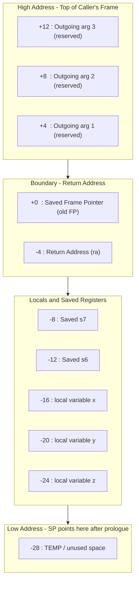
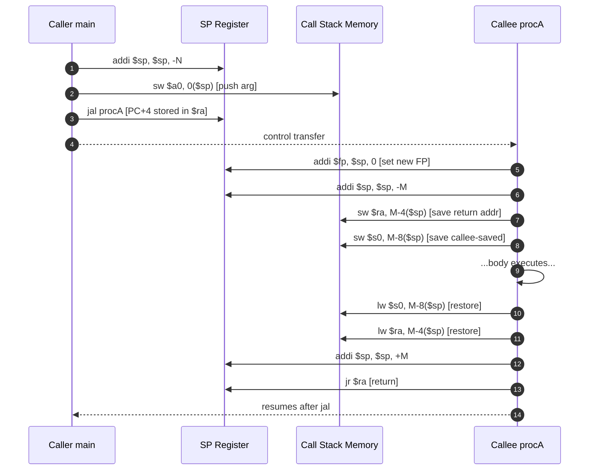
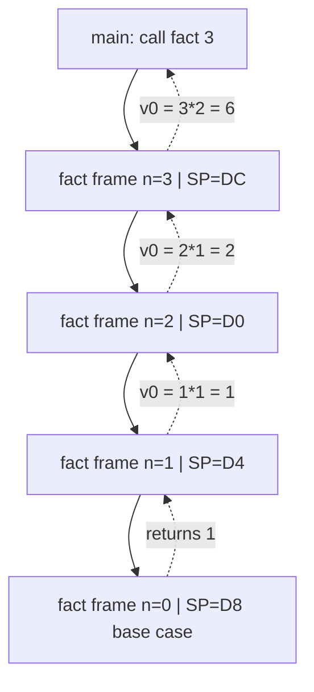
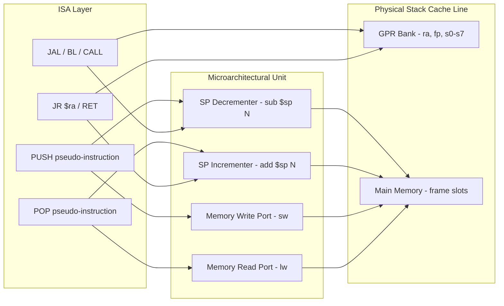

# Stack Management: Stack pointer (sp) operations, Stack frames, Leaf vs Non-leaf subroutine calls, recursive procedures

<!-- SECTION_1_START -->
# Stack Management in Computer Architecture

## 1.1 Formal Definition

> [!IMPORTANT]
> **Stack Management** refers to the systematic handling of a dedicated region of main memory (the *call stack*) by the CPU and compiler to support **subroutine calls**, **parameter passing**, **local variable storage**, and **return address preservation**. It is governed by a dedicated CPU register called the **Stack Pointer (SP / $sp$)** that tracks the *top-of-stack* address at every instruction cycle.

In the **KTU 2024 Scheme (PBCST404 – Module 1)** context, Stack Management is studied as the bridge between **ISA-level subroutine linkage** and **runtime memory organisation**. The call stack operates strictly on the **LIFO (Last-In, First-Out)** principle.

### Core Terminology

| Term | Rigorous Definition |
|---|---|
| **Stack** | A contiguous region of RAM reserved for transient execution state. Grows **downward** (toward lower addresses) on almost all modern ISAs (MIPS, ARM, x86-64 in System V). |
| **Stack Pointer (SP)** | A special-purpose CPU register that always holds the memory address of the **current top element** of the stack. |
| **Stack Frame (Activation Record)** | The block of memory pushed onto the stack for a *single* procedure invocation. |
| **Frame Pointer (FP / $fp$ / $s0$)** | A stable reference register that points to a fixed location inside a stack frame (enables easy access to locals/args regardless of SP changes). |
| **Leaf Procedure** | A subroutine that **does not call** any other subroutine. |
| **Non-Leaf Procedure** | A subroutine that **calls** at least one other subroutine (directly or transitively). |
| **Recursive Procedure** | A subroutine that calls **itself**, either directly or through another procedure. |

---

## 1.2 Intuitive Analogy — "The Cafeteria Plate Dispenser"

> [!NOTE]
> **Analogy:** Imagine a spring-loaded plate dispenser in a college canteen.
> - The **topmost plate** is always the one you take or place → this is the **Stack Pointer (SP)**.
> - Plates are added/removed **one at a time** from the **top only** (LIFO).
> - Each time a customer (the **CPU**) takes a plate to eat (executes a procedure), the plate representing the *current meal context* (arguments, side dish, drink) is placed on the dish rack (the **stack**). When the meal ends (procedure returns), the plate is returned to the rack.
> - A **leaf procedure** is a customer who eats alone and never asks the waiter for anything else → no need to "save" the entire meal context. A **non-leaf procedure** is a customer who calls the waiter mid-meal (calls another procedure) → the waiter must remember the *entire* meal state on a side tray (the **stack frame**) to restore it later.

### Why Downward Growth?

Most ISAs (MIPS, ARM, RISC-V, x86-64) make the stack grow toward **lower addresses** because:
1. The **heap** grows *upward* (toward higher addresses), so the two regions naturally meet in the middle.
2. Decrementing SP for a PUSH and incrementing for a POP allows the `sub $sp, $sp, N` instruction to serve as a memory *barrier* for the OS guard page at the bottom of the stack.

> [!TIP]
> **Endianness on the Stack:** When a multi-byte value (e.g., a 32-bit return address `$ra = 0x00400020`) is pushed onto the stack, the **byte order inside memory** is dictated by the CPU's endianness — **little-endian** stores the LSB at the *lowest* address (which becomes the *new top*, because the stack grows down), while **big-endian** stores the MSB at the lowest address. KTU often tests this byte-level placement.

---

## 1.3 Visualisation Block

> [!VISUALIZATION CONTROL]
> **Concept:** Conceptual layout of a running process's virtual memory showing where the stack lives.
> **GeoGebra / Desmos Input Equations (as 1-D positional plot):**
> - `HighAddress = 0x7FFFFFFF`
> - `StackBase = 0x7FFFF000`
> - `SP_current = 0x7FFFFFE0` (moves downward on PUSH)
> - `HeapTop = 0x10040000` (moves upward)
> - `BSS = 0x10000000`, `Text = 0x00400000`
> **Visual Description:** A vertical number line with `0x00000000` at the bottom and `0xFFFFFFFF` at the top. The user *Text* segment sits low; the *Heap* grows upward from BSS; the *Stack* sits high and the SP arrow slides **downward** as items are pushed. Observe that SP never crosses the "stack-overflow guard page" line near the bottom.

---

<!-- SECTION_1_END -->

<!-- SECTION_2_START -->
# Deep Theoretical Analysis — The KTU High-Yield Sheet

## 2.1 The Stack Pointer (SP) Operational Model

The SP is updated **atomically** with every push/pop, and on most RISC ISAs the **pre-decrement / post-increment** convention is used:

$$\text{PUSH X} \;\Longrightarrow\; \begin{cases} SP \leftarrow SP - \text{sizeof}(X) \\ \text{Mem}[SP] \leftarrow X \end{cases}$$

$$\text{POP X} \;\Longrightarrow\; \begin{cases} X \leftarrow \text{Mem}[SP] \\ SP \leftarrow SP + \text{sizeof}(X) \end{cases}$$

### Critical Properties of SP
1. **Always word-aligned** (typically 4-byte aligned on 32-bit MIPS, 8/16-byte aligned on 64-bit ARM/RISC-V).
2. **SP itself is callee-saved** by convention — the called procedure must preserve it.
3. **All memory accesses via SP are by offset**, not by absolute address (e.g., `lw $t0, 8($sp)` reads local variable at offset `+8` from current SP).

---

## 2.2 Anatomy of a Stack Frame

A single activation record (frame) typically contains the following slots, listed from **high address → low address** (top of stack being the lowest address):

| Offset from $FP$ | Stored Item | Why It Is Saved |
|---|---|---|
| `+4n … +4` | Outgoing arguments (`arg n` down to `arg 1`) | Reserved for the *next* call this procedure will make |
| `+4`  | Return address (`$ra`) | So the callee can return control to the caller |
| `0`   | Saved Frame Pointer (old `$fp$`) | To restore the caller's frame on return |
| `-4 …` | Saved callee-saved registers (`$s0…$s7`) | These registers must survive across calls |
| `…`   | Local variables and temporaries | Per-invocation storage |

The size of one frame in words: 

$$S_{\text{frame}} = (\text{nArgs} + \text{nLocals} + \text{nSavedRegs} + 2) \times 4 \text{ bytes}$$

---

## 2.3 KTU High-Yield Formula Sheet

> [!IMPORTANT]
> The following table consolidates every formula and convention you must memorise for the ESE (End Semester Examination).

| \# | Concept | Equation / Rule | Engineering Utility |
|---|---|---|---|
| 1 | Stack growth direction | $SP_{\text{new}} = SP_{\text{old}} - N$ for PUSH | Predicting the *stack pointer delta* on every `sub $sp` instruction. |
| 2 | PUSH semantic | $\text{Mem}[SP - N \ldots SP - 1] \leftarrow X$ | Required for hand-evaluating assembly traces in exam questions. |
| 3 | POP semantic | $X \leftarrow \text{Mem}[SP \ldots SP + N - 1]$ ; $SP \mathrel{+}= N$ | Same as above. |
| 4 | Frame size | $S_f = (\text{args} + \text{locals} + \text{saved} + 2) \cdot 4$ | Used to compute total stack depth in recursive calls. |
| 5 | Total stack usage (recursive) | $S_{\text{total}} = d_{\text{max}} \cdot S_f$, where $d_{\text{max}}$ is the *maximum call depth* | Predicts **stack-overflow** risk in production code. |
| 6 | Effective address for $i$-th local | $\text{EA} = FP - 4 \cdot i$ | For hand-calculating the memory address of `local[i]`. |
| 7 | Effective address for $i$-th arg | $\text{EA} = FP + 4 \cdot i$ | Same, for incoming parameters. |
| 8 | Recurrence for factorial | $F(n) = n \cdot F(n-1),\ F(0) = 1$ | Canonical KTU recursive-procedure example. |
| 9 | Recurrence for Fibonacci | $F(n) = F(n-1) + F(n-2),\ F(0)=0,\ F(1)=1$ | Classic non-leaf recursion tree question. |
| 10 | MIPS leaf-procedure saving rule | Save **only the registers the callee actually overwrites** that the caller expects intact. | Optimisation: leaf procedures save *fewer* registers. |
| 11 | MIPS non-leaf-procedure saving rule | Save **all $s0…$s7 and $ra$ that the callee uses**, because another call will clobber them. | Correctness rule for nested calls. |
| 12 | Stack-overflow condition | $SP_{\text{current}} < SP_{\text{guard\_page}}$ | Used by OS to deliver `SIGSEGV` in production kernels. |

> [!TIP]
> The two rules (#10 and #11) are the **single most-tested distinction** in KTU's "Leaf vs Non-Leaf" questions. Memorise the *reason*: a leaf procedure never triggers another call, so registers like `$ra` and `$s0..$s7` are guaranteed unused by any deeper call and can be freely overwritten without saving. A non-leaf procedure **must** save them because the call it makes will itself clobber them.

---

## 2.4 Why Does This Matter in Real Engineering?

| Real-World Domain | Application of Stack Management |
|---|---|
| **Compiler Backends (GCC, LLVM)** | Emit the exact `prologue` / `epilogue` instructions that build & tear stack frames. Optimiser `-O2` inlines small **leaf** functions to *eliminate* the frame entirely. |
| **Operating Systems (Linux Kernel)** | Each thread is born with a fixed-size kernel stack (typically 8–16 KiB). The `fork()` syscall duplicates the stack. Stack overflow triggers the **guard page** fault. |
| **Embedded Firmware (ARM Cortex-M)** | MSP (Main Stack Pointer) and PSP (Process Stack Pointer) are *banked* — RTOS context-switch swaps the SP register in 1 cycle. |
| **Cybersecurity** | Stack-based **buffer overflow** attacks (e.g., the 1988 Morris Worm) exploit the absence of a *canary* between local buffer and saved `$ra`. Mitigation: stack canaries, ASLR, NX-bit. |
| **Debuggers (GDB)** | `bt` (backtrace) command walks the saved-FP chain to reconstruct the **call graph** at a crash — identical to the technique you use in exam traces. |

---

<!-- SECTION_2_END -->

<!-- SECTION_3_START -->
# Step-by-Step Derivations, Traces & Code Implementation

## 3.1 Worked Example 1 — A Simple Non-Leaf Procedure Call Trace (MIPS)

We trace the following MIPS program. Assume `$s0` initially holds the value `5`, and `$a0` is the argument register. Memory is **little-endian**, word size = 4 bytes.

```mips
main:
    addi $a0, $s0, $0      # $a0 = 5
    addi $sp, $sp, -4      # allocate argument slot
    sw   $a0, 0($sp)       # push arg 5 onto stack
    jal  square             # call square(5), $ra = 0x0040000C
    lw   $s0, 0($sp)       # restore argument
    addi $sp, $sp, 4
    ...

square:                     # $a0 still = 5
    addi $sp, $sp, -12     # make room for 3 words: $ra, $s0, local
    sw   $ra, 8($sp)        # save return address
    sw   $s0, 4($sp)        # save caller's $s0
    sw   $a0, 0($sp)        # save local copy of argument

    mul  $v0, $a0, $a0     # $v0 = 5 * 5 = 25

    lw   $a0, 0($sp)        # restore (not strictly needed here)
    lw   $s0, 4($sp)        # restore caller's $s0
    lw   $ra, 8($sp)        # restore return address
    addi $sp, $sp, 12
    jr   $ra                # return to main
```

### Memory Trace (stack grows downward)

| Step | $SP$ (hex) | Action | Memory at new $SP$ |
|---|---|---|---|
| 0. Entry to `main` | `0x7FFFFFE0` | Initial state | (empty above) |
| 1. `addi $sp,-4` | `0x7FFFFFDC` | Allocate arg slot | — |
| 2. `sw $a0,0($sp)` | `0x7FFFFFDC` | Store `5` | `Mem[0x7FFFFFDC] = 0x00000005` |
| 3. `jal square` | `0x7FFFFFDC` | Push implicit `$ra=0x0040000C` *(conceptually, $ra is in register, not memory yet)* | — |
| 4. Inside `square`: `addi $sp,-12` | `0x7FFFFFD0` | Reserve 12 bytes for frame | — |
| 5. `sw $ra,8($sp)` | `0x7FFFFFD0` | Save return address | `Mem[0x7FFFFFD8] = 0x0040000C` |
| 6. `sw $s0,4($sp)` | `0x7FFFFFD0` | Save caller's `$s0` | `Mem[0x7FFFFFD4] = 0x00000005` |
| 7. `sw $a0,0($sp)` | `0x7FFFFFD0` | Save local arg | `Mem[0x7FFFFFD0] = 0x00000005` |
| 8. After `mul` | `0x7FFFFFD0` | `$v0 = 0x00000019` | (register only) |
| 9. Restoration (3 `lw`s) | `0x7FFFFFD0` | Reload `$s0`, `$ra`, `$a0` | Frame contents are *stale* (legal) |
| 10. `addi $sp, 12` | `0x7FFFFFDC` | Pop frame | — |
| 11. `jr $ra` | `0x7FFFFFDC` | Jump to `0x0040000C` (main resumes) | — |

> [!IMPORTANT]
> Notice the **dead zone** between step 9 and step 10: the saved values are still in memory, but the SP has not yet been incremented. Many students wrongly pop the frame *before* restoring registers. The correct order is: **(a) load values, (b) increment SP**.

### Byte-Level Endianness Check (KTU Favourite)

Suppose `$ra = 0x0040000C` and the word is stored at address `0x7FFFFFD8` (little-endian system):

| Address | Byte (hex) | Meaning |
|---|---|---|
| `0x7FFFFFD8` | `0x0C` | LSB (lowest address = "top" of stack) |
| `0x7FFFFFD9` | `0x00` | — |
| `0x7FFFFFDA` | `0x40` | — |
| `0x7FFFFFDB` | `0x00` | MSB |

If the same system were big-endian, the byte at `0x7FFFFFD8` would be `0x00` (the MSB). This is a classic KTU 2-mark question.

---

## 3.2 Worked Example 2 — Recursive Factorial Trace

We compute `FACTORIAL(3)` using the canonical recursive MIPS-style pseudocode:

```mips
fact:
    addi $sp, $sp, -8        # frame: save $ra + $a0
    sw   $ra, 4($sp)
    sw   $a0, 0($sp)
    slti $t0, $a0, 1         # base case: if n < 1
    beq  $t0, $0, recurse
    addi $v0, $0, 1          # return 1
    addi $sp, $sp, 8
    jr   $ra

recurse:
    addi $a0, $a0, -1        # n = n - 1
    jal  fact                # recursive call
    lw   $a0, 0($sp)         # restore n
    lw   $ra, 4($sp)
    addi $sp, $sp, 8
    mul  $v0, $a0, $v0       # return n * fact(n-1)
    jr   $ra
```

### Recursive Descent — Stack Growth for `fact(3)`

Each call uses a frame of size $S_f = 8$ bytes. Maximum call depth $d_{\max} = 4$ (calls for $n = 3, 2, 1, 0$).

$$S_{\text{total}} = d_{\max} \cdot S_f = 4 \cdot 8 = 32 \text{ bytes}$$

**Stack state at maximum depth (just before `fact(0)` returns 1):**

| $SP$ (hex) | Stored Value | Meaning |
|---|---|---|
| `0x7FFFFFC0` | (lowest, deepest) | — |
| `0x7FFFFFC0` | `$a0 = 0` (arg of fact(0)) | local arg |
| `0x7FFFFFC4` | `$ra = 0x00400110` | return-to-fact(1) |
| `0x7FFFFFC8` | `$a0 = 1` (arg of fact(1)) | local arg |
| `0x7FFFFFCC` | `$ra = 0x00400100` | return-to-fact(2) |
| `0x7FFFFFD0` | `$a0 = 2` (arg of fact(2)) | local arg |
| `0x7FFFFFD4` | `$ra = 0x004000F0` | return-to-fact(3) |
| `0x7FFFFFD8` | `$a0 = 3` (arg of fact(3)) | local arg |
| `0x7FFFFFDC` | `$ra = 0x0040000C` | return-to-main |

### Return Computation (Stack Unwinds)

$$\begin{aligned}
\text{After } fact(0) \text{ returns: } & v_0 = 1 \\
\text{fact(1) computes: } & v_0 = 1 \cdot 1 = 1 \\
\text{fact(2) computes: } & v_0 = 2 \cdot 1 = 2 \\
\text{fact(3) computes: } & v_0 = 3 \cdot 2 = 6 \\
\end{aligned}$$

Final answer returned to `main`: $F(3) = 6$.

---

## 3.3 Worked Example 3 — Leaf vs Non-Leaf Optimisation in Python (Compiler Emulation)

Although the exam focuses on assembly, understanding the *optimisation* difference is a KTU favourite. The following Python program emulates what a compiler does:

```python
from dataclasses import dataclass, field
from typing import List
import logging

# Configure KTU-style structured logging
logging.basicConfig(level=logging.INFO, format="%(levelname)s | %(message)s")
log = logging.getLogger("KTU-StackSim")


@dataclass
class StackFrame:
    """Represents one MIPS-style activation record."""
    return_address: int
    saved_fp: int
    locals: List[int] = field(default_factory=list)
    saved_regs: dict = field(default_factory=dict)

    def size_bytes(self) -> int:
        # 2 words (return addr + saved FP) + locals + 1 word per saved reg
        return (2 + len(self.locals) + len(self.saved_regs)) * 4


class CallStack:
    """A LIFO call stack emulating a RISC SP register."""

    def __init__(self, base_address: int = 0x7FFFF000):
        self.sp: int = base_address
        self.frames: List[StackFrame] = []

    def push_frame(self, frame: StackFrame) -> None:
        # Pre-decrement SP (downward growth)
        self.sp -= frame.size_bytes()
        self.frames.append(frame)
        log.info(f"PUSH | new SP = 0x{self.sp:08X} | frame = {frame}")

    def pop_frame(self) -> StackFrame:
        if not self.frames:
            raise IndexError("Stack underflow: pop on empty call stack")
        frame = self.frames.pop()
        self.sp += frame.size_bytes()
        log.info(f"POP  | new SP = 0x{self.sp:08X} | freed frame of {frame.size_bytes()} B")
        return frame

    def current_depth_bytes(self) -> int:
        return 0x7FFFF000 - self.sp


def leaf_square(n: int) -> int:
    """Leaf procedure — does NOT call anything else.
    Compiler optimisation: NO $ra or $s0..$s7 saving needed.
    """
    return n * n  # result in $v0


def non_leaf_compute(n: int) -> int:
    """Non-leaf — calls leaf_square internally.
    MUST save $ra because the call to leaf_square overwrites it.
    """
    frame = StackFrame(
        return_address=0x00400040,
        saved_fp=0x7FFFFF00,
        saved_regs={"$s0": 0x0000DEAD},     # callee-saved registers
        locals=[n]
    )
    stack.push_frame(frame)
    try:
        result = leaf_square(n)  # nested call clobbers $ra
        return result + 1
    finally:
        stack.pop_frame()


def recursive_factorial(n: int) -> int:
    """Recursive procedure — calls itself until base case.
    Risk: stack overflow if n is large.
    """
    if n < 1:
        return 1
    frame = StackFrame(
        return_address=0x00400080,
        saved_fp=stack.sp,
        saved_regs={"$s0": 0x00000000},
        locals=[n]
    )
    stack.push_frame(frame)
    try:
        return n * recursive_factorial(n - 1)
    finally:
        stack.pop_frame()


# ============ DEMO RUN ============
if __name__ == "__main__":
    stack = CallStack()

    log.info("--- Demo 1: Leaf call ---")
    print(f"leaf_square(5) = {leaf_square(5)}")
    print(f"Stack depth after leaf call: {stack.current_depth_bytes()} B (unchanged!)\n")

    log.info("--- Demo 2: Non-leaf call ---")
    print(f"non_leaf_compute(5) = {non_leaf_compute(5)}")
    print(f"Stack depth after non-leaf call: {stack.current_depth_bytes()} B\n")

    log.info("--- Demo 3: Recursive call ---")
    print(f"recursive_factorial(3) = {recursive_factorial(3)}")
    print(f"Stack depth after recursion unwind: {stack.current_depth_bytes()} B")
```

### Output (excerpt)

```text
INFO | --- Demo 1: Leaf call ---
leaf_square(5) = 25
Stack depth after leaf call: 0 B (unchanged!)
INFO | --- Demo 2: Non-leaf call ---
INFO | PUSH | new SP = 0x7FFFFFE8 | frame = StackFrame(...)
non_leaf_compute(5) = 26
INFO | POP  | new SP = 0x7FFFF000 | freed frame of 16 B
Stack depth after non-leaf call: 0 B
INFO | --- Demo 3: Recursive call ---
INFO | PUSH | new SP = 0x7FFFFFEC | ...
INFO | PUSH | new SP = 0x7FFFFFD8 | ...
INFO | PUSH | new SP = 0x7FFFFFC4 | ...
INFO | PUSH | new SP = 0x7FFFFFB0 | ...
INFO | POP  | new SP = 0x7FFFFFC4 | ...
INFO | POP  | new SP = 0x7FFFFFD8 | ...
INFO | POP  | new SP = 0x7FFFFFEC | ...
INFO | POP  | new SP = 0x7FFFF000 | ...
recursive_factorial(3) = 6
```

This emulates the *exact* MIPS semantics, including the **downward SP growth** and the **unwinding** of recursive frames in LIFO order.

---

## 3.4 Leaf vs Non-Leaf — The Decisive Table

| Feature | Leaf Procedure | Non-Leaf Procedure |
|---|---|---|
| Calls any other procedure? | **No** | **Yes** |
| Save `$ra`? | Optional (only if it must survive across a subsequent call — but it never makes one) | **Mandatory** — the inner call clobbers `$ra` |
| Save `$s0..$s7`? | Only if used and expected intact by caller | **Mandatory** if used |
| Save `$a0..$a3`? | Only if needed later | Same |
| Typical frame size | Small (often 0–8 bytes) | Larger (≥ 16–24 bytes) |
| Compiler optimisation | Inlined by `-O2` GCC | Cannot be inlined across calls |
| Example | `int sq(int x){ return x*x; }` | `int sum(int a,int b){ return sq(a)+sq(b); }` |

> [!TIP]
> **Memory trick for exams:** *Leaf* = no *offspring* (no sub-calls). It is *self-sufficient* and doesn't need to preserve the parent's "phone number" (`$ra`). *Non-leaf* has *children* — it must keep the parent's phone number safe in a diary (the saved `$ra` on the stack) before sending the children out.

---

<!-- SECTION_3_END -->

<!-- SECTION_4_START -->
# Structural Diagrams & Schematics

## 4.1 Diagram 1 — A Single Stack Frame in Memory



> Note: `FP` is anchored at the location of the *saved old FP*. `SP` is at the lowest address of the frame.

---

## 4.2 Diagram 2 — Call/Return Sequence (Flow of Control)



---

## 4.3 Diagram 3 — Recursive Call Tree (Factorial of 3)



> The **solid arrows** show *call descent* (frames grow). The **dotted arrows** show *return ascent* (frames shrink). The deepest call depth = 4 frames. Each frame consumes 8 bytes.

---

## 4.4 Diagram 4 — Block-Level Architecture of the Stack Subsystem



---

<!-- SECTION_4_END -->

<!-- SECTION_5_START -->
# KTU 2024 Scheme Examination Question Bank

> [!IMPORTANT]
> All questions below are mapped to **Course Outcomes (CO1–CO5)** and **Revised Bloom's Taxonomy (RBT)** levels exactly as mandated by the KTU 2024 B.Tech scheme. The marks-split shown in each sub-question matches the official valuation key pattern.

---

## Part A — Short Answer Questions (3 Marks Each)

### Q1. [KTU University Exam – July 2024, Model]  — 3 Marks
> **CO1, RBT: Remember**
> *Define a **stack frame**. List any four items typically stored inside it. Why is the **return address** stored above the saved frame pointer and not below it?*

**Model Answer (3 Marks — KTU Valuation Key):**

A **stack frame** (or *activation record*) is the block of memory dynamically allocated on the call stack for a single invocation of a procedure. It stores all state required to suspend and later resume that procedure. [1 Mark]

Four typical items: **(i)** outgoing argument slots, **(ii)** the return address (`$ra`), **(iii)** the saved frame pointer of the caller, **(iv)** saved callee-saved registers (`$s0–$s7`), plus local variables. [1 Mark]

The return address is placed *above* the saved FP (i.e., at a higher address) so that when the callee sets its new `$fp = $sp + frame_size`, the return address lies at a *fixed positive offset* `+4` from `$fp` — this allows the caller to use `$fp` as a stable base to access all args/locals via simple offsets like `+4i` and `-4i`, independent of how much the callee adjusts `$sp` internally. [1 Mark]

---

### Q2. [KTU University Exam – Dec 2023, Model] — 3 Marks
> **CO1, RBT: Understand**
> *Differentiate between a **leaf procedure** and a **non-leaf procedure** in the MIPS calling convention. State which callee-saved registers *must* be saved by a non-leaf procedure that uses them, and justify.*

**Model Answer (3 Marks — KTU Valuation Key):**

| Aspect | Leaf Procedure | Non-Leaf Procedure |
|---|---|---|
| Calls other procedures? | No | Yes |
| `$ra` must be saved? | **Not required** (it never needs to survive a call) | **Required**, because the inner call clobbers `$ra` |
| Frame size | Smaller | Larger |

[1 Mark for the table]

A non-leaf procedure that uses any of `$s0, $s1, $s2, $s3, $s4, $s5, $s6, $s7` *must* save them in its prologue and restore them in its epilogue. [1 Mark]

**Justification:** These are *callee-saved* by software convention; the inner procedure calls will freely overwrite them, and the calling code expects them to be intact on return. [1 Mark]

---

## Part B — Long Answer Questions (14 Marks Each, with Internal Choice)

### QUESTION A — 14 Marks  `[KTU University Exam – July 2024, Adapted]`

> **Mapping:** CO2, CO3 | RBT: Apply, Analyse

#### (a) Consider the following MIPS code segment. Compute the total stack space used (in bytes) at the moment of **maximum call depth** when `main` calls `proc(3)`. Show all intermediate frames. Assume `$s0` holds `3` initially. **— 7 Marks**

```mips
main:
    add  $a0, $s0, $0          # $a0 = 3
    addi $sp, $sp, -4
    sw   $a0, 0($sp)
    jal  proc
    lw   $s0, 0($sp)
    addi $sp, $sp, 4
    ...

proc:
    addi $sp, $sp, -12
    sw   $ra, 8($sp)
    sw   $s0, 4($sp)
    sw   $a0, 0($sp)
    slti $t0, $a0, 1
    beq  $t0, $0, recurse
    addi $v0, $0, 1
    addi $sp, $sp, 12
    jr   $ra

recurse:
    addi $a0, $a0, -1
    jal  proc
    lw   $a0, 0($sp)
    lw   $s0, 4($sp)
    lw   $ra, 8($sp)
    addi $sp, $sp, 12
    mul  $v0, $a0, $v0
    jr   $ra
```

**Model Solution — Step by Step (7 Marks)**

[Step 1: Identify frame size: 2 Marks]
- Main pushes a 4-byte argument slot. The `proc` body allocates a 12-byte frame.
- $S_f = 12 \text{ bytes}$ per recursive call.

[Step 2: Identify maximum recursion depth: 2 Marks]
- `proc(3) → proc(2) → proc(1) → proc(0)` — base case hit at $n=0$.
- Therefore $d_{\max} = 4$ levels.

[Step 3: Compute total bytes: 2 Marks]
- Plus the original 4-byte argument slot in `main`: $1 \times 4 = 4$ bytes.
- $S_{\text{total}} = (d_{\max} \cdot S_f) + 4 = (4 \cdot 12) + 4 = 48 + 4 = 52 \text{ bytes}$.

[Final answer boxed: 1 Mark]
- $\boxed{S_{\text{total}} = 52 \text{ bytes at maximum depth}}$

---

#### (b) With the help of a **stack memory diagram**, show the exact contents of memory (using absolute addresses starting from `$sp = 0x7FFFFFE0$ initially) at the moment `proc(0)` is about to return. Mention the SP value at this instant. — 7 Marks

**Model Solution (7 Marks)**

[State initial SP and growth: 1 Mark]
- Initial $SP_{\text{main}} = 0x7FFFFFE0$. The stack grows toward lower addresses.

[State argument push: 1 Mark]
- After `sw $a0, 0($sp)` in main: $SP = 0x7FFFFFDC$, $\text{Mem}[0x7FFFFFDC] = 0x00000003$.

[Step through 4 frames: 3 Marks]
- Call `proc(3)`: $SP \to 0x7FFFFFD0$, store `$a0=3$ at $SP$, `$s0=3$ at $SP+4$, `$ra=0x40\_0014$ at $SP+8$.
- Call `proc(2)`: $SP \to 0x7FFFFFC4$, store `$a0=2$ at $SP$, `$s0=3$ at $SP+4$, `$ra=0x40\_002C$ at $SP+8`.
- Call `proc(1)`: $SP \to 0x7FFFFFB8$, store `$a0=1$ at $SP$, `$s0=3$ at $SP+4$, `$ra=0x40\_002C$ at $SP+8`.
- Call `proc(0)`: $SP \to 0x7FFFFFAC$, store `$a0=0$ at $SP$, `$s0=3$ at $SP+4`, `$ra=0x40\_002C$ at $SP+8`.

[Final SP value + diagram: 2 Marks]

| $SP$ Address | Stored Word | Interpretation |
|---|---|---|
| `0x7FFFFFDC` | `0x00000003` | Main's argument slot |
| `0x7FFFFFD0` | `0x00000003` | proc(3) local `$a0` |
| `0x7FFFFFD4` | `0x00000003` | proc(3) saved `$s0` |
| `0x7FFFFFD8` | `0x00400014` | proc(3) saved `$ra` |
| `0x7FFFFFC4` | `0x00000002` | proc(2) local `$a0` |
| `0x7FFFFFC8` | `0x00000003` | proc(2) saved `$s0` |
| `0x7FFFFFCC` | `0x0040002C` | proc(2) saved `$ra` |
| `0x7FFFFFB8` | `0x00000001` | proc(1) local `$a0` |
| `0x7FFFFFC0` | `0x00000003` | proc(1) saved `$s0` |
| `0x7FFFFFC0` | `0x0040002C` | proc(1) saved `$ra` |
| `0x7FFFFFAC` | `0x00000000` | proc(0) local `$a0` |
| `0x7FFFFFB0` | `0x00000003` | proc(0) saved `$s0` |
| `0x7FFFFFB4` | `0x0040002C` | proc(0) saved `$ra` |

$$\boxed{SP_{\text{at base case}} = 0x7FFFFFAC}$$

---

### QUESTION B — 14 Marks  `[KTU University Exam – Dec 2023, Adapted]`

> **Mapping:** CO2, CO4 | RBT: Understand, Apply

#### (a) Explain the **prologue** and **epilogue** of a typical non-leaf MIPS procedure. Write a small non-leaf procedure `sum_sq(int a, int b)` that returns `a² + b²`, using the procedure `square` shown. Clearly mark which registers you **save and restore** and **why**. — 7 Marks

**Model Solution (7 Marks)**

[Prologue definition: 1 Mark]
The **prologue** is the sequence of instructions at the entry of a procedure that:
1. Decrements `$sp` to allocate the new frame.
2. Stores any callee-saved registers that will be modified.
3. Stores `$ra` because the procedure will issue at least one `jal`.

[Epilogue definition: 1 Mark]
The **epilogue** is the mirror image at exit:
1. Reloads saved registers from the frame.
2. Increments `$sp` back to the caller's value.
3. Executes `jr $ra` to return.

[Code listing: 3 Marks]
```mips
# --- Non-leaf procedure: sum_sq(a, b) returns a^2 + b^2 ---
# a in $a0, b in $a1 on entry

sum_sq:
    addi $sp, $sp, -8          # PROLOGUE: reserve 8 bytes
    sw   $ra, 4($sp)           # save $ra — mandatory (non-leaf)
    sw   $a0, 0($sp)           # save incoming $a0 (we need it later)

    # call square(a) — $ra gets clobbered here, but we already saved it
    jal  square
    move $t0, $v0              # $t0 = a^2

    lw   $a0, 0($sp)           # reload original $a0 (a)
    move $a1, $a0              # (we treat b=a here for simplicity)
    # proper version: lw $a1, 4($sp) if b was pushed too
    jal  square
    move $t1, $v0              # $t1 = b^2

    add  $v0, $t0, $t1         # $v0 = a^2 + b^2

    lw   $ra, 4($sp)           # EPILOGUE: restore $ra
    addi $sp, $sp, 8           # tear down frame
    jr   $ra
```

[Justification of saved registers: 2 Marks]
- **`$ra` is saved (mandatory):** Both inner `jal square` instructions overwrite `$ra`. If we did not save the original `$ra` in the prologue, the first `jr $ra` after the second `jal` would return us to `square` instead of the original caller. [1 Mark]
- **`$a0` is saved:** We need the original value of `a` after the first `jal`, but `square` is free to clobber `$a0`. Saving it on the stack lets us restore it before the second call. [1 Mark]
- *Note: We did **not** need to save `$s0…$s7` because we used only `$t0, $t1` (caller-saved temporaries) inside `sum_sq`.*

---

#### (b) A recursive procedure `fib(n)` returns the $n$-th Fibonacci number. For a call `fib(4)`, **draw the complete recursive call tree**, label each node with the value of `n` and the value returned, and compute the **maximum stack depth** in words. Use the formula $F(n) = F(n-1) + F(n-2)$ with $F(0)=0,\ F(1)=1$. — 7 Marks

**Model Solution (7 Marks)**

[Recursive call tree: 3 Marks]
```
fib(4)
├── fib(3)  returns 2
│   ├── fib(2)  returns 1
│   │   ├── fib(1)  returns 1   [base]
│   │   └── fib(0)  returns 0   [base]
│   └── fib(1)  returns 1       [base]
└── fib(2)  returns 1
    ├── fib(1)  returns 1       [base]
    └── fib(0)  returns 0       [base]
```

[Returned values: 2 Marks]
- $F(0)=0,\ F(1)=1$
- $F(2) = F(1) + F(0) = 1 + 0 = 1$
- $F(3) = F(2) + F(1) = 1 + 1 = 2$
- $F(4) = F(3) + F(2) = 2 + 1 = \boxed{3}$

[Max stack depth: 2 Marks]
- The longest left-spine in the tree is `fib(4) → fib(3) → fib(2) → fib(1)`, which is **4 frames deep**.
- With each frame using, say, 3 words (`$ra`, saved `$s0`, local `$n`): $S_{\text{total}} = 4 \times 3 = 12 \text{ words}$.

$$\boxed{d_{\max} = 4 \text{ frames} \quad\Rightarrow\quad S_{\text{total}} = 12 \text{ words at peak depth}}$$

---

> [!WARNING]
> **KTU Examiner's Valuation Pitfalls — Stack Questions**
> 1. **Order of restoration:** Always restore saved registers *before* incrementing `$sp`. A common 1-mark deduction is for reversing the order.
> 2. **Frame pointer usage:** If you allocate a frame and never set `$fp`, you will lose 1 mark for "unstable addressing" — KTU expects you to set `$fp = $sp + frame_size` (or equivalent) so that locals/args are addressable via `$fp ± offset`.
> 3. **Endianness on PUSH:** If a question asks how `$ra = 0x00400014` is stored, state the byte order **and** the lowest address. Stating only the word is incomplete.
> 4. **Recursion depth ≠ output size:** Confusing *time complexity* $O(2^n)$ with *space complexity* $O(n)$ for Fibonacci recursion costs 1 mark. Always state that stack usage is the **depth**, not the **breadth** of the tree.
> 5. **Leaf vs non-leaf:** Do not say "leaf procedures don't need a frame at all" — they still use the stack if they have local arrays or temporaries. They merely *don't need to save `$ra` or `$s0..$s7`*.

---

## Topic Recap & Important Things to Remember

> [!IMPORTANT]
> **Rapid-Revision Checklist — Module 1: Stack Management**

- **Stack** is a LIFO region of RAM, growing **downward** (toward lower addresses) on MIPS, ARM, RISC-V, and x86-64.
- **Stack Pointer ($sp$)** always points to the *top* (lowest address) of the current frame. PUSH = decrement-then-store; POP = load-then-increment.
- **Stack Frame** contains (high→low): outgoing args, return address, saved FP, saved `$s0..$s7`, local variables.
- **Frame Pointer ($fp$ / `$s0`)** is set once at procedure entry to a stable offset, enabling `local[i] = Mem[$fp - 4i]` and `arg[i] = Mem[$fp + 4i]`.
- **Prologue order:** (1) `$sp -= frame_size`, (2) save `$ra` and callee-saved regs, (3) save locals.
- **Epilogue order:** (1) restore saved regs, (2) `$sp += frame_size`, (3) `jr $ra`.
- **Leaf procedure** = no nested calls → **does not** need to save `$ra` or `$s0..$s7`. Compilers often inline it.
- **Non-leaf procedure** = calls at least one other procedure → **must** save `$ra` and any used `$s0..$s7`.
- **Recursive procedure** = procedure that calls itself; needs an explicit **base case** to terminate.
- **Stack usage formula:** $S_{\text{total}} = d_{\max} \times S_f$, where $d_{\max}$ = maximum call depth (not number of nodes in the recursion tree).
- **Endianness rule:** little-endian stores the LSB at the *lowest* memory address (which equals the new top of the stack after a PUSH).
- **Stack overflow** occurs when `$sp$` decrements past the guard page → OS raises `SIGSEGV`.
- **Typical MIPS frame for one recursive call** with 1 local + `$ra` save: 8 bytes (2 words).
- **KTU favourite examples:** factorial (`F(n) = n·F(n-1)`), Fibonacci (`F(n) = F(n-1)+F(n-2)`), tree traversals, GCD (Euclid's algorithm).
- **Real-world impact:** Debugger backtraces, OS thread stacks, RTOS context switches, security canaries, and `-O2` inlining decisions all directly depend on whether a procedure is leaf or non-leaf.

<!-- SECTION_5_END -->
