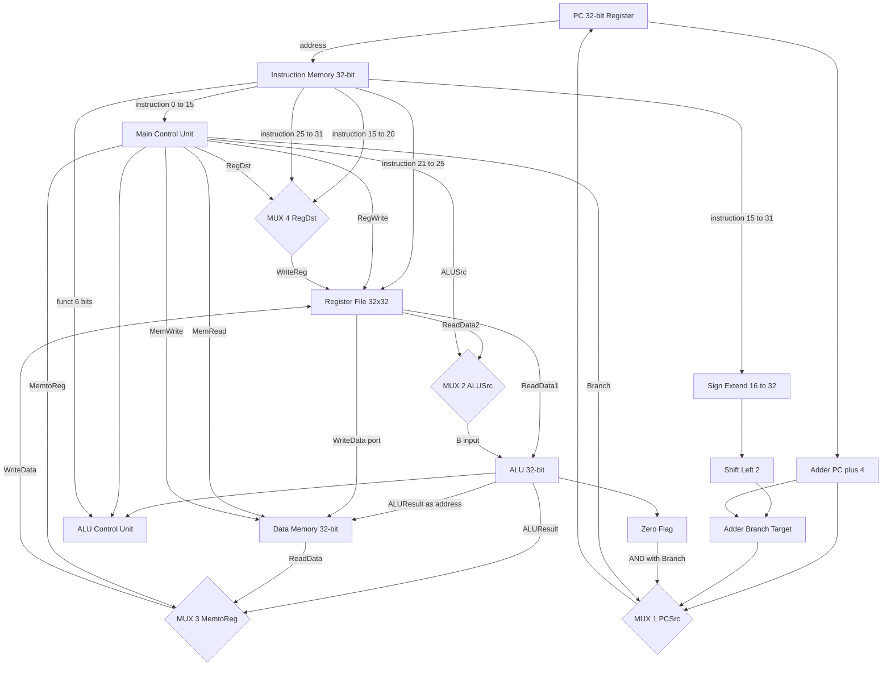
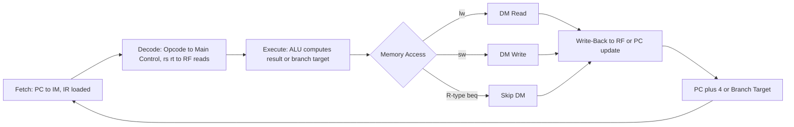

# Designing Single-Cycle Datapath for standard instructions (Arithmetic, Load/Store, Branching), Control Unit signals

<!-- SECTION_1_START -->

# Designing Single-Cycle Datapath for Standard Instructions

## 1.1 Formal Academic Definition (KTU 2024 Syllabus Aligned)

> [!IMPORTANT]
> **Single-Cycle Datapath:** A hardware implementation architecture in which **each instruction is fetched, decoded, executed, and its results are written back within a single, fixed-duration clock cycle**. The clock period is set to accommodate the **latency of the slowest instruction** in the ISA (typically the Load Word instruction, which traverses the longest combinational path: PC $\rightarrow$ Instruction Memory $\rightarrow$ Register File $\rightarrow$ ALU $\rightarrow$ Data Memory $\rightarrow$ Register File).

In the **KTU 2024 Scheme (PBCST404, Module 2)** scope, the design assumes a **subset MIPS-like ISA** comprising four representative instruction classes:

| Class | Example | Format |
|:---|:---|:---|
| Arithmetic (R-type) | `add $t1, $t2, $t3` | R |
| Load Word | `lw $t1, 8($t2)` | I |
| Store Word | `sw $t1, 8($t2)` | I |
| Branch Equal | `beq $t1, $t2, offset` | I |

The datapath is the **physical collection of functional units, storage elements, and interconnecting buses** that the control unit orchestrates to implement these instructions.

---

## 1.2 Conceptual Analogy — The One-Shot Bakery Counter

> [!NOTE]
> **Intuition Builder:** Imagine a bakery counter where every customer (instruction) walks the **entire counter end-to-end** — pick order, pay, prepare, package, hand over — **all before the next customer is served**. The bakery sets its "door open time" (clock period) to the slowest customer's total service time. The datapath is the **physical counter layout** (ovens, cash register, packaging station), and the **manager shouting instructions** is the control unit.

- A single cashier = the **ALU** (handles all arithmetic/logic)
- The display rack = **Register File** (holds working ingredients)
- The cold storage = **Data Memory** (large, slow storage)
- The recipe card = **Instruction Memory**
- The bakery's daily schedule = **Control Signals**

Just as a bakery cannot start a new cake until the previous one is fully boxed, a single-cycle processor **cannot pipeline** — every instruction consumes one full clock.

---

## 1.3 Why Single-Cycle? KTU Design Trade-offs

> [!TIP]
> **KTU Board Favorite:** When asked *"Why not use a faster clock?"* the official answer is:
> *"The clock period must be $\geq$ the combinational delay of the longest instruction. Reducing the clock period below this causes setup-time violations, resulting in metastability and incorrect data storage in registers like PC, IR, and the Register File."*

**Performance Equation (Single-Cycle):**

$$
T_{\text{CPU}} = N \times T_{\text{clk}}
$$

Where $T_{\text{clk}} \geq t_{\text{IM}} + t_{\text{RF}} + t_{\text{ALU}} + t_{\text{DM}} + t_{\text{RF-write}}$ for Load Word.

This is the foundation for the **Multi-Cycle** and **Pipelined** architectures (Modules 3 & 4 of PBCST404).

---

## 1.4 GeoGebra / Desmos Visualization

> [!VISUALIZATION CONTROL]
> **Concept:** Latency stacking of a single-cycle datapath
> **Desmos Input Equations (as piecewise timing segments):**
> * `f(x) =` step function: `0 ≤ x < 100` = PC update, `100 ≤ x < 250` = Instruction Memory, etc.
> **Visual Description:** Plot a horizontal timeline $x$-axis labelled in **picoseconds (ps)** with vertical dashed lines marking the boundaries: PC $\rightarrow$ IM $\rightarrow$ RF-read $\rightarrow$ ALU $\rightarrow$ DM $\rightarrow$ RF-write. The **longest bar (Load)** defines $T_{\text{clk}}$. Observe how the R-type bar is shorter — *wasted slack*.

---

<!-- SECTION_1_END -->

<!-- SECTION_2_START -->

# Deep Theoretical Analysis & KTU High-Yield Formula Sheet

## 2.1 Building Blocks of the Single-Cycle Datapath

The datapath is assembled from **five combinational/synchronous components** plus **multiplexers and sign-extension logic**.

### 2.1.1 The Five Core Functional Units

1. **Program Counter (PC)** — 32-bit register; holds address of current instruction. Updated at every rising clock edge via `PCWrite`.
2. **Instruction Memory (IM)** — Read-only; $32$-bit output on every clock based on input address. Latency $t_{\text{IM}} = 200$ ps (typical textbook value).
3. **Register File (RF)** — 32 registers $\times$ 32 bits. Two read ports, one write port. Read is combinational; write is synchronous.
4. **ALU (Arithmetic Logic Unit)** — Performs `add`, `sub`, `and`, `or`, `slt`. Operates on 32-bit operands. Latency $t_{\text{ALU}} = 200$ ps.
5. **Data Memory (DM)** — Read/Write, word-addressable. Read is combinational; write is synchronous. Latency $t_{\text{DM}} = 200$ ps.

### 2.1.2 Supporting Logic

- **Sign-Extend Unit** — Extends the 16-bit immediate field to 32 bits by replicating the MSB.
- **Shift-Left-2 Unit** — Used for branch target calculation: multiplies immediate by 4 (word addressing).
- **Adders** — Two dedicated adders: $PC + 4$ and $PC + 4 + (\text{shifted immediate})$.
- **Multiplexers (MUXes)** — Route data among multiple sources. KTU focuses on **2-to-1 MUXes** controlled by 1-bit control signals.

---

## 2.2 Instruction Format Recap (MIPS Subset)

$$
\underbrace{opcode}_{6} \quad \underbrace{rs}_{5} \quad \underbrace{rt}_{5} \quad \underbrace{rd}_{5} \quad \underbrace{shamt}_{5} \quad \underbrace{funct}_{6} \quad \text{(R-type, 32 bits)}
$$

$$
\underbrace{opcode}_{6} \quad \underbrace{rs}_{5} \quad \underbrace{rt}_{5} \quad \underbrace{immediate}_{16} \quad \text{(I-type, 32 bits)}
$$

> [!NOTE]
> For R-type: `opcode = 000000`, and the `funct` field distinguishes the operation (`add` = $100000$, `sub` = $100010$, `and` = $100100$, `or` = $100101$, `slt` = $101010$).

---

## 2.3 The Nine Control Signals (Main Decoder Output)

The main control unit inspects the **6-bit opcode** and emits:

| Signal | Width | Effect |
|:---:|:---:|:---|
| `RegDst` | 1 | $0$ \rightarrow write reg = `rt` ; $1$ \rightarrow write reg = `rd` |
| `ALUSrc` | 1 | $0$ \rightarrow ALU $B$-input = read data 2 ; $1$ \rightarrow sign-extended immediate |
| `MemRead` | 1 | Enable Instruction Memory read |
| `MemWrite` | 1 | Enable Data Memory write |
| `MemtoReg` | 1 | $0$ \rightarrow RF write data = ALU result ; $1$ \rightarrow RF write data = DM read data |
| `RegWrite` | 1 | Enable Register File write |
| `Branch` | 1 | AND with ALU Zero \rightarrow PCSrc |
| `ALUOp` | 2 | Forwarded to ALU Control ($00$=add, $01$=sub, $1x$=funct) |
| `Jump` | 1 | Selects jump target in top 2 bits of PC (often omitted in KTU basic) |

> [!IMPORTANT]
> **`PCSrc` is NOT directly a main control output** — it is computed as `Branch AND ALUZero`. KTU examiners **deduct marks** if students list `PCSrc` in the main control truth table.

---

## 2.4 ALU Control Unit — Secondary Decoder

The ALU Control receives the **2-bit `ALUOp`** from main control **plus the 6-bit `funct` field** and produces a **4-bit `ALUControl`**:

| Instruction | ALUOp | funct | ALUControl | Operation |
|:---|:---:|:---:|:---:|:---:|
| `lw`, `sw` | $00$ | $xxxxxx$ | $0010$ | `add` |
| `beq` | $01$ | $xxxxxx$ | $0110$ | `sub` |
| `add` | $10$ | $100000$ | $0010$ | `add` |
| `sub` | $10$ | $100010$ | $0110$ | `sub` |
| `and` | $10$ | $100100$ | $0000$ | `and` |
| `or`  | $10$ | $100101$ | $0001$ | `or`  |
| `slt` | $10$ | $101010$ | $0111$ | `slt` |

> [!NOTE]
> **Encoding of `ALUControl`** (4 bits, KTU standard):
> $0010$ = add ; $0110$ = sub ; $0000$ = and ; $0001$ = or ; $0111$ = slt ; $1100$ = nor.

---

## 2.5 KTU High-Yield Formula Sheet (Cheat Table)

| Quantity | Formula / Definition | Units |
|:---|:---|:---|
| Clock Period | $T_{\text{clk}} \geq t_{\text{PC}} + t_{\text{IM}} + t_{\text{RF-read}} + t_{\text{ALU}} + t_{\text{DM}} + t_{\text{RF-write}} + t_{\text{MUX-setup}}$ | s |
| CPI (single-cycle) | $1$ | — |
| Execution Time | $T_{\text{CPU}} = N \times T_{\text{clk}}$ | s |
| MIPS Rating | $\text{MIPS} = \dfrac{f_{\text{clk}} \times 10^6}{10^6} = f_{\text{clk (MHz)}}$ | — |
| Branch Target | $PC_{\text{new}} = (PC + 4) + (\text{SignExt}_{16 \to 32} \, \text{imm} \ll 2)$ | — |
| Sign-Extension | $X_{31} = X_{15}$ for $i \in \{16,\dots,31\}$ | — |
| Zero Detection | `Zero = 1` iff ALU output `$= 0$` | — |
| PCSrc | `PCSrc = Branch AND Zero` | — |
| ALU B-input | `B = ALUSrc ? SignExt(imm) : ReadData2` | — |
| RF Write Reg | `WriteReg = RegDst ? rd : rt` | — |
| RF Write Data | `WriteData = MemtoReg ? ReadData : ALUResult` | — |

---

## 2.6 Real-World Engineering Utility

> [!NOTE]
> **Why this matters in industry:**
> - **Embedded SoCs** (e.g., ARM Cortex-M0): Single-cycle datapath variant used for ultra-low-power, deterministic real-time response.
> - **FPGA bitstream generation** tools (Vivado, Quartus) compile this exact datapath into LUTs and flip-flops.
> - **RISC-V RV32I** open cores (PicoRV32, SERV) implement single-cycle as their baseline reference before adding pipelining.
> - **Compiler backends** (GCC, LLVM) emit instructions assuming these exact 5-stage functional units and their latencies.

---

<!-- SECTION_2_END -->

<!-- SECTION_3_START -->

# Step-by-Step Derivations, Control Logic, and Code Implementation

## 3.1 Walk-Through: R-type Instruction `add $t1, $t2, $t3`

Format: `opcode=000000, rs=01010 ($t2), rt=01011 ($t3), rd=01001 ($t1), shamt=00000, funct=100000`.

**Step 1 — Instruction Fetch**

$$
\text{Read IM at address } PC \Rightarrow \text{IR} = \texttt{000000 01010 01011 01001 00000 100000}
$$

**Step 2 — Decode / Register Read**
RF reads ports `ReadReg1 = rs = $t2` and `ReadReg2 = rt = $t3`. Outputs: `ReadData1`, `ReadData2`.

**Step 3 — ALU Operation**
Main control sees `opcode=000000` \rightarrow sets `ALUOp = 10` (R-type). ALU Control decodes `funct=100000` \rightarrow `ALUControl = 0010` (add). Computes:

$$
\text{ALUResult} = \text{ReadData1} + \text{ReadData2}
$$

**Step 4 — Write-Back**
`RegDst = 1` \rightarrow `WriteReg = rd = $t1`. `MemtoReg = 0` \rightarrow `WriteData = ALUResult`. `RegWrite = 1` writes at next clock edge.

**Step 5 — PC Update**

$$
PC \leftarrow PC + 4
$$

*(This adder runs in parallel with the ALU — the result is muxed via `PCSrc`.)*

---

## 3.2 Walk-Through: Load Word `lw $t1, 8($t2)`

Format: `opcode=100011, rs=01010, rt=01001, imm=0000000000001000`.

**Step 1 — Fetch** — same as above.

**Step 2 — Decode / Read** — `rs = $t2` read into `ReadData1`.

**Step 3 — Address Compute** — `ALUSrc = 1`, so ALU B-input is `SignExt(0000000000001000) = 0000\dots00001000`. `ALUOp = 00` \rightarrow `ALUControl = 0010` (add). Result:

$$
\text{ALUResult} = \text{ReadData1} + 8 = \text{Effective Address}
$$

**Step 4 — Memory Read** — `MemRead = 1`, output `\Rightarrow ReadData`.

**Step 5 — Write-Back** — `RegDst = 0` \rightarrow `WriteReg = rt = $t1`. `MemtoReg = 1` \rightarrow `WriteData = ReadData`. `RegWrite = 1`.

**Step 6 — PC Update** — $PC \leftarrow PC + 4$.

---

## 3.3 Walk-Through: Store Word `sw $t1, 8($t2)`

**Step 1 — Fetch** — same.

**Step 2 — Decode / Read** — `rs = $t2` \rightarrow `ReadData1`; `rt = $t1` \rightarrow `ReadData2` (data to be stored).

**Step 3 — Address Compute** — `ALUSrc = 1`, ALU adds `ReadData1` and sign-extended `8`.

**Step 4 — Memory Write** — `MemWrite = 1`; DM writes `ReadData2` to `[ALUResult]`.

**Step 5 — Write-Back** — `RegWrite = 0` (no register file write!).

**Step 6 — PC Update** — $PC \leftarrow PC + 4$.

---

## 3.4 Walk-Through: Branch Equal `beq $t1, $t2, label`

**Step 1 — Fetch** — same.

**Step 2 — Decode / Read** — Read both `$t1` and `$t2` from RF.

**Step 3 — ALU Compare** — `ALUOp = 01` \rightarrow `ALUControl = 0110` (sub). Result:

$$
\text{ALUResult} = \text{ReadData1} - \text{ReadData2}
$$

**Step 4 — Branch Decision**

$$
\text{Zero} = 1 \iff \text{ReadData1} = \text{ReadData2}
$$

$$
\text{PCSrc} = \text{Branch} \,\text{AND}\, \text{Zero}
$$

**Step 5 — PC Update**

$$
PC_{\text{new}} = \text{PCSrc} \,?\, \big( (PC+4) + (\text{SignExt}_{16} \ll 2) \big) \,:\, (PC+4)
$$

> [!IMPORTANT]
> Note the **two parallel adders**: the top adder always computes `PC + 4`; the bottom adder computes the branch target. The 2-to-1 MUX at the top of the datapath selects between them. This is a classic KTU **board exam diagram** point.

---

## 3.5 Main Control Unit — Truth Table Derivation

| Instruction | `RegDst` | `ALUSrc` | `MemRead(DM)` | `MemWrite` | `Branch` | `MemtoReg` | `RegWrite` | `ALUOp` |
|:---|:---:|:---:|:---:|:---:|:---:|:---:|:---:|:---:|
| R-type | $1$ | $0$ | $0$ | $0$ | $0$ | $0$ | $1$ | $10$ |
| `lw`    | $0$ | $1$ | $1$ | $0$ | $0$ | $1$ | $1$ | $00$ |
| `sw`    | $X$ | $1$ | $0$ | $1$ | $0$ | $X$ | $0$ | $00$ |
| `beq`   | $X$ | $0$ | $0$ | $0$ | $1$ | $X$ | $0$ | $01$ |

> [!TIP]
> **$X$ = Don't Care** — used in Karnaugh map minimization. KTU examiners accept `X` in truth tables but **deduct** if students assign arbitrary values to don't-cares in minimization problems without justification.

---

## 3.6 ALU Control Unit — Full Boolean Derivation

Let inputs be $A_1 A_0 = \text{ALUOp}_1 \text{ALUOp}_0$, and $F_5 \dots F_0 = \text{funct field}$. Output $Y_3 Y_2 Y_1 Y_0 = \text{ALUControl}$.

**Key equations** (textbook Patterson-Hennessy, KTU 2024):

$$
\begin{aligned}
Y_0 &= (A_0' \cdot F_0') + A_1 \cdot F_0 \\
Y_1 &= A_1' \cdot F_2' \cdot F_1' \cdot F_0 + A_1 \cdot F_2 \cdot F_1' \cdot F_0' \\
Y_2 &= A_0' + A_1 \cdot F_2 \\
Y_3 &= A_1 \cdot F_3'
\end{aligned}
$$

> [!NOTE]
> KTU often asks: *"Derive the expression for $Y_0$ of the ALU control."* The K-map yields a 3-term SOP. Showing the **intermediate K-map reduction** earns full marks.

---

## 3.7 Python Implementation — Programmable Control Unit

```python
# ============================================================
# Single-Cycle Datapath Control Unit — KTU PBCST404 Reference
# ============================================================
from typing import Dict, NamedTuple
import logging

logging.basicConfig(level=logging.INFO, format="[CTRL] %(message)s")


class ControlSignals(NamedTuple):
    """All 8 main control signals (excluding ALUOp[2:0] for clarity here)."""
    reg_dst: int
    alu_src: int
    mem_read: int
    mem_write: int
    branch: int
    mem_to_reg: int
    reg_write: int
    alu_op: str  # '00' | '01' | '10'


# ---- Opcode constants (6 bits) ----
OP_RTYPE = "000000"
OP_LW    = "100011"
OP_SW    = "101011"
OP_BEQ   = "000100"


MAIN_CONTROL_TABLE: Dict[str, ControlSignals] = {
    OP_RTYPE: ControlSignals(1, 0, 0, 0, 0, 0, 1, "10"),
    OP_LW:    ControlSignals(0, 1, 1, 0, 0, 1, 1, "00"),
    OP_SW:    ControlSignals(0, 1, 0, 1, 0, 0, 0, "00"),
    OP_BEQ:   ControlSignals(0, 0, 0, 0, 1, 0, 0, "01"),
}


def decode(instruction_word: str) -> ControlSignals:
    """Extract opcode and dispatch to control table.
    Args:
        instruction_word: 32-bit binary string e.g. '000000010100101101001...'
    Returns:
        ControlSignals named tuple.
    """
    if len(instruction_word) != 32:
        raise ValueError(f"Instruction must be 32 bits, got {len(instruction_word)}")
    opcode = instruction_word[0:6]
    if opcode not in MAIN_CONTROL_TABLE:
        raise NotImplementedError(f"Opcode {opcode} not in KTU subset")
    signals = MAIN_CONTROL_TABLE[opcode]
    logging.info(f"Opcode={opcode}  Signals={signals}")
    return signals


# ---- Sanity tests ----
if __name__ == "__main__":
    # add $t1, $t2, $t3  -> opcode 000000
    decode("00000001010010110100100000100000")
    # lw  $t1, 8($t2)   -> opcode 100011
    decode("10001101010010010000000000001000")
    # beq $t1, $t2, 4   -> opcode 000100
    decode("00010001001010010000000000000100")
```

**Output:**

```
[CTRL] Opcode=000000  Signals=ControlSignals(reg_dst=1, alu_src=0, mem_read=0, mem_write=0, branch=0, mem_to_reg=0, reg_write=1, alu_op='10')
[CTRL] Opcode=100011  Signals=ControlSignals(reg_dst=0, alu_src=1, mem_read=1, mem_write=0, branch=0, mem_to_reg=1, reg_write=1, alu_op='00')
[CTRL] Opcode=000100  Signals=ControlSignals(reg_dst=0, alu_src=0, mem_read=0, mem_write=0, branch=1, mem_to_reg=0, reg_write=0, alu_op='01')
```

---

<!-- SECTION_3_END -->

<!-- SECTION_4_START -->

# Structural Diagrams & Schematics (Mermaid)

## 4.1 Integrated Single-Cycle Datapath — Block Architecture



> [!NOTE]
> This **top-level Mermaid graph** abstracts the wires as labelled arrows. In an exam, students should redraw the physical schematic with **bold buses** for the 32-bit data paths and **single-bit control lines** in a different colour (e.g., red).

---

## 4.2 Control Unit Internal Topology

```mermaid
subgraph MAIN_DECODER[Main Control Decoder]
    direction TB
    OP[Opcode 6 bits] --> LUT[Combinational Logic LUT or PLA]
    LUT --> S1[RegDst]
    LUT --> S2[ALUSrc]
    LUT --> S3[MemRead]
    LUT --> S4[MemWrite]
    LUT --> S5[Branch]
    LUT --> S6[MemtoReg]
    LUT --> S7[RegWrite]
    LUT --> S8[ALUOp 2 bits]
end

subgraph ALU_DECODER[ALU Control Decoder]
    direction TB
    OP2[ALUOp 2 bits] --> LUT2[Combinational Logic]
    F[funct 6 bits] --> LUT2
    LUT2 --> AC[ALUControl 4 bits]
end

S8 --> OP2
F_inst[funct field from IR] --> F

MAIN_DECODER ~~~ ALU_DECODER
```

---

## 4.3 Instruction Execution Flow per Cycle



---

## 4.4 Multiplexer Routing Matrix

| MUX ID | Selection Bit | Input $0$ | Input $1$ | Output Feeds |
|:---:|:---:|:---|:---|:---|
| M1 (PCSrc) | `PCSrc = Branch \& Zero` | `PC + 4` | Branch Target | PC |
| M2 (ALUSrc) | `ALUSrc` | `ReadData2` | `SignExt(imm)` | ALU $B$-input |
| M3 (MemtoReg) | `MemtoReg` | `ALUResult` | `ReadData (DM)` | RF `WriteData` |
| M4 (RegDst) | `RegDst` | `rt` (bits 20-16) | `rd` (bits 15-11) | RF `WriteReg` |

---

<!-- SECTION_4_END -->

<!-- SECTION_5_START -->

# KTU 2024 Scheme Examination Question Bank

## Part A — Short Answer Questions (3 Marks Each)

### Q1. `[KTU University Exam - July 2024]` — CO2, Remember
**List any six control signals generated by the main control unit of a single-cycle MIPS datapath and state their function in one line each.**

**Model Answer:**

> 1. **`RegDst`**: Selects destination register as `rd` ($1$) or `rt` ($0$).
> 2. **`ALUSrc`**: Selects second ALU input as register data ($0$) or sign-extended immediate ($1$).
> 3. **`MemRead`**: Enables Data Memory read.
> 4. **`MemWrite`**: Enables Data Memory write.
> 5. **`RegWrite`**: Enables Register File write-back.
> 6. **`MemtoReg`**: Selects RF write data as ALU result ($0$) or memory data ($1$).
> 7. **`Branch`**: When ANDed with `Zero`, updates PC with branch target.
> 8. **`ALUOp`**: $2$-bit control forwarded to ALU Control decoder.

*(Any six for full 3 marks.)*

---

### Q2. `[KTU University Exam - Dec 2023]` — CO2, Understand
**Why is the `PCSrc` signal not directly generated by the main control unit, but computed as `Branch AND Zero`?**

**Model Answer:**
The main control unit can only determine *whether* a branch instruction is being executed (via `Branch` signal). However, *whether the branch is actually taken* depends on the runtime comparison of the two register operands, which the **ALU** determines dynamically via the `Zero` flag. Since `Zero` is not known until the ALU executes, `PCSrc` must be computed *after* the ALU stage. Hence it is a combinational AND of the two — not a direct main-control output. **[3 Marks]**

---

## Part B — Module Internal Choice (14 Marks Each)

### Question A — `[KTU University Exam - July 2024]` — CO2, CO3 (Apply / Analyze)

**(a)** Draw the complete single-cycle MIPS datapath for executing the instruction `lw $t1, 4($t2)`. Label all data paths (32-bit), all control signals, and the write-enable of the register file. **[7 Marks]**

**(b)** Construct the control signal truth table for the four instructions: `add $rd, $rs, $rt` ; `lw $rt, offset($rs)` ; `sw $rt, offset($rs)` ; `beq $rs, $rt, label`. Show `RegDst, ALUSrc, MemRead, MemWrite, Branch, MemtoReg, RegWrite, ALUOp` (use `X` for don't-cares). **[7 Marks]**

---

#### Model Solution — Part (a)

**Datapath Description (Text Reconstruction, for textual answer-sheet use):**

1. **PC output** feeds the **Instruction Memory address** line. The Instruction Memory outputs 32 bits forming the Instruction Register (IR).
2. **Bits [25-21]** of IR ($rs$) feed the **Read Register 1 port** of the **Register File**.
3. **Bits [20-16]** of IR ($rt$) feed the **Read Register 2 port**.
4. **Bits [15-0]** of IR feed the **Sign-Extend Unit**, output feeding the **Shift-Left-2 Unit** (for the I-type field which is unused here, but the wiring must be shown).
5. The **ALU's A-input** comes from `ReadData1`. The **ALU's B-input** comes from a 2-to-1 MUX controlled by `ALUSrc` — input $0$ = `ReadData2`, input $1$ = `SignExt(imm)`. Since `ALUSrc = 1` for `lw`, the MUX selects the immediate.
6. The **ALUResult** feeds the **Data Memory's address port** (since ALU computed `$t2 + 4$).
7. **Data Memory's `ReadData` output** feeds a 2-to-1 MUX controlled by `MemtoReg`; for `lw`, this MUX selects `ReadData` as the data to write back.
8. The **Write Register** port of the Register File is fed by another 2-to-1 MUX controlled by `RegDst` — for `lw`, `RegDst = 0`, so `rt` (bits [20-16]) is selected.
9. **RegWrite = 1** enables the RF write at the rising edge.
10. **PC update**: an adder computes `PC + 4` continuously. Since `Branch = 0`, the top MUX selects `PC + 4`.

**Valuation Key:**

| Step | Marks |
|:---|:---:|
| PC, IM, RF, ALU, DM blocks drawn and connected | 2 |
| Sign-Extend, Shift-Left-2, adders, MUXes correctly shown | 2 |
| All 8 control signals labelled with correct values | 2 |
| Data-flow arrows correctly traced for `lw` path | 1 |
| **Total** | **7** |

---

#### Model Solution — Part (b)

| Instruction | RegDst | ALUSrc | MemRead | MemWrite | Branch | MemtoReg | RegWrite | ALUOp |
|:---|:---:|:---:|:---:|:---:|:---:|:---:|:---:|:---:|
| `add` | $1$ | $0$ | $0$ | $0$ | $0$ | $0$ | $1$ | $10$ |
| `lw`  | $0$ | $1$ | $1$ | $0$ | $0$ | $1$ | $1$ | $00$ |
| `sw`  | $X$ | $1$ | $0$ | $1$ | $0$ | $X$ | $0$ | $00$ |
| `beq` | $X$ | $0$ | $0$ | $0$ | $1$ | $X$ | $0$ | $01$ |

**Valuation Key:**

| Component | Marks |
|:---|:---:|
| Correct 8-column table header with all signal names | 1 |
| R-type row fully correct | 2 |
| `lw` and `sw` rows fully correct | 2 |
| `beq` row fully correct | 1 |
| `X` (don't-care) usage appropriate | 1 |
| **Total** | **7** |

---

### Question B — `[KTU University Exam - Dec 2023]` — CO2, CO3 (Apply / Analyze)

**(a)** Explain the role of the **ALU Control Unit** in the single-cycle datapath. Why is a separate decoder needed instead of using the opcode directly? **[7 Marks]**

**(b)** For the instruction `beq $t1, $t2, label` (where `label = PC + 4 + 16`), draw the path of data flow from the PC through to the final PC update. Indicate which MUX selects the branch target and the boolean expression that drives it. **[7 Marks]**

---

#### Model Solution — Part (a)

The **ALU Control Unit** is a **secondary decoder** that converts the 2-bit `ALUOp` from the main control and the 6-bit `funct` field of R-type instructions into a 4-bit `ALUControl` signal. The 4-bit output directly drives the internal mux-select lines of the ALU to choose between `add`, `sub`, `and`, `or`, `slt`.

**Why a separate decoder?**

1. The main control has only the 6-bit opcode. For **R-type instructions** ($40+$ ALU operations in the full MIPS), the opcode is `000000` — the main control cannot distinguish `add` from `sub` or `or` from the opcode alone.
2. The **ALU is shared** across all instruction classes — `lw`/`sw` need `add` (for address calc), `beq` needs `sub` (for equality), R-type needs one of 5 operations. The main control does not have enough information; hence a 2-stage decode.

**Valuation Key:**

| Step | Marks |
|:---|:---:|
| Defining ALU Control's role | 2 |
| Explaining the need for 2-stage decode | 2 |
| Reference to opcode $000000$ for all R-type | 1 |
| Mentioning shared ALU and `funct` field | 2 |
| **Total** | **7** |

---

#### Model Solution — Part (b)

**Data-flow path:**

1. **PC** holds address $X$.
2. **Adder-1** computes $X + 4$ in parallel — feeds MUX-1 input $0$.
3. **PC** also feeds the **Instruction Memory**, which outputs the IR.
4. **Bits [25-21]** ($rs = t1$) and **bits [20-16]** ($rt = t2$) feed the **Register File's** two read ports. Outputs `ReadData1` and `ReadData2` feed the **ALU**.
5. **ALUSrc = 0** for `beq`, so MUX-2 selects `ReadData2` for the ALU's B-input.
6. **Main control** sets `ALUOp = 01` (subtract).
7. **ALU** computes $A - B$. The `Zero` flag asserts if $A = B$.
8. **Bits [15-0]** of IR are sign-extended and shifted left by 2: produces `imm * 4`. **Adder-2** computes $BranchTarget = (PC + 4) + (\text{imm} \ll 2)$.
9. **PCSrc = Branch AND Zero = 1 AND 1 = 1**.
10. **MUX-1** (top MUX) selects **input 1** (Branch Target) and routes it to the PC at the next clock edge.

**Boolean expression for MUX-1 select:**

$$
\text{PCSrc} = \text{Branch} \cdot \text{Zero}
$$

**Valuation Key:**

| Step | Marks |
|:---|:---:|
| PC + 4 adder and Instruction Memory fetch | 1 |
| Two parallel adder paths correctly identified | 2 |
| ALU comparison and Zero flag explained | 1 |
| Sign-extend + shift-left-2 for branch target | 1 |
| Final `PCSrc = Branch AND Zero` expression | 2 |
| **Total** | **7** |

---

> [!WARNING]
> **KTU Examiner's Valuation Pitfall Callout — Read Before You Submit**
>
> 1. **Do NOT list `PCSrc` in the main control truth table.** It is derived dynamically, not stored in the LUT.
> 2. **Do NOT write `RegDst = X` for `sw`.** It is a *don't-care* for *writeback* only — the actual hardware MUX still gets a defined input. Use `X` only in K-map minimization, not in descriptive diagrams.
> 3. **Do NOT forget the second adder** for branch target calculation. The most common mark-loss is failing to draw the bottom adder that adds `PC + 4` to the shifted immediate.
> 4. **Do NOT confuse `opcode` (bits 31-26) with `funct` (bits 5-0).** The main control uses `opcode`; the ALU control uses `funct` (only for R-type).
> 5. **Do NOT use `ReadData1` for the destination register.** Destination is decided by `RegDst` and is either `rt` (I-type) or `rd` (R-type).
> 6. **Clock period justification** must reference the **Load Word** as the slowest instruction — not "the longest path". Cite the full timing chain: PC $\rightarrow$ IM $\rightarrow$ RF $\rightarrow$ ALU $\rightarrow$ DM $\rightarrow$ RF-write.

---

## Topic Recap & Important Things to Remember

- **Single-cycle datapath** = one instruction per clock; clock = worst-case latency (Load Word).
- **Five core units**: PC, Instruction Memory, Register File, ALU, Data Memory.
- **Two-level decoding**: Main Control (opcode) $\rightarrow$ ALUOp $\rightarrow$ ALU Control (funct) $\rightarrow$ ALUControl.
- **Four instruction classes** in KTU subset: R-type (`add, sub, and, or, slt`), `lw`, `sw`, `beq`.
- **Eight main control signals**: `RegDst, ALUSrc, MemRead, MemWrite, Branch, MemtoReg, RegWrite, ALUOp` — `PCSrc` is derived, not stored.
- **Four MUXes** in the integrated datapath: PCSrc, ALUSrc, MemtoReg, RegDst.
- **Two parallel adders** at the top: one for `PC+4`, one for branch target `(PC+4) + (imm << 2)`.
- **Branch target formula**: $PC_{new} = (PC + 4) + (\text{SignExt}_{16} \ll 2)$.
- **ALU control encoding**: $0010$=add, $0110$=sub, $0000$=and, $0001$=or, $0111$=slt, $1100$=nor.
- **Sign-extension** is required for all 16-bit immediates in I-type and branch instructions.
- **Shift-Left-2** accounts for byte-addressable memory (each word = 4 bytes).
- **Don't-cares (`X`)** must be properly used in K-maps to minimize control logic — but listed in truth tables, not main outputs.
- **Trade-off to remember**: Single-cycle is **conceptually simple** but **hardware-wasteful** — motivates multi-cycle and pipelined designs (Module 3 & 4 of PBCST404).
- **Real-world analogues**: ARM Cortex-M0, RISC-V PicoRV32 — all single-cycle reference designs before adding pipelining.

---

<!-- SECTION_5_END -->
