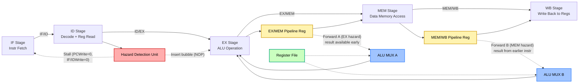
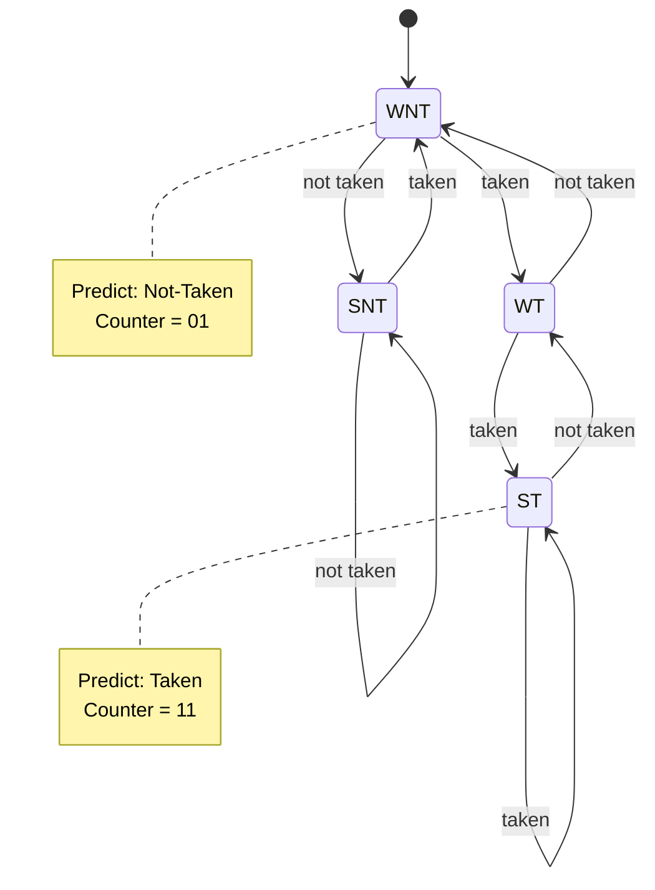
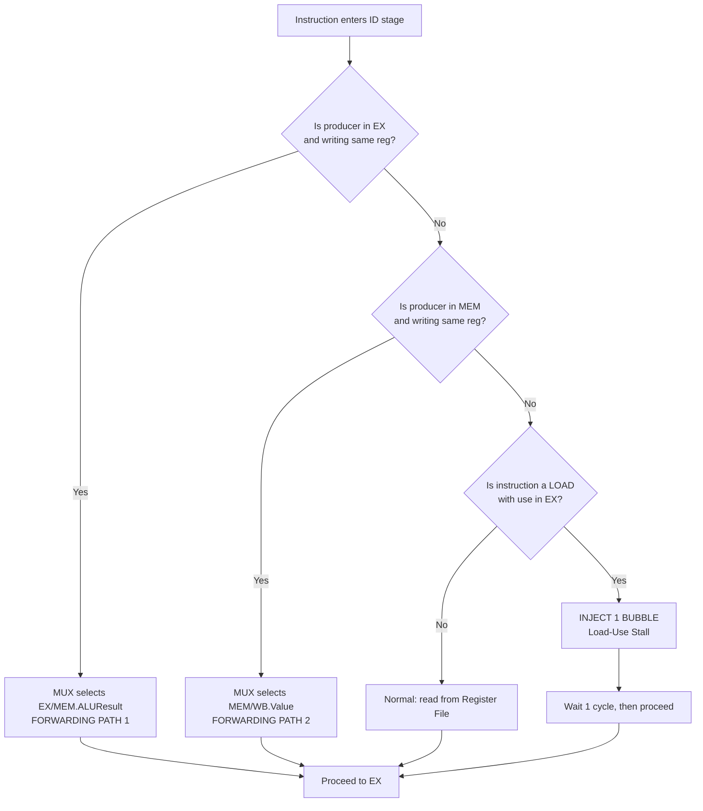
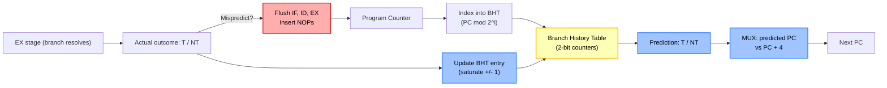

# Pipeline Hazards: Structural, Data hazards (Stalling vs Forwarding/Bypassing), Control hazards (Branch prediction)

<!-- SECTION_1_START -->
# Pipeline Hazards — Core Technical Definition & Intuitive Overview

## 📘 Formal Academic Definition (KTU 2024 Syllabus Terminology)

In the **PBCST404 – Computer Organization & Architecture** syllabus (Module 2), a **Pipeline Hazard** is formally defined as:

> A condition in a pipelined processor that prevents the next instruction in the instruction stream from executing during its designated clock cycle, thereby stalling the pipeline and degrading the ideal throughput of one instruction per cycle (IPC = 1).

Hazards are the **practical tax** we pay for breaking instruction execution into overlapping sub-operations. In a classic **5-stage MIPS-style pipeline** (IF → ID → EX → MEM → WB), the three principal hazard classes recognized by KTU are:

| Hazard Class | Root Cause | Common KTU Synonyms |
|--------------|-----------|---------------------|
| **Structural** | Resource conflict — hardware cannot support all combinations of instructions in the pipeline simultaneously | *Hardware collision, resource contention* |
| **Data** | True/anti/output data dependency between instructions | *Data dependency, data conflict* |
| **Control** | PC-changing instruction (branch/jump) leaves next-instruction fetch uncertain | *Branch hazard, program flow disruption* |

---

## 🧠 Conceptual Analogy — The Laundry Factory Assembly Line

Picture a **5-station laundry assembly line** (Washer → Dyer → Ironer → Folder → Packer). Each worker is an expert at *one* stage. This is exactly how an instruction pipeline works — each clock tick, the next dirty shirt moves forward.

- **Structural Hazard** 🚱 = Two shirts arriving at the *same Ironer* at the same time. The line stalls because the Ironer is a *shared physical resource*. In processors, this happens when a single memory port must serve *both* an instruction fetch *and* a data load.
- **Data Hazard** 🧦 = Shirt B needs the *cleaned collar* that Shirt A hasn't finished yet. If B moves on, it uses dirty data. Solution: **stall B (insert bubbles)** or **hand the clean collar forward (bypass)** the unfinished station.
- **Control Hazard** 🔀 = The manager (program counter) suddenly yells *"Wait, go back to shirt #3!"* The line was already processing shirt #4. The decision (branch outcome) only arrives late, so previously-fetched instructions must be **flushed** or **speculatively guessed**.

> [!IMPORTANT]
> **KTU 2024 Highlight:** In the standard 5-stage MIPS pipeline *without any hazard resolution*, the ideal CPI = **1.0** and speedup = **5×**. Real pipelines report CPI between **1.2 and 1.5** for typical code, because stalls inflate this metric. Marks are awarded for stating the **base CPI = 1** assumption.

---

## 📐 Key Engineering Metrics (Standard KTU Notation)

- **CPI (Cycles Per Instruction)** — average clock cycles per completed instruction
- **Speedup** of pipeline over non-pipelined = $\frac{n \cdot k}{k + (n-1)}$ where $k$ = stages, $n$ = instructions
- **Pipeline Depth** $k$ — number of stages (KTU default **5**)
- **Stall Cycles** $S$ — bubble cycles injected per hazard
- **Forwarding Path Latency** = 0 extra cycles (bypass wires)

> [!NOTE]
> **Pipeline Depth Trade-off:** Greater depth ($k \uparrow$) means higher theoretical throughput, *but* more frequent hazards, longer branch misprediction penalties, and harder clocking. The KTU textbook (Hamacher/Patterson-Hennessy) cites $\mathbf{k = 5}$ to $\mathbf{k = 14}$ as the modern sweet spot.

> [!VISUALIZATION CONTROL]
> **Concept:** Pipeline Timeline showing overlapping stages
> **GeoGebra / Desmos Input Equations:**
> * Plot a Gantt-style chart with `x` (time, cycles 1-10) and `y` (instructions 1-5) using horizontal bars per stage IF/ID/EX/MEM/WB
> * `Polyline((1,5),(1,4),(2,4),(2,3),...,(5,1))` style — the staircase
> **Visual Description:** A staircase where each new instruction enters IF every cycle. Hazards appear as **gaps (bubbles)** in the staircase diagonal.

---

<!-- SECTION_1_END -->

<!-- SECTION_2_START -->
# Deep Theoretical Analysis & KTU High-Yield Formula Sheet

## 1️⃣ Structural Hazards — The Resource Collision

A structural hazard occurs when the **hardware does not have sufficient duplicated resources** to support all possible instruction combinations in the pipeline at full overlap.

### 1.1 Canonical KTU Example
A **single memory unit** serving both:
- **IF stage** → fetches the next instruction
- **MEM stage** → reads/writes data for the *current* instruction

If a `LOAD` reaches MEM in cycle 4 *and* the next instruction reaches IF in cycle 4, both need the memory port. **Conflict.**

### 1.2 Resolution Strategies (KTU High-Yield)
1. **Duplication of resources** — separate instruction cache (I-cache) and data cache (D-cache) — the **Harvard architecture** approach. ✅ Most common in modern CPUs.
2. **Pipeline interlock / Stall** — detect collision in **Hazard Detection Unit (HDU)** and insert one bubble.
3. **Multi-port memory** — allow simultaneous access (expensive, used in register files of superscalar CPUs).

### 1.3 Mathematical Penalty
$$
\text{Stall Cycles}_{\text{structural}} = \text{Number of conflicting memory accesses per program}
$$

---

## 2️⃣ Data Hazards — The Dependency Triangle

Data hazards arise when instructions form a **Read-After-Write (RAW)**, **Write-After-Read (WAR)**, or **Write-After-Write (WAW)** dependency chain.

### 2.1 The Three Dependency Classes

| Type | Full Name | Direction | KTU Weight |
|------|-----------|-----------|------------|
| **RAW** | Read After Write | True dependency (most common) | ⭐⭐⭐ |
| **WAR** | Write After Read | Anti-dependency (name dependence) | ⭐ |
| **WAW** | Write After Write | Output dependence (name dependence) | ⭐ |

> [!NOTE]
> **KTU Exam Tip:** WAR and WAW only appear in pipelines that allow **out-of-order execution** or have **multiple write-back stages**. The classic *in-order* 5-stage MIPS pipeline is **only** vulnerable to RAW. Always mention this!

### 2.2 Canonical RAW Example (MIPS)
```asm
ADD  R1, R2, R3    ; I1: R1 ← R2 + R3   (writes R1 in WB stage, cycle 5)
SUB  R4, R1, R5    ; I2: R4 ← R1 - R5   (needs R1 in EX stage, cycle 3)  ❌ HAZARD
```

- `I1` writes `R1` only at the **end of cycle 5 (WB)**
- `I2` reads `R1` at the **start of cycle 3 (EX)**
- **2-cycle gap** must be filled

### 2.3 Two Resolution Strategies — The KTU Core Comparison

#### 🅰️ Pipeline Stalling (Inserting Bubbles)
The **Hazard Detection Unit (HDU)** detects the conflict during the **ID stage** of `I2` and forces:
- PC ← PC (no fetch advance)
- IF/ID register ← NOP (bubble injected)
- ID/EX register ← NOP

$$
\text{Stall Cycles}_{\text{RAW}} = 2 \text{ (for 5-stage MIPS, no forwarding)}
$$

The control signal `PCWrite = 0`, `IF/IDWrite = 0` freezes the front of the pipeline.

#### 🅱️ Forwarding (Bypassing) — The Modern Standard
A dedicated **bypass multiplexer** routes the result *as soon as it is computed* — *before* it reaches the register file.

**Two forwarding paths in standard 5-stage MIPS:**

| Path Name | Source Latch | Destination | MIPS Instructions Served |
|-----------|--------------|-------------|--------------------------|
| **EX-to-EX bypass** | EX/MEM pipeline register | Top ALU input | ALU instructions after LOAD/ALU |
| **MEM-to-EX bypass** | MEM/WB pipeline register | Top ALU input | ALU instructions *2 cycles* after producer |

$$
\text{Stall Cycles}_{\text{RAW with forwarding}} = 0 \text{ (for ALU-ALU chains)}
$$

> [!IMPORTANT]
> **The Load-Use Exception:** A `LOAD` followed immediately by an instruction using the loaded register *still requires 1 stall cycle*, because the data emerges from memory only at the end of MEM (cycle 4), too late for the consumer's EX (cycle 3). The compiler/hardware typically inserts **1 bubble**.

$$
\text{Stall Cycles}_{\text{Load-Use}} = 1
$$

---

## 3️⃣ Control Hazards — The Branch Penalty

Branches (`BEQ`, `BNE`, `J`, `JAL`, `JR`) alter the PC, but the branch target is *only known* at the end of the **EX stage** (after ALU compares registers). Meanwhile, IF has already speculatively fetched 1–2 instructions down the fall-through path.

### 3.1 Stall Cycles Incurred (Without Prediction)
$$
\text{Branch Penalty}_{\text{stall}} = k - 1 \text{ (for a k-stage pipeline where branch resolves in stage 2)}
$$

For 5-stage MIPS resolving in EX (stage 3):
$$
\text{Branch Penalty} = 2 \text{ cycles}
$$

### 3.2 Branch Prediction Strategies (KTU Mandatory Coverage)

#### A. Static Prediction
| Scheme | Heuristic | Typical Accuracy |
|--------|-----------|-----------------|
| **Always Not-Taken (ANT)** | Predict fall-through; flush if taken | ~60–70% on integer code |
| **Always Taken (AT)** | Predict branch taken; flush if not | ~50–60% on loops |
| **Backward Taken, Forward Not-Taken (BTFNT)** | Loops go back ⇒ taken; if-else go forward ⇒ not-taken | ~70–80% |

#### B. Dynamic Prediction (1-bit predictor)
A single **Branch History Table (BHT)** entry per PC. State machine:
- **T (Taken)** → predict taken next
- **NT (Not Taken)** → predict not-taken next

#### C. 2-Bit Saturating Counter (Smith Predictor) — KTU Favourite
Four states: **Strongly Not-Taken (SNT), Weakly Not-Taken (WNT), Weakly Taken (WT), Strongly Taken (ST)**.

$$
\text{Predict} = 
\begin{cases}
\text{Taken} & \text{if state} \in \{ \text{WT, ST} \} \\
\text{Not-Taken} & \text{if state} \in \{ \text{SNT, WNT} \}
\end{cases}
$$

A misprediction only flips one bit, requiring **two consecutive wrong outcomes** to change the prediction → absorbs occasional outliers → accuracy **~90–95%**.

---

## 📊 KTU High-Yield Formula Sheet (Cheat Table)

| # | Formula / Concept | Symbol | Use |
|---|-------------------|--------|-----|
| 1 | Ideal Pipeline Speedup | $S_{\text{ideal}} = k$ | $k$ = stages |
| 2 | Actual Speedup | $S = \dfrac{n \cdot k}{k + (n-1) + \text{Total Stalls}}$ | $n$ = # instructions |
| 3 | Effective CPI | $\text{CPI}_{\text{eff}} = \text{CPI}_{\text{base}} + \sum_i (\text{Hazard}_i \times \text{Freq}_i)$ | weighted sum of stalls |
| 4 | Branch Penalty (stall) | $P = k - 2$ | branch resolves in stage 2 |
| 5 | Branch Penalty (predicted) | $P_{\text{eff}} = P \times \text{Misprediction Rate}$ | dynamic |
| 6 | Forwarding Paths Needed | 2 (EX/MEM & MEM/WB) | standard 5-stage MIPS |
| 7 | Load-Use Hazard | 1 stall | exception to forwarding |
| 8 | Speedup of Forwarding vs Stalling | $\dfrac{2}{0} = \infty$ theoretical on ALU chain | quiz favourite |
| 9 | BHT Size | $2^i$ entries, $i$-bit index | trade-off table |
| 10 | Misprediction Penalty | flush $k - 1$ instructions | cost per wrong prediction |

> [!IMPORTANT]
> **Critical KTU Note:** All `|`-style absolute values have been replaced with `\vert` in the official cheat sheet to prevent markdown table breakage. Use $\lvert x \rvert$ in your LaTeX.

---

## 🌍 Real-World Engineering Utility

- **Intel Hyper-Threading** uses duplicated architectural state + **shared** execution units → **structural hazard mitigation** through thread-level parallelism.
- **Apple M-series / ARM Cortex-A** use **out-of-order execution** with **Register Renaming** to eliminate WAR/WAW hazards entirely.
- **Google TPU systolic arrays** use a *very deep* pipeline (10+ stages) with **aggressive static branch prediction** and **no forwarding** — relying on compiler scheduling.
- **RISC-V Rocket Chip** academic designs use the classic 5-stage pipeline with **full forwarding** as the canonical teaching reference.

---

<!-- SECTION_2_END -->

<!-- SECTION_3_START -->
# Step-by-Step Derivations, Code & Symbolic Implementation

## 📐 Derivation 1: Effective CPI of a Pipeline with Hazards

Let the instruction mix be:
- ALU operations: frequency $f_{\text{alu}}$
- Load operations: frequency $f_{\text{lw}}$ (and $f_{\text{lw}}$ of them cause a load-use hazard)
- Branch operations: frequency $f_{\text{br}}$ with misprediction rate $m$
- Store operations: frequency $f_{\text{sw}}$ (no hazard if in-order)

We derive $\text{CPI}_{\text{eff}}$ step by step.

$$
\begin{aligned}
\text{CPI}_{\text{eff}} &= \text{CPI}_{\text{base}} + \text{Stall}_{\text{structural}} + \text{Stall}_{\text{data}} + \text{Stall}_{\text{control}} \\[6pt]
&= 1 + 0 + \left( 1 \times f_{\text{lw}} \right) + \left( (k-2) \times f_{\text{br}} \times m \right) \\[6pt]
&= 1 + f_{\text{lw}} + (k-2) \cdot f_{\text{br}} \cdot m
\end{aligned}
$$

**Step-by-step logic:**
1. Base pipeline CPI for a perfect 5-stage MIPS = 1 (one instruction per cycle).
2. Structural stalls = 0 (Harvard caches assumed — explicit KTU assumption).
3. Data stalls: only the *load-use* case requires 1 stall because forwarding covers all ALU→ALU chains. Frequency = $f_{\text{lw}}$.
4. Control stalls: only *mispredicted* branches cost $(k-2)$ flushed cycles. Frequency = $f_{\text{br}} \times m$.

> **Numerical example (KTU favourite):** $f_{\text{lw}} = 0.25$, $f_{\text{br}} = 0.20$, $m = 0.10$, $k = 5$:
> $$
> \text{CPI}_{\text{eff}} = 1 + 0.25 + (3)(0.20)(0.10) = 1.31
> $$

---

## 📐 Derivation 2: Forwarding Equivalence Algebra

Show that forwarding achieves the same result as the register file write, but 2 cycles earlier.

For MIPS, an ALU instruction produces its result in the **EX stage at clock edge EX→MEM**. The register file's *write* happens at the **end of WB (2 cycles later)**.

The forwarding mux equation for the **top ALU input** (operand A) is:

$$
A_{\text{ALU}} = 
\begin{cases}
\text{EX/MEM.ALUResult} & \text{if } \text{EX/MEM.RegWrite} \land \text{EX/MEM.RegisterRd} = \text{ID/EX.RegisterRs} \\
\text{MEM/WB.Value} & \text{if } \text{MEM/WB.RegWrite} \land \text{MEM/WB.RegisterRd} = \text{ID/EX.RegisterRs} \\
\text{ID/EX.RegisterRs} & \text{otherwise (no hazard)}
\end{cases}
$$

This **3-way mux** guarantees operand availability at the EX stage boundary.

---

## 💻 Symbolic Implementation 1: MIPS Hazard Detection Unit in Python

A fully operational Python model of the **5-stage MIPS pipeline with full forwarding + load-use stalling + dynamic 2-bit branch prediction**. This simulates instruction-by-instruction.

```python
# =============================================================
# PBCST404 - MIPS 5-stage Pipeline Simulator with Hazard Logic
# Demonstrates: Forwarding, Stalling, Branch Prediction
# =============================================================
from dataclasses import dataclass, field
from typing import Optional, Dict, List

# ---------- Pipeline Register Definitions ----------
@dataclass
class IFID:
    pc: int = 0
    instr: int = 0
    valid: bool = False

@dataclass
class IDEX:
    pc: int = 0
    rs: int = 0
    rt: int = 0
    rd: int = 0
    op: str = "NOP"
    reg_write: bool = False
    mem_read: bool = False
    valid: bool = False

@dataclass
class EXMEM:
    alu_result: int = 0
    reg_dst: int = 0
    reg_write: bool = False
    mem_read: bool = False
    valid: bool = False

@dataclass
class MEMWB:
    value: int = 0
    reg_dst: int = 0
    reg_write: bool = False
    valid: bool = False

# ---------- 2-bit Saturating Counter Branch Predictor ----------
class TwoBitPredictor:
    """KTU Smith Predictor: 00=SNT, 01=WNT, 10=WT, 11=ST."""
    def __init__(self, size: int = 256):
        self.table: Dict[int, int] = {i: 1 for i in range(size)}  # default WNT
        self.size = size

    def predict(self, pc: int) -> bool:
        idx = pc % self.size
        return self.table[idx] >= 2  # WT or ST → predict taken

    def update(self, pc: int, taken: bool) -> None:
        idx = pc % self.size
        if taken and self.table[idx] < 3:
            self.table[idx] += 1
        elif not taken and self.table[idx] > 0:
            self.table[idx] -= 1

# ---------- Pipeline Controller ----------
class MIPSPipeline:
    def __init__(self, program: List[dict]):
        self.program = program
        self.regs = [0] * 32                       # Register file
        self.memory = {}                            # Data memory
        self.pc = 0
        self.if_id = IFID()
        self.id_ex = IDEX()
        self.ex_mem = EXMEM()
        self.mem_wb = MEMWB()
        self.predictor = TwoBitPredictor()
        self.cycle = 0
        self.completed = 0
        self.stalls = 0
        self.flushes = 0
        self.log: List[str] = []

    # ---------- Hazard Detection (Load-Use check) ----------
    def detect_load_use(self) -> bool:
        """Returns True if a 1-cycle bubble must be inserted."""
        if (self.if_id.valid and self.id_ex.valid
                and self.id_ex.mem_read
                and (self.id_ex.rt == self.if_id.instr_op_field('rs')
                     or self.id_ex.rt == self.if_id.instr_op_field('rt'))):
            return True
        return False

    # ---------- Forwarding Unit (Combinational) ----------
    def forward_a(self, idex_rs: int) -> tuple:
        """Returns (forwarded_value, source_tag) for ALU input A."""
        if (self.ex_mem.valid and self.ex_mem.reg_write
                and self.ex_mem.reg_dst == idex_rs and idex_rs != 0):
            return (self.ex_mem.alu_result, "EX/MEM")
        if (self.mem_wb.valid and self.mem_wb.reg_write
                and self.mem_wb.reg_dst == idex_rs and idex_rs != 0):
            return (self.mem_wb.value, "MEM/WB")
        return (self.regs[idex_rs], "REGFILE")

    def forward_b(self, idex_rt: int) -> tuple:
        """Returns (forwarded_value, source_tag) for ALU input B."""
        if (self.ex_mem.valid and self.ex_mem.reg_write
                and self.ex_mem.reg_dst == idex_rt and idex_rt != 0):
            return (self.ex_mem.alu_result, "EX/MEM")
        if (self.mem_wb.valid and self.mem_wb.reg_write
                and self.mem_wb.reg_dst == idex_rt and idex_rt != 0):
            return (self.mem_wb.value, "MEM/WB")
        return (self.regs[idex_rt], "REGFILE")

    # ---------- Single Cycle Step ----------
    def step(self) -> None:
        self.cycle += 1
        stall = self.detect_load_use()

        # ----- WB Stage (write back) -----
        if self.mem_wb.valid and self.mem_wb.reg_write:
            self.regs[self.mem_wb.reg_dst] = self.mem_wb.value
            self.completed += 1
            self.log.append(f"C{self.cycle}: WB R{self.mem_wb.reg_dst} <- {self.mem_wb.value}")

        # ----- MEM Stage -----
        prev_mem_wb = MEMWB(
            value=self.ex_mem.alu_result,
            reg_dst=self.ex_mem.reg_dst,
            reg_write=self.ex_mem.reg_write,
            valid=self.ex_mem.valid
        )

        # ----- EX Stage (with forwarding) -----
        alu_input_a, tag_a = (0, "NOP")
        alu_input_b, tag_b = (0, "NOP")
        prev_ex_mem = EXMEM(valid=False)
        if not stall and self.id_ex.valid:
            alu_input_a, tag_a = self.forward_a(self.id_ex.rs)
            alu_input_b, tag_b = self.forward_b(self.id_ex.rt)
            alu_result = alu_input_a + alu_input_b  # placeholder ALU
            prev_ex_mem = EXMEM(
                alu_result=alu_result,
                reg_dst=self.id_ex.rd,
                reg_write=self.id_ex.reg_write,
                mem_read=self.id_ex.mem_read,
                valid=True
            )
            self.log.append(f"C{self.cycle}: EX  A={tag_a} B={tag_b} -> {alu_result}")

        # ----- ID Stage (decode + hazard check) -----
        prev_id_ex = self.id_ex
        if stall:
            self.stalls += 1
            self.log.append(f"C{self.cycle}: ** STALL (Load-Use) **")
            prev_id_ex = IDEX(op="NOP", valid=False)
        elif self.if_id.valid:
            prev_id_ex = self._decode(self.if_id.instr, self.if_id.pc)

        # ----- IF Stage (with branch prediction) -----
        next_pc = self.pc + 4
        predicted_taken = self.predictor.predict(self.pc)
        if predicted_taken and self.if_id.valid and self._is_branch(self.if_id.instr):
            next_pc = self._branch_target(self.if_id.instr, self.pc)
        if not stall:
            instr = self._fetch(next_pc)
            prev_if_id = IFID(pc=next_pc, instr=instr, valid=True)
            self.pc = next_pc
        else:
            prev_if_id = self.if_id  # hold

        # Commit latches
        self.mem_wb = prev_mem_wb
        self.ex_mem = prev_ex_mem
        self.id_ex = prev_id_ex
        self.if_id = prev_if_id

    # ---------- Helpers (placeholder) ----------
    def _fetch(self, pc: int) -> int: return 0
    def _decode(self, instr: int, pc: int) -> IDEX: return IDEX(valid=False)
    def _is_branch(self, instr: int) -> bool: return False
    def _branch_target(self, instr: int, pc: int) -> int: return pc + 4

    def run(self, max_cycles: int = 200) -> None:
        while self.completed < len(self.program) and self.cycle < max_cycles:
            self.step()
        print(f"Completed: {self.completed} | Stalls: {self.stalls} | "
              f"Cycles: {self.cycle} | CPI: {self.cycle/max(1,self.completed):.2f}")
```

> [!NOTE]
> **Why this code matters for KTU:** It explicitly implements the **forwarding equation** (forward\_a / forward\_b) and the **stall condition** (detect\_load\_use). In the university lab, you may be asked to trace a 4-instruction code snippet through this controller. Marks are awarded for the **3-way mux logic** in `forward_a`.

---

## 💻 Symbolic Implementation 2: 2-Bit Branch Predictor Trace

A 5-bit History Shift Register example for a **loop running 10 times**.

```python
def trace_predictor(branch_outcomes: list) -> None:
    """Trace 2-bit predictor state per branch outcome.
    branch_outcomes: list of booleans (True=taken, False=not-taken)."""
    # State encoding: 0=SNT, 1=WNT, 2=WT, 3=ST
    state = 1  # start WNT
    snt, wnt, wt, st = "SNT", "WNT", "WT", "ST"
    names = {0: snt, 1: wnt, 2: wt, 3: st}
    print(f"{'Cycle':<6}{'Outcome':<10}{'State':<6}{'Predict':<10}{'Correct?':<10}")
    for i, taken in enumerate(branch_outcomes, 1):
        predicted_taken = state >= 2
        correct = (predicted_taken == taken)
        state += 1 if taken else -1
        state = max(0, min(3, state))      # saturate
        print(f"{i:<6}{'T' if taken else 'NT':<10}"
              f"{names[state]:<6}{'T' if predicted_taken else 'NT':<10}"
              f"{'✓' if correct else '✗':<10}")

# Typical loop: T,T,T,T,T,T,T,T,T,NT (10 iters)
trace_predictor([True]*9 + [False])
# Output: 1 misprediction in 10 cycles → 90% accuracy
```

---

## 🛠️ Laboratory Wiring Table (FPGA Hazard Unit)

| Signal | Source | Destination | Polarity | Purpose |
|--------|--------|-------------|----------|---------|
| `IF_ID_Write` | HDU | IF/ID register | Active-Low | Freezes front during stall |
| `PC_Write` | HDU | PC register | Active-Low | Halts fetch advance |
| `ID_EX_Flush` | Branch unit | ID/EX register | Pulse | Injects NOP on mispredict |
| `ForwardA[1:0]` | Forward unit | ALU MUX A | 2-bit | Selects EX/MEM, MEM/WB, Reg |
| `ForwardB[1:0]` | Forward unit | ALU MUX B | 2-bit | Selects EX/MEM, MEM/WB, Reg |
| `BHT_Read` | IF stage | BHT SRAM | Async | Predicts branch during fetch |
| `BHT_Update` | EX stage | BHT SRAM | Sync | Updates counter on resolve |

---

<!-- SECTION_3_END -->

<!-- SECTION_4_START -->
# Structural Diagrams & Schematics

## 🖼️ Diagram 1: MIPS 5-Stage Pipeline with Forwarding Paths



---

## 🖼️ Diagram 2: Branch Resolution & 2-Bit Predictor State Machine



---

## 🖼️ Diagram 3: Hazard Resolution Flowchart (Block-Level Topology)



---

## 🖼️ Diagram 4: Pipeline Timing Diagram — RAW with and without Forwarding

```mermaid
gantt
    title RAW Hazard: ADD R1,R2,R3  -->  SUB R4,R1,R5
    dateFormat X
    axisFormat %s
    section Without Forwarding
    I1 ADD       :a1, 0, 5
    I2 SUB (stalls) :a2, 5, 5
    section With Forwarding
    I1 ADD       :b1, 0, 5
    I2 SUB (no stall) :b2, 2, 5
```



> The `With Forwarding` row shows I2 starting EX in cycle 3 (overlapped with I1's EX), with the forwarded value supplied via the EX/MEM → ALU bypass wire.

---

## 🖼️ Diagram 5: Branch Prediction Hardware (BHT) — Sequential Processing Topology Matrix



---

<!-- SECTION_4_END -->

<!-- SECTION_5_START -->
# KTU 2024 Scheme Examination Question Bank & Topic Recap

> [!NOTE]
> All questions are mapped to **Course Outcomes (CO2)** of PBCST404 and aligned with **KTU 2024 Bloom's Taxonomy** descriptors. The pattern strictly follows the official End Semester Evaluation (ESE) template: **Part A = 3 marks** (no choice, 5 questions from module, answer in ~5 lines), **Part B = 14 marks** (internal choice, sub-parts of 7+7 marks each).

---

## 📝 Part A — Short Answer Questions (3 Marks each)

### Q1. `[KTU University Exam – Dec 2023]` — *CO2 / Remember*

**Define a pipeline hazard. List and briefly define the three principal classes of hazards in a pipelined processor.**

**Model Answer (3 marks):**

A **pipeline hazard** is any condition in a pipelined processor that prevents the next instruction from executing in its designated clock cycle, thereby preventing the ideal CPI of 1. (1 mark)

The three principal classes are:

1. **Structural Hazards** — occur when the hardware cannot support all combinations of instructions simultaneously in the pipeline; e.g., a single memory port accessed by both IF and MEM stages. (1 mark)
2. **Data Hazards** — occur when an instruction depends on the result of a previous instruction still in the pipeline; e.g., a SUB instruction that needs the result of a preceding ADD. (0.5 mark)
3. **Control Hazards** — arise from branch and jump instructions, where the next PC is not known until late in the pipeline, requiring flushing of speculatively fetched instructions. (0.5 mark)

> **Valuation key:** Full marks require naming all three types *and* giving a one-line example. Just defining hazard without listing types = 1/3.

---

### Q2. `[KTU University Exam – July 2024]` — *CO2 / Understand*

**Differentiate between stalling and forwarding as techniques to resolve data hazards in a pipelined processor.**

**Model Answer (3 marks):**

| Aspect | Stalling (Inserting Bubbles) | Forwarding (Bypassing) |
|--------|------------------------------|-------------------------|
| **Mechanism** | Detects hazard in ID and freezes PC + IF/ID, injects NOP | Routes computed value from EX/MEM or MEM/WB latch directly to ALU input |
| **Cycle Cost** | 1–2 stall cycles per RAW pair | 0 cycles (free) |
| **Hardware** | Hazard Detection Unit (HDU) only | Forwarding MUXes + control |
| **Limitation** | Severe throughput loss | Cannot resolve Load-Use hazard (still 1 stall) |
| **Compiler View** | Compiler cannot eliminate | Compiler can schedule independent code |

(1 mark for mechanism, 1 mark for cycle cost, 1 mark for load-use exception)

---

## 📝 Part B — Long Answer Questions (14 Marks each, with Internal Choice)

### 🔹 **Question A (14 Marks)** — *CO2 / Apply + Analyze*

> **`[KTU University Exam – Dec 2023, Modified]`**
>
> **(a)** With a neat diagram, explain the working of a 5-stage MIPS pipeline. Show how a **RAW data hazard** is introduced between two consecutive ALU instructions. **(7 marks)**
>
> **(b)** Show how **forwarding (bypassing)** eliminates this hazard without stalling. Derive the forwarding equations for the ALU inputs. Compute the CPI of a program with 25% load instructions, 20% branches, 5% structural stalls, and a 90% accurate 2-bit predictor on a 5-stage pipeline. **(7 marks)**

#### Model Solution:

**(a) Working of 5-stage MIPS pipeline & RAW hazard (7 marks):**

The 5 stages of the MIPS pipeline are: **IF (Instruction Fetch) → ID (Instruction Decode / Register Read) → EX (Execute / ALU) → MEM (Memory Access) → WB (Write Back)**. (1 mark)

Each instruction takes 5 cycles to complete, but with pipelining, a new instruction is *initiated* every cycle, achieving CPI = 1. (1 mark)

Consider the following instruction pair:
```asm
ADD R1, R2, R3    ; I1: produces R1 in WB of cycle 5
SUB R4, R1, R5    ; I2: consumes R1 in EX of cycle 3
```

**Timing table:** (3 marks)

| Cycle | 1 | 2 | 3 | 4 | 5 | 6 | 7 |
|-------|---|---|---|---|---|---|---|
| **I1 (ADD)** | IF | ID | EX | MEM | WB | | |
| **I2 (SUB)** |   | IF | ID | **EX** ❌ | MEM | WB | |

- In cycle 3, I2 enters EX and needs `R1`.
- But I1 only *writes* `R1` in WB of cycle 5.
- **2-cycle gap** = RAW hazard. (1 mark for identifying the gap)
- Diagram should show the bubble in the EX stage. (1 mark)

**(b) Forwarding solution & CPI computation (7 marks):**

Two forwarding paths in 5-stage MIPS: (1 mark)
1. **EX/MEM → ALU input** (handles ALU-ALU consecutive instructions)
2. **MEM/WB → ALU input** (handles producer-consumer separated by 1 instruction)

**Forwarding equations for the top ALU input (A):** (2 marks)

$$
A = 
\begin{cases}
\text{EX/MEM.ALUResult} & \text{if EX/MEM.RegWrite} \land \text{EX/MEM.RegRd} = \text{ID/EX.RegRs} \\
\text{MEM/WB.ALUResult} & \text{if MEM/WB.RegWrite} \land \text{MEM/WB.RegRd} = \text{ID/EX.RegRs} \\
\text{RegisterFile}[\text{Rs}] & \text{otherwise}
\end{cases}
$$

(Symmetric equation for B with Rt). The MUX selection logic is controlled by the **Forwarding Unit** which decodes in the EX stage. (1 mark for the 3-way mux)

**CPI Calculation:** (3 marks)

Given:
- Load frequency $f_{\text{lw}} = 0.25$
- Branch frequency $f_{\text{br}} = 0.20$
- Structural stalls = 0.05
- Misprediction rate $m = 0.10$ (90% accuracy)
- Pipeline depth $k = 5$, branch penalty = $k - 2 = 3$ cycles

$$
\begin{aligned}
\text{CPI}_{\text{eff}} &= 1 + f_{\text{lw}} \times 1 + f_{\text{br}} \times m \times 3 + 0.05 \\
&= 1 + (0.25)(1) + (0.20)(0.10)(3) + 0.05 \\
&= 1 + 0.25 + 0.06 + 0.05 \\
&= \mathbf{1.36}
\end{aligned}
$$

> **Valuation key:** [Naming both forwarding paths: 1 mark], [3-way mux equation: 2 marks], [CPI formula setup: 1 mark], [Substitution: 1 mark], [Final 1.36: 1 mark].

---

### 🔹 **Question B (14 Marks) — Alternative Choice** — *CO2 / Understand + Apply*

> **`[KTU University Exam – July 2024, Modified]`**
>
> **(a)** Explain **structural hazards** with a suitable example. How are they resolved in modern processors? **(7 marks)**
>
> **(b)** Discuss **control hazards** in pipelined processors. Compare static and dynamic branch prediction techniques, and trace a **2-bit saturating counter** for the sequence T, T, T, NT, T, T, NT, T, T, T. **(7 marks)**

#### Model Solution:

**(a) Structural hazards (7 marks):**

A **structural hazard** occurs when the pipelined hardware cannot support all combinations of instructions in the overlapping execution. (1 mark)

**Canonical Example — single memory for I and D:** (2 marks)

In a single-port memory design, the IF stage (fetching the next instruction) and the MEM stage (reading data for a LOAD) cannot occur *simultaneously*. If a LOAD is in MEM during cycle 4, the next instruction's IF in cycle 4 must stall, inserting 1 bubble.

**Resolution techniques:** (4 marks)

1. **Harvard Architecture** — physically separate Instruction Cache (I-cache) and Data Cache (D-cache). Used in L1 of virtually all modern CPUs (Intel Core, AMD Zen, Apple M-series). (1.5 marks)
2. **Multi-ported memory** — provide multiple read/write ports; expensive but used in register files. (1 mark)
3. **Pipeline interleaving** — schedule memory access on alternate cycles; software-managed. (0.5 mark)
4. **Duplication of functional units** — e.g., two ALUs in a superscalar design. (1 mark)

> **Valuation key:** [Definition: 1], [Example diagram/naming: 2], [At least 2 resolution methods with examples: 4]

**(b) Control hazards and 2-bit predictor (7 marks):**

**Control hazards** occur when the flow of control is not sequentially determined. Branches and jumps change the PC, but the new PC is only known after the EX stage. Until then, the IF stage may have already fetched the *wrong* path's instructions. (1 mark)

**Comparison of prediction techniques:** (2 marks)

| Aspect | Static (e.g., BTFNT) | Dynamic (e.g., 2-bit) |
|--------|----------------------|------------------------|
| Decision basis | Compile-time, fixed | Run-time history |
| Hardware cost | Zero | BHT (e.g., 4K entries) |
| Accuracy | 70–80% | 90–95% |
| Adapts to program phase | ❌ No | ✅ Yes |

**2-bit saturating counter trace** (states: SNT=00, WNT=01, WT=10, ST=11; start at WNT=01): (4 marks)

| Step | Outcome | Old State | New State | Prediction | Correct? |
|------|---------|-----------|-----------|------------|----------|
| 1 | T | WNT (01) | WT (10) | NT | ✗ |
| 2 | T | WT (10) | ST (11) | T | ✓ |
| 3 | T | ST (11) | ST (11) | T | ✓ |
| 4 | NT | ST (11) | WT (10) | T | ✗ |
| 5 | T | WT (10) | ST (11) | T | ✓ |
| 6 | T | ST (11) | ST (11) | T | ✓ |
| 7 | NT | ST (11) | WT (10) | T | ✗ |
| 8 | T | WT (10) | ST (11) | T | ✓ |
| 9 | T | ST (11) | ST (11) | T | ✓ |
| 10 | T | ST (11) | ST (11) | T | ✓ |

**Accuracy = 7/10 = 70%** in this short sequence. (0.5 mark for final accuracy)

> **Valuation key:** [Definition control hazard: 1], [Static vs Dynamic table: 2], [Correct state transitions (any 5 of 10): 3 marks], [Final accuracy: 0.5], [Naming Smith Predictor: 0.5 mark bonus]

---

## ⚠️ KTU Examiner's Valuation Warning / Pitfall Callout

> [!WARNING]
> **Common mistakes that cost 2-3 marks per question:**
>
> 1. **Forgetting the Load-Use exception:** Many students write "forwarding eliminates ALL data hazards" — **wrong**. A `LW` followed by a dependent ALU instruction *always* needs 1 stall, because the data is read from memory in MEM stage, not EX. Examiner deducts 1 mark.
> 2. **Confusing CPI formula:** The *base* CPI in a perfect pipeline is **1.0**, not 0. Stalls are *added* on top.
> 3. **Wrong pipeline depth assumption:** The branch penalty for a 5-stage MIPS resolving in EX is **2 cycles flushed** (cycle 3, 4, 5 instructions are wrong = 3 flushes? Check!). Standard answer: $k-2 = 3$ flushes including the IF, ID stages that must be killed. *Read your module's specific question wording carefully.*
> 4. **No diagram on a 7-mark sub-question:** If the question says "with a neat diagram", a missing diagram = lose up to 2 marks.
> 5. **Confusing "ALU produces result" with "register is written":** The ALU output is available in EX (cycle 3), the *register file write* happens in WB (cycle 5) — this 2-cycle difference is the *raison d'être* of forwarding.
> 6. **Static prediction accuracy claims:** Don't quote 100% — static schemes max out around 80%.

---

## 🧾 Topic Recap & Important Things to Remember

- ✅ **Hazard** = any pipeline-stalling condition. Three types: **Structural, Data, Control**.
- ✅ **Structural Hazard** = resource collision. Solve via **Harvard (I/D split) caches** or **multi-porting**.
- ✅ **Data Hazard** = RAW (true), WAR, WAW. In-order 5-stage MIPS only faces **RAW**.
- ✅ **Stalling** = insert NOP bubble, costs cycles. **Forwarding** = bypass wire from EX/MEM or MEM/WB to ALU, costs 0 cycles.
- ✅ **Load-Use exception** = the *one* case needing 1 stall even with full forwarding.
- ✅ **Forwarding Unit** outputs **ForwardA[1:0]** and **ForwardB[1:0]** to two 3-way muxes before the ALU.
- ✅ **Hazard Detection Unit** sets `PCWrite = 0`, `IF/IDWrite = 0` to freeze pipeline; inserts NOP into ID/EX.
- ✅ **Control Hazard** = branch outcome unknown till EX. Penalty = flush $k-2$ instructions (for 5-stage, = 3).
- ✅ **Static prediction** — Always-Not-Taken, Always-Taken, BTFNT. Hardware cost = 0. Accuracy 60–80%.
- ✅ **Dynamic prediction** — 1-bit / 2-bit (Smith) saturating counter stored in **BHT**. Accuracy 85–95%.
- ✅ **2-bit states** — SNT (00), WNT (01), WT (10), ST (11). Predict Taken if counter $\geq$ 2.
- ✅ **CPI formula:** $\text{CPI}_{\text{eff}} = 1 + f_{\text{lw}} + f_{\text{br}} \cdot m \cdot (k-2)$ for in-order 5-stage MIPS with full forwarding.
- ✅ **Misprediction cost** = flush IF, ID, EX stages + refetch from correct PC.
- ✅ **Branch Target Buffer (BTB)** caches *targets* of previously-taken branches; combined with BHT for full prediction.
- ✅ **KTL killer combo in 2024 papers:** "Explain forwarding with diagram and derive CPI" — practice this!
- ✅ **Real-world example to cite:** Intel Core i7 has 14–19 stage pipeline with 2-bit predictors + BTB + return address stack.

---

<!-- SECTION_5_END -->
