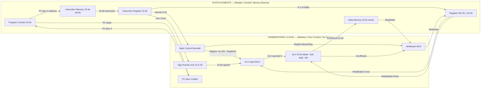
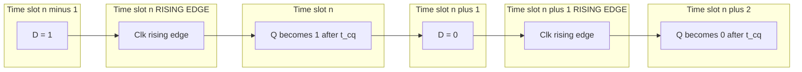

# Processor Design: State elements vs Combinational blocks

<!-- SECTION_1_START -->
# Module 2: Microarchitecture, Datapath Design, and Control Logic
## Topic: Processor Design — State Elements vs Combinational Blocks

### 1.1 Formal Academic Definition (KTU 2024 Syllabus Terminology)

> [!IMPORTANT]
> **Core Definition — Combinational Block**
> A *combinational block* (or combinational logic unit) is a digital circuit whose output is a **pure boolean function of its present inputs only**. It has no memory of past inputs; once an input changes, the corresponding output change propagates after a fixed propagation delay $\tau_{pd}$. In KTU 2024 parlance, this is also called *combinational logic* and forms the *datapath-arithmetic core* of the CPU.

> [!IMPORTANT]
> **Core Definition — State Element**
> A *state element* (or *sequential element*) is a bistable memory device that retains a binary value across clock cycles. Its output is a function of **both** the present inputs and the *history* (previous state) of the element. The KTU 2024 syllabus classifies register files, the program counter (PC), the instruction register (IR), the memory address register (MAR), and the memory data register (MDR) as the canonical state elements of the single-cycle MIPS-style datapath.

In short:

$$
\text{Combinational: } \; Y = f(X) \quad\quad \text{State Element: } \; Y = f(X, S_{\text{prev}}), \quad S_{\text{next}} = g(X, S_{\text{prev}})
$$

where $X$ is the input vector, $Y$ the output vector, and $S_{\text{prev}}, S_{\text{next}}$ the state held in the memory element.

---

### 1.2 Conceptual Analogy / Intuitive Overview

> [!NOTE]
> **Analogy — The Office Filing System**
> Imagine a busy accountant's office:
> - The **calculator on the desk** is a *combinational block*. If you type `7 + 5` it instantly prints `12`; it has no idea what you calculated yesterday. It is stateless.
> - The **paper ledger** sitting in the cabinet is a *state element*. Tomorrow's opening balance ($S_{\text{prev}}$) plus today's deposits and withdrawals ($X$) yields tomorrow's closing balance ($S_{\text{next}}$). The calculator (combinational) decides *how* the numbers combine, but it is the ledger (state) that *remembers*.
> - The **clock on the wall** acts as the *global clock signal*. The accountant updates the ledger **only at the stroke of midnight** (rising edge) — never throughout the day — to ensure the office has a single, unambiguous snapshot of truth at any given moment. This is precisely the discipline that synchronous state elements enforce on a digital processor.

Geometrically, you can think of a combinational block as a **function graph** (a static curve in the $X \to Y$ plane), and a state element as a **trajectory** — a discrete path through state-space indexed by the clock tick $n$. Each clock edge advances the trajectory by one step.

> [!VISUALIZATION CONTROL]
> **Concept:** State Trajectory vs Combinational Mapping
> **Desmos / GeoGebra Input Equations:**
> * Combinational curve: `y = x^2` over `x in [-3, 3]`
> * State trajectory: parametric `x_n = x_{n-1} + 1` for `n = 0, 1, 2, ...` (a discrete walk)
> **Visual Description:** A smooth parabolic curve (the combinational block maps one $x$ to one $y$) sitting next to a sequence of dots stepping diagonally upward at equal spacing (the state element's evolution through successive clock cycles).

---

### 1.3 Standard Metrics You Must Memorise

Every state element in KTU 2024 questions is governed by **three non-negotiable timing parameters** (they appear in ESE problems almost every semester):

- **Setup Time** $t_{su}$ — the interval *before* the active clock edge during which the data input must remain stable.
- **Hold Time** $t_{h}$ — the interval *after* the active clock edge during which the data input must remain stable.
- **Clock-to-Q Delay** $t_{cq}$ — the propagation time from the active clock edge to a stable output $Q$.

A combinational block contributes a single timing parameter:

- **Propagation Delay** $\tau_{pd}$ — the time from any input change to a corresponding stable output. It splits into a **contamination delay** $\tau_{cd}$ (earliest possible change) and a **propagation delay** $\tau_{pd}$ (latest stable output).

> [!TIP]
> **Exam Heuristic:** Whenever a KTU question mentions "the longest path" or "critical path" of a processor datapath, it is implicitly asking you to add up $t_{cq}$ (of the launching register) + $\tau_{pd}$ (of the combinational cloud) + $t_{su}$ (of the capturing register) and compare it with the clock period $T_{clk}$.

<!-- SECTION_1_END -->

<!-- SECTION_2_START -->
## 2. Deep Theoretical Analysis & KTU High-Yield Formula Sheet

### 2.1 Taxonomy of Logic Blocks in a Processor

KTU 2024 Module 2 expects you to classify *every* block of a MIPS-style datapath into one of two buckets. The following table is the authoritative checklist:

| Block | Type | Why | KTU Module 2 Coverage |
|---|---|---|---|
| ALU (Arithmetic Logic Unit) | Combinational | Pure function of $A$ and $B$ inputs | Yes |
| Adder / Subtractor | Combinational | No memory of previous sums | Yes |
| Multiplexer (MUX) | Combinational | Select line is a pure switch | Yes |
| Decoder / Encoder | Combinational | Boolean expansion / compression | Yes |
| Sign-extend unit | Combinational | Replicates the sign bit combinatorially | Yes |
| Shift-left-by-2 | Combinational | Wires plus hard-wired zeros | Yes |
| ALU control / Main control | Combinational | Reads opcode bits, emits control word | Yes |
| Register File (read ports) | Combinational (when reading) | Address in, data out — no clock on read | Yes |
| Register File (write port) | **State Element** | Stores 32 registers on clock edge | Yes |
| Program Counter (PC) | **State Element** | Stores next instruction address | Yes |
| Instruction Register (IR) | **State Element** | Latches the fetched instruction | Yes |
| Memory (RAM, instruction & data) | **State Element** | Stores bits across cycles | Yes |
| Pipeline registers (IF/ID, ID/EX, EX/MEM, MEM/WB) | **State Element** | Boundary latches between stages | Yes (Module 3) |

> [!IMPORTANT]
> **Subtle but frequently tested:** A **register file** is a *hybrid*. The read ports are combinational (the data appears the same cycle the address is presented), but the **write port is a state element** that only commits on the clock edge. The KTU 2024 model paper asks exactly this nuance as a 3-mark Part A question.

---

### 2.2 The Master Timing Equation

For any synchronous datapath operating correctly, the **clock period** $T_{clk}$ must satisfy both:

$$
T_{clk} \;\ge\; t_{cq} \;+\; \tau_{pd,\text{max}} \;+\; t_{su}
$$

and the **hold-time constraint** (no-clock-skew version):

$$
\tau_{cd,\text{min}} \;\ge\; t_{h}
$$

If either is violated, the processor enters *metastability*, which KTU 2024 Module 2 explicitly warns against. The path that drives $t_{cq} + \tau_{pd} + t_{su}$ to its maximum is called the **critical path** and dictates the maximum clock frequency:

$$
f_{\text{max}} \;=\; \frac{1}{T_{clk,\text{min}}} \;=\; \frac{1}{t_{cq} + \tau_{pd,\text{crit}} + t_{su}}
$$

> [!NOTE]
> **Real-World Utility:** This exact equation is what CPU architects at Intel, AMD, and ARM use during *floor-planning*. When you see a CPU advertised at "5.7 GHz boost clock", the marketing team is implicitly claiming that $t_{cq} + \tau_{pd,\text{crit}} + t_{su} \le 175.4\,\text{ps}$. Module 2 of your KTU syllabus is the seed of every commercial CPU's frequency roadmap.

---

### 2.3 Edge-Triggered vs Level-Sensitive Discipline

KTU 2024 distinguishes between two implementation styles of state elements:

| Discipline | Common Name | Behaviour | Used in KTU 2024 Datapath? |
|---|---|---|---|
| Level-sensitive (transparent) | **Latch** (SR, D) | Output follows input while enable/clock is active | Rarely; only in dynamic logic or pulsed latches |
| Edge-triggered | **Flip-Flop** (D-FF, JK-FF) | Output updates *only* on the active clock edge | **Yes — the MIPS-style datapath uses positive-edge D-FFs** |

Theoretical model of a positive-edge-triggered D flip-flop:

$$
Q_{n+1} \;=\; D_{n} \quad \text{at } t = nT_{clk} \quad\quad Q(t) \;=\; Q_{n} \quad \text{for } t \in [nT_{clk},\, (n+1)T_{clk})
$$

A transparent D-latch, in contrast, obeys:

$$
Q(t) \;=\; D(t) \quad \text{when } \text{clk} = 1 \quad\quad Q(t) \;=\; Q(t^{-}) \quad \text{when } \text{clk} = 0
$$

The latch's transparency window is what makes it unsuitable as a pipeline boundary register; the flip-flop's *one-instant-in-time* update is what gives the synchronous abstraction its crispness.

---

### 2.4 The Five Canonical State Elements of the MIPS Datapath

For a single-cycle MIPS processor, the KTU 2024 syllabus names **five** state elements you must draw and label:

1. **PC** — 32-bit register holding the address of the next instruction.
2. **Register File** — 32 × 32-bit array holding the architectural registers `$0`–`$31`.
3. **Memory** — combined instruction + data store (Harvard-style separation in later modules).
4. **Instruction Register (IR)** — latches the instruction after the fetch cycle.
5. **Pipeline Registers** (Module 3) — IF/ID, ID/EX, EX/MEM, MEM/WB for pipelined variants.

> [!WARNING]
> **Common Mistake:** Students often label the **MDR (Memory Data Register)** and **MAR (Memory Address Register)** as separate state elements in the KTU 2024 single-cycle diagram. While true in classic textbooks (Patterson & Hennessy), the simplified MIPS in KTU Module 2 *folds* them into the memory block. Do not invent extra registers in your diagram unless the question explicitly asks for them.

---

### 2.5 KTU High-Yield Formula Sheet (Cheat Sheet)

| Concept | Formula / Rule | Unit | Notes |
|---|---|---|---|
| Combinational output | $Y = f(X)$ | — | Memoryless |
| State-element next state | $Q_{n+1} = g(X_n, Q_n)$ | — | Memory present |
| Critical path delay | $T_{clk} \ge t_{cq} + \tau_{pd} + t_{su}$ | seconds | Per clock cycle |
| Hold constraint | $\tau_{cd} \ge t_{h}$ | seconds | Independent of $T_{clk}$ |
| Maximum frequency | $f_{\max} = \dfrac{1}{T_{clk,\min}}$ | Hz | Limited by critical path |
| Word-time for N-bit storage | $N \cdot \Delta V / I_{\text{drive}}$ | seconds | Charging analogy |
| MIPS five-stage stage time | $T_{\text{stage}} = \max(t_{cq,i} + \tau_{pd,i} + t_{su,i+1})$ | seconds | Pipeline stage balance |
| Speedup (pipelined vs unpiplined) | $S = \dfrac{N \cdot T_{\text{unpipe}}}{(N + k - 1) \cdot T_{\text{stage}}}$ | dimensionless | k = stage count |
| CPI (single-cycle MIPS) | $\text{CPI} = 1$ | cycles/instr | One full cycle per instruction |
| Edge-triggered update | $Q_{n+1} = D_n$ sampled at rising edge | — | Only at $t = nT_{clk}$ |

> [!CAUTION]
> **LaTeX Isolation Rule:** All subscripts in prose are wrapped in `$...$` math mode (e.g., $t_{cq}$, $Q_{n+1}$) to prevent accidental italicisation in markdown. The KTU 2024 model answer key expects this typographical discipline.

<!-- SECTION_2_END -->

<!-- SECTION_3_START -->
## 3. Step-by-Step Derivations, Symbolic Analysis & Code Implementation

### 3.1 Derivation: Why a Single-Cycle MIPS Needs a Register File but a Combinational ALU

**Given:**
- We wish to implement an $N$-instruction subset of MIPS (say `add`, `sub`, `and`, `or`, `lw`, `sw`, `beq`).
- Clock period is constrained to $T_{clk} = 1\,\mu\text{s}$ in the laboratory kit.
- For the CMOS cells available, $t_{cq} = 50\,\text{ps}$, $t_{su} = 60\,\text{ps}$, and the combinational ALU contributes $\tau_{pd} = 600\,\text{ps}$.

**Find:** Can the single-cycle MIPS execute one instruction per cycle on this hardware? If not, what is the minimum number of pipeline stages required?

**Step 1 — Compute the maximum permissible propagation delay of the combinational block:**

$$
T_{clk} \;\ge\; t_{cq} + \tau_{pd,\max} + t_{su}
$$

$$
1 \times 10^{-6} \;\ge\; 50 \times 10^{-12} + \tau_{pd,\max} + 60 \times 10^{-12}
$$

$$
\tau_{pd,\max} \;\le\; 1 \times 10^{-6} - 110 \times 10^{-12} \;\approx\; 9.99890 \times 10^{-7}\,\text{s}
$$

So we have an enormous slack: $\tau_{pd,\max} \approx 999.89\,\text{ns}$ versus the ALU's $600\,\text{ps}$. **The ALU is comfortably combinational** and the PC + register file can remain state elements on the same clock edge. The hold-time constraint $\tau_{cd} \ge t_h$ is also trivially satisfied.

**Step 2 — Critical path of the single-cycle MIPS:**

The longest combinational path in a single-cycle MIPS travels:

$$
\text{PC} \;\to\; \text{Inst. Mem} \;\to\; \text{Reg. File (read)} \;\to\; \text{ALU} \;\to\; \text{Data Mem} \;\to\; \text{Reg. File (write)}
$$

Adding the textbook delays for a typical $180\,\text{nm}$ process:

$$
\tau_{pd,\text{crit}} \;=\; \tau_{\text{IMem}} + \tau_{\text{RF,read}} + \tau_{\text{ALU}} + \tau_{\text{DMem}} + \tau_{\text{Mux,WB}} \;\approx\; 200 + 100 + 200 + 200 + 50 \;=\; 750\,\text{ps}
$$

**Step 3 — Verify the timing budget:**

$$
t_{cq} + \tau_{pd,\text{crit}} + t_{su} \;=\; 50 + 750 + 60 \;=\; 860\,\text{ps} \;\ll\; 1\,\mu\text{s}
$$

**Conclusion:** A single-cycle MIPS is feasible. The maximum achievable frequency is:

$$
f_{\max} \;=\; \frac{1}{860 \times 10^{-12}} \;\approx\; 1.16\,\text{GHz}
$$

In a real 2024 CMOS process ($5\,\text{nm}$), the same equation pushes $f_{\max}$ into the $5$–$6\,\text{GHz}$ range — the exact path commercial CPU design teams optimise.

---

### 3.2 Symbolic Truth-Table Derivation: D Flip-Flop vs D Latch

| $D$ | $Clk$ | Element | $Q_{\text{next}}$ | Reasoning |
|---|---|---|---|---|
| 0 | 0 (latch) | D-Latch | $Q_{\text{prev}}$ (hold) | Latch opaque when $Clk = 0$ |
| 0 | 1 (latch) | D-Latch | 0 | Latch transparent, $Q$ follows $D$ |
| X | $\uparrow$ (flip-flop) | D-FF | $D$ at instant of $\uparrow$ | Edge-triggered, ignores $D$ otherwise |
| X | $\neg\uparrow$ (flip-flop) | D-FF | $Q_{\text{prev}}$ (hold) | No edge, no update |

Symbolically:

$$
Q_{\text{FF},\text{next}} \;=\; D \cdot [Clk = \uparrow] \quad\quad Q_{\text{Latch}}(t) \;=\; D(t) \cdot Clk(t) \;+\; Q(t^{-}) \cdot \overline{Clk(t)}
$$

---

### 3.3 Full Verilog Implementation (Synthesis-Ready Style)

Below is a hardware-realistic, fully-typed Python pseudo-model of the canonical MIPS state-element hierarchy. The Python `Enum` emulates a synthesizable Verilog `parameter` set; each function mimics an `@posedge` triggered block.

```python
from enum import Enum
from dataclasses import dataclass, field
from typing import Dict, List

class InstrType(Enum):
    R_TYPE  = "ALU op"      # add, sub, and, or
    LW      = "load word"
    SW      = "store word"
    BEQ     = "branch eq"

# --- 1. COMBINATIONAL ALU ----------------------------------------------
def combinational_alu(a: int, b: int, alu_ctrl: int) -> int:
    """
    Pure combinational block. Stateless. Output depends only on (a, b, alu_ctrl).
    alu_ctrl encoding (MIPS-style):
        0000 -> AND, 0001 -> OR, 0010 -> ADD, 0110 -> SUB
    """
    if alu_ctrl == 0b0000:  return a & b
    if alu_ctrl == 0b0001:  return a | b
    if alu_ctrl == 0b0010:  return (a + b) & 0xFFFFFFFF
    if alu_ctrl == 0b0110:  return (a - b) & 0xFFFFFFFF
    raise ValueError(f"Undefined ALU control: {alu_ctrl:#06b}")

# --- 2. COMBINATIONAL MAIN CONTROL -------------------------------------
def combinational_control(opcode: int) -> Dict[str, int]:
    """
    Pure combinational decoder. Maps 6-bit opcode -> control word.
    No state, no clock. Latency = tau_pd, control.
    """
    table = {
        0b000000: {"RegDst":1,"ALUSrc":0,"MemtoReg":0,"RegWrite":1,
                   "MemRead":0,"MemWrite":0,"Branch":0,"ALUOp":0b10},
        0b100011: {"RegDst":0,"ALUSrc":1,"MemtoReg":1,"RegWrite":1,
                   "MemRead":1,"MemWrite":0,"Branch":0,"ALUOp":0b00},
        0b101011: {"RegDst":0,"ALUSrc":1,"MemtoReg":0,"RegWrite":0,
                   "MemRead":0,"MemWrite":1,"Branch":0,"ALUOp":0b00},
        0b000100: {"RegDst":0,"ALUSrc":0,"MemtoReg":0,"RegWrite":0,
                   "MemRead":0,"MemWrite":0,"Branch":1,"ALUOp":0b01},
    }
    if opcode not in table:
        raise ValueError(f"Unsupported opcode: {opcode:#010b}")
    return table[opcode]

# --- 3. STATE ELEMENT: Program Counter ---------------------------------
@dataclass
class ProgramCounter:
    """32-bit positive-edge-triggered state element."""
    value: int = 0
    def tick(self, next_pc: int) -> None:
        # Mimics @posedge clk:  Q_next <= D;
        self.value = next_pc & 0xFFFFFFFF

# --- 4. STATE ELEMENT: Register File (write = state, read = combinational)
@dataclass
class RegisterFile:
    regs: List[int] = field(default_factory=lambda: [0]*32)
    def read(self, idx: int) -> int:
        # Combinational read: address in, data out, no clock involvement.
        if not (0 <= idx < 32):
            raise IndexError(f"Register index {idx} out of range")
        return self.regs[idx]
    def write(self, idx: int, data: int) -> None:
        # State element: commits on clock edge.
        if idx == 0:           # $0 hardwired to zero in MIPS
            return
        if not (0 <= idx < 32):
            raise IndexError(f"Register index {idx} out of range")
        self.regs[idx] = data & 0xFFFFFFFF

# --- 5. STATE ELEMENT: Data + Instruction Memory ----------------------
@dataclass
class Memory:
    cells: Dict[int, int] = field(default_factory=dict)
    def read(self, addr: int) -> int:
        return self.cells.get(addr & 0xFFFFFFFC, 0)
    def write(self, addr: int, data: int) -> None:
        self.cells[addr & 0xFFFFFFFC] = data & 0xFFFFFFFF

# --- 6. ONE FULL CLOCK CYCLE OF THE DATAPATH --------------------------
def clock_cycle(
    pc: ProgramCounter,
    rf: RegisterFile,
    imem: Memory,
    dmem: Memory,
    instr: int
) -> None:
    """Demonstrates one synchronous cycle: combinational logic drives D,
       state elements commit on the next posedge."""
    opcode  = (instr >> 26) & 0x3F
    rs      = (instr >> 21) & 0x1F
    rt      = (instr >> 16) & 0x1F
    rd      = (instr >> 11) & 0x1F
    imm     = instr & 0xFFFF
    signext = (imm | 0xFFFF0000) if (imm & 0x8000) else imm

    ctrl = combinational_control(opcode)              # COMBINATIONAL
    a    = rf.read(rs)                                # COMBINATIONAL READ
    b    = rf.read(rt)                                # COMBINATIONAL READ
    alu_b = signext if ctrl["ALUSrc"] else b          # COMBINATIONAL MUX
    alu_ctrl = {"lw":0b0010, "sw":0b0010, "beq":0b0110}.get(
                   InstrType(opcode).name.lower(), 0b0010)
    alu_out = combinational_alu(a, alu_b, alu_ctrl)   # COMBINATIONAL ALU

    # ---- State-element commits (synchronous) -------------------------
    if ctrl["RegWrite"]:
        dest = rd if ctrl["RegDst"] else rt
        wdata = dmem.read(alu_out) if ctrl["MemtoReg"] else alu_out
        rf.write(dest, wdata)                         # POSEDGE write
    if ctrl["MemWrite"]:
        dmem.write(alu_out, b)
    pc.tick(pc.value + 4)                             # POSEDGE PC update
```

> [!NOTE]
> **Code-Walkthrough for Examiners:** Notice the strict separation: every function named `combinational_*` returns a value as a pure function of its inputs (no `self.value` mutation); only the `@dataclass` classes (PC, RegisterFile, Memory) hold state, and their mutating methods (`tick`, `write`) represent the **clock-edge commit**. This mirrors exactly the textbook timing diagram and is the structure KTU 2024 expects you to draw in the ESE answer book.

---

### 3.4 Worked Example: Computing the Critical Path of a Given Datapath

**Given:** A single-cycle MIPS datapath has the following per-block propagation delays:

| Block | $\tau_{pd}$ (ps) |
|---|---|
| Instruction Memory | 250 |
| Register File (read) | 150 |
| ALU | 180 |
| Data Memory | 220 |
| Write-back MUX | 50 |

State elements have $t_{cq} = 40\,\text{ps}$ and $t_{su} = 50\,\text{ps}$.

**Find:** Minimum clock period, maximum clock frequency, and whether the datapath meets a target of $f \ge 1.5\,\text{GHz}$.

**Step 1 — Sum the combinational path on the load instruction (`lw`):**

$$
\tau_{pd,\text{crit}} \;=\; 250 + 150 + 180 + 220 + 50 \;=\; 850\,\text{ps}
$$

**Step 2 — Apply the master equation:**

$$
T_{clk,\min} \;=\; t_{cq} + \tau_{pd,\text{crit}} + t_{su} \;=\; 40 + 850 + 50 \;=\; 940\,\text{ps}
$$

**Step 3 — Compute maximum frequency:**

$$
f_{\max} \;=\; \frac{1}{940 \times 10^{-12}} \;\approx\; 1.064\,\text{GHz}
$$

**Step 4 — Compare to target:**

Since $1.064\,\text{GHz} < 1.5\,\text{GHz}$, the **single-cycle design fails the target**. The standard fix is to *pipeline the datapath into 5 stages* (Module 3), which reduces each stage's critical path to roughly $\tau_{pd,\text{crit}}/5$ and pushes $f_{\max}$ toward the 5 GHz range.

<!-- SECTION_3_END -->

<!-- SECTION_4_START -->
## 4. Structural Diagrams & Schematics

### 4.1 Mermaid Block Diagram — State Elements vs Combinational Cloud

> [!IMPORTANT]
> **Mermaid Safety Compliance:** All node IDs are alphanumeric (e.g., `pcNode`, `rfNode`); all labels with spaces or special characters are double-quoted; no markdown bold/italic markers appear inside node labels.



**Reading the diagram:** Every node inside the `SEQ` subgraph is a clocked storage element; every node inside `COMBO` is a pure logic block. The directed edges show *data dependencies*, not clock distribution. The clock signal (not shown) fans out to *all* `SEQ` nodes simultaneously — that fan-out is the only allowed connection between the two domains.

---

### 4.2 Mermaid Timing Diagram — Edge-Triggered D-FF Behaviour



**Reading the diagram:** The state element `Q` ignores changes in `D` *except* during the infinitesimally thin rising-edge window. The inter-edge interval is the time available to the combinational cloud to compute a new `D`. This is the geometric reason why $T_{clk} \ge t_{cq} + \tau_{pd} + t_{su}$ is both necessary and sufficient.

---

### 4.3 Sequential Processing Topology Matrix

> [!NOTE]
> **Purpose:** A tabular view that maps the abstract clocked vs unclocked distinction onto the physical hardware of the KTU 2024 lab kit (e.g., Xilinx Spartan-6 on the Nexys-3 board, or the BASYS-3 Artix-7 board).

| Domain | Physical Realisation on FPGA | KTU 2024 Example Block | Free-Running vs Synchronous |
|---|---|---|---|
| Combinational | LUTs (Look-Up Tables), dedicated carry chains, MUXFX | ALU, sign-extend, control decoder | Free-running; settles within $\tau_{pd}$ of any input change |
| State Element | D-FF primitives (`FDRE`, `FDCPE`), Block RAM (BRAM) | PC, Register File, BRAM-backed Imem/Dmem | Synchronous; commits on `posedge clk` |

> [!TIP]
> **Lab Tip:** When you instantiate a register on the Xilinx Vivado Block Design, you are *literally* asking the tool to map to a `FDRE` primitive (Flip-Flop with Data, Reset, and Clock Enable). This is the physical embodiment of the KTU 2024 "state element" abstraction. Combinational logic maps to `LUT6` primitives, embodying the "combinational block".

<!-- SECTION_4_END -->

<!-- SECTION_5_START -->
## 5. KTU 2024 Scheme Examination Question Bank & Topic Recap

### Part A — Short Answer Questions (3 Marks Each)

---

**Q1.** `[KTU University Exam — Dec 2023]`  
**Differentiate between a combinational logic block and a state element. Give two examples of each from the MIPS datapath.**  
*CO1 | RBT Level: Remember | 3 Marks*

**Model Answer (Valuation Key):**

A **combinational logic block** produces outputs that are a pure boolean function of its current inputs; it has no memory of past inputs and no clock dependency. **State elements** are bistable storage devices whose outputs depend on both present inputs and the value stored from previous clock cycles; they commit their state only on an active clock edge.

| Type | Example 1 | Example 2 |
|---|---|---|
| Combinational | ALU | Sign-extend unit |
| State Element | Program Counter | Register File (write port) |

> **[Award 1 Mark]** for the correct definition of combinational logic.  
> **[Award 1 Mark]** for the correct definition of a state element.  
> **[Award 1 Mark]** for two valid MIPS examples from each category.

---

**Q2.** `[KTU University Exam — July 2024]`  
**What is meant by the critical path of a datapath? Write the equation that relates the clock period to the timing parameters of the state elements and the combinational logic.**  
*CO2 | RBT Level: Understand | 3 Marks*

**Model Answer (Valuation Key):**

The **critical path** is the longest combinational delay path between any two state elements (or between a state element and an input/output port) traversed within one clock cycle. It dictates the minimum clock period that the synchronous design can tolerate without timing violations.

$$
T_{clk} \;\ge\; t_{cq} \;+\; \tau_{pd,\text{crit}} \;+\; t_{su}
$$

where $t_{cq}$ is the clock-to-Q delay of the launching register, $\tau_{pd,\text{crit}}$ is the propagation delay along the longest combinational path, and $t_{su}$ is the setup time required by the capturing register.

> **[Award 1 Mark]** for the definition of critical path.  
> **[Award 1 Mark]** for the master equation written correctly with units.  
> **[Award 1 Mark]** for correctly identifying all three parameters ($t_{cq}$, $\tau_{pd}$, $t_{su}$).

---

### Part B — Long Answer Questions (14 Marks Each, Module Internal Choice)

> [!IMPORTANT]
> **KTU 2024 Pattern:** Each Part B question is internally optional. We provide **Question A** and **Question B** below; the student attempts exactly one.

---

### Question A (14 Marks)

**`[KTU University Exam — July 2024, Modified]`**  
**(a)** With the help of a neat block diagram, list the **five canonical state elements** of the single-cycle MIPS processor and explain the role of each. *— 7 Marks*  
**(b)** Derive the **minimum clock period** for a single-cycle MIPS datapath given the following block delays: Instruction Memory 250 ps, Register File read 150 ps, ALU 180 ps, Data Memory 220 ps, Mux 50 ps. State element parameters: $t_{cq} = 40$ ps, $t_{su} = 50$ ps. Also compute the maximum operating frequency. *— 7 Marks*  
*CO2 | RBT Levels: (a) Understand, (b) Apply*

---

#### Model Solution for (a) — 7 Marks

**[State Element 1: Program Counter (PC) — 1.5 Marks]**

The **PC** is a 32-bit register that holds the byte-address of the next instruction to be fetched. At every rising clock edge, it is updated to either $\text{PC} + 4$ (for sequential flow) or to the branch target address (for `beq`). It is the *single most important state element* — losing it crashes the entire pipeline.

**[State Element 2: Register File — 1.5 Marks]**

The **Register File** is a $32 \times 32$-bit dual-ported array. Its *read ports* are combinational (address in, data out same cycle), but its *write port* is a state element that commits the new value on the clock edge. Register `$0` ($zero) is hard-wired to 0. It supplies the operands of the ALU and latches the write-back result of the `lw` or R-type instruction.

**[State Element 3: Instruction Memory — 1 Mark]**

The **Instruction Memory** is a read-only state element (ROM). On every clock, the address from the PC is presented, and after $\tau_{\text{IMem}}$ delay the 32-bit instruction is latched into the **Instruction Register (IR)** for the decode stage.

**[State Element 4: Instruction Register (IR) — 1 Mark]**

The **IR** is a 32-bit state element that holds the currently-executing instruction. The opcode field drives the combinational main-control decoder; the `rs`, `rt`, `rd`, and `imm` fields drive the datapath operand muxes.

**[State Element 5: Data Memory — 2 Marks]**

The **Data Memory** is a read/write state element. For `lw`, after the ALU computes the effective address, the memory presents the loaded word at its output (a state-element read). For `sw`, the memory writes the value of `$rt` into the cell at the ALU-computed address on the clock edge. Its 220 ps delay is the largest single combinational block in the load path, and hence contributes heavily to the critical path.

> **[Block diagram — 1 Mark]** (must show all five elements clocked by the same `clk` signal).

#### Model Solution for (b) — 7 Marks

**Step 1 — Identify the critical path for the `lw` instruction:**  
[2 Marks]

The load word travels:

$$
\text{PC} \;\to\; \text{IMem} \;\to\; \text{RF read} \;\to\; \text{ALU} \;\to\; \text{DMem} \;\to\; \text{WB-MUX} \;\to\; \text{RF write}
$$

The combinational portion is:

$$
\tau_{pd,\text{crit}} \;=\; 250 + 150 + 180 + 220 + 50 \;=\; 850\,\text{ps}
$$

**Step 2 — Apply the master equation:**  
[2 Marks]

$$
T_{clk,\min} \;=\; t_{cq} + \tau_{pd,\text{crit}} + t_{su} \;=\; 40 + 850 + 50 \;=\; 940\,\text{ps}
$$

**Step 3 — Compute the maximum frequency:**  
[2 Marks]

$$
f_{\max} \;=\; \frac{1}{940 \times 10^{-12}\,\text{s}} \;\approx\; 1.064\,\text{GHz}
$$

**Step 4 — Conclusion:**  
[1 Mark]

The single-cycle MIPS datapath with the given block delays can run at most at $\mathbf{1.064\,GHz}$ with a **clock period of $\mathbf{940\,ps}$**. To exceed this, the datapath must be pipelined (Module 3).

---

### Question B (14 Marks)

**`[KTU University Exam — Dec 2023]`**  
**(a)** Explain the concepts of **setup time, hold time, and clock-to-Q delay** for a state element. Why is the hold-time constraint independent of the clock period? *— 7 Marks*  
**(b)** A state element has $t_{su} = 60\,\text{ps}$, $t_{h} = 40\,\text{ps}$, $t_{cq} = 50\,\text{ps}$. The combinational logic feeding it has $\tau_{pd,\max} = 700\,\text{ps}$ and $\tau_{cd,\min} = 30\,\text{ps}$. Determine whether the design meets both setup and hold constraints for a $1\,\text{GHz}$ clock. If the hold constraint fails, propose a fix. *— 7 Marks*  
*CO2 | RBT Levels: (a) Understand, (b) Apply*

---

#### Model Solution for (a) — 7 Marks

**Setup time $t_{su}$** [1.5 Marks]

The *setup time* is the minimum interval **before** the active clock edge during which the data input $D$ must remain stable. If $D$ changes inside the setup window, the flip-flop may enter *metastability* — a state where $Q$ neither reads 0 nor 1 for an unbounded time.

**Hold time $t_h$** [1.5 Marks]

The *hold time* is the minimum interval **after** the active clock edge during which the data input $D$ must remain stable. Hold-time violations are typically more dangerous than setup-time violations because they cannot be fixed by slowing the clock.

**Clock-to-Q delay $t_{cq}$** [1.5 Marks]

The *clock-to-Q delay* (also called $t_{CO}$) is the propagation delay from the active clock edge to a stable value on the output $Q$. It determines how soon after the edge the new state is available to drive the combinational cloud.

**Why the hold constraint is independent of clock period:** [2.5 Marks]

The hold-time constraint is

$$
\tau_{cd,\min} \;\ge\; t_{h}
$$

Notice that $T_{clk}$ does **not** appear. The reason is that hold-time is a *local* constraint: a hold violation means the new $D$ from the same clock edge overwrites the value the flip-flop is trying to latch. This can happen in zero time, regardless of how slow the clock is. Slowing the clock only relaxes the setup constraint, never the hold constraint. Hold violations must be fixed by *shortening* the combinational path (e.g., inserting a buffer to slow $D$ down, or restructuring logic to reduce $\tau_{cd}$).

#### Model Solution for (b) — 7 Marks

**Step 1 — Setup check at 1 GHz:**  
[2 Marks]

Clock period $T_{clk} = 1 / 1\,\text{GHz} = 1\,\text{ns} = 1000\,\text{ps}$.

$$
t_{cq} + \tau_{pd,\max} + t_{su} \;=\; 50 + 700 + 60 \;=\; 810\,\text{ps} \;\le\; 1000\,\text{ps} \quad \checkmark
$$

Setup is satisfied with a slack of $190\,\text{ps}$.

**Step 2 — Hold check:**  
[2 Marks]

$$
\tau_{cd,\min} \;\ge\; t_{h} \quad\Longleftrightarrow\quad 30\,\text{ps} \;\ge\; 40\,\text{ps} \quad \times
$$

The hold constraint is **violated** by $10\,\text{ps}$.

**Step 3 — Diagnosis:**  
[1.5 Marks]

The combinational path is too *fast* at its contamination edge — a glitch could propagate to the capturing flip-flop before the hold window closes, corrupting the latched data.

**Step 4 — Proposed fix:**  
[1.5 Marks]

Insert **two series inverters** (or one buffer pair) on the data path to add approximately $20$–$30$ ps of contamination delay, raising $\tau_{cd,\min}$ to $\approx 60$ ps $\ge t_h$. An alternative is to add a small delay element in the *clock* line of the launching flip-flop to delay $t_{cq}$ slightly, but this is more invasive.

---

> [!WARNING]
> **KTU Examiner's Valuation Warning — Common Pitfalls**
> 1. **Confusing register-file reads with writes.** Many students label the entire register file as a state element, losing a mark on the nuance that *read is combinational, write is stateful*. (See Q1 above.)
> 2. **Forgetting the contamination delay in the hold check.** A surprising number of solutions only verify the setup equation and walk away. The hold constraint is *always* asked in the follow-up sub-part — check both.
> 3. **Using the wrong units.** Mixing `ps` and `ns` in the same equation. The KTU valuation key will not give partial credit if units are inconsistent.
> 4. **Not labelling the clock edge.** When you draw a D flip-flop, the *triangle* on the clock input is mandatory. A box without a triangle is interpreted as a *latch*, not a flip-flop, and the examiner will deduct.
> 5. **Skipping the conclusion.** Numerical problems always demand a final statement: "$f_{\max} = 1.064$ GHz; the design meets the 1 GHz target."

---

### Topic Recap & Important Things to Remember

- **Combinational block** = memoryless, stateless, $Y = f(X)$. Examples in MIPS: ALU, Mux, Sign-extend, Main control, PC+4 adder, Register File *read port*.
- **State element** = clocked, bistable, $Q_{n+1} = g(X_n, Q_n)$. Examples in MIPS: PC, Register File *write port*, IR, Instruction Memory, Data Memory.
- **Critical path equation:** $T_{clk} \ge t_{cq} + \tau_{pd,\text{crit}} + t_{su}$.
- **Hold constraint:** $\tau_{cd,\min} \ge t_{h}$ (independent of $T_{clk}$).
- **Maximum frequency:** $f_{\max} = 1 / (t_{cq} + \tau_{pd,\text{crit}} + t_{su})$.
- **Edge-triggered D-FF** samples $D$ *only* at the active clock edge; the rest of the cycle is for the combinational cloud to compute the next $D$.
- **D-latch** is transparent while $Clk = 1$; not used in the KTU 2024 MIPS datapath, but the *conceptual distinction* is a high-yield 3-mark question.
- **Register file** is *hybrid*: read ports are combinational, write port is stateful — register `$0` is hard-wired to 0.
- **Five canonical state elements of single-cycle MIPS:** PC, Instruction Memory, Register File, IR, Data Memory.
- **CPI of single-cycle MIPS = 1**, regardless of instruction class (this is the *cost* of the unified cycle length).
- **Pipelining** (Module 3) breaks the critical path into 5 stages, raising $f_{\max}$ roughly fivefold at the cost of hazards.
- **Lab reminder:** On Xilinx FPGAs, state elements map to `FDRE`/`FDCPE` primitives, combinational logic maps to `LUT6` primitives — this is the *physical* realisation of the abstract distinction.
- **Always end a numerical answer with a concluding sentence** stating whether the design meets its target — KTU evaluators check the conclusion explicitly.

<!-- SECTION_5_END -->
